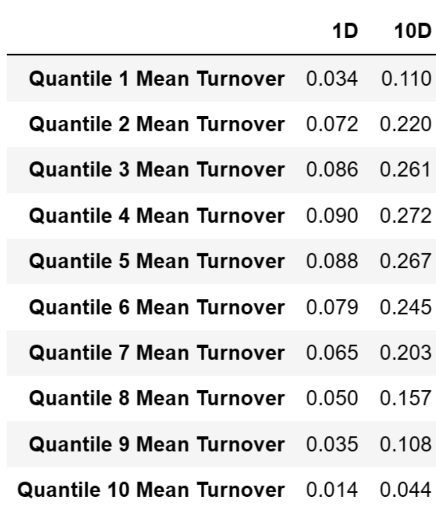
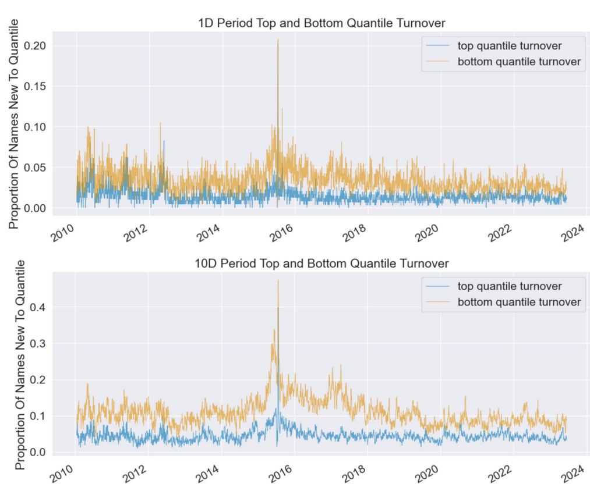
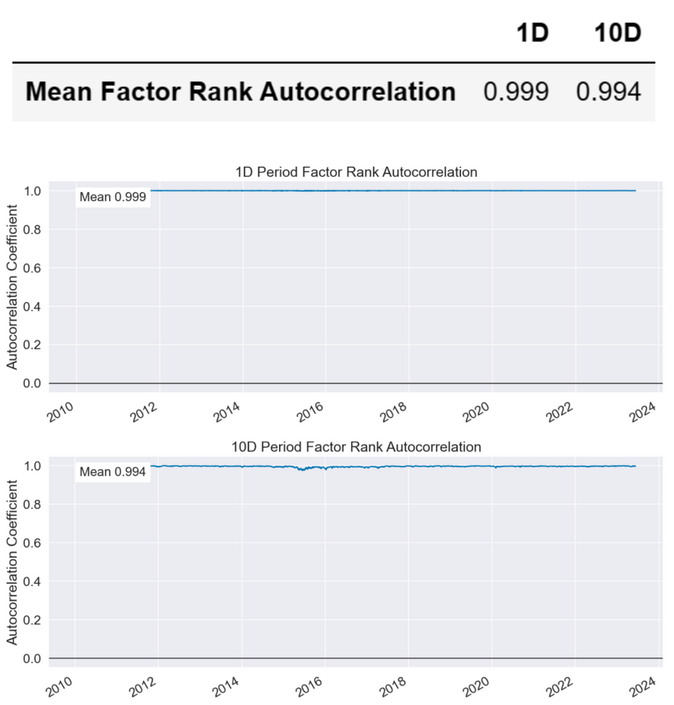

# 从零学量化64—量化因子评价神器Alphalens库详解（四）：因子换手率 

在《因子评价神器Alphalens库详解（一）：数据准备》这篇文章中，我们对Alphalens库做了个总体的介绍，Alphalens对因子性能的评价主要有三部分：

1）因子分组收益的评价；

2）因子信息系数（IC）的评价；

3）因子换手率的评价。

在《量化因子评价神器Alphalens库详解（二）：因子分组收益》和《量化因子评价神器Alphalens库详解（三）：因子IC》这两篇文章中，我们详细介绍了因子的分组收益评价和IC评价。本文将继续以市值因子为例，详细介绍因子换手率的评价。因子换手率评价是通过调用Alphalens库的create_turnover_tear_sheet函数完成的。关于什么是因子换手率的评价，请参见《解析因子评价：如何选择最佳的投资因子》一节。

## 01 调用create_turnover_tear_sheet函数
### 1. 在调用create_turnover_tear_sheet函数之前，先要获取因子值数据和股票的交易价格数据，然后用Alphalens的get_clean_factor_and_forward_returns函数来预处理因子数据，得到符合Alphalens格式要求的数据factor_data。
具体的因子数据和数据预处理参见《因子评价神器Alphalens库详解（一）：数据准备》一节，这里不再赘述。
### 2. 得到符合Alphalens格式要求的数据factor_data后，就可以调create_turnover_tear_sheet函数生成因子换手率的评价报告：
```python 

al.tears.create_turnover_tear_sheet(factor_data)

```

初学者建议使用Jupyter Notebook运行Alphalens，在其他的Python编辑器中可能有些图表的显示会出现问题。

##  02 因子换手率评价报告解析
对create_turnover_tear_sheet函数生成的因子换手率评价报告逐一解析如下：

### 1. 分组换手率统计结果
   


换手率用来衡量投资组合的成分变动程度。具体来说，它度量的是投资组合在一定时间内的买入和卖出的股票数量占投资组合总股票数量的比例。一个高换手率意味着投资组合经常进行买卖交易，反之则表示投资组合的交易较少。

上面的表格展示了不同因子分组（例如，因子值最大的组合，因子值最小的组合等）在1D（1天）和10D（10天）两个周期的平均换手率，这可以帮助你理解不同因子值的股票组合的交易活跃度是如何分布的。

### 2. Top and Bottom Quantile Turnover



这个图是用来展示因子最大值（头部）和最小值（尾部）对应的股票组合的换手率。在多空策略中，这两组股票通常是需要实际交易的做多和做空的对象。

在这个图中，X轴表示时间，Y轴表示换手率。它会展示两条线，一条表示头部股票组合的换手率，另一条表示尾部股票组合的换手率。这样，我们可以清楚地看到在不同时间点，这两组股票的换手率是如何变化的。

这个图对于投资策略的设计和执行非常重要。高换手率可能意味着频繁的交易，这将导致较高的交易成本，包括手续费和市场冲击成本。这些额外的成本可能会大大降低策略的净收益。因此，通过观察这个图，我们可以对策略的交易成本有一个初步的估计，从而帮助我们更好地设计和优化我们的投资策略。

### 3. Factor Rank Autocorrelation



该图用于展示因子排名的自相关性，即因子排名在不同时间间隔的相关程度。

在这个图中，X轴代表时间，Y轴代表自相关系数。图中的每一个点代表在某个时间点，因子的当前排名与之前排名的相关性。自相关系数的范围是[-1, 1]，1表示完全正相关，-1表示完全负相关，0表示无关。

自相关系数可以帮助我们理解因子值的稳定性。如果一个因子的自相关系数较高，那么这个因子的排名可能会在时间上比较稳定，换手率可能较低。反之，如果一个因子的自相关系数较低，那么这个因子的排名可能会频繁变动，换手率可能较高。

需要注意的是，因子的自相关性并不直接影响其预测未来收益的能力，但它可以影响到我们策略的交易成本。如果一个因子的换手率较高，那么我们可能需要频繁地调整投资组合，这可能会带来较高的交易成本。

在本节中，我们详细解析了Alphalens库中create_turnover_tear_sheet函数输出的各项图表，这些工具可以帮助我们理解因子值对应的股票组合的交易活跃度以及因子排名的稳定性。

换手率是一个重要的指标，因为它直接影响到投资策略的交易成本。一个高换手率可能意味着频繁的交易，这将导致较高的交易成本，从而降低投资组合的净收益。因此，理解和管理换手率是量化投资策略中的一个重要环节。

同时，我们也需要注意，尽管换手率和交易成本对投资收益有重要影响，但它们并不直接决定因子的预测能力。我们需要结合其他的信息和工具，如因子的分组测试、IC分析等，来评估一个因子的整体性能。

