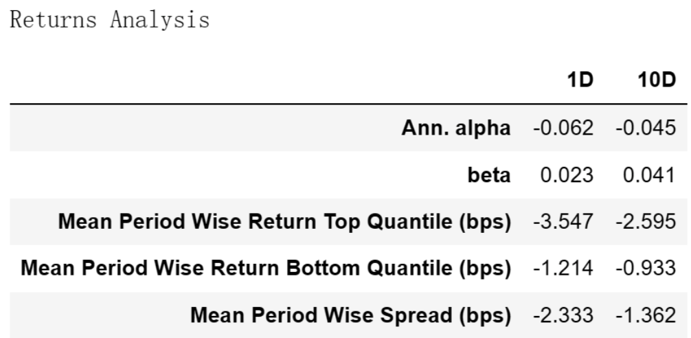
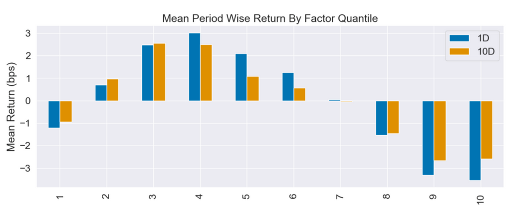
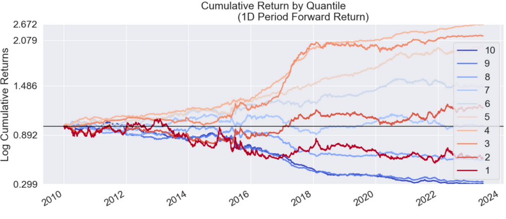
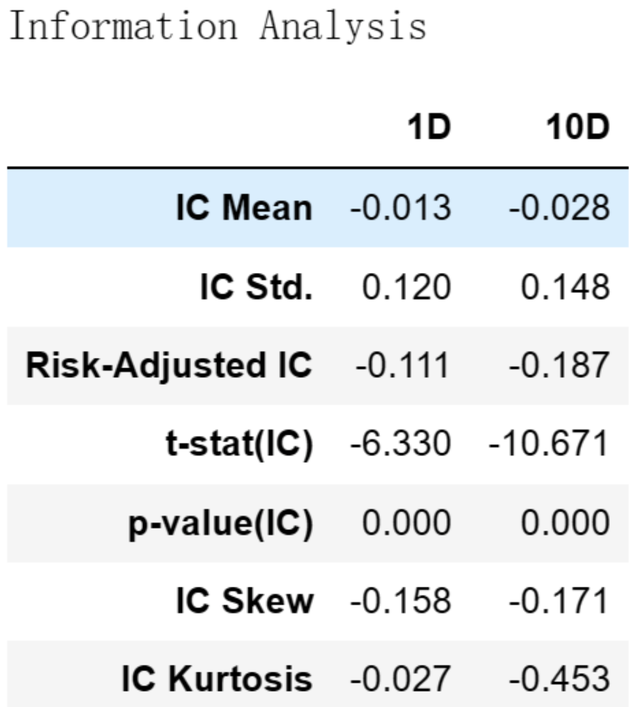

# 从零学量化68—价值因子评价：低市盈率(PE)是否仍然是价值投资的良方？ 

在上一篇文章《价值因子：从“便宜”中挖掘低估宝藏》中，我们介绍了价值因子的概念和价值因子的具体指标，本文将对价值因子的常见指标——市盈率因子进行评价。关于市盈率的介绍详见上文。

本文进行因子评价的工具为Alphalens库，Alphalens库的用法详见《量化工具箱：因子评价神器Alphalens库超详细教程》。本文进行因子评价的相关代码在上述文章中已有详细讲解，如果对这些代码不清楚的可以查看以前的文章，本文不再对代码进行过多的解释。

我为大家整理了计算和评价因子所需的全部沪深股票2010年1月1日至2023年6月30日的数据，数据文件名为：value_factor.csv，在后台回复“价值因子”可获取。

市盈率的计算可以使用最近一个年度的年报数据，也可以使用TTM数据，本文使用的是TTM数据。

当公司的盈利为负数时，市盈率（P/E）计算将会产生负值，当分母出现负值时会出现预料之外的结果。常见的处理方法有删除市盈率为负的数据和使用市盈率的倒数（E/P），本文采用的方法为删除市盈率为负的数据。

## 01 使用Alphalens库进行因子评价的代码

```python 


# 导入相关的库
import numpy as np
import pandas as pd
import statsmodels.api as sm
import alphalens as al

# 关闭警告信息
import warnings
warnings.filterwarnings('ignore')

# 从CSV文件读取数据
file_path = 'e:temp/value_factor.csv'  # 文件的路径和文件名，注意：此处要换成你的文件地址
data_df = pd.read_csv(file_path, encoding='gbk', index_col=0) 
data_df['日期'] = pd.to_datetime(data_df['日期'])  # 将日期统一为datetime格式

# 设置将要评价的因子
factor_name = 'pe_ttm'

# 生成符合Alphalens要求格式的因子值数据

factor = data_df.set_index(['日期','股票代码'])[factor_name]
# 生成符合Alphalens要求格式的交易价格数据
prices = data_df.pivot(index='日期', columns='股票代码', values='开盘价')
prices = prices.shift(-1)  # 将第二天的开盘价作为交易价格，避免用到“未来数据”

# 预处理因子数据，得到符合Alphalens需要的数据格式。
factor_data = al.utils.get_clean_factor_and_forward_returns(
    factor=factor,
    prices=prices,
    quantiles=10,
    periods=(1, 10))
    
# 生成因子性能报告
al.tears.create_full_tear_sheet(factor_data)


```

在上述因子评价的代码中，我们按因子值将全部股票等分为10组。

## 02 市盈率因子评价分析
Alphalens生成的因子评价内容很多，这里选主要内容分析如下：
### 一、因子收益率分析



这个表格是一个收益分析报告，它展示了因子在1天(1D)和10天(10D)的时间区间内的表现。

在 Returns Analysis 表中：

#### 1. "Ann. alpha"（年化 alpha）
表示在控制市场风险后，该因子每年能带来的超额收益。在这个例子中，1D 和 10D 的年化 alpha 均为负，这意味着在控制市场风险后，该因子并未带来超额收益，反而产生了亏损。
##### 2. "beta" 
表示该因子的市场风险。在这个例子中，1D 和 10D 的 beta 都比较低，这意味着该因子的收益与市场收益的相关性较低。
#### 3. "Mean Period Wise Return Top Quantile (bps)" 和 "Mean Period Wise Return Bottom Quantile (bps)" 
分别表示选取因子值最高和最低的股票组合的平均收益。在这个例子中，这两个指标都为负，这意味着无论是选取因子值最高还是最低的股票，都无法获得正的收益。
#### 4. "Mean Period Wise Spread (bps)" 
表示选取因子值最高和最低的股票组合的收益差异。在这个例子中，该指标为负，这意味着选取市盈率最高的股票的收益低于选取市盈率最低的股票的收益，这个符合大家对市盈率因子的常规理解。

### 二、因子分组收益情况
#### 1. Mean Period Wise Return By Factor Quantile：



这张图展示了不同因子分组在未来1、10期的平均收益率。图的X轴为因子分组，Y轴为每组的平均收益率。

Alphalens的收益默认是做市场中性处理的，即这里的收益率为"超额收益率"，指在截面上对所有股票收益率做中心化处理后的收益率。
具体来说，因子被分成十组，每组包含相同数量的股票。然后，计算每组在未来1、10期的平均收益率，并减去所有股票收益率的平均值，得到超额收益率。
#### 2. Cumulative Return by Quantile：



该图展示的是各个因子分组的累计收益。在这个图表中，我们关注的是每个分组在不同时间段的收益表现。这个图表中可以帮助我们更好地理解因子在不同分组的表现。

与前面相同，Alphalens的收益默认是做市场中性处理的，即在计算收益时，会扣除所有股票的整体均值，这样可以消除市场整体的影响。
#### 3. 因子的分组收益评价：

1）在这个例子中，因子值最高（第10分位）和最低（第1分位）的股票的收益都为负，这进一步证明了该市盈率因子的预测效果不佳。

2）无论是在短期（1天）还是较长期（10天），该因子的top组和bottom组都无法带来超额收益，反而产生了亏损。此外，该因子的收益与市场收益的相关性较低，这意味着该因子可能无法有效地捕捉市场风险，这个市盈率因子的表现不尽人意。

3）对于1天的持有期（1D），第4分位的收益率最高；对于10天的持有期（10D），第3分位的收益率最高。这个结果可能有多种解读：

- a）市盈率因子的非线性关系：
在理想的情况下，如果市盈率是一个有效的预测因子，那么我们期待的是市盈率越低（或者越高），相应的股票收益率应该越高（或者越低）。然而在这个例子中，收益率最高的并不是市盈率最低或者最高的股票，而是处于中间区域的股票。这可能意味着市盈率与股票收益率之间存在非线性的关系，也就是说，市盈率过高或者过低的股票并不一定能带来最高的收益。
- b）市盈率因子的局限性：
在这个例子中，市盈率最高和最低的股票的收益率都不高，这可能反映了市盈率因子的局限性，它可能无法准确地预测未来的收益。此外，由于市盈率也受到公司的财务政策、行业特性等多种因素的影响，因此它可能无法单独用来预测股票的收益。
### 三、因子IC值分析



Information Analysis表反映了因子预测收益能力的统计信息。
#### 1. IC Mean
IC（Information Coefficient）是衡量因子预测能力的一个指标，IC Mean 就是 IC 的平均值。在这个例子中，1D 和 10D 的 IC Mean 均为负，这意味着该因子为一个反向因子，即：因子值越小未来收益越高，这符合大家对PE的常规认识。。
#### 2. IC Std
IC 的标准差，衡量 IC 的波动性。在这个例子中，1D 和 10D 的 IC Std 都比较高，这意味着该因子的预测能力具有较大的不稳定性。
#### 3. Risk-Adjusted IC
风险调整后的 IC，是 IC Mean 除以 IC Std。这个值越大，说明因子的预测能力越强。在这个例子中，1D 和 10D 的 Risk-Adjusted IC 均为负，且值不高，这意味着市盈率因子为反向因子，但预测能力较差。

总的来说，这些结果表明，该市盈率因子的预测能力较差，而且该因子的预测能力具有较大的不稳定性。可能需要重新考虑是否使用该因子或者将该因子与其他因子相结合。