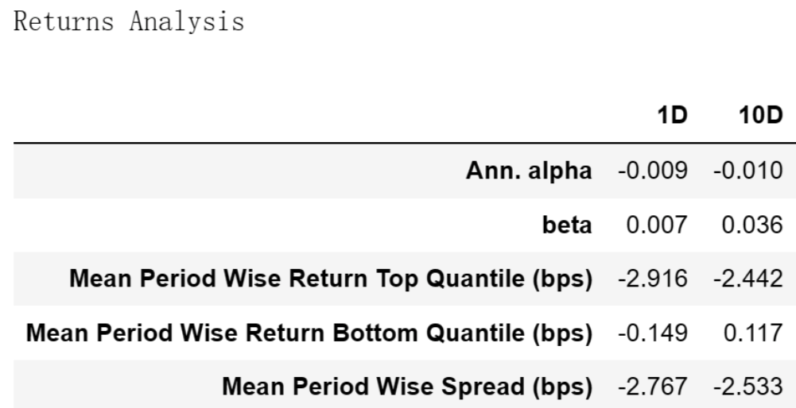
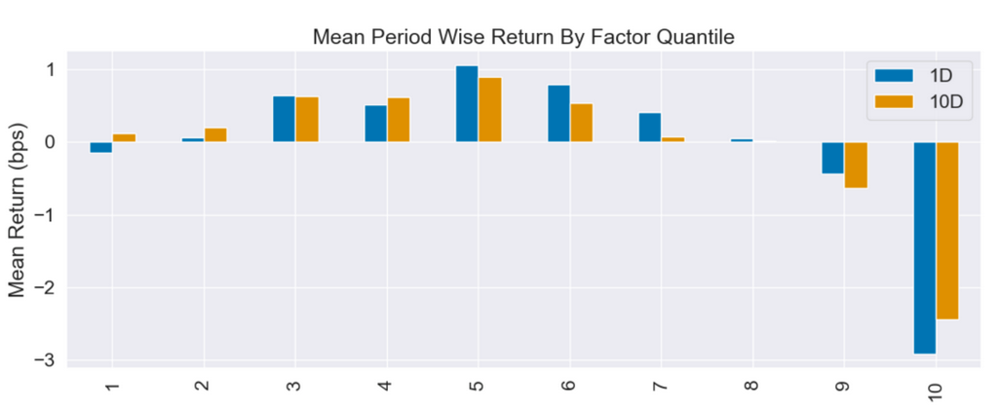
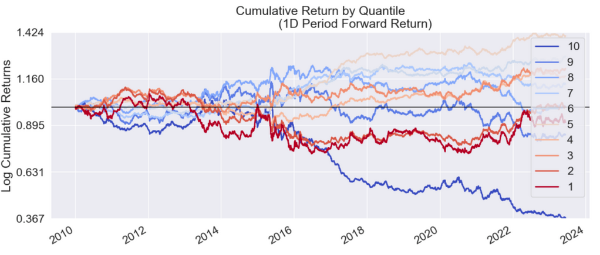
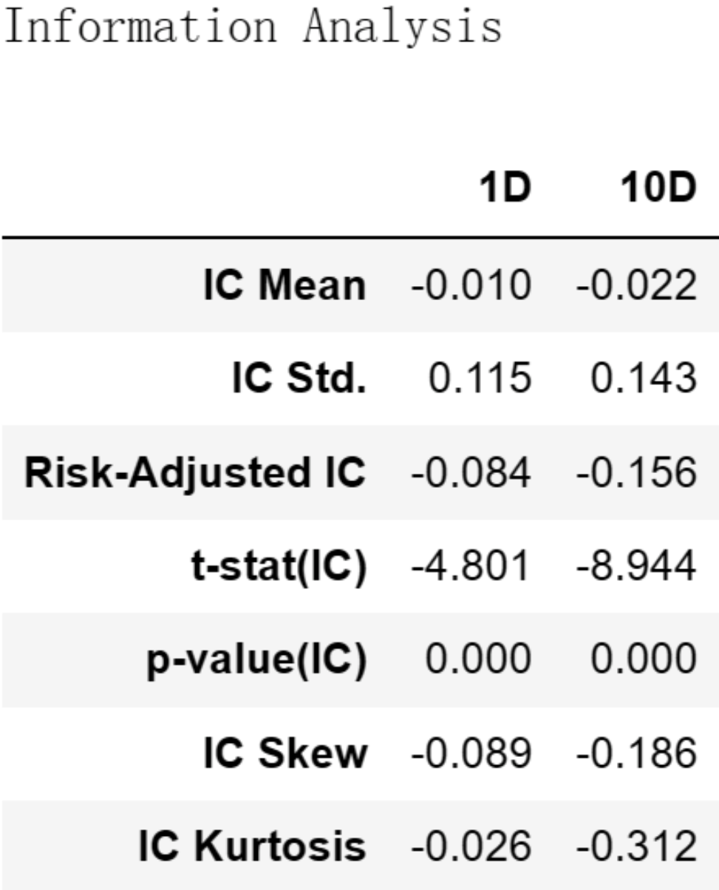

# 从零学量化69—价值因子评价：低市销率(PS)真的具有投资价值吗？

在上一篇文章《价值因子：从“便宜”中挖掘低估宝藏》中，我们介绍了价值因子的概念和价值因子的具体指标，本文将对价值因子的常见指标——市销率因子进行评价。关于市销率的介绍详见上文。

本文进行因子评价的工具为Alphalens库，Alphalens库的用法详见《量化工具箱：因子评价神器Alphalens库超详细教程》。本文进行因子评价的相关代码在上述文章中已有详细讲解，如果对这些代码不清楚的可以查看以前的文章，本文不再对代码进行过多的解释。

我为大家整理了计算和评价因子所需的全部沪深股票2010年1月1日至2023年6月30日的数据，数据文件名为：value_factor.csv，在后台回复“价值因子”可获取。

市销率的计算可以使用最近一个年度的年报数据，也可以使用TTM数据，本文使用的是TTM数据。
## 01 使用Alphalens库进行因子评价的代码

```python 

# 导入相关的库
import numpy as np
import pandas as pd
import statsmodels.api as sm
import alphalens as al

# 关闭警告信息
import warnings
warnings.filterwarnings('ignore')

# 从CSV文件读取数据
file_path = 'e:temp/value_factor.csv'  # 文件的路径和文件名，注意：此处要换成你的文件地址
data_df = pd.read_csv(file_path, encoding='gbk', index_col=0) 
data_df['日期'] = pd.to_datetime(data_df['日期'])  # 将日期统一为datetime格式

# 设置将要评价的因子
factor_name = 'ps_ttm'

# 生成符合Alphalens要求格式的因子值数据

factor = data_df.set_index(['日期','股票代码'])[factor_name]
# 生成符合Alphalens要求格式的交易价格数据
prices = data_df.pivot(index='日期', columns='股票代码', values='开盘价')
prices = prices.shift(-1)  # 将第二天的开盘价作为交易价格，避免用到“未来数据”

# 预处理因子数据，得到符合Alphalens需要的数据格式。
factor_data = al.utils.get_clean_factor_and_forward_returns(
    factor=factor,
    prices=prices,
    quantiles=10,
    periods=(1, 10))
    
# 生成因子性能报告
al.tears.create_full_tear_sheet(factor_data)

```

在上述因子评价的代码中，我们按因子值将全部股票等分为10组。

## 02 市销率因子评价分析
Alphalens生成的因子评价内容很多，这里选主要内容分析如下：
### 一、因子收益率分析



这个表格是一个收益分析报告，它展示了因子在1天(1D)和10天(10D)的时间区间内的表现。

在 Returns Analysis 表中：
#### 1. Ann. alpha:
这是年化 alpha，也就是因子在控制了市场风险之后的超额收益。这里，1D 和 10D 的年化 alpha 都是负的，说明这个因子在控制了市场风险之后并没有实现超额收益，其表现不佳。
#### 2. beta:
Beta 值大于 1，意味着投资的价格通常比市场更敏感，波动性更大；Beta 值小于 1，意味着投资的价格通常比市场不敏感，波动性较小。在上述信息中，1D 和 10D 的 Beta 值都比较小（0.007 和 0.036）。这表明该因子对市场的敏感性较小，即市场整体的变动对该因子的影响较小。
#### 3. Mean Period Wise Return Top Quantile (bps):
这是最高分位（Quantile）的平均期间回报。这里，1D 和 10D 的回报都是负的，说明该因子的最高分位组的平均回报是负的，即最高分位组的表现不佳。
#### 4. Mean Period Wise Return Bottom Quantile (bps):
这是最低分位（Quantile）的平均期间回报。这里，1D 的回报是负的，10D 的回报是正的，说明该因子的最低分位组的平均回报情况并不稳定。
#### 5. Mean Period Wise Spread (bps):
这是最高分位和最低分位之间的平均期间回报差距。这里，1D 和 10D 的差距都是负的，说明该因子的最高分位组的平均回报低于最低分位组的平均回报，即：市销率最高组的平均回报低于市销率最低的一组的平均回报，这符合大家对实现率的通常认知。

整体看来，市销率因子的表现并不佳。在控制了市场风险之后，该因子并没有实现超额收益。
### 二、因子分组收益情况
#### 1. Mean Period Wise Return By Factor Quantile：



这张图展示了不同因子分组在未来1、10期的平均收益率。图的X轴为因子分组，Y轴为每组的平均收益率。

Alphalens的收益默认是做市场中性处理的，即这里的收益率为"超额收益率"，指在截面上对所有股票收益率做中心化处理后的收益率。

具体来说，因子被分成十组，每组包含相同数量的股票。然后，计算每组在未来1、10期的平均收益率，并减去所有股票收益率的平均值，得到超额收益率。

#### 2. Cumulative Return by Quantile：



该图展示的是各个因子分组的累计收益。在这个图表中，我们关注的是每个分组在不同时间段的收益表现。这个图表中可以帮助我们更好地理解因子在不同分组的表现。

与前面相同，Alphalens的收益默认是做市场中性处理的，即在计算收益时，会扣除所有股票的整体均值，这样可以消除市场整体的影响。
#### 3. 因子的分组收益评价：
从上述两张图中我们可以看到，从第1分位数到第5分位数，平均回报基本上是随着因子值的增加而增加的。但是，从第6分位数开始，平均回报开始下降，直到第10分位数，平均回报变为负。

因子第5分组的收益最高，而向两边均为递减，这通常被称为 "因子收益分布" 出现了倒U形或者山顶形状。这种现象可能表明因子收益和因子值的关系并非简单的线性关系，而是存在一种更复杂的非线性关系。

在实践中，这种现象可能有以下几种解释：

1）过度估值或过度抑价：对于市销率因子，过高的因子值可能代表过度估值；而过低的因子值可能代表过度抑价的情况。在这种情况下，中等的因子值可能会提供最佳的投资机会，因为它们既没有被过度估值，也没有被过度抑价。

2）非线性因子暴露：因子暴露和回报之间的关系可能是非线性的。这种情况下，中等的因子值可能会提供最佳的投资机会。
### 三、因子IC值分析



Information Analysis表反映了因子预测收益能力的统计信息。
#### 1. IC Mean
这是信息系数 (Information Coefficient, IC) 的平均值。IC 是因子值和未来收益之间的相关性。在上述信息中，1D 和 10D 的 IC Mean 都是负的（-0.010 和 -0.022），这表明市销率因子和未来收益是负相关的，也就是说，市销率因子较高的股票未来的收益往往较低。这与我们通常对市销率的理解相符，因为市销率较低通常被认为是更有吸引力的投资。

但 IC Mean 的值比较低，这说明因子值和未来收益的相关性不高，因子的预测能力不强。
#### 2. IC Std.
这是 IC 的标准差，用于衡量 IC 的波动性。在上述信息中，1D 的 IC Std. 是 0.115，10D 的 IC Std. 是 0.143，这表示 IC 的波动性相对较大。
#### 3. Risk-Adjusted IC
这是风险调整后的 IC，即 IC 和其标准差的比值。它衡量了单位风险下的预测能力。在上述信息中，1D 和 10D 的 Risk-Adjusted IC 都是负的，且绝对值不高，这进一步证实了市销率因子是一个逆向因子，但预测能力不佳。

总的来说，这些数据表明市销率因子的预测能力不佳，可能需要重新考虑是否应该使用这个因子或将该因子跟其他因子结合使用。