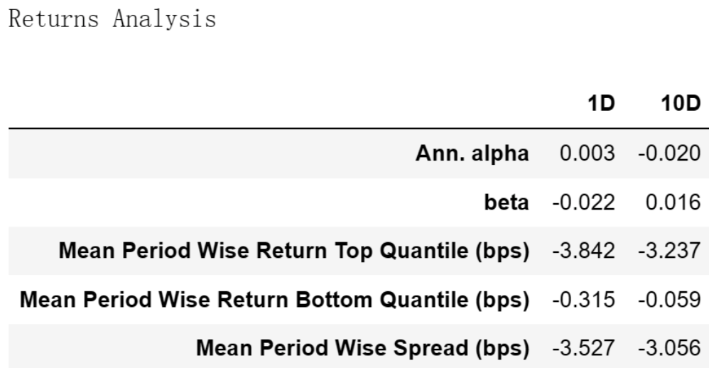
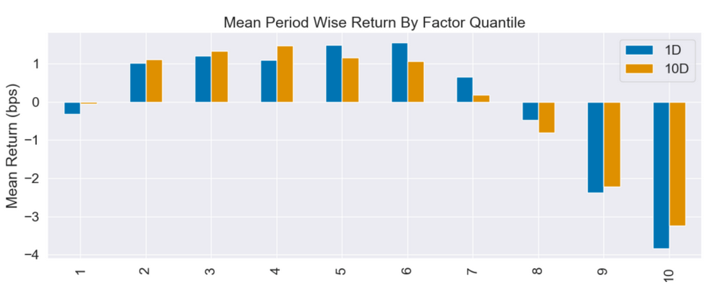
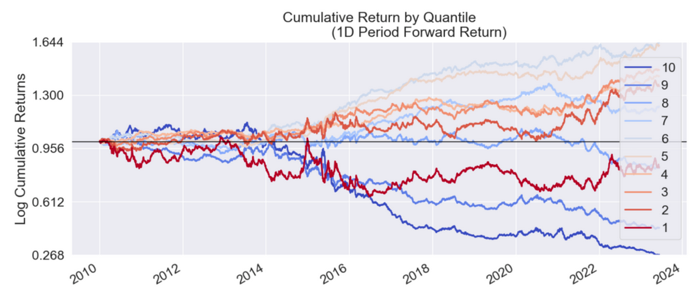
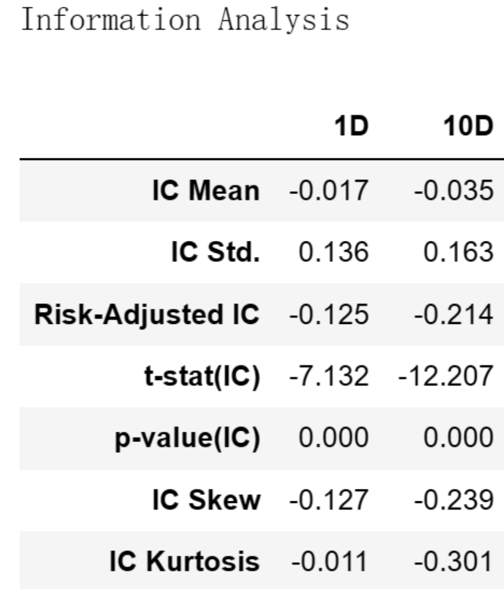

# 从零学量化70—价值因子评价：低市净率(PB)是否已经过时？

在上一篇文章《价值因子：从“便宜”中挖掘低估宝藏》中，我们介绍了价值因子的概念和价值因子的具体指标，本文将对价值因子的常见指标——市净率因子进行评价。关于市净率的介绍详见上文。

本文进行因子评价的工具为Alphalens库，Alphalens库的用法详见《量化工具箱：因子评价神器Alphalens库超详细教程》。本文进行因子评价的相关代码在上述文章中已有详细讲解，如果对这些代码不清楚的可以查看以前的文章，本文不再对代码进行过多的解释。

我为大家整理了计算和评价因子所需的全部沪深股票2010年1月1日至2023年6月30日的数据，数据文件名为：value_factor.csv，在后台回复“价值因子”可获取。

市净率的计算可以使用最近一个年度的年报数据，也可以使用TTM数据，本文使用的是TTM数据。

## 01 使用Alphalens库进行因子评价的代码

```python 

# 导入相关的库
import numpy as np
import pandas as pd
import statsmodels.api as sm
import alphalens as al

# 关闭警告信息
import warnings
warnings.filterwarnings('ignore')

# 从CSV文件读取数据
file_path = 'e:temp/value_factor.csv'  # 文件的路径和文件名，注意：此处要换成你的文件地址
data_df = pd.read_csv(file_path, encoding='gbk', index_col=0) 
data_df['日期'] = pd.to_datetime(data_df['日期'])  # 将日期统一为datetime格式

# 设置将要评价的因子
factor_name = 'pb'

# 生成符合Alphalens要求格式的因子值数据

factor = data_df.set_index(['日期','股票代码'])[factor_name]
# 生成符合Alphalens要求格式的交易价格数据
prices = data_df.pivot(index='日期', columns='股票代码', values='开盘价')
prices = prices.shift(-1)  # 将第二天的开盘价作为交易价格，避免用到“未来数据”

# 预处理因子数据，得到符合Alphalens需要的数据格式。
factor_data = al.utils.get_clean_factor_and_forward_returns(
    factor=factor,
    prices=prices,
    quantiles=10,
    periods=(1, 10))
    
# 生成因子性能报告
al.tears.create_full_tear_sheet(factor_data)

```

在上述因子评价的代码中，我们按因子值将全部股票等分为10组。

## 02 市净率因子评价分析
Alphalens生成的因子评价内容很多，这里选主要内容分析如下：
### 一、因子收益率分析



这个表格是一个收益分析报告，它展示了因子在1天(1D)和10天(10D)的时间区间内的表现。

在 Returns Analysis 表中：
#### 1. Ann. alpha
这是年化阿尔法。阿尔法是超过基准指数或者市场平均收益的部分。在上述信息中，1D 的年化阿尔法是 0.003，这表示在考虑市场风险后，市净率因子在一天的持有期内能带来0.3%的超额收益。然而，10D 的年化阿尔法是 -0.020，这表示在十天的持有期内，市净率因子实际上带来了-2%的超额收益。这表明市净率因子的阿尔法并不稳定。
#### 2. beta
这是市净率因子的贝塔系数，衡量了市净率因子与市场收益的关系。在上述信息中，1D 的贝塔系数是 -0.022，这表示市净率因子与市场收益呈负相关，当市场收益增加时，市净率因子的收益可能会下降。而10D 的贝塔系数是 0.016，这表示市净率因子与市场收益呈正相关。这表明市净率因子的贝塔也不稳定。
#### 3. Mean Period Wise Return Top Quantile (bps)
这是最高分位数组的平均周期回报（以基点表示）。在上述信息中，1D 和 10D 的这一指标都是负的（-3.842 和 -3.237），这表示市净率因子最高的股票组在一天和十天的持有期内的平均收益都是负的。
#### 4. Mean Period Wise Return Bottom Quantile (bps)
这是最低分位数组的平均周期回报（以基点表示）。在上述信息中，1D 和 10D 的这一指标也都是负的（-0.315 和 -0.059），这表示市净率因子最低的股票组在一天和十天的持有期内的平均收益也是负的。
#### 5. Mean Period Wise Spread (bps)
这是最高和最低分位数组的平均周期回报之差（以基点表示），也可以理解为因子投资的策略收益。在上述信息中，1D 和 10D 的这一指标都是负的，这表示市净率是一个反向因子，即市净率高的股票组的收益低于市净率低的股票组，这符合大家对市净率的通常认知。

总的来说，这些数据表明市净率因子的表现不佳。
### 二、因子分组收益情况
#### 1. Mean Period Wise Return By Factor Quantile：



这张图展示了不同因子分组在未来1、10期的平均收益率。图的X轴为因子分组，Y轴为每组的平均收益率。

Alphalens的收益默认是做市场中性处理的，即这里的收益率为"超额收益率"，指在截面上对所有股票收益率做中心化处理后的收益率。

具体来说，因子被分成十组，每组包含相同数量的股票。然后，计算每组在未来1、10期的平均收益率，并减去所有股票收益率的平均值，得到超额收益率。
#### 2. Cumulative Return by Quantile：



该图展示的是各个因子分组的累计收益。在这个图表中，我们关注的是每个分组在不同时间段的收益表现。这个图表中可以帮助我们更好地理解因子在不同分组的表现。

与前面相同，Alphalens的收益默认是做市场中性处理的，即在计算收益时，会扣除所有股票的整体均值，这样可以消除市场整体的影响。
#### 3. 因子的分组收益评价：
根据上述图表信息，我们可以对市净率因子的表现进行评价：
不管是在1天的持有期内，还是在在10天的持有期内，第1分位数（市净率最小的10%的股票）的平均收益是负数。而第10分位数（市净率最大的10%的股票）的平均收益也是负数。但是，从第2分位数到第6分位数，市净率因子的平均收益是正的，并且随着市净率的增加，收益率在一定程度上也有所增加。然后，从第7分位数开始，收益率开始下降，而市净率最高的两个分位数的收益率是负的。

这些数据表明市净率因子在1天和10天的持有期内的表现并不稳定。市净率中等的股票表现较好，而市净率最高和最低的股票表现较差。这可能表明市场对市净率过高或过低的股票评价不高，而对市净率中等的股票评价较高。这种现象可能由几个原因造成：

- 1）市场非理性：投资者可能对市净率异常高或低的股票表现出过度的乐观或悲观情绪，导致这些股票的价格偏离其内在价值。然后，随着时间的推移，这些股票的价格可能会回归到其内在价值，导致收益率下降。
- 2）风险溢价：市净率过高或过低的股票可能面临更大的风险，例如财务风险、市场风险等。而投资者可能需要更高的风险溢价来补偿这些风险，导致这些股票的收益率下降。
- 3）公司基本面：市净率过高的股票可能属于成长性较强但收益未能及时反映的公司，市净率过低的股票可能属于基本面较差的公司。这两种类型的公司可能都难以带来持续的高收益。
- 4）对于递减更明显的右边（市净率较高的部分），可能是市场对过高的市净率（即股票价格相对于账面价值过高）有更强烈的负面反应，可能由于投资者对这些公司的未来成长预期降低，或者对这些公司的风险感知增加。


### 三、因子IC值分析



Information Analysis表反映了因子预测收益能力的统计信息。从上述数据来看，可以提供以下几点评价：
#### 1. IC Mean（信息系数均值）：
信息系数（IC）是用来衡量预测能力的一种工具，它表示预测因子和实际结果之间的相关性。在上述数据中，1D和10D的 IC Mean 均值都是负的，分别为 -0.017 和 -0.035。这意味着市净率因子的预测和实际结果之间是负相关的，即市净率越高，实际收益率越低，反之亦然。这种负相关性跟大家的通常认知是相符的。

1D 的  IC Mean 绝对值值比较小，说明相关性比较弱。相比之下 10D 的 IC Mean 绝对值高于3%，有一定的参考意义。
#### 2. IC Std.（信息系数标准差）：
这是信息系数的标准差，用于衡量预测值和实际值之间的差异程度。在上述数据中，1D和10D的 IC Std. 分别为 0.136 和 0.163，这意味着市净率因子的预测能力的波动性比较大。
#### 3. Risk-Adjusted IC（风险调整后的信息系数）：
这是考虑了风险因素后的信息系数（即：IR值）。在上述数据中，1D和10D的风险调整后的信息系数都是负的，分别是 -0.125 和 -0.214，这两个值都不高，这进一步表明市净率因子的预测能力并不理想。