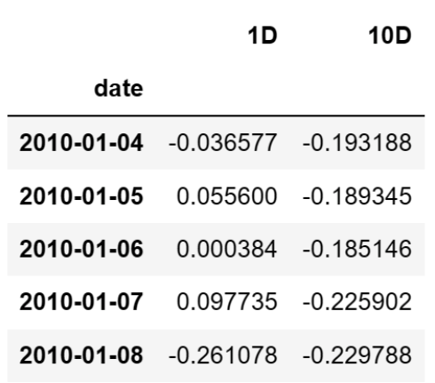
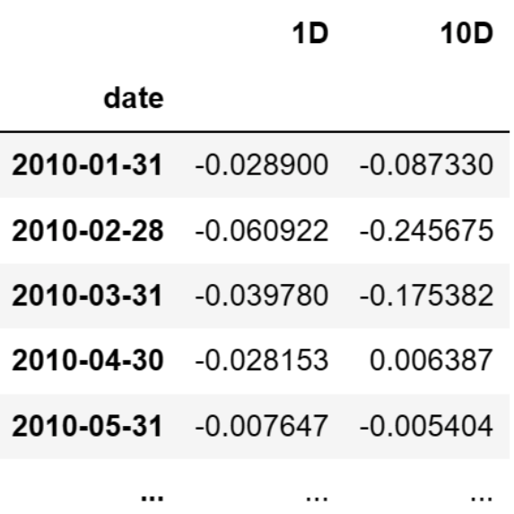
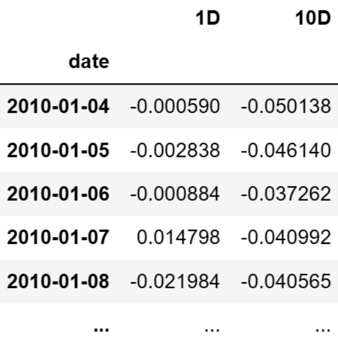
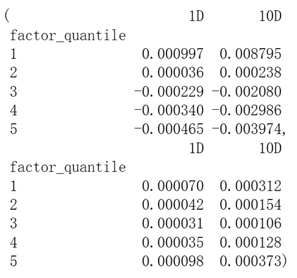
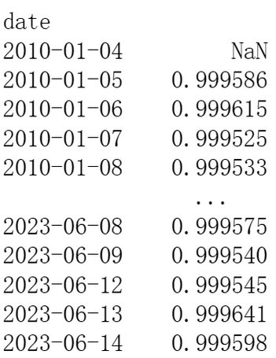

# 从零学量化71—量化因子评价神器Alphalens库详解（五）：因子性能函数 

在前面的文章中，我们介绍了Alphalens库在因子分组收益评价、因子信息系数（IC）评价、因子换手率评价中的应用，这些应用是通过调用Alphalens库tears模块中的相关函数完成的。tears模块的函数可以生成图文并茂的评价报告，包含各种精美的图表，例如累积收益曲线、分位数收益图、换手率图等，这些可视化工具可以帮助我们直观地理解因子的性能。

除了这些可视化的图表，Alphalens库还能够生成因子评价的各种数据，这些数据是通过调用performance模块的相关函数完成的。这些数据虽然没有图表这么直观，但对我们分析因子性能也很有用。例如我们可以通过《分组收益曲线图》观察因子各分组的收益，但有时我们还需要各期收益的具体数据，这就要通过调用performance模块的函数来实现。

本文将介绍performance模块的主要函数。

在调用performance模块的函数之前，先要获取因子值数据和股票的交易价格数据，然后用Alphalens的get_clean_factor_and_forward_returns函数来预处理因子数据，得到符合Alphalens格式要求的数据factor_data。

具体的因子数据和数据预处理参见《因子评价神器Alphalens库详解（一）：数据准备》一节，这里不再赘述。

performance模块的函数的调用方法示例如下：

```python 

import alphalens as al
al.performance.factor_information_coefficient(factor_data)

```

performance模块的主要因子性能函数如下：
### 1. factor_information_coefficient
函数定义

```python 

factor_information_coefficient(factor_data, 
    group_adjust=False, 
    by_group=False)

```

函数作用

该函数用于计算因子值和N期向前收益率之间的斯皮尔曼等级相关系数，也被称为信息系数（IC）。这个计算会在因子索引的每个期间内进行。

参数解释

- factor_data : pd.DataFrame - MultiIndex
- 这是一个由日期（第一级）和资产（第二级）索引的 MultiIndex DataFrame，它包含单个 alpha 因子的值、每个期间的向前收益率、因子值所属的因子分位数/分箱，以及（可选）资产所属的组别。可以在 utils.get_clean_factor_and_forward_returns 函数中看到完整的解释。
- group_adjust : bool
- 如果为真，那么在计算信息系数（IC）之前，将按组别调整（即去均值）向前收益。
- by_group : bool
- 如果为真，那么将为每个组别分别计算每个期间的信息系数（IC），而不是计算所有股票在每个期间的总体信息系数。这样可以帮助我们理解在不同组别（例如不同行业的股票）中，因子的预测能力是否存在差异。
函数返回值
- ic : pd.DataFrame
- 这个 DataFrame 是因子和提供的向前收益之间的斯皮尔曼等级相关系数。简单来说，它衡量的是因子预测能力的强弱，值越大则预测能力越强。这个 DataFrame 的索引是因子数据的日期，每一列代表一个特定的调仓期间。如果 by_group 参数为 True，那么 DataFrame 的索引将包含一个额外的级别，即组别。
- 示例：



### 2. mean_information_coefficient

函数定义

```python 

mean_information_coefficient(factor_data, 
    group_adjust=False, 
    by_group=False, 
    by_time=None)

```

函数作用

该函数用于计算指定调仓周期的平均信息系数（Mean Information Coefficient）。这个函数可以回答如下问题：
- 每个月的平均信息系数是多少？
- 在我们的整个时间范围内，每个调仓周期的平均信息系数是多少？
- 每个组别，每周的平均信息系数是多少？

参数解释
- factor_data : pd.DataFrame - MultiIndex
- 这是一个由日期（第一级）和资产（第二级）索引的 MultiIndex DataFrame，它包含单个 alpha 因子的值、每个期间的向前收益率、因子值所属的因子分位数/分箱，以及（可选）资产所属的组别。可以在 utils.get_clean_factor_and_forward_returns 函数中看到完整的解释。
- group_adjust : bool
- 如果为真，那么在计算信息系数（IC）之前，将按组别调整（即去均值）向前收益。
- by_group : bool
- 如果为真，那么将为每个组别分别计算平均信息系数。
- by_time : str (pd time_rule), optional
- 用于计算平均信息系数时使用的时间窗口。此参数允许你按照一定的时间规则对数据进行分组，然后在每个分组内计算平均信息系数。这有利于我们了解在不同时间段内因子的平均预测能力如何变化。例如，你可能想要了解每个月、每个季度、每年的平均信息系数，以此来观察因子的表现是否随时间发生变化。
- 参数 by_time 的值应该是一个 pandas 时间规则（time rule）字符串。例如，你可以使用 'M' 来表示每月，'Q' 来表示每季度，'A' 来表示每年。Pandas 提供了一系列的时间规则，你可以在 Pandas 时间序列文档 中查看所有可用选项。
- 如果你不提供 by_time 参数，那么函数将计算所有数据的平均信息系数。

函数返回值
- ic : pd.DataFrame
- 这个 DataFrame 是因子和提供的向前收益之间的平均斯皮尔曼等级相关系数，也就是平均信息系数（Mean IC）。如果 by_group 和 by_time 都被设置，那么这个 DataFrame 的索引将会是时间和组别，每个元素是对应时间和组别的平均信息系数。如果没有设置这两个参数，那么 ic 将是一个数字，代表所有数据的平均信息系数。
- 示例：将 by_time 设置为'M'时，返回值格式如下：
  


### 3. factor_returns
函数定义

```python 

factor_returns(factor_data, 
    demeaned=True, 
    group_adjust=False, 
    equal_weight=False, 
    by_asset=False)

```

函数作用
该函数用于计算按因子值加权的投资组合的每期收益。
参数解释
- factor_data : pd.DataFrame - MultiIndex
- 这是一个由日期（第一级）和资产（第二级）索引的 MultiIndex DataFrame，它包含单个 alpha 因子的值、每个期间的向前收益率、因子值所属的因子分位数/分箱，以及（可选）资产所属的组别。
- 可以在 utils.get_clean_factor_and_forward_returns 函数中看到完整的解释。
- demeaned : bool
- 控制如何构建因子权重。
- 可以在 performance.factor_weights 函数中看到完整的解释。
- group_adjust : bool
- 控制如何构建因子权重。
- 可以在 performance.factor_weights 函数中看到完整的解释。
- equal_weight : bool, optional
- 控制如何构建因子权重。
- 可以在 performance.factor_weights 函数中看到完整的解释。
- by_asset : bool, optional
- 如果为真，将会分别报告每个资产的回报。
函数返回值
- returns : pd.DataFrame
- 各个期间的因子回报。如果 by_asset 参数为真，那么返回的 DataFrame 的索引将包含时间和资产，每个元素表示对应时间和资产的投资回报。如果 by_asset 参数为假，那么返回的 DataFrame 的索引只有时间，每个元素表示对应时间所有资产的投资回报之和。
- 示例：
  
  

### 4. factor_alpha_beta
函数定义

```python 

factor_alpha_beta(factor_data, 
    returns=None, 
    demeaned=True, 
    group_adjust=False, 
    equal_weight=False)

```

函数作用

该 factor_alpha_beta 函数用于计算因子的 alpha（超额回报）、alpha t-stat（alpha 的显著性）以及 beta（市场暴露）。该函数通过运行回归分析，以因子整体的平均回报作为自变量，以通过因子值加权的投资组合的平均回报作为因变量，来计算这些数值。
参数解释
- factor_data : pd.DataFrame - MultiIndex
- 这是一个由日期（第一级）和资产（第二级）索引的 MultiIndex DataFrame，它包含单个 alpha 因子的值、每个期间的向前收益率、因子值所属的因子分位数/分箱，以及（可选）资产所属的组别。
- 可以在 utils.get_clean_factor_and_forward_returns 函数中看到完整的解释。
- returns : pd.DataFrame, optional
- 各个期间的因子回报。如果没有提供这个参数，那么会通过 factor_returns 函数以及传入的 'demeaned'、'group_adjust'、'equal_weight' 参数来计算这个返回值。
- demeaned : bool
- 控制如何构建用于计算 alpha/beta 的因子回报。
- 可以在 performance.factor_return 函数中看到完整的解释。
- group_adjust : bool
- 控制如何构建用于计算 alpha/beta 的因子回报。
- 可以在 performance.factor_return 函数中看到完整的解释。
- equal_weight : bool, optional
- 控制如何构建用于计算 alpha/beta 的因子回报。
- 可以在 performance.factor_return 函数中看到完整的解释。

函数返回值
- alpha_beta : pd.Series
- 一个包含给定因子和向前收益率的 alpha、beta 和 t-stat(alpha) 的列表。如果在回归过程中发生错误（例如，无法获得回归参数），那么 alpha 和 beta 将会被设为 NaN。

### 5. mean_return_by_quantile
函数定义
```python 

mean_return_by_quantile(factor_data,
   by_date=False,
   by_group=False,
   demeaned=True,
   group_adjust=False)

```

函数作用

在这个函数中，通过将因子数据按照日期，因子分位数，和（可选的）组进行分组，然后计算每个分组的平均回报和标准误差

参数解释
- factor_data : pd.DataFrame - MultiIndex
- 一个以日期（第一级）和资产（第二级）为索引的 DataFrame，包含单个 alpha 因子的值，每个期间的前向回报，因子值所属的分位数/分组，还有（可选的）资产所属的组。
- 具体解释可以参考 utils.get_clean_factor_and_forward_returns。
- by_date : bool
- 如果为 True，那么将分别为每个日期计算分位数组的回报。
- by_group : bool
- 如果为 True，那么将分别为每个组计算分位数组的回报。
- demeaned : bool
- 计算去均值化的平均回报（减去市场的平均回报）。
- group_adjust : bool
- 如果为 True，那么回报的去均值化将在组级别进行。

函数返回值
- mean_ret : pd.DataFrame
- 指定因子分位数的期间平均回报。
- std_error_ret : pd.DataFrame
- 指定分位数的回报的标准误差。
- 如果参数 by_date=False，返回整个期间的各个分组的平均回报和标准误差；如果参数 by_date=True，则返回每日的各个分组的平均回报和标准误差。
- 示例（by_date=False）：
  


### 6. factor_rank_autocorrelation

函数定义

```python 

factor_rank_autocorrelation(factor_data, period=1)

```

函数作用

该函数计算指定时间跨度内的因子排名的自相关性。这个函数主要用于量化因子在不同时间区间内的稳定性。如果因子的排名在每个时期内的变化是随机的，那么该函数的结果接近0。如果因子的排名在不同时期内保持相对稳定，那么该函数的结果接近1。

参数解释
- factor_data : pd.DataFrame - MultiIndex
- 一个 MultiIndex DataFrame，索引为日期（第一级）和资产（第二级）。它包含了单个alpha因子的值、每个时期的前向收益、因子值属于的分位数/bin，以及（可选的）资产所属的组。
- 可参考 utils.get_clean_factor_and_forward_returns 函数获取更详细的解释。
- period: int, 可选
- 用于计算自相关性的时间区间，以天为单位，默认为1天。

函数返回值
- autocorr : pd.Series
- 因子值的1周期（由 time_rule 定义）滚动自相关性。
- 示例：



