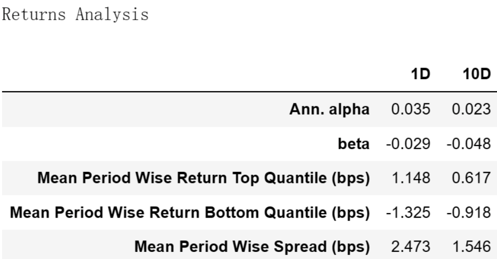
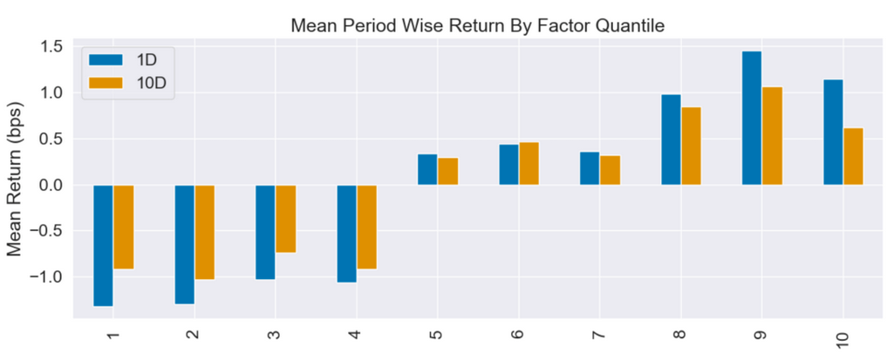
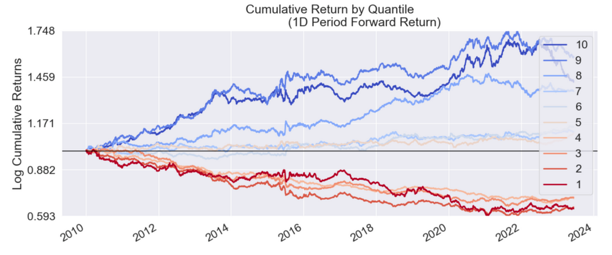
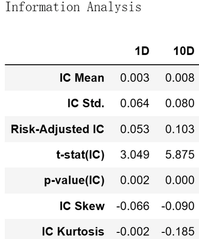

# 从零学量化73—挖掘成长股的线索：解码营业收入增长率

在前述文章《成长因子：寻找明日之星》中，我们介绍了成长因子的概念和成长因子的具体指标，本文将对成长因子的具体指标——营业收入同比增长率进行评价。关于营业收入同比增长率的介绍详见上文。

本文进行因子评价的工具为Alphalens库，Alphalens库的用法详见《量化工具箱：因子评价神器Alphalens库超详细教程》。本文进行因子评价的相关代码在上述文章中已有详细讲解，如果对这些代码不清楚的可以查看以前的文章，本文不再对代码进行过多的解释。

我为大家整理了计算和评价因子所需的全部沪深股票2010年1月1日至2023年6月30日的数据，数据文件名为：growth_factor.csv，在后台回复“成长因子”可获取。

## 01 使用Alphalens库进行因子评价的代码

```python 

# 导入相关的库
import numpy as np
import pandas as pd
import statsmodels.api as sm
import alphalens as al

# 关闭警告信息
import warnings
warnings.filterwarnings('ignore')

# 从CSV文件读取数据
file_path = 'e:temp/growth_factor.csv'  # 文件的路径和文件名，注意：此处要换成你的文件地址
data_df = pd.read_csv(file_path, encoding='gbk', index_col=0) 
data_df['日期'] = pd.to_datetime(data_df['日期'])  # 将日期统一为datetime格式

# 设置将要评价的因子
factor_name = '营业收入同比增长率'

# 生成符合Alphalens要求格式的因子值数据

factor = data_df.set_index(['日期','股票代码'])[factor_name]
# 生成符合Alphalens要求格式的交易价格数据
prices = data_df.pivot(index='日期', columns='股票代码', values='开盘价')
prices = prices.shift(-1)  # 将第二天的开盘价作为交易价格，避免用到“未来数据”

# 预处理因子数据，得到符合Alphalens需要的数据格式。
factor_data = al.utils.get_clean_factor_and_forward_returns(
    factor=factor,
    prices=prices,
    quantiles=10,
    periods=(1, 10))
    
# 生成因子性能报告
al.tears.create_full_tear_sheet(factor_data)

```

在上述因子评价的代码中，我们按因子值将全部股票等分为10组，调仓日设置为1天(1D)和10天(10D)。

## 02 营业收入同比增长率因子评价分析
Alphalens生成的因子评价内容很多，这里选主要内容分析如下：
### 一、因子收益率分析



这个表格是一个收益分析报告，它展示了因子在1天(1D)和10天(10D)的时间区间内的表现。

在 Returns Analysis 表中可以看到，营业收入同比增长率因子在1天和10天的持有期都表现出了一些积极的特性：

#### 1. 年化Alpha (Ann. alpha)：

对于1天和10天的持有期，年化Alpha分别为0.035和0.023。这表明，这个因子在考虑了市场风险后，能带来正的超额收益。这是一个积极的信号，说明这个因子可能具有预测力。

#### 2. Beta：

Beta值在1天和10天的持有期分别为-0.029和-0.048。这意味着这个因子的收益与市场收益呈负相关。这可能说明这个因子在市场下跌时可能表现得更好。

#### 3. Mean Period Wise Return Top Quantile (bps) 和 Mean Period Wise Return Bottom Quantile (bps)：

这两个数值显示了最高分位数和最低分位数的平均周期性收益。对于1天和10天的持有期，最高分位数的平均周期性收益分别超过了最低分位数的平均周期性收益，这也说明了这个因子的有效性。

#### 4. Mean Period Wise Spread (bps)：

这显示了最高分位数和最低分位数的平均周期性收益的差距。对于1天和10天的持有期，这个差距分别为2.473和1.546，这也是一个积极的信号，因为它说明了这个因子在不同分位数之间有较大的差异，这可能有助于构建多空策略。
### 二、因子分组收益情况

### 1. Mean Period Wise Return By Factor Quantile：



这张图展示了该因子的不同分组在未来1、10期的平均收益率。图的X轴为因子分组，Y轴为每组的平均收益率。

Alphalens的收益默认是做市场中性处理的，即这里的收益率为"超额收益率"，指在截面上对所有股票收益率做中心化处理后的收益率。

具体来说，因子被分成十组，每组包含相同数量的股票。然后，计算每组在未来1、10期的平均收益率，并减去所有股票收益率的平均值，得到超额收益率。

### 2. Cumulative Return by Quantile：



该图展示的是各个因子分组的累计收益。在这个图表中，我们关注的是每个分组在不同时间段的收益表现。这个图表中可以帮助我们更好地理解因子在不同分组的表现。

与前面相同，Alphalens的收益默认是做市场中性处理的，即在计算收益时，会扣除所有股票的整体均值，这样可以消除市场整体的影响。
### 3. 因子的分组收益评价：
通过分析上述图表，我们可以得出该因子的分组收益有以下几点结论：

1）因子值与收益的关系：
因子值最小的股票（1分位）在1天和10天的期间内平均收益都为负，而因子值最大的股票（10分位）在同样的期间内平均收益为正。这种趋势在整个分位数范围内都比较明显，说明营业收入同比增长率因子的值与未来的收益之间存在正相关的关系，即：营业收入同比增长率越高的分组未来收益越高，这符合大家对该因子的通常认知。

2）因子的单调性：
从表中可以看出，随着因子值的增大，平均收益在大致上呈现出上升的趋势。这说明这个营业收入同比增长率因子具有一定的单调性，即因子值较大的股票往往能获得较高的收益。

3）收益的稳定性：
我们可以看到，从1分位到10分位，1天和10天的平均收益都从负转为正，这种变化在整个分位数范围内都是相对稳定的。这可能说明这个因子具有一定的稳定性，即它在不同时间段内的预测效果是相对一致的。

4）因子的预测力：
从因子值最小的股票到最大的股票，收益的变化范围相对较大，这可能说明这个因子具有较好的预测力。也就是说，投资者可以通过观察营业收入同比增长率因子的值，来预测未来的收益可能会如何变化。

5）因子收益的非线性：
该因子的（1，2，3，4）分组、（5，6，7）分组、（8，9，10）分组内部的差距并不大，并且并非单调递增，可能表明这个因子与收益的关系是非线性的。也就是说，当因子值在一定范围内变化时，收益可能不会有显著的变化。

6）因子的“饱和”效应：
最高收益的分组不是第10分组而是第9分组，可能说明这个因子存在“饱和”的效应。也就是说，当因子值达到一定的程度后，继续增加因子值可能不会带来更高的收益。这可能是因为市场对于因子值过高的股票可能存在过度乐观或过度悲观的预期，导致这部分股票的价格已经过度反映了因子信息，因此收益反而没有达到最高。
## 三、因子IC值分析



Information Analysis表用来评估一个因子的预测能力。IC是因子值与未来收益的相关系数，衡量了因子预测未来收益的能力。一个因子的IC越高，说明其预测能力越强。这里的1D和10D指的是在1天和10天的持有期内的IC。

根据这个表格，我们可以看出以下信息：

### 1）IC Mean（平均IC）：
1天和10天的平均IC分别为0.003和0.008，这说明营业收入同比增长率因子在预测未来1天和10天的收益上具有一定的能力，因子值跟未来收益正相关，而且10天的预测能力比1天的预测能力要强。

同时，不管是1天还是10天，IC值都很小，这说明因子值与未来收益虽然有正相关的关系，但相关系数不大。这跟我们在因子分组收益中观察到的因子收益的非线性有关，因为IC值计算的是线性的相关系数。由于该因子的（1，2，3，4）分组、（5，6，7）分组、（8，9，10）分组内部的差距并不大，并且并非单调递增，这种非线性关系就导致线性的相关系数较小。
### 2）IC Std.（IC标准差）：
IC的标准差反映了IC的波动性，IC标准差越小，说明因子的预测能力越稳定。这里的1天和10天的IC标准差分别为0.064和0.080，说明这个因子的预测能力在短期内存在一定的波动。
### 3）Risk-Adjusted IC（风险调整后的IC）：
这是IC与其标准差的比值，用来衡量单位风险下的预测能力。这里的1天和10天的风险调整后的IC分别为0.053和0.103，说明10天的单位风险预测能力比1天的单位风险预测能力要强。

同样，该因子风险调整后的IC值并不高，这表明该因子在考虑了风险之后，线性的预测能力并不强。

综上所述，营业收入同比增长率因子在预测未来收益方面表现出一定的能力，然而，该因子在不同分位数间的收益差异并不显著，可能存在非线性和"饱和"效应。

总的来说，营业收入同比增长率因子具有一定的投资价值，但在应用时需要结合其他因子和考虑风险管理。