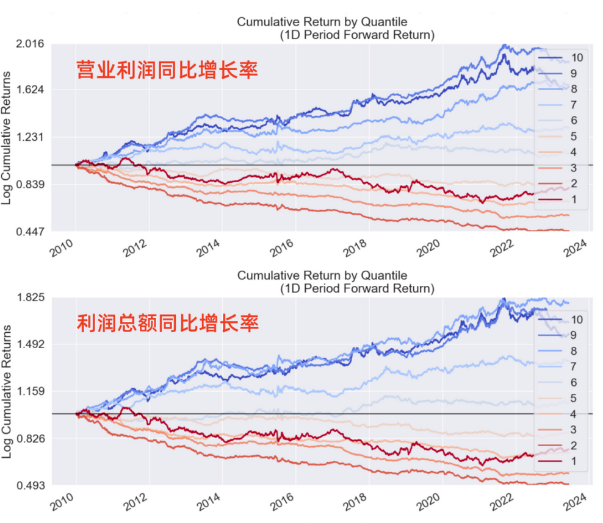

# 从零学量化74—盈利飙升的秘密：深入解析盈利增长率 

在前述文章《成长因子：寻找明日之星》中，我们介绍了成长因子的概念和成长因子的具体指标，本文将对成长因子的具体指标——盈利增长率进行评价。关于盈利增长率的介绍详见上文。

本文进行因子评价的工具为Alphalens库，Alphalens库的用法详见《量化工具箱：因子评价神器Alphalens库超详细教程》。本文进行因子评价的相关代码在上述文章中已有详细讲解，如果对这些代码不清楚的可以查看以前的文章，本文不再对代码进行过多的解释。

我为大家整理了计算和评价因子所需的全部沪深股票2010年1月1日至2023年6月30日的数据，数据文件名为：growth_factor.csv，在后台回复“成长因子”可获取。

## 01 盈利增长率的几种表述方式

公司的盈利有多种口径，相应的盈利增长率也有多种口径：
### 1. 营业利润同比增长率：
这个指标比较的是两个相同季度（或年度）的营业利润。营业利润是指从主营业务和其他业务中获取的收入减去相应的成本和费用后得到的利润。
### 2. 利润总额同比增长率：
这个指标比较的是两个相同季度（或年度）的利润总额。利润总额在营业利润的基础上加上非营业收入并减去非营业支出，包括了主营业务以及其他非营业活动。
### 3. 归属母公司股东的净利润同比增长率：
这个指标比较的是两个相同季度（或年度）的归属于母公司股东的净利润。归属母公司股东的净利润指公司的利润总额再减去应付的税费和非控股股东的利润部分后，留给母公司股东的净利润。
### 4. 归属母公司股东的净利润（扣除非经常损益）同比增长率：
这个指标比较的是两个相同季度（或年度）的扣除非经常损益后的归属母公司股东的净利润。归属母公司股东的净利润（扣除非经常损益指公司的归属母公司股东的净利润中扣除非经常性损益后的利润。非经常性损益包括了投资收益、资产处置收益等非经常性的收入和支出。

我为大家整理的数据文件中包含了以上4种盈利增长率的指标数据。

## 02 使用Alphalens库进行因子评价的代码

```python 

# 导入相关的库
import numpy as np
import pandas as pd
import statsmodels.api as sm
import alphalens as al

# 关闭警告信息
import warnings
warnings.filterwarnings('ignore')

# 从CSV文件读取数据
file_path = 'e:temp/growth_factor.csv'  # 文件的路径和文件名，注意：此处要换成你的文件地址
data_df = pd.read_csv(file_path, encoding='gbk', index_col=0) 
data_df['日期'] = pd.to_datetime(data_df['日期'])  # 将日期统一为datetime格式

# 设置将要评价的因子
factor_name = '营业利润同比增长率'

# 生成符合Alphalens要求格式的因子值数据

factor = data_df.set_index(['日期','股票代码'])[factor_name]
# 生成符合Alphalens要求格式的交易价格数据
prices = data_df.pivot(index='日期', columns='股票代码', values='开盘价')
prices = prices.shift(-1)  # 将第二天的开盘价作为交易价格，避免用到“未来数据”

# 预处理因子数据，得到符合Alphalens需要的数据格式。
factor_data = al.utils.get_clean_factor_and_forward_returns(
    factor=factor,
    prices=prices,
    quantiles=10,
    periods=(1, 10))
    
# 生成因子性能报告
al.tears.create_full_tear_sheet(factor_data)

```

在上述因子评价的代码中，我们按因子值将全部股票等分为10组，调仓日设置为1天(1D)和10天(10D)。
上述代码是对 '营业利润同比增长率'  这个因子进行评价，将上述代码中

```python

factor_name = '营业利润同比增长率'

```

换成：

```python 

factor_name = '利润总额同比增长率' 
factor_name = '归母净利润同比增长率'
factor_name = '扣非归母净利润同比增长率'

```

就能对其他盈利增长率因子进行评价。

## 03 盈利增长率因子评价分析
Alphalens生成的因子评价内容很多，这里选主要内容分析如下：
### （一）四种盈利增长率评价结果汇总
上述四种盈利增长率的分组测试情况如下：

#### 1. 分组的平均收益率


这张图展示了该因子的不同分组在未来1、10期的平均收益率。图的X轴为因子分组，Y轴为每组的平均收益率。

Alphalens的收益默认是做市场中性处理的，即这里的收益率为"超额收益率"，指在截面上对所有股票收益率做中心化处理后的收益率。

具体来说，因子被分成十组，每组包含相同数量的股票。然后，计算每组在未来1、10期的平均收益率，并减去所有股票收益率的平均值，得到超额收益率。
#### 2. 分组的累计收益




该图展示的是各个因子分组的累计收益。在这个图表中，我们关注的是每个分组在不同时间段的收益表现。这个图表中可以帮助我们更好地理解因子在不同分组的表现。

与前面相同，Alphalens的收益默认是做市场中性处理的，即在计算收益时，会扣除所有股票的整体均值，这样可以消除市场整体的影响。
#### 3. 从以上两幅对比图可以得出以下结论：

1）营业利润同比增长率、利润总额同比增长率、归母净利润同比增长率、扣非归母净利润同比增长率这4个因子的分组收益都大致呈现因子值越大，分组收益越高的特性，这符合大家对盈利增长率因子的通常认知。

2）这4个因子收益率最低的组并非因子值最小的组，而是因子值次小的组。同样，收益率最高的组也不是因子值最大的组。

3）虽然这4个因子的分组收益特征具有一定的相似性，但也有各自不同的特性，具体表现为分组收益的单调性（从低到高递增的特性）不同：

营业利润同比增长率和扣非归母净利润同比增长率的分组单调性更好，除了第1组和第10组之外，其他分组都体现出了因子值越高分组收益越高的特点；

利润总额同比增长率和归母净利润同比增长率的分组单调性略差，收益最高的组出现在第7组，在第7组之后出现了因子值越高分组收益反而越低的情况。
### （二）营业利润同比增长率因子收益率分析
下面我们以营业利润同比增长率为例，对该因子进行更具体的分析：
#### 1. 收益的总体分析报告


这个表格是一个收益的总体分析报告，它展示了因子在1天(1D)和10天(10D)的时间区间内的表现。

根据 Returns Analysis 信息，我们可以对营业利润同比增长率因子进行以下评价：

1）Alpha（超额收益）：

在一日持有期和十日持有期下，该因子的年化 Alpha 分别为 0.037 和 0.021，这说明该因子具有一定的超额收益能力，即在控制市场风险后，投资者可以通过该因子获取一定的超额收益。

2）Beta（市场风险）：

在一日持有期和十日持有期下，该因子的 Beta 分别为 0.021 和 0.013，这说明该因子的收益与市场收益为正相关，但相关性相对较低。

3）Mean Period Wise Return Top Quantile（最高分位数的平均周期收益）：

在一日持有期和十日持有期下，该因子在最高分位数的平均周期收益分别为 1.562 和 0.902，这说明在最高分位数（即因子值最大的股票）中，投资者可以获取相对较高的收益。

4）Mean Period Wise Return Bottom Quantile（最低分位数的平均周期收益）：

在一日持有期和十日持有期下，该因子在最低分位数的平均周期收益分别为 -0.615 和 -0.153，这说明在最低分位数（即因子值最小的股票）中，投资者的收益相对较低，甚至可能产生亏损。

5）Mean Period Wise Spread （平均周期收益差）：

在一日持有期和十日持有期下，该因子的平均周期收益差分别为 2.176 和 1.082，这说明在最高分位数和最低分位数之间，存在一定的收益差距，也就是说，该因子具有一定的预测能力。
#### 2. 因子的分组收益评价：
通过分析上述图表，我们可以得出营业利润同比增长率因子的分组收益有以下几点结论：

1）最高组和最低组收益：在1日持有期和10日持有期下，因子在第1分位数（最低）的平均收益为 -0.000061 和 -0.000153，而在第10分位数（最高）的平均收益为 0.000156 和 0.000902。这表明，因子值较高的股票（第10分位数）的收益明显高于因子值较低的股票（第1分位数），说明该因子具有一定的预测能力。

2）分组收益单调性：营业利润同比增长率因子的分组收益在1日和10日的持有期下都呈现出一定的单调性。

总体来说，从第1分位数到第10分位数，平均收益率逐渐增加。这表明，随着因子值的增加，平均收益率也在增加，这就是单调性的体现。也就是说，该因子具有一定的预测性，因子值较高的股票的平均收益率高于因子值较低的股票。

但需要注意的是，尽管整体上呈现出单调性，但在某些分位数之间，例如第1组和第2组、第9组和第10组，收益率并未严格增加。因此，我们可以说该因子的单调性较强，但不是完全单调。这主要可能说明两点：
- a）该因子的预测能力有一定的局限性。也就是说，尽管该因子可以在一定程度上区分出具有高收益和低收益的股票，但对于某些特定范围的股票，该因子可能无法准确预测其收益。
- b）存在市场噪音或其他未考虑的因素的影响。股票的收益受到许多因素的影响，包括宏观经济环境、公司基本面、市场情绪等。即使一个因子在大部分情况下能够有效预测收益，也可能会受到这些因素的影响，导致在某些特定情况下无法准确预测。例如，在第1组和第2组、第9组和第10组之间，可能存在一些我们未能考虑到的影响收益的因素。

因此，投资者在使用该因子进行投资决策时，应当注意这些局限性，并结合其他因素进行综合判断。
