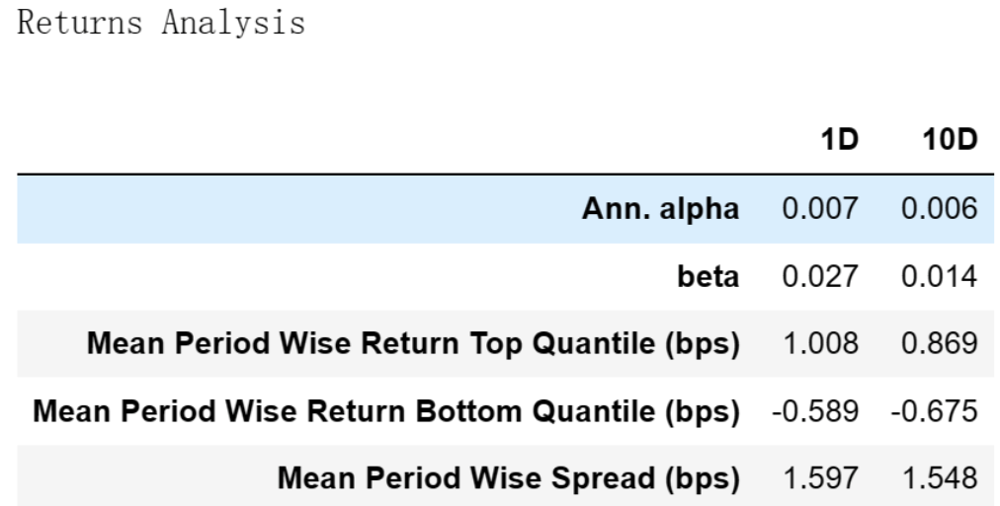
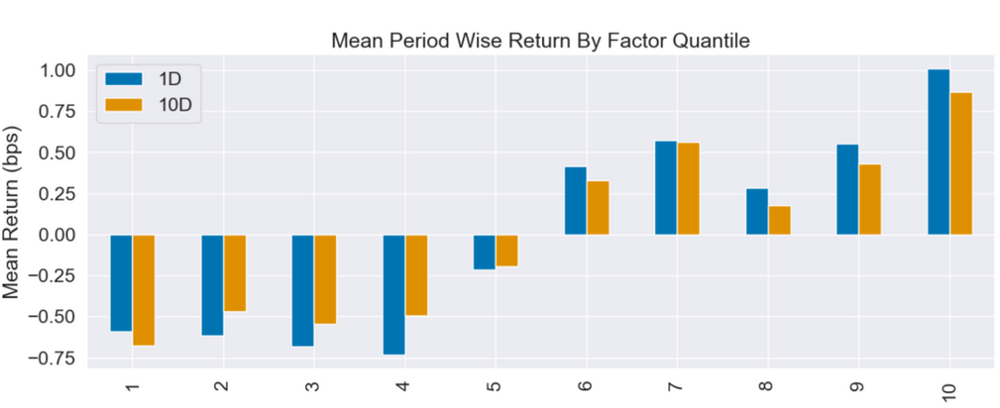
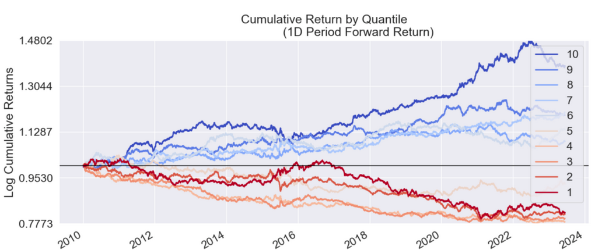
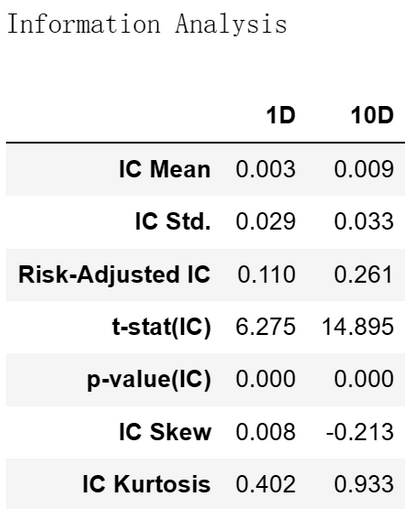

#  从零学量化75—现金为王：现金流增长率能否揭示成长的奥秘

在前述文章《成长因子：寻找明日之星》中，我们介绍了成长因子的概念和成长因子的具体指标，本文将对成长因子的具体指标——经营活动现金流量净额同比增长率进行评价。关于经营活动现金流量净额同比增长率的介绍详见上文。

本文进行因子评价的工具为Alphalens库，Alphalens库的用法详见《量化工具箱：因子评价神器Alphalens库超详细教程》。本文进行因子评价的相关代码在上述文章中已有详细讲解，如果对这些代码不清楚的可以查看以前的文章，本文不再对代码进行过多的解释。

我为大家整理了计算和评价因子所需的全部沪深股票2010年1月1日至2023年6月30日的数据，数据文件名为：growth_factor.csv，在后台回复“成长因子”可获取。

## 01 使用Alphalens库进行因子评价的代码

```python 

# 导入相关的库
import numpy as np
import pandas as pd
import statsmodels.api as sm
import alphalens as al

# 关闭警告信息
import warnings
warnings.filterwarnings('ignore')

# 从CSV文件读取数据
file_path = 'e:temp/growth_factor.csv'  # 文件的路径和文件名，注意：此处要换成你的文件地址
data_df = pd.read_csv(file_path, encoding='gbk', index_col=0) 
data_df['日期'] = pd.to_datetime(data_df['日期'])  # 将日期统一为datetime格式

# 设置将要评价的因子
factor_name = '经营活动现金流量净额同比增长率'

# 生成符合Alphalens要求格式的因子值数据

factor = data_df.set_index(['日期','股票代码'])[factor_name]
# 生成符合Alphalens要求格式的交易价格数据
prices = data_df.pivot(index='日期', columns='股票代码', values='开盘价')
prices = prices.shift(-1)  # 将第二天的开盘价作为交易价格，避免用到“未来数据”

# 预处理因子数据，得到符合Alphalens需要的数据格式。
factor_data = al.utils.get_clean_factor_and_forward_returns(
    factor=factor,
    prices=prices,
    quantiles=10,
    periods=(1, 10))
    
# 生成因子性能报告
al.tears.create_full_tear_sheet(factor_data)

```

在上述因子评价的代码中，我们按因子值将全部股票等分为10组，调仓日设置为1天(1D)和10天(10D)。

## 02 经营活动现金流量净额同比增长率因子评价分析
Alphalens生成的因子评价内容很多，这里选主要内容分析如下：
### （一）因子收益率分析


这个表格是一个收益分析报告，它展示了因子在1天(1D)和10天(10D)的时间区间内的表现。

根据提供的 Returns Analysis 信息，我们可以对经营活动现金流量净额同比增长率因子进行以下评价：
#### 1. Alpha（阿尔法）：
在1日和10日的持有期下，因子的年化阿尔法分别为0.007和0.006。阿尔法是一个衡量超额收益的指标，这里的正阿尔法意味着在控制了市场风险后，该因子能够提供超过市场的收益。
#### 2. Beta（贝塔）：
在1日和10日的持有期下，因子的贝塔分别为0.027和0.014。贝塔是一个衡量市场风险的指标，这里的贝塔值较低，说明该因子的收益与市场的整体走势关系不大。
#### 3. Mean Period Wise Return Top Quantile（最高分位数的平均周期收益）：
在1日和10日的持有期下，因子在最高分位数的平均周期收益分别为1.008和0.869基点。这说明，因子值较高的股票的平均收益率较高。
#### 4. Mean Period Wise Return Bottom Quantile（最低分位数的平均周期收益）：
在1日和10日的持有期下，因子在最低分位数的平均周期收益分别为-0.589和-0.675基点。这说明，因子值较低的股票的平均收益率较低。
#### 5. Mean Period Wise Spread（平均周期收益差）：
在1日和10日的持有期下，因子的平均周期收益差分别为1.597和1.548基点。这说明，因子值较高和较低的股票之间的平均收益率存在较大的差距，该因子具有一定的区分力。
### （二）因子分组收益情况
#### 1. Mean Period Wise Return By Factor Quantile：



这张图展示了该因子的不同分组在未来1、10期的平均收益率。图的X轴为因子分组，Y轴为每组的平均收益率。

Alphalens的收益默认是做市场中性处理的，即这里的收益率为"超额收益率"，指在截面上对所有股票收益率做中心化处理后的收益率。

具体来说，因子被分成十组，每组包含相同数量的股票。然后，计算每组在未来1、10期的平均收益率，并减去所有股票收益率的平均值，得到超额收益率。
#### 2. Cumulative Return by Quantile：



该图展示的是各个因子分组的累计收益。在这个图表中，我们关注的是每个分组在不同时间段的收益表现。这个图表中可以帮助我们更好地理解因子在不同分组的表现。

与前面相同，Alphalens的收益默认是做市场中性处理的，即在计算收益时，会扣除所有股票的整体均值，这样可以消除市场整体的影响。
#### 3. 因子的分组收益评价：
通过分析上述图表，我们可以得出该因子的分组收益有以下几点结论：

1）单调性：在1日和10日的持有期下，该因子的分组收益都呈现出一定的单调性。具体来说，从第1分组到第10分组，平均收益率逐渐增加。这表明，随着因子值的增加，平均收益率也在增加，这就是单调性的体现。也就是说，该因子具有一定的预测性，因子值较高的股票的平均收益率高于因子值较低的股票。

2）因子值最高的第10组收益率最高，以及因子值最低的第1组收益率接近最低，这意味着因子在一定程度上具有预测性。这是一个积极的信号，表明因子值与期望收益之间存在一定的关系，也就是说，经营活动现金流量净额同比增长率因子在一定程度上可以用来预测股票的未来收益。

3）但需要注意的是，尽管整体上呈现出单调性，但（1，2，3，4）分组之间、（7，9）分组之间的收益差异并不大，第8分组还出现了收益低于第7分组的情况，这可能说明：
- a）因子的预测能力可能在因子值的某些区间内不太敏感：（1，2，3，4）分组之间、（7，9）分组之间的收益差异不大，这可能说明在这些因子值的范围内，经营活动现金流量净额同比增长率因子的预测性不强。
- b）市场噪音或其他未考虑的因素的影响：第8分组的收益低于第7分组，这可能是由于市场噪音或其他我们未能考虑到的影响收益的因素。股票的收益受到许多因素的影响，包括宏观经济环境、公司基本面、市场情绪等，这可能导致在特定情况下因子的预测性不佳。
- c）因子的非线性：理论上，如果一个因子是有效的，那么因子值越大，收益率应该越高，呈现出明显的线性关系。然而，现实中的情况可能更复杂，因子和收益的关系可能是非线性的，或者在特定的因子值区间内，收益可能与因子值的大小无关。
### （三）因子IC值分析



Information Analysis表用来评估一个因子的预测能力。IC是因子值与未来收益的相关系数，衡量了因子预测未来收益的能力。一个因子的IC越高，说明其预测能力越强。这里的1D和10D指的是在1天和10天的持有期内的IC。

根据这个表格，我们可以得出以下信息：
#### 1. IC Mean
IC (Information Coefficient) Mean 表示因子值和未来收益之间的相关性。在这里，1D的 IC Mean 是0.003，10D的 IC Mean 是0.009，这意味着因子值和未来1日以及10日的收益之间存在弱的正相关性。
#### 2. IC Std.
IC的标准差，衡量IC的波动性。在这里，1D和10D的 IC Std. 分别是0.029和0.033，这表明IC具有一定的波动性。
#### 3. Risk-Adjusted IC
风险调整后的信息系数，是 IC Mean 除以 IC Std.。在这里，1D的风险调整后的 IC 是0.110，10D的风险调整后的 IC 是0.261，这说明在调整风险后，因子的预测能力仍不强。

该因子的信息系数及风险调整后的信息系数均不高，这可能与上面分析的因子的非线性有关，因为信息系数计算的是线性的相关系数，如果一个因子呈现出明显的线性关系，那么因子值越大，收益率应该越高，但对于经营活动现金流量净额同比增长率因子而言并不总是如此，因此该因子的IC值评价并不理想。

总的来说，经营活动现金流量净额同比增长率因子在统计上具有一定的预测能力，并且在某些区间内，因子值较高的股票往往能获得较高的收益。然而，投资者在使用该因子进行投资决策时，应注意其可能存在的局限性，并可能需要结合其他信息和因子进行综合判断。