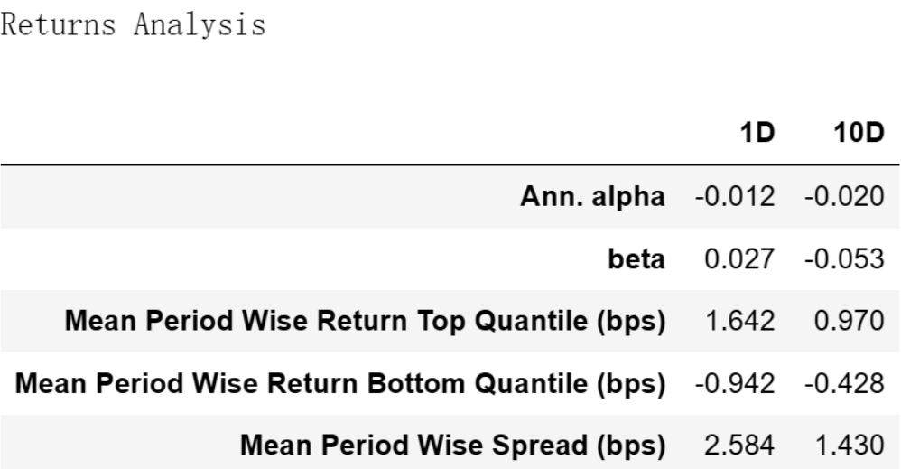
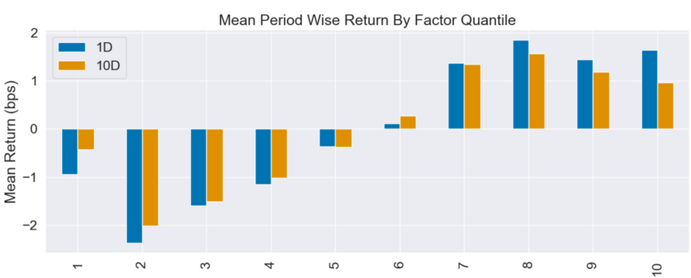
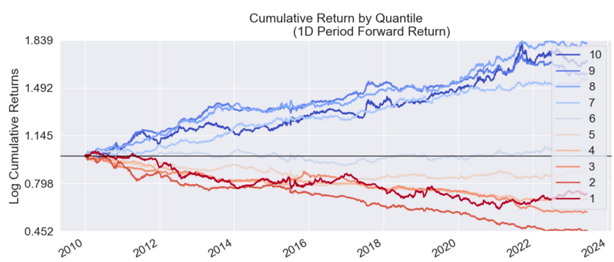
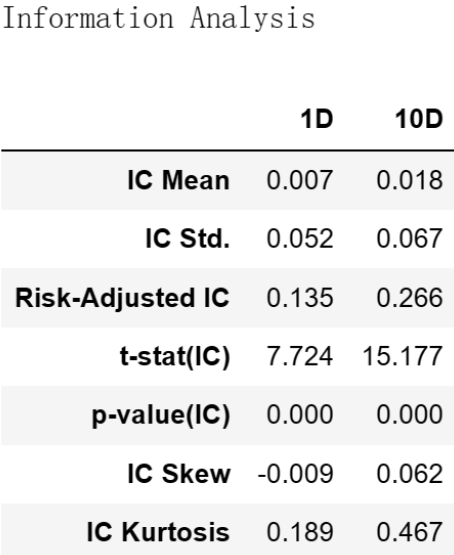

# 从零学量化76—股东回报新视角：ROE增长率是否可以洞察企业成长

## 01 使用Alphalens库进行因子评价的代码

```python 

# 导入相关的库
import numpy as np
import pandas as pd
import statsmodels.api as sm
import alphalens as al

# 关闭警告信息
import warnings
warnings.filterwarnings('ignore')

# 从CSV文件读取数据
file_path = 'e:temp/growth_factor.csv'  # 文件的路径和文件名，注意：此处要换成你的文件地址
data_df = pd.read_csv(file_path, encoding='gbk', index_col=0) 
data_df['日期'] = pd.to_datetime(data_df['日期'])  # 将日期统一为datetime格式

# 设置将要评价的因子
factor_name = 'roe同比增长率'

# 生成符合Alphalens要求格式的因子值数据

factor = data_df.set_index(['日期','股票代码'])[factor_name]
# 生成符合Alphalens要求格式的交易价格数据
prices = data_df.pivot(index='日期', columns='股票代码', values='开盘价')
prices = prices.shift(-1)  # 将第二天的开盘价作为交易价格，避免用到“未来数据”

# 预处理因子数据，得到符合Alphalens需要的数据格式。
factor_data = al.utils.get_clean_factor_and_forward_returns(
    factor=factor,
    prices=prices,
    quantiles=10,
    periods=(1, 10))
    
# 生成因子性能报告
al.tears.create_full_tear_sheet(factor_data)

```
在上述因子评价的代码中，我们按因子值将全部股票等分为10组，调仓日设置为1天(1D)和10天(10D)。

## 02 ROE同比增长率因子评价分析
Alphalens生成的因子评价内容很多，这里选主要内容分析如下：
### （一）因子收益率分析



这个表格是一个收益分析报告，它展示了因子在1天(1D)和10天(10D)的时间区间内的表现。
#### 1. Ann. alpha:
Alpha是超额收益，即在调整了市场风险后的收益。在这里，1D和10D的年化Alpha分别是-0.012和-0.020，这意味着因子在1天和10天的持有期的预期超额收益为负。
#### 2. beta:
Beta是市场风险，衡量的是因子收益与市场收益的相关性。在这里，1D的Beta是0.027，说明在1天的持有期内，因子与市场的收益有微弱的正相关性。而10D的Beta是-0.053，说明在10天的持有期内，因子与市场的收益有微弱的负相关性。
#### 3. Mean Period Wise Return Top Quantile (bps):
最高分位数组的平均期间收益率。在这里，1D和10D的值分别为1.642和0.970，这意味着ROE同比增长率最高的股票组在1天和10天的持有期内有正的收益。
#### 4. Mean Period Wise Return Bottom Quantile (bps):
最低分位数组的平均期间收益率。在这里，1D和10D的值分别为-0.942和-0.428，这意味着ROE同比增长率最低的股票组在1天和10天的持有期内有负的收益。
#### 5. Mean Period Wise Spread (bps):
最高和最低分位数组的平均期间收益差。在这里，1D和10D的值分别为2.584和1.430，这表明ROE同比增长率最高的股票组相较于最低的股票组有较高的收益。
### （二）因子分组收益情况
#### 1. Mean Period Wise Return By Factor Quantile：


这张图展示了该因子的不同分组在未来1、10期的平均收益率。图的X轴为因子分组，Y轴为每组的平均收益率。

Alphalens的收益默认是做市场中性处理的，即这里的收益率为"超额收益率"，指在截面上对所有股票收益率做中心化处理后的收益率。

具体来说，因子被分成十组，每组包含相同数量的股票。然后，计算每组在未来1、10期的平均收益率，并减去所有股票收益率的平均值，得到超额收益率。
#### 2. Cumulative Return by Quantile：



该图展示的是各个因子分组的累计收益。在这个图表中，我们关注的是每个分组在不同时间段的收益表现。这个图表中可以帮助我们更好地理解因子在不同分组的表现。

与前面相同，Alphalens的收益默认是做市场中性处理的，即在计算收益时，会扣除所有股票的整体均值，这样可以消除市场整体的影响。
#### 3. 因子的分组收益评价：
通过分析上述图表，我们可以得出该因子的分组收益有以下几点结论：

1）该因子总体上呈现初因子值越高分组收益越高的趋势，多头组的收益显著高于空头组。

2）因子收益的单调性：从因子1到因子6，平均收益呈现出负到正的趋势，这表明ROE同比增长率较高的股票在这个区间内的收益率较高。但在因子6到因子10的区间内，收益并未严格增加，反而在因子10处略低于因子8和9，这可能表明在ROE同比增长率较高的部分，其预测能力可能并不强。

3）因子在不同持有期的表现：比较1天和10天的收益，可以看出，尽管两者的趋势大致相同，但是在10天的持有期内，收益的差距更为明显，这可能表明ROE同比增长率因子在更长的时间尺度上的预测能力更强。
### （三）因子IC值分析



Information Analysis表用来评估一个因子的预测能力。IC是因子值与未来收益的相关系数，衡量了因子预测未来收益的能力。一个因子的IC越高，说明其预测能力越强。这里的1D和10D指的是在1天和10天的持有期内的IC。

根据这个表格，我们可以得出以下信息：
### 1. IC Mean：
IC的平均值，这表示了因子预测能力的平均水平。在这里，1D和10D的IC Mean分别为0.007和0.018，这意味着因子有一定的预测能力，且在10天的持有期上预测能力更强。但不管是1D还是10D，IC的平均值都不高，这说明该因子的线性预测能力并不强。
#### 2. IC Std.：
IC的标准差，这表示了IC的波动性。在这里，1D和10D的IC Std.分别为0.052和0.067，这意味着因子的预测能力具有一定的不稳定性，且在10天的持有期上不稳定性更大。
#### 3. Risk-Adjusted IC：
风险调整后的IC，这是IC Mean与IC Std.的比值。在这里，1D和10D的Risk-Adjusted IC分别为0.135和0.266，这意味着在考虑了预测能力的不稳定性后，因子在10天的持有期上的预测能力更强。但风险调整后的IC仍然不高，说明经过风险调整后，该因子的线性预测能力仍不强。

综上，ROE同比增长率因子在整体上具有一定的预测能力，因子值较高的股票往往能获得较高的收益。但是，投资者在使用该因子进行投资决策时，应注意其在因子值较高的区间内可能的预测能力减弱，并可能需要结合其他信息和因子进行综合判断。