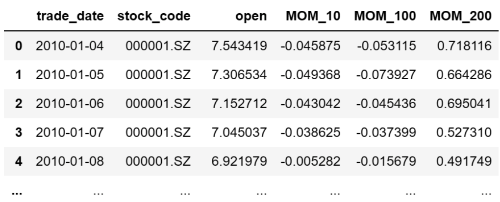
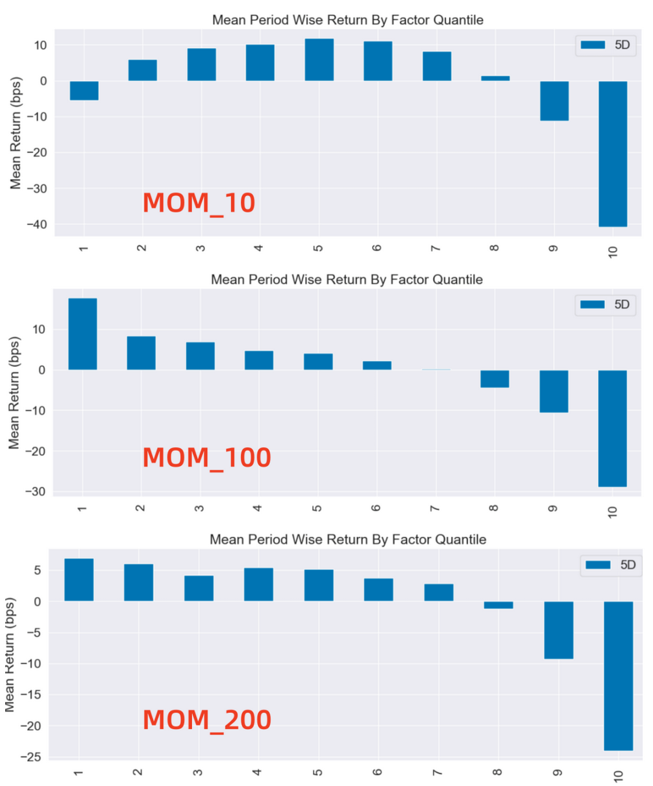

# 从零学量化78—实证A股的动量和反转：是强者恒强，还是否极泰来 

在A股市场中，动量效应和反转效应的存在一直是投资者关注的焦点。动量效应指的是一种历史价格趋势在未来一段时间内的延续现象，反转效应则是资产价格在达到一定极值后的反向变动。在实际的投资过程中，如何准确把握这两种效应，对投资者而言具有重要的指导意义。

本文选取了三个动量因子：MOM_10、MOM_100、和MOM_200，分别代表10天、100天和200天的股票收益率，用以衡量短期、中期和长期的动量。我们将通过这三个指标，揭示A股市场中的动量效应和反转效应，并进一步探讨在A股市场中，动量效应和反转效应哪一种占主导地位。

## 01 动量因子的计算方法
本文选择的动量因子为简单动量。简单动量是最直接的动量因子，它通过比较一只股票在过去一段时间的收益率来计算。简单动量的计算公式是：
```python 

MOM = close / n 期前的close - 1

```
在这里，n 取10天、100天和200天，即计算股票的10天、100天和200天的收益率。

本文中动量因子的计算和评价需要全市场股票的行情数据，我为大家整理了全部沪深股票2009年1月至2023年11月的数据，数据文件名为：price.csv，在后台回复“行情数据”可获取。

计算因子值的代码如下：

```python 

import pandas as pd

# 从CSV文件读取量价数据
file_path = 'e:temp/price.csv'   # 文件的路径和文件名，注意：此处要换成你的文件地址
price_df = pd.read_csv(file_path, encoding='gbk', index_col=0) 
price_df['trade_date'] = pd.to_datetime(price_df['trade_date'])  # 将日期统一为datetime格式

# 计算动量因子
price_df['MOM_10'] = price_df.groupby('stock_code')['close'].pct_change(10)  # 10天的mom因子
price_df['MOM_100'] = price_df.groupby('stock_code')['close'].pct_change(100)  # 100天的mom因子
price_df['MOM_200'] = price_df.groupby('stock_code')['close'].pct_change(200)  # 200天的mom因子

# 选取2010年之后的数据
df = price_df[price_df['trade_date']>='2010-01-01']  
df = df[['trade_date', 'stock_code', 'open', 'MOM_10', 'MOM_100', 'MOM_200']].reset_index(drop=True)

```

用 print(df) 将计算出的因子打印出来查看，格式如下：



## 02 动量和反转效应的研究方法
我们通过对MOM_10、MOM_100、和MOM_200这三个因子的评价，来研究短期、中期和长期的动量和反转效应。研究的方法是根据因子值的大小将全市场的股票分为10组，第1组的因子值最小，第10组的因子值最大，然后计算各个分组的收益率。如果各组的收益是递增的，即因子值越大（动量越大）收益越高，则市场呈现的是动量效应；反之，如果各组的收益是递减的，即因子值越大（动量越大）收益反而越低，则市场呈现的是反转效应。

本文计算因子分组收益的工具为Alphalens库，Alphalens库的用法详见《量化工具箱：因子评价神器Alphalens库超详细教程》。本文涉及的代码在上述文章中已有详细讲解，如果对这些代码不清楚的可以查看以前的文章，本文不再对代码进行过多的解释。

使用Alphalens库进行因子分组收益计算的代码如下：
```python 

import pandas as pd
import alphalens as al
# 关闭警告信息
import warnings
warnings.filterwarnings('ignore')

# 生成符合Alphalens要求格式的因子值数据
factor_name = 'MOM_10'
factor = df.set_index(['trade_date','stock_code'])[factor_name]

# 生成符合Alphalens要求格式的交易价格数据
prices = df.pivot(index='trade_date', columns='stock_code', values='open')
prices = prices.shift(-1)  # 将第二天的开盘价作为交易价格，避免用到“未来数据”

# 预处理因子数据，得到符合Alphalens需要的数据格式。
factor_data = al.utils.get_clean_factor_and_forward_returns(
    factor=factor,
    prices=prices,
    quantiles=10,
    periods=(5,))
    
# 计算因子分组收益
al.tears.create_returns_tear_sheet(factor_data)

```

上述代码按因子值将全部股票等分为10组，考虑到动量和反转效应的调仓频率较高，按每5日调仓（5D）计算收益率。这张图展示了不同因子分组每5日调仓的平均收益率。图的X轴为因子分组，Y轴为每组的平均收益率。

Alphalens的收益默认是做市场中性处理的，即这里的收益率为"超额收益率"，指在截面上对所有股票收益率做中心化处理后的收益率。

具体来说，因子被分成十组，每组包含相同数量的股票。然后，计算每组在未来5期的平均收益率，并减去所有股票收益率的平均值，得到超额收益率。

在上述分组中，第1组表示动量最低的组，即过去n日涨幅最差的股票组；而第10组表示动量最高的组，即过去n日涨幅最好的股票组。

## 03 研究结果
### （一）空头组
我们先观察空头组的表现，在所有的三个动量指标（MOM_10、MOM_100、MOM_200）中，最高分位数组均获得最低的收益，而且显著低于其他分组，说明过去表现最好的一组股票在未来的表现反而最差。这表明在A股市场，不管是短期、中期还是长期，都能观察到“反转效应”。因此在A股市场中，强者并不总是恒强，反而更有可能是强弩之末。

这种现象可能由多种因素导致：

1）过度反应：投资者可能会对信息反应过度，导致股票价格偏离其基础价值。例如，一家公司发布了优于预期的财务报告，投资者可能会过度乐观，使得该公司的股票价格上涨过多。然而，随着时间的推移，价格可能会回归到其基础价值，从而出现反转。

2）投资者行为偏差：一些投资者可能会受到心理偏差的影响，例如，他们可能会过度追求过去表现好的股票，这可能导致价格偏离其基础价值，从而出现反转。

3）过度投机可能导致价格偏离基本面：如果某只股票或某个市场受到大量投机活动的推动，价格可能会迅速上升，远离其实际的基本面价值。然而，当投机活动减弱或市场情绪变化时，价格可能会回归到基本面价值，从而出现反转效应。
### （二）多头组
虽然反转效应在空头组表现明显，但由于A股市场的做空限制，投资的主要收益还是来自多头组，而多头组的表现就比较复杂。理想的反转效应是分组收益随着因子值的增加而减少，并且最好是单调递减，这样我们就可以买入前期涨幅低的股票获得收益，但我们在这里看到的情况并非如此。

1. 对于短期因子MOM_10，在分组1到分组5，分组收益率随着因子值的增加而增加，这呈现出一种动量效应的迹象，这种情况可能是由于市场参与者在短期内追逐过去表现良好的股票，从而推高了这些股票的价格。但是在分位数6到10之间，收益率开始下降，这是一种反转效应。我们可以看到A股市场在短期（10天）内存在动量效应和反转效应混合的情况。尤其需要注意的是第1组的收益为负值，这表明第1组的收益低于市场平均收益，如果我们选择过去10日表现最差的一组股票买入，反而有可能遭受亏损。这种混合的动量和反转效应可能反映了市场的非线性反应。也就是说，当股票的过去收益达到一定程度时，市场可能从追逐过去的赢家转向对过度估值的纠正，从而导致反转效应的出现。

2. 对于中期因子MOM_100，我们观察到了明显的反转效应：第1组的收益率最高，第10组的收益率最低，而且收益率从第1组到第10组呈现出单调递减。这样我们就可以通过买入第1组股票来获取超过市场的收益。

3. 虽然A股在中期呈现出明显的反转效应，但到了长期又变得模糊起来，我们来看长期因子MOM_200的情况。MOM_200的第1组取得了最高的收益，第10组取得了最低收益，这表明A股市场在长期总体上也呈现出反转效应。但前5组的收益差别并不明显，而且并没有显著的递减趋势，这表明可能在一定程度上存在动量效应。这可能是因为投资者在长期内对过去表现良好的股票持续感兴趣，从而推动了这些股票的价格。因此，我们不能简单地认为反转效应在所有情况下都会发生，而应该根据具体的市场环境进行分析。
### （三）总结
总的来说，无论是在短期、中期还是长期，我们都观察到了A股市场存在的反转效应。这可能与投资者行为、市场环境、以及中国特有的市场特征等因素有关。

但是，A股市场的反转效应主要反映在空头组，即表现最好的一组股票在未来都会出现明显的回落。但在多头组，买入表现最差的一组股票并不保证能获取正向的收益。具体而言，在中期市场中反转效应较为显著，但在短期和长期则在一定范围内混杂有动量效应。尤其是短期市场，买入表现最差的股票反而会取得负向收益。

这说明在A股市场中虽然反转效应占优，但这种反转效应的存在并不是一成不变的，而是可能会受到市场结构、投资者行为、时间周期、宏观经济环境等多种因素的影响。这意味着，投资者不能简单地依赖于动量效应或反转效应来进行投资决策，而是需要对股票的特性和市场状况进行更全面的考虑。

将上述代码中的 :

```python 

factor_name = 'MOM_10' 

```

换成 :

```python 

factor_name = 'MOM_100' 
factor_name = 'MOM_200'

```

就可以分别计算其他两个因子的分组收益。

Alphalens返回的分组平均收益率图如下：




