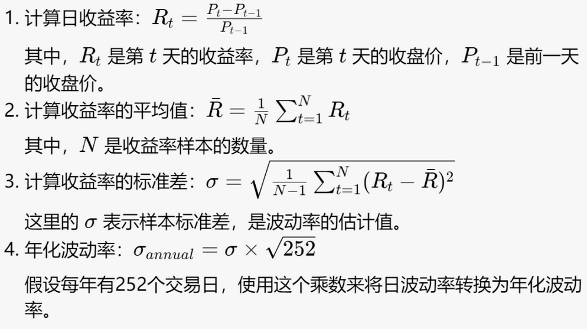
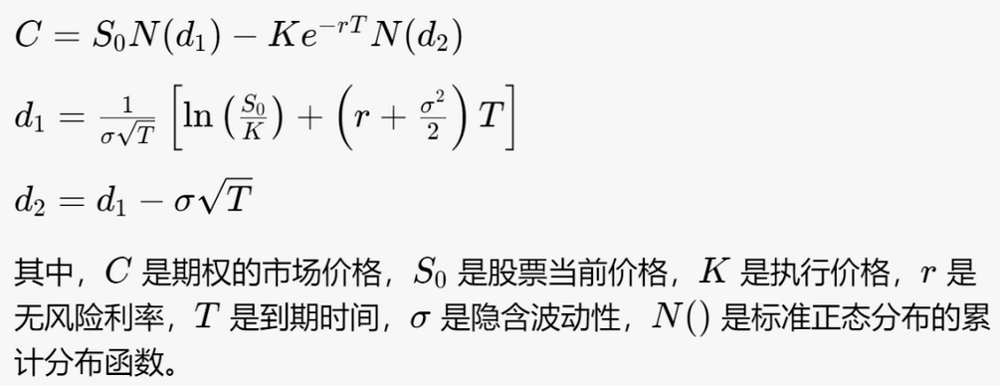
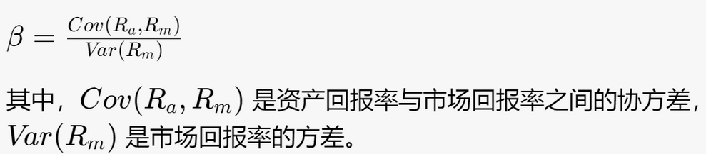
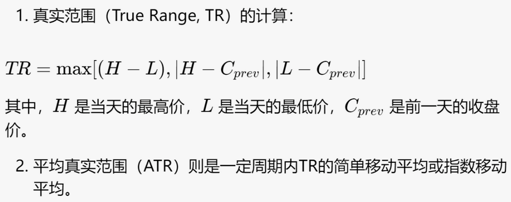

# 从零学量化79—波动性因子：稳中求胜 

波动性因子是一种量化投资策略中使用的因子，它基于一个简单的观察：不同股票的价格波动性存在显著差异，而这些差异可以被用来预测未来的股票回报。

## 01 波动性因子概述
波动性因子通常用股票回报的标准差来衡量，或者更通用的是股票价格变动的波动率。这个因子通常用来衡量风险，因为较高波动性的资产在价格上的波动更大，因而被认为风险更高。

在量化投资中，投资者可能会寻找低波动性股票进行投资，这基于低波动性异常（Low Volatility Anomaly）的观察，即长期来看，低波动股票往往会有比高波动股票更好的风险调整后回报。这与传统金融理论中的风险与回报的关系是相悖的，后者认为更高的风险（高波动性）应该伴随着更高的回报，以补偿投资者承担的额外风险。

低波动性异常存在的原因可能有以下几点：
### 1. 市场参与者行为
投资者可能过度追求那些具有可能产生高回报的高波动性股票，这导致这些股票的价格被推高，从而降低了其未来的预期回报。同时，低波动性股票可能被忽视，导致它们的价格低估，从而提供了较高的预期回报。
### 2. 杠杆限制
一些投资者由于各种限制不能使用杠杆（借贷）来投资，他们可能会通过购买高波动性股票来追求高回报，这种行为可能导致高波动性股票的价格高于其内在价值。
### 3. 投资者情绪
投资者情绪也会影响股票价格。高波动性股票往往更受到投资者情绪的驱动，这可能导致它们的价格偏离其基本面价值。
### 4. 流动性偏好
低波动性股票可能具有较低的流动性。市场上部分投资者更偏好流动性强的股票，这可能导致对低波动性但流动性较差股票的需求减少，进一步导致这类股票价格的低估。
### 5. 基金经理的业绩压力
基金经理可能因为追求短期业绩而倾向于投资高波动性的股票，这种行为可能导致高波动性股票价格的暂时性高估。
### 6. 套利限制
理论上，存在套利机会时，投资者可以通过卖空高估的股票并买入低估的股票来取得利润。然而，实际市场中存在着做空限制和其他摩擦，这些限制阻碍了有效的套利，使得低波动性异常得以持续存在。
### 7. 风险模型的不完善
传统风险模型可能没有完全捕捉到影响股票回报的所有风险因素，例如，忽视了系统性风险之外的其他风险源，如行业风险、公司特定风险等。

这些解释表明，低波动性异常可能是市场不完全效率、投资者行为偏差和市场结构问题共同作用的结果。量化策略设计时，需要考虑这些因素以抓住低波动性提供的潜在投资机会。

## 02 低波动性异常在投资中的应用
在投资中，低波动性异常可以用于以下方面：
### 1. 构建低波动性投资组合
投资者可以选择波动性较低的股票建立投资组合。根据低波动性异常，这些股票预期将提供相对稳健的回报，而且通常伴随较低的下行风险。这对风险厌恶的投资者尤其有吸引力，因为他们寻求在维持可接受的风险水平的同时获取稳定的回报。
### 2. 风险调整后的回报优化
通过低波动性股票，投资者可以在保持预期总回报的同时，降低投资组合的整体风险（波动性）。这意味着在风险调整后的回报（如夏普比率）基础上，低波动性投资组合可能会超越高波动性投资组合。
### 3. 抗市场波动策略
在市场波动性增加的时期，低波动性股票通常表现出更好的抗跌能力。因此，在市场不确定性提高时，持有低波动性股票可能是一种有效的防御策略。
### 4. 因子投资和多因子模型
低波动性可以作为因子投资策略的一个组成部分。多因子模型中可以包含一个低波动性因子，与其他因子（如价值、动量、质量等）结合，来提高投资组合的风险调整回报。

## 03 波动性因子的具体指标
波动性作为衡量资产风险的重要指标，有几种常见的度量方法。以下是几个在金融分析中常用的波动性指标：
### 1. 历史波动性（Historical Volatility, HV）
定义：反映了一段时间内资产回报率的实际波动情况。

用法：历史波动性通常用来估计未来波动性，为风险管理和衍生品定价提供参考。它也是计算VaR（Value at Risk，风险价值）等风险管理工具的基础。

公式：计算历史波动性通常涉及以下步骤：

### 2. 隐含波动性（Implied Volatility, IV）
定义：通过当前市场价格的期权反推出的标的资产未来波动率的期望。

用法：隐含波动性是市场对未来波动性的预期，常用于交易者情绪的指示器和比较不同资产或不同时间的风险水平。在期权交易中，隐含波动性是一个关键的输入变量。

公式：隐含波动性通常是使用期权定价模型（如Black-Scholes模型）反推得出，没有一个简单的公式，但Black-Scholes模型的形式是：

### 3. Beta系数（β）
定义：Beta系数衡量个别股票或投资组合相对于整个市场（通常以大型股票指数为代表）的波动性。

用法：Beta系数反映了个股或投资组合与市场整体的同步性。如果Beta大于1，意味着股票或投资组合的价格波动超过市场平均水平；如果Beta小于1，意味着波动性小于市场。Beta系数常用于资本资产定价模型（CAPM）来计算资产的预期回报。

公式：Beta系数的计算公式为：

### 4. 平均真实范围（Average True Range, ATR）
定义：平均真实范围是衡量市场波动性的指标，主要用于商品和外汇市场。

用法：ATR可以帮助交易者设置止损点和目标价格，也可以作为进入或退出交易的信号。

公式：ATR的计算涉及以下步骤：

