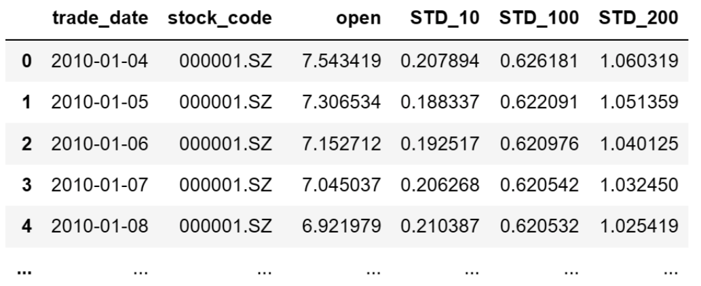
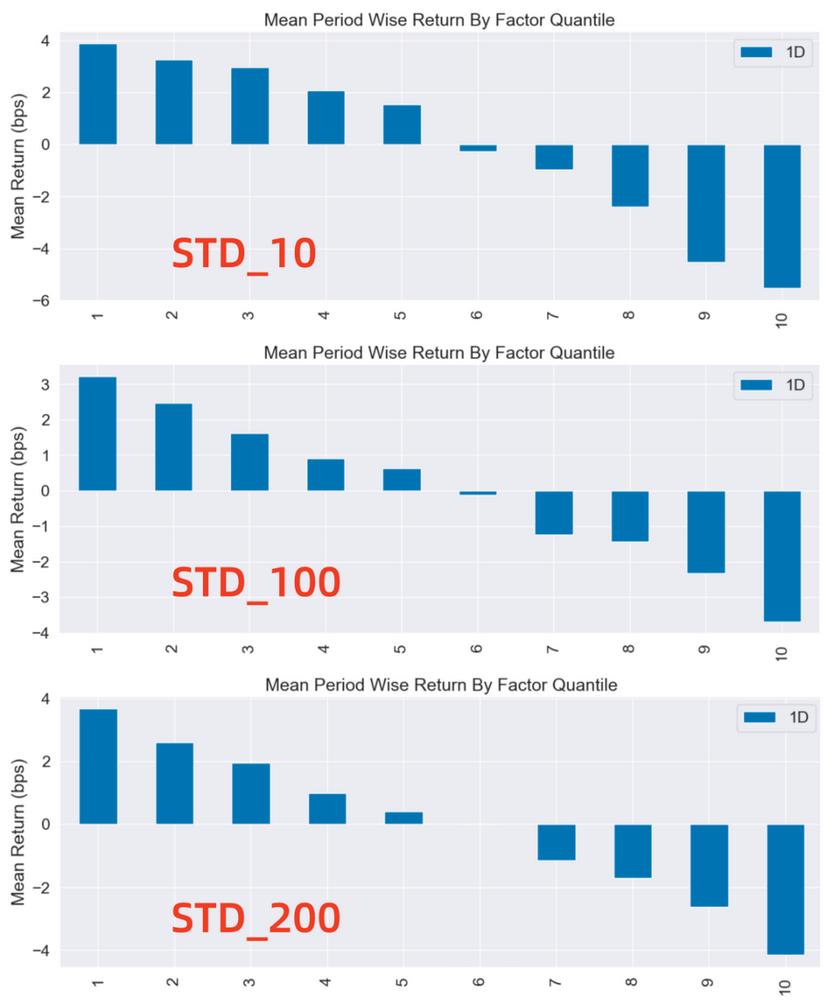

# 从零学量化80—实证A股低波异象：低风险反而有高收益？ 

在金融理论的传统框架中，风险与收益被认为是正相关的。资本资产定价模型（CAPM）等核心理论坚持这一观点，认为高风险（高波动性）资产应当带来高收益以补偿投资者承担的额外风险。然而，近年来在多个市场中观察到一种与传统理论相反的现象，被称为“低波动性异常”（Low Volatility Anomaly），即在某些情况下，低风险资产反而提供了超出预期的高回报。

在中国的A股市场是否也存在这种低波动性异常呢？长久以来，A股市场以其独特性和投资者结构的特殊性而闻名，与成熟市场相比，其价格波动、投资者行为、政策环境等方面都展现出不同的特点。在这样的背景下，低波动性股票在A股市场上的表现，尤其是它们是否真的能够带来与高波动性股票相比更高的回报，成为了一个值得探究的问题。

本文旨在通过实证研究的方式，分析A股市场是否存在低波动性异象。通过对历史数据的详细回顾，我们将探讨在中国这个新兴市场中，低波动性投资策略是否真的能够产生异常的高收益，从而为投资实践提供更为丰富的风险管理工具。

## 01 波动性指标的计算
在金融市场分析中，波动率常被用作衡量资产价格波动程度的指标，代表了资产价格变化的不确定性和风险水平。波动率越高，表明资产价格变动幅度越大，风险越高；波动率越低，表明资产价格较为稳定，风险相对较低。波动率通常用标准差来衡量。

我们选取了股票价格10日、100日和200日的标准差（STD_10、STD_100和STD_200）来作为波动性指标，分别反映股票短期、中期和长期的波动情况。通过分析10日、100日、200日的波动率，可以对股票在不同时间尺度上的风险和回报特性进行多维度的分析，这对于验证A股市场中的低波动性异常现象具有重要的实证意义。

本文中波动性因子的计算和评价需要全市场股票的行情数据，我为大家整理了全部沪深股票2009年1月至2023年11月的数据，数据文件名为：price.csv，在后台回复“行情数据”可获取。

计算因子值的代码如下：

```python 

import pandas as pd

# 从CSV文件读取量价数据
file_path = 'e:temp/price.csv'   # 文件的路径和文件名，注意：此处要换成你的文件地址
price_df = pd.read_csv(file_path, encoding='gbk', index_col=0) 
price_df['trade_date'] = pd.to_datetime(price_df['trade_date'])  # 将日期统一为datetime格式

# 计算波动率因子
price_df['STD_10'] = price_df.groupby('stock_code')['close'].rolling(10).std().reset_index(level=0, drop=True)
price_df['STD_100'] = price_df.groupby('stock_code')['close'].rolling(100).std().reset_index(level=0, drop=True)
price_df['STD_200'] = price_df.groupby('stock_code')['close'].rolling(200).std().reset_index(level=0, drop=True)

# 选取2010年之后的数据
df = price_df[price_df['trade_date']>='2010-01-01']  
df = df[['trade_date', 'stock_code', 'open', 'STD_10', 'STD_100', 'STD_200']].reset_index(drop=True)

```

用 print(df) 将计算出的因子打印出来查看，格式如下：



## 02 低波动性异常的研究方法
我们通过对STD_10、STD_100、和STD_200这三个因子的评价，来研究短期、中期及长期的波动性和未来收益的关系。研究的方法是根据因子值的大小将全市场的股票分为10组，第1组的因子值最小，第10组的因子值最大，然后计算各个分组的收益率。如果各组的收益是递减的，即因子值越小（波动性越小）收益越高，因子值越大（波动性越大）收益越低，则市场存在低波动性异常。

本文计算因子分组收益的工具为Alphalens库，Alphalens库的用法详见《量化工具箱：因子评价神器Alphalens库超详细教程》。本文涉及的代码在上述文章中已有详细讲解，如果对这些代码不清楚的可以查看以前的文章，本文不再对代码进行过多的解释。

使用Alphalens库进行因子分组收益计算的代码如下：

```python 

import pandas as pd
import alphalens as al
# 关闭警告信息
import warnings
warnings.filterwarnings('ignore')

# 生成符合Alphalens要求格式的因子值数据
factor_name ='STD_10'
factor = df.set_index(['trade_date','stock_code'])[factor_name]
factor

# 生成符合Alphalens要求格式的交易价格数据
prices = df.pivot(index='trade_date', columns='stock_code', values='open')
prices = prices.shift(-1)  # 将第二天的开盘价作为交易价格，避免用到“未来数据”

# 预处理因子数据，得到符合Alphalens需要的数据格式。
factor_data = al.utils.get_clean_factor_and_forward_returns(
    factor=factor,
    prices=prices,
    quantiles=10,
    periods=(1,))

# 计算因子分组收益
al.tears.create_returns_tear_sheet(factor_data)

```

上述代码按因子值将全部股票等分为10组，考虑到波动率的变动频率较高，我们按每1日调仓（1D）来计算收益率。需要注意的是在实盘中这种频繁的调仓会带来较高的手续费。

将上述代码中的 :

```python 

factor_name = 'STD_10' 

```

换成 :

```python 

factor_name = 'STD_100' 
factor_name = 'STD_200'

```

就可以分别计算其他两个因子的分组收益。

Alphalens返回的分组平均收益率图如下：



这张图展示了不同因子分组每日调仓的平均收益率。图的X轴为因子分组，Y轴为每组的平均收益率。
Alphalens的收益默认是做市场中性处理的，即这里的收益率为"超额收益率"，指在截面上对所有股票收益率做中心化处理后的收益率。
具体来说，因子被分成十组，每组包含相同数量的股票。然后，计算每组的平均收益率，并减去所有股票收益率的平均值，得到超额收益率。
在上述分组中，第1组表示动量最低的组，即过去n日涨幅最差的股票组；而第10组表示动量最高的组，即过去n日涨幅最好的股票组。

## 03 研究结果
下面，我们通过分析各个波动性因子分组的收益率，来探讨A股市场是否存在低波动性异常现象。
### 1. 波动性和收益率的关系
从上图可以看出，对于所有三个波动率因子（STD_10、STD_100、STD_200），第1分位数（代表波动性最低的股票）的平均收益率均高于第10分位数（代表波动性最高的股票）。这意味着，从日收益率来看，低波动性股票的表现要优于高波动性股票，这是低波动性异常的典型表现。
### 2. 分组收益的单调性
从第1分位数到第10分位数，我们可以观察到收益率的逐渐下降趋势，不管是在短期波动率因子上，还是在中期和长期波动率因子上，这种趋势都非常明显。收益率的这种单调下降表明存在一种系统性的趋势：波动性越低的股票，其收益率越高，反之亦然。这种单调性是低波动性异常的另一个重要证据。
### 3. 结论
通过对A股市场的波动性因子（短期、中期、长期）与收益率之间关系的分析，我们可以观察到一种明显的低波动性异常现象。无论是在短期波动性、中期波动性，还是长期波动性上，低波动性组的平均收益率均高于高波动性组，且收益率呈现出一种从低波动性到高波动性单调递减的趋势。

通过实证分析A股市场的数据，我们发现了在A股市场中也存在显著的低波异象，即低风险投资并非意味着低收益。这种现象可能与投资者行为、市场结构、流动性以及信息不对称等因素有关。未来的研究可以进一步探讨这些因素如何影响股票的波动性和收益率，以及如何在投资实践中利用低波动性异常来提高投资效率。