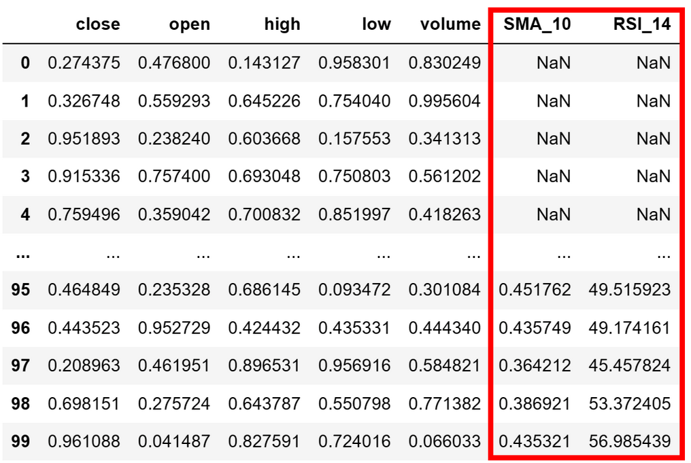

# 从零学量化87—量化宝藏工具箱：技术指标库 Pandas TA 教程 

在技术指标库中，知名度最高的可能是 TA-Lib 库，但 TA-Lib 库的Python接口需要预先安装一个C库，安装起来比较复杂，不少初学者在安装环节就被卡住了。本文介绍另一个技术指标库—— Pandas TA 库（Pandas Technical Analysis）。Pandas TA 也是一个常用的技术指标库，功能不比 TA-Lib 少，安装要比 TA-Lib 简单很多。

Pandas TA 易于使用，它利用了Pandas包，提供了130多个指标和实用功能以及60多个K线形态模式。它是一个数字时间序列特征生成器，典型的时间序列数据列包括："open"，"high"，"low"，"close"，"volume"。

Pandas TA利用了Pandas强大的数据处理功能，为开发人员提供了一个方便的接口，可以轻松地将各种技术分析指标和工具函数应用于金融时间序列数据。
## 一、Pandas TA的安装和调用

在Python环境下，你可以使用pip进行安装。在终端或命令行中运行以下命令：

```python 

pip install pandas_ta

```

安装完毕后，你可以在Python中导入pandas_ta并使用它：

```python 

import pandas_ta as ta

```

用以下命令可以查看Pandas TA支持的全部技术指标和K线形态：

```python 

df = pd.DataFrame()
df.ta.indicators()
```

用 help 命令可以查看指标的帮助文档，例如：

```python 

# 查看ema指标的帮助文档
help(ta.ema)

```

## 二、Pandas TA的基本使用示例

Pandas TA可以单独调用，也可以作为Pandas DataFrame 的扩展使用。
pandas_ta的大多数指标将返回一个 Pandas Series。像 MACD, BBANDS, KC 等返回多个数据的将返回一个 Pandas DataFrame。

Pandas TA库与TA Lib 库紧密相关，如果你还安装了 TA Lib库，则默认情况下Pandas TA会启用 TA Lib 计算，但可以使用参数 talib=False 禁用每个指标的 TA Lib 计算。例如：

```python 

ta.ema(close=df['close'], length=3, talib=False)

```

另外，Pandas TA大部分的K线形态模式都依赖 TA Lib，如果未安装 TA Lib，则只有内置的少数几个K线形态模式可用。

### 1. 单独调用的方式

例如，用pandas_ta计算EMA可以这么做：

```python 

import pandas as pd
import numpy as np
import pandas_ta as ta

# 创建一个DataFrame
df = pd.DataFrame({
    'close': np.random.random(10),
    })
    
# 调用pandas_ta的ema函数
ema = ta.ema(close=df['close'], length=3)
# 打印输出
print(ema)

```

输出的结果如下：


### 2. 作为 Pandas DataFrame 扩展的方式

这种方式允许你直接在 DataFrame 上调用技术分析函数，无需手动将价格数据传递给每个函数。例如你可以这样调用pandas_ta来计算EMA：

```python

# 计算EMA
df.ta.ema(close='close', length=3, append=True)
# 打印输出
print(df)

```

输出结果如下：


可以看到，作为DataFrame的扩展来调用pandas_ta更加方便，在调用时加上“append=True”的参数，还能将计算结果作为一个新的列追加到原DataFrame中。

默认情况下，如果DataFrame使用小写的列名：open、high、low、close 和 volume，则使用'ta' 扩展时可以直接调用，无需指定，因此上述代码还可以简化为：

```python

df.ta.ema(length=3, append=True)

```

## 三、Pandas TA的技术指标

Pandas TA的技术指标主要有以下几类：

1. 均线类指标（Overlap）

2. 动量指标（Momentum）

3. 趋势指标（Trend）

4. 波动率指标（Volatility）

5. 成交量指标（Volume）

6. 统计指标（Statistics）

7. 其他指标

在后续文章中我们将详细介绍这些技术指标的含义和用法。

## 四、蜡烛图模式（K线形态）

我们可以使用 Pandas TA 库的 candles 模块中的函数来识别蜡烛图模式（即：K线形态）。注意， Pandas TA 的大部分K线形态识别依赖于 TA-Lib 库，要使用这些蜡烛图模式，需要先安装 TA-Lib 库。
接下来，我们可以开始探索 candles 模块的使用方法。
首先，我们需要用 pandas 读取或创建一个 DataFrame，其中包含时间序列数据（通常是 OHLC 数据：开盘价、最高价、最低价和收盘价）：

```python 

import pandas as pd
import pandas_ta as ta
# 创建或读取数据
df = pd.read_csv('your_data.csv')

```

假设你的 DataFrame 的列名为 'open', 'high', 'low', 'close'。如果不是，你需要对列名进行相应的修改。

然后，你可以使用 candles 模块中的 cdl_pattern 函数来识别蜡烛图模式，下面举例说明：

### 1. 检测某种蜡烛图模式
   
比如你想要检测 "doji" 模式，可以用以下语句：

```python

df.ta.cdl_pattern(name="doji", append=True)

```

上述代码将在你的 DataFrame 中添加一个新的列 'CDL_DOJI'，其中包含布尔值（True 或 False），表示每一行数据（如每天或每分钟的数据）是否符合 Doji 蜡烛图模式。如果数据符合 Doji 蜡烛图模式， 'CDL_DOJI' 列的相应值为 True，否则为False。

### 2. 检测所有的蜡烛图模式：

```python 

df.ta.cdl_pattern(name="all", append=True)

```

当 cdl_pattern 函数设置 name="all" 时，这个函数将计算所有可用的蜡烛图模式。结果将是一个 DataFrame，其中包含了每一个蜡烛图模式的布尔值（True 或 False），表示对应的行是否符合该蜡烛图模式。

### 3. 检测部分蜡烛图模式

比如要检测 "doji" 和 "2crows" 这两种蜡烛图模式，可以用以下语句：

```python 

df.ta.cdl_pattern(name=["doji", "2crows"], append=True)

```

结果将是一个 DataFrame，包含 ["CDL_DOJI", "CDL_2CROWS"] 这两列的布尔值（True 或 False），表示对应的行是否符合该蜡烛图模式。

## 五、Pandas TA的策略

Pandas TA 提供了一种称为 "策略"（Strategy） 的功能，运用该功能可以一次性的计算多个指标值。

### 1. 创建策略

创建策略需要用 Pandas TA 的 Strategy 函数，以下是创建策略的示例：

```python 


# 创建一个名为`custom_a`的策略

custom_a = ta.Strategy(
    name = "A",
    ta = [
         {"kind": "sma", "length": 10},
         {"kind": "rsi"},
    ]
    )

```


在上述代码中，创建了一个名为`custom_a`的策略，该策略包含一个简单移动平均线（SMA）指标，周期长度为 10 ；还包括相对强弱指数（RSI）指标，未指定参数（此时将使用默认参数）。
Strategy 函数有如下几个参数：

1）`name`: 策略简短易记的字符串。注意："All"（不区分大小写）是保留的，不能使用。

2）`ta`: 包含关键字参数的字典列表，用于标识技术指标及其参数。
可选参数包括：

1）`description`: 描述策略说明。默认值：None。

2）`created`: 创建它的日期时间字符串。默认值：自动生成。

### 2. 运行策略

创建策略后就可以应用此策略。以下是一个示例：

```python 

# 假设你有一个名为'df'的Pandas DataFrame，其中包含股票历史价格数据
df = pd.read_csv('your_stock_data.csv')

# 应用策略
df.ta.strategy(custom_a)

```

在上述代码中，我们假设有一个名为`df`的Pandas DataFrame，其中包含股票的历史价格数据。

然后，我们使用`df.ta.strategy(custom_a)`来应用我们的`custom_a`策略。这将根据策略中定义的指标进行计算，并将结果添加到DataFrame中。

计算完之后，`df`将包含 “SMA_10” 和 “RSI_14” 这两列指标数据，示例如下：



我们还可以用以下语句一次性计算Pandas TA 的所有指标值或某个类型的指标值：

```python 

# 计算Pandas TA 的所有指标值，使用默认参数
df.ta.strategy("All")
# 计算Pandas TA 的"Momentum"类的指标值，使用默认参数
df.ta.strategy("Momentum")
# 计算["doji", "2crows"]这两个指标，使用默认参数
df.ta.cdl_pattern(name=["doji", "2crows"], append=True)

```

Pandas TA 的策略功能使得组织和运行技术分析指标变得更加简单和方便。