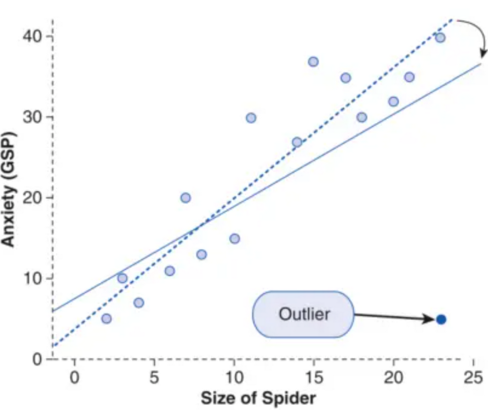

# 从零学量化95—多因子模型中的极端值处理 

极端值（通常称为极值、异常值或离群值）是指在数据集中显著偏离其他观测值的数值。在多因子模型中，极端值处理是一种常见的数据预处理手段，它有助于减少极端值或异常值对模型的影响。

## 一、为何要对极端值进行处理

极值在金融数据中具有普遍性，金融数据通常具有厚尾分布特性，即极端变化的概率比正态分布更高。这使得极值在金融数据中相对常见，需要特别注意。

极值的来源可能有：

1. 数据收集和录入错误：极值可能源自人为错误，比如输入错误或数据处理过程中的疏忽。

2. 市场异常事件：金融市场中的黑天鹅事件，如金融危机、重大政治事件等，可能导致资产价格出现极端波动。

3. 公司特定事件：公司级别的事件，如重大并购、财务造假曝光等，也可能导致个股价格暴涨暴跌。

这些极值会扭曲数据的分布，影响统计分析的准确性，并可能导致多因子模型的误判。极值对多因子模型的具体影响有：

1. 估计偏误：极端值会扭曲变量的分布，造成对均值、方差等统计量的估计偏误，进而影响到因子暴露度和风险模型的估计。

2. 影响参数估计：在回归分析中，极端值可以显著影响参数的估计值，导致模型不准确。

3. 模型过拟合：如果模型过度适应了这些极端情况，可能在正常情况下表现不佳，导致过拟合。

4. 决策失误：极值导致的模型失准可能导致错误的投资决策和风险评估。



上图显示了离群值对回归分析的影响：右下角的点为离群值。虚线表示没有离群值时这些数据的回归线，而实线表示存在离群值时的回归线。

因此，极值处理在金融数据的预处理中扮演着关键角色，有助于提高多因子模型的稳定性和预测能力。通过对极端值进行适当的调整，可以确保模型不会受到这些异常点的不当影响，使得模型的输出更加可靠。

## 二、如何处理极端值
在多因子模型中处理极端值是确保模型稳健性的关键步骤。以下是一些常见的处理极端值的方法：
### 1. 缩尾（Winsorizing）
缩尾是一种流行的处理极端值的方法。这个方法的核心思想是将所有超过特定分位数的极端值替换为该分位数的值。例如，一个常用的策略可能是设定上下1%的分位数，所有超过99%分位数的值将被设为99%分位数的值，所有低于1%分位数的值将被设为1%分位数的值。这种方法减少了极端值的影响，但保留了数据点。这既可以保持数据集的完整性，又同时减少极端值可能引起的统计分析误差。
### 2. 截尾（Truncating）
截尾是另一种方法，它直接删除超出某个阈值的数据点。这种方法比较激进，因为它会减少数据集的大小，可能会导致信息的丢失。
### 3. 对数转换
对数转换可以减少数据的偏态，将数据压缩到一个较小的范围。这对于某些高度偏态的数据分布特别有效，如金融收益率。
### 4. Box-Cox变换
Box-Cox变换是一种可以使数据更加接近正态分布的技术。这种方法通常用于回归分析，也可以用于调整多因子模型中的极端值。
### 5. Z得分标准化（Z_Score）
通过计算每个数据点的Z得分，也可以减轻极端值的影响。Z得分是指将数据点减去平均值后再除以标准差，这样可以测量每个点与平均值的距离。
### 6. 分位数归一化
分位数归一化涉及将数据转换为其在整体分布中的相对排名，而不是绝对数值。这种方法的优点是它不受极端值的影响。
### 7. 中位数绝对偏差（MAD）调整
中位数绝对偏差是一种衡量数据变异性的方法，它不像标准差那样受到极端值的影响。通过使用MAD而不是标准差，可以减少极端值对标准化过程的影响。
## 三、处理极端值需要注意的问题

处理极端值时，应当注意以下几个问题，以确保数据的处理既能降低极端值的影响，又能保持数据的真实性和有效性：
### 1. 如何定义和识别极端值
首先，应明确定义何为极端值，在某些情况下，极端值可能是重要信号而非噪声，去极值可能会掩盖掉数据的某些重要特征或模式。
其次，需要准确识别哪些数据点是极端值。在使用如缩尾这样的方法时，需要决定上下界的百分位数，这将直接影响数据的去极值效果。
### 2. 选择合适的处理方法
处理极端值时的一个重要考虑是，不同因子可能需要不同的处理方法。例如，某些因子可能天然具有较多极端值，而其他因子则相对稳定，因此，处理方法应针对每个因子的分布特性和业务背景进行个性化选择和调整。在实践中，可能需要进行多次尝试和调整以找到最佳的处理极端值方法。
### 3. 避免信息损失
在去除或调整极端值的过程中，要小心避免过度处理，导致有用信息的损失。例如，通过简单地删除极端值可能会丢失重要的信息，而适当的调整可以更好地保留这些信息。

我们需要在减少极端值带来的影响和保留数据中的信息之间寻找一个平衡点，警惕过度处理极端值可能导致的信息损失。这通常需要基于经验和实际测试来确定。
## 四、用Python处理极端值的例子

下面以缩尾（Winsorizing）为例，说明如何用Python处理极端值。在Python中，可以使用几个不同的库来进行缩尾处理，其中最常用的是scipy.stats.mstats模块中的winsorize函数。此外，pandas库和numpy库虽然本身没有直接的winsorize函数，但是可以方便地用于计算分位数，并配合使用条件语句进行缩尾处理。下面是使用这些库进行缩尾处理的示例。
### 1. 使用scipy.stats.mstats.winsorize
scipy的mstats模块提供了一个非常直接的方法来进行winsorize操作：

from scipy.stats.mstats import winsorize

```python 

# 假设data是一个numpy数组或pandas序列
# 使用5%和95%分位数进行Winsorize
winsorized_data = winsorize(data, limits=[0.05, 0.05])

```

在这个例子中，limits参数的两个值分别表示下端和上端的百分比/分位数。在这里，[0.05, 0.05]意味着数据集的底部和顶部各5%的数据将被替换。
### 2. 使用 pandas
虽然pandas没有内置的winsorize函数，但你仍然可以使用pandas来实现类似的效果：

```python 

import pandas as pd

# 假设df是一个pandas DataFrame，我们对'column_name'列进行Winsorize处理
lower_bound = df['column_name'].quantile(0.05)
upper_bound = df['column_name'].quantile(0.95)

# 现在使用条件替换来实现Winsorize
df['column_name'] = df['column_name'].clip(lower=lower_bound, upper=upper_bound)

```

在这个例子中，clip方法被用来限制数据的值在指定的上下界之间。
### 3. 使用 numpy
虽然numpy没有专门的winsorize函数，但是可以用于计算分位数，并且可以结合条件赋值来实现winsorize处理：

```python 

import numpy as np

# 假设data是一个numpy数组
lower_bound = np.percentile(data, 5)
upper_bound = np.percentile(data, 95)

# 将小于下界的值替换成下界值，将大于上界的值替换成上界值
data = np.where(data < lower_bound, lower_bound, data)
data = np.where(data > upper_bound, upper_bound, data)

```

这里使用了np.percentile来计算分位数，并使用np.where进行条件替换。