# Global cell UMAP

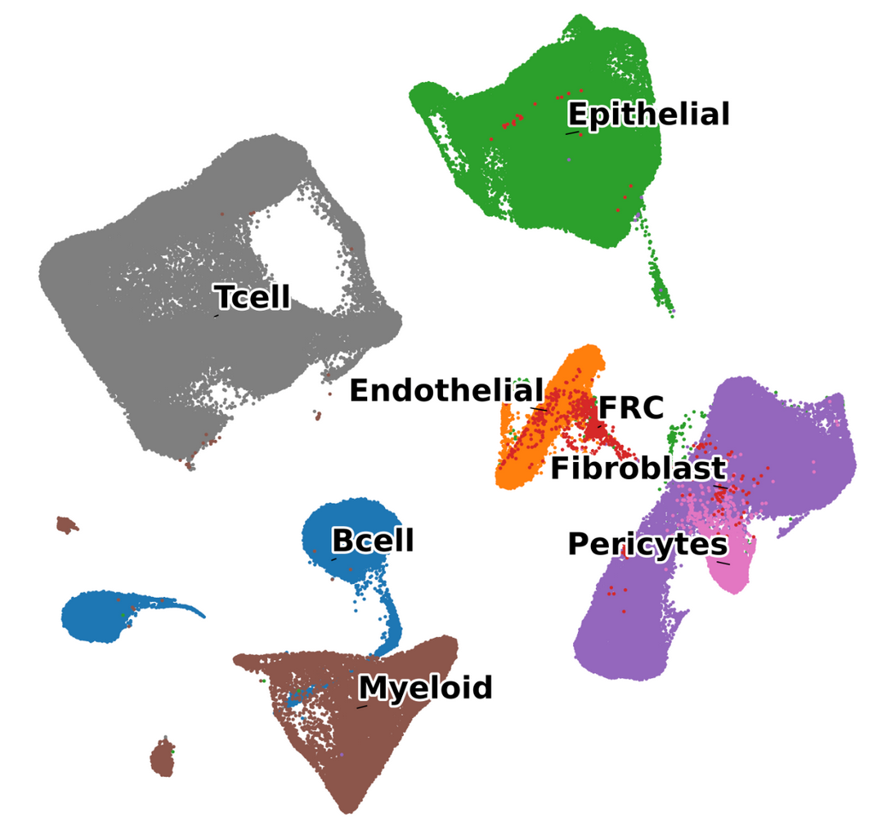

### Figure Description

Uniform Manifold Approximation and Projection (UMAP) map of Number count cells color-coded for the indicated cell
type. Including Tcell, Epithelial,endeothelialmFRE, Fibroblast,B cell,Myeloid and Pericytes.

## IdentifyKeyCelltypeBetweenESCCAndEAC

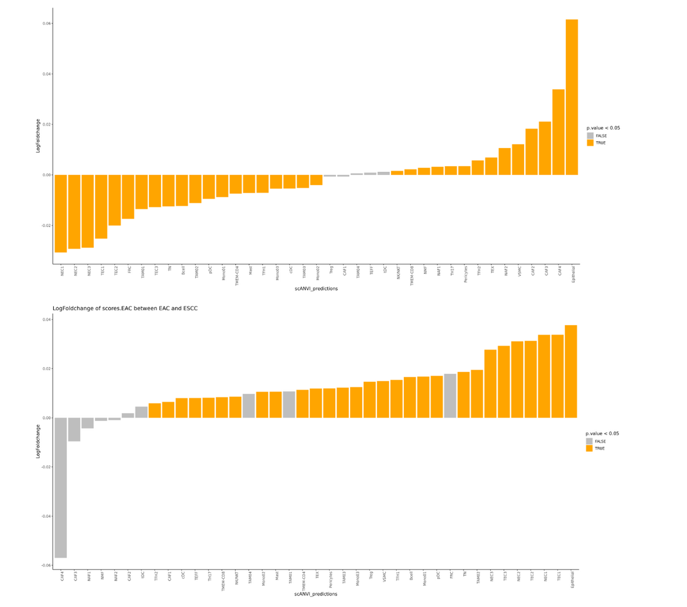

### Figure Description

### Figure Results

# T cells

## TcellIntegratedUMAPByCellType

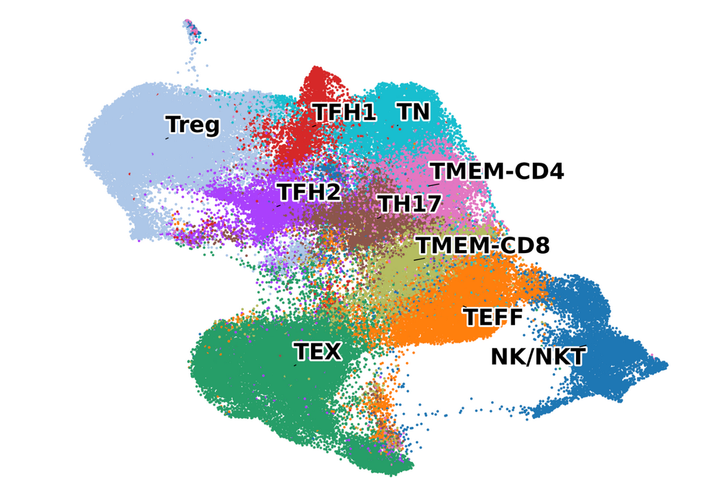

### Figure Description

The UMAP of Tcells from different T cell subpopulations. Each dot represents a cell, and the color represents the subpopulation.

## TcellIntegratedUMAPByGroup

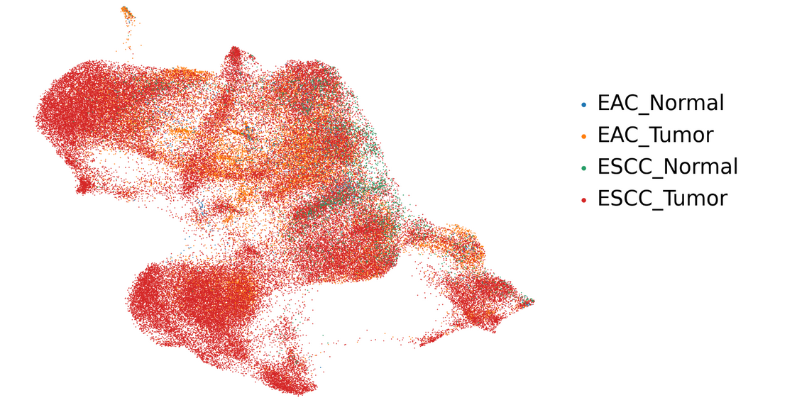

### Figure Description

The UMAP of Tcells from 4 different groups(EAC_Normal, EAC_Tumor,ESCC_Normal and EScc_Tumor). Each dot represents a cell, and the color represents the subpopulation.

## TcellOddsRatioAcrossTissueGroups

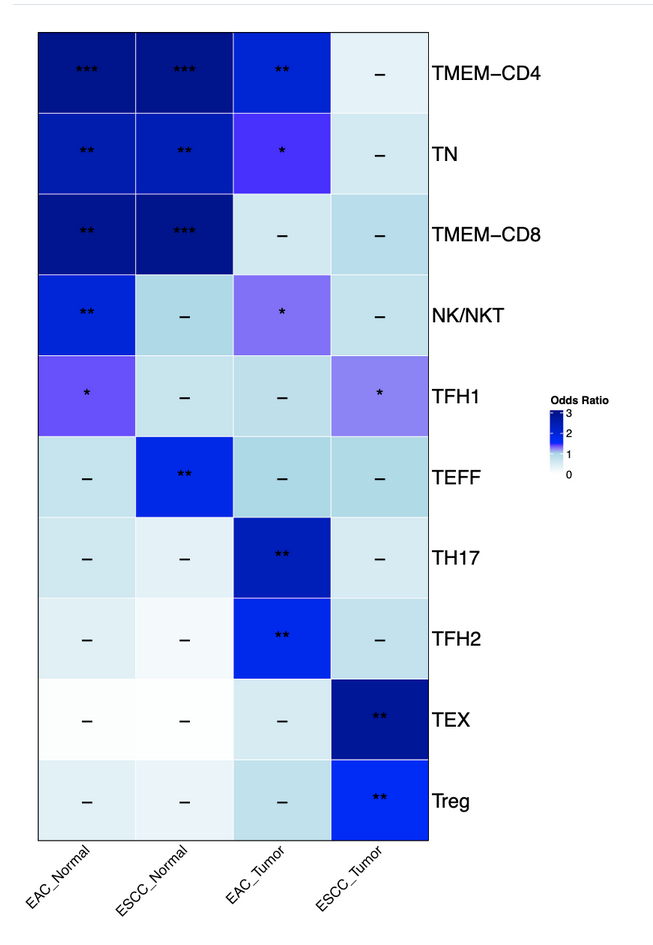

### Figure Description

EAC_Normal , ESCC_Normal , EAC_Tumor and ESCC_Tumor preference of T cell clusters in EAC and ESCC, revealed by Ro/e (ratio of observed cell number to expected cell number).

odds ratio value > 3 means significant enrichment; odds ratio value < 3 and > 1.5 means moderate enrichment;

### Figure results

Comparing with EAC_tumor group,ESCC-Tumor are enriched in TEX,
Treg and TFH1. While EAC_Tumor are enriched in TMEM-CD4，
TNT，NK/NKT,TH17 and TFH2. 

Comparison in the 4 groups, ESCC_Tumor are significantly different from the other 3 groups.TMEM-CD4 and TN enriched in EAC_normal, ESCC_normal and EAC_tumor, but in ESCC_tumor don't have these cells. At the same time,TH17 ,TFH2,TEX and Treg only existed in tumor groups(EAC_tumor and ESCC_tumor), the differences EAC_tumor enrichen in TH17 and TFH2, but ESCC_enriched in TEX and Treg.

Comparison between adjacent normal groups(EAC_normal and ESCC_normal),both of them are enriched in TMEM-CD4,
TN and TMEM-CD8. The difference between the two normal groups, NK/EAC_normal also enriched in NKT and TFH1;while ESCC_normal are enriched in TEFF.

### ChatGPT的RESULTS OUTPUT:

### 肿瘤组织的比较及意义
In the study of T cell clusters within esophageal adenocarcinoma (EAC) and esophageal squamous cell carcinoma (ESCC), distinct preferences are evident across normal and tumor environments, analyzed by the ratio of observed to expected cell numbers (Ro/e). An odds ratio value greater than 3 indicates significant enrichment, whereas a value between 1.5 and 3 suggests moderate enrichment.

In the tumor microenvironment, ESCC tumors show a distinctive enrichment for T cell clusters such as T cell exhausted (TEX), regulatory T cells (Treg), and T follicular helper type 1 (TFH1). This suggests a microenvironment that might be more immunosuppressive due to the presence of Treg and TEX cells, which are typically associated with immune evasion and suppression of effective antitumor responses. TFH1 cells are involved in promoting B cell differentiation in germinal centers and may affect antibody responses in the tumor microenvironment.

Conversely, EAC tumors predominantly contain tissue-resident memory CD4+ T cells (TMEM-CD4), terminally differentiated effector T cells (TNT), natural killer/NKT cells (NK/NKT), TH17, and T follicular helper type 2 (TFH2). This indicates a more diverse and potentially active immune environment, with TH17 and TFH2 known for their roles in promoting inflammation and supporting B cell maturation and antibody production, respectively.

When comparing across all four groups (EAC_Normal, ESCC_Normal, EAC_Tumor, ESCC_Tumor), significant differences are noted, particularly with ESCC tumors which lack TMEM-CD4 and TN cells found in the other groups. This absence may signify a unique tumor microenvironment in ESCC that does not support or needs these T cell subsets, possibly due to different underlying mechanisms of tumor immunity or escape.

Additionally, TH17, TFH2, TEX, and Treg are primarily present in the tumor groups (EAC_tumor and ESCC_tumor), emphasizing a shift towards more specialized T cell functions in cancerous tissues compared to normal tissues. EAC tumors are specifically enriched in TH17 and TFH2, aligning with a more inflammation-prone and antibody-supportive environment. In contrast, ESCC tumors are enriched in TEX and Treg, highlighting a microenvironment that could be more adapted to suppress effective immune surveillance and response.

These observations underscore the complex interplay of T cell dynamics in cancer development and progression, reflecting how different types of esophageal cancer might interact with and modify their immune landscape. Understanding these differences is crucial for designing targeted immunotherapies and understanding the immunological underpinnings of patient responses.

### 癌旁组织的比较及意义
In the adjacent normal tissues, both EAC_normal and ESCC_normal display enrichment for TMEM-CD4 (memory T cells expressing CD4), TN (naive T cells), and TMEM-CD8 (memory T cells expressing CD8), indicating a preserved memory and naive T cell component that may play a role in surveilling and responding to emergent tumor cells or residual disease. This similarity suggests common immunological features in the normal tissues adjacent to different types of esophageal cancers.

However, differences are also evident between the two normal tissue types. NK cells, along with NKT (natural killer T cells) and TFH1 (T follicular helper cells type 1), show a specific enrichment in EAC_normal. This indicates a possibly heightened state of immune readiness, potentially reflecting an adaptive response to the microenvironment influenced by adenocarcinoma. In contrast, ESCC_normal tissues show a significant presence of TEFF (effector T cells), which might suggest an ongoing active immune response, possibly due to the inflammatory nature associated with squamous cell carcinoma or its precursors.

These findings underline distinct immune environments in the normal tissues adjacent to different esophageal cancers, which could influence the progression or the response to therapy in these cancer types. The presence of specific T cell subsets in normal tissues adjacent to tumors could provide valuable prognostic information and might also reveal potential targets for immunotherapy.

## TcellCelltypeProportionAcrossTissueGroups

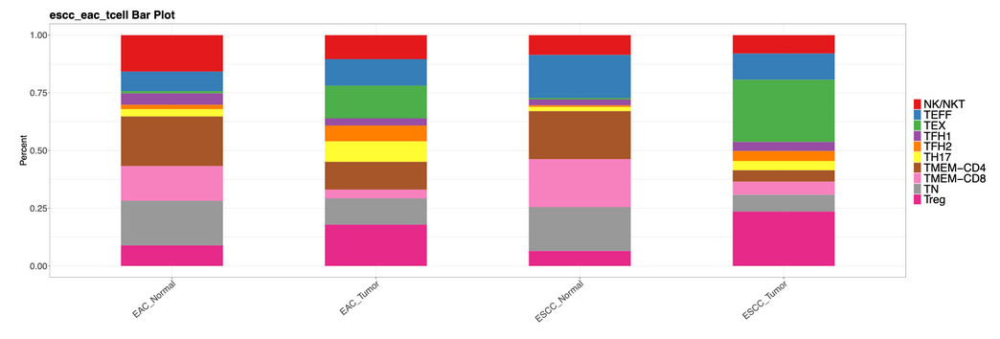

### Figure Description

Barplot of the number of cells in each T cell type at the level 3 cell type annotation.

x-axis: tissue type (EAC_Normal, ESCC_Normal, EAC_tumor, ESCC_tumor) y-axis: proportion of cell type within Macrophage cells Barplot proportions of Macrophage subpopulations within all the Macrophages across different tissue types.

## EACTcellDEGsEnrichedPathways

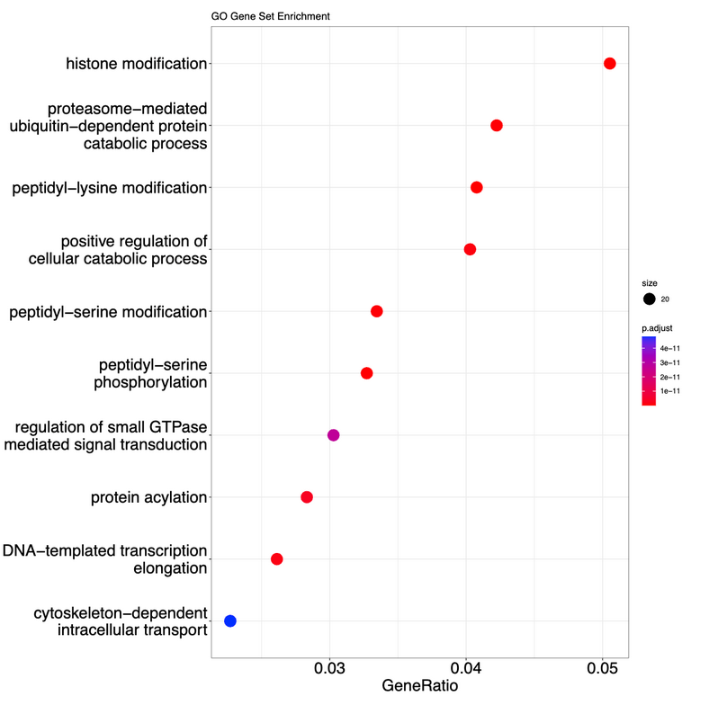

### Figure Description

Enrichment dot plot of enriched GO gene sets in EAC T cells. x-axis: gene ratio, the ratio of the number of genes in the gene set to the total number of genes in the gene set. the color represents the p adjusted value of the enrichment analysis. dot size represents the number of genes in the gene set

cell type: EAC Tcell (ALL)

dataset: scRNA-seq

algorithm: GO gene enrichment analysis

### Figure results

自己写的：EAC T cell DEGS enrichment in these pathways :histone modification，proteasome-mediated ubiquitin-dependent protein catabolic process，peptidyl-lysine modification，
positive regulation ofcelluiar catabolic process and
peptidyl-serine modification.

### ChatGPT写的：

RESULTS OUTPUT:

The module aims to visualize the enrichment of GO gene sets in EAC T cells using a dot plot, which will represent the gene ratio on the x-axis, reflecting the proportion of genes in each gene set relative to the total number of genes within that set. The p-adjusted value from the enrichment analysis will be indicated by the color of each dot, and the size of the dot will correspond to the total number of genes within each gene set. This analysis utilizes single-cell RNA sequencing data and employs a gene ontology (GO) gene enrichment analysis algorithm specifically for EAC T cells.

In terms of findings, the figure results were revised for clarity and suitability for publication in a high-impact journal such as Nature:

"EAC T cells demonstrate significant differential gene expression enrichments in several key biological pathways. These include histone modification, proteasome-mediated ubiquitin-dependent protein catabolic process, peptidyl-lysine modification, positive regulation of cellular catabolic process, and peptidyl-serine modification."

Biological Interpretation of the Figure Results:

The enrichment of gene sets in EAC T cells reveals pivotal biological processes that are active in these cells, which might be linked to their role in the tumor microenvironment:
1. **Histone Modification**: The enrichment in this pathway suggests active chromatin remodeling in EAC T cells, which could influence gene expression patterns crucial for T cell function or adaptation within the tumor microenvironment.
2. **Proteasome-mediated Ubiquitin-dependent Protein Catabolic Process**: This pathway's prominence indicates a high turnover of proteins, possibly reflecting the cells' response to stress or the need to regulate various signaling pathways critical for T cell activity or survival.
3. **Peptidyl-Lysine and Peptidyl-Serine Modification**: Modifications on these amino acids often relate to post-translational modifications that can alter protein function, stability, or localization, suggesting adaptive or regulatory modifications in protein function within T cells.
4. **Positive Regulation of Cellular Catabolic Process**: This indicates an upregulation of catabolic processes, which could be crucial for generating the necessary energy and molecular building blocks from internal sources, particularly under conditions where external resources might be limited, such as in hypoxic or nutrient-poor tumor microenvironments.

These findings underscore the adaptive changes in intracellular processes of EAC T cells, potentially driven by the demands of the tumor microenvironment or by the intrinsic needs of T cells to maintain functionality in such challenging conditions. Understanding these processes provides insight into the mechanisms of T cell adaptation and persistence in esophageal adenocarcinoma, offering potential targets for therapeutic intervention to enhance T cell efficacy in cancer treatment.

## ESCCTcellDEGsEnrichedPathways

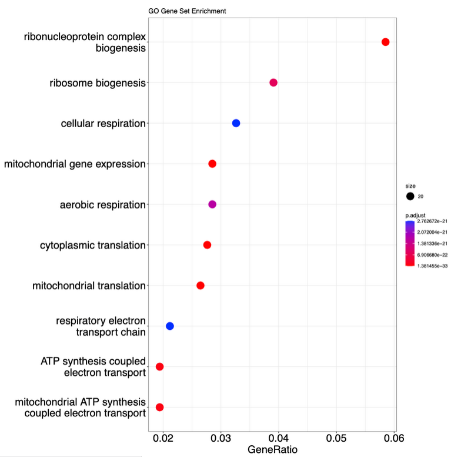

### Figure Description

Enrichment dot plot of enriched GO gene sets in ESCC T cells. x-axis: gene ratio, the ratio of the number of genes in the gene set to the total number of genes in the gene set. the color represents the p adjusted value of the enrichment analysis. dot size represents the number of genes in the gene set

cell type: ESCC Tcell (ALL)

dataset: scRNA-seq

algorithm: GO gene enrichment analysis

### Figure Results

ESCC T cell DEGS enrichment in these pathways :ribonucleoprotein complex biogenesis，ribosome biogenesis，cellular respiration，mitochondrial gene expression and aerobic respiration.

### ChatGP写的：

RESULTS OUTPUT:

The enrichment analysis of differentially expressed genes (DEGs) in T cells from esophageal squamous cell carcinoma (ESCC) patients has revealed significant activity in several key biological pathways. Specifically, DEGs were enriched in pathways related to ribonucleoprotein complex biogenesis, ribosome biogenesis, cellular respiration, mitochondrial gene expression, and aerobic respiration.

These pathways highlight the altered cellular functions in T cells within the tumor microenvironment of ESCC. Ribonucleoprotein complex biogenesis and ribosome biogenesis are crucial for protein synthesis, indicating a potentially increased demand for protein production in ESCC T cells, possibly to support rapid cellular responses to the tumor environment. The enrichment in cellular respiration, mitochondrial gene expression, and aerobic respiration pathways suggests an enhanced metabolic activity in these T cells, reflecting a possible adaptation to the high-energy demands for maintaining T cell effector functions in the challenging tumor microenvironment. This adaptation may be crucial for the survival and function of T cells in combating cancer cells, indicating a significant shift in energy metabolism that could impact the effectiveness of the immune response in ESCC.
## ESCCTcellSignatureViolinPlot

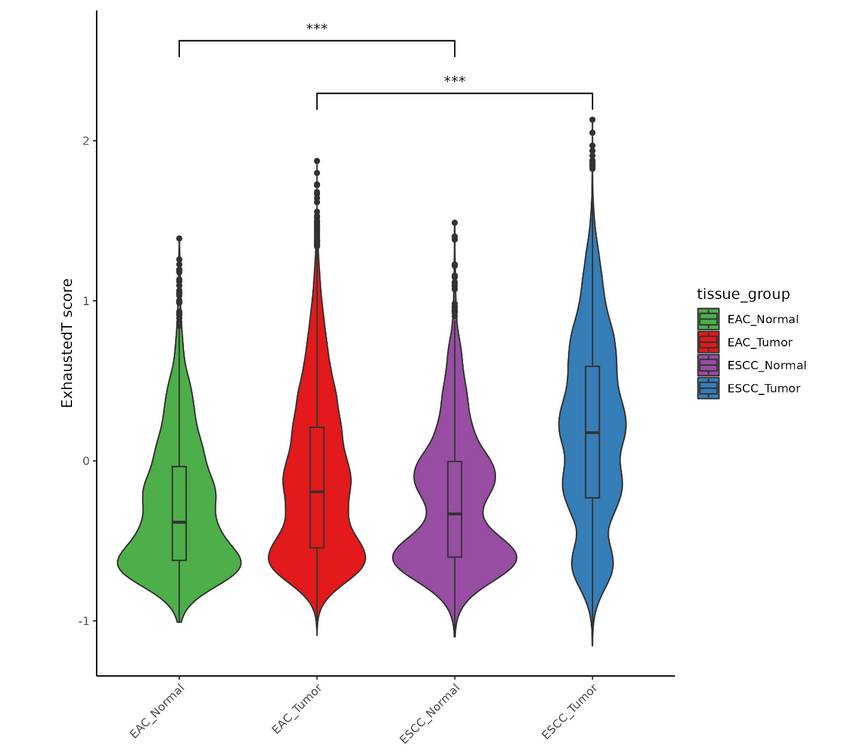

### Figure DEscription

ViolintPlot of Exhausted score across 4 different groups(EAC_Normal,EAC_tumor,ESCC_Normal and ESCC_tumor).

### Figure Results

Comprison between EAC and ESCC, Exhausted score of ESCC  are higher than EAC  in both tumor and normal groups.

### ChatGPT写的

RESULTS OUTPUT:

The Violin Plot of the Exhausted score across four different groups, including EAC_Normal, EAC_tumor, ESCC_Normal, and ESCC_tumor, illustrates a noteworthy trend in cellular exhaustion levels among different esophageal cancer types and their respective normal tissues.

In the revised text for potential publication in a high-impact journal such as Nature, the result description would be as follows:
"A comparative analysis of exhausted T cell scores across esophageal adenocarcinoma (EAC) and esophageal squamous cell carcinoma (ESCC) reveals that ESCC, irrespective of being in tumor or normal tissue context, consistently exhibits higher exhaustion levels than EAC."

The biological interpretation of these findings suggests a differential immune response modulation in ESCC compared to EAC. T cell exhaustion, characterized by the progressive loss of T cell function due to chronic antigen exposure, is more pronounced in ESCC. This could indicate a more suppressive tumor microenvironment in ESCC, which might be contributing to the immune evasion mechanisms prevalent in this cancer type. In contrast, EAC might present a less inhibitive environment, allowing better T cell functionality. This distinction in immune landscapes can inform targeted therapeutic strategies, potentially focusing on enhancing T cell activity in ESCC or sustaining it in EAC.

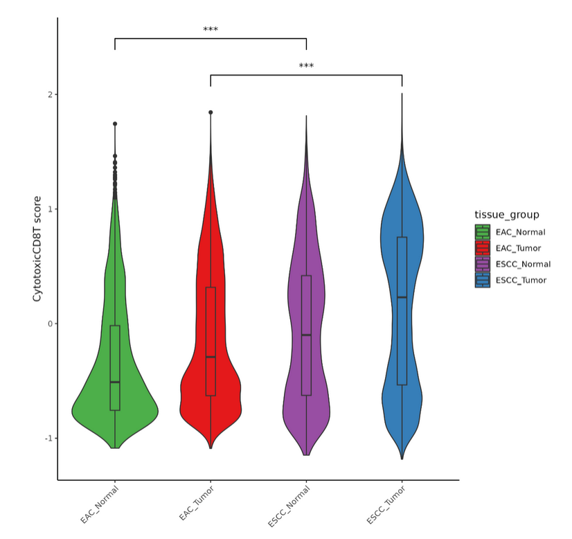

### Figure Description 

ViolintPlot of CytotoxicCD8T score across 4 different groups(EAC_Normal,EAC_tumor,ESCC_Normal and ESCC_tumor).

### Figure Results

Comprison between EAC and ESCC, ytotoxicCD8T score of ESCC  are significantly higher than EAC  in both tumor and normal groups.

### ChatGPT写的：

RESULTS OUTPUT:

The analysis of cytotoxic CD8 T-cell scores across four distinct groups, namely EAC (Esophageal Adenocarcinoma) Normal, EAC Tumor, ESCC (Esophageal Squamous Cell Carcinoma) Normal, and ESCC Tumor, was visualized using Violin Plots. The comparison between EAC and ESCC reveals that cytotoxic CD8 T-cell scores are significantly higher in both the normal and tumor tissues of ESCC compared to those of EAC.

Biological Meaning:

Cytotoxic CD8 T cells play a critical role in the immune surveillance against cancer by directly targeting and eliminating tumor cells. The higher scores observed in ESCC may indicate a more robust immune response within both the tumor microenvironment and the adjacent normal tissues compared to EAC. This enhanced cytotoxic activity in ESCC could be attributed to several factors, including the inherent immunogenicity of squamous cell carcinomas, which might elicit a stronger immune reaction due to higher mutational burdens or the presence of more immunogenic antigens compared to adenocarcinomas.

Furthermore, the significant difference in the cytotoxic CD8 T-cell scores between the normal and tumor environments in both cancer types may also reflect the degree of immune infiltration and activity, which is crucial for understanding the tumor's capacity to evade immune surveillance. The findings suggest that ESCC may be more amenable to immunotherapy strategies due to its heightened immune visibility, while EAC might present more challenges due to a potentially more suppressive microenvironment.

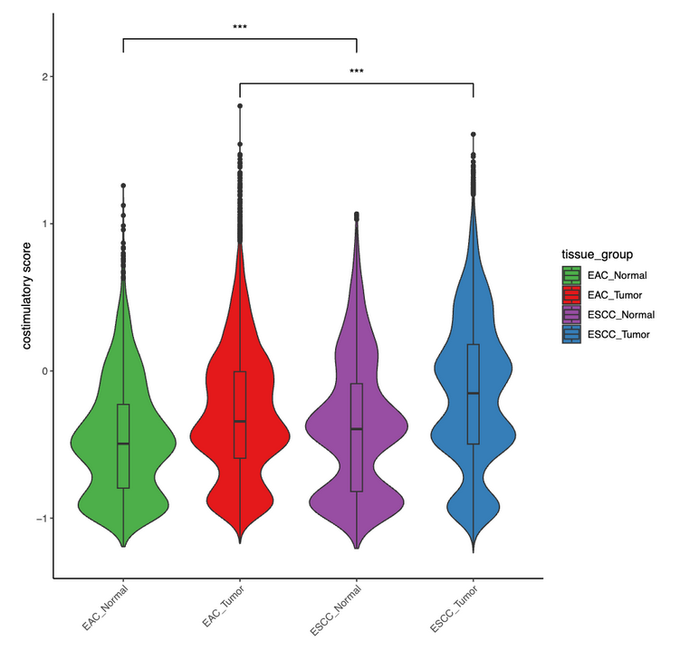

### Figure Description

ViolintPlot of Costimulatory score across 4 different groups(EAC_Normal,EAC_tumor,ESCC_Normal and ESCC_tumor).

###  Figure Results

Comprison between EAC and ESCC, Costimulatory score of ESCC  are significantly higher than EAC  in both tumor and normal groups.

### ChatGPT写的：

RESULTS OUTPUT:

The module involves generating Violin Plots to compare the Costimulatory scores across four different groups: EAC_Normal, EAC_tumor, ESCC_Normal, and ESCC_tumor. These scores are crucial as they reflect the degree of activation potential within the immune cells mediated by costimulatory signals which are essential for effective T-cell responses.

Rewritten figure results for publication in Nature Journal:
"In a comparative analysis of esophageal adenocarcinoma (EAC) and esophageal squamous cell carcinoma (ESCC), the Costimulatory scores were found to be significantly higher in both the normal and tumor tissues of ESCC as compared to those of EAC."

Biological meaning of the figure results:
The higher Costimulatory scores observed in both normal and tumor tissues of ESCC compared to EAC suggest a more activated or potentially effective immune environment in ESCC. Costimulatory signals are critical for T-cell activation, proliferation, and survival, and are essential for an effective adaptive immune response. Higher scores in ESCC could indicate a more robust immune response, possibly contributing to a different immunological landscape that could influence the progression of the disease and its response to therapies. This differential immune activation profile may reflect inherent differences in the immunogenicity of the two cancer types, potentially driven by variations in the expression of immune-modulatory molecules, tumor antigens, or the presence of specific immune infiltrates. Understanding these differences is crucial for tailoring immunotherapy approaches according to the unique immune environments of different esophageal cancers.

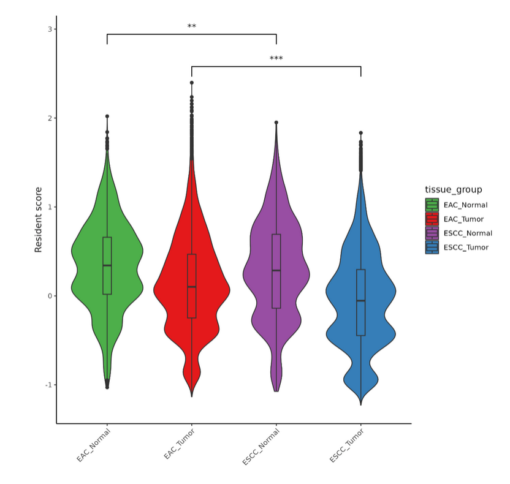

### Figure Description

ViolintPlot of Resident score across 4 different groups(EAC_Normal,EAC_tumor,ESCC_Normal and ESCC_tumor).

###  Figure Results

Comprison between EAC and ESCC, Resident score of ESCC  are significantly lower than EAC  in both tumor and normal groups.

### ChatGPT写的:

RESULTS OUTPUT:

The module aims to present a Violin Plot depicting the distribution of Resident scores across four different groups: EAC_Normal, EAC_tumor, ESCC_Normal, and ESCC_tumor. These groups represent normal and tumorous tissues from patients diagnosed with esophageal adenocarcinoma (EAC) and esophageal squamous cell carcinoma (ESCC).

Figure Results:
Analysis of the Resident scores revealed that, in a comparison between esophageal adenocarcinoma (EAC) and esophageal squamous cell carcinoma (ESCC), the Resident scores in both the normal and tumor tissues of ESCC are significantly lower than those observed in EAC.

Biological Meaning:
The Resident score typically reflects the degree of immune cell presence or activity within a given tissue. The significantly lower Resident scores observed in both normal and tumor tissues of ESCC compared to EAC suggest a reduced immune cell infiltration or activity in ESCC. This finding might indicate an inherent difference in the immunological environment between these two types of esophageal cancer. A diminished immune presence in ESCC could imply a potential for higher immune evasion, possibly contributing to the aggressiveness or differing therapeutic responses observed in ESCC compared to EAC. Understanding these differences is crucial for tailoring specific immunotherapeutic strategies or assessing prognosis more accurately for each cancer subtype.

### 我把以上四个图总结一下，问了ChatGPT，这个是结果：

These observations reveal significant differences in the immune environment characteristics between esophageal squamous cell carcinoma (ESCC) and esophageal adenocarcinoma (EAC). Specifically:

1. **Higher toxicity, exhaustion, and costimulatory scores in ESCC compared to EAC**:
   - **Higher toxicity** suggests that immune cells in ESCC, especially CD8+ T cells, have a higher cytotoxic capability and are more effective at killing tumor cells. This could be related to the expression of more antigens on the surface of ESCC cells, thereby triggering a stronger immune response.
   - **Higher exhaustion scores** indicate that although the immune cells are more active, they also face the risk of exhaustion due to continuous activation. Exhausted immune cells may lose efficacy in long-term anti-tumor responses, suggesting that the immune response in ESCC may become unsustainable due to ongoing intense reactions.
   - **Higher costimulatory scores** reflect the presence of more costimulatory signals in the ESCC microenvironment, which help activate and sustain T cell immune responses. This is generally a positive immune characteristic that aids in strengthening the attack on the tumor.

2. **Lower residence scores in ESCC compared to EAC**:
   - **Lower residence scores** imply that immune cells in ESCC have shorter stay times, possibly indicating a lower survival rate of immune cells in the tumor microenvironment or that immune cells quickly leave the tumor area after fulfilling their immune functions. This could be due to the presence of more cytotoxic conditions or immune suppressive factors in the ESCC tumor microenvironment, making it difficult for immune cells to survive there for extended periods.

These characteristics suggest that compared to EAC, ESCC may exhibit a more aggressive immune state, with immune cells displaying higher activity but also being more prone to exhaustion. This environment, although potentially beneficial in initially combating the tumor, might lead to a decline in immune system functionality over time, thereby affecting sustained control over the tumor. Additionally, the rapid mobility of immune cells could impact their ability to form lasting immune memory in the tumor microenvironment, further complicating treatment responses and disease management.

Understanding these differences is crucial for designing treatment strategies tailored to different types of esophageal cancer, particularly when utilizing immune checkpoint inhibitors or other immunomodulatory therapies, as it is important to consider how to optimize treatment to suit their respective immune characteristics.

# Myeloid
## ESCAUMAPByCellType

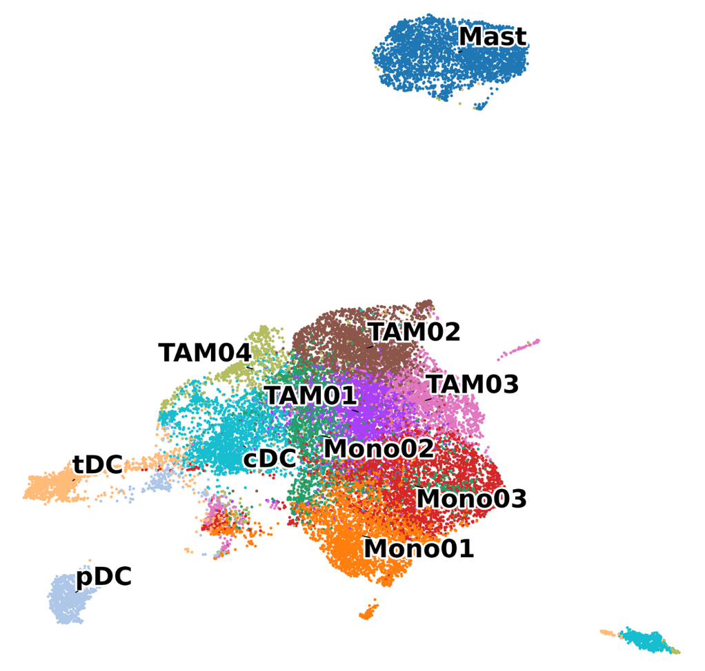

### Figure Description

The UMAP of Myeloid cells from different Myeloid cell subpopulations. Each dot represents a cell, and the color represents the subpopulation.

### Figure Results

## ESCAUMAPByGroup

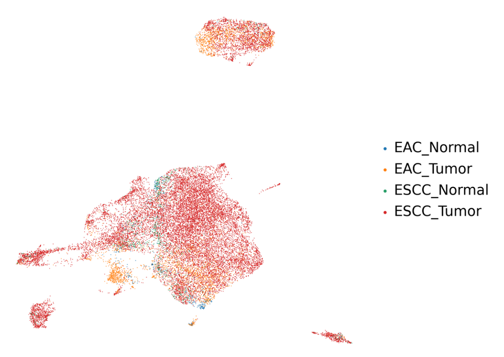

### Figure Description

EAC_Normal , ESCC_Normal , EAC_Tumor and ESCC_Tumor preference of Myeloid cell clusters in EAC and ESCC, revealed by Ro/e (ratio of observed cell number to expected cell number).

odds ratio value > 3 means significant enrichment; odds ratio value < 3 and > 1.5 means moderate enrichment;

### Figure Results

## ESCCEACMyeloidOddsRatioAcrossTissueGroups

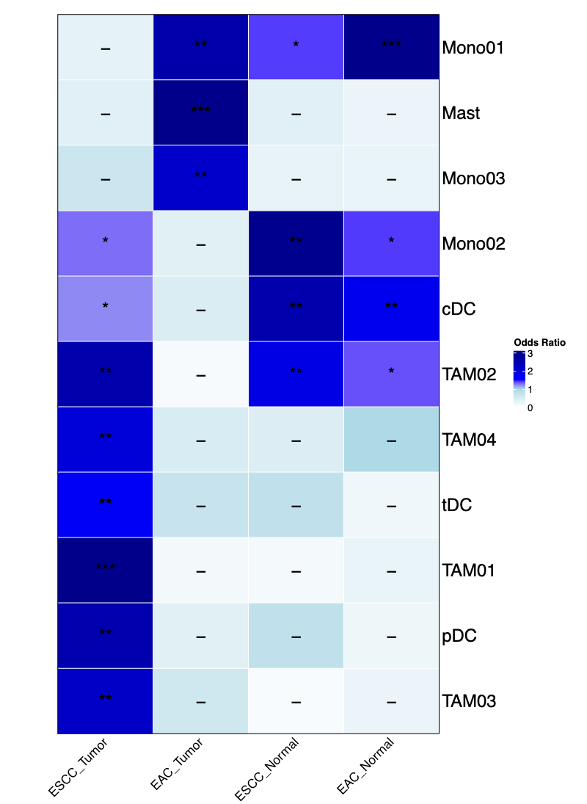

### Figure Description

EAC_Normal , ESCC_Normal , EAC_Tumor and ESCC_Tumor preference of Myeloid cell clusters in EAC and ESCC, revealed by Ro/e (ratio of observed cell number to expected cell number).

odds ratio value > 3 means significant enrichment; odds ratio value < 3 and > 1.5 means moderate enrichment;

### Figure Results

In ESCC_tumor enrichment :Mono02，cDC，TAM02，TAM04，tDC，TAM01，pDC
and TAM03.In EAC_tumor enrichment:Mono01，Mast and Mono03.ESCC_tumor and EAC_tumor are completely different.

In EAC_Normal and  ESCC_Normal both enrichement:Mono01 Mono02，cDC and TAM02. 

TAM04，tDC，TAM01，pDC and TAM03 only enriched in ESCC_tumor.
Mast and Mono03 only enriched in EAC_tumor.

### ChatGPT写的

RESULTS OUTPUT:

The analysis of Myeloid cell cluster preferences in Esophageal Adenocarcinoma (EAC) and Esophageal Squamous Cell Carcinoma (ESCC) based on the ratio of observed cell number to expected cell number (Ro/e) has provided key insights into the tumor microenvironment of these cancers. Specifically, we measured significant enrichment (odds ratio value > 3) and moderate enrichment (odds ratio value > 1.5 and < 3) of various myeloid cell types in tumor and adjacent normal tissues.

For ESCC tumor tissues, the cell types that showed significant enrichment included monocytes (Mono02), conventional dendritic cells (cDC), tumor-associated macrophages (TAM02, TAM04, TAM01, and TAM03), and plasmacytoid dendritic cells (pDC). In contrast, EAC tumor tissues exhibited significant enrichment for a different subset of myeloid cells, specifically Mono01, mast cells, and Mono03. This indicates distinct immunological landscapes in ESCC versus EAC tumors, reflecting potentially unique mechanisms of immune evasion or interaction with the tumor microenvironment.

Both EAC and ESCC normal tissues shared moderate enrichment for Mono01, Mono02, cDC, and TAM02, suggesting a common myeloid background in the normal esophageal environment across these cancer types. However, certain myeloid cells such as TAM04, tDC (tissue dendritic cells), TAM01, pDC, and TAM03 were only significantly enriched in ESCC tumor, pointing towards a specific immune response or adaptation in the squamous cell carcinoma subtype. Meanwhile, mast cells and Mono03 were exclusively enriched in EAC tumor, indicating a potential role for these cells in adenocarcinoma progression or immune modulation.

These findings highlight the complex and divergent roles that myeloid cells play in the tumor microenvironment of esophageal cancers, potentially influencing disease progression, response to therapy, and patient outcomes. Further studies are warranted to explore the functional impact of these enriched myeloid populations in EAC and ESCC, aiming to develop targeted therapies that modulate the tumor immune microenvironment.

## ESCCEACBarplot

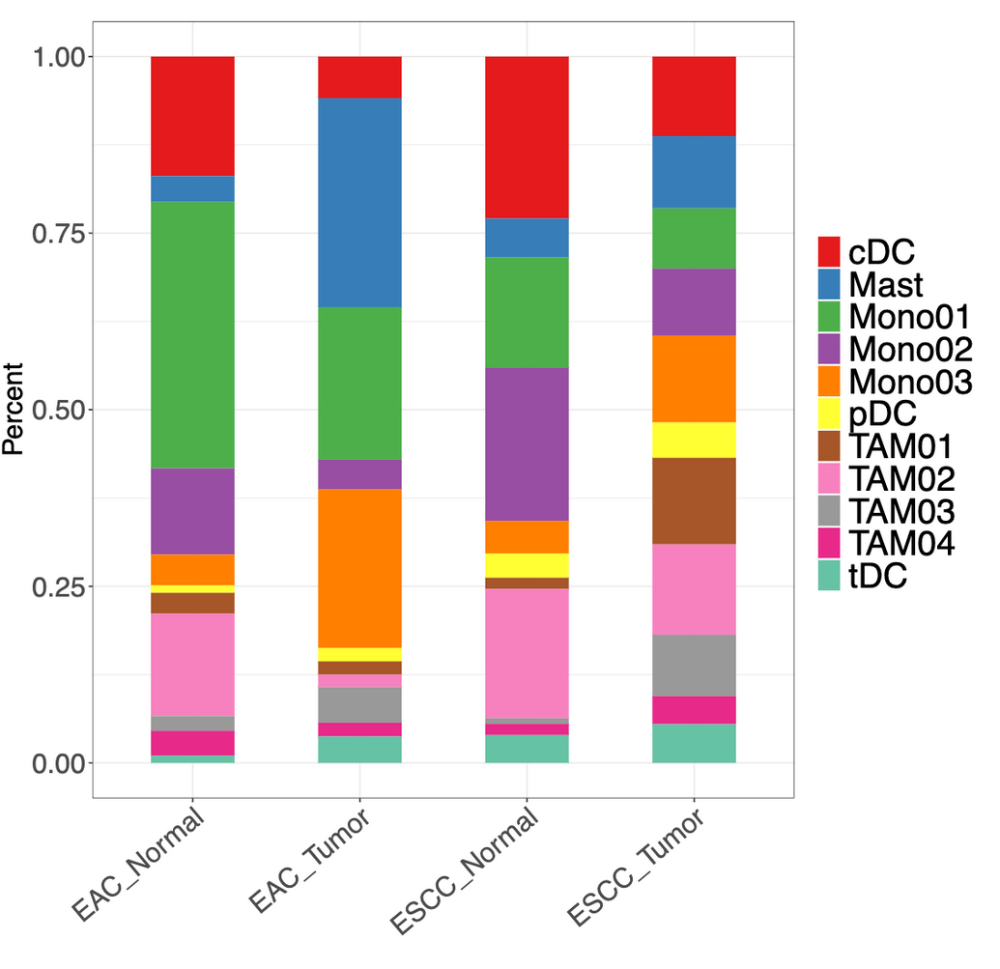

### Figure Description

Barplot of the number of cells in each Macrophage cell type at the level 3 cell type annotation.

x-axis: tissue type (EAC_Normal, ESCC_Normal, EAC_tumor, ESCC_tumor) y-axis: proportion of cell type within Macrophage cells Barplot proportions of Macrophage subpopulations within all the Macrophages across different tissue types.

### Figure Results