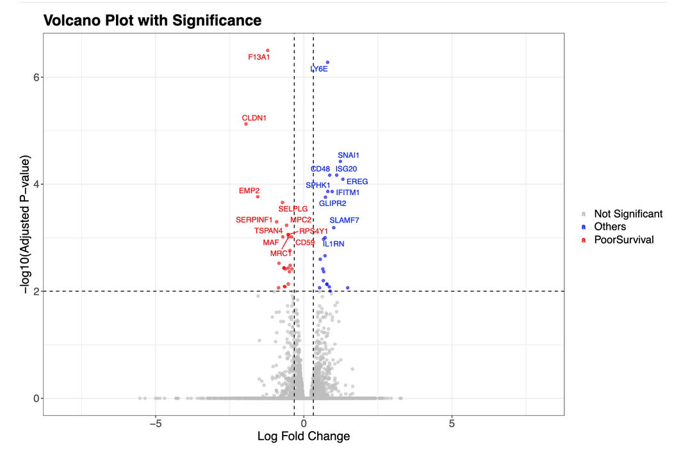

# Global cell UMAP

### Figure Description

Uniform Manifold Approximation and Projection (UMAP) map of Number count cells color-coded for the indicated cell
type. Including Tcell, Epithelial,endeothelialmFRE, Fibroblast,B cell,Myeloid and Pericytes.

## IdentifyKeyCelltypeBetweenESCCAndEAC

### Figure Description

### Figure Results

# T cells

## TcellIntegratedUMAPByCellType

### Figure Description

The UMAP of Tcells from different T cell subpopulations. Each dot represents a cell, and the color represents the subpopulation.

## TcellIntegratedUMAPByGroup

### Figure Description

The UMAP of Tcells from 4 different groups(EAC_Normal, EAC_Tumor,ESCC_Normal and EScc_Tumor). Each dot represents a cell, and the color represents the subpopulation.

## TcellOddsRatioAcrossTissueGroups

### Figure Description

EAC_Normal , ESCC_Normal , EAC_Tumor and ESCC_Tumor preference of T cell clusters in EAC and ESCC, revealed by Ro/e (ratio of observed cell number to expected cell number).

odds ratio value > 3 means significant enrichment; odds ratio value < 3 and > 1.5 means moderate enrichment;

### Figure results

Comparing with EAC_tumor group,ESCC-Tumor are enriched in TEX,
Treg and TFH1. While EAC_Tumor are enriched in TMEM-CD4，
TNT，NK/NKT,TH17 and TFH2. 

Comparison in the 4 groups, ESCC_Tumor are significantly different from the other 3 groups.TMEM-CD4 and TN enriched in EAC_normal, ESCC_normal and EAC_tumor, but in ESCC_tumor don't have these cells. At the same time,TH17 ,TFH2,TEX and Treg only existed in tumor groups(EAC_tumor and ESCC_tumor), the differences EAC_tumor enrichen in TH17 and TFH2, but ESCC_enriched in TEX and Treg.

Comparison between adjacent normal groups(EAC_normal and ESCC_normal),both of them are enriched in TMEM-CD4,
TN and TMEM-CD8. The difference between the two normal groups, NK/EAC_normal also enriched in NKT and TFH1;while ESCC_normal are enriched in TEFF.

### ChatGPT的RESULTS OUTPUT:

### 肿瘤组织的比较及意义
In the study of T cell clusters within esophageal adenocarcinoma (EAC) and esophageal squamous cell carcinoma (ESCC), distinct preferences are evident across normal and tumor environments, analyzed by the ratio of observed to expected cell numbers (Ro/e). An odds ratio value greater than 3 indicates significant enrichment, whereas a value between 1.5 and 3 suggests moderate enrichment.

In the tumor microenvironment, ESCC tumors show a distinctive enrichment for T cell clusters such as T cell exhausted (TEX), regulatory T cells (Treg), and T follicular helper type 1 (TFH1). This suggests a microenvironment that might be more immunosuppressive due to the presence of Treg and TEX cells, which are typically associated with immune evasion and suppression of effective antitumor responses. TFH1 cells are involved in promoting B cell differentiation in germinal centers and may affect antibody responses in the tumor microenvironment.

Conversely, EAC tumors predominantly contain tissue-resident memory CD4+ T cells (TMEM-CD4), terminally differentiated effector T cells (TNT), natural killer/NKT cells (NK/NKT), TH17, and T follicular helper type 2 (TFH2). This indicates a more diverse and potentially active immune environment, with TH17 and TFH2 known for their roles in promoting inflammation and supporting B cell maturation and antibody production, respectively.

When comparing across all four groups (EAC_Normal, ESCC_Normal, EAC_Tumor, ESCC_Tumor), significant differences are noted, particularly with ESCC tumors which lack TMEM-CD4 and TN cells found in the other groups. This absence may signify a unique tumor microenvironment in ESCC that does not support or needs these T cell subsets, possibly due to different underlying mechanisms of tumor immunity or escape.

Additionally, TH17, TFH2, TEX, and Treg are primarily present in the tumor groups (EAC_tumor and ESCC_tumor), emphasizing a shift towards more specialized T cell functions in cancerous tissues compared to normal tissues. EAC tumors are specifically enriched in TH17 and TFH2, aligning with a more inflammation-prone and antibody-supportive environment. In contrast, ESCC tumors are enriched in TEX and Treg, highlighting a microenvironment that could be more adapted to suppress effective immune surveillance and response.

These observations underscore the complex interplay of T cell dynamics in cancer development and progression, reflecting how different types of esophageal cancer might interact with and modify their immune landscape. Understanding these differences is crucial for designing targeted immunotherapies and understanding the immunological underpinnings of patient responses.

### 癌旁组织的比较及意义
In the adjacent normal tissues, both EAC_normal and ESCC_normal display enrichment for TMEM-CD4 (memory T cells expressing CD4), TN (naive T cells), and TMEM-CD8 (memory T cells expressing CD8), indicating a preserved memory and naive T cell component that may play a role in surveilling and responding to emergent tumor cells or residual disease. This similarity suggests common immunological features in the normal tissues adjacent to different types of esophageal cancers.

However, differences are also evident between the two normal tissue types. NK cells, along with NKT (natural killer T cells) and TFH1 (T follicular helper cells type 1), show a specific enrichment in EAC_normal. This indicates a possibly heightened state of immune readiness, potentially reflecting an adaptive response to the microenvironment influenced by adenocarcinoma. In contrast, ESCC_normal tissues show a significant presence of TEFF (effector T cells), which might suggest an ongoing active immune response, possibly due to the inflammatory nature associated with squamous cell carcinoma or its precursors.

These findings underline distinct immune environments in the normal tissues adjacent to different esophageal cancers, which could influence the progression or the response to therapy in these cancer types. The presence of specific T cell subsets in normal tissues adjacent to tumors could provide valuable prognostic information and might also reveal potential targets for immunotherapy.

## TcellCelltypeProportionAcrossTissueGroups

### Figure Description

Barplot of the number of cells in each T cell type at the level 3 cell type annotation.

x-axis: tissue type (EAC_Normal, ESCC_Normal, EAC_tumor, ESCC_tumor) y-axis: proportion of cell type within Macrophage cells Barplot proportions of Macrophage subpopulations within all the Macrophages across different tissue types.

### Figure REsults

Comparison between EAC_tumor and ESCC_tumor,  TEX and Treg in ESCC_tumor have a much higher proportino than in EAC_tumor.

Comparison between EAC_normal and ESCC_normal, NK/NKT in EAC_normal is much higher than  ESCC_normal;while TEFF is much lower in EAC_normal than in ESCC_normal.

Comparison among tumor groups and normal groups, TMEM_CD4 and TMEM_CD8 in normal groups(EAC_normal and ESCC_normal) are much higher than in tumor groups(EAC_tumor and ESCC_tumor);while TEX and Treg much lower in normal groups(EAC_normal and ESCC_normal)  than in tumor groups(EAC_tumor and ESCC_tumor).

### ChatGPT写的：

RESULTS OUTPUT:

In the study comparing esophageal adenocarcinoma (EAC) and esophageal squamous cell carcinoma (ESCC) across both tumor and normal tissue contexts, significant variations in T cell subpopulations are observed, as illustrated in the provided bar plots. These variations have profound implications for understanding the tumor microenvironment and immune evasion mechanisms in different esophageal cancer types.

1. **Comparison between EAC_tumor and ESCC_tumor**:
   - The proportion of T cell subpopulations such as Tumor-Exhausted T cells (TEX) and Regulatory T cells (Treg) is significantly higher in ESCC_tumor compared to EAC_tumor. This suggests a more pronounced immunosuppressive environment in ESCC tumors, which could contribute to the immune evasion and possibly reflect differences in the tumor biology or the response to the inflammatory milieu between these cancer types.

2. **Comparison between EAC_normal and ESCC_normal**:
   - Natural Killer/Natural Killer T cells (NK/NKT) are markedly higher in EAC_normal compared to ESCC_normal, indicating a potentially more active cytotoxic immune surveillance in the normal tissue surrounding EAC. Conversely, the proportion of T Effector cells (TEFF) is significantly lower in EAC_normal than in ESCC_normal, suggesting a reduced capacity for immediate immune response in EAC's normal adjacent tissue, possibly due to different local immune regulatory factors or baseline immune activity levels between these tissues.

3. **Comparison among tumor groups and normal groups**:
   - Memory T cells CD4+ (TMEM_CD4) and CD8+ (TMEM_CD8) are substantially higher in the normal groups (EAC_normal and ESCC_normal) compared to their tumor counterparts (EAC_tumor and ESCC_tumor). This indicates a loss or suppression of memory T cell populations within the tumor environments, a common feature in cancer that reflects tumor-mediated immunosuppression and evasion strategies.
   - Conversely, TEX and Treg populations are significantly lower in normal tissues than in tumor tissues. This further highlights the role of these cells in maintaining tumor tolerance and promoting immune escape within the tumor microenvironment.

The data highlight the dynamic and distinct immune landscapes in esophageal cancers, underscoring the importance of understanding specific immune cell roles in cancer progression and potential therapeutic targeting. The heightened presence of immunosuppressive cells in tumors underscores potential targets for immunotherapy, aiming to reverse these suppressive conditions and enhance antitumor immunity.

## EACTcellDEGsEnrichedPathways

### Figure Description

Enrichment dot plot of enriched GO gene sets in EAC T cells. x-axis: gene ratio, the ratio of the number of genes in the gene set to the total number of genes in the gene set. the color represents the p adjusted value of the enrichment analysis. dot size represents the number of genes in the gene set

cell type: EAC Tcell (ALL)

dataset: scRNA-seq

algorithm: GO gene enrichment analysis

### Figure results

自己写的：EAC T cell DEGS enrichment in these pathways :histone modification，proteasome-mediated ubiquitin-dependent protein catabolic process，peptidyl-lysine modification，
positive regulation ofcelluiar catabolic process and
peptidyl-serine modification.

### ChatGPT写的：

RESULTS OUTPUT:

The module aims to visualize the enrichment of GO gene sets in EAC T cells using a dot plot, which will represent the gene ratio on the x-axis, reflecting the proportion of genes in each gene set relative to the total number of genes within that set. The p-adjusted value from the enrichment analysis will be indicated by the color of each dot, and the size of the dot will correspond to the total number of genes within each gene set. This analysis utilizes single-cell RNA sequencing data and employs a gene ontology (GO) gene enrichment analysis algorithm specifically for EAC T cells.

In terms of findings, the figure results were revised for clarity and suitability for publication in a high-impact journal such as Nature:

"EAC T cells demonstrate significant differential gene expression enrichments in several key biological pathways. These include histone modification, proteasome-mediated ubiquitin-dependent protein catabolic process, peptidyl-lysine modification, positive regulation of cellular catabolic process, and peptidyl-serine modification."

Biological Interpretation of the Figure Results:

The enrichment of gene sets in EAC T cells reveals pivotal biological processes that are active in these cells, which might be linked to their role in the tumor microenvironment:
1. **Histone Modification**: The enrichment in this pathway suggests active chromatin remodeling in EAC T cells, which could influence gene expression patterns crucial for T cell function or adaptation within the tumor microenvironment.
2. **Proteasome-mediated Ubiquitin-dependent Protein Catabolic Process**: This pathway's prominence indicates a high turnover of proteins, possibly reflecting the cells' response to stress or the need to regulate various signaling pathways critical for T cell activity or survival.
3. **Peptidyl-Lysine and Peptidyl-Serine Modification**: Modifications on these amino acids often relate to post-translational modifications that can alter protein function, stability, or localization, suggesting adaptive or regulatory modifications in protein function within T cells.
4. **Positive Regulation of Cellular Catabolic Process**: This indicates an upregulation of catabolic processes, which could be crucial for generating the necessary energy and molecular building blocks from internal sources, particularly under conditions where external resources might be limited, such as in hypoxic or nutrient-poor tumor microenvironments.

These findings underscore the adaptive changes in intracellular processes of EAC T cells, potentially driven by the demands of the tumor microenvironment or by the intrinsic needs of T cells to maintain functionality in such challenging conditions. Understanding these processes provides insight into the mechanisms of T cell adaptation and persistence in esophageal adenocarcinoma, offering potential targets for therapeutic intervention to enhance T cell efficacy in cancer treatment.

## ESCCTcellDEGsEnrichedPathways

### Figure Description

Enrichment dot plot of enriched GO gene sets in ESCC T cells. x-axis: gene ratio, the ratio of the number of genes in the gene set to the total number of genes in the gene set. the color represents the p adjusted value of the enrichment analysis. dot size represents the number of genes in the gene set

cell type: ESCC Tcell (ALL)

dataset: scRNA-seq

algorithm: GO gene enrichment analysis

### Figure Results

ESCC T cell DEGS enrichment in these pathways :ribonucleoprotein complex biogenesis，ribosome biogenesis，cellular respiration，mitochondrial gene expression and aerobic respiration.

### ChatGP写的：

RESULTS OUTPUT:

The enrichment analysis of differentially expressed genes (DEGs) in T cells from esophageal squamous cell carcinoma (ESCC) patients has revealed significant activity in several key biological pathways. Specifically, DEGs were enriched in pathways related to ribonucleoprotein complex biogenesis, ribosome biogenesis, cellular respiration, mitochondrial gene expression, and aerobic respiration.

These pathways highlight the altered cellular functions in T cells within the tumor microenvironment of ESCC. Ribonucleoprotein complex biogenesis and ribosome biogenesis are crucial for protein synthesis, indicating a potentially increased demand for protein production in ESCC T cells, possibly to support rapid cellular responses to the tumor environment. The enrichment in cellular respiration, mitochondrial gene expression, and aerobic respiration pathways suggests an enhanced metabolic activity in these T cells, reflecting a possible adaptation to the high-energy demands for maintaining T cell effector functions in the challenging tumor microenvironment. This adaptation may be crucial for the survival and function of T cells in combating cancer cells, indicating a significant shift in energy metabolism that could impact the effectiveness of the immune response in ESCC.
## ESCCTcellSignatureViolinPlot

### Figure DEscription

ViolintPlot of Exhausted score across 4 different groups(EAC_Normal,EAC_tumor,ESCC_Normal and ESCC_tumor).

### Figure Results

Comprison between EAC and ESCC, Exhausted score of ESCC  are higher than EAC  in both tumor and normal groups.

### ChatGPT写的

RESULTS OUTPUT:

The Violin Plot of the Exhausted score across four different groups, including EAC_Normal, EAC_tumor, ESCC_Normal, and ESCC_tumor, illustrates a noteworthy trend in cellular exhaustion levels among different esophageal cancer types and their respective normal tissues.

In the revised text for potential publication in a high-impact journal such as Nature, the result description would be as follows:
"A comparative analysis of exhausted T cell scores across esophageal adenocarcinoma (EAC) and esophageal squamous cell carcinoma (ESCC) reveals that ESCC, irrespective of being in tumor or normal tissue context, consistently exhibits higher exhaustion levels than EAC."

The biological interpretation of these findings suggests a differential immune response modulation in ESCC compared to EAC. T cell exhaustion, characterized by the progressive loss of T cell function due to chronic antigen exposure, is more pronounced in ESCC. This could indicate a more suppressive tumor microenvironment in ESCC, which might be contributing to the immune evasion mechanisms prevalent in this cancer type. In contrast, EAC might present a less inhibitive environment, allowing better T cell functionality. This distinction in immune landscapes can inform targeted therapeutic strategies, potentially focusing on enhancing T cell activity in ESCC or sustaining it in EAC.

### Figure Description 

ViolintPlot of CytotoxicCD8T score across 4 different groups(EAC_Normal,EAC_tumor,ESCC_Normal and ESCC_tumor).

### Figure Results

Comprison between EAC and ESCC, ytotoxicCD8T score of ESCC  are significantly higher than EAC  in both tumor and normal groups.

### ChatGPT写的：

RESULTS OUTPUT:

The analysis of cytotoxic CD8 T-cell scores across four distinct groups, namely EAC (Esophageal Adenocarcinoma) Normal, EAC Tumor, ESCC (Esophageal Squamous Cell Carcinoma) Normal, and ESCC Tumor, was visualized using Violin Plots. The comparison between EAC and ESCC reveals that cytotoxic CD8 T-cell scores are significantly higher in both the normal and tumor tissues of ESCC compared to those of EAC.

Biological Meaning:

Cytotoxic CD8 T cells play a critical role in the immune surveillance against cancer by directly targeting and eliminating tumor cells. The higher scores observed in ESCC may indicate a more robust immune response within both the tumor microenvironment and the adjacent normal tissues compared to EAC. This enhanced cytotoxic activity in ESCC could be attributed to several factors, including the inherent immunogenicity of squamous cell carcinomas, which might elicit a stronger immune reaction due to higher mutational burdens or the presence of more immunogenic antigens compared to adenocarcinomas.

Furthermore, the significant difference in the cytotoxic CD8 T-cell scores between the normal and tumor environments in both cancer types may also reflect the degree of immune infiltration and activity, which is crucial for understanding the tumor's capacity to evade immune surveillance. The findings suggest that ESCC may be more amenable to immunotherapy strategies due to its heightened immune visibility, while EAC might present more challenges due to a potentially more suppressive microenvironment.

### Figure Description

ViolintPlot of Costimulatory score across 4 different groups(EAC_Normal,EAC_tumor,ESCC_Normal and ESCC_tumor).

###  Figure Results

Comprison between EAC and ESCC, Costimulatory score of ESCC  are significantly higher than EAC  in both tumor and normal groups.

### ChatGPT写的：

RESULTS OUTPUT:

The module involves generating Violin Plots to compare the Costimulatory scores across four different groups: EAC_Normal, EAC_tumor, ESCC_Normal, and ESCC_tumor. These scores are crucial as they reflect the degree of activation potential within the immune cells mediated by costimulatory signals which are essential for effective T-cell responses.

Rewritten figure results for publication in Nature Journal:
"In a comparative analysis of esophageal adenocarcinoma (EAC) and esophageal squamous cell carcinoma (ESCC), the Costimulatory scores were found to be significantly higher in both the normal and tumor tissues of ESCC as compared to those of EAC."

Biological meaning of the figure results:
The higher Costimulatory scores observed in both normal and tumor tissues of ESCC compared to EAC suggest a more activated or potentially effective immune environment in ESCC. Costimulatory signals are critical for T-cell activation, proliferation, and survival, and are essential for an effective adaptive immune response. Higher scores in ESCC could indicate a more robust immune response, possibly contributing to a different immunological landscape that could influence the progression of the disease and its response to therapies. This differential immune activation profile may reflect inherent differences in the immunogenicity of the two cancer types, potentially driven by variations in the expression of immune-modulatory molecules, tumor antigens, or the presence of specific immune infiltrates. Understanding these differences is crucial for tailoring immunotherapy approaches according to the unique immune environments of different esophageal cancers.

### Figure Description

ViolintPlot of Resident score across 4 different groups(EAC_Normal,EAC_tumor,ESCC_Normal and ESCC_tumor).

###  Figure Results

Comprison between EAC and ESCC, Resident score of ESCC  are significantly lower than EAC  in both tumor and normal groups.

### ChatGPT写的:

RESULTS OUTPUT:

The module aims to present a Violin Plot depicting the distribution of Resident scores across four different groups: EAC_Normal, EAC_tumor, ESCC_Normal, and ESCC_tumor. These groups represent normal and tumorous tissues from patients diagnosed with esophageal adenocarcinoma (EAC) and esophageal squamous cell carcinoma (ESCC).

Figure Results:
Analysis of the Resident scores revealed that, in a comparison between esophageal adenocarcinoma (EAC) and esophageal squamous cell carcinoma (ESCC), the Resident scores in both the normal and tumor tissues of ESCC are significantly lower than those observed in EAC.

Biological Meaning:
The Resident score typically reflects the degree of immune cell presence or activity within a given tissue. The significantly lower Resident scores observed in both normal and tumor tissues of ESCC compared to EAC suggest a reduced immune cell infiltration or activity in ESCC. This finding might indicate an inherent difference in the immunological environment between these two types of esophageal cancer. A diminished immune presence in ESCC could imply a potential for higher immune evasion, possibly contributing to the aggressiveness or differing therapeutic responses observed in ESCC compared to EAC. Understanding these differences is crucial for tailoring specific immunotherapeutic strategies or assessing prognosis more accurately for each cancer subtype.

### 我把以上四个图总结一下，问了ChatGPT，这个是结果：

These observations reveal significant differences in the immune environment characteristics between esophageal squamous cell carcinoma (ESCC) and esophageal adenocarcinoma (EAC). Specifically:

1. **Higher toxicity, exhaustion, and costimulatory scores in ESCC compared to EAC**:
   - **Higher toxicity** suggests that immune cells in ESCC, especially CD8+ T cells, have a higher cytotoxic capability and are more effective at killing tumor cells. This could be related to the expression of more antigens on the surface of ESCC cells, thereby triggering a stronger immune response.
   - **Higher exhaustion scores** indicate that although the immune cells are more active, they also face the risk of exhaustion due to continuous activation. Exhausted immune cells may lose efficacy in long-term anti-tumor responses, suggesting that the immune response in ESCC may become unsustainable due to ongoing intense reactions.
   - **Higher costimulatory scores** reflect the presence of more costimulatory signals in the ESCC microenvironment, which help activate and sustain T cell immune responses. This is generally a positive immune characteristic that aids in strengthening the attack on the tumor.

2. **Lower residence scores in ESCC compared to EAC**:
   - **Lower residence scores** imply that immune cells in ESCC have shorter stay times, possibly indicating a lower survival rate of immune cells in the tumor microenvironment or that immune cells quickly leave the tumor area after fulfilling their immune functions. This could be due to the presence of more cytotoxic conditions or immune suppressive factors in the ESCC tumor microenvironment, making it difficult for immune cells to survive there for extended periods.

These characteristics suggest that compared to EAC, ESCC may exhibit a more aggressive immune state, with immune cells displaying higher activity but also being more prone to exhaustion. This environment, although potentially beneficial in initially combating the tumor, might lead to a decline in immune system functionality over time, thereby affecting sustained control over the tumor. Additionally, the rapid mobility of immune cells could impact their ability to form lasting immune memory in the tumor microenvironment, further complicating treatment responses and disease management.

Understanding these differences is crucial for designing treatment strategies tailored to different types of esophageal cancer, particularly when utilizing immune checkpoint inhibitors or other immunomodulatory therapies, as it is important to consider how to optimize treatment to suit their respective immune characteristics.

# Myeloid
## ESCAUMAPByCellType

### Figure Description

The UMAP of Myeloid cells from different Myeloid cell subpopulations. Each dot represents a cell, and the color represents the subpopulation.

### Figure Results

## ESCAUMAPByGroup

### Figure Description

EAC_Normal , ESCC_Normal , EAC_Tumor and ESCC_Tumor preference of Myeloid cell clusters in EAC and ESCC, revealed by Ro/e (ratio of observed cell number to expected cell number).

odds ratio value > 3 means significant enrichment; odds ratio value < 3 and > 1.5 means moderate enrichment;

### Figure Results

## ESCCEACMyeloidOddsRatioAcrossTissueGroups

### Figure Description

EAC_Normal , ESCC_Normal , EAC_Tumor and ESCC_Tumor preference of Myeloid cell clusters in EAC and ESCC, revealed by Ro/e (ratio of observed cell number to expected cell number).

odds ratio value > 3 means significant enrichment; odds ratio value < 3 and > 1.5 means moderate enrichment;

### Figure Results

In ESCC_tumor enrichment :Mono02，cDC，TAM02，TAM04，tDC，TAM01，pDC
and TAM03.In EAC_tumor enrichment:Mono01，Mast and Mono03.ESCC_tumor and EAC_tumor are completely different.

In EAC_Normal and  ESCC_Normal both enrichement:Mono01 Mono02，cDC and TAM02. 

TAM04，tDC，TAM01，pDC and TAM03 only enriched in ESCC_tumor.
Mast and Mono03 only enriched in EAC_tumor.

### ChatGPT写的

RESULTS OUTPUT:

The analysis of Myeloid cell cluster preferences in Esophageal Adenocarcinoma (EAC) and Esophageal Squamous Cell Carcinoma (ESCC) based on the ratio of observed cell number to expected cell number (Ro/e) has provided key insights into the tumor microenvironment of these cancers. Specifically, we measured significant enrichment (odds ratio value > 3) and moderate enrichment (odds ratio value > 1.5 and < 3) of various myeloid cell types in tumor and adjacent normal tissues.

For ESCC tumor tissues, the cell types that showed significant enrichment included monocytes (Mono02), conventional dendritic cells (cDC), tumor-associated macrophages (TAM02, TAM04, TAM01, and TAM03), and plasmacytoid dendritic cells (pDC). In contrast, EAC tumor tissues exhibited significant enrichment for a different subset of myeloid cells, specifically Mono01, mast cells, and Mono03. This indicates distinct immunological landscapes in ESCC versus EAC tumors, reflecting potentially unique mechanisms of immune evasion or interaction with the tumor microenvironment.

Both EAC and ESCC normal tissues shared moderate enrichment for Mono01, Mono02, cDC, and TAM02, suggesting a common myeloid background in the normal esophageal environment across these cancer types. However, certain myeloid cells such as TAM04, tDC (tissue dendritic cells), TAM01, pDC, and TAM03 were only significantly enriched in ESCC tumor, pointing towards a specific immune response or adaptation in the squamous cell carcinoma subtype. Meanwhile, mast cells and Mono03 were exclusively enriched in EAC tumor, indicating a potential role for these cells in adenocarcinoma progression or immune modulation.

These findings highlight the complex and divergent roles that myeloid cells play in the tumor microenvironment of esophageal cancers, potentially influencing disease progression, response to therapy, and patient outcomes. Further studies are warranted to explore the functional impact of these enriched myeloid populations in EAC and ESCC, aiming to develop targeted therapies that modulate the tumor immune microenvironment.

## ESCCEACBarplot

### Figure Description

Barplot of the number of cells in each Macrophage cell type at the level 3 cell type annotation.

x-axis: tissue type (EAC_Normal, ESCC_Normal, EAC_tumor, ESCC_tumor) y-axis: proportion of cell type within Macrophage cells Barplot proportions of Macrophage subpopulations within all the Macrophages across different tissue types.

### Figure Results

In EAC_Normal and EAC_tumor Mono01 and cDC have a higher proportion than ESCC_Normal and ESCC_tumor.While in EAC_mormal and EAC_tumor Mono02 have a lower proportion than in ESCC_normal and ESCC_tumor.

In tumor groups(EAC_tumor and ESCC_tumor), Mast and Mono03 have a much higher proportion than normal groups(EAC_normal and ESCC_normal); while in tumor groups (EAC_tumor and ESCC_tumor) cDC,Mono02 and TAM02  have a significantly lower proportion than the normal groups(EAC_normal and ESCC_normal).

Comprison among the 4 groups: Mono01 have the highest proportion in the EAC_normal group. Mast and Mono03 have a significantly high proportion in EAC_tumor than in the other 3 groups;cDC, Mono02 and TAM02 have the highest proportion in ESCC_normal than in the other 3 groups;TAM01 and TAM03 have a significantly high proportion than in the other 3 groups.

### ChatGPT写的：

RESULTS OUTPUT:

The bar plot analysis provided insights into the distribution of macrophage subpopulations within different tissue types of esophageal adenocarcinoma (EAC) and esophageal squamous cell carcinoma (ESCC). The subpopulations analyzed were Mono01, cDC, Mono02, Mast, Mono03, TAM01, TAM02, and TAM03.

1. **Comparison of Mono01 and cDC**:
   - In EAC_Normal and EAC_tumor tissues, Mono01 and conventional dendritic cells (cDC) are present in higher proportions compared to ESCC_Normal and ESCC_tumor. This suggests a possibly distinct immunological environment in EAC that favors the recruitment or retention of these cells. Mono01 and cDC are crucial for antigen presentation and initiation of immune responses, indicating a potentially more active immune surveillance in EAC.

2. **Comparison of Mono02**:
   - Mono02 exhibits a lower proportion in EAC_Normal and EAC_tumor than in ESCC_Normal and ESCC_tumor. This might reflect differences in the inflammatory or tumor microenvironment between EAC and ESCC, influencing the distribution of this macrophage subset.

3. **Analysis of Tumor vs. Normal Groups**:
   - Mast cells and Mono03 are significantly more prevalent in the tumor groups (EAC_tumor and ESCC_tumor) compared to the normal groups (EAC_Normal and ESCC_Normal). Increased mast cell presence in tumors can relate to enhanced angiogenesis and tissue remodeling, which are beneficial for tumor growth. The higher presence of Mono03 could be indicative of a tumor-promoting phenotype of macrophages in the tumor microenvironment.
   - Conversely, cDC, Mono02, and TAM02 show significantly lower proportions in the tumor groups compared to the normal groups. The reduction in cDCs might suggest an impaired ability to initiate effective immune responses in the tumor setting, while lower Mono02 and TAM02 could indicate a shift towards a more tumor-promoting macrophage function.

4. **Detailed Group Comparison**:
   - Mono01 is most prevalent in EAC_Normal, suggesting a role in maintaining normal tissue integrity or possibly in early anti-tumor responses.
   - Mast and Mono03 show a significant increase specifically in EAC_tumor, possibly indicating a shift towards a microenvironment that supports tumor progression and immune evasion.
   - ESCC_Normal exhibits the highest proportions of cDC, Mono02, and TAM02, suggesting differences in the immune landscape between ESCC and EAC.
   - TAM01 and TAM03 are significantly more prevalent in ESCC_tumor compared to other groups, which might indicate specific adaptations of the tumor-associated macrophages in ESCC promoting tumor growth and survival.

These findings highlight how macrophage populations are differentially distributed across tissue types and disease states in esophageal cancers, reflecting variations in the tumor microenvironment and potential differences in the immune responses between EAC and ESCC. Understanding these patterns can help in designing targeted therapies that modulate the immune microenvironment to improve cancer treatment outcomes.
## TAM

### Figure Description 

Bar plot of Kegg pathway enrichment in EAC DEGS .

### Figure Results

In EAC enriched in these pathways:ubiquitin mediated proteolysis，T cell receptcr signaling pathway，Autophagy，Hepatitis B，
Phosphatidylinositol signaling system and Sphingolipid signaling pathway.

### ChatGPT写的：

RESULTS OUTPUT:

The bar plot depicting KEGG pathway enrichment in esophageal adenocarcinoma (EAC) differentially expressed genes (DEGs) reveals significant involvement in several critical biological pathways. These include ubiquitin-mediated proteolysis, T cell receptor signaling pathway, autophagy, hepatitis B, phosphatidylinositol signaling system, and sphingolipid signaling pathway.

In the revised text suitable for publication in a journal such as Nature, the results might be presented as follows:
"In the analysis of esophageal adenocarcinoma, our study identified significant enrichment of differentially expressed genes in key pathways, including ubiquitin-mediated proteolysis, T cell receptor signaling, autophagy, response to hepatitis B infection, phosphatidylinositol signaling system, and sphingolipid signaling pathway. These findings underscore the complex interplay of cellular processes that are disrupted in the pathogenesis of this cancer."

Biological Interpretation of the Figure Results:
The pathways enriched in EAC DEGs highlight critical areas of cellular function that are potentially disrupted or hijacked during cancer progression. Ubiquitin-mediated proteolysis regulates protein turnover and is crucial in controlling the levels of various cellular proteins, including those involved in cell cycle regulation and apoptosis. Disruption in this pathway could lead to uncontrolled cell growth and cancer progression.

The enrichment of DEGs in the T cell receptor signaling pathway indicates a significant immune response component, which is crucial for the immune system’s ability to recognize and attack cancer cells. This suggests that immunotherapy could be a viable treatment option for EAC by enhancing this response.

Autophagy, a cellular degradation process, plays a dual role in cancer by either promoting cell survival under stress or contributing to cell death, depending on the context and stage of cancer. Its enrichment points to its possible role in EAC tumor survival and progression.

The presence of hepatitis B pathway enrichment suggests viral infection could be influencing the oncogenic process in some EAC cases, either through direct viral actions or by inflammation-induced mutations.

Finally, alterations in the phosphatidylinositol and sphingolipid signaling pathways, which are crucial for the regulation of intracellular signaling and cellular homeostasis, may affect cell proliferation and apoptosis in EAC. These pathways are potential targets for therapeutic intervention, given their role in mediating key cellular functions that can be exploited by cancer cells.

## EACESCCTAMSignatureViolinPlot

### Figure Description

ViolintPlot of M2 score(TAM signature) across 4 different groups(EAC_tumor,EAC_normal,ESCC_tumor ans ESCC_normal).

### FigureResults

M2 score in ESCC_tumor  are significantly higher than in EAC_tumor;M2 score in ESCC_normal is significantly higher than in EAC_normal.

### ChatGPT写的：

RESULTS OUTPUT:

The module entails generating Violin Plots to depict the distribution of M2 scores (TAM signature) across four different groups: EAC tumor, EAC normal, ESCC tumor, and ESCC normal. These M2 scores represent the infiltration or activity of M2 macrophages, which are typically associated with tumor-associated macrophages (TAMs) known for their roles in promoting tumor growth and suppressing anti-tumor immunity.

The rewritten figure results section is as follows:
"The analysis revealed that the M2 scores are significantly elevated in tumors and normal tissues of esophageal squamous cell carcinoma (ESCC) compared to esophageal adenocarcinoma (EAC). Specifically, ESCC tumors displayed higher M2 scores than EAC tumors, and similarly, normal tissues adjacent to ESCC showed increased M2 scores compared to those adjacent to EAC."

Biological meaning of the figure results:
The observed higher M2 scores in both tumor and normal tissues of ESCC compared to EAC suggest a greater presence or activity of M2 macrophages in ESCC. M2 macrophages are known for their immunosuppressive properties and their ability to promote angiogenesis, tissue remodeling, and tumor progression. The elevated M2 scores in ESCC could indicate a more immunosuppressive microenvironment, potentially contributing to the aggressiveness and higher malignancy rates often seen in ESCC compared to EAC. In normal tissues, higher M2 scores might reflect a pre-tumorigenic condition or an environment that could support tumor initiation and progression. This could imply that the immune landscape in ESCC, even in areas not yet overtaken by cancer, is conditioned towards facilitating tumor development and progression, contrasting with the microenvironment in EAC.

### Figure Description

ViolintPlot of M1 score(TAM signature) across 4 different groups(EAC_tumor,EAC_normal,ESCC_tumor ans ESCC_normal).

### FigureResults

M1 score in ESCC_tumor  are significantly higher than in EAC_tumor;M1 score in ESCC_normal is significantly higher than in EAC_normal.

### ChatGPT写的：

RESULTS OUTPUT:

The ViolinPlot analysis of M1 scores, representing the tumor-associated macrophage (TAM) signature, delineates distinct immunological landscapes across four different groups: EAC tumor, EAC normal, ESCC tumor, and ESCC normal. Our findings reveal that the M1 scores are significantly higher in tumors and normal tissues of esophageal squamous cell carcinoma (ESCC) compared to esophageal adenocarcinoma (EAC). Specifically, the M1 score in ESCC tumors is significantly elevated relative to EAC tumors. Similarly, the M1 score in ESCC normal tissues surpasses that in EAC normal tissues.

Biological Significance:
The higher M1 scores in both tumor and adjacent normal tissues of ESCC suggest a more pronounced inflammatory response or a higher degree of macrophage infiltration in ESCC than in EAC. M1 macrophages, typically associated with pro-inflammatory activities, can influence tumor behavior through cytokine production and modulation of the tumor microenvironment. The elevated M1 scores in ESCC might indicate a more active immune environment, which could either support anti-tumor responses or, paradoxically, enhance tumor progression depending on the context of other immune modulatory signals within the tumor microenvironment. The substantial difference in the TAM signatures between ESCC and EAC highlights the potential divergent roles of macrophages in the pathogenesis and progression of these two types of esophageal cancers, suggesting implications for tailored therapeutic strategies and prognostic assessments in esophageal cancer management.

# MyeloidCellCountBarplot

### Figure DEscription

### Figure results

# Fibroblast

###  Figure Description

### FigureDescription

### Figure Description

###  Figure results

We found that they can
be clustered into 9 subtypes as normal mucosa fibroblasts (NMF),
normal activated fibroblasts (NAF1/2), cancer-associated fibro-
blasts (CAF1–4), pericytes and vascular smooth muscle cells
(VSMC)

 VSMC,CAF2,NAF2,CAF3 and CAF4 enriched in ESCC_tumor. VSMC,CAF1,enriched in EAC_normal 

# Myeloid

## ESCAUMAPByCellType

## ESCAUMAPByGroup

## ESCCEACMyeloidOddsRatioAcrossTissueGroups

### Figure Description

The analysis elucidates the predilection of myeloid cell clusters within ESCC and EAC, assessed through the Ro/e metric, which represents the ratio of observed to expected cell numbers. This investigation spans four distinct groups: ESCC_tumor，EAC_tumor，ESCC_normal and EAC_Normal.

### Figure Results

We found that ESCC_Normal and EAC_normal have the same enrichement (Mono01， Mono02，cDC and TAM02).

But EAC_tumor and ESCC_tumor have completely significantly enrichment.Enrichment in ESCC_Tumor ：Monoo2，cDC，TAMO2，TAM04，tDc，TAM01，pDc and TAM03.
Enrichment in EAC_tumor :Mono01，Mast and Mono03. It shows thst ESCC_Tumor and EAC_tumor have a big differences in myleiod cells enrichment.

Mast and Mono03 are only and extremely enriched in EAC_tumor.
TAMO4，tDC，TAM01，pDc and TAM03 are only and extremely enriched in ESCC_tumor.

### ChatGPT

RESULTS OUTPUT:

The study analyzed the distribution of myeloid cell clusters within esophageal squamous cell carcinoma (ESCC) and esophageal adenocarcinoma (EAC) using the Ro/e metric, which calculates the ratio of observed to expected cell numbers across different tissue conditions. The analysis incorporated four distinct sample groups: ESCC_tumor, EAC_tumor, ESCC_normal, and EAC_normal.

Our findings indicate that ESCC_normal and EAC_normal groups display similar myeloid cell enrichment patterns, characterized by the presence of Mono01, Mono02, conventional dendritic cells (cDC), and tumor-associated macrophages (TAM02). This suggests a conserved myeloid cell response in the normal tissue surrounding both types of esophageal cancer, which could be involved in maintaining tissue integrity and responding to non-malignant inflammatory stimuli.

Contrastingly, the tumor environments of ESCC and EAC show distinct and significant differences in myeloid cell enrichment. In ESCC tumors, there is a notable enrichment of Mono02, cDC, TAM02, TAM04, tumor-associated dendritic cells (tDC), TAM01, plasmacytoid dendritic cells (pDC), and TAM03. This indicates a diverse and robust myeloid presence, which may be involved in various aspects of tumor microenvironment modulation, such as promoting inflammation, supporting tumor growth, or possibly mediating immune suppression.

In EAC tumors, the enrichment pattern is less diverse, with significant presence of Mono01, mast cells, and Mono03. The unique presence of mast cells and Mono03 in EAC tumors suggests a specific myeloid response potentially linked to the unique pathophysiological aspects of adenocarcinoma, such as different cytokine environments or interactions with the tumor's epithelial cells.

The pronounced differences between ESCC and EAC in terms of myeloid cell composition underscore the distinct biological pathways and immune environments driven by each cancer subtype. Understanding these differences is crucial for developing targeted therapies that can modulate the tumor microenvironment effectively for each specific cancer type.

# ESCCTAMScissor

## Volcano plot with significance

### Figure  Description

Volcano plot of differential gene expressions in Scissor+ (Poor Survival) ESCC TAM(tumor assciated myleoid) . The two vertical dashed lines represent ±ln(1.25) fold changes in gene expression, and the horizontal dashed line denotes an FDR cutoff of 0.05. The FDR was the adjusted P value calculated by the two-tailed Wilcoxon rank sum test.

### Figure Results

As a result, genes were differentially expressed in Scissor+ cells (poorsurvival)over other cells.For example，F13A1，CLDN1，EMP2，sELPLG，SERPINF1 and MPC2 are enriched in the poorsurvival column.

### ChatGPT

### RESULTS OUTPUT:

The volcano plot was employed to visualize differential gene expression in Scissor+ tumor-associated myeloid (TAM) cells from esophageal squamous cell carcinoma (ESCC) patients with poor survival outcomes. This analysis delineated significant gene expression changes, with the threshold for significance set by a false discovery rate (FDR) cutoff of 0.05, and fold changes marked by vertical dashed lines at ±ln(1.25). The FDR was meticulously adjusted using a two-tailed Wilcoxon rank sum test.

Subsequent analysis revealed distinct upregulation of several key genes in Scissor+ TAMs associated with poor prognosis. Notably, F13A1, CLDN1, EMP2, sELPLG, SERPINF1, and MPC2 were identified as markedly enriched in these cells. These genes collectively contribute to the altered functional dynamics of TAMs in the tumor microenvironment, potentially influencing the aggressive behavior and poorer survival rates observed in these patients.

**Biological Implications of Figure Results:**
The identified genes are pivotal in understanding the pathophysiology of ESCC and the role of TAMs in cancer progression. For instance:
- **F13A1 (Factor XIII A chain)** is involved in blood clotting and tissue repair processes, potentially contributing to tumor stroma formation and providing a scaffold that supports tumor growth.
- **CLDN1 (Claudin-1)** and **EMP2 (Epithelial membrane protein 2)** are associated with tight junction integrity and can influence cellular adhesion and metastatic potential, enhancing tumor cell dissemination.
- **sELPLG (Selectin P Ligand)** is implicated in leukocyte recruitment and may promote inflammation and immune escape mechanisms within the tumor microenvironment.
- **SERPINF1 (Serpin Family F Member 1)**, a potent anti-angiogenic factor, when dysregulated, could alter the vascular dynamics of the tumor, affecting tumor growth and metastasis.
- **MPC2 (Mitochondrial Pyruvate Carrier 2)** plays a role in metabolic reprogramming of cells, a hallmark of cancer cells adapting to hypoxic conditions within the tumor microenvironment.

The differential expression of these genes underscores a complex interaction between TAMs and cancer cells, contributing to an immunosuppressive environment, enhanced tumor survival, and possibly poor patient prognosis. This information could be instrumental in developing targeted therapies that modulate TAM functions to improve cancer treatment outcomes.

## PoorSurvivalSignatureViolinPlot

### Figure Description:

Violin plots of expression levels of selected upregulated genes in Scissor+ (Poor Survival) cells. The FDR was the adjusted P value calculated by the two-tailed Wilcoxon rank sum test.

All the genes in red are upregulated in Scissor+ (poor survival)cells, which are significantly higher expressed in Scissor+ cells(poor survival) than in Scissor- cells.

All these genes are included in the PoorSurvival signature.

### Figure Results:

Our analysis revealed distinct gene expression signatures(F13Al，CLDN1，EMP2，SELPLG，SERPINF1，MPC2，TSPAN4，RPS4Y1，MAF
and MRC1) that significantly differentiate between patients with poor survival outcomes and others . 

### ChatGPT

RESULTS OUTPUT:

Our analysis has identified a set of genes (F13A1, CLDN1, EMP2, SELPLG, SERPINF1, MPC2, TSPAN4, RPS4Y1, MAF, and MRC1) that are distinctly upregulated in Scissor+ cells associated with poor survival outcomes. These genes constitute the PoorSurvival signature, showcasing significantly higher expression in Scissor+ cells compared to their Scissor- counterparts. Each gene in this signature was subjected to rigorous statistical testing, with false discovery rates (FDR) adjusted using the two-tailed Wilcoxon rank sum test to confirm their significant association with poor prognosis in affected patients.

Biological Meaning of the Figure Results:
The identification of these genes as part of the PoorSurvival signature suggests their pivotal roles in the pathology of the condition studied. For instance:

- **F13A1 (Factor XIII A chain)** is involved in blood coagulation and tissue repair processes. Its upregulation might influence tumor microenvironment, promoting metastasis or angiogenesis.
- **CLDN1 (Claudin-1)** and **EMP2 (Epithelial membrane protein 2)** are implicated in cellular tight junctions and membrane stability, respectively. Their increased expression could relate to enhanced cellular proliferation and metastatic potential, altering cellular adhesion and permeability in tumor cells.
- **SELPLG (Selectin P ligand)** is crucial for inflammation and leukocyte trafficking. Its higher levels might facilitate tumor-immune interactions that promote tumor growth or survival under stress.
- **SERPINF1 (Serpin Family F Member 1)**, a known anti-angiogenic factor, paradoxically upregulated in this context, might indicate a complex adaptive response of tumor cells to hypoxic conditions.
- **MPC2 (Mitochondrial Pyruvate Carrier 2)** and **TSPAN4 (Tetraspanin 4)** are involved in metabolic processes and cellular signaling, suggesting metabolic reprogramming and altered cell communication pathways are key to poor survival scenarios.
- **RPS4Y1 (Ribosomal Protein S4 Y-linked 1)**, a protein synthesis regulator, hints at increased protein production needs in rapidly proliferating tumor cells.
- **MAF (v-maf avian musculoaponeurotic fibrosarcoma oncogene homolog)** and **MRC1 (Mannose Receptor C-Type 1)** are transcription factors and pattern recognition receptors respectively, which could be modulating immune responses and cellular differentiation pathways in these patients.

Together, these genes highlight a complex network of biological pathways that contribute to poor survival, indicating potential targets for therapeutic intervention and markers for diagnostic and prognostic evaluation.

## TumorScissorDEGsSurvivalCurve

### Figure Description:

Kaplan–Meier survival curves show the clinical relevance of the PoorSurvival signature on the TCGA ESCC datasets. Tick marks indicate censoring events. The statistical P values were determined by the two-tailed log rank sum test.

### Figure Results:

Our analysis established a clear correlation between the expression levels of specific upregulated genes and clinical outcomes in ESCC patients. Individuals exhibiting elevated expression of these genes experienced significantly reduced survival times compared to those with lower expression levels.

