## Global UMAP

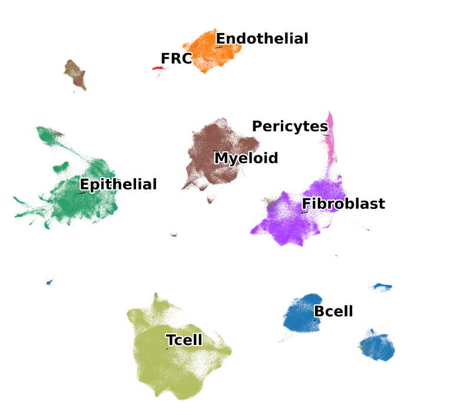

### Description

Cellular populations identified. The UMAP projection of  single cells from ESCC samples shows the formation of 8 main clusters with label names. Each dot corresponds to a single cell, colored according to cell type. 

### Results

###  Description

UMAP show by study.

###  Results

### Description

UMAP show by canonical markers.

### Results

EPCAM-Epithelial, FN1-Fibroblast， PECAM1-Endothelial,
RGS5-Pericytes
PDPN-endothelial
cD2-Tcell
cD19-B cell
cD68-myleoid

### Description

UMAP show by disease (ESCC or EAC)

###  Results

## T UMAP

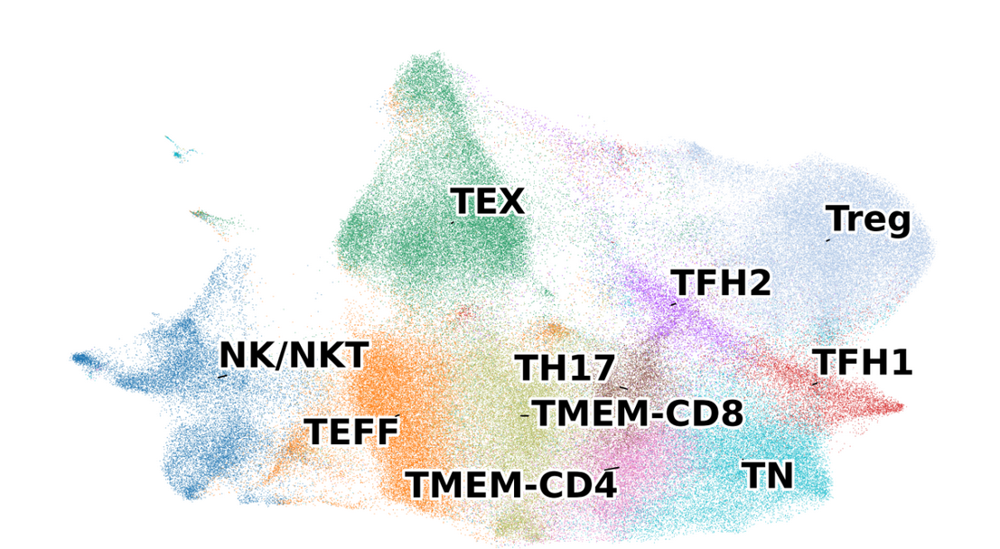

###  Description

T cell types identified. The UMAP projection of  single cells from samples shows the formation of  main T cell type clusters with label names. Each dot corresponds to a single cell, colored according to T cell type. 

###  Results

TEX,NK/NKT,TEFF,TFH2,Treg, TH17,TFH1,TMEM-CD8, TMEM-CD4 and TN.

## Myleoid cells

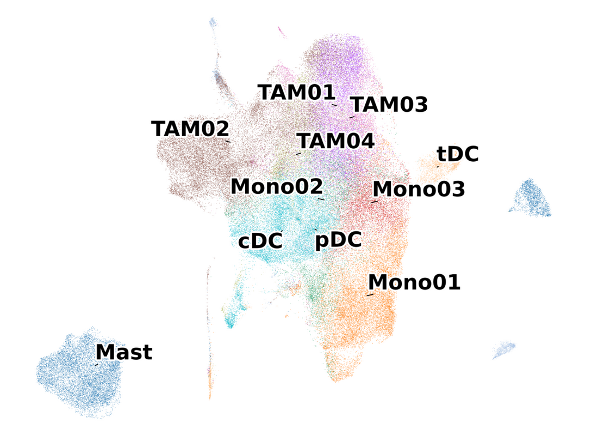

###  Description

Myeloid cell subpopulations in ESCA.

###  Results

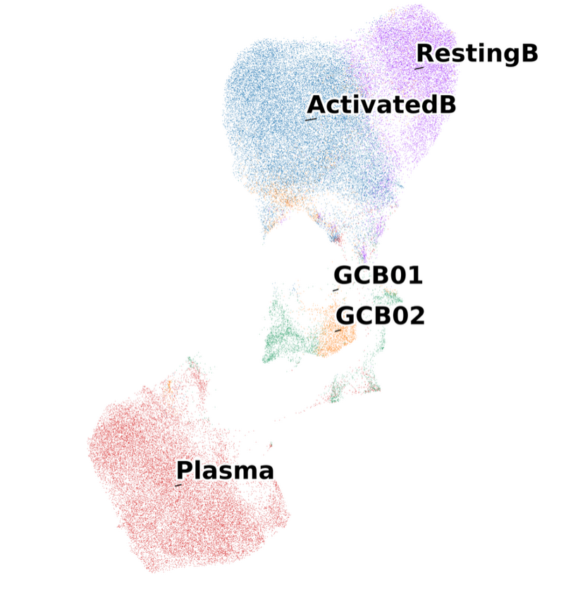

###  Description

B cell subpopulations in ESCA.

### Results

### Description

The three cellular modules on the basis of correlations of cell clusters from tumours.

###  Results

## Odds Ratio of subtypes across different subpopulations

### Description

The odds ratio of the three subtypes across different T subpopulations. 

### Results

C2 clusters are enricehd in TN,TFH!, TEFF, NK/NKT  and TMEM-CD8. 

C3 clusters are enriched in TH17, TMEM-CD4, Treg and TFH2.  
 
 
C1 clusters are mainly enriched in Treg and TEX, especially significantly enriched in TEX.

### Chat GPT写的

###  Results

C2 clusters are enriched in TN, TFH1, TEFF, NK/NKT, and TMEM-CD8 subpopulations. This suggests that C2 clusters are associated with a strong immune response characterized by the presence of naive T cells, helper T cells, effector T cells, natural killer cells, and memory CD8+ T cells.

C3 clusters show significant enrichment in TH17, TMEM-CD4, Treg, and TFH2 subpopulations. This indicates that C3 clusters are predominantly composed of helper T cells (type 17), memory CD4+ T cells, regulatory T cells, and follicular helper T cells type 2, highlighting a more regulatory and helper T cell-driven immune environment.

C1 clusters are mainly enriched in Treg and TEX subpopulations, with a particularly significant enrichment in TEX. This finding implies that C1 clusters are dominated by regulatory T cells and exhausted T cells, reflecting an immunosuppressive and dysfunctional T cell environment.

### Biological Meaning:

The distribution of T cell subpopulations across the three ESCC clusters provides insights into the immune landscape of each subtype. C2 clusters, enriched with effector and memory T cells, suggest a more active and possibly anti-tumor immune response. C3 clusters, with a higher presence of regulatory and helper T cells, indicate a mixed immune response with potential for both tumor suppression and immune regulation. In contrast, C1 clusters, dominated by regulatory and exhausted T cells, reveal an immunosuppressive environment that may facilitate tumor evasion and progression. Understanding these patterns can help in designing targeted immunotherapies for ESCC, tailored to the specific immune context of each cluster.

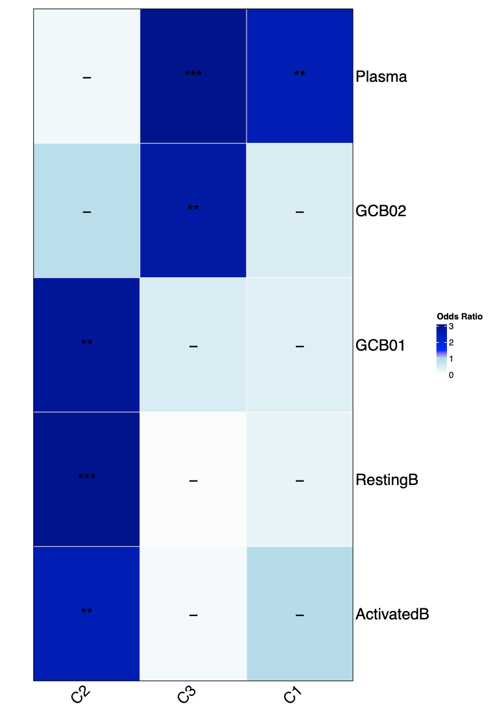

### Description

The odds ratio of the three subtypes across different B subpopulations.

### Results

C2 are enriched in GCB01,RestingB and ActivatedB.

C3 and C! are completely different with C2.

C3 mainly enriched in Plasma and GCB02, while C1 manily enriched in Plasma.

### ChatGPT 写的

###  Results

Subtype C2 is significantly enriched in GCB01, RestingB, and ActivatedB cells. In contrast, subtypes C1 and C3 show distinctly different enrichment patterns compared to C2. Subtype C3 is primarily enriched in Plasma and GCB02 cells, whereas subtype C1 is predominantly enriched in Plasma cells.

### Biological Meaning of the Figure Results:

The enrichment of subtype C2 in GCB01, RestingB, and ActivatedB cells suggests a potential involvement of these B cell subpopulations in the immune response mechanisms associated with this subtype. GCB01 cells are typically involved in generating high-affinity antibodies, RestingB cells are in a quiescent state ready for activation, and ActivatedB cells are actively responding to antigens. This indicates that subtype C2 might be linked to an active and ongoing immune response within the tumor microenvironment.

On the other hand, the enrichment of subtype C3 in Plasma and GCB02 cells highlights a different immune landscape. Plasma cells are responsible for producing antibodies, indicating that subtype C3 may be associated with a robust humoral immune response. GCB02 cells, similar to GCB01, are involved in affinity maturation of B cells. The distinct enrichment of C3 in these populations could imply a different pathway of immune activation and response compared to C2.

Subtype C1, being mainly enriched in Plasma cells, suggests a primary reliance on antibody production as part of the immune response in this subtype. This enrichment pattern indicates a potentially strong but possibly more limited immune engagement compared to the more diverse B cell involvement seen in subtype C2.

Overall, these findings reveal that different subtypes of ESCC are associated with distinct B cell-mediated immune responses, which could have implications for targeted immunotherapies and understanding the tumor immune microenvironment.

###

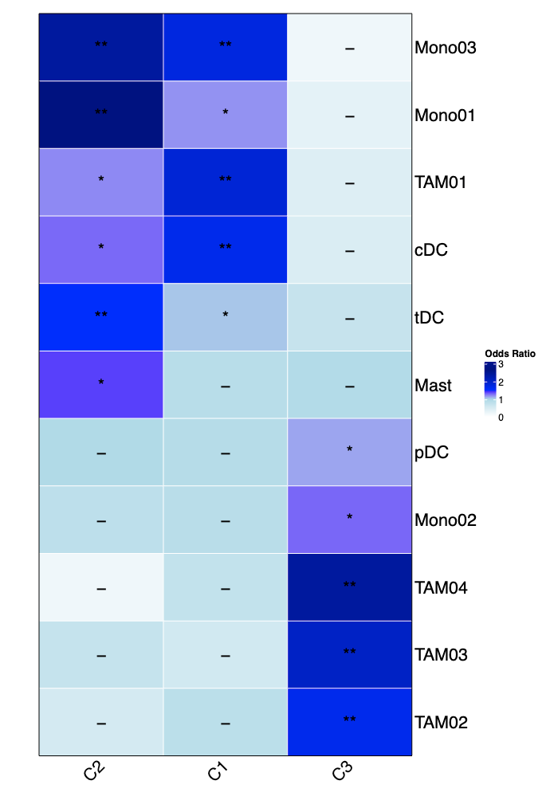

### Description

The odds ratio of the three subtypes across different Myeloid subpopulations.

###  Results

C2 are mainly enriched in Mono03，Mono01，TAM01，cDC，tDC
and Mast.

C1 are mainly enriched in Mono03，Mono01，TAM01 and cDC.

Comparing with C1 and C3, tDC and Mast are only enriched in C2.

C3 are completely different with C3 and C1. pDC，Mono02，TAM04，TAM03 and TAM02 are mainly enriched in C3. TAM cells are especially enriched in C3. 

### ChatGPT写的

### Figure Results:
The enrichment patterns of the three subtypes across different Myeloid subpopulations exhibit distinct characteristics:

Subtype C2 is primarily enriched in Mono03, Mono01, TAM01, cDC, tDC, and Mast cells.
Subtype C1 shows significant enrichment in Mono03, Mono01, TAM01, and cDC cells.
In comparison to Subtypes C1 and C3, tDC and Mast cells are uniquely enriched in Subtype C2.
Subtype C3 displays a markedly different enrichment pattern compared to Subtypes C1 and C2. It is predominantly enriched in pDC, Mono02, TAM04, TAM03, and TAM02 cells. Notably, TAM cells are especially abundant in Subtype C3.

### Biological Meaning:
The observed enrichment patterns suggest distinct immune microenvironment characteristics associated with each subtype of ESCC. Subtype C2's enrichment in Mono03, Mono01, TAM01, cDC, tDC, and Mast cells indicates a diverse myeloid cell involvement, potentially reflecting a complex immunological milieu. The unique presence of tDC and Mast cells in C2 suggests a specialized immune interaction or response.

Subtype C1's enrichment in Mono03, Mono01, TAM01, and cDC cells points to a more focused myeloid cell involvement, possibly indicating a specific immune response pathway.

Subtype C3, with its distinct enrichment in pDC, Mono02, TAM04, TAM03, and TAM02 cells, particularly the high presence of TAM cells, highlights a different immune landscape. The predominance of TAM cells in C3 suggests a tumor microenvironment that may be more immunosuppressive or supportive of tumor growth, which could have implications for therapeutic strategies targeting these cell populations.

## TME Chemokine and cytokine expression in different subtypes

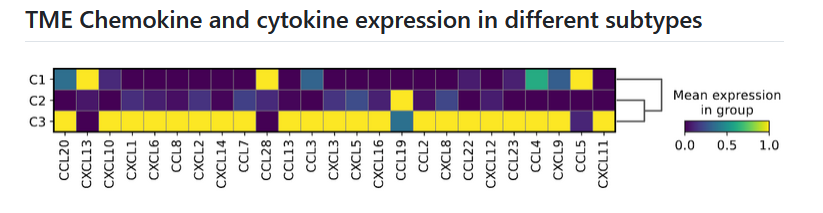

### Description

TME Chemokine and cytokine expression in different subtypes

###  Results

C1 subtype significantly are highly expressed in CXCL13, CCL28 and CCL5.

C2 sbubtype are significantly highly expressed in CCL19.

C3 subytpe are significanylt highly expressed in CCL20, CXCL10, CXCL1,CXCL6,CXCL8,CXCL2,CXCL14,CCL7,CCL13,CCL3,CXCL3,CXCL5,CXCL16,CCL2,CXCL8,CCL22,CXCL12,CCL23,CCL4,CXCL9 and CXCL11.

From the comparison ,we could see that TME cytokie and CHemokine are mainly highly expressed in C3 subytpe.

### ChatGPT 写的

### Description

C1 subtype exhibits significantly higher expression of CXCL13, CCL28, and CCL5.
C2 subtype shows significantly elevated levels of CCL19.
C3 subtype is characterized by significantly higher expression of multiple chemokines and cytokines, including CCL20, CXCL10, CXCL1, CXCL6, CXCL8, CXCL2, CXCL14, CCL7, CCL13, CCL3, CXCL3, CXCL5, CXCL16, CCL2, CCL22, CXCL12, CCL23, CCL4, CXCL9, and CXCL11.
From the comparison, it is evident that the TME cytokine and chemokine expressions are predominantly elevated in the C3 subtype.

### Biological Meaning of the Figure Results:

The differential expression of chemokines and cytokines among the ESCC subtypes suggests distinct immunological landscapes within the tumor microenvironment. The C1 subtype, with high levels of CXCL13, CCL28, and CCL5, may be associated with a specific immune cell infiltration pattern, potentially involving B cells and T cells. The C2 subtype, marked by elevated CCL19, could indicate a role in lymphoid organogenesis and migration of dendritic cells and T cells. The extensive expression of a broad range of chemokines and cytokines in the C3 subtype suggests a highly inflammatory and immunologically active environment, which may influence tumor progression, metastasis, and response to immunotherapy. This extensive chemokine and cytokine profile in C3 might attract various immune cells, promoting a complex interplay within the TME, potentially impacting therapeutic strategies and prognosis.

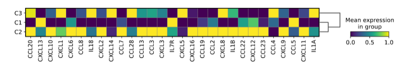

### Description

Cancer cells Chemokine and cytokin expression in different subtypes

###  Results

C1 highly expressed：CXCL3，IL7R and CCL5.
C2 highly expressed : CCL20.CXCL10,CXCL6，CCL8，CXCL2,CCL7,CCL13,CCL3,CXCL3，CXCL6，CCL19，CCL2，CXCL8，IL1B，CCL22，CXCL12，CCL23，CXCL9 and CXCL11.
C3 highly expresed：CXCL1，IL18，CXCL14，CCL28，CXCL8，CCL4 and IL2A.

From the comparison, we could see that Cancer cells Chemokine and cytokin especially highly expressed in C2 subytpe.

### ChatGPT写的

### Results

C1 subtype cancer cells show high expression levels of CXCL3, IL7R, and CCL5. In contrast, the C2 subtype exhibits significantly elevated levels of a broader range of chemokines and cytokines, including CCL20, CXCL10, CXCL6, CCL8, CXCL2, CCL7, CCL13, CCL3, CXCL3, CXCL6, CCL19, CCL2, CXCL8, IL1B, CCL22, CXCL12, CCL23, CXCL9, and CXCL11. The C3 subtype is characterized by high expression of CXCL1, IL18, CXCL14, CCL28, CXCL8, CCL4, and IL2A.

Comparative analysis indicates that the C2 subtype exhibits a particularly high expression of chemokines and cytokines within cancer cells. Conversely, in the tumor microenvironment (TME), cytokines and chemokines are predominantly highly expressed in the C3 subtype.

### Biological Meaning of the Figure Results:

The differential expression of chemokines and cytokines among the ESCC subtypes highlights the distinct inflammatory and immune response profiles associated with each subtype. The C2 subtype's high expression of a wide array of chemokines and cytokines suggests a highly inflammatory and potentially more immunogenic tumor microenvironment, which could influence the recruitment and activation of various immune cells. This may impact the tumor's behavior and response to immunotherapies. In the C3 subtype, the predominance of cytokine and chemokine expression in the TME indicates a significant role of the surrounding stromal and immune cells in modulating the tumor's immune landscape. Understanding these variations is crucial for developing targeted therapeutic strategies and improving patient outcomes in ESCC.

## Level1 Cell proportion Boxplot across Subtype

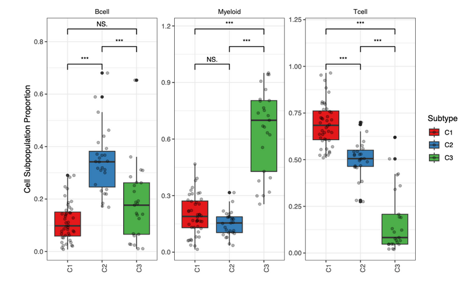

### Description

Level1 Cell proportion Boxplot across Subtype

###  Results

Comparing with C1 and C3,Bcell in C2 subtype are significanyly highly expressed.
Comparing with C1 and C2,Myeloid cells are significantly highly expressed in C3.
Comparing with C3 and C2,T cell are significantly highly expressed in C1.

### ChatGPT写的

### Results

In the C2 subtype of ESCC, B cells are significantly more abundant compared to the C1 and C3 subtypes. Conversely, myeloid cells are significantly more prevalent in the C3 subtype compared to C1 and C2. Additionally, T cells are significantly more abundant in the C1 subtype compared to C2 and C3.

### Biological Meaning of the Figure Results:

The differential expression of immune cells across ESCC subtypes suggests distinct immune microenvironments that could influence the behavior and treatment response of the cancer. The higher proportion of B cells in the C2 subtype may indicate a robust humoral immune response, potentially associated with better prognosis or response to certain immunotherapies. The elevated myeloid cell presence in the C3 subtype could be indicative of an immunosuppressive environment, often linked to poorer outcomes and resistance to therapies. The higher proportion of T cells in the C1 subtype suggests an active cellular immune response, which may correlate with more effective anti-tumor activity and improved clinical outcomes. Understanding these immune landscapes is crucial for developing subtype-specific therapeutic strategies and improving patient management in ESCC.

## Cell Proportion Heatmap of different subtypes

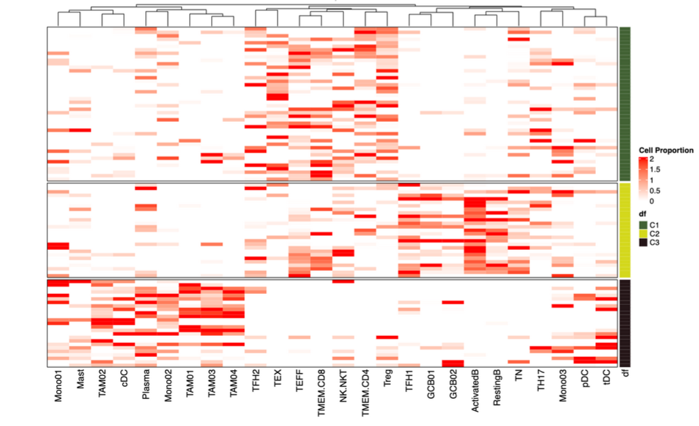

### Description

Heatmap showing frequencies of TME cell subpopulations in different subtypes.

### Results

C1：TFH2，TEX，TEFF，TMEM.CB8,NK_NKT,TMEN.CD4 and Treg.

C3:Mono01,Mast, TAM02,cDC,Plasma,Mono02,TAM01,TAM03 and TAM04.

C2:TFH1,GCB01,GCB02,activedB, Resting B,TN and TH17.

### Chat GPT写的

### Results

The heatmap analysis revealed distinct patterns of tumor microenvironment (TME) cell subpopulations across the different subtypes. In subtype C1, there is a higher frequency of TFH2, TEX, TEFF, TMEM.CD8, NK_NKT, TMEM.CD4, and Treg cells. Subtype C3 is characterized by elevated levels of Mono01, Mast cells, TAM02, cDC, Plasma cells, Mono02, TAM01, TAM03, and TAM04. In contrast, subtype C2 shows a predominance of TFH1, GCB01, GCB02, activated B cells, resting B cells, TN, and TH17 cells.

### Biological Meaning of the Figure Results:

The figure results illustrate the heterogeneity of the tumor microenvironment (TME) in different subtypes of ESCC. Subtype C1, with higher frequencies of TFH2, TEX, TEFF, TMEM.CD8, NK_NKT, TMEM.CD4, and Treg cells, suggests a microenvironment with active immune responses and potential immune regulation, indicative of both effector and regulatory functions. Subtype C3, marked by a significant presence of various macrophage populations (TAMs), dendritic cells (cDC), and plasma cells, points to a more immunosuppressive and possibly pro-tumorigenic environment. Subtype C2, enriched with B cell populations and TH17 cells, highlights an adaptive immune response, with possible implications for antibody-mediated immunity and inflammatory responses. Understanding these distinct TME profiles can provide insights into the mechanisms of tumor progression and potential therapeutic targets in ESCC.

## Top markers

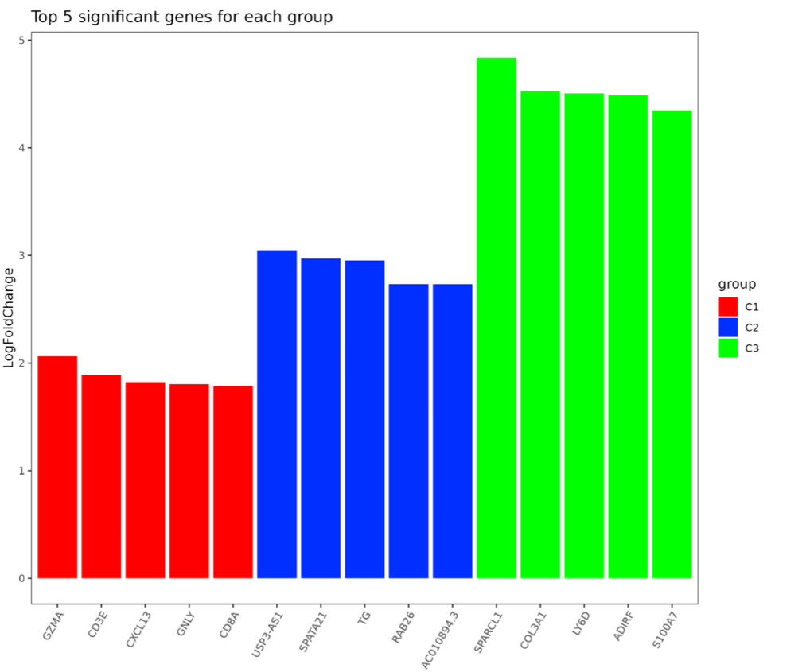

### Description

Top 5 significant genes for each group.

### Results

C1 top 5 marker genes: GZMA, CD3E, CXCL13, GNLY and CD8A.
C2 top 5 marker genes: USP3-AS1, SPATA21, TG, RAB26 and AC010894.3 .
C3 top 5 marker genes: SPARCL1, COL3A1, LY6D, ADIRF and S100A7.

### ChatGPT写的

### Figure Results:
    
    
The top 5 marker genes for each group in ESCC are as follows:

Group C1: The most significant marker genes are GZMA, CD3E, CXCL13, GNLY, and CD8A.
Group C2: The top marker genes include USP3-AS1, SPATA21, TG, RAB26, and AC010894.3.
Group C3: The leading marker genes are SPARCL1, COL3A1, LY6D, ADIRF, and S100A7.

### Biological Meaning of the Figure Results:

Group C1: The marker genes GZMA, CD3E, CXCL13, GNLY, and CD8A suggest a strong involvement of immune cells, particularly cytotoxic T cells and natural killer (NK) cells. These genes are associated with immune response mechanisms, indicating that Group C1 might have an immune-active microenvironment.

Group C2: The marker genes USP3-AS1, SPATA21, TG, RAB26, and AC010894.3 are less characterized in the context of ESCC. USP3-AS1 and SPATA21 may be involved in gene regulation and spermatogenesis respectively, while TG (thyroglobulin) could hint at an aberrant expression pattern. RAB26 is linked to vesicle trafficking, and AC010894.3 might represent a non-coding RNA. This group might represent a unique molecular subtype with distinct regulatory mechanisms.

Group C3: The marker genes SPARCL1, COL3A1, LY6D, ADIRF, and S100A7 are indicative of extracellular matrix (ECM) remodeling and differentiation processes. SPARCL1 and COL3A1 are involved in ECM composition, LY6D in lymphoid development, ADIRF in adipocyte differentiation, and S100A7 in inflammation and skin differentiation. This suggests that Group C3 may have an environment conducive to ECM interactions and differentiation signals.

These insights into the marker genes provide valuable information for understanding the molecular heterogeneity of ESCC and could guide the development of targeted therapies and personalized treatment strategies.

### Cancer cell Scissor Differential Expressed Genes

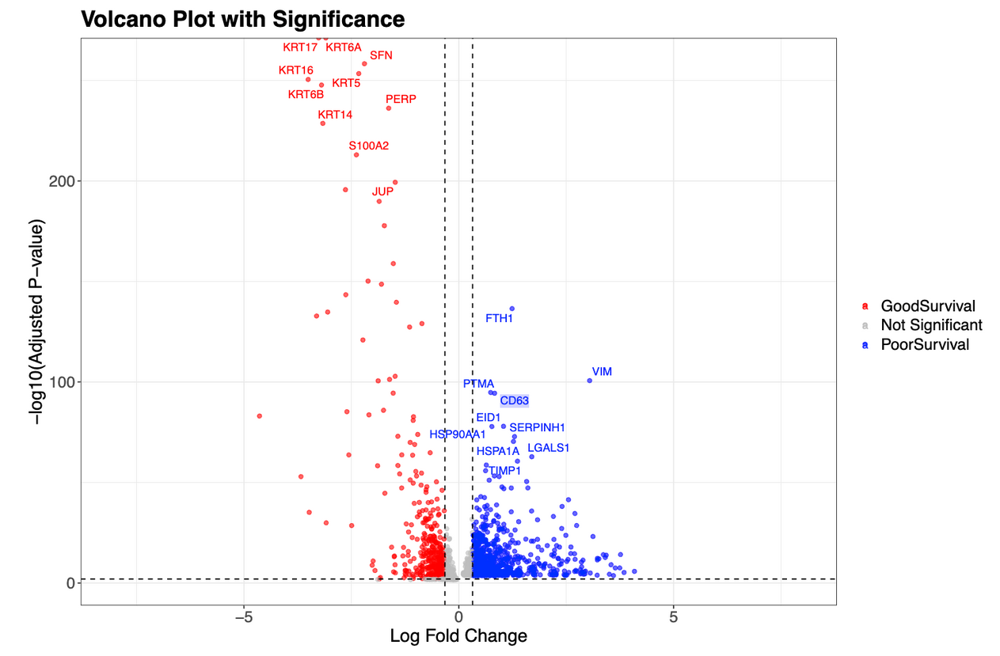

### Description

Valcano of differential expressed genes in cancer cell Scissor（between poor survival and others） .

###  Results

The significance of Poor survival enriched in: FTH1，VIM，PTMA，CD63，EID1，HSP90AA1，SERPINH1，HSPA1A，
LGALS1 and TIMP1.

### ChatGPT写的

RESULTS OUTPUT:

The analysis of differentially expressed genes in esophageal squamous cell carcinoma (ESCC) using the Scissor method revealed significant enrichment of genes associated with poor survival. The key genes identified include FTH1, VIM, PTMA, CD63, EID1, HSP90AA1, SERPINH1, HSPA1A, LGALS1, and TIMP1.

### Biological Meaning of the Figure Results:

1. **FTH1 (Ferritin Heavy Chain 1)**: This gene plays a role in iron storage and regulation, which is crucial for cellular proliferation and tumor growth. Elevated levels of FTH1 have been linked to increased cancer cell survival and resistance to oxidative stress.

2. **VIM (Vimentin)**: Vimentin is a marker for epithelial-mesenchymal transition (EMT), a process that enhances the migratory and invasive capabilities of cancer cells, contributing to metastasis and poor prognosis in ESCC.

3. **PTMA (Prothymosin Alpha)**: PTMA is involved in cell proliferation and apoptosis inhibition. Its overexpression is often associated with tumorigenesis and poor clinical outcomes.

4. **CD63 (Cluster of Differentiation 63)**: CD63 is a member of the tetraspanin family, which plays a role in cell adhesion, migration, and signal transduction. Its high expression is linked to tumor progression and metastasis.

5. **EID1 (EP300 Interacting Inhibitor of Differentiation 1)**: EID1 is involved in regulating transcription and cellular differentiation. Its dysregulation can contribute to tumorigenesis and cancer progression.

6. **HSP90AA1 (Heat Shock Protein 90 Alpha Family Class A Member 1)**: HSP90AA1 is a molecular chaperone involved in protein folding and stabilization. It supports the function of multiple oncogenic proteins, making it a critical player in cancer cell survival and proliferation.

7. **SERPINH1 (Serpin Family H Member 1)**: SERPINH1, also known as HSP47, is a collagen-specific chaperone. Its upregulation is associated with increased collagen production and fibrosis, contributing to the tumor microenvironment's support of cancer progression.

8. **HSPA1A (Heat Shock Protein Family A Member 1A)**: This gene encodes a stress-induced chaperone protein that assists in protein folding and protection against apoptosis. Elevated levels are often found in tumors and correlate with poor prognosis.

9. **LGALS1 (Galectin-1)**: LGALS1 is involved in cell-cell and cell-matrix interactions, immune response modulation, and angiogenesis. Its overexpression promotes tumor growth, metastasis, and immune evasion.

10. **TIMP1 (Tissue Inhibitor of Metalloproteinases 1)**: TIMP1 regulates the extracellular matrix by inhibiting metalloproteinases. While its primary function is to prevent excessive matrix degradation, its overexpression can contribute to a more aggressive tumor phenotype and poor survival outcomes.

These findings highlight the complex interplay between various cellular processes and pathways that drive poor survival in ESCC, offering potential targets for therapeutic intervention.

RESULTS OUTPUT:

在使用Scissor方法分析食管鳞状细胞癌（ESCC）中的差异表达基因时，发现与生存率差相关的基因显著富集。确定的关键基因包括FTH1、VIM、PTMA、CD63、EID1、HSP90AA1、SERPINH1、HSPA1A、LGALS1和TIMP1。

### 图形结果的生物学意义：

1. **FTH1 (铁蛋白重链1)**：该基因在铁储存和调节中发挥作用，这对于细胞增殖和肿瘤生长至关重要。FTH1水平升高与癌细胞生存和抗氧化应激的增加有关。

2. **VIM (波形蛋白)**：波形蛋白是上皮-间质转化（EMT）的标志，EMT增强了癌细胞的迁移和侵袭能力，导致转移和ESCC的不良预后。

3. **PTMA (胸腺素α)**：PTMA参与细胞增殖和凋亡抑制。其过表达通常与肿瘤发生和不良临床结果相关。

4. **CD63 (分化簇63)**：CD63是四跨膜家族成员，参与细胞粘附、迁移和信号传导。其高表达与肿瘤进展和转移有关。

5. **EID1 (EP300交互抑制因子1)**：EID1参与调节转录和细胞分化。其失调可能促进肿瘤发生和癌症进展。

6. **HSP90AA1 (热休克蛋白90α家族A成员1)**：HSP90AA1是一种分子伴侣，参与蛋白质折叠和稳定。它支持多种致癌蛋白的功能，使其成为癌细胞生存和增殖的关键角色。

7. **SERPINH1 (丝氨酸蛋白酶抑制剂H家族成员1)**：SERPINH1，也称为HSP47，是一种胶原特异性伴侣蛋白。其上调与胶原生成和纤维化增加有关，支持肿瘤微环境中癌症的进展。

8. **HSPA1A (热休克蛋白家族A成员1A)**：该基因编码一种应激诱导的伴侣蛋白，帮助蛋白质折叠并防止细胞凋亡。其水平升高常见于肿瘤中，并与不良预后相关。

9. **LGALS1 (半乳糖凝集素-1)**：LGALS1参与细胞-细胞和细胞-基质的相互作用，免疫反应调节和血管生成。其过表达促进肿瘤生长、转移和免疫逃逸。

10. **TIMP1 (基质金属蛋白酶抑制剂1)**：TIMP1通过抑制金属蛋白酶调节细胞外基质。尽管其主要功能是防止过度的基质降解，但其过表达可能导致更具侵袭性的肿瘤表型和不良生存结果。

这些发现突出了各种细胞过程和途径之间的复杂相互作用，这些过程和途径推动了ESCC中的不良生存，提供了潜在的治疗干预靶点。

### Cancer cell Scissor Differential Expressed Genes Kegg Pathway barplot

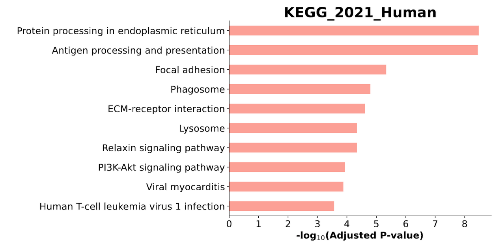

### Description

Barplot of differential Expressed Genes Kegg Pathway 
shows that in Cancer cell Scissor(poor survival with others)
### Results

Poor survival of differential expressed genes Kegg pathway enriched in : Protein processing in endoplasmic reticulum，
Antigen processing and presentation，Focal adhesion，Phagosome，ECM-receptor interaction，Lysosome and Relaxin signaling pathway. 

### ChatGPT写的

RESULTS OUTPUT:

### Figure Results**:

Differentially expressed genes associated with poor survival in ESCC are significantly enriched in several KEGG pathways. These pathways include Protein Processing in the Endoplasmic Reticulum, Antigen Processing and Presentation, Focal Adhesion, Phagosome, ECM-Receptor Interaction, Lysosome, and Relaxin Signaling Pathway.

**Biological Meaning of the Figure Results**:

The enrichment of differentially expressed genes in specific KEGG pathways reveals critical biological processes linked to poor survival in ESCC. 

- **Protein Processing in the Endoplasmic Reticulum**: This pathway indicates the importance of proper protein folding and stress response mechanisms in cancer cell survival and progression.
  
- **Antigen Processing and Presentation**: The involvement of this pathway suggests that immune evasion through altered antigen presentation may contribute to poor prognosis in ESCC.
  
- **Focal Adhesion**: This pathway is crucial for cell adhesion, migration, and signaling, which are essential for cancer metastasis and invasion.
- **Phagosome**: The role of phagosome in cellular debris clearance and immune response modulation is highlighted, impacting tumor immunity.

- **ECM-Receptor Interaction**: This pathway underscores the significance of extracellular matrix (ECM) components in cell signaling, adhesion, and migration, influencing tumor growth and metastasis.

- **Lysosome**: The involvement of lysosomal pathways indicates the importance of cellular degradation and recycling processes in maintaining cancer cell viability.

- **Relaxin Signaling Pathway**: This pathway is implicated in tissue remodeling and fibrosis, contributing to tumor progression and metastasis.

These findings provide insights into the molecular mechanisms underlying poor survival in ESCC, potentially guiding the development of targeted therapies and improving patient outcomes.

重写的图表结果:
与ESCC预后不良相关的差异表达基因在多个KEGG通路中显著富集。这些通路包括内质网中的蛋白质加工、抗原处理和呈递、粘着斑、吞噬体、ECM受体相互作用、溶酶体和松弛素信号通路。

图表结果的生物学意义:
差异表达基因在特定KEGG通路中的富集揭示了与ESCC预后不良相关的重要生物过程。

内质网中的蛋白质加工: 该通路表明在癌细胞生存和进展中，蛋白质正确折叠和应激反应机制的重要性。

抗原处理和呈递: 该通路的参与表明，通过改变抗原呈递来逃避免疫可能会导致ESCC预后不良。

粘着斑: 该通路对于细胞粘附、迁移和信号传导至关重要，这对于癌细胞的转移和侵袭至关重要。

吞噬体: 吞噬体在清除细胞碎片和调节免疫反应中的作用，对肿瘤免疫有影响。

ECM受体相互作用: 该通路强调了细胞外基质（ECM）成分在细胞信号传导、粘附和迁移中的重要性，影响肿瘤生长和转移。

溶酶体: 溶酶体通路的参与表明，细胞降解和再循环过程在维持癌细胞生存中的重要性。

松弛素信号通路: 该通路与组织重塑和纤维化有关，促进肿瘤进展和转移。  

这些发现提供了对ESCC预后不良分子机制的洞见，有助于开发针对性的治疗方法并改善患者的预后。

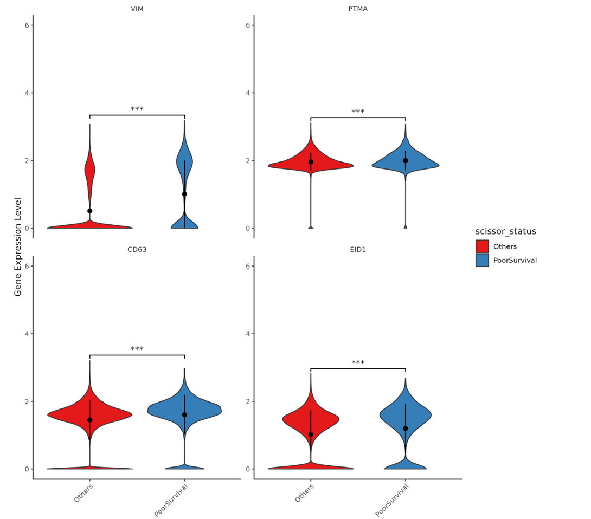

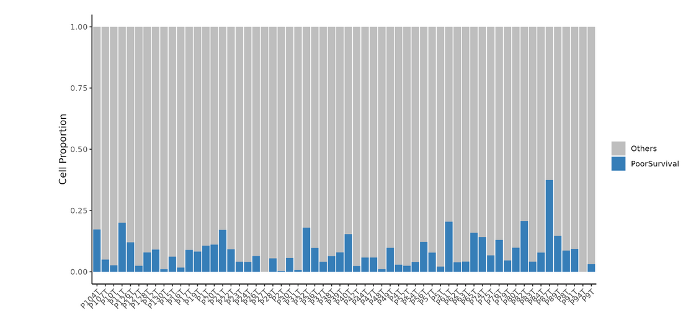

### Description

Cell proportion of poor survival in all samples.

###  Results

Almost all samples exists poor survival cells.

### Hazard ratio of level2 cell types

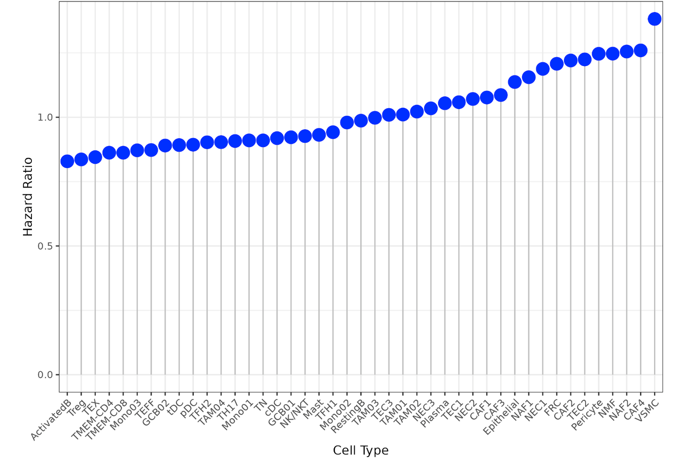

### Description

Hazard ratio of level2 cell types.

###  Results

VSMC，CAF4，NAF2，NMF,Pericyte,TEC2,CAF2,FRC,NEC1 and NAF1 cell types are most highly enriched .

###  ChatGPT

RESULTS OUTPUT:

### Figure Results:
"Vascular smooth muscle cells (VSMC), cancer-associated fibroblasts type 4 (CAF4), normal-associated fibroblasts type 2 (NAF2), normal mesenchymal fibroblasts (NMF), pericytes, tumor endothelial cells type 2 (TEC2), cancer-associated fibroblasts type 2 (CAF2), fibroblastic reticular cells (FRC), neural endothelial cells type 1 (NEC1), and normal-associated fibroblasts type 1 (NAF1) are the cell types most highly enriched in ESCC."

### Biological Meaning of the Figure Results:
The high enrichment of these specific cell types in ESCC indicates their significant roles in the tumor microenvironment. VSMCs and pericytes are involved in the formation of blood vessels, which can support tumor growth through angiogenesis. Various types of fibroblasts (CAF4, CAF2, NAF2, NAF1) contribute to the remodeling of the extracellular matrix and create a supportive niche for cancer cells. NMFs and FRCs are essential for maintaining tissue integrity and immune cell interactions. TEC2 cells are indicative of the angiogenic switch, where tumor vasculature begins to support rapid tumor growth. NEC1 cells, being part of the neural endothelial system, might influence tumor invasion and metastasis. Overall, the presence of these cell types highlights the complex interactions within the tumor microenvironment that promote tumor progression and impact patient outcomes in ESCC.

图表结果：

"血管平滑肌细胞（VSMC）、癌症相关成纤维细胞4型（CAF4）、正常相关成纤维细胞2型（NAF2）、正常间充质成纤维细胞（NMF）、周细胞、肿瘤内皮细胞2型（TEC2）、癌症相关成纤维细胞2型（CAF2）、纤维网状细胞（FRC）、神经内皮细胞1型（NEC1）和正常相关成纤维细胞1型（NAF1）是ESCC中最富集的细胞类型。"
图表结果的生物学意义：

这些特定细胞类型在ESCC中的高度富集表明它们在肿瘤微环境中的重要作用。血管平滑肌细胞和周细胞参与血管的形成，通过血管生成支持肿瘤生长。各种类型的成纤维细胞（CAF4、CAF2、NAF2、NAF1）有助于重塑细胞外基质，为癌细胞创造支持性环境。正常间充质成纤维细胞和纤维网状细胞对维持组织完整性和免疫细胞相互作用至关重要。肿瘤内皮细胞2型的存在表明肿瘤血管化开关已经开启，肿瘤血管开始支持快速肿瘤生长。神经内皮细胞1型作为神经内皮系统的一部分，可能影响肿瘤的侵袭和转移。总体而言，这些细胞类型的存在突显了肿瘤微环境中的复杂相互作用，这些相互作用促进了肿瘤进展并影响ESCC患者的预后。

