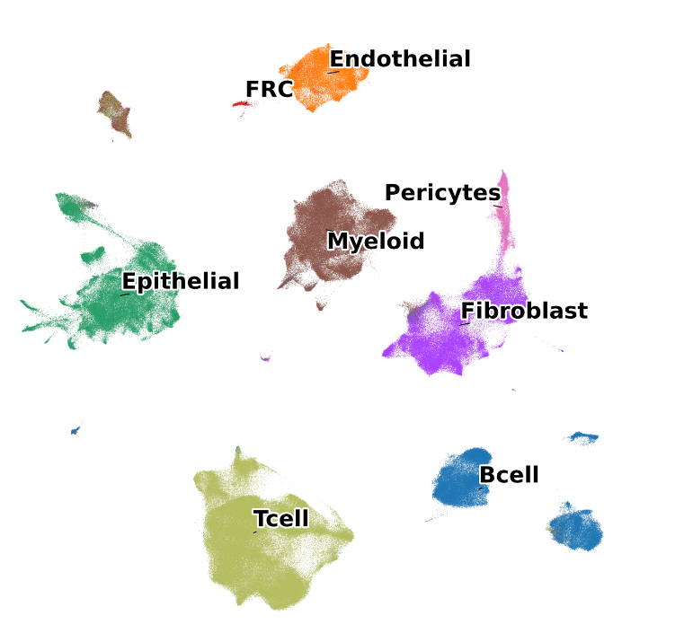
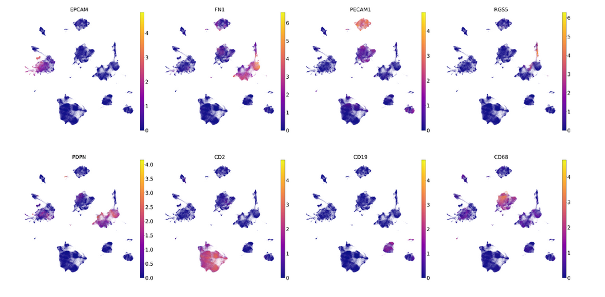
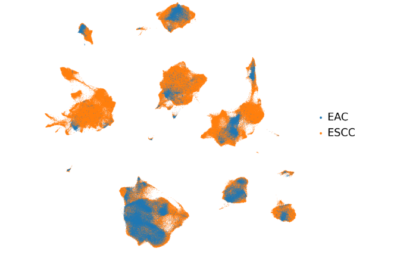
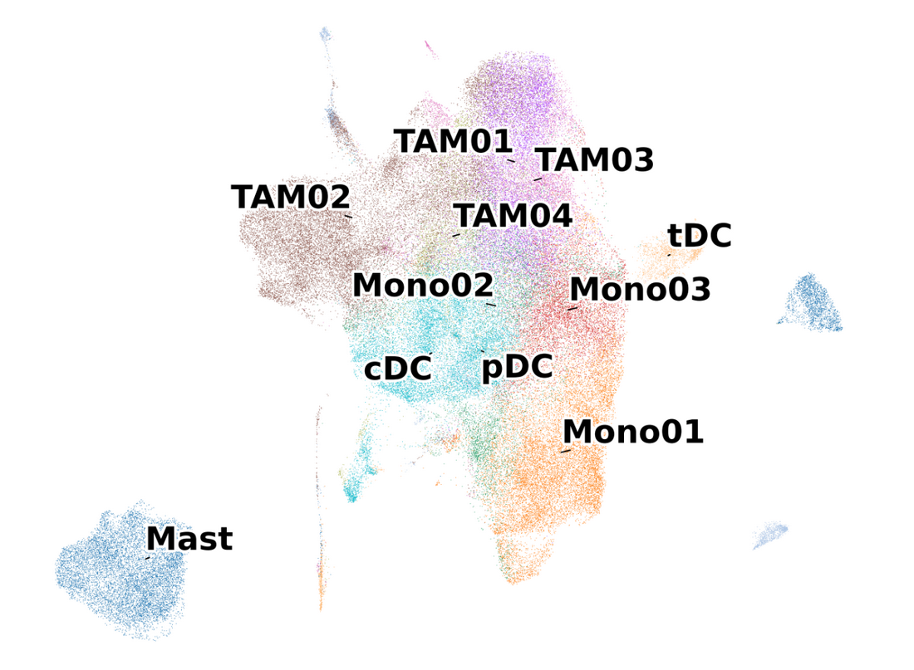
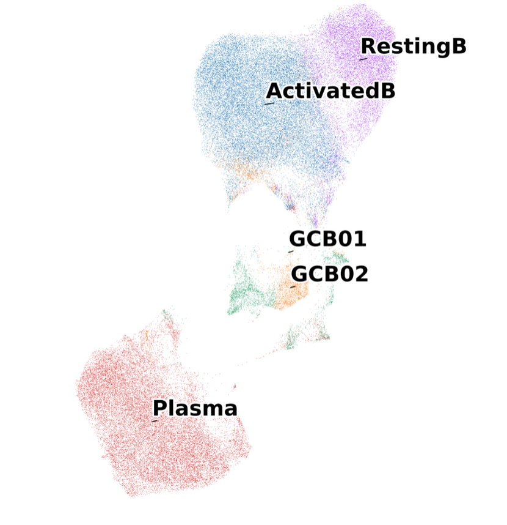
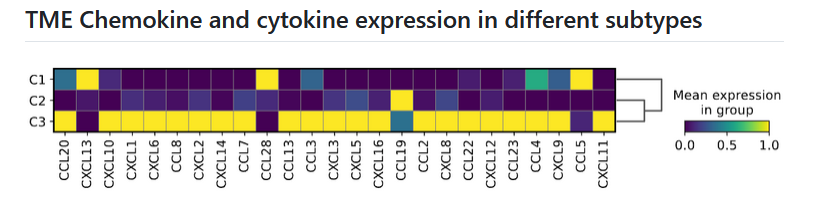
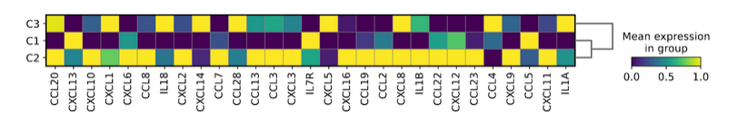
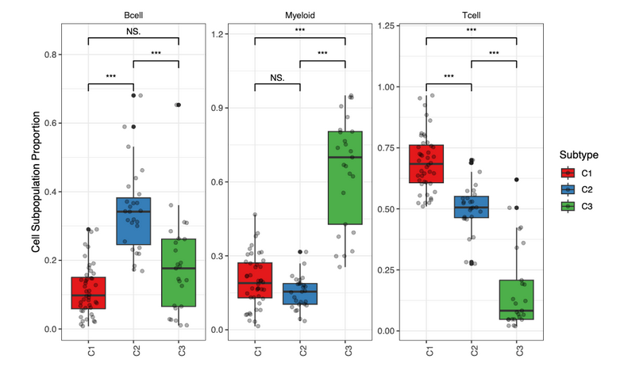

## Global UMAP

### Description

Cellular populations identified. The UMAP projection of  single cells from ESCC samples shows the formation of 8 main clusters with label names. Each dot corresponds to a single cell, colored according to cell type. 

### Results

###  Description

UMAP show by study.

###  Results

### Description

UMAP show by canonical markers.

### Results

EPCAM-Epithelial, FN1-Fibroblast， PECAM1-Endothelial,
RGS5-Pericytes
PDPN-endothelial
cD2-Tcell
cD19-B cell
cD68-myleoid

### Description

UMAP show by disease (ESCC or EAC)

###  Results

## T UMAP

###  Description

T cell types identified. The UMAP projection of  single cells from samples shows the formation of  main T cell type clusters with label names. Each dot corresponds to a single cell, colored according to T cell type. 

###  Results

TEX,NK/NKT,TEFF,TFH2,Treg, TH17,TFH1,TMEM-CD8, TMEM-CD4 and TN.

## Myleoid cells

###  Description

Myeloid cell subpopulations in ESCA.

###  Results

###  Description

B cell subpopulations in ESCA.

### Results

### Description

The three cellular modules on the basis of correlations of cell clusters from tumours.

###  Results

## Odds Ratio of subtypes across different subpopulations

### Description

The odds ratio of the three subtypes across different T subpopulations. 

### Results

C2 clusters are enricehd in TN,TFH!, TEFF, NK/NKT  and TMEM-CD8. 

C3 clusters are enriched in TH17, TMEM-CD4, Treg and TFH2.  
 
 
C1 clusters are mainly enriched in Treg and TEX, especially significantly enriched in TEX.

### Chat GPT写的

###  Results

C2 clusters are enriched in TN, TFH1, TEFF, NK/NKT, and TMEM-CD8 subpopulations. This suggests that C2 clusters are associated with a strong immune response characterized by the presence of naive T cells, helper T cells, effector T cells, natural killer cells, and memory CD8+ T cells.

C3 clusters show significant enrichment in TH17, TMEM-CD4, Treg, and TFH2 subpopulations. This indicates that C3 clusters are predominantly composed of helper T cells (type 17), memory CD4+ T cells, regulatory T cells, and follicular helper T cells type 2, highlighting a more regulatory and helper T cell-driven immune environment.

C1 clusters are mainly enriched in Treg and TEX subpopulations, with a particularly significant enrichment in TEX. This finding implies that C1 clusters are dominated by regulatory T cells and exhausted T cells, reflecting an immunosuppressive and dysfunctional T cell environment.

### Biological Meaning:

The distribution of T cell subpopulations across the three ESCC clusters provides insights into the immune landscape of each subtype. C2 clusters, enriched with effector and memory T cells, suggest a more active and possibly anti-tumor immune response. C3 clusters, with a higher presence of regulatory and helper T cells, indicate a mixed immune response with potential for both tumor suppression and immune regulation. In contrast, C1 clusters, dominated by regulatory and exhausted T cells, reveal an immunosuppressive environment that may facilitate tumor evasion and progression. Understanding these patterns can help in designing targeted immunotherapies for ESCC, tailored to the specific immune context of each cluster.

### Description

The odds ratio of the three subtypes across different B subpopulations.

### Results

C2 are enriched in GCB01,RestingB and ActivatedB.

C3 and C! are completely different with C2.

C3 mainly enriched in Plasma and GCB02, while C1 manily enriched in Plasma.

### ChatGPT 写的

###  Results

Subtype C2 is significantly enriched in GCB01, RestingB, and ActivatedB cells. In contrast, subtypes C1 and C3 show distinctly different enrichment patterns compared to C2. Subtype C3 is primarily enriched in Plasma and GCB02 cells, whereas subtype C1 is predominantly enriched in Plasma cells.

### Biological Meaning of the Figure Results:

The enrichment of subtype C2 in GCB01, RestingB, and ActivatedB cells suggests a potential involvement of these B cell subpopulations in the immune response mechanisms associated with this subtype. GCB01 cells are typically involved in generating high-affinity antibodies, RestingB cells are in a quiescent state ready for activation, and ActivatedB cells are actively responding to antigens. This indicates that subtype C2 might be linked to an active and ongoing immune response within the tumor microenvironment.

On the other hand, the enrichment of subtype C3 in Plasma and GCB02 cells highlights a different immune landscape. Plasma cells are responsible for producing antibodies, indicating that subtype C3 may be associated with a robust humoral immune response. GCB02 cells, similar to GCB01, are involved in affinity maturation of B cells. The distinct enrichment of C3 in these populations could imply a different pathway of immune activation and response compared to C2.

Subtype C1, being mainly enriched in Plasma cells, suggests a primary reliance on antibody production as part of the immune response in this subtype. This enrichment pattern indicates a potentially strong but possibly more limited immune engagement compared to the more diverse B cell involvement seen in subtype C2.

Overall, these findings reveal that different subtypes of ESCC are associated with distinct B cell-mediated immune responses, which could have implications for targeted immunotherapies and understanding the tumor immune microenvironment.

###

### Description

The odds ratio of the three subtypes across different Myeloid subpopulations.

###  Results

C2 are mainly enriched in Mono03，Mono01，TAM01，cDC，tDC
and Mast.

C1 are mainly enriched in Mono03，Mono01，TAM01 and cDC.

Comparing with C1 and C3, tDC and Mast are only enriched in C2.

C3 are completely different with C3 and C1. pDC，Mono02，TAM04，TAM03 and TAM02 are mainly enriched in C3. TAM cells are especially enriched in C3. 

### ChatGPT写的

### Figure Results:
The enrichment patterns of the three subtypes across different Myeloid subpopulations exhibit distinct characteristics:

Subtype C2 is primarily enriched in Mono03, Mono01, TAM01, cDC, tDC, and Mast cells.
Subtype C1 shows significant enrichment in Mono03, Mono01, TAM01, and cDC cells.
In comparison to Subtypes C1 and C3, tDC and Mast cells are uniquely enriched in Subtype C2.
Subtype C3 displays a markedly different enrichment pattern compared to Subtypes C1 and C2. It is predominantly enriched in pDC, Mono02, TAM04, TAM03, and TAM02 cells. Notably, TAM cells are especially abundant in Subtype C3.

### Biological Meaning:
The observed enrichment patterns suggest distinct immune microenvironment characteristics associated with each subtype of ESCC. Subtype C2's enrichment in Mono03, Mono01, TAM01, cDC, tDC, and Mast cells indicates a diverse myeloid cell involvement, potentially reflecting a complex immunological milieu. The unique presence of tDC and Mast cells in C2 suggests a specialized immune interaction or response.

Subtype C1's enrichment in Mono03, Mono01, TAM01, and cDC cells points to a more focused myeloid cell involvement, possibly indicating a specific immune response pathway.

Subtype C3, with its distinct enrichment in pDC, Mono02, TAM04, TAM03, and TAM02 cells, particularly the high presence of TAM cells, highlights a different immune landscape. The predominance of TAM cells in C3 suggests a tumor microenvironment that may be more immunosuppressive or supportive of tumor growth, which could have implications for therapeutic strategies targeting these cell populations.

## TME Chemokine and cytokine expression in different subtypes

### Description

TME Chemokine and cytokine expression in different subtypes

###  Results

C1 subtype significantly are highly expressed in CXCL13, CCL28 and CCL5.

C2 sbubtype are significantly highly expressed in CCL19.

C3 subytpe are significanylt highly expressed in CCL20, CXCL10, CXCL1,CXCL6,CXCL8,CXCL2,CXCL14,CCL7,CCL13,CCL3,CXCL3,CXCL5,CXCL16,CCL2,CXCL8,CCL22,CXCL12,CCL23,CCL4,CXCL9 and CXCL11.

From the comparison ,we could see that TME cytokie and CHemokine are mainly highly expressed in C3 subytpe.

### ChatGPT 写的

### Description

C1 subtype exhibits significantly higher expression of CXCL13, CCL28, and CCL5.
C2 subtype shows significantly elevated levels of CCL19.
C3 subtype is characterized by significantly higher expression of multiple chemokines and cytokines, including CCL20, CXCL10, CXCL1, CXCL6, CXCL8, CXCL2, CXCL14, CCL7, CCL13, CCL3, CXCL3, CXCL5, CXCL16, CCL2, CCL22, CXCL12, CCL23, CCL4, CXCL9, and CXCL11.
From the comparison, it is evident that the TME cytokine and chemokine expressions are predominantly elevated in the C3 subtype.

### Biological Meaning of the Figure Results:

The differential expression of chemokines and cytokines among the ESCC subtypes suggests distinct immunological landscapes within the tumor microenvironment. The C1 subtype, with high levels of CXCL13, CCL28, and CCL5, may be associated with a specific immune cell infiltration pattern, potentially involving B cells and T cells. The C2 subtype, marked by elevated CCL19, could indicate a role in lymphoid organogenesis and migration of dendritic cells and T cells. The extensive expression of a broad range of chemokines and cytokines in the C3 subtype suggests a highly inflammatory and immunologically active environment, which may influence tumor progression, metastasis, and response to immunotherapy. This extensive chemokine and cytokine profile in C3 might attract various immune cells, promoting a complex interplay within the TME, potentially impacting therapeutic strategies and prognosis.

### Description

Cancer cells Chemokine and cytokin expression in different subtypes

###  Results

C1 highly expressed：CXCL3，IL7R and CCL5.
C2 highly expressed : CCL20.CXCL10,CXCL6，CCL8，CXCL2,CCL7,CCL13,CCL3,CXCL3，CXCL6，CCL19，CCL2，CXCL8，IL1B，CCL22，CXCL12，CCL23，CXCL9 and CXCL11.
C3 highly expresed：CXCL1，IL18，CXCL14，CCL28，CXCL8，CCL4 and IL2A.

From the comparison, we could see that Cancer cells Chemokine and cytokin especially highly expressed in C2 subytpe.

### ChatGPT写的

### Results

C1 subtype cancer cells show high expression levels of CXCL3, IL7R, and CCL5. In contrast, the C2 subtype exhibits significantly elevated levels of a broader range of chemokines and cytokines, including CCL20, CXCL10, CXCL6, CCL8, CXCL2, CCL7, CCL13, CCL3, CXCL3, CXCL6, CCL19, CCL2, CXCL8, IL1B, CCL22, CXCL12, CCL23, CXCL9, and CXCL11. The C3 subtype is characterized by high expression of CXCL1, IL18, CXCL14, CCL28, CXCL8, CCL4, and IL2A.

Comparative analysis indicates that the C2 subtype exhibits a particularly high expression of chemokines and cytokines within cancer cells. Conversely, in the tumor microenvironment (TME), cytokines and chemokines are predominantly highly expressed in the C3 subtype.

### Biological Meaning of the Figure Results:

The differential expression of chemokines and cytokines among the ESCC subtypes highlights the distinct inflammatory and immune response profiles associated with each subtype. The C2 subtype's high expression of a wide array of chemokines and cytokines suggests a highly inflammatory and potentially more immunogenic tumor microenvironment, which could influence the recruitment and activation of various immune cells. This may impact the tumor's behavior and response to immunotherapies. In the C3 subtype, the predominance of cytokine and chemokine expression in the TME indicates a significant role of the surrounding stromal and immune cells in modulating the tumor's immune landscape. Understanding these variations is crucial for developing targeted therapeutic strategies and improving patient outcomes in ESCC.

## Level1 Cell proportion Boxplot across Subtype

### Description

Level1 Cell proportion Boxplot across Subtype

###  Results

Comparing with C1 and C3,Bcell in C2 subtype are significanyly highly expressed.
Comparing with C1 and C2,Myeloid cells are significantly highly expressed in C3.
Comparing with C3 and C2,T cell are significantly highly expressed in C1.

### ChatGPT写的

### Results

In the C2 subtype of ESCC, B cells are significantly more abundant compared to the C1 and C3 subtypes. Conversely, myeloid cells are significantly more prevalent in the C3 subtype compared to C1 and C2. Additionally, T cells are significantly more abundant in the C1 subtype compared to C2 and C3.

### Biological Meaning of the Figure Results:

The differential expression of immune cells across ESCC subtypes suggests distinct immune microenvironments that could influence the behavior and treatment response of the cancer. The higher proportion of B cells in the C2 subtype may indicate a robust humoral immune response, potentially associated with better prognosis or response to certain immunotherapies. The elevated myeloid cell presence in the C3 subtype could be indicative of an immunosuppressive environment, often linked to poorer outcomes and resistance to therapies. The higher proportion of T cells in the C1 subtype suggests an active cellular immune response, which may correlate with more effective anti-tumor activity and improved clinical outcomes. Understanding these immune landscapes is crucial for developing subtype-specific therapeutic strategies and improving patient management in ESCC.

## Cell Proportion Heatmap of different subtypes

### Description

Heatmap showing frequencies of TME cell subpopulations in different subtypes.

### Results

C1：TFH2，TEX，TEFF，TMEM.CB8,NK_NKT,TMEN.CD4 and Treg.

C3:Mono01,Mast, TAM02,cDC,Plasma,Mono02,TAM01,TAM03 and TAM04.

C2:TFH1,GCB01,GCB02,activedB, Resting B,TN and TH17.

### Chat GPT写的

### Results

The heatmap analysis revealed distinct patterns of tumor microenvironment (TME) cell subpopulations across the different subtypes. In subtype C1, there is a higher frequency of TFH2, TEX, TEFF, TMEM.CD8, NK_NKT, TMEM.CD4, and Treg cells. Subtype C3 is characterized by elevated levels of Mono01, Mast cells, TAM02, cDC, Plasma cells, Mono02, TAM01, TAM03, and TAM04. In contrast, subtype C2 shows a predominance of TFH1, GCB01, GCB02, activated B cells, resting B cells, TN, and TH17 cells.

### Biological Meaning of the Figure Results:

The figure results illustrate the heterogeneity of the tumor microenvironment (TME) in different subtypes of ESCC. Subtype C1, with higher frequencies of TFH2, TEX, TEFF, TMEM.CD8, NK_NKT, TMEM.CD4, and Treg cells, suggests a microenvironment with active immune responses and potential immune regulation, indicative of both effector and regulatory functions. Subtype C3, marked by a significant presence of various macrophage populations (TAMs), dendritic cells (cDC), and plasma cells, points to a more immunosuppressive and possibly pro-tumorigenic environment. Subtype C2, enriched with B cell populations and TH17 cells, highlights an adaptive immune response, with possible implications for antibody-mediated immunity and inflammatory responses. Understanding these distinct TME profiles can provide insights into the mechanisms of tumor progression and potential therapeutic targets in ESCC.

## Top markers

### Description

Top 5 significant genes for each group.

### Results

C1 top 5 marker genes: GZMA, CD3E, CXCL13, GNLY and CD8A.
C2 top 5 marker genes: USP3-AS1, SPATA21, TG, RAB26 and AC010894.3 .
C3 top 5 marker genes: SPARCL1, COL3A1, LY6D, ADIRF and S100A7.

### ChatGPT写的

### Figure Results:
    
    
The top 5 marker genes for each group in ESCC are as follows:

Group C1: The most significant marker genes are GZMA, CD3E, CXCL13, GNLY, and CD8A.
Group C2: The top marker genes include USP3-AS1, SPATA21, TG, RAB26, and AC010894.3.
Group C3: The leading marker genes are SPARCL1, COL3A1, LY6D, ADIRF, and S100A7.

### Biological Meaning of the Figure Results:

Group C1: The marker genes GZMA, CD3E, CXCL13, GNLY, and CD8A suggest a strong involvement of immune cells, particularly cytotoxic T cells and natural killer (NK) cells. These genes are associated with immune response mechanisms, indicating that Group C1 might have an immune-active microenvironment.

Group C2: The marker genes USP3-AS1, SPATA21, TG, RAB26, and AC010894.3 are less characterized in the context of ESCC. USP3-AS1 and SPATA21 may be involved in gene regulation and spermatogenesis respectively, while TG (thyroglobulin) could hint at an aberrant expression pattern. RAB26 is linked to vesicle trafficking, and AC010894.3 might represent a non-coding RNA. This group might represent a unique molecular subtype with distinct regulatory mechanisms.

Group C3: The marker genes SPARCL1, COL3A1, LY6D, ADIRF, and S100A7 are indicative of extracellular matrix (ECM) remodeling and differentiation processes. SPARCL1 and COL3A1 are involved in ECM composition, LY6D in lymphoid development, ADIRF in adipocyte differentiation, and S100A7 in inflammation and skin differentiation. This suggests that Group C3 may have an environment conducive to ECM interactions and differentiation signals.

These insights into the marker genes provide valuable information for understanding the molecular heterogeneity of ESCC and could guide the development of targeted therapies and personalized treatment strategies.

