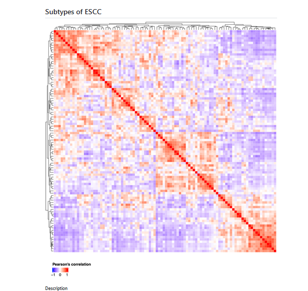
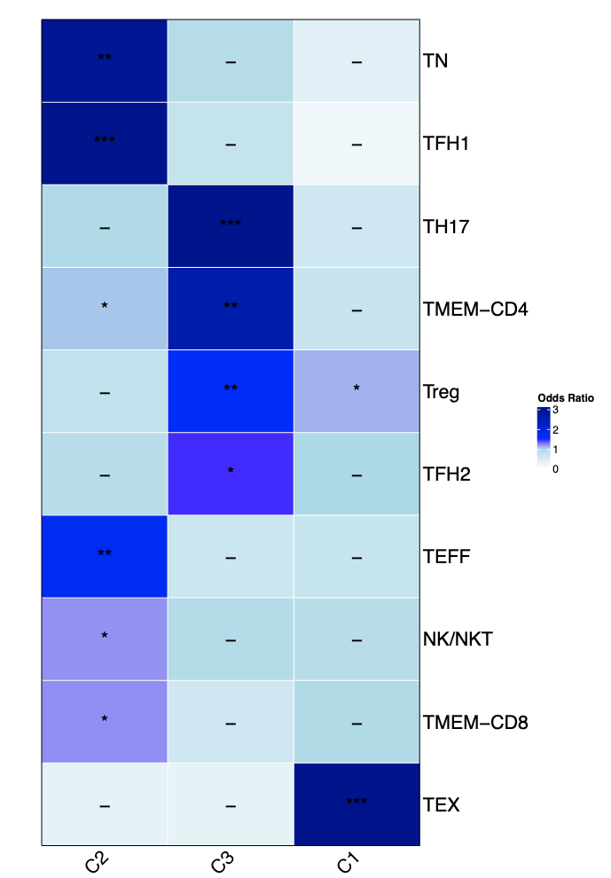
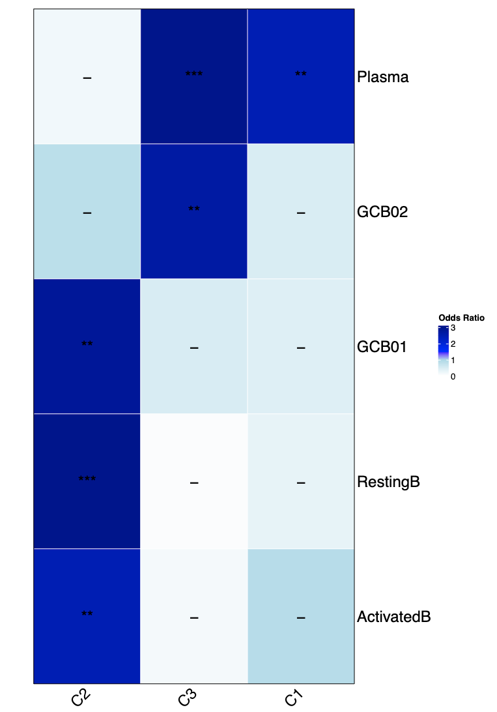
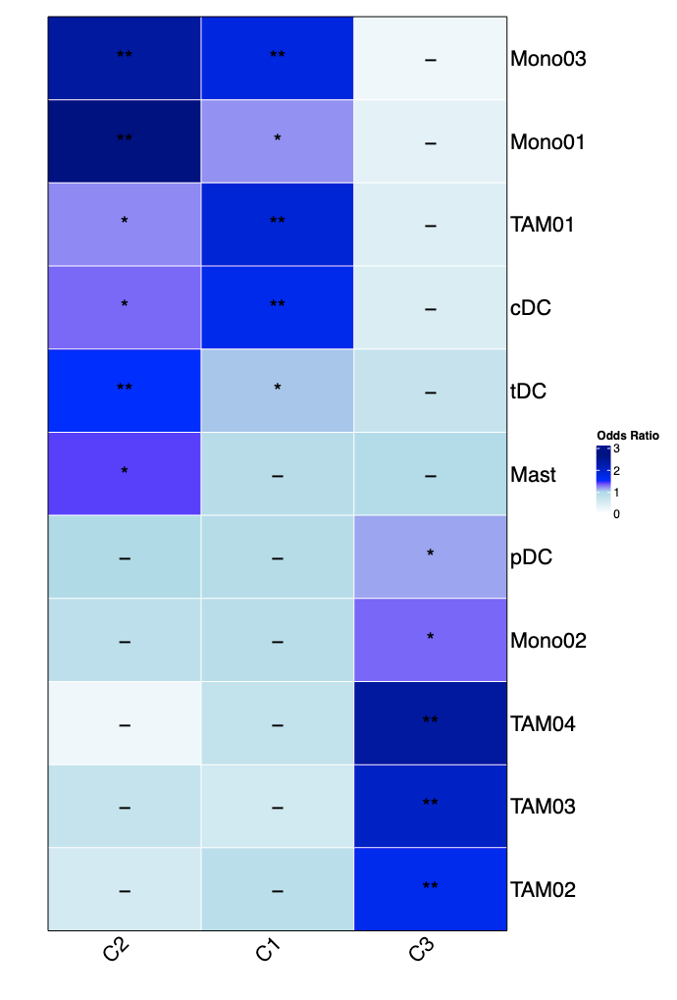

## Odds Ratio of subtypes across different subpopulations

### Description

### Results

C2 clusters are enricehd in TN,TFH!, TEFF, NK/NKT  and TMEM-CD8. 

C3 clusters are enriched in TH17, TMEM-CD4, Treg and TFH2.  
 
 
C1 clusters are mainly enriched in Treg and TEX, especially significantly enriched in TEX.

### Description

### Results

C2 are enriched in GCB01,RestingB and ActivatedB.

C3 and C! are completely different with C2.

C3 mainly enriched in Plasma and GCB02, while C1 manily enriched in Plasma.

### Description

###  Results

C2 are mainly enriched in Mono03，Mono01，TAM01，cDC，tDC
and Mast.

C1 are mainly enriched in Mono03，Mono01，TAM01 and cDC.

Comparing with C1 and C3, tDC and Mast are only enriched in C2.

C3 are completely different with C3 and C1. pDC，Mono02，TAM04，TAM03 and TAM02 are mainly enriched in C3. TAM cells are especially enriched in C3. 

