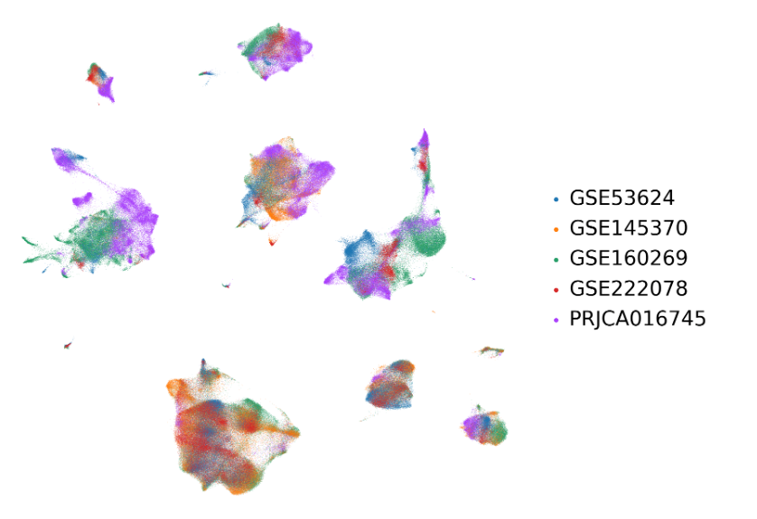

## Global UMAP

### Description

Cellular populations identified. The UMAP projection of  single cells from ESCC samples shows the formation of 8 main clusters with label names. Each dot corresponds to a single cell, colored according to cell type. 

### Results

###  Description

UMAP show by study.

###  Results

### Description

UMAP show by canonical markers.

### Results

EPCAM-Epithelial, FN1-Fibroblast， PECAM1-Endothelial,
RGS5-Pericytes
PDPN-endothelial
cD2-Tcell
cD19-B cell
cD68-myleoid

### Description

UMAP show by disease (ESCC or EAC)

###  Results

## T UMAP

###  Description

T cell types identified. The UMAP projection of  single cells from samples shows the formation of  main T cell type clusters with label names. Each dot corresponds to a single cell, colored according to T cell type. 

###  Results

TEX,NK/NKT,TEFF,TFH2,Treg, TH17,TFH1,TMEM-CD8, TMEM-CD4 and TN.

## Myleoid cells

###  Description

Myeloid cell subpopulations in ESCA.

###  Results

###  Description

B cell subpopulations in ESCA.

### Results

### Description

The three cellular modules on the basis of correlations of cell clusters from tumours.

###  Results

## Odds Ratio of subtypes across different subpopulations

### Description

The odds ratio of the three subtypes across different T subpopulations. 

### Results

C2 clusters are enricehd in TN,TFH!, TEFF, NK/NKT  and TMEM-CD8. 

C3 clusters are enriched in TH17, TMEM-CD4, Treg and TFH2.  
 
 
C1 clusters are mainly enriched in Treg and TEX, especially significantly enriched in TEX.

### Chat GPT写的

###  Results

C2 clusters are enriched in TN, TFH1, TEFF, NK/NKT, and TMEM-CD8 subpopulations. This suggests that C2 clusters are associated with a strong immune response characterized by the presence of naive T cells, helper T cells, effector T cells, natural killer cells, and memory CD8+ T cells.

C3 clusters show significant enrichment in TH17, TMEM-CD4, Treg, and TFH2 subpopulations. This indicates that C3 clusters are predominantly composed of helper T cells (type 17), memory CD4+ T cells, regulatory T cells, and follicular helper T cells type 2, highlighting a more regulatory and helper T cell-driven immune environment.

C1 clusters are mainly enriched in Treg and TEX subpopulations, with a particularly significant enrichment in TEX. This finding implies that C1 clusters are dominated by regulatory T cells and exhausted T cells, reflecting an immunosuppressive and dysfunctional T cell environment.

### Biological Meaning:

The distribution of T cell subpopulations across the three ESCC clusters provides insights into the immune landscape of each subtype. C2 clusters, enriched with effector and memory T cells, suggest a more active and possibly anti-tumor immune response. C3 clusters, with a higher presence of regulatory and helper T cells, indicate a mixed immune response with potential for both tumor suppression and immune regulation. In contrast, C1 clusters, dominated by regulatory and exhausted T cells, reveal an immunosuppressive environment that may facilitate tumor evasion and progression. Understanding these patterns can help in designing targeted immunotherapies for ESCC, tailored to the specific immune context of each cluster.

### Description

The odds ratio of the three subtypes across different B subpopulations.

### Results

C2 are enriched in GCB01,RestingB and ActivatedB.

C3 and C! are completely different with C2.

C3 mainly enriched in Plasma and GCB02, while C1 manily enriched in Plasma.

### ChatGPT 写的

###  Results

Subtype C2 is significantly enriched in GCB01, RestingB, and ActivatedB cells. In contrast, subtypes C1 and C3 show distinctly different enrichment patterns compared to C2. Subtype C3 is primarily enriched in Plasma and GCB02 cells, whereas subtype C1 is predominantly enriched in Plasma cells.

### Biological Meaning of the Figure Results:

The enrichment of subtype C2 in GCB01, RestingB, and ActivatedB cells suggests a potential involvement of these B cell subpopulations in the immune response mechanisms associated with this subtype. GCB01 cells are typically involved in generating high-affinity antibodies, RestingB cells are in a quiescent state ready for activation, and ActivatedB cells are actively responding to antigens. This indicates that subtype C2 might be linked to an active and ongoing immune response within the tumor microenvironment.

On the other hand, the enrichment of subtype C3 in Plasma and GCB02 cells highlights a different immune landscape. Plasma cells are responsible for producing antibodies, indicating that subtype C3 may be associated with a robust humoral immune response. GCB02 cells, similar to GCB01, are involved in affinity maturation of B cells. The distinct enrichment of C3 in these populations could imply a different pathway of immune activation and response compared to C2.

Subtype C1, being mainly enriched in Plasma cells, suggests a primary reliance on antibody production as part of the immune response in this subtype. This enrichment pattern indicates a potentially strong but possibly more limited immune engagement compared to the more diverse B cell involvement seen in subtype C2.

Overall, these findings reveal that different subtypes of ESCC are associated with distinct B cell-mediated immune responses, which could have implications for targeted immunotherapies and understanding the tumor immune microenvironment.

###

### Description

The odds ratio of the three subtypes across different Myeloid subpopulations.

###  Results

C2 are mainly enriched in Mono03，Mono01，TAM01，cDC，tDC
and Mast.

C1 are mainly enriched in Mono03，Mono01，TAM01 and cDC.

Comparing with C1 and C3, tDC and Mast are only enriched in C2.

C3 are completely different with C3 and C1. pDC，Mono02，TAM04，TAM03 and TAM02 are mainly enriched in C3. TAM cells are especially enriched in C3. 

### ChatGPT写的

### Figure Results:
The enrichment patterns of the three subtypes across different Myeloid subpopulations exhibit distinct characteristics:

Subtype C2 is primarily enriched in Mono03, Mono01, TAM01, cDC, tDC, and Mast cells.
Subtype C1 shows significant enrichment in Mono03, Mono01, TAM01, and cDC cells.
In comparison to Subtypes C1 and C3, tDC and Mast cells are uniquely enriched in Subtype C2.
Subtype C3 displays a markedly different enrichment pattern compared to Subtypes C1 and C2. It is predominantly enriched in pDC, Mono02, TAM04, TAM03, and TAM02 cells. Notably, TAM cells are especially abundant in Subtype C3.

### Biological Meaning:
The observed enrichment patterns suggest distinct immune microenvironment characteristics associated with each subtype of ESCC. Subtype C2's enrichment in Mono03, Mono01, TAM01, cDC, tDC, and Mast cells indicates a diverse myeloid cell involvement, potentially reflecting a complex immunological milieu. The unique presence of tDC and Mast cells in C2 suggests a specialized immune interaction or response.

Subtype C1's enrichment in Mono03, Mono01, TAM01, and cDC cells points to a more focused myeloid cell involvement, possibly indicating a specific immune response pathway.

Subtype C3, with its distinct enrichment in pDC, Mono02, TAM04, TAM03, and TAM02 cells, particularly the high presence of TAM cells, highlights a different immune landscape. The predominance of TAM cells in C3 suggests a tumor microenvironment that may be more immunosuppressive or supportive of tumor growth, which could have implications for therapeutic strategies targeting these cell populations.

## TME Chemokine and cytokine expression in different subtypes

### Description

###  Results

### Description

###  Results

## Level1 Cell proportion Boxplot across Subtype

### Description

###  Results

