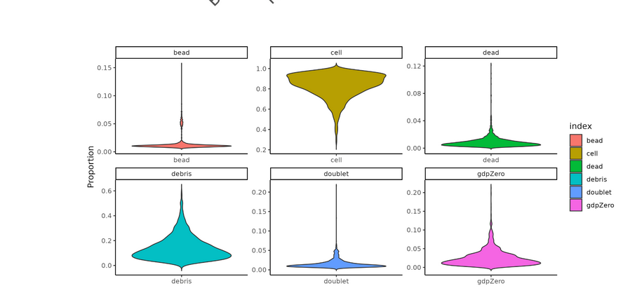
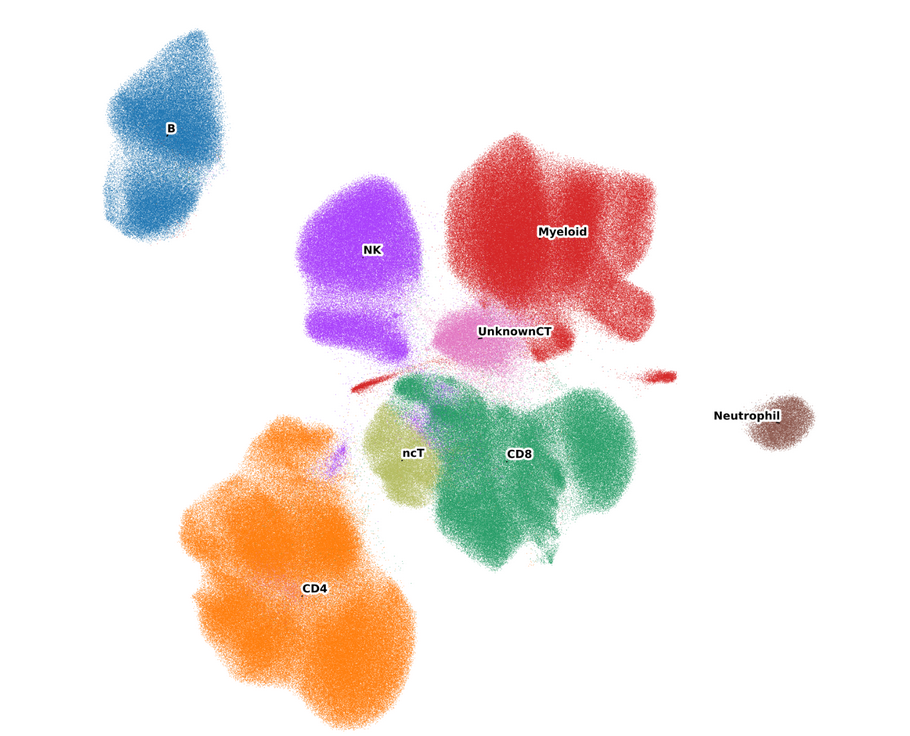
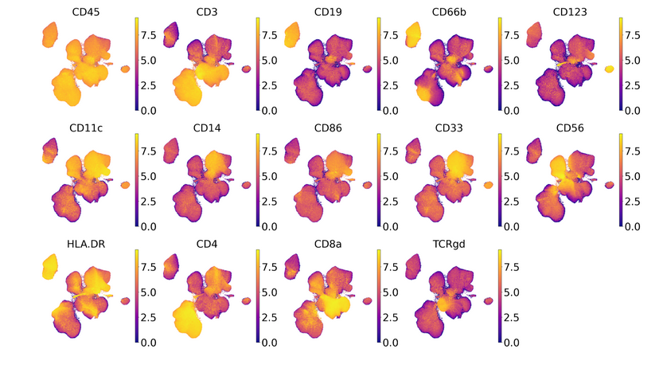
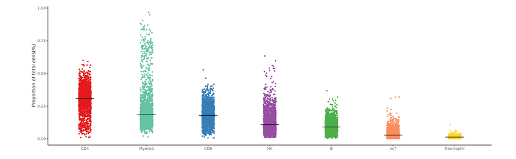
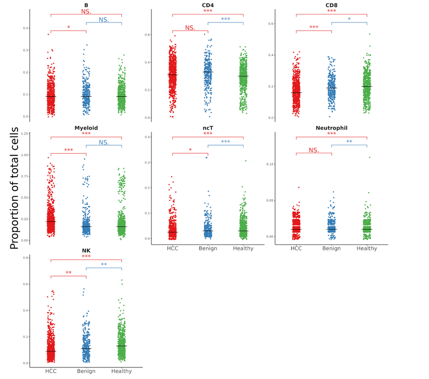
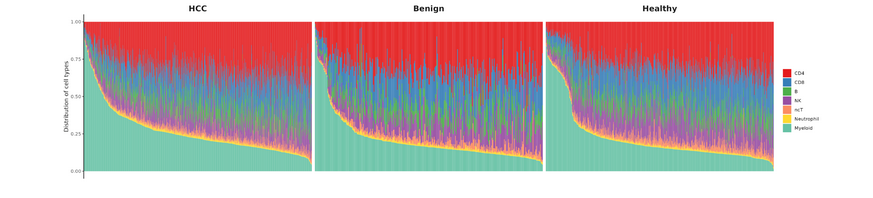
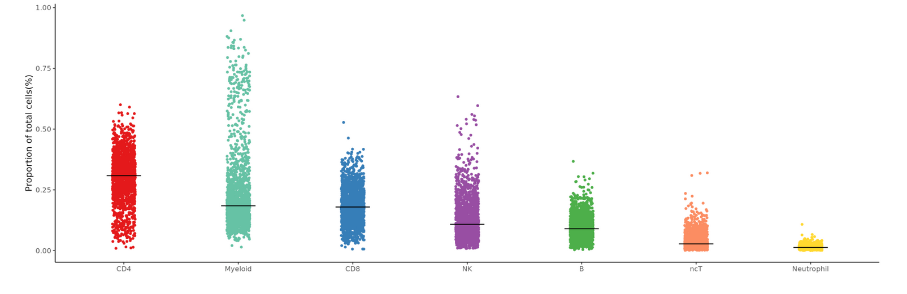
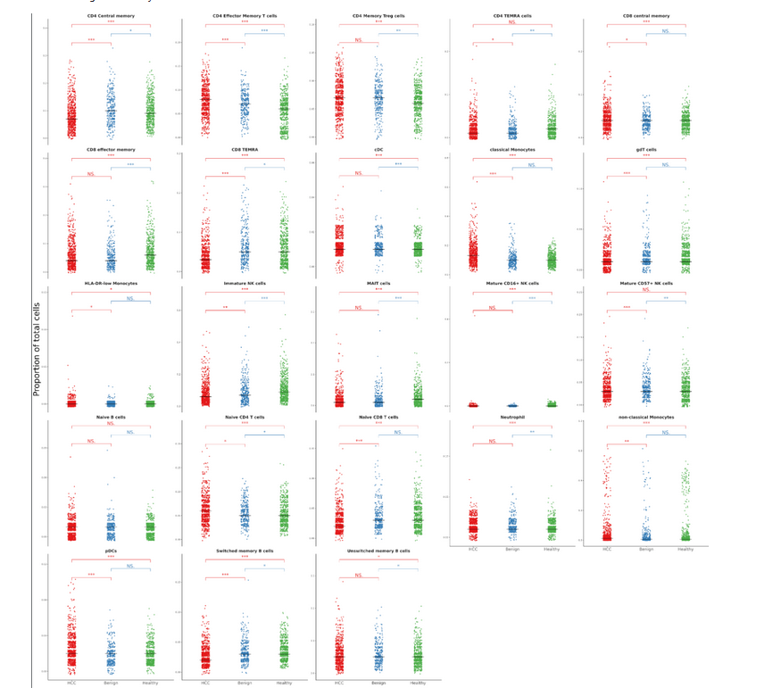

Description

proportion of  different cells.

Results

## Canonical markers Level1 UMAP

## Level1 ViolinPlot

## Celltype Proportion ViolinPlot Comparison (HCC vs Benign), (HCC vs Healthy), (Benign vs Healthy)

### Description

Celltype Proportion ViolinPlot Comparison (HCC vs Benign), (HCC vs Healthy), (Benign vs Healthy)

####  CHATGPT rewrite

**Description**:
The violin plot comparison illustrates the distribution of cell type proportions across different conditions: hepatocellular carcinoma (HCC) versus benign, HCC versus healthy, and benign versus healthy. This analysis provides a comprehensive comparison of the immune cell landscape, highlighting differences in cell type distributions between diseased and healthy tissues.

### Results

#### 自己写的

B cells are non-significant among HCC, Benign and Healthy.

CD4 in HCC is significantly higher than healthy(P value<0.01), and CD4 in begign is significantly higher than healthy(P value<0.01); but CD4 in HCC and benigh are non significant.

CD8 in healthy is significantly higher than in HCC; also CD8 in benign is significantly higher than in HCC(P value<0.01); but CD8 in healthy in significantly higher than in benign(P value<0.05).

Myeloid in HCC  is significantly higher than in healthy(P value<0.01); Myeloid in HCC is significanylt higher than in benign(P value<0.01); but Myeloid in benign and healthy are non-significant.

ncT in healthy is significantly higher than in HCC(P value<0.01), ncT in healthy is significantly higher than in benign(P value<0.01); ncT in healthy is significant higher than in Benign(P value<0.05).

Neutrophil in healthy in significantly higher than in HCC(P value<0.01); Neutrophil in healthy in significantly higher than in Benign(P value<0.03);while Neutrophil in HCC and healthy are non-significant.

NK in healthy is significantly higher than in HCC(P value<0.01); NK in healthy is significantly higher than in Begnign(P value<0.03); NK in Benign is significantly higher than in HCC(P value<0.03).That is to say , NK in healthy is the most, and in HCC is the lowest.

#### ChatGPT写的

**Figure Results**:
The analysis reveals that B cells do not show significant differences in proportions among HCC, benign, and healthy tissues. CD4 T cells are significantly more abundant in HCC compared to healthy controls (P < 0.01), and similarly, CD4 T cells are significantly elevated in benign tissues compared to healthy controls (P < 0.01). However, the difference in CD4 T cell proportions between HCC and benign tissues is not statistically significant.

CD8 T cells are significantly more prevalent in healthy tissues than in HCC (P < 0.01), and benign tissues also show a significantly higher proportion of CD8 T cells compared to HCC (P < 0.01). Additionally, the proportion of CD8 T cells in healthy tissues is significantly higher than in benign tissues (P < 0.05).

Myeloid cells are significantly more abundant in HCC compared to both healthy (P < 0.01) and benign tissues (P < 0.01). However, there is no significant difference in Myeloid cell proportions between benign and healthy tissues.

Non-classical T cells (ncT) are significantly more prevalent in healthy tissues compared to both HCC (P < 0.01) and benign tissues (P < 0.01), with a notable difference also observed between healthy and benign tissues (P < 0.05).

Neutrophils are significantly more abundant in healthy tissues compared to HCC (P < 0.01) and benign tissues (P < 0.03), with no significant difference observed between HCC and benign tissues.

Natural Killer (NK) cells are significantly more prevalent in healthy tissues compared to HCC (P < 0.01) and benign tissues (P < 0.03). Additionally, NK cell proportions are significantly higher in benign tissues compared to HCC (P < 0.03). This suggests that NK cell levels are highest in healthy tissues and lowest in HCC.

**Biological Interpretation**:
The observed immune cell distribution patterns suggest a distinct immune landscape in hepatocellular carcinoma (HCC) compared to benign and healthy tissues. The significant elevation of CD4 T cells in HCC and benign tissues compared to healthy controls may indicate an adaptive immune response, although the lack of difference between HCC and benign tissues suggests similar levels of immune activation in these conditions. The decreased CD8 T cell levels in HCC, coupled with their relative abundance in healthy tissues, could imply impaired cytotoxic immune activity in HCC, which might contribute to tumor immune evasion.

The increased myeloid cell presence in HCC compared to benign and healthy tissues suggests an inflammatory or immunosuppressive microenvironment that might support tumor progression. The reduced levels of non-classical T cells (ncT) in HCC and benign tissues compared to healthy controls may reflect a compromised immune surveillance system in disease states.

Neutrophils, more abundant in healthy tissues, may play a role in maintaining immune homeostasis, with their decreased presence in HCC potentially contributing to an impaired innate immune response. The significant decrease in NK cells in HCC compared to healthy and benign tissues underscores a possible defect in the innate immune surveillance mechanism in HCC, which could facilitate tumor growth and metastasis.

These findings provide critical insights into the immune microenvironment of HCC, potentially offering avenues for targeted immunotherapies and further research into immune modulation in cancer.

结果输出：

1. **图结果**：
分析显示，B细胞在HCC、良性和健康组织之间的比例差异没有显著性。CD4 T细胞在HCC中显著高于健康对照组（P < 0.01），同样地，CD4 T细胞在良性组织中也显著高于健康对照组（P < 0.01）。然而，HCC与良性组织之间的CD4 T细胞比例差异没有统计学意义。

CD8 T细胞在健康组织中的比例显著高于HCC（P < 0.01），并且良性组织中的CD8 T细胞比例也显著高于HCC（P < 0.01）。此外，健康组织中的CD8 T细胞比例显著高于良性组织（P < 0.05）。

髓系细胞在HCC中的比例显著高于健康组织（P < 0.01）和良性组织（P < 0.01）。然而，良性与健康组织之间的髓系细胞比例差异没有显著性。

非经典T细胞（ncT）在健康组织中的比例显著高于HCC（P < 0.01）和良性组织（P < 0.01），且健康与良性组织之间也存在显著差异（P < 0.05）。

中性粒细胞在健康组织中的比例显著高于HCC（P < 0.01）和良性组织（P < 0.03），而HCC与良性组织之间的差异则不显著。

自然杀伤细胞（NK细胞）在健康组织中的比例显著高于HCC（P < 0.01）和良性组织（P < 0.03）。此外，良性组织中的NK细胞比例显著高于HCC（P < 0.03）。这表明NK细胞在健康组织中含量最高，而在HCC中含量最低。

2. **生物学解释**：
观察到的免疫细胞分布模式表明，肝细胞癌（HCC）与良性和健康组织相比，具有独特的免疫微环境。CD4 T细胞在HCC和良性组织中显著升高，这可能表明适应性免疫反应的存在，尽管HCC和良性组织之间无显著差异，暗示这些疾病状态下的免疫激活水平相似。HCC中CD8 T细胞水平的下降，伴随着健康组织中CD8 T细胞的相对丰富，可能表明HCC中细胞毒性免疫活性的受损，这可能有助于肿瘤的免疫逃逸。

HCC中髓系细胞的增加表明，可能存在支持肿瘤进展的炎症或免疫抑制性微环境。HCC和良性组织中非经典T细胞（ncT）水平的减少可能反映出这些疾病状态下免疫监视系统的受损。

中性粒细胞在健康组织中更为丰富，可能在维持免疫稳态中起重要作用，HCC中中性粒细胞的减少可能导致先天免疫反应的受损。HCC中NK细胞显著减少表明其先天免疫监视机制可能存在缺陷，从而促进肿瘤的生长和转移。

这些发现为HCC的免疫微环境提供了重要的见解，可能为靶向免疫治疗和癌症免疫调节的进一步研究提供了新思路。

## Cell type Proportion BarPlot

### Description

Cell type Proportion BarPlot in HCC , Benign and Healthy.

###  Results

Myleoid in healthy is higher than in HCC; CD8 in Benign and healthy are higher than in HCC;NK in Benign and Heatlthy are higher than in HCC;CD4 in HCC is higher than in Benign and healthy.

#### ChatGPT写的

#### Figure Results:**

The analysis reveals a notable decrease in myeloid cell proportions in hepatocellular carcinoma (HCC) samples compared to both healthy and benign conditions. Similarly, CD8+ T cells and natural killer (NK) cells exhibit significantly reduced proportions in HCC relative to the benign and healthy samples. In contrast, CD4+ T cells are more abundant in HCC than in both benign and healthy conditions, suggesting a distinct immunological shift in the tumor environment.

**3. Biological Meaning of the Figure Results:**

The observed changes in immune cell proportions highlight significant alterations in the tumor microenvironment associated with hepatocellular carcinoma. The reduction in myeloid cells, CD8+ T cells, and NK cells in HCC suggests a compromised immune surveillance and effector function, potentially facilitating tumor progression and immune evasion. Conversely, the increase in CD4+ T cells in HCC may reflect a shift towards a more immunosuppressive or regulatory T cell phenotype, contributing to the tumor's ability to evade the immune response. These findings underscore the complex interplay between different immune cell types in shaping the tumor microenvironment and may inform the development of immunotherapeutic strategies targeting these cellular components.

**2. 图形结果：**

分析显示，肝细胞癌（HCC）样本中髓系细胞比例显著低于健康和良性条件。同样，CD8+ T 细胞和自然杀伤（NK）细胞在 HCC 中的比例显著低于良性和健康样本。相比之下，HCC 中的 CD4+ T 细胞比例高于良性和健康样本，提示肿瘤环境中存在显著的免疫学变化。

**3. 图形结果的生物学意义：**

观察到的免疫细胞比例变化突出了与肝细胞癌相关的肿瘤微环境中显著的变化。髓系细胞、CD8+ T 细胞和 NK 细胞在 HCC 中的减少，提示免疫监视和效应功能受损，可能有助于肿瘤的进展和免疫逃逸。相反，HCC 中 CD4+ T 细胞的增加可能反映了向更具免疫抑制性或调节性 T 细胞表型的转变，促进肿瘤逃避免疫反应。这些发现强调了不同免疫细胞类型之间复杂的相互作用在塑造肿瘤微环境中的作用，并可能为靶向这些细胞成分的免疫治疗策略开发提供参考。

## Cell type Proportion ViolinPlot

### Description 

ViolinPlot of different Cell types Proportion .

#### CHATGPT rewrite：

"A violin plot illustrating the proportion of various cell types."

### Results 

CD4 have the biggest proportion in all cell types, then it is Myeloid ,CD8 ,NK and B cells .
CD4, Myleoid ,CD8, NK and  B cells are top 5 proportion in all cell types.Neutropils has the lowest proportion. 

#### CHatGPT 写的RESULTS OUTPUT:

   
1. **Figure Results:**
   "CD4 T cells exhibit the highest proportion among all cell types, followed by myeloid cells, CD8 T cells, NK cells, and B cells. These five cell types represent the most abundant populations, while neutrophils are present in the lowest proportion."

2. **Biological Meaning:**
   The dominance of CD4 T cells suggests a potentially critical role in the immune response within the studied context, as they are key regulators of immune function. The substantial presence of myeloid cells indicates active innate immune responses, potentially involving antigen presentation and inflammation. The presence of CD8 T cells reflects cytotoxic activity, crucial for targeting infected or malignant cells. NK cells, which also have cytotoxic functions, further highlight the importance of immune surveillance in this system. The relatively low proportion of neutrophils might suggest either a less pronounced acute inflammatory response or a specific tissue environment where neutrophil recruitment or survival is limited.

RESULTS OUTPUT:

1. **描述:**
   "一张展示不同细胞类型比例的小提琴图。"

2. **图表结果:**
   "CD4 T细胞在所有细胞类型中占比最高，其次是髓系细胞、CD8 T细胞、NK细胞和B细胞。这五种细胞类型是最丰富的群体，而中性粒细胞的比例最低。"

3. **生物学意义:**
   CD4 T细胞的主导地位表明它们在研究环境中可能具有关键的免疫反应调节作用。髓系细胞的显著存在表明了先天免疫反应的活跃，可能涉及抗原呈递和炎症。CD8 T细胞的存在反映了细胞毒性活动，对感染或恶性细胞的靶向清除至关重要。NK细胞同样具有细胞毒性功能，进一步强调了免疫监视在此系统中的重要性。中性粒细胞的相对低比例可能表明急性炎症反应较为轻微，或者特定组织环境中中性粒细胞的募集或存活受限。

## Disease Comparison

### HCC vs Benign vs Healthy

### Results

CD4 CEntral 

