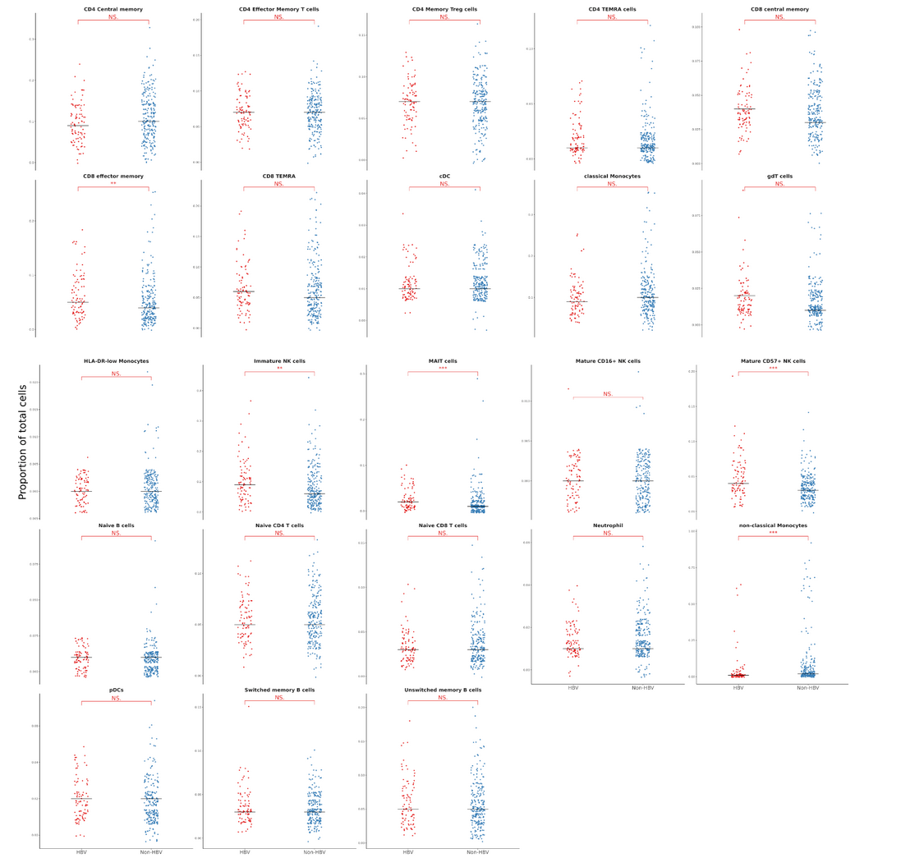

Description

proportion of  different cells.

Results

## Canonical markers Level1 UMAP

## Level1 ViolinPlot

## Celltype Proportion ViolinPlot Comparison (HCC vs Benign), (HCC vs Healthy), (Benign vs Healthy)

### Description

Celltype Proportion ViolinPlot Comparison (HCC vs Benign), (HCC vs Healthy), (Benign vs Healthy)

1. **Figure Description**:
   Comparison of cell type proportions across three groups—HCC, benign tumors, and healthy individuals—using violin plots to visualize the distribution differences between these groups.

####  CHATGPT rewrite

### Results

#### 自己写的

B cells are non-significant among HCC, Benign and Healthy.

CD4 in HCC is significantly higher than healthy(P value<0.01), and CD4 in begign is significantly higher than healthy(P value<0.01); but CD4 in HCC and benigh are non significant.

CD8 in healthy is significantly higher than in HCC; also CD8 in benign is significantly higher than in HCC(P value<0.01); but CD8 in healthy in significantly higher than in benign(P value<0.05).

Myeloid in HCC  is significantly higher than in healthy(P value<0.01); Myeloid in HCC is significanylt higher than in benign(P value<0.01); but Myeloid in benign and healthy are non-significant.

ncT in healthy is significantly higher than in HCC(P value<0.01), ncT in healthy is significantly higher than in benign(P value<0.01); ncT in healthy is significant higher than in Benign(P value<0.05).

Neutrophil in healthy in significantly higher than in HCC(P value<0.01); Neutrophil in healthy in significantly higher than in Benign(P value<0.03);while Neutrophil in HCC and healthy are non-significant.

NK in healthy is significantly higher than in HCC(P value<0.01); NK in healthy is significantly higher than in Begnign(P value<0.03); NK in Benign is significantly higher than in HCC(P value<0.03).That is to say , NK in healthy is the most, and in HCC is the lowest.

#### ChatGPT写的

2. **Figure Results**:
   - B cells show no significant differences across HCC, benign, and healthy groups.
   - CD4 T cells are significantly elevated in HCC compared to healthy individuals (P < 0.01) and also higher in benign tumors compared to healthy individuals (P < 0.01), but there is no significant difference between HCC and benign tumors.
   - CD8 T cells are significantly higher in healthy individuals compared to HCC (P < 0.01), and also higher in benign tumors compared to HCC (P < 0.01). However, CD8 T cells in healthy individuals are significantly higher than in benign tumors (P < 0.05).
   - Myeloid cells are significantly elevated in HCC compared to healthy individuals (P < 0.01) and benign tumors (P < 0.01), with no significant difference between benign tumors and healthy individuals.
   - Non-classical T cells (ncT) are significantly higher in healthy individuals compared to HCC (P < 0.01) and benign tumors (P < 0.01), with a further significant increase in healthy individuals compared to benign tumors (P < 0.05).
   - Neutrophils are significantly higher in healthy individuals compared to HCC (P < 0.01) and benign tumors (P < 0.03), with no significant difference between HCC and benign tumors.
   - NK cells are significantly higher in healthy individuals compared to HCC (P < 0.01) and benign tumors (P < 0.03). Additionally, NK cells are significantly higher in benign tumors compared to HCC (P < 0.03). This indicates that NK cells are most abundant in healthy individuals and least abundant in HCC patients.

3. **Biological Meaning of the Results**:
   - **B cells**: The lack of significant differences in B cells among the groups suggests that B cell involvement might not be a primary factor in distinguishing between liver cancer, benign tumors, and healthy states.
   - **CD4 T cells**: The elevation of CD4 T cells in both HCC and benign tumors compared to healthy individuals may indicate an immune response associated with tumor presence, though the similarity between HCC and benign conditions suggests a general immune activation rather than a specific response to malignancy.
   - **CD8 T cells**: The higher levels of CD8 T cells in healthy individuals suggest a robust cytotoxic immune capacity in the absence of tumors, which is diminished in both HCC and benign conditions. The decrease in CD8 T cells in benign conditions compared to healthy individuals, though less pronounced than in HCC, indicates some level of immune modulation even in non-malignant states.
   - **Myeloid cells**: The significant increase in myeloid cells in HCC suggests a strong myeloid response associated with cancer, which may be contributing to the tumor microenvironment, promoting inflammation, or facilitating immune evasion.
   - **Non-classical T cells (ncT)**: The elevated levels of ncT cells in healthy individuals, with a decrease in both HCC and benign tumors, might reflect a loss of certain immune regulatory functions that are typically involved in tissue surveillance and homeostasis.
   - **Neutrophils**: The higher levels of neutrophils in healthy individuals, decreasing in both HCC and benign tumors, might indicate a role for neutrophils in maintaining normal immune surveillance, which is compromised in disease states.
   - **NK cells**: The progressive decrease in NK cell levels from healthy individuals to benign tumors and then to HCC suggests that NK cell-mediated cytotoxicity is impaired in liver disease, particularly in malignancy, which might contribute to tumor immune escape and progression.

This analysis provides a comprehensive understanding of how immune cell distributions vary across different liver disease states, highlighting potential targets for diagnostic and therapeutic interventions.

**结果输出**

1. **图表结果**：
   - B细胞在肝癌、良性肿瘤和健康人群之间无显著差异。
   - CD4 T细胞在肝癌患者中显著高于健康人群（P < 0.01），并且在良性肿瘤患者中也高于健康人群（P < 0.01），但肝癌患者与良性肿瘤患者之间无显著差异。
   - CD8 T细胞在健康人群中显著高于肝癌患者（P < 0.01），在良性肿瘤患者中也高于肝癌患者（P < 0.01）。然而，健康人群中的CD8 T细胞显著高于良性肿瘤患者（P < 0.05）。
   - 髓系细胞在肝癌患者中显著高于健康人群（P < 0.01）和良性肿瘤患者（P < 0.01），而良性肿瘤患者与健康人群之间无显著差异。
   - 非经典T细胞（ncT）在健康人群中显著高于肝癌患者（P < 0.01）和良性肿瘤患者（P < 0.01），并且在健康人群中较良性肿瘤患者有显著增加（P < 0.05）。
   - 中性粒细胞在健康人群中显著高于肝癌患者（P < 0.01）和良性肿瘤患者（P < 0.03），而肝癌患者和良性肿瘤患者之间无显著差异。
   - NK细胞在健康人群中显著高于肝癌患者（P < 0.01）和良性肿瘤患者（P < 0.03）。此外，NK细胞在良性肿瘤患者中显著高于肝癌患者（P < 0.03）。这表明NK细胞在健康人群中最多，在肝癌患者中最少。

2. **图表结果的生物学意义**：
   - **B细胞**：B细胞在各组间无显著差异，表明B细胞的参与可能不是区分肝癌、良性肿瘤和健康状态的主要因素。
   - **CD4 T细胞**：CD4 T细胞在肝癌和良性肿瘤患者中均高于健康人群，可能反映了与肿瘤存在相关的免疫反应，尽管肝癌与良性肿瘤间的相似性表明这是一种普遍的免疫激活，而非针对恶性肿瘤的特异性反应。
   - **CD8 T细胞**：健康人群中较高的CD8 T细胞水平表明，在无肿瘤的情况下，细胞毒性免疫能力较强，而在肝癌和良性肿瘤中均有所下降。良性肿瘤中的CD8 T细胞水平虽低于健康人群，但降幅较肝癌轻微，表明即使在非恶性状态下也存在某种程度的免疫调节。
   - **髓系细胞**：髓系细胞在肝癌患者中的显著增加表明，这种强烈的髓系反应可能与癌症相关，可能促进了肿瘤微环境、炎症或免疫逃逸的形成。
   - **非经典T细胞（ncT）**：健康人群中较高的ncT细胞水平，以及在肝癌和良性肿瘤中的减少，可能反映出某些与组织监视和稳态维持相关的免疫调节功能的丧失。
   - **中性粒细胞**：健康人群中较高的中性粒细胞水平，以及在肝癌和良性肿瘤中的减少，可能表明中性粒细胞在维持正常免疫监视中的作用，而在疾病状态下这一作用受到损害。
   - **NK细胞**：NK细胞从健康人群到良性肿瘤再到肝癌逐步减少，表明NK细胞介导的细胞毒性在肝病中受损，尤其是在恶性肿瘤中，这可能有助于肿瘤的免疫逃逸和进展。

此分析全面展示了在不同肝病状态下免疫细胞分布的变化，强调了诊断和治疗干预的潜在靶点。

## Cell type Proportion BarPlot

### Description

Cell type Proportion BarPlot in HCC , Benign and Healthy.

#### CHATGPT Figure Description:

"Comparative Bar Plot Illustrating Cell Type Proportions Among HCC Patients, Benign Tumor Patients, and Healthy Individuals."

###  Results

Myleoid in healthy is higher than in HCC; CD8 in Benign and healthy are higher than in HCC;NK in Benign and Heatlthy are higher than in HCC;CD4 in HCC is higher than in Benign and healthy.

### ChatGPT写的

RESULTS OUTPUT

Figure Results:

"Myeloid cell proportions are elevated in healthy individuals compared to those with HCC. CD8 T cell levels are higher in both benign tumor patients and healthy individuals relative to HCC patients. NK cell frequencies are increased in benign tumor patients and healthy individuals compared to those with HCC. Conversely, CD4 T cell proportions are greater in HCC patients than in benign tumor patients and healthy individuals."

Biological Interpretation:

The observed decrease in myeloid cells, CD8 T cells, and NK cells within HCC patients suggests a compromised innate and adaptive immune response, potentially facilitating tumor progression. Elevated CD4 T cell levels in HCC patients may indicate a shift towards a tumor-promoting immunological environment. These cellular distribution patterns underscore the immune dysregulation associated with hepatocellular carcinoma and may offer insights for diagnostic and therapeutic strategies.

RESULTS OUTPUT

图表结果：

“与肝癌患者相比，健康个体中的髓系细胞比例更高。良性肿瘤患者和健康个体中的CD8 T细胞水平高于肝癌患者。良性肿瘤患者和健康个体中的NK细胞频率高于肝癌患者。相反，肝癌患者的CD4 T细胞比例高于良性肿瘤患者和健康个体。”

生物学意义解释：

在肝癌患者中，髓系细胞、CD8 T细胞和NK细胞的减少表明其先天和适应性免疫反应可能受到抑制，从而促进了肿瘤的进展。肝癌患者中CD4 T细胞水平的升高可能暗示了向肿瘤促进性免疫环境的转变。这些细胞分布模式突显了与肝细胞癌相关的免疫失调，并可能为诊断和治疗策略提供新的见解。

## Cell type Proportion ViolinPlot

### Description 

Scatter diagram of different Cell types Proportion .

#### CHATGPT rewrite：

**2. Figure Description:**  
Proportional distribution of various immune cell types in the peripheral blood across the study groups.

### Results 

CD4 have the biggest proportion in all cell types, then it is Myeloid ,CD8 ,NK and B cells .
CD4, Myleoid ,CD8, NK and  B cells are top 5 proportion in all cell types.Neutropils has the lowest proportion. 

### CHatGPT 写的RESULTS OUTPUT:

**3. Figure Results:**  
CD4 T cells constitute the largest proportion among all cell types, followed by Myeloid cells, CD8 T cells, NK cells, and B cells. These five cell types represent the majority of the immune cell population. In contrast, Neutrophils have the lowest representation.

**4. Biological Meaning:**  
The predominance of CD4 T cells in the immune landscape suggests their central role in orchestrating immune responses in both pathological and healthy states. The significant presence of Myeloid cells indicates their involvement in inflammatory responses, particularly in the context of liver disease. The distribution pattern observed for CD8 T cells, NK cells, and B cells highlights the multi-faceted immune defense mechanisms that are active in these patients. The minimal presence of Neutrophils could reflect their reduced involvement in chronic liver conditions compared to acute inflammatory responses. These findings provide insight into the immune cell dynamics associated with liver disease progression and may help identify potential therapeutic targets for liver disease management.   

RESULTS OUTPUT:

**3. 图表结果：**  
CD4 T细胞在所有细胞类型中占比最大，其次是髓系细胞、CD8 T细胞、NK细胞和B细胞。这五种细胞类型占据了免疫细胞总量的主要部分。相比之下，中性粒细胞的比例最低。

**4. 生物学意义：**  
CD4 T细胞在免疫环境中占主导地位，表明其在病理和健康状态下调控免疫反应的核心作用。髓系细胞的显著存在表明它们在炎症反应，特别是肝病背景下的作用。CD8 T细胞、NK细胞和B细胞的分布模式强调了在这些患者中活跃的多方面免疫防御机制。中性粒细胞的极低比例可能反映了它们在慢性肝病状态下的参与度较低，更多与急性炎症反应相关。这些发现为肝病进展相关的免疫细胞动态提供了洞见，并可能帮助识别肝病管理的潜在治疗靶点。

## Disease Comparison

### HCC vs Benign vs Healthy

###  Description

Proportion of total cell types in HCC vs Benign vs Healthy

####CHATGPT Rewrite **Figure Description:**
   
Proportion of immune cell types across three groups: patients with HCC, patients with benign tumors, and healthy individuals.

### Results

CD4 Cenntral Memory in Benign is significantly higher than in HCC (P < 0.01), CD4 Cenntral Memory in Benign is significantly thigher than in healthy(P < 0.05);CD4 Cenntral Memory in healthy is significantly higher than in HCC(P < 0.01).

CD4 Effector Memory T cells in HCC is significantly higher than in benign and healthy(P < 0.01);CD4 Effector Memory T cells in benign is significanyl higher than in healthy(P < 0.01).that is to say,CD4 Effector Memory T cells in HCC > in benign >in healthy.

CD4 Memory Treg cells in HCC is significanylt higher than in healthy(P < 0.01);CD4 Memory Treg cells in Benign is significantly higher than in Healthy(P < 0.03);CD4 Memory Treg cells is non-significant in HCC and Benign.

CD4 Temra cells in Benign  is significantly lower than in healthy(P < 0.03);CD4 Temra cells in HCC is significantly higher than in Benign(P < 0.05);CD4 Temra cells in HCC and Healthy are non-significant.

CD8 Cenntral Memory in HCC is significantly higher than in healthy(P < 0.01);CD8 Cenntral Memory in HCC is significantly higher than in Benign(P < 0.05); while CD8 Cenntral Memory is non-significant in Benign and healthy.

CD8 Effector Memory T cells in heanthy is significantly higher than in HCC(P < 0.01); CD8 Effector Memory T cells in healthy is significantky higher than in Benign(P < 0.01); while CD8 Effector Memory T cells is non-significant in Benign and HCC.

CD8 Temra cells in healthy is significantly higher than in HCC(P < 0.01);
CD8 Temra cells in Benign is significantly higher than in HCC(P < 0.01).

cDC in HCC is significantly higher than in heathy(P < 0.01); cDC is Benign is significantly higher than in healthy(P < 0.01);while cDC is non-significant in HCC and Benign.

Classical Monocytes in HCC is significantly higher than in healthy;Classical Monocytes in HCC is significantly higher than in Benign(P < 0.01);while Classical Monocytes is non-significant in Benign and healthy.

gDT  in healthy is significantly higher than in HCC(P < 0.01); gDT in Benign is significantly higher than in HCC(P < 0.01);while in Benign and healthy are non-significant.

HLA-DR-low Monocytes in HCC is significantly higher than in healthy(P < 0.05); HLA-DR-low Monocytes in HCC is significantly higher than in Benign(P < 0.05); while HLA-DR-low Monocytes is non-significant in Benign and healthy.

Immature NK cells cells in healthy is significantly higher than in HCC(P < 0.01);Immature NK cellsin healthy is significantly higher than in Benign(P < 0.01);Immature NK cells in Benign is significantly higher than in HCC(P < 0.03).

MAIT cells cells in healthy is significantly higher than in HCC(P < 0.01);MAIT cells in healthy is significantly higher than in Benign(P < 0.01);MAIT cells in Benign is non-significant in HCC and Benign(P < 0.03).

Mature CD16+ NK cells in healthy is significantly higher than in Benign and HCC.( P value <0.01 )

Mature CD 57+ NK cells in healthy is significantlt higher than in Benign( P value <0.01 );Mature CD 57+ NK cells in HCC is significantly higher than in Benign( P value <0.01 );while Mature CD 57+ NK cells in healthy and in HCC are non-significant.

Naive CD4  in HCC is significantly higher than in healthy;Naive CD4 in HCC is significantly higher than in Benign;Naive CD4 in Benign is significantly higher than in healthy. That is to say, Naive CD4 in HCC > in Benign> in healthy.

Naive CD8T cells in Benign and Healthy is significantly higher than in HCC.( P value <0.01 )

Neutropils in HCC and Benign is significantly higher than in healthy;Neutropils in HCC is the most than the other two group.

non-classical Monocytes in HCC is significantly higher than in healthy and Benign.HCC has the highest proportion than the other two groups.

pDCs in HCC and Benign in significantly higher than in healthy.PDCs in HCC and Benign are non-significant.(P < 0.01)

Switched Memory B cells in  Healthy and in Benign is significantly higher than in HCC.(P < 0.01)

Unswitched Memory B cells in HCC and Benign is significantly higher than in healthy(P < 0.05).Unswitched Memory B cells in HCC and Benign is non-significant.

### ChatGPT写的

2. **Figure Results:**

   - CD4 Central Memory cells are significantly elevated in benign tumors compared to HCC (P < 0.01) and healthy individuals (P < 0.05). Additionally, CD4 Central Memory cells in healthy individuals are significantly higher than in HCC (P < 0.01).
   - CD4 Effector Memory T cells are markedly higher in HCC than in benign tumors and healthy individuals (P < 0.01). Moreover, benign tumors show higher levels than healthy individuals (P < 0.01).
   - CD4 Memory Treg cells are significantly increased in HCC compared to healthy individuals (P < 0.01), and in benign tumors compared to healthy individuals (P < 0.03). However, differences between HCC and benign tumors are not significant.
   - CD4 TEMRA cells are significantly lower in benign tumors than in healthy individuals (P < 0.03), and higher in HCC than in benign tumors (P < 0.05), with no significant differences between HCC and healthy individuals.
   - CD8 Central Memory cells are significantly higher in HCC compared to healthy individuals (P < 0.01) and benign tumors (P < 0.05), with no significant difference between benign tumors and healthy individuals.
   - CD8 Effector Memory T cells are significantly elevated in healthy individuals compared to HCC (P < 0.01) and benign tumors (P < 0.01), with no significant difference between benign tumors and HCC.
   - CD8 TEMRA cells are significantly higher in healthy individuals than in HCC (P < 0.01), and also elevated in benign tumors compared to HCC (P < 0.01).
   - cDCs are significantly higher in HCC compared to healthy individuals (P < 0.01) and also in benign tumors compared to healthy individuals (P < 0.01), with no significant differences between HCC and benign tumors.
   - Classical Monocytes are significantly elevated in HCC compared to healthy individuals and benign tumors (P < 0.01), with no significant differences between benign tumors and healthy individuals.
   - γδ T cells are significantly higher in healthy individuals compared to HCC (P < 0.01), and also in benign tumors compared to HCC (P < 0.01), with no significant differences between benign tumors and healthy individuals.
   - HLA-DR-low Monocytes are significantly higher in HCC compared to healthy individuals (P < 0.05) and benign tumors (P < 0.05), with no significant differences between benign tumors and healthy individuals.
   - Immature NK cells are significantly higher in healthy individuals compared to HCC (P < 0.01) and benign tumors (P < 0.01), and in benign tumors compared to HCC (P < 0.03).
   - MAIT cells are significantly elevated in healthy individuals compared to HCC (P < 0.01) and benign tumors (P < 0.01), with no significant differences between HCC and benign tumors.
   - Mature CD16+ NK cells are significantly higher in healthy individuals compared to benign tumors and HCC (P < 0.01).
   - Mature CD57+ NK cells are significantly higher in healthy individuals compared to benign tumors (P < 0.01), and in HCC compared to benign tumors (P < 0.01), with no significant differences between healthy individuals and HCC.
   - Naive CD4 T cells are significantly elevated in HCC compared to healthy individuals and benign tumors, with the highest levels observed in HCC, followed by benign tumors and healthy individuals.
   - Naive CD8 T cells are significantly higher in benign tumors and healthy individuals compared to HCC (P < 0.01).
   - Neutrophils are significantly higher in HCC and benign tumors compared to healthy individuals, with the highest levels in HCC.
   - Non-classical Monocytes are significantly elevated in HCC compared to healthy individuals and benign tumors, with the highest proportion observed in HCC.
   - pDCs are significantly higher in HCC and benign tumors compared to healthy individuals (P < 0.01), with no significant differences between HCC and benign tumors.
   - Switched Memory B cells are significantly higher in healthy individuals and benign tumors compared to HCC (P < 0.01).
   - Unswitched Memory B cells are significantly higher in HCC and benign tumors compared to healthy individuals (P < 0.05), with no significant differences between HCC and benign tumors.

3. **Biological Meaning of the Figure Results:**

   The immune cell profiles in the peripheral blood of individuals with HCC, benign tumors, and healthy individuals show distinct differences. These differences in immune cell composition likely reflect the underlying immune response dynamics in different liver disease states. For example, the elevated levels of CD4 Effector Memory T cells in HCC may indicate a heightened immune response associated with tumor progression. Similarly, the increase in Classical Monocytes and HLA-DR-low Monocytes in HCC suggests a potential role of these cells in the tumor microenvironment, possibly contributing to immune suppression or chronic inflammation. The higher proportions of Naive T cells in HCC might reflect a disrupted differentiation process or an attempt by the immune system to generate new T cells in response to the tumor. Overall, these findings could provide valuable insights into the immune mechanisms involved in liver disease and identify potential biomarkers for more precise diagnosis and therapeutic targeting.

RESULTS OUTPUT:

1. **图表结果:**

   - 在良性肿瘤患者中，CD4中心记忆细胞显著高于肝癌患者（P < 0.01）和健康人群（P < 0.05）；此外，健康人群中的CD4中心记忆细胞显著高于肝癌患者（P < 0.01）。
   - CD4效应记忆T细胞在肝癌患者中显著高于良性肿瘤患者和健康人群（P < 0.01），良性肿瘤患者的水平也高于健康人群（P < 0.01）。
   - CD4记忆调节T细胞在肝癌患者中显著高于健康人群（P < 0.01），在良性肿瘤患者中显著高于健康人群（P < 0.03）；然而，肝癌患者和良性肿瘤患者之间的差异不显著。
   - CD4 TEMRA细胞在良性肿瘤患者中显著低于健康人群（P < 0.03），在肝癌患者中显著高于良性肿瘤患者（P < 0.05），肝癌患者和健康人群之间的差异不显著。
   - CD8中心记忆细胞在肝癌患者中显著高于健康人群（P < 0.01）和良性肿瘤患者（P < 0.05），良性肿瘤患者和健康人群之间差异不显著。
   - CD8效应记忆T细胞在健康人群中显著高于肝癌患者（P < 0.01）和良性肿瘤患者（P < 0.01），良性肿瘤患者和肝癌患者之间差异不显著。
   - CD8 TEMRA细胞在健康人群中显著高于肝癌患者（P < 0.01），在良性肿瘤患者中也高于肝癌患者（P < 0.01）。
   - 常规树突状细胞（cDCs）在肝癌患者中显著高于健康人群（P < 0.01），在良性肿瘤患者中显著高于健康人群（P < 0.01），肝癌患者和良性肿瘤患者之间的差异不显著。
   - 经典单核细胞在肝癌患者中显著高于健康人群和良性肿瘤患者（P < 0.01），良性肿瘤患者和健康人群之间差异不显著。
   - γδ T细胞在健康人群中显著高于肝癌患者（P < 0.01），在良性肿瘤患者中也显著高于肝癌患者（P < 0.01），良性肿瘤患者和健康人群之间差异不显著。
   - HLA-DR低表达单核细胞在肝癌患者中显著高于健康人群（P < 0.05）和良性肿瘤患者（P < 0.05），良性肿瘤患者和健康人群之间差异不显著。
   - 幼稚NK细胞在健康人群中显著高于肝癌患者（P < 0.01）和良性肿瘤患者（P < 0.01），良性肿瘤患者中也显著高于肝癌患者（P < 0.03）。
   - MAIT细胞在健康人群中显著高于肝癌患者（P < 0.01）和良性肿瘤患者（P < 0.01），肝癌患者和良性肿瘤患者之间差异不显著。
   - 成熟的CD16+ NK细胞在健康人群中显著高于良性肿瘤患者和肝癌患者（P < 0.01）。
   - 成熟的CD57+ NK细胞在健康人群中显著高于良性肿瘤患者（P < 0.01），在肝癌患者中显著高于良性肿瘤患者（P < 0.01），健康人群和肝癌患者之间差异不显著。
   - 初级CD4 T细胞在肝癌患者中显著高于健康人群和良性肿瘤患者，在肝癌患者中的水平最高，其次是良性肿瘤患者和健康人群。
   - 初级CD8 T细胞在良性肿瘤患者和健康人群中显著高于肝癌患者（P < 0.01）。
   - 中性粒细胞在肝癌患者和良性肿瘤患者中显著高于健康人群，其中肝癌患者的水平最高。
   - 非经典单核细胞在肝癌患者中显著高于健康人群和良性肿瘤患者，其中肝癌患者的比例最高。
   - 树突状细胞前体（pDCs）在肝癌患者和良性肿瘤患者中显著高于健康人群（P < 0.01），肝癌患者和良性肿瘤患者之间差异不显著。
   - 转换记忆B细胞在健康人群和良性肿瘤患者中显著高于肝癌患者（P < 0.01）。
   - 非转换记忆B细胞在肝癌患者和良性肿瘤患者中显著高于健康人群（P < 0.05），肝癌患者和良性肿瘤患者之间差异不显著。

2. **图表结果的生物学意义:**

   肝癌患者、良性肿瘤患者和健康人群外周血中的免疫细胞谱显示出明显的差异。这些免疫细胞成分的差异可能反映了不同肝病状态下的免疫反应动态。例如，肝癌患者中CD4效应记忆T细胞的增加可能表明与肿瘤进展相关的增强免疫反应。同样，肝癌患者中经典单核细胞和HLA-DR低表达单核细胞的增加可能表明这些细胞在肿瘤微环境中的潜在作用，可能促进免疫抑制或慢性炎症。肝癌患者中初级T细胞比例的增加可能反映出分化过程的中断或免疫系统对肿

瘤产生新T细胞的尝试。总体而言，这些发现可以为理解肝病中的免疫机制提供宝贵的见解，并有助于确定更精准的诊断和治疗标志物。

### confusion matrix of B cells model prediction accuracy

### Description

Confusion matrix of different B cells (Naive B cells,Unswitched memory B cells and Switched memory B cells) model prediction accuracy.

### Results

It shows that confusion matrix of all B cells are higher than 0.94.

## CD4T 

## CD8T

### Description

Scatter diagram Proportion of CD8T cells.

### CHATGPT Rewrite Figure Description:

Scatter diagram illustrating the proportion of CD8 T cells among the study groups.  

### Results

CD8 effector memory cells has the highest proportion, then it is CD8 Temra ,CD8 central memory and Naive cD8 T cells.

### ChatGPT写的RESULTS OUTPUT:

RESULTS OUTPUT:

**3. Figure Results:**
The proportion of CD8 effector memory cells is the highest among the CD8 T cell subtypes, followed by CD8 TEMRA cells, CD8 central memory cells, and Naive CD8 T cells.

**4. Biological Meaning of the Figure Results:**
The higher proportion of CD8 effector memory cells suggests a more active immune response in the context of liver disease, particularly in the liver cancer group. CD8 effector memory cells are known for their ability to rapidly respond to previously encountered antigens, which may indicate an ongoing immune engagement in the tumor microenvironment. The relatively high levels of CD8 TEMRA cells, which are associated with a terminally differentiated state, may reflect chronic immune activation or exhaustion, often seen in cancer or persistent inflammation. The presence of CD8 central memory cells, which are crucial for long-term immune surveillance, indicates the body's preparation for future immune responses. In contrast, the lower proportion of Naive CD8 T cells might suggest a depletion or reduced generation of new T cells, possibly due to chronic disease conditions or aging.

RESULTS OUTPUT:

**3. 图表结果：**
在CD8 T细胞亚型中，CD8效应记忆细胞的比例最高，其次是CD8 TEMRA细胞、CD8中心记忆细胞和初级CD8 T细胞。

**4. 图表结果的生物学意义：**
CD8效应记忆细胞比例较高，表明在肝病，尤其是肝癌的背景下，免疫反应更加活跃。CD8效应记忆细胞以其快速应对曾遇见抗原的能力而闻名，这可能表明肿瘤微环境中存在持续的免疫参与。CD8 TEMRA细胞的相对高水平，通常与终末分化状态相关，可能反映了癌症或持续性炎症中常见的慢性免疫激活或衰竭。CD8中心记忆细胞的存在，对于长期免疫监控至关重要，表明机体为未来的免疫反应做准备。相比之下，初级CD8 T细胞的比例较低，可能表明在慢性疾病状态或衰老的情况下，T细胞的生成减少或耗竭。

## NCT

## Myeloid

### Description

Boxplot proportion of Myleoid cells.

#### Description CHATGPT rewrite: 

Scatter diagram illustrating the distribution of Myeloid cell proportions across different cell types.
### Results

Proportion of Myleoid  cells from high to low:
classical Monocytes,pDCs,non-classical Monocytes
cDC,HLA-DR-low Monocytes. 

### ChatGPT写的

RESULTS OUTPUT:

**2. Figure Results (Rewritten):**

The proportion of Myeloid cells was observed in descending order as follows: classical Monocytes, plasmacytoid Dendritic Cells (pDCs), non-classical Monocytes, conventional Dendritic Cells (cDCs), and HLA-DR-low Monocytes.

**3. Explanation of the Biological Meaning:**

The results highlight the varying abundance of different Myeloid cell types within the studied sample. Classical Monocytes, which are the most abundant, play a crucial role in innate immunity and inflammation. Plasmacytoid Dendritic Cells (pDCs), although less abundant, are essential for antiviral responses due to their ability to produce large amounts of interferon-alpha. Non-classical Monocytes, which follow in abundance, are involved in patrolling vascular tissues and have roles in tissue repair and homeostasis. Conventional Dendritic Cells (cDCs) are key antigen-presenting cells that initiate adaptive immune responses, while HLA-DR-low Monocytes, which are the least abundant, may represent a subset with reduced antigen-presenting capability, potentially linked to immunosuppressive functions. This distribution provides insights into the immune landscape and potential functional implications in the context of the biological system under study.

RESULTS OUTPUT:

**2. 图表结果（重写）：**

髓系细胞的比例从高到低依次为：经典单核细胞、浆细胞样树突细胞 (pDCs)、非经典单核细胞、常规树突细胞 (cDCs) 和低表达HLA-DR的单核细胞。

**3. 图表结果的生物学意义解释：**

结果显示了研究样本中不同髓系细胞类型的丰度差异。经典单核细胞是最为丰富的，它们在先天免疫和炎症反应中起到关键作用。浆细胞样树突细胞 (pDCs) 虽然较少，但因其能够大量产生干扰素-alpha，在抗病毒反应中至关重要。非经典单核细胞紧随其后，主要负责在血管组织中巡逻，并在组织修复和稳态维持中发挥作用。常规树突细胞 (cDCs) 是启动适应性免疫反应的关键抗原呈递细胞，而低表达HLA-DR的单核细胞数量最少，可能代表抗原呈递能力降低的一个亚群，可能与免疫抑制功能相关。此分布提供了研究生物系统中免疫环境及其潜在功能影响的见解。

## NK

### Description 

Boxplot proportion of NK cells.

### CHATGPT Rewrite Figure Description

Boxplot showing the distribution of NK cell subtypes, illustrating the variation in their proportions among the study groups.

### Results

Proportion of NK cells from high to low:
lmmature NK cells，Mature CD57+ NK cells，Mature CD16+NK cells

#### ChatGPT写的

RESULTS OUTPUT:

1. **Figure Results**:  
The proportions of NK cell subtypes, arranged from highest to lowest, are as follows: Immature NK cells, Mature CD57+ NK cells, and Mature CD16+ NK cells.

1. **Biological Meaning of the Figure Results**:  
The observed distribution of NK cell subtypes reflects potential differences in the immune environment associated with liver disease. A higher proportion of immature NK cells may indicate an ongoing immune response or a shift in immune regulation, particularly in the context of liver cancer. The presence of mature NK cells, especially the CD57+ subtype, often correlates with chronic immune activation and could suggest a more advanced or persistent immune reaction in liver disease. Understanding these differences may help identify specific immune markers that could be used for diagnosis or monitoring disease progression in liver cancer and other liver conditions.

RESULTS OUTPUT:

1. **图表结果**:  
NK细胞亚型的比例从高到低依次为：幼稚NK细胞、成熟的CD57+ NK细胞和成熟的CD16+ NK细胞。

1. **图表结果的生物学意义**:  
观察到的NK细胞亚型分布反映了与肝病相关的免疫环境可能存在的差异。较高比例的幼稚NK细胞可能表明正在进行的免疫反应或免疫调节的转变，尤其是在肝癌的背景下。成熟NK细胞，特别是CD57+亚型的存在，通常与慢性免疫激活相关，可能表明在肝病中更为高级或持续的免疫反应。理解这些差异有助于识别可用于肝癌及其他肝脏疾病诊断或监测病情进展的特定免疫标志物。

## Cell Proportion Volcano Plot (HCC vs Benign), (HCC vs Healthy), (Benign vs Healthy)

### Description

Cell Proportion Volcano Plot (Benign vs Healthy)

### ChatGPT Figure Description

Cell Proportion Volcano Plot comparing benign tumor patients with healthy individuals.

### Results

In Benign CD4 Effector Memory T cells and Mature CD57+Nk cells
are the most significant;
In Healthy cD8 effector memory,Immature NK cells and MAIT Cells are the top 3 significant.

### ChatGPT rewrite

1. **Figure Results**:
In the benign group, CD4 Effector Memory T cells and Mature CD57+ NK cells exhibit the most significant differences. In the healthy group, CD8 effector memory cells, Immature NK cells, and MAIT cells are the top three significantly altered cell types.

1. **Biological Meaning**:
The results indicate that in patients with benign tumors, there is a notable increase in CD4 Effector Memory T cells and Mature CD57+ NK cells. This suggests an elevated adaptive immune response, possibly linked to the body's effort to control abnormal growths associated with benign tumors. On the other hand, in healthy individuals, the prominence of CD8 effector memory cells, Immature NK cells, and MAIT cells points towards a more balanced and possibly more effective innate immune surveillance system. The presence of these cell types in higher proportions may reflect a well-maintained immune readiness to respond to potential pathogenic challenges, providing insights into immune system dynamics in the context of benign tumors versus healthy states.

1. **图表结果**:
在良性肿瘤患者组中，CD4效应记忆T细胞和成熟的CD57+ NK细胞表现出最显著的差异。在健康组中，CD8效应记忆细胞、幼稚NK细胞和MAIT细胞是最显著的三种细胞类型。

1. **生物学意义**:
结果表明，在良性肿瘤患者中，CD4效应记忆T细胞和成熟的CD57+ NK细胞显著增加。这可能反映了适应性免疫反应的增强，可能与身体控制良性肿瘤相关的异常增生有关。另一方面，在健康人群中，CD8效应记忆细胞、幼稚NK细胞和MAIT细胞的突出地位表明了一种更加平衡且可能更有效的先天性免疫监测系统。这些细胞类型的较高比例可能反映了免疫系统对潜在病原挑战的良好准备状态，为良性肿瘤与健康状态下的免疫系统动态提供了见解。

### Description

Cell Proportion Volcano Plot (HCC vs Benign)

###  Results

In HCC high proportion:classical Monocytes,
pDCs,HLA-DR-low Monocytes and non-classical Monocytes.

In Benign high proportion：CD8 TEMRA，CD4 central memory，
Switched memory B cells，Naive GD8 T cells and gdT cells.

### CHATGPT  RESULTS OUTPUT

**Figure Results:**

In hepatocellular carcinoma (HCC), there is a notably higher proportion of classical monocytes, plasmacytoid dendritic cells (pDCs), HLA-DR-low monocytes, and non-classical monocytes.

In benign liver conditions, there is an increased proportion of CD8 TEMRA cells, CD4 central memory T cells, switched memory B cells, naive CD8 T cells, and γδ T cells.

**Biological Meaning:**

The figure results suggest a distinct immune landscape between hepatocellular carcinoma (HCC) and benign liver tumors. In HCC, the elevated presence of classical monocytes, pDCs, HLA-DR-low monocytes, and non-classical monocytes may reflect a heightened inflammatory response and altered antigen presentation, which are critical in tumor progression and immune evasion. In contrast, the benign condition is associated with an enriched population of memory and effector T cells (CD8 TEMRA, CD4 central memory) and B cells (switched memory B cells), alongside γδ T cells. These findings may indicate an immune environment that is more geared toward maintaining immune surveillance and memory, which could be less conducive to tumor development compared to the immunosuppressive environment observed in HCC.

**图表结果:**

在肝细胞癌（HCC）中，经典单核细胞、树突状细胞前体（pDCs）、HLA-DR低表达单核细胞和非经典单核细胞的比例显著较高。

在良性肝病中，CD8 TEMRA细胞、CD4中心记忆T细胞、转换记忆B细胞、初级CD8 T细胞和γδ T细胞的比例较高。

**生物学意义:**

图表结果表明，肝细胞癌（HCC）与良性肝肿瘤之间的免疫景观存在显著差异。在HCC中，经典单核细胞、pDCs、HLA-DR低表达单核细胞和非经典单核细胞的增多可能反映了肿瘤进展和免疫逃逸中至关重要的炎症反应和抗原呈递的改变。相比之下，良性肝病与记忆和效应T细胞（CD8 TEMRA、CD4中心记忆）以及B细胞（转换记忆B细胞）和γδ T细胞的富集相关。这些发现可能表明，良性肿瘤中的免疫环境更倾向于维持免疫监视和记忆，这种环境与HCC中观察到的免疫抑制环境相比，可能更不利于肿瘤的发展。

### Description

Cell Proportion Volcano Plot (HCC vs Healthy)

###  Results

In HCC high proportion:CD4 Effector Memory T cells,classicai Monocytes,pDCs and non-classical Monocytes. 
In Healthy high proportion:Mature CD16+NK cells,Switched memory B cells,Immature NK cells,CD8 TEMRA,Naive CD8T cells,gdT cells,CD4 central memory ,MAIT cells and CD8 effector memory.

### CHATGPT 

RESULTS OUTPUT:

RESULTS OUTPUT:

**3. Revised Figure Results:**

The analysis reveals that HCC patients exhibit a higher proportion of CD4 Effector Memory T cells, classical Monocytes, pDCs, and non-classical Monocytes. In contrast, healthy individuals show a higher abundance of Mature CD16+ NK cells, Switched memory B cells, Immature NK cells, CD8 TEMRA cells, Naive CD8 T cells, γδ T cells, CD4 Central memory cells, MAIT cells, and CD8 effector memory cells.

**4. Biological Interpretation:**

The elevated levels of CD4 Effector Memory T cells and various monocyte subtypes in HCC patients suggest a heightened inflammatory response and a potential shift in immune regulation that may contribute to tumor progression. These cells are often involved in chronic inflammation, tissue remodeling, and the immune response to malignancy, indicating their possible role in the tumor microenvironment of HCC.

On the other hand, the higher proportion of NK cells (both Mature CD16+ and Immature), γδ T cells, and memory T and B cell populations in healthy individuals suggests a more robust and diverse immune surveillance system. These cell types are associated with effective immune responses, including cytotoxicity against abnormal cells, such as tumor cells, and long-term immune memory. The enrichment of these cells in healthy individuals may reflect a more balanced and effective immune state capable of preventing tumor development.

RESULTS OUTPUT:

**3. 修改后的图表结果：**

分析显示，HCC患者中CD4效应记忆T细胞、经典单核细胞、pDCs和非经典单核细胞的比例较高。而健康人群中，成熟的CD16+ NK细胞、转换记忆B细胞、幼稚NK细胞、CD8 TEMRA细胞、初级CD8 T细胞、γδ T细胞、CD4中心记忆细胞、MAIT细胞和CD8效应记忆细胞的丰度较高。

**4. 生物学解释：**

HCC患者中CD4效应记忆T细胞及多种单核细胞亚型水平的升高，表明炎症反应增强以及免疫调节的潜在转变，这可能促进肿瘤的进展。这些细胞通常参与慢性炎症、组织重塑及对恶性肿瘤的免疫反应，表明它们可能在HCC的肿瘤微环境中发挥作用。

另一方面，健康人群中NK细胞（包括成熟的CD16+和幼稚NK细胞）、γδ T细胞及记忆T细胞和B细胞群体的比例较高，提示其免疫监视系统更加健全且多样化。这些细胞类型与有效的免疫反应有关，包括对异常细胞（如肿瘤细胞）的细胞毒作用以及长期免疫记忆。健康人群中这些细胞的丰富，可能反映了一个更平衡且有效的免疫状态，能够防止肿瘤的发生。

## Benign HBV

### Description

In the Benign group, we performed a comparative analysis of various cell types between patients with Hepatitis B virus (HBV) infection and those without HBV infection. 

### CHATGPT rewrite Figure Description 

In the benign tumor group, a comparative analysis was conducted to examine the differences in immune cell populations between patients with Hepatitis B virus (HBV) infection and those without the infection.

###  Results

MAIT cells,Mature CD57+ NK cells,Immture NK cells and CD8 effector momory ,these cell types in HBV is significantly higher than in non-HBV patient;while non-classical Monocytes in HBV is significantly lower than in non-HBV.

RESULTS OUTPUT:

RESULTS OUTPUT:

1. **Figure Results:**

MAIT cells, Mature CD57+ NK cells, Immature NK cells, and CD8 effector memory cells were significantly elevated in patients with HBV infection compared to those without the infection. Conversely, the levels of non-classical Monocytes were significantly lower in HBV-infected patients than in those without the infection.

4. **Biological Meaning:**

The observed increase in MAIT cells, Mature CD57+ NK cells, Immature NK cells, and CD8 effector memory cells in HBV-infected patients suggests a heightened immune response, likely driven by chronic viral infection. MAIT cells are known to play a crucial role in mucosal immunity, and their increase may reflect an immune response to the hepatic and systemic effects of HBV. Similarly, the elevation of Mature CD57+ NK cells, which are involved in antiviral responses, indicates an ongoing immune surveillance against the virus. Immature NK cells and CD8 effector memory cells are also crucial in the immune response to viral infections, reflecting a state of immune activation in HBV-infected individuals.

The decreased levels of non-classical Monocytes in HBV-infected patients may indicate a shift in the monocyte population due to chronic infection, possibly related to immune evasion mechanisms employed by HBV. Non-classical Monocytes are typically involved in tissue repair and anti-inflammatory responses, and their reduction could be associated with the chronic inflammatory environment seen in HBV infection. This shift might impact the overall immune regulation and contribute to disease progression in HBV-infected individuals.

1. **图表结果:**

与未感染HBV的患者相比，感染HBV的患者中MAIT细胞、成熟的CD57+ NK细胞、幼稚NK细胞和CD8效应记忆细胞显著升高。相反，HBV感染患者中的非经典单核细胞显著低于未感染者。

4. **生物学意义:**

在HBV感染患者中，MAIT细胞、成熟的CD57+ NK细胞、幼稚NK细胞和CD8效应记忆细胞的增加表明这些患者的免疫反应增强，可能是由于慢性病毒感染引起的。MAIT细胞在粘膜免疫中发挥关键作用，其增加可能反映了对HBV对肝脏及全身影响的免疫反应。同样，成熟的CD57+ NK细胞的升高，表明这些细胞在针对病毒的免疫监视中起着重要作用。幼稚NK细胞和CD8效应记忆细胞也在应对病毒感染的免疫反应中起关键作用，这反映了HBV感染患者的免疫激活状态。

在HBV感染患者中，非经典单核细胞的减少可能表明慢性感染引起的单核细胞群体发生了变化，这可能与HBV采用的免疫逃逸机制有关。非经典单核细胞通常参与组织修复和抗炎反应，它们的减少可能与HBV感染中观察到的慢性炎症环境有关。这种变化可能会影响整体的免疫调节，并促进HBV感染患者的疾病进展。

### HCC HBV

### Description

In the HCC group, we performed a comparative analysis of various cell types between patients with Hepatitis B virus (HBV) infection and those without HBV infection. 

### Results

CD4 Memory Treg cells,gDT, Naive B cells, Neutrophils and unswitched momory B cells, these cell types in HBV group is significantly higher than in non-HBV;While immature NK cells and Classical Monocytes in HBV is significantly lower than in non-HBV.

### CHATGPT Rewrite Figure Description:**

In the HCC group, we conducted a comparative analysis of various immune cell types between patients infected with Hepatitis B virus (HBV) and those without HBV infection. 

### CHATGPT

RESULTS OUTPUT:

**Figure Results:**

The analysis revealed that the levels of CD4 Memory Treg cells, γδ T cells (gdT cells), Naive B cells, Neutrophils, and Unswitched memory B cells were significantly higher in the HBV-infected group compared to the non-HBV group. Conversely, Immature NK cells and Classical Monocytes were significantly lower in the HBV-infected group than in the non-HBV group.

**Biological Meaning of the Figure Results:**

The observed differences in immune cell distribution between HBV-infected and non-HBV-infected HCC patients provide valuable insights into the immune landscape shaped by HBV infection in liver cancer. The elevated levels of CD4 Memory Treg cells, γδ T cells, Naive B cells, Neutrophils, and Unswitched memory B cells in the HBV group suggest an enhanced immune activation and regulatory response. This could reflect the immune system's ongoing battle against chronic HBV infection, which may contribute to the progression of HCC. On the other hand, the lower levels of Immature NK cells and Classical Monocytes in HBV-infected patients might indicate a suppression or exhaustion of innate immune responses, which could impair the body's ability to combat tumor growth and might play a role in the distinct immune microenvironment associated with HBV-related HCC. These findings underscore the importance of understanding the immune alterations induced by HBV infection in developing targeted therapies for HCC patients.

RESULTS OUTPUT:

**图表结果:**

分析显示，乙型肝炎病毒感染组中的CD4记忆调节性T细胞、γδ T细胞、初级B细胞、中性粒细胞和非转换记忆B细胞的水平显著高于未感染组。而幼稚NK细胞和经典单核细胞在乙型肝炎病毒感染组中的水平显著低于未感染组。

**图表结果的生物学意义:**

HBV感染组与未感染组肝癌患者之间免疫细胞分布的差异提供了有关HBV感染在肝癌中所塑造的免疫环境的宝贵见解。HBV感染组中CD4记忆调节性T细胞、γδ T细胞、初级B细胞、中性粒细胞和非转换记忆B细胞的水平升高，可能表明免疫激活和调节反应的增强，这可能反映了免疫系统在与慢性HBV感染持续斗争中的状态，这可能促进了肝癌的进展。另一方面，HBV感染患者中幼稚NK细胞和经典单核细胞的减少可能表明先天免疫反应的抑制或衰竭，这可能削弱了机体对抗肿瘤生长的能力，并可能在HBV相关肝癌的独特免疫微环境中发挥作用。这些发现强调了理解HBV感染引起的免疫改变对于开发肝癌患者的靶向治疗的重要性。

## Molecular Subtypes Heatmap

### Description

Unsupervised spectral clustering analysis was applied to normalized flowcytometry percentages torevealfive distinct molecular subtypes based on the distribution
of selected cell populations. 

### Results

Mature CD16 NK cells,gdT cells
MATI cells
HLA-DR-low Monocytes, Unswitched memory B cell,Naive B cells
CD8 TEMRA
CD4 central memory

Naive cD4 T cells
CD4 Memory Treg cells,CD4 Effector Meamory T cell,CD8 central memory,Naive CD8 T cells,Switched memory B cells

Mature CD57 NK cells, CDB effector memory ,CD4 TEMRA cells

Neutrophil , classical Monocytes,pDCs cDC

## Molecular Subtypes Enrichment

### Description

Barplot Molecular subtypes enrichement across HCC, Healthy and Benign among G01,G02,G03,G04 and G05 groups.

### Results

HCC  patients are  mainly enriched in G01 and G04 group.

Healthy are mainly enriched in G02, G03 and G05 group.

Benign patient are mainly enriched in G05 group.

### Age distribution across molecular subtypes

### Description

Age distribution across molecular subtypes

### Results

G05 and G02 have the younger average age, G02 are mainly enirched in healthy group;G5 are mainly enriched in Healthy and Benign group.

G01 , G03 and  G04 have the older average age, G01 and G04 mainly enriched in HCC, while G# mainly enriched in healthy group.

## Cell type Enrichment Across Molecular Subtypes

### Description

Cell type Enrichment across 5 different Molecular Subtypes.

### Results

In G03 group enriched cell types:Immature NK cells,CD4 TEMRA cells,CD8 effector memory,MAIT cells,Mature CD57+ NK cells.

In G01 group enriched cell types: classical Monocytes，pDCs
HLA-DR-lov Monocytes，cDC and Neutrophils. 

In G05 group enriched cell types: CD8 TEMRA
cD4 Central memorygdT cells
non-classical Monocytes

In G04 group enriched cell types: Naive cD4 T cellscD8 central memory
CD4 Effector Memory T cellsCD4 Memory Treg cells,swithced momoery B cells, unswithed memory B cells.

In G02 group enriched cell types:non-classical Monocytes.

Only in G01 enriched:classical Monocytes,PDCs, HLA-DR-low Monocytes.

Only in G02 enriched :non-classical Monocytes.

Only in G03 enriched:immature NK cells,CD 4 TERMA cells  and CD8 effector momory.

Only in G04 enriched:Naive CD4T, cD8 central Meomory, CD4 Effector MEmory T cells and CD 4 MEmory Treg T cells.

Only in G05 enriched: CD8 TERMA.

cDC and Neutrophils both enrihced in old and HCC group (G01 and G03)

In healthy group, Mature CD16+ NK cells enriched in both G02 and G05;MAIT and gDT enriched in both G03 and G05;

### Chat GPT 

Groups G05 and G02 represent younger participants, with G02 predominantly consisting of healthy individuals, while G05 includes both healthy and benign groups. In contrast, Groups G01, G03, and G04 consist of older individuals, with G01 and G04 showing a significant enrichment in HCC patients, while G03 is enriched in the healthy group. Notably, classical monocytes, pDCs, and HLA-DR-low monocytes are only enriched in G01. Non-classical monocytes are exclusively enriched in G02. G03 is characterized by the enrichment of immature NK cells, CD4 TEMRA cells, and CD8 effector memory cells. In G04, naive CD4 T cells, CD8 central memory, CD4 effector memory T cells, and CD4 memory Treg cells are uniquely enriched. CD8 TEMRA cells are only enriched in G05. Interestingly, cDCs and neutrophils are enriched in both older and HCC patients (G01 and G03). Among healthy individuals, mature CD16+ NK cells are enriched in both G02 and G05, while MAIT and γδT cells are enriched in G03 and G05.

    Biological Meaning of Figure Results: The biological significance of these findings lies in the differential immune landscape between healthy individuals, benign tumor patients, and HCC patients, particularly across different age groups. Younger participants, especially in groups enriched in healthy and benign conditions, display an immune profile characterized by non-classical monocytes, MAIT cells, and γδT cells, which may suggest a robust immune response associated with younger age and a lower disease burden.

In contrast, older participants, especially those with HCC, show a distinct immune profile dominated by classical monocytes, pDCs, and HLA-DR-low monocytes, which are known to be involved in immune dysregulation and chronic inflammation, both of which are hallmarks of cancer progression. The enrichment of cDCs and neutrophils in these groups suggests a pro-inflammatory and immunosuppressive microenvironment, potentially facilitating tumor growth and immune evasion in HCC.

Additionally, the specific enrichment of effector memory T cells and naive T cells in older and HCC-enriched groups highlights the altered T cell dynamics in cancer, where there may be a shift towards memory and exhaustion states, reflecting the chronic nature of the disease.

    图例结果： G05和G02组的参与者平均年龄较小，其中G02组主要富集于健康人群，G05组则富集于健康和良性肿瘤人群。相比之下，G01、G03和G04组的参与者平均年龄较大，其中G01和G04组主要富集于肝癌患者，而G03组主要富集于健康人群。值得注意的是，经典单核细胞、pDCs和HLA-DR低表达单核细胞仅在G01组富集。非经典单核细胞仅在G02组富集。幼稚NK细胞、CD4 TEMRA细胞和CD8效应记忆细胞在G03组富集。初级CD4 T细胞、CD8中心记忆细胞、CD4效应记忆T细胞和CD4记忆调节T细胞则在G04组富集。CD8 TEMRA细胞仅在G05组富集。cDCs和中性粒细胞则在年龄较大且肝癌组（G01和G03）中富集。在健康人群中，成熟的CD16+ NK细胞在G02和G05中富集，而MAIT细胞和γδT细胞在G03和G05中富集。

    图例结果的生物学意义： 这些结果的生物学意义在于揭示了健康人群、良性肿瘤患者和肝癌患者之间的免疫差异，尤其是在不同年龄组中。年龄较小的参与者，尤其是富集于健康和良性肿瘤状态的组别，显示出一个以非经典单核细胞、MAIT细胞和γδT细胞为特征的免疫表型，这可能表明与较低疾病负担相关的更为强健的免疫反应。

相反，年龄较大的参与者，尤其是肝癌患者，展现出一个以经典单核细胞、pDCs和HLA-DR低表达单核细胞为主的免疫表型，这些细胞已知与免疫调节异常和慢性炎症有关，而这些也是癌症进展的标志。cDCs和中性粒细胞的富集则表明了一种促炎和免疫抑制的微环境，可能促进肿瘤生长和免疫逃逸。

此外，效应记忆T细胞和初级T细胞在年龄较大和肝癌富集组中的特异性富集表明T细胞动态的改变，反映出慢性疾病状态下从记忆向耗竭状态的转变。

### 问题1

你是一个生物信息专家，在与HCC和benign相比，健康人群占比多的group富含Immature NK cells,CD4 TEMRA cells,CD8 effector memory,MAIT cells,Mature CD57+ NK cells这些细胞，其可能的生物学原因以及意义是什么。另外此组健康人群中年龄高的人比较富集，是否与这个年龄因素相关？

在你所描述的研究中，健康人群中富含Immature NK细胞、CD4 TEMRA细胞、CD8效应记忆细胞、MAIT细胞和成熟的CD57+ NK细胞，这可能反映出年龄相关的免疫系统变化。随着年龄的增长，免疫系统经历了多种变化，通常被称为“免疫衰老”。以下是这些发现可能的生物学原因和意义：

1. **Immature NK细胞**：这些细胞在年轻时数量较多，随着年龄增长，它们的比例可能相对增加，部分原因是免疫系统的再生能力减弱，成熟的NK细胞功能可能下降，因此保留了更多的幼稚NK细胞。这也可能表明健康的老年人群体在面对病原体时保持了一定的天然免疫储备。

2. **CD4 TEMRA细胞和CD8效应记忆细胞**：这些细胞类型在免疫应答中起着重要作用，特别是在对病毒感染的记忆反应中。年龄较大的人群可能会因为长期的病毒暴露（如CMV等常见病毒）而积累更多的记忆性T细胞。这种积累可能是对长期抗原暴露的适应，确保在再次暴露时能够迅速应答。

3. **MAIT细胞**：这些细胞与粘膜免疫密切相关，可能在年龄较大的个体中起到持续保护的作用，尤其是在面对呼吸道和肠道感染时。年龄增加可能导致这些细胞的相对比例增加，作为对特定微生物暴露的免疫应答机制。

4. **成熟的CD57+ NK细胞**：CD57+标志通常与终末分化的NK细胞相关，这类细胞在老年人中比例较高。它们被认为是免疫系统老化的标志之一，可能与年龄相关的免疫功能改变有关。

综上所述，这些免疫细胞的富集可能反映了年龄相关的免疫衰老过程，以及老年人群在面对长期抗原暴露时形成的特定免疫表型。这一组健康人群的较高年龄可能与这些免疫细胞类型的增加密切相关。这些发现表明，年龄因素在免疫细胞组成的变化中起到了重要作用，理解这些变化对于健康老年人群的免疫监测和疾病预防具有重要意义。

In the study you described, the abundance of Immature NK cells, CD4 TEMRA cells, CD8 effector memory cells, MAIT cells, and Mature CD57+ NK cells in the healthy group compared to the HCC and benign groups may reflect age-related changes in the immune system. As people age, the immune system undergoes various changes, commonly referred to as "immunosenescence." Here are the possible biological reasons and significance of these findings:

1. **Immature NK cells**: These cells are more abundant in younger individuals, and their proportion may relatively increase with age, partly due to the diminished regenerative capacity of the immune system. The function of mature NK cells may decline, leading to a retention of more immature NK cells. This might also indicate that healthy elderly individuals maintain a certain reserve of innate immunity when facing pathogens.

2. **CD4 TEMRA cells and CD8 effector memory cells**: These cell types play crucial roles in immune responses, particularly in memory responses to viral infections. Older individuals may accumulate more memory T cells due to prolonged viral exposure (such as to common viruses like CMV). This accumulation could be an adaptation to long-term antigen exposure, ensuring a rapid response upon re-exposure.

3. **MAIT cells**: These cells are closely related to mucosal immunity and may play a sustained protective role in older individuals, especially against respiratory and gastrointestinal infections. The increase in their proportion with age could be a part of the immune response mechanism to specific microbial exposures.

4. **Mature CD57+ NK cells**: The CD57+ marker is typically associated with terminally differentiated NK cells, which are more prevalent in older adults. These cells are considered markers of immune system aging and may be related to age-associated changes in immune function.

Overall, the enrichment of these immune cells may reflect the process of immunosenescence and the specific immune phenotypes formed in older individuals as they adapt to long-term antigen exposure. The higher age in this healthy group is likely closely related to the increased levels of these immune cell types. These findings suggest that age plays a significant role in the changes in immune cell composition, and understanding these changes is crucial for immune monitoring and disease prevention in the elderly population.

### 问题2

你是一个生物信息专家，在同为高龄组中，与HCC 占比多的组相比，以healthy 为主的组中，Mature CD16+NK cells，Immature NK cells，CD4 TEMRA cells，CD8 effector memory，MAIT cells，Naive CD8 T cells and Mature CD57+ NK cells ,这些细胞类型显著富集，可能的原因以及生物意义是什么

在同为高龄组中，与肝癌（HCC）患者占比较多的组相比，以健康人群为主的组中，Mature CD16+ NK细胞、Immature NK细胞、CD4 TEMRA细胞、CD8效应记忆细胞、MAIT细胞、Naive CD8 T细胞以及Mature CD57+ NK细胞显著富集。对于这种细胞类型的显著富集，可能的原因和生物意义可以从以下几个方面进行探讨：

**可能的原因：**

1. **免疫系统的年龄相关变化**：随着年龄的增长，免疫系统会发生显著变化，通常表现为免疫监视功能的下降和慢性低度炎症状态。这可能导致某些类型的免疫细胞，比如成熟和幼稚的NK细胞及效应记忆T细胞，在健康老年人中富集。与HCC患者相比，这些细胞在健康老年人中可能保留更高的活性和功能，从而在没有恶性肿瘤的情况下提供更好的免疫监视和抗病毒能力。

2. **免疫平衡的维持**：健康人群中这些免疫细胞类型的富集可能表明其免疫系统更为平衡，能够有效地维持对自体免疫和抗病原体的双重防御。这些细胞类型的增加可能反映了健康个体在免疫平衡方面的优势，从而降低了肝癌发生的风险。

3. **组织修复与免疫调节**：MAIT细胞和CD8效应记忆细胞在粘膜和其他组织中的免疫监视和快速应答功能对于维持组织稳态至关重要。在健康老年人中，这些细胞类型的富集可能表明他们的组织修复和免疫调节能力较强，能够更好地应对年龄相关的组织损伤和炎症，从而避免肿瘤的发生和发展。

**生物意义：**

1. **抗肿瘤免疫监视的增强**：这些免疫细胞的富集可能增强了健康个体对肿瘤细胞的监视和清除能力，从而减少了肿瘤发生的风险。特别是成熟的CD16+ NK细胞和Mature CD57+ NK细胞在抗肿瘤免疫中发挥重要作用，其在健康个体中的高比例可能提供了更强的抗肿瘤防线。

2. **免疫稳态的维持**：CD4 TEMRA细胞、CD8效应记忆细胞和MAIT细胞的富集可能有助于维持老年人群中的免疫稳态，避免过度的免疫反应或免疫衰竭。这些细胞的存在可能使得免疫系统更为灵敏和有效，能够迅速应对潜在的威胁并恢复稳态。

3. **延缓免疫衰老的作用**：这些细胞类型的富集可能与延缓免疫衰老有关，表明健康老年人的免疫系统仍保持较好的功能性和多样性，能够抵御与衰老相关的免疫功能下降及其带来的健康风险。

综上所述，健康老年人群中这些免疫细胞类型的显著富集可能反映了他们在免疫监视、免疫稳态维持和延缓免疫衰老方面的优势，这些因素可能共同作用，降低了肿瘤发生的风险并促进了整体健康的维持。

In the high-age group, compared to the group with a higher proportion of HCC patients, the group primarily consisting of healthy individuals shows a significant enrichment of Mature CD16+ NK cells, Immature NK cells, CD4 TEMRA cells, CD8 effector memory cells, MAIT cells, Naive CD8 T cells, and Mature CD57+ NK cells. The potential reasons for this enrichment and its biological significance can be explored from the following aspects:

**Possible Reasons:**

1. **Age-related changes in the immune system**: As individuals age, their immune system undergoes significant changes, typically characterized by a decline in immune surveillance and a state of chronic low-grade inflammation. This may lead to the enrichment of certain types of immune cells, such as mature and immature NK cells and effector memory T cells, in healthy elderly individuals. Compared to HCC patients, these cells in healthy elderly individuals may retain higher activity and functionality, providing better immune surveillance and antiviral capacity in the absence of malignancy.

2. **Maintenance of immune balance**: The enrichment of these immune cell types in healthy individuals may indicate a more balanced immune system, capable of effectively maintaining dual defenses against autoimmunity and pathogens. The increase in these cell types may reflect an advantage in immune balance among healthy individuals, thereby reducing the risk of developing liver cancer.

3. **Tissue repair and immune regulation**: MAIT cells and CD8 effector memory cells play a crucial role in immune surveillance and rapid response in mucosal and other tissues, essential for maintaining tissue homeostasis. In healthy elderly individuals, the enrichment of these cell types may indicate stronger tissue repair and immune regulation capabilities, enabling them to better cope with age-related tissue damage and inflammation, thereby preventing tumor occurrence and progression.

**Biological Significance:**

1. **Enhanced anti-tumor immune surveillance**: The enrichment of these immune cells may enhance the ability of healthy individuals to monitor and eliminate tumor cells, thereby reducing the risk of cancer development. In particular, the mature CD16+ NK cells and Mature CD57+ NK cells play a vital role in anti-tumor immunity, and their high proportion in healthy individuals may provide a stronger anti-tumor defense.

2. **Maintenance of immune homeostasis**: The enrichment of CD4 TEMRA cells, CD8 effector memory cells, and MAIT cells may contribute to maintaining immune homeostasis in the elderly population, avoiding excessive immune responses or immune exhaustion. The presence of these cells may make the immune system more sensitive and effective, allowing it to quickly respond to potential threats and restore homeostasis.

3. **Role in delaying immune aging**: The enrichment of these cell types may be associated with delaying immune aging, indicating that the immune system of healthy elderly individuals still maintains good functionality and diversity, capable of resisting the decline in immune function associated with aging and the health risks it entails.

In summary, the significant enrichment of these immune cell types in healthy elderly individuals may reflect their advantages in immune surveillance, maintenance of immune homeostasis, and delay of immune aging. These factors may collectively reduce the risk of tumor development and promote overall health maintenance.

### 问题3 

你是一个生物信息专家，与健康和benign组相比，HCC 组中高度富含classical Monocytes，pDCs，
HLA-DR-low Monocytes，cDC，Neutrophil， Naive B cells，
Unswitched memory B cells，Switched memory B cells，Naive CD4 T cells，
CD8 central memory，CD4 Effector Memory T cells and CD4 Memory Treg cells,其可能的原因以及生物学意义是什么

HCC组中这些细胞类型的高度富集可能与肝癌的免疫微环境及其病理生理机制密切相关。以下是一些可能的原因及其生物学意义：

1. **经典单核细胞（Classical Monocytes）和HLA-DR低表达单核细胞（HLA-DR-low Monocytes）**：
   - 肝癌通常伴随着慢性炎症状态，经典单核细胞在炎症反应中发挥重要作用。它们可以分化为巨噬细胞和树突状细胞，进一步促进肿瘤的炎症环境。HLA-DR低表达单核细胞的增加可能反映了免疫抑制微环境的存在，这种微环境有助于肿瘤逃逸免疫监视。

2. **浆细胞样树突状细胞（pDCs）和常规树突状细胞（cDCs）**：
   - 树突状细胞在抗原呈递和T细胞活化中起关键作用。pDCs通常与抗病毒反应有关，但在肿瘤环境中，它们可能会促进免疫抑制。cDCs的增加可能是由于肝癌微环境中需要大量抗原呈递来调节免疫反应。

3. **中性粒细胞（Neutrophils）**：
   - 中性粒细胞在肿瘤微环境中可以发挥促肿瘤作用，如通过分泌促炎因子、促进血管生成和免疫逃逸。其在HCC中的富集可能与这些功能相关。

4. **初级B细胞（Naive B cells）、非转换记忆B细胞（Unswitched memory B cells）和转换记忆B细胞（Switched memory B cells）**：
   - B细胞在适应性免疫中发挥重要作用，其在HCC中的富集可能反映了体液免疫反应的增强。未转换和转换记忆B细胞的存在可能表明B细胞的活化和抗体生成过程在肿瘤微环境中活跃。

5. **初级CD4 T细胞（Naive CD4 T cells）、CD8中心记忆细胞（CD8 central memory）、CD4效应记忆T细胞（CD4 Effector Memory T cells）和CD4记忆调节T细胞（CD4 Memory Treg cells）**：
   - 这些T细胞亚群的富集表明了HCC微环境中复杂的T细胞反应。中心记忆和效应记忆T细胞的增加可能代表了肿瘤相关抗原刺激后的持续性T细胞反应。记忆调节性T细胞的富集可能进一步增强了免疫抑制环境，帮助肿瘤逃避免疫清除。

总体而言，这些免疫细胞类型在HCC中的富集反映了肿瘤微环境中的免疫激活和免疫抑制的双重特性。这种复杂的免疫反应可能有助于肝癌的进展，并为未来的免疫治疗策略提供了潜在的靶点。

The high enrichment of these cell types in the HCC group may be closely related to the immune microenvironment of liver cancer and its pathophysiological mechanisms. Below are some possible reasons and their biological significance:

1. **Classical Monocytes and HLA-DR-low Monocytes**:
   - Liver cancer is often associated with a chronic inflammatory state, and classical monocytes play an important role in the inflammatory response. They can differentiate into macrophages and dendritic cells, further promoting the inflammatory environment of the tumor. The increase in HLA-DR-low monocytes may reflect the presence of an immunosuppressive microenvironment, which helps the tumor escape immune surveillance.

2. **Plasmacytoid Dendritic Cells (pDCs) and Conventional Dendritic Cells (cDCs)**:
   - Dendritic cells are key in antigen presentation and T-cell activation. pDCs are typically associated with antiviral responses, but in the tumor environment, they may promote immunosuppression. The increase in cDCs may be due to the need for extensive antigen presentation to regulate the immune response in the HCC microenvironment.

3. **Neutrophils**:
   - Neutrophils can play a pro-tumor role in the tumor microenvironment, such as by secreting pro-inflammatory factors, promoting angiogenesis, and aiding immune evasion. Their enrichment in HCC may be related to these functions.

4. **Naive B Cells, Unswitched Memory B Cells, and Switched Memory B Cells**:
   - B cells play a crucial role in adaptive immunity, and their enrichment in HCC may reflect an enhanced humoral immune response. The presence of unswitched and switched memory B cells may indicate active B cell activation and antibody production processes in the tumor microenvironment.

5. **Naive CD4 T Cells, CD8 Central Memory Cells, CD4 Effector Memory T Cells, and CD4 Memory Treg Cells**:
   - The enrichment of these T cell subsets suggests a complex T cell response in the HCC microenvironment. The increase in central memory and effector memory T cells may represent a persistent T cell response following tumor-associated antigen stimulation. The enrichment of memory regulatory T cells may further enhance the immunosuppressive environment, helping the tumor evade immune clearance.

Overall, the enrichment of these immune cell types in HCC reflects the dual nature of immune activation and immunosuppression within the tumor microenvironment. This complex immune response may contribute to the progression of liver cancer and provides potential targets for future immunotherapy strategies.

### 问题4 

你是一个生物信息专家，在以健康为主并且年龄较为小的组中，富含non-clasical monocytes, 而年龄较高的以健康与benign为主的组中，却富含Mature CD16+NK cells，lmmature NK cells，CD4 TEMRA cells，cD8 effector memory，MAIT cells，Naive CD8 T cells and Mature CD57+ NK cells,造成这种差异的原因以及生物学意义是什么？这是否与年龄增长有关？是否存在因为年龄增长而引起的细胞转化过程？

在以健康为主且年龄较小的组中富含非经典单核细胞（non-classical Monocytes），而在年龄较高且以健康与良性肿瘤为主的组中富含成熟的CD16+ NK细胞、幼稚NK细胞、CD4 TEMRA细胞、CD8效应记忆细胞、MAIT细胞、初级CD8 T细胞和成熟的CD57+ NK细胞，这种差异可能与多种因素相关，以下是可能的原因及其生物学意义：

**1. 年龄与免疫系统的关系：**
随着年龄的增长，免疫系统发生了一系列变化，这一过程称为免疫衰老（immunosenescence）。免疫衰老不仅影响免疫细胞的数量，还影响其功能。老年人通常表现出较高的炎症水平（称为"炎症老化"），这可能导致某些免疫细胞类型（如成熟的NK细胞和记忆T细胞）的增多。这可能解释了在年龄较高的组中，富含成熟的CD16+ NK细胞、CD4 TEMRA细胞和CD8效应记忆细胞等。

**2. 非经典单核细胞的功能：**
非经典单核细胞与年轻人群中的免疫监视和组织修复功能有关。这些细胞具有较强的巡逻和修复能力，能够在组织受损时发挥快速反应的作用。它们的高丰度可能与年轻人的较高代谢和修复能力有关。

**3. NK细胞和T细胞的分化：**
随着年龄的增长，NK细胞和T细胞可能经历分化和功能变化。例如，成熟的CD16+ NK细胞和成熟的CD57+ NK细胞在老年人中更为常见，这些细胞在抗病毒和抗肿瘤免疫中发挥重要作用。此外，CD8效应记忆细胞的增多可能反映了身体长期暴露于病原体后的免疫记忆积累。

**4. 细胞转化与年龄的关系：**
随着年龄增长，免疫细胞可能经历转化过程，例如由初级T细胞向记忆T细胞的转化，以及由未成熟NK细胞向成熟NK细胞的转化。这种转化可能是由于身体为了应对环境压力和慢性炎症而对免疫系统进行的调整。

**结论：**
这种免疫细胞组成的差异与年龄增长密切相关，反映了免疫系统随着年龄变化的适应性调整。年龄增长引发的细胞转化过程（如T细胞和NK细胞的分化）可能是导致这种差异的主要原因。这些发现表明，免疫衰老不仅改变了免疫细胞的数量和功能，还可能对不同人群中的健康状况产生深远影响。因此，进一步研究免疫细胞转化与年龄的关系，将有助于更好地理解年龄相关的疾病风险，并开发针对性的干预策略。

In the predominantly healthy and younger group, which is rich in non-classical monocytes, while the older group, which mainly consists of healthy and benign individuals, is rich in Mature CD16+ NK cells, Immature NK cells, CD4 TEMRA cells, CD8 effector memory cells, MAIT cells, Naive CD8 T cells, and Mature CD57+ NK cells. The reasons for these differences and their biological significance may be related to several factors:

**1. Relationship between Age and the Immune System:**
As individuals age, the immune system undergoes a series of changes known as immunosenescence. Immunosenescence affects not only the quantity of immune cells but also their function. Older adults typically exhibit higher levels of inflammation (referred to as "inflammaging"), which may lead to an increase in certain immune cell types, such as mature NK cells and memory T cells. This could explain the higher abundance of mature CD16+ NK cells, CD4 TEMRA cells, and CD8 effector memory cells in the older group.

**2. Function of Non-classical Monocytes:**
Non-classical monocytes are associated with immune surveillance and tissue repair in younger individuals. These cells have strong patrolling and repair capabilities, responding quickly to tissue damage. Their high abundance in younger individuals may be related to the higher metabolic and repair capacity of this age group.

**3. Differentiation of NK Cells and T Cells:**
As individuals age, NK cells and T cells may undergo differentiation and functional changes. For example, mature CD16+ NK cells and mature CD57+ NK cells are more common in older individuals, playing important roles in antiviral and antitumor immunity. Additionally, the increase in CD8 effector memory cells may reflect the accumulation of immune memory due to long-term exposure to pathogens.

**4. Relationship between Cell Transformation and Aging:**
With aging, immune cells may undergo transformation processes, such as the conversion of naive T cells into memory T cells and the transition of immature NK cells into mature NK cells. This transformation may be an adaptive response of the immune system to environmental stress and chronic inflammation.

**Conclusion:**
These differences in immune cell composition are closely related to aging and reflect the adaptive adjustments of the immune system with age. The transformation processes of immune cells induced by aging, such as the differentiation of T cells and NK cells, may be the main reasons for these differences. These findings suggest that immunosenescence not only alters the quantity and function of immune cells but may also have profound effects on health in different populations. Therefore, further research into the relationship between immune cell transformation and aging will help to better understand the risk of age-related diseases and develop targeted intervention strategies.

### 问题5

你是一个生物信息专家，我们收集了一共1000多例 HCC, Benign and healthy 的患者，根据富集的不同细胞类型，分成了5个组：

1. Mature CD16+ NK cells，Immature NK cells,
CD4 TEMRA cells,CD8 effector memory,MAIT cells,
Naive cD8 T cells and Mature CD57+NK cells.

2. Mature CD57+ NK cells,classical Monocytes,pDCs,
HLA-DR-low Monocytes,cDC and Neutrophil

3. cD8 TEMRA,
CD4 Central memory and gdT cells

4. Switched memory B cells,Naive cD4 T cells,
cD8 central memory,
CD4 Effector Memory T cells and CD4 Memory Treg cells

5. non-classical Monocytes

可以根据富集的不同细胞类型，而给这5个组命名吗？

