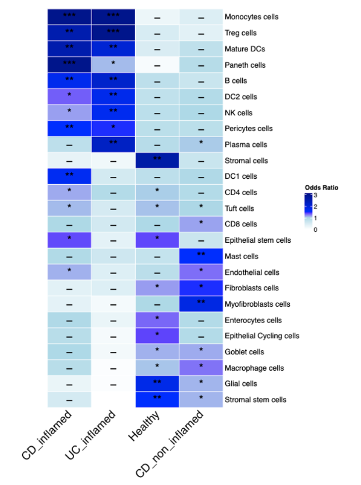
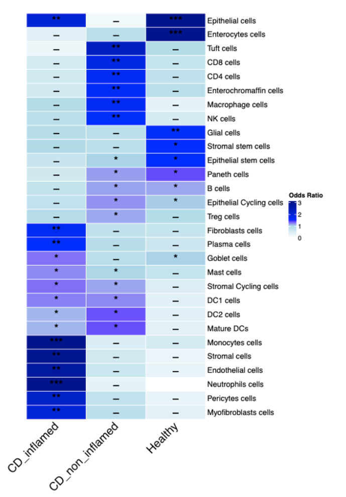

# ColonOddsRatioHeatmap

### Figure Description

The heatmap shows the odds ratio of level 3 cell types in different tissue groups (CD inflamed, CD non-inflamed, UC inflamed, Healthy control).

### Figure Results

The Monocytes, Treg, Mature DCs, Paneth cells, and B cells are significantly enriched in both CD and UC inflamed groups.These cell types play critical roles in immune response regulation and inflammation, pointing to heightened immune activity in the inflamed tissues of IBD patients. They suggest that while there are common inflammatory processes in both diseases, the specifics of immune cell involvement and the nature of the immune responses are distinct. This could mean differences in how these diseases develop and progress, the types of immune triggers involved, and how the body's immune system responds to these triggers. Plasma cells show a higher enrichment in the UC inflamed group, while DC1 cells are more abundant in the CD inflamed groups. This indicates distinct mechanisms underlying UC and CD. Plasma Cells in UC: The higher enrichment of plasma cells specifically in UC inflamed group indicates a more pronounced humoral (antibody-mediated) immune response in UC. Plasma cells are responsible for producing antibodies, suggesting a possibly unique antibody profile or target in UC. DC1 Cells in CD: The greater presence of DC1 (type 1 Dendritic Cells) in CD inflamed groups hints at a more robust cell-mediated immune response in Crohn's Disease, possibly involving different antigen presentation mechanisms or interactions with T cells.

自己写的：
Comparison between CD_inflamed and CD_uninflemed.
CD_inflamed mainly enriche in :Monocytes cells,Treg cells,
Mature DCs,Paneth cells,B cells,DC2 cells,NK cells,
,Pericytes cells,c1 cells,cD4 cells and Tuft cells;

While CD_uninflamed mainly enriched in:Mast cells,
Fibroblasts cells,Myofibroblasts cells,Goblet cells,
Macrophage cells,Glial cells and Stromal stem cells.

Comparison between UC_inflamed and healthy group:

UC_inflamed mainly enriched in :Monocytes cells,Treg cells,Mature DCs,Paneth cells , B cells,DC2 cells,NK cells,Pericytes cells and Plasma cells.

Healthy mainly enriched in :Stromal cells,CD4 cells,Tuft cells,Epithelial stem cells,Fibroblasts cells,Enterocytes cells,Epithelial Cycling cells,Goblet cells,Macrophage cells,Glial cells and Stromal stem cells.

Also stromal cells,Enterocytes cells and Epithelial Cycling cells are only exsited in healthy group.

### ChatGPT 写的：

The heatmap delineates the odds ratios of various level 3 cell types across different tissue groups, including CD inflamed, CD non-inflamed, UC inflamed, and healthy control, aiding in the identification of distinct cellular compositions and predominant cell types within each group. The analysis reveals significant differences in cell type enrichment between inflamed and non-inflamed conditions in Crohn's Disease (CD) and between ulcerative colitis (UC) inflamed tissues compared to healthy controls.

In the comparison between CD inflamed and CD non-inflamed tissues:

    CD inflamed tissues primarily show enrichment of Monocytes, Treg (Regulatory T) cells, Mature Dendritic Cells (DCs), Paneth cells, B cells, DC2 cells, Natural Killer (NK) cells, Pericytes, c1 cells, CD4 T cells, and Tuft cells. This indicates a robust immune response, characterized by the presence of immune regulatory cells and effectors involved in both innate and adaptive immunity, suggesting an active inflammatory state.
    Conversely, CD non-inflamed tissues are predominantly enriched with Mast cells, Fibroblasts, Myofibroblasts, Goblet cells, Macrophages, Glial cells, and Stromal stem cells. These cell types are typically associated with tissue repair, maintenance, and a less active inflammatory profile, reflecting a state of remission or lower disease activity.

In the comparison between UC inflamed tissues and healthy controls:

    UC inflamed tissues are mainly enriched in Monocytes, Treg cells, Mature DCs, Paneth cells, B cells, DC2 cells, NK cells, Pericytes, and Plasma cells. Similar to CD inflamed, this profile underscores a heightened inflammatory and immune response, indicating active disease.
    Healthy control tissues show a significant presence of Stromal cells, CD4 T cells, Tuft cells, Epithelial stem cells, Fibroblasts, Enterocytes, Epithelial Cycling cells, Goblet cells, Macrophages, Glial cells, and Stromal stem cells. This diverse cellular composition is typical of normal, healthy intestinal tissue, involved in regular tissue homeostasis and function.

Notably, Stromal cells, Enterocytes, and Epithelial Cycling cells are exclusively found in the healthy group, highlighting cell types that are likely pivotal for maintaining the normal structure and function of the gut epithelium, potentially suppressed or outcompeted in inflamed conditions.

These findings suggest a shift in the cellular architecture of the gut from a balanced state in health to a more defense-oriented profile in disease. Understanding these differences is crucial for developing targeted therapies that can modulate these cellular environments to treat or manage inflammatory bowel diseases effectively.

# IleumOddsRatioHeatmap

### Figure Description

The heatmap shows the odds ratio of level 3 cell types in different ileum tissue groups (CD inflamed, CD non-inflamed, Heathy control).

### Figure Results

Neutrophils: Their presence suggests a robust inflammatory response. Neutrophils are often among the first responders to tissue injury or infection, indicating active immune activation and inflammation in the inflamed ileum. Their abundance may indicate ongoing tissue damage and the body's efforts to combat it. Pericytes: The enrichment of pericytes could indicate a role in supporting and maintaining the blood vessels within the inflamed ileum. Their involvement might be linked to tissue repair, angiogenesis (formation of new blood vessels), or regulation of immune cell trafficking, which are all critical processes during inflammation and tissue healing. Myofibroblasts: These cells are associated with tissue repair and fibrosis. Their presence suggests that the inflamed ileum may be undergoing remodeling and repair processes as a response to chronic inflammation. However, excessive myofibroblast activity can also contribute to fibrosis, which can be a complication in CD. Monocytes: Elevated monocyte levels point to an ongoing immune response. Monocytes are immune cells that can differentiate into macrophages and dendritic cells, which are essential for immune surveillance and antigen presentation. Their presence may reflect the recruitment of immune cells to address the inflammation in the ileum.

自己写的：

CD_inflamed mainly enriched in:Epithelial cells,Fibroblasts cells,Plasma cells,Monocytes cells,Stromal cells,Endothelial cells,Neutrophils cells,Pericytes cells and Myofibroblasts cells.

CD_uninlamed mainly enriched in:Enterocytes cells,Glial cells,
Stromal stem cells and Epithelial stem cells.

Healthy group mainly enriched in:Tuft cellscD8 cells,CD4 cells,
Enterochromaffin cells,Macrophage cells,NK cells and Treg cells.

