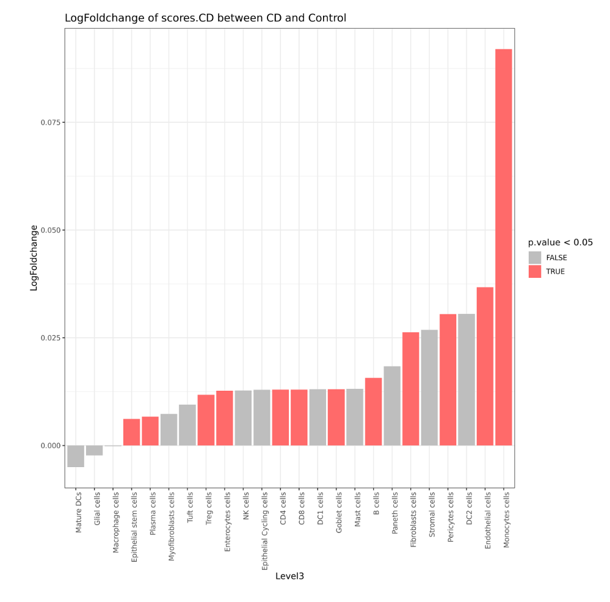
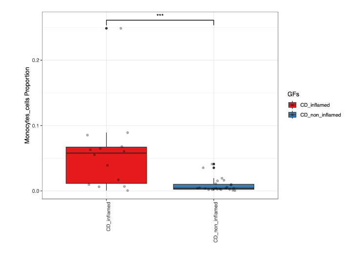
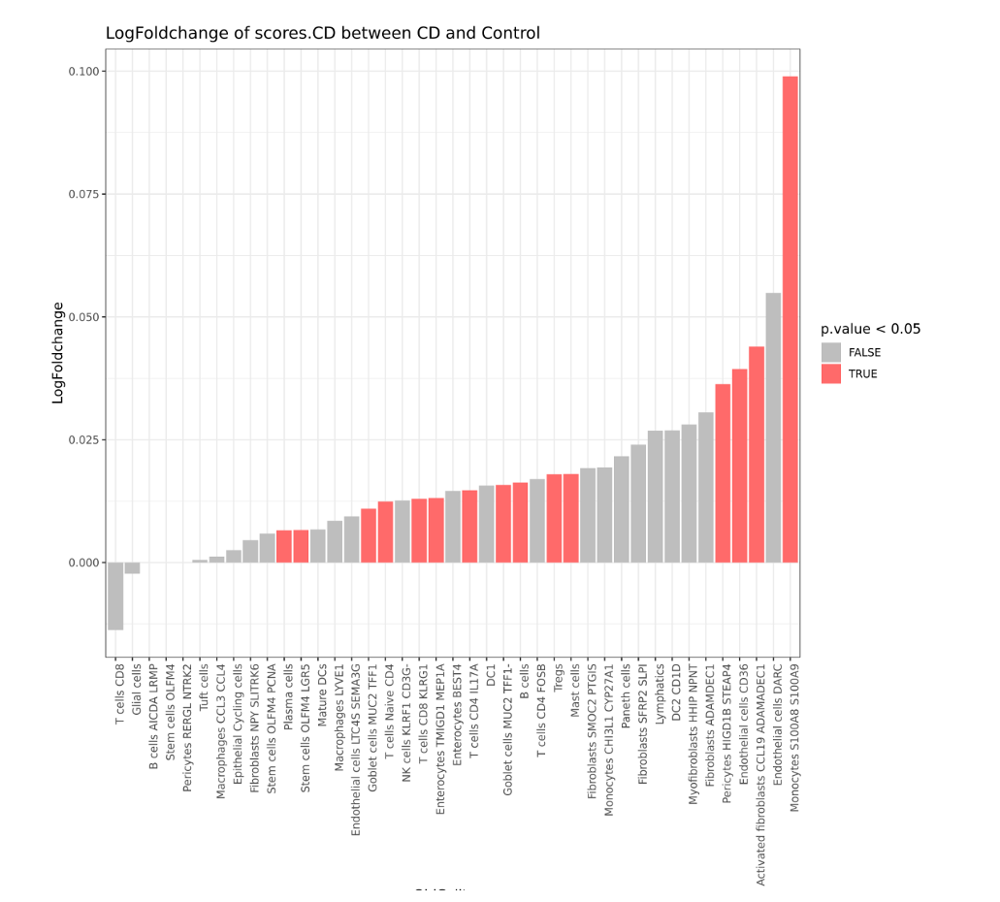
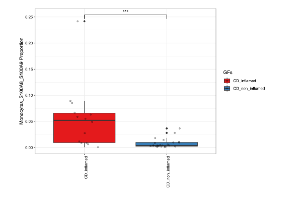
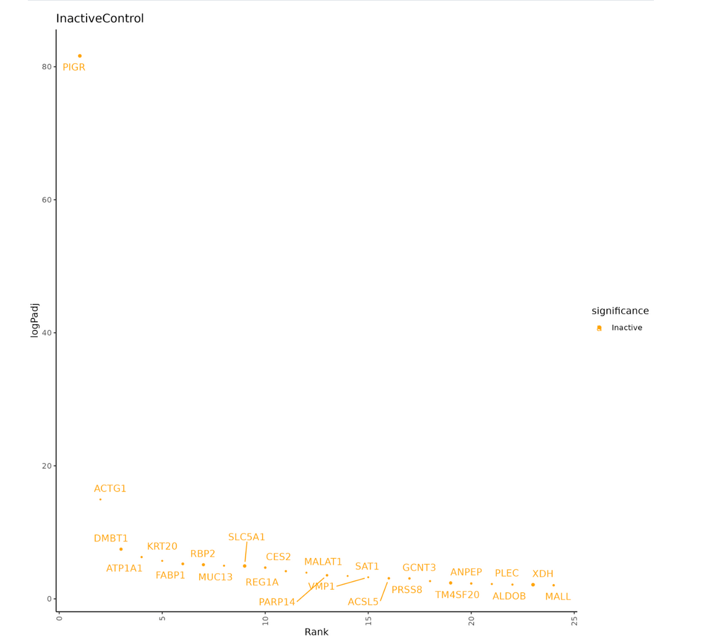
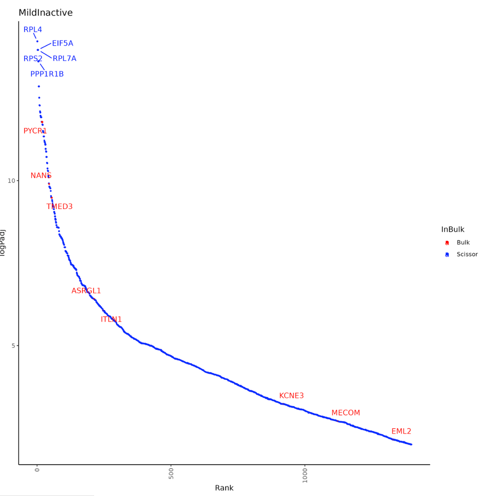
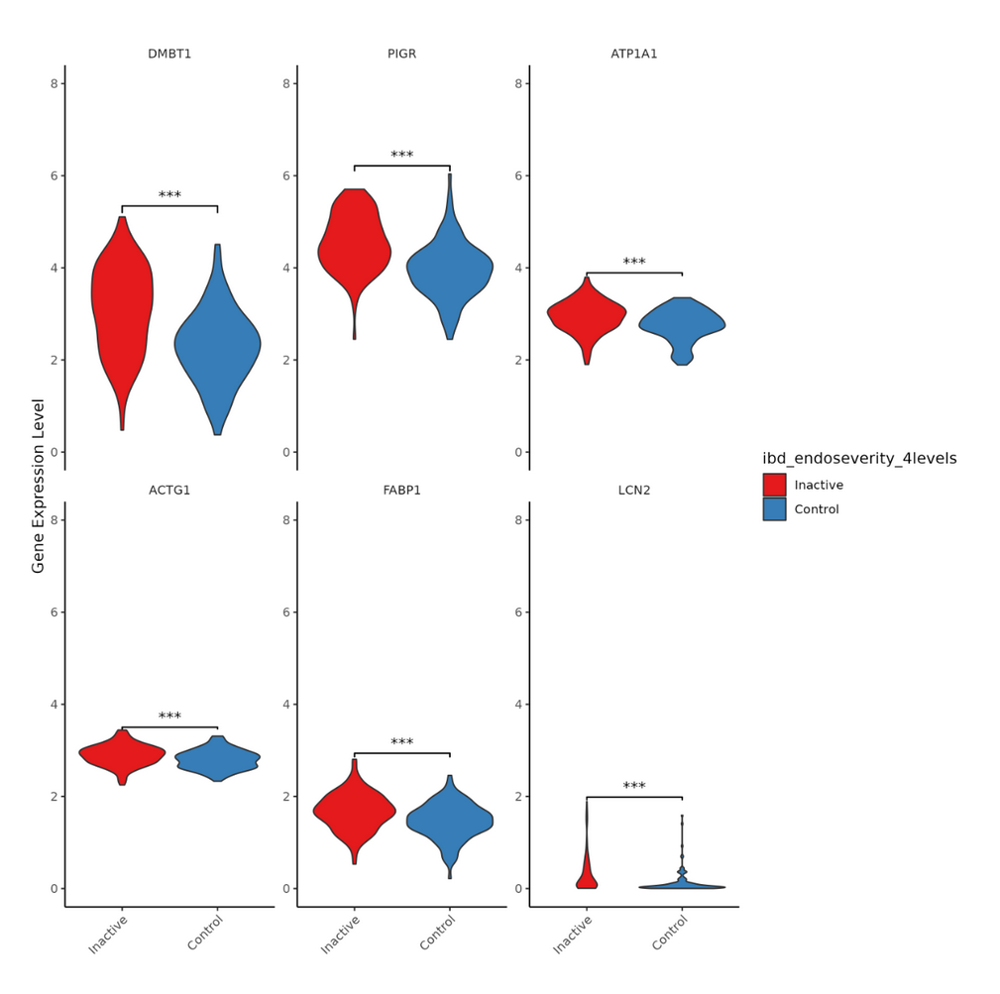
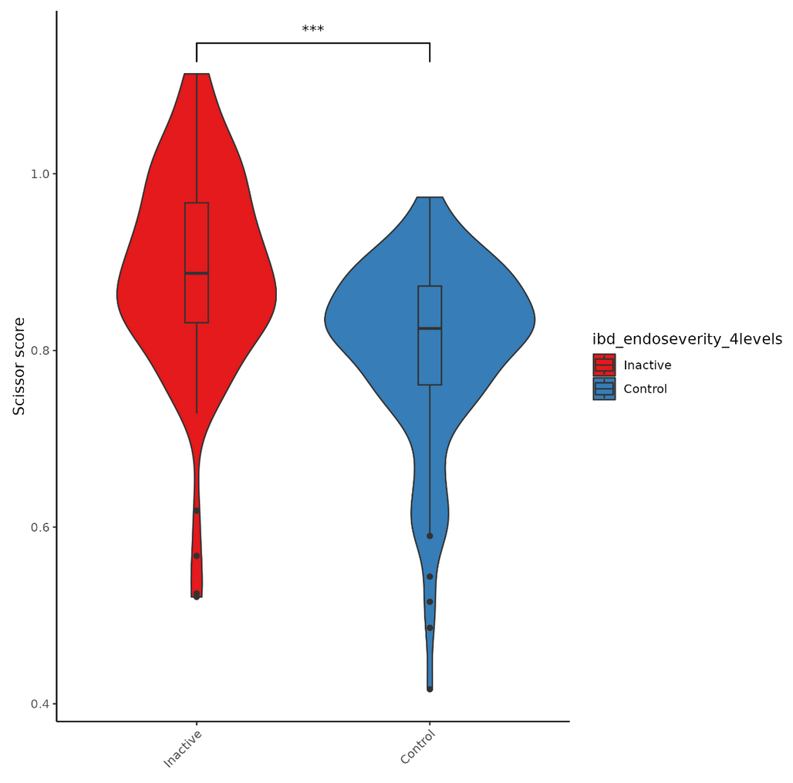

# ColonOddsRatioHeatmap

### Figure Description

The heatmap shows the odds ratio of level 3 cell types in different tissue groups (CD inflamed, CD non-inflamed, UC inflamed, Healthy control).

### Figure Results

The Monocytes, Treg, Mature DCs, Paneth cells, and B cells are significantly enriched in both CD and UC inflamed groups.These cell types play critical roles in immune response regulation and inflammation, pointing to heightened immune activity in the inflamed tissues of IBD patients. They suggest that while there are common inflammatory processes in both diseases, the specifics of immune cell involvement and the nature of the immune responses are distinct. This could mean differences in how these diseases develop and progress, the types of immune triggers involved, and how the body's immune system responds to these triggers. Plasma cells show a higher enrichment in the UC inflamed group, while DC1 cells are more abundant in the CD inflamed groups. This indicates distinct mechanisms underlying UC and CD. Plasma Cells in UC: The higher enrichment of plasma cells specifically in UC inflamed group indicates a more pronounced humoral (antibody-mediated) immune response in UC. Plasma cells are responsible for producing antibodies, suggesting a possibly unique antibody profile or target in UC. DC1 Cells in CD: The greater presence of DC1 (type 1 Dendritic Cells) in CD inflamed groups hints at a more robust cell-mediated immune response in Crohn's Disease, possibly involving different antigen presentation mechanisms or interactions with T cells.

自己写的：
Comparison between CD_inflamed and CD_uninflemed.
CD_inflamed mainly enriche in :Monocytes cells,Treg cells,
Mature DCs,Paneth cells,B cells,DC2 cells,NK cells,
,Pericytes cells,c1 cells,cD4 cells and Tuft cells;

While CD_uninflamed mainly enriched in:Mast cells,
Fibroblasts cells,Myofibroblasts cells,Goblet cells,
Macrophage cells,Glial cells and Stromal stem cells.

Comparison between UC_inflamed and healthy group:

UC_inflamed mainly enriched in :Monocytes cells,Treg cells,Mature DCs,Paneth cells , B cells,DC2 cells,NK cells,Pericytes cells and Plasma cells.

Healthy mainly enriched in :Stromal cells,CD4 cells,Tuft cells,Epithelial stem cells,Fibroblasts cells,Enterocytes cells,Epithelial Cycling cells,Goblet cells,Macrophage cells,Glial cells and Stromal stem cells.

Also stromal cells,Enterocytes cells and Epithelial Cycling cells are only exsited in healthy group.

### ChatGPT 写的：

The heatmap delineates the odds ratios of various level 3 cell types across different tissue groups, including CD inflamed, CD non-inflamed, UC inflamed, and healthy control, aiding in the identification of distinct cellular compositions and predominant cell types within each group. The analysis reveals significant differences in cell type enrichment between inflamed and non-inflamed conditions in Crohn's Disease (CD) and between ulcerative colitis (UC) inflamed tissues compared to healthy controls.

In the comparison between CD inflamed and CD non-inflamed tissues:

    CD inflamed tissues primarily show enrichment of Monocytes, Treg (Regulatory T) cells, Mature Dendritic Cells (DCs), Paneth cells, B cells, DC2 cells, Natural Killer (NK) cells, Pericytes, c1 cells, CD4 T cells, and Tuft cells. This indicates a robust immune response, characterized by the presence of immune regulatory cells and effectors involved in both innate and adaptive immunity, suggesting an active inflammatory state.
    Conversely, CD non-inflamed tissues are predominantly enriched with Mast cells, Fibroblasts, Myofibroblasts, Goblet cells, Macrophages, Glial cells, and Stromal stem cells. These cell types are typically associated with tissue repair, maintenance, and a less active inflammatory profile, reflecting a state of remission or lower disease activity.

In the comparison between UC inflamed tissues and healthy controls:

    UC inflamed tissues are mainly enriched in Monocytes, Treg cells, Mature DCs, Paneth cells, B cells, DC2 cells, NK cells, Pericytes, and Plasma cells. Similar to CD inflamed, this profile underscores a heightened inflammatory and immune response, indicating active disease.
    Healthy control tissues show a significant presence of Stromal cells, CD4 T cells, Tuft cells, Epithelial stem cells, Fibroblasts, Enterocytes, Epithelial Cycling cells, Goblet cells, Macrophages, Glial cells, and Stromal stem cells. This diverse cellular composition is typical of normal, healthy intestinal tissue, involved in regular tissue homeostasis and function.

Notably, Stromal cells, Enterocytes, and Epithelial Cycling cells are exclusively found in the healthy group, highlighting cell types that are likely pivotal for maintaining the normal structure and function of the gut epithelium, potentially suppressed or outcompeted in inflamed conditions.

These findings suggest a shift in the cellular architecture of the gut from a balanced state in health to a more defense-oriented profile in disease. Understanding these differences is crucial for developing targeted therapies that can modulate these cellular environments to treat or manage inflammatory bowel diseases effectively.

# IleumOddsRatioHeatmap

### Figure Description

The heatmap shows the odds ratio of level 3 cell types in different ileum tissue groups (CD inflamed, CD non-inflamed, Heathy control).

### Figure Results

Neutrophils: Their presence suggests a robust inflammatory response. Neutrophils are often among the first responders to tissue injury or infection, indicating active immune activation and inflammation in the inflamed ileum. Their abundance may indicate ongoing tissue damage and the body's efforts to combat it. Pericytes: The enrichment of pericytes could indicate a role in supporting and maintaining the blood vessels within the inflamed ileum. Their involvement might be linked to tissue repair, angiogenesis (formation of new blood vessels), or regulation of immune cell trafficking, which are all critical processes during inflammation and tissue healing. Myofibroblasts: These cells are associated with tissue repair and fibrosis. Their presence suggests that the inflamed ileum may be undergoing remodeling and repair processes as a response to chronic inflammation. However, excessive myofibroblast activity can also contribute to fibrosis, which can be a complication in CD. Monocytes: Elevated monocyte levels point to an ongoing immune response. Monocytes are immune cells that can differentiate into macrophages and dendritic cells, which are essential for immune surveillance and antigen presentation. Their presence may reflect the recruitment of immune cells to address the inflammation in the ileum.

自己写的：

CD_inflamed mainly enriched in:Epithelial cells,Fibroblasts cells,Plasma cells,Monocytes cells,Stromal cells,Endothelial cells,Neutrophils cells,Pericytes cells and Myofibroblasts cells.

CD_uninlamed mainly enriched in:Enterocytes cells,Glial cells,
Stromal stem cells and Epithelial stem cells.

Healthy group mainly enriched in:Tuft cellscD8 cells,CD4 cells,
Enterochromaffin cells,Macrophage cells,NK cells and Treg cells.

## FigureColonCDInflamedVsNonInflamedKeyCelltypesIdentication

### Figure Description

The barplot shows the log2 fold change of key cell types in colon CD inflamed vs non-inflamed samples. The x-axis is the level3 cell types, the y-axis is the log2 fold change. The red color represents the cell types which significant highly enriched in CD Inflamed tissues (P < 0.05).

### Figure Results

The analysis was focused on quantifying the variations in cell type abundance between Crohn's disease (CD) inflamed and non-inflamed colon samples. Utilizing a logarithmic scale for fold change (Log2 Fold Change), we systematically evaluated and ranked various cell types based on their relative abundance differences. Our findings, depicted in a bar plot, demonstrated that Monocytes were significantly more abundant in CD inflamed tissues compared to non-inflamed tissues. This result was statistically significant, indicating a pivotal role for Monocytes in the inflammatory processes associated with CD. Monocytes are critical to the immune response, as they not only serve as precursors to macrophages and dendritic cells but also are key producers of inflammatory cytokines. Their elevated numbers in inflamed tissues suggest an active involvement in perpetuating inflammatory conditions, potentially driving the pathological changes observed in Crohn's disease.

## FigureMonocyteVsImmuneCellsProportionBoxplot

### Figure Description

The boxplot shows the proportion of monocytes in CD45+ immune cells in CD inflamed and CD non-inflamed tissues. The x-axis is the tissue type, the y-axis is the proportion of monocytes in CD45+ immune cells.

### Figure Results

In order to confirm the findings, we conducted a comparison of cell type proportions among various immune cells. We observed that the proportion of monocytes was significantly greater in the CD Inflamed group compared to the CD UnInflamed group.

This verifies that the Scissor analysis is capable of identifying the most critical cell types that play a central role in the alteration of phenotypes.

### ChatGOT RESULTS OUTPUT:

To validate our findings, we performed an analysis comparing the proportions of various immune cell types. Our analysis revealed a markedly higher proportion of monocytes within the CD45+ immune cell population in Crohn's Disease (CD) inflamed tissues compared to CD non-inflamed tissues. This observation supports the efficacy of the Scissor analysis in pinpointing key cell types that are pivotal in driving phenotypic changes.

Biological Interpretation of the Figure Results:

The results underscore a significant variation in immune cell composition associated with the inflammatory state of Crohn's Disease tissues. Monocytes, which are critical components of the immune system, show an increased presence in inflamed tissues. This is biologically significant as monocytes can differentiate into macrophages and dendritic cells, which are central to initiating and regulating inflammation. Their elevated numbers in inflamed tissues suggest a heightened immune response, likely contributing to the maintenance or escalation of inflammation. This finding aligns with the known pathology of Crohn's Disease, where inflammation plays a crucial role, and indicates that monocytes are a key mediator in the inflammatory processes observed in this condition.

## FigureCDInflamedVsNonInflamedLevel4KeyCelltypesIdentication

### Figure Description

The barplot shows the log fold change of scores in colon CD inflamed vs non-inflamed samples. The x-axis is the level3 cell types, the y-axis is the log fold change. The red color represents the cell types which significant highly enriched in CD Inflamed tissues (P < 0.05).

### Results

To pinpoint with precision which cell types contribute to the phenotypes, we utilized level 4 cell types for analysis. It was observed that Monocytes expressing S100A8 and S100A9 ranked highest.

### ChatGPT

RESULTS OUTPUT:

The figure presented in the study employs a bar plot to display the log fold change of scores between colon Crohn's Disease (CD) inflamed and non-inflamed samples, segmented by level 3 cell types. On the x-axis, the plot categorizes different cell types, while the y-axis represents the log fold change values. Cell types that are significantly enriched in CD inflamed tissues, as determined by a p-value less than 0.05, are highlighted in red on the plot.

In our refined analysis using level 4 cell types, we discovered that monocytes expressing the S100A8 and S100A9 proteins exhibited the highest log fold changes. This finding indicates a pronounced alteration in the abundance of these monocytes between inflamed and non-inflamed tissues, suggesting their significant contribution to the inflammatory phenotype observed in CD.

The presence of S100A8 and S100A9 in monocytes is biologically significant as these proteins are involved in the inflammatory response and are known to act as alarmins or damage-associated molecular patterns (DAMPs) that can stimulate immune responses. Their elevated levels in inflamed tissues are indicative of active inflammation and potentially amplify local immune responses, contributing to the pathology of Crohn's Disease. This finding underscores the importance of specific immune cell populations in the pathology of inflammatory diseases and could provide a target for therapeutic interventions aimed at modulating inflammation in Crohn's Disease.

## FigureMonocytesS100A8S100A9ProportionBoxplot

### Figure Description

The boxplot shows the proportion of monocytes_S100A8_S100A9 in CD inflamed and CD non-inflamed tissues. The x-axis is the tissue type, the y-axis is the proportion of monocytes_S100A8_S100A9.

### Figure Results

It shows that the proportion of monocytes_S100A8_S100A9 in CD inflamed is significantly higher than in CD_non_inflamed. 

### ChatGPT

RESULTS OUTPUT:

The boxplot analysis depicted in the study compares the proportion of monocytes expressing S100A8 and S100A9 between Crohn's disease (CD) inflamed and non-inflamed tissues. The results clearly demonstrate that the proportion of monocytes_S100A8_S100A9 is significantly elevated in CD inflamed tissues compared to CD non-inflamed tissues.

Biological Significance:
The S100A8 and S100A9 proteins, also known as calprotectin, are involved in the regulation of inflammatory processes and are known to be elevated in various inflammatory conditions. In the context of Crohn's disease, an inflammatory bowel disease, the higher proportion of monocytes expressing these proteins in inflamed tissues suggests a heightened inflammatory response. Monocytes are critical mediators of immune defense, and their enriched presence in inflamed tissues highlights their role in exacerbating the inflammation seen in CD. This finding may indicate not only a potential biomarker of inflammation but also a therapeutic target for modulating immune response in Crohn's disease.

# Scissor Analysis of Golbet Cells in Ileum CD Severity

## IleumCDInactiveVsControlGolbetCellsScissorVolcanoPlot

### Figure Description

Differential expression analysis of Goblet cells in Ileum CD Inactive vs Control groups. The x-axis represents the rank of the genes, and the y-axis represents the -log10 of the p-value. The orange dots represent the significantly differentially expressed genes (P < 0.05).

### Figure Results

The xpression of Goblet cells in Ileum CD Inactive : PIGR， ACTG1，
DMBT1，KRT20，FARBP2，RBP2，ATP1A1，FABP1 and MUC13. 

### ChatGPT 

RESULTS OUTPUT:

The differential expression analysis focusing on Goblet cells in the ileum of Crohn's disease (CD) inactive versus control groups revealed a distinct expression profile. The genes identified as significantly differentially expressed include PIGR, ACTG1, DMBT1, KRT20, FARBP2, RBP2, ATP1A1, FABP1, and MUC13. Each of these genes exhibited marked deviations in expression levels when compared to controls, highlighting potential biological processes affected in the ileum during inactive phases of Crohn's disease.

Biological implications of these findings are substantial:
- **PIGR (Polymeric Immunoglobulin Receptor)** plays a crucial role in mucosal immunity by transporting immunoglobulins across epithelial cells to protect mucosal surfaces.
- **ACTG1 (Actin, gamma 1)** is involved in maintaining cytoskeleton structure and cell integrity, crucial for the barrier functions of Goblet cells.
- **DMBT1 (Deleted in Malignant Brain Tumors 1)** is known for its role in mucosal immunity and has been implicated in binding to bacteria and viruses, potentially modulating microbial interactions and inflammation.
- **KRT20 (Keratin 20)** is a marker of epithelial cell differentiation, which may indicate changes in cell state associated with disease status.
- **FABP2 and FABP1 (Fatty Acid Binding Protein 2 and 1)** are involved in lipid metabolism within cells, crucial for maintaining energy balance and cellular functions in response to inflammation.
- **RBP2 (Retinol Binding Protein 2)** and **ATP1A1 (ATPase Na+/K+ Transporting Subunit Alpha 1)** are essential for cellular metabolism and ion transport, processes that are vital for cell survival and function under stress conditions.
- **MUC13 (Mucin 13)**, a glycoprotein component of mucus, plays a protective role in the gastrointestinal tract and its altered expression could impact mucosal barrier integrity and susceptibility to inflammation.

These results collectively suggest a reconfiguration of cellular functions in Goblet cells under inactive Crohn’s disease conditions, potentially influencing the disease’s progression and symptomatology through alterations in mucosal defense and cellular integrity.

### Figure  Description 

Differential expression analysis of Goblet cells in Ileum CD Mild vs Inactive groups. The x-axis represents the rank of the genes, and the y-axis represents the -log10 of the p-value. The orange dots represent the significantly differentially expressed genes (P < 0.05).

### Figure Results

Comparing with inactive groups,the expression  of Goblet cells in Ileum CD Mild:RPL4，EIF5A，RPS2，RPL7A and PPP1R1B.

### ChatGPT

RESULTS OUTPUT:

In the differential expression analysis focusing on Goblet cells from the ileum of Crohn's Disease (CD) patients, marked differences were observed between the mild and inactive states of the disease. Specifically, genes such as RPL4, EIF5A, RPS2, RPL7A, and PPP1R1B showed significant changes in expression levels when comparing the mildly active disease state to the inactive state. These genes were prominently upregulated in the mild state as indicated by their negative logarithm (base 10) of the p-values plotted on the y-axis against their rank on the x-axis, with significant findings highlighted in orange (P < 0.05).

Biologically, the results suggest a robust alteration in the cellular machinery of Goblet cells under mild disease conditions, potentially reflecting changes in protein synthesis and cellular stress responses. The genes identified are predominantly involved in ribosomal function and protein synthesis (RPL4, RPS2, RPL7A) or cellular regulation and stress response (EIF5A, PPP1R1B). RPL4, RPS2, and RPL7A are components of the ribosome, crucial for protein translation, suggesting an increased demand for protein synthesis or turnover in the mild disease state. EIF5A, known for its role in promoting translation elongation and possibly in apoptosis, indicates an adaptive response to cellular stress. PPP1R1B, involved in signal transduction and neuronal signaling, might reflect changes in cellular signaling pathways in response to inflammatory stimuli or tissue repair processes.

These findings underscore the dynamic changes in Goblet cell function during the progression of Crohn's Disease and highlight the potential cellular processes that could be targeted therapeutically to modulate disease activity and mucosal healing.

### Figure  Description

Differential expression analysis of Goblet cells in Ileum CD Moderate vs Mild groups. The x-axis represents the rank of the genes, and the y-axis represents the -log10 of the p-value. The orange dots represent the significantly differentially expressed genes (P < 0.05).

### Figure Results

 
Comparing with mild groups, the differential expression  of Goblet cells in Ileum CD Moderate :HLA-E，MUC13，CYP3A5，DST and TRIM31.

### ChatGPT

RESULTS OUTPUT:

The differential expression analysis conducted on Goblet cells from patients with ileum Crohn's Disease (CD) at moderate severity, compared to those at mild severity, has identified several key genes with significant changes in expression levels. The genes HLA-E, MUC13, CYP3A5, DST, and TRIM31 were found to be notably differentially expressed. 

HLA-E plays a role in immune response regulation by interacting with natural killer (NK) cells and T cells, suggesting its potential involvement in modulating the immune environment in moderate CD. MUC13, a mucin protein, is involved in protecting and lubricating the intestinal lining, indicating changes in mucosal barrier function between mild and moderate CD. CYP3A5, part of the cytochrome P450 family, could reflect differences in drug metabolism and detoxification processes between these stages of the disease. DST, coding for dystonin, suggests alterations in cellular integrity and linkage to cytoskeletal components, potentially influencing tissue structure and stability in the gut of moderate CD patients. Lastly, TRIM31, associated with antiviral responses and regulation of immune pathways, indicates a possible shift in immune response mechanisms as CD progresses from mild to moderate severity.

These findings highlight the complex molecular changes associated with increasing severity of Crohn's Disease and underscore the importance of understanding specific cellular alterations that could guide more targeted therapeutic strategies.

## IleumCDInactiveVsControlGolbetCellsScissorViolin

### Figure  Description

violinplot of gene expresssion level between inactive group and control groups.

### Figure Results

Comparison between inactive and control groups, they have the significantly differential gene expressions in: DMBT1,PIGR,ATP1A1，ACTG1，FABP1 and LCN2.

### ChatGPT

RESULTS OUTPUT:

In the comparative analysis between the inactive and control groups, significant differences were observed in the expression levels of several genes. Notably, DMBT1 (deleted in malignant brain tumors 1), PIGR (polymeric immunoglobulin receptor), ATP1A1 (ATPase Na+/K+ transporting subunit alpha 1), ACTG1 (actin gamma 1), FABP1 (fatty acid binding protein 1), and LCN2 (lipocalin 2) all displayed marked disparities in expression. These genes, each with distinct biological roles, exhibit altered transcriptional activity in the inactive group compared to controls, suggesting a differential regulatory landscape.

Biological meaning of the figure results:
The genes identified as differentially expressed between the inactive and control groups are involved in a variety of crucial biological processes:

1. **DMBT1**: Implicated in immune response modulation and cancer suppression, the elevated or reduced expression of DMBT1 may indicate alterations in cellular defense mechanisms against pathogens or neoplastic transformations.

2. **PIGR**: This gene is responsible for the transport of polymeric immunoglobulins across epithelial cells, playing a critical role in mucosal immunity. Changes in PIGR expression could affect immune surveillance at mucosal surfaces.

3. **ATP1A1**: As a component of the Na+/K+ ATPase pump, ATP1A1 is vital for maintaining cellular ion homeostasis. Variations in its expression might reflect or contribute to disturbances in cell metabolism and osmotic balance.

4. **ACTG1**: This actin isoform is a part of the cytoskeleton and is involved in maintaining cell structure and integrity. Alterations in ACTG1 could influence cell shape, motility, and intracellular transport.

5. **FABP1**: Involved in the binding and transport of fatty acids within cells, changes in FABP1 expression can impact fatty acid metabolism and energy homeostasis.

6. **LCN2**: Known for its role in iron transport and response to bacterial infection, LCN2 can be a marker of inflammation and stress response.

These gene expression changes suggest that the inactive group may be experiencing altered physiological states, potentially influencing disease progression, immune responses, and metabolic processes. Understanding these changes could provide insights into the underlying mechanisms of disease states or the effects of therapeutic interventions.

## GobletScissorScoreBetweenInactiveAndControlViolinPlot

### Figure Description

The violin plot shows the difference between Inactive and Control groups in terms of Goblet Scissor Score. The x-axis represents the group, and the y-axis represents the Goblet Scissor Score.

### Figure Results

Goblet scissor score in inactive group in siginficantly higher than in control group.

### CHATGPT

RESULTS OUTPUT:

The violin plot illustrates the distribution of the Goblet Scissor Score across two groups: Inactive and Control. This plot reveals a statistically significant higher Goblet Scissor Score in the Inactive group compared to the Control group. The x-axis categorizes the groups, while the y-axis quantifies the Goblet Scissor Score, providing a clear visual representation of the differences between the groups.

Biological Interpretation:
The Goblet Scissor Score, presumably a metric assessing some aspect of goblet cell function or status, exhibits higher values in the Inactive group. Goblet cells are epithelial cells that secrete mucins and other proteins forming mucus, a critical component of the mucosal barrier in various tissues such as the respiratory tract and intestines. A higher Goblet Scissor Score in the Inactive group could imply an enhanced mucin production or goblet cell activity, which may be a response to reduced physiological or pathological stimuli in comparison to the Control group. This alteration could reflect changes in local environment conditions or regulatory mechanisms affecting goblet cell function, potentially influencing tissue homeostasis and susceptibility to disorders.
