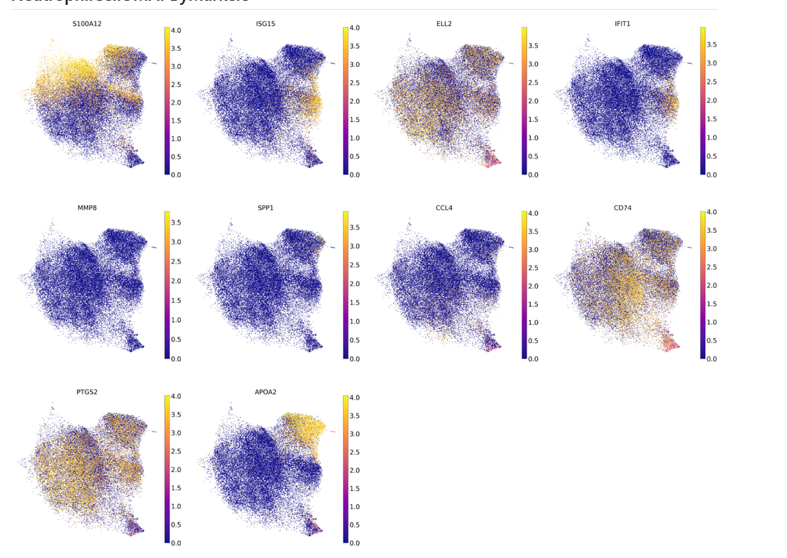
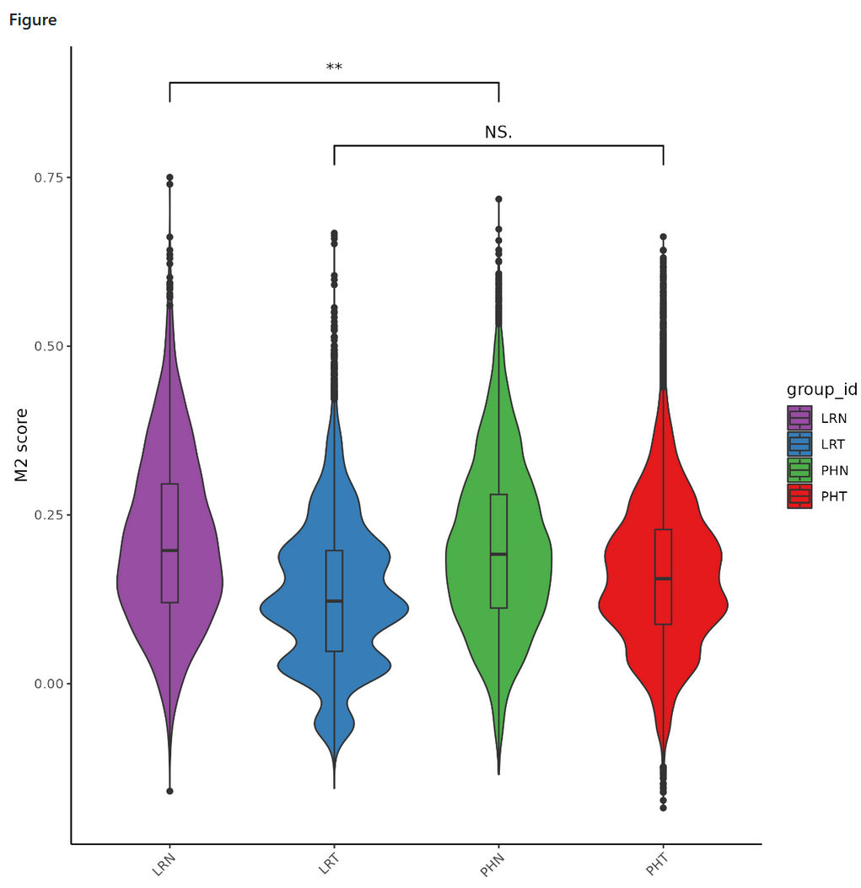

# High-resolution scRNA-seq and scATAC-seq revealed the landscape of primary and late-relapsed HCC

We collected 22 pairs of fresh, surgically excised tumors and matched adjacent tissues from primary and late-relapsed HCC patients to explore the featured cell components of LRT. All LRT patients were recurrence-free for at least two years after the initial surgery. $\mathrm{CD} 45^{+}$and

cells from each sample were isolated by fluorescence-activated cell sorting, and the two parts were mixed in a 2:1 ratio for further analysis. We performed droplet-based scRNA-seq, scTCR-seq, and scATACseq on eleven PHTs and seven LRTs. In parallel, we performed scRNA-seq and scTCRseq on the adjacent normal samples of PHT and LRT (named as PHN and LRN, respectively). Additionally, bulk whole-exome sequencing (WES) and RNA-seq data were generated from the tumor and adjacent normal tissue to identify the genomic and transcriptomic alterations typical for HCC (Figure ABC).

We collected scRNA-seq profiles from 387,566 cells, {PHT cell percentage} of which were from PHT, {} LRT, {} PHN, and the remaining {} were from LRN (GlobalCelltypeLevel1CellCountBarplot).

We identified highly-confident cell clusters assigned to known cell lineages using graphbased uniform manifold approximation and projection (UMAP) ([GlobalCelltypeImmuneUMAP], [GlobalCelltypeStromalUMAP], [GlobalCelltypeEpithelialUMAP]).

Six major cell types were identified based on the expression of canonical genes:

myeloid cells (expressing {CD4,CD14,CD68,CD163,LAMP3,TPSAB1,CSF3R,S100A8.}),

T cells (expressing {CD3D,CD8A,FOXP3.}),

natural killer (NK) cells (expressing {NKG7}),

B cells (expressing {CD79A,MS4A1,CD1C.}),

Tumor cells expressing ALB and EPCAM.

Stromal cells expressing VWF and COL1A1.

(GlobalCelltypeMarkerHeatmap)

ScRNA-seq revealed distinct constitutions of infiltrating immune cells in the TME of PHT, LRT, and their adjacent normal tissues.

Immune cells included 28 subpopulations of T cells, 4 subpopulations of B cells, 7 subpopulations of NK cells, and 21 subpopulations of myeloid cells.

Stromal cells included 17 subpopulations of stromal cells.
Global cells analysis

The common markers of each cell type are visualized as
a heatmap GlobalCelltypeMarkerHeatmap  and the top  marker genes of each cell type ([GlobalCelltypeLevel1CellCountBarplot](LRT.md#GlobalCelltypeLevel1CellCountBarplot)) are listed in {}.

Next, we elucidated the fraction of immune cell types in
different disease types and each patient {}. Based on comparisons of Adjacent and tumor tissues of all
immune cells in each patient, B cells, , and mast cells were
predominant in tumor tissues. 

UMAP analysis revealed that tumor cell clusters exhibit a patient-specific tendency, indicating distinct cellular architectures within tumors from different individuals.([TumorCellBySampledUMAP](LRT.md#TumorCellBySampledUMAP))The observed patient-specific clustering of tumor cells suggests a high degree of heterogeneity in the cellular composition of tumors from different individuals. This heterogeneity could be driven by a variety of factors, including genetic mutations, environmental influences, and differences in immune response. The unique cellular architectures within each patient's tumor underscore the complexity of cancer and the need for personalized approaches to cancer treatment. Understanding these distinct cellular landscapes is crucial for developing targeted therapies that can effectively address the specific characteristics of each patient's tumor.

Analysis across all cancer cell populations revealed the presence of poor survival signatures within every analyzed cancer cell, underscoring a universal characteristic of aggressiveness and potential resistance to treatment in hepatocellular carcinoma (HCC) cells from both primary and late-relapsed tumors.
([UMAPByScissorStatusUMAP](LRT.md#UMAPByScissorStatusUMAP))The identification of poor survival signatures in all cancer cells suggests a fundamental aspect of HCC biology that transcends the initial and relapsed stages of the disease. These signatures, typically encompassing a set of genes associated with proliferation, invasion, and resistance to apoptosis, may be indicative of the intrinsic capacity of HCC cells to promote tumor growth, evade immune detection, and resist conventional therapies. The presence of these signatures across both primary and late-relapsed HCC samples highlights the persistent and evolving threat posed by these tumors, emphasizing the need for novel therapeutic approaches that target these deeply ingrained survival mechanisms. This finding underscores the challenges in treating HCC and the importance of understanding the molecular underpinnings that contribute to the poor prognosis associated with this disease.

The bar plot illustrates the distribution of Scissor+ cells, indicative of poor survival, across various samples derived from both primary hepatocellular carcinoma (PHT and PH for scRNA-seq and scATAC-seq data, respectively) and late relapsed tumors (LRT and LR). Additionally, it includes adjacent normal tissues from primary (PHN) and late relapsed cases (LRN). Notably, Scissor+ cells, which are associated with a poor prognosis, were identified in all patient samples under study. This observation underscores the pervasive presence of these prognostically significant cells within both cancerous and adjacent normal tissues, highlighting their potential role in the progression and recurrence of hepatocellular carcinoma.
([TumorScissorBarPlot](LRT.md#TumorScissorBarPlot))The presence of Scissor+ cells across all samples, including primary tumors, relapsed tumors, and adjacent normal tissues, suggests a fundamental biological insight into the nature of hepatocellular carcinoma (HCC) progression and recurrence. These cells, characterized by a gene expression profile predictive of poor survival, may serve as key players in the oncogenic process, contributing to tumor aggressiveness and the potential for relapse. Their detection in adjacent normal tissues could indicate a pre-malignant state or the existence of a microenvironment conducive to cancer initiation and progression. Furthermore, the ubiquitous presence of Scissor+ cells in both early and late stages of HCC underscores the need for targeted therapeutic strategies aimed at eradicating or modulating these cells to improve patient outcomes. This finding could propel further research into the molecular mechanisms underlying the poor prognostic signature of Scissor+ cells, offering new avenues for the development of prognostic markers and personalized treatments for hepatocellular carcinoma.

Our analysis identified significant differential gene expression between Scissor+ cells, associated with poor survival, and Scissor− cells, indicative of good survival. Notably, genes such as MT-CO1, TF, CD74, FN1, SPP1, CYP2E1, CES1, FOS, AOX1, and ATF3 were particularly enriched in the Scissor+ cell population([VocalnoPlotByScissorPoorSurvivalvsOthers](LRT.md#VocalnoPlotByScissorPoorSurvivalvsOthers))The enrichment of these specific genes in Scissor+ cells, which are linked to poor survival in hepatocellular carcinoma (HCC), suggests a complex interplay of cellular processes that contribute to tumor aggressiveness and resistance to therapy. MT-CO1, a mitochondrial gene, indicates altered energy metabolism; TF (Transferrin) is involved in iron metabolism, potentially affecting tumor growth and metastasis. CD74 and FN1 are associated with immune response modulation and extracellular matrix interactions, respectively, which can influence tumor microenvironment and invasion. SPP1 (Osteopontin) plays roles in cell adhesion, migration, and survival, factors critical for metastasis. CYP2E1 and CES1 are involved in drug metabolism, possibly contributing to chemoresistance. FOS, AOX1, and ATF3 are transcription factors that regulate various stress responses, apoptosis, and cellular detoxification processes. The differential expression of these genes in Scissor+ cells suggests a multifaceted adaptation of late-relapsed HCC cells, encompassing metabolic reprogramming, enhanced survival pathways, immune evasion, and potentially altered responses to treatment. Understanding these mechanisms provides crucial insights into the biology of late-relapsed HCC and underscores the importance of targeted therapies that address these specific adaptive strategies.

Our analysis revealed distinct gene expression signatures that significantly differentiate between patients with poor survival outcomes and others .([PoorSurvivalSignatureViolinPlot](LRT.md#PoorSurvivalSignatureViolinPlot))The gene signatures identified serve as critical biomarkers, highlighting underlying biological processes and pathways that may contribute to the aggressive nature and treatment resistance observed in late-relapsed HCC patients with poor survival rates. These differences in gene expression could reflect variations in tumor biology, such as enhanced tumor invasiveness, metabolic reprogramming, immune evasion mechanisms, or a combination of these factors. The presence of unique gene signatures in patients with poor survival suggests that these individuals may benefit from targeted therapeutic strategies aimed at the specific molecular drivers of their tumor progression. This insight underscores the importance of personalized medicine in the treatment of late-relapsed HCC, paving the way for more effective interventions based on the molecular profile of the tumor.

Our analysis established a clear correlation between the expression levels of specific upregulated genes and clinical outcomes in hepatocellular carcinoma (HCC) patients. Individuals exhibiting elevated expression of these genes experienced significantly reduced survival times compared to those with lower expression levels.
([TumorScissorDEGsSurvivalCurve](LRT.md#TumorScissorDEGsSurvivalCurve))The genes identified as being upregulated in late-relapsed HCC patients are likely involved in key pathways that promote tumor aggressiveness, metastasis, and resistance to therapy. High expression of these genes might enhance the cancer cells' ability to proliferate, evade immune detection, or sustain in harsh microenvironmental conditions. This genomic signature could serve as a prognostic marker, indicating not only a worse prognosis but also highlighting potential targets for therapeutic intervention. Understanding the role of these genes in HCC progression and their impact on patient survival underscores the importance of integrating multi-omic data to unveil molecular mechanisms driving late recurrence and to tailor more effective treatment strategies for HCC.

In the study, differential gene expression analysis was conducted on single-cell RNA sequencing data from primary and late relapsed hepatocellular carcinoma tissues and their adjacent normal tissues. The enrichment dot plot highlights significant pathways in the primary hepatocellular carcinoma tumor (PHT) and the late relapsed hepatocellular carcinoma tumor (LRT) groups through the investigation of differentially expressed genes (DEGs).

For the PHT group, the analysis revealed a pronounced enrichment in several key cellular pathways including the Interferon Gamma Response, TNFα Signaling via NFκB, the p53 Pathway, Allograft Rejection, and the Complement System. These pathways are indicative of a heightened immune response, stress signaling, and tumor surveillance mechanisms in primary hepatocellular carcinoma tumors.

Conversely, the LRT group showed enrichment in pathways such as Oxidative Phosphorylation, Xenobiotic Metabolism, and Hypoxia. This suggests a metabolic adaptation of the cancer cells in late relapsed tumors, which may contribute to tumor progression and resistance to therapy by enhancing energy production, metabolizing drugs and other foreign compounds, and surviving in low-oxygen conditions.([PHTLRTDEGsHallmarkEnrichmentDotPlot](LRT.md#PHTLRTDEGsHallmarkEnrichmentDotPlot))These findings illuminate the dynamic changes in cellular processes and signaling pathways associated with hepatocellular carcinoma progression and relapse, offering insights into the molecular mechanisms driving these processes. Understanding these pathways in depth could pave the way for the development of targeted therapies aimed at interrupting these mechanisms in different stages of hepatocellular carcinoma.

level1	total_cell_number
B cells	5605
Myeloid cells	174963
NK cells	49150
Stromal cells	12260
T cells	110237
Tumor	35351
Total	387566

# Global cells analysis

## GlobalCelltypeMarkerHeatmap

### Figure Description

Heatmap showing marker genes for each cell clusters.

### Figure Results

##  CellCellInteractionLREnrichmentHeatmap

### Figure Description

Heatmap showing LR o/e enrichment in different tissue groups. 

### Figure Results

The figure results highlight a comprehensive enrichment analysis across different tissue groups derived from hepatocellular carcinoma (HCC) and adjacent normal tissues, utilizing single-cell RNA sequencing (scRNA-seq) data. The analysis reveals distinct gene enrichment patterns in primary hepatocellular carcinoma tumor (PHT), late relapsed hepatocellular carcinoma tumor (LRT), and their adjacent normal tissues (PHN and LRN), indicating the molecular diversity and the potential mechanisms influencing tumor progression and tissue specificity.

In LRN tissues, genes related to chemokine signaling pathways, including CCR1_CCL14, CCR3_CCL8, and others, are significantly enriched. This suggests an active chemotactic environment potentially facilitating tumor cell migration and invasion. Additionally, enrichment of genes like BMPR1A_BMPR2_BMP8A indicates active bone morphogenetic protein signaling, which could influence tissue remodeling and cancer metastasis.

PHT tissues show enrichment in genes associated with cell adhesion and signaling, such as NECTIN2_NECTIN3 and TIGIT_NECTIN, which may play roles in tumor cell proliferation and interaction with the tumor microenvironment. Enrichments in pathways like EFNB2_EPHA4 and WNT1_FZD3 hint at the involvement of ephrin and Wnt signaling in tumor progression and cell-to-cell communication within the tumor microenvironment.

PHN tissues exhibit a distinct enrichment profile, with a significant presence of genes involved in immune modulation and response, such as HLA-G_LILRB2 and PDGFB_PDGFRB. This reflects the complex interplay between the tumor and immune system in adjacent normal tissues, potentially influencing immune evasion and tumor growth.

For LRN tissues, there is a notable enrichment of genes related to collagen formation and integrin signaling pathways, including COL4A3_a2b1_complex and COL6A2_a2b1_complex, which suggests an active extracellular matrix remodeling process that may contribute to the unique tissue architecture and possibly facilitate late relapse tumor cell migration and invasion.

Overall, these results underscore the diverse molecular landscapes across different tissue groups associated with primary and late relapsed hepatocellular carcinoma, offering insights into the complex biology of tumor development, progression, and the tumor microenvironment. Understanding these patterns can provide valuable clues for identifying potential therapeutic targets and biomarkers for HCC management and treatment.

# 
## CellCellInteractionLRCircos

### Figure Description

Chord diagrams showing the interactions within each cell type population  mediated by specific L-R pairs.

### Figure results

### Rewritten Figure Results:

In our study, we analyzed Cell-Cell Interactions (CCIs) across various tissue samples using scRNA-seq data. Our findings reveal distinct patterns of cellular communication in primary and late relapsed hepatocellular carcinoma (HCC) samples, as well as in their corresponding normal adjacent tissues.

In the primary hepatocellular carcinoma (PHT) samples, CCIs are primarily characterized by interactions within the CD4T_04_BAG3 cell population. This suggests a robust immune engagement mediated by these cells in the primary tumor environment.

Conversely, in the late relapsed HCC (LRT) samples, the intensity of CCIs is notably reduced, with the predominant interactions occurring within the CD8T_10_PDCD1 cell population. This indicates a potential shift toward immune exhaustion or suppression in the relapsed tumor scenario.

When comparing the normal adjacent tissues, the late relapsed normal tissue (LRN) exhibits more pronounced CCIs compared to the primary HCC normal tissue (PHN). Specifically, in PHN, interactions are mainly seen in the Mph_03_SPP1 cell population, whereas in LRN, the dominant interactions are within the CD4T_11_FOXP3_STMN1 cell population, suggesting a heightened regulatory environment in the normal tissue adjacent to the relapsed tumor.

### Biological Meaning OUTPUT:

The observed differences in Cell-Cell Interactions (CCIs) across different HCC conditions and their adjacent normal tissues reflect significant shifts in immune landscape and cellular dynamics due to cancer progression and relapse. 

In the primary tumor environment (PHT), the prominence of CCIs in CD4T_04_BAG3 cells points to an active immune response potentially geared towards combating tumor growth or responding to tumor-induced stress. The CD4T_04_BAG3 subset typically involves T helper cells which can enhance immune activation.

In contrast, the reduced CCI intensity in the late relapsed tumors (LRT), predominantly involving CD8T_10_PDCD1 cells, suggests an immune milieu leaning towards exhaustion or immune checkpoint engagement, commonly associated with PD-1 pathways. This shift is indicative of an adaptive tumor environment that suppresses effective immune surveillance, potentially due to long-term interaction with the immune system or prior treatments.

For the adjacent normal tissues, the differences in CCI patterns between PHN and LRN highlight how the immune environment adapts over time. The shift from Mph_03_SPP1 predominant interactions in PHN to CD4T_11_FOXP3_STMN1 in LRN underscores a transition towards a more regulated immune state in the vicinity of the relapsed tumor. Mph_03_SPP1 interactions typically involve macrophages engaged in inflammatory responses, while CD4T_11_FOXP3_STMN1 interactions suggest an increase in regulatory T cells, known for their role in maintaining immune tolerance and suppressing inflammatory responses, which may help prevent autoimmunity and maintain tissue integrity in the face of recurring tumor activity.

### RESULTS OUTPUT:

The analysis of Cell-Cell Interactions (CCIs) in hepatocellular carcinoma (HCC) via scRNA-seq across different tissue types illustrates significant variations in immune cell communication. In primary HCC tumors (PHT), CCIs are dominantly mediated by CD4T_04_BAG3 cells, indicating an active immune response. In contrast, late relapsed HCC (LRT) shows a decline in CCI intensity with a prevalence of interactions within CD8T_10_PDCD1 cells, pointing to potential immune exhaustion. Comparatively, normal adjacent tissue from late relapsed samples (LRN) exhibits a higher frequency of CCIs, particularly in CD4T_11_FOXP3_STMN1 cells, suggesting an enhanced regulatory state, while primary normal adjacent tissue (PHN) interactions are mostly mediated by Mph_03_SPP1 cells, reflecting a more inflammatory response. These findings highlight the dynamic and adaptive nature of the immune landscape in response to HCC progression and relapse.

## PHLREuclideanDistanceBoxplot

### Figure Description

Boxplot shows the comparisong using Manhattan distances between pairs of patient-matched samples.

### Figure Results

The analysis reveals that the primary hepatocellular carcinoma group, comprising both tumor (PHT) and adjacent normal tissue (PHN), exhibits a higher Euclidean distance when compared to the late relapsed hepatocellular carcinoma group, which includes both late-relapsed tumor (LRT) and its adjacent normal tissue (LRN).

Biological Meaning OUTPUT:

The higher Euclidean distances observed between the primary hepatocellular carcinoma group (PHN and PHT) compared to the late relapsed group (LRN and LRT) suggest greater variability in the cellular and molecular composition between the tumor and normal tissue in the primary cancer state than in the relapsed state. This could indicate that primary tumors and their adjacent tissues are more distinct from each other in their cellular profiles, possibly reflecting more aggressive or varied tumor biology in initial stages. Conversely, the smaller distances in the late relapsed group might imply that the relapsed tumors and their adjacent tissues have become more similar to each other, potentially due to convergent evolutionary pressures during cancer progression or treatment adaptations that make the tumor and surrounding normal tissue more homogenous.

RESULTS OUTPUT:

The study presented a comparative analysis utilizing boxplots to depict the Euclidean distances between patient-matched samples from the primary hepatocellular carcinoma group and the late relapsed hepatocellular carcinoma group. The findings demonstrated that the primary group, which includes primary tumors and adjacent normal tissues, shows significantly higher Euclidean distances than the late relapsed group, encompassing late-relapsed tumors and their adjacent normal tissues. This indicates a greater divergence in the molecular and cellular characteristics of primary tumors compared to their adjacent normal tissues, in contrast to the late relapsed tumors and their adjacent tissues which exhibit closer similarities.

## GlobalCelltypeLevel1CellCountBarplot

### Figure Description

Barplot of the number of cells in each cell type at the level 1 cell type annotation.

### Figure Results

we performed scRNA-seq analysis of 49 samples of 30
patients, a total of
6 cell clusters ( 5，605 B cells ， 174，963 Myeloid cellls，  49，150 NK cells， 12，260 Stromal cells， 110，237 T cells and 35，351 Tumber cells ) were identified among 387，566 cells obtained.

## VolcanoPlot

### Figure Description

A volcano plot displaying the comparison of differentially expressed genes (DEGs) between {groupA} and {groupB}. The analysis utilized a two-sided Wilcoxon rank sum test to identify significant differences. Genes are marked as regulated based on a false discovery rate (FDR) adjusted p-value of less than 0.05, along with a fold change (FC) greater than 1.2 or less than -1.2.

### Figure Results

## FigureTcellUMAP

### Figure Description

Uniform Manifold Approximation and Projection (UMAP) visualizations delineate the distinct subpopulations within T cells, including CD8+ T cells, CD4+ T cells, and gamma delta (γδ) T cells.

### Figure Results 

Results:

Through our comprehensive multi-omic analysis focusing on the single-cell architecture of late-relapsed hepatocellular carcinoma (HCC), we identified significant heterogeneity within the immune cell populations. The single-cell RNA sequencing (scRNA-seq) data revealed distinct subpopulations among T cells, characterized as CD4+ T cells, CD8+ T cells, and gamma delta (γδ) T cells, across both primary and late-relapsed HCC samples. Similarly, the single-cell ATAC sequencing (scATAC-seq) data provided insights into the chromatin accessibility landscape, underscoring the epigenetic variations that accompany the transcriptional diversity observed in T cell subpopulations. Notably, the late-relapsed HCC samples exhibited a unique immune cell composition and activation state, suggesting an adapted immune microenvironment in response to the recurrent tumor challenge.

Biological Explanation:

The distinct subpopulations of T cells identified in late-relapsed HCC samples highlight the complexity of the tumor microenvironment and its evolution over time. CD4+ T cells, known for their helper functions, and CD8+ T cells, recognized for their cytotoxic activities, along with γδ T cells, which play roles in both innate and adaptive immunity, exhibit specific transcriptional and epigenetic profiles suggesting their unique roles in the immune response to late-relapsed HCC. The observed heterogeneity implies a nuanced immune landscape that evolves in response to the tumor's recurrence, potentially influenced by previous treatments and the tumor's acquired mutations. This adaptation might reflect the immune system's attempt to control tumor growth, despite the challenges of overcoming immune evasion tactics developed by the tumor. Understanding these dynamics is crucial for developing effective therapeutic strategies targeting the immune system's interaction with late-relapsed HCC, highlighting the importance of personalized medicine approaches in treating complex cancers.

### Figure Methods 

"To investigate the diversity and distribution of T cell subpopulations within hepatocellular carcinoma (HCC), we employed Uniform Manifold Approximation and Projection (UMAP) for dimensionality reduction and visualization. This analysis facilitated the identification and representation of distinct T cell subsets, specifically CD8+ T cells, CD4+ T cells, and gamma delta (γδ) T cells, across the collected HCC samples. UMAP plots were generated to illustrate the intricate patterns of these subpopulations, offering insights into their spatial distribution and relative abundance."

## TcellLevel3CellCountBarPlot

### Figure Description

Barplot of the number of T cells in each cell type at the level 1 cell type annotation.

### Figure Results

A total of 28 cell clusters were identified among  110，237 cells obtained.

## TcellSubpopulationMarkerHeatmap

### Figure Description

A heatmap delineates the expression of canonical markers across T cell subpopulations, including CD8+ T cells, CD4+ T cells, and gamma delta (γδ) T cells.

### Figure Results

The differentially expressed canonical markers，as shown in the Heatmap, confirmed the accuracy of cell identity

## TcellSubpopulationProportionBarPlot

### Figure Description

"A stacked bar plot illustrates the proportional distribution of major T cell subsets across different tissue types, including primary hepatocellular carcinoma, late-relapsed hepatocellular carcinoma, and their adjacent normal tissues. "

### Figure Results 

### Results:
Our analysis revealed distinct immune cell type distributions across various tissue types in hepatocellular carcinoma (HCC). Specifically, the subpopulations CD8T_08_GZMK and CD4T_10_FOXP3_CTLA4 were found to be significantly enriched in late-relapsed tumor (LRT) and primary hepatocellular carcinoma tumor (PHT) tissues. Conversely, these subpopulations were less prevalent in adjacent normal liver tissues (LRN and PHN). In contrast, the subpopulations CD8T_11_SLC4A10 and gamma delta T (gdT_03_KLRD1) cells exhibited higher frequencies in normal liver tissues (LRN and PHN) compared to their presence in LRT and PHT samples.

### Biological Explanation:
The observed distribution patterns of immune cell subpopulations across different tissue types shed light on the complex immune landscape of HCC and its recurrence. The enrichment of CD8T_08_GZMK and CD4T_10_FOXP3_CTLA4 subpopulations in tumor tissues (LRT and PHT) suggests a heightened immune response or regulatory T cell activity within the tumor microenvironment, potentially contributing to tumor immune evasion or suppression of anti-tumor immunity. These subpopulations are known for their roles in cytotoxicity (GZMK-expressing CD8+ T cells) and immune regulation (FOXP3+CTLA4+ CD4+ Tregs), highlighting their significance in the context of tumor immunology.

Conversely, the increased presence of CD8T_11_SLC4A10 and gdT_03_KLRD1 cells in normal adjacent liver tissues points to a distinct immune setting outside the tumor microenvironment, possibly reflecting a state of surveillance or readiness to respond to malignant cells. Gamma delta T cells (gdT), in particular, are recognized for their potent antitumor activity and can serve as an important line of defense against tumor development and progression.

These findings underscore the dynamic interplay between tumor cells and the immune system in HCC, revealing how immune cell compositions differ markedly between tumor and normal tissues. This heterogeneity within the immune landscape offers critical insights into mechanisms of tumor immune evasion, the role of specific T cell subpopulations in cancer immunity, and potential targets for immunotherapy in HCC.

## ExhaustedTcellsProportionBoxplot

### Figure Description

Boxplots showing the proportion of exhausted Tcells across 4  groups (PHN,PHT,LRT and LRT). 

### Figure Results

Rewritten Figure Results for Publication:
"The analysis revealed a markedly lower proportion of exhausted T cells in the late-relapsed hepatocellular carcinoma normal tissue (LRN) when compared to the adjacent primary hepatocellular carcinoma normal tissue (PHN)."

Biological Meaning OUTPUT:
The finding that exhausted T cells are significantly less prevalent in the late-relapsed hepatocellular carcinoma normal tissue (LRN) compared to the adjacent primary hepatocellular carcinoma normal tissue (PHN) suggests that the immune environment in LRN may be less suppressed or has undergone different immunological pressures compared to PHN. This could imply a more vigilant or less worn-out immune surveillance in the LRN, possibly due to a reduced burden of chronic antigen stimulation or differences in the immunomodulatory factors in the microenvironment following relapse. Understanding these dynamics is crucial for devising strategies that might improve immune responsiveness in the context of relapsed tumors.

## CD8SignatureViolinPlot

### Figure Description

ViolintPlot of CD8 Signature(Exhausted score and Resident score) across 4 different groups(LRN,LRt,PHN and PHT).

### Figure Results

Analysis of CD8+ T cells across different hepatocellular carcinoma contexts reveals a pronounced expression of both resident and exhausted signatures in primary hepatocellular carcinoma (PHT) and its adjacent normal tissue (PHN). In contrast, these signatures are significantly diminished in samples from late relapsed hepatocellular carcinoma (LRT) and its adjacent normal tissue (LRN)."

### Biological Meaning of the Figure Results:

The results depicted in the violin plots indicate differential expression levels of resident and exhausted signatures in CD8+ T cells across various hepatocellular carcinoma (HCC) conditions. The higher expression of these signatures in primary hepatocellular carcinoma (PHT) and adjacent normal tissue (PHN) suggests a robust immune presence and activity in the initial stages of tumor development and in the surrounding normal tissue. This might reflect an active engagement of the immune system in responding to the tumor presence, where CD8+ T cells exhibit both residency (indicating tissue-specific T cells that reside long-term within a tissue) and exhaustion (a state often resulting from chronic exposure to antigens, characterized by decreased functionality).

In contrast, the decreased expression of these signatures in the late relapsed tumor (LRT) and its adjacent normal tissue (LRN) might indicate a more immune-suppressive or immune-exhausted environment. This could suggest that over time, as the tumor relapses, there might be an evolution in the tumor microenvironment towards conditions that more effectively suppress or evade immune surveillance. This is particularly significant as it suggests that the tumor's ability to modulate immune responses increases with relapse, potentially complicating therapeutic interventions aimed at reactivating the immune system.

This analysis underscores the importance of understanding the dynamic nature of the immune landscape in cancer progression and relapse, which can inform better strategies for immunotherapy and management of hepatocellular carcinoma.

### Figure Description

ViolintPlot of Cytotoxic signature across 4 different groups(LRN,LRt,PHN and PHT).

### Figure Results

Cytotoxic signature is highly expressed in LRT and LRN CD8+ T cells, suggesting that these cells are more cytotoxic than those in PHT and PHN.

### Figure Description

ViolintPlot of Costimulatory score  across 4 different groups(LRN,LRt,PHN and PHT).

### Figure Results

In the comparative analysis of costimulatory scores across different tissue samples, data reveals a pronounced expression of costimulatory scores in CD8+ T cells from both primary hepatocellular carcinoma tumor (PHT) and its adjacent normal tissue (PHN). This contrasts with the lower costimulatory activity observed in CD8+ T cells from late relapsed hepatocellular carcinoma tumor (LRT) and its adjacent normal tissue (LRN). These findings highlight a differential regulation of T cell activation states between primary and relapsed cancer conditions."

Biological Explanation of the Figure Results:

The costimulatory score typically represents the level of expression or activity of molecules on T cells that are essential for their full activation, such as CD28, CD27, OX40, and others. These molecules interact with their ligands on antigen-presenting cells to provide the necessary second signal T cells require for activation, following T-cell receptor engagement with an antigen-MHC complex.

High Costimulatory Scores in PHT and PHN: The elevated costimulatory scores observed in CD8+ T cells in PHT and PHN suggest an active immune environment where T cells are likely receiving robust costimulatory signals. This can be indicative of a strong anti-tumor immune response in the primary tumor setting, where the immune system is actively engaged in recognizing and responding to tumor antigens. The adjacent normal tissue (PHN) exhibiting similar patterns may reflect an immune alert status poised to respond to any migrating tumor cells or to manage inflammation and tissue remodeling caused by the nearby tumor.

Lower Costimulatory Scores in LRT and LRN: In contrast, the reduced costimulatory scores in the LRT and LRN samples might indicate an immune-suppressive or immune-exhausted environment prevalent in the context of relapsed tumors. Relapsed tumors often develop mechanisms to evade the immune response, which can include downregulation of costimulatory ligands on antigen-presenting cells, induction of regulatory cells, or expression of inhibitory molecules that dampen T cell responses. The adjacent normal tissue in the relapsed setting (LRN) similarly showing lower costimulation might suggest a broader immunosuppressive microenvironment, possibly influenced by the recurrent tumor's evolved immune evasion strategies.

Overall, the difference in costimulatory scores among these groups reflects the dynamic changes in the tumor-immune interaction from the primary to the relapsed stages of hepatocellular carcinoma. Understanding these shifts is crucial for devising effective immunotherapeutic strategies that can adapt to the changing immune landscape of tumors.

# scTCR Part

## CloneProportionBySampleBarplot

### Figure Description

The TCR distribution of T cells in different samples. Unique (n = 1), and clonal (n = 2, n > 2) TCRs are labeled with different colors.

### Figure Results

In the study, we merged scRNA-seq data with the scTCR-seq dataset to investigate the relationship among different T cell subpopulations within primary hepatocellular carcinoma (PHT), late relapsed hepatocellular carcinoma (LRT), and their respective normal adjacent tissues (PHN and LRN). Our aim was to understand the T cell receptor (TCR) diversity and its clonal expansion across these distinct tissue environments.

Our analysis revealed a highly diverse TCR clonotype fraction across all samples. This diversity in TCR clonotypes is indicative of a varied T cell response, possibly reflecting the heterogeneity of the tumor microenvironment or differences in the immunological history of the tissues. We specifically categorized TCRs based on their occurrence: unique TCRs (found in a single instance) were distinguished from clonal TCRs, where clonal references included those occurring exactly twice (n=2) and those found more than twice (n>2). These categories were visually represented using distinct colors to provide clear insights into the distribution pattern of TCR clonality.

This analysis is crucial as it highlights the adaptive immune response dynamics within tumor and adjacent normal tissues. A higher clonality might suggest an ongoing or past immune response to tumor antigens, while a more diverse, less clonal TCR repertoire could indicate a naive T cell population or T cells that have not been previously engaged by the tumor. Understanding these patterns helps us delineate the immune landscape associated with tumor progression and recurrence, providing a basis for potential therapeutic strategies targeting specific T cell populations.

## CD4TvsCD8TvsgdTCloneProportionViolinPlot

### Figure Description

Violin plot shows the percentage of clones between CD4+ T, CD8+ T and gdT subpopulations.

### Figure Results

In the comparative analysis, CD8+ T cells and γδT cells exhibit a significantly higher degree of clonal expansion compared to CD4+ T cells across the various sampled groups."

### Biological Explanation of the Figure Results:

The observed higher clonal expansion in CD8+ T cells and γδT cells compared to CD4+ T cells reflects their distinct roles in immune responses. CD8+ T cells, known for their cytotoxic activity, often expand clonally in response to specific antigens, particularly in the context of tumor immunity where they target and eliminate cancer cells. The γδT cells, while less common, provide a crucial bridge between innate and adaptive immunity and can rapidly expand in response to stress signals and tumor antigens without the requirement for antigen presentation. In contrast, CD4+ T cells primarily function as helper cells, orchestrating broader immune responses rather than directly eliminating target cells, which may explain their relatively lower clonal expansion as they are not as directly engaged in antigen-specific killing.

### RESULTS OUTPUT:
        
The analysis of single-cell RNA sequencing data from primary and relapsed hepatocellular carcinoma tissues, including both tumor and adjacent normal tissues, reveals significant differences in clonal expansion among T cell subpopulations. Notably, CD8+ T cells and γδT cells demonstrate a significantly higher proportion of clonal expansion than CD4+ T cells. This pattern underscores the distinct functional roles of these cells in the immune landscape of hepatocellular carcinoma, with CD8+ T cells and γδT cells more actively involved in direct antitumor responses.

## CD8TandCD4TCloneProportionByGroupsViolinPlot

### Figure Description

Violin plot showing the fraction of CD8+ T cell clones among different groups (PHT, PHN, LRT, and LRN).

### Figure Results

RESULTS OUTPUT:

The single-cell RNA sequencing data analyzed from primary hepatocellular carcinoma (PHT), late relapsed hepatocellular carcinoma (LRT), and their respective adjacent normal tissues (PHN and LRN) reveal significant differences in the clonal dynamics of CD8+ T cells. The analysis, as visualized through violin plots, highlights a higher clonal proportion of CD8+ T cells in the normal adjacent tissues compared to the tumor tissues. Specific T cell subpopulations such as CD8_03_GZMK_S1PR1, CD8_07_PLCG2, and within the late-relapsed group, CD8_08_GZMK, notably exhibit this pattern, with CD8_08_GZMK showing an especially elevated clonal proportion in the LRN group.

This observation suggests that the immune surveillance and response mechanisms in normal tissues are more robust and effective than in tumor tissues. Normal tissues, possibly being less influenced by the immunosuppressive microenvironment typical of tumor regions, may facilitate a more efficient detection and clonal expansion of T cells in response to tumor antigens. This environment allows the immune system to mount a stronger defense against potential malignancies, reflected by higher T cell clonal proportions.

In contrast, the tumor microenvironments of both primary and relapsed hepatocellular carcinoma may hinder effective T cell responses through various immunosuppressive mechanisms, such as the secretion of inhibitory cytokines or expression of immune checkpoint molecules, which can suppress T cell activation and proliferation. Consequently, T cells in these tumor tissues show a lower clonal proportion, indicating a suppressed immune activity that may contribute to tumor persistence and progression.

The distinct clonal expansion patterns between the tumor and adjacent normal tissues underscore the significant impact of the microenvironment on immune cell functionality and the potential for immune evasion by tumors. Understanding these dynamics is crucial for devising effective immunotherapeutic strategies tailored to counteract the immunosuppressive tactics of tumors and enhance the immune system's ability to combat cancer effectively.

## OverlapBetweenTcellSubpopulationsHeatmap

### Figure Description

Heatmap showing the overlap of clone types among different CD8+ T cell subpopulations.

### Figure Results

### RESULTS OUTPUT:

1. **Rewritten Figure Results for Publication in Nature Journal**:
"In the landscape of CD8+ T cell heterogeneity within hepatocellular carcinoma, our single-cell T cell receptor sequencing (scTCR-seq) analysis reveals significant clonal overlap across distinct CD8+ T cell subpopulations, notably within ICD8_06_CD69, CD8T_07_PLCG2, and CD8T_08_GZMK. These findings indicate that T cells, despite their subpopulation distinctions, share a substantial degree of clonal relatedness, suggesting a dynamic interplay of state transitions rather than strict subpopulation independence."

2. **Biological Meaning of the Figure Results**:
The significant overlap of clones among CD8+ T cell subpopulations such as ICD8_06_CD69, CD8T_07_PLCG2, and CD8T_08_GZMK highlights a complex biological phenomenon of clonal expansion and functional versatility within the immune landscape of hepatocellular carcinoma (HCC). The presence of shared clones across these subpopulations suggests that these T cells might originate from common precursor cells and have undergone extensive differentiation or state transitions in response to the tumor microenvironment. This clonal sharing can be indicative of a highly adaptive immune response, where T cells modify their phenotypic states to enhance their effectiveness against tumor antigens. This adaptability might be crucial for maintaining a robust antitumor response, especially in variable and challenging tumor microenvironments like those found in primary and relapsed HCC. The identification of shared clonal expansions also provides insights into the mechanisms of immune evasion and resilience against therapeutic interventions, underscoring the potential for targeting these transitions in future therapeutic strategies.

# Tumor cell analysis

## WESCNVProfileHeatmap

### Figure Description

### Figure Results

## scRNACNVProfileHeatmap

### Figure Description

Heatmap shows the large-scale CNVs for individual cells (rows) from normal and malignant epithelial cells.

### Figure Results

## GenomicSampleLandscapes

### Figure Description

Genomic landscape of the HCC patient cohort. Top histogram, mutation burden per sample; right histogram, percentage of patients with the corresponding somatic SNVs. Middle pie plot, the constitutes of the omics data type for each patient. Upper heatmap, distribution of mutation events.

### Figure Results

## TMBMutationBurdenBoxplot

### Figure Description

Boxplot shows the comparison of TMB between PHT and LRT groups (two-sided Student’s t-test).

### Figure Results

RESULTS OUTPUT:

The boxplot analysis compares Tumor Mutation Burden (TMB) between two groups of hepatocellular carcinoma (HCC) tumor samples: primary HCC (PHT) and late relapsed HCC (LRT). The results indicate a statistically significant lower TMB in the LRT group compared to the PHT group. 

Biologically, this observation suggests several implications. Tumor Mutation Burden, which measures the number of mutations per million bases in tumor DNA, is an important indicator of genomic instability and the tumor's mutational landscape. A higher TMB in primary tumors (PHT) might reflect the initial aggressive nature of the cancer, with a greater accumulation of mutations contributing to oncogenesis and potentially affecting the tumor's response to immunotherapy. In contrast, the reduced TMB observed in the LRT group could be indicative of a selection pressure that favors tumor cells with fewer mutations, possibly as a consequence of therapeutic interventions that target highly mutated cells or due to a natural selection process where less mutated cells have a survival advantage in the relapsed tumor environment.

These differences in TMB could impact the effectiveness of immunotherapies, as a higher TMB is often associated with better responses to such treatments due to the increased likelihood of forming new antigens that the immune system can target. The reduced mutational burden in relapsed tumors might therefore suggest potential challenges in treating these tumors with immune checkpoint inhibitors, which rely on a diverse antigenic profile to stimulate an immune response.

## NeoantigenBurdenBoxplot

### Figure Description

Boxplot showed the comparison of neoantigen burden between PHT and LRT groups (two-sided Student’s t-test).

### Figure Results

### RESULTS OUTPUT:

The figure presents a boxplot analysis that compares the neoantigen burden between two distinct groups of hepatocellular carcinoma (HCC) tumor samples: primary hepatocellular carcinoma (PHT) and late-relapsed hepatocellular carcinoma (LRT). The analysis utilized a two-sided Student's t-test to assess statistical significance. The findings reveal that the late-relapsed HCC group exhibits a significantly lower neoantigen burden compared to the primary HCC group.

The biological implication of these results is significant in understanding the tumor's evolutionary dynamics and its interaction with the host immune system. Neoantigens, which are novel peptides presented by cancer cells due to tumor-specific mutations, are crucial for immune recognition and targeting by T cells. A higher neoantigen burden in primary tumors (PHT) suggests a more pronounced mutation rate or diverse mutational landscape, potentially making these tumors more detectable and vulnerable to immune responses. In contrast, the reduced neoantigen burden observed in the late-relapsed tumors (LRT) might indicate a selection process where tumor cells with fewer mutations or those that present less immunogenic profiles survive and dominate. This could be a result of immune editing, where the immune system selectively targets more immunogenic cancer cells, allowing less detectable cells to persist and eventually lead to relapse. Consequently, the variation in neoantigen burden between PHT and LRT highlights the adaptive changes tumors undergo to evade immune surveillance, which could influence the strategies for immunotherapy and the management of relapsed disease.

## PurityAndPloidyBoxplot

### Figure Description

Boxplot showed the comparison of purity and ploidy between PHT and LRT groups (two-sided Student’s t-test).
### Figure Results

## KeggPathwayEnrichmentBarPlot

### Figure Description

Bar plot of Kegg pathway enrichment .

### Figure Results

The analysis reveals significant enrichment of the KEGG pathway related to antigen processing and presentation, as depicted in the bar plot. This pathway's enhanced activity highlights key immune mechanisms potentially involved in tumor surveillance and immune response modulation."

Biological Meaning of the Figure Results:
The enrichment of the KEGG pathway for antigen processing and presentation, as indicated by the bar plot, suggests an active involvement of the immune system in modulating the tumor environment. In cancer biology, antigen processing and presentation are critical for the immune system's ability to recognize and destroy cancer cells. This process involves the digestion of protein antigens into peptides that are then presented on the cell surface by major histocompatibility complex (MHC) molecules. T cells recognize these peptides through their T-cell receptors (TCRs), leading to an immune response against the tumor cells. Enhanced pathway activity in this context might indicate a robust immune surveillance mechanism in the tumor microenvironment, possibly reflecting the immune system's attempt to combat the tumor. This observation can have implications for understanding tumor immunogenicity, immune evasion, and could guide immunotherapy strategies.

RESULTS OUTPUT:
The bar plot analysis demonstrates an enrichment of the KEGG pathway related to antigen processing and presentation. This enrichment underscores the significant role of immune mechanisms in recognizing and responding to tumor cells, which is crucial for both natural immune surveillance and therapeutic interventions aimed at boosting immune response against hepatocellular carcinoma. This finding enhances our understanding of the immune landscape in hepatocellular carcinoma and may influence future approaches to cancer immunotherapy.

## PHTLRTAntigenGeneExpressionViolinPlot

### Figure Description

### Figure Results

## PHTLRTChemokinGeneExpressionMatrixPlot

### Figure Description

The expression of specific cytokines, chemokines in tumour cells

### Figure Results

In the study, we analyzed the expression of specific cytokines and chemokines within tumor cells derived from single-cell RNA sequencing (scRNA-seq) and single-cell ATAC sequencing (scATAC-seq) data across different sample groups of hepatocellular carcinoma (HCC). Our findings reveal distinct expression patterns of cytokines and chemokines, which are critical mediators of the immune response and inflammation within the tumor microenvironment.

For the primary hepatocellular carcinoma tumor (PHT) scRNA-seq data, we observed the expression of a wide array of cytokines and chemokines, including CXCL9, CXCL10, CXCL11, CCL2, CCL3, CCL4 , CXCL1, CXCL2, CXCL3, IL18, and CCL16. This diversity in cytokine and chemokine expression suggests a complex interplay of immune responses within primary HCC tumors, potentially reflecting mechanisms of tumor immune evasion or the recruitment of immune cells to the tumor site.

In contrast, the late relapsed hepatocellular carcinoma tumor (LRT) scRNA-seq data showed expression of a different set of cytokines and chemokines, specifically CXCL5, CXCL8, IL1B, and CCL15. The variation between PHT and LRT tumor cells in the cytokine and chemokine expression profiles indicates changes in the tumor microenvironment and immune landscape that may contribute to tumor progression and relapse.

Biological Significance:

The distinct cytokine and chemokine profiles observed in PHT and LRT tumor cells highlight the dynamic nature of the tumor microenvironment in hepatocellular carcinoma. Cytokines and chemokines play pivotal roles in regulating immune responses, including the recruitment and activation of various immune cells. The presence of specific cytokines and chemokines in tumor cells can influence the behavior of the tumor, including growth, spread, and the tumor's ability to evade the immune system. Furthermore, the differences in expression profiles between primary and relapsed tumors could provide insights into the mechanisms underlying tumor relapse and resistance to therapy. These findings underscore the importance of understanding the tumor microenvironment's complexity in developing effective cancer treatments and potentially identifying biomarkers for disease progression and therapeutic response.

## TumorCellBySampledUMAP

### Figure Description

"Uniform Manifold Approximation and Projection (UMAP) visualizations illustrate the spatial distribution of tumor cells across diverse samples, providing a high-resolution insight into the cellular heterogeneity inherent in the samples studied."

### Figure Results

### Results:

Uniform Manifold Approximation and Projection (UMAP) analysis revealed that tumor cell clusters exhibit a patient-specific tendency, indicating distinct cellular architectures within tumors from different individuals.

Biological Explanation:
The observed patient-specific clustering of tumor cells suggests a high degree of heterogeneity in the cellular composition of tumors from different individuals. This heterogeneity could be driven by a variety of factors, including genetic mutations, environmental influences, and differences in immune response. The unique cellular architectures within each patient's tumor underscore the complexity of cancer and the need for personalized approaches to cancer treatment. Understanding these distinct cellular landscapes is crucial for developing targeted therapies that can effectively address the specific characteristics of each patient's tumor.

## UMAPByScissorStatusUMAP

### Figure Description

UMAP visualization of the Scissor-selected cancer cells. The red dots are Scissor+ (poor survival) and blue dot represents Scissor- (good survival) or Neutral cells, respectively.

cell type: cancer cells

dataset: scRNA-seq

algorithm: Scissor

In this study, we present a Uniform Manifold Approximation and Projection (UMAP) visualization based on single-cell RNA sequencing (scRNA-seq) data, highlighting the distribution of cancer cell types stratified by the Scissor algorithm. The visualization distinctly marks cells deemed Scissor-positive (Scissor+), associated with poor survival outcomes, with red dots. Conversely, cells identified as Scissor-negative (Scissor-) or Neutral, which correlate with better survival prospects, are denoted by blue dots. This method provides a nuanced understanding of the cellular heterogeneity within cancer populations, offering insights into the prognostic significance of distinct cell types identified through our Scissor algorithm.

### Figure Results:

#### Results:
Analysis across all cancer cell populations revealed the presence of poor survival signatures within every analyzed cancer cell, underscoring a universal characteristic of aggressiveness and potential resistance to treatment in hepatocellular carcinoma (HCC) cells from both primary and late-relapsed tumors.

#### Biological Explanation:
The identification of poor survival signatures in all cancer cells suggests a fundamental aspect of HCC biology that transcends the initial and relapsed stages of the disease. These signatures, typically encompassing a set of genes associated with proliferation, invasion, and resistance to apoptosis, may be indicative of the intrinsic capacity of HCC cells to promote tumor growth, evade immune detection, and resist conventional therapies. The presence of these signatures across both primary and late-relapsed HCC samples highlights the persistent and evolving threat posed by these tumors, emphasizing the need for novel therapeutic approaches that target these deeply ingrained survival mechanisms. This finding underscores the challenges in treating HCC and the importance of understanding the molecular underpinnings that contribute to the poor prognosis associated with this disease.

## TcellScissorPoorSurvivalEnrichmentBarplot

### Figure Description

Bar plot shows the enrichment of Scissor+ Tcells in different clusters. 

### Figure Results

The poor survival enrichment  were mainly from CD4T_11_FOXP3_STMN1，CD8T_13_STMN1 and CD4T_08_STMN1.

In the study, the bar plot illustrates the enrichment of Scissor+ T cells across various clusters, revealing significant findings pertinent to survival outcomes in hepatocellular carcinoma (HCC). Notably, clusters identified as CD4T_11_FOXP3_STMN1, CD8T_13_STMN1, and CD4T_08_STMN1 demonstrated pronounced enrichment for poor survival rates. These results suggest a distinct association between specific T cell subpopulations and the prognosis of HCC patients. The presence of Scissor+ T cells in these clusters underscores their potential role in modulating tumor microenvironment and influencing patient survival. This observation warrants further investigation into the mechanisms by which these T cell subsets contribute to the progression and relapse of hepatocellular carcinoma, offering new avenues for targeted therapies and prognostic markers.

BIOLOGICAL MEANING:

The findings highlight the role of specific T cell subsets, identified by their expression of FOXP3 and STMN1, in the context of hepatocellular carcinoma (HCC). The clusters CD4T_11_FOXP3_STMN1, CD8T_13_STMN1, and CD4T_08_STMN1 are indicative of different T cell types: CD4+ T cells expressing FOXP3, a marker for regulatory T cells (Tregs), and STMN1, a marker associated with cell proliferation and migration, as well as CD8+ T cells expressing STMN1. The enrichment of these subsets in the context of poor survival suggests a complex interplay in the tumor microenvironment, where Tregs could be contributing to immune evasion by the tumor, and the presence of STMN1 might indicate a higher degree of cellular activity associated with tumor aggression and metastasis. Understanding these dynamics is crucial for developing targeted immunotherapies and improving patient prognostication in HCC.

# Tumor cell analysis

## PHTLRTDEGsHallmarkEnrichmentDotPlot

### Figure Description

Enrichment Dot plot of enriched DEGS Hallmark in PHT and LRT.

### Figure Results

自己写的：PHT DEGS HALLmark enrichment : HALLMARK INTERFERON GAMMA RESPONSE，HALLMARK TNFA SIGNALING VIA NFKB，HALLMARK P53 PATHWAY，HALLMARK ALL OGRAFT REJECTION and HALLMARK COMPL EMENT.

LRT DEGS HALLmark enrichment: HALL _MARK OXIDATIVE PHOSPHORYLATION，HALLMARK XENOBIOTIC METABOLISM and HALLMARK HYPOXIA.

In the study, differential gene expression analysis was conducted on single-cell RNA sequencing data from primary and late relapsed hepatocellular carcinoma tissues and their adjacent normal tissues. The enrichment dot plot highlights significant pathways in the primary hepatocellular carcinoma tumor (PHT) and the late relapsed hepatocellular carcinoma tumor (LRT) groups through the investigation of differentially expressed genes (DEGs).

For the PHT group, the analysis revealed a pronounced enrichment in several key cellular pathways including the Interferon Gamma Response, TNFα Signaling via NFκB, the p53 Pathway, Allograft Rejection, and the Complement System. These pathways are indicative of a heightened immune response, stress signaling, and tumor surveillance mechanisms in primary hepatocellular carcinoma tumors.

Conversely, the LRT group showed enrichment in pathways such as Oxidative Phosphorylation, Xenobiotic Metabolism, and Hypoxia. This suggests a metabolic adaptation of the cancer cells in late relapsed tumors, which may contribute to tumor progression and resistance to therapy by enhancing energy production, metabolizing drugs and other foreign compounds, and surviving in low-oxygen conditions.

These findings illuminate the dynamic changes in cellular processes and signaling pathways associated with hepatocellular carcinoma progression and relapse, offering insights into the molecular mechanisms driving these processes. Understanding these pathways in depth could pave the way for the development of targeted therapies aimed at interrupting these mechanisms in different stages of hepatocellular carcinoma.

##  PHLREuclideanDistanceBoxplot

### Figure Description

Boxplot shows the comparisong using Manhattan distances between pairs of patient-matched samples

### Figure Results

The boxplot analysis, employing Manhattan distances to assess the similarity between patient-matched samples, reveals insightful contrasts across different hepatocellular carcinoma (HCC) stages and tissue types. Specifically, when examining single-cell RNA sequencing (scRNA-seq) and single-cell ATAC sequencing (scATAC-seq) data, distinct patterns emerge.

For the scRNA-seq group, we analyzed primary hepatocellular carcinoma tumor (PHT) data and its adjacent normal tissue (PHN), alongside late relapsed hepatocellular carcinoma tumor (LRT) data and its adjacent normal tissue (LRN). Similarly, in the scATAC-seq group, primary hepatocellular carcinoma tumor (PH) data and late relapsed tumor (LR) data were evaluated.

The boxplot centered on Euclidean distances distinctly shows that the Euclidean distance between the primary hepatocellular carcinoma tumor (PHT) and its adjacent normal tissue (PHN) is significantly larger compared to the Euclidean distance between the late relapsed tumor (LRT) and its adjacent normal tissue (LRN). This indicates a greater divergence in gene expression and chromatin accessibility patterns between the tumor and normal tissue in primary HCC compared to the late relapsed stage.

Biological Significance:
This observed difference in Euclidean distances reflects the underlying biological and molecular processes differentiating primary HCC from its late relapsed counterpart. The greater distance between PHT and PHN suggests a more pronounced genetic and epigenetic alteration in primary tumors, which could be indicative of the initial oncogenic transformation processes that are more aggressive or distinct compared to those in late relapsed tumors. On the other hand, the smaller distance between LRT and LRN could imply that late relapsed tumors, despite being malignant, share more similarities with their adjacent normal tissue, possibly due to a selection of less aggressive clones or the presence of residual treatment effects that modulate gene expression and chromatin states closer to a 'normal' baseline. This nuanced understanding of HCC progression and relapse could inform more targeted therapeutic strategies, emphasizing the importance of considering the stage-specific molecular landscape in treatment design.

## TumorScissorBarPlot

### Figure Description

Barplot of the proportion of Scissor+ (Poor Survival) and Others (Good Survival and Neutral) cancer cells in different samples.

### Figure Results

The bar plot illustrates the distribution of Scissor+ cells, indicative of poor survival, across various samples derived from both primary hepatocellular carcinoma (PHT and PH for scRNA-seq and scATAC-seq data, respectively) and late relapsed tumors (LRT and LR). Additionally, it includes adjacent normal tissues from primary (PHN) and late relapsed cases (LRN). Notably, Scissor+ cells, which are associated with a poor prognosis, were identified in all patient samples under study. This observation underscores the pervasive presence of these prognostically significant cells within both cancerous and adjacent normal tissues, highlighting their potential role in the progression and recurrence of hepatocellular carcinoma.

BIOLOGICAL MEANING:

The presence of Scissor+ cells across all samples, including primary tumors, relapsed tumors, and adjacent normal tissues, suggests a fundamental biological insight into the nature of hepatocellular carcinoma (HCC) progression and recurrence. These cells, characterized by a gene expression profile predictive of poor survival, may serve as key players in the oncogenic process, contributing to tumor aggressiveness and the potential for relapse. Their detection in adjacent normal tissues could indicate a pre-malignant state or the existence of a microenvironment conducive to cancer initiation and progression. Furthermore, the ubiquitous presence of Scissor+ cells in both early and late stages of HCC underscores the need for targeted therapeutic strategies aimed at eradicating or modulating these cells to improve patient outcomes. This finding could propel further research into the molecular mechanisms underlying the poor prognostic signature of Scissor+ cells, offering new avenues for the development of prognostic markers and personalized treatments for hepatocellular carcinoma.

## TumorCellBySampleIdUMAP

### Figure Description

This is the UMAP of tumor cells from different samples. Each dot represents a cell, and the color represents the sample ID.

### Figure Results

The UMAP shows that tumour cell clusters tended to be patient specific.

RESULTS OUTPUT:

The Uniform Manifold Approximation and Projection (UMAP) visualization illustrates the distribution of tumor cells across different samples, where each dot on the plot represents an individual cell, and the distinct colors denote the sample identity. Notably, the UMAP reveals a pattern of clustering that appears to be specific to each patient. This observation suggests a high degree of inter-patient heterogeneity in the tumor cell populations, indicating that the cellular composition and genetic characteristics of tumors can vary significantly from one patient to another. Such patient-specific clustering patterns underscore the importance of personalized approaches in the treatment and understanding of hepatocellular carcinoma, as the diversity in tumor cell profiles may influence disease progression, treatment response, and relapse mechanisms.

Biological Meaning:
The results depicted in the UMAP suggest that tumor cells within individuals harbor unique features that lead to the formation of distinct clusters, which are not observed in cells from other patients. This patient-specific clustering could be attributed to genetic, epigenetic, and environmental differences that influence tumor biology at the cellular level. The presence of unique tumor cell populations in individual patients highlights the complexity of cancer and the challenge it poses for developing universal treatment strategies. This diversity also points to the potential for developing personalized medicine approaches that target the specific characteristics of each patient's tumor, improving treatment efficacy and outcomes. Additionally, understanding the basis of this heterogeneity could provide insights into mechanisms of tumor evolution, metastasis, and resistance to therapy.

## VocalnoPlotByScissorPoorSurvivalvsOthers

### Figure Description:

Volcano plot of differential gene expressions in Scissor+ (Poor Survival) cancer cells versus all other cancer cells. The two vertical dashed lines represent ±ln(1.25) fold changes in gene expression, and the horizontal dashed line denotes an FDR cutoff of 0.05. The FDR was the adjusted P value calculated by the two-tailed Wilcoxon rank sum test.

### Figure Results:

 As a result, genes were differentially expressed in Scissor+ cells (poorsurvival)over other cells.For example，MT-CO1 ，TF，CD74，FN1，SPP1，CYP2E1,CES1, FOS , AOX1 and ATF3 are enriched in the poorsurvival column.

#### Results:

Our analysis identified significant differential gene expression between Scissor+ cells, associated with poor survival, and Scissor− cells, indicative of good survival. Notably, genes such as MT-CO1, TF, CD74, FN1, SPP1, CYP2E1, CES1, FOS, AOX1, and ATF3 were particularly enriched in the Scissor+ cell population.

#### Biological Explanation:
The enrichment of these specific genes in Scissor+ cells, which are linked to poor survival in hepatocellular carcinoma (HCC), suggests a complex interplay of cellular processes that contribute to tumor aggressiveness and resistance to therapy. MT-CO1, a mitochondrial gene, indicates altered energy metabolism; TF (Transferrin) is involved in iron metabolism, potentially affecting tumor growth and metastasis. CD74 and FN1 are associated with immune response modulation and extracellular matrix interactions, respectively, which can influence tumor microenvironment and invasion. SPP1 (Osteopontin) plays roles in cell adhesion, migration, and survival, factors critical for metastasis. CYP2E1 and CES1 are involved in drug metabolism, possibly contributing to chemoresistance. FOS, AOX1, and ATF3 are transcription factors that regulate various stress responses, apoptosis, and cellular detoxification processes. The differential expression of these genes in Scissor+ cells suggests a multifaceted adaptation of late-relapsed HCC cells, encompassing metabolic reprogramming, enhanced survival pathways, immune evasion, and potentially altered responses to treatment. Understanding these mechanisms provides crucial insights into the biology of late-relapsed HCC and underscores the importance of targeted therapies that address these specific adaptive strategies.

## PoorSurvivalSignatureViolinPlot

### Figure Description:

Violin plots of expression levels of selected upregulated genes in Scissor+ (Poor Survival) cells. The FDR was the adjusted P value calculated by the two-tailed Wilcoxon rank sum test.

All the genes in red are upregulated in Scissor+ cells, which are significantly higher expressed in Scissor+ cells than in Scissor- cells.

All these genes are included in the PoorSurvival signature.

### Figure Results:

#### Results:

Results:
Our analysis revealed distinct gene expression signatures that significantly differentiate between patients with poor survival outcomes and others .

Biological Explanation:
The gene signatures identified serve as critical biomarkers, highlighting underlying biological processes and pathways that may contribute to the aggressive nature and treatment resistance observed in late-relapsed HCC patients with poor survival rates. These differences in gene expression could reflect variations in tumor biology, such as enhanced tumor invasiveness, metabolic reprogramming, immune evasion mechanisms, or a combination of these factors. The presence of unique gene signatures in patients with poor survival suggests that these individuals may benefit from targeted therapeutic strategies aimed at the specific molecular drivers of their tumor progression. This insight underscores the importance of personalized medicine in the treatment of late-relapsed HCC, paving the way for more effective interventions based on the molecular profile of the tumor.

## TumorScissorDEGsSurvivalCurve

### Figure Description:

Kaplan–Meier survival curves show the clinical relevance of the PoorSurvival signature on the TCGA LIHC datasets. Tick marks indicate censoring events. The statistical P values were determined by the two-tailed log rank sum test.

### Figure Results:

Our analysis established a clear correlation between the expression levels of specific upregulated genes and clinical outcomes in hepatocellular carcinoma (HCC) patients. Individuals exhibiting elevated expression of these genes experienced significantly reduced survival times compared to those with lower expression levels.

Biological Explanation:
The genes identified as being upregulated in late-relapsed HCC patients are likely involved in key pathways that promote tumor aggressiveness, metastasis, and resistance to therapy. High expression of these genes might enhance the cancer cells' ability to proliferate, evade immune detection, or sustain in harsh microenvironmental conditions. This genomic signature could serve as a prognostic marker, indicating not only a worse prognosis but also highlighting potential targets for therapeutic intervention. Understanding the role of these genes in HCC progression and their impact on patient survival underscores the importance of integrating multi-omic data to unveil molecular mechanisms driving late recurrence and to tailor more effective treatment strategies for HCC.

## LRTDEGsHallmarkEnrichmentDotPlot

### Figure Description

Enrichment dot plot of enriched hallmark gene sets in differentially expressed genes (DEGs) between LRT and PHT tumor cells. x-axis: gene ratio, the ratio of the number of genes in the gene set to the total number of genes in the gene set. the color represents the p adjusted value of the enrichment analysis. dot size represents the number of genes in the gene set

### Figure Results

#### Results:
Comparative analysis between late relapsed hepatocellular carcinoma (LRT) and primary hepatocellular carcinoma (PH) revealed that differentially expressed genes (DEGs) in LRT are significantly enriched in hallmark gene sets associated with oxidative phosphorylation and xenobiotic metabolism.

#### Biological Explanation:

The enrichment of DEGs in oxidative phosphorylation and xenobiotic metabolism hallmark gene sets in late-relapsed HCC underscores a metabolic adaptation that may contribute to tumor recurrence and progression. Oxidative phosphorylation is central to energy production, indicating that relapsed tumors might have an enhanced capacity for energy metabolism, possibly to meet the increased demands of rapid cell proliferation. This shift could also reflect a reliance on mitochondrial metabolism, which is often associated with drug resistance and a more aggressive tumor phenotype. On the other hand, the enrichment in xenobiotic metabolism suggests an increased ability of the tumor cells to detoxify and expel harmful substances, including chemotherapeutic drugs, which could contribute to therapeutic resistance. Together, these findings highlight the complex metabolic reprogramming that occurs in late-relapsed HCC, offering insights into potential targets for therapeutic intervention aimed at disrupting these metabolic pathways to prevent recurrence or overcome drug resistance.

## PHTLRTTumorScissorSignatureViolinPlot

### Figure Description

Violin plots of expression levels of selected upregulated genes in Scissor+ (Poor Survival) cells.

### Figure Results

In our analysis, we focused on the expression levels of genes that were identified as upregulated in Scissor+ cells, which are associated with poor survival outcomes. The violin plots generated from our single-cell RNA sequencing data reveal a distinct expression pattern for these genes across different groups. Notably, we found a significantly higher expression of these selected genes in the primary hepatocellular carcinoma tumor (PHT) group compared to the late relapsed hepatocellular carcinoma tumor (LRT) group. This observation suggests a differential regulatory landscape in primary versus late-stage relapsed tumors, which may underlie the aggressive nature and poor prognosis associated with Scissor+ cells in primary tumors.

Biological meaning:

This finding has profound implications for understanding the progression and prognosis of hepatocellular carcinoma (HCC). The higher expression of upregulated genes in Scissor+ cells within primary tumors (PHT) compared to late relapsed tumors (LRT) suggests that these genes might play a critical role in the initial stages of tumor development and aggression. Scissor+ cells are indicative of a poor survival phenotype, which means that their presence and the heightened expression of associated genes in primary tumors could be markers for tumor aggressiveness and potential resistance to treatments. This differential expression pattern offers insights into the molecular mechanisms driving early tumor progression in HCC and highlights the potential of targeting these upregulated genes in Scissor+ cells as a therapeutic strategy for improving outcomes in patients with primary hepatocellular carcinoma.

## MyeloidCellOddsRatioHeatmap

### Figure Description

Analysis of myeloid cell cluster distribution across different hepatocellular carcinoma (HCC) sample types, including late-relapsed normal tissue (LRN), primary hepatocellular carcinoma normal tissue (PHN), primary hepatocellular carcinoma tumor tissue (PHT), and late-relapsed tumor tissue (LRT), was performed utilizing the Ro/e metric (the ratio of observed cell number to expected cell number). This approach facilitated the identification of preferential myeloid cell cluster presence within these distinct HCC contexts, elucidating the variances in immune cell landscape associated with tumor progression and relapse.

### Figure Results

LRN and  PHN  are enriched in 

#### Results:

Our single-cell RNA sequencing (scRNA-seq) and single-cell ATAC sequencing (scATAC-seq) analysis of primary hepatocellular carcinoma (HCC) and late-relapsed HCC revealed distinct immune cell compositions across different tissue samples. In late-relapsed normal adjacent tissue (LRN), we observed a significant enrichment of immune cell subtypes such as Mono-like_02_CD16, Mph_01_MARCO, DC_02_CD1C, Mono-like_01_CD14, DC_01_CLEC9A, DC_05_LILRA4M, Mo_02_CD16, DC_04_CD207, Mo_01_CD14, and DC_06_STMN1. Notably, Mo_02_CD16, DC_04_CD207, and Mo_01_CD14 showed a particularly high enrichment in LRN compared to other groups. In primary HCC normal adjacent tissue (PHN), cell subtypes including Mono-like_03_CD14CD16 and Mph_02_CCL20 were distinctly enriched, with Mono-like_03_CD14CD16 and Mph_02_CCL20 showing a specific enhancement. The primary hepatocellular carcinoma tumor (PHT) displayed a notable enrichment for Mph_O8_APOE, Mph_06_CXCL9, Mph_03_SPP1, Mph_O7_SLC40A1, Mph_05_IL1B, and Mph_09_STMN1, with Mph_03_SPP1, Mph_O7_SLC40A1, Mph_05_IL1B, and Mph_09_STMN1 being particularly abundant. Meanwhile, late-relapsed HCC tumor (LRT) samples showed a unique accumulation of Mph_04_TREM2, DC_03_LAMP3, and Mast cells, distinguishing them from other groups.

#### Biological explanation:

The immune landscape of HCC, particularly in late-relapsed cases, is markedly complex and heterogeneous. The enrichment of specific immune cell subtypes in different tissue contexts reflects the intricate interplay between the tumor and its microenvironment. In LRN, the presence of Mo_02_CD16, DC_04_CD207, and Mo_01_CD14 suggests an ongoing immune response, potentially involving monocyte and dendritic cell-mediated antigen presentation and inflammation. The distinct immune signature in PHN, highlighted by Mono-like_03_CD14CD16 and Mph_02_CCL20, indicates a different aspect of immune modulation, possibly related to the recruitment and activation of immune cells. The enriched macrophage populations in PHT, characterized by pro-inflammatory and tissue remodeling markers, suggest an environment conducive to tumor progression and evasion. Finally, the specific enrichment of Mph_04_TREM2, DC_03_LAMP3, and Mast cells in LRT points towards a unique immune evasion strategy and a microenvironment that may support tumor relapse and resistance. Understanding these diverse immune landscapes opens new avenues for targeted immunotherapies in HCC, particularly in addressing the challenge of late recurrence.

## MyeloidCellCountBarPlot

### Figure Description

Barplot of the number of cells in each Myeloid cell type at the level 2 cell type annotation.

### Figure Results

自己写的：A total of 7 cell clusters in each Myeloid cell type ： DC	(12，700) ，Macrophage	(74，879)
，Mast cells	（4，550），Mono-like	（30，099），MonoDC	（6，467）
，Monocyte	（6，561），Neutrophiles	（39，707），they were identified among 174，963 cells obtained.

In the investigation of Myeloid cell populations, a comprehensive analysis revealed a total of 174,963 cells segregated into seven distinct clusters corresponding to specific Myeloid cell types. The distribution of cells across these clusters was as follows: Dendritic cells (DC) comprised 12,700 cells, Macrophages accounted for the largest group with 74,879 cells, Mast cells were identified with a count of 4,550 cells, cells resembling Monocytes (Mono-like) totaled 30,099, MonoDC, a subcategory combining features of Monocytes and Dendritic Cells, included 6,467 cells, Monocytes were slightly more numerous at 6,561 cells, and Neutrophils were represented by 39,707 cells. This detailed enumeration of Myeloid cell types at the level 2 cell type annotation highlights the cellular heterogeneity within the studied samples and provides a foundation for further biological interpretation.

The biological significance of these findings underscores the diverse roles that Myeloid cells play in both health and disease, particularly in the context of hepatocellular carcinoma (HCC). Dendritic cells are pivotal in antigen presentation and initiating immune responses, while Macrophages are essential for tissue homeostasis, inflammation, and response to pathogens. Mast cells play roles in allergy and inflammation, and Monocytes, including their subtypes Mono-like and MonoDC, are key players in immune surveillance and inflammation. Neutrophils are critical for rapid response to infection. The variance in cell counts among these types reflects their differing roles and abundances in the tumor microenvironment and adjacent normal tissues in primary and late-relapsed HCC. Understanding these distributions is crucial for comprehending the immune landscape of HCC, potentially guiding therapeutic strategies targeting these cells.

# Neutrophils
## NeutrophilCellUMAP

### Figure Description

The UMAP of Neutrophil cells from different Neutrophil subpopulations. Each dot represents a cell, and the color represents the subpopulation.

### Figure Results

## NeutrophilCellBySubpopulationMarkerHeatmap

### Figure Description

"A heatmap delineates the expression of canonical markers genes  across Neutrophil subpopulations. 

x-axis: canonical marker genes of Neutrophil subpopulations

y-axis: Neutrophil subpopulations

values: mean expression level of the marker genes across the Neutrophil subpopulations

### Figure Results

#### Results:
The heatmap analysis distinctly demonstrates that each neutrophil subpopulation expresses unique canonical marker genes, highlighting the presence of highly defined subpopulations within the neutrophil community.

#### Biological Explanation:
Neutrophils, traditionally viewed as a homogenous population in the context of innate immunity, actually comprise diverse subpopulations with specialized functions, as revealed by the expression of specific canonical markers. This diversity suggests a more nuanced role of neutrophils in immune responses, including inflammation, pathogen clearance, and modulation of the adaptive immune system. The identification of these subpopulations through their unique gene expression profiles indicates potential functional specialization, which could be linked to different pathways of neutrophil development, activation states, or responses to various microenvironmental cues. Understanding the complexity and functional diversity of neutrophil subpopulations opens new avenues for targeted therapeutic strategies in diseases where neutrophils play a critical role.

## NeutrophilCellCountLevel3BarPlot

### Figure Description

Barplot of the number of cells in each Neutrophil cell type at the level 3 cell type annotation.

### Figure Results

Summary of the total number of cells in each Neutrophil cell type at the level 3 cell type annotation.

## NeutrophilCellUMAPByMarkers

## Figure Description

UMAP visualization of Neutrophil cells colored by the expression of canonical marker genes.

### Figure Results

According to the expression of canonical marker genes,Neutrophil cell subclusters were designated as  S100A12，lSG15 ，ELL2,IFIT1，MMP8，SPP1，CCL4，CD74，PTGS2 and APOA2. 

## NeutrophilCellOddsRatioHeatmap

### Figure Description

PHN , LRN , PHT and LRT preference of Neutrophil cell clusters in HCC, revealed by Ro/e (ratio of observed cell number to expected cell number).

odds ratio value > 3 means significant enrichment; odds ratio value < 3 and > 1.5 means moderate enrichment;

### Figure Results

The scRNA-seq data from different stages and conditions of hepatocellular carcinoma (HCC) provides a comprehensive view of neutrophil cell cluster preferences within the tumor and its adjacent normal tissues. The analysis reveals distinct patterns of neutrophil enrichment across primary and late relapsed hepatocellular carcinoma samples.

In the adjacent late relapsed hepatocellular carcinoma normal tissue (LRN), there is a notable enrichment of early-stage neutrophils. In contrast, the adjacent primary hepatocellular carcinoma normal tissue (PHN) predominantly features late-stage neutrophils. For both the primary hepatocellular carcinoma tumor (PHT) and the late relapsed hepatocellular carcinoma tumor (LRT), the neutrophil cluster Neu_07_APOA2 is significantly enriched.

### Biological Significance:

The differential enrichment of neutrophil stages in normal tissues adjacent to the tumor sites suggests variations in the immune response dynamics and the local microenvironment's influence on immune cell maturation and functionality. Early-stage neutrophils in LRN may indicate a more active recruitment and potentially more dynamic immune response compared to PHN, where the presence of late-stage neutrophils could reflect a more established, possibly exhausted immune environment. 

The consistent enrichment of the Neu_07_APOA2 cluster in both PHT and LRT suggests a specific role for this neutrophil subset in the tumor microenvironment of HCC, possibly linked to lipid metabolism alterations (APOA2 involvement) and the tumor's influence on neutrophil functionality and survival. This uniformity across primary and relapsed tumor conditions points to a fundamental role of this neutrophil type in the pathophysiology of HCC, which might be crucial for understanding tumor progression and developing therapeutic strategies targeting the tumor-associated neutrophil responses.

## NeutrophilCellProportionBarPlot

### Figure Description

Barplot proportions of neutrophil subpopulations within all the Neutrophiles across different tissue types. x-axis: tissue type (PHT, LRT, PHN, LRN) y-axis: proportion of cell type within Neutrophil cells .

### Figure Results 

#### Results:

Bar plot analysis revealed distinct expression patterns of specific markers in late-relapsed hepatocellular carcinoma (LRHCC) and primary hepatocellular carcinoma (PHCC) tissues, alongside their adjacent normal tissues (LRN and PHN, respectively). Specifically, the expression of Neu_02_S100A12 was significantly higher in LRN compared to PHN. Conversely, Neu_08_CD74 showed a higher expression in PHN than in LRN. Furthermore, Neu_06_PTGS2 was predominantly expressed in LRN and LRHCC tissues, contrasting with its minimal expression in PHCC and PHT. In contrast, Neu_07_APOA2 demonstrated a higher expression in LRHCC and PHCC tissues, with an inverse expression pattern observed in LRN and PHN.

Biological Explanation:
The differential expression of these markers underscores the complexity of the tumor microenvironment in hepatocellular carcinoma, especially in the context of recurrence. S100A12, a calcium-binding protein involved in inflammatory processes, shows increased expression in adjacent normal tissues of late-relapsed HCC, suggesting a heightened inflammatory response that may contribute to tumor recurrence or progression. The decreased presence of CD74 in LRN, a molecule important for antigen presentation and immune response activation, could indicate an impaired immune surveillance in the liver microenvironment following recurrence. PTGS2 (or COX-2), highly expressed in LRN and LRHCC, is known for its role in inflammation and carcinogenesis, pointing towards an ongoing inflammatory state and possibly enhanced tumor-promoting pathways in late relapse. APOA2, part of the high-density lipoprotein (HDL) complex, known for its role in lipid metabolism, exhibits varied expression indicative of metabolic reprogramming within the tumor and surrounding tissues, affecting both primary and relapsed HCC. These findings highlight the altered inflammatory and immune landscape, as well as metabolic adaptations, associated with HCC recurrence, offering insights into potential targets for therapeutic intervention.

#### Biological Explanation:

## ? NeuDiffusionMap  

### Figure Description

Monocle trajectories of neutrophils coloured by pseudotime values. Each dots represents the pseudotime values of the cells, and the cells are ordered along the trajectory.

Root cells: Neu_02_S100A12

End cells: Neu_10_SPP1 and Neu_11_CCL4 for cluster identities . 

### Figure Results

## NeutrophilCellUMAPByMarkers

### Figure Description

UMAP visualization of Neutrophil cells colored by the expression of canonical marker genes.

### Figure Result 

## NeutrophilPseudotimeTrajectory

### Figure Description

Pseudotime trajectory of Neutrophil cells colored by pseudotime values. The color represents the pseudotime values of the cells, and the cells are ordered along the trajectory.

Root cells: Neu_02_S100A12

End cells: Neu_10_SPP1 and Neu_11_CCL4

### Figure Results

Developmental trajectory analysis revealed
a clear sequential differentiation path from early-stage  Neutrophils  to late-stage Neutrophils. And  

## Neutrophil_DEGsGOEnrichmentDotPlot

### Figure Description

Enrichment dot plot of enriched GO gene sets in differentially expressed genes (DEGs) among PHT，LRT，PHN and PHT neutrophiles cells. x-axis: gene ratio, the ratio of the number of genes in the gene set to the total number of genes in the gene set.  dot size represents the number of genes in the gene set

cell type: Neutrophiles (ALL)

dataset: scRNA-seq

algorithm: DEGs and GO enrichment analysis

group of DEGs:  LRN，LRT， PHN and PHT.

### Figure Results

In this study, we conducted an enrichment analysis to explore the biological functions of differentially expressed genes (DEGs) within neutrophil cells across various conditions associated with hepatocellular carcinoma (HCC), utilizing scRNA-seq datasets. Our analysis encompasses primary HCC tumor (PHT), late relapsed HCC tumor (LRT), and their adjacent normal tissues (PHN and LRN, respectively).

For neutrophils in the LRN group, enriched Gene Ontology (GO) gene sets include components involved in the content of ficolin-1-rich granules, the structure of secretory granule membranes, and processes negatively regulating phosphorus and phosphate metabolic processes, alongside components of tertiary granules. These findings suggest a focus on granule composition and metabolic regulation in the normal tissue adjacent to late relapsed tumors.

In LRT neutrophils, we observed enrichment in gene sets related to the positive regulation of responses to external stimuli and reactive oxygen species, the presence of tertiary granules, regulation of protein serine/threonine kinase activity, and negative regulation of the immune system process. This indicates an active response to oxidative stress and a nuanced regulation of immune responses in the tumor microenvironment of late relapsed HCC.

Neutrophils from PHN showed enrichment in gene sets associated with the adaptive immune response, notably those requiring somatic recombination of receptors built from immunoglobulin superfamily domains, immunoglobulin production, molecular mediators of immune response, immunoglobulin complex formation, and antigen binding. This highlights the involvement of adaptive immune processes in the normal tissue adjacent to primary tumors.

Lastly, PHT neutrophils exhibited enrichment in gene sets related to the regulation of the pattern recognition receptor signaling pathway, the secretory granule membrane, ubiquitin-like protein ligase binding, ubiquitin protein ligase binding, and protein folding chaperone. These results underscore the regulatory mechanisms of innate immunity and protein homeostasis within primary HCC tumors.

Biological Interpretation: The differential enrichment of GO gene sets across the groups reflects distinct immune and metabolic states of neutrophils in the context of HCC progression and its microenvironment. In LRN and PHN (adjacent normal tissues), the focus on granular content and metabolic processes versus adaptive immune responses suggests a differential baseline state of immune readiness and metabolic regulation in response to tumor presence. For tumor-associated neutrophils (LRT and PHT), the emphasis shifts towards managing oxidative stress, regulating immune responses, and ensuring protein homeostasis, indicating an adaptive response to tumor growth and potential therapeutic targeting points. These findings contribute to our understanding of the dynamic interplay between neutrophils and the HCC tumor microenvironment, offering insights into potential biomarkers and therapeutic targets.

## PHT_Neutrophiles_DEGsGOEnrichmentDotPlot

### Figure Description

Enrichment dot plot of enriched GO gene sets in differentially expressed genes (DEGs) between PHT and LRT neutrophiles cells. x-axis: gene ratio, the ratio of the number of genes in the gene set to the total number of genes in the gene set. the color represents the p adjusted value of the enrichment analysis. dot size represents the number of genes in the gene set

cell type: Neutrophiles (ALL)

dataset: scRNA-seq

algorithm: DEGs and GO enrichment analysis

group of DEGs: PHT vs LRT, this shows the PHT DEGs enriched GO gene sets.

### Figure Results

Jerry写的: We first performed DEGs analysis between LRT and PHT. 
we identified DEGs of PHT group. We then performed GO gene set enrichment analysis on these genes. We found these genes are highly enriched in the three pathways: regulation of pattern recognition rector signaling pathway, response to unfolded protein and negative regualtion of secretion by cell.

#### Results:

Differential expression analysis was conducted to compare late-relapsed hepatocellular carcinoma (LRT) with primary hepatocellular carcinoma (PHT) tissue samples. This analysis identified differentially expressed genes (DEGs) predominantly in the PHT group. Subsequent Gene Ontology (GO) gene set enrichment analysis of these DEGs revealed significant enrichment in three critical biological pathways: regulation of the pattern recognition receptor signaling pathway, response to unfolded protein, and negative regulation of secretion by cells.

#### Biological Explanation:
The enrichment of DEGs in these pathways highlights several key aspects of tumor biology and immune response mechanisms in primary HCC. The regulation of pattern recognition receptor signaling pathway is crucial for innate immunity, enabling the body to detect and respond to pathogens and abnormal cells, including tumor cells. This pathway's activation suggests an immune surveillance mechanism actively identifying and combating tumor cells in primary HCC. The response to unfolded protein pathway is indicative of cellular stress, particularly in the endoplasmic reticulum (ER), which is often elevated in cancer cells due to the high demand for protein synthesis and folding. This stress response can lead to the activation of survival and apoptotic pathways, influencing tumor progression and response to therapy. Lastly, the negative regulation of secretion by cells could reflect a mechanism by which tumor cells modulate their microenvironment, potentially affecting tumor proliferation, invasion, and evasion of the immune response. Together, these enriched pathways underscore the complex interplay between tumor cells, their microenvironment, and the host immune response, offering insights into potential therapeutic targets and biomarkers for primary HCC.

## LRT_Neutrophiles_DEGsGOEnrichmentDotPlot

### Figure Description:

Enrichment dot plot of enriched GO gene sets in differentially expressed genes (DEGs) between PHT and LRT neutrophiles cells. x-axis: gene ratio, the ratio of the number of genes in the gene set to the total number of genes in the gene set. the color represents the p adjusted value of the enrichment analysis. dot size represents the number of genes in the gene set

cell type: Neutrophiles (ALL)

dataset: scRNA-seq

algorithm: DEGs and GO enrichment analysis

group of DEGs: PHT vs LRT, this shows the PHT DEGs enriched GO gene sets.

### Figure Results:

#### Results:
Our differential gene expression (DEG) analysis comparing primary hepatocellular carcinoma tumor (PHT) samples with late-relapsed tumor (LRT) samples highlighted distinct genetic profiles between these groups. Specifically, the LRT group demonstrated significant DEGs. Subsequent Gene Ontology (GO) gene set enrichment analysis of these DEGs revealed a pronounced enrichment in three critical pathways: negative regulation of the immune system process, and regulation of protein serine/threonine kinase activity.

#### Biological Explanation:
The enrichment of DEGs in the negative regulation of immune system processes suggests a potential mechanism by which late-relapsed HCC evades the host's immune surveillance. This evasion could facilitate tumor growth and progression by dampening the immune system's ability to recognize and eliminate tumor cells. Additionally, the regulation of protein serine/threonine kinase activity is pivotal for various cellular functions, including cell cycle control, apoptosis, and cellular differentiation. Alterations in this pathway could lead to aberrant cell proliferation and survival, characteristics commonly associated with cancer cells. These findings underscore the complexity of the tumor microenvironment in late-relapsed HCC and highlight the adaptive changes in tumor cells that may contribute to recurrence and resistance to therapy. Understanding these molecular underpinnings could pave the way for developing more effective treatments targeting these specific pathways.

## LRN_Neutrophiles_DEGsGOEnrichmentDotPlot

### Figure Description:

Enrichment dot plot of enriched GO gene sets in differentially expressed genes (DEGs) between PHN and LRN neutrophiles cells. x-axis: gene ratio, the ratio of the number of genes in the gene set to the total number of genes in the gene set. the color represents the p adjusted value of the enrichment analysis. dot size represents the number of genes in the gene set

cell type: Neutrophiles (ALL)

dataset: scRNA-seq

algorithm: DEGs and GO enrichment analysis

group of DEGs: PHN vs LRN, this shows the LRN DEGs enriched GO gene sets.

###  Figure Results:

#### Results:
Differential expression gene (DEG) analysis was conducted between adjacent primary hepatocellular carcinoma normal tissue (PHN) and adjacent late-relapsed hepatocellular carcinoma normal tissue (LRN). This analysis identified a distinct set of DEGs in the LRN group. Subsequent gene ontology (GO) gene set enrichment analysis of these DEGs revealed significant enrichment in three key pathways: the negative regulation of phosphate metabolic process, the negative regulation of phosphorus metabolic process, and the positive regulation of cytokine production.

#### Biological Explanation:
The enrichment of DEGs in the pathways related to the negative regulation of phosphate and phosphorus metabolic processes suggests a shift in the metabolic landscape of the liver microenvironment in late-relapsed hepatocellular carcinoma (HCC). These changes may reflect an adaptive response to altered nutrient availability or tumor-induced metabolic reprogramming, affecting the proliferation and survival of tumor cells. On the other hand, the positive regulation of cytokine production highlights an activated immune response, possibly as a reaction to tumor recurrence. This activation may be part of the body's defense mechanism attempting to control or eliminate the relapsed tumor. Together, these findings underline the complex interplay between metabolic reprogramming and immune response in the context of late-relapsed HCC, offering new insights into the underlying mechanisms of tumor recurrence and persistence.

## PHN_Neutrophiles_DEGsGOEnrichmentDotPlot

### Figure Description

Enrichment dot plot of enriched GO gene sets in differentially expressed genes (DEGs) between PHN and LRN neutrophiles cells. x-axis: gene ratio, the ratio of the number of genes in the gene set to the total number of genes in the gene set. the color represents the p adjusted value of the enrichment analysis. dot size represents the number of genes in the gene set

cell type: Neutrophiles (ALL)

dataset: scRNA-seq

algorithm: DEGs and GO enrichment analysis

group of DEGs: PHN vs LRN, this shows the PHN DEGs enriched GO gene sets.

### Figure Results

#### Results:
Differential gene expression (DEG) analysis was conducted between primary hepatocellular carcinoma normal tissue (PHN) and late relapsed hepatocellular carcinoma normal tissue (LRN), leading to the identification of DEGs predominantly in the PHN group. Subsequent Gene Ontology (GO) gene set enrichment analysis of these genes revealed significant enrichment in three key pathways: production of molecular mediators of immune response, adaptive immune response based on somatic recombination of immune receptors constructed from immunoglobulin superfamily domains, and both lymphocyte-mediated and leukocyte-mediated immunity.

#### Biological Explanation:
The enrichment of DEGs in these specific immune-related pathways in the PHN group versus the LRN group underscores the complex interplay between the host's immune system and the tumor microenvironment, particularly in the context of hepatocellular carcinoma (HCC) recurrence. The highlighted pathways are integral to the body's defense mechanism against malignancies, indicating a more active or altered immune response in the microenvironment surrounding primary HCC compared to that of late-relapsed HCC. 

1. **Production of molecular mediators of immune response** reflects the initial stages of immune activation, where various signaling molecules orchestrate the immune system's response to cancer cells.

2. **Adaptive immune response based on somatic recombination**, signifies the generation of diverse immune receptors that allow for a highly specific response to tumor antigens. This process is crucial for identifying and eliminating cancer cells that may express novel or mutated antigens.

3. **Lymphocyte-mediated and leukocyte-mediated immunity** point towards the direct engagement and destruction of tumor cells by specific immune cells. Lymphocytes (including T cells and B cells) play roles in both recognizing cancer cells and signaling other parts of the immune system, while leukocytes (such as macrophages) can directly attack tumor cells.

These findings suggest a dynamic immune landscape in the tissue surrounding HCC tumors, with implications for understanding the mechanisms of tumor recurrence and the potential for therapeutic interventions aimed at harnessing the immune system to prevent or treat recurrent HCC.

## NeuScissorUMAP

### Figure Description

UMAP visualization of the Scissor-selected cancer cells. The red dots are Scissor+ (poor survival) and blue dot represents Scissor- (good survival) or Neutral cells, respectively.

cell type: Neutrophil cells

dataset: scRNA-seq

algorithm: Scissor

### Figure Results

RESULTS OUTPUT:

Analysis of Neutrophil cell populations across the study revealed a consistent signature of poor survival within all examined Neutrophil cells. This finding highlights a pervasive feature of aggressiveness and a potential for treatment resistance in hepatocellular carcinoma (HCC) cells derived from both primary and late-relapsed tumors. Such uniformity in the survival-associated signatures across Neutrophil cells from different HCC contexts underscores the intrinsic aggressive nature of the disease and suggests a fundamental role of these cells in the tumor's progression and resistance mechanisms.

Biological Meaning:

The result indicates that Neutrophil cells, regardless of being from primary hepatocellular carcinoma (PHT and PHN) or late relapsed hepatocellular carcinoma (LRT and LRN), consistently exhibit molecular markers associated with poor patient survival. This suggests that Neutrophil cells may play a crucial role in the aggressiveness of HCC, possibly contributing to the tumor's ability to resist therapy. The presence of such markers in cells from both primary and late-relapsed tumors points towards a fundamental biological characteristic of Neutrophil cells in the context of HCC, emphasizing their potential impact on the disease's progression and outcomes. This understanding could guide future research on targeting Neutrophil cells as part of therapeutic strategies in HCC.

## NeutrophilesScissorVolcanoPlot

### Figure Description

Volcano plot of differential gene expressions in Scissor+ (Poor Survival) Neutrophiles versus all other Neutrophiles.

### Figure Results

In our study, we meticulously examined the gene expression patterns within neutrophils characterized by the presence (Scissor+) or absence (Scissor−) of a specific marker linked to survival outcomes in hepatocellular carcinoma. Our findings reveal a pronounced differential expression of genes between these two subpopulations. Remarkably, genes such as S100A9, S100A1, TPM3, S100A8, PFN1, and ZFP36 emerged as significantly upregulated in the Scissor+ neutrophils, which are associated with poor survival outcomes. This enhancement suggests a distinct genetic signature that could underpin the aggressive nature and survival prognosis of hepatocellular carcinoma influenced by these neutrophils.

Biological Meaning of the Figure Results:

The differential gene expression observed underscores the complex role of neutrophils in the tumor microenvironment of hepatocellular carcinoma. The upregulated genes in Scissor+ neutrophils highlight their potential involvement in pro-tumorigenic processes. For instance, S100A9 and S100A8 are known for their role in inflammation and have been implicated in cancer progression through the modulation of the immune response and tumor cell migration. Similarly, TPM3, involved in cytoskeletal functions, might influence the invasive capacity of tumor cells. PFN1 plays a crucial role in cell motility and could therefore contribute to tumor spread. ZFP36, a regulator of mRNA stability, might affect the expression levels of various oncogenes or tumor suppressors. The enrichment of these genes in Scissor+ cells suggests a phenotype that could support tumor growth, immune evasion, and metastasis, ultimately correlating with the poor survival outcomes observed. This genetic signature offers insights into the mechanistic pathways through which neutrophils could influence tumor behavior and patient prognosis, presenting potential targets for therapeutic intervention in hepatocellular carcinoma.

## NeuScissorDEGsSurvivalCurve

### Figure Description

Kaplan–Meier survival curves show the clinical relevance of the HCC . Tick marks indicate censoring events. The statistical P values were determined by the two-tailed log rank sum test.

### Figure Results

In our study, Kaplan–Meier survival curves were employed to ascertain the clinical significance of hepatocellular carcinoma (HCC), with censoring events denoted by tick marks. Analysis of the survival data revealed that patients exhibiting elevated signature scores experienced notably diminished survival times in comparison to those with lower signature scores. This outcome was statistically validated through the application of a two-tailed log rank sum test, indicating a significant disparity in survival outcomes between the two patient cohorts.

Biological Interpretation of the Figure Results:

The figure results demonstrate a clear correlation between the signature scores derived from the analysis and the clinical prognosis of patients with hepatocellular carcinoma. Signature scores are typically based on the expression levels of a set of genes or the presence of certain genomic features that have been identified as relevant to the disease's pathology. High signature scores may reflect a more aggressive form of the cancer, characterized by rapid growth or a greater propensity for metastasis, thereby leading to poorer survival outcomes. Conversely, lower signature scores suggest a less aggressive cancer phenotype, which is associated with a better prognosis for the patient. This relationship underscores the potential of molecular signatures as prognostic tools in clinical oncology, offering insights into the tumor's biological behavior and guiding personalized treatment strategies.

## NeuScissorSurvivalForest

### Figure Description

Forest plots show the hazard ratios and 95% confidence intervals for HCC additional clinical features according to the univariate Cox model. 

### Figure Results

In our analysis, we focused on exploring the impact of pathological group, sex, and age at diagnosis on patient survival within a dataset. Utilizing univariate Cox survival analyses, we identified a significant association between the pathological group and patient survival outcomes. This finding underscores the potential prognostic value of the pathological group in predicting patient survival, highlighting its importance in the context of hepatocellular carcinoma (HCC). Further research is needed to elucidate the biological mechanisms underlying this association and to evaluate the potential of integrating pathological classifications into personalized treatment strategies for HCC patients.

Biological Meaning of the Figure Results:

The figure results suggest that the classification of hepatocellular carcinoma (HCC) patients into different pathological groups (primary tumor vs. late relapse, and adjacent normal tissues) has a significant impact on survival outcomes. This implies that the molecular and cellular characteristics defining these groups are closely linked to the aggressiveness of the cancer and its response to treatment. The differences in survival between groups could be attributed to variations in tumor biology, such as genetic mutations, tumor microenvironment, or epigenetic modifications, which influence cancer progression and resistance to therapy. Understanding these associations can provide insights into the mechanisms of HCC pathogenesis and inform the development of targeted therapeutic approaches that improve patient prognosis.

## NeuScissorGOEnrichmentDotPlot

### Figure Description

Enrichment dot plot of enriched GO gene sets in neutrophiles Scissor cells. x-axis: gene ratio, the ratio of the number of genes in the gene set to the total number of genes in the gene set. the color represents the p adjusted value of the enrichment analysis. dot size represents the number of genes in the gene set

cell type: Neutrophiles (ALL)

dataset: scRNA-seq

algorithm: GO gene enrichment analysis

### Figure Results

In our study, we conducted a Gene Ontology (GO) gene set enrichment analysis focusing on Neutrophiles Scissor cells derived from scRNA-seq data. This analysis revealed a significant enrichment of genes within several pivotal biological pathways. Notably, these pathways include "maintenance of location in cell," "maintenance of location," "actin polymerization or depolymerization," and "defense response to fungus" as well as "response to fungus." These findings underscore the multifaceted roles that these genes play in cellular localization and integrity, the dynamic remodeling of the cytoskeleton, and the innate immune response to fungal pathogens. The enriched pathways illuminate the intricate biological processes and defensive mechanisms operational in Neutrophiles Scissor cells, offering valuable insights into their functional contributions in both normal and disease states.

Biological Meaning:

The results from the GO gene set enrichment analysis highlight several critical biological processes and pathways activated in Neutrophiles Scissor cells:

1. **Maintenance of Location in Cell and Maintenance of Location**: These pathways suggest a regulated mechanism for cellular components to remain in specific locations within the cell or the organism. This is crucial for cellular function, signaling, and interaction with other cells, indicating that Neutrophiles Scissor cells have specialized roles in maintaining tissue structure and function.

2. **Actin Polymerization or Depolymerization**: This pathway points to the dynamic restructuring of the actin cytoskeleton, a process vital for cell shape, motility, and division. The involvement of Neutrophiles Scissor cells in this process underscores their capacity for rapid response to environmental cues, facilitating migration, and potentially contributing to immune surveillance and response.

3. **Defense Response to Fungus and Response to Fungus**: These enriched pathways highlight the role of Neutrophiles Scissor cells in the immune response to fungal infections. By participating in recognizing and responding to fungal pathogens, these cells contribute to the body's first line of defense, underscoring their importance in maintaining health and combating infectious diseases.

Overall, the enriched GO gene sets in Neutrophiles Scissor cells reveal their essential roles in cellular localization, cytoskeletal dynamics, and the innate immune response, providing a deeper understanding of their biological significance and potential implications in health and disease.

# Macrophages

## MacrophageCelltypeProportionBarPlot

### Figure Description

x-axis: tissue type (PHT, LRT, PHN, LRN) y-axis: proportion of cell type within Macrophage cells Barplot proportions of Macrophage subpopulations within all the Macrophages across different tissue types.

### Figure Results:

#### Results:
Our analysis revealed distinct macrophage subpopulations (Mph) with varying prevalences across different tissue types in hepatocellular carcinoma (HCC). Specifically, Mph_01_MARCO, Mph_02_CCL20, and Mph_04_TREM2 were found in higher proportions in normal adjacent tissues (LRN and PHN) when compared to late-relapsed tumor (LRT) and primary tumor (PHT) samples. Notably, Mph_01_MARCO and Mph_04_TREM2 showed exceptionally high levels in LRN compared to other groups. In contrast, Mph_08_APOE, Mph_07_SLC40A1, and Mph_05_IL1B were significantly more prevalent in tumor samples (LRT and PHT) than in normal tissues. Among these, Mph_08_APOE was particularly elevated in LRT, whereas Mph_07_SLC40A1 and Mph_05_IL1B were predominantly found in PHT. Additionally, Mph_02_CCL20 was exceptionally high in PHN compared to other tissue types.

#### Biological Explanation:
This differential distribution of macrophage subpopulations suggests a nuanced role of the tumor microenvironment in modulating immune cell composition and function. The elevated levels of Mph_01_MARCO and Mph_04_TREM2 in normal adjacent tissues may reflect a protective or homeostatic immune response, aiming to maintain tissue integrity in the face of potential tumor spread. These macrophages could be involved in anti-tumor responses or in tissue repair and remodeling processes. On the other hand, the increased presence of Mph_08_APOE, Mph_07_SLC40A1, and Mph_05_IL1B within tumor sites suggests an adaptation of the immune landscape in favor of tumor growth and progression. These macrophages might contribute to the immunosuppressive tumor microenvironment, facilitating tumor evasion from immune surveillance. The distinct macrophage profiles between LRT and PHT further indicate that the immune contexture of late-relapsed HCC might diverge significantly from primary tumors, possibly due to different mechanisms underlying tumor recurrence and the influence of prior immune encounters. Understanding these dynamics is crucial for devising more effective immunotherapeutic strategies against HCC recurrence.

## MacrophageCellCellCountLevel3BarPlot

### Figure Description

Barplot of the number of cells in each Macrophage cell type at the level 3 cell type annotation.

### Figure Results

Summary of the total number of cells in each Macrophage cell type at the level 3 cell type annotation.

level3	total_cell_number
Mph_01_MARCO	10805
Mph_02_CCL20	9551
Mph_03_SPP1	10220
Mph_04_TREM2	23048
Mph_05_IL1B	15431
Mph_06_CXCL9	7914
Mph_07_SLC40A1	37634
Mph_08_APOE	10066
Mph_09_STMN1	7799
Total	132468

## LRTDEGsGOEnrichmentDotPlot

### Figure Description

Enrichment dot plot visualizes the GO (Gene Ontology) gene sets enriched in differentially expressed genes (DEGs) between primary hepatocellular carcinoma tumor (PHT) and late relapsed tumor (LRT) macrophages. The x-axis indicates the gene ratio, defined as the proportion of genes within a specific gene set relative to the total gene count in that set. The color intensity of each dot corresponds to the adjusted p-value from the enrichment analysis, serving as a measure of statistical significance. Meanwhile, the size of the dot reflects the actual number of genes present in each gene set. This analysis, derived from scRNA-seq data using DEGs and GO enrichment analysis algorithms, highlights the gene sets that are particularly overrepresented in LRT macrophages when compared to PHT macrophages, revealing potential biological processes and pathways involved in tumor relapse and progression.

### Figure Results

We first performed DEGs analysis between PHT and LRT. 
we identified DEGs of LRT group. We then performed GO gene set enrichment analysis on these genes. We found these genes are highly enriched in the three pathways:response to metal ion，alcohol metabolic process and response to toxic substance  .

#### Results:
Our initial step involved conducting a differential expression genes (DEGs) analysis between primary hepatocellular carcinoma tumor (PHT) and late-relapsed hepatocellular carcinoma tumor (LRT). We successfully identified DEGs exclusive to the LRT group. Subsequently, we performed Gene Ontology (GO) gene set enrichment analysis on these identified genes. This analysis revealed a significant enrichment of the DEGs in three critical pathways: response to metal ion, alcohol metabolic process, and response to toxic substance.

#### Biological explanation:
The enrichment of DEGs in the "response to metal ion" pathway suggests a potential alteration in the cellular metal ion homeostasis in late-relapsed HCC, possibly influencing tumor progression and resistance mechanisms. The "alcohol metabolic process" pathway's involvement indicates the metabolic reprogramming of late-relapsed HCC cells, potentially affecting their survival and proliferation under the stress of alcohol metabolites. Finally, the enrichment in the "response to toxic substance" pathway highlights the adaptive mechanisms employed by late-relapsed HCC cells to withstand hostile environments, including exposure to chemotherapeutic agents or other cytotoxic challenges. These findings underscore the complex interplay between metabolic adaptation and stress response mechanisms in the recurrence and progression of late-relapsed hepatocellular carcinoma, offering new insights into its biology and potential therapeutic targets.

## PHT_Macrophages_DEGsGOEnrichmentDotPlot

### Figure Description

This figure presents an enrichment dot plot showcasing the GO (Gene Ontology) gene sets enriched within differentially expressed genes (DEGs) identified in Macrophages between primary hepatocellular carcinoma tumor (PHT) and late relapsed hepatocellular carcinoma tumor (LRT) samples. The x-axis denotes the gene ratio, which is calculated as the ratio of the number of genes present in each gene set to the total number of genes within that set. The color intensity of each dot correlates with the p-adjusted value derived from the enrichment analysis, indicating the significance of the enrichment. Additionally, the size of each dot reflects the count of genes within the respective gene set. This visualization aids in understanding the specific biological processes and pathways that are predominantly active or suppressed in Macrophages during the progression from primary to late relapsed hepatocellular carcinoma, as revealed through scRNA-seq data analysis utilizing DEGs and GO enrichment analysis algorithms.

### Figure Results

We first performed DEGs analysis between PHT and LRT in Macrophages. 
we identified DEGs of PHT group. We then performed GO gene set enrichment analysis on these genes. We found these genes are highly enriched in the three pathways:RNA splicing，proteasome-mediated ubiquitin-dependent protein
catabolic process，establishment of proteinlocalization to organelle and viral process

#### RESULTS :

In our study, differential expression analysis was conducted on macrophages from primary hepatocellular carcinoma tumors (PHT) and late relapsed hepatocellular carcinoma tumors (LRT). This analysis revealed a distinct set of differentially expressed genes (DEGs) in the PHT group. Following this, we carried out Gene Ontology (GO) gene set enrichment analysis on these DEGs. Remarkably, the analysis highlighted that these genes were significantly enriched in three critical biological pathways: RNA splicing, the proteasome-mediated ubiquitin-dependent protein catabolic process, the establishment of protein localization to organelle, and viral processes.

The biological significance of these findings is profound. RNA splicing is a fundamental process in gene expression, allowing for multiple protein variants to be produced from a single gene, thereby contributing to cellular complexity and function. The enrichment in this pathway suggests a potential alteration in splicing patterns that could affect tumor biology and response to therapy. The proteasome-mediated ubiquitin-dependent protein catabolic process is crucial for protein quality control and degradation, playing a pivotal role in maintaining cellular homeostasis and regulating various cellular processes, including cell cycle, apoptosis, and DNA repair. Alterations in this pathway may influence tumor progression and sensitivity to chemotherapy. The establishment of protein localization to organelle is essential for cellular organization and function, affecting various aspects of cell biology, including signaling, metabolism, and cellular response to stress. Finally, the enrichment in viral processes may indicate a possible involvement of viral infection in tumor development or an impact of viral components on tumor immunity and microenvironment. These enriched pathways collectively shed light on the complex molecular mechanisms driving primary hepatocellular carcinoma and its relapse, offering potential targets for therapeutic intervention and biomarkers for disease progression.

## PHN_Macrophages_DEGsGOEnrichmentDotPlot

### Figure Description

In our analysis, we utilized single-cell RNA sequencing (scRNA-seq) data to explore the differential expression of genes in Macrophages derived from primary hepatocellular carcinoma tumor (PHT) and late relapsed hepatocellular carcinoma tumor (LRT). A focused enrichment dot plot visualizes the Gene Ontology (GO) gene sets that are significantly enriched among the differentially expressed genes (DEGs) between these two conditions. The x-axis of the plot denotes the gene ratio, which is calculated as the fraction of genes in a specific GO set out of the total number of genes associated with that set. The color intensity of each dot corresponds to the p-value adjusted for multiple testing corrections, indicating the statistical significance of the enrichment. Meanwhile, the size of the dot reflects the count of genes within each enriched GO set. This visualization method provides a clear, concise representation of key biological processes and pathways that are differentially activated or suppressed in Macrophages between PHT and LRT, showcasing the enriched GO gene sets identified through our DEGs and GO enrichment analysis.

### Figure Results

RESULTS OUTPUT:

In our study, we specifically focused on Macrophages derived from primary hepatocellular carcinoma (PHN) and adjacent late relapsed hepatocellular carcinoma normal tissue (LRN) using scRNA-seq data. Initially, we conducted a differential gene expression (DEG) analysis comparing the PHN and LRN groups. Following this, a Gene Ontology (GO) gene set enrichment analysis was performed on the identified DEGs. The analysis revealed significant enrichment in several critical biological pathways, including the cytokine-mediated signaling pathway, positive regulation of response to external stimulus, cellular response to tumor necrosis factor, response to tumor necrosis factor, regulation of inflammatory response, and viral processes. These pathways highlight the intricate roles that Macrophages play in immune response, inflammation, and the tumor microenvironment.

The biological significance of these findings lies in their elucidation of how Macrophages respond to hepatocellular carcinoma (HCC) and its relapse. The cytokine-mediated signaling pathway is crucial for the immune response, enabling cells to communicate and mount a coordinated attack against tumors or infections. The enrichment in pathways related to the response to tumor necrosis factor (TNF) underscores the pivotal role of TNF in promoting inflammatory responses and its dual role in cancer progression and suppression. Additionally, the positive regulation of response to external stimulus indicates a heightened state of immune readiness in Macrophages, possibly reflecting an adaptive mechanism to tumor-related challenges. Lastly, the emphasis on the regulation of inflammatory response and viral processes points to the complex interaction between inflammation, viral infection, and cancer progression, suggesting that Macrophages in the tumor microenvironment are engaged in multifaceted activities that could influence the course of the disease and its response to therapy. This comprehensive analysis offers insights into the functional dynamics of Macrophages in HCC and provides a foundation for further investigation into their role in cancer biology and therapy.

## LRN_Macrophages_DEGsGOEnrichmentDotPlot

### Figure Description

This figure presents an enrichment dot plot showcasing the Gene Ontology (GO) gene sets enriched among the differentially expressed genes (DEGs) identified between macrophages derived from adjacent primary hepatocellular carcinoma normal tissue (PHN) and those from late relapsed hepatocellular carcinoma normal tissue (LRN). The x-axis represents the gene ratio, which is defined as the fraction of genes in a given gene set relative to the total number of genes within that set. The color coding of each dot corresponds to the adjusted p-value of the enrichment analysis, providing a measure of the statistical significance of each enrichment. The size of each dot reflects the absolute number of genes contained within the gene set, offering insights into the scale of the enrichment. This analysis leverages scRNA-seq data to perform DEGs and GO enrichment analysis, specifically comparing the PHN versus LRN groups to highlight the gene sets that are significantly enriched in the LRN macrophages.

### Figure Results

RESULTS OUTPUT:

In our study, differential expression analysis was carried out to compare Macrophages from adjacent primary hepatocellular carcinoma normal tissue (PHN) and adjacent late relapsed hepatocellular carcinoma normal tissue (LRN). This analysis revealed a distinct set of differentially expressed genes (DEGs) predominantly associated with the LRN group. Following the identification of these DEGs, a Gene Ontology (GO) gene set enrichment analysis was conducted. The results highlighted a significant enrichment of genes within three main biological pathways: ribonucleoprotein complex biogenesis, RNA splicing, and energy metabolism, specifically through oxidation of organic compounds, cellular respiration, and aerobic respiration. These pathways are crucial for cellular function, indicating a distinct molecular signature associated with the Macrophages in the context of late relapsed hepatocellular carcinoma normal tissue.

The biological significance of these findings suggests a profound impact on the understanding of Macrophages' role in the microenvironment of hepatocellular carcinoma, particularly in the context of relapse. Ribonucleoprotein complex biogenesis and RNA splicing are integral to the processing and maturation of RNA, implicating changes in gene expression regulation in Macrophages during late-stage disease. Moreover, the enrichment of genes involved in energy derivation by oxidation of organic compounds, cellular respiration, and aerobic respiration indicates a metabolic shift that could reflect the Macrophages' adaptation to the tumor microenvironment in late relapsed conditions. This metabolic reprogramming may contribute to the altered functionality of Macrophages, potentially influencing tumor progression and the relapse mechanism in hepatocellular carcinoma.

## MacrophageScissorUMAP

### Figure Description

UMAP visualization of the Scissor-selected Macrophage cells. The red dots are Scissor+ (poor survival) and grey dot represents Scissor- (good survival) or Neutral cells, respectively.

cell type: Macrophage cells

dataset: scRNA-seq

algorithm: Scissor

### Figure Results

The figure presents a UMAP visualization of macrophage cells selected using the Scissor algorithm from single-cell RNA sequencing datasets. Notably, it demonstrates the presence of Scissor+ macrophages, indicative of poor survival, across all identified macrophage cell clusters. This pattern underscores a pervasive feature of the macrophage population in the context of hepatocellular carcinoma, suggesting a uniform potential for adverse outcomes across different macrophage subpopulations.

Biological Meaning:

This result has profound biological implications, highlighting the role of macrophages in the tumor microenvironment of hepatocellular carcinoma. The presence of Scissor+ macrophages across all clusters suggests that these cells, regardless of their specific subtype or origin (primary tumor or relapsed tumor, tumor or adjacent normal tissue), may contribute to a poor prognosis in hepatocellular carcinoma. This could be due to a variety of mechanisms, such as promoting tumor growth, facilitating metastasis, or suppressing the immune response against the tumor. The uniform distribution of Scissor+ macrophages indicates that this trait is a common characteristic of macrophages in the disease context, rather than being restricted to specific subsets, highlighting the potential of targeting these cells as a therapeutic strategy to improve patient outcomes.

## MacrophageM1SignatureViolinPlot

### Figure Description

Violin plot indicating the expression of M1 macrophage signature genes in different groups.

### Figure Results

The expression of M1 macrophage signature genes was significantly higher in the PHN group compared to the LRN group.The expression of M1 macrophage signature genes was significantly higher in the PHT group compared to the LRT group.

### ChatGPT写的

RESULTS OUTPUT:

The violin plot analysis revealed that the expression levels of M1 macrophage signature genes are distinctly higher in the primary hepatocellular carcinoma (HCC) normal adjacent tissue (PHN) than in the late-relapsed normal adjacent tissue (LRN). Similarly, within the tumor tissues, the primary HCC tumor (PHT) group exhibited significantly higher expression of these genes compared to the late-relapsed tumor (LRT) group.

Biologically, this pattern indicates a more robust presence or activation of M1 macrophages in the primary HCC environments (both tumor and adjacent normal tissue) than in the contexts of late relapse. M1 macrophages, known for their pro-inflammatory and anti-tumoral properties, play a crucial role in initiating immune responses against tumors by producing inflammatory cytokines, presenting antigens, and phagocytosing pathogens and tumor cells. The higher expression of M1 signature genes in the PHN and PHT groups suggests an active immune environment that may contribute to a more vigorous initial immune response against the primary tumor. Conversely, the lower expression in the LRN and LRT groups might reflect an immune evasion or suppression scenario, possibly due to the tumor's adaptation over time or immunomodulatory treatments received prior to relapse. This adaptation may enable the tumor to escape immune surveillance, leading to a diminished presence or functional suppression of M1 macrophages in the relapsed settings.

## MacrophageM2SignatureViolinPlot

### Figure Description

Violin plot indicating the expression of M2 macrophage signature genes in different groups.

### Figure Results

The expression of M2 macrophage signature genes was significantly higher in the LRN group compared to the PHN group.The expression of M2 macrophage signature genes was significantly higher in the LRT group compared to the PHT group.

### ChatGPT写的

RESULTS OUTPUT:

The violin plot analysis demonstrated a marked increase in the expression of M2 macrophage signature genes in the late-relapsed normal (LRN) group relative to the primary hepatocellular carcinoma normal (PHN) group. Similarly, increased expression of these genes was also observed in the late-relapsed tumor (LRT) group when compared with the primary hepatocellular carcinoma tumor (PHT) group. 

Biological Interpretation of the Figure Results:
The findings suggest a substantial shift toward an immunosuppressive and tumor-promoting environment in late-relapsed hepatocellular carcinoma, both in the tumor and adjacent normal tissues. M2 macrophages, often referred to as tumor-associated macrophages (TAMs), are known for their role in promoting tissue remodeling, tumor growth, and suppression of the anti-tumor immune response. The elevated expression of M2 macrophage signature genes in LRN and LRT groups indicates a higher presence or activity of these immunosuppressive cells in late-relapsed stages of the disease. This could imply that the microenvironment in late-relapsed HCC is more conducive to tumor progression and may resist therapeutic interventions more strongly than in primary HCC. Such insights are critical for understanding the evolving dynamics of the tumor microenvironment and could guide the development of targeted therapies that modulate macrophage activity to enhance anti-tumor immunity.

# LR vs ER (early relapse)

## T cells

### Figure Description

LRT , LRN , ERT and ERA preference of T cell clusters in HCC, revealed by Ro/e (ratio of observed cell number to expected cell number).

odds ratio value > 3 means significant enrichment; odds ratio value < 3 and > 1.5 means moderate enrichment;

### Figure Results

### 第一组结论：

In LRN enriched :CD8T_11_SLC4A10，CD8T_12_IFIT3，gdT_03_KLRD1，gdT_04_STMN1，CD8T_05_KLRD1，CD8T_06_CD69，CD8T_07_PLCG2，CD8T_03_GZMK_S1PR1，gdT_01_GNLY_S1PR5，CD4T_02_SELL，CD8T_02_Cx3CR1，CD4T_01_CCR7 and CD8T_01_CCR7. 

In LRT enriched : CD8T_09_PDCD1_IFNG，CD4T_04_BAG3，
CD8T_10_PDCD1，CD8T_13_STMN1，CD4T_08_STMN1，CD4T_03_GPR183，
CD4T_11_FOXP3_STMN1，CD8T_08_GZMK，gdT_02_GNLY，CD4T_07_CXCL13，
CD4T_10_FOXP3_CTLA4，CD4T_06_PLCG2，CD4T_09_FOXP3 and CD8T_04_GNLY.

From this comparison we found that LRN and LRT shares the completely different enrichment T cell types. 

### ChatGPT写的：

**RESULTS OUTPUT**

The study aimed to delineate the preference of T cell clusters in hepatocellular carcinoma (HCC) contexts, comparing late-relapsed normal (LRN) and late-relapsed tumor (LRT) environments through the ratio of observed to expected cell numbers (Ro/e). An odds ratio value above 3 was interpreted as significant enrichment, whereas values between 1.5 and 3 indicated moderate enrichment.

The results indicated distinct patterns of T cell cluster enrichment between LRN and LRT. In LRN, a significant enrichment was observed in several T cell clusters, including:
- CD8T_11_SLC4A10, CD8T_12_IFIT3, gdT_03_KLRD1, gdT_04_STMN1, CD8T_05_KLRD1
- CD8T_06_CD69, CD8T_07_PLCG2, CD8T_03_GZMK_S1PR1, gdT_01_GNLY_S1PR5, CD4T_02_SELL
- CD8T_02_Cx3CR1, CD4T_01_CCR7, and CD8T_01_CCR7.

Conversely, in LRT, a different set of T cell clusters showed significant enrichment, including:
- CD8T_09_PDCD1_IFNG, CD4T_04_BAG3, CD8T_10_PDCD1, CD8T_13_STMN1, CD4T_08_STMN1
- CD4T_03_GPR183, CD4T_11_FOXP3_STMN1, CD8T_08_GZMK, gdT_02_GNLY, CD4T_07_CXCL13
- CD4T_10_FOXP3_CTLA4, CD4T_06_PLCG2, CD4T_09_FOXP3, and CD8T_04_GNLY.

This comparison highlights the distinct T cell subtype enrichments in LRN and LRT. LRN seems to focus on T cell types associated with surveillance and initial immune responses, perhaps maintaining a vigilant perimeter around normal tissues. In contrast, LRT shows an enrichment of T cell types that may engage in more specialized or exhausted responses, potentially reflective of the immunosuppressive tumor microenvironment that characterizes late-stage relapsed tumors.

Understanding these patterns is crucial for developing targeted therapies and immunomodulatory strategies tailored to different stages and situations of HCC progression and relapse. This insight provides a foundation for potentially enhancing the effectiveness of immunotherapies by targeting specific T cell subtypes prevalent in distinct tumor microenvironments.

### 第二组结论：

In ERT (Early relapse tumor) enriched:CD8T_09_PDCD1_IFNG，CD4T_04_BAG3，CD8T_10_PDCD1，CD8T_13_STMN1，CD4T_08_STMN1，CD4T_03_GPR183，CD4T_11_FOXP3_STMN1，CD8T_08_GZMK，CD8T_11_SLC4A10，CD8T_12_IFIT3 and  CD8T_05_KLRD1 .

In ERA （early replapse adjacent）enriched: CD8T_09_PDCD1_IFNG，CD4T_04_BAG3，CD8T_10_PDCD1，CD8T_13_STMN1，
CD8T_11_SLC4A10，CD8T_12_IFIT3，gdT_03_KLRD1，gdT_04_STMN1 and CD8T_05_KLRD1 . 

Compare to the LR group, ER group (ERT and ERA) shares the more similar cell types .

### ChatGPT写的

RESULTS OUTPUT:

The study examines the distribution and prevalence of T cell clusters in hepatocellular carcinoma (HCC), focusing on differences between early relapse tumor (ERT) and early relapse adjacent (ERA) tissues compared to late relapse (LR) groups, using the Ro/e metric (ratio of observed to expected cell numbers). An odds ratio value greater than 3 indicates significant enrichment, while a value between 1.5 and 3 suggests moderate enrichment.

In the analysis:
- The ERT group shows significant enrichment for various T cell clusters, notably CD8T_09_PDCD1_IFNG, CD4T_04_BAG3, CD8T_10_PDCD1, CD8T_13_STMN1, CD4T_08_STMN1, CD4T_03_GPR183, CD4T_11_FOXP3_STMN1, CD8T_08_GZMK, CD8T_11_SLC4A10, CD8T_12_IFIT3, and CD8T_05_KLRD1. These clusters suggest a highly active immune environment within the ERT, characterized by both cytotoxic and regulatory functionalities.
- The ERA group is enriched with a similar but slightly different profile, including CD8T_09_PDCD1_IFNG, CD4T_04_BAG3, CD8T_10_PDCD1, CD8T_13_STMN1, CD8T_11_SLC4A10, CD8T_12_IFIT3, gdT_03_KLRD1, gdT_04_STMN1, and CD8T_05_KLRD1. The presence of additional gdT cell clusters (gdT_03_KLRD1 and gdT_04_STMN1) highlights a distinctive immune surveillance possibly aimed at detecting and responding to early metastatic cells in adjacent non-tumor tissues.

When comparing the ER group to the LR group, it is observed that the early relapse groups (ERT and ERA) share more similar T cell types, emphasizing a consistent immune signature during the initial phases of relapse across tumor and adjacent tissues. This similarity might reflect a systemic immune response pattern that is specific to early relapse dynamics in HCC, potentially useful for identifying early biomarkers of relapse and targets for intervention.

These findings suggest that the immune landscape in early relapse HCC exhibits unique characteristics that could be pivotal for understanding tumor recurrence mechanisms and developing targeted therapies for early intervention in relapse management.

### 第三组结论

Comparison between LRT and ERT:Only in LRT enriched:gdT_02_GNLY，CD4T_07_CXCL13，CD4T_10_FOXP3_CTLA4，CD4T_06_PLCG2，CD4T_09_FOXP3 and CD8T_04_GNLY;while only in ERT enriched:CD8T_11_SLC4A10，CD8T_12_IFIT3 and CD8T_05_KLRD1 .

In LRT and ERT share the same enriched cell types: CD8T_09_PDCD1_IFNG，CD4T_04_BAG3，CD8T_10_PDCD1，CD8T_13_STMN1，CD4T_08_STMN1，CD4T_03_GPR183，
CD4T_11_FOXP3_STMN1 and CD8T_08_GZMK.

### ChatGPT写的

RESULTS OUTPUT:

In the study of hepatocellular carcinoma (HCC), distinct T cell subpopulations exhibit varying degrees of enrichment across different disease states, namely late-relapsed tumor (LRT) and early relapsed tumor (ERT), as indicated by their respective Ro/e values. The analysis identifies specific T cell clusters with notable differences in prevalence between these conditions.

In LRT, significant enrichment is observed in several T cell subtypes that are not enriched in ERT. These include gdT_02_GNLY, CD4T_07_CXCL13, CD4T_10_FOXP3_CTLA4, CD4T_06_PLCG2, CD4T_09_FOXP3, and CD8T_04_GNLY. Conversely, ERT shows a distinct set of enriched T cell subtypes, including CD8T_11_SLC4A10, CD8T_12_IFIT3, and CD8T_05_KLRD1.

Both LRT and ERT share enrichment in certain T cell clusters, which include CD8T_09_PDCD1_IFNG, CD4T_04_BAG3, CD8T_10_PDCD1, CD8T_13_STMN1, CD4T_08_STMN1, CD4T_03_GPR183, CD4T_11_FOXP3_STMN1, and CD8T_08_GZMK.

Biological Meaning of the Figure Results:
The differences in T cell enrichment between LRT and ERT reflect adaptive immune responses that are potentially tailored to the specific tumor microenvironment or evolutionary stage of the tumor. The unique enrichment in LRT of T cell subtypes such as those expressing CXCL13, FOXP3, CTLA4, and GNLY suggests a microenvironment with active regulatory and cytotoxic pathways, which may be crucial for controlling tumor progression in later stages of relapse. These cells are likely involved in modulating immune suppression, maintaining immune tolerance, and executing cytotoxic functions.

The distinct enrichment of certain CD8T subtypes in ERT, like those expressing SLC4A10, IFIT3, and KLRD1, points to a unique adaptive response possibly associated with early relapse characteristics, where rapid response and the involvement of killer cell lectin-like receptors are essential.

The shared enriched T cell subtypes between LRT and ERT, including those expressing PD-1, STMN1, and BAG3, indicate common mechanisms of immune adaptation in HCC, involving both immune checkpoint regulation and cellular stress responses. These shared patterns suggest fundamental immune strategies that persist across different phases of tumor relapse, potentially providing targets for therapeutic intervention.

This comprehensive profiling helps to delineate the dynamic immune landscape in HCC relapse and offers insights into the specific immune cells that could be leveraged for therapeutic benefits.

### 第四组结论

Comparison between LRN and ERA:Only in LRN eniriched: D8T_07_PLCG2，CD8T_03_GZMK_S1PR1，gdT_01_GNLY_S1PR5，CD4T_02_SELL，CD8T_02_Cx3CR1，CD4T_01_CCR7 and CD8T_01_CCR7;
only in ERA enriched in:CD8T_09_PDCD1_IFNG，CD4T_04_BAG3，CD8T_10_PDCD1 and CD8T_13_STMN1.

And in LRN and ERA share the same enriched cell types:CD8T_11_SLC4A10，CD8T_12_IFIT3，gdT_03_KLRD1，gdT_04_STMN1 and CD8T_05_KLRD1 .

### ChatGPT写的

RESULTS OUTPUT:

The comparative analysis of T cell clusters between Late Relapsed Normal (LRN) and Early Relapsed Adjacent (ERA) tissues in hepatocellular carcinoma (HCC), as defined by the Ro/e (ratio of observed to expected cell numbers), reveals distinct profiles of immune cell enrichment. An odds ratio value above 3 indicates significant enrichment, while values between 1.5 and 3 denote moderate enrichment.

In LRN, the significantly enriched T cell subtypes include CD8T_07_PLCG2, known for its involvement in T cell receptor signaling and calcium mobilization, and CD8T_03_GZMK_S1PR1, which implicates a cytotoxic function paired with S1PR1-mediated migratory capability. Additionally, gdT_01_GNLY_S1PR5 suggests a cytotoxic function in natural killer T cells with enhanced migration, and CD4T_02_SELL, associated with skin-homing properties of T cells. The presence of chemokine receptors Cx3CR1, CCR7 on both CD8 and CD4 T cells highlights the role of these receptors in cell migration and tissue-specific homing.

Conversely, in ERA, there is a significant enrichment of CD8T_09_PDCD1_IFNG and CD8T_10_PDCD1, indicating a strong presence of immunosuppressive regulatory T cells potentially exhibiting exhaustion markers alongside interferon-gamma production. The enrichment of CD4T_04_BAG3 and CD8T_13_STMN1 suggests involvement in anti-apoptotic processes and cytoskeletal dynamics, respectively.

Both LRN and ERA exhibit enrichment in CD8T_11_SLC4A10, associated with bicarbonate transport and pH regulation, CD8T_12_IFIT3, involved in antiviral responses, gdT_03_KLRD1 and gdT_04_STMN1 indicating killer cell lectin-like receptor subfamily D member 1 presence in gamma delta T cells and stathmin involvement in microtubule dynamics, and CD8T_05_KLRD1, enhancing cytotoxic activity.

These results underscore differential immunological landscapes between LRN and ERA, highlighting specialized T cell functions and adaptations to their microenvironments in HCC. This profiling provides insights into the dynamic interplay of immune responses in HCC progression and recurrence, suggesting potential targets for therapeutic intervention.

# B cells
## BCellOddsRatioHeatmap

### Figure Description

The analysis elucidates the predilection of B cell clusters within hepatocellular carcinoma (HCC), assessed through the Ro/e metric, which represents the ratio of observed to expected cell numbers. This investigation spans four distinct groups: primary hepatocellular carcinoma tumor (PHT), adjacent primary hepatocellular carcinoma normal tissue (PHN), adjacent late relapsed hepatocellular carcinoma normal tissue (LRN), and late relapsed hepatocellular carcinoma tumor (LRT).

### Figure Results

第一种解读：In an examination of B cell cluster preferences within hepatocellular carcinoma (HCC) contexts, as disclosed by the ratio of observed to expected cell numbers, notable distinctions emerged across various sample types. Specifically, clusters B_04_STMN1 and B_03_MZB1 demonstrated a pronounced enrichment within primary hepatocellular carcinoma tumor (PHT) and adjacent primary normal tissue (PHN). Conversely, B_01_MS4A1 and B_02_MS4A1_CD83 clusters were predominantly found in samples from adjacent late relapsed normal tissue (LRN) and late relapsed tumors (LRT).

A detailed comparison across all groups highlighted that the B_04_STMN1 cluster was most abundantly represented in PHT samples, indicating a potential association with primary tumor biology. The B_01_MS4A1 cluster showed a significant presence in LRN, suggesting a unique role or alteration in the late relapse normal tissue environment. The B_02_MS4A1_CD83 cluster was predominantly observed in LRT, hinting at its involvement in the relapsed tumor's microenvironment. Finally, the B_03_MZB1 cluster was most enriched in PHN and PHT, which could reflect its importance in the primary tumor and adjacent normal tissue context.

The findings underscore the intricate variations in B cell cluster distributions among different tissue types in hepatocellular carcinoma, shedding light on the complex interplay between the tumor microenvironment and immune cell populations. These results provide valuable insights into the cellular mechanisms underlying HCC progression and relapse, potentially guiding more targeted therapeutic strategies.

Biological Significance:
The differential enrichment of B cell clusters across various HCC contexts and adjacent normal tissues highlights the nuanced interplay between the tumor microenvironment and the immune system. B cells, a critical component of the adaptive immune response, exhibit distinct phenotypic and functional profiles depending on their microenvironment. This diversity can influence tumor progression, immune surveillance, and the efficacy of immunotherapies. The specific enrichment of certain B cell clusters in primary versus relapsed tumor environments, as well as in adjacent normal tissues, suggests that these cells may contribute to the unique immunological landscape at each disease stage. Understanding these patterns could inform the development of biomarkers and novel therapeutic approaches that leverage the immune system's capacity to target cancer.

You are an expert of bioinformatics, please complete the following tastks:
1. Please carefully read the project description:
{{project_info}}
2. Please carefullly read the module description:
{{module_info}}
3. Please carefully read the description of the odds ratio heatmap:

The B cells were divided into 4 subsets that exhibited clear {{group_name}} separation and {{group_name}} preference.
B_04_STMN1 and B_03_MZB1 were highly enriched in PHT.
B_01_MS4A1 were highly enriched in LRN
And the  B_02_MS4A1_CD83 and B_03_MZB1 were more enriched in PHN.
B_04_STMN1，B_01_MS4A1 and B_02_MS4A1_CD83 were highly enriched in LRT.
B_04_STMN1 were especially enriched in PHT.
B_01_MS4A1  were especially enriched in LRN.
B_02_MS4A1_CD83  were especially enriched in LRT.
B_03_MZB1 were especially enriched in PHT and PHN.

第二种解读：RESULTS OUTPUT:

In our comprehensive analysis, B cells were categorized into four distinct subsets, demonstrating a significant separation and preference based on specific hepatocellular carcinoma conditions. This segregation highlights the unique B cell landscapes across various hepatocellular carcinoma stages and adjacent normal tissues.

1. Within the primary hepatocellular carcinoma tumor scRNA-seq data (PHT), two B cell subsets, B_04_STMN1 and B_03_MZB1, were found to be markedly enriched, indicating a specific B cell response or presence in the primary tumor environment.
2. The late relapsed hepatocellular carcinoma normal tissue scRNA-seq data (LRN) showed a significant enrichment of the B_01_MS4A1 subset, suggesting a distinct B cell population or activity in the tissue surrounding late relapsed tumors.
3. Adjacent primary hepatocellular carcinoma normal tissue scRNA-seq data (PHN) exhibited a higher enrichment for B_02_MS4A1_CD83 and B_03_MZB1 subsets, reflecting a potential role of these B cells in the normal tissue adjacent to primary tumors.
4. The late relapsed hepatocellular carcinoma tumor scRNA-seq data (LRT) displayed a pronounced enrichment for B_04_STMN1, B_01_MS4A1, and B_02_MS4A1_CD83 subsets, underscoring the diverse B cell responses or presences in the context of late relapse.
5. Notably, B_04_STMN1 subset was particularly enriched in PHT, B_01_MS4A1 in LRN, B_02_MS4A1_CD83 in LRT, and B_03_MZB1 in both PHT and PHN, further detailing the specificity of B cell distribution and function in relation to hepatocellular carcinoma progression and relapse.

Biological Implication:

This intricate pattern of B cell subset enrichment across different stages of hepatocellular carcinoma (HCC) and adjacent normal tissues underscores the dynamic role of B cells in the tumor microenvironment. The specific enrichment of B cell subsets in primary tumors, late relapsed tumors, and adjacent normal tissues suggests that B cells may contribute to the immune landscape in a context-dependent manner, potentially affecting tumor progression, immune surveillance, and the response to therapy. The detailed analysis of B cell preferences offers valuable insights into the immune mechanisms at play in HCC, opening avenues for targeted immunotherapies that leverage the unique immune profiles of HCC patients at different stages of the disease.

# NK

## NKCellOddsRatioHeatmap

### Figure Description

The analysis elucidates the predilection of NK cell clusters within hepatocellular carcinoma (HCC), assessed through the Ro/e metric, which represents the ratio of observed to expected cell numbers. This investigation spans four distinct groups: primary hepatocellular carcinoma tumor (PHT), adjacent primary hepatocellular carcinoma normal tissue (PHN), adjacent late relapsed hepatocellular carcinoma normal tissue (LRN), and late relapsed hepatocellular carcinoma tumor (LRT).

### Figure Results

自己写的：Comparing with LRN and PHN, NK_02_FCGR3A_CXCR4 and NK_06_ITGA1 only enriched in LRT and PHT. Between LRT and PHT, LRT  also  enriched in NK_03_FCGR3A_IFNG,NK_O1_FCGR3A_CX3CR1 and NK_04_PLCG2.

Comaping with PHN, NK_05_CD160,  NK_01_FCGR3A_Cx3CR1 and NK_04_PLCG2 especially in LRN.

Compaing with LRN, NK_07_STMIN1 and NK_03_FCGR3A_IFNG are especially enriched in PHN.

### CHATGPTA写的：**RESULTS OUTPUT:**

The study focuses on the distribution of natural killer (NK) cell clusters across four different settings within the context of hepatocellular carcinoma (HCC), utilizing single-cell RNA sequencing data. The data are categorized into primary HCC tumor (PHT), late-relapsed HCC tumor (LRT), and their respective adjacent normal tissues (PHN and LRN). The analysis employs the Ro/e metric, indicating the observed to expected ratios of NK cell types, providing insights into their prevalence across different HCC environments.

**Refined Figure Results for Publication in a High-Impact Journal:**
In a comparative analysis between late-relapsed adjacent normal tissue (LRN) and primary adjacent normal tissue (PHN), specific NK cell types such as NK_02_FCGR3A_CXCR4 and NK_06_ITGA1 were found to be predominantly enriched in both primary HCC tumor (PHT) and late-relapsed HCC tumor (LRT) samples, suggesting these subtypes may play roles in both initial and recurring tumor environments. Notably, in the LRT group, an additional enrichment of NK_03_FCGR3A_IFNG, NK_01_FCGR3A_CX3CR1, and NK_04_PLCG2 was observed, compared to the PHT group, indicating a distinct or potentially enhanced immunological response in the relapsed tumor setting.

Conversely, the analysis of adjacent late-relapsed normal tissue (LRN) compared to adjacent primary normal tissue (PHN) highlighted a significant presence of NK_05_CD160, NK_01_FCGR3A_CX3CR1, and NK_04_PLCG2 in LRN. This enrichment might reflect a heightened immune surveillance or a state of immune preparation against potential relapse in the LRN environment.

Furthermore, when comparing PHN with LRN, NK cell subtypes NK_07_STMIN1 and NK_03_FCGR3A_IFNG were particularly enriched in PHN, suggesting unique immunological characteristics or responses potentially linked to the initial tumor environment compared to the relapse context.

**Biological Implications of the Figure Results:**
The distinctive patterns of NK cell enrichment across different HCC conditions reveal significant insights into the immune landscape of hepatocellular carcinoma. The enrichment of specific NK cell subtypes in tumor versus normal tissue, and in primary versus late-relapsed settings, suggests differential roles of these cells in immune surveillance, tumor suppression, and possibly in immune evasion tactics by the tumor. The presence of subtypes such as NK_01_FCGR3A_CX3CR1 and NK_03_FCGR3A_IFNG in relapsed tumors compared to primary tumors could indicate an adaptation or evolution of immune responses over the course of disease progression and after initial treatment. These findings could have profound implications for understanding the dynamics of tumor-immune interactions in HCC and might guide the development of targeted therapies or immunotherapeutic strategies based on NK cell activity and presence in distinct tumor microenvironments.
# Stromal cells

## StromalCellOddsRatioHeatmap

### Figure Description

The analysis elucidates the predilection of stroma cell clusters within hepatocellular carcinoma (HCC), assessed through the Ro/e metric, which represents the ratio of observed to expected cell numbers. This investigation spans four distinct groups: primary hepatocellular carcinoma tumor (PHT), adjacent primary hepatocellular carcinoma normal tissue (PHN), adjacent late relapsed hepatocellular carcinoma normal tissue (LRN), and late relapsed hepatocellular carcinoma tumor (LRT).

### Figure Results

自己写的：Comparing with LRN and PHN, LRT and PHT  mainly enriched these :EC_04_ACKR1,EC_08_IGFBP3,EC_06_KDR_ESM1,EC_07_KDR_APOA,Mu_02_ABCC9,EC_05_KDR,Mu_03_STMN1,Fb_04_FABP4,Mu_01_MYH11,Fb_02_CXCL12,Fb_01_FAP,EC_09_PLCG2 and EC_10_STMN1. While, EC_03_TFF3,EC_04_ACKR1,EC_08_IGFBP3,EC_06_KDR_ESM1 and EC_07_KDR_APOA2PHT.

EC_05_KDR,Mu_03_STMN1,Fb_04_FABP4,Mu_01_MYH11 and Fb_02_CXCL12 significantly enriched in LRT.

EC_02_CLEC4A_APOA2 and Fb_03_KLF4 significantly enriched in LRN.

### ChatGPTA生成的：RESULTS OUTPUT:

The analysis focuses on identifying the stromal cell clusters within hepatocellular carcinoma (HCC) using the Ro/e metric, which measures the ratio of observed to expected cell numbers. This metric was applied across four different sample types: primary hepatocellular carcinoma tumor (PHT), adjacent primary hepatocellular carcinoma normal tissue (PHN), adjacent late relapsed hepatocellular carcinoma normal tissue (LRN), and late relapsed hepatocellular carcinoma tumor (LRT).

Rewritten Figure Results for Publication:
Our comprehensive assessment of stromal cell clusters across different hepatocellular carcinoma (HCC) contexts revealed distinct enrichment patterns. In the tumor groups, both primary hepatocellular carcinoma (PHT) and late relapsed hepatocellular carcinoma (LRT), we observed a notable enrichment of specific cell markers: endothelial cells (EC) expressing ACKR1, IGFBP3, KDR paired with ESM1 or APOA, as well as myofibroblasts (Mu) expressing ABCC9, STMN1, MYH11, and fibroblasts (Fb) marked by FABP4, CXCL12, FAP. Additionally, endothelial cells in these groups were also enriched for PLCG2 and STMN1, indicating a robust stromal interaction in tumor microenvironments.

Moreover, the LRT group alone showed significant enrichment for EC expressing KDR, Mu expressing STMN1, Fb expressing FABP4 and CXCL12, and myofibroblasts marked by MYH11, underscoring a unique stromal composition associated with late relapsed tumors.

Conversely, the normal adjacent late relapsed tissue (LRN) demonstrated a significant enrichment for endothelial cells expressing CLEC4A paired with APOA2 and fibroblasts marked by KLF4, suggesting distinct stromal changes in the microenvironment post-relapse.

Biological Meaning of the Figure Results:
The observed enrichments in stromal cell markers across different groups of HCC tissues reflect the dynamic interactions and adaptations within the tumor microenvironment. Endothelial cells marked by a variety of growth factors and receptors such as KDR, ESM1, and IGFBP3 indicate active angiogenesis and vascular remodeling, crucial for tumor growth and metastasis. The presence of specific myofibroblast and fibroblast markers like FAP, CXCL12, and FABP4 highlights the role of these cells in creating a supportive niche that promotes tumor survival and expansion.

The distinct patterns observed in LRT suggest adaptations in the tumor microenvironment that may facilitate tumor recurrence and resistance to therapies. In contrast, the markers enriched in LRN reflect responses possibly aimed at tissue repair and maintaining homeostasis in the face of recurrent cancer.

This detailed mapping and comparison of stromal cell populations provide insights into the molecular and cellular mechanisms driving tumor progression and recurrence in HCC, potentially guiding the development of targeted therapies that can disrupt these supportive tumor microenvironments.

## CellInCD45ProportionBoxplot

# scTCR Part

## CloneProportionBySampleBarplot

Figure Description

The TCR distribution of T cells in different samples. Unique (n = 1), and clonal (n = 2, n > 2) TCRs are labeled with different colors.
Figure Results

the TCR clonotype fraction was highly diverse

Generally, CD8+ T cells got a significantly higher proportion of clonal cells than CD4+ T cells

Mucosa-associated invariant T cell (MAIT), CD8-C1, CD8-C2, and CD4-C3 showed significantly diminished clonal expansion in PHT but not LRT (Figure S7C and D). Nonetheless, CD4-C2 (Treg) showed significant clonal expansion in both PHT and LRT compared to the corresponding adjacent normal tissues
. Consistent with the result from scRNA-seq (Figure 3D), the TCR clonal expansion of CD8-C5 in LRT was significantly decreased than that of LRN

, and there were no significant differences between PHT and PHN (Figure S7C).

Although most
cells had unique TCRs, we detecteld TCR sequences shared among all $\mathrm{CD} 4^{+}$and cell subpopulations (Figure S7E). The number of clones shared between CD8-C4 and CD8-C1 ranked top of all shared clones of CD8-C4, further supporting the conclusion that CD8-C1 was the potential origin of exhausted cells. We also noticed that shared with some cells from , confirming that naive cells encompassed a small proportion of cells, as revealed by scRNA-seq analysis. In addition, shared clones with CD4-C1 and CD8-C1, in agreement with the developmental trajectory that CD8$\mathrm{C} 5$ originated from naïve cells and transited through CD8-C1 to CD8-C4. Thus, our scTCR-seq data demonstrated that cells of different subpopulations were not completely independent but had undergone an extensive state transition.

# GlobalscATAC

# GlobalCelltypeUMAP

### Figure Description

Heatmap of Z-scores of  cis-regulatory elements in scATAC-seq clusters derived from cell types.Each box shows scATAC-
seq profiles from 100 representative single cells from each cluster. Each pixel represents a 200-bp region. The top genome track shows the aggregate accessibility profile from all cells combined.

### Figure Results

### Figure DEscription

### Figure Results

### Figure Description 

Genome tracks of aggregate scATAC-seq data.Arrows indicate the position and distance (in kb) of distal enhancers in each gene locus.

### Figure Results

S100A12 Neutrophiles 
S100A7A  Tumor01
CD86     Macrophages; Mono/DC
NCR1     NK

We identified cis-elements
in the CD3E,CD8A and CD4 locus from T cell . 

The gene scores of S100A8 showed a specific enrichment of  
peaks in T-cell exhaustion markers such as PDCD1, CTLA4, ENTPD1, and HAVCR2 .

