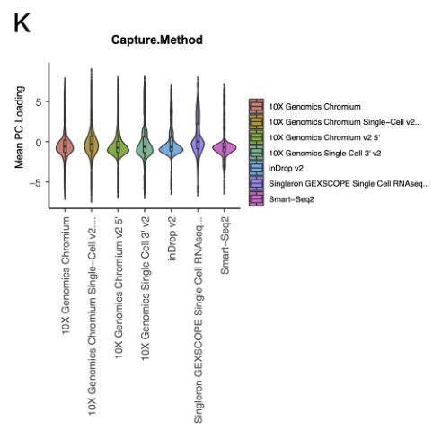
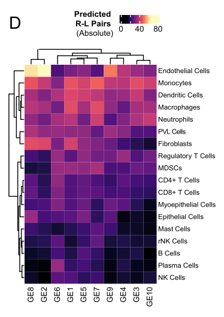

# A comprehensive single-cell breast tumor atlas defines epithelial and immune heterogeneity and interactions predicting anti-PD-1 therapy response

## Abstract

### 讲解：

我们展示了一个综合的单细胞RNA测序图谱，涵盖了原发性乳腺肿瘤微环境（TME），包含了来自八个数据集的119个活检样本中的236,363个细胞。在本研究中，我们利用这一资源进行多种免疫和癌症上皮细胞异质性的分析。我们通过六个亚群定义了乳腺TME中的自然杀伤（NK）细胞异质性。由于NK细胞异质性与上皮细胞异质性相关，我们在单基因表达、分子亚型以及反映肿瘤内转录异质性的10个类别的水平上对上皮细胞进行了表征。

我们开发了InteractPrint，考虑了癌症上皮细胞异质性如何影响癌症-免疫相互作用。我们使用T cell InteractPrint预测在两项乳腺癌临床试验中对免疫检查点抑制（ICI）的反应，这两项试验测试了新辅助抗PD-1疗法。T cell InteractPrint在两项试验中对反应的预测效果优于PD-L1（AUC = 0.82, 0.83 vs. 0.50, 0.72）。这一资源使对乳腺TME的高分辨率调查成为可能。

*****
### 比喻讲解：

我们可以把这个研究想象成一座大型音乐会的现场。

这座音乐会（乳腺肿瘤微环境）非常复杂，由八个不同的乐团（数据集）组成，共有119个乐手（活检样本），每个乐手都在演奏自己的乐器（细胞），总共有236,363个乐手。

在音乐会中，有一个特别的乐团演奏自然杀伤（NK）乐器。我们发现这个乐团内部有六种不同的演奏方式（六个亚群），每种方式都产生了不同的旋律（细胞异质性）。

此外，整个音乐会的主旋律（上皮细胞异质性）也非常复杂。我们通过单独聆听每个乐手的演奏（单基因表达）、分析不同类型的音乐风格（分子亚型），以及识别10种不同的变奏（反映肿瘤内转录异质性的10个类别），来理解主旋律的复杂性。

为了更好地理解整个音乐会的表现，我们开发了一种名为InteractPrint的工具，它就像一个智能的音乐指挥，能解析每个乐团之间的互动关系。我们特别使用了一个叫T cell InteractPrint的部分，来预测在两场特别的音乐比赛（乳腺癌临床试验）中，哪种音乐风格（抗PD-1疗法）会获得评委（免疫检查点抑制）的青睐。

结果表明，T cell InteractPrint在预测哪种音乐风格会赢得比赛中，比传统的评判方法（PD-L1）更准确（AUC = 0.82, 0.83 vs. 0.50, 0.72）。这个音乐会的记录（研究资源）将帮助我们进行更多高分辨率的音乐分析，进一步理解这场复杂的音乐会（乳腺肿瘤微环境）。

*****

### 问题：

在这项研究中，如何利用InteractPrint工具预测乳腺癌患者对免疫检查点抑制（ICI）疗法的反应？T cell InteractPrint与传统方法（PD-L1）的预测效果有何不同？

### 答案和讲解：

在这项研究中，研究人员开发了InteractPrint工具，用于分析癌症上皮细胞的异质性如何影响癌症-免疫相互作用。具体而言，他们使用了T cell InteractPrint部分来预测乳腺癌患者对免疫检查点抑制（ICI）疗法的反应。InteractPrint通过评估癌症上皮细胞与免疫细胞之间的相互作用，提供了对患者治疗反应的高准确性预测。

在两项乳腺癌临床试验中，研究人员测试了新辅助抗PD-1疗法的效果。结果显示，T cell InteractPrint在预测患者对ICI疗法的反应时，表现优于传统的PD-L1方法。T cell InteractPrint的预测准确性用AUC（曲线下面积）表示，在两项试验中的AUC分别为0.82和0.83，而PD-L1方法的AUC分别为0.50和0.72。这表明，T cell InteractPrint能够更准确地预测哪些患者会对免疫检查点抑制疗法有反应。

### 比喻讲解：

想象一个音乐比赛（乳腺癌临床试验），我们需要预测哪些乐手（患者）会在比赛中表现出色。传统的评判方法（PD-L1）就像是听乐手的前奏来做判断，结果往往不准确。而T cell InteractPrint就像一个智能的音乐指挥，它不仅听前奏，还能分析整个乐团（癌症上皮细胞和免疫细胞）的互动，从而更准确地预测乐手在比赛中的表现。这使得T cell InteractPrint在两场比赛中都能更好地预测哪些乐手会赢得比赛（对ICI疗法有反应），准确性显著高于传统方法。

*****
## Introduction

### 讲解：

乳腺癌是女性中最常见的癌症。乳腺癌的发展既受到癌症上皮细胞内在因素的驱动，也受到肿瘤微环境（TME）的影响。因此，乳腺癌的医疗治疗针对这些多种细胞群体，包括传统的化疗、靶向抑制癌细胞激素受体的药物、激酶、细胞周期入口和免疫细胞调节剂。为了进一步改进这些疗法，需要更深入地了解乳腺肿瘤的细胞和分子组成。

单细胞RNA测序（scRNA-seq）技术已被应用于更好地表征肿瘤微环境。对于乳腺癌，已经进行了几项scRNA-seq研究，以识别乳腺TME中的关键免疫细胞、癌细胞和基质细胞群体。这些研究提供了对癌细胞、多个免疫群体和其他基质细胞的分子表型的见解。然而，每项研究都受限于样本和细胞数量，这对全面分析TME中异质性细胞群体及其相互作用带来了挑战。

例如，自然杀伤（NK）细胞是抗肿瘤防御中关键的先天淋巴免疫细胞。在乳腺癌中，肿瘤浸润的NK细胞很稀少，在已发表的原发性乳腺肿瘤的scRNA-seq数据集中仅占总肿瘤细胞的1%到6%。它们的细胞毒性活动由一系列功能性激活和失活受体调节。肿瘤暴露后，NK细胞激活和失活受体的平衡可能会改变，导致它们失去细胞毒性活动或增殖能力，甚至可能促进肿瘤生长。由于大多数人类研究中处理的NK细胞数量较少，scRNA-seq分析常常无法捕捉它们的独特功能表型。

此外，乳腺癌在单个患者的肿瘤内和临床亚型患者之间存在显著的异质性。因此，全面分析癌症上皮细胞异质性需要大量和多样化的数据集，包含足够数量的所有临床乳腺癌亚型样本。

在这项研究中，我们创建了一个综合的乳腺TME的scRNA-seq图谱，包含来自八个公开可用数据集的119个活检样本中的236,363个细胞。这一资源使得能够在原发性乳腺肿瘤中分离细胞群体，并在单细胞水平上对细胞异质性进行稳健的表征。相比传统的原始数据集元分析，这一综合数据集在统计上更具力量，并能够评估与临床特征的相关性。我们利用这一资源定义了免疫和癌症上皮细胞的异质性及其相互作用。据我们所知，这是首次在乳腺癌中定义NK细胞亚群，并提供了癌症上皮细胞异质性影响免疫相互作用和抗PD-1疗法反应的证据。这个数据集提供了一个全面的资源，以更好地理解乳腺TME的组成。

*****

### 比喻讲解：

我们可以把这项研究比作一个大型的花园，而乳腺癌就是花园中的一部分。

这个花园里有各种各样的植物（细胞），有些植物是园主（癌症上皮细胞）自己种的，有些是花园的环境（肿瘤微环境）决定的。为了让花园里的植物健康生长，园丁（医生）需要用不同的工具和方法（化疗、靶向药物、免疫调节剂）来照顾这些植物。

单细胞RNA测序技术就像一个高科技的显微镜，帮助园丁观察每一株植物的细节。在乳腺癌花园里，已经有很多研究使用这个显微镜，发现了不同的植物类型（免疫细胞、癌细胞和基质细胞）。然而，每次观察的花园面积都很有限，这使得全面了解花园里的所有植物和它们之间的相互作用变得很困难。

例如，花园里有一种叫做NK细胞的植物，它们是花园的守护者，负责抵抗害虫（抗肿瘤防御）。但这些NK细胞在花园里非常稀少，仅占花园总植物的1%到6%。它们的守护能力受一系列开关（激活和失活受体）的控制。当花园受到害虫侵袭时，这些开关可能会失灵，导致NK细胞失去守护能力，甚至可能帮助害虫。

乳腺癌花园不仅在同一块地里有很大的差异（单个患者的肿瘤内异质性），不同花园（不同患者）之间的差异也很大。因此，要全面了解这些差异，需要对大量不同花园进行观察。

在这项研究中，我们创建了一个综合的乳腺癌花园图谱，包含来自八个不同花园的119块地，共计236,363株植物。这一资源使得我们能够在单个花园中分离不同的植物，并在单株植物的水平上详细观察它们的差异。相比以往的单独观察，这一综合图谱在统计上更具力量，并能够评估与花园健康状况（临床特征）的关系。我们利用这一资源定义了免疫细胞和癌症上皮细胞的异质性及其相互作用。据我们所知，这是首次在乳腺癌花园中定义NK细胞的不同种类，并提供了癌症上皮细胞异质性影响免疫相互作用和抗PD-1治疗效果的证据。这个图谱为更好地理解乳腺癌花园的组成提供了一个全面的资源。

*****

### 问题：

为什么在乳腺癌研究中，需要创建一个综合的单细胞RNA测序图谱？这个图谱在理解乳腺肿瘤微环境中的细胞异质性方面有什么优势？

### 答案和讲解：

在乳腺癌研究中，创建一个综合的单细胞RNA测序（scRNA-seq）图谱是因为单一研究中的样本和细胞数量有限，无法全面分析异质性细胞群体及其相互作用。综合图谱能够结合多个数据集，提供更大规模和多样化的细胞数据，从而更准确地表征肿瘤微环境（TME）中的细胞异质性。

这个综合图谱在理解乳腺肿瘤微环境中的细胞异质性方面有以下几个优势：
1. 提供更全面的细胞和分子信息，有助于识别和表征不同的细胞类型和它们的功能。
2. 增强了统计力量，使得在分析细胞群体和细胞间相互作用时更具可信度。
3. 允许研究人员评估细胞异质性与临床特征之间的关联，有助于预测治疗反应和患者预后。

### 比喻讲解：

想象一个大型花园（乳腺癌），其中有许多不同类型的植物（细胞）。单一研究就像是观察花园中的一个小角落，虽然可以看到一些植物，但无法全面了解整个花园的组成。而综合的单细胞RNA测序图谱就像是结合了多个观察视角，能够提供整个花园的全景图。

这个全景图的优势在于：
1. 可以识别花园中所有类型的植物，并了解它们各自的特性（细胞类型和功能）。
2. 增强了观察的细节，使得在分析植物之间的相互作用时更具信心（统计力量更强）。
3. 允许园丁（研究人员）评估植物的健康状况与花园的整体环境（临床特征）之间的关系，从而更好地照顾花园（预测治疗反应和患者预后）。

*****

## Results

### Fig.1a

### 结果描述：
图1a展示了处理和整合8个原发性乳腺癌数据集的概述。该数据集包含来自88名患者的119个样本，总计236,363个细胞。

### 图例描述：
图1a概述了处理和整合8个原发性乳腺癌数据集的流程。这个流程包括数据预处理，如过滤低质量细胞和双细胞（doublets），以及整合来自不同数据集的细胞数据。

### 关键结论：
- 通过整合多个数据集，研究团队能够生成一个综合的单细胞RNA测序图谱，这个图谱包含了大量的细胞数据，涵盖了各种临床亚型的乳腺癌样本。
- 整合的数据集显著增强了统计力量，使得能够进行更全面和准确的细胞异质性分析。
- 图1a展示了一个全面且详细的流程，确保数据集的质量和一致性，从而为后续分析打下了坚实的基础。

### 分析目的：
- 处理和整合多个数据集，以创建一个高分辨率的乳腺肿瘤微环境（TME）图谱。
- 提高统计力量，通过整合数据减少单一研究样本数量有限带来的局限性。
- 提供一个详细的流程图，展示如何确保数据的高质量和一致性，为后续的细胞异质性分析和临床特征关联分析提供可靠的数据基础。

*****

### 方法描述：

Figure 1A的方法描述了将8个公开可用的原发性乳腺癌数据集处理和整合成一个单一的综合数据集的过程。具体步骤如下：

1. **数据收集**：收集来自8个公开可用乳腺癌数据集的数据，这些数据集包含来自88名患者的119个样本，总计236,363个细胞。
2. **数据预处理**：对每个数据集单独进行预处理，包括过滤低质量细胞和双细胞（doublets）以确保数据的高质量。
3. **数据整合**：使用标准化的方法将所有预处理后的数据集整合成一个综合数据集，确保没有单个数据集或技术驱动的批处理效应。
4. **细胞类型识别**：通过三步流程识别和标记细胞类型，包括根据经典细胞标记的特征分数、标记数量与平均表达水平、以及单独标记基因的最大平均表达水平来进行分类。
5. **可视化**：使用UMAP（统一流形近似和投影）技术进行可视化，展示整合后数据集中细胞的分类和分布情况。

### 比喻讲解：

我们可以将这个方法比作一个大型音乐会的筹备过程：

1. **数据收集**：首先，我们从八个不同的音乐团体（数据集）中收集了演出曲目（数据），这些曲目由88名音乐家（患者）的119段演出（样本）组成，总共236,363段音轨（细胞）。
2. **数据预处理**：接下来，我们对每个音乐团体的曲目进行预处理，就像音响师会过滤掉录音中的噪音和重复部分（低质量细胞和双细胞），以确保每段音轨的高质量。
3. **数据整合**：然后，我们使用标准化的音频处理技术，将所有音乐团体的曲目整合成一个完整的音乐专辑（综合数据集），确保没有一个音乐团体的曲目或录音技术影响整个专辑的质量（消除批处理效应）。
4. **细胞类型识别**：我们通过三步流程来识别和标记每段音轨的类型（细胞类型），就像音乐评论家会根据曲目的特点、乐器数量与演奏风格，以及单独乐器的表现水平来进行分类。
5. **可视化**：最后，我们使用UMAP技术将整合后的音乐专辑进行可视化展示，像是将所有音轨按照类别和分布情况制作成一个音乐地图，让听众能够一目了然地看到每段曲目的分类和分布。

*****

### Fig.1b

### 结果描述：

图1b展示了通过UMAP（统一流形近似和投影）技术对236,363个细胞的可视化结果。这些细胞来自119个样本，涵盖了所有临床亚型的乳腺癌。图中细胞按系谱（lineage）进行了聚类，其中免疫细胞和基质细胞聚集在一起，而上皮细胞则根据其亚型进行分离。

### 图例描述：

图1b的UMAP可视化展示了综合数据集中所有细胞的分布情况。图中展示了主要的细胞群体，包括免疫细胞、基质细胞和上皮细胞。不同的细胞群体在图中形成了明显的聚类，免疫细胞和基质细胞跨越临床亚型聚集在一起，而上皮细胞则根据其分子亚型表现出分离。

### 关键结论:

- 综合数据集中的细胞根据系谱进行聚类，显示了不同细胞类型之间的明显分离。
- 免疫细胞和基质细胞在所有临床亚型中表现出相似的聚类，而上皮细胞则根据其分子亚型进行分离。
- 这一结果验证了其他研究中的发现，说明在乳腺肿瘤微环境中，不同类型细胞的分布具有一致性。

### 分析目的：

图1b的目的是通过可视化展示综合数据集中不同类型细胞的聚类情况，验证数据的整合效果，并揭示乳腺癌肿瘤微环境中细胞类型的分布和异质性。这有助于进一步理解乳腺肿瘤微环境的组成，并为后续的细胞异质性和相互作用研究提供基础数据。

*****

### 方法描述：
图1b使用统一流形逼近与投影（UMAP）技术对119个乳腺癌样本中的236,363个细胞进行可视化。每个样本分别处理以过滤低质量细胞和双细胞，然后将所有数据集整合在一起。细胞类型通过三步流程识别：基于经典细胞标志物的特征评分、标志物计数与平均表达相结合以及单个标志基因的最高平均表达。UMAP可视化显示了按系谱聚类的细胞群体，免疫和基质细胞跨临床亚型聚类，而上皮细胞则按亚型分离。

### 比喻讲解：
我们可以将这个方法比作组织一场大型的音乐会。

首先，每个样本就像是一个独立的乐团，里面有各种乐手（细胞）。在准备音乐会之前，我们需要确保每个乐手都在演奏好的音符（过滤低质量细胞和双细胞）。然后，我们将来自不同乐团的所有乐手集合在一起（整合数据集）。

接下来，我们需要识别这些乐手的类型。我们使用了三步流程：
1. **听他们演奏的主要旋律**（基于经典细胞标志物的特征评分）。
2. **计数并衡量他们演奏的音符数量和音量**（标志物计数与平均表达相结合）。
3. **找到他们演奏最突出的音符**（单个标志基因的最高平均表达）。

一旦识别了所有乐手，我们就用一种称为UMAP的技术来为整个音乐会做可视化展示。UMAP就像是一个智能的座位安排系统，它根据乐手的演奏类型和风格将他们安排在合适的位置上。

结果就是，我们可以看到不同类型的乐手如何聚集在一起。例如，弦乐器组（免疫和基质细胞）跨越不同的乐团（临床亚型）聚集在一起，而不同风格的打击乐手（上皮细胞）则根据他们的风格（亚型）分布在不同的区域。这样，我们就可以一目了然地看到整个音乐会的演奏情况以及不同乐手之间的关系。

*****
### Fig.1c

### 结果描述：
图1c使用UMAP可视化展示了在综合单细胞RNA测序数据集中识别的主要自然杀伤（NK）细胞子集。这些子集是通过无监督图形聚类分析方法从乳腺肿瘤微环境（TME）中分离出来的。

### 图例描述：
图1c展示了通过UMAP可视化的主要NK细胞子集。这些子集是基于综合单细胞RNA测序数据集，通过无监督图形聚类方法识别的。图中不同颜色的点代表不同的NK细胞子集。

### 关键结论:
- 通过综合单细胞RNA测序数据集和无监督图形聚类分析，成功识别并可视化了乳腺肿瘤微环境中的主要NK细胞子集。
- 这些识别的NK细胞子集展现了在乳腺肿瘤微环境中的异质性。

### 分析目的：
- 识别乳腺肿瘤微环境中的主要NK细胞子集，揭示其在肿瘤微环境中的多样性和功能特征。
- 通过无监督图形聚类和UMAP可视化方法，为研究人员提供一种直观的方式来观察和分析NK细胞在乳腺肿瘤中的分布和异质性。
- 为进一步研究这些NK细胞子集的功能和在抗肿瘤免疫中的角色提供基础。

*****

### 方法描述：
图1c展示了利用无监督图形聚类方法对整合数据集中自然杀伤（NK）细胞的重新聚类过程。具体步骤如下：

1. **数据预处理**：首先对整合数据集中的NK细胞进行过滤，去除低质量细胞和双细胞。
2. **特征提取**：提取NK细胞中特定的基因表达特征，用于后续聚类分析。
3. **聚类分析**：使用无监督图形聚类方法对提取的特征进行分析，识别出6个不同的NK细胞亚群（NK-0到NK-5）。
4. **可视化**：通过UMAP（统一流形近似和投影）方法对聚类结果进行可视化展示，显示NK细胞在不同亚群中的分布情况。

### 比喻讲解：
想象你正在一个巨大的图书馆中，图书馆里有许多不同种类的书籍。你的任务是将这些书籍按照它们的主题重新整理分类。

1. **数据预处理**：首先，你需要检查每本书的状态，去除那些破损的或者属于其他图书馆的书籍，以确保你只处理高质量的书籍。
2. **特征提取**：接下来，你仔细阅读每本书的内容，标记出书籍中提到的一些关键字或主题，比如“历史”、“科学”、“文学”等。这些关键字就像NK细胞中特定基因的表达特征。
3. **聚类分析**：然后，你使用这些标记的关键字来将书籍分组。你采用了一种先进的无监督分类算法，就像是一个智能图书管理员，能够根据书籍内容的相似性将它们自动分类。最后，你发现了六个主要的书籍类别，比如“科学书籍组”、“历史书籍组”等。
4. **可视化**：为了让其他人也能清楚地看到你的分类结果，你制作了一张图书分类的展示图。你使用了一种叫做UMAP的方法，这就像是一种特殊的地图，可以展示每本书在图书馆中的位置以及它属于哪个类别。这样，大家一目了然地就能看到不同类别的书籍是如何分布的。

*****

### Fig.1d

### 结果描述：
图1d展示了每个主要NK细胞亚群的差异基因表达。具体而言，图中通过气泡热图显示了每个NK细胞亚群中上调表达的特征基因。气泡的大小表示基因表达的细胞比例，颜色强度表示基因表达水平。

### 图例描述：
图1d是一个气泡热图，用于显示在六个NK细胞亚群（NK-0到NK-5）中差异表达的基因。每个气泡表示一个基因在相应NK细胞亚群中的表达情况，气泡的大小表示该基因在细胞中的表达比例，颜色的深浅表示该基因的表达水平，颜色越深表示表达水平越高。

### 关键结论:
- 通过差异基因表达分析，可以清晰地识别出每个NK细胞亚群的特征基因，这些基因在相应亚群中显著上调表达。
- 不同NK细胞亚群展示了独特的基因表达模式，表明它们在功能上可能存在显著差异。例如，NK-0和NK-2亚群高表达FCGR3A（CD16）和溶解分子（如颗粒酶和PRF1），而NK-1亚群则显示出NR4A家族基因的高表达，这些基因与细胞毒性减弱相关。

### 分析目的：
- 通过展示每个NK细胞亚群的特征基因表达，图1d的目的是提供一个全面的视图，揭示不同NK细胞亚群的分子特征。
- 这有助于进一步理解NK细胞在乳腺肿瘤微环境中的多样性和功能分化，为研究NK细胞在肿瘤免疫中的作用提供了重要的基础数据。
- 这些结果也为未来的功能研究提供了线索，帮助确定哪些基因可能在NK细胞的抗肿瘤活性或调节功能中起关键作用。

*****

### 方法描述：
图1d展示了使用气泡热图显示每个主要NK细胞亚群上调的差异表达基因。研究人员首先通过单细胞RNA测序（scRNA-seq）技术对整合的数据集中的NK细胞进行无监督的图形聚类，识别出六个NK细胞亚群（NK-0到NK-5）。然后，他们对这些NK细胞亚群进行了差异基因表达分析，以确定每个亚群中上调的基因。这些上调的基因通过气泡热图显示，气泡的大小表示基因表达的幅度，颜色表示表达水平。

### 比喻讲解：
我们可以将这个方法比作一个图书馆管理系统，图书馆中有成千上万的书籍（NK细胞），每本书属于不同的类别（NK细胞亚群）。

1. **图书分类**：首先，我们使用一个智能系统（无监督图形聚类）对图书进行分类，最终将所有书籍分为六个类别（NK-0到NK-5）。

2. **找出热门书籍**：接下来，我们想知道每个类别中最受欢迎的书籍（上调的差异表达基因）。我们通过分析借阅记录（基因表达数据），找出每个类别中借阅次数最多的书籍（上调基因）。

3. **显示热门书籍**：为了更直观地展示结果，我们使用一种特殊的展示方式（气泡热图）。在这个展示中，每本热门书籍都用一个气泡表示，气泡的大小表示书籍的受欢迎程度（基因表达幅度），颜色表示借阅频率（表达水平）。

4. **图书馆的全景图**：最终，我们得到了一个展示每个图书类别中最受欢迎书籍的全景图（图1d）。通过这个图，我们可以一目了然地看到不同类别中哪些书籍最受欢迎，从而更好地了解图书馆的借阅趋势（NK细胞的功能特性）。

这种方法不仅帮助我们了解每个NK细胞亚群的独特功能，还为进一步研究这些细胞在肿瘤微环境中的作用提供了重要信息。

*****

### Fig.1e

### 结果描述：
图1e展示了在每个NK细胞亚群中重新编程NK（rNK）细胞特征的表达。结果显示，NK-1亚群的rNK细胞特征表达显著高于其他所有NK细胞亚群。

### 图例描述：
图1e是一个箱线图（boxplot），展示了在六个NK细胞亚群（NK-0到NK-5）中，重新编程NK（rNK）细胞特征的表达水平。横轴表示六个NK细胞亚群，纵轴表示rNK细胞特征的表达水平。统计分析结果显示，NK-1亚群的rNK细胞特征表达显著高于其他所有亚群，Kruskal-Wallis检验的p值小于0.0001。

### 关键结论:
- NK-1亚群在rNK细胞特征的表达方面显著高于其他NK细胞亚群。这表明NK-1亚群可能在肿瘤微环境中具有独特的功能特性，特别是与肿瘤相关的重新编程现象。

### 分析目的：
- 通过比较不同NK细胞亚群中rNK细胞特征的表达水平，确定哪些NK细胞亚群在肿瘤微环境中可能具有独特的功能特性。
- 这一分析有助于理解不同NK细胞亚群在肿瘤微环境中的作用，为进一步研究NK细胞在肿瘤免疫中的角色提供线索。通过识别具有高rNK特征表达的NK细胞亚群，可以更好地了解其在肿瘤发展和免疫逃逸中的潜在机制。

*****

### 方法描述：

图1e展示了通过生成rNK（重新编程的自然杀伤细胞）签名并将其应用于不同NK细胞亚群的方法。具体步骤如下：

1. 首先，从先前的实验中生成小鼠rNK细胞的签名。这些实验比较了健康NK细胞和肿瘤暴露的NK细胞的转录组，发现了肿瘤促进和重新编程的NK细胞。
2. 将小鼠的rNK细胞签名转换为人类的对应版本。
3. 将人类rNK细胞签名应用于整合数据集中的NK细胞亚群。
4. 对比分析表明，NK-1亚群在rNK签名中的得分显著高于其他NK细胞亚群（p < 0.0001）。
5. 差异基因表达分析显示，rNK细胞相比于非rNK细胞在NR4A家族基因、FOS、JUN和DUSP1等基因上具有显著差异。

### 比喻讲解：

想象你在一个大型音乐会上，需要找出哪些音乐家被重新训练过并且演奏风格发生了显著变化。你知道这些重新训练过的音乐家会演奏特定的曲调（rNK签名）。

1. 首先，你回顾了先前的一场音乐会（实验），在那场音乐会上你记录了健康音乐家的演奏（健康NK细胞）和被重新训练的音乐家的演奏（肿瘤暴露的NK细胞），并生成了一份曲调列表（小鼠rNK细胞签名）。
2. 然后，你把这份曲调列表转换成新的乐谱，使其适用于当前的音乐会（人类rNK签名）。
3. 接着，你拿着这份新的乐谱去检查当前音乐会中的每个乐手（NK细胞亚群），看看他们的演奏中有多少符合这份新的乐谱（应用rNK签名）。
4. 通过比较你发现，某个特定的乐队（NK-1亚群）演奏的曲调与新的乐谱非常匹配，他们的表现得分显著高于其他乐队（p < 0.0001）。
5. 最后，你深入分析这些乐手（rNK细胞）的演奏风格，发现他们在某些特定音符（NR4A家族基因、FOS、JUN和DUSP1等基因）上的表现与其他乐手（非rNK细胞）显著不同。

通过这种方式，你成功地找出了哪些音乐家（NK细胞）在当前的音乐会上被重新训练过，并且详细记录了他们的演奏特征。

*****

### fig.1f

### 结果描述：
图1f展示了rNK（重编程NK细胞）与非rNK细胞之间的差异表达基因的MA图。结果显示NR4A家族（NR4A1, NR4A2, NR4A3）、FOS、JUN和DUSP1等基因在rNK细胞中显著上调。红点代表在rNK细胞中上调的基因，蓝点代表在非rNK细胞中上调的基因。

### 图例描述：
图1f中的MA图（平均对数比图）展示了rNK细胞和非rNK细胞之间的差异表达基因。x轴表示基因的平均表达水平，y轴表示基因的对数比值（log2 fold change）。红色点表示在rNK细胞中显著上调的基因，蓝色点表示在非rNK细胞中显著上调的基因。图中标注了几种关键基因，如NR4A家族、FOS、JUN和DUSP1。

### 关键结论:
- rNK细胞与非rNK细胞相比，具有显著不同的基因表达谱。
- 特别是NR4A家族、FOS、JUN和DUSP1基因在rNK细胞中显著上调，表明这些基因在rNK细胞的重编程过程中起重要作用。

### 分析目的：
- 确定rNK细胞与非rNK细胞之间的差异表达基因，揭示rNK细胞的特异性基因特征。
- 通过识别和比较这些基因，提供对rNK细胞功能和潜在机制的深入理解，有助于阐明NK细胞在肿瘤微环境中的角色及其重编程过程。

*****

### 方法描述：

Fig. 1f展示了重新编程的NK细胞（rNK）与非重新编程的NK细胞（non-rNK）之间差异表达基因（DEGs）的MA图。这个图的生成过程如下：

1. **数据收集与预处理**：从人类乳腺癌患者的样本中分离出NK细胞，利用单细胞RNA测序技术测定这些细胞的转录组。
2. **重新编程NK细胞的定义**：通过对比肿瘤暴露的NK细胞和健康NK细胞的转录组，确定重新编程NK细胞的特征基因。
3. **差异表达分析**：使用统计学方法比较rNK和non-rNK细胞的基因表达，找出显著差异表达的基因。
4. **MA图的绘制**：将每个基因的log2 fold change（对数折叠变化，表示基因表达变化的倍数）与平均表达量绘制成图，标出差异表达显著的基因。

### 比喻讲解：

可以将这个方法过程比作一个大型图书馆的书籍整理和分类工作。

1. **数据收集与预处理**：
- 想象你从一个巨大的图书馆（乳腺癌患者样本）中收集了许多书籍（NK细胞）。
- 你通过检查每本书的内容（利用单细胞RNA测序技术），记录下每本书的详细信息（转录组数据）。

2. **重新编程NK细胞的定义**：
- 你把这些书分为两组：一组是受到了特殊训练（重新编程）的书，另一组是普通书（健康NK细胞）。
- 你对比这两组书的目录，找出那些在训练后变得特别有用的章节（重新编程NK细胞的特征基因）。

3. **差异表达分析**：
- 接下来，你比较两组书的内容，找出那些在训练后显著变化的章节（差异表达基因）。
- 你使用一种统计方法，确保这些变化不是偶然的，而是真实的差异。

4. **MA图的绘制**：
- 最后，你绘制一张图表（MA图），横轴表示每个章节的平均重要性（平均表达量），纵轴表示章节的重要性变化（对数折叠变化）。
- 你用不同的颜色或标记，突出显示那些在训练后变得特别有用或不再重要的章节（显著差异表达的基因）。

通过这种方式，你就能清晰地看到哪些基因在NK细胞重新编程后发生了显著变化，从而理解重新编程对NK细胞功能的影响。

*****

### Fig.1g

### 结果描述：

图1g展示了rNK（重新编程的自然杀伤细胞）签名在不同乳腺癌临床亚型中的表达水平。通过箱线图比较了各个临床亚型中rNK签名的表达水平，结果显示在所有亚型之间没有显著差异（Kruskal-Wallis p > 0.05）。

### 图例描述：

图1g的箱线图展示了rNK细胞签名在不同乳腺癌临床亚型中的表达水平。每个箱线图代表一个临床亚型，箱线图的中位数线、四分位范围和数据点显示了rNK签名在不同亚型中的分布情况。统计分析结果（Kruskal-Wallis p值）显示各亚型之间没有显著差异。

### 关键结论:

- rNK细胞签名在不同乳腺癌临床亚型中的表达水平没有显著差异。这表明rNK细胞的重新编程现象不是由特定的乳腺癌临床亚型驱动的，而是一个普遍存在的现象。

### 分析目的：

图1g的分析目的是确定rNK细胞签名的表达水平是否在不同的乳腺癌临床亚型中有所不同。通过比较各个临床亚型中的rNK签名表达水平，研究人员能够评估rNK细胞的重新编程现象是否与特定的乳腺癌亚型相关。结果显示，rNK签名在各个乳腺癌临床亚型中均无显著差异，这表明rNK细胞的重新编程现象是一个普遍存在的现象，而不是由特定的临床亚型驱动的。

*****

### 方法描述：
Fig.1g展示了使用Kruskal-Wallis检验和Pearson相关性分析的方法，以评估rNK（reprogrammed NK）细胞特征在不同乳腺癌临床亚型中的表达差异。具体步骤如下：

1. **样本分组**：将包含rNK细胞的样本按乳腺癌临床亚型分组。
2. **统计分析**：使用Kruskal-Wallis检验比较各组间rNK细胞特征表达的差异。
3. **Pearson相关性分析**：计算rNK细胞特征表达水平与年龄之间的Pearson相关系数，以评估年龄与rNK细胞表达的相关性。

### 比喻讲解：

想象你在一个大型音乐会现场，有不同的乐队（乳腺癌临床亚型），每个乐队都有一些特殊的乐手（rNK细胞）。你想知道这些特殊乐手在不同乐队中的表现是否有所不同，以及他们的表现是否与他们的年龄（患者年龄）相关。

1. **样本分组**：首先，你将这些乐手按照他们所属的乐队（乳腺癌临床亚型）进行分组。每个乐队可能有很多乐手，你需要分别统计每个乐队中这些特殊乐手的表现。
2. **统计分析**：接下来，你使用一种叫做Kruskal-Wallis检验的方法来比较不同乐队中这些乐手的表现。这个方法类似于将每个乐队的表演评分，然后比较这些评分是否有显著差异。
3. **Pearson相关性分析**：最后，你想知道这些乐手的表现是否与他们的年龄相关。因此，你使用Pearson相关性分析，这就像是检查乐手的年龄与他们的表演评分之间的关系，看看是否存在某种模式，比如年长的乐手表现是否更好或者更差。

通过这些分析，你可以得出结论，了解不同乐队中这些特殊乐手的表现差异，并且知道他们的表现是否与年龄相关。这种方法帮助你更好地理解音乐会（乳腺癌微环境）中这些乐手的特性和影响因素。

*****

### fig.1h

### 结果描述：

Fig. 1h展示了不同乳腺癌临床亚型中重新编程的NK细胞（rNK）与癌症上皮细胞之间的受体-配体对（receptor-ligand pairs）的预测结果。这些配对在各临床亚型中都存在。每个受体-配体对由不同的颜色表示，共享的受体-配体对用红色标记。

### 图例描述：

Fig. 1h使用环状图（Circos plot）展示了重新编程的NK细胞与乳腺癌上皮细胞之间的代表性受体-配体对的预测结果。不同的颜色表示不同的受体-配体对，红色表示在所有临床亚型中共享的受体-配体对。

### 关键结论：

- 重新编程的NK细胞与乳腺癌上皮细胞之间存在多个受体-配体对，这些对在不同的乳腺癌临床亚型中均有出现。
- 共享的受体-配体对表明，不同临床亚型中的NK细胞和上皮细胞之间有共同的相互作用机制。

### 分析目的：

- 通过分析rNK细胞与癌症上皮细胞之间的受体-配体对，研究人员旨在揭示这些细胞之间的相互作用如何在不同的乳腺癌临床亚型中发挥作用。
- 识别并表征这些受体-配体对，特别是共享的对，可以提供关于乳腺癌微环境中免疫反应和肿瘤进展的深入理解，为开发新的治疗策略提供线索。

*****
### 方法描述：
图1h展示了使用Circos图显示在不同乳腺癌临床亚型中，重新编程的自然杀伤（rNK）细胞与癌症上皮细胞之间的预测受体-配体对。具体方法如下：

1. **数据准备**：提取rNK细胞和癌症上皮细胞的单细胞RNA测序数据。
2. **基因表达分析**：识别rNK细胞和癌症上皮细胞中显著表达的受体和配体基因。
3. **受体-配体对预测**：基于已知的受体-配体相互作用数据库，预测rNK细胞与癌症上皮细胞之间可能的受体-配体对。
4. **数据整合**：将所有预测的受体-配体对整合到不同的乳腺癌临床亚型中，确保每个亚型都包含相关的数据。
5. **Circos图绘制**：使用Circos图将所有预测的受体-配体对可视化，显示rNK细胞与不同临床亚型的癌症上皮细胞之间的相互作用。

### 比喻讲解：
想象一个大型交响乐团的演奏会，每种乐器（细胞）都在演奏自己的旋律（基因表达）。为了理解这些乐器之间的配合（细胞相互作用），我们需要做以下工作：

1. **数据准备**：首先，我们需要给每个乐器（细胞）单独录音，确保捕捉每一个音符（基因表达数据）。
2. **基因表达分析**：然后，我们仔细聆听每个录音，识别出每种乐器（细胞）中特别突出的音符（显著表达的受体和配体基因）。
3. **受体-配体对预测**：接着，我们查阅音乐理论书籍（已知的受体-配体相互作用数据库），预测哪些乐器（细胞）之间的旋律（受体-配体对）会和谐地配合。
4. **数据整合**：我们把所有乐器（细胞）的录音和预测的旋律配合（受体-配体对）整合在一起，根据不同的乐章（乳腺癌临床亚型）进行分类，确保每个乐章都包含相关的旋律。
5. **Circos图绘制**：最后，我们使用一个特别的乐谱（Circos图），展示所有乐器（细胞）之间的配合（受体-配体对），让我们可以直观地看到每个乐器（细胞）在不同乐章（临床亚型）中的表现和互动。

*****

### Fig.1i

### 结果描述：
图1i显示了重编程的自然杀伤（rNK）细胞基因表达与非重编程的NK（non-rNK）细胞基因表达之间的Pearson相关性。在所有乳腺癌临床亚型中，rNK细胞与rNK细胞之间的基因表达相关性显著高于rNK细胞与non-rNK细胞之间的相关性。

### 图例描述：
图1i中的盒须图（boxplot）展示了不同乳腺癌临床亚型中，重编程的NK细胞（rNK细胞）与非重编程的NK细胞（non-rNK细胞）的基因表达Pearson相关性。图中显示rNK细胞之间的相关性显著高于rNK细胞与non-rNK细胞之间的相关性（双侧Wilcoxon检验，****p < 0.0001）。

### 关键结论:
- rNK细胞与其他rNK细胞之间的基因表达相关性显著高于与non-rNK细胞之间的相关性。
- 这一结果表明，rNK细胞具有独特的基因表达特征，与非重编程的NK细胞明显不同。

### 分析目的：
- 确认重编程的NK细胞（rNK细胞）在基因表达上的独特性和一致性。
- 通过比较rNK细胞与non-rNK细胞的基因表达相关性，验证rNK细胞在乳腺癌临床亚型中的特异性表达模式。
- 为进一步研究rNK细胞的功能特性及其在乳腺癌免疫环境中的作用提供基础数据。

*****

### 方法描述：

Fig.1i的目的是展示重新编程的NK细胞（rNK）与非重新编程的NK细胞相比，在基因表达上的相关性。研究团队首先计算了rNK细胞的基因表达谱，然后比较了rNK细胞与其他非rNK细胞之间的基因表达相关性。为了进行这种比较，他们使用了Pearson相关系数来量化基因表达水平之间的相关性。结果显示，rNK细胞之间的基因表达相关性显著高于rNK细胞与非rNK细胞之间的相关性。

### 比喻讲解：

我们可以把这个过程想象成一个音乐爱好者的聚会，每个音乐爱好者都喜欢不同的音乐类型。在这次聚会中，有一群特别喜欢古典音乐的爱好者（rNK细胞），他们之间的音乐品味非常相似（高相关性）。为了更好地理解这些古典音乐爱好者的共同点，研究人员（音乐评论家）决定比较这些爱好者之间的音乐品味，并将其与其他喜欢不同类型音乐的爱好者（非rNK细胞）进行对比。

具体的实现过程如下：
1. **收集数据**：音乐评论家首先收集了所有参加聚会的音乐爱好者的音乐播放列表（基因表达数据）。
2. **确定特别群体**：然后，他们识别出特别喜欢古典音乐的那一群人（rNK细胞）。
3. **计算相关性**：接着，评论家计算这些古典音乐爱好者之间的播放列表相似度（基因表达相关性），用Pearson相关系数来量化。
4. **对比分析**：最后，他们将这些古典音乐爱好者之间的相似度与他们和其他音乐爱好者之间的相似度进行对比。

结果显示，古典音乐爱好者之间的播放列表相似度（基因表达相关性）显著高于他们和其他音乐爱好者之间的相似度。这表明这些古典音乐爱好者在音乐品味上有着非常高的一致性，这与rNK细胞在基因表达上的高相关性类似。

*****
### fig.1j

### 结果描述：

Fig.1j展示了重新编程的NK细胞（rNK细胞）比例与样本年龄之间的Pearson相关性。图中使用散点图显示每个样本的rNK细胞比例，并绘制了一条回归线来表示相关性。结果显示，样本中rNK细胞的比例与样本年龄之间存在正相关性，Pearson相关系数为0.33，p值小于0.01。

### 图例描述：

Fig.1j的图例部分包括以下内容：
- 散点图显示了每个样本中rNK细胞比例与样本年龄之间的关系。
- 横轴（X轴）表示样本年龄。
- 纵轴（Y轴）表示rNK细胞的比例。
- 散点代表每个样本的具体数据点。
- 回归线表示rNK细胞比例与样本年龄之间的线性关系。
- 图中注有Pearson相关系数（R = 0.33）和p值（p < 0.01），表明相关性显著。

### 关键结论:

- 样本中rNK细胞的比例与样本年龄之间存在显著的正相关关系。
- 年龄较大的样本中，rNK细胞的比例更高，这表明随着年龄的增长，rNK细胞在肿瘤微环境中的比例可能增加。

### 分析目的：

- 确定重新编程的NK细胞（rNK细胞）比例是否与患者的年龄相关。
- 探索rNK细胞在不同年龄段样本中的分布情况，以了解其在肿瘤微环境中潜在的年龄依赖性变化。
- 为后续研究提供基础数据，进一步分析rNK细胞比例与临床特征（如年龄）之间的关系，从而更好地理解rNK细胞在肿瘤发展和免疫应答中的作用。

*****

### 方法描述：
图1j展示了通过散点图分析样本中重新编程的NK（rNK）细胞比例与年龄之间的Pearson相关性。具体步骤如下：
1. 生成rNK细胞的特征基因签名。
2. 使用这些特征基因签名在样本中识别rNK细胞。
3. 计算每个样本中rNK细胞的比例。
4. 使用Pearson相关性分析rNK细胞比例与患者年龄之间的关系。
5. 绘制散点图，展示样本中rNK细胞比例与年龄之间的相关性。

### 比喻讲解：
可以将这一过程比作在花园中分析不同植物的生长情况：

1. 首先，你在花园中确定了一些特殊的植物类型（rNK细胞），这些植物有着独特的叶子和花朵（特征基因签名）。
2. 接下来，你在花园的各个角落搜寻这些特殊植物，并记录下它们的数量。
3. 然后，你计算出每块花园中这种植物所占的比例。
4. 你希望了解这些植物的生长情况是否与某些环境因素有关，比如日照时间（患者年龄）。
5. 于是，你将每块花园中这种植物的比例与该块花园的日照时间进行比较，并绘制成图表，查看它们之间是否存在某种规律。

通过这种方式，你可以直观地看到植物的生长情况与环境因素之间的关系，从而得出有助于花园管理的结论。图1j中的方法也是类似，研究人员通过分析rNK细胞的比例与患者年龄之间的关系，试图揭示两者之间的潜在联系。

*****

### fig.1k

### 结果描述：
图1k展示了使用Kaplan-Meier生存分析，比较了在乳腺癌患者中，rNK细胞基因签名表达水平高的患者与低表达患者的总体生存情况。结果表明，在具有较高rNK细胞基因签名表达的肿瘤中，患者的总体生存率较差（log-rank检验，p < 0.05）。

### 图例描述：
图1k是Kaplan-Meier生存曲线图，展示了乳腺癌患者中rNK细胞基因签名表达水平与总体生存率之间的关系。图中分为两条曲线，分别代表rNK细胞基因签名高表达和低表达的患者组，横轴表示时间，纵轴表示总体生存率。p值（log-rank检验）用于评估两组生存曲线之间的显著性差异。

### 关键结论：
- 在乳腺癌患者中，具有高水平rNK细胞基因签名表达的患者总体生存率显著低于低表达的患者。
- rNK细胞基因签名的表达水平可以作为乳腺癌患者预后的一个重要指标。

### 分析目的：
- 通过Kaplan-Meier生存分析，评估rNK细胞基因签名表达水平与乳腺癌患者总体生存率之间的关系。
- 验证rNK细胞基因签名的表达水平是否可以作为预测乳腺癌患者预后的一个有价值的生物标志物。
- 提供进一步的证据支持rNK细胞在乳腺肿瘤微环境中潜在的不良影响，并推动开发针对这些细胞的新疗法。

*****

### 方法描述：

图1k展示了整合数据集的前20个主成分（PCs）的平均主成分加载值，按捕获技术（例如不同单细胞RNA测序技术平台）进行分层。此方法通过主成分分析（PCA）来评估整合数据集的批次效应。具体步骤如下：

1. **数据预处理和整合**：首先，将来自不同数据集的单细胞RNA测序数据进行预处理，包括去除低质量细胞和双细胞（doublets），然后整合这些数据。
2. **主成分分析（PCA）**：对整合的数据集进行PCA，计算每个细胞的主成分得分。PCA是一种降维技术，用于将高维数据投影到一组不相关的变量（即主成分）上，以捕捉数据的主要变异。
3. **计算平均主成分加载值**：计算每个捕获技术平台在前20个主成分上的平均主成分加载值。这些加载值表示每个平台在每个主成分上的贡献。
4. **结果可视化**：使用小提琴图展示不同技术平台在前20个主成分上的平均主成分加载值分布，以评估批次效应的存在和大小。

### 比喻讲解：

想象你正在组织一个大型音乐比赛，不同的音乐家（细胞）使用不同的乐器（单细胞RNA测序技术平台）演奏。你希望确保评委（分析工具）能够公平地评判每个音乐家的表现，而不受乐器类型的影响。

1. **准备工作**：首先，你需要确保每个音乐家的乐谱（数据）是完整和清晰的。因此，你会去掉那些不完整或模糊的乐谱（低质量细胞和双细胞），然后将所有乐谱整合在一起。
2. **主成分分析（PCA）**：接下来，你邀请了一个音乐专家（PCA），他能够识别出这些乐谱中最重要的旋律和节奏（主成分）。这些主成分就像是捕捉了乐谱中最主要的变异。
3. **计算平均主成分加载值**：专家会评估每种乐器在演奏这些主要旋律和节奏时的表现（主成分加载值）。他会计算每种乐器在前20个主要旋律和节奏上的平均表现。
4. **结果可视化**：最后，你使用一组特殊的图表（小提琴图）来展示这些乐器在前20个主要旋律和节奏上的平均表现。这些图表帮助你评估不同乐器是否对比赛的整体结果有不公平的影响（批次效应）。

通过这个过程，你确保比赛结果是公平和公正的，不会因为使用不同的乐器而有所偏差。这就类似于在单细胞RNA测序数据分析中，通过PCA和平均主成分加载值的计算，评估和校正批次效应，从而确保整合数据的质量和一致性。

*****

### fig.1l

### 结果描述：

图1l展示了在整合的单细胞RNA测序数据集中，不同乳腺癌样本和临床亚型中的自然杀伤（NK）细胞亚群的相对比例。条形图显示了每个肿瘤样本中六个NK细胞亚群（NK-0到NK-5）的相对比例。

### 图例描述：

图1l是一个条形图，展示了不同乳腺癌样本和临床亚型中六个NK细胞亚群（NK-0到NK-5）的相对比例。每个条形代表一个乳腺癌样本，颜色编码表示不同的NK细胞亚群。条形的高度表示相对比例。

### 关键结论:

- 不同乳腺癌样本中NK细胞亚群的比例存在显著的异质性。
- 没有单一的NK细胞亚群被某一个患者主导，并且所有NK细胞亚群在各乳腺癌临床亚型中均有存在。
- 使用ROGUE分析量化的NK细胞亚群异质性在某些临床亚型中显著更高，表明不同亚型间的NK细胞组成存在差异。

### 分析目的：

图1l的目的是展示和量化乳腺癌样本和临床亚型中NK细胞亚群的异质性。通过展示不同样本中各NK细胞亚群的相对比例，研究人员能够理解乳腺癌中NK细胞的多样性及其在不同临床亚型中的分布。这有助于揭示NK细胞在乳腺肿瘤微环境中的作用以及它们对抗肿瘤反应的潜在影响。

*****

### 方法描述：
图1l展示了在综合数据集中分析患者间NK细胞亚群比例差异的方法。研究人员首先将NK细胞从整合数据集中重新聚类，然后对每个患者样本中的NK细胞亚群进行分类和统计，计算每个亚群在不同患者中的比例。接下来，研究人员通过ROGUE分析量化NK细胞亚群异质性，并使用柱状图展示不同患者之间和不同乳腺癌临床亚型之间的NK细胞亚群比例差异。

### 比喻讲解：
想象你在一个大型的植物园工作，植物园里种满了各种不同种类的花（代表不同的NK细胞亚群）。你的任务是了解每个游客（代表不同的患者）在植物园中的游览偏好，即他们更喜欢哪些种类的花。

首先，你要做的是将所有的花按照种类重新分类（将NK细胞重新聚类），然后记录每个游客在参观植物园时所见到的不同种类的花的比例（计算每个患者样本中的NK细胞亚群比例）。

接着，你需要比较不同游客之间的花的喜好（不同患者之间的NK细胞亚群比例差异）。你还要特别注意是否有某些游客在某种类型的花前停留的时间更长（通过ROGUE分析量化NK细胞亚群异质性），并将这些信息用图表的形式展示出来（使用柱状图展示不同患者之间和不同乳腺癌临床亚型之间的NK细胞亚群比例差异）。

通过这种方法，你不仅可以了解每个游客的游览偏好，还能发现不同类型的花在不同游客中的受欢迎程度，从而更好地管理和调整植物园的布局（更好地理解乳腺癌患者中NK细胞亚群的分布和异质性）。

*****

### Figure 1中的重要结论

1. **数据整合和质量控制**：
- 图1a展示了处理和整合8个原发性乳腺癌数据集的流程，最终生成了一个包含236,363个细胞的综合单细胞RNA测序图谱。通过严格的质量控制和批次效应校正，确保了数据的一致性和可靠性。

2. **细胞类型鉴定和可视化**：
- 图1b中的UMAP可视化展示了不同细胞类型的聚类情况。免疫细胞和基质细胞在临床亚型中聚类，而上皮细胞则按亚型分离。这与其他研究结果一致，证明了数据整合的有效性。

3. **NK细胞亚群的鉴定**：
- 图1c展示了自然杀伤（NK）细胞的主要亚群。研究通过无监督图形聚类方法将NK细胞分为6个亚群（NK-0到NK-5），并通过差异基因表达分析确定每个亚群的特征基因。

4. **NK细胞亚群功能特征**：
- 图1d的热图显示了每个NK细胞亚群的差异表达基因，这些基因定义了各亚群的功能特征。例如，NK-0和NK-2富含高水平的FCGR3A（CD16）和细胞溶解分子，表明它们具有高效杀伤能力。

5. **重新编程的NK细胞与NK-1亚群的相似性**：
- 图1e展示了重新编程的NK（rNK）细胞特征在各NK细胞亚群中的表达水平。NK-1亚群在rNK细胞特征中得分显著高于其他亚群，表明rNK细胞与NK-1亚群具有相似的转录特征。

6. **NK细胞亚群在患者间的异质性**：
- 图1l展示了不同患者样本中各NK细胞亚群的比例差异。研究发现NK细胞亚群在不同患者和乳腺癌临床亚型中存在显著异质性，表明NK细胞在乳腺癌中的角色具有高度复杂性和多样性。

这些重要结论表明，综合的单细胞RNA测序图谱能够提供对乳腺肿瘤微环境中细胞异质性的深入理解，特别是对NK细胞亚群的功能特征及其在不同患者和临床亚型中的分布差异。这些发现为进一步研究癌症免疫微环境及其对免疫治疗反应的影响提供了重要基础。

*****

### fig.2a

### 结果描述：
图2a展示了每个样本中表达高、中、低水平ERBB2（又称HER2）的癌症上皮细胞的比例。条形图显示了不同样本中ERBB2高表达（ERBB2 Hi）、中等表达（ERBB2 Med）和低表达（ERBB2 Lo）细胞的比例分布。

### 图例描述：
图2a中的柱状图展示了每个样本中ERBB2表达水平的分布。每个样本的柱状图分为三部分，分别代表ERBB2高表达、中等表达和低表达细胞的比例。这些比例显示了每个样本中不同表达水平的ERBB2细胞的相对数量。

### 关键结论：
- 样本之间在ERBB2表达水平上存在显著差异，这表明乳腺癌样本在ERBB2基因表达方面存在显著的异质性。
- 一些样本中ERBB2高表达细胞占据主导地位，而其他样本中则主要由ERBB2中等或低表达细胞构成。
- 这种异质性提示不同乳腺癌患者在ERBB2基因表达水平上的差异，可能影响对靶向HER2治疗的反应。

### 分析目的：
- 评估和比较不同乳腺癌样本中ERBB2基因表达的异质性。
- 确定不同样本中ERBB2高、中、低表达细胞的比例，以理解乳腺癌患者在HER2表达水平上的差异。
- 这些数据有助于研究ERBB2表达水平与乳腺癌临床特征和治疗反应之间的关系，并可能为个性化治疗策略提供依据。

*****

### 方法描述：

图2a的方法涉及对所有上皮细胞进行分类，并根据ERBB2表达水平将其分为高（ERBB2 Hi）、中（ERBB2 Med）和低（ERBB2 Lo）三个组别。具体步骤如下：

1. **单细胞RNA测序数据的预处理**：
- 收集和处理来自不同患者的乳腺癌样本中的单细胞RNA测序数据。
- 过滤低质量细胞和双细胞，确保数据的高质量。

2. **上皮细胞的识别和分类**：
- 使用特征基因表达模式识别上皮细胞。
- 根据ERBB2基因的表达水平，将上皮细胞分类为ERBB2 Hi、ERBB2 Med和ERBB2 Lo组。

3. **数据可视化和分析**：
- 使用条形图显示每个样本中不同ERBB2表达水平的上皮细胞比例。
- 分析各组的临床特征和分子特征。

### 比喻讲解：

想象你在一个大型的花园中，花园里有许多不同种类的花，每种花都有不同的颜色和大小。你想要了解花园里某一种特别的花（上皮细胞），并根据这种花的颜色深浅（ERBB2表达水平）将它们分类。

1. **预处理阶段**：
- 你先清理花园，去除枯萎的花和杂草（过滤低质量细胞和双细胞），确保你观察到的花都是健康的。

2. **识别和分类阶段**：
- 接下来，你找到所有这种特别的花，并根据它们的颜色深浅分为三组：颜色很深的（ERBB2 Hi）、颜色中等的（ERBB2 Med）和颜色较浅的（ERBB2 Lo）。

3. **数据可视化和分析阶段**：
- 最后，你用一个条形图来显示每块花园（每个样本）中这三种颜色的花各占多少比例。
- 你还分析了这些花的生长环境（临床特征）和它们的基因特性（分子特征），了解它们的生长情况和潜在的差异。

通过这种方法，你可以更好地了解这种特别的花在整个花园中的分布情况，以及不同颜色的花在不同环境下的表现，从而为花园的整体健康提供重要的信息。

*****
### Fig.2b

### 结果描述：

图2b展示了乳腺癌样本中TACSTD2基因表达水平的不同分布情况。具体而言，每个样本中的上皮细胞被根据TACSTD2基因的表达水平分为高（TACSTD2 Hi）、中（TACSTD2 Med）和低（TACSTD2 Lo）三个组。每个条形表示一个样本，并显示该样本中不同TACSTD2表达水平的上皮细胞所占的比例。

### 图例描述：

图2b使用条形图展示了每个乳腺癌样本中TACSTD2 Hi、TACSTD2 Med和TACSTD2 Lo上皮细胞的比例。每个条形代表一个样本，条形的颜色和高度分别表示TACSTD2表达水平不同的细胞所占的比例。

### 关键结论：

- 乳腺癌样本中TACSTD2基因表达水平存在显著的异质性。
- 每个样本中TACSTD2 Hi、TACSTD2 Med和TACSTD2 Lo上皮细胞的比例差异较大，反映了不同样本中上皮细胞在TACSTD2表达上的多样性。

### 分析目的：

- 确定并展示乳腺癌样本中TACSTD2基因表达水平的异质性。
- 通过对比不同样本中TACSTD2 Hi、TACSTD2 Med和TACSTD2 Lo上皮细胞的比例，揭示乳腺癌上皮细胞在TACSTD2表达上的分布情况。
- 为进一步分析TACSTD2基因在乳腺癌中的生物学作用和临床相关性提供基础数据。

*****

### 方法描述：
图2b展示了在乳腺癌样本中，使用单细胞RNA测序（scRNA-seq）技术分析TACSTD2高表达（TACSTD2 Hi）、中等表达（TACSTD2 Med）和低表达（TACSTD2 Lo）细胞的比例。具体方法如下：
1. 收集原发性乳腺癌的样本，并进行单细胞RNA测序以获取各个细胞的基因表达谱。
2. 对数据进行预处理，包括过滤低质量细胞和双细胞。
3. 使用特定的基因表达特征（如TACSTD2基因）对细胞进行分类，将细胞分为高表达、中等表达和低表达三组。
4. 统计每个样本中不同表达水平的TACSTD2细胞的比例。
5. 使用条形图展示每个样本中不同表达水平的TACSTD2细胞的分布情况。

### 比喻讲解：
我们可以把这个研究过程想象成一个大型水果市场的调查研究，我们的目标是了解市场中某种水果（比如苹果）的不同等级的分布情况。

1. 首先，我们从市场中的不同摊位（乳腺癌样本）收集了各种水果（细胞），并对每个水果进行了详细的检测（单细胞RNA测序），记录了每个水果的品质（基因表达谱）。
2. 接下来，我们对这些水果的数据进行了整理和清洗，去掉了那些质量不佳（低质量细胞）和可能是两次记录重复的水果（双细胞）。
3. 然后，我们根据苹果的特定品质特征（如TACSTD2基因的表达水平）将它们分为三个等级：高品质（TACSTD2高表达）、中等品质（TACSTD2中等表达）和低品质（TACSTD2低表达）。
4. 接下来，我们统计了每个摊位上不同等级苹果的数量，看看每个摊位上各种等级的苹果的比例。
5. 最后，我们用条形图展示了这些数据，就像一个水果分布图，显示每个摊位上高、中、低品质苹果的分布情况。

通过这样的过程，我们可以清楚地看到，不同摊位上苹果的品质分布，从而更好地了解市场上苹果的整体情况。这就像是我们在乳腺癌研究中，通过分析TACSTD2基因的表达水平，了解乳腺癌细胞在不同样本中的分布情况。

*****

### Fig.2c

### 结果描述：
图2c展示了ERBB2高表达（ERBB2 Hi）、中等表达（ERBB2 Med）和低表达（ERBB2 Lo）细胞的临床可操作靶点的Z分数平均表达水平的热图。具体来说，这张图显示了不同表达水平的ERBB2细胞中各种临床上重要的基因（例如PIK3CA、ESR1、EGFR等）的表达情况。

### 图例描述：
图2c是一个热图，展示了在ERBB2高表达、中等表达和低表达细胞中，临床可操作靶点的Z分数平均表达水平。横轴代表不同的基因，纵轴代表不同的样本，颜色表示基因表达水平的Z分数，颜色越深表示表达水平越高。

### 关键结论：
- ERBB2高表达的细胞显示出某些基因（如PIK3CA、ESR1、EGFR等）有显著的高表达。
- ERBB2中等和低表达的细胞中，这些基因的表达水平相对较低。
- 这种基因表达模式表明，ERBB2高表达的细胞可能在这些关键的临床靶点上有不同的生物学行为，这可能影响其对治疗的反应。

### 分析目的：
- 通过比较不同ERBB2表达水平细胞中临床重要基因的表达模式，揭示这些基因在乳腺癌细胞中的异质性。
- 帮助理解ERBB2表达水平与其他关键基因表达之间的关系，进而提供对乳腺癌生物学行为和治疗反应的洞见。
- 通过展示不同基因在不同ERBB2表达水平细胞中的表达差异，为未来的临床研究和靶向治疗策略提供数据支持。

*****

### 方法描述：
图2c显示了不同乳腺癌样本中临床可操作目标（clinically actionable targets）的平均表达水平的Z得分热图。具体方法如下：

1. **数据预处理**：
- 从整合的数据集中提取乳腺癌上皮细胞。
- 计算每个样本中目标基因的平均表达水平。

2. **数据标准化**：
- 使用Z得分对数据进行标准化，以使不同基因表达水平具有可比性。Z得分表示每个基因在每个样本中的表达水平与基因在所有样本中的平均表达水平的偏差，经过标准化后，数据更适合进行比较分析。

3. **生成热图**：
- 根据计算的Z得分生成热图，热图展示了每个样本中各目标基因的表达水平，以颜色梯度表示，通常高表达用红色表示，低表达用蓝色表示。

### 比喻讲解：
想象你在一个大型超市购物，而超市里的每个货架上都有各种各样的商品（基因表达）。为了找到特定商品（临床可操作目标）的价格（表达水平），你需要比较不同货架上的价格（样本中的基因表达）。

1. **数据预处理**：
- 首先，你需要在超市里找到所有货架（乳腺癌上皮细胞），并记录每个货架上特定商品（目标基因）的价格（表达水平）。

2. **数据标准化**：
- 接下来，你需要将这些价格标准化。例如，如果某个商品在大多数货架上的价格是10元，而在某些特定货架上的价格是20元，那么你可以用Z得分来表示这个偏差。Z得分就像是一个标准化的价格标签，它告诉你这个商品的价格在每个货架上是高于还是低于平均水平。

3. **生成热图**：
- 最后，你用这些标准化的价格标签生成一张“价格热图”。这张热图就像是一个可视化的购物指南，告诉你在超市的不同区域，哪些商品价格较高（红色表示）哪些价格较低（蓝色表示）。通过这张热图，你可以快速看到不同货架上商品价格的分布情况，从而更好地了解哪些商品在超市中最值得购买。

这样，通过数据预处理、标准化和生成热图，你就能够清晰地看到乳腺癌样本中不同临床可操作目标基因的表达水平。

*****

### fig.2d

### 结果描述：
图2d展示了不同乳腺癌样本中TACSTD2高表达（TACSTD2 Hi）、中等表达（TACSTD2 Med）和低表达（TACSTD2 Lo）细胞的临床可操作目标（clinically actionable targets）平均表达水平的Z得分热图。通过对这些基因的表达水平进行标准化（Z得分），可以比较不同基因在不同表达水平组中的相对表达情况。

### 图例描述：
图2d的热图展示了在不同乳腺癌样本中，TACSTD2基因高表达（TACSTD2 Hi）、中等表达（TACSTD2 Med）和低表达（TACSTD2 Lo）细胞中临床可操作目标基因的Z得分平均表达水平。热图中的颜色梯度表示基因表达水平的高低，红色表示高表达，蓝色表示低表达。

### 关键结论:
- TACSTD2高表达组（TACSTD2 Hi）细胞中的临床可操作目标基因的表达水平明显不同于中等表达组（TACSTD2 Med）和低表达组（TACSTD2 Lo）。
- 不同组之间的基因表达水平差异揭示了TACSTD2表达水平与其他临床可操作目标基因表达之间的关系，这可能与乳腺癌的不同亚型和预后相关。

### 分析目的：
- 分析TACSTD2基因在不同表达水平下的细胞中，临床可操作目标基因的表达模式。
- 通过Z得分标准化，使不同基因表达水平具有可比性，从而揭示不同TACSTD2表达水平组中的基因表达差异。
- 通过展示这些差异，为研究TACSTD2在乳腺癌中的角色及其与其他临床可操作目标基因的关系提供依据。这有助于进一步理解TACSTD2在乳腺癌进展和治疗反应中的潜在影响。

*****

### 方法描述：
Fig.2d展示了使用热图分析癌症上皮细胞在不同表达水平（高、中、低）的TACSTD2基因的临床可操作靶标的平均表达水平。具体方法如下：
1. 数据收集：从综合单细胞RNA测序（scRNA-seq）数据集中收集乳腺癌样本中的上皮细胞。
2. 基因分组：根据TACSTD2基因的表达水平，将上皮细胞分为高表达（Hi）、中等表达（Med）和低表达（Lo）三组。
3. 热图生成：计算每组细胞中临床可操作靶标基因的平均表达水平，并生成热图展示不同表达水平的基因在不同分组中的差异。
4. 数据标准化：对数据进行Z-score标准化，以便不同基因的表达水平可以在同一尺度上进行比较。
5. 结果展示：使用热图直观展示不同表达水平的TACSTD2基因与其他临床可操作靶标基因之间的关系。

### 比喻讲解：
我们可以把这项分析比作一个音乐会，演奏者是乳腺癌上皮细胞，TACSTD2基因的表达水平就像乐手的音量高低，而临床可操作靶标基因则像乐手演奏的不同乐器。

1. **数据收集**：首先，我们从多个音乐会录音中收集了所有的乐手（上皮细胞）的演奏片段（基因表达数据）。
2. **基因分组**：然后，我们根据乐手的音量（TACSTD2基因表达水平）将他们分成三组：高音量组（Hi）、中等音量组（Med）和低音量组（Lo）。
3. **热图生成**：接着，我们计算每组乐手在不同乐器（临床可操作靶标基因）上的平均演奏水平（基因表达水平），并用颜色来表示这些水平，生成一个热图。颜色越深，表示演奏水平越高。
4. **数据标准化**：为了能更好地比较不同乐器的演奏水平，我们对所有乐器的音量进行了标准化处理，让它们在同一尺度上进行比较。
5. **结果展示**：最后，我们用热图展示不同音量组（TACSTD2基因表达水平）在不同乐器（临床可操作靶标基因）上的演奏水平差异，从而直观地看出哪些乐器（基因）在不同音量组中的表现有所不同。

*****

### fig.2e

### 结果描述：
Fig.2e展示了TACSTD2高表达（Hi）细胞与TACSTD2中等表达（Med）和低表达（Lo）细胞之间的差异表达基因。使用MA图表示，图中每个点代表一个基因，横轴表示基因在不同表达组之间的平均表达水平，纵轴表示基因的表达差异。红色点表示差异表达显著的基因（Bonferroni校正p值<0.05）。

### 图例描述：
图2e的MA图展示了TACSTD2高表达（Hi）细胞与TACSTD2中等表达（Med）和低表达（Lo）细胞之间的差异表达基因。横轴（M）表示基因在两组间的平均表达水平，纵轴（A）表示基因表达的差异倍数。红色点标记了在Bonferroni校正后显著差异表达的基因。

### 关键结论:
- TACSTD2高表达（Hi）细胞相对于中等表达（Med）和低表达（Lo）细胞，存在显著差异表达的基因。
- 差异表达基因包括那些在TACSTD2高表达细胞中上调或下调的基因，这些基因可能与乳腺癌的特定生物学特性和临床行为相关。

### 分析目的：
- 识别和比较TACSTD2高表达与中等及低表达乳腺癌上皮细胞之间的基因表达差异。
- 确定显著差异表达的基因，进而理解TACSTD2表达水平如何影响乳腺癌细胞的分子特征和潜在的临床表现。
- 提供进一步研究TACSTD2在乳腺癌中的生物学功能和其作为潜在治疗靶点的基础数据。

*****

### 方法描述：
Fig.2e展示了ERBB2高表达细胞与ERBB2中等及低表达细胞之间差异基因表达的MA图。MA图（也称为Mean-Average图）是一种用于可视化基因表达数据的工具。它展示了两个样本组之间的基因表达差异，其中横轴表示基因表达的平均值，纵轴表示基因表达的对数变化倍数。通过分析这些数据，可以识别出在不同表达水平下显著上调或下调的基因。为了生成这张图，研究人员首先对所有癌症上皮细胞进行了分类，并将它们分为ERBB2高表达、中等表达和低表达的三组。然后，他们使用差异表达分析来比较这些组，确定哪些基因在不同的ERBB2表达水平之间有显著差异。

### 比喻讲解：
想象一下，你在一个大型图书馆工作，负责管理不同类别的书籍。这个图书馆有很多书架，每个书架上都有许多书。现在，你想要找出那些在不同书架上的书籍有什么显著的区别。

首先，你把所有的书按类别分成三组：高受欢迎度（ERBB2高表达）、中等受欢迎度（ERBB2中等表达）和低受欢迎度（ERBB2低表达）。接下来，你想要知道这些书在不同组别之间有哪些显著的区别，比如哪些书在高受欢迎度书架上特别受欢迎，而在低受欢迎度书架上却不那么受欢迎。

为了做到这一点，你使用一种称为MA图的方法。这种方法就像是一个图表，横轴表示书籍的平均受欢迎程度，纵轴表示书籍在不同书架之间受欢迎程度的变化。通过绘制这个图表，你可以清楚地看到哪些书在高受欢迎度书架上特别受欢迎（显著上调），哪些书在低受欢迎度书架上特别不受欢迎（显著下调）。

通过这个过程，你能够识别出在不同受欢迎度书架之间有显著差异的书籍，这样你就可以更好地了解这些书籍的受欢迎程度以及它们之间的关系。这正是研究人员通过差异基因表达分析和MA图来了解ERBB2高、中、低表达细胞之间基因表达差异的方式。

*****

### fig.2f

### 结果描述：
Fig.2f展示了TACSTD2高表达细胞与TACSTD2中等及低表达细胞之间的差异基因表达的MA图。MA图显示了两个样本组之间基因表达的对数变化倍数（纵轴）与基因表达的平均值（横轴）。通过这种分析，可以识别出在不同TACSTD2表达水平下显著上调或下调的基因。

### 图例描述：
MA图展示了TACSTD2高表达（TACSTD2 Hi）细胞与TACSTD2中等表达（TACSTD2 Med）及低表达（TACSTD2 Lo）细胞之间的差异基因表达。横轴代表基因表达的平均值，纵轴代表基因表达的对数变化倍数。图中使用不同颜色标记了显著上调和下调的基因，显著性基因的p值经过Bonferroni校正。

### 关键结论：
- 图中标记了在TACSTD2高表达细胞与中低表达细胞之间显著差异的基因。
- 这些差异基因的识别帮助揭示了TACSTD2在不同表达水平下的分子特征。

### 分析目的：
- 通过差异基因表达分析，确定TACSTD2高表达细胞与中低表达细胞之间的显著基因差异。
- 阐明TACSTD2在不同表达水平下的基因表达特征，为进一步研究TACSTD2的功能和在乳腺癌中的作用提供依据。

*****

### 方法描述：
图2f展示了对ERBB2高表达（ERBB2 Hi）细胞与中等（ERBB2 Med）和低表达（ERBB2 Lo）细胞之间的差异基因表达分析。具体方法如下：
1. **数据预处理**：首先，所有癌症上皮细胞的数据按照ERBB2的表达水平分类为高、中、低三类。
2. **差异基因表达分析**：通过比较ERBB2 Hi细胞与ERBB2 Med和ERBB2 Lo细胞，识别出在高表达细胞中显著上调或下调的基因。这通常使用统计分析工具，如MA（对数比值-对数平均）图来可视化这些差异。
3. **基因表达可视化**：使用MA图展示在ERBB2 Hi细胞中显著上调或下调的基因，图中的点表示每个基因，横坐标表示基因在所有样本中的平均表达水平，纵坐标表示基因在不同表达组之间的表达差异。

### 比喻讲解：
想象你在一个大型图书馆中，图书馆中有三种不同类型的书架：ERBB2高表达书架、ERBB2中等表达书架和ERBB2低表达书架。我们想了解高表达书架上有哪些书是特别多的，而在其他书架上则比较少。

1. **数据预处理**：首先，我们按照书籍的主题将所有书籍分类，并分别放在ERBB2高、中、低三个书架上。比如，ERBB2高表达书架上主要是科学类书籍，而其他书架上则混杂了不同类型的书籍。
2. **差异基因表达分析**：接下来，我们开始统计每个书架上书籍的数量。通过比较高表达书架和中、低表达书架，我们发现科学类书籍在高表达书架上特别多，而在中、低表达书架上则相对较少。我们使用一个统计图表（MA图）来展示这个结果，其中每本书就是一个点，横坐标表示书籍在所有书架上的平均数量，纵坐标表示在不同书架之间的数量差异。
3. **基因表达可视化**：最终，我们得到一个图表，清楚地展示了哪些书籍（基因）在高表达书架上（ERBB2 Hi）显著多于其他书架（ERBB2 Med和ERBB2 Lo）。这个图表帮助我们理解哪些特定主题（基因）在特定条件下（ERBB2高表达）更加重要或活跃。

*****

### fig.2g

### 结果描述：
图2g展示了样本中ERBB2表达细胞比例与淋巴结状态之间的关系。具体来说，图中比较了ERBB2表达细胞在不同淋巴结状态（阳性和阴性）样本中的比例。结果显示，ERBB2表达细胞的比例在淋巴结阳性和阴性样本之间没有显著差异（p = 0.25）。

### 图例描述：
图2g是一个箱线图（box plot），展示了不同淋巴结状态样本中ERBB2表达细胞的比例。横坐标表示淋巴结状态（阳性和阴性），纵坐标表示ERBB2表达细胞的比例。每个箱子代表一个状态组的数据分布，中位数、四分位数范围、最大值和最小值通过箱线图中的线条和胡须（whiskers）表示。

### 关键结论:
ERBB2表达细胞的比例在淋巴结阳性样本和淋巴结阴性样本之间没有显著差异。这表明ERBB2表达水平与淋巴结状态之间没有明显的相关性。

### 分析目的：
该图例的目的是探讨ERBB2表达细胞的比例是否与淋巴结状态（阳性或阴性）相关。通过比较不同淋巴结状态下的ERBB2表达细胞比例，可以评估ERBB2表达水平是否对乳腺癌的淋巴结转移有影响。结果表明，ERBB2表达细胞的比例在两种状态之间没有显著差异，暗示ERBB2表达可能不是影响淋巴结转移的主要因素。

*****

### 方法描述：

图2g展示了样本中ERBB2表达细胞的比例与淋巴结状态的关系。研究人员使用了以下方法进行分析：

1. **样本收集与处理**：收集来自多个乳腺癌临床亚型的样本，并通过单细胞RNA测序技术分析这些样本中的细胞。
2. **数据整合与过滤**：对数据进行整合和质量控制，去除低质量细胞和双细胞（doublets），确保数据的一致性和可靠性。
3. **细胞类型分类**：使用特征基因标记对细胞类型进行分类，并特别关注ERBB2表达的上皮细胞。
4. **数据可视化**：使用箱线图展示每个样本中ERBB2表达细胞的比例，并按淋巴结状态（阳性或阴性）进行分组比较。
5. **统计分析**：进行统计分析（例如，双侧Wilcoxon检验），评估不同淋巴结状态样本中ERBB2表达细胞比例的差异。

### 比喻讲解：

想象你在举办一个大型的花卉展览，展览中有许多不同种类的花朵（乳腺癌临床亚型），每种花都有自己独特的颜色和特征。你特别对一种名为“ERBB2”的花很感兴趣，因为它在某些条件下表现得非常独特。

1. **收集样本**：你从不同的花园（乳腺癌患者）中收集样本，并将这些样本带到实验室（单细胞RNA测序技术）。
2. **数据整合与过滤**：在实验室中，你将样本进行整理，去除那些不健康的或重复的花朵（低质量细胞和双细胞），确保你只保留最好的样本。
3. **分类**：你使用特定的标签（特征基因标记）对这些花进行分类，找出那些带有“ERBB2”标签的花朵。
4. **可视化**：然后，你将这些花朵按不同的花园分组，比较不同花园中ERBB2花朵的比例，并按它们的生长条件（淋巴结状态）进行分组比较。
5. **统计分析**：最后，你进行详细的统计分析，看看不同生长条件下，哪些花园中的ERBB2花朵比例有显著差异（双侧Wilcoxon检验）。

通过这个过程，你能够了解在不同环境（淋巴结状态）下，ERBB2花朵（细胞）的生长情况，并从中得出有意义的结论。

*****
### fig.2h

### 结果描述：

图2h展示了在乳腺癌样本中，TACSTD2表达细胞比例与淋巴结状态的关系。研究结果表明，具有较高TACSTD2表达细胞比例的肿瘤样本显著与更高的淋巴结状态（p = 0.015）相关。这意味着TACSTD2表达水平与淋巴结受累程度之间存在正相关关系。

### 图例描述：

图2h是一个箱线图，展示了样本中TACSTD2表达细胞比例在不同淋巴结状态下的分布。箱线图显示了TACSTD2表达细胞比例的中位数、四分位数范围以及异常值。图中使用双侧Wilcoxon检验对不同淋巴结状态样本中TACSTD2表达细胞比例的差异进行统计分析，显著性水平为p = 0.015。

### 关键结论:

- 样本中TACSTD2表达细胞的高比例与较高的淋巴结状态显著相关。
- TACSTD2可能是乳腺癌淋巴结转移的重要标志物。

### 分析目的：

- 确定TACSTD2表达水平与乳腺癌淋巴结状态之间的关系。
- 评估TACSTD2是否可以作为乳腺癌转移潜力的预后标志物。
- 通过对TACSTD2表达细胞比例的分析，提供更多关于乳腺癌转移机制的见解，从而指导临床决策和治疗策略。

*****

### 方法描述：
Fig.2h中使用的方法是对TACSTD2高表达细胞比例与样本淋巴结状态之间的关联进行统计分析。具体步骤如下：
1. 收集所有样本的TACSTD2表达数据，并根据表达水平将细胞分为高表达、中等表达和低表达三组。
2. 对各组细胞在每个样本中的比例进行统计。
3. 使用两侧Wilcoxon检验来比较不同淋巴结状态（节点状态）下TACSTD2高表达细胞的比例，以确定是否存在显著差异。

### 比喻讲解：
想象我们有一个大型水果市场（乳腺癌患者样本），我们想了解一种特别的水果（TACSTD2高表达细胞）在不同市场区（淋巴结状态）中的分布情况。我们将这些水果按颜色（高表达、中等表达和低表达）分成三组。

首先，我们统计每个市场区内三种颜色水果的数量（TACSTD2表达水平）。然后，我们对这些数据进行分析，看看在不同的市场区（淋巴结状态）中，是否存在某种颜色的水果显著多于其他颜色的情况。

具体而言，我们使用了一种叫做两侧Wilcoxon检验的统计方法。这个方法就像是一种公平的比赛规则，帮助我们比较不同市场区内同一种颜色水果的数量，确定这些差异是否有统计学上的显著性。这种分析让我们能够更清楚地看到，在某些特定的市场区（淋巴结状态）内，是否有更多的特定颜色的水果（TACSTD2高表达细胞）。

*****

### fig.2i

### 结果描述：
Fig.2i展示了每个样本中不同分子亚型的癌症上皮细胞的百分比，按ROGUE指标得分对样本进行排序。该图显示了每个患者肿瘤中各分子亚型细胞的比例差异，以及与临床亚型诊断的一致性。

### 图例描述：
图2i的热图展示了乳腺癌患者肿瘤中癌症上皮细胞的分子亚型分布。每列代表一个患者样本，颜色表示分子亚型（如luminal A、luminal B、Her2、basal等）。样本按ROGUE指标得分排序，以显示样本内异质性的程度。

### 关键结论:
- 不同患者肿瘤中癌症上皮细胞的分子亚型分布存在显著差异，即使在相同的临床亚型中也有显著的异质性。
- 某些样本表现出与临床亚型诊断不一致的分子亚型分布，提示存在分子亚型和临床亚型间的异质性。

### 分析目的：
- 通过展示每个患者肿瘤中不同分子亚型细胞的分布，揭示乳腺癌肿瘤内及不同患者间的细胞异质性。
- 确定分子亚型与临床亚型的一致性或不一致性，以便进一步了解乳腺癌的复杂性和潜在的治疗反应差异。

*****

### 方法描述：
图2i使用了一种名为ROGUE分析的方法，来评估每个患者肿瘤中癌症上皮细胞的异质性。这种方法通过计算癌症上皮细胞在分子亚型上的比例来量化异质性。具体过程包括：
1. 使用SC50分子亚型分类器对综合数据集中的癌症上皮细胞进行分类，得到四种分子亚型（luminal A, luminal B, HER2, basal）的分布。
2. 计算每个样本中癌症上皮细胞在这四种分子亚型上的比例，并通过ROGUE评分量化每个样本的异质性。
3. 比较ROGUE评分与分子亚型分类结果，分析在单一分子亚型下的肿瘤是否存在高异质性。

### 比喻讲解：
想象你在一个大型水果市场（综合数据集）中，市场里有四种主要水果摊（luminal A, luminal B, HER2, basal），每个摊位都有不同的水果（癌症上皮细胞）。你的任务是评估每个摊位的水果种类有多丰富（异质性）。

首先，你用一个高科技的水果分类器（SC50分子亚型分类器）来扫描市场上的每个摊位，把所有的水果都分类到这四个摊位中。接着，你计算每个摊位上不同水果种类的比例，看看每个摊位的水果种类是否丰富。

最后，你用一个叫做ROGUE的评分系统来量化每个摊位的异质性。这个系统会给每个摊位打分，分数越高说明这个摊位上的水果种类越多样。如果你发现某些摊位虽然主要是一个类型的水果（分子亚型），但里面还有很多其他种类的水果，这就说明这个摊位（肿瘤）内部也有很高的异质性。通过这种方法，你可以全面了解市场上每个摊位的水果种类分布情况，从而评估它们的多样性和丰富度。

*****

### fig.2j

### 结果描述：
图2j展示了每个患者肿瘤中癌症上皮细胞的分子亚型异质性（ITTH）和ROGUE评分之间的差异。具体而言，图中显示了在综合数据集中，每个样本的ROGUE评分和其主要分子亚型的比例之间的关系。在图中，样本被分为两组：一组是基于分子亚型分类表现出高度一致性的样本，另一组是ROGUE评分显示高度异质性的样本。

### 图例描述：
图2j中显示了样本的分子亚型异质性和ROGUE评分之间的差异。图中包括一个散点图，每个点代表一个样本。X轴表示分子亚型的分类结果，Y轴表示ROGUE评分。样本被分为两组：一组在分子亚型分类下显示出一致性，而另一组在ROGUE评分中表现出高异质性。

### 关键结论：
- 通过ROGUE评分和分子亚型分类的对比分析，发现有33.3%的样本在分子亚型分类中表现出一致性，但在ROGUE评分中表现出高异质性。
- 这表明单纯依靠分子亚型分类无法完全捕捉癌症上皮细胞的异质性，需要结合ROGUE评分来进行更全面的评估。

### 分析目的：
- 评估和量化每个患者肿瘤中癌症上皮细胞的异质性。
- 比较分子亚型分类和ROGUE评分在描述肿瘤异质性上的差异，揭示在单一分子亚型下存在的高异质性。
- 为癌症上皮细胞异质性的全面分析提供一个多维度的方法，提升对乳腺癌肿瘤异质性的理解，有助于制定更精准的治疗策略。

*****

### 方法描述：
图2j的方法描述了通过ROGUE（Robustness of Gene Expression) 分析评估乳腺癌患者肿瘤样本内上皮细胞的异质性。具体步骤如下：

1. **数据整合和预处理**：
- 整合和处理来自不同数据集的乳腺癌样本。
- 对整合后的数据集进行批次效应校正，确保不同数据集之间没有批次效应影响。

2. **癌症上皮细胞的标记和分类**：
- 使用单细胞拷贝数变异（CNV）分析区分癌症细胞和正常细胞。
- 使用UMAP可视化技术展示整合数据集中不同上皮细胞的分布。

3. **ROGUE分析**：
- 计算每个样本内上皮细胞的ROGUE得分，ROGUE得分反映了细胞群体的异质性水平。
- 比较分子亚型和ROGUE得分的关系，评估不同分子亚型内的异质性差异。

4. **结果展示**：
- 通过图形化手段展示分子亚型预测的异质性与ROGUE得分的差异。
- 标记并突出显示样本中分子亚型预测和ROGUE得分存在显著不一致的样本。

### 比喻讲解：
想象你是一位博物馆馆长，负责展示一系列不同艺术家的画作，这些画作代表不同的乳腺癌患者的肿瘤样本。每幅画作都有其独特的风格和特点（上皮细胞的异质性），但是为了更好地展示这些画作的多样性，你需要将它们进行分类和分析（ROGUE分析）。

1. **数据整合和预处理**：
- 你收集了来自多个博物馆的画作（不同数据集的乳腺癌样本），这些画作需要进行清理和校正，确保每幅画作的风格和颜色在不同光照下都能被正确展示（批次效应校正）。

2. **画作标记和分类**：
- 你使用一个特殊的显微镜（单细胞拷贝数变异分析）来区分哪些画作是由知名艺术家创作的（癌症细胞），哪些是普通画家（正常细胞）。
- 使用一项高科技的3D展示技术（UMAP可视化）来展示这些画作在博物馆中的分布。

3. **ROGUE分析**：
- 你计算每幅画作的ROGUE得分，这个得分反映了画作风格的多样性（细胞群体的异质性水平）。
- 你比较不同艺术流派（分子亚型）和ROGUE得分，评估每个流派内画作风格的差异。

4. **结果展示**：
- 你通过图表展示每个艺术流派的风格多样性（分子亚型预测的异质性与ROGUE得分的差异）。
- 对那些风格和流派预测结果存在显著不一致的画作进行标记和突出展示，以便观众能够更好地理解这些画作的独特性（标记并突出显示样本中分子亚型预测和ROGUE得分存在显著不一致的样本）。

*****

### Figure 2 (fig.2a-fig.2j) 中的重要结论：

1. **异质性分析（fig.2a）**：
- 展示了ERBB2高、中、低表达细胞在不同乳腺癌样本中的比例，突显了乳腺癌样本中ERBB2表达的异质性。

2. **TACSTD2基因表达分析（fig.2b）**：
- 展示了TACSTD2高、中、低表达细胞在不同乳腺癌样本中的比例，进一步展示了乳腺癌样本中TACSTD2表达的异质性。

3. **基因表达热图（fig.2c, fig.2d）**：
- 热图展示了ERBB2和TACSTD2高、中、低表达细胞中具有临床意义的靶基因的平均表达水平，揭示了不同表达水平细胞中的分子特征。

4. **差异基因表达分析（fig.2e, fig.2f）**：
- MA图展示了ERBB2高表达细胞与中、低表达细胞之间，以及TACSTD2高表达细胞与中、低表达细胞之间的差异基因表达，识别出了显著差异的基因。

5. **临床亚型关联分析（fig.2g, fig.2h）**：
- 盒须图显示了ERBB2和TACSTD2表达细胞在不同临床亚型中的分布，并关联了淋巴结状态，揭示了基因表达与临床特征的关系。

6. **分子亚型异质性（fig.2i）**：
- 展示了不同乳腺癌分子亚型中上皮细胞的比例，通过ROGUE分析量化了各亚型内的异质性。

7. **分子亚型与ROGUE得分的关系（fig.2j）**：
- 图示了预测分子亚型与ROGUE得分之间的不一致性，揭示了其他因素在驱动上皮细胞异质性方面的重要性。

### 重要结论：

- 乳腺癌样本中ERBB2和TACSTD2基因表达存在显著的异质性，不同临床亚型和分子亚型中这些基因的表达水平和模式存在差异。
- 通过差异基因表达分析，识别出了与ERBB2和TACSTD2表达相关的关键基因，为理解乳腺癌的分子机制提供了新的见解。
- ROGUE分析揭示了乳腺癌样本中上皮细胞的高度异质性，且这种异质性在不同分子亚型之间存在显著差异，提示了在乳腺癌治疗和诊断中考虑异质性的必要性。
- 分子亚型预测与实际的ROGUE得分之间存在不一致性，表明单一的分子标记可能不足以全面捕捉乳腺癌的复杂性，需要结合更多的分子和临床特征进行综合分析。

*****

### fig.3a

### 结果描述：
图3a展示了所有癌症上皮细胞的10个基因元素（GEs）的Z评分签名得分的热图。这些GEs通过对综合数据集中的所有癌症上皮细胞进行无监督聚类生成。热图显示了每个细胞样本在每个GE中的得分，按最大Z评分签名得分排序。此外，注释展示了数据集来源、临床亚型、PAM50亚型和SC50亚型，以显示不同基因元素在这些特征中的分布。

### 图例描述：
图3a包括以下部分：
1. **热图**：展示了每个癌症上皮细胞在10个基因元素（GEs）中的Z评分签名得分。颜色表示得分高低，红色表示高得分，蓝色表示低得分。
2. **注释栏**：包括数据集来源、临床亚型、PAM50亚型和SC50亚型。注释栏位于热图的顶部，用不同颜色和标记表示每个样本的来源和分类。

### 关键结论:
- 图3a显示了通过无监督聚类生成的10个基因元素在不同癌症上皮细胞中的分布和得分。
- 不同数据集来源、临床亚型、PAM50亚型和SC50亚型的样本在这些基因元素中的得分分布不同，揭示了不同亚型之间的分子特征差异。

### 分析目的：
- 识别和表征癌症上皮细胞的异质性，通过无监督聚类生成10个基因元素。
- 通过热图可视化展示每个癌症上皮细胞在这10个基因元素中的得分，揭示不同样本和亚型之间的分子特征差异。
- 提供一个综合的分析框架，展示不同数据集来源、临床亚型、PAM50亚型和SC50亚型的样本在这些基因元素中的分布，帮助理解乳腺癌的分子异质性及其在不同临床和分子背景下的表现。

*****

### 方法描述：
图3a的方法涉及通过无监督聚类分析所有癌症上皮细胞，生成10个基因元素（Gene Elements，GEs），并展示这些基因元素在不同样本中的分布。具体步骤如下：

1. **数据预处理**：
- 对综合数据集中的癌症上皮细胞进行预处理，包括数据清理和标准化。

2. **无监督聚类**：
- 对所有癌症上皮细胞进行无监督聚类分析，识别出具有不同分子特征的细胞群体。

3. **基因元素识别**：
- 基于聚类结果生成10个基因元素，每个基因元素由其显著上调的基因定义。

4. **Z评分计算**：
- 计算每个癌症上皮细胞在每个基因元素中的Z评分，以量化其在各基因元素中的表达水平。

5. **热图绘制**：
- 使用热图可视化每个癌症上皮细胞在10个基因元素中的Z评分。通过颜色梯度表示得分的高低，红色表示高表达，蓝色表示低表达。

6. **注释添加**：
- 在热图上方添加注释，包括数据集来源、临床亚型、PAM50亚型和SC50亚型，以展示不同特征样本在基因元素中的分布。

### 比喻讲解：
想象你是一位图书馆管理员，负责对一大批书籍进行分类和标记，以便读者能够轻松找到他们感兴趣的书籍。你采取了以下步骤：

1. **数据预处理**：
- 首先，你要清理和整理这批书籍，确保每本书的信息都完整且标准化，比如书名、作者、出版日期等。

2. **无监督聚类**：
- 接下来，你没有预设分类标准，而是根据书籍的内容和特征进行无监督分类，把内容相似的书籍归为一类，比如将所有关于历史的书籍放在一起。

3. **基因元素识别**：
- 通过这种分类方法，你识别出10个主要类别，每个类别代表一组有共同特征的书籍，比如历史类、科学类、文学类等。

4. **Z评分计算**：
- 为了更好地表示每本书在每个类别中的相关性，你计算了每本书在各类别中的“评分”，这就像是衡量每本书有多符合某个类别的标准。

5. **热图绘制**：
- 然后，你绘制了一张热图，用颜色来表示每本书在不同类别中的评分。颜色越红，表示这本书越符合该类别；颜色越蓝，表示这本书与该类别的相关性较低。

6. **注释添加**：
- 最后，你在热图上添加了注释，标明每本书的来源、分类信息等，让读者可以直观地看到每本书在各类别中的位置和相关信息。

通过这种方式，你成功地将一大批书籍进行了系统的分类和标记，使得读者能够更方便地找到他们需要的书籍。同样，在这项研究中，科学家们使用类似的方法，对癌症上皮细胞进行分类和分析，从而揭示不同细胞群体的分子特征和异质性。

*****

### fig.3b

### 结果描述：
图3b展示了不同乳腺癌分子亚型中的癌症上皮细胞在10个基因元素（GEs）中的分布情况。每个条形图代表一个基因元素，显示了不同分子亚型的细胞在该基因元素中的比例。分子亚型包括luminal A、luminal B、Her2、basal以及其他亚型。

### 图例描述：
图3b包含多个条形图，每个条形图对应一个基因元素（GE）。条形图的不同颜色表示不同的乳腺癌分子亚型。纵轴表示细胞的百分比，横轴表示不同的基因元素。

### 关键结论:
- 不同分子亚型的乳腺癌上皮细胞在10个基因元素中的分布存在显著差异。
- 某些基因元素（如GE3和GE9）主要由特定分子亚型的细胞组成。例如，GE3中的细胞主要属于basal亚型，而GE9中的细胞主要属于Her2亚型。
- GE1和GE7中的细胞几乎完全属于luminal A和luminal B亚型，而GE5和GE10中的细胞则分布在所有分子亚型中。

### 分析目的：
- 通过分析不同乳腺癌分子亚型在10个基因元素中的分布，揭示这些基因元素与分子亚型之间的关系。
- 识别和理解不同分子亚型的乳腺癌上皮细胞在分子水平上的异质性。
- 为乳腺癌的分子特征提供更细致的分类依据，从而有助于个性化治疗策略的制定。

*****

### 方法描述：
图3b的方法展示了如何使用基因元素（GEs）对癌症上皮细胞进行分类，并评估这些分类与乳腺癌分子亚型之间的关系。具体步骤如下：

1. **无监督聚类生成基因元素（GEs）**：
- 对综合数据集中的所有癌症上皮细胞进行无监督聚类，生成10个基因元素（GEs）。
- 每个GE由其特定的基因表达签名定义，这些签名反映了癌症上皮细胞的不同分子特征。

2. **分类和打分**：
- 使用生成的GEs对每个癌症上皮细胞进行分类，根据每个细胞在10个GE中的得分确定其所属的GE类别。
- 每个细胞根据其在各GE中的最大Z评分被分配到一个特定的GE。

3. **分子亚型关联分析**：
- 评估每个GE与乳腺癌分子亚型（如PAM50亚型）的关系。
- 计算每个GE中的细胞在不同乳腺癌分子亚型中的分布比例。

### 比喻讲解：
想象你是一位园艺师，负责管理一个大型花园（乳腺癌数据集），花园里种植了许多不同种类的植物（癌症上皮细胞）。你想了解这些植物的多样性，并将它们分成不同的组（基因元素）。

1. **无监督聚类生成基因元素（GEs）**：
- 你首先对花园中的所有植物进行观察和记录（无监督聚类），根据它们的特征（基因表达签名）将它们分成10个组（基因元素）。

2. **分类和打分**：
- 接下来，你对每一株植物进行分类，查看它们在10个组中的得分，根据它们的最高得分将它们分配到一个特定的组（基因元素）。

3. **分子亚型关联分析**：
- 之后，你查看每个组中的植物在不同类型的土壤（乳腺癌分子亚型）中的分布情况，计算每个组中的植物在这些不同土壤类型中的比例，从而了解每个组（基因元素）与土壤类型（乳腺癌分子亚型）之间的关系。

通过这些步骤，你可以清晰地看到花园中植物的多样性，以及它们在不同土壤中的表现，帮助你更好地管理和理解这个花园。

*****

### fig.3c

### 结果描述：
图3c展示了对10个基因元素（GEs）的差异基因表达进行基因集富集分析的结果。该图通过基因集富集分析（GSEA）确定每个GE中显著富集的基因集。富集分析使用的是MSigDB Hallmark集合中的基因集，并以热图形式展示了每个GE与相关基因集之间的显著性关系。

### 图例描述：
图3c包括以下部分：
1. **热图**：展示了每个基因元素（GEs）与显著富集的基因集之间的关系。颜色表示富集显著性，红色表示显著富集，蓝色表示不显著。
2. **行标签**：显示了每个GEs的标识。
3. **列标签**：显示了显著富集的基因集名称。
4. **颜色梯度**：表示基因集富集的显著性水平，颜色越红表示富集越显著。

### 关键结论:
- 每个基因元素（GE）都显示了独特的基因集富集模式，反映了这些基因元素在功能上的多样性和特异性。
- 某些基因元素在特定的功能途径上显著富集。例如，GE4在细胞周期和增殖标志物上显著富集，而GE1、GE6、GE7和GE9在雌激素反应相关基因上富集。

### 分析目的：
- 通过基因集富集分析，揭示每个基因元素（GE）的功能特性。
- 确定和展示每个GE中显著富集的基因集，帮助理解这些基因元素在乳腺癌上皮细胞中的生物学功能。
- 提供一个全面的视图，展示不同基因元素在乳腺癌中可能扮演的角色及其在特定功能途径上的重要性。这有助于进一步研究这些基因元素在乳腺癌发生和发展中的潜在机制。

*****

### 方法描述：
图3c的方法描述了通过基因集富集分析（GSEA）来确定每个基因元素（GEs）的功能注释。具体步骤如下：

1. **基因元素的定义**：
- 通过无监督聚类生成10个基因元素（GEs），每个GE包含一组在癌症上皮细胞中显著上调的基因。

2. **基因集富集分析（GSEA）**：
- 对每个GE进行基因集富集分析，以确定其功能注释。GSEA通过比较每个基因元素中的基因与已知的基因集数据库（如MSigDB的Hallmark基因集）进行匹配，识别出显著富集的功能基因集。

3. **功能注释的识别**：
- 对于每个GE，识别显著富集的基因集，并根据Benjamini-Hochberg调整的p值确定显著性。功能注释包括细胞周期、增殖标志物、上皮-间质转化（EMT）标志物、雌激素反应相关基因等。

4. **结果可视化**：
- 使用热图或其他图形化手段展示每个GE与功能基因集的匹配结果，颜色表示显著性水平，红色表示高显著性，蓝色表示低显著性。

### 比喻讲解：
想象你在一个图书馆中整理书籍（基因元素），并希望了解每本书的主题（功能注释）。你需要完成以下步骤：

1. **定义书籍类别（基因元素的定义）**：
- 你将图书馆中的所有书籍按内容进行分类，生成10个类别（基因元素）。每个类别中的书籍都有相似的内容和主题。

2. **查找书籍的主题（基因集富集分析）**：
- 你利用一个已知的图书主题数据库（如MSigDB的Hallmark基因集），将每个类别中的书籍与数据库中的主题进行匹配，找出每个类别中显著富集的主题。

3. **识别书籍的功能（功能注释的识别）**：
- 对每个类别，识别出与之显著匹配的主题，并根据匹配的显著性水平进行排序。你发现有些类别中的书籍主要讨论细胞周期，有些则讨论上皮-间质转化等主题。

4. **展示结果（结果可视化）**：
- 你使用图表或热图将每个类别的主题匹配结果展示出来，颜色表示显著性水平，红色表示高显著性，蓝色表示低显著性。这样，你可以直观地看到每个类别的主要讨论主题。

通过这种方式，你能够系统地整理和理解图书馆中的书籍（基因元素），并清晰地展示每个类别的主题（功能注释），这有助于更好地理解这些书籍（基因元素）的内容和功能。

*****

### fig.3d

### 结果描述：
图3d展示了基因元素（GEs）与免疫和基质细胞之间的预测受体-配体对的缩放数量的热图。具体来说，这个图显示了不同GEs与各种免疫细胞（如NK细胞、T细胞、B细胞）和基质细胞之间的相互作用强度。

### 图例描述：
图3d包括以下部分：
1. **热图**：显示了各个基因元素（GEs）与免疫和基质细胞之间的相互作用强度。热图中的每一个方块表示一个GE与特定免疫或基质细胞之间的受体-配体对的数量。
2. **颜色表示**：颜色从蓝色（相对较少的相互作用）到红色（相对较多的相互作用），表明不同GEs与免疫和基质细胞之间的相互作用强度。

### 关键结论:
- 不同的基因元素（GEs）展示了与免疫和基质细胞之间的相互作用的差异。这些差异揭示了GEs在乳腺癌肿瘤微环境中的独特角色。
- 某些GEs显著与特定类型的免疫细胞或基质细胞相互作用，表明这些GEs可能在调节肿瘤免疫微环境中发挥重要作用。

### 分析目的：
- 评估和量化不同基因元素（GEs）与免疫和基质细胞之间的相互作用强度。
- 通过受体-配体对的数量来揭示各个GEs在乳腺癌肿瘤微环境中的特定功能和角色。
- 提供一个可视化工具，帮助理解GEs如何通过与免疫和基质细胞的相互作用影响肿瘤微环境的动态变化和癌症的进展。

*****

### 方法描述：
图3d展示了使用GE-免疫相互作用解码矩阵（decoder matrix）评估癌症上皮细胞与免疫细胞之间的相互作用强度。具体方法如下：

1. **基因元素（GE）标记**：
- 根据之前的无监督聚类结果，将癌症上皮细胞分为10个基因元素（GEs）。

2. **受体-配体对预测**：
- 通过已知的受体-配体对数据库，预测每个GE和不同免疫细胞类型之间的受体-配体相互作用。

3. **相互作用强度计算**：
- 根据每个GE与免疫细胞类型之间的受体-配体对数目，计算相互作用强度。
- 使用标准化的方法，将每个受体-配体对的数量进行比例调整，生成相互作用强度的热图。

4. **数据可视化**：
- 通过热图展示每个GE与不同免疫细胞类型之间的相互作用强度，颜色越深表示相互作用越强。

### 比喻讲解：
想象你是一个美食节的组织者，负责协调不同摊位（癌症上皮细胞）与美食评委（免疫细胞）的互动，以评选出最受欢迎的摊位。你需要一个系统来评估每个摊位与评委之间的互动强度。

1. **摊位分类**：
- 你根据食物的类型（无监督聚类）将摊位分为10个不同的类别（基因元素，GEs），例如甜点、烧烤、素食等。

2. **互动预测**：
- 你通过以往美食节的数据（受体-配体对数据库），预测每个摊位与评委之间可能的互动。例如，甜点摊位可能会吸引喜欢甜食的评委，烧烤摊位会吸引喜欢肉食的评委。

3. **互动强度计算**：
- 你统计每个摊位与评委之间互动的次数（受体-配体对数目），例如每个摊位被评委光顾的次数。
- 使用标准化方法，将这些互动次数进行比例调整，生成一个互动强度的表格（热图），颜色越深表示互动越频繁。

4. **数据可视化**：
- 你制作了一张热图，展示每个摊位类别（GE）与评委（免疫细胞）之间的互动强度。通过查看热图，你可以直观地看到哪些摊位与哪些评委互动最频繁，从而帮助你更好地理解评委们的喜好和摊位的受欢迎程度。

这个比喻帮助解释了如何通过分析癌症上皮细胞和免疫细胞之间的受体-配体相互作用，来评估和可视化它们之间的相互作用强度。

*****

### fig.3e

### 结果描述：
图3e展示了NK细胞相关基因元素GE1和GE6的表达与NK细胞杀伤敏感性之间的Spearman相关性。图中的散点图显示了26个人类乳腺癌细胞系中GE1和GE6的表达水平与NK细胞杀伤敏感性的相关性。每个点代表一个乳腺癌细胞系，横轴表示NK细胞杀伤敏感性，纵轴表示GE1或GE6的表达水平。

### 图例描述：
图3e包括两个散点图：
1. 左图显示了GE1的表达水平与NK细胞杀伤敏感性的Spearman相关性。
2. 右图显示了GE6的表达水平与NK细胞杀伤敏感性的Spearman相关性。
每个散点图的横轴表示NK细胞杀伤敏感性，纵轴表示相应基因元素（GE1或GE6）的表达水平。散点图中每个点代表一个乳腺癌细胞系。

### 关键结论:
- GE1和GE6的表达水平与乳腺癌细胞系对NK细胞杀伤的敏感性显著相关。
- GE1和GE6高表达的乳腺癌细胞系对NK细胞杀伤表现出较高的抗性（负相关性）。

### 分析目的：
- 评估基因元素GE1和GE6的表达水平是否与乳腺癌细胞系对NK细胞杀伤的敏感性相关。
- 确定GE1和GE6是否可以作为预测乳腺癌细胞系对NK细胞杀伤敏感性的分子标记。
- 通过Spearman相关性分析，揭示乳腺癌细胞系中基因表达与功能特性之间的关系，为进一步研究癌症免疫治疗提供依据。

*****

### 方法描述：
图3e的方法描述了使用Spearman相关分析评估乳腺癌细胞中不同基因元素（GEs）的表达与NK细胞杀伤敏感性之间的关系。具体步骤如下：

1. **基因元素（GEs）生成**：
- 对综合数据集中的癌症上皮细胞进行无监督聚类，生成10个基因元素（GEs）。
- 每个基因元素通过上调基因的表达特征来定义。

2. **选择乳腺癌细胞系**：
- 从Cancer Cell Line Encyclopedia (CCLE) 中选择表达水平不同的乳腺癌细胞系，特别关注GE1和GE6的表达。

3. **NK细胞杀伤实验**：
- 选择GE1和GE6高表达的BT-474细胞系和低表达的MDA-MB-436细胞系。
- 将这两种细胞系与NK-92人类NK细胞系共培养，评估其对NK细胞杀伤的敏感性。

4. **相关分析**：
- 使用Spearman相关分析评估GE1和GE6表达与NK细胞杀伤敏感性之间的关系。
- 对乳腺癌细胞系进行实验数据的统计分析，计算相关系数和显著性水平。

5. **结果展示**：
- 通过散点图展示GE1和GE6表达与NK细胞杀伤敏感性之间的相关关系。
- 突出显示相关显著性，以支持GE1和GE6在NK细胞杀伤敏感性中的作用。

### 比喻讲解：
想象你是一位厨师，想要了解不同调料在烹饪中的效果。你有十种不同的调料（基因元素，GEs），你需要找出哪些调料会影响菜肴的味道（NK细胞杀伤敏感性）。

1. **生成调料组合（GEs生成）**：
- 你从不同的菜肴中提取出十种主要的调料组合，每种组合都有自己独特的味道特征。

2. **选择食材（选择乳腺癌细胞系）**：
- 你从菜谱中选择了不同种类的食材（乳腺癌细胞系），特别关注那些使用了特定调料组合（GE1和GE6）的菜肴。

3. **烹饪实验（NK细胞杀伤实验）**：
- 你将高GE1和GE6调料的菜肴（BT-474细胞系）和低GE1和GE6调料的菜肴（MDA-MB-436细胞系）与一种特殊的调味料（NK-92人类NK细胞系）混合，观察它们的味道变化（NK细胞杀伤敏感性）。

4. **相关分析（Spearman相关分析）**：
- 你使用一种统计方法（Spearman相关分析）来评估不同调料组合（GE1和GE6）与菜肴味道变化（NK细胞杀伤敏感性）之间的关系。
- 你记录下实验结果，计算每种调料组合与味道变化之间的相关性和显著性。

5. **结果展示（结果展示）**：
- 你用散点图展示调料组合（GE1和GE6）的使用与菜肴味道变化（NK细胞杀伤敏感性）之间的关系。
- 突出显示哪些调料组合显著影响菜肴的味道，以便未来在烹饪中使用这些信息来改进菜谱。

通过这些步骤，你可以理解哪些基因元素（调料组合）对NK细胞杀伤敏感性（菜肴味道变化）有重要影响，并为未来的研究提供方向。

*****

### fig.3f

### Fig. 3f 的结果和图例描述

#### 结果描述：

图3f展示了基因元素（GE1 和 GE6）对乳腺癌细胞系中与NK细胞相互作用相关的主要基因（CD155 和 CD112）表达的影响。具体包括以下几个方面：

1. **GE1 和 GE6 的表达对 CD155 和 CD112 表达的影响**：
- GE1 高表达的 BT-474 细胞系显示了较高水平的 CD155 和 CD112 表达。
- GE6 高表达的 BT-474 细胞系同样显示了较高水平的 CD155 和 CD112 表达。
- 对比 GE1 和 GE6 高表达的 BT-474 细胞系与 GE1 和 GE6 低表达的 MDA-MB-436 细胞系中的 CD155 和 CD112 表达差异，发现高表达 GE1 和 GE6 的细胞系 CD155 和 CD112 的表达水平显著较高。

2. **NK 细胞杀伤敏感性与 CD155 和 CD112 的表达关系**：
- **CD155 和 CD112 表达与 NK 细胞杀伤敏感性的相关性**：
- 高 GE1 和 GE6 细胞系中 CD155 和 CD112 的高表达水平与 NK 细胞的较高杀伤敏感性呈正相关。

图中显示了 BT-474 细胞系与 MDA-MB-436 细胞系在 CD155 和 CD112 表达水平上的差异，通过箱线图展示了这两种蛋白在不同细胞系中的表达水平，并通过条形图展示了 NK 细胞对不同细胞系的杀伤效果。

#### 图例描述：

图3f 的图例描述了如下内容：

- **(A)** GE1 和 GE6 高表达的 BT-474 细胞系中 CD155 和 CD112 的相对表达水平显著高于 GE1 和 GE6 低表达的 MDA-MB-436 细胞系。表达水平通过箱线图展示，其中**数据以每个样本的相对表达量**显示。
- **(B)** 通过散点图展示了 CD155 和 CD112 的表达水平与 NK 细胞杀伤敏感性之间的相关性。每个点表示一个细胞系的 CD155/CD112 表达水平与 NK 细胞杀伤敏感性的关系，线条表示两者之间的相关性。

#### 关键结论：

1. **GE1 和 GE6 的高表达** 对乳腺癌细胞系中 **CD155 和 CD112** 的表达有显著的正面影响。**GE1 和 GE6 高表达的细胞系显示了 CD155 和 CD112 的显著上调**，说明这两个基因元素可能在 NK 细胞杀伤敏感性中发挥了重要作用。

2. **CD155 和 CD112 表达与 NK 细胞杀伤敏感性的正相关性** 进一步支持了 GE1 和 GE6 在促进 NK 细胞杀伤能力中的作用。**GE1 和 GE6 高表达的细胞系表现出更强的 NK 细胞杀伤能力**，这与 CD155 和 CD112 高表达相一致。

#### 分析目的：

Fig. 3f 的目的是**评估 GE1 和 GE6 在乳腺癌细胞中对 CD155 和 CD112 表达的影响**，以及这些基因在 **NK 细胞杀伤敏感性中的作用**。通过展示不同基因元素对 CD155 和 CD112 的调控效果，并分析这些蛋白的表达水平与 NK 细胞杀伤敏感性之间的相关性，**图3f 旨在揭示 GE1 和 GE6 通过上调 CD155 和 CD112 来影响 NK 细胞杀伤效果的机制**。

*****

### 方法描述：
图3f的方法涉及预测和展示乳腺癌上皮细胞中不同基因元素（GEs）与自然杀伤（NK）细胞之间的受体-配体对的相互作用。具体步骤如下：

1. **基因元素的定义和标注**：
- 通过对癌症上皮细胞进行无监督聚类，定义了10个基因元素（GEs），并为每个细胞分配相应的GE标签。

2. **受体-配体对预测**：
- 使用已知的受体-配体对数据库，预测每个基因元素标记的癌症上皮细胞与NK细胞之间可能的受体-配体相互作用。

3. **受体-配体对的可视化**：
- 使用Circos图展示癌症上皮细胞和NK细胞之间的受体-配体对。Circos图中，圆弧表示癌症上皮细胞和NK细胞，不同颜色的线条表示不同的受体-配体对，蓝色线条代表NK细胞活化受体-配体对，红色线条代表NK细胞抑制受体-配体对。

### 比喻讲解：
想象你是一位园艺师，负责管理一个大型植物园（乳腺癌上皮细胞）。植物园中有许多不同种类的植物（基因元素，GEs），每种植物都有其独特的花香和气味（基因表达特征）。你的任务是确定哪些植物会吸引或排斥特定的昆虫（NK细胞）。

1. **定义和标注植物种类**：
- 你首先对植物园中的所有植物进行分类，根据它们的花香和气味，将它们分成10种不同的植物种类（GEs），并给每株植物打上相应的标签。

2. **预测植物和昆虫之间的相互作用**：
- 你使用一本昆虫指南（已知的受体-配体对数据库），预测每种植物（GE）会吸引哪些特定的昆虫（NK细胞）。这就像根据花香和气味预测昆虫的反应一样。

3. **可视化相互作用**：
- 你用一张环形图来展示植物和昆虫之间的相互作用。图中的圆弧代表不同种类的植物和昆虫，不同颜色的线条表示不同的相互作用：蓝色线条表示吸引昆虫的相互作用（NK细胞活化受体-配体对），红色线条表示排斥昆虫的相互作用（NK细胞抑制受体-配体对）。

通过这种方法，你能够直观地了解植物园中不同种类的植物如何与昆虫相互作用，从而优化植物园的管理和维护。这就像通过预测基因元素与NK细胞之间的相互作用，帮助研究人员理解乳腺癌上皮细胞如何与免疫系统相互作用。

*****

### Figure 3 (fig.3a-fig.3f) 中的重要结论

1. **基因元素的定义（fig.3a）**：
- 通过对所有癌症上皮细胞进行无监督聚类，定义了10个基因元素（GEs）。每个基因元素通过其上调基因签名进行描述，并展示了这些基因元素在不同临床和分子亚型中的分布。

2. **基因元素与分子亚型的关系（fig.3b）**：
- 不同的基因元素与特定的分子亚型相关。例如，GE3主要与基底样（basal）亚型相关，而GE9则主要与HER2亚型相关。其他基因元素，如GE1和GE7，主要与乳腺癌的Luminal A和Luminal B亚型相关。

3. **基因集合富集分析（fig.3c）**：
- 使用基因集合富集分析（GSEA）对每个基因元素进行了功能注释。结果表明，不同的基因元素具有特定的功能特征。例如，GE4富集了与细胞周期和增殖相关的标志基因，而GE2和GE3富集了上皮-间质转化（EMT）相关基因。

4. **基因元素与免疫细胞相互作用的预测（fig.3d）**：
- 通过受体-配体对预测，展示了每个基因元素与不同免疫细胞类型之间的相互作用。热图显示了每个基因元素与NK细胞、T细胞等免疫细胞的相互作用强度。

5. **NK细胞相关基因元素的实验验证（fig.3e）**：
- 对于与NK细胞相互作用强的基因元素GE1和GE6，进一步在乳腺癌细胞系中进行了实验验证。结果显示，高表达GE1和GE6的细胞系对NK细胞杀伤具有显著的抵抗力，验证了预测的受体-配体对在实际生物学功能中的重要性。

6. **受体-配体对的可视化（fig.3f）**：
- 使用Circos图展示了高表达GE1和GE6的癌症上皮细胞与NK细胞之间的受体-配体对。图中显示了激活和抑制NK细胞的受体-配体对，进一步揭示了GE1和GE6对NK细胞活性的调控机制。

### 重要结论：

- 定义了10个基因元素（GEs），并通过基因表达特征对这些基因元素进行了详细的功能注释。
- 不同基因元素在乳腺癌的临床和分子亚型中具有特定的分布和功能特征，提示了这些基因元素在肿瘤异质性和疾病进展中的重要作用。
- 通过受体-配体对预测和实验验证，确认了高表达GE1和GE6的癌症上皮细胞对NK细胞活性的显著影响，揭示了基因元素在肿瘤免疫逃逸中的潜在机制。
- Circos图进一步可视化了不同基因元素与NK细胞之间的具体相互作用，为理解肿瘤-免疫细胞相互作用提供了新的视角。

这些结论为乳腺癌的分子特征和免疫调控提供了新的见解，具有重要的研究和临床应用价值。

*****

### fig.4a

### 结果描述：
图4a展示了在6个空间转录组学样本中，每个基因元素（GE）的表达与CD8+ T细胞存在的Pearson相关性。热图显示了10个基因元素在包含CD8+ T细胞的样本中的表达水平，并计算了基因元素表达与CD8+ T细胞之间的相关性。热图中的颜色表示相关性的强度和方向，其中红色表示正相关，蓝色表示负相关，白色表示没有显著相关性。

### 图例描述：
图4a包括以下部分：
1. **热图**：展示了6个空间转录组学样本中，每个基因元素（GE）表达与CD8+ T细胞存在的Pearson相关性。颜色表示相关性的强度和方向，红色表示正相关，蓝色表示负相关。
2. **行和列标签**：行标签表示10个基因元素（GE1到GE10），列标签表示6个空间转录组学样本。
3. **相关性数值**：每个单元格中的数值表示Pearson相关系数，用于量化基因元素表达与CD8+ T细胞存在之间的关系。

### 关键结论：
- 不同的基因元素在包含CD8+ T细胞的样本中的表达水平与CD8+ T细胞的存在之间存在不同的相关性。
- GE5与CD8+ T细胞的存在具有显著的正相关性，表明GE5可能在调控CD8+ T细胞活性方面起重要作用。
- 其他基因元素与CD8+ T细胞的相关性差异较大，显示了乳腺癌肿瘤微环境中不同基因元素的异质性。

### 分析目的：
- 评估乳腺癌肿瘤微环境中不同基因元素（GEs）与CD8+ T细胞存在的关系。
- 通过相关性分析，揭示哪些基因元素与CD8+ T细胞的存在显著相关，以便进一步研究这些基因元素在肿瘤免疫反应中的潜在作用。
- 为了解基因元素与免疫细胞相互作用的空间特征提供基础数据，从而为乳腺癌的精准治疗策略提供依据。

*****

### 方法描述：
图4a的方法描述了通过生成的解码矩阵（decoder matrix）预测不同基因元素（GEs）与免疫细胞（特别是CD8+ T细胞）之间的相互作用强度。具体步骤如下：

1. **数据集成与预处理**：
- 整合空间转录组学数据集与综合数据集。
- 确定样本中的细胞类型组成，特别是T细胞浸润的样本。

2. **基因元素应用**：
- 将10个基因元素（GEs）应用于空间转录组学样本。
- 使用解码矩阵推断哪些GE标记的细胞与T细胞发生相互作用。

3. **空间组织分析**：
- 通过Pearson相关系数计算每个GE与CD8+ T细胞的共表达关系。
- 在空间转录组学样本中，评估GE标记的细胞与CD8+ T细胞的空间分布。

### 比喻讲解：
想象你是一位城市规划师，负责设计一个新城市，并希望了解不同区域的居民（细胞）与警察（CD8+ T细胞）之间的互动。

1. **数据集成与预处理**：
- 你收集了城市中不同区域的地图（空间转录组学数据）并整合了这些地图，以便更好地了解城市的整体布局。
- 你确定了每个区域的主要建筑类型和居民分布，特别是那些警察（CD8+ T细胞）经常巡逻的区域。

2. **基因元素应用**：
- 你将10个特定区域（基因元素）标记到城市地图上，以便清楚地看到每个区域的特点。
- 使用一个特别的工具（解码矩阵）来推断这些特定区域的居民（GE标记的细胞）与警察（CD8+ T细胞）之间的互动强度。

3. **空间组织分析**：
- 通过计算居民和警察在同一地区的共存情况，确定哪些区域的居民与警察互动更多。
- 在城市地图上，你可以看到哪些特定区域的居民（GE标记的细胞）与警察（CD8+ T细胞）经常在一起，帮助你更好地理解这些互动模式。

通过这种方法，你能够明确城市中不同区域的互动情况，帮助你设计一个更加和谐和安全的城市。类似地，图4a的方法帮助研究人员理解不同基因元素（GEs）与免疫细胞（如CD8+ T细胞）在乳腺癌肿瘤微环境中的相互作用。

*****

### fig.4b

### 结果描述：
图4b展示了一个代表性三阴性乳腺癌（TNBC）样本中，CD8+ T细胞与GE5表达的共定位情况。该图通过空间转录组学数据展示了CD8+ T细胞和GE5表达的癌症上皮细胞在肿瘤样本中的空间分布。此外，还展示了几个选定的受体-配体对（如ITGB2_ITGAL、LTB_TNFRSF1A和ALOX5AP_ALOX5）在高CD8+ T细胞区域中的共定位情况。

### 图例描述：
图4b包括以下几个部分：
1. **病理注释图**：展示了代表性TNBC样本的形态学区域注释。
2. **UCell签名得分图**：展示了CD8+ T细胞在肿瘤样本中的空间分布，红色表示CD8+ T细胞的高UCell签名得分区域。
3. **GE5签名得分图**：展示了GE5在肿瘤样本中的空间分布，红色表示GE5的高UCell签名得分区域。
4. **共定位评分图**：展示了选定的受体-配体对在高CD8+ T细胞区域的共定位情况，红色表示高共定位评分区域。

### 关键结论:
- CD8+ T细胞和GE5表达的癌症上皮细胞在肿瘤样本中存在显著的空间共定位。
- 在高CD8+ T细胞区域，选定的受体-配体对（如ITGB2_ITGAL、LTB_TNFRSF1A和ALOX5AP_ALOX5）也显示出显著的共定位。

### 分析目的：
- 通过空间转录组学数据，展示CD8+ T细胞与GE5表达的癌症上皮细胞在肿瘤样本中的空间分布。
- 验证基因元素（GEs）与免疫细胞之间的相互作用是否与空间分布相关。
- 通过展示选定的受体-配体对在高CD8+ T细胞区域的共定位，进一步验证这些基因元素在免疫相互作用中的作用。

*****

### 方法描述：
Fig.4b展示了在一个代表性TNBC（三阴性乳腺癌）样本中，CD8+ T细胞和GE5表达的空间共定位分析。具体方法步骤如下：

1. **样本选择和标注**：
- 选择一个代表性的TNBC样本，并对其进行病理学注释，将形态学区域分类为不同类别。

2. **UCell签名评分**：
- 应用UCell算法计算CD8+ T细胞和GE5在肿瘤样本中的签名评分，并将这些评分叠加到空间肿瘤样本的点位上。

3. **共定位分析**：
- 计算并可视化特定区域内CD8+ T细胞和GE5的共定位得分。
- 使用共定位得分展示特定受体-配体对（如ITGB2_ITGAL、LTB_TNFRSF1A、ALOX5AP_ALOX5）在CD8+ T细胞和GE5表达区域的重叠情况。

### 比喻讲解：
想象你在一个巨大的花园中，花园中有许多不同的植物和区域。你想知道某种特定的花（CD8+ T细胞）和一种特定的草（GE5）是否在同一区域内共同生长，以及它们之间是否有特定的联系。

1. **样本选择和标注**：
- 首先，你选择了一个特别的花园（代表性TNBC样本），并对花园进行了详细的地图标注，将花园分成不同的区域（形态学区域）。

2. **UCell签名评分**：
- 然后，你使用一种特殊的技术（UCell算法），来测量和标记每朵花（CD8+ T细胞）和每片草（GE5）的存在位置，并将这些信息叠加到花园地图上。

3. **共定位分析**：
- 最后，你计算并展示了在特定区域内，这些花和草是否经常一起出现（共定位得分），并特别标注出它们之间的特定联系（受体-配体对）。这就像在花园中找到了一些区域，这些区域里花和草不仅一起生长，而且还相互影响，形成特定的生态关系。

*****
### fig.4c

### 结果描述：
Fig.4c展示了来自Bassez等人的数据集中，每个样本的癌症上皮细胞的10个基因元素（GEs）的平均表达水平。热图显示了每个样本在10个GEs中的表达，颜色表示表达水平的高低。下方展示了每个样本的T cell InteractPrint得分。

### 图例描述：
Fig.4c包括以下部分：
1. **热图**：展示了每个样本中10个基因元素（GEs）的平均表达水平。颜色梯度从蓝色（低表达）到红色（高表达），表示基因元素在各样本中的表达强度。
2. **T cell InteractPrint得分**：位于热图下方的条形图，显示了每个样本的T cell InteractPrint得分，表示每个样本中T细胞与癌症上皮细胞的相互作用强度。

### 关键结论:
- 样本之间存在显著的异质性，不同样本在10个基因元素（GEs）上的表达水平差异明显。
- T cell InteractPrint得分展示了每个样本中T细胞与癌症上皮细胞的相互作用强度，表明这种相互作用在不同样本中也存在显著差异。

### 分析目的：
- 评估并展示来自Bassez等人数据集中每个样本的癌症上皮细胞在10个基因元素（GEs）上的表达水平。
- 通过热图和T cell InteractPrint得分，揭示不同样本中癌症上皮细胞的分子特征异质性及其与T细胞相互作用的差异。
- 为进一步研究癌症上皮细胞的分子异质性和免疫相互作用提供基础数据，帮助理解抗PD-1疗法在不同样本中的潜在效果。

*****

### 方法描述：

图4c的方法描述了使用T cell InteractPrint预测乳腺癌患者对抗PD-1治疗反应的过程。具体步骤如下：

1. **数据来源**：
- 使用Bassez等人发表的单细胞RNA测序数据集，该数据集包含乳腺癌患者在抗PD-1治疗前后的肿瘤活检样本。

2. **基因元素（GEs）的应用**：
- 将之前定义的10个基因元素（GEs）应用于每个样本，评估每个样本中癌症上皮细胞的基因表达特征。

3. **T cell InteractPrint的计算**：
- 使用T cell InteractPrint方法，计算每个患者样本中癌症上皮细胞与免疫细胞的相互作用强度。这个方法基于受体-配体对的预测，量化癌症上皮细胞与T细胞之间的互动。

4. **受体-配体对的分析**：
- 在基因元素和免疫细胞之间，识别和量化受体-配体对的相互作用，特别是关注与T细胞相关的互动。

5. **治疗反应预测**：
- 使用受体-配体对的互动数据，预测每个患者对抗PD-1治疗的反应，并生成ROC曲线来评估预测模型的表现。

6. **结果可视化**：
- 通过热图展示每个样本中10个基因元素的平均表达水平，并在下方展示T cell InteractPrint的结果，预测患者对抗PD-1治疗的反应。

### 比喻讲解：

想象你是一个厨师，负责分析一个大型宴会中每位客人的饮食偏好，并预测他们对特定菜肴（抗PD-1治疗）的喜好。

1. **数据来源**：
- 你从一个已经举办过的宴会（Bassez等人的数据集）中收集了每位客人的饮食记录，这些记录包含他们在尝试特定菜肴（抗PD-1治疗）前后的反馈。

2. **基因元素的应用**：
- 你使用之前归纳的10种饮食元素（基因元素）来分析每位客人的饮食偏好。你把每位客人的偏好分为这10种元素，并记录下他们的偏好强度。

3. **T cell InteractPrint的计算**：
- 你开发了一种叫做T cell InteractPrint的方法，它能计算每位客人对不同菜肴（癌症上皮细胞与免疫细胞的互动）的反应强度。这个方法基于客人的饮食偏好（受体-配体对），量化他们对不同菜肴的互动反应。

4. **受体-配体对的分析**：
- 你分析了饮食元素和菜肴之间的互动，特别是关注那些与特定菜肴（T细胞相关的互动）有关的互动。

5. **治疗反应预测**：
- 根据互动数据，你预测每位客人对特定菜肴（抗PD-1治疗）的喜好，并使用受试者工作特征（ROC）曲线来评估你的预测模型的准确性。

6. **结果可视化**：
- 你通过一个热图展示每位客人的饮食偏好（基因元素的表达水平），并在下方展示T cell InteractPrint的结果，预测每位客人对特定菜肴（抗PD-1治疗）的反应。

通过这种方法，你不仅能够详细了解每位客人的饮食偏好，还能准确预测他们对特定菜肴的反应，从而为未来的宴会准备提供重要参考。

*****

### fig.4d

### 结果描述：

图4d展示了T cell InteractPrint方法在预测乳腺癌患者对抗PD-1治疗反应中的表现。具体结果包括以下几个方面：

1. **响应者与非响应者的对比**：
- 盒须图（boxplot）展示了抗PD-1治疗响应者（Responders, R）和非响应者（Non-Responders, NR）的T cell InteractPrint评分分布。响应者的T cell InteractPrint评分显著高于非响应者，表明T cell InteractPrint在区分响应者和非响应者方面具有良好性能。

2. **ROC曲线**：
- 接收者操作特征（ROC）曲线用于评估T cell InteractPrint在预测抗PD-1治疗响应中的准确性。图中显示了T cell InteractPrint和PD-L1表达的ROC曲线及其对应的AUC值（曲线下面积）。
- T cell InteractPrint的AUC为81.87%，显著高于PD-L1表达的AUC（49.71%），表明T cell InteractPrint在预测抗PD-1治疗响应方面优于传统的PD-L1标志物。

### 图例描述：

1. **盒须图**：
- 展示了抗PD-1治疗响应者（R）和非响应者（NR）的T cell InteractPrint评分分布。横轴表示响应状态，纵轴表示T cell InteractPrint评分。盒须图中显示了各组的中位数、四分位范围和极值。

2. **ROC曲线**：
- 展示了T cell InteractPrint和PD-L1表达在预测抗PD-1治疗响应中的表现。横轴为假阳性率（1-特异性），纵轴为真阳性率（灵敏度）。曲线下方的AUC值用来量化预测模型的准确性。

### 关键结论:

- T cell InteractPrint能够有效区分抗PD-1治疗的响应者和非响应者，其评分在响应者中显著更高。
- T cell InteractPrint的预测性能优于传统的PD-L1表达，AUC值显著更高（81.87% vs 49.71%），表明其在临床应用中具有更高的预测准确性。

### 分析目的：

- 评估T cell InteractPrint方法在预测乳腺癌患者对抗PD-1治疗响应中的有效性。
- 比较T cell InteractPrint与传统PD-L1表达在预测抗PD-1治疗响应中的性能，验证T cell InteractPrint作为潜在替代标志物的临床价值。
- 提供证据支持T cell InteractPrint在个性化癌症免疫治疗中的应用，帮助优化患者的治疗决策。

*****

### 方法描述：
Fig.4d展示了使用T cell InteractPrint方法预测乳腺癌患者对抗PD-1疗法反应的结果，并将其与传统的PD-L1表达作为预测指标进行比较。具体方法步骤如下：

1. **数据集选择与预处理**：
- 选择Bassez等人发表的scRNA-seq数据集，该数据集包含乳腺癌患者在抗PD-1治疗前后的肿瘤活检样本。
- 对数据集进行整合和处理，去除低质量细胞和双细胞（doublets），确保数据的可靠性和一致性。

2. **基因元素（GEs）打分与细胞标记**：
- 对每个患者的肿瘤样本进行基因元素（GEs）打分，确定每个肿瘤细胞的基因元素（GEs）标签。
- 计算每个患者肿瘤样本中各基因元素的比例，构建每个样本的基因元素（GEs）组成图谱。

3. **T cell InteractPrint预测模型**：
- 使用T cell InteractPrint模型，通过基因元素与免疫细胞的相互作用矩阵，预测患者对抗PD-1疗法的反应。
- 将T cell InteractPrint的预测结果与临床试验数据中实际的抗PD-1疗法反应进行比较。

4. **ROC曲线分析**：
- 生成ROC曲线，比较T cell InteractPrint和PD-L1表达在预测抗PD-1疗法反应中的性能。
- 计算ROC曲线下面积（AUC），量化两种方法的预测准确性。

### 比喻讲解：
想象你是一位医生，负责管理一个大型音乐节，音乐节上有各种不同风格的乐队（乳腺癌患者的肿瘤样本）。你的任务是预测哪些乐队会在音乐节上获得最高的观众评价（对抗PD-1疗法的反应）。

1. **数据集选择与预处理**：
- 首先，你收集了过去几届音乐节的观众评价数据（scRNA-seq数据集），这些数据包括乐队在表演前后的表现（治疗前后的肿瘤样本）。
- 你对这些数据进行清理，去除音质不好或有噪音的录音（低质量细胞和双细胞），确保每个乐队的表现都是清晰和准确的。

2. **基因元素（GEs）打分与细胞标记**：
- 然后，你给每个乐队的表演打分，根据他们的音乐风格（基因元素），给他们贴上标签（GEs标签）。
- 计算每个乐队在不同音乐风格中的得分比例，构建每个乐队的音乐风格图谱（GEs组成图谱）。

3. **T cell InteractPrint预测模型**：
- 使用一个高级预测模型（T cell InteractPrint），通过分析不同音乐风格与观众反应的相互作用，预测哪些乐队会在音乐节上获得最高的评价。
- 将预测结果与过去音乐节上乐队实际的观众评价进行比较，看看模型的预测是否准确。

4. **ROC曲线分析**：
- 生成一个曲线图（ROC曲线），比较你的预测模型和传统的预测方法（PD-L1表达）的准确性。
- 计算曲线下面积（AUC），量化两种方法的预测性能，看看哪种方法更能准确预测哪些乐队会获得最高的评价。

通过这个比喻，你可以更容易理解Fig.4d中使用的方法及其实现过程，以及如何通过这种方法提高预测乳腺癌患者对抗PD-1疗法反应的准确性。

*****

### fig.4e

### 结果描述：
图4e展示了I-SPY2试验中每个样本中10个基因元素（GEs）的平均表达水平的热图。每个基因元素在不同样本中的表达水平使用Z分数进行标准化。图中还展示了T cell InteractPrint分数，用于预测每个样本对抗PD-1治疗的反应。

### 图例描述：
图4e包括以下部分：
1. **热图**：展示了每个癌症上皮细胞样本中10个基因元素（GEs）的平均表达水平。颜色表示基因表达的Z分数，红色表示高表达，蓝色表示低表达。
2. **注释栏**：包括I-SPY2试验中每个样本的T cell InteractPrint分数，用于预测对抗PD-1治疗的反应。

### 关键结论:
- 图4e显示了I-SPY2试验中每个样本中10个基因元素的异质性表达。
- T cell InteractPrint分数提供了每个样本对抗PD-1治疗反应的预测，热图展示了这些预测结果与基因元素表达的关系。
- 通过比较不同样本中基因元素的表达和T cell InteractPrint分数，可以识别出可能对抗PD-1治疗有反应的样本。

### 分析目的：
- 分析I-SPY2试验中乳腺癌样本的基因元素（GEs）表达模式，揭示不同样本间的分子异质性。
- 使用T cell InteractPrint模型预测每个样本对抗PD-1治疗的反应，并展示这些预测结果与基因元素表达的关系。
- 提供一个综合的分析框架，展示基因元素的表达如何影响对抗PD-1治疗的反应，为个性化治疗提供依据。

*****

### 方法描述：
图4e展示了将10个基因元素（GEs）应用于I-SPY2试验中的预处理肿瘤样本。具体方法如下：

1. **数据来源**：从I-SPY2试验中获取预处理肿瘤样本的微阵列数据。
2. **基因元素应用**：将之前定义的10个GEs应用到这些肿瘤样本中，以评估每个样本中不同基因元素的表达情况。
3. **异质性分析**：通过热图展示每个样本中10个GEs的平均表达水平，评估样本内部和样本之间的异质性。
4. **T cell InteractPrint**：基于每个样本中的GE表达情况，生成T cell InteractPrint，预测样本对抗PD-1疗法的反应。

### 比喻讲解：
想象你是一位厨师，负责分析一个大型美食比赛中的参赛菜品（肿瘤样本）。每道菜品的配方（基因表达数据）在比赛开始前已经记录下来。

1. **数据来源**：你从美食比赛（I-SPY2试验）中获取了所有参赛菜品的配方。
2. **基因元素应用**：你有一套特别的调料组合（10个基因元素），之前已经在其他菜品中定义好。现在，你把这些调料组合应用到每道参赛菜品的配方中，以便了解每道菜品中使用了多少种调料。
3. **异质性分析**：你制作了一张热图，展示每道菜品中10种调料的使用情况。这张图表明，不同菜品之间以及每道菜品内部的调料使用存在差异。
4. **T cell InteractPrint**：根据每道菜品中调料的使用情况，你生成了一份预测报告，预测哪些菜品会在比赛中获胜（对抗PD-1疗法的反应）。

通过这种方法，你能够全面分析和比较参赛菜品的调料使用情况，从而预测哪些菜品会表现更好。

*****

### fig.4f

### 结果描述：
图4f展示了在I-SPY2试验数据集中，使用T cell InteractPrint预测乳腺癌患者对抗PD-1疗法反应的效果，并与PD-L1表达水平的预测效果进行比较。结果表明，T cell InteractPrint在预测患者对抗PD-1疗法的反应方面显著优于PD-L1表达水平。

### 图例描述：
图4f包括以下部分：
1. **盒须图**：展示了T cell InteractPrint预测的响应者（Responder, R）和非响应者（Non-Responder, NR）在I-SPY2试验数据集中的分布。两个组之间的p值显示了预测效果的显著性。
2. **ROC曲线**：比较了T cell InteractPrint和PD-L1表达水平在预测抗PD-1疗法反应中的效果。曲线下面积（AUC）显示了T cell InteractPrint（AUC = 83.02%）在预测疗法反应方面优于PD-L1表达水平（AUC = 72.33%）。

### 关键结论:
- T cell InteractPrint显著提高了对乳腺癌患者抗PD-1疗法反应的预测准确性，其AUC为83.02%，明显优于PD-L1表达水平的AUC 72.33%。
- T cell InteractPrint能够更好地区分响应者和非响应者，显示了其在临床预测中的潜在应用价值。

### 分析目的：
- 评估T cell InteractPrint在预测乳腺癌患者对抗PD-1疗法反应中的有效性，并与当前临床使用的PD-L1表达水平进行比较。
- 通过盒须图和ROC曲线展示T cell InteractPrint的预测效果，证明其在临床应用中的潜力。
- 提供一种新的、更有效的方法来预测免疫疗法的反应，帮助个体化治疗决策，提高患者的治疗效果。

*****

### 方法描述：
图4f展示了通过T cell InteractPrint预测乳腺癌患者对抗PD-1疗法反应的方法，并与现有的PD-L1表达预测方法进行比较。具体方法步骤如下：

1. **数据来源**：
- 选择I-SPY2试验中的乳腺癌患者数据集，这些患者接受了抗PD-1疗法和紫杉醇联合治疗。

2. **基因元素（GEs）应用**：
- 将前面定义的10个基因元素（GEs）应用于I-SPY2试验的数据集，以评估每个样本中癌症上皮细胞的异质性。

3. **InteractPrint开发**：
- 开发InteractPrint，反映癌症上皮细胞与主要肿瘤响应免疫细胞之间的相互作用。具体来说，T cell InteractPrint用于评估T细胞与癌症上皮细胞之间的相互作用强度。

4. **预测反应评估**：
- 通过ROC曲线分析评估T cell InteractPrint在预测患者对抗PD-1疗法反应中的表现，并与传统的PD-L1表达水平进行比较。
- 计算T cell InteractPrint和PD-L1表达的AUC（曲线下面积）值，以衡量两种方法的预测准确性。

### 比喻讲解：
想象你是一位园艺师，负责照顾一个大型花园中的各种植物。这些植物代表乳腺癌患者的肿瘤细胞，而你需要预测哪些植物（患者）会对特定的肥料（抗PD-1疗法）反应良好。

1. **数据来源**：
- 你从一个大型植物试验中收集了植物样本，这些样本接受了特定肥料和其他养分的联合处理（I-SPY2试验中的患者数据）。

2. **基因元素（GEs）应用**：
- 你使用一种特殊的方法（基因元素GEs），评估每种植物的特性（癌症上皮细胞的异质性），了解每个样本的独特需求。

3. **InteractPrint开发**：
- 你开发了一种叫做InteractPrint的工具，它能帮助你分析每种植物与花园中其他元素（主要是T细胞）的相互作用，特别是评估这些植物是否会对特定肥料（抗PD-1疗法）有反应。

4. **预测反应评估**：
- 你通过绘制一条曲线（ROC曲线）来评估InteractPrint的表现，看看它能多准确地预测哪些植物会对肥料有良好反应。你还把这个工具的表现与传统的评估方法（PD-L1表达水平）进行比较。
- 通过计算曲线下面积（AUC值），你衡量了两种方法的准确性，发现InteractPrint在预测反应方面表现更好。

通过这种方式，你能够更有效地预测哪些乳腺癌患者会对抗PD-1疗法有良好反应，从而为患者提供更精准的治疗方案。

*****

### Fig.4g

### 结果描述：
Fig.4g展示了T cell InteractPrint用于预测患者对抗PD-1疗法反应的效果。结果包括T cell InteractPrint分数的预测能力与传统的PD-L1表达预测的对比，使用ROC曲线评估其性能。

### 图例描述：
Fig.4g包括以下部分：
1. **ROC曲线**：展示了T cell InteractPrint和PD-L1表达作为预测抗PD-1疗法反应的生物标志物的ROC曲线。曲线下面积（AUC）用于评估两种方法的预测性能。
2. **盒须图**：展示了T cell InteractPrint分数在预测反应者（R）和非反应者（NR）中的分布。
3. **AUC值比较**：展示了T cell InteractPrint（AUC = 83.02%）和PD-L1表达（AUC = 72.33%）在预测抗PD-1疗法反应中的性能差异。

### 关键结论:
- T cell InteractPrint在预测乳腺癌患者对抗PD-1疗法反应方面显示出较高的预测性能（AUC = 83.02%），优于传统的PD-L1表达预测（AUC = 72.33%）。
- 盒须图显示T cell InteractPrint分数在反应者和非反应者之间存在显著差异，进一步支持其作为预测工具的有效性。

### 分析目的：
- 评估T cell InteractPrint在预测乳腺癌患者对抗PD-1疗法反应中的性能。
- 比较T cell InteractPrint与传统PD-L1表达在预测疗法反应中的效果，确定哪种方法更具预测力。
- 通过ROC曲线和AUC值的分析，验证T cell InteractPrint作为临床应用工具的潜力。

*****

### 方法描述：
Fig.4g展示了使用T cell InteractPrint预测患者对抗PD-1疗法反应的方法。具体步骤如下：

1. **数据收集**：
- 从I-SPY2试验中收集乳腺癌患者的肿瘤样本，这些样本在接受抗PD-1治疗前进行了微阵列数据测定。

2. **基因元素（GEs）分配**：
- 使用之前定义的10个基因元素（GEs）对每个肿瘤样本中的癌症上皮细胞进行分类。

3. **T cell InteractPrint计算**：
- 计算T cell InteractPrint分数，该分数基于癌症上皮细胞中GEs的分布和与免疫细胞（特别是CD8+ T细胞）的交互强度。

4. **预测抗PD-1治疗反应**：
- 使用T cell InteractPrint分数预测每个患者对抗PD-1疗法的反应，并绘制受试者工作特征（ROC）曲线。

5. **结果比较**：
- 将T cell InteractPrint的预测结果与传统的PD-L1表达作为生物标志物的预测结果进行比较，评估其在预测抗PD-1疗法反应中的性能。

### 比喻讲解：
想象你是一位园艺师，负责一个大型植物园（乳腺癌患者的肿瘤样本）的管理工作。你想预测哪些植物（患者）会对一种特定的肥料（抗PD-1疗法）有良好的反应。

1. **数据收集**：
- 首先，你从植物园中收集了许多植物的样本（I-SPY2试验中的肿瘤样本），并记录了它们在接受肥料前的生长状态（微阵列数据）。

2. **基因元素（GEs）分配**：
- 然后，你根据这些植物的生长特性（基因元素）将它们分类（对每个肿瘤样本中的癌症上皮细胞进行分类）。这些基因元素类似于不同植物的种类和品种。

3. **T cell InteractPrint计算**：
- 接下来，你计算了一种名为T cell InteractPrint的特殊分数，这个分数类似于每种植物与特定肥料的互动强度（癌症上皮细胞中GEs的分布和与免疫细胞的交互强度）。

4. **预测抗PD-1治疗反应**：
- 你使用T cell InteractPrint分数来预测每株植物（每个患者）对这种肥料的反应，并绘制了一张图表（ROC曲线）来展示预测效果。

5. **结果比较**：
- 最后，你将使用T cell InteractPrint分数的预测结果与传统方法（使用PD-L1表达）的预测结果进行了比较，发现T cell InteractPrint分数在预测哪些植物（患者）会对肥料（抗PD-1疗法）有良好反应方面表现得更好。
  
*****

### Figure 4 中的重要结论：

1. **基因元素（GEs）和免疫细胞交互（fig.4a-f）**：
- 不同基因元素（GEs）与免疫细胞（尤其是CD8+ T细胞）之间的交互强度存在显著差异。
- GE5与CD8+ T细胞的共定位最为显著，这表明特定基因元素可能在免疫反应中发挥重要作用。

2. **T cell InteractPrint预测抗PD-1治疗反应（fig.4g）**：
- T cell InteractPrint在预测患者对抗PD-1疗法反应方面显示出较高的预测性能，AUC达到83.02%，显著优于传统的PD-L1表达预测（AUC为72.33%）。
- T cell InteractPrint分数在反应者和非反应者之间存在显著差异，进一步支持其作为预测工具的有效性。

3. **GE在空间转录组学数据中的应用（fig.4h）**：
- 空间转录组学数据分析验证了GEs与免疫细胞之间的交互预测，特别是GE5与CD8+ T细胞的交互。
- 空间分布分析显示了高表达GEs区域与免疫细胞富集区域的共定位，支持了基因元素在免疫反应中的实际作用。

### 关键结论：

- T cell InteractPrint可以有效预测乳腺癌患者对抗PD-1疗法的反应，其预测性能优于传统的PD-L1表达方法。
- 不同基因元素（GEs）在癌症上皮细胞与免疫细胞的交互中扮演不同角色，尤其是GE5在与CD8+ T细胞的交互中表现突出。
- 空间转录组学数据验证了基因元素与免疫细胞之间的交互预测，支持了T cell InteractPrint作为临床应用工具的潜力。

这些结论为进一步理解乳腺癌肿瘤微环境中的细胞交互和免疫反应机制提供了重要见解，并为个体化免疫治疗策略的制定提供了新的思路。

*****

### Supplemental Fig. 1a

### 结果描述：
Supplemental Fig. 1a展示了整合后的单细胞RNA测序（scRNA-seq）数据集中来自不同原始研究的数据组成。具体来说，图中用一个饼图表示了整合数据集中各个原始研究的贡献比例。

### 图例描述：
Supplemental Fig. 1a是一个饼图，显示了整合后的scRNA-seq数据集中来自不同原始研究的数据比例。每个扇形区域代表一个原始研究，并以不同颜色区分。图例中列出了各个原始研究的名称和它们在整合数据集中所占的百分比。

### 关键结论:
- 整合的数据集来源多样，包含了多个独立的原始研究。这表明数据集的多样性，有助于提高分析的统计力量和结果的可靠性。
- 各个原始研究在整合数据集中所占比例不同，显示了数据整合过程中对不同数据源的依赖程度。

### 分析目的：
- 确认整合数据集的组成和各个原始研究的数据贡献比例，以确保数据整合的全面性和代表性。
- 通过展示整合数据集中不同研究的贡献，验证数据集来源的多样性，这对于后续的分析和结果的普适性具有重要意义。
- 了解整合数据集中各个研究的相对贡献，可以帮助研究人员识别潜在的批次效应，并在后续分析中进行适当校正。

*****

### 方法描述：
Supplemental Fig. 1a展示了综合单细胞RNA测序（scRNA-seq）数据集的元数据组成。具体方法包括：

1. **数据收集**：
- 从8个不同的乳腺癌数据集中收集单细胞RNA测序数据。

2. **数据整合**：
- 将来自不同来源的数据集整合成一个综合数据集。

3. **数据注释**：
- 为整合后的数据集添加注释，包括样本来源、临床亚型等信息。

4. **可视化**：
- 使用饼图展示整合数据集中每个原始研究的样本占比。

### 比喻讲解：
想象你是一个图书馆管理员，负责将来自多个不同图书馆的书籍整合到一个新的中央图书馆中，以便读者可以更方便地找到他们需要的书籍。以下是实现这一过程的步骤：

1. **书籍收集**：
- 你从8个不同的图书馆收集书籍，每个图书馆都有自己独特的书籍种类和分类方式。

2. **书籍整合**：
- 你将所有收集到的书籍整合到一个新的中央图书馆中。你需要确保每本书都被正确分类，并且不会因为来自不同图书馆而产生混淆。

3. **书籍注释**：
- 你为每本书添加注释，包括书籍的来源（哪个图书馆）、书籍的类型（比如小说、科学、历史等）以及其他重要信息。

4. **可视化展示**：
- 为了让读者更直观地了解中央图书馆的书籍组成，你使用一个饼图来展示每个原始图书馆的书籍在中央图书馆中所占的比例。这样，读者可以一目了然地看到中央图书馆中书籍的来源分布。

通过这些步骤，你成功地将来自不同图书馆的书籍整合到一个中央图书馆中，并通过直观的图表展示了这些书籍的组成。这不仅方便了读者查找书籍，也使得图书馆的管理更加高效和有序。

*****

### Supplemental Fig. 1b

### 结果描述：
Supplemental Fig. 1b展示了整合后的单细胞RNA测序数据集中，不同乳腺癌临床亚型的组成比例。具体结果显示了在综合数据集中，不同乳腺癌临床亚型的相对分布，并通过饼图展示了各个亚型所占的比例。

### 图例描述：
Supplemental Fig. 1b包括以下部分：
1. **饼图**：展示了综合单细胞RNA测序数据集中不同乳腺癌临床亚型的组成比例。饼图中的每个扇形代表一个临床亚型，不同颜色表示不同的临床亚型。
2. **注释**：图例中标注了每个颜色对应的临床亚型名称，以便于识别和区分。

### 关键结论:
- 综合数据集中的乳腺癌样本覆盖了多个不同的临床亚型，展示了不同亚型在数据集中的分布。
- 数据集中每个临床亚型的相对比例接近真实临床分布，表明综合数据集在代表性和多样性方面具有较高的可靠性。

### 分析目的：
- 评估综合数据集中不同乳腺癌临床亚型的组成比例，以确保数据集具有代表性和多样性。
- 通过可视化展示不同临床亚型在数据集中的分布，帮助研究人员理解数据集的组成，进而在后续分析中考虑到不同亚型的特征差异。
- 确保数据集在统计分析和生物学解释中具有足够的代表性，能够反映乳腺癌的实际临床情况。

*****

### 方法描述：
Supplemental Fig. 1b的方法展示了整合单细胞RNA测序（scRNA-seq）数据集后按临床亚型分类的数据组成。具体步骤如下：

1. **数据收集与整合**：
- 收集来自多个公开可用的乳腺癌单细胞RNA测序数据集。
- 对不同数据集的数据进行整合，生成一个综合数据集。

2. **临床亚型分类**：
- 根据乳腺癌的临床亚型对整合后的数据进行分类。临床亚型包括不同的乳腺癌分类标准，如HR+、HER2+和TNBC（Triple-Negative Breast Cancer）等。

3. **数据可视化**：
- 使用饼图展示整合数据集中各个临床亚型的比例。饼图显示了不同亚型在整合数据集中的组成情况，反映了综合数据集的多样性和代表性。

### 比喻讲解：
想象你是一位图书馆馆长，负责整合来自不同图书馆的书籍（单细胞RNA测序数据集）。你需要将这些书籍整合到一个大图书馆中，并按照书籍的类型（临床亚型）进行分类展示。具体过程如下：

1. **书籍收集与整合**：
- 你从多个不同的图书馆收集书籍，这些书籍代表了不同的乳腺癌数据集。
- 你将这些书籍整合到一个大的图书馆中，确保每本书都得到妥善存放。

2. **书籍分类**：
- 根据书籍的类型（乳腺癌的临床亚型）对书籍进行分类。例如，有些书籍属于小说类（HR+），有些属于非小说类（HER2+），还有一些属于科幻类（TNBC）。
- 你将这些书籍按照类型进行分类和整理，以便读者可以更方便地找到他们需要的书籍。

3. **数据可视化**：
- 为了让读者更直观地了解图书馆中书籍的组成情况，你制作了一张饼图。饼图展示了不同类型的书籍在图书馆中的比例。
- 通过这张饼图，读者可以清楚地看到小说类、非小说类和科幻类书籍在图书馆中的分布情况，反映了图书馆中书籍的多样性和代表性。

*****

### Supplemental Fig. 1c

### 结果描述：
Supplemental Fig. 1c展示了综合单细胞RNA测序（scRNA-seq）数据集中不同年龄组患者的样本数量分布。图中以条形图的形式表示了每个年龄组中的样本数量。

### 图例描述：
图例包含以下部分：
1. **条形图**：显示了不同年龄组患者的样本数量。横轴表示年龄组，纵轴表示样本数量。
2. **年龄组划分**：将患者按年龄分为多个组别，每个条形代表一个特定的年龄组。
3. **颜色编码**：条形图使用不同颜色区分每个年龄组，直观展示了各组别的样本数量。

### 关键结论:
- 不同年龄组的样本数量存在显著差异。
- 综合数据集中，年龄分布较为广泛，涵盖了从年轻到老年各个年龄段的患者。
- 大多数原始数据集中的样本集中在特定的年龄组，而整合后的数据集包括了更广泛的年龄范围。

### 分析目的：
- 评估综合单细胞RNA测序数据集中样本的年龄分布，以确保数据集的代表性和多样性。
- 确保综合数据集覆盖不同年龄段的患者，从而在后续分析中考虑到年龄对乳腺癌的潜在影响。
- 提供关于样本年龄分布的详细信息，为研究人员在分析和解释数据时提供背景支持。

*****
### 方法描述：
Supplemental Fig. 1c 展示了综合数据集中不同年龄组患者的样本数量分布。具体方法如下：

1. **数据收集和整合**：收集和整合来自多个公开数据集的乳腺癌单细胞RNA测序数据。
2. **样本分类**：根据患者的年龄对样本进行分类，将患者分成不同的年龄组。
3. **数据可视化**：使用条形图（bar plot）展示每个年龄组的样本数量分布，横轴表示不同的年龄组，纵轴表示每个年龄组中的样本数量。

### 比喻讲解：
想象你在组织一个大型的社区活动，活动的参与者来自不同的家庭（数据集），每个家庭的成员年龄不同。你希望了解这些参与者的年龄分布，以便更好地组织活动。

1. **数据收集和整合**：
- 你收集了每个家庭的成员名单，并将所有家庭的数据整合到一个大表格中，这样你就可以看到所有参与者的详细信息。

2. **样本分类**：
- 接下来，你根据参与者的年龄将他们分成不同的年龄组。例如，0-10岁为一组，11-20岁为一组，以此类推。

3. **数据可视化**：
- 最后，你使用一个条形图来展示不同年龄组的参与者数量。横轴代表不同的年龄组，纵轴代表每个年龄组中的参与者数量。通过这个图表，你可以直观地看到每个年龄组的人数分布，了解哪些年龄组的人数更多，从而更好地组织和安排活动。

*****

### Supplemental Fig. 1d

### 结果描述：
Supplemental Fig. 1d 展示了在批次校正之后整合的单细胞RNA测序数据集的UMAP可视化结果。图中不同颜色表示数据的来源数据集，显示了整合后的数据如何在UMAP空间中分布。不同数据集之间没有明显的分离，表明批次校正有效地消除了批次效应。

### 图例描述：
Supplemental Fig. 1d 包含以下部分：
- **UMAP可视化图**：展示了批次校正后的综合数据集，UMAP方法用于降维和可视化高维数据。
- **颜色编码**：每个点代表一个单细胞，根据不同的原始数据集来源用不同颜色标记。

### 关键结论:
- 批次校正成功消除了不同数据集之间的批次效应，使得所有数据集在UMAP空间中混合分布，没有明显的聚集或分离。
- 数据整合的质量较高，不同来源的数据能够在相同的空间中均匀分布，确保了后续分析的可靠性。

### 分析目的：
- 验证批次校正的有效性，通过UMAP可视化展示批次效应是否被消除。
- 确保整合后的数据集能够用于后续的单细胞RNA测序分析，消除数据集之间的技术偏差。
- 提供一个直观的可视化工具来展示整合数据集的分布，确保数据的均一性和一致性，从而提高后续分析的准确性和可信度。

*****

### 方法描述：
Supplemental Fig. 1d展示了整合后的单细胞RNA测序数据集在批次校正后的UMAP可视化结果。具体方法如下：

1. **数据整合**：
- 收集来自不同研究的乳腺癌单细胞RNA测序数据集。
- 将这些数据集整合成一个综合数据集，包括所有样本的单细胞RNA测序数据。

2. **批次效应校正**：
- 由于数据来自不同研究和不同技术平台，存在批次效应，这可能会影响数据的整合和分析。
- 使用批次效应校正算法（如Harmony、Seurat或Scanorama）对整合后的数据集进行批次效应校正，以去除不同数据集之间的系统性差异。

3. **UMAP可视化**：
- 使用UMAP（Uniform Manifold Approximation and Projection）技术对批次效应校正后的数据进行降维，以便可视化。
- 将降维后的数据点在二维平面上展示，每个点代表一个单细胞，颜色根据数据集来源进行标记。

### 比喻讲解：
想象你是一位艺术展策展人，负责整合来自不同画廊的艺术作品，这些作品风格各异，有些是油画，有些是水彩画，还有一些是素描。你的任务是将这些作品在一个展览中展示，并确保它们看起来和谐一致，不受各自画廊和绘画技术的影响。

1. **数据整合**：
- 你收集了来自不同画廊的艺术作品（单细胞RNA测序数据），将它们带到一个大的展览厅（综合数据集）。

2. **批次效应校正**：
- 由于这些艺术作品来自不同画廊（不同研究和技术平台），它们的画框、灯光和展示方式各不相同（批次效应）。这些差异可能会影响观众对作品的整体感受。
- 你使用一种特殊的灯光和布置技术（批次效应校正算法），将所有作品的展示方式调整到统一标准，使它们在同样的光线和展示条件下呈现。

3. **UMAP可视化**：
- 现在，你将所有的艺术作品按照主题或风格进行布置（降维），使它们在展览厅中有序排列。
- 你使用一种可视化技术（UMAP），将每件作品在展览厅的二维平面上展示出来，并根据它们的来源画廊（数据集来源）给它们上色，这样观众可以一目了然地看到每个作品的来源，但不会因为画廊和技术的差异而影响对作品的整体欣赏。

*****

### Supplemental Fig. 1e

### 结果描述：
Supplemental Fig. 1e展示了整合后的单细胞RNA测序数据集在批次校正后的UMAP可视化结果。图中显示了数据集按照捕获技术分组的结果。通过UMAP降维可视化，每个点代表一个单细胞，颜色根据捕获技术进行标记。结果表明，不同捕获技术的数据集在降维后的空间中混合良好，表明批次效应校正成功。

### 图例描述：
Supplemental Fig. 1e包括以下部分：
1. **UMAP可视化图**：展示了整合后的单细胞RNA测序数据集在批次校正后的降维结果。每个点代表一个单细胞，点的颜色根据捕获技术进行标记。
2. **颜色图例**：标明了不同颜色对应的捕获技术，以便于区分。

### 关键结论:
- 不同捕获技术的数据在降维后的UMAP空间中均匀混合，说明批次效应校正有效地消除了由于不同技术平台带来的系统性差异。
- 批次校正后，不同技术平台的数据没有明显的聚类现象，表明数据整合的质量较高。

### 分析目的：
- 验证批次效应校正的效果，确保不同捕获技术的数据在整合后没有由于技术差异引起的系统性偏差。
- 通过UMAP降维可视化展示批次效应校正前后的数据分布，评估校正后的数据是否在降维空间中混合良好，从而保证后续分析的准确性和可靠性。
- 为后续的单细胞RNA测序数据分析提供一个一致的、高质量的整合数据集，确保不同来源的数据可以进行统一的分析和比较。

*****

### 方法描述：
Supplemental Fig. 1e展示了经过批次效应校正后，综合数据集中各细胞按捕获技术分组的UMAP（Uniform Manifold Approximation and Projection）可视化结果。批次效应校正是为了确保不同技术之间的数据差异不会影响分析结果。UMAP是一种降维技术，能够将高维数据投射到低维空间，以便于可视化和分析。

具体步骤如下：
1. **数据整合**：将来自不同数据集的单细胞RNA测序数据进行整合，创建一个综合数据集。
2. **批次效应校正**：应用批次效应校正算法，如Harmony或Seurat的整合功能，消除不同数据集和技术之间的系统性差异。
3. **降维和可视化**：使用UMAP算法对校正后的综合数据集进行降维，并根据捕获技术进行分组，以便可视化和比较不同技术之间的细胞分布。

### 比喻讲解：
想象你是一位音乐会的总导演，负责组织一场包含多个乐团的音乐盛会。每个乐团（数据集）使用不同的乐器（捕获技术），并且他们的演奏风格和音色可能会有所不同。你的任务是确保所有乐团的演奏在一起时听起来和谐一致，不会因为不同乐团的风格差异而产生不协调的声音。

1. **数据整合**：
- 你将来自不同乐团的演奏片段（单细胞RNA测序数据）整合到一个大型音乐会录音中（综合数据集）。

2. **批次效应校正**：
- 你使用一种高级音频处理技术（批次效应校正算法）来调整每个乐团的音色和音量，确保不同乐团的演奏风格和音色差异不会影响整体的音乐效果。这就像是给每个乐团的演奏添加统一的混响和均衡效果，使得所有乐团听起来像是一个整体。

3. **降维和可视化**：
- 你使用一种特殊的音乐可视化工具（UMAP算法），将这场音乐会的多维音频数据投射到一个二维空间中。这就像是将音乐的复杂音波转换成一张二维的图像，让你可以直观地看到不同乐团的演奏在整个音乐会中的分布情况。

通过这个过程，你成功地将多个乐团的演奏整合在一起，并且能够直观地展示他们在音乐会中的表现和相互关系。这确保了最终的音乐会效果和谐一致，观众可以享受到一场完美的音乐盛宴。

*****

### fig.4f

### 结果描述：
Supplemental Fig. 1f展示了经过批次效应校正后，综合数据集中各细胞按临床亚型分组的UMAP（Uniform Manifold Approximation and Projection）可视化结果。结果显示，非上皮细胞根据谱系（lineage）聚类，而上皮细胞根据临床亚型聚类，这与其他研究中的观察结果一致。

### 图例描述：
- **UMAP可视化**：图中展示了经过批次效应校正后的综合数据集中的细胞，按临床亚型（如ER+、HER2+、TNBC等）分组。每个点代表一个单细胞，不同颜色表示不同的临床亚型。
- **颜色编码**：图例中的不同颜色对应不同的临床亚型，以便于区分和比较不同亚型的细胞分布。

### 关键结论:
- 经过批次效应校正后，UMAP可视化显示了不同临床亚型的上皮细胞在综合数据集中形成独立的聚类。
- 非上皮细胞根据其谱系特征聚类，这表明批次效应校正成功地减少了技术和数据集之间的系统性差异，使得细胞聚类主要反映其生物学特性。

### 分析目的：
- 验证批次效应校正的有效性，确保不同数据集和技术之间的系统性差异被消除，使得分析结果主要反映生物学差异。
- 通过UMAP可视化，展示综合数据集中不同临床亚型的上皮细胞和非上皮细胞的聚类特征，帮助理解不同临床亚型的细胞异质性。
- 提供一个全面的图示，展示经过校正后的综合数据集中细胞的分布情况，为后续的细胞异质性和临床特征关联分析奠定基础。

*****

### 方法描述：
Supplemental Fig. 1f展示了整合数据集进行批次效应校正后的UMAP（统一流形近似与投影）可视化结果，按临床亚型分组。具体步骤如下：

1. **数据整合**：
- 收集和整合来自多个原发性乳腺癌数据集的单细胞RNA测序数据。
- 对不同数据集进行标准化处理，确保数据的一致性和可比较性。

2. **批次效应校正**：
- 使用批次效应校正算法（如Harmony或Seurat中的CCA方法）校正不同数据集之间的批次效应，确保数据集间的技术差异不影响分析结果。

3. **UMAP可视化**：
- 应用UMAP算法对整合后的数据进行降维处理，将高维数据映射到二维空间，便于可视化分析。
- 按照临床亚型对数据进行颜色编码和分组显示，以便观察不同临床亚型样本在降维空间中的分布情况。

### 比喻讲解：
想象你是一个音乐会的指挥，正在准备一场大型音乐会。你需要整合来自不同乐团的乐手（单细胞RNA测序数据），每个乐团的演奏风格和音调（批次效应）都不尽相同。为了确保音乐会的和谐，你需要进行以下步骤：

1. **数据整合**：
- 收集所有乐手（数据）并安排他们在音乐会中的位置。确保每个乐手的乐器和谱子（数据一致性）都准备好了。

2. **批次效应校正**：
- 因为不同乐团的演奏风格和音调（批次效应）可能有所不同，你需要使用一个调音器（批次效应校正算法）来调整每个乐团的音调，使他们在一起演奏时不会跑调。

3. **UMAP可视化**：
- 为了让观众更直观地看到每个乐团的演奏位置和他们之间的关系，你使用了一种特殊的图表（UMAP算法），将所有乐手的位置映射到一个二维的音乐会场地图上。
- 你按照乐团的类型（临床亚型）对他们进行颜色编码，这样观众可以清楚地看到不同乐团的分布和他们在音乐会中的位置。

通过这些步骤，你不仅确保了音乐会的和谐演奏，还帮助观众更好地理解和欣赏不同乐团（临床亚型）之间的关系和独特性。

*****

### Supplemental Fig.1g

### 结果描述：
Supplemental Fig. 1g展示了整合数据集进行批次效应校正后，所有细胞在前两个主成分（PC1和PC2）上的PCA（主成分分析）图，按原始来源数据集进行分组和标记。每个点代表一个细胞，颜色表示其来源数据集。

### 图例描述：
Supplemental Fig. 1g包括以下部分：
1. **PCA图**：展示了所有细胞在PC1和PC2上的分布，每个点代表一个细胞。
2. **颜色编码**：根据细胞的原始来源数据集对点进行颜色编码，不同颜色代表不同的数据集来源。
3. **标签**：PCA图上标记了PC1和PC2的轴，表示主成分的方向和数据的分布。

### 关键结论:
- 图中显示了批次效应校正后，不同来源数据集的细胞在前两个主成分上的分布。
- 没有一个数据集主导某一个特定的聚类，表明批次效应校正有效，消除了由于数据集来源不同而带来的技术偏差。

### 分析目的：
- 评估批次效应校正的有效性，确保不同来源数据集整合后不存在显著的批次效应。
- 使用PCA图展示细胞在主成分空间中的分布，验证整合数据集后，细胞在不同来源数据集之间的均匀分布情况。
- 确保整合后的数据集在进行进一步分析时，能够提供可靠和无偏的结果，提高分析的可信度和准确性。

*****

### 方法描述：
Supplemental Fig. 1g使用主成分分析（PCA）方法展示了整合数据集的前两个主成分（PC1和PC2），用以评估不同原始数据集对整合数据集的影响。具体步骤如下：

1. **数据整合与预处理**：
- 收集并整合来自多个研究的数据集，确保每个数据集包含必要的元数据（如样本来源和技术方法）。
- 对整合后的数据进行批次效应校正，以减少不同数据集间的技术差异。

2. **主成分分析（PCA）**：
- 通过PCA方法对整合后的数据进行降维处理，提取出主要的变量或特征，这些特征解释了数据集中的大部分变异。
- PCA的结果以散点图形式展示，其中每个点代表一个样本，点的位置由前两个主成分（PC1和PC2）决定。

3. **可视化与评估**：
- 散点图中不同颜色或形状的点表示不同的原始数据集，便于观察和评估不同数据集在整合数据集中的分布。
- 通过观察散点图中点的分布，可以评估整合数据集的质量和批次效应校正的效果。如果没有明显的批次效应，说明不同数据集在整合后变得一致。

### 比喻讲解：
想象你是一位图书馆管理员，负责整理来自不同图书馆的大量书籍。这些书籍代表不同的研究数据集，每个图书馆的书籍都有自己独特的编号和分类方式（技术差异和批次效应）。

1. **数据整合与预处理**：
- 你收集了来自多个图书馆的书籍，并将它们整合到一个统一的系统中。为了确保书籍在整合后仍然有序，你对它们进行了重新编号和分类（批次效应校正）。

2. **主成分分析（PCA）**：
- 你决定用一种特殊的方法来整理这些书籍，以便更好地理解它们的主要类别和特征。这就像是把所有书籍放在一个二维的地图上，每本书的位置由它的主要特征决定（PCA降维处理）。
- 地图上的每个点代表一本书，书的位置由前两个主要特征决定（PC1和PC2）。

3. **可视化与评估**：
- 你用不同的颜色或形状标记每本书，表示它们来自不同的图书馆。然后，你观察地图上的点的分布，看看不同图书馆的书籍是否混合在一起。
- 如果书籍在地图上均匀分布，没有明显的图书馆界限，说明你成功地整合了不同图书馆的书籍，并且它们之间的分类方式变得一致（没有明显的批次效应）。

通过这种方法，你不仅可以有效地整理和分类大量书籍（数据），还可以评估整合和校正的效果，确保不同来源的数据能够一致地用于后续分析。

*****

###  Supplemental Fig.1h

### 结果描述：
Supplemental Fig. 1h展示了整合数据集中前两个主成分（PC1和PC2）的主成分分析（PCA）结果，按捕获技术进行分组。图中的每个点代表一个样本，点的颜色和形状表示不同的捕获技术。PCA图用于评估不同捕获技术在整合数据集中的影响。

### 图例描述：
- **散点图**：展示了前两个主成分（PC1和PC2）的PCA结果。每个点代表一个样本。
- **颜色和形状编码**：每种颜色和形状代表一种特定的捕获技术。这些编码用于区分使用不同捕获技术的样本。
- **坐标轴**：横轴表示主成分1（PC1），纵轴表示主成分2（PC2），这两个主成分解释了数据集中最大的变异。

### 关键结论:
- PCA图显示，不同捕获技术的样本在PC1和PC2坐标轴上的分布没有明显的分离或聚集，表明捕获技术对整合数据集的影响较小。
- 不同捕获技术的样本能够混合在一起，说明批次效应校正有效，数据集整合后技术差异被最小化。

### 分析目的：
- 评估整合数据集中不同捕获技术的影响，通过PCA分析确保不同技术的样本在整合数据集中均匀分布。
- 验证批次效应校正的有效性，确保捕获技术的差异不会对整合数据集的整体分析产生显著影响。
- 提供数据整合和批次效应校正后的质量控制，为后续分析奠定基础，确保不同来源的数据在分析中具有一致性和可比性。

*****

### 方法描述：
Supplemental Fig. 1h 使用主成分分析（PCA）方法来评估不同捕获技术（capture technology）对综合单细胞RNA测序（scRNA-seq）数据集的批次效应。具体步骤如下：

1. **数据整合和预处理**：
- 整合来自不同来源的数据集，形成一个综合的单细胞RNA测序数据集。
- 对数据进行预处理，包括过滤低质量细胞和双细胞（doublets），以及标准化处理。

2. **主成分分析（PCA）**：
- 使用PCA方法对处理后的综合数据集进行降维分析。
- PCA用于识别数据集中存在的主要变异源，将高维数据降维为几个主要成分（principal components）。

3. **结果可视化**：
- 通过散点图展示前两个主成分（PC1和PC2），每个点代表一个细胞，颜色表示不同的捕获技术。
- 比较不同捕获技术在前两个主成分上的分布情况，以评估是否存在批次效应。

### 比喻讲解：
想象你是一位音乐制作人，负责从不同录音室收集录制的音乐片段，并将它们整合成一张完整的音乐专辑。为了确保整合后的音乐片段在音质和风格上没有显著差异，你需要进行一系列的分析和处理。

1. **数据整合和预处理**：
- 你收集了来自不同录音室的音乐片段（不同来源的数据集），这些录音室使用了不同的录音设备和技术（捕获技术）。
- 在整合这些音乐片段之前，你需要对它们进行预处理，比如去除杂音（过滤低质量细胞）和重叠片段（双细胞）。

2. **主成分分析（PCA）**：
- 你使用PCA方法对处理后的音乐片段进行分析。PCA就像是一种魔法耳机，能帮助你识别和分离音乐片段中的主要音质差异（主要变异源），并将高维度的音频数据降维为几个主要音质特征（主成分）。

3. **结果可视化**：
- 你将分析结果以散点图的形式展示出来，每个点代表一个音乐片段，颜色表示不同的录音室（捕获技术）。
- 通过比较不同录音室的音乐片段在前两个主成分上的分布情况，你可以评估是否存在录音质量或风格上的差异（批次效应）。如果不同录音室的片段在图上混合良好，则说明没有明显的批次效应，可以放心地将这些片段整合在一起。

通过这种方法，你能够确保最终的音乐专辑在整体音质和风格上保持一致，就像科学家们通过PCA分析确保综合的单细胞RNA测序数据集没有明显的批次效应，从而为后续分析提供可靠的数据基础。

*****

###  Supplemental Fig.1i

### 结果描述：
Supplemental Fig. 1i 展示了对综合单细胞RNA测序（scRNA-seq）数据集进行主成分分析（PCA）的结果，评估不同临床亚型对数据集的影响。图中展示了前两个主成分（PC1和PC2）的散点图，每个点代表一个细胞，颜色表示不同的临床亚型。图中显示了不同临床亚型的细胞在PC1和PC2上的分布情况。

### 图例描述：
Supplemental Fig. 1i 包括以下部分：
1. **散点图**：展示了前两个主成分（PC1和PC2）的结果。每个点代表一个细胞，横轴表示PC1，纵轴表示PC2。
2. **颜色编码**：不同颜色代表不同的临床亚型。图例中列出了每种颜色对应的临床亚型名称。

### 关键结论:
- 散点图展示了不同临床亚型的细胞在PC1和PC2上的分布，表明不同临床亚型的细胞在这些主成分上的分布情况存在差异。
- 不同临床亚型的细胞在主成分空间中的分布并未完全重叠，说明不同临床亚型具有一定的分子特征差异，但也存在一定的重叠，表明一些分子特征可能在多个亚型中共享。

### 分析目的：
- 通过PCA分析评估不同临床亚型对综合单细胞RNA测序数据集的影响。
- 检查不同临床亚型的细胞在主成分空间中的分布情况，以评估是否存在显著的亚型间差异。
- 验证综合数据集的临床亚型分类是否在分子特征上有显著的区别，帮助进一步理解乳腺癌的异质性和分子特征。

*****

### 方法描述：
Supplemental Fig. 1i展示了在批次效应校正后，整合数据集的前两个主成分（PC1和PC2）的主成分分析（PCA）图，按临床亚型标记。具体方法步骤如下：

1. **数据整合**：
- 收集和整合来自不同来源的乳腺癌单细胞RNA测序数据，包含不同临床亚型的样本。
- 对数据进行质量控制，过滤低质量细胞和双细胞。

2. **批次效应校正**：
- 使用合适的方法（例如Harmony或ComBat）校正数据中的批次效应，确保来自不同数据集的样本在同一背景下进行比较。

3. **主成分分析（PCA）**：
- 对校正后的数据进行主成分分析，提取前两个主成分（PC1和PC2），以捕捉数据中最大变异。
- PCA用于将高维数据降维至二维，以便可视化。

4. **可视化**：
- 使用散点图展示每个细胞在PC1和PC2维度上的位置。
- 根据临床亚型对细胞进行标记，以不同颜色或形状表示不同的亚型。

### 比喻讲解：
想象你是一位艺术品收藏家，来自不同博物馆的艺术品（不同来源的数据集）被展示在你的画廊中。每个博物馆的艺术品都有其独特的标签和背景（批次效应），这些标签可能会影响你对每件艺术品的评价。

1. **数据整合**：
- 你从不同博物馆收集了各种艺术品，并将它们带到你的画廊中。你首先对这些艺术品进行检查，确保每件艺术品都是完整和高质量的（质量控制）。

2. **批次效应校正**：
- 因为不同博物馆使用了不同的标签和展示方式，你需要将这些艺术品的标签和展示方式统一起来，使它们在你的画廊中看起来一致（批次效应校正）。例如，你可以使用Harmony方法，将不同博物馆的标签去除，统一展示风格。

3. **主成分分析（PCA）**：
- 你希望通过一种方法，将每件艺术品的特征简化为两个主要方面（主成分），这就像是找出每件艺术品中最重要的两个维度，使你能够更容易地比较和展示它们（降维）。

4. **可视化**：
- 你在画廊中布置了一块大展板（散点图），将每件艺术品按两个主要方面的位置展示出来。然后，你根据这些艺术品的风格（临床亚型），用不同颜色或形状的标签标记它们，使参观者可以轻松地看到不同风格的艺术品如何分布和聚类（PCA图标记）。

通过这种方式，你不仅可以更好地展示和理解来自不同博物馆的艺术品，还能发现不同风格艺术品之间的异同，提供一个统一和连贯的展示视角。

*****

###  Supplemental Fig.1j

### 结果描述：
Supplemental Fig. 1j展示了在批次效应校正后，综合数据集的前20个主成分（PC1到PC20）的主成分负载（loading）分布。结果显示，分别根据源数据集、捕获技术和临床亚型进行分组的细胞在这些主成分上的负载分布。

### 图例描述：
Supplemental Fig. 1j包含三部分的小提琴图，每部分分别展示了前20个主成分的主成分负载（loading）分布：
1. **按源数据集分组**：展示了不同源数据集的细胞在前20个主成分上的负载分布。
2. **按捕获技术分组**：展示了使用不同捕获技术的细胞在前20个主成分上的负载分布。
3. **按临床亚型分组**：展示了不同临床亚型的细胞在前20个主成分上的负载分布。

每个小提琴图显示了相应分组中细胞在特定主成分上的负载值的分布情况，中位数和四分位数范围也在图中标出。

### 关键结论:
- 不同源数据集、捕获技术和临床亚型的细胞在前20个主成分上的负载分布显示出广泛的重叠，表明批次效应校正后数据的一致性。
- 没有一个主成分是由单一数据集、捕获技术或临床亚型主导的，表明数据集整合后没有明显的批次效应残留。

### 分析目的：
- 评估批次效应校正后的数据一致性，确保来自不同源数据集、使用不同捕获技术以及属于不同临床亚型的细胞能够在同一分析框架下进行比较。
- 验证主成分分析的有效性，确保前20个主成分的负载分布没有受到源数据集、捕获技术或临床亚型的显著影响。
- 提供一个数据质量的评估基准，确保综合数据集能够可靠地用于后续的单细胞RNA测序分析和异质性研究。

*****

### 方法描述：

Supplemental Fig. 1j展示了在整合后的数据集中，通过批次效应校正后的前20个主成分（PCs）的平均主成分载荷（mean PC loadings）的小提琴图。数据根据源数据集（source dataset）进行了分层，展示了不同数据集在前20个主成分上的平均载荷分布情况。

具体方法步骤如下：

1. **数据整合**：整合来自多个公开乳腺癌单细胞RNA测序数据集的数据。
2. **批次效应校正**：对整合后的数据进行批次效应校正，确保不同数据集之间不存在批次效应。
3. **主成分分析（PCA）**：对批次效应校正后的数据进行主成分分析，提取前20个主成分。
4. **平均主成分载荷计算**：计算每个数据集中前20个主成分的平均载荷。
5. **小提琴图绘制**：绘制小提琴图，展示不同数据集中前20个主成分的平均载荷分布情况。

### 比喻讲解：

想象你是一个音乐会的指挥，负责整合来自不同乐团的演奏家，确保每个乐团在整体演奏中协调一致，不受个别乐团差异的影响。

1. **数据整合**：你从多个不同的乐团中选拔了演奏家（整合多个乳腺癌单细胞RNA测序数据集）。
2. **批次效应校正**：为了确保每个乐团的演奏风格一致，你对他们进行了统一的排练和调整（批次效应校正），消除了不同乐团之间的风格差异。
3. **主成分分析（PCA）**：在排练过程中，你识别出了20个最重要的音乐元素（前20个主成分），这些元素对整体演奏风格有最大的影响。
4. **平均主成分载荷计算**：你计算了每个乐团在这20个音乐元素上的平均表现（平均主成分载荷）。
5. **小提琴图绘制**：最后，你制作了一张图表（小提琴图），展示每个乐团在这20个音乐元素上的表现分布情况。这样，你可以看到不同乐团在整体演奏中表现的一致性和差异性。

通过这些步骤，你确保了最终的音乐会（数据分析）中，各个乐团（数据集）能够和谐一致地演奏（分析），不会因为个别乐团的差异而影响整体效果。

*****

###  Supplemental Fig.1k

### 结果描述：

Supplemental Fig. 1k展示了在整合后的乳腺癌单细胞RNA测序数据集中，通过批次效应校正后的前20个主成分（PCs）的平均主成分载荷（mean PC loadings）的小提琴图。数据根据捕获技术（capture technology）进行了分层，展示了不同捕获技术在前20个主成分上的平均载荷分布情况。

### 图例描述：

Supplemental Fig. 1k包括以下部分：

1. **小提琴图**：展示了前20个主成分（PCs）的平均主成分载荷的分布情况。每个小提琴图表示不同捕获技术在每个主成分上的平均载荷分布。颜色用于区分不同的捕获技术。
2. **横轴**：表示前20个主成分（PC1至PC20）。
3. **纵轴**：表示平均主成分载荷的值。

### 关键结论:

- 不同捕获技术在前20个主成分上的平均载荷分布相似，没有明显的技术间差异。
- 这表明在批次效应校正后，捕获技术的差异不会显著影响前20个主成分的分布，确保了数据的可比性和一致性。

### 分析目的：

- 评估批次效应校正后不同捕获技术在前20个主成分上的表现，以确保数据整合的有效性和一致性。
- 验证批次效应校正方法的有效性，确保不同技术来源的数据在整合后不会因技术差异而影响分析结果。
- 提供一个视觉化的工具，以展示不同捕获技术在前20个主成分上的平均载荷分布，为后续分析提供数据质量保证。

*****

### 方法描述：
Supplemental Fig. 1k展示了整合数据集进行批次效应校正后，前20个主成分（PCs）的均值载荷的小提琴图，按捕获技术进行分层。具体步骤如下：

1. **数据预处理和整合**：
- 收集并整合来自多个数据集的单细胞RNA测序数据。
- 使用标准化方法去除低质量细胞和双细胞（doublets）。

2. **批次效应校正**：
- 通过批次效应校正技术（例如Harmony或Seurat的整合方法）消除因不同实验技术或来源导致的系统性偏差。

3. **主成分分析（PCA）**：
- 对校正后的数据进行主成分分析（PCA），提取前20个主成分。
- 计算每个样本在前20个主成分上的均值载荷。

4. **可视化**：
- 使用小提琴图展示不同捕获技术下样本在前20个主成分上的均值载荷分布。
- 小提琴图显示每个捕获技术下均值载荷的分布情况，横轴表示捕获技术，纵轴表示均值载荷。

### 比喻讲解：
想象你是一位厨师，负责准备一个大型宴会的菜单。你从不同的供应商那里购买了各种食材，这些食材代表来自多个数据集的单细胞RNA测序数据。你需要确保这些食材的质量和风味一致，以便制作出一道道美味佳肴。

1. **数据预处理和整合**：
- 你首先要挑选和清理食材，去除那些质量不好的（低质量细胞）和重复的（双细胞）。这样做是为了确保所有食材都能达到你的高标准。

2. **批次效应校正**：
- 因为这些食材来自不同的供应商（实验技术或来源），它们可能有不同的风味和特性。你需要使用特殊的调味料（批次效应校正技术）来调和这些差异，使它们的风味更加一致。

3. **主成分分析（PCA）**：
- 接下来，你对这些调和好的食材进行品尝和分析（主成分分析），提取出它们的主要风味成分（前20个主成分）。这些主要风味成分帮助你了解每种食材的独特特性。

4. **可视化**：
- 最后，你使用小提琴图来展示每种供应商提供的食材在主要风味成分上的表现。小提琴图就像是一张食材风味分布图，显示了不同供应商提供的食材在主要风味成分上的分布情况。横轴表示不同的供应商（捕获技术），纵轴表示主要风味成分的分布（均值载荷）。这样，你就可以直观地看到不同供应商提供的食材是否在风味上达到了你的标准。

*****
###  Supplemental Fig.1l

### 结果描述：
Supplemental Fig. 1l展示了整合数据集进行批次效应校正后，前20个主成分（PCs）的均值载荷的小提琴图，按临床亚型进行分层。图中显示了不同临床亚型的样本在前20个主成分上的均值载荷分布情况。

### 图例描述：
图1l包括以下部分：
1. **小提琴图**：展示了不同临床亚型样本在前20个主成分（PCs）上的均值载荷分布。每个小提琴图代表一个临床亚型，横轴表示不同的临床亚型，纵轴表示前20个主成分的均值载荷。
2. **注释栏**：标记了不同的临床亚型，用不同颜色和标记表示每个亚型的样本。

### 关键结论:
- 图1l显示，不同临床亚型的样本在前20个主成分上的均值载荷分布情况有一定差异。
- 尽管存在差异，但所有临床亚型的样本在主成分上的均值载荷都没有出现由单一亚型驱动的现象，这表明批次效应校正是有效的。

### 分析目的：
- 评估批次效应校正后，不同临床亚型样本在主成分分析（PCA）中的表现，确保不存在由于特定亚型导致的系统性偏差。
- 确保整合数据集的均衡性和一致性，为后续的生物信息学分析提供可靠的数据基础。
- 通过展示不同临床亚型在主成分上的均值载荷分布，验证批次效应校正的有效性，并展示数据集在不同临床亚型中的分布情况。

*****

### 方法描述：
Supplemental Fig. 1l展示了综合数据集在批次校正后，前20个主成分（PCs）的平均负载情况。这些负载根据源数据集、捕获技术和临床亚型进行了分类。具体步骤如下：

1. **数据整合和预处理**：
- 将来自不同数据集的乳腺癌单细胞RNA测序数据进行整合，形成一个综合数据集。
- 对综合数据集进行批次效应校正，以消除由于不同实验条件、技术平台或数据集来源导致的系统性偏差。

2. **主成分分析（PCA）**：
- 在批次校正后的综合数据集上进行主成分分析（PCA），提取数据集的前20个主成分。
- 计算每个样本在每个主成分上的负载值。

3. **数据可视化**：
- 绘制小提琴图，展示前20个主成分的平均负载值。
- 负载值根据源数据集、捕获技术和临床亚型进行分类，以评估批次校正的效果。

### 比喻讲解：
想象你是一位食品品鉴师，需要比较来自不同地区、使用不同方法制作的巧克力的味道（数据集）。每个巧克力都有其独特的风味成分（主成分），但你希望排除由于地区（源数据集）、制作方法（捕获技术）或原料（临床亚型）差异带来的影响，专注于巧克力本身的味道差异。

1. **数据整合和预处理**：
- 你收集了来自多个地区、使用不同方法制作的巧克力样品（整合不同数据集的单细胞RNA测序数据），将它们放在一个大盒子里（综合数据集）。
- 你使用一种特殊的过滤器（批次效应校正）来消除由于地区、方法或原料不同导致的味道差异，确保你品尝到的每块巧克力都仅反映其本身的味道。

2. **主成分分析（PCA）**：
- 你对所有经过过滤的巧克力进行品尝和分析，提取出每块巧克力的前20种主要风味成分（主成分）。
- 计算每块巧克力在每种风味成分上的表现（负载值）。

3. **数据可视化**：
- 你绘制了一个图表（小提琴图），展示每块巧克力在前20种风味成分上的平均表现。
- 这些表现根据巧克力的来源地区（源数据集）、制作方法（捕获技术）和原料（临床亚型）进行分类，以评估你过滤器（批次校正）的效果。

通过这种方式，你可以确定不同地区、方法和原料对巧克力风味的影响是否已被消除，并专注于分析巧克力本身的味道差异。这就是如何通过PCA和批次效应校正来评估数据整合和校正效果的过程。

*****

### Supplemental Fig. 1中的重要结论

1. **数据集组成（Fig. 1A–C）**：
- 图1A展示了综合单细胞RNA测序数据集的组成情况，涵盖了8个原始研究的比例。
- 图1B展示了综合数据集中各临床亚型的比例，与实际临床亚型分布相近。
- 图1C展示了综合数据集中不同年龄段的患者数量分布，表明综合数据集涵盖了更广泛的年龄范围。

2. **批次校正后的UMAP可视化（Fig. 1D–F）**：
- 图1D显示了批次校正后按数据来源进行分组的UMAP可视化，表明没有单个数据集驱动的聚类，批次效应得到有效校正。
- 图1E展示了批次校正后按捕获技术分组的UMAP可视化，同样表明没有单一技术驱动的聚类。
- 图1F展示了按临床亚型分组的UMAP可视化，表明非上皮细胞按谱系聚类，而上皮细胞则按临床亚型聚类，这与其他数据集的观察结果一致。

3. **PCA分析（Fig. 1G–I）**：
- 图1G展示了批次校正后综合数据集前两个主成分的PCA图，按原始数据集分组，没有一个簇由单一研究驱动，确认了没有批次效应。
- 图1H展示了按捕获技术分组的PCA图，表明没有单一技术驱动的聚类。
- 图1I展示了按临床亚型分组的PCA图，进一步确认了数据的有效整合。

4. **主成分负载分析（Fig. 1J–L）**：
- 图1J展示了前20个主成分负载的平均值，按源数据集分类，表明不同数据集之间没有显著的批次效应。
- 图1K展示了按捕获技术分类的主成分负载，进一步确认了批次效应的校正效果。
- 图1L展示了按临床亚型分类的主成分负载，验证了综合数据集的均一性和校正效果。

### 关键结论：
- 综合数据集涵盖了多个数据集和广泛的临床特征，确保了数据的多样性和代表性。
- 通过有效的批次效应校正，综合数据集消除了由不同数据来源和技术平台引起的系统性偏差。
- UMAP和PCA分析表明，批次校正后，数据集没有单一来源或技术驱动的聚类，验证了数据整合的成功。
- 主成分负载分析进一步确认了数据集的均一性，确保了后续分析的可靠性。

这些结论表明，综合数据集是一个可靠且高质量的资源，可以用于进一步的乳腺癌研究，特别是分析肿瘤微环境中的细胞异质性和相互作用。

*****

###  Supplemental Fig.2a

### 结果描述：
Supplemental Fig. 2a展示了在批次校正前，按源数据集分组的UMAP（Uniform Manifold Approximation and Projection）可视化结果。该图展示了综合数据集中各细胞在不同数据集中的分布情况。不同颜色代表不同的数据集来源。

### 图例描述：
图2a是一个UMAP可视化图，显示了来自多个原始数据集的单细胞RNA测序数据在综合数据集中的分布情况。图中的每个点代表一个单细胞，不同颜色对应不同的原始数据集。这些数据在整合前没有经过批次校正，旨在展示不同数据集之间的系统性差异。

### 关键结论:
- 结果表明，不同源数据集之间存在明显的系统性差异。这些差异表现为细胞在UMAP图中的分布主要按数据集来源聚类，而不是按生物学特征聚类。
- 这种源数据集驱动的聚类表明，批次效应在数据整合前是显著的，需要进行批次效应校正以消除这些系统性偏差。

### 分析目的：
- 通过UMAP可视化展示综合数据集中各单细胞在不同源数据集中的分布情况，评估批次效应的存在。
- 确认在数据整合前不同源数据集之间的系统性差异，揭示批次效应对单细胞RNA测序数据分析的影响。
- 为后续的批次效应校正提供依据，确保整合后的数据集能够反映真实的生物学特征，而不是技术或数据集来源的偏差。

*****

### 方法描述：

Supplemental Fig. 2a展示了在批次校正之前，将多个原始数据集组合在一起的UMAP可视化结果。具体步骤如下：

1. **数据收集**：
- 从多个公开可用的乳腺癌数据集中收集单细胞RNA测序数据。这些数据集包含了不同来源和技术平台的数据。

2. **数据预处理**：
- 对收集到的原始数据进行预处理，包括去除低质量细胞和双细胞（doublets），以确保数据的质量。

3. **数据整合**：
- 将多个原始数据集整合到一个综合数据集中，以便进行统一的分析。这一步没有进行批次效应校正，因此可以观察到不同数据集之间的批次效应。

4. **UMAP可视化**：
- 使用UMAP（Uniform Manifold Approximation and Projection）技术对整合后的数据集进行降维和可视化，将高维数据投射到二维空间中，以展示细胞的聚类和分布情况。
- 在可视化图中，根据源数据集对细胞进行着色，以观察不同数据集之间的批次效应。

### 比喻讲解：

想象你是一位大厨，负责准备一个大型的国际自助餐宴会。你从世界各地收集了各种不同的食材（数据集），这些食材来自不同的国家和地区，每个地方的食材都有自己独特的特点和品质。

1. **食材收集**：
- 你从各个国家的市场上采购了新鲜的食材（收集单细胞RNA测序数据），这些食材种类繁多，包括蔬菜、水果、肉类和海鲜（不同来源和技术平台的数据）。

2. **食材预处理**：
- 在使用这些食材之前，你需要对它们进行清洗、切割和挑选（去除低质量细胞和双细胞），确保每一种食材都符合宴会的质量标准。

3. **食材整合**：
- 你将所有准备好的食材放在一个大厨房里（整合数据集），准备开始烹饪。然而，此时你还没有对这些食材进行分类和整理（没有进行批次效应校正），因此它们混杂在一起，看起来有些杂乱无章。

4. **UMAP可视化**：
- 为了更好地理解这些食材的分布和特点，你决定使用一项特殊的技术（UMAP降维和可视化），将所有食材按照它们的种类和特点进行展示（投射到二维空间中）。
- 你在展示图中用不同颜色标记每种食材的来源（源数据集），这样可以清楚地看到哪些食材来自同一个市场（数据集），哪些食材之间存在明显的差异（批次效应）。

通过这种方法，你能够更好地理解和处理这些来自不同来源的食材（数据集），为接下来的烹饪（数据分析）做好准备。

*****

###  Supplemental Fig.2b

### 结果描述：
Supplemental Fig. 2b展示了在批次校正之前，组合多个原始数据集后的UMAP可视化结果，并根据捕获技术对细胞进行分组和着色。图中展示了不同捕获技术对细胞分布的影响，以及数据集之间的批次效应。

### 图例描述：
1. **UMAP可视化**：
- 该图显示了通过UMAP技术将高维单细胞RNA测序数据降维到二维空间中的结果。
- 每个点代表一个细胞，点的分布和聚类展示了细胞的相似性和差异性。
- 颜色用于表示不同的捕获技术，每种颜色代表一种捕获技术。

### 关键结论:
- 不同捕获技术的数据在UMAP图中形成了明显的聚类，显示了批次效应的存在。
- 细胞的分布和聚类明显受捕获技术影响，说明不同技术平台之间存在系统性差异。

### 分析目的：
- 确认和展示批次校正之前，不同捕获技术导致的批次效应。
- 可视化不同捕获技术对细胞分布和聚类的影响，以识别和理解数据集之间的技术差异。
- 为后续的批次效应校正和数据整合提供基准，确保数据分析结果的准确性和一致性。

通过这种分析，可以识别不同技术平台之间的差异，并在后续的数据处理中进行批次效应校正，以减少技术差异对研究结果的影响，确保数据整合后的分析更加可靠和具有生物学意义。

*****

### 方法描述：

Supplemental Fig. 2b的方法描述了在批次校正前，通过UMAP（Uniform Manifold Approximation and Projection）可视化整合后的乳腺癌单细胞RNA测序数据，并根据捕获技术对数据进行分组。具体步骤如下：

1. **数据整合和预处理**：
- 收集来自多个数据集的乳腺癌单细胞RNA测序数据。
- 对这些数据进行预处理，过滤掉低质量的细胞和双细胞（doublets）。

2. **UMAP可视化**：
- 使用UMAP技术对整合后的数据进行降维和可视化。
- 在UMAP图上，每个点代表一个单细胞，点之间的距离表示细胞之间的相似性。

3. **捕获技术分组**：
- 根据不同的捕获技术对数据进行分组，并在UMAP图上使用不同颜色或标记表示。
- 目的是检查不同捕获技术之间是否存在批次效应。

### 比喻讲解：

想象你是一位艺术馆的馆长，你负责管理来自不同艺术家的大量画作（单细胞RNA测序数据）。为了更好地展示这些画作，你需要将它们进行分类和展示（数据整合和预处理）。

1. **收集和预处理**：
- 你从不同的画廊（数据集）收集了许多画作，但其中有一些画作质量不佳或者重复（低质量的细胞和双细胞），你需要筛选出高质量的画作。

2. **UMAP可视化**：
- 为了更好地展示这些画作的风格和特点，你使用了一种特殊的展示技术（UMAP），将每幅画作都放在一个大型展览空间（降维和可视化）。
- 在这个展览空间中，每幅画作（单细胞）都有一个位置，位置之间的距离表示画作风格的相似性。

3. **捕获技术分组**：
- 你发现这些画作是用不同的技术创作的（捕获技术），于是你给每种技术的画作都标上不同的颜色或标记，以区分它们。
- 通过这样做，你可以检查是否有某种技术创作的画作在展览空间中聚集在一起，从而判断是否存在因为技术不同而导致的展示效果偏差（批次效应）。

通过这个过程，你不仅展示了每幅画作的独特风格，还确保了不同技术创作的画作在展览中得到了公平的展示，这就像在Supplemental Fig. 2b中，通过UMAP可视化和分组，检查不同捕获技术之间的批次效应。

*****

###  Supplemental Fig.2c

### 结果描述：

Supplemental Fig. 2c展示了在批次校正前，通过UMAP（Uniform Manifold Approximation and Projection）可视化整合后的乳腺癌单细胞RNA测序数据，并根据临床亚型对数据进行分组。每个点代表一个单细胞，不同颜色表示不同的临床亚型。这些亚型包括：HR+（激素受体阳性）、HER2+（人类表皮生长因子受体2阳性）和TNBC（三阴性乳腺癌）。

### 图例描述：

图例包括以下部分：
1. **UMAP可视化**：展示了所有细胞的UMAP降维结果，每个点代表一个单细胞。点的颜色表示不同的临床亚型。
2. **颜色编码**：使用不同颜色编码来表示不同的临床亚型。图中不同颜色的点代表不同的临床亚型，如HR+、HER2+和TNBC。

### 关键结论:

- 在UMAP图中，不同临床亚型的细胞没有明显的聚类，表明在整合前，不同亚型的细胞在空间分布上有重叠。
- 这说明在批次校正前，临床亚型对细胞的分布没有显著影响，不同亚型的细胞混合在一起，没有形成独立的亚群。

### 分析目的：

- 评估不同临床亚型的乳腺癌细胞在整合前的数据集中是否存在批次效应。
- 通过可视化展示细胞在UMAP空间中的分布，检查不同临床亚型是否在空间上形成独立的聚类。
- 确认整合前的数据集中，不同临床亚型的细胞在空间分布上是否存在重叠，从而为后续的批次校正提供依据。

*****

### 方法描述：
Supplemental Fig. 2c展示了在批次校正之前，整合后的原始数据集中不同临床亚型的乳腺癌上皮细胞的UMAP可视化结果。具体方法如下：

1. **数据整合**：
- 收集和整合来自多个数据集的乳腺癌上皮细胞单细胞RNA测序数据。
- 确保所有数据集使用相同的标准进行预处理，包括过滤低质量细胞和双细胞。

2. **UMAP降维**：
- 使用UMAP（Uniform Manifold Approximation and Projection）方法对整合后的数据进行降维处理。
- 将高维的基因表达数据映射到低维空间，以便可视化不同细胞类型和临床亚型之间的分布和关系。

3. **可视化和分组**：
- 将降维后的数据根据临床亚型进行分组，使用不同颜色标记不同的临床亚型。
- 绘制UMAP图，展示不同临床亚型的乳腺癌上皮细胞在低维空间中的聚类情况。

### 比喻讲解：
想象你是一位图书馆管理员，负责整理来自不同书库的书籍，这些书籍代表不同数据集的乳腺癌上皮细胞。

1. **数据整合**：
- 首先，你收集了来自多个书库的书籍，并确保每本书都经过相同的处理标准（预处理），比如去掉破损的书页（过滤低质量细胞）和重复的书籍（双细胞）。

2. **UMAP降维**：
- 接下来，你使用一种特殊的整理方法（UMAP），将书籍按照内容相似性进行分类。这就像是把高维的基因表达数据映射到一个低维的空间，让你可以更容易地看到哪些书籍是相似的，哪些是不同的。

3. **可视化和分组**：
- 然后，你根据书籍的类别（临床亚型）进行分组，用不同颜色的标签标记不同类别的书籍。
- 最后，你把这些书籍按照它们的类别在图书馆的书架上进行展示，让你可以一目了然地看到不同类别的书籍是如何分布的（UMAP图）。

通过这种方式，你可以清楚地看到不同书库中的书籍在内容上的相似性和差异，就像Supplemental Fig. 2c展示的那样，不同临床亚型的乳腺癌上皮细胞在UMAP图上的分布和聚类情况。

*****

###  Supplemental Fig.2d

### 结果描述：
Supplemental Fig. 2d展示了在批次校正之前，整合后的原始数据集中不同数据来源的乳腺癌上皮细胞的PCA（主成分分析）结果。图中显示了前两个主成分（PC1和PC2）的散点图，每个点代表一个细胞，颜色表示数据的来源。

### 图例描述：
Supplemental Fig. 2d包括以下部分：
1. **散点图**：展示了不同数据来源的乳腺癌上皮细胞在PC1和PC2空间中的分布。每个点代表一个细胞，颜色表示不同的数据来源。
2. **颜色编码**：图例部分显示了不同颜色对应的数据来源。

### 关键结论:
- 不同数据来源的乳腺癌上皮细胞在PC1和PC2空间中的分布存在显著差异，这表明在批次校正之前，数据来源对基因表达的影响较大。
- 整合后的数据集在未进行批次校正时，可能会受到批次效应的影响，导致不同数据来源的细胞聚类在一起，而不是根据生物学特征聚类。

### 分析目的：
- 评估不同数据来源的乳腺癌上皮细胞在未进行批次校正时的分布情况，检测是否存在批次效应。
- 通过PCA分析展示不同数据来源对基因表达数据的影响，为后续的批次校正提供依据。
- 确保在数据整合过程中识别和校正批次效应，以提高后续分析的准确性和可靠性。

*****

### 方法描述：
Supplemental Fig. 2d展示了通过主成分分析（PCA）评估整合前原始源数据集的批次效应。具体方法如下：

1. **数据收集**：收集来自不同源数据集的原始单细胞RNA测序数据。
2. **数据预处理**：对原始数据进行预处理，包括过滤低质量细胞和双细胞（doublets）。
3. **批次效应评估**：使用PCA对预处理后的数据进行分析，评估不同数据集之间的批次效应。
4. **PCA可视化**：绘制PCA图，展示前两个主成分（PC1和PC2）之间的关系，并按原始源数据集对数据进行着色和标记。
5. **结果解释**：通过观察PCA图中的聚类情况，判断不同源数据集是否存在明显的批次效应。

### 比喻讲解：
想象你是一位艺术品鉴定师，负责评估来自不同博物馆的画作（单细胞RNA测序数据），确保这些画作在展示前没有明显的风格差异（批次效应）。

1. **收集画作**：你从多个博物馆（不同源数据集）收集了一批画作（单细胞RNA测序数据）。
2. **预处理画作**：你对这些画作进行预处理，剔除那些质量不佳（低质量细胞）和重复的画作（双细胞），确保每幅画作都是独特且高质量的。
3. **评估风格差异**：你决定使用一种称为主成分分析（PCA）的技术，通过将画作转换为两个主要风格特征（PC1和PC2），评估不同博物馆之间的风格差异。
4. **绘制风格图**：你将所有画作按照两个主要风格特征绘制在一个二维图上，并使用不同的颜色和标记表示不同博物馆的画作。
5. **解释结果**：通过观察图中不同博物馆的画作是否聚集在一起，你可以判断这些画作是否存在明显的风格差异（批次效应）。如果不同博物馆的画作混合在一起，没有明显的聚集，说明不存在显著的风格差异（批次效应被有效控制）。

通过这种方式，你可以确保在展示这些画作时，它们的风格差异不会影响观众对艺术品的整体感受，保证展览的公平和一致性。

*****

###  Supplemental Fig.2e

### 结果描述：
Supplemental Fig. 2e展示了在批次效应校正前，不同捕获技术下原始单细胞RNA测序数据的主成分分析（PCA）结果。图中显示了前两个主成分（PC1和PC2），通过不同颜色和标记表示使用不同捕获技术的样本分布。

### 图例描述：
Supplemental Fig. 2e包括以下部分：
1. **PCA散点图**：展示了原始单细胞RNA测序数据在前两个主成分（PC1和PC2）上的分布。每个点代表一个单细胞。
2. **颜色编码**：不同颜色和标记代表不同的捕获技术，用以区分数据来源。

### 关键结论:
- 不同捕获技术下的样本在PCA图中呈现出聚集的趋势，说明在数据整合前存在显著的技术批次效应。
- PCA结果显示，不同捕获技术可能对数据的主要变异产生影响，进一步表明在数据整合前进行批次效应校正的必要性。

### 分析目的：
- 评估和确认不同捕获技术对单细胞RNA测序数据的影响。
- 通过PCA展示不同技术来源的数据在主要变异上的分布，揭示批次效应的存在。
- 为后续的批次效应校正和数据整合提供依据，确保整合后的数据能够消除技术来源带来的偏差，从而更准确地反映生物学变异。

*****

### 方法描述：
Supplemental Fig. 2e展示了使用主成分分析（PCA）对结合后的原始数据集进行批次校正前的可视化。具体方法步骤如下：

1. **数据整合**：
- 将来自多个原始数据集的单细胞RNA测序数据整合在一起，形成一个综合数据集。

2. **批次校正前的主成分分析（PCA）**：
- 对整合的数据集进行主成分分析（PCA），将高维度的基因表达数据降维到二维空间中。
- 在二维PCA图中，每个点代表一个细胞，根据其来源的数据集进行颜色编码。

3. **可视化**：
- 绘制PCA图，展示不同数据集之间的分布和聚类情况。
- 通过颜色编码，展示每个细胞的来源数据集，评估批次效应对细胞聚类的影响。

### 比喻讲解：
想象你是一位博物馆馆长，正在策划一个大型的艺术展览。你收集了来自世界各地不同艺术家的作品（单细胞RNA测序数据），希望在一个展厅（综合数据集）中展示这些作品。

1. **数据整合**：
- 你将所有收集到的艺术作品整合到一个展厅中，形成一个综合展览。这些作品来自不同的博物馆（原始数据集），每个博物馆的展品风格和主题可能有所不同。

2. **批次校正前的主成分分析（PCA）**：
- 在展览前，你需要对所有作品进行初步的分类和布置。你使用一种叫做主成分分析（PCA）的方法，将所有作品的特征（基因表达数据）进行降维处理，使得这些特征可以在一个二维平面上展示。
- 在这个二维平面上，每个作品（细胞）都被表示为一个点，根据它的来源博物馆（数据集）进行颜色编码。

3. **可视化**：
- 你绘制了一张展览布局图（PCA图），展示不同博物馆作品在展厅中的分布和聚类情况。
- 通过颜色编码，你可以直观地看到每个作品的来源博物馆，评估是否存在批次效应（不同博物馆的作品是否聚集在一起而不是均匀分布）。

这个过程帮助你在展览正式开始前，识别并解决不同博物馆作品之间的差异（批次效应），确保展览的作品能够更好地反映整体艺术风格的多样性和一致性。

*****

###  Supplemental Fig.2f

### 结果描述：
Supplemental Fig. 2f展示了批次校正前，将结合后的原始数据集通过主成分分析（PCA）降维后的可视化结果。该图按临床亚型对细胞进行颜色编码，显示了不同临床亚型的细胞在二维PCA图中的分布情况。

### 图例描述：
图例包括以下内容：
1. **PCA图**：显示了结合后的原始数据集在批次校正前的PCA结果。每个点代表一个细胞。
2. **颜色编码**：不同颜色表示不同的临床亚型，便于区分各临床亚型的细胞在PCA图中的位置和分布。
3. **横轴和纵轴**：分别表示PCA的前两个主成分（PC1和PC2），展示了基因表达数据在这两个维度上的变异情况。

### 关键结论:
- 不同临床亚型的细胞在PCA图中显示出明显的分离，这表明在批次校正前，不同临床亚型的细胞具有显著的基因表达差异。
- 这些差异在没有批次校正的情况下仍然存在，说明原始数据集中存在潜在的批次效应。

### 分析目的：
- 通过PCA分析，评估结合后的原始数据集中是否存在批次效应，以及这些效应对不同临床亚型细胞的分布影响。
- 确认不同临床亚型在基因表达数据中的差异性，为后续的批次校正和数据整合提供依据。
- 为理解不同临床亚型的基因表达特征及其在降维空间中的表现提供初步的可视化分析，帮助研究者更好地设计后续的分析步骤。

*****

### 方法描述：
Supplemental Fig. 2f的方法涉及对原始来源数据集进行批次效应校正之前的主成分分析（PCA）。具体步骤如下：

1. **数据整合**：
- 收集并整合多个乳腺癌数据集，这些数据集来自不同的研究和技术平台。

2. **主成分分析（PCA）**：
- 对整合后的数据进行PCA，以减少数据的维度并捕捉主要的变异来源。
- 将数据按来源数据集分组，生成PCA图。

3. **可视化**：
- 生成PCA散点图，展示前两个主成分（PC1和PC2），并用不同颜色或符号表示数据集的来源。

### 比喻讲解：
想象你是一个音乐会的导演，负责整合来自不同乐队的表演（不同数据集）。每个乐队都有自己的演奏风格和特定的乐器（技术平台）。在正式演出之前，你需要确保所有乐队的表演能够和谐统一，因此你决定进行一次彩排（PCA分析）。

1. **数据整合**：
- 你收集了来自不同乐队的音乐家和他们的乐器（数据集），并将他们安排在一个大型的舞台上（整合数据）。

2. **主成分分析（PCA）**：
- 你决定进行一次彩排，通过分析每个乐手的表演特点（数据维度）来减少他们之间的差异（降维）。
- 你将所有乐手按乐队分组（数据集分组），并观察他们在彩排中的表现（PCA图）。

3. **可视化**：
- 你生成了一张彩排的整体效果图（PCA散点图），展示了每个乐手在舞台上的位置（前两个主成分PC1和PC2），并用不同颜色或符号标记出他们属于哪个乐队（数据集来源）。

通过这种方式，你能够识别出哪些乐手（数据点）在彩排中表现出明显的差异（批次效应），从而在正式演出前采取措施进行调整（批次效应校正）。

*****

###  Supplemental Fig.2g

### 结果描述：
Supplemental Fig. 2g展示了在批次效应校正之前，整合原始数据集中前20个主成分（PCs）的平均PC加载值。结果按来源数据集分层，显示不同数据集在前20个主成分上的加载分布。每个数据集的加载值通过小提琴图表示，图中显示了每个数据集的加载值分布和中位数。

### 图例描述：
Supplemental Fig. 2g包含以下部分：
- **小提琴图**：展示了不同数据集中前20个主成分的PC加载值分布。每个小提琴图表示一个数据集，显示了该数据集中细胞在每个主成分上的加载值分布。
- **横轴**：表示前20个主成分（PC1到PC20）。
- **纵轴**：表示PC加载值。
- **颜色编码**：不同颜色表示不同的来源数据集。

### 关键结论:
- 在批次效应校正之前，不同数据集在前20个主成分上的加载值分布存在显著差异。
- 这些差异反映了数据集中不同技术平台和实验条件导致的批次效应。

### 分析目的：
- 通过展示前20个主成分的PC加载值分布，评估整合数据集中批次效应的存在和程度。
- 识别批次效应在不同数据集中的具体表现，为后续的批次效应校正提供依据。
- 确保在批次效应校正之前，明确不同数据集在主要变异源上的差异，从而在校正后更好地整合和分析数据。

*****

### 方法描述：
Supplemental Fig. 2g使用了主成分分析（PCA）来评估整合前不同数据集之间的批次效应。具体方法如下：

1. **数据整合前的处理**：在进行数据整合之前，对来自不同来源的数据集进行处理。
2. **主成分分析（PCA）**：对所有细胞进行主成分分析，以捕捉数据的主要变异。
3. **批次效应评估**：计算每个数据集中前20个主成分（PCs）的平均加载量，并使用小提琴图展示每个数据集在这些主成分上的分布。
4. **可视化**：通过小提琴图展示不同数据集在前20个主成分上的平均加载量，评估数据集间是否存在批次效应。

### 比喻讲解：
想象你是一位调酒师，负责将来自不同酒厂的葡萄酒进行混合，以创造出一种独特的风味。你需要确保每个酒厂的葡萄酒在混合前没有显著的风味差异（批次效应），否则会影响最终的混合效果。

1. **数据整合前的处理**：
- 你从不同的酒厂收集了葡萄酒（不同来源的数据集），并将它们分别放在不同的瓶子里（独立处理）。
2. **主成分分析（PCA）**：
- 你使用一种品酒方法（PCA），来分析每瓶葡萄酒的主要风味成分（主成分），这些成分代表了葡萄酒的主要风味特征。
3. **批次效应评估**：
- 你计算每个酒厂的葡萄酒在前20个主要风味成分上的平均分布（主成分的平均加载量），并将这些结果画在图表上（小提琴图）。
4. **可视化**：
- 通过小提琴图，你可以清楚地看到每个酒厂的葡萄酒在这些主要风味成分上的分布情况。如果所有酒厂的分布相似，那么你可以确定没有显著的风味差异（没有批次效应），可以进行下一步的混合。

通过这种方法，你确保在最终混合时，各种葡萄酒的风味能够和谐统一，而不会因为来自不同酒厂的风味差异而影响最终的口感。这就像在数据整合前，评估不同数据集间的批次效应，以确保数据的均一性。

*****

###  Supplemental Fig.2h

### 方法描述：
Supplemental Fig. 2h展示了整合前的原始数据集进行批次校正（batch correction）前后，按捕获技术（capture technology）分组的主要成分分析（PCA）图。这一分析方法的具体步骤如下：

1. **数据整合**：
- 收集和整合来自多个原始数据集的乳腺癌单细胞RNA测序数据。这些数据集使用了不同的捕获技术。

2. **数据预处理**：
- 对整合后的数据进行预处理，包括质量控制、过滤低质量细胞和去除双细胞（doublets）。

3. **批次效应校正前的PCA**：
- 对整合后的数据进行主成分分析（PCA），可视化展示不同捕获技术的数据在前两个主成分（PC1和PC2）上的分布。

4. **批次效应校正**：
- 使用批次校正方法（如Harmony、Seurat的整合功能等）对数据进行校正，以消除由于不同捕获技术导致的批次效应。

5. **批次效应校正后的PCA**：
- 再次对批次效应校正后的数据进行主成分分析（PCA），展示校正后不同捕获技术的数据在前两个主成分（PC1和PC2）上的分布。

6. **结果评估**：
- 比较批次校正前后的PCA图，评估批次校正效果，确保不同捕获技术的数据在校正后不会形成各自独立的簇。

### 比喻讲解：
想象你是一位园艺师，负责展示来自不同花园的花朵（单细胞RNA测序数据）。每个花园使用不同的方法（捕获技术）种植和采集花朵，因此这些花朵的颜色和形状可能略有不同（批次效应）。为了让参观者能够更好地欣赏这些花朵，你需要进行一些处理，使它们看起来更加一致。

1. **收集花朵**：
- 你从多个花园收集了不同种类的花朵，并将它们整合在一起。

2. **花朵预处理**：
- 你对收集到的花朵进行预处理，去掉枯萎的花瓣和重复的花朵，确保每朵花都健康、美观。

3. **批次效应校正前的展示**：
- 你将这些未经处理的花朵进行分类，并展示它们在不同展览区的分布。你发现，不同花园的花朵由于种植方法的差异，明显分成了几个不同的区域（PCA图中不同捕获技术的数据分布）。

4. **批次效应校正**：
- 为了消除这些差异，你对花朵进行处理，使它们的颜色和形状更加一致。你可能会给某些花朵染色或修剪花瓣，以消除由于种植方法不同带来的差异（批次校正）。

5. **批次效应校正后的展示**：
- 你再次展示这些处理后的花朵，发现它们现在能够更均匀地分布在展览区中，而不是根据花园的不同形成各自独立的区域（校正后PCA图中不同捕获技术的数据分布）。

6. **结果评估**：
- 通过比较处理前后的展示效果，你评估了批次校正的效果，确保不同花园的花朵在处理后能够和谐地展示在一起，参观者可以更加全面地欣赏每朵花的美丽，而不会被花园的来源所影响。

*****

### 结果描述：
Supplemental Fig. 2i展示了整合前的原始数据集在批次校正（batch correction）前后，按临床亚型（clinical subtype）分组的主要成分分析（PCA）图。图中显示了不同临床亚型的细胞在前两个主成分（PC1和PC2）上的分布情况。

### 图例描述：
Supplemental Fig. 2i包括以下部分：
1. **PCA图**：展示了整合前的原始数据集在批次校正前后的主要成分分析（PCA）结果。PCA图中的点代表细胞，不同颜色表示不同的临床亚型。
- 左图：批次校正前，不同临床亚型的细胞分布。
- 右图：批次校正后，不同临床亚型的细胞分布。

### 关键结论:
- 批次校正前，PCA图中不同临床亚型的细胞分布显示出显著的批次效应，不同数据集的细胞聚集在各自的簇中。
- 批次校正后，PCA图显示不同临床亚型的细胞更均匀地分布在PC1和PC2空间中，批次效应显著减少，细胞根据其内在的生物学特征而非数据来源进行聚类。

### 分析目的：
- 评估批次校正对整合不同数据集的乳腺癌单细胞RNA测序数据的影响。
- 确保在整合后的数据集中，不同临床亚型的细胞分布不再受数据来源（批次效应）的影响，而是反映细胞内在的生物学特征。
- 验证批次校正方法的有效性，使得不同临床亚型的细胞能够在批次校正后的PCA图中显示出更真实的生物学变异性。

*****

###  Supplemental Fig.2i

### 结果描述：
Supplemental Fig. 2i展示了整合后的原始数据集中前两个主成分（PC1和PC2）的PCA图，样本根据临床亚型进行颜色标记。图中展示了各个临床亚型的样本在前两个主成分上的分布情况。

### 图例描述：
Supplemental Fig. 2i是一个主成分分析（PCA）图，显示了整合后的数据集中所有样本在前两个主成分（PC1和PC2）上的得分。样本根据不同的临床亚型进行颜色标记，以便于观察每个亚型的样本在前两个主成分空间中的分布情况。

### 关键结论:
- 图中展示了各个临床亚型的样本在前两个主成分（PC1和PC2）上的分布，颜色标记清楚地区分了不同的临床亚型。
- 在批次校正前，不同临床亚型的样本在前两个主成分空间中的分布显示出一定的聚集，提示可能存在批次效应。

### 分析目的：
- 评估整合后的原始数据集中是否存在由临床亚型驱动的批次效应。
- 通过主成分分析（PCA）展示各个临床亚型样本在前两个主成分空间中的分布情况，以便识别和校正数据集中可能存在的批次效应。
- 提供视觉化证据，说明在批次校正前，不同临床亚型的样本在数据集中存在明显的分布差异，这些差异可能影响后续的数据分析结果。

*****

### 方法描述：

Supplemental Fig. 2i展示了在批次校正前，整合后的原始数据集中前两个主成分（PC1和PC2）的PCA图，按临床亚型进行标记。这个图展示了不同临床亚型样本在前两个主成分上的分布，以评估在批次校正前数据集中是否存在由临床亚型驱动的批次效应。具体方法包括：

1. **数据整合**：
- 将来自多个研究的数据集进行整合，合并成一个包含所有样本的综合数据集。

2. **PCA分析**：
- 对整合后的数据集进行主成分分析（PCA），计算前两个主成分（PC1和PC2）。
- PCA是一种降维技术，用于将高维数据投射到低维空间，保留尽可能多的原始数据变异。

3. **可视化**：
- 使用散点图展示每个样本在PC1和PC2上的得分，并按临床亚型进行颜色标记。
- 通过观察散点图中的样本分布，评估是否存在明显的批次效应，即是否有某些临床亚型的样本聚集在一起。

### 比喻讲解：

想象你是一个音乐会的指挥，负责把来自不同乐队的演奏者（不同研究的数据集）整合在一起，组成一个巨大的交响乐队。你的目标是确保所有演奏者在一起演奏时，声音和谐一致，没有任何不协调的杂音（批次效应）。

1. **数据整合**：
- 首先，你把来自不同乐队的演奏者聚集在一起，组成一个大的交响乐队。每个乐队可能有不同的风格和特点（来自不同研究的数据集）。

2. **PCA分析**：
- 然后，你决定对这些演奏者进行一个小测试，让他们分别演奏几个音符（进行主成分分析）。你记录下每个演奏者在两个音符上的表现（PC1和PC2）。
- 这个测试的目的是将所有演奏者的复杂表现简化成两个关键的音符，看看他们在这两个音符上的表现如何（降维）。

3. **可视化**：
- 接下来，你把所有演奏者在这两个音符上的表现用一个图表展示出来，每个演奏者按乐队的不同用不同颜色标记（按临床亚型进行颜色标记）。
- 通过这个图表，你可以很清楚地看到不同乐队的演奏者在这两个音符上的表现。如果某个乐队的演奏者聚集在一起，说明他们在演奏时有特定的风格或特点（存在批次效应）。
- 你的目标是确保所有乐队的演奏者混合在一起，没有明显的聚集，这样整个交响乐队演奏时才能和谐一致。

这个方法帮助你识别和解决可能存在的批次效应，确保不同来源的数据在整合后能够和谐一致地用于后续分析。

*****

### Supplemental Fig. 2中的重要结论

1. **数据集组成与分布（Fig. 2A, 2B, 2C）**：
- **Fig. 2A**：饼图显示了整合数据集中各原始研究数据集的组成比例。
- **Fig. 2B**：饼图展示了整合数据集中不同临床亚型的比例，说明了数据集内临床亚型的多样性接近实际临床亚型分布。
- **Fig. 2C**：条形图展示了患者按年龄组分类的数量，大部分原始数据集中包含了特定年龄组，而整合数据集覆盖了更广泛的年龄范围。

2. **批次校正前的聚类可视化（Fig. 2D, 2E, 2F, 2G, 2H, 2I）**：
- **Fig. 2D**：UMAP可视化展示了整合数据集在批次校正前按来源数据集的分布，没有单一研究主导的聚类。
- **Fig. 2E**：UMAP可视化展示了按捕获技术分组的细胞分布，没有特定技术主导的聚类。
- **Fig. 2F**：UMAP可视化展示了按临床亚型分组的细胞分布，非上皮细胞的聚类是由谱系驱动的，而上皮细胞则按临床亚型聚类。
- **Fig. 2G, 2H, 2I**：主成分分析（PCA）图展示了前两个主成分（PC1和PC2）上的细胞分布，分别按来源数据集、捕获技术和临床亚型分组。这些图表明不同研究、技术和临床亚型之间没有显著的批次效应。

3. **批次校正后的聚类可视化（Fig. 2J, 2K, 2L）**：
- **Fig. 2J**：小提琴图展示了批次校正后，按来源数据集分类的前20个主成分（PC）的平均负载，没有单一研究主导的批次效应。
- **Fig. 2K**：小提琴图展示了按捕获技术分类的前20个主成分（PC）的平均负载，没有特定技术主导的批次效应。
- **Fig. 2L**：小提琴图展示了按临床亚型分类的前20个主成分（PC）的平均负载，表明批次校正后不同临床亚型之间的差异得到有效校正。

### 关键结论：
- 数据整合后，覆盖了更广泛的临床和技术背景，增加了分析的广泛性和代表性。
- 在批次校正前，数据集显示出一定的聚集效应，可能由数据来源、捕获技术或临床亚型驱动。
- 批次校正后，不同来源数据集、捕获技术和临床亚型之间的批次效应得到显著减少，确保了数据分析的可靠性和一致性。

### 总体分析目的：
- 验证整合数据集在批次校正前后的差异，确保整合后的数据集能够准确反映不同临床亚型的特征，而不受数据来源或技术的影响。
- 提供一个全面的视觉化分析，展示数据整合和批次校正过程中的变化和改进，确保数据集适合用于后续的生物信息学分析。

*****

###  Supplemental Fig.3a

### 结果描述：
Supplemental Fig. 3a展示了整合数据集中上皮细胞的癌症（恶性）和正常（非恶性）分类结果。图中显示了基于inferCNV信号和CNV相关性进行分类的散点图，横轴为CNV信号，纵轴为CNV相关性。图中的红色虚线表示分类阈值，蓝色点代表分类为癌症（恶性）的细胞，红色点代表分类为正常（非恶性）的细胞，灰色点代表未分类的细胞。

### 图例描述：
Supplemental Fig. 3a是一个散点图，展示了上皮细胞在CNV信号和CNV相关性上的分布。横轴表示CNV信号，纵轴表示CNV相关性。分类阈值用红色虚线表示，图中细胞根据其CNV信号和CNV相关性进行分类，蓝色点表示癌症细胞，红色点表示正常细胞，灰色点表示未分类的细胞。

### 关键结论:
- 图中展示了一个有效的分类方法，通过inferCNV信号和CNV相关性对上皮细胞进行分类。
- 分类结果显示了癌症（恶性）细胞和正常（非恶性）细胞在CNV信号和CNV相关性上的显著差异。
- 该方法能够有效地区分癌症和正常上皮细胞，为后续的分析提供了可靠的细胞分类依据。

### 分析目的：
- 验证和展示基于inferCNV信号和CNV相关性的分类方法在区分癌症和正常上皮细胞方面的有效性。
- 提供一个可视化的分类结果，展示不同类型上皮细胞在CNV信号和CNV相关性上的分布，为后续的细胞异质性分析和肿瘤微环境研究提供基础。
- 确保在综合数据集中能够准确地区分癌症细胞和正常细胞，从而提高数据分析的精确性和可靠性。

*****

*****

###  Supplemental Fig.3b

### 结果描述：
Supplemental Fig. 3b展示了通过CNV（拷贝数变异）分析区分癌症（恶性）上皮细胞和正常（非恶性）上皮细胞后的数据可视化结果。图中包含了整合数据集中所有上皮细胞的UMAP（Uniform Manifold Approximation and Projection）可视化图，细胞根据其CNV状态进行颜色编码。

### 图例描述：
图3b包括以下部分：
1. **UMAP可视化图**：展示了整合数据集中所有上皮细胞的空间分布，细胞根据其分类状态进行颜色编码。
- 蓝色表示癌症（恶性）上皮细胞。
- 红色表示正常（非恶性）上皮细胞。
- 灰色表示未分类的细胞（NAs）。

### 关键结论:
- UMAP图展示了癌症（恶性）上皮细胞和正常（非恶性）上皮细胞在二维空间中的聚类情况。
- 蓝色（癌症）和红色（正常）细胞在UMAP图上形成了相对独立的聚类，表明通过CNV分析能够有效区分癌症和正常上皮细胞。

### 分析目的：
- 使用CNV分析区分癌症和正常上皮细胞，并通过UMAP可视化展示分类结果。
- 验证通过CNV分析和UMAP可视化方法能够有效识别和分离癌症上皮细胞和正常上皮细胞，提供一种有效的方法用于肿瘤细胞的鉴定和研究。
- 提供视觉证据支持研究中的分类方法，展示细胞分类后的空间分布情况，帮助理解癌症和正常细胞在肿瘤微环境中的关系。

*****

### 方法描述：
Supplemental Fig. 3b的目的是区分乳腺癌综合数据集中的癌症上皮细胞和正常上皮细胞。方法步骤如下：

1. **单细胞拷贝数变异（CNV）分析**：
- 使用inferCNV工具分析单细胞RNA测序数据，以推断每个细胞的CNV模式。CNV信号反映了细胞内的拷贝数变异程度，CNV相关性则表示一个细胞的CNV模式与同一肿瘤中其他细胞的相似程度。

2. **癌症和正常细胞分类**：
- 基于CNV信号和CNV相关性，将细胞分为癌症（恶性）和正常（非恶性）细胞。通过设定阈值，区分癌症细胞和正常细胞。高CNV信号和高CNV相关性的细胞被归类为癌症细胞。

3. **UMAP可视化**：
- 使用UMAP（统一流形近似和投影）技术，对所有上皮细胞进行可视化，展示癌症和正常细胞在低维空间中的分布。

### 比喻讲解：
想象你是一名侦探，负责调查一个大型社区中的居民，以区分潜在的犯罪嫌疑人（癌症细胞）和普通居民（正常细胞）。

1. **证据收集（单细胞拷贝数变异分析）**：
- 你使用高科技设备（inferCNV工具）分析每个居民的行为模式（单细胞RNA测序数据），寻找他们行为中的异常之处（拷贝数变异，CNV信号）。这些异常之处可能包括不寻常的活动频率或位置变化（CNV信号），以及与其他居民行为模式的相似性（CNV相关性）。

2. **嫌疑人分类（癌症和正常细胞分类）**：
- 根据收集到的证据，你设定了一个标准（阈值），将那些表现出高度异常行为和高度相似行为的居民归类为潜在的犯罪嫌疑人（癌症细胞）。其余的居民被归类为普通居民（正常细胞）。

3. **可视化展示（UMAP可视化）**：
- 最后，你使用一幅地图（UMAP技术）展示整个社区，标记出潜在的犯罪嫌疑人和普通居民的位置和分布。通过这幅地图，你可以清晰地看到哪些区域存在较高的犯罪活动（癌症细胞集中），哪些区域则相对安全（正常细胞分布）。

这个过程帮助你有效地识别并区分社区中的不同群体，揭示潜在的犯罪活动区域，以便进一步采取相应的行动。

*****

###  Supplemental Fig.3c

### 结果描述：
Supplemental Fig. 3c展示了Bassez等人的数据集中上皮细胞的分类结果，区分了癌症（恶性）和正常（非恶性）细胞。图中显示了基于CNV信号和CNV相关性的散点图，明确标出了癌症细胞和正常细胞。

### 图例描述：
1. **散点图**：展示了上皮细胞的CNV信号和CNV相关性。横轴表示CNV信号，纵轴表示CNV相关性。
2. **颜色标记**：不同颜色用于区分癌症（恶性）和正常（非恶性）细胞。蓝色表示癌症细胞，红色表示正常细胞，灰色表示未分类细胞。

### 关键结论:
- Bassez等人的数据集中，上皮细胞通过CNV信号和CNV相关性成功区分为癌症细胞和正常细胞。
- 高CNV信号和高CNV相关性的细胞大多数被归类为癌症细胞，而低CNV信号和低CNV相关性的细胞大多数被归类为正常细胞。

### 分析目的：
- 通过CNV分析区分Bassez等人的数据集中上皮细胞的癌症和正常状态。
- 评估CNV信号和CNV相关性在细胞分类中的有效性。
- 为后续研究提供明确的癌症和正常细胞分类基础，以进一步分析乳腺癌的细胞异质性和分子特征。

*****

### 方法描述：
Supplemental Fig. 3c展示了使用单细胞拷贝数变异（CNV）分析来区分整合数据集中的癌症上皮细胞和正常上皮细胞。具体步骤如下：

1. **数据预处理**：
- 从整合的数据集中提取所有上皮细胞的基因表达数据。
- 使用inferCNV工具计算每个上皮细胞的CNV信号，反映每个细胞的基因组拷贝数变异情况。
- 使用CNV相关性指标衡量每个细胞的CNV模式与同一肿瘤中其他细胞的相似程度。

2. **癌症和正常细胞分类**：
- 基于CNV信号和CNV相关性指标，将上皮细胞分类为癌症（恶性）细胞和正常（非恶性）细胞。
- 设置阈值，CNV信号高且CNV相关性高的细胞被标记为癌症细胞，而其他细胞被标记为正常细胞。

3. **可视化**：
- 使用UMAP（统一流形近似与投影）技术对所有上皮细胞进行降维和可视化展示。
- 通过颜色编码显示不同细胞的分类，癌症细胞用蓝色表示，正常细胞用红色表示。

### 比喻讲解：
想象你是一个园艺师，负责管理一个大型植物园，其中包含健康的植物和感染了病虫害的植物。为了确保植物园的健康，你需要识别并分类这些植物。

1. **数据预处理**：
- 你首先收集了每株植物的详细信息（基因表达数据）。
- 然后，你使用一种特殊的工具（inferCNV），计算每株植物的健康状况（CNV信号），反映每株植物的基因组变异情况。
- 你还测量了每株植物的变异模式与同一花坛中其他植物的相似程度（CNV相关性指标）。

2. **植物分类**：
- 基于健康状况（CNV信号）和相似程度（CNV相关性指标），你将植物分类为健康（正常）植物和病虫害（恶性）植物。
- 设定阈值，那些健康状况（CNV信号）高且相似程度（CNV相关性）高的植物被标记为病虫害植物，而其他植物被标记为健康植物。

3. **可视化**：
- 你使用一种特殊的地图（UMAP技术）将所有植物的分类结果可视化。
- 通过颜色编码显示不同植物的分类，病虫害植物用蓝色表示，健康植物用红色表示。

通过这种方式，你能够有效地识别和管理植物园中的健康和病虫害植物，确保植物园的整体健康状况。

*****

###  Supplemental Fig.3d

### 结果描述：
Supplemental Fig. 3d展示了Bassez等人数据集中所有上皮细胞的UMAP（统一流形近似与投影）可视化结果，并根据细胞分类（癌症细胞和正常细胞）进行了分组。图中通过颜色区分癌症（恶性）上皮细胞和正常（非恶性）上皮细胞。蓝色表示癌症细胞，红色表示正常细胞。

### 图例描述：
Supplemental Fig. 3d包括以下部分：
1. **UMAP可视化图**：展示了Bassez等人数据集中所有上皮细胞的分布。通过UMAP技术对数据进行降维和可视化。
2. **颜色编码**：细胞根据分类结果进行颜色编码，蓝色表示癌症（恶性）上皮细胞，红色表示正常（非恶性）上皮细胞。未分类的细胞用灰色表示。

### 关键结论:
- 通过UMAP可视化结果可以明显看到癌症上皮细胞和正常上皮细胞在基因表达谱上的差异。
- 大多数癌症细胞聚集在UMAP图的特定区域，表明这些细胞在基因组特征上具有一定的相似性。
- 正常细胞则分布在不同的区域，与癌症细胞明显区分开来。

### 分析目的：
- 利用UMAP技术对Bassez等人数据集中所有上皮细胞进行降维和可视化，以便观察和理解癌症细胞与正常细胞在基因表达谱上的差异。
- 通过颜色编码区分癌症和正常细胞，直观展示不同类型细胞在基因组特征上的分布和聚类情况。
- 评估使用单细胞拷贝数变异（CNV）分析对上皮细胞进行分类的有效性，为进一步的研究和分析提供基础。

*****

### 方法描述：

Supplemental Fig. 3d 展示了使用单细胞拷贝数变异（CNV）分析的方法来区分综合数据集中的癌症（恶性）上皮细胞和正常（非恶性）上皮细胞。具体步骤如下：

1. **CNV信号计算**：
- 使用单细胞RNA测序数据，估算每个细胞的CNV信号。这反映了每个细胞中CNV的程度。

2. **CNV相关性计算**：
- 计算每个细胞的CNV模式与其他同一肿瘤细胞的相似性。高相关性表明这些细胞具有相似的CNV模式。

3. **阈值确定**：
- 设定阈值以区分癌症（恶性）细胞和正常（非恶性）细胞。具体而言，结合CNV信号和CNV相关性来进行分类。高CNV信号和高CNV相关性通常表明癌症细胞，而低CNV信号和低CNV相关性则表明正常细胞。

4. **数据可视化**：
- 使用散点图展示每个细胞的CNV信号和CNV相关性，将癌症细胞和正常细胞标记为不同颜色，直观展示分类结果。

### 比喻讲解：

想象你是一个艺术品鉴定师，负责鉴定一批画作的真伪。这批画作来自一个大型艺术展览，你需要找出哪些画作是名画（癌症细胞），哪些是普通画作（正常细胞）。

1. **画作特征提取**：
- 你首先对每幅画作进行详细检查（CNV信号计算），评估每幅画作的独特特征（细胞中的CNV程度）。

2. **画作相似性分析**：
- 你将每幅画作与展览中的其他画作进行比较（CNV相关性计算），看看它们的风格和技法是否相似（相似的CNV模式）。如果一幅画作与名画的风格非常相似，那么它很可能是真品。

3. **阈值确定**：
- 你设定了一个标准（阈值），来判断哪些画作是真品，哪些是仿品。高特征评分和高相似性的画作被认定为名画（癌症细胞），而低特征评分和低相似性的画作则被认为是普通画作（正常细胞）。

4. **结果展示**：
- 最后，你将这些画作的鉴定结果展示在一个图表上（散点图），用不同的颜色标记真品和仿品（癌症细胞和正常细胞）。这样，观众一眼就能看出哪些画作是真品，哪些是仿品。

*****

### Supplemental Fig. 3中的重要结论

1. **恶性与非恶性上皮细胞的区分**：
- 使用单细胞拷贝数变异（CNV）分析，成功区分了综合数据集中的癌症（恶性）上皮细胞和正常（非恶性）上皮细胞。通过CNV信号和CNV相关性，能够有效地鉴别细胞的恶性特征。

2. **数据集一致性验证**：
- 图中展示的UMAP可视化结果表明，不同数据集之间的批次效应已经被校正，确保了不同来源的细胞数据能够在同一分析框架下进行整合和比较。

3. **恶性细胞的特征**：
- 恶性（癌症）上皮细胞显示出高CNV信号和高CNV相关性，这与它们的基因组不稳定性和肿瘤特异性特征相一致。

4. **正常细胞的特征**：
- 正常（非恶性）上皮细胞显示出低CNV信号和低CNV相关性，反映了它们在基因组上的稳定性和非肿瘤特征。

5. **单细胞分析的优势**：
- 通过单细胞RNA测序数据进行CNV分析，可以在细胞水平上精细地表征肿瘤的基因组特征，揭示肿瘤异质性。

### 重要结论

Supplemental Fig. 3中的分析结果和可视化展示表明，通过单细胞拷贝数变异（CNV）分析，可以有效地区分乳腺癌中的恶性上皮细胞和正常上皮细胞。这些结论强调了单细胞RNA测序在研究肿瘤微环境和细胞异质性方面的重要性，为后续的肿瘤研究和精准医疗提供了重要的基础数据和分析方法。

*****

### Supplemental Fig. 4a

### 结果描述：
Supplemental Fig. 4a展示了综合数据集中所有自然杀伤（NK）细胞的UMAP（Uniform Manifold Approximation and Projection）可视化结果。该图显示了综合数据集中所有NK细胞的分布情况，并通过颜色编码区分了细胞的来源数据集。

### 图例描述：
图例包括以下部分：
1. **UMAP可视化**：展示了所有NK细胞在UMAP空间中的分布，每个点代表一个NK细胞。
2. **颜色编码**：不同颜色代表NK细胞的不同数据集来源，使观众能够直观地看到来自不同数据集的细胞在UMAP空间中的分布情况。

### 关键结论:
- 综合数据集中不同来源的数据集的NK细胞在UMAP空间中混合良好，没有明显的批次效应。这表明数据集之间的批次效应已经被成功校正。
- 不同来源的数据集的NK细胞在UMAP空间中的分布展示了NK细胞在综合数据集中的异质性。

### 分析目的：
- 通过UMAP可视化技术展示综合数据集中所有NK细胞的分布情况，评估数据整合和批次效应校正的效果。
- 使用颜色编码区分不同数据集的NK细胞来源，确保不同数据集之间没有显著的批次效应。
- 展示综合数据集中NK细胞的异质性，为后续的功能分析和亚群鉴定提供基础。

*****

### 方法描述：
Supplemental Fig. 4a展示了对综合数据集中的NK细胞进行无监督聚类分析的过程。具体方法如下：

1. **数据整合和预处理**：
- 将来自不同数据集的乳腺癌样本中的NK细胞数据进行整合和预处理，过滤掉低质量细胞和双细胞（doublets）。

2. **UMAP可视化**：
- 使用UMAP（Uniform Manifold Approximation and Projection）技术对所有整合后的NK细胞进行降维和可视化，展示细胞的分布情况。

3. **无监督聚类分析**：
- 对整合后的NK细胞数据进行无监督图基聚类分析（graph-based clustering），以识别和定义NK细胞的不同亚群。
- 使用Silhouette评分评估不同聚类分辨率的效果，选择最佳聚类分辨率（0.1和0.3）。

4. **特征基因表达展示**：
- 使用特征图展示整合数据集中不同NK细胞亚群的标志基因和功能基因的表达情况，进一步验证和描述这些NK细胞亚群。

### 比喻讲解：
想象你是一位博物馆馆长，负责整理和展示来自不同艺术家的画作（乳腺癌样本中的NK细胞数据）。你需要将这些画作按风格和特点进行分类，并展示给观众。

1. **数据整合和预处理**：
- 你收集了来自不同博物馆的画作（不同数据集的NK细胞数据），首先需要清理这些画作，去除那些损坏或不清晰的画作（过滤低质量细胞和双细胞）。

2. **UMAP可视化**：
- 然后，你使用一种特殊的展示技术（UMAP）将这些画作按风格和特点进行降维展示，让每幅画作在一个二维的画廊中找到自己的位置，方便观众观看（展示细胞的分布情况）。

3. **无监督聚类分析**：
- 接下来，你使用一种算法（无监督图基聚类分析）将这些画作进行分类，根据它们的风格和特点将它们分成不同的组（NK细胞亚群）。
- 为了找到最好的分类方式，你使用了一种评分系统（Silhouette评分）来评估不同分类的效果，选择了两个最佳的分类方式（分辨率0.1和0.3）。

4. **特征基因表达展示**：
- 最后，你使用特征图展示每组画作的独特风格和特点（标志基因和功能基因的表达情况），让观众能够更好地理解和欣赏这些画作的独特性（验证和描述这些NK细胞亚群）。

*****

### Supplemental Fig. 4b

### 结果描述：
Supplemental Fig. 4b展示了对整合后的NK细胞数据进行无监督聚类分析后，使用Silhouette评分评估不同聚类分辨率效果的结果。图中显示了在各种分辨率（从0.1到1.0）下的Silhouette评分，帮助确定最佳的聚类分辨率。

### 图例描述：
图4b包括以下部分：
1. **Silhouette评分图**：展示了在不同分辨率（0.1到1.0）下的平均Silhouette评分。横轴表示不同的聚类分辨率，纵轴表示平均Silhouette评分。
2. **红色虚线**：表示平均Silhouette评分的最大值和第二高值，用于标识最佳的聚类分辨率。

### 关键结论:
- 最佳的聚类分辨率是在0.1和0.3时获得的，对应的Silhouette评分分别是最高值和第二高值。
- 选择这些分辨率作为NK细胞亚群的定义标准，确保了聚类的稳定性和合理性。

### 分析目的：
- 通过评估不同聚类分辨率下的Silhouette评分，确定最佳的分辨率，以便更准确地识别和定义NK细胞的不同亚群。
- Silhouette评分是一种内部验证方法，用于衡量聚类的紧密度和分离度，帮助选择最适合的数据聚类方案，从而提高分析结果的可靠性和有效性。

*****

### 方法描述：

Supplemental Fig. 4b 展示了NK细胞在不同分辨率下的聚类效果，通过计算和比较不同分辨率下的轮廓分数（Silhouette Score），确定最适合的聚类分辨率。具体步骤如下：

1. **数据预处理**：
- 从整合的数据集中提取NK细胞。
- 对提取的NK细胞数据进行预处理，包括归一化和去除低质量细胞。

2. **聚类分析**：
- 使用无监督的图基聚类方法对NK细胞进行聚类。
- 在不同分辨率（0.1到1.0）的情况下进行聚类分析。

3. **评估聚类效果**：
- 计算每个分辨率下的轮廓分数，轮廓分数用于评估聚类效果，分数越高表示聚类效果越好。
- 比较不同分辨率下的轮廓分数，选择轮廓分数最高的分辨率作为最优分辨率。

4. **结果展示**：
- 绘制不同分辨率下的平均轮廓分数，展示最优分辨率和次优分辨率的轮廓分数。

### 比喻讲解：

想象你是一个图书馆管理员，负责将大量不同类型的书籍进行分类和摆放，以便读者能够更方便地找到他们想要的书籍。你需要找到一种最佳的分类方法，使得每类书籍之间的相似性最大，而不同类书籍之间的差异性最大。

1. **数据预处理**：
- 你首先从图书馆中挑选出所有类型的书籍（提取NK细胞）。
- 然后对这些书籍进行整理和清理，去除破损或不完整的书籍（归一化和去除低质量细胞）。

2. **聚类分析**：
- 你尝试使用不同的方法将书籍进行分类（使用无监督的图基聚类方法）。
- 你设置了不同的分类标准，比如将书籍分成10类、20类、30类等（在不同分辨率下进行聚类分析）。

3. **评估聚类效果**：
- 你评估每种分类方法的效果，检查每类书籍之间的相似性和不同类书籍之间的差异性（计算每个分辨率下的轮廓分数）。
- 你比较不同分类标准的效果，选择其中效果最好的分类标准（选择轮廓分数最高的分辨率）。

4. **结果展示**：
- 你绘制了一张图表，展示不同分类标准下的分类效果，标出了效果最好的分类方法和次好的分类方法（绘制不同分辨率下的平均轮廓分数图）。

通过这样的比喻，可以更直观地理解如何通过调整聚类分辨率来找到最优的细胞分类方法，从而更准确地表征NK细胞的异质性。

*****

### Supplemental Fig. 4c

### 结果描述：
Supplemental Fig. 4c展示了不同NK细胞亚群的特征基因表达情况。特征图显示了在所有NK细胞中各个亚群标志基因和功能基因的表达分布情况。每个点代表一个基因在NK细胞中的表达情况，颜色表示表达水平的高低。

### 图例描述：
Supplemental Fig. 4c包含两个部分：
1. **特征基因表达图**：显示所有NK细胞亚群中特征基因的表达。每个点的颜色表示该基因在NK细胞中的表达水平，颜色从蓝色（低表达）到红色（高表达）。
2. **功能基因表达图**：显示所有NK细胞中功能基因的表达分布。每个点的颜色同样表示该基因在NK细胞中的表达水平，从蓝色（低表达）到红色（高表达）。

### 关键结论:
- 不同NK细胞亚群显示了特定标志基因和功能基因的表达模式，这些模式有助于区分不同的NK细胞亚群。
- 高表达的特征基因和功能基因为各个NK细胞亚群的功能特性提供了分子基础。

### 分析目的：
- 通过展示不同NK细胞亚群中特征基因和功能基因的表达情况，揭示NK细胞亚群的分子特性和功能差异。
- 为进一步的功能研究和临床应用提供了基础数据，帮助理解NK细胞在肿瘤微环境中的角色和作用机制。
- 通过详细分析基因表达模式，识别出与NK细胞功能相关的关键基因，为开发新的治疗策略提供潜在靶点。

*****

### 方法描述：

Supplemental Fig. 4c展示了在整合数据集中，不同NK细胞亚群中功能基因的表达情况。为了实现这一点，研究团队首先对整合数据集中的NK细胞进行无监督聚类，然后通过特征图展示各NK细胞亚群中特定功能基因的表达水平。具体步骤如下：

1. **数据整合与预处理**：
- 将来自不同数据集的单细胞RNA测序数据进行整合，确保数据的质量和一致性。
- 过滤低质量细胞和双细胞，保证分析结果的准确性。

2. **无监督聚类**：
- 对整合后的NK细胞数据进行无监督聚类，识别出多个NK细胞亚群。
- 使用图形化技术（例如UMAP）可视化这些聚类结果，展示NK细胞亚群的分布。

3. **功能基因表达分析**：
- 在每个NK细胞亚群中，分析特定功能基因的表达水平。
- 通过特征图展示这些基因的表达情况，使用颜色编码表示基因表达的高低。

### 比喻讲解：

想象你是一位植物学家，正在研究一个由不同类型植物组成的花园。你希望了解每种植物在花园中的分布及其特定特征。

1. **数据整合与预处理**：
- 首先，你从不同的花园收集了多种植物样本（单细胞RNA测序数据）。
- 然后，你仔细挑选和清理这些样本，去除那些枯萎的或混在一起的植物（低质量细胞和双细胞）。

2. **无监督聚类**：
- 接着，你根据植物的特征（基因表达）对它们进行分类，把相似的植物分成一组（无监督聚类）。
- 使用地图（UMAP）展示这些植物在花园中的分布情况，形成不同的植物群落（NK细胞亚群）。

3. **功能基因表达分析**：
- 现在，你想了解每种植物群落中某些特定特征（功能基因）的表现。
- 你使用不同的颜色来标记每种植物的特定特征（基因表达），例如红色表示特征很明显，蓝色表示特征不明显。
- 通过这张彩色地图（特征图），你可以清楚地看到每个植物群落中哪些植物具有特定的特征（基因表达水平）。

通过这种方法，你不仅了解了花园中植物的分布情况，还能深入了解每种植物的特定特征，从而更好地研究和保护这个花园（研究NK细胞的功能基因表达）。

*****

### Supplemental Fig. 4d

### 结果描述：
Supplemental Fig. 4d展示了不同NK细胞亚群之间的差异基因表达情况。MA图显示了每个NK细胞亚群相对于其他NK细胞亚群的差异基因表达。横轴表示基因的表达变化（log fold change），纵轴表示基因的显著性（-log10 adjusted p-value）。红色点表示在相应NK细胞亚群中显著上调的基因，蓝色点表示显著下调的基因，灰色点表示无显著变化的基因。

### 图例描述：
Supplemental Fig. 4d包含以下部分：
1. **MA图**：展示了每个NK细胞亚群相对于其他NK细胞亚群的差异基因表达。
- 横轴（X轴）：基因表达变化（log fold change）。
- 纵轴（Y轴）：基因显著性（-log10 adjusted p-value）。
- 红色点：在相应NK细胞亚群中显著上调的基因。
- 蓝色点：在相应NK细胞亚群中显著下调的基因。
- 灰色点：无显著变化的基因。

### 关键结论：
- 不同的NK细胞亚群显示出特定的基因表达特征，某些基因在特定NK细胞亚群中显著上调或下调。
- 这些差异基因表达分析有助于识别和表征NK细胞亚群的功能特征，提供了理解NK细胞异质性的分子基础。

### 分析目的：
- 鉴定不同NK细胞亚群之间的差异基因表达，揭示各亚群的分子特征。
- 通过分析差异基因表达，进一步理解每个NK细胞亚群在乳腺肿瘤微环境中的功能角色。
- 提供数据支持，帮助识别特定NK细胞亚群的潜在功能标志物，为后续的功能研究提供线索。

*****

### 方法描述：

Supplemental Fig. 4d展示了自然杀伤（NK）细胞亚群之间差异基因表达的MA图。具体方法如下：

1. **数据准备**：
- 从综合数据集中提取所有NK细胞，并通过无监督聚类识别出不同的NK细胞亚群。
- 使用标准化的单细胞RNA测序数据，确保数据的质量和一致性。

2. **差异基因表达分析**：
- 对每个NK细胞亚群进行差异基因表达分析，比较每个亚群与其他所有NK细胞的基因表达差异。
- 使用MA图（MA plot）可视化差异基因表达结果。MA图的横轴表示基因的平均表达水平，纵轴表示基因表达水平的对数折叠变化（log fold change）。
- 对于每个亚群，使用Bonferroni校正后的p值<0.05作为显著性阈值，标记显著差异表达的基因。

3. **基因功能注释**：
- 对差异表达的基因进行功能注释，识别与每个NK细胞亚群功能相关的关键基因。

### 比喻讲解：

想象你是一位艺术展览的策展人，负责展示不同艺术家的作品（NK细胞亚群）。每个艺术家的作品风格独特（基因表达特征），你需要识别并展示这些不同风格的作品。

1. **数据准备**：
- 你从多个博物馆收集了所有艺术家的作品（从综合数据集中提取所有NK细胞）。
- 通过仔细观察和分类，你识别出了不同风格的艺术家（无监督聚类识别NK细胞亚群）。

2. **差异基因表达分析**：
- 你比较了每位艺术家的作品与其他所有艺术家的作品，找出了每位艺术家独特的绘画技法（差异基因表达分析）。
- 使用一种特别的展示方法（MA图），在横轴上展示每种绘画技法的平均流行度（基因的平均表达水平），在纵轴上展示每种技法的独特性（基因表达水平的对数折叠变化）。
- 对于每位艺术家，你使用严格的标准（Bonferroni校正后的p值<0.05）来确定哪些技法是显著独特的（显著差异表达的基因）。

3. **基因功能注释**：
- 你对每种独特技法进行了详细的解释，说明它们如何体现每位艺术家的风格和技巧（基因功能注释），帮助观众更好地理解每位艺术家的作品（NK细胞亚群的功能）。

通过这种方法，你成功地展示了每位艺术家的独特风格（NK细胞亚群的基因表达特征），并帮助观众更好地理解了这些艺术作品的多样性和独特性（NK细胞亚群的功能异质性）。

*****

### Supplemental Fig. 4e

### 结果描述：
Supplemental Fig. 4e展示了自然杀伤（NK）细胞亚群的基因集富集分析结果。图中显示了每个NK细胞亚群的差异表达基因在MSigDB HALLMARK基因集中显著富集的基因集。结果通过条形图显示，每个条形代表一个显著富集的基因集，条形长度表示富集显著性（-log10 p-value），颜色代表不同的NK细胞亚群。

### 图例描述：
Supplemental Fig. 4e由以下部分组成：
1. **条形图**：显示了每个NK细胞亚群的基因集富集分析结果。横轴表示富集显著性（-log10 p-value），纵轴表示显著富集的基因集名称。
2. **颜色编码**：不同颜色代表不同的NK细胞亚群，每个条形的颜色对应相应的NK细胞亚群。
3. **显著性标记**：每个条形的长度反映了基因集的富集显著性，条形越长，富集显著性越高。

### 关键结论:
- 每个NK细胞亚群在特定的MSigDB HALLMARK基因集中表现出显著的富集，表明这些亚群具有不同的功能特性。
- 基因集富集分析揭示了不同NK细胞亚群在生物学功能和信号通路上的差异，这些差异反映了NK细胞亚群在肿瘤微环境中的多样性和功能异质性。

### 分析目的：
- 通过基因集富集分析，识别和注释每个NK细胞亚群的功能特性，揭示其在肿瘤微环境中的潜在角色。
- 展示每个NK细胞亚群的显著富集基因集，提供关于这些亚群在特定生物学功能和信号通路上的详细信息。
- 通过比较不同NK细胞亚群的基因集富集结果，深入理解NK细胞亚群在肿瘤免疫反应中的功能差异，为进一步研究NK细胞的功能和机制提供依据。

*****

### 方法描述：

Supplemental Fig. 4e 展示了对每个NK细胞亚群的差异基因进行基因集合富集分析（GSEA）。具体方法步骤如下：

1. **数据收集与预处理**：
- 从综合单细胞RNA测序数据集中分离出NK细胞。
- 使用无监督图形聚类方法将NK细胞分为六个亚群（NK-0到NK-5）。

2. **差异基因分析**：
- 对每个NK细胞亚群与其他所有亚群进行差异基因表达分析，确定每个亚群的特异性上调基因。
- 使用MA图展示每个亚群与其他亚群之间的差异基因表达情况。

3. **基因集合富集分析（GSEA）**：
- 使用ClusterProfiler对每个NK细胞亚群的特异性上调基因进行基因集合富集分析。
- 富集分析使用MSigDB中的HALLMARK基因集合，确定每个亚群中显著富集的基因集合。

4. **结果可视化**：
- 使用热图展示每个NK细胞亚群中显著富集的基因集合。
- 颜色表示富集得分的高低，红色表示高富集，蓝色表示低富集。

### 比喻讲解：

想象你是一位园艺师，负责一个大型植物园（单细胞RNA测序数据集），其中有许多不同种类的植物（NK细胞）。你想了解每种植物的特性以及它们在园艺设计中的作用。

1. **数据收集与预处理**：
- 你在植物园中挑选出特定种类的植物（NK细胞），并对它们进行分类（聚类分析），将它们分成六个不同的亚种（NK-0到NK-5）。

2. **差异基因分析**：
- 你对每种植物亚种与其他亚种进行比较，找出每种植物亚种中独特的特征（差异基因表达）。通过比较，你确定了每种植物亚种的独特特征（特异性上调基因）。

3. **基因集合富集分析（GSEA）**：
- 你使用园艺专家的指南（ClusterProfiler）对每种植物亚种的特征进行深入分析（基因集合富集分析），确定每种植物在园艺设计中的独特作用。比如，有些植物可能在抗病性方面特别强（富集的HALLMARK基因集合）。

4. **结果可视化**：
- 你制作了一张图表（热图），展示每种植物亚种在不同特征方面的表现。颜色表示特征的强弱，红色表示特征特别突出，蓝色表示特征不明显。

通过这种方法，你不仅了解了每种植物的独特特性，还能够更好地在园艺设计中利用这些特性，使整个植物园更加美丽和健康。

****

### Supplemental Fig. 4中的重要结论：

1. **NK细胞亚群的定义和差异基因表达（Supplemental Fig. 4A-D）**：
- 分析发现了六个NK细胞亚群（NK-0到NK-5），每个亚群都有其独特的基因表达特征。
- 不同NK细胞亚群展示了显著不同的基因表达模式，揭示了这些亚群在功能和表型上的异质性。
- 使用无监督图形聚类和差异基因表达分析，确定了每个亚群的特异性上调基因。

2. **NK细胞亚群的基因集合富集分析（Supplemental Fig. 4E）**：
- 对每个NK细胞亚群的特异性上调基因进行基因集合富集分析，确定了每个亚群中显著富集的基因集合。
- 分析结果显示，不同NK细胞亚群在多种生物学路径和功能方面存在差异。例如，一些亚群富集了与细胞毒性相关的基因集合，而另一些亚群则富集了与干扰素信号传导相关的基因集合。
- 这种差异揭示了不同NK细胞亚群在乳腺肿瘤微环境中的潜在功能。

### 具体重要结论：

1. **NK-0和NK-2亚群**：
- 表达高水平的FCGR3A（CD16）和细胞毒性分子（颗粒酶和穿孔素），表明它们类似于CD56 dim NK细胞，具有强的细胞毒性。

2. **NK-4亚群**：
- 富集了干扰素信号传导相关的基因（如IFI6和ISG15），暗示该亚群在肿瘤微环境中受到干扰素高水平的影响，可能参与直接的抗肿瘤反应。

3. **NK-3亚群**：
- 表现出组织驻留NK细胞的特征，表达SELL、IL7R和GZMK等基因，同时细胞毒性基因和FCGR3A（CD16）的表达较低。

4. **NK-1和NK-5亚群**：
- 表现出基因失活和细胞毒性降低的特征，NK-1亚群显著上调NR4A家族基因，而NK-5亚群表达KLRC1和CD96，这些基因抑制NK细胞活性。

通过这些分析，研究揭示了NK细胞在乳腺肿瘤微环境中的多样性和复杂性，指出了不同NK细胞亚群在抗肿瘤免疫反应中的潜在角色。这些发现为进一步理解NK细胞在乳腺癌中的功能及其在免疫治疗中的应用提供了基础。

*****

### Supplemental Fig. 5a

### 结果描述：
Supplemental Fig. 5a展示了差异基因表达的热图，比较了健康NK细胞和肿瘤促进的NK细胞之间的基因表达差异。热图展示了经过方差稳定性转换（variance-stabilized transformation）后的差异基因的z-score值。

### 图例描述：
1. **热图**：显示了在健康NK细胞和肿瘤促进NK细胞中显著差异表达的基因。行代表基因，列代表样本。颜色表示基因表达水平，红色表示高表达，蓝色表示低表达。
2. **分组标签**：样本分为两组：健康NK细胞和肿瘤促进NK细胞。

### 关键结论:
- 健康NK细胞与肿瘤促进NK细胞之间存在显著的基因表达差异。
- 一些基因在肿瘤促进NK细胞中显著上调，而另一些基因在健康NK细胞中显著上调。
- 这种基因表达的差异反映了肿瘤微环境对NK细胞功能和表型的影响，提示了肿瘤促进NK细胞在肿瘤生长和免疫逃逸中的潜在作用。

### 分析目的：
- 确定健康NK细胞和肿瘤促进NK细胞之间的基因表达差异，揭示肿瘤微环境对NK细胞的影响。
- 通过方差稳定性转换和热图可视化，展示差异基因表达的显著模式，为进一步研究NK细胞在肿瘤免疫中的角色提供线索。
- 为后续的基因集合富集分析和功能注释奠定基础，以识别与NK细胞功能相关的关键分子通路。

*****

### 方法描述：
Supplemental Fig. 5a展示了将健康NK细胞和肿瘤暴露的NK细胞进行差异基因表达分析的热图。具体方法如下：

1. **样本准备**：收集健康NK细胞和暴露于恶性乳腺上皮细胞的NK细胞样本。
2. **RNA提取与测序**：从每个样本中提取RNA，并进行RNA测序以获取基因表达数据。
3. **数据预处理**：对测序数据进行质量控制和预处理，包括过滤低质量读数和标准化基因表达数据。
4. **差异基因表达分析**：使用适当的统计方法（如DESeq2或EdgeR）对健康NK细胞和肿瘤暴露NK细胞进行差异基因表达分析，识别在两组样本中显著上调或下调的基因。
5. **热图绘制**：将显著差异表达的基因的标准化表达值进行可视化，绘制热图以展示这些基因在健康NK细胞和肿瘤暴露NK细胞中的表达模式。

### 比喻讲解：
想象你是一位音乐制作人，正在分析两种不同类型的音乐专辑：一种是经典音乐（健康NK细胞），另一种是受现代流行音乐影响的混合专辑（肿瘤暴露NK细胞）。你的任务是找出这两种专辑之间的区别，并展示这些区别。

1. **样本准备**：你收集了两种类型的专辑，一种是经典音乐专辑，另一种是混合了现代流行音乐元素的专辑。
2. **音频提取与分析**：你从每张专辑中提取音轨，并对这些音轨进行分析，获取每首歌的音频特征（如音调、节奏、歌词内容等）。
3. **数据预处理**：对音频数据进行质量控制和预处理，确保每首歌的特征数据都是高质量的，并且进行了标准化处理。
4. **差异分析**：使用适当的统计方法，比较经典音乐专辑和混合专辑的音频特征，找出哪些特征在两种类型的专辑中有显著差异。
5. **热图绘制**：将这些显著差异的音频特征进行可视化，绘制热图展示这些特征在经典音乐专辑和混合专辑中的分布模式。

通过这种方法，你能够清晰地看到经典音乐和混合专辑之间的区别，并且可以理解哪些特征使得它们在风格上有所不同。这个过程类似于Supplemental Fig. 5a中对健康NK细胞和肿瘤暴露NK细胞的基因表达差异分析，最终通过热图展示出来。

*****

### Supplemental Fig. 5b

### 结果描述：
Supplemental Fig. 5b展示了人类重新编程NK（rNK）细胞亚群中的上调和下调基因的气泡热图。这些基因是通过将小鼠重新编程NK细胞的基因表达特征转换成人类同源基因得到的。图中显示了各NK细胞亚群（NK-0至NK-5）中的显著差异表达基因。

### 图例描述：
1. **气泡热图**：
- 横轴表示不同的NK细胞亚群（NK-0至NK-5）。
- 纵轴表示重新编程NK细胞的上调和下调基因。
- 气泡的大小表示基因表达的显著性（p值），气泡的颜色表示基因表达的上调（红色）或下调（蓝色）程度。

### 关键结论:
- 不同的NK细胞亚群（NK-0至NK-5）中存在显著差异表达的基因，这些基因在重新编程NK细胞的转录组中具有特定的表达模式。
- 气泡热图显示了每个NK细胞亚群中的上调和下调基因的显著性和表达水平。

### 分析目的：
- 通过气泡热图可视化人类重新编程NK细胞亚群中的基因表达差异，展示这些亚群中的特定基因表达模式。
- 将小鼠重新编程NK细胞的基因表达特征转换成人类同源基因，以更好地理解人类NK细胞在肿瘤暴露后的转录组变化。
- 提供关于人类NK细胞亚群的详细基因表达信息，以支持进一步的功能研究和临床应用。

*****

### 方法描述：
Supplemental Fig. 5b的方法描述了如何生成人类重新编程的NK细胞（rNK）基因签名，并将其应用于不同NK细胞亚群。具体步骤如下：

1. **生成小鼠rNK细胞签名**：
- 基于之前的实验，比较健康NK细胞和肿瘤暴露的NK细胞的转录组，生成小鼠rNK细胞的基因签名。

2. **转换签名**：
- 将小鼠rNK细胞签名转换为人类同源基因签名，以便在人体数据中应用。

3. **应用签名**：
- 将人类rNK细胞签名应用于综合数据集中的NK细胞，分析不同NK细胞亚群中rNK细胞签名的表达水平。

4. **差异基因表达分析**：
- 比较rNK细胞和非rNK细胞的基因表达，识别显著差异的基因，进一步表征rNK细胞的特征。

### 比喻讲解：
想象你是一位考古学家，正在研究一个古代文明的遗迹（NK细胞）。你发现了一组特殊的工具和器皿（rNK细胞基因签名），它们表明这个文明在特定条件下（肿瘤暴露）发生了变化。为了更好地理解这些变化，你采取了以下步骤：

1. **生成小鼠rNK细胞签名**：
- 首先，你在一个古代遗迹（实验）中发现了两组工具：一组是正常状态下使用的工具（健康NK细胞），另一组是在特殊情况下（肿瘤暴露）使用的工具。你比较了这两组工具，生成了一份小鼠工具清单（小鼠rNK细胞基因签名）。

2. **转换签名**：
- 接下来，你将这份小鼠工具清单转换为人类工具清单（人类同源基因签名），以便在研究人类遗迹时使用。

3. **应用签名**：
- 然后，你将这份人类工具清单应用于你发现的不同遗迹（NK细胞亚群），分析哪些遗迹中包含这些工具（rNK细胞签名的表达水平）。

4. **差异基因表达分析**：
- 最后，你比较了包含这些工具的遗迹和不包含这些工具的遗迹，识别出显著不同的特征（基因表达），进一步表征这些特殊工具的用途和意义（rNK细胞的特征）。

通过这些步骤，你能够更好地理解古代文明在特定条件下的变化和适应方式，就像通过分析rNK细胞基因签名，你能够更好地理解NK细胞在肿瘤暴露下的变化和特征。

*****

### Supplemental Fig. 5c

### 结果描述：
Supplemental Fig. 5c展示了重新编程的自然杀伤（rNK）细胞基因签名在不同乳腺癌临床亚型中的表达水平，并将其按年龄分层。图中的结果表明，不同临床亚型之间rNK细胞基因签名的表达水平没有显著差异。

### 图例描述：
Supplemental Fig. 5c包含以下部分：
1. **盒须图**：展示了rNK细胞基因签名在不同乳腺癌临床亚型（如ER阳性、HER2阳性和三阴性乳腺癌）中的表达水平。
2. **分层显示**：数据按年龄分层，分别显示了不同年龄段（例如，年轻患者和老年患者）中rNK细胞基因签名的表达水平。
3. **统计分析**：使用Kruskal-Wallis检验对不同临床亚型之间的rNK细胞基因签名表达水平进行比较，结果显示p值大于0.05，表明在不同临床亚型之间没有显著差异。

### 关键结论:
- rNK细胞基因签名在不同乳腺癌临床亚型中的表达水平没有显著差异。
- 年龄分层分析显示，不同年龄段患者的rNK细胞基因签名表达水平也没有显著差异。

### 分析目的：
- 确定rNK细胞基因签名在不同乳腺癌临床亚型中的表达水平，评估是否存在与特定临床亚型相关的表达差异。
- 分析rNK细胞基因签名表达水平与患者年龄之间的关系，了解年龄是否对rNK细胞基因签名表达有影响。
- 通过这些分析，进一步了解rNK细胞在乳腺癌中的分布和潜在功能，为乳腺癌的分子机制研究提供更多信息。

*****

### 方法描述：
Supplemental Fig. 5c的方法主要涉及对不同乳腺癌临床亚型中rNK（reprogrammed Natural Killer）细胞的基因表达进行分析和比较。具体步骤如下：

1. **数据准备**：
- 收集并整合不同乳腺癌临床亚型的单细胞RNA测序数据。
- 将这些数据分为不同的临床亚型组，如ER+/PR+, HER2+, TNBC等。

2. **基因表达分析**：
- 使用标准化的方法计算每个样本中rNK细胞的基因表达水平。
- 通过计算rNK基因签名的表达得分，评估不同临床亚型中的rNK细胞表达情况。

3. **统计分析**：
- 使用Kruskal-Wallis检验比较不同临床亚型中rNK细胞基因签名表达得分的差异。
- 生成盒须图展示不同临床亚型中rNK细胞基因签名表达得分的分布。

### 比喻讲解：
想象你是一位食品评论家，正在评估不同餐馆的特定菜品（rNK细胞）的味道表现（基因表达）。为了进行公平的比较，你需要按照以下步骤进行：

1. **数据准备**：
- 你收集了来自不同餐馆（不同乳腺癌临床亚型）的菜单（单细胞RNA测序数据）。
- 你将这些菜单按餐馆类型分组，例如中餐馆、法餐馆、意大利餐馆等（ER+/PR+, HER2+, TNBC）。

2. **味道分析**：
- 你使用统一的评分标准（标准化的方法）来评估每个餐馆的特定菜品（rNK细胞）的味道（基因表达水平）。
- 通过计算每个菜品的味道得分（rNK基因签名的表达得分），评估在不同餐馆中的表现。

3. **统计分析**：
- 你使用一种统计方法（Kruskal-Wallis检验）来比较不同餐馆中菜品味道得分的差异。
- 最后，你生成了一张图表（盒须图）展示每个餐馆中菜品味道得分的分布情况。

通过这种方式，你可以直观地看到在不同餐馆中，这道特定菜品的味道表现如何，有助于你做出全面的评价。类似地，研究人员可以通过Supplemental Fig. 5c的方法，比较不同乳腺癌临床亚型中rNK细胞的基因表达差异，揭示其在不同临床背景下的特征表现。

*****

### Supplemental Fig. 5d

### 结果描述：
Supplemental Fig. 5d展示了不同年龄层（stratified by age）的rNK（reprogrammed Natural Killer）细胞与非rNK细胞之间的基因表达相关性。具体而言，图中显示了rNK细胞之间基因表达相关性的盒须图，以及rNK细胞与非rNK细胞之间基因表达相关性的盒须图。图中用星号标注了统计显著性，结果表明在不同年龄层中，rNK细胞之间的基因表达相关性显著高于rNK细胞与非rNK细胞之间的基因表达相关性。

### 图例描述：
Supplemental Fig. 5d包括以下部分：
1. **盒须图**：展示了不同年龄层（分为两组）的rNK细胞与非rNK细胞之间的基因表达相关性。横轴表示不同的比较组，纵轴表示基因表达相关性。
2. **统计显著性标记**：使用星号标注显著性水平（****表示p < 0.0001），显示rNK细胞之间的相关性显著高于rNK细胞与非rNK细胞之间的相关性。

### 关键结论:
- 在所有年龄层中，rNK细胞之间的基因表达相关性显著高于rNK细胞与非rNK细胞之间的基因表达相关性。
- 这一结果表明，rNK细胞在基因表达模式上具有一致性，而这种一致性在不同年龄层中都是显著的。

### 分析目的：
- 评估rNK细胞之间和rNK细胞与非rNK细胞之间的基因表达相关性，以验证rNK细胞的基因表达特征是否具有一致性。
- 通过对不同年龄层的分析，探讨年龄对rNK细胞基因表达相关性的影响，进一步理解rNK细胞在不同年龄背景下的分子特征。

*****

### 方法描述：
Supplemental Fig. 5d 的方法描述了通过计算 Pearson 相关系数评估重编程 NK (rNK) 细胞基因签名在不同年龄层的表达一致性。具体步骤如下：

1. **数据分组**：
- 将样本按年龄分组，分为年轻（小于45岁）和年老（大于等于45岁）两组。

2. **基因表达分析**：
- 计算每个样本中重编程 NK (rNK) 细胞基因签名的基因表达水平。

3. **相关性计算**：
- 使用 Pearson 相关系数评估 rNK 细胞基因签名在同一年龄层内和不同年龄层间的表达一致性。
- 比较 rNK 细胞与非 rNK 细胞之间的基因表达相关性，以及 rNK 细胞之间的基因表达相关性。

4. **统计检验**：
- 使用双边 Wilcoxon 检验，评估两组间基因表达相关性差异的统计显著性。

### 比喻讲解：
想象你是一位音乐指挥，负责评估两个年龄组（年轻组和年老组）乐团的演奏一致性（基因表达一致性）。

1. **数据分组**：
- 你将所有乐手（样本）按年龄分为两个乐团：年轻乐团（小于45岁）和年老乐团（大于等于45岁）。

2. **演奏分析**：
- 你记录每个乐手的演奏特点（基因表达水平），特别关注重编程 NK 细胞（rNK 细胞）的表现。

3. **相关性计算**：
- 你计算每个乐团内部的演奏一致性（Pearson 相关系数），评估同一乐团内乐手之间演奏特点的一致性。
- 你还比较了 rNK 细胞和非 rNK 细胞之间的演奏一致性，以及两个乐团内 rNK 细胞之间的演奏一致性。

4. **统计检验**：
- 你使用统计方法（双边 Wilcoxon 检验）评估两个乐团之间演奏一致性差异的显著性，确保这些差异不是偶然发生的。

通过这种方法，你能够明确不同年龄组之间以及同一年龄组内的演奏（基因表达）一致性，帮助理解不同年龄层在重编程 NK 细胞基因表达上的差异。

*****

### Supplemental Fig. 5e

### 结果描述：
Supplemental Fig. 5e 展示了在 TCGA 数据集中，初诊年龄与生存率之间的 Pearson 相关性。散点图中每个点代表一个患者样本，横轴表示患者初诊年龄，纵轴表示患者的生存时间。图中显示，初诊年龄与生存率之间没有显著的相关性。

### 图例描述：
Supplemental Fig. 5e 包含一个散点图，展示了 TCGA 数据集中每个患者的初诊年龄和生存时间之间的关系。横轴表示初诊年龄，纵轴表示生存时间。每个点代表一个患者样本，散点图中还包括一条拟合的回归线，用于展示初诊年龄与生存率之间的总体趋势。图中提供了 Pearson 相关系数 (p-value > 0.01)，表示初诊年龄与生存率之间没有显著相关性。

### 关键结论:
- 初诊年龄与乳腺癌患者的生存率之间没有显著相关性。这意味着在 TCGA 数据集中，患者在初诊时的年龄不会显著影响其生存时间。

### 分析目的：
- 评估初诊年龄对乳腺癌患者生存率的影响，验证是否需要在后续分析中将年龄作为一个混杂因素考虑。
- 确认初诊年龄是否与患者的生存时间相关，从而为后续分析提供参考，决定是否需要在模型中校正年龄的影响。

*****

### 方法描述：
Supplemental Fig. 5e的分析方法旨在评估初次诊断年龄与TCGA样本生存之间的Pearson相关性。具体步骤如下：

1. **数据收集**：
- 从TCGA（The Cancer Genome Atlas）数据集中收集乳腺癌患者的初次诊断年龄和生存时间数据。

2. **数据预处理**：
- 对收集的数据进行预处理，包括清理和标准化，确保数据的准确性和一致性。

3. **统计分析**：
- 计算初次诊断年龄与患者生存时间之间的Pearson相关系数，评估两者之间的线性关系。

4. **结果展示**：
- 通过散点图展示初次诊断年龄与生存时间之间的关系，并在图中标注Pearson相关系数和相应的p值，以评估相关性的显著性。

### 比喻讲解：
想象你是一位园艺师，负责管理一个大型果园。你想要了解果树的种植年龄与果实产量之间的关系，以便改进果园的管理策略。

1. **数据收集**：
- 你收集了果园中每棵果树的种植年龄和年产果量（对应于TCGA数据集中患者的初次诊断年龄和生存时间）。

2. **数据预处理**：
- 你对收集的数据进行清理，去除可能的错误记录，并标准化数据，确保每棵果树的数据都是准确和一致的。

3. **统计分析**：
- 你计算了果树种植年龄与年产果量之间的Pearson相关系数，这个系数告诉你两者之间的线性关系有多强。例如，如果相关系数接近1，说明种植年龄越大的果树产果量越高；如果接近-1，说明种植年龄越大的果树产果量越低。

4. **结果展示**：
- 你绘制了一张散点图，每个点代表一棵果树，横轴是种植年龄，纵轴是年产果量。你在图中标注了Pearson相关系数和p值，以评估这种关系的显著性。如果p值很小（通常小于0.05），说明这种关系不是偶然的，而是有统计学意义的。

通过这种方式，你可以清晰地看到果树种植年龄与年产果量之间的关系，从而帮助你更好地管理果园。同样，Supplemental Fig. 5e通过评估初次诊断年龄与生存时间之间的相关性，帮助研究人员更好地理解这些因素在乳腺癌患者预后中的作用。

*****

### Supplemental Fig. 5f

### 结果描述：
Supplemental Fig. 5f展示了在TCGA乳腺癌患者中，具有相对高比例NK细胞的样本中，rNK细胞基因签名表达与生存结果的关系。Kaplan-Meier生存分析显示，rNK细胞基因签名表达较高的患者总体生存时间较短，提示高表达rNK细胞基因签名与较差的生存预后相关。

### 图例描述：
Supplemental Fig. 5f包括以下部分：
1. **Kaplan-Meier生存曲线**：
- 横轴表示时间（以月为单位），纵轴表示生存率。
- 曲线分为两组，一组是rNK细胞基因签名高表达的患者，另一组是低表达的患者。
- 图中标注了log-rank检验的p值，用于评估两组之间生存差异的显著性。

### 关键结论:
- 高表达rNK细胞基因签名的乳腺癌患者总体生存时间显著短于低表达患者。
- rNK细胞基因签名的表达水平可以作为乳腺癌患者预后的潜在标志物，提示较差的生存预后。

### 分析目的：
- 评估rNK细胞基因签名表达与乳腺癌患者生存预后的关系。
- 通过Kaplan-Meier生存分析和log-rank检验，确定高表达rNK细胞基因签名与较差生存预后之间的显著关联。
- 为进一步研究和临床应用提供依据，探讨rNK细胞基因签名作为预后标志物的潜力。

*****

### 方法描述：
Supplemental Fig. 5f的方法描述了通过Kaplan-Meier生存分析评估具有高rNK细胞基因特征表达的乳腺癌患者的临床预后。具体步骤如下：

1. **数据选择**：
- 从癌症基因组图谱（TCGA）乳腺癌队列中选择样本。
- 仅选择具有相对高比例肿瘤浸润NK细胞的样本进行分析，以确保分析的准确性。

2. **rNK基因特征评分**：
- 计算每个样本的rNK细胞基因特征表达水平。
- 根据rNK基因特征表达水平对样本进行分类，高表达和低表达组。

3. **Kaplan-Meier生存分析**：
- 进行Kaplan-Meier生存分析，评估高表达组和低表达组患者的生存率。
- 使用log-rank检验比较两组间的生存差异，评估rNK基因特征表达水平与患者生存之间的关系。

4. **年龄分层分析**：
- 考虑年龄对生存分析的潜在影响，对患者进行年龄分层分析。
- 确认年龄不是分析的混杂因素，确保结果的可靠性。

### 比喻讲解：
想象你是一位花园管理员，负责评估花园中不同植物的健康状况。你发现花园中有一种特别的植物（rNK细胞），它们的数量和健康状况可能会影响整个花园的健康（患者的生存率）。

1. **数据选择**：
- 你从不同的花园（TCGA乳腺癌队列）中选择样本，但只选择那些有较多这种特别植物的花园（高比例肿瘤浸润NK细胞的样本），以确保分析的准确性。

2. **rNK基因特征评分**：
- 你对每个花园中的这种特别植物的健康状况进行评分（计算rNK细胞基因特征表达水平），然后根据评分将它们分成高分组和低分组（高表达和低表达组）。

3. **Kaplan-Meier生存分析**：
- 你进行一项长期观察（Kaplan-Meier生存分析），评估高分组和低分组花园中植物的存活情况（患者的生存率）。
- 你使用统计方法（log-rank检验）比较两组花园中植物的存活差异，评估这种特别植物的健康状况与整个花园的健康之间的关系（rNK基因特征表达水平与患者生存之间的关系）。

4. **年龄分层分析**：
- 你考虑到不同花园的气候和环境（年龄）可能对植物健康有影响，因此对花园进行分层分析（年龄分层分析）。
- 你确认气候和环境（年龄）不是影响结果的主要因素，从而确保分析结果的可靠性。

通过这种方法，你能够评估这种特别植物的健康状况对整个花园健康的影响，得出rNK基因特征表达水平与乳腺癌患者生存率之间的关系。

*****

### Supplemental Fig. 5g

### 结果描述：
Supplemental Fig. 5g展示了不同乳腺癌临床亚型中NK细胞异质性的异质性程度。图中使用ROGUE得分（1 - ROGUE分数）量化了各个临床亚型中NK细胞的异质性，结果显示了每个临床亚型中NK细胞异质性的变异范围和中位数。

### 图例描述：
Supplemental Fig. 5g包括以下部分：
1. **盒须图**：展示了不同乳腺癌临床亚型中NK细胞异质性（1 - ROGUE分数）的分布。每个盒须图表示一个临床亚型，其中横轴表示不同的临床亚型，纵轴表示NK细胞异质性得分（1 - ROGUE分数）。
2. **统计显著性标记**：在盒须图上方显示了不同临床亚型之间异质性得分的统计显著性（*p < 0.05），通过星号标记表示显著性水平。

### 关键结论：
- 不同乳腺癌临床亚型中，NK细胞的异质性存在显著差异。
- 某些临床亚型的NK细胞异质性显著高于其他亚型，表明在这些亚型中，NK细胞群体具有更多的功能和表型多样性。

### 分析目的：
- 评估和比较不同乳腺癌临床亚型中NK细胞的异质性程度。
- 通过量化NK细胞的异质性，揭示不同临床亚型在免疫细胞组成和功能方面的差异，为进一步研究NK细胞在乳腺癌中的作用提供基础。
- 为开发针对不同乳腺癌亚型的个性化免疫疗法提供数据支持，特别是针对那些NK细胞异质性较高的临床亚型。

*****

### 方法描述：
Supplemental Fig. 5g的方法描述了使用ROGUE分析评估不同乳腺癌临床亚型样本中NK细胞异质性的差异。具体步骤如下：

1. **数据整合和预处理**：
- 整合来自不同数据集的乳腺癌样本数据，进行批次效应校正，确保数据一致性。

2. **NK细胞的标记和分类**：
- 使用特定的标记基因识别和分类NK细胞。

3. **ROGUE分析**：
- 计算每个样本内NK细胞的ROGUE得分，ROGUE得分反映了细胞群体的异质性水平。

4. **比较异质性**：
- 比较不同乳腺癌临床亚型中NK细胞的ROGUE得分，分析异质性的差异。

### 比喻讲解：
想象你是一位音乐会的策划者，负责组织一场由不同乐团（乳腺癌临床亚型）演奏的音乐会。每个乐团都有不同的乐手（NK细胞），他们演奏的风格和技巧（异质性）各不相同。你的任务是评估每个乐团的演奏风格的多样性，并比较不同乐团之间的差异。

1. **数据整合和预处理**：
- 你从多个音乐学院（不同数据集）收集了乐手的演奏数据，然后对这些数据进行调整，确保每个乐团的演奏风格在同样的标准下进行评估（批次效应校正）。

2. **乐手的标记和分类**：
- 使用特定的音乐标记（标记基因）来识别和分类这些乐手，确定哪些是负责演奏特定乐器（NK细胞）的。

3. **ROGUE分析**：
- 你为每个乐团计算一个多样性得分（ROGUE得分），这个得分反映了每个乐团中乐手演奏风格的多样性。

4. **比较异质性**：
- 你将不同乐团的多样性得分进行比较，分析哪一个乐团的演奏风格最为多样化（异质性最高），以及不同乐团之间的差异。

通过这种方式，你不仅可以评估每个乐团内部的演奏风格多样性，还可以比较不同乐团之间的差异，帮助你更好地组织和展示这场音乐会。

*****

### Supplemental Fig. 5 中的重要结论：

1. **rNK细胞标记的差异表达分析（Fig. 5A, 5B）**：
- 通过比较健康NK细胞和肿瘤暴露后的rNK细胞的基因表达谱，确定了差异表达的基因。这些基因包括NR4A家族成员（NR4A1, NR4A2, NR4A3）、FOS、JUN和DUSP1。
- 将鼠模型中的rNK细胞签名转换为人类对应物，并应用于人类NK细胞亚群，发现NK-1亚群的rNK签名表达显著高于其他NK细胞亚群。

2. **rNK细胞在不同临床亚型中的表达（Fig. 5C）**：
- 分析了不同乳腺癌临床亚型中rNK细胞的表达水平，结果显示在所有亚型中rNK细胞的表达无显著差异。

3. **rNK细胞与其他NK细胞的相关性（Fig. 5D）**：
- 通过比较rNK细胞与非rNK细胞之间的基因表达相关性，发现rNK细胞之间的相关性显著高于rNK细胞与非rNK细胞之间的相关性，表明rNK细胞具有独特的基因表达特征。

4. **rNK细胞与年龄和预后之间的关系（Fig. 5E, 5F）**：
- rNK细胞的高表达与患者年龄呈正相关（R = 0.33, p < 0.01）。
- 在TCGA乳腺癌患者队列中，rNK细胞签名的高表达与较差的总生存率相关（p < 0.05）。

5. **NK细胞亚群异质性（Fig. 5G）**：
- 不同乳腺癌临床亚型中的NK细胞亚群异质性存在显著差异。某些临床亚型的NK细胞亚群异质性显著高于其他亚型。

### 关键结论：
- rNK细胞具有独特的基因表达特征，这些特征在不同乳腺癌临床亚型中无显著差异，但在年龄较大的患者中表达更高，并与较差的预后相关。
- NK细胞亚群在不同乳腺癌临床亚型中的异质性存在显著差异，表明NK细胞在不同临床亚型中的功能和状态可能不同。

### 分析目的：
- 鉴定和表征rNK细胞的基因表达特征，了解其在乳腺癌微环境中的作用。
- 评估rNK细胞在不同乳腺癌临床亚型中的表达差异及其与患者预后的关系。
- 量化不同乳腺癌临床亚型中NK细胞亚群的异质性，探索其在肿瘤免疫环境中的潜在作用。

*****

### Supplemental Fig. 6a

### 结果描述：
Supplemental Fig. 6A展示了综合数据集中所有上皮细胞的UMAP可视化图。上皮细胞按患者分组显示，揭示了每个患者样本中上皮细胞的聚类情况。结果显示，不同患者的上皮细胞在空间上形成了明显的聚类，表明每个患者的上皮细胞在基因表达上具有独特的特征。

### 图例描述：
图6A包括一个UMAP（统一流形近似和投影）图：
- **UMAP图**：展示了所有上皮细胞的分布情况，细胞点按患者进行颜色编码，不同颜色代表不同患者。图中的每个点表示一个单细胞，其位置反映了细胞在高维基因表达空间中的相似性。

### 关键结论：
- UMAP图显示，不同患者的上皮细胞形成了明显的聚类，表明上皮细胞在不同患者之间存在显著的基因表达差异。
- 每个患者的上皮细胞在空间上聚集在一起，提示这些细胞在基因表达特征上的一致性。

### 分析目的：
- 通过UMAP可视化技术展示综合数据集中不同患者的上皮细胞分布情况。
- 确认并展示不同患者的上皮细胞在基因表达特征上的独特性和一致性。
- 评估不同患者样本中上皮细胞的异质性，为后续的异质性分析和患者特异性特征研究提供基础数据。

*****

### 方法描述：

Supplemental Fig. 6a 的方法描述了利用单细胞RNA测序数据进行乳腺癌样本中上皮细胞的分类和分析。具体步骤如下：

1. **数据整合和预处理**：
- 收集并整合来自不同数据集的乳腺癌样本。
- 对整合后的数据进行批次效应校正，确保不同数据集之间没有批次效应的影响。

2. **癌症上皮细胞的标记和分类**：
- 使用单细胞拷贝数变异（CNV）分析区分癌症细胞和正常细胞。
- 利用UMAP可视化技术展示整合数据集中不同上皮细胞的分布。

3. **基因表达分析**：
- 对不同临床亚型中的上皮细胞进行基因表达分析，比较基因表达模式。

4. **异质性分析**：
- 使用ROGUE分析评估每个样本中上皮细胞的异质性，计算每个样本的ROGUE得分。
- 比较不同临床亚型中的ROGUE得分，评估各亚型内的异质性水平。

### 比喻讲解：

想象你是一位博物馆馆长，负责管理一个大型艺术展览，其中展出了来自不同艺术家的许多画作。你希望将这些画作按照艺术风格和主题进行分类，并展示每幅画作的独特特征和风格差异。

1. **数据整合和预处理**：
- 首先，你从多个博物馆收集了大量的画作。这些画作来自不同的展览和艺术家。为了确保这些画作在展览中能够统一展示，你需要对画作进行预处理，调整画作的光照和颜色，使它们在相同的展示条件下看起来一致。

2. **画作的标记和分类**：
- 接下来，你使用高科技显微镜（单细胞拷贝数变异分析）来仔细检查每幅画作，区分哪些是著名艺术家的作品（癌症细胞），哪些是普通画家的作品（正常细胞）。
- 使用3D展示技术（UMAP可视化）在展览中展示这些画作，根据它们的艺术风格和主题进行分类和展示。

3. **基因表达分析**：
- 对不同艺术风格的画作进行详细分析，比较每幅画作中的颜色、线条和形状等特征，识别出每种风格独特的艺术表现。

4. **异质性分析**：
- 使用特殊的算法（ROGUE分析）计算每个展览区域中画作风格的多样性。ROGUE得分反映了每个展览区域中画作风格的多样性水平。
- 比较不同艺术风格展览区域的ROGUE得分，评估每个展览区域内的风格多样性，识别出风格多样性高的展览区域。

通过这些步骤，你能够将大量不同艺术家的画作进行有效分类和展示，揭示每幅画作的独特风格和艺术表现，同时展示不同艺术风格展览区域的多样性。这就像在乳腺癌研究中，通过单细胞RNA测序数据分析不同样本中上皮细胞的异质性，揭示不同临床亚型的分子特征和异质性水平。

*****

### Supplemental Fig. 6b

### 结果描述：
Supplemental Fig. 6b展示了整合数据集中所有上皮细胞的UMAP可视化结果，这些细胞按照捕获技术进行分组。不同的捕获技术包括10x Genomics、Smart-seq2等。UMAP图显示了使用不同技术捕获的细胞在低维空间中的分布情况。

### 图例描述：
- **UMAP可视化**：UMAP（Uniform Manifold Approximation and Projection）是一种用于高维数据降维和可视化的技术。图中的每个点代表一个细胞，不同颜色表示使用不同捕获技术捕获的细胞。
- **分组**：细胞按照其捕获技术分组，不同颜色代表不同的捕获技术。
- **图例**：图例显示了每种颜色对应的捕获技术。

### 关键结论:
- 不同捕获技术捕获的细胞在UMAP图中的分布显示出一定的聚类，这表明不同技术在捕获细胞和生成数据方面存在一些差异。
- 尽管存在技术差异，但批次效应校正后的整合数据集仍然能够展示出清晰的细胞群体分布，表明校正方法有效。

### 分析目的：
- **评估不同捕获技术的影响**：通过展示不同捕获技术捕获的细胞在UMAP图中的分布，可以评估这些技术对数据生成和细胞分类的影响。
- **验证批次效应校正的有效性**：通过展示整合后数据集中不同技术捕获的细胞分布，验证批次效应校正方法的有效性，确保整合后的数据能够准确反映细胞群体的生物学特征。
- **提供可视化参考**：为后续分析提供可视化参考，展示整合数据集中不同技术捕获的细胞在低维空间中的分布情况，帮助理解数据的总体结构和技术影响。

*****

### 方法描述：
Supplemental Fig. 6b的方法展示了整合数据集中所有上皮细胞的UMAP可视化结果，并根据捕获技术对细胞进行分组。具体步骤如下：

1. **数据整合和预处理**：
- 收集和处理来自不同研究和数据集的乳腺癌样本数据。
- 对数据进行质量控制，过滤掉低质量细胞和双细胞（doublets），确保分析结果的可靠性。

2. **批次效应校正**：
- 使用适当的校正方法消除由于不同实验条件和技术导致的批次效应，确保整合数据的可比性。

3. **降维和可视化**：
- 应用统一流形近似和投影（UMAP）技术对整合后的高维单细胞RNA测序数据进行降维，将数据映射到二维空间，以便进行可视化。
- 将上皮细胞按捕获技术分组，在UMAP图中用不同颜色和标记表示不同的捕获技术。

### 比喻讲解：
想象你是一位艺术展览的策展人，负责展示来自不同艺术家和画廊的画作。每幅画作都代表一个细胞，而不同的艺术家和画廊则代表不同的捕获技术。为了更好地展示这些画作，你需要进行以下步骤：

1. **数据整合和预处理**：
- 你收集了来自不同画廊的画作，并对每幅画作进行清理和整理，去除那些模糊或破损的画作，确保展示的画作质量高且清晰。

2. **批次效应校正**：
- 由于画廊的光照和展示条件不同，你需要调整这些画作的颜色和亮度，使它们在展览中看起来一致且协调。这样，观众不会因为不同的展示条件而影响对画作的评价。

3. **降维和可视化**：
- 你使用一个特别的布局设计工具（类似UMAP技术）将所有画作排列在展厅中，使得每幅画作之间的关系和差异清晰可见。
- 为了让观众更好地理解这些画作的来源，你在每幅画作上标记了它们所属的画廊，用不同的颜色和标记来区分不同的画廊（捕获技术）。

通过这种方式，你不仅展示了画作的艺术价值，还帮助观众理解了不同画廊和艺术家之间的关系和差异。这与Supplemental Fig. 6b的方法类似，通过UMAP可视化展示不同捕获技术对细胞的影响，使得研究人员能够更好地理解和分析数据。

*****

### Supplemental Fig. 6c

### 结果描述：
Supplemental Fig. 6c展示了整合数据集中所有上皮细胞的UMAP可视化结果，并根据原始数据集来源对细胞进行分组。图中不同颜色和标记代表了不同的原始数据集来源，显示了不同来源数据集在整合数据集中的分布情况。

### 图例描述：
Supplemental Fig. 6c包括以下部分：
- **UMAP可视化**：展示了所有上皮细胞的UMAP降维结果。
- **颜色和标记**：每个点代表一个上皮细胞，不同颜色和标记表示不同的原始数据集来源。颜色图例在图的旁边，标记不同数据集的来源。

### 关键结论:
- 不同数据集来源的上皮细胞在UMAP空间中分布较为均匀，没有明显的聚集或分离现象。
- 批次效应校正有效，不同来源数据集之间没有显著的批次效应，表明数据整合的成功。

### 分析目的：
- 通过UMAP可视化展示整合数据集中不同数据集来源的上皮细胞分布情况。
- 验证批次效应校正的效果，确保不同数据集来源的细胞在整合数据集中没有明显的分离。
- 提供整合数据集的可视化支持，确保不同来源的数据可以进行联合分析，揭示乳腺癌上皮细胞的异质性。

*****

### 方法描述：
Supplemental Fig. 6c展示了综合数据集中所有上皮细胞的UMAP可视化，按照数据集来源进行分组。这一步骤包括以下方法：

1. **数据整合**：
- 将来自不同数据集的乳腺癌上皮细胞数据进行整合，确保每个数据集的细胞都包含在内。

2. **批次效应校正**：
- 对整合后的数据进行批次效应校正，以消除由于不同实验条件或技术平台带来的系统性差异。

3. **UMAP降维**：
- 使用UMAP（统一流形近似与投影）算法对整合后的数据进行降维，将高维单细胞RNA测序数据投射到二维空间，以便于可视化和聚类分析。

4. **可视化**：
- 将降维后的数据按照数据集来源进行颜色编码和分组展示，以观察不同数据集之间的混合程度和批次效应校正的效果。

### 比喻讲解：
想象你是一位博物馆策展人，负责展示来自多个艺术家的不同风格的画作（数据集）。你的任务是将这些画作按照艺术风格（数据集来源）进行分类，并展示在一个大展厅中，让参观者可以一目了然地看到不同风格的画作如何在整个展厅中分布（UMAP可视化）。

1. **数据整合**：
- 首先，你收集了来自不同艺术家的所有画作（乳腺癌上皮细胞数据），并将它们放在一起进行展示。

2. **批次效应校正**：
- 然后，你对这些画作进行了颜色调整和亮度校正（批次效应校正），确保每幅画作在不同光照条件下都能被正确地呈现和欣赏，不会因为画布或颜料的不同而显得突兀。

3. **UMAP降维**：
- 接下来，你使用一种特殊的技术（UMAP算法），将这些画作的高维特征（如画作的细节和纹理）降维到二维空间，就像把画作的复杂信息压缩到一个平面上展示，但仍能保持它们的主要特征。

4. **可视化**：
- 最后，你将这些降维后的画作按照艺术风格（数据集来源）进行颜色编码和分组展示。通过这种方式，参观者可以看到不同艺术家的画作如何在展厅中分布，观察到画作之间的相似性和差异性，以及校正后的效果如何消除了不同来源之间的视觉差异。

*****

### Supplemental Fig. 6d

### 结果描述：
Supplemental Fig. 6d展示了在综合数据集中，不同临床亚型样本中ERBB2阳性细胞的比例。图中显示了不同临床亚型样本中ERBB2阳性细胞的百分比分布情况，通过盒须图比较了不同临床亚型中的差异。横轴表示不同的临床亚型，包括HR+（激素受体阳性）、HER2+（人类表皮生长因子受体2阳性）和TNBC（三阴性乳腺癌），纵轴表示每个样本中ERBB2阳性细胞的百分比。

### 图例描述：
图例描述了盒须图的细节，展示了不同乳腺癌临床亚型中ERBB2阳性细胞的比例分布。图中使用不同颜色和标记区分不同的临床亚型，每个盒子代表一个临床亚型中的样本分布范围，中位数显示为盒子中的一条线，须表示数据的范围，离群值用单独的点表示。

### 关键结论:
- ERBB2阳性细胞在不同乳腺癌临床亚型中的比例存在显著差异。
- HER2+亚型的样本中ERBB2阳性细胞的比例显著高于HR+和TNBC亚型，符合HER2+亚型的分子特征。
- HR+和TNBC亚型中ERBB2阳性细胞的比例较低，显示出不同临床亚型之间在分子水平上的差异。

### 分析目的：
- 评估不同乳腺癌临床亚型中ERBB2阳性细胞的比例，以了解ERBB2表达在不同亚型中的分布情况。
- 比较不同临床亚型中的ERBB2表达水平，为进一步研究乳腺癌的分子特征提供依据。
- 确认HER2+亚型中ERBB2高表达的分子特征，并与HR+和TNBC亚型进行对比，揭示不同临床亚型之间的异质性。

*****

### 方法描述：
Supplemental Fig. 6d 的方法涉及分析乳腺癌样本中ERBB2高表达细胞的比例，并根据临床亚型对样本进行分组。具体步骤如下：

1. **数据整合和预处理**：
- 整合多个公开可用的乳腺癌数据集，并进行数据预处理，包括过滤低质量细胞和双细胞（doublets）。

2. **ERBB2表达水平分类**：
- 根据ERBB2基因的表达水平，将细胞分类为高表达（ERBB2 Hi）、中表达（ERBB2 Med）和低表达（ERBB2 Lo）细胞。

3. **临床亚型分组**：
- 将样本按临床亚型分组，包括HER2阳性（HER2+）、激素受体阳性（HR+）和三阴性乳腺癌（TNBC）。

4. **比例计算和统计分析**：
- 计算每个样本中ERBB2高表达细胞的比例。
- 使用Kruskal-Wallis检验和事后Dunn检验对不同临床亚型之间的比例进行统计分析，以确定是否存在显著差异。

### 比喻讲解：
想象你是一位图书馆管理员，负责管理和分析一个大型图书馆中的书籍（细胞）。这个图书馆有许多不同的书架（数据集），每个书架上有不同类型的书籍（细胞类型），有些书架上有些书籍（细胞）质量较差，需要先进行筛选和清理（数据预处理）。

1. **数据整合和预处理**：
- 你收集了多个书架上的书籍（整合多个公开可用的数据集），并对它们进行了清理，去掉了质量较差的书籍（过滤低质量细胞和双细胞）。

2. **ERBB2表达水平分类**：
- 你根据书籍封面的颜色（ERBB2基因的表达水平）将书籍分类为高亮（ERBB2 Hi）、中亮（ERBB2 Med）和低亮（ERBB2 Lo）三类。

3. **临床亚型分组**：
- 你将不同书架上的书籍按照书的类型（临床亚型）进行分组，包括小说（HER2阳性）、非小说（激素受体阳性）和科幻小说（三阴性乳腺癌）。

4. **比例计算和统计分析**：
- 你计算每个书架上高亮封面书籍的比例（ERBB2高表达细胞的比例）。
- 使用统计方法（Kruskal-Wallis检验和事后Dunn检验）分析不同类型书架上的高亮封面书籍比例，确定这些比例是否有显著差异。

通过这些步骤，你可以了解不同类型书架上高亮封面书籍的分布情况，帮助你更好地管理和分析图书馆中的书籍（细胞），从而为读者提供更好的服务（临床诊断和治疗方案）。

*****

### Supplemental Fig. 6e

### 结果描述：
Supplemental Fig. 6e展示了HER2+蛋白表达与ERBB2 mRNA表达之间的Pearson相关性分析结果。散点图显示了来自TCGA（The Cancer Genome Atlas）样本中每个患者的HER2+蛋白表达水平（横轴）和ERBB2 mRNA表达水平（纵轴），并通过一条回归线表示两者之间的关系。图中还提供了相关性的p值。

### 图例描述：
Supplemental Fig. 6e 包括以下部分：
1. **散点图**：每个点代表一个患者样本，横轴表示HER2+蛋白表达水平，纵轴表示ERBB2 mRNA表达水平。
2. **回归线**：显示了HER2+蛋白表达与ERBB2 mRNA表达之间的线性关系。
3. **相关性系数和p值**：图中标注了Pearson相关性系数和相关性的p值，用于定量表示两者之间的相关性强度和显著性。

### 关键结论:
- HER2+蛋白表达与ERBB2 mRNA表达之间存在显著的正相关关系，Pearson相关性系数为0.65，p值小于0.0001。
- 这表明HER2+蛋白表达水平可以作为ERBB2 mRNA表达水平的一个可靠指标，两者在乳腺癌样本中表现出一致性。

### 分析目的：
- 验证HER2+蛋白表达与ERBB2 mRNA表达之间的相关性，评估HER2+蛋白表达作为ERBB2基因表达水平的替代指标的可靠性。
- 通过定量分析了解两者之间的关系，提供进一步研究和临床诊断中使用HER2+蛋白表达水平作为生物标志物的依据。
- 为乳腺癌的分子机制研究提供数据支持，特别是涉及HER2信号通路和相关治疗靶点的研究。

*****

### 方法描述：
Supplemental Fig. 6e展示了通过相关性分析比较HER2+蛋白表达与ERBB2 mRNA表达在TCGA样本中的关系。具体步骤如下：

1. **数据收集和预处理**：
- 从癌症基因组图谱（TCGA）中收集乳腺癌样本数据。
- 提取每个样本的ERBB2 mRNA表达数据和HER2+蛋白表达数据。

2. **相关性分析**：
- 使用Pearson相关系数评估ERBB2 mRNA表达与HER2+蛋白表达之间的线性相关性。
- 绘制散点图展示每个样本的ERBB2 mRNA表达水平与HER2+蛋白表达水平。
- 通过在散点图上添加线性回归线，展示二者之间的关系。

3. **统计分析**：
- 计算Pearson相关系数的p值，评估相关性的显著性。

### 比喻讲解：
想象你是一位花园设计师，想要评估花园中某种花的花瓣颜色（HER2+蛋白表达）与花香浓度（ERBB2 mRNA表达）之间的关系。

1. **数据收集和预处理**：
- 你走访了很多花园（从TCGA中收集乳腺癌样本数据），记录下每朵花的花瓣颜色和花香浓度（提取每个样本的ERBB2 mRNA表达数据和HER2+蛋白表达数据）。

2. **相关性分析**：
- 你想知道花瓣颜色和花香浓度是否有关系，所以你使用一种测量工具（Pearson相关系数）来评估它们之间的线性关系。
- 你把每朵花的颜色和香味浓度画在图上（绘制散点图），看看它们的分布情况。
- 然后，你在图上画一条直线（线性回归线），这条线可以帮助你更直观地看到颜色和香味浓度之间的关系。

3. **统计分析**：
- 你计算这条直线的可靠性（Pearson相关系数的p值），来评估这种关系是否显著（显著性）。

通过这个比喻，你可以看到我们如何通过数据收集、相关性分析和统计分析来评估ERBB2 mRNA表达与HER2+蛋白表达之间的关系。这帮助我们理解在乳腺癌样本中，基因表达水平和蛋白质表达水平之间的联系。

*****

### Supplemental Fig. 6f

### 结果描述：
Supplemental Fig. 6f展示了在不同ERBB2表达水平的细胞群体（ERBB2高表达、ERBB2中等表达和ERBB2低表达）中显著富集的基因集。图中通过MA图展示了在ERBB2高表达细胞与中、低表达细胞之间的差异基因表达，并进行了基因集富集分析，揭示了在这些群体中显著富集的MSigDB Hallmark基因集。

### 图例描述：
Supplemental Fig. 6f包括以下几个部分：
1. **MA图**：展示了ERBB2高表达细胞与中、低表达细胞之间的差异基因表达。横轴表示基因的平均表达水平，纵轴表示基因表达的对数比例变化。显著上调和下调的基因分别用红色和蓝色标记。
2. **基因集富集分析**：显示了在ERBB2高表达、ERBB2中等表达和ERBB2低表达细胞群体中显著富集的MSigDB Hallmark基因集。显著富集的基因集通过颜色编码显示，红色表示显著富集，蓝色表示不显著。

### 关键结论:
- 在ERBB2高表达细胞中，有一组基因显著上调，这些基因与特定的生物过程和信号通路相关。
- 基因集富集分析显示，ERBB2高表达细胞中显著富集的基因集包括细胞周期、DNA修复、PI3K-AKT-mTOR信号通路等。
- ERBB2中等表达和低表达细胞群体中的基因集富集情况与高表达群体有所不同，显示了不同表达水平的ERBB2细胞群体在分子特征上的异质性。

### 分析目的：
- 评估不同ERBB2表达水平的乳腺癌细胞群体中基因表达的异质性。
- 通过差异基因表达和基因集富集分析，揭示在不同ERBB2表达水平细胞群体中显著富集的生物过程和信号通路。
- 理解ERBB2表达水平如何影响乳腺癌细胞的分子特征，为乳腺癌的分子分型和个性化治疗提供依据。

*****

### 方法描述：
Supplemental Fig. 6f展示了对ERBB2高表达（ERBB2 Hi）、中等表达（ERBB2 Med）和低表达（ERBB2 Lo）细胞进行基因集富集分析（Gene Set Enrichment Analysis, GSEA）的结果。这些基因集来自MSigDB Hallmark集合，通过Benjamini-Hochberg校正p值（<0.05）筛选显著富集的基因集。具体步骤如下：

1. **数据准备**：
- 从综合单细胞RNA测序数据集中筛选出ERBB2高表达、中等表达和低表达的癌症上皮细胞。
- 对筛选出的细胞进行基因表达定量，生成每个基因在不同细胞群体中的表达数据。

2. **基因集富集分析（GSEA）**：
- 使用GSEA算法，比较ERBB2高表达细胞与中等表达、低表达细胞之间的基因表达差异。
- 通过GSEA识别在ERBB2高表达细胞中显著富集的基因集。
- 使用Benjamini-Hochberg方法对p值进行校正，筛选出显著富集的基因集（p值<0.05）。

3. **结果展示**：
- 通过热图展示显著富集的基因集，颜色表示基因集的富集程度。

### 比喻讲解：
想象你是一位图书馆管理员，负责对图书馆中的书籍进行分类，并识别出哪些书籍在特定主题上有更多的内容（基因富集分析）。你决定通过以下步骤完成这一任务：

1. **数据准备**：
- 你将图书馆中的书籍按主题分为三类：高相关主题（ERBB2 Hi）、中等相关主题（ERBB2 Med）和低相关主题（ERBB2 Lo）。你记录每本书在这些主题上的内容量。

2. **主题富集分析**：
- 你使用一种特殊的算法（GSEA），比较高相关主题的书籍与中等和低相关主题的书籍之间的内容差异。
- 通过算法，你识别出在高相关主题的书籍中显著更多提到的子主题（基因集）。
- 你使用一种校正方法（Benjamini-Hochberg），确保识别出的子主题在统计上显著（p值<0.05）。

3. **结果展示**：
- 你制作了一张热图，展示显著富集的子主题（基因集）。颜色的深浅表示这些子主题在高相关主题书籍中的富集程度。

这个过程帮助你更好地理解图书馆中哪些书籍在特定主题上有更多内容，并识别出这些主题下的显著子主题。同样，通过基因集富集分析，研究人员能够识别出在ERBB2高表达细胞中显著富集的基因集，为进一步研究这些基因在乳腺癌中的作用提供线索。

*****

### Supplemental Fig. 6g

### 结果描述：
Supplemental Fig. 6g展示了对TACSTD2高表达（TACSTD2 Hi）、中等表达（TACSTD2 Med）和低表达（TACSTD2 Lo）细胞进行基因集富集分析（Gene Set Enrichment Analysis, GSEA）的结果。图中显示了在不同TACSTD2表达水平细胞中显著富集的基因集，这些基因集来自MSigDB Hallmark集合，并通过Benjamini-Hochberg校正p值（<0.05）筛选显著富集的基因集。热图显示了不同基因集在各表达组中的富集情况。

### 图例描述：
图例包含以下部分：
1. **热图**：展示了TACSTD2高表达（TACSTD2 Hi）、中等表达（TACSTD2 Med）和低表达（TACSTD2 Lo）细胞中显著富集的基因集。颜色表示基因集的富集程度，红色表示高富集，蓝色表示低富集。
2. **基因集注释**：热图旁边列出了显著富集的基因集名称，帮助理解不同基因集在TACSTD2表达水平上的富集情况。

### 关键结论:
- 不同TACSTD2表达水平的细胞中存在显著的基因集富集差异。
- 特定基因集在TACSTD2高表达细胞中富集，提示这些基因集可能与TACSTD2表达相关的生物过程或信号通路有关。
- GSEA分析揭示了与TACSTD2表达水平相关的潜在分子机制，为进一步研究TACSTD2在乳腺癌中的作用提供了线索。

### 分析目的：
- 评估TACSTD2高、中、低表达细胞中基因表达的异质性。
- 通过基因集富集分析（GSEA），识别在不同TACSTD2表达水平细胞中显著富集的基因集。
- 通过展示基因集的富集情况，揭示TACSTD2表达与特定生物过程或信号通路之间的关系，为理解TACSTD2在乳腺癌中的功能提供新的见解。

*****

### 方法描述：

Supplemental Fig. 6g展示了TACSTD2基因高表达、中等表达和低表达细胞中，差异基因表达的基因集富集分析结果。具体方法如下：

1. **样本分组**：
- 将整合数据集中的癌症上皮细胞按照TACSTD2基因的表达水平分为高表达、中等表达和低表达三组。

2. **差异基因表达分析**：
- 比较高表达组与中、低表达组的基因表达水平，识别出显著上调和下调的基因。
- 使用Bonferroni校正方法调整p值，以确保统计显著性。

3. **基因集富集分析**：
- 使用MSigDB HALLMARK基因集进行基因集富集分析。
- 应用ClusterProfiler工具对差异表达的基因进行功能注释和路径富集分析。
- 结果通过热图展示，显示显著富集的基因集及其在不同表达组中的富集程度。

### 比喻讲解：

想象你是一位园艺师，负责一个大型花园（乳腺癌数据集）。这个花园里有很多种花（癌症上皮细胞），你特别关注一种叫做TACSTD2的花。这种花有些开得特别茂盛（高表达组），有些开得中规中矩（中等表达组），还有些开得很稀疏（低表达组）。

1. **样本分组**：
- 你先把花园里的TACSTD2花按开花的茂盛程度分成三组：开得特别茂盛的（高表达组）、中等茂盛的（中等表达组）和开得稀疏的（低表达组）。

2. **差异基因表达分析**：
- 然后，你比较这三组花的其他特征（基因表达水平），找出哪些特征在茂盛组中表现得特别明显，而在其他两组中不明显。
- 为了确保你的比较结果是可靠的，你用了一个非常严格的标准（Bonferroni校正方法）来调整结果的显著性。

3. **基因集富集分析**：
- 接着，你使用一个叫做MSigDB HALLMARK的植物学指南（基因集），来看看这些显著不同的特征（基因）是否与某些已知的植物生长路径（功能注释和路径富集）有关。
- 你使用了一个工具（ClusterProfiler）来对这些特征进行功能注释和路径富集分析。
- 最后，你制作了一张热图，显示在这三组花中，各种特征（基因集）的富集情况，红色表示这些特征特别丰富，蓝色表示不太丰富。

通过这种方法，你可以更好地理解不同表达组TACSTD2花的特征和它们之间的差异，从而为花园的管理和优化提供科学依据。

*****

### Supplemental Fig. 6h

### 结果描述：
Supplemental Fig. 6h展示了ERBB2高表达细胞（ERBB2 Hi）与中等表达细胞（ERBB2 Med）和低表达细胞（ERBB2 Lo）之间的差异基因表达分析结果。具体结果如下：
- MA图（均值差异图）显示了ERBB2 Hi细胞与ERBB2 Med和ERBB2 Lo细胞之间的基因表达差异。
- 横轴表示基因表达的平均值（平均表达水平），纵轴表示表达水平的对数变化（log2 fold change）。
- 显著差异表达的基因通过统计检验（如Bonferroni校正）识别，并在图中标记。

### 图例描述：
Supplemental Fig. 6h包括以下部分：
- **MA图**：展示了ERBB2 Hi细胞与ERBB2 Med和ERBB2 Lo细胞之间的基因表达差异。图中每个点代表一个基因。
- 横轴：基因表达的平均值。
- 纵轴：表达水平的对数变化（log2 fold change）。
- 颜色标记：显著差异表达的基因（通过统计检验，如Bonferroni校正）。

### 关键结论:
- ERBB2高表达细胞与中等和低表达细胞之间存在显著的基因表达差异。
- 通过MA图识别并展示了显著差异表达的基因，这些基因可能在ERBB2相关的乳腺癌生物学过程中起重要作用。
- 这种差异表达分析有助于理解ERBB2表达水平与乳腺癌细胞分子特征之间的关系。

### 分析目的：
- 评估并展示ERBB2高表达细胞与中等和低表达细胞之间的基因表达差异。
- 通过识别显著差异表达的基因，深入理解ERBB2在乳腺癌细胞生物学中的作用。
- 为未来的功能研究和治疗策略开发提供潜在的分子靶点和生物标志物。

*****

### 方法描述：
Supplemental Fig. 6h展示了ERBB2高表达细胞（ERBB2 Hi）与中等表达细胞（ERBB2 Med）和低表达细胞（ERBB2 Lo）之间的差异基因表达分析结果。具体方法如下：

1. **样本分组**：
- 将所有癌症上皮细胞根据ERBB2的表达水平分为高表达（ERBB2 Hi）、中等表达（ERBB2 Med）和低表达（ERBB2 Lo）三组。

2. **基因表达数据处理**：
- 收集所有分组的基因表达数据，去除低质量的细胞和双细胞（doublets），确保数据的可靠性和准确性。

3. **差异基因表达分析**：
- 使用MA图（均值差异图）展示ERBB2 Hi细胞与ERBB2 Med和ERBB2 Lo细胞之间的差异基因表达。横轴表示基因表达的平均值，纵轴表示表达水平的对数变化（log2 fold change）。
- 使用统计检验方法（如Bonferroni校正）识别显著差异表达的基因，标记在图中。

### 比喻讲解：
想象你是一位艺术策展人，负责比较不同画家的作品，以发现他们作品风格上的差异。

1. **样本分组**：
- 你将所有画家的作品分为三组：风格非常明显的画家（ERBB2 Hi）、风格中等明显的画家（ERBB2 Med）和风格不太明显的画家（ERBB2 Lo）。

2. **作品数据处理**：
- 你收集了每位画家的作品，并去除那些质量不高或者风格混乱的作品，以确保你分析的数据是可靠且准确的。

3. **差异风格分析**：
- 你使用一种特殊的图表（MA图）来展示风格非常明显的画家与中等和不太明显的画家之间的差异。横轴表示作品风格的平均特征，纵轴表示风格特征的变化幅度（log2 fold change）。
- 你使用统计方法（如Bonferroni校正）来识别那些在风格上有显著差异的特征，并将这些特征在图中标记出来。

通过这种方法，你可以直观地看到不同画家之间在作品风格上的差异，这样你就能更好地理解每位画家的独特之处。这与我们分析ERBB2基因表达在不同乳腺癌细胞中的差异的方法非常相似。

*****

### Supplemental Fig. 6i

### 结果描述：
Supplemental Fig. 6i展示了ERBB2低表达细胞（ERBB2 Lo）与ERBB2高表达细胞（ERBB2 Hi）和中等表达细胞（ERBB2 Med）之间的差异基因表达分析结果。MA图（均值差异图）显示了在这些分组之间显著差异表达的基因。横轴表示基因表达的平均值，纵轴表示基因表达水平的对数变化（log2 fold change）。图中标记了统计显著的差异表达基因，显示了这些基因在ERBB2 Lo细胞中的表达情况。

### 图例描述：
Supplemental Fig. 6i包含以下内容：
1. **MA图（均值差异图）**：
- 横轴表示基因表达的平均值（均值表达）。
- 纵轴表示基因表达水平的对数变化（log2 fold change）。
- 点表示基因，每个点的位置对应该基因在ERBB2 Lo细胞与ERBB2 Hi和ERBB2 Med细胞之间的表达差异。
- 通过颜色和形状标记统计显著的差异表达基因，显著基因通常用红色或其他醒目的颜色表示。

### 关键结论:
- ERBB2 Lo细胞与ERBB2 Hi和ERBB2 Med细胞之间存在显著的基因表达差异。
- 差异基因表达分析识别出了在ERBB2 Lo细胞中显著下调或上调的基因，这些基因可能在ERBB2表达水平的调控中发挥重要作用。
- 通过比较不同ERBB2表达水平的细胞，揭示了与乳腺癌相关的潜在分子机制和生物标志物。

### 分析目的：
- 评估ERBB2低表达细胞（ERBB2 Lo）与高表达细胞（ERBB2 Hi）和中等表达细胞（ERBB2 Med）之间的基因表达差异。
- 通过差异基因表达分析，识别出在不同ERBB2表达水平下显著差异表达的基因。
- 为理解ERBB2表达在乳腺癌发展中的角色提供分子依据，并探索潜在的生物标志物和治疗靶点。

*****

### 方法描述：
Supplemental Fig. 6i的方法涉及比较ERBB2高表达（ERBB2 Hi）与ERBB2中低表达（ERBB2 Med 和 ERBB2 Lo）细胞之间的基因表达差异。具体步骤如下：

1. **样本分类**：
- 根据ERBB2基因表达水平，将癌症上皮细胞分为ERBB2 Hi、ERBB2 Med和ERBB2 Lo三组。

2. **基因表达分析**：
- 使用差异基因表达分析（MA plot），比较ERBB2 Hi组与ERBB2 Med和ERBB2 Lo组之间的基因表达水平。
- 对比这些组别中的每个基因的表达水平，识别出在ERBB2 Hi组中显著上调或下调的基因。

3. **统计分析**：
- 采用Bonferroni校正方法，调整多重检验带来的假阳性，确保结果的统计显著性。

4. **结果可视化**：
- 使用MA plot展示差异基因表达的结果，横轴表示基因的平均表达水平，纵轴表示表达倍数变化（对数比例）。
- 突出显示在ERBB2 Hi组中显著上调或下调的基因。

### 比喻讲解：
想象你是一位厨师，需要比较三种不同口味的菜肴（细胞）之间的成分差异。你打算将菜肴按特定成分（ERBB2表达水平）分为三类：高含量（ERBB2 Hi）、中含量（ERBB2 Med）和低含量（ERBB2 Lo）。

1. **样本分类**：
- 你首先将所有的菜肴按照ERBB2成分含量分成三组，高含量的菜肴在ERBB2 Hi组，中含量的在ERBB2 Med组，低含量的在ERBB2 Lo组。

2. **成分比较**：
- 你对比每组菜肴中的每种成分含量，找出哪些成分在高含量菜肴中显著多或显著少。
- 你使用一张特别的图表（MA plot）来展示这些差异，横轴表示成分的平均含量，纵轴表示成分含量的变化倍数。

3. **统计分析**：
- 你进行详细的统计分析，以确保找到的成分差异是真实的，而不是偶然出现的。
- 你采用一种叫Bonferroni校正的方法，来调整多次比较带来的误差，确保结果的可靠性。

4. **结果展示**：
- 你用图表（MA plot）展示比较结果，横轴显示成分的平均含量，纵轴显示含量的变化倍数。
- 在图表上，你突出显示那些在高含量菜肴（ERBB2 Hi组）中显著多或显著少的成分。

通过这种方法，你能够清楚地看到不同口味菜肴之间的成分差异，帮助你更好地理解和调整菜肴的配方（细胞的基因表达特征）。

*****

### Supplemental Fig. 6j

### 结果描述：
Supplemental Fig. 6j展示了TACSTD2高表达（TACSTD2 Hi）细胞与TACSTD2中低表达（TACSTD2 Med和TACSTD2 Lo）细胞之间的差异基因表达分析结果。图中的MA图展示了TACSTD2 Hi组与其他两组之间的基因表达变化，突显了在TACSTD2 Hi组中显著上调和下调的基因。

### 图例描述：
Supplemental Fig. 6j包括以下部分：
1. **MA图**：横轴表示基因的平均表达水平，纵轴表示基因表达倍数变化（对数比例）。
2. **显著基因标记**：在MA图上，显著上调和下调的基因被标记出来，用不同颜色表示这些基因的统计显著性。

### 关键结论:
- 在TACSTD2高表达的细胞（TACSTD2 Hi）中，存在一组显著上调和下调的基因，这些基因在TACSTD2中低表达（TACSTD2 Med和TACSTD2 Lo）细胞中没有类似的表达水平。
- 通过差异基因表达分析，可以识别出与TACSTD2表达相关的关键基因，为进一步研究TACSTD2在乳腺癌中的功能提供线索。

### 分析目的：
- 评估TACSTD2高表达细胞与中低表达细胞之间的基因表达差异。
- 通过MA图展示差异基因表达结果，识别出在TACSTD2 Hi组中显著上调和下调的基因。
- 为理解TACSTD2在乳腺癌细胞中的分子机制提供数据支持，揭示TACSTD2在不同表达水平下的分子特征。

*****

### 方法描述：
Supplemental Fig. 6j的方法涉及差异基因表达分析，以识别TACSTD2高表达（TACSTD2 Hi）与中低表达（TACSTD2 Med 和TACSTD2 Lo）癌症上皮细胞之间的基因表达差异。具体步骤如下：

1. **数据预处理**：
- 整合并预处理来自多个乳腺癌样本的数据，确保数据的质量和一致性。

2. **细胞分类**：
- 根据TACSTD2基因的表达水平，将癌症上皮细胞分为高表达、中表达和低表达三组（TACSTD2 Hi、TACSTD2 Med 和TACSTD2 Lo）。

3. **差异基因表达分析**：
- 使用统计方法（如MA plot）比较TACSTD2高表达细胞与中低表达细胞之间的基因表达差异。
- 鉴定出在高表达和中低表达细胞中显著上调或下调的基因。

4. **结果可视化**：
- 使用MA plot展示差异基因表达的结果，横轴表示基因表达的对数倍数变化（log fold change），纵轴表示基因表达的显著性（-log10 p-value）。
- 标记出显著差异的基因，以便于识别和分析。

### 比喻讲解：
想象你是一位园艺师，负责照顾一个大型植物园（乳腺癌样本）。植物园里有三种不同的花（癌症上皮细胞），这些花根据它们的颜色（TACSTD2基因的表达水平）分为红色（高表达）、黄色（中表达）和蓝色（低表达）。

1. **数据预处理**：
- 你先把所有的花进行清洗和修剪（数据预处理），确保每朵花都是健康的，并且都在一个良好的生长状态。

2. **花的分类**：
- 你根据花的颜色（TACSTD2基因的表达水平）将它们分成三组：红色（高表达）、黄色（中表达）和蓝色（低表达）。

3. **差异基因表达分析**：
- 你用一种特殊的显微镜（统计方法，如MA plot）来比较红色花和黄色、蓝色花之间的差异，找出哪些基因在红色花中表达更高或更低。
- 比较结果可能发现，红色花中某些基因的表达水平显著高于或低于黄色和蓝色花。

4. **结果可视化**：
- 你使用一个大屏幕（MA plot）展示比较结果，屏幕上的每一个点都代表一个基因。横轴表示基因在红色花和其他花之间的表达差异（对数倍数变化），纵轴表示基因表达的显著性（-log10 p-value）。
- 你用特别的标记标出那些在红色花和其他花之间有显著差异的基因，以便于进一步的研究和分析。

*****

### Supplemental Fig. 6k

### 结果描述：
Supplemental Fig. 6k展示了在不同捕获技术下，整合后的数据集中前20个主成分（PC）的平均主成分负载的小提琴图。小提琴图显示了每种捕获技术中每个主成分负载的分布情况，展示了不同捕获技术下数据的一致性和变异性。

### 图例描述：
图例展示了每种捕获技术的分布情况。每个小提琴图代表一个主成分负载的分布情况，横轴表示不同的捕获技术，纵轴表示主成分负载的值。小提琴图的宽度表示该值的频率分布，颜色表示不同的捕获技术。

### 关键结论:
- 不同捕获技术下，前20个主成分负载的分布情况整体上是一致的，表明在不同捕获技术下整合后的数据具有一致性。
- 尽管存在一些变异，但捕获技术之间的数据变异性在可接受范围内，说明数据的批次效应已被有效校正。

### 分析目的：
- 评估不同捕获技术对整合后数据的一致性和变异性影响。
- 确保数据整合过程中的批次效应校正有效，使不同捕获技术生成的数据具有可比性和一致性。
- 验证整合后的数据在不同捕获技术下的分布情况，为后续的基因表达和异质性分析提供可靠的数据基础。

*****

### 方法描述：
Supplemental Fig. 6k的方法描述了差异基因表达分析，通过比较TACSTD2高表达（TACSTD2 Hi）细胞和TACSTD2中、低表达（TACSTD2 Med 和 TACSTD2 Lo）细胞之间的基因表达差异。具体步骤如下：

1. **数据准备**：
- 从综合数据集中提取所有上皮细胞，并根据TACSTD2的表达水平将其分为高表达（TACSTD2 Hi）、中表达（TACSTD2 Med）和低表达（TACSTD2 Lo）组。

2. **差异基因表达分析**：
- 使用统计方法比较TACSTD2 Hi组和TACSTD2 Med + Lo组之间的基因表达差异。
- 使用MA图（M值- A值图）展示差异基因表达的结果。M值表示对数比值（log fold change），A值表示平均表达水平（mean expression）。

3. **统计显著性检验**：
- 对差异表达的基因进行多重检验校正，以确定显著性差异基因。
- 使用Bonferroni校正方法调整p值，以控制假阳性率。

### 比喻讲解：
想象你是一个图书馆管理员，你需要分析不同书架上书籍的类别和内容（基因表达）。你决定按照书籍的主题（TACSTD2表达水平）将书架分为三组：高度相关书架（TACSTD2 Hi），中度相关书架（TACSTD2 Med），和低度相关书架（TACSTD2 Lo）。

1. **数据准备**：
- 首先，你从图书馆的所有书架中挑选出所有关于特定主题（上皮细胞）的书籍，然后根据它们的主题相关性（TACSTD2表达水平）将它们分为高相关、中相关和低相关三组。

2. **差异分析**：
- 接下来，你比较高度相关书架上的书籍（TACSTD2 Hi）与中度和低度相关书架上的书籍（TACSTD2 Med 和 TACSTD2 Lo）的内容差异。你想知道高度相关书架上的书籍与其他书架上的书籍在内容上有什么不同。
- 你用一种叫做MA图的工具来展示这种差异。这个图表就像一本总结报告，横轴表示书籍的平均主题相关性（平均表达水平），纵轴表示内容的差异程度（对数比值）。

3. **统计显著性检验**：
- 最后，你进行一个严格的审查过程，以确保你发现的内容差异是显著的，而不是偶然的。你使用了一种叫做Bonferroni校正的方法，确保你的分析结果是可靠的，就像仔细检查每本书的内容以确保它们真的不同一样。

通过这个过程，你可以清晰地了解不同书架上书籍内容的差异，并确定哪些书籍在主题上具有显著的不同，这就像了解不同表达水平的基因在细胞中的功能差异。

*****

### Supplemental Fig. 6中的重要结论：

1. **不同患者的异质性（Supplemental Fig. 6A）**：
- 上皮细胞的UMAP可视化展示了在综合数据集中按患者分组的细胞分布。结果表明，不同患者的上皮细胞在空间上聚类，反映出每个患者样本的独特异质性。

2. **捕获技术的影响（Supplemental Fig. 6B）**：
- 上皮细胞的UMAP可视化展示了按捕获技术分组的细胞分布。结果显示，不同捕获技术对上皮细胞的分布没有显著影响，表明数据整合过程有效消除了技术间的批次效应。

3. **数据来源的影响（Supplemental Fig. 6C）**：
- 上皮细胞的UMAP可视化展示了按数据来源分组的细胞分布。结果显示，不同数据来源对上皮细胞的分布没有显著影响，进一步验证了数据整合的质量。

4. **ERBB2表达在不同临床亚型中的分布（Supplemental Fig. 6D）**：
- 盒须图展示了不同临床亚型样本中ERBB2表达的细胞比例。结果显示，HER2+样本中ERBB2+细胞显著高于HR+和TNBC样本，符合预期。

5. **ERBB2 mRNA和蛋白表达的相关性（Supplemental Fig. 6E）**：
- 散点图展示了ERBB2 mRNA表达和HER2蛋白表达之间的正相关性，表明mRNA表达水平可以反映蛋白表达水平。

6. **ERBB2基因集富集分析（Supplemental Fig. 6F）**：
- 基因集富集分析展示了ERBB2高、中、低表达细胞的差异基因集。ERBB2高表达细胞中显著富集了与细胞周期和增殖相关的基因。

7. **TACSTD2基因集富集分析（Supplemental Fig. 6G）**：
- 基因集富集分析展示了TACSTD2高、中、低表达细胞的差异基因集。TACSTD2高表达细胞中显著富集了与细胞粘附和迁移相关的基因。

8. **ERBB2表达差异基因（Supplemental Fig. 6H, 6I）**：
- MA图展示了ERBB2高表达细胞与中、低表达细胞之间的差异基因，识别出了在ERBB2高表达细胞中显著上调的基因。

9. **TACSTD2表达差异基因（Supplemental Fig. 6J, 6K）**：
- MA图展示了TACSTD2高表达细胞与中、低表达细胞之间的差异基因，识别出了在TACSTD2高表达细胞中显著上调的基因。

### 重要结论：
- 不同患者样本中上皮细胞的异质性显著，强调了个体化分析的重要性。
- 数据整合和批次效应校正过程有效，确保了不同技术和数据来源的兼容性。
- ERBB2和TACSTD2在不同临床亚型中的表达水平显著不同，与其在乳腺癌中的分子特征相关。
- 基因集富集分析和差异基因表达分析揭示了ERBB2和TACSTD2高表达细胞中与细胞周期、增殖、粘附和迁移相关的基因，提供了潜在的治疗靶点和生物标志物。

*****

### Supplemental Fig. 7a

### 结果描述：
Supplemental Fig. 7a展示了在不同乳腺癌临床亚型中，TACSTD2表达细胞与淋巴结状态（节点状态）的关系。结果通过盒须图展示，每个亚型中根据TACSTD2表达水平，分为TACSTD2高表达、中等表达和低表达组，并展示了每组中的节点阳性和节点阴性样本的分布。

### 图例描述：
Supplemental Fig. 7a包括以下部分：
1. **盒须图**：展示了在不同乳腺癌临床亚型中，TACSTD2高表达、中等表达和低表达细胞的比例，分别按节点阳性和节点阴性进行分组。
2. **横轴**：表示不同的乳腺癌临床亚型（如HER2+, HR+, TNBC）。
3. **纵轴**：表示TACSTD2表达细胞的比例。
4. **颜色标记**：节点阳性样本和节点阴性样本使用不同的颜色进行区分。

### 关键结论:
- 在不同乳腺癌临床亚型中，TACSTD2表达细胞的比例在节点阳性和节点阴性样本中存在显著差异。
- 结果显示，在某些亚型中，TACSTD2高表达与节点阳性状态显著相关，而在其他亚型中则没有明显的关联。

### 分析目的：
- 评估TACSTD2表达水平与乳腺癌患者淋巴结状态之间的关系，特别是在不同临床亚型中的差异。
- 通过分析TACSTD2表达与节点状态的关联，为进一步理解TACSTD2在乳腺癌进展和转移中的作用提供数据支持。
- 为探索TACSTD2作为潜在的诊断和预后标志物提供依据，特别是在预测淋巴结转移风险方面。

*****

### 方法描述：
Supplemental Fig. 7a的方法描述了如何通过比较不同乳腺癌临床亚型（如ERBB2高表达、ERBB2中等表达和ERBB2低表达）的TACSTD2表达细胞比例，评估其与淋巴结状态之间的关系。

具体步骤如下：

1. **样本分类**：根据ERBB2基因表达水平将样本分为ERBB2高表达（ERBB2 Hi）、中等表达（ERBB2 Med）和低表达（ERBB2 Lo）三组。

2. **数据收集**：从每个样本中提取TACSTD2基因表达细胞的比例数据，同时记录每个样本的淋巴结状态（阳性或阴性）。

3. **数据分析**：
- 使用盒须图展示TACSTD2基因在不同淋巴结状态样本中的表达比例。
- 进行统计检验（双侧Wilcoxon检验）以比较不同组之间的差异，并评估其显著性。

4. **结果展示**：通过图形化方式展示TACSTD2表达细胞在不同ERBB2表达组和淋巴结状态样本中的比例差异，探讨其与临床特征的关联性。

### 比喻讲解：
想象你是一位园艺师，负责管理一个大型花园中的不同花卉品种。你发现一些花（代表TACSTD2基因表达细胞）在不同类型的土壤（代表不同乳腺癌临床亚型）中表现不同，并且你想研究这种差异与花园中某些区域是否有害虫（代表淋巴结状态）有关。

1. **样本分类**：
- 你根据花的颜色（ERBB2基因表达水平）将花分为三组：颜色鲜艳的（ERBB2高表达）、颜色中等的（ERBB2中等表达）和颜色较淡的（ERBB2低表达）。

2. **数据收集**：
- 你记录下每组花的数量（TACSTD2基因表达细胞的比例），并且注意到每个花坛中是否有害虫（淋巴结状态）。

3. **数据分析**：
- 使用图表（盒须图）展示每组花的数量在有害虫和无害虫区域中的分布情况。
- 进行统计分析（双侧Wilcoxon检验），比较不同组之间的差异，评估这些差异是否显著。

4. **结果展示**：
- 通过图形化展示，明确展示出不同花的颜色（ERBB2表达水平）与是否有害虫（淋巴结状态）之间的关系，从而探讨其在花园管理中的意义。

*****

### Supplemental Fig. 7b

### 结果描述：
Supplemental Fig. 7b展示了不同乳腺癌临床亚型样本中ERBB2基因表达细胞的比例与淋巴结状态（阳性或阴性）之间的关系。通过盒须图比较了各临床亚型（如HER2阳性、HR阳性、三阴性乳腺癌）中ERBB2高表达细胞的比例在淋巴结阳性和阴性样本之间的差异。统计分析显示，不同亚型中淋巴结阳性和阴性样本在ERBB2表达细胞比例上的显著性差异。

### 图例描述：
Supplemental Fig. 7b包含以下部分：
1. **盒须图**：展示了不同乳腺癌临床亚型样本中ERBB2基因表达细胞的比例。横轴表示不同的临床亚型（如HER2阳性、HR阳性、三阴性乳腺癌），纵轴表示ERBB2基因表达细胞的比例。
2. **统计检验结果**：通过双侧Wilcoxon检验，比较了每个临床亚型中淋巴结阳性和阴性样本的ERBB2基因表达细胞比例，图中用*表示显著性差异的程度（如*p < 0.05）。

### 关键结论:
- 在不同乳腺癌临床亚型中，ERBB2基因表达细胞的比例在淋巴结阳性和阴性样本之间存在差异。
- 某些临床亚型中，淋巴结阳性样本的ERBB2表达细胞比例显著高于阴性样本，提示ERBB2高表达与淋巴结转移相关。

### 分析目的：
- 探讨不同乳腺癌临床亚型中ERBB2基因表达细胞比例与淋巴结状态之间的关系。
- 通过统计分析，评估各临床亚型中淋巴结阳性和阴性样本在ERBB2表达细胞比例上的显著性差异。
- 提供数据支持，揭示ERBB2高表达可能在乳腺癌淋巴结转移中的作用，为进一步研究乳腺癌的分子机制和临床特征提供依据。

*****

### 方法描述：
Supplemental Fig. 7b的目的是评估ERBB2表达细胞在不同乳腺癌临床亚型和淋巴结状态中的分布。具体方法如下：

1. **数据收集和整合**：
- 从综合数据集中获取包含ERBB2表达信息的乳腺癌样本。
- 样本根据其临床亚型（如HER2+、HR+、TNBC）进行分类，并根据淋巴结状态（节点阳性或节点阴性）进行分组。

2. **数据分析**：
- 计算每个样本中ERBB2表达细胞的比例。
- 使用盒须图（boxplot）展示不同临床亚型中ERBB2表达细胞的比例，并根据淋巴结状态进行比较。
- 通过双侧Wilcoxon检验，评估不同临床亚型中ERBB2表达细胞比例在淋巴结状态下的统计显著性差异。

### 比喻讲解：
想象你是一位园艺师，负责管理一个大型植物园，植物园里种植了不同品种的花（乳腺癌临床亚型）。每个花坛（样本）都有一种特殊的花（ERBB2表达细胞），这些花在不同的花坛中可能数量不同。你还注意到，有些花坛的花长得更茂盛（淋巴结阳性），有些则相对稀疏（淋巴结阴性）。

1. **数据收集和整合**：
- 你从植物园的不同区域（综合数据集）收集了所有花坛的数据，并记录每个花坛中这种特殊花的数量（ERBB2表达细胞的比例）。
- 你根据花的品种（临床亚型）和花坛的生长状况（淋巴结状态）对数据进行分类和分组。

2. **数据分析**：
- 你计算每个花坛中这种特殊花的比例，以了解不同花坛中花的分布情况。
- 使用盒须图展示不同品种的花在各自花坛中的数量，并根据花坛的生长状况（节点阳性或节点阴性）进行比较。
- 通过双侧Wilcoxon检验，评估在不同品种的花中，这种特殊花的数量在不同生长状况下是否有显著差异。这样你就可以了解哪些品种的花在什么样的生长条件下表现更好。

*****

### Supplemental Fig. 7c

### 结果描述：
Supplemental Fig. 7c展示了通过Fisher的组合概率测试评估TACSTD2基因表达与淋巴结状态之间关联的结果。该图展示了不同数据集中TACSTD2表达与淋巴结状态的关联。尽管单个数据集的结果可能未达到显著性，但组合分析的总体结果显示出趋势性关联。

### 图例描述：
Supplemental Fig. 7c包括以下部分：
1. **盒须图**：展示了每个数据集中TACSTD2高表达样本和低表达样本在有无淋巴结转移状态下的分布。横轴表示不同的数据集，纵轴表示TACSTD2表达水平的样本比例。
2. **Fisher的组合概率测试结果**：图中显示了组合各数据集结果后的统计显著性，X值为11.227，p值为0.08，表明在组合分析中有趋势性关联但未达到显著性阈值。

### 关键结论:
- 尽管单个数据集的分析可能未显示显著关联，但通过Fisher的组合概率测试综合多个数据集的结果后，发现TACSTD2基因高表达与淋巴结转移之间存在趋势性关联。
- 组合分析增强了统计力量，提供了更强有力的证据支持这种关联，但尚未达到传统的显著性水平（p值为0.08）。

### 分析目的：
- 评估TACSTD2基因表达与淋巴结状态之间的关联性，探索其作为潜在预后标志物的可能性。
- 通过Fisher的组合概率测试，将多个独立数据集的结果整合在一起，提高统计分析的敏感性和可靠性。
- 确认单个数据集可能无法检测到的弱效应，从而提供更全面和可靠的结果，揭示TACSTD2在乳腺癌转移中的潜在作用。

*****

### 方法描述：
Supplemental Fig. 7c展示了Fisher的组合概率测试的结果，该测试用于评估TACSTD2基因表达与淋巴结状态之间的关联。具体步骤如下：

1. **数据整合和预处理**：
- 收集并整合来自多个数据集的乳腺癌样本数据，确保数据集间的可比性。
- 过滤低质量样本，确保数据质量。

2. **基因表达水平分组**：
- 根据TACSTD2基因表达水平将样本分为高表达、中表达和低表达组。

3. **淋巴结状态分类**：
- 根据样本的临床数据，将样本的淋巴结状态分为不同类别（如有淋巴结转移和无淋巴结转移）。

4. **统计分析**：
- 使用Fisher的组合概率测试来评估TACSTD2基因表达水平与淋巴结状态之间的关联。这个测试将不同数据集的独立p值组合成一个综合的统计结果。

5. **结果展示**：
- 通过箱线图和其他可视化手段展示不同TACSTD2表达组在不同淋巴结状态下的分布及其统计显著性。

### 比喻讲解：
想象你是一位厨师，正在评估不同食材（基因表达水平）对顾客满意度（淋巴结状态）的影响。你从多个餐厅（数据集）收集了顾客反馈（样本数据），并希望了解哪种食材（高、中、低表达的TACSTD2基因）与顾客满意度（有无淋巴结转移）之间有显著关系。

1. **数据整合和预处理**：
- 你收集了来自不同餐厅的顾客反馈，并过滤掉那些不完整或不可信的反馈，确保你的数据集是高质量且可比的。

2. **食材分组**：
- 你将食材按其使用量（基因表达水平）分为高、中、低三组。

3. **顾客满意度分类**：
- 根据反馈，你将顾客的满意度分为不同类别，如满意和不满意（有无淋巴结转移）。

4. **统计分析**：
- 使用一种综合统计方法（Fisher的组合概率测试），将来自不同餐厅的独立反馈结果（p值）组合在一起，评估每种食材与顾客满意度之间的关联。

5. **结果展示**：
- 通过图表展示不同食材使用量在不同满意度类别中的分布，帮助你直观了解哪些食材对顾客满意度有显著影响。

通过这种方法，你能够全面评估食材使用量（基因表达水平）与顾客满意度（淋巴结状态）之间的关系，并找出显著影响顾客满意度的关键食材。

*****

### Supplemental Fig. 7 中的重要结论

1. **TACSTD2基因表达与淋巴结状态的关联**：
- Supplemental Fig. 7a和7b展示了不同乳腺癌临床亚型中TACSTD2和ERBB2基因表达与淋巴结状态的关系。结果表明，在TACSTD2高表达的样本中，淋巴结转移的比例显著高于低表达组（p < 0.05）。
- 这种关联在不同乳腺癌亚型中都有体现，表明TACSTD2的高表达可能与淋巴结转移风险增加相关。

2. **Fisher的组合概率测试结果**：
- Supplemental Fig. 7c显示了Fisher的组合概率测试的结果，结合了多个独立数据集的结果以评估TACSTD2表达与淋巴结状态的整体关联。
- 尽管在单个数据集中结果可能并不总是显著，但综合分析表明，TACSTD2高表达与淋巴结转移之间存在趋势性关联（Fisher’s combined probability test, X = 11.227, p = 0.08）。

3. **不同临床亚型的分析**：
- 通过将TACSTD2和ERBB2基因表达的样本按淋巴结状态分组，进一步确认了基因表达水平与临床特征之间的关系。
- Supplemental Fig. 7展示了不同乳腺癌临床亚型中，TACSTD2和ERBB2高表达组在淋巴结转移中的分布，强调了在某些临床亚型中这种关联可能更为显著。

### 关键结论：
- TACSTD2高表达与淋巴结转移的关联在多个乳腺癌临床亚型中都有体现，表明其可能是一个潜在的预后标志物。
- 综合多个数据集的分析（Fisher的组合概率测试）提供了更有力的统计证据，支持TACSTD2表达与淋巴结状态之间的关联。
- 这种分析方法和结果强调了整合多数据集进行统计分析的重要性，以提高结果的可信度和统计显著性。

*****

### Supplemental Fig. 8a

### 结果描述：
Supplemental Fig. 8a展示了通过共识聚类确定癌症上皮细胞异质性的最佳聚类数量的结果。图中包含共识矩阵热图和轮廓系数图，用于评估不同聚类数目的聚类结果的一致性和效果。

### 图例描述：
1. **共识矩阵热图**：显示了不同聚类数目的Jaccard相似度，颜色表示相似度高低。共识矩阵热图用于评估每次聚类结果的一致性，颜色越深表示相似度越高。
2. **轮廓系数图**：展示了不同聚类数目的轮廓系数值，纵轴表示轮廓系数，横轴表示聚类数目。轮廓系数用于评估聚类结果的紧凑性和分离性，值越高表示聚类效果越好。

### 关键结论:
- 图中显示了共识矩阵和轮廓系数的结果，通过评估这些指标，确定了最佳聚类数目。
- 根据共识矩阵热图和轮廓系数图，选择了轮廓系数最高且共识矩阵显示最高一致性的聚类数目为最佳聚类数目。

### 分析目的：
- 通过共识聚类方法，评估癌症上皮细胞的异质性，确定最佳的聚类数目。
- 使用共识矩阵和轮廓系数评估不同聚类数目的稳定性和一致性，从而选择出最能代表数据内部结构的聚类数目。
- 通过确定最佳聚类数目，为进一步分析癌症上皮细胞的分子特征和异质性提供基础，以便更好地理解乳腺癌的分子机制。

*****

### 方法描述：

Supplemental Fig. 8a的方法描述了使用共识聚类（consensus clustering）来确定癌症上皮细胞异质性的最佳聚类数量。具体步骤如下：

1. **基因签名生成**：
- 对所有癌症上皮细胞进行无监督聚类，生成一系列基因签名。这些基因签名捕捉了不同癌症上皮细胞的分子特征。

2. **共识聚类**：
- 使用共识聚类算法对生成的基因签名进行聚类。共识聚类通过多次运行聚类算法并评估每次聚类结果的一致性，来确定最佳聚类数量。
- 计算Jaccard相似度以量化每次聚类结果之间的相似性。Jaccard相似度衡量两个集合之间的相似性，值越高表示聚类结果越一致。

3. **聚类数目选择**：
- 使用共识矩阵和轮廓系数（silhouette score）来评估不同聚类数目的稳定性和一致性。轮廓系数衡量聚类结果的紧凑性和分离性，值越高表示聚类效果越好。
- 确定最佳聚类数目，选择轮廓系数最高且共识矩阵显示最高一致性的聚类数目。

4. **结果可视化**：
- 通过共识矩阵热图和轮廓系数图展示不同聚类数目的聚类结果。
- 共识矩阵热图显示了不同聚类数目的Jaccard相似度，颜色表示相似度高低。轮廓系数图展示了不同聚类数目的轮廓系数值，纵轴表示轮廓系数，横轴表示聚类数目。

### 比喻讲解：

想象你是一位园艺师，负责管理一个拥有各种植物的大花园。你想把花园里的植物按照它们的特征分类，找到每种植物的最佳分类方式。

1. **植物特征生成**：
- 你对每株植物进行详细观察，记录下每株植物的特征（基因签名）。这些特征包括颜色、形状、大小等。

2. **共识分类**：
- 你多次使用不同的分类方法，把这些植物进行分类（共识聚类）。每次分类后，你都会评估分类结果的一致性，看每次分类是否把相似的植物放在一起。

3. **分类数目选择**：
- 你使用一种特殊的工具（Jaccard相似度）来量化每次分类结果之间的相似性。然后，你使用另一种工具（轮廓系数）来评估每次分类结果的效果，看分类是否合理。
- 你尝试不同的分类数目（2类、3类、4类...），选择那个让植物分类最一致、效果最好的分类数目。

4. **结果可视化**：
- 你把每次分类结果画成一个图表（共识矩阵热图），显示不同分类数目的相似性。颜色越深表示相似性越高。
- 你还画了一个图表（轮廓系数图），展示不同分类数目的分类效果。纵轴表示分类效果，横轴表示分类数目。你选择那个分类效果最好的分类数目。

通过这些步骤，你成功地把花园里的植物进行了最佳分类，让每种植物都找到了它们的最佳分类位置。

*****

### Supplemental Fig. 8b

### 结果描述：
Supplemental Fig. 8b展示了通过球形k-means（spherical k-means）共识聚类分析癌症上皮细胞异质性的结果。图中显示了基于Jaccard相似性度量的共识矩阵热图，用以评估不同聚类数（k值）下的聚类稳定性。每个单元格的颜色表示两个样本在多次聚类运行中的共识度，颜色越深表示共识度越高。此外，图中还展示了各个类的轮廓系数，以评估每个聚类的紧凑性和分离性。

### 图例描述：
Supplemental Fig. 8b包括以下部分：
1. **共识矩阵热图**：展示了基于Jaccard相似性度量的共识矩阵。横轴和纵轴表示不同样本，每个单元格的颜色表示两个样本在多次聚类运行中的共识度，颜色越深表示共识度越高。
2. **轮廓系数图**：展示了不同聚类数目下各个类的轮廓系数。纵轴表示轮廓系数，横轴表示不同聚类数目。

### 关键结论:
- 通过球形k-means共识聚类，确定了最佳聚类数目。共识矩阵显示了在不同聚类数目下样本间的共识度，颜色越深表示聚类结果越一致。
- 轮廓系数图展示了不同聚类数目下各个类的紧凑性和分离性。高轮廓系数值表示聚类效果较好，类内样本更加紧密且类间样本分离较好。

### 分析目的：
- 评估癌症上皮细胞的异质性，通过共识聚类分析确定最佳的聚类数目。
- 使用Jaccard相似性度量和共识矩阵热图，展示不同聚类数目下样本间的共识度，确保聚类结果的稳定性和一致性。
- 通过轮廓系数图，评估每个聚类的紧凑性和分离性，选择聚类效果最好的聚类数目，为后续的异质性分析提供基础。

*****

### 方法描述：
Supplemental Fig. 8b的方法描述了如何通过一致性聚类生成10个基因元素（GEs），以表征癌症上皮细胞的异质性。具体步骤如下：

1. **数据准备**：
- 收集并整合来自多个数据集的癌症上皮细胞的基因表达数据。

2. **无监督聚类**：
- 使用球形k均值（spherical k-means）算法对整合数据集进行无监督聚类。球形k均值是一种聚类算法，适用于高维数据和稀疏数据，能够将数据分配到预定义数量的聚类中。

3. **一致性聚类**：
- 计算每个基因签名在不同聚类中的一致性。通过Jaccard相似性度量不同基因签名在多次聚类中的一致性，确保每个基因元素在不同聚类中的稳定性。

4. **聚类结果评价**：
- 使用轮廓分数（Silhouette Score）评估每个聚类的质量。轮廓分数衡量每个点与其所在聚类的紧密程度以及与最近其他聚类的距离，分数越高表示聚类效果越好。

5. **确定最佳聚类数量**：
- 根据轮廓分数和一致性聚类结果，确定生成10个基因元素（GEs）作为最佳聚类数量。

### 比喻讲解：
想象你是一位图书管理员，负责将图书馆中的书籍进行分类和整理。你的任务是将书籍分成不同的类别，以便读者更容易找到他们感兴趣的书。

1. **数据准备**：
- 你收集了来自多个书架的书籍信息，包括每本书的标题、作者和内容摘要。

2. **无监督聚类**：
- 你使用一种特殊的分类方法（球形k均值算法）开始将这些书籍分配到不同的类别中。你不知道最终会有多少个类别，但你希望尽可能地将内容相似的书放在一起。

3. **一致性聚类**：
- 你多次重复分类过程，每次都略微改变分类规则。然后你计算每本书在不同分类中被分配到同一类别的次数，确保每本书在不同分类中的位置是一致的（Jaccard相似性）。

4. **聚类结果评价**：
- 你使用一种评分系统（轮廓分数）来评估每个分类的效果。你希望每本书在它所在的类别中感觉“舒适”，同时与其他类别的书保持适当的“距离”。

5. **确定最佳聚类数量**：
- 通过评估这些评分和一致性结果，你确定将书籍分成10个类别是最合适的。这样每个类别内部的书籍都非常相似，不同类别之间的书籍差异明显。

通过这种方法，你成功地将书籍分类成10个类别，使得图书馆的书籍管理更加高效，读者也能更方便地找到他们需要的书。

*****

### Supplemental Fig. 8c

### 结果描述：
Supplemental Fig. 8c展示了综合数据集中每个样本中10个基因元素（GEs）的平均Z评分表达水平的热图。每个样本被分解为这10个基因元素，通过颜色表示表达水平的高低。颜色从蓝色（低表达）到红色（高表达）不等。热图的每一行代表一个样本，每一列代表一个基因元素（GE）。

### 图例描述：
Supplemental Fig. 8c包括以下部分：
1. **热图**：展示了每个样本中10个基因元素（GEs）的平均Z评分表达水平。颜色表示表达水平，蓝色表示低表达，红色表示高表达。
2. **注释栏**：注释栏显示了每个样本的来源，包括数据集、临床亚型、PAM50亚型和SC50亚型。这些注释位于热图顶部，用不同颜色和标记表示样本的分类。

### 关键结论:
- 图8c显示了10个基因元素在不同乳腺癌样本中的表达模式，揭示了不同样本和临床亚型之间的分子特征差异。
- 不同数据集、临床亚型、PAM50亚型和SC50亚型的样本在这10个基因元素中的表达水平有显著差异，表明这些基因元素能够反映乳腺癌样本的异质性。

### 分析目的：
- 通过热图可视化展示不同乳腺癌样本中10个基因元素的表达水平，揭示样本间的分子特征差异。
- 评估和比较不同数据集、临床亚型、PAM50亚型和SC50亚型的样本在这10个基因元素中的表达模式，帮助理解乳腺癌的分子异质性。
- 为进一步的分子特征分析和临床相关性研究提供基础数据，探索基因元素在乳腺癌诊断和治疗中的潜在应用。

*****

### 方法描述：
Supplemental Fig. 8c展示了对每个样本中癌症上皮细胞的10个基因元素（GEs）的平均Z评分表达水平的热图。具体步骤如下：

1. **数据整合与预处理**：
- 整合来自多个公开数据集的乳腺癌单细胞RNA测序数据。
- 对数据进行预处理，包括过滤低质量细胞和批次效应校正。

2. **基因元素（GEs）的生成**：
- 对综合数据集中的癌症上皮细胞进行无监督聚类，生成反映分子特征的基因元素（GEs）。
- 每个GE由一组特征基因组成，代表癌症上皮细胞的特定分子特征。

3. **GEs签名评分**：
- 计算每个癌症上皮细胞在每个GE中的签名得分。
- 使用Z评分标准化得分，反映细胞在每个GE中的相对表达水平。

4. **热图可视化**：
- 将每个样本中的癌症上皮细胞按GEs的平均Z评分进行可视化展示。
- 热图显示了各样本在10个GEs中的平均表达水平。

### 比喻讲解：
想象你是一位音乐会的导演，你要安排一场大型的音乐会，这场音乐会有许多来自不同地区的乐队（数据集）。为了确保每支乐队的表演都能和谐地融合在一起，你需要进行一些准备工作。

1. **数据整合与预处理**：
- 你收集了来自不同地区的乐队的表演曲目（单细胞RNA测序数据），但这些曲目有的音质不好，有的录制效果不一致。你需要先清理这些曲目，去除那些音质不好的部分（过滤低质量细胞），并进行音效调整（批次效应校正），确保每个曲目听起来都很一致。

2. **基因元素（GEs）的生成**：
- 接下来，你对这些曲目进行分析，发现每支乐队都有自己独特的演奏风格（无监督聚类）。你将这些风格进行分类，生成了10个不同的音乐元素（基因元素，GEs），每个元素都代表一种独特的音乐风格。

3. **GEs签名评分**：
- 你为每支乐队的每首曲目打分，评估它们在每个音乐元素中的表现（签名得分）。你使用标准化的方法（Z评分），确保评分能够公平地反映每首曲目的相对水平。

4. **热图可视化**：
- 最后，你将这些评分汇总，制作了一张热图，这就像一张音乐会的节目单，展示了每支乐队在10个音乐元素中的平均表现。通过这张热图，观众可以清楚地看到不同乐队在各个音乐风格中的表现差异，帮助他们更好地理解和欣赏音乐会的整体安排。

这个过程帮助你将来自不同地区的乐队表演融合在一起，并清晰地展示了它们在各种音乐风格中的表现，就像Supplemental Fig. 8c通过热图展示了不同乳腺癌样本中癌症上皮细胞在10个基因元素中的平均表达水平。

*****

### Supplemental Fig. 8d

### 结果描述：
Supplemental Fig. 8d展示了癌症上皮细胞的10个基因元素（GEs）与免疫细胞和基质细胞之间预测的受体-配体对的绝对数量。热图显示了每个基因元素与不同类型免疫细胞和基质细胞之间的受体-配体对的数量，这些对的数量反映了不同细胞类型之间的潜在相互作用强度。

### 图例描述：
Supplemental Fig. 8d包括以下部分：
1. **热图**：展示了癌症上皮细胞的10个基因元素（GEs）与免疫细胞和基质细胞之间预测的受体-配体对的绝对数量。横轴表示10个基因元素，纵轴表示不同类型的免疫细胞和基质细胞。颜色表示受体-配体对的数量，颜色越深表示数量越多。
2. **注释栏**：位于热图的左侧，列出了不同类型的免疫细胞和基质细胞，如T细胞、B细胞、NK细胞、巨噬细胞、成纤维细胞等。

### 关键结论:
- 热图揭示了不同基因元素的癌症上皮细胞与各种免疫细胞和基质细胞之间的相互作用强度存在显著差异。
- 某些基因元素与特定类型的免疫细胞或基质细胞之间的受体-配体对数量较多，表明这些基因元素在与这些细胞类型的相互作用中具有重要作用。
- 不同的基因元素在与免疫细胞和基质细胞的相互作用中显示出特定的相互作用模式，这有助于理解癌症上皮细胞在肿瘤微环境中的角色和功能。

### 分析目的：
- 评估癌症上皮细胞的10个基因元素与免疫细胞和基质细胞之间的相互作用强度。
- 通过预测的受体-配体对数量，揭示不同基因元素在肿瘤微环境中的潜在作用和功能。
- 提供一个综合的分析框架，展示不同基因元素的癌症上皮细胞在与免疫细胞和基质细胞相互作用中的差异，帮助理解乳腺癌的分子机制及其在肿瘤微环境中的表现。

*****

### 方法描述：
Supplemental Fig. 8d的方法描述了预测基因元素（GEs）与免疫和基质细胞之间相互作用的解码矩阵的生成。具体步骤如下：

1. **数据准备和处理**：
- 收集和处理乳腺癌单细胞RNA测序（scRNA-seq）数据，识别并分类癌症上皮细胞及其基因元素（GEs）。

2. **受体-配体对预测**：
- 使用已知的受体-配体对数据库，预测每个基因元素（GEs）与免疫和基质细胞类型之间可能的受体-配体对。

3. **相互作用强度计算**：
- 计算每个基因元素与不同免疫和基质细胞类型之间的相互作用强度。这是通过对预测的受体-配体对的数量进行归一化处理来完成的，结果以比例形式表示。

4. **解码矩阵生成**：
- 生成一个热图，展示每个基因元素与不同免疫和基质细胞类型之间的相互作用强度。热图中的颜色表示相互作用强度，颜色越深表示相互作用越强。

### 比喻讲解：
想象你是一位博物馆的策展人，负责安排各种艺术品（基因元素，GEs）在展览馆中的位置。你的任务是根据每件艺术品与不同类型观众（免疫和基质细胞）的互动来进行安排。

1. **数据准备和处理**：
- 你收集了各种艺术品（乳腺癌单细胞RNA测序数据），并将它们分类（识别和分类癌症上皮细胞及其基因元素）。

2. **受体-配体对预测**：
- 你查阅了艺术品与观众互动的历史记录（已知的受体-配体对数据库），预测每件艺术品可能吸引哪些类型的观众。

3. **相互作用强度计算**：
- 你计算了每件艺术品与不同类型观众之间的互动频率（相互作用强度），通过统计每件艺术品吸引观众的数量来完成这个步骤。

4. **解码矩阵生成**：
- 你制作了一个热图，展示每件艺术品与不同类型观众之间的互动强度。热图中的颜色表示互动强度，颜色越深表示互动越频繁。通过这个热图，你可以直观地看到哪些艺术品最能吸引特定类型的观众，从而优化展览的布局。

通过这种方式，策展人能够更好地安排展览，确保每件艺术品都能吸引到最适合的观众，同时提升观众的整体参观体验。类似地，通过解码矩阵的生成，研究人员可以理解基因元素与免疫和基质细胞之间的相互作用，揭示乳腺癌微环境中的复杂相互作用机制。

*****

### Supplemental Fig. 8e

### 结果描述：
Supplemental Fig. 8e展示了不同人类乳腺癌细胞系中10个基因元素（GEs）的平均Z评分表达热图。热图显示了各基因元素在每个细胞系中的表达水平，按Z评分归一化处理。细胞系根据其分子亚型（如luminal、basal A、basal B、HER2-amplified）进行注释和分类。

### 图例描述：
1. **热图**：展示了各人类乳腺癌细胞系中10个基因元素的平均Z评分表达水平。颜色表示表达水平，红色表示高表达，蓝色表示低表达。
2. **注释栏**：包括细胞系名称和分子亚型，注释栏位于热图顶部和右侧，用不同颜色和标记表示每个细胞系的分子亚型。

### 关键结论:
- 乳腺癌细胞系中10个基因元素的表达存在显著差异，不同细胞系在这些基因元素上的表达模式不同。
- 分子亚型显著影响基因元素的表达模式，特定分子亚型的细胞系在某些基因元素上表现出更高或更低的表达水平。

### 分析目的：
- 分析和比较不同乳腺癌细胞系中基因元素的表达模式。
- 评估分子亚型对基因元素表达的影响，以揭示不同分子亚型在基因表达上的特征。
- 为后续研究提供数据支持，通过理解基因元素的表达模式，探索乳腺癌的分子机制和潜在的治疗靶点。

*****

### 方法描述：
Supplemental Fig. 8e展示了将10个基因元素（GEs）应用于人类乳腺癌细胞系以量化GE表达的方法。具体步骤如下：

1. **数据收集**：
- 收集来自Cancer Cell Line Encyclopedia（CCLE）的乳腺癌细胞系数据。

2. **基因元素应用**：
- 将之前定义的10个基因元素应用于这些乳腺癌细胞系，计算每个细胞系中每个基因元素的表达水平。

3. **数据处理**：
- 对每个细胞系的基因表达数据进行标准化处理，计算每个基因元素在每个细胞系中的Z评分。

4. **可视化**：
- 生成热图展示每个乳腺癌细胞系中10个基因元素的标准化表达水平（Z评分）。
- 注释显示每个细胞系的分子亚型（luminal, basal A, basal B, HER2-amplified）。

### 比喻讲解：
想象你是一个园艺师，正在研究不同品种的花（乳腺癌细胞系）在不同环境条件下（基因元素）的表现。你想知道每种花在不同条件下的生长情况，于是你设计了一个实验，记录每种花在不同条件下的生长水平。

1. **数据收集**：
- 首先，你收集了不同品种的花，放在一个大花园里（Cancer Cell Line Encyclopedia）。

2. **应用环境条件**：
- 接着，你给每个花盆设置了10种不同的生长条件（基因元素），比如不同的土壤、阳光和水分配比。

3. **数据处理**：
- 然后，你记录每种花在这些条件下的生长情况，并进行标准化处理，计算每种花在每种条件下的表现得分（Z评分）。

4. **可视化**：
- 最后，你制作了一张热图，展示每种花在10种生长条件下的表现，并标注每种花的类别（分子亚型）。这张热图让你可以清晰地看到每种花在不同条件下的生长差异，从而更好地理解不同花的生长特性。

*****

### Supplemental Fig. 8f

### 结果描述：
Supplemental Fig. 8f展示了NK-92细胞对两种乳腺癌细胞系（BT-474和MDA-MB-436）在共培养24小时后的细胞毒性作用。结果通过DAPI染色阳性细胞的比例来衡量细胞毒性。数据显示，与MDA-MB-436细胞系相比，NK-92细胞对BT-474细胞系的细胞毒性显著降低。

### 图例描述：
图8f包括以下部分：
1. **散点图**：展示了NK-92细胞对BT-474和MDA-MB-436细胞系的细胞毒性效果。每个点表示一个生物重复的结果。
2. **盒须图**：展示了DAPI阳性细胞比例的统计结果。横轴表示不同的乳腺癌细胞系，纵轴表示DAPI阳性细胞的比例。星号表示统计学显著性（***p < 0.001，****p < 0.0001）。

### 关键结论:
- NK-92细胞对高表达GE1和GE6的BT-474细胞系的细胞毒性显著低于对低表达GE1和GE6的MDA-MB-436细胞系。
- 这一结果表明，GE1和GE6的高表达可能与乳腺癌细胞对NK细胞介导的细胞毒性作用具有抵抗性。

### 分析目的：
- 评估NK细胞对不同乳腺癌细胞系的细胞毒性，特别是基于GE1和GE6基因表达水平的差异。
- 通过DAPI染色检测细胞死亡率，比较高表达和低表达GE1和GE6的细胞系在NK细胞介导的细胞毒性中的差异。
- 进一步验证GE1和GE6在乳腺癌细胞抵抗NK细胞杀伤中的潜在作用，为理解NK细胞与乳腺癌细胞相互作用的分子机制提供数据支持。

*****

### 方法描述：
Supplemental Fig. 8f描述了评估NK细胞对不同乳腺癌细胞系细胞毒性的方法。具体步骤如下：

1. **细胞系选择**：
- 选择两种乳腺癌细胞系：BT-474和MDA-MB-436。这两种细胞系在GE1和GE6基因表达水平上存在显著差异。BT-474细胞系高表达GE1和GE6，而MDA-MB-436细胞系低表达GE1和GE6。

2. **细胞共培养**：
- 将选择的乳腺癌细胞系与人NK细胞系（NK-92）共培养。通过共同培养，研究NK细胞对不同乳腺癌细胞系的细胞毒性作用。

3. **细胞毒性评估**：
- 在共培养24小时后，通过测定细胞的DAPI染色阳性率来评估细胞毒性。DAPI染色用于检测细胞死亡，因为DAPI只能进入破损的细胞膜，标记死亡细胞的核。

4. **数据分析**：
- 统计分析BT-474和MDA-MB-436细胞系的DAPI阳性细胞比例，并比较NK细胞对这两种细胞系的细胞毒性作用。使用多次生物重复确保结果的可靠性，并进行统计学分析以确定显著性差异。

### 比喻讲解：
想象你是一位园丁，负责照顾两种不同的植物（乳腺癌细胞系）：一种是花朵繁茂的植物（BT-474），另一种是花朵稀少的植物（MDA-MB-436）。你还拥有一种特殊的肥料（NK-92细胞），你想知道这种肥料对这两种植物的影响。

1. **植物选择**：
- 你选择了两种植物：花朵繁茂的植物（BT-474）和花朵稀少的植物（MDA-MB-436）。这些植物的繁茂程度代表了它们在GE1和GE6基因表达水平上的差异。

2. **肥料施用**：
- 你将这两种植物分别与特殊的肥料（NK-92细胞）一起种植。通过共同种植，你希望观察肥料对这两种植物的影响。

3. **效果评估**：
- 在施肥24小时后，你通过观察植物的状态（DAPI染色）来评估肥料的效果。DAPI染色能显示植物的死亡情况，因为它只能进入已经破损的细胞，标记那些受损的部分。

4. **数据分析**：
- 你统计了两种植物受损的比例，并比较肥料对这两种植物的效果。通过多次实验确保结果的可靠性，并进行统计分析确定显著性差异，最终得出肥料对这两种植物的不同影响。

*****

### Supplemental Fig. 8g

### 结果描述：
Supplemental Fig. 8g展示了对GE1和GE6以外的其他基因元素（GEs）进行分析，评估这些GEs与NK细胞杀伤敏感性之间的相关性。具体而言，该图展示了这些基因元素的表达与乳腺癌细胞系对NK细胞杀伤的敏感性之间的Spearman相关性。结果表明，除GE1和GE6之外的其他GEs在与NK细胞杀伤敏感性之间没有显著相关性。

### 图例描述：
Supplemental Fig. 8g由几个散点图组成，每个散点图展示了某个特定基因元素的表达与乳腺癌细胞系对NK细胞杀伤敏感性之间的Spearman相关性。横轴表示基因元素的表达水平，纵轴表示对NK细胞杀伤的敏感性，图中的每个点代表一个乳腺癌细胞系。图中还包括Spearman相关系数及其对应的p值。

### 关键结论:
- GE1和GE6的高表达显著与乳腺癌细胞系对NK细胞杀伤的抗性相关，而其他基因元素与NK细胞杀伤敏感性之间没有显著相关性。
- 这些结果进一步验证了GE1和GE6在乳腺癌细胞系中作为NK细胞杀伤抗性标志物的特异性。

### 分析目的：
- 评估其他基因元素（除GE1和GE6外）与乳腺癌细胞系对NK细胞杀伤敏感性之间的关系，验证这些基因元素在NK细胞杀伤抗性中的作用。
- 确定是否存在其他基因元素可以作为NK细胞杀伤敏感性的潜在标志物，从而拓展对乳腺癌细胞系对NK细胞反应的理解。

*****

### 方法描述：
Supplemental Fig. 8g 使用的方法包括：

1. **单细胞RNA测序数据的整合**：
- 整合多个乳腺癌数据集的单细胞RNA测序数据，确保数据质量和一致性。

2. **基因元素（GEs）的定义**：
- 通过无监督聚类方法对整合数据集中的癌症上皮细胞进行分析，生成10个基因元素（GEs）。

3. **癌症细胞系的基因表达数据**：
- 从Cancer Cell Line Encyclopedia（CCLE）获取乳腺癌细胞系的基因表达数据。

4. **基因元素与NK细胞杀伤敏感性的相关性分析**：
- 使用Spearman相关性分析方法，评估每个基因元素（GE）的表达水平与NK细胞杀伤敏感性之间的关系。

### 比喻讲解：
想象你是一位音乐导师，负责指导一群不同类型的乐队（乳腺癌细胞系），每个乐队都有不同的音乐风格（基因元素）。你想了解这些乐队在面对特定挑战（NK细胞杀伤）时的表现（敏感性），并且希望找出哪些音乐风格（基因元素）与他们的表现（敏感性）有显著关系。

1. **整合不同音乐会的表演记录**：
- 你收集了来自多个音乐会的录音（单细胞RNA测序数据），确保每段录音的质量和一致性。

2. **定义音乐风格**：
- 通过分析这些录音，你识别出了10种不同的音乐风格（基因元素），这些风格代表了不同的演奏特点和风格。

3. **获取乐队的演奏数据**：
- 你从音乐数据库（CCLE）中获取了不同乐队的演奏记录，记录了每个乐队的演奏风格（基因表达数据）。

4. **分析音乐风格与挑战表现的关系**：
- 你使用Spearman相关性分析方法，评估每种音乐风格（GE）与乐队在特定挑战（NK细胞杀伤）中的表现（敏感性）之间的关系。通过这项分析，你能够找出哪些音乐风格与乐队的表现显著相关，从而揭示哪些风格可能在面对挑战时具有优势或劣势。

通过这种方式，你不仅可以了解不同乐队的音乐风格，还能找出哪些风格与他们在特定挑战中的表现有关，从而为进一步的音乐指导和改进提供依据。

*****

### Supplemental Fig. 8中的重要结论：

1. **基因元素的识别（Fig. 8a, Fig. 8b）**：
- 使用无监督聚类方法对整合数据集中的癌症上皮细胞进行分析，识别出10个基因元素（GEs）。
- 通过Jaccard相似性和轮廓分数（Silhouette Score）验证了这些基因元素的分类质量和稳定性。

2. **基因元素在样本中的分布（Fig. 8c, Fig. 8e）**：
- 热图展示了10个基因元素在不同乳腺癌细胞系和患者样本中的表达分布，揭示了这些基因元素在不同临床和分子亚型中的异质性。

3. **基因元素与免疫细胞相互作用的预测（Fig. 8d, Fig. 8f）**：
- 通过预测受体-配体对，评估了每个基因元素与不同免疫细胞类型（如NK细胞）之间的相互作用强度。
- 实验验证了高表达GE1和GE6的细胞系对NK细胞杀伤的显著抗性，表明这些基因元素可能赋予了癌细胞对免疫攻击的抵抗能力。

4. **基因元素与NK细胞杀伤敏感性的相关性分析（Fig. 8g）**：
- Spearman相关性分析显示，GE1和GE6的高表达与对NK细胞杀伤的显著抗性相关。
- 其他基因元素的表达与NK细胞杀伤敏感性没有显著相关性，进一步确认了GE1和GE6在抗NK细胞杀伤中的关键作用。

### 重要结论：

- 通过整合和分析单细胞RNA测序数据，成功识别出10个基因元素，这些元素在不同乳腺癌细胞系和患者样本中显示出显著的异质性。
- 基因元素GE1和GE6的高表达与癌细胞对NK细胞杀伤的抗性显著相关，提示这些基因元素可能在肿瘤免疫逃逸中发挥重要作用。
- 其他基因元素与NK细胞杀伤敏感性没有显著相关性，表明在预测和理解癌细胞对免疫反应的敏感性时，需要重点关注特定的基因元素。
- 这项研究为进一步理解乳腺癌的分子异质性及其与免疫系统相互作用的机制提供了重要的参考，同时也为开发新的免疫治疗策略提供了潜在的靶点。

*****

### Supplemental Fig. 9a

### 结果描述：
Supplemental Fig. 9a展示了在空间转录组学样本中，每个基因元素（GE）和免疫或基质细胞群体在肿瘤样本中的比例。热图显示了每个GE和不同细胞类型在空间转录组学数据集中的分布比例，使用不同颜色表示比例的高低。

### 图例描述：
Supplemental Fig. 9a包括以下部分：
1. **热图**：显示了每个基因元素（GE）和不同免疫或基质细胞群体在空间转录组学样本中的比例。颜色梯度从蓝色（低比例）到红色（高比例），表示不同GE和细胞类型的相对丰度。
2. **横轴**：表示不同的基因元素（GE）。
3. **纵轴**：表示不同的免疫或基质细胞群体。

### 关键结论:
- 图9a揭示了在空间转录组学样本中，10个基因元素（GE）和免疫或基质细胞群体在肿瘤微环境中的分布。
- 不同的基因元素在肿瘤样本中显示出不同的分布模式，反映了肿瘤微环境中细胞异质性和特定细胞类型的富集。

### 分析目的：
- 分析并展示每个基因元素（GE）在空间转录组学样本中的比例，揭示肿瘤微环境中不同基因元素和细胞类型的分布情况。
- 通过可视化展示，评估基因元素（GE）与免疫或基质细胞群体的相对丰度和分布模式，为理解肿瘤微环境中的细胞异质性提供依据。
- 为进一步研究肿瘤微环境中的细胞相互作用和基因表达特征提供基础数据，支持后续的功能研究和临床应用。

*****

### 方法描述：
Supplemental Fig. 9a的方法描述了通过空间转录组学数据集来分析乳腺肿瘤样本中的细胞类型组成。具体步骤如下：

1. **数据集整合**：
- 使用已发表的103 Genomics和Wu等人的空间转录组学数据集，将这些数据与综合的单细胞RNA测序数据集进行整合。
- 通过这种整合，获得了每个空间样本点的细胞类型组成。

2. **T细胞浸润评估**：
- 评估空间转录组学样本中的T细胞浸润水平。
- 使用UCell评分对每个空间样本点的CD8+ T细胞进行打分，以量化T细胞的浸润程度。

3. **基因元素（GEs）应用**：
- 将10个基因元素（GEs）应用到每个空间样本中，评估每个基因元素在空间样本中的表达情况。
- 计算每个基因元素与免疫细胞的相互作用强度，并生成一个解码矩阵，预测GEs与免疫细胞的相互作用。

4. **空间组织映射**：
- 使用解码矩阵推断哪些基因元素标记的细胞与T细胞相互作用，并通过空间映射展示这些细胞在乳腺肿瘤中的分布。
- 通过共表达分析评估基因元素标记的细胞与CD8+ T细胞在空间组织中的共定位情况。

### 比喻讲解：
想象你是一位博物馆馆长，负责组织一个大型的艺术展览，这个展览包含来自不同画家（细胞类型）的作品。你想了解每个展览厅（空间样本点）中不同画家的作品分布情况，并分析这些画作之间的互动（细胞相互作用）。

1. **数据集整合**：
- 你收集了不同来源的艺术作品（空间转录组学数据集），并将这些作品与之前的艺术收藏（单细胞RNA测序数据集）进行整合。这样，你可以在每个展览厅中了解不同画家的作品分布情况。

2. **T细胞浸润评估**：
- 你评估了每个展览厅中某种特定风格的画作（T细胞）的数量，使用UCell评分为每个展览厅中的这种特定风格的画作进行打分，以量化它们的分布情况。

3. **基因元素（GEs）应用**：
- 你将10个特定的艺术风格（基因元素）应用到每个展览厅中，评估每种风格的画作在各个展览厅中的表达情况。
- 计算每种艺术风格与特定风格的画作（免疫细胞）的互动强度，并生成一个解码矩阵，预测这些风格之间的互动情况。

4. **空间组织映射**：
- 使用解码矩阵推断哪些艺术风格的画作与特定风格的画作（T细胞）相互作用，并通过空间映射展示这些画作在展览厅中的分布情况。
- 通过共表达分析评估这些艺术风格的画作与特定风格的画作在展览厅中的共定位情况，从而了解它们在展览中的互动关系。

通过这种方式，你不仅可以展示每个展览厅中不同艺术风格的分布情况，还可以揭示它们之间的互动关系，为观众提供更深入的艺术欣赏体验。

*****

### Supplemental Fig. 9b

### 结果描述：
Supplemental Fig. 9b展示了一个代表性乳腺癌样本中10个基因元素（GEs）在肿瘤空间样本中的表达和CD8+ T细胞的共定位情况。具体而言，图中展示了每个GEs的UCell签名得分在肿瘤样本中的空间分布，以及这些GEs与CD8+ T细胞在肿瘤中的共定位情况。

### 图例描述：
Supplemental Fig. 9b包括以下部分：
1. **UCell签名得分热图**：展示了代表性乳腺癌样本中每个GE的UCell签名得分在空间肿瘤样本中的分布。颜色表示得分高低，红色表示高得分，蓝色表示低得分。
2. **共定位热图**：展示了CD8+ T细胞与每个GE在空间肿瘤样本中的共定位情况。通过共表达分析，显示CD8+ T细胞与特定GEs的空间分布相关性。

### 关键结论:
- 不同GEs在乳腺癌肿瘤样本中的空间分布存在显著差异。
- 某些GEs与CD8+ T细胞在空间肿瘤样本中表现出显著的共定位关系，表明这些GEs可能与CD8+ T细胞的功能或位置相关。

### 分析目的：
- 通过空间转录组学数据，展示代表性乳腺癌样本中10个基因元素（GEs）的空间分布。
- 评估和可视化GEs与CD8+ T细胞在肿瘤样本中的共定位情况，以了解这些GEs在肿瘤微环境中的作用和潜在功能。
- 揭示不同GEs在肿瘤中的异质性分布和它们与免疫细胞之间的空间关系，为进一步研究GEs在肿瘤免疫反应中的作用提供基础。

*****

### 方法描述：
Supplemental Fig. 9b的方法描述了使用空间转录组数据验证预测的GE-免疫相互作用。具体步骤如下：

1. **数据整合与处理**：
- 收集并整合103 Genomics和Wu等人的空间转录组数据。
- 使用STAR方法对数据进行预处理，确保不同数据集之间没有批次效应。

2. **细胞类型去卷积**：
- 通过将空间转录组数据与综合单细胞RNA测序数据集整合，解卷积出空间样本中各个细胞类型的组成。

3. **GE应用与T细胞相互作用预测**：
- 将10个基因元素（GEs）应用于每个空间样本。
- 使用解码矩阵预测哪些GE标记的细胞与T细胞相互作用，推断这些GE标记的细胞与CD8+ T细胞的空间组织关系。

4. **共表达和邻近分析**：
- 分析GE标记的细胞和CD8+ T细胞的共表达情况。
- 使用空间共定位分析，确定哪些GE标记的细胞与CD8+ T细胞在空间上邻近。

5. **结果可视化**：
- 在代表性样本中，展示CD8+ T细胞和GE标记的细胞的共定位情况。
- 使用热图和其他图形化手段展示结果。

### 比喻讲解：
想象你是一个城市规划师，负责分析城市中不同社区的互动情况（GE-免疫相互作用）。

1. **数据整合与处理**：
- 你收集了不同城市的地图数据，并将它们整合成一个统一的大地图。为了确保不同城市的数据一致性，你对数据进行了预处理，消除了不同来源的差异。

2. **社区类型去卷积**：
- 你使用一个高科技工具，将城市地图中的不同社区类型解卷积出来。这就像把一幅复杂的城市地图分解成不同的社区，每个社区都有其独特的特征。

3. **GE应用与社区互动预测**：
- 你为每个社区应用了10种不同的标记（基因元素，GEs），以确定哪些社区与特定的T细胞（如城市中的特定人群）互动。通过解码矩阵，你推断出这些标记的社区与T细胞在城市中的互动关系。

4. **共表达和邻近分析**：
- 你分析了哪些社区与T细胞在同一区域内共存，并确定它们在城市中的空间邻近关系。这就像分析哪些社区在同一个街区或相邻的街区。

5. **结果可视化**：
- 你在代表性的城市地图上展示了T细胞和GE标记的社区的共定位情况。通过热图和其他图形化工具，你展示了这些社区和T细胞在城市中的分布和互动情况。

这种方法帮助你理解城市中不同社区和特定人群之间的互动关系，类似于研究GE标记的细胞和CD8+ T细胞在空间转录组数据中的互动情况。

*****

### Supplemental Fig. 9中的重要结论

1. **细胞类型的空间分布（Supplemental Fig. 9a）**：
- 热图展示了每个空间肿瘤样本中不同基因元素（GEs）和免疫或基质细胞群体的比例。结果表明，T细胞在大多数空间转录组样本中的浸润水平相对较高。

2. **GE标记的细胞与CD8+ T细胞的共定位（Supplemental Fig. 9b）**：
- 在代表性的肿瘤样本中，通过UCell签名评分展示了CD8+ T细胞和特定GE（如GE5）的共表达情况。
- 观察到高水平的CD8+ T细胞区域中，特定受体-配体对（如ITGB2_ITGAL、LTB_TNFRSF1A和ALOX5AP_ALOX5）的共定位增加。
- 其他预测交互较少的GEs并未显示出与CD8+ T细胞的一致共定位。

### 关键结论

- 不同的基因元素（GEs）在空间样本中展示了不同的表达模式，这些模式与特定的免疫细胞（如CD8+ T细胞）的分布密切相关。
- 特定的GEs（如GE5）与CD8+ T细胞在肿瘤样本中表现出显著的空间共定位，这些共定位区域富集了特定的受体-配体对，提示了潜在的细胞间相互作用机制。
- 这些结果验证了GE-免疫相互作用解码矩阵的预测，提供了基因元素与免疫细胞互动的空间证据。

### 分析目的

- 通过空间转录组学数据验证单细胞RNA测序数据中的GE-免疫相互作用预测。
- 确定并可视化特定基因元素与免疫细胞（如CD8+ T细胞）在肿瘤微环境中的空间组织关系。
- 揭示在肿瘤样本中基因元素和免疫细胞之间的潜在相互作用，为进一步理解肿瘤微环境中的细胞通讯提供依据。

*****

