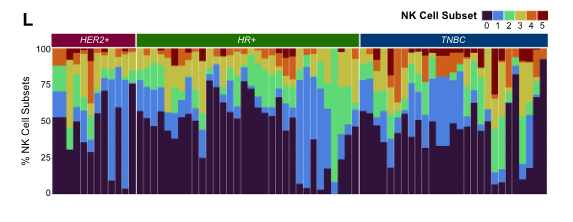

# A comprehensive single-cell breast tumor atlas defines epithelial and immune heterogeneity and interactions predicting anti-PD-1 therapy response

## Abstract

### 讲解：

我们展示了一个综合的单细胞RNA测序图谱，涵盖了原发性乳腺肿瘤微环境（TME），包含了来自八个数据集的119个活检样本中的236,363个细胞。在本研究中，我们利用这一资源进行多种免疫和癌症上皮细胞异质性的分析。我们通过六个亚群定义了乳腺TME中的自然杀伤（NK）细胞异质性。由于NK细胞异质性与上皮细胞异质性相关，我们在单基因表达、分子亚型以及反映肿瘤内转录异质性的10个类别的水平上对上皮细胞进行了表征。

我们开发了InteractPrint，考虑了癌症上皮细胞异质性如何影响癌症-免疫相互作用。我们使用T cell InteractPrint预测在两项乳腺癌临床试验中对免疫检查点抑制（ICI）的反应，这两项试验测试了新辅助抗PD-1疗法。T cell InteractPrint在两项试验中对反应的预测效果优于PD-L1（AUC = 0.82, 0.83 vs. 0.50, 0.72）。这一资源使对乳腺TME的高分辨率调查成为可能。

*****
### 比喻讲解：

我们可以把这个研究想象成一座大型音乐会的现场。

这座音乐会（乳腺肿瘤微环境）非常复杂，由八个不同的乐团（数据集）组成，共有119个乐手（活检样本），每个乐手都在演奏自己的乐器（细胞），总共有236,363个乐手。

在音乐会中，有一个特别的乐团演奏自然杀伤（NK）乐器。我们发现这个乐团内部有六种不同的演奏方式（六个亚群），每种方式都产生了不同的旋律（细胞异质性）。

此外，整个音乐会的主旋律（上皮细胞异质性）也非常复杂。我们通过单独聆听每个乐手的演奏（单基因表达）、分析不同类型的音乐风格（分子亚型），以及识别10种不同的变奏（反映肿瘤内转录异质性的10个类别），来理解主旋律的复杂性。

为了更好地理解整个音乐会的表现，我们开发了一种名为InteractPrint的工具，它就像一个智能的音乐指挥，能解析每个乐团之间的互动关系。我们特别使用了一个叫T cell InteractPrint的部分，来预测在两场特别的音乐比赛（乳腺癌临床试验）中，哪种音乐风格（抗PD-1疗法）会获得评委（免疫检查点抑制）的青睐。

结果表明，T cell InteractPrint在预测哪种音乐风格会赢得比赛中，比传统的评判方法（PD-L1）更准确（AUC = 0.82, 0.83 vs. 0.50, 0.72）。这个音乐会的记录（研究资源）将帮助我们进行更多高分辨率的音乐分析，进一步理解这场复杂的音乐会（乳腺肿瘤微环境）。

*****

### 问题：

在这项研究中，如何利用InteractPrint工具预测乳腺癌患者对免疫检查点抑制（ICI）疗法的反应？T cell InteractPrint与传统方法（PD-L1）的预测效果有何不同？

### 答案和讲解：

在这项研究中，研究人员开发了InteractPrint工具，用于分析癌症上皮细胞的异质性如何影响癌症-免疫相互作用。具体而言，他们使用了T cell InteractPrint部分来预测乳腺癌患者对免疫检查点抑制（ICI）疗法的反应。InteractPrint通过评估癌症上皮细胞与免疫细胞之间的相互作用，提供了对患者治疗反应的高准确性预测。

在两项乳腺癌临床试验中，研究人员测试了新辅助抗PD-1疗法的效果。结果显示，T cell InteractPrint在预测患者对ICI疗法的反应时，表现优于传统的PD-L1方法。T cell InteractPrint的预测准确性用AUC（曲线下面积）表示，在两项试验中的AUC分别为0.82和0.83，而PD-L1方法的AUC分别为0.50和0.72。这表明，T cell InteractPrint能够更准确地预测哪些患者会对免疫检查点抑制疗法有反应。

### 比喻讲解：

想象一个音乐比赛（乳腺癌临床试验），我们需要预测哪些乐手（患者）会在比赛中表现出色。传统的评判方法（PD-L1）就像是听乐手的前奏来做判断，结果往往不准确。而T cell InteractPrint就像一个智能的音乐指挥，它不仅听前奏，还能分析整个乐团（癌症上皮细胞和免疫细胞）的互动，从而更准确地预测乐手在比赛中的表现。这使得T cell InteractPrint在两场比赛中都能更好地预测哪些乐手会赢得比赛（对ICI疗法有反应），准确性显著高于传统方法。

*****
## Introduction

### 讲解：

乳腺癌是女性中最常见的癌症。乳腺癌的发展既受到癌症上皮细胞内在因素的驱动，也受到肿瘤微环境（TME）的影响。因此，乳腺癌的医疗治疗针对这些多种细胞群体，包括传统的化疗、靶向抑制癌细胞激素受体的药物、激酶、细胞周期入口和免疫细胞调节剂。为了进一步改进这些疗法，需要更深入地了解乳腺肿瘤的细胞和分子组成。

单细胞RNA测序（scRNA-seq）技术已被应用于更好地表征肿瘤微环境。对于乳腺癌，已经进行了几项scRNA-seq研究，以识别乳腺TME中的关键免疫细胞、癌细胞和基质细胞群体。这些研究提供了对癌细胞、多个免疫群体和其他基质细胞的分子表型的见解。然而，每项研究都受限于样本和细胞数量，这对全面分析TME中异质性细胞群体及其相互作用带来了挑战。

例如，自然杀伤（NK）细胞是抗肿瘤防御中关键的先天淋巴免疫细胞。在乳腺癌中，肿瘤浸润的NK细胞很稀少，在已发表的原发性乳腺肿瘤的scRNA-seq数据集中仅占总肿瘤细胞的1%到6%。它们的细胞毒性活动由一系列功能性激活和失活受体调节。肿瘤暴露后，NK细胞激活和失活受体的平衡可能会改变，导致它们失去细胞毒性活动或增殖能力，甚至可能促进肿瘤生长。由于大多数人类研究中处理的NK细胞数量较少，scRNA-seq分析常常无法捕捉它们的独特功能表型。

此外，乳腺癌在单个患者的肿瘤内和临床亚型患者之间存在显著的异质性。因此，全面分析癌症上皮细胞异质性需要大量和多样化的数据集，包含足够数量的所有临床乳腺癌亚型样本。

在这项研究中，我们创建了一个综合的乳腺TME的scRNA-seq图谱，包含来自八个公开可用数据集的119个活检样本中的236,363个细胞。这一资源使得能够在原发性乳腺肿瘤中分离细胞群体，并在单细胞水平上对细胞异质性进行稳健的表征。相比传统的原始数据集元分析，这一综合数据集在统计上更具力量，并能够评估与临床特征的相关性。我们利用这一资源定义了免疫和癌症上皮细胞的异质性及其相互作用。据我们所知，这是首次在乳腺癌中定义NK细胞亚群，并提供了癌症上皮细胞异质性影响免疫相互作用和抗PD-1疗法反应的证据。这个数据集提供了一个全面的资源，以更好地理解乳腺TME的组成。

*****

### 比喻讲解：

我们可以把这项研究比作一个大型的花园，而乳腺癌就是花园中的一部分。

这个花园里有各种各样的植物（细胞），有些植物是园主（癌症上皮细胞）自己种的，有些是花园的环境（肿瘤微环境）决定的。为了让花园里的植物健康生长，园丁（医生）需要用不同的工具和方法（化疗、靶向药物、免疫调节剂）来照顾这些植物。

单细胞RNA测序技术就像一个高科技的显微镜，帮助园丁观察每一株植物的细节。在乳腺癌花园里，已经有很多研究使用这个显微镜，发现了不同的植物类型（免疫细胞、癌细胞和基质细胞）。然而，每次观察的花园面积都很有限，这使得全面了解花园里的所有植物和它们之间的相互作用变得很困难。

例如，花园里有一种叫做NK细胞的植物，它们是花园的守护者，负责抵抗害虫（抗肿瘤防御）。但这些NK细胞在花园里非常稀少，仅占花园总植物的1%到6%。它们的守护能力受一系列开关（激活和失活受体）的控制。当花园受到害虫侵袭时，这些开关可能会失灵，导致NK细胞失去守护能力，甚至可能帮助害虫。

乳腺癌花园不仅在同一块地里有很大的差异（单个患者的肿瘤内异质性），不同花园（不同患者）之间的差异也很大。因此，要全面了解这些差异，需要对大量不同花园进行观察。

在这项研究中，我们创建了一个综合的乳腺癌花园图谱，包含来自八个不同花园的119块地，共计236,363株植物。这一资源使得我们能够在单个花园中分离不同的植物，并在单株植物的水平上详细观察它们的差异。相比以往的单独观察，这一综合图谱在统计上更具力量，并能够评估与花园健康状况（临床特征）的关系。我们利用这一资源定义了免疫细胞和癌症上皮细胞的异质性及其相互作用。据我们所知，这是首次在乳腺癌花园中定义NK细胞的不同种类，并提供了癌症上皮细胞异质性影响免疫相互作用和抗PD-1治疗效果的证据。这个图谱为更好地理解乳腺癌花园的组成提供了一个全面的资源。

*****

### 问题：

为什么在乳腺癌研究中，需要创建一个综合的单细胞RNA测序图谱？这个图谱在理解乳腺肿瘤微环境中的细胞异质性方面有什么优势？

### 答案和讲解：

在乳腺癌研究中，创建一个综合的单细胞RNA测序（scRNA-seq）图谱是因为单一研究中的样本和细胞数量有限，无法全面分析异质性细胞群体及其相互作用。综合图谱能够结合多个数据集，提供更大规模和多样化的细胞数据，从而更准确地表征肿瘤微环境（TME）中的细胞异质性。

这个综合图谱在理解乳腺肿瘤微环境中的细胞异质性方面有以下几个优势：
1. 提供更全面的细胞和分子信息，有助于识别和表征不同的细胞类型和它们的功能。
2. 增强了统计力量，使得在分析细胞群体和细胞间相互作用时更具可信度。
3. 允许研究人员评估细胞异质性与临床特征之间的关联，有助于预测治疗反应和患者预后。

### 比喻讲解：

想象一个大型花园（乳腺癌），其中有许多不同类型的植物（细胞）。单一研究就像是观察花园中的一个小角落，虽然可以看到一些植物，但无法全面了解整个花园的组成。而综合的单细胞RNA测序图谱就像是结合了多个观察视角，能够提供整个花园的全景图。

这个全景图的优势在于：
1. 可以识别花园中所有类型的植物，并了解它们各自的特性（细胞类型和功能）。
2. 增强了观察的细节，使得在分析植物之间的相互作用时更具信心（统计力量更强）。
3. 允许园丁（研究人员）评估植物的健康状况与花园的整体环境（临床特征）之间的关系，从而更好地照顾花园（预测治疗反应和患者预后）。

*****

## Results

### Fig.1a

### 结果描述：
图1a展示了处理和整合8个原发性乳腺癌数据集的概述。该数据集包含来自88名患者的119个样本，总计236,363个细胞。

### 图例描述：
图1a概述了处理和整合8个原发性乳腺癌数据集的流程。这个流程包括数据预处理，如过滤低质量细胞和双细胞（doublets），以及整合来自不同数据集的细胞数据。

### 关键结论：
- 通过整合多个数据集，研究团队能够生成一个综合的单细胞RNA测序图谱，这个图谱包含了大量的细胞数据，涵盖了各种临床亚型的乳腺癌样本。
- 整合的数据集显著增强了统计力量，使得能够进行更全面和准确的细胞异质性分析。
- 图1a展示了一个全面且详细的流程，确保数据集的质量和一致性，从而为后续分析打下了坚实的基础。

### 分析目的：
- 处理和整合多个数据集，以创建一个高分辨率的乳腺肿瘤微环境（TME）图谱。
- 提高统计力量，通过整合数据减少单一研究样本数量有限带来的局限性。
- 提供一个详细的流程图，展示如何确保数据的高质量和一致性，为后续的细胞异质性分析和临床特征关联分析提供可靠的数据基础。

*****

### 方法描述：

Figure 1A的方法描述了将8个公开可用的原发性乳腺癌数据集处理和整合成一个单一的综合数据集的过程。具体步骤如下：

1. **数据收集**：收集来自8个公开可用乳腺癌数据集的数据，这些数据集包含来自88名患者的119个样本，总计236,363个细胞。
2. **数据预处理**：对每个数据集单独进行预处理，包括过滤低质量细胞和双细胞（doublets）以确保数据的高质量。
3. **数据整合**：使用标准化的方法将所有预处理后的数据集整合成一个综合数据集，确保没有单个数据集或技术驱动的批处理效应。
4. **细胞类型识别**：通过三步流程识别和标记细胞类型，包括根据经典细胞标记的特征分数、标记数量与平均表达水平、以及单独标记基因的最大平均表达水平来进行分类。
5. **可视化**：使用UMAP（统一流形近似和投影）技术进行可视化，展示整合后数据集中细胞的分类和分布情况。

### 比喻讲解：

我们可以将这个方法比作一个大型音乐会的筹备过程：

1. **数据收集**：首先，我们从八个不同的音乐团体（数据集）中收集了演出曲目（数据），这些曲目由88名音乐家（患者）的119段演出（样本）组成，总共236,363段音轨（细胞）。
2. **数据预处理**：接下来，我们对每个音乐团体的曲目进行预处理，就像音响师会过滤掉录音中的噪音和重复部分（低质量细胞和双细胞），以确保每段音轨的高质量。
3. **数据整合**：然后，我们使用标准化的音频处理技术，将所有音乐团体的曲目整合成一个完整的音乐专辑（综合数据集），确保没有一个音乐团体的曲目或录音技术影响整个专辑的质量（消除批处理效应）。
4. **细胞类型识别**：我们通过三步流程来识别和标记每段音轨的类型（细胞类型），就像音乐评论家会根据曲目的特点、乐器数量与演奏风格，以及单独乐器的表现水平来进行分类。
5. **可视化**：最后，我们使用UMAP技术将整合后的音乐专辑进行可视化展示，像是将所有音轨按照类别和分布情况制作成一个音乐地图，让听众能够一目了然地看到每段曲目的分类和分布。

*****

### Fig.1b

### 结果描述：

图1b展示了通过UMAP（统一流形近似和投影）技术对236,363个细胞的可视化结果。这些细胞来自119个样本，涵盖了所有临床亚型的乳腺癌。图中细胞按系谱（lineage）进行了聚类，其中免疫细胞和基质细胞聚集在一起，而上皮细胞则根据其亚型进行分离。

### 图例描述：

图1b的UMAP可视化展示了综合数据集中所有细胞的分布情况。图中展示了主要的细胞群体，包括免疫细胞、基质细胞和上皮细胞。不同的细胞群体在图中形成了明显的聚类，免疫细胞和基质细胞跨越临床亚型聚集在一起，而上皮细胞则根据其分子亚型表现出分离。

### 关键结论:

- 综合数据集中的细胞根据系谱进行聚类，显示了不同细胞类型之间的明显分离。
- 免疫细胞和基质细胞在所有临床亚型中表现出相似的聚类，而上皮细胞则根据其分子亚型进行分离。
- 这一结果验证了其他研究中的发现，说明在乳腺肿瘤微环境中，不同类型细胞的分布具有一致性。

### 分析目的：

图1b的目的是通过可视化展示综合数据集中不同类型细胞的聚类情况，验证数据的整合效果，并揭示乳腺癌肿瘤微环境中细胞类型的分布和异质性。这有助于进一步理解乳腺肿瘤微环境的组成，并为后续的细胞异质性和相互作用研究提供基础数据。

*****

### 方法描述：
图1b使用统一流形逼近与投影（UMAP）技术对119个乳腺癌样本中的236,363个细胞进行可视化。每个样本分别处理以过滤低质量细胞和双细胞，然后将所有数据集整合在一起。细胞类型通过三步流程识别：基于经典细胞标志物的特征评分、标志物计数与平均表达相结合以及单个标志基因的最高平均表达。UMAP可视化显示了按系谱聚类的细胞群体，免疫和基质细胞跨临床亚型聚类，而上皮细胞则按亚型分离。

### 比喻讲解：
我们可以将这个方法比作组织一场大型的音乐会。

首先，每个样本就像是一个独立的乐团，里面有各种乐手（细胞）。在准备音乐会之前，我们需要确保每个乐手都在演奏好的音符（过滤低质量细胞和双细胞）。然后，我们将来自不同乐团的所有乐手集合在一起（整合数据集）。

接下来，我们需要识别这些乐手的类型。我们使用了三步流程：
1. **听他们演奏的主要旋律**（基于经典细胞标志物的特征评分）。
2. **计数并衡量他们演奏的音符数量和音量**（标志物计数与平均表达相结合）。
3. **找到他们演奏最突出的音符**（单个标志基因的最高平均表达）。

一旦识别了所有乐手，我们就用一种称为UMAP的技术来为整个音乐会做可视化展示。UMAP就像是一个智能的座位安排系统，它根据乐手的演奏类型和风格将他们安排在合适的位置上。

结果就是，我们可以看到不同类型的乐手如何聚集在一起。例如，弦乐器组（免疫和基质细胞）跨越不同的乐团（临床亚型）聚集在一起，而不同风格的打击乐手（上皮细胞）则根据他们的风格（亚型）分布在不同的区域。这样，我们就可以一目了然地看到整个音乐会的演奏情况以及不同乐手之间的关系。

*****
### Fig.1c

### 结果描述：
图1c使用UMAP可视化展示了在综合单细胞RNA测序数据集中识别的主要自然杀伤（NK）细胞子集。这些子集是通过无监督图形聚类分析方法从乳腺肿瘤微环境（TME）中分离出来的。

### 图例描述：
图1c展示了通过UMAP可视化的主要NK细胞子集。这些子集是基于综合单细胞RNA测序数据集，通过无监督图形聚类方法识别的。图中不同颜色的点代表不同的NK细胞子集。

### 关键结论:
- 通过综合单细胞RNA测序数据集和无监督图形聚类分析，成功识别并可视化了乳腺肿瘤微环境中的主要NK细胞子集。
- 这些识别的NK细胞子集展现了在乳腺肿瘤微环境中的异质性。

### 分析目的：
- 识别乳腺肿瘤微环境中的主要NK细胞子集，揭示其在肿瘤微环境中的多样性和功能特征。
- 通过无监督图形聚类和UMAP可视化方法，为研究人员提供一种直观的方式来观察和分析NK细胞在乳腺肿瘤中的分布和异质性。
- 为进一步研究这些NK细胞子集的功能和在抗肿瘤免疫中的角色提供基础。

*****

### 方法描述：
图1c展示了利用无监督图形聚类方法对整合数据集中自然杀伤（NK）细胞的重新聚类过程。具体步骤如下：

1. **数据预处理**：首先对整合数据集中的NK细胞进行过滤，去除低质量细胞和双细胞。
2. **特征提取**：提取NK细胞中特定的基因表达特征，用于后续聚类分析。
3. **聚类分析**：使用无监督图形聚类方法对提取的特征进行分析，识别出6个不同的NK细胞亚群（NK-0到NK-5）。
4. **可视化**：通过UMAP（统一流形近似和投影）方法对聚类结果进行可视化展示，显示NK细胞在不同亚群中的分布情况。

### 比喻讲解：
想象你正在一个巨大的图书馆中，图书馆里有许多不同种类的书籍。你的任务是将这些书籍按照它们的主题重新整理分类。

1. **数据预处理**：首先，你需要检查每本书的状态，去除那些破损的或者属于其他图书馆的书籍，以确保你只处理高质量的书籍。
2. **特征提取**：接下来，你仔细阅读每本书的内容，标记出书籍中提到的一些关键字或主题，比如“历史”、“科学”、“文学”等。这些关键字就像NK细胞中特定基因的表达特征。
3. **聚类分析**：然后，你使用这些标记的关键字来将书籍分组。你采用了一种先进的无监督分类算法，就像是一个智能图书管理员，能够根据书籍内容的相似性将它们自动分类。最后，你发现了六个主要的书籍类别，比如“科学书籍组”、“历史书籍组”等。
4. **可视化**：为了让其他人也能清楚地看到你的分类结果，你制作了一张图书分类的展示图。你使用了一种叫做UMAP的方法，这就像是一种特殊的地图，可以展示每本书在图书馆中的位置以及它属于哪个类别。这样，大家一目了然地就能看到不同类别的书籍是如何分布的。

*****

### Fig.1d

### 结果描述：
图1d展示了每个主要NK细胞亚群的差异基因表达。具体而言，图中通过气泡热图显示了每个NK细胞亚群中上调表达的特征基因。气泡的大小表示基因表达的细胞比例，颜色强度表示基因表达水平。

### 图例描述：
图1d是一个气泡热图，用于显示在六个NK细胞亚群（NK-0到NK-5）中差异表达的基因。每个气泡表示一个基因在相应NK细胞亚群中的表达情况，气泡的大小表示该基因在细胞中的表达比例，颜色的深浅表示该基因的表达水平，颜色越深表示表达水平越高。

### 关键结论:
- 通过差异基因表达分析，可以清晰地识别出每个NK细胞亚群的特征基因，这些基因在相应亚群中显著上调表达。
- 不同NK细胞亚群展示了独特的基因表达模式，表明它们在功能上可能存在显著差异。例如，NK-0和NK-2亚群高表达FCGR3A（CD16）和溶解分子（如颗粒酶和PRF1），而NK-1亚群则显示出NR4A家族基因的高表达，这些基因与细胞毒性减弱相关。

### 分析目的：
- 通过展示每个NK细胞亚群的特征基因表达，图1d的目的是提供一个全面的视图，揭示不同NK细胞亚群的分子特征。
- 这有助于进一步理解NK细胞在乳腺肿瘤微环境中的多样性和功能分化，为研究NK细胞在肿瘤免疫中的作用提供了重要的基础数据。
- 这些结果也为未来的功能研究提供了线索，帮助确定哪些基因可能在NK细胞的抗肿瘤活性或调节功能中起关键作用。

*****

### 方法描述：
图1d展示了使用气泡热图显示每个主要NK细胞亚群上调的差异表达基因。研究人员首先通过单细胞RNA测序（scRNA-seq）技术对整合的数据集中的NK细胞进行无监督的图形聚类，识别出六个NK细胞亚群（NK-0到NK-5）。然后，他们对这些NK细胞亚群进行了差异基因表达分析，以确定每个亚群中上调的基因。这些上调的基因通过气泡热图显示，气泡的大小表示基因表达的幅度，颜色表示表达水平。

### 比喻讲解：
我们可以将这个方法比作一个图书馆管理系统，图书馆中有成千上万的书籍（NK细胞），每本书属于不同的类别（NK细胞亚群）。

1. **图书分类**：首先，我们使用一个智能系统（无监督图形聚类）对图书进行分类，最终将所有书籍分为六个类别（NK-0到NK-5）。

2. **找出热门书籍**：接下来，我们想知道每个类别中最受欢迎的书籍（上调的差异表达基因）。我们通过分析借阅记录（基因表达数据），找出每个类别中借阅次数最多的书籍（上调基因）。

3. **显示热门书籍**：为了更直观地展示结果，我们使用一种特殊的展示方式（气泡热图）。在这个展示中，每本热门书籍都用一个气泡表示，气泡的大小表示书籍的受欢迎程度（基因表达幅度），颜色表示借阅频率（表达水平）。

4. **图书馆的全景图**：最终，我们得到了一个展示每个图书类别中最受欢迎书籍的全景图（图1d）。通过这个图，我们可以一目了然地看到不同类别中哪些书籍最受欢迎，从而更好地了解图书馆的借阅趋势（NK细胞的功能特性）。

这种方法不仅帮助我们了解每个NK细胞亚群的独特功能，还为进一步研究这些细胞在肿瘤微环境中的作用提供了重要信息。

*****

### Fig.1e

### 结果描述：
图1e展示了在每个NK细胞亚群中重新编程NK（rNK）细胞特征的表达。结果显示，NK-1亚群的rNK细胞特征表达显著高于其他所有NK细胞亚群。

### 图例描述：
图1e是一个箱线图（boxplot），展示了在六个NK细胞亚群（NK-0到NK-5）中，重新编程NK（rNK）细胞特征的表达水平。横轴表示六个NK细胞亚群，纵轴表示rNK细胞特征的表达水平。统计分析结果显示，NK-1亚群的rNK细胞特征表达显著高于其他所有亚群，Kruskal-Wallis检验的p值小于0.0001。

### 关键结论:
- NK-1亚群在rNK细胞特征的表达方面显著高于其他NK细胞亚群。这表明NK-1亚群可能在肿瘤微环境中具有独特的功能特性，特别是与肿瘤相关的重新编程现象。

### 分析目的：
- 通过比较不同NK细胞亚群中rNK细胞特征的表达水平，确定哪些NK细胞亚群在肿瘤微环境中可能具有独特的功能特性。
- 这一分析有助于理解不同NK细胞亚群在肿瘤微环境中的作用，为进一步研究NK细胞在肿瘤免疫中的角色提供线索。通过识别具有高rNK特征表达的NK细胞亚群，可以更好地了解其在肿瘤发展和免疫逃逸中的潜在机制。

*****

### 方法描述：

图1e展示了通过生成rNK（重新编程的自然杀伤细胞）签名并将其应用于不同NK细胞亚群的方法。具体步骤如下：

1. 首先，从先前的实验中生成小鼠rNK细胞的签名。这些实验比较了健康NK细胞和肿瘤暴露的NK细胞的转录组，发现了肿瘤促进和重新编程的NK细胞。
2. 将小鼠的rNK细胞签名转换为人类的对应版本。
3. 将人类rNK细胞签名应用于整合数据集中的NK细胞亚群。
4. 对比分析表明，NK-1亚群在rNK签名中的得分显著高于其他NK细胞亚群（p < 0.0001）。
5. 差异基因表达分析显示，rNK细胞相比于非rNK细胞在NR4A家族基因、FOS、JUN和DUSP1等基因上具有显著差异。

### 比喻讲解：

想象你在一个大型音乐会上，需要找出哪些音乐家被重新训练过并且演奏风格发生了显著变化。你知道这些重新训练过的音乐家会演奏特定的曲调（rNK签名）。

1. 首先，你回顾了先前的一场音乐会（实验），在那场音乐会上你记录了健康音乐家的演奏（健康NK细胞）和被重新训练的音乐家的演奏（肿瘤暴露的NK细胞），并生成了一份曲调列表（小鼠rNK细胞签名）。
2. 然后，你把这份曲调列表转换成新的乐谱，使其适用于当前的音乐会（人类rNK签名）。
3. 接着，你拿着这份新的乐谱去检查当前音乐会中的每个乐手（NK细胞亚群），看看他们的演奏中有多少符合这份新的乐谱（应用rNK签名）。
4. 通过比较你发现，某个特定的乐队（NK-1亚群）演奏的曲调与新的乐谱非常匹配，他们的表现得分显著高于其他乐队（p < 0.0001）。
5. 最后，你深入分析这些乐手（rNK细胞）的演奏风格，发现他们在某些特定音符（NR4A家族基因、FOS、JUN和DUSP1等基因）上的表现与其他乐手（非rNK细胞）显著不同。

通过这种方式，你成功地找出了哪些音乐家（NK细胞）在当前的音乐会上被重新训练过，并且详细记录了他们的演奏特征。

*****

### fig.1f

### 结果描述：
图1f展示了rNK（重编程NK细胞）与非rNK细胞之间的差异表达基因的MA图。结果显示NR4A家族（NR4A1, NR4A2, NR4A3）、FOS、JUN和DUSP1等基因在rNK细胞中显著上调。红点代表在rNK细胞中上调的基因，蓝点代表在非rNK细胞中上调的基因。

### 图例描述：
图1f中的MA图（平均对数比图）展示了rNK细胞和非rNK细胞之间的差异表达基因。x轴表示基因的平均表达水平，y轴表示基因的对数比值（log2 fold change）。红色点表示在rNK细胞中显著上调的基因，蓝色点表示在非rNK细胞中显著上调的基因。图中标注了几种关键基因，如NR4A家族、FOS、JUN和DUSP1。

### 关键结论:
- rNK细胞与非rNK细胞相比，具有显著不同的基因表达谱。
- 特别是NR4A家族、FOS、JUN和DUSP1基因在rNK细胞中显著上调，表明这些基因在rNK细胞的重编程过程中起重要作用。

### 分析目的：
- 确定rNK细胞与非rNK细胞之间的差异表达基因，揭示rNK细胞的特异性基因特征。
- 通过识别和比较这些基因，提供对rNK细胞功能和潜在机制的深入理解，有助于阐明NK细胞在肿瘤微环境中的角色及其重编程过程。

*****

### 方法描述：

Fig. 1f展示了重新编程的NK细胞（rNK）与非重新编程的NK细胞（non-rNK）之间差异表达基因（DEGs）的MA图。这个图的生成过程如下：

1. **数据收集与预处理**：从人类乳腺癌患者的样本中分离出NK细胞，利用单细胞RNA测序技术测定这些细胞的转录组。
2. **重新编程NK细胞的定义**：通过对比肿瘤暴露的NK细胞和健康NK细胞的转录组，确定重新编程NK细胞的特征基因。
3. **差异表达分析**：使用统计学方法比较rNK和non-rNK细胞的基因表达，找出显著差异表达的基因。
4. **MA图的绘制**：将每个基因的log2 fold change（对数折叠变化，表示基因表达变化的倍数）与平均表达量绘制成图，标出差异表达显著的基因。

### 比喻讲解：

可以将这个方法过程比作一个大型图书馆的书籍整理和分类工作。

1. **数据收集与预处理**：
- 想象你从一个巨大的图书馆（乳腺癌患者样本）中收集了许多书籍（NK细胞）。
- 你通过检查每本书的内容（利用单细胞RNA测序技术），记录下每本书的详细信息（转录组数据）。

2. **重新编程NK细胞的定义**：
- 你把这些书分为两组：一组是受到了特殊训练（重新编程）的书，另一组是普通书（健康NK细胞）。
- 你对比这两组书的目录，找出那些在训练后变得特别有用的章节（重新编程NK细胞的特征基因）。

3. **差异表达分析**：
- 接下来，你比较两组书的内容，找出那些在训练后显著变化的章节（差异表达基因）。
- 你使用一种统计方法，确保这些变化不是偶然的，而是真实的差异。

4. **MA图的绘制**：
- 最后，你绘制一张图表（MA图），横轴表示每个章节的平均重要性（平均表达量），纵轴表示章节的重要性变化（对数折叠变化）。
- 你用不同的颜色或标记，突出显示那些在训练后变得特别有用或不再重要的章节（显著差异表达的基因）。

通过这种方式，你就能清晰地看到哪些基因在NK细胞重新编程后发生了显著变化，从而理解重新编程对NK细胞功能的影响。

*****

### Fig.1g

### 结果描述：

图1g展示了rNK（重新编程的自然杀伤细胞）签名在不同乳腺癌临床亚型中的表达水平。通过箱线图比较了各个临床亚型中rNK签名的表达水平，结果显示在所有亚型之间没有显著差异（Kruskal-Wallis p > 0.05）。

### 图例描述：

图1g的箱线图展示了rNK细胞签名在不同乳腺癌临床亚型中的表达水平。每个箱线图代表一个临床亚型，箱线图的中位数线、四分位范围和数据点显示了rNK签名在不同亚型中的分布情况。统计分析结果（Kruskal-Wallis p值）显示各亚型之间没有显著差异。

### 关键结论:

- rNK细胞签名在不同乳腺癌临床亚型中的表达水平没有显著差异。这表明rNK细胞的重新编程现象不是由特定的乳腺癌临床亚型驱动的，而是一个普遍存在的现象。

### 分析目的：

图1g的分析目的是确定rNK细胞签名的表达水平是否在不同的乳腺癌临床亚型中有所不同。通过比较各个临床亚型中的rNK签名表达水平，研究人员能够评估rNK细胞的重新编程现象是否与特定的乳腺癌亚型相关。结果显示，rNK签名在各个乳腺癌临床亚型中均无显著差异，这表明rNK细胞的重新编程现象是一个普遍存在的现象，而不是由特定的临床亚型驱动的。

*****

### 方法描述：
Fig.1g展示了使用Kruskal-Wallis检验和Pearson相关性分析的方法，以评估rNK（reprogrammed NK）细胞特征在不同乳腺癌临床亚型中的表达差异。具体步骤如下：

1. **样本分组**：将包含rNK细胞的样本按乳腺癌临床亚型分组。
2. **统计分析**：使用Kruskal-Wallis检验比较各组间rNK细胞特征表达的差异。
3. **Pearson相关性分析**：计算rNK细胞特征表达水平与年龄之间的Pearson相关系数，以评估年龄与rNK细胞表达的相关性。

### 比喻讲解：

想象你在一个大型音乐会现场，有不同的乐队（乳腺癌临床亚型），每个乐队都有一些特殊的乐手（rNK细胞）。你想知道这些特殊乐手在不同乐队中的表现是否有所不同，以及他们的表现是否与他们的年龄（患者年龄）相关。

1. **样本分组**：首先，你将这些乐手按照他们所属的乐队（乳腺癌临床亚型）进行分组。每个乐队可能有很多乐手，你需要分别统计每个乐队中这些特殊乐手的表现。
2. **统计分析**：接下来，你使用一种叫做Kruskal-Wallis检验的方法来比较不同乐队中这些乐手的表现。这个方法类似于将每个乐队的表演评分，然后比较这些评分是否有显著差异。
3. **Pearson相关性分析**：最后，你想知道这些乐手的表现是否与他们的年龄相关。因此，你使用Pearson相关性分析，这就像是检查乐手的年龄与他们的表演评分之间的关系，看看是否存在某种模式，比如年长的乐手表现是否更好或者更差。

通过这些分析，你可以得出结论，了解不同乐队中这些特殊乐手的表现差异，并且知道他们的表现是否与年龄相关。这种方法帮助你更好地理解音乐会（乳腺癌微环境）中这些乐手的特性和影响因素。

*****

### fig.1h

### 结果描述：

Fig. 1h展示了不同乳腺癌临床亚型中重新编程的NK细胞（rNK）与癌症上皮细胞之间的受体-配体对（receptor-ligand pairs）的预测结果。这些配对在各临床亚型中都存在。每个受体-配体对由不同的颜色表示，共享的受体-配体对用红色标记。

### 图例描述：

Fig. 1h使用环状图（Circos plot）展示了重新编程的NK细胞与乳腺癌上皮细胞之间的代表性受体-配体对的预测结果。不同的颜色表示不同的受体-配体对，红色表示在所有临床亚型中共享的受体-配体对。

### 关键结论：

- 重新编程的NK细胞与乳腺癌上皮细胞之间存在多个受体-配体对，这些对在不同的乳腺癌临床亚型中均有出现。
- 共享的受体-配体对表明，不同临床亚型中的NK细胞和上皮细胞之间有共同的相互作用机制。

### 分析目的：

- 通过分析rNK细胞与癌症上皮细胞之间的受体-配体对，研究人员旨在揭示这些细胞之间的相互作用如何在不同的乳腺癌临床亚型中发挥作用。
- 识别并表征这些受体-配体对，特别是共享的对，可以提供关于乳腺癌微环境中免疫反应和肿瘤进展的深入理解，为开发新的治疗策略提供线索。

*****
### 方法描述：
图1h展示了使用Circos图显示在不同乳腺癌临床亚型中，重新编程的自然杀伤（rNK）细胞与癌症上皮细胞之间的预测受体-配体对。具体方法如下：

1. **数据准备**：提取rNK细胞和癌症上皮细胞的单细胞RNA测序数据。
2. **基因表达分析**：识别rNK细胞和癌症上皮细胞中显著表达的受体和配体基因。
3. **受体-配体对预测**：基于已知的受体-配体相互作用数据库，预测rNK细胞与癌症上皮细胞之间可能的受体-配体对。
4. **数据整合**：将所有预测的受体-配体对整合到不同的乳腺癌临床亚型中，确保每个亚型都包含相关的数据。
5. **Circos图绘制**：使用Circos图将所有预测的受体-配体对可视化，显示rNK细胞与不同临床亚型的癌症上皮细胞之间的相互作用。

### 比喻讲解：
想象一个大型交响乐团的演奏会，每种乐器（细胞）都在演奏自己的旋律（基因表达）。为了理解这些乐器之间的配合（细胞相互作用），我们需要做以下工作：

1. **数据准备**：首先，我们需要给每个乐器（细胞）单独录音，确保捕捉每一个音符（基因表达数据）。
2. **基因表达分析**：然后，我们仔细聆听每个录音，识别出每种乐器（细胞）中特别突出的音符（显著表达的受体和配体基因）。
3. **受体-配体对预测**：接着，我们查阅音乐理论书籍（已知的受体-配体相互作用数据库），预测哪些乐器（细胞）之间的旋律（受体-配体对）会和谐地配合。
4. **数据整合**：我们把所有乐器（细胞）的录音和预测的旋律配合（受体-配体对）整合在一起，根据不同的乐章（乳腺癌临床亚型）进行分类，确保每个乐章都包含相关的旋律。
5. **Circos图绘制**：最后，我们使用一个特别的乐谱（Circos图），展示所有乐器（细胞）之间的配合（受体-配体对），让我们可以直观地看到每个乐器（细胞）在不同乐章（临床亚型）中的表现和互动。

*****

### Fig.1i

### 结果描述：
图1i显示了重编程的自然杀伤（rNK）细胞基因表达与非重编程的NK（non-rNK）细胞基因表达之间的Pearson相关性。在所有乳腺癌临床亚型中，rNK细胞与rNK细胞之间的基因表达相关性显著高于rNK细胞与non-rNK细胞之间的相关性。

### 图例描述：
图1i中的盒须图（boxplot）展示了不同乳腺癌临床亚型中，重编程的NK细胞（rNK细胞）与非重编程的NK细胞（non-rNK细胞）的基因表达Pearson相关性。图中显示rNK细胞之间的相关性显著高于rNK细胞与non-rNK细胞之间的相关性（双侧Wilcoxon检验，****p < 0.0001）。

### 关键结论:
- rNK细胞与其他rNK细胞之间的基因表达相关性显著高于与non-rNK细胞之间的相关性。
- 这一结果表明，rNK细胞具有独特的基因表达特征，与非重编程的NK细胞明显不同。

### 分析目的：
- 确认重编程的NK细胞（rNK细胞）在基因表达上的独特性和一致性。
- 通过比较rNK细胞与non-rNK细胞的基因表达相关性，验证rNK细胞在乳腺癌临床亚型中的特异性表达模式。
- 为进一步研究rNK细胞的功能特性及其在乳腺癌免疫环境中的作用提供基础数据。

*****

### 方法描述：

Fig.1i的目的是展示重新编程的NK细胞（rNK）与非重新编程的NK细胞相比，在基因表达上的相关性。研究团队首先计算了rNK细胞的基因表达谱，然后比较了rNK细胞与其他非rNK细胞之间的基因表达相关性。为了进行这种比较，他们使用了Pearson相关系数来量化基因表达水平之间的相关性。结果显示，rNK细胞之间的基因表达相关性显著高于rNK细胞与非rNK细胞之间的相关性。

### 比喻讲解：

我们可以把这个过程想象成一个音乐爱好者的聚会，每个音乐爱好者都喜欢不同的音乐类型。在这次聚会中，有一群特别喜欢古典音乐的爱好者（rNK细胞），他们之间的音乐品味非常相似（高相关性）。为了更好地理解这些古典音乐爱好者的共同点，研究人员（音乐评论家）决定比较这些爱好者之间的音乐品味，并将其与其他喜欢不同类型音乐的爱好者（非rNK细胞）进行对比。

具体的实现过程如下：
1. **收集数据**：音乐评论家首先收集了所有参加聚会的音乐爱好者的音乐播放列表（基因表达数据）。
2. **确定特别群体**：然后，他们识别出特别喜欢古典音乐的那一群人（rNK细胞）。
3. **计算相关性**：接着，评论家计算这些古典音乐爱好者之间的播放列表相似度（基因表达相关性），用Pearson相关系数来量化。
4. **对比分析**：最后，他们将这些古典音乐爱好者之间的相似度与他们和其他音乐爱好者之间的相似度进行对比。

结果显示，古典音乐爱好者之间的播放列表相似度（基因表达相关性）显著高于他们和其他音乐爱好者之间的相似度。这表明这些古典音乐爱好者在音乐品味上有着非常高的一致性，这与rNK细胞在基因表达上的高相关性类似。

*****
### fig.1j

### 结果描述：

Fig.1j展示了重新编程的NK细胞（rNK细胞）比例与样本年龄之间的Pearson相关性。图中使用散点图显示每个样本的rNK细胞比例，并绘制了一条回归线来表示相关性。结果显示，样本中rNK细胞的比例与样本年龄之间存在正相关性，Pearson相关系数为0.33，p值小于0.01。

### 图例描述：

Fig.1j的图例部分包括以下内容：
- 散点图显示了每个样本中rNK细胞比例与样本年龄之间的关系。
- 横轴（X轴）表示样本年龄。
- 纵轴（Y轴）表示rNK细胞的比例。
- 散点代表每个样本的具体数据点。
- 回归线表示rNK细胞比例与样本年龄之间的线性关系。
- 图中注有Pearson相关系数（R = 0.33）和p值（p < 0.01），表明相关性显著。

### 关键结论:

- 样本中rNK细胞的比例与样本年龄之间存在显著的正相关关系。
- 年龄较大的样本中，rNK细胞的比例更高，这表明随着年龄的增长，rNK细胞在肿瘤微环境中的比例可能增加。

### 分析目的：

- 确定重新编程的NK细胞（rNK细胞）比例是否与患者的年龄相关。
- 探索rNK细胞在不同年龄段样本中的分布情况，以了解其在肿瘤微环境中潜在的年龄依赖性变化。
- 为后续研究提供基础数据，进一步分析rNK细胞比例与临床特征（如年龄）之间的关系，从而更好地理解rNK细胞在肿瘤发展和免疫应答中的作用。

*****

### 方法描述：
图1j展示了通过散点图分析样本中重新编程的NK（rNK）细胞比例与年龄之间的Pearson相关性。具体步骤如下：
1. 生成rNK细胞的特征基因签名。
2. 使用这些特征基因签名在样本中识别rNK细胞。
3. 计算每个样本中rNK细胞的比例。
4. 使用Pearson相关性分析rNK细胞比例与患者年龄之间的关系。
5. 绘制散点图，展示样本中rNK细胞比例与年龄之间的相关性。

### 比喻讲解：
可以将这一过程比作在花园中分析不同植物的生长情况：

1. 首先，你在花园中确定了一些特殊的植物类型（rNK细胞），这些植物有着独特的叶子和花朵（特征基因签名）。
2. 接下来，你在花园的各个角落搜寻这些特殊植物，并记录下它们的数量。
3. 然后，你计算出每块花园中这种植物所占的比例。
4. 你希望了解这些植物的生长情况是否与某些环境因素有关，比如日照时间（患者年龄）。
5. 于是，你将每块花园中这种植物的比例与该块花园的日照时间进行比较，并绘制成图表，查看它们之间是否存在某种规律。

通过这种方式，你可以直观地看到植物的生长情况与环境因素之间的关系，从而得出有助于花园管理的结论。图1j中的方法也是类似，研究人员通过分析rNK细胞的比例与患者年龄之间的关系，试图揭示两者之间的潜在联系。

*****

### fig.1k

### 结果描述：
图1k展示了使用Kaplan-Meier生存分析，比较了在乳腺癌患者中，rNK细胞基因签名表达水平高的患者与低表达患者的总体生存情况。结果表明，在具有较高rNK细胞基因签名表达的肿瘤中，患者的总体生存率较差（log-rank检验，p < 0.05）。

### 图例描述：
图1k是Kaplan-Meier生存曲线图，展示了乳腺癌患者中rNK细胞基因签名表达水平与总体生存率之间的关系。图中分为两条曲线，分别代表rNK细胞基因签名高表达和低表达的患者组，横轴表示时间，纵轴表示总体生存率。p值（log-rank检验）用于评估两组生存曲线之间的显著性差异。

### 关键结论：
- 在乳腺癌患者中，具有高水平rNK细胞基因签名表达的患者总体生存率显著低于低表达的患者。
- rNK细胞基因签名的表达水平可以作为乳腺癌患者预后的一个重要指标。

### 分析目的：
- 通过Kaplan-Meier生存分析，评估rNK细胞基因签名表达水平与乳腺癌患者总体生存率之间的关系。
- 验证rNK细胞基因签名的表达水平是否可以作为预测乳腺癌患者预后的一个有价值的生物标志物。
- 提供进一步的证据支持rNK细胞在乳腺肿瘤微环境中潜在的不良影响，并推动开发针对这些细胞的新疗法。

*****

### 方法描述：

图1k展示了整合数据集的前20个主成分（PCs）的平均主成分加载值，按捕获技术（例如不同单细胞RNA测序技术平台）进行分层。此方法通过主成分分析（PCA）来评估整合数据集的批次效应。具体步骤如下：

1. **数据预处理和整合**：首先，将来自不同数据集的单细胞RNA测序数据进行预处理，包括去除低质量细胞和双细胞（doublets），然后整合这些数据。
2. **主成分分析（PCA）**：对整合的数据集进行PCA，计算每个细胞的主成分得分。PCA是一种降维技术，用于将高维数据投影到一组不相关的变量（即主成分）上，以捕捉数据的主要变异。
3. **计算平均主成分加载值**：计算每个捕获技术平台在前20个主成分上的平均主成分加载值。这些加载值表示每个平台在每个主成分上的贡献。
4. **结果可视化**：使用小提琴图展示不同技术平台在前20个主成分上的平均主成分加载值分布，以评估批次效应的存在和大小。

### 比喻讲解：

想象你正在组织一个大型音乐比赛，不同的音乐家（细胞）使用不同的乐器（单细胞RNA测序技术平台）演奏。你希望确保评委（分析工具）能够公平地评判每个音乐家的表现，而不受乐器类型的影响。

1. **准备工作**：首先，你需要确保每个音乐家的乐谱（数据）是完整和清晰的。因此，你会去掉那些不完整或模糊的乐谱（低质量细胞和双细胞），然后将所有乐谱整合在一起。
2. **主成分分析（PCA）**：接下来，你邀请了一个音乐专家（PCA），他能够识别出这些乐谱中最重要的旋律和节奏（主成分）。这些主成分就像是捕捉了乐谱中最主要的变异。
3. **计算平均主成分加载值**：专家会评估每种乐器在演奏这些主要旋律和节奏时的表现（主成分加载值）。他会计算每种乐器在前20个主要旋律和节奏上的平均表现。
4. **结果可视化**：最后，你使用一组特殊的图表（小提琴图）来展示这些乐器在前20个主要旋律和节奏上的平均表现。这些图表帮助你评估不同乐器是否对比赛的整体结果有不公平的影响（批次效应）。

通过这个过程，你确保比赛结果是公平和公正的，不会因为使用不同的乐器而有所偏差。这就类似于在单细胞RNA测序数据分析中，通过PCA和平均主成分加载值的计算，评估和校正批次效应，从而确保整合数据的质量和一致性。

*****

### fig.1l

### 结果描述：

图1l展示了在整合的单细胞RNA测序数据集中，不同乳腺癌样本和临床亚型中的自然杀伤（NK）细胞亚群的相对比例。条形图显示了每个肿瘤样本中六个NK细胞亚群（NK-0到NK-5）的相对比例。

### 图例描述：

图1l是一个条形图，展示了不同乳腺癌样本和临床亚型中六个NK细胞亚群（NK-0到NK-5）的相对比例。每个条形代表一个乳腺癌样本，颜色编码表示不同的NK细胞亚群。条形的高度表示相对比例。

### 关键结论:

- 不同乳腺癌样本中NK细胞亚群的比例存在显著的异质性。
- 没有单一的NK细胞亚群被某一个患者主导，并且所有NK细胞亚群在各乳腺癌临床亚型中均有存在。
- 使用ROGUE分析量化的NK细胞亚群异质性在某些临床亚型中显著更高，表明不同亚型间的NK细胞组成存在差异。

### 分析目的：

图1l的目的是展示和量化乳腺癌样本和临床亚型中NK细胞亚群的异质性。通过展示不同样本中各NK细胞亚群的相对比例，研究人员能够理解乳腺癌中NK细胞的多样性及其在不同临床亚型中的分布。这有助于揭示NK细胞在乳腺肿瘤微环境中的作用以及它们对抗肿瘤反应的潜在影响。

*****

### 方法描述：
图1l展示了在综合数据集中分析患者间NK细胞亚群比例差异的方法。研究人员首先将NK细胞从整合数据集中重新聚类，然后对每个患者样本中的NK细胞亚群进行分类和统计，计算每个亚群在不同患者中的比例。接下来，研究人员通过ROGUE分析量化NK细胞亚群异质性，并使用柱状图展示不同患者之间和不同乳腺癌临床亚型之间的NK细胞亚群比例差异。

### 比喻讲解：
想象你在一个大型的植物园工作，植物园里种满了各种不同种类的花（代表不同的NK细胞亚群）。你的任务是了解每个游客（代表不同的患者）在植物园中的游览偏好，即他们更喜欢哪些种类的花。

首先，你要做的是将所有的花按照种类重新分类（将NK细胞重新聚类），然后记录每个游客在参观植物园时所见到的不同种类的花的比例（计算每个患者样本中的NK细胞亚群比例）。

接着，你需要比较不同游客之间的花的喜好（不同患者之间的NK细胞亚群比例差异）。你还要特别注意是否有某些游客在某种类型的花前停留的时间更长（通过ROGUE分析量化NK细胞亚群异质性），并将这些信息用图表的形式展示出来（使用柱状图展示不同患者之间和不同乳腺癌临床亚型之间的NK细胞亚群比例差异）。

通过这种方法，你不仅可以了解每个游客的游览偏好，还能发现不同类型的花在不同游客中的受欢迎程度，从而更好地管理和调整植物园的布局（更好地理解乳腺癌患者中NK细胞亚群的分布和异质性）。

*****

### Figure 1中的重要结论

1. **数据整合和质量控制**：
- 图1a展示了处理和整合8个原发性乳腺癌数据集的流程，最终生成了一个包含236,363个细胞的综合单细胞RNA测序图谱。通过严格的质量控制和批次效应校正，确保了数据的一致性和可靠性。

2. **细胞类型鉴定和可视化**：
- 图1b中的UMAP可视化展示了不同细胞类型的聚类情况。免疫细胞和基质细胞在临床亚型中聚类，而上皮细胞则按亚型分离。这与其他研究结果一致，证明了数据整合的有效性。

3. **NK细胞亚群的鉴定**：
- 图1c展示了自然杀伤（NK）细胞的主要亚群。研究通过无监督图形聚类方法将NK细胞分为6个亚群（NK-0到NK-5），并通过差异基因表达分析确定每个亚群的特征基因。

4. **NK细胞亚群功能特征**：
- 图1d的热图显示了每个NK细胞亚群的差异表达基因，这些基因定义了各亚群的功能特征。例如，NK-0和NK-2富含高水平的FCGR3A（CD16）和细胞溶解分子，表明它们具有高效杀伤能力。

5. **重新编程的NK细胞与NK-1亚群的相似性**：
- 图1e展示了重新编程的NK（rNK）细胞特征在各NK细胞亚群中的表达水平。NK-1亚群在rNK细胞特征中得分显著高于其他亚群，表明rNK细胞与NK-1亚群具有相似的转录特征。

6. **NK细胞亚群在患者间的异质性**：
- 图1l展示了不同患者样本中各NK细胞亚群的比例差异。研究发现NK细胞亚群在不同患者和乳腺癌临床亚型中存在显著异质性，表明NK细胞在乳腺癌中的角色具有高度复杂性和多样性。

这些重要结论表明，综合的单细胞RNA测序图谱能够提供对乳腺肿瘤微环境中细胞异质性的深入理解，特别是对NK细胞亚群的功能特征及其在不同患者和临床亚型中的分布差异。这些发现为进一步研究癌症免疫微环境及其对免疫治疗反应的影响提供了重要基础。

*****

### fig.2a

### 结果描述：
图2a展示了每个样本中表达高、中、低水平ERBB2（又称HER2）的癌症上皮细胞的比例。条形图显示了不同样本中ERBB2高表达（ERBB2 Hi）、中等表达（ERBB2 Med）和低表达（ERBB2 Lo）细胞的比例分布。

### 图例描述：
图2a中的柱状图展示了每个样本中ERBB2表达水平的分布。每个样本的柱状图分为三部分，分别代表ERBB2高表达、中等表达和低表达细胞的比例。这些比例显示了每个样本中不同表达水平的ERBB2细胞的相对数量。

### 关键结论：
- 样本之间在ERBB2表达水平上存在显著差异，这表明乳腺癌样本在ERBB2基因表达方面存在显著的异质性。
- 一些样本中ERBB2高表达细胞占据主导地位，而其他样本中则主要由ERBB2中等或低表达细胞构成。
- 这种异质性提示不同乳腺癌患者在ERBB2基因表达水平上的差异，可能影响对靶向HER2治疗的反应。

### 分析目的：
- 评估和比较不同乳腺癌样本中ERBB2基因表达的异质性。
- 确定不同样本中ERBB2高、中、低表达细胞的比例，以理解乳腺癌患者在HER2表达水平上的差异。
- 这些数据有助于研究ERBB2表达水平与乳腺癌临床特征和治疗反应之间的关系，并可能为个性化治疗策略提供依据。

*****

### 方法描述：

图2a的方法涉及对所有上皮细胞进行分类，并根据ERBB2表达水平将其分为高（ERBB2 Hi）、中（ERBB2 Med）和低（ERBB2 Lo）三个组别。具体步骤如下：

1. **单细胞RNA测序数据的预处理**：
- 收集和处理来自不同患者的乳腺癌样本中的单细胞RNA测序数据。
- 过滤低质量细胞和双细胞，确保数据的高质量。

2. **上皮细胞的识别和分类**：
- 使用特征基因表达模式识别上皮细胞。
- 根据ERBB2基因的表达水平，将上皮细胞分类为ERBB2 Hi、ERBB2 Med和ERBB2 Lo组。

3. **数据可视化和分析**：
- 使用条形图显示每个样本中不同ERBB2表达水平的上皮细胞比例。
- 分析各组的临床特征和分子特征。

### 比喻讲解：

想象你在一个大型的花园中，花园里有许多不同种类的花，每种花都有不同的颜色和大小。你想要了解花园里某一种特别的花（上皮细胞），并根据这种花的颜色深浅（ERBB2表达水平）将它们分类。

1. **预处理阶段**：
- 你先清理花园，去除枯萎的花和杂草（过滤低质量细胞和双细胞），确保你观察到的花都是健康的。

2. **识别和分类阶段**：
- 接下来，你找到所有这种特别的花，并根据它们的颜色深浅分为三组：颜色很深的（ERBB2 Hi）、颜色中等的（ERBB2 Med）和颜色较浅的（ERBB2 Lo）。

3. **数据可视化和分析阶段**：
- 最后，你用一个条形图来显示每块花园（每个样本）中这三种颜色的花各占多少比例。
- 你还分析了这些花的生长环境（临床特征）和它们的基因特性（分子特征），了解它们的生长情况和潜在的差异。

通过这种方法，你可以更好地了解这种特别的花在整个花园中的分布情况，以及不同颜色的花在不同环境下的表现，从而为花园的整体健康提供重要的信息。

*****
### Fig.2b

### 结果描述：

图2b展示了乳腺癌样本中TACSTD2基因表达水平的不同分布情况。具体而言，每个样本中的上皮细胞被根据TACSTD2基因的表达水平分为高（TACSTD2 Hi）、中（TACSTD2 Med）和低（TACSTD2 Lo）三个组。每个条形表示一个样本，并显示该样本中不同TACSTD2表达水平的上皮细胞所占的比例。

### 图例描述：

图2b使用条形图展示了每个乳腺癌样本中TACSTD2 Hi、TACSTD2 Med和TACSTD2 Lo上皮细胞的比例。每个条形代表一个样本，条形的颜色和高度分别表示TACSTD2表达水平不同的细胞所占的比例。

### 关键结论：

- 乳腺癌样本中TACSTD2基因表达水平存在显著的异质性。
- 每个样本中TACSTD2 Hi、TACSTD2 Med和TACSTD2 Lo上皮细胞的比例差异较大，反映了不同样本中上皮细胞在TACSTD2表达上的多样性。

### 分析目的：

- 确定并展示乳腺癌样本中TACSTD2基因表达水平的异质性。
- 通过对比不同样本中TACSTD2 Hi、TACSTD2 Med和TACSTD2 Lo上皮细胞的比例，揭示乳腺癌上皮细胞在TACSTD2表达上的分布情况。
- 为进一步分析TACSTD2基因在乳腺癌中的生物学作用和临床相关性提供基础数据。

*****

### 方法描述：
图2b展示了在乳腺癌样本中，使用单细胞RNA测序（scRNA-seq）技术分析TACSTD2高表达（TACSTD2 Hi）、中等表达（TACSTD2 Med）和低表达（TACSTD2 Lo）细胞的比例。具体方法如下：
1. 收集原发性乳腺癌的样本，并进行单细胞RNA测序以获取各个细胞的基因表达谱。
2. 对数据进行预处理，包括过滤低质量细胞和双细胞。
3. 使用特定的基因表达特征（如TACSTD2基因）对细胞进行分类，将细胞分为高表达、中等表达和低表达三组。
4. 统计每个样本中不同表达水平的TACSTD2细胞的比例。
5. 使用条形图展示每个样本中不同表达水平的TACSTD2细胞的分布情况。

### 比喻讲解：
我们可以把这个研究过程想象成一个大型水果市场的调查研究，我们的目标是了解市场中某种水果（比如苹果）的不同等级的分布情况。

1. 首先，我们从市场中的不同摊位（乳腺癌样本）收集了各种水果（细胞），并对每个水果进行了详细的检测（单细胞RNA测序），记录了每个水果的品质（基因表达谱）。
2. 接下来，我们对这些水果的数据进行了整理和清洗，去掉了那些质量不佳（低质量细胞）和可能是两次记录重复的水果（双细胞）。
3. 然后，我们根据苹果的特定品质特征（如TACSTD2基因的表达水平）将它们分为三个等级：高品质（TACSTD2高表达）、中等品质（TACSTD2中等表达）和低品质（TACSTD2低表达）。
4. 接下来，我们统计了每个摊位上不同等级苹果的数量，看看每个摊位上各种等级的苹果的比例。
5. 最后，我们用条形图展示了这些数据，就像一个水果分布图，显示每个摊位上高、中、低品质苹果的分布情况。

通过这样的过程，我们可以清楚地看到，不同摊位上苹果的品质分布，从而更好地了解市场上苹果的整体情况。这就像是我们在乳腺癌研究中，通过分析TACSTD2基因的表达水平，了解乳腺癌细胞在不同样本中的分布情况。

*****

### Fig.2c

### 结果描述：
图2c展示了ERBB2高表达（ERBB2 Hi）、中等表达（ERBB2 Med）和低表达（ERBB2 Lo）细胞的临床可操作靶点的Z分数平均表达水平的热图。具体来说，这张图显示了不同表达水平的ERBB2细胞中各种临床上重要的基因（例如PIK3CA、ESR1、EGFR等）的表达情况。

### 图例描述：
图2c是一个热图，展示了在ERBB2高表达、中等表达和低表达细胞中，临床可操作靶点的Z分数平均表达水平。横轴代表不同的基因，纵轴代表不同的样本，颜色表示基因表达水平的Z分数，颜色越深表示表达水平越高。

### 关键结论：
- ERBB2高表达的细胞显示出某些基因（如PIK3CA、ESR1、EGFR等）有显著的高表达。
- ERBB2中等和低表达的细胞中，这些基因的表达水平相对较低。
- 这种基因表达模式表明，ERBB2高表达的细胞可能在这些关键的临床靶点上有不同的生物学行为，这可能影响其对治疗的反应。

### 分析目的：
- 通过比较不同ERBB2表达水平细胞中临床重要基因的表达模式，揭示这些基因在乳腺癌细胞中的异质性。
- 帮助理解ERBB2表达水平与其他关键基因表达之间的关系，进而提供对乳腺癌生物学行为和治疗反应的洞见。
- 通过展示不同基因在不同ERBB2表达水平细胞中的表达差异，为未来的临床研究和靶向治疗策略提供数据支持。

*****

### 方法描述：
图2c显示了不同乳腺癌样本中临床可操作目标（clinically actionable targets）的平均表达水平的Z得分热图。具体方法如下：

1. **数据预处理**：
- 从整合的数据集中提取乳腺癌上皮细胞。
- 计算每个样本中目标基因的平均表达水平。

2. **数据标准化**：
- 使用Z得分对数据进行标准化，以使不同基因表达水平具有可比性。Z得分表示每个基因在每个样本中的表达水平与基因在所有样本中的平均表达水平的偏差，经过标准化后，数据更适合进行比较分析。

3. **生成热图**：
- 根据计算的Z得分生成热图，热图展示了每个样本中各目标基因的表达水平，以颜色梯度表示，通常高表达用红色表示，低表达用蓝色表示。

### 比喻讲解：
想象你在一个大型超市购物，而超市里的每个货架上都有各种各样的商品（基因表达）。为了找到特定商品（临床可操作目标）的价格（表达水平），你需要比较不同货架上的价格（样本中的基因表达）。

1. **数据预处理**：
- 首先，你需要在超市里找到所有货架（乳腺癌上皮细胞），并记录每个货架上特定商品（目标基因）的价格（表达水平）。

2. **数据标准化**：
- 接下来，你需要将这些价格标准化。例如，如果某个商品在大多数货架上的价格是10元，而在某些特定货架上的价格是20元，那么你可以用Z得分来表示这个偏差。Z得分就像是一个标准化的价格标签，它告诉你这个商品的价格在每个货架上是高于还是低于平均水平。

3. **生成热图**：
- 最后，你用这些标准化的价格标签生成一张“价格热图”。这张热图就像是一个可视化的购物指南，告诉你在超市的不同区域，哪些商品价格较高（红色表示）哪些价格较低（蓝色表示）。通过这张热图，你可以快速看到不同货架上商品价格的分布情况，从而更好地了解哪些商品在超市中最值得购买。

这样，通过数据预处理、标准化和生成热图，你就能够清晰地看到乳腺癌样本中不同临床可操作目标基因的表达水平。

*****

### fig.2d

### 结果描述：
图2d展示了不同乳腺癌样本中TACSTD2高表达（TACSTD2 Hi）、中等表达（TACSTD2 Med）和低表达（TACSTD2 Lo）细胞的临床可操作目标（clinically actionable targets）平均表达水平的Z得分热图。通过对这些基因的表达水平进行标准化（Z得分），可以比较不同基因在不同表达水平组中的相对表达情况。

### 图例描述：
图2d的热图展示了在不同乳腺癌样本中，TACSTD2基因高表达（TACSTD2 Hi）、中等表达（TACSTD2 Med）和低表达（TACSTD2 Lo）细胞中临床可操作目标基因的Z得分平均表达水平。热图中的颜色梯度表示基因表达水平的高低，红色表示高表达，蓝色表示低表达。

### 关键结论:
- TACSTD2高表达组（TACSTD2 Hi）细胞中的临床可操作目标基因的表达水平明显不同于中等表达组（TACSTD2 Med）和低表达组（TACSTD2 Lo）。
- 不同组之间的基因表达水平差异揭示了TACSTD2表达水平与其他临床可操作目标基因表达之间的关系，这可能与乳腺癌的不同亚型和预后相关。

### 分析目的：
- 分析TACSTD2基因在不同表达水平下的细胞中，临床可操作目标基因的表达模式。
- 通过Z得分标准化，使不同基因表达水平具有可比性，从而揭示不同TACSTD2表达水平组中的基因表达差异。
- 通过展示这些差异，为研究TACSTD2在乳腺癌中的角色及其与其他临床可操作目标基因的关系提供依据。这有助于进一步理解TACSTD2在乳腺癌进展和治疗反应中的潜在影响。

*****

### 方法描述：
Fig.2d展示了使用热图分析癌症上皮细胞在不同表达水平（高、中、低）的TACSTD2基因的临床可操作靶标的平均表达水平。具体方法如下：
1. 数据收集：从综合单细胞RNA测序（scRNA-seq）数据集中收集乳腺癌样本中的上皮细胞。
2. 基因分组：根据TACSTD2基因的表达水平，将上皮细胞分为高表达（Hi）、中等表达（Med）和低表达（Lo）三组。
3. 热图生成：计算每组细胞中临床可操作靶标基因的平均表达水平，并生成热图展示不同表达水平的基因在不同分组中的差异。
4. 数据标准化：对数据进行Z-score标准化，以便不同基因的表达水平可以在同一尺度上进行比较。
5. 结果展示：使用热图直观展示不同表达水平的TACSTD2基因与其他临床可操作靶标基因之间的关系。

### 比喻讲解：
我们可以把这项分析比作一个音乐会，演奏者是乳腺癌上皮细胞，TACSTD2基因的表达水平就像乐手的音量高低，而临床可操作靶标基因则像乐手演奏的不同乐器。

1. **数据收集**：首先，我们从多个音乐会录音中收集了所有的乐手（上皮细胞）的演奏片段（基因表达数据）。
2. **基因分组**：然后，我们根据乐手的音量（TACSTD2基因表达水平）将他们分成三组：高音量组（Hi）、中等音量组（Med）和低音量组（Lo）。
3. **热图生成**：接着，我们计算每组乐手在不同乐器（临床可操作靶标基因）上的平均演奏水平（基因表达水平），并用颜色来表示这些水平，生成一个热图。颜色越深，表示演奏水平越高。
4. **数据标准化**：为了能更好地比较不同乐器的演奏水平，我们对所有乐器的音量进行了标准化处理，让它们在同一尺度上进行比较。
5. **结果展示**：最后，我们用热图展示不同音量组（TACSTD2基因表达水平）在不同乐器（临床可操作靶标基因）上的演奏水平差异，从而直观地看出哪些乐器（基因）在不同音量组中的表现有所不同。

*****

### fig.2e

### 结果描述：
Fig.2e展示了TACSTD2高表达（Hi）细胞与TACSTD2中等表达（Med）和低表达（Lo）细胞之间的差异表达基因。使用MA图表示，图中每个点代表一个基因，横轴表示基因在不同表达组之间的平均表达水平，纵轴表示基因的表达差异。红色点表示差异表达显著的基因（Bonferroni校正p值<0.05）。

### 图例描述：
图2e的MA图展示了TACSTD2高表达（Hi）细胞与TACSTD2中等表达（Med）和低表达（Lo）细胞之间的差异表达基因。横轴（M）表示基因在两组间的平均表达水平，纵轴（A）表示基因表达的差异倍数。红色点标记了在Bonferroni校正后显著差异表达的基因。

### 关键结论:
- TACSTD2高表达（Hi）细胞相对于中等表达（Med）和低表达（Lo）细胞，存在显著差异表达的基因。
- 差异表达基因包括那些在TACSTD2高表达细胞中上调或下调的基因，这些基因可能与乳腺癌的特定生物学特性和临床行为相关。

### 分析目的：
- 识别和比较TACSTD2高表达与中等及低表达乳腺癌上皮细胞之间的基因表达差异。
- 确定显著差异表达的基因，进而理解TACSTD2表达水平如何影响乳腺癌细胞的分子特征和潜在的临床表现。
- 提供进一步研究TACSTD2在乳腺癌中的生物学功能和其作为潜在治疗靶点的基础数据。

*****

### 方法描述：
Fig.2e展示了ERBB2高表达细胞与ERBB2中等及低表达细胞之间差异基因表达的MA图。MA图（也称为Mean-Average图）是一种用于可视化基因表达数据的工具。它展示了两个样本组之间的基因表达差异，其中横轴表示基因表达的平均值，纵轴表示基因表达的对数变化倍数。通过分析这些数据，可以识别出在不同表达水平下显著上调或下调的基因。为了生成这张图，研究人员首先对所有癌症上皮细胞进行了分类，并将它们分为ERBB2高表达、中等表达和低表达的三组。然后，他们使用差异表达分析来比较这些组，确定哪些基因在不同的ERBB2表达水平之间有显著差异。

### 比喻讲解：
想象一下，你在一个大型图书馆工作，负责管理不同类别的书籍。这个图书馆有很多书架，每个书架上都有许多书。现在，你想要找出那些在不同书架上的书籍有什么显著的区别。

首先，你把所有的书按类别分成三组：高受欢迎度（ERBB2高表达）、中等受欢迎度（ERBB2中等表达）和低受欢迎度（ERBB2低表达）。接下来，你想要知道这些书在不同组别之间有哪些显著的区别，比如哪些书在高受欢迎度书架上特别受欢迎，而在低受欢迎度书架上却不那么受欢迎。

为了做到这一点，你使用一种称为MA图的方法。这种方法就像是一个图表，横轴表示书籍的平均受欢迎程度，纵轴表示书籍在不同书架之间受欢迎程度的变化。通过绘制这个图表，你可以清楚地看到哪些书在高受欢迎度书架上特别受欢迎（显著上调），哪些书在低受欢迎度书架上特别不受欢迎（显著下调）。

通过这个过程，你能够识别出在不同受欢迎度书架之间有显著差异的书籍，这样你就可以更好地了解这些书籍的受欢迎程度以及它们之间的关系。这正是研究人员通过差异基因表达分析和MA图来了解ERBB2高、中、低表达细胞之间基因表达差异的方式。

*****

### fig.2f

### 结果描述：
Fig.2f展示了TACSTD2高表达细胞与TACSTD2中等及低表达细胞之间的差异基因表达的MA图。MA图显示了两个样本组之间基因表达的对数变化倍数（纵轴）与基因表达的平均值（横轴）。通过这种分析，可以识别出在不同TACSTD2表达水平下显著上调或下调的基因。

### 图例描述：
MA图展示了TACSTD2高表达（TACSTD2 Hi）细胞与TACSTD2中等表达（TACSTD2 Med）及低表达（TACSTD2 Lo）细胞之间的差异基因表达。横轴代表基因表达的平均值，纵轴代表基因表达的对数变化倍数。图中使用不同颜色标记了显著上调和下调的基因，显著性基因的p值经过Bonferroni校正。

### 关键结论：
- 图中标记了在TACSTD2高表达细胞与中低表达细胞之间显著差异的基因。
- 这些差异基因的识别帮助揭示了TACSTD2在不同表达水平下的分子特征。

### 分析目的：
- 通过差异基因表达分析，确定TACSTD2高表达细胞与中低表达细胞之间的显著基因差异。
- 阐明TACSTD2在不同表达水平下的基因表达特征，为进一步研究TACSTD2的功能和在乳腺癌中的作用提供依据。

*****

### 方法描述：
图2f展示了对ERBB2高表达（ERBB2 Hi）细胞与中等（ERBB2 Med）和低表达（ERBB2 Lo）细胞之间的差异基因表达分析。具体方法如下：
1. **数据预处理**：首先，所有癌症上皮细胞的数据按照ERBB2的表达水平分类为高、中、低三类。
2. **差异基因表达分析**：通过比较ERBB2 Hi细胞与ERBB2 Med和ERBB2 Lo细胞，识别出在高表达细胞中显著上调或下调的基因。这通常使用统计分析工具，如MA（对数比值-对数平均）图来可视化这些差异。
3. **基因表达可视化**：使用MA图展示在ERBB2 Hi细胞中显著上调或下调的基因，图中的点表示每个基因，横坐标表示基因在所有样本中的平均表达水平，纵坐标表示基因在不同表达组之间的表达差异。

### 比喻讲解：
想象你在一个大型图书馆中，图书馆中有三种不同类型的书架：ERBB2高表达书架、ERBB2中等表达书架和ERBB2低表达书架。我们想了解高表达书架上有哪些书是特别多的，而在其他书架上则比较少。

1. **数据预处理**：首先，我们按照书籍的主题将所有书籍分类，并分别放在ERBB2高、中、低三个书架上。比如，ERBB2高表达书架上主要是科学类书籍，而其他书架上则混杂了不同类型的书籍。
2. **差异基因表达分析**：接下来，我们开始统计每个书架上书籍的数量。通过比较高表达书架和中、低表达书架，我们发现科学类书籍在高表达书架上特别多，而在中、低表达书架上则相对较少。我们使用一个统计图表（MA图）来展示这个结果，其中每本书就是一个点，横坐标表示书籍在所有书架上的平均数量，纵坐标表示在不同书架之间的数量差异。
3. **基因表达可视化**：最终，我们得到一个图表，清楚地展示了哪些书籍（基因）在高表达书架上（ERBB2 Hi）显著多于其他书架（ERBB2 Med和ERBB2 Lo）。这个图表帮助我们理解哪些特定主题（基因）在特定条件下（ERBB2高表达）更加重要或活跃。

*****

### fig.2g

### 结果描述：
图2g展示了样本中ERBB2表达细胞比例与淋巴结状态之间的关系。具体来说，图中比较了ERBB2表达细胞在不同淋巴结状态（阳性和阴性）样本中的比例。结果显示，ERBB2表达细胞的比例在淋巴结阳性和阴性样本之间没有显著差异（p = 0.25）。

### 图例描述：
图2g是一个箱线图（box plot），展示了不同淋巴结状态样本中ERBB2表达细胞的比例。横坐标表示淋巴结状态（阳性和阴性），纵坐标表示ERBB2表达细胞的比例。每个箱子代表一个状态组的数据分布，中位数、四分位数范围、最大值和最小值通过箱线图中的线条和胡须（whiskers）表示。

### 关键结论:
ERBB2表达细胞的比例在淋巴结阳性样本和淋巴结阴性样本之间没有显著差异。这表明ERBB2表达水平与淋巴结状态之间没有明显的相关性。

### 分析目的：
该图例的目的是探讨ERBB2表达细胞的比例是否与淋巴结状态（阳性或阴性）相关。通过比较不同淋巴结状态下的ERBB2表达细胞比例，可以评估ERBB2表达水平是否对乳腺癌的淋巴结转移有影响。结果表明，ERBB2表达细胞的比例在两种状态之间没有显著差异，暗示ERBB2表达可能不是影响淋巴结转移的主要因素。

*****

### 方法描述：

图2g展示了样本中ERBB2表达细胞的比例与淋巴结状态的关系。研究人员使用了以下方法进行分析：

1. **样本收集与处理**：收集来自多个乳腺癌临床亚型的样本，并通过单细胞RNA测序技术分析这些样本中的细胞。
2. **数据整合与过滤**：对数据进行整合和质量控制，去除低质量细胞和双细胞（doublets），确保数据的一致性和可靠性。
3. **细胞类型分类**：使用特征基因标记对细胞类型进行分类，并特别关注ERBB2表达的上皮细胞。
4. **数据可视化**：使用箱线图展示每个样本中ERBB2表达细胞的比例，并按淋巴结状态（阳性或阴性）进行分组比较。
5. **统计分析**：进行统计分析（例如，双侧Wilcoxon检验），评估不同淋巴结状态样本中ERBB2表达细胞比例的差异。

### 比喻讲解：

想象你在举办一个大型的花卉展览，展览中有许多不同种类的花朵（乳腺癌临床亚型），每种花都有自己独特的颜色和特征。你特别对一种名为“ERBB2”的花很感兴趣，因为它在某些条件下表现得非常独特。

1. **收集样本**：你从不同的花园（乳腺癌患者）中收集样本，并将这些样本带到实验室（单细胞RNA测序技术）。
2. **数据整合与过滤**：在实验室中，你将样本进行整理，去除那些不健康的或重复的花朵（低质量细胞和双细胞），确保你只保留最好的样本。
3. **分类**：你使用特定的标签（特征基因标记）对这些花进行分类，找出那些带有“ERBB2”标签的花朵。
4. **可视化**：然后，你将这些花朵按不同的花园分组，比较不同花园中ERBB2花朵的比例，并按它们的生长条件（淋巴结状态）进行分组比较。
5. **统计分析**：最后，你进行详细的统计分析，看看不同生长条件下，哪些花园中的ERBB2花朵比例有显著差异（双侧Wilcoxon检验）。

通过这个过程，你能够了解在不同环境（淋巴结状态）下，ERBB2花朵（细胞）的生长情况，并从中得出有意义的结论。

*****
### fig.2h

### 结果描述：

图2h展示了在乳腺癌样本中，TACSTD2表达细胞比例与淋巴结状态的关系。研究结果表明，具有较高TACSTD2表达细胞比例的肿瘤样本显著与更高的淋巴结状态（p = 0.015）相关。这意味着TACSTD2表达水平与淋巴结受累程度之间存在正相关关系。

### 图例描述：

图2h是一个箱线图，展示了样本中TACSTD2表达细胞比例在不同淋巴结状态下的分布。箱线图显示了TACSTD2表达细胞比例的中位数、四分位数范围以及异常值。图中使用双侧Wilcoxon检验对不同淋巴结状态样本中TACSTD2表达细胞比例的差异进行统计分析，显著性水平为p = 0.015。

### 关键结论:

- 样本中TACSTD2表达细胞的高比例与较高的淋巴结状态显著相关。
- TACSTD2可能是乳腺癌淋巴结转移的重要标志物。

### 分析目的：

- 确定TACSTD2表达水平与乳腺癌淋巴结状态之间的关系。
- 评估TACSTD2是否可以作为乳腺癌转移潜力的预后标志物。
- 通过对TACSTD2表达细胞比例的分析，提供更多关于乳腺癌转移机制的见解，从而指导临床决策和治疗策略。

*****

### 方法描述：
Fig.2h中使用的方法是对TACSTD2高表达细胞比例与样本淋巴结状态之间的关联进行统计分析。具体步骤如下：
1. 收集所有样本的TACSTD2表达数据，并根据表达水平将细胞分为高表达、中等表达和低表达三组。
2. 对各组细胞在每个样本中的比例进行统计。
3. 使用两侧Wilcoxon检验来比较不同淋巴结状态（节点状态）下TACSTD2高表达细胞的比例，以确定是否存在显著差异。

### 比喻讲解：
想象我们有一个大型水果市场（乳腺癌患者样本），我们想了解一种特别的水果（TACSTD2高表达细胞）在不同市场区（淋巴结状态）中的分布情况。我们将这些水果按颜色（高表达、中等表达和低表达）分成三组。

首先，我们统计每个市场区内三种颜色水果的数量（TACSTD2表达水平）。然后，我们对这些数据进行分析，看看在不同的市场区（淋巴结状态）中，是否存在某种颜色的水果显著多于其他颜色的情况。

具体而言，我们使用了一种叫做两侧Wilcoxon检验的统计方法。这个方法就像是一种公平的比赛规则，帮助我们比较不同市场区内同一种颜色水果的数量，确定这些差异是否有统计学上的显著性。这种分析让我们能够更清楚地看到，在某些特定的市场区（淋巴结状态）内，是否有更多的特定颜色的水果（TACSTD2高表达细胞）。

*****

### fig.2i

### 结果描述：
Fig.2i展示了每个样本中不同分子亚型的癌症上皮细胞的百分比，按ROGUE指标得分对样本进行排序。该图显示了每个患者肿瘤中各分子亚型细胞的比例差异，以及与临床亚型诊断的一致性。

### 图例描述：
图2i的热图展示了乳腺癌患者肿瘤中癌症上皮细胞的分子亚型分布。每列代表一个患者样本，颜色表示分子亚型（如luminal A、luminal B、Her2、basal等）。样本按ROGUE指标得分排序，以显示样本内异质性的程度。

### 关键结论:
- 不同患者肿瘤中癌症上皮细胞的分子亚型分布存在显著差异，即使在相同的临床亚型中也有显著的异质性。
- 某些样本表现出与临床亚型诊断不一致的分子亚型分布，提示存在分子亚型和临床亚型间的异质性。

### 分析目的：
- 通过展示每个患者肿瘤中不同分子亚型细胞的分布，揭示乳腺癌肿瘤内及不同患者间的细胞异质性。
- 确定分子亚型与临床亚型的一致性或不一致性，以便进一步了解乳腺癌的复杂性和潜在的治疗反应差异。

*****

### 方法描述：
图2i使用了一种名为ROGUE分析的方法，来评估每个患者肿瘤中癌症上皮细胞的异质性。这种方法通过计算癌症上皮细胞在分子亚型上的比例来量化异质性。具体过程包括：
1. 使用SC50分子亚型分类器对综合数据集中的癌症上皮细胞进行分类，得到四种分子亚型（luminal A, luminal B, HER2, basal）的分布。
2. 计算每个样本中癌症上皮细胞在这四种分子亚型上的比例，并通过ROGUE评分量化每个样本的异质性。
3. 比较ROGUE评分与分子亚型分类结果，分析在单一分子亚型下的肿瘤是否存在高异质性。

### 比喻讲解：
想象你在一个大型水果市场（综合数据集）中，市场里有四种主要水果摊（luminal A, luminal B, HER2, basal），每个摊位都有不同的水果（癌症上皮细胞）。你的任务是评估每个摊位的水果种类有多丰富（异质性）。

首先，你用一个高科技的水果分类器（SC50分子亚型分类器）来扫描市场上的每个摊位，把所有的水果都分类到这四个摊位中。接着，你计算每个摊位上不同水果种类的比例，看看每个摊位的水果种类是否丰富。

最后，你用一个叫做ROGUE的评分系统来量化每个摊位的异质性。这个系统会给每个摊位打分，分数越高说明这个摊位上的水果种类越多样。如果你发现某些摊位虽然主要是一个类型的水果（分子亚型），但里面还有很多其他种类的水果，这就说明这个摊位（肿瘤）内部也有很高的异质性。通过这种方法，你可以全面了解市场上每个摊位的水果种类分布情况，从而评估它们的多样性和丰富度。

*****

### fig.2j

### 结果描述：
图2j展示了每个患者肿瘤中癌症上皮细胞的分子亚型异质性（ITTH）和ROGUE评分之间的差异。具体而言，图中显示了在综合数据集中，每个样本的ROGUE评分和其主要分子亚型的比例之间的关系。在图中，样本被分为两组：一组是基于分子亚型分类表现出高度一致性的样本，另一组是ROGUE评分显示高度异质性的样本。

### 图例描述：
图2j中显示了样本的分子亚型异质性和ROGUE评分之间的差异。图中包括一个散点图，每个点代表一个样本。X轴表示分子亚型的分类结果，Y轴表示ROGUE评分。样本被分为两组：一组在分子亚型分类下显示出一致性，而另一组在ROGUE评分中表现出高异质性。

### 关键结论：
- 通过ROGUE评分和分子亚型分类的对比分析，发现有33.3%的样本在分子亚型分类中表现出一致性，但在ROGUE评分中表现出高异质性。
- 这表明单纯依靠分子亚型分类无法完全捕捉癌症上皮细胞的异质性，需要结合ROGUE评分来进行更全面的评估。

### 分析目的：
- 评估和量化每个患者肿瘤中癌症上皮细胞的异质性。
- 比较分子亚型分类和ROGUE评分在描述肿瘤异质性上的差异，揭示在单一分子亚型下存在的高异质性。
- 为癌症上皮细胞异质性的全面分析提供一个多维度的方法，提升对乳腺癌肿瘤异质性的理解，有助于制定更精准的治疗策略。

*****

### 方法描述：
图2j的方法描述了通过ROGUE（Robustness of Gene Expression) 分析评估乳腺癌患者肿瘤样本内上皮细胞的异质性。具体步骤如下：

1. **数据整合和预处理**：
- 整合和处理来自不同数据集的乳腺癌样本。
- 对整合后的数据集进行批次效应校正，确保不同数据集之间没有批次效应影响。

2. **癌症上皮细胞的标记和分类**：
- 使用单细胞拷贝数变异（CNV）分析区分癌症细胞和正常细胞。
- 使用UMAP可视化技术展示整合数据集中不同上皮细胞的分布。

3. **ROGUE分析**：
- 计算每个样本内上皮细胞的ROGUE得分，ROGUE得分反映了细胞群体的异质性水平。
- 比较分子亚型和ROGUE得分的关系，评估不同分子亚型内的异质性差异。

4. **结果展示**：
- 通过图形化手段展示分子亚型预测的异质性与ROGUE得分的差异。
- 标记并突出显示样本中分子亚型预测和ROGUE得分存在显著不一致的样本。

### 比喻讲解：
想象你是一位博物馆馆长，负责展示一系列不同艺术家的画作，这些画作代表不同的乳腺癌患者的肿瘤样本。每幅画作都有其独特的风格和特点（上皮细胞的异质性），但是为了更好地展示这些画作的多样性，你需要将它们进行分类和分析（ROGUE分析）。

1. **数据整合和预处理**：
- 你收集了来自多个博物馆的画作（不同数据集的乳腺癌样本），这些画作需要进行清理和校正，确保每幅画作的风格和颜色在不同光照下都能被正确展示（批次效应校正）。

2. **画作标记和分类**：
- 你使用一个特殊的显微镜（单细胞拷贝数变异分析）来区分哪些画作是由知名艺术家创作的（癌症细胞），哪些是普通画家（正常细胞）。
- 使用一项高科技的3D展示技术（UMAP可视化）来展示这些画作在博物馆中的分布。

3. **ROGUE分析**：
- 你计算每幅画作的ROGUE得分，这个得分反映了画作风格的多样性（细胞群体的异质性水平）。
- 你比较不同艺术流派（分子亚型）和ROGUE得分，评估每个流派内画作风格的差异。

4. **结果展示**：
- 你通过图表展示每个艺术流派的风格多样性（分子亚型预测的异质性与ROGUE得分的差异）。
- 对那些风格和流派预测结果存在显著不一致的画作进行标记和突出展示，以便观众能够更好地理解这些画作的独特性（标记并突出显示样本中分子亚型预测和ROGUE得分存在显著不一致的样本）。

*****

### Figure 2 (fig.2a-fig.2j) 中的重要结论：

1. **异质性分析（fig.2a）**：
- 展示了ERBB2高、中、低表达细胞在不同乳腺癌样本中的比例，突显了乳腺癌样本中ERBB2表达的异质性。

2. **TACSTD2基因表达分析（fig.2b）**：
- 展示了TACSTD2高、中、低表达细胞在不同乳腺癌样本中的比例，进一步展示了乳腺癌样本中TACSTD2表达的异质性。

3. **基因表达热图（fig.2c, fig.2d）**：
- 热图展示了ERBB2和TACSTD2高、中、低表达细胞中具有临床意义的靶基因的平均表达水平，揭示了不同表达水平细胞中的分子特征。

4. **差异基因表达分析（fig.2e, fig.2f）**：
- MA图展示了ERBB2高表达细胞与中、低表达细胞之间，以及TACSTD2高表达细胞与中、低表达细胞之间的差异基因表达，识别出了显著差异的基因。

5. **临床亚型关联分析（fig.2g, fig.2h）**：
- 盒须图显示了ERBB2和TACSTD2表达细胞在不同临床亚型中的分布，并关联了淋巴结状态，揭示了基因表达与临床特征的关系。

6. **分子亚型异质性（fig.2i）**：
- 展示了不同乳腺癌分子亚型中上皮细胞的比例，通过ROGUE分析量化了各亚型内的异质性。

7. **分子亚型与ROGUE得分的关系（fig.2j）**：
- 图示了预测分子亚型与ROGUE得分之间的不一致性，揭示了其他因素在驱动上皮细胞异质性方面的重要性。

### 重要结论：

- 乳腺癌样本中ERBB2和TACSTD2基因表达存在显著的异质性，不同临床亚型和分子亚型中这些基因的表达水平和模式存在差异。
- 通过差异基因表达分析，识别出了与ERBB2和TACSTD2表达相关的关键基因，为理解乳腺癌的分子机制提供了新的见解。
- ROGUE分析揭示了乳腺癌样本中上皮细胞的高度异质性，且这种异质性在不同分子亚型之间存在显著差异，提示了在乳腺癌治疗和诊断中考虑异质性的必要性。
- 分子亚型预测与实际的ROGUE得分之间存在不一致性，表明单一的分子标记可能不足以全面捕捉乳腺癌的复杂性，需要结合更多的分子和临床特征进行综合分析。

*****

### fig.3a

### 结果描述：
图3a展示了所有癌症上皮细胞的10个基因元素（GEs）的Z评分签名得分的热图。这些GEs通过对综合数据集中的所有癌症上皮细胞进行无监督聚类生成。热图显示了每个细胞样本在每个GE中的得分，按最大Z评分签名得分排序。此外，注释展示了数据集来源、临床亚型、PAM50亚型和SC50亚型，以显示不同基因元素在这些特征中的分布。

### 图例描述：
图3a包括以下部分：
1. **热图**：展示了每个癌症上皮细胞在10个基因元素（GEs）中的Z评分签名得分。颜色表示得分高低，红色表示高得分，蓝色表示低得分。
2. **注释栏**：包括数据集来源、临床亚型、PAM50亚型和SC50亚型。注释栏位于热图的顶部，用不同颜色和标记表示每个样本的来源和分类。

### 关键结论:
- 图3a显示了通过无监督聚类生成的10个基因元素在不同癌症上皮细胞中的分布和得分。
- 不同数据集来源、临床亚型、PAM50亚型和SC50亚型的样本在这些基因元素中的得分分布不同，揭示了不同亚型之间的分子特征差异。

### 分析目的：
- 识别和表征癌症上皮细胞的异质性，通过无监督聚类生成10个基因元素。
- 通过热图可视化展示每个癌症上皮细胞在这10个基因元素中的得分，揭示不同样本和亚型之间的分子特征差异。
- 提供一个综合的分析框架，展示不同数据集来源、临床亚型、PAM50亚型和SC50亚型的样本在这些基因元素中的分布，帮助理解乳腺癌的分子异质性及其在不同临床和分子背景下的表现。

*****

### 方法描述：
图3a的方法涉及通过无监督聚类分析所有癌症上皮细胞，生成10个基因元素（Gene Elements，GEs），并展示这些基因元素在不同样本中的分布。具体步骤如下：

1. **数据预处理**：
- 对综合数据集中的癌症上皮细胞进行预处理，包括数据清理和标准化。

2. **无监督聚类**：
- 对所有癌症上皮细胞进行无监督聚类分析，识别出具有不同分子特征的细胞群体。

3. **基因元素识别**：
- 基于聚类结果生成10个基因元素，每个基因元素由其显著上调的基因定义。

4. **Z评分计算**：
- 计算每个癌症上皮细胞在每个基因元素中的Z评分，以量化其在各基因元素中的表达水平。

5. **热图绘制**：
- 使用热图可视化每个癌症上皮细胞在10个基因元素中的Z评分。通过颜色梯度表示得分的高低，红色表示高表达，蓝色表示低表达。

6. **注释添加**：
- 在热图上方添加注释，包括数据集来源、临床亚型、PAM50亚型和SC50亚型，以展示不同特征样本在基因元素中的分布。

### 比喻讲解：
想象你是一位图书馆管理员，负责对一大批书籍进行分类和标记，以便读者能够轻松找到他们感兴趣的书籍。你采取了以下步骤：

1. **数据预处理**：
- 首先，你要清理和整理这批书籍，确保每本书的信息都完整且标准化，比如书名、作者、出版日期等。

2. **无监督聚类**：
- 接下来，你没有预设分类标准，而是根据书籍的内容和特征进行无监督分类，把内容相似的书籍归为一类，比如将所有关于历史的书籍放在一起。

3. **基因元素识别**：
- 通过这种分类方法，你识别出10个主要类别，每个类别代表一组有共同特征的书籍，比如历史类、科学类、文学类等。

4. **Z评分计算**：
- 为了更好地表示每本书在每个类别中的相关性，你计算了每本书在各类别中的“评分”，这就像是衡量每本书有多符合某个类别的标准。

5. **热图绘制**：
- 然后，你绘制了一张热图，用颜色来表示每本书在不同类别中的评分。颜色越红，表示这本书越符合该类别；颜色越蓝，表示这本书与该类别的相关性较低。

6. **注释添加**：
- 最后，你在热图上添加了注释，标明每本书的来源、分类信息等，让读者可以直观地看到每本书在各类别中的位置和相关信息。

通过这种方式，你成功地将一大批书籍进行了系统的分类和标记，使得读者能够更方便地找到他们需要的书籍。同样，在这项研究中，科学家们使用类似的方法，对癌症上皮细胞进行分类和分析，从而揭示不同细胞群体的分子特征和异质性。

*****

### fig.3b

### 结果描述：
图3b展示了不同乳腺癌分子亚型中的癌症上皮细胞在10个基因元素（GEs）中的分布情况。每个条形图代表一个基因元素，显示了不同分子亚型的细胞在该基因元素中的比例。分子亚型包括luminal A、luminal B、Her2、basal以及其他亚型。

### 图例描述：
图3b包含多个条形图，每个条形图对应一个基因元素（GE）。条形图的不同颜色表示不同的乳腺癌分子亚型。纵轴表示细胞的百分比，横轴表示不同的基因元素。

### 关键结论:
- 不同分子亚型的乳腺癌上皮细胞在10个基因元素中的分布存在显著差异。
- 某些基因元素（如GE3和GE9）主要由特定分子亚型的细胞组成。例如，GE3中的细胞主要属于basal亚型，而GE9中的细胞主要属于Her2亚型。
- GE1和GE7中的细胞几乎完全属于luminal A和luminal B亚型，而GE5和GE10中的细胞则分布在所有分子亚型中。

### 分析目的：
- 通过分析不同乳腺癌分子亚型在10个基因元素中的分布，揭示这些基因元素与分子亚型之间的关系。
- 识别和理解不同分子亚型的乳腺癌上皮细胞在分子水平上的异质性。
- 为乳腺癌的分子特征提供更细致的分类依据，从而有助于个性化治疗策略的制定。

*****

### 方法描述：
图3b的方法展示了如何使用基因元素（GEs）对癌症上皮细胞进行分类，并评估这些分类与乳腺癌分子亚型之间的关系。具体步骤如下：

1. **无监督聚类生成基因元素（GEs）**：
- 对综合数据集中的所有癌症上皮细胞进行无监督聚类，生成10个基因元素（GEs）。
- 每个GE由其特定的基因表达签名定义，这些签名反映了癌症上皮细胞的不同分子特征。

2. **分类和打分**：
- 使用生成的GEs对每个癌症上皮细胞进行分类，根据每个细胞在10个GE中的得分确定其所属的GE类别。
- 每个细胞根据其在各GE中的最大Z评分被分配到一个特定的GE。

3. **分子亚型关联分析**：
- 评估每个GE与乳腺癌分子亚型（如PAM50亚型）的关系。
- 计算每个GE中的细胞在不同乳腺癌分子亚型中的分布比例。

### 比喻讲解：
想象你是一位园艺师，负责管理一个大型花园（乳腺癌数据集），花园里种植了许多不同种类的植物（癌症上皮细胞）。你想了解这些植物的多样性，并将它们分成不同的组（基因元素）。

1. **无监督聚类生成基因元素（GEs）**：
- 你首先对花园中的所有植物进行观察和记录（无监督聚类），根据它们的特征（基因表达签名）将它们分成10个组（基因元素）。

2. **分类和打分**：
- 接下来，你对每一株植物进行分类，查看它们在10个组中的得分，根据它们的最高得分将它们分配到一个特定的组（基因元素）。

3. **分子亚型关联分析**：
- 之后，你查看每个组中的植物在不同类型的土壤（乳腺癌分子亚型）中的分布情况，计算每个组中的植物在这些不同土壤类型中的比例，从而了解每个组（基因元素）与土壤类型（乳腺癌分子亚型）之间的关系。

通过这些步骤，你可以清晰地看到花园中植物的多样性，以及它们在不同土壤中的表现，帮助你更好地管理和理解这个花园。

*****

### fig.3c

### 结果描述：
图3c展示了对10个基因元素（GEs）的差异基因表达进行基因集富集分析的结果。该图通过基因集富集分析（GSEA）确定每个GE中显著富集的基因集。富集分析使用的是MSigDB Hallmark集合中的基因集，并以热图形式展示了每个GE与相关基因集之间的显著性关系。

### 图例描述：
图3c包括以下部分：
1. **热图**：展示了每个基因元素（GEs）与显著富集的基因集之间的关系。颜色表示富集显著性，红色表示显著富集，蓝色表示不显著。
2. **行标签**：显示了每个GEs的标识。
3. **列标签**：显示了显著富集的基因集名称。
4. **颜色梯度**：表示基因集富集的显著性水平，颜色越红表示富集越显著。

### 关键结论:
- 每个基因元素（GE）都显示了独特的基因集富集模式，反映了这些基因元素在功能上的多样性和特异性。
- 某些基因元素在特定的功能途径上显著富集。例如，GE4在细胞周期和增殖标志物上显著富集，而GE1、GE6、GE7和GE9在雌激素反应相关基因上富集。

### 分析目的：
- 通过基因集富集分析，揭示每个基因元素（GE）的功能特性。
- 确定和展示每个GE中显著富集的基因集，帮助理解这些基因元素在乳腺癌上皮细胞中的生物学功能。
- 提供一个全面的视图，展示不同基因元素在乳腺癌中可能扮演的角色及其在特定功能途径上的重要性。这有助于进一步研究这些基因元素在乳腺癌发生和发展中的潜在机制。

*****

### 方法描述：
图3c的方法描述了通过基因集富集分析（GSEA）来确定每个基因元素（GEs）的功能注释。具体步骤如下：

1. **基因元素的定义**：
- 通过无监督聚类生成10个基因元素（GEs），每个GE包含一组在癌症上皮细胞中显著上调的基因。

2. **基因集富集分析（GSEA）**：
- 对每个GE进行基因集富集分析，以确定其功能注释。GSEA通过比较每个基因元素中的基因与已知的基因集数据库（如MSigDB的Hallmark基因集）进行匹配，识别出显著富集的功能基因集。

3. **功能注释的识别**：
- 对于每个GE，识别显著富集的基因集，并根据Benjamini-Hochberg调整的p值确定显著性。功能注释包括细胞周期、增殖标志物、上皮-间质转化（EMT）标志物、雌激素反应相关基因等。

4. **结果可视化**：
- 使用热图或其他图形化手段展示每个GE与功能基因集的匹配结果，颜色表示显著性水平，红色表示高显著性，蓝色表示低显著性。

### 比喻讲解：
想象你在一个图书馆中整理书籍（基因元素），并希望了解每本书的主题（功能注释）。你需要完成以下步骤：

1. **定义书籍类别（基因元素的定义）**：
- 你将图书馆中的所有书籍按内容进行分类，生成10个类别（基因元素）。每个类别中的书籍都有相似的内容和主题。

2. **查找书籍的主题（基因集富集分析）**：
- 你利用一个已知的图书主题数据库（如MSigDB的Hallmark基因集），将每个类别中的书籍与数据库中的主题进行匹配，找出每个类别中显著富集的主题。

3. **识别书籍的功能（功能注释的识别）**：
- 对每个类别，识别出与之显著匹配的主题，并根据匹配的显著性水平进行排序。你发现有些类别中的书籍主要讨论细胞周期，有些则讨论上皮-间质转化等主题。

4. **展示结果（结果可视化）**：
- 你使用图表或热图将每个类别的主题匹配结果展示出来，颜色表示显著性水平，红色表示高显著性，蓝色表示低显著性。这样，你可以直观地看到每个类别的主要讨论主题。

通过这种方式，你能够系统地整理和理解图书馆中的书籍（基因元素），并清晰地展示每个类别的主题（功能注释），这有助于更好地理解这些书籍（基因元素）的内容和功能。

*****

### fig.3d

### 结果描述：
图3d展示了基因元素（GEs）与免疫和基质细胞之间的预测受体-配体对的缩放数量的热图。具体来说，这个图显示了不同GEs与各种免疫细胞（如NK细胞、T细胞、B细胞）和基质细胞之间的相互作用强度。

### 图例描述：
图3d包括以下部分：
1. **热图**：显示了各个基因元素（GEs）与免疫和基质细胞之间的相互作用强度。热图中的每一个方块表示一个GE与特定免疫或基质细胞之间的受体-配体对的数量。
2. **颜色表示**：颜色从蓝色（相对较少的相互作用）到红色（相对较多的相互作用），表明不同GEs与免疫和基质细胞之间的相互作用强度。

### 关键结论:
- 不同的基因元素（GEs）展示了与免疫和基质细胞之间的相互作用的差异。这些差异揭示了GEs在乳腺癌肿瘤微环境中的独特角色。
- 某些GEs显著与特定类型的免疫细胞或基质细胞相互作用，表明这些GEs可能在调节肿瘤免疫微环境中发挥重要作用。

### 分析目的：
- 评估和量化不同基因元素（GEs）与免疫和基质细胞之间的相互作用强度。
- 通过受体-配体对的数量来揭示各个GEs在乳腺癌肿瘤微环境中的特定功能和角色。
- 提供一个可视化工具，帮助理解GEs如何通过与免疫和基质细胞的相互作用影响肿瘤微环境的动态变化和癌症的进展。

*****

### 方法描述：
图3d展示了使用GE-免疫相互作用解码矩阵（decoder matrix）评估癌症上皮细胞与免疫细胞之间的相互作用强度。具体方法如下：

1. **基因元素（GE）标记**：
- 根据之前的无监督聚类结果，将癌症上皮细胞分为10个基因元素（GEs）。

2. **受体-配体对预测**：
- 通过已知的受体-配体对数据库，预测每个GE和不同免疫细胞类型之间的受体-配体相互作用。

3. **相互作用强度计算**：
- 根据每个GE与免疫细胞类型之间的受体-配体对数目，计算相互作用强度。
- 使用标准化的方法，将每个受体-配体对的数量进行比例调整，生成相互作用强度的热图。

4. **数据可视化**：
- 通过热图展示每个GE与不同免疫细胞类型之间的相互作用强度，颜色越深表示相互作用越强。

### 比喻讲解：
想象你是一个美食节的组织者，负责协调不同摊位（癌症上皮细胞）与美食评委（免疫细胞）的互动，以评选出最受欢迎的摊位。你需要一个系统来评估每个摊位与评委之间的互动强度。

1. **摊位分类**：
- 你根据食物的类型（无监督聚类）将摊位分为10个不同的类别（基因元素，GEs），例如甜点、烧烤、素食等。

2. **互动预测**：
- 你通过以往美食节的数据（受体-配体对数据库），预测每个摊位与评委之间可能的互动。例如，甜点摊位可能会吸引喜欢甜食的评委，烧烤摊位会吸引喜欢肉食的评委。

3. **互动强度计算**：
- 你统计每个摊位与评委之间互动的次数（受体-配体对数目），例如每个摊位被评委光顾的次数。
- 使用标准化方法，将这些互动次数进行比例调整，生成一个互动强度的表格（热图），颜色越深表示互动越频繁。

4. **数据可视化**：
- 你制作了一张热图，展示每个摊位类别（GE）与评委（免疫细胞）之间的互动强度。通过查看热图，你可以直观地看到哪些摊位与哪些评委互动最频繁，从而帮助你更好地理解评委们的喜好和摊位的受欢迎程度。

这个比喻帮助解释了如何通过分析癌症上皮细胞和免疫细胞之间的受体-配体相互作用，来评估和可视化它们之间的相互作用强度。

*****

### fig.3e

### 结果描述：
图3e展示了NK细胞相关基因元素GE1和GE6的表达与NK细胞杀伤敏感性之间的Spearman相关性。图中的散点图显示了26个人类乳腺癌细胞系中GE1和GE6的表达水平与NK细胞杀伤敏感性的相关性。每个点代表一个乳腺癌细胞系，横轴表示NK细胞杀伤敏感性，纵轴表示GE1或GE6的表达水平。

### 图例描述：
图3e包括两个散点图：
1. 左图显示了GE1的表达水平与NK细胞杀伤敏感性的Spearman相关性。
2. 右图显示了GE6的表达水平与NK细胞杀伤敏感性的Spearman相关性。
每个散点图的横轴表示NK细胞杀伤敏感性，纵轴表示相应基因元素（GE1或GE6）的表达水平。散点图中每个点代表一个乳腺癌细胞系。

### 关键结论:
- GE1和GE6的表达水平与乳腺癌细胞系对NK细胞杀伤的敏感性显著相关。
- GE1和GE6高表达的乳腺癌细胞系对NK细胞杀伤表现出较高的抗性（负相关性）。

### 分析目的：
- 评估基因元素GE1和GE6的表达水平是否与乳腺癌细胞系对NK细胞杀伤的敏感性相关。
- 确定GE1和GE6是否可以作为预测乳腺癌细胞系对NK细胞杀伤敏感性的分子标记。
- 通过Spearman相关性分析，揭示乳腺癌细胞系中基因表达与功能特性之间的关系，为进一步研究癌症免疫治疗提供依据。

*****

### 方法描述：
图3e的方法描述了使用Spearman相关分析评估乳腺癌细胞中不同基因元素（GEs）的表达与NK细胞杀伤敏感性之间的关系。具体步骤如下：

1. **基因元素（GEs）生成**：
- 对综合数据集中的癌症上皮细胞进行无监督聚类，生成10个基因元素（GEs）。
- 每个基因元素通过上调基因的表达特征来定义。

2. **选择乳腺癌细胞系**：
- 从Cancer Cell Line Encyclopedia (CCLE) 中选择表达水平不同的乳腺癌细胞系，特别关注GE1和GE6的表达。

3. **NK细胞杀伤实验**：
- 选择GE1和GE6高表达的BT-474细胞系和低表达的MDA-MB-436细胞系。
- 将这两种细胞系与NK-92人类NK细胞系共培养，评估其对NK细胞杀伤的敏感性。

4. **相关分析**：
- 使用Spearman相关分析评估GE1和GE6表达与NK细胞杀伤敏感性之间的关系。
- 对乳腺癌细胞系进行实验数据的统计分析，计算相关系数和显著性水平。

5. **结果展示**：
- 通过散点图展示GE1和GE6表达与NK细胞杀伤敏感性之间的相关关系。
- 突出显示相关显著性，以支持GE1和GE6在NK细胞杀伤敏感性中的作用。

### 比喻讲解：
想象你是一位厨师，想要了解不同调料在烹饪中的效果。你有十种不同的调料（基因元素，GEs），你需要找出哪些调料会影响菜肴的味道（NK细胞杀伤敏感性）。

1. **生成调料组合（GEs生成）**：
- 你从不同的菜肴中提取出十种主要的调料组合，每种组合都有自己独特的味道特征。

2. **选择食材（选择乳腺癌细胞系）**：
- 你从菜谱中选择了不同种类的食材（乳腺癌细胞系），特别关注那些使用了特定调料组合（GE1和GE6）的菜肴。

3. **烹饪实验（NK细胞杀伤实验）**：
- 你将高GE1和GE6调料的菜肴（BT-474细胞系）和低GE1和GE6调料的菜肴（MDA-MB-436细胞系）与一种特殊的调味料（NK-92人类NK细胞系）混合，观察它们的味道变化（NK细胞杀伤敏感性）。

4. **相关分析（Spearman相关分析）**：
- 你使用一种统计方法（Spearman相关分析）来评估不同调料组合（GE1和GE6）与菜肴味道变化（NK细胞杀伤敏感性）之间的关系。
- 你记录下实验结果，计算每种调料组合与味道变化之间的相关性和显著性。

5. **结果展示（结果展示）**：
- 你用散点图展示调料组合（GE1和GE6）的使用与菜肴味道变化（NK细胞杀伤敏感性）之间的关系。
- 突出显示哪些调料组合显著影响菜肴的味道，以便未来在烹饪中使用这些信息来改进菜谱。

通过这些步骤，你可以理解哪些基因元素（调料组合）对NK细胞杀伤敏感性（菜肴味道变化）有重要影响，并为未来的研究提供方向。

*****

### fig.3f

### Fig. 3f 的结果和图例描述

#### 结果描述：

图3f展示了基因元素（GE1 和 GE6）对乳腺癌细胞系中与NK细胞相互作用相关的主要基因（CD155 和 CD112）表达的影响。具体包括以下几个方面：

1. **GE1 和 GE6 的表达对 CD155 和 CD112 表达的影响**：
- GE1 高表达的 BT-474 细胞系显示了较高水平的 CD155 和 CD112 表达。
- GE6 高表达的 BT-474 细胞系同样显示了较高水平的 CD155 和 CD112 表达。
- 对比 GE1 和 GE6 高表达的 BT-474 细胞系与 GE1 和 GE6 低表达的 MDA-MB-436 细胞系中的 CD155 和 CD112 表达差异，发现高表达 GE1 和 GE6 的细胞系 CD155 和 CD112 的表达水平显著较高。

2. **NK 细胞杀伤敏感性与 CD155 和 CD112 的表达关系**：
- **CD155 和 CD112 表达与 NK 细胞杀伤敏感性的相关性**：
- 高 GE1 和 GE6 细胞系中 CD155 和 CD112 的高表达水平与 NK 细胞的较高杀伤敏感性呈正相关。

图中显示了 BT-474 细胞系与 MDA-MB-436 细胞系在 CD155 和 CD112 表达水平上的差异，通过箱线图展示了这两种蛋白在不同细胞系中的表达水平，并通过条形图展示了 NK 细胞对不同细胞系的杀伤效果。

#### 图例描述：

图3f 的图例描述了如下内容：

- **(A)** GE1 和 GE6 高表达的 BT-474 细胞系中 CD155 和 CD112 的相对表达水平显著高于 GE1 和 GE6 低表达的 MDA-MB-436 细胞系。表达水平通过箱线图展示，其中**数据以每个样本的相对表达量**显示。
- **(B)** 通过散点图展示了 CD155 和 CD112 的表达水平与 NK 细胞杀伤敏感性之间的相关性。每个点表示一个细胞系的 CD155/CD112 表达水平与 NK 细胞杀伤敏感性的关系，线条表示两者之间的相关性。

#### 关键结论：

1. **GE1 和 GE6 的高表达** 对乳腺癌细胞系中 **CD155 和 CD112** 的表达有显著的正面影响。**GE1 和 GE6 高表达的细胞系显示了 CD155 和 CD112 的显著上调**，说明这两个基因元素可能在 NK 细胞杀伤敏感性中发挥了重要作用。

2. **CD155 和 CD112 表达与 NK 细胞杀伤敏感性的正相关性** 进一步支持了 GE1 和 GE6 在促进 NK 细胞杀伤能力中的作用。**GE1 和 GE6 高表达的细胞系表现出更强的 NK 细胞杀伤能力**，这与 CD155 和 CD112 高表达相一致。

#### 分析目的：

Fig. 3f 的目的是**评估 GE1 和 GE6 在乳腺癌细胞中对 CD155 和 CD112 表达的影响**，以及这些基因在 **NK 细胞杀伤敏感性中的作用**。通过展示不同基因元素对 CD155 和 CD112 的调控效果，并分析这些蛋白的表达水平与 NK 细胞杀伤敏感性之间的相关性，**图3f 旨在揭示 GE1 和 GE6 通过上调 CD155 和 CD112 来影响 NK 细胞杀伤效果的机制**。

*****

### 方法描述：
图3f的方法涉及预测和展示乳腺癌上皮细胞中不同基因元素（GEs）与自然杀伤（NK）细胞之间的受体-配体对的相互作用。具体步骤如下：

1. **基因元素的定义和标注**：
- 通过对癌症上皮细胞进行无监督聚类，定义了10个基因元素（GEs），并为每个细胞分配相应的GE标签。

2. **受体-配体对预测**：
- 使用已知的受体-配体对数据库，预测每个基因元素标记的癌症上皮细胞与NK细胞之间可能的受体-配体相互作用。

3. **受体-配体对的可视化**：
- 使用Circos图展示癌症上皮细胞和NK细胞之间的受体-配体对。Circos图中，圆弧表示癌症上皮细胞和NK细胞，不同颜色的线条表示不同的受体-配体对，蓝色线条代表NK细胞活化受体-配体对，红色线条代表NK细胞抑制受体-配体对。

### 比喻讲解：
想象你是一位园艺师，负责管理一个大型植物园（乳腺癌上皮细胞）。植物园中有许多不同种类的植物（基因元素，GEs），每种植物都有其独特的花香和气味（基因表达特征）。你的任务是确定哪些植物会吸引或排斥特定的昆虫（NK细胞）。

1. **定义和标注植物种类**：
- 你首先对植物园中的所有植物进行分类，根据它们的花香和气味，将它们分成10种不同的植物种类（GEs），并给每株植物打上相应的标签。

2. **预测植物和昆虫之间的相互作用**：
- 你使用一本昆虫指南（已知的受体-配体对数据库），预测每种植物（GE）会吸引哪些特定的昆虫（NK细胞）。这就像根据花香和气味预测昆虫的反应一样。

3. **可视化相互作用**：
- 你用一张环形图来展示植物和昆虫之间的相互作用。图中的圆弧代表不同种类的植物和昆虫，不同颜色的线条表示不同的相互作用：蓝色线条表示吸引昆虫的相互作用（NK细胞活化受体-配体对），红色线条表示排斥昆虫的相互作用（NK细胞抑制受体-配体对）。

通过这种方法，你能够直观地了解植物园中不同种类的植物如何与昆虫相互作用，从而优化植物园的管理和维护。这就像通过预测基因元素与NK细胞之间的相互作用，帮助研究人员理解乳腺癌上皮细胞如何与免疫系统相互作用。

*****

### Figure 3 (fig.3a-fig.3f) 中的重要结论

1. **基因元素的定义（fig.3a）**：
- 通过对所有癌症上皮细胞进行无监督聚类，定义了10个基因元素（GEs）。每个基因元素通过其上调基因签名进行描述，并展示了这些基因元素在不同临床和分子亚型中的分布。

2. **基因元素与分子亚型的关系（fig.3b）**：
- 不同的基因元素与特定的分子亚型相关。例如，GE3主要与基底样（basal）亚型相关，而GE9则主要与HER2亚型相关。其他基因元素，如GE1和GE7，主要与乳腺癌的Luminal A和Luminal B亚型相关。

3. **基因集合富集分析（fig.3c）**：
- 使用基因集合富集分析（GSEA）对每个基因元素进行了功能注释。结果表明，不同的基因元素具有特定的功能特征。例如，GE4富集了与细胞周期和增殖相关的标志基因，而GE2和GE3富集了上皮-间质转化（EMT）相关基因。

4. **基因元素与免疫细胞相互作用的预测（fig.3d）**：
- 通过受体-配体对预测，展示了每个基因元素与不同免疫细胞类型之间的相互作用。热图显示了每个基因元素与NK细胞、T细胞等免疫细胞的相互作用强度。

5. **NK细胞相关基因元素的实验验证（fig.3e）**：
- 对于与NK细胞相互作用强的基因元素GE1和GE6，进一步在乳腺癌细胞系中进行了实验验证。结果显示，高表达GE1和GE6的细胞系对NK细胞杀伤具有显著的抵抗力，验证了预测的受体-配体对在实际生物学功能中的重要性。

6. **受体-配体对的可视化（fig.3f）**：
- 使用Circos图展示了高表达GE1和GE6的癌症上皮细胞与NK细胞之间的受体-配体对。图中显示了激活和抑制NK细胞的受体-配体对，进一步揭示了GE1和GE6对NK细胞活性的调控机制。

### 重要结论：

- 定义了10个基因元素（GEs），并通过基因表达特征对这些基因元素进行了详细的功能注释。
- 不同基因元素在乳腺癌的临床和分子亚型中具有特定的分布和功能特征，提示了这些基因元素在肿瘤异质性和疾病进展中的重要作用。
- 通过受体-配体对预测和实验验证，确认了高表达GE1和GE6的癌症上皮细胞对NK细胞活性的显著影响，揭示了基因元素在肿瘤免疫逃逸中的潜在机制。
- Circos图进一步可视化了不同基因元素与NK细胞之间的具体相互作用，为理解肿瘤-免疫细胞相互作用提供了新的视角。

这些结论为乳腺癌的分子特征和免疫调控提供了新的见解，具有重要的研究和临床应用价值。

*****

### fig.4a

### 结果描述：
图4a展示了在6个空间转录组学样本中，每个基因元素（GE）的表达与CD8+ T细胞存在的Pearson相关性。热图显示了10个基因元素在包含CD8+ T细胞的样本中的表达水平，并计算了基因元素表达与CD8+ T细胞之间的相关性。热图中的颜色表示相关性的强度和方向，其中红色表示正相关，蓝色表示负相关，白色表示没有显著相关性。

### 图例描述：
图4a包括以下部分：
1. **热图**：展示了6个空间转录组学样本中，每个基因元素（GE）表达与CD8+ T细胞存在的Pearson相关性。颜色表示相关性的强度和方向，红色表示正相关，蓝色表示负相关。
2. **行和列标签**：行标签表示10个基因元素（GE1到GE10），列标签表示6个空间转录组学样本。
3. **相关性数值**：每个单元格中的数值表示Pearson相关系数，用于量化基因元素表达与CD8+ T细胞存在之间的关系。

### 关键结论：
- 不同的基因元素在包含CD8+ T细胞的样本中的表达水平与CD8+ T细胞的存在之间存在不同的相关性。
- GE5与CD8+ T细胞的存在具有显著的正相关性，表明GE5可能在调控CD8+ T细胞活性方面起重要作用。
- 其他基因元素与CD8+ T细胞的相关性差异较大，显示了乳腺癌肿瘤微环境中不同基因元素的异质性。

### 分析目的：
- 评估乳腺癌肿瘤微环境中不同基因元素（GEs）与CD8+ T细胞存在的关系。
- 通过相关性分析，揭示哪些基因元素与CD8+ T细胞的存在显著相关，以便进一步研究这些基因元素在肿瘤免疫反应中的潜在作用。
- 为了解基因元素与免疫细胞相互作用的空间特征提供基础数据，从而为乳腺癌的精准治疗策略提供依据。

*****

### 方法描述：
图4a的方法描述了通过生成的解码矩阵（decoder matrix）预测不同基因元素（GEs）与免疫细胞（特别是CD8+ T细胞）之间的相互作用强度。具体步骤如下：

1. **数据集成与预处理**：
- 整合空间转录组学数据集与综合数据集。
- 确定样本中的细胞类型组成，特别是T细胞浸润的样本。

2. **基因元素应用**：
- 将10个基因元素（GEs）应用于空间转录组学样本。
- 使用解码矩阵推断哪些GE标记的细胞与T细胞发生相互作用。

3. **空间组织分析**：
- 通过Pearson相关系数计算每个GE与CD8+ T细胞的共表达关系。
- 在空间转录组学样本中，评估GE标记的细胞与CD8+ T细胞的空间分布。

### 比喻讲解：
想象你是一位城市规划师，负责设计一个新城市，并希望了解不同区域的居民（细胞）与警察（CD8+ T细胞）之间的互动。

1. **数据集成与预处理**：
- 你收集了城市中不同区域的地图（空间转录组学数据）并整合了这些地图，以便更好地了解城市的整体布局。
- 你确定了每个区域的主要建筑类型和居民分布，特别是那些警察（CD8+ T细胞）经常巡逻的区域。

2. **基因元素应用**：
- 你将10个特定区域（基因元素）标记到城市地图上，以便清楚地看到每个区域的特点。
- 使用一个特别的工具（解码矩阵）来推断这些特定区域的居民（GE标记的细胞）与警察（CD8+ T细胞）之间的互动强度。

3. **空间组织分析**：
- 通过计算居民和警察在同一地区的共存情况，确定哪些区域的居民与警察互动更多。
- 在城市地图上，你可以看到哪些特定区域的居民（GE标记的细胞）与警察（CD8+ T细胞）经常在一起，帮助你更好地理解这些互动模式。

通过这种方法，你能够明确城市中不同区域的互动情况，帮助你设计一个更加和谐和安全的城市。类似地，图4a的方法帮助研究人员理解不同基因元素（GEs）与免疫细胞（如CD8+ T细胞）在乳腺癌肿瘤微环境中的相互作用。

*****

### fig.4b

### 结果描述：
图4b展示了一个代表性三阴性乳腺癌（TNBC）样本中，CD8+ T细胞与GE5表达的共定位情况。该图通过空间转录组学数据展示了CD8+ T细胞和GE5表达的癌症上皮细胞在肿瘤样本中的空间分布。此外，还展示了几个选定的受体-配体对（如ITGB2_ITGAL、LTB_TNFRSF1A和ALOX5AP_ALOX5）在高CD8+ T细胞区域中的共定位情况。

### 图例描述：
图4b包括以下几个部分：
1. **病理注释图**：展示了代表性TNBC样本的形态学区域注释。
2. **UCell签名得分图**：展示了CD8+ T细胞在肿瘤样本中的空间分布，红色表示CD8+ T细胞的高UCell签名得分区域。
3. **GE5签名得分图**：展示了GE5在肿瘤样本中的空间分布，红色表示GE5的高UCell签名得分区域。
4. **共定位评分图**：展示了选定的受体-配体对在高CD8+ T细胞区域的共定位情况，红色表示高共定位评分区域。

### 关键结论:
- CD8+ T细胞和GE5表达的癌症上皮细胞在肿瘤样本中存在显著的空间共定位。
- 在高CD8+ T细胞区域，选定的受体-配体对（如ITGB2_ITGAL、LTB_TNFRSF1A和ALOX5AP_ALOX5）也显示出显著的共定位。

### 分析目的：
- 通过空间转录组学数据，展示CD8+ T细胞与GE5表达的癌症上皮细胞在肿瘤样本中的空间分布。
- 验证基因元素（GEs）与免疫细胞之间的相互作用是否与空间分布相关。
- 通过展示选定的受体-配体对在高CD8+ T细胞区域的共定位，进一步验证这些基因元素在免疫相互作用中的作用。

*****

### 方法描述：
Fig.4b展示了在一个代表性TNBC（三阴性乳腺癌）样本中，CD8+ T细胞和GE5表达的空间共定位分析。具体方法步骤如下：

1. **样本选择和标注**：
- 选择一个代表性的TNBC样本，并对其进行病理学注释，将形态学区域分类为不同类别。

2. **UCell签名评分**：
- 应用UCell算法计算CD8+ T细胞和GE5在肿瘤样本中的签名评分，并将这些评分叠加到空间肿瘤样本的点位上。

3. **共定位分析**：
- 计算并可视化特定区域内CD8+ T细胞和GE5的共定位得分。
- 使用共定位得分展示特定受体-配体对（如ITGB2_ITGAL、LTB_TNFRSF1A、ALOX5AP_ALOX5）在CD8+ T细胞和GE5表达区域的重叠情况。

### 比喻讲解：
想象你在一个巨大的花园中，花园中有许多不同的植物和区域。你想知道某种特定的花（CD8+ T细胞）和一种特定的草（GE5）是否在同一区域内共同生长，以及它们之间是否有特定的联系。

1. **样本选择和标注**：
- 首先，你选择了一个特别的花园（代表性TNBC样本），并对花园进行了详细的地图标注，将花园分成不同的区域（形态学区域）。

2. **UCell签名评分**：
- 然后，你使用一种特殊的技术（UCell算法），来测量和标记每朵花（CD8+ T细胞）和每片草（GE5）的存在位置，并将这些信息叠加到花园地图上。

3. **共定位分析**：
- 最后，你计算并展示了在特定区域内，这些花和草是否经常一起出现（共定位得分），并特别标注出它们之间的特定联系（受体-配体对）。这就像在花园中找到了一些区域，这些区域里花和草不仅一起生长，而且还相互影响，形成特定的生态关系。

*****
### fig.4c

### 结果描述：
Fig.4c展示了来自Bassez等人的数据集中，每个样本的癌症上皮细胞的10个基因元素（GEs）的平均表达水平。热图显示了每个样本在10个GEs中的表达，颜色表示表达水平的高低。下方展示了每个样本的T cell InteractPrint得分。

### 图例描述：
Fig.4c包括以下部分：
1. **热图**：展示了每个样本中10个基因元素（GEs）的平均表达水平。颜色梯度从蓝色（低表达）到红色（高表达），表示基因元素在各样本中的表达强度。
2. **T cell InteractPrint得分**：位于热图下方的条形图，显示了每个样本的T cell InteractPrint得分，表示每个样本中T细胞与癌症上皮细胞的相互作用强度。

### 关键结论:
- 样本之间存在显著的异质性，不同样本在10个基因元素（GEs）上的表达水平差异明显。
- T cell InteractPrint得分展示了每个样本中T细胞与癌症上皮细胞的相互作用强度，表明这种相互作用在不同样本中也存在显著差异。

### 分析目的：
- 评估并展示来自Bassez等人数据集中每个样本的癌症上皮细胞在10个基因元素（GEs）上的表达水平。
- 通过热图和T cell InteractPrint得分，揭示不同样本中癌症上皮细胞的分子特征异质性及其与T细胞相互作用的差异。
- 为进一步研究癌症上皮细胞的分子异质性和免疫相互作用提供基础数据，帮助理解抗PD-1疗法在不同样本中的潜在效果。

*****

### 方法描述：

图4c的方法描述了使用T cell InteractPrint预测乳腺癌患者对抗PD-1治疗反应的过程。具体步骤如下：

1. **数据来源**：
- 使用Bassez等人发表的单细胞RNA测序数据集，该数据集包含乳腺癌患者在抗PD-1治疗前后的肿瘤活检样本。

2. **基因元素（GEs）的应用**：
- 将之前定义的10个基因元素（GEs）应用于每个样本，评估每个样本中癌症上皮细胞的基因表达特征。

3. **T cell InteractPrint的计算**：
- 使用T cell InteractPrint方法，计算每个患者样本中癌症上皮细胞与免疫细胞的相互作用强度。这个方法基于受体-配体对的预测，量化癌症上皮细胞与T细胞之间的互动。

4. **受体-配体对的分析**：
- 在基因元素和免疫细胞之间，识别和量化受体-配体对的相互作用，特别是关注与T细胞相关的互动。

5. **治疗反应预测**：
- 使用受体-配体对的互动数据，预测每个患者对抗PD-1治疗的反应，并生成ROC曲线来评估预测模型的表现。

6. **结果可视化**：
- 通过热图展示每个样本中10个基因元素的平均表达水平，并在下方展示T cell InteractPrint的结果，预测患者对抗PD-1治疗的反应。

### 比喻讲解：

想象你是一个厨师，负责分析一个大型宴会中每位客人的饮食偏好，并预测他们对特定菜肴（抗PD-1治疗）的喜好。

1. **数据来源**：
- 你从一个已经举办过的宴会（Bassez等人的数据集）中收集了每位客人的饮食记录，这些记录包含他们在尝试特定菜肴（抗PD-1治疗）前后的反馈。

2. **基因元素的应用**：
- 你使用之前归纳的10种饮食元素（基因元素）来分析每位客人的饮食偏好。你把每位客人的偏好分为这10种元素，并记录下他们的偏好强度。

3. **T cell InteractPrint的计算**：
- 你开发了一种叫做T cell InteractPrint的方法，它能计算每位客人对不同菜肴（癌症上皮细胞与免疫细胞的互动）的反应强度。这个方法基于客人的饮食偏好（受体-配体对），量化他们对不同菜肴的互动反应。

4. **受体-配体对的分析**：
- 你分析了饮食元素和菜肴之间的互动，特别是关注那些与特定菜肴（T细胞相关的互动）有关的互动。

5. **治疗反应预测**：
- 根据互动数据，你预测每位客人对特定菜肴（抗PD-1治疗）的喜好，并使用受试者工作特征（ROC）曲线来评估你的预测模型的准确性。

6. **结果可视化**：
- 你通过一个热图展示每位客人的饮食偏好（基因元素的表达水平），并在下方展示T cell InteractPrint的结果，预测每位客人对特定菜肴（抗PD-1治疗）的反应。

通过这种方法，你不仅能够详细了解每位客人的饮食偏好，还能准确预测他们对特定菜肴的反应，从而为未来的宴会准备提供重要参考。

*****

### fig.4d

### 结果描述：

图4d展示了T cell InteractPrint方法在预测乳腺癌患者对抗PD-1治疗反应中的表现。具体结果包括以下几个方面：

1. **响应者与非响应者的对比**：
- 盒须图（boxplot）展示了抗PD-1治疗响应者（Responders, R）和非响应者（Non-Responders, NR）的T cell InteractPrint评分分布。响应者的T cell InteractPrint评分显著高于非响应者，表明T cell InteractPrint在区分响应者和非响应者方面具有良好性能。

2. **ROC曲线**：
- 接收者操作特征（ROC）曲线用于评估T cell InteractPrint在预测抗PD-1治疗响应中的准确性。图中显示了T cell InteractPrint和PD-L1表达的ROC曲线及其对应的AUC值（曲线下面积）。
- T cell InteractPrint的AUC为81.87%，显著高于PD-L1表达的AUC（49.71%），表明T cell InteractPrint在预测抗PD-1治疗响应方面优于传统的PD-L1标志物。

### 图例描述：

1. **盒须图**：
- 展示了抗PD-1治疗响应者（R）和非响应者（NR）的T cell InteractPrint评分分布。横轴表示响应状态，纵轴表示T cell InteractPrint评分。盒须图中显示了各组的中位数、四分位范围和极值。

2. **ROC曲线**：
- 展示了T cell InteractPrint和PD-L1表达在预测抗PD-1治疗响应中的表现。横轴为假阳性率（1-特异性），纵轴为真阳性率（灵敏度）。曲线下方的AUC值用来量化预测模型的准确性。

### 关键结论:

- T cell InteractPrint能够有效区分抗PD-1治疗的响应者和非响应者，其评分在响应者中显著更高。
- T cell InteractPrint的预测性能优于传统的PD-L1表达，AUC值显著更高（81.87% vs 49.71%），表明其在临床应用中具有更高的预测准确性。

### 分析目的：

- 评估T cell InteractPrint方法在预测乳腺癌患者对抗PD-1治疗响应中的有效性。
- 比较T cell InteractPrint与传统PD-L1表达在预测抗PD-1治疗响应中的性能，验证T cell InteractPrint作为潜在替代标志物的临床价值。
- 提供证据支持T cell InteractPrint在个性化癌症免疫治疗中的应用，帮助优化患者的治疗决策。

*****

### 方法描述：
Fig.4d展示了使用T cell InteractPrint方法预测乳腺癌患者对抗PD-1疗法反应的结果，并将其与传统的PD-L1表达作为预测指标进行比较。具体方法步骤如下：

1. **数据集选择与预处理**：
- 选择Bassez等人发表的scRNA-seq数据集，该数据集包含乳腺癌患者在抗PD-1治疗前后的肿瘤活检样本。
- 对数据集进行整合和处理，去除低质量细胞和双细胞（doublets），确保数据的可靠性和一致性。

2. **基因元素（GEs）打分与细胞标记**：
- 对每个患者的肿瘤样本进行基因元素（GEs）打分，确定每个肿瘤细胞的基因元素（GEs）标签。
- 计算每个患者肿瘤样本中各基因元素的比例，构建每个样本的基因元素（GEs）组成图谱。

3. **T cell InteractPrint预测模型**：
- 使用T cell InteractPrint模型，通过基因元素与免疫细胞的相互作用矩阵，预测患者对抗PD-1疗法的反应。
- 将T cell InteractPrint的预测结果与临床试验数据中实际的抗PD-1疗法反应进行比较。

4. **ROC曲线分析**：
- 生成ROC曲线，比较T cell InteractPrint和PD-L1表达在预测抗PD-1疗法反应中的性能。
- 计算ROC曲线下面积（AUC），量化两种方法的预测准确性。

### 比喻讲解：
想象你是一位医生，负责管理一个大型音乐节，音乐节上有各种不同风格的乐队（乳腺癌患者的肿瘤样本）。你的任务是预测哪些乐队会在音乐节上获得最高的观众评价（对抗PD-1疗法的反应）。

1. **数据集选择与预处理**：
- 首先，你收集了过去几届音乐节的观众评价数据（scRNA-seq数据集），这些数据包括乐队在表演前后的表现（治疗前后的肿瘤样本）。
- 你对这些数据进行清理，去除音质不好或有噪音的录音（低质量细胞和双细胞），确保每个乐队的表现都是清晰和准确的。

2. **基因元素（GEs）打分与细胞标记**：
- 然后，你给每个乐队的表演打分，根据他们的音乐风格（基因元素），给他们贴上标签（GEs标签）。
- 计算每个乐队在不同音乐风格中的得分比例，构建每个乐队的音乐风格图谱（GEs组成图谱）。

3. **T cell InteractPrint预测模型**：
- 使用一个高级预测模型（T cell InteractPrint），通过分析不同音乐风格与观众反应的相互作用，预测哪些乐队会在音乐节上获得最高的评价。
- 将预测结果与过去音乐节上乐队实际的观众评价进行比较，看看模型的预测是否准确。

4. **ROC曲线分析**：
- 生成一个曲线图（ROC曲线），比较你的预测模型和传统的预测方法（PD-L1表达）的准确性。
- 计算曲线下面积（AUC），量化两种方法的预测性能，看看哪种方法更能准确预测哪些乐队会获得最高的评价。

通过这个比喻，你可以更容易理解Fig.4d中使用的方法及其实现过程，以及如何通过这种方法提高预测乳腺癌患者对抗PD-1疗法反应的准确性。

*****

### fig.4e

### 结果描述：
图4e展示了I-SPY2试验中每个样本中10个基因元素（GEs）的平均表达水平的热图。每个基因元素在不同样本中的表达水平使用Z分数进行标准化。图中还展示了T cell InteractPrint分数，用于预测每个样本对抗PD-1治疗的反应。

### 图例描述：
图4e包括以下部分：
1. **热图**：展示了每个癌症上皮细胞样本中10个基因元素（GEs）的平均表达水平。颜色表示基因表达的Z分数，红色表示高表达，蓝色表示低表达。
2. **注释栏**：包括I-SPY2试验中每个样本的T cell InteractPrint分数，用于预测对抗PD-1治疗的反应。

### 关键结论:
- 图4e显示了I-SPY2试验中每个样本中10个基因元素的异质性表达。
- T cell InteractPrint分数提供了每个样本对抗PD-1治疗反应的预测，热图展示了这些预测结果与基因元素表达的关系。
- 通过比较不同样本中基因元素的表达和T cell InteractPrint分数，可以识别出可能对抗PD-1治疗有反应的样本。

### 分析目的：
- 分析I-SPY2试验中乳腺癌样本的基因元素（GEs）表达模式，揭示不同样本间的分子异质性。
- 使用T cell InteractPrint模型预测每个样本对抗PD-1治疗的反应，并展示这些预测结果与基因元素表达的关系。
- 提供一个综合的分析框架，展示基因元素的表达如何影响对抗PD-1治疗的反应，为个性化治疗提供依据。

*****

### 方法描述：
图4e展示了将10个基因元素（GEs）应用于I-SPY2试验中的预处理肿瘤样本。具体方法如下：

1. **数据来源**：从I-SPY2试验中获取预处理肿瘤样本的微阵列数据。
2. **基因元素应用**：将之前定义的10个GEs应用到这些肿瘤样本中，以评估每个样本中不同基因元素的表达情况。
3. **异质性分析**：通过热图展示每个样本中10个GEs的平均表达水平，评估样本内部和样本之间的异质性。
4. **T cell InteractPrint**：基于每个样本中的GE表达情况，生成T cell InteractPrint，预测样本对抗PD-1疗法的反应。

### 比喻讲解：
想象你是一位厨师，负责分析一个大型美食比赛中的参赛菜品（肿瘤样本）。每道菜品的配方（基因表达数据）在比赛开始前已经记录下来。

1. **数据来源**：你从美食比赛（I-SPY2试验）中获取了所有参赛菜品的配方。
2. **基因元素应用**：你有一套特别的调料组合（10个基因元素），之前已经在其他菜品中定义好。现在，你把这些调料组合应用到每道参赛菜品的配方中，以便了解每道菜品中使用了多少种调料。
3. **异质性分析**：你制作了一张热图，展示每道菜品中10种调料的使用情况。这张图表明，不同菜品之间以及每道菜品内部的调料使用存在差异。
4. **T cell InteractPrint**：根据每道菜品中调料的使用情况，你生成了一份预测报告，预测哪些菜品会在比赛中获胜（对抗PD-1疗法的反应）。

通过这种方法，你能够全面分析和比较参赛菜品的调料使用情况，从而预测哪些菜品会表现更好。

*****

### fig.4f

### 结果描述：
图4f展示了在I-SPY2试验数据集中，使用T cell InteractPrint预测乳腺癌患者对抗PD-1疗法反应的效果，并与PD-L1表达水平的预测效果进行比较。结果表明，T cell InteractPrint在预测患者对抗PD-1疗法的反应方面显著优于PD-L1表达水平。

### 图例描述：
图4f包括以下部分：
1. **盒须图**：展示了T cell InteractPrint预测的响应者（Responder, R）和非响应者（Non-Responder, NR）在I-SPY2试验数据集中的分布。两个组之间的p值显示了预测效果的显著性。
2. **ROC曲线**：比较了T cell InteractPrint和PD-L1表达水平在预测抗PD-1疗法反应中的效果。曲线下面积（AUC）显示了T cell InteractPrint（AUC = 83.02%）在预测疗法反应方面优于PD-L1表达水平（AUC = 72.33%）。

### 关键结论:
- T cell InteractPrint显著提高了对乳腺癌患者抗PD-1疗法反应的预测准确性，其AUC为83.02%，明显优于PD-L1表达水平的AUC 72.33%。
- T cell InteractPrint能够更好地区分响应者和非响应者，显示了其在临床预测中的潜在应用价值。

### 分析目的：
- 评估T cell InteractPrint在预测乳腺癌患者对抗PD-1疗法反应中的有效性，并与当前临床使用的PD-L1表达水平进行比较。
- 通过盒须图和ROC曲线展示T cell InteractPrint的预测效果，证明其在临床应用中的潜力。
- 提供一种新的、更有效的方法来预测免疫疗法的反应，帮助个体化治疗决策，提高患者的治疗效果。

*****

### 方法描述：
图4f展示了通过T cell InteractPrint预测乳腺癌患者对抗PD-1疗法反应的方法，并与现有的PD-L1表达预测方法进行比较。具体方法步骤如下：

1. **数据来源**：
- 选择I-SPY2试验中的乳腺癌患者数据集，这些患者接受了抗PD-1疗法和紫杉醇联合治疗。

2. **基因元素（GEs）应用**：
- 将前面定义的10个基因元素（GEs）应用于I-SPY2试验的数据集，以评估每个样本中癌症上皮细胞的异质性。

3. **InteractPrint开发**：
- 开发InteractPrint，反映癌症上皮细胞与主要肿瘤响应免疫细胞之间的相互作用。具体来说，T cell InteractPrint用于评估T细胞与癌症上皮细胞之间的相互作用强度。

4. **预测反应评估**：
- 通过ROC曲线分析评估T cell InteractPrint在预测患者对抗PD-1疗法反应中的表现，并与传统的PD-L1表达水平进行比较。
- 计算T cell InteractPrint和PD-L1表达的AUC（曲线下面积）值，以衡量两种方法的预测准确性。

### 比喻讲解：
想象你是一位园艺师，负责照顾一个大型花园中的各种植物。这些植物代表乳腺癌患者的肿瘤细胞，而你需要预测哪些植物（患者）会对特定的肥料（抗PD-1疗法）反应良好。

1. **数据来源**：
- 你从一个大型植物试验中收集了植物样本，这些样本接受了特定肥料和其他养分的联合处理（I-SPY2试验中的患者数据）。

2. **基因元素（GEs）应用**：
- 你使用一种特殊的方法（基因元素GEs），评估每种植物的特性（癌症上皮细胞的异质性），了解每个样本的独特需求。

3. **InteractPrint开发**：
- 你开发了一种叫做InteractPrint的工具，它能帮助你分析每种植物与花园中其他元素（主要是T细胞）的相互作用，特别是评估这些植物是否会对特定肥料（抗PD-1疗法）有反应。

4. **预测反应评估**：
- 你通过绘制一条曲线（ROC曲线）来评估InteractPrint的表现，看看它能多准确地预测哪些植物会对肥料有良好反应。你还把这个工具的表现与传统的评估方法（PD-L1表达水平）进行比较。
- 通过计算曲线下面积（AUC值），你衡量了两种方法的准确性，发现InteractPrint在预测反应方面表现更好。

通过这种方式，你能够更有效地预测哪些乳腺癌患者会对抗PD-1疗法有良好反应，从而为患者提供更精准的治疗方案。

*****

### Fig.4g

### 结果描述：
Fig.4g展示了T cell InteractPrint用于预测患者对抗PD-1疗法反应的效果。结果包括T cell InteractPrint分数的预测能力与传统的PD-L1表达预测的对比，使用ROC曲线评估其性能。

### 图例描述：
Fig.4g包括以下部分：
1. **ROC曲线**：展示了T cell InteractPrint和PD-L1表达作为预测抗PD-1疗法反应的生物标志物的ROC曲线。曲线下面积（AUC）用于评估两种方法的预测性能。
2. **盒须图**：展示了T cell InteractPrint分数在预测反应者（R）和非反应者（NR）中的分布。
3. **AUC值比较**：展示了T cell InteractPrint（AUC = 83.02%）和PD-L1表达（AUC = 72.33%）在预测抗PD-1疗法反应中的性能差异。

### 关键结论:
- T cell InteractPrint在预测乳腺癌患者对抗PD-1疗法反应方面显示出较高的预测性能（AUC = 83.02%），优于传统的PD-L1表达预测（AUC = 72.33%）。
- 盒须图显示T cell InteractPrint分数在反应者和非反应者之间存在显著差异，进一步支持其作为预测工具的有效性。

### 分析目的：
- 评估T cell InteractPrint在预测乳腺癌患者对抗PD-1疗法反应中的性能。
- 比较T cell InteractPrint与传统PD-L1表达在预测疗法反应中的效果，确定哪种方法更具预测力。
- 通过ROC曲线和AUC值的分析，验证T cell InteractPrint作为临床应用工具的潜力。

*****

### 方法描述：
Fig.4g展示了使用T cell InteractPrint预测患者对抗PD-1疗法反应的方法。具体步骤如下：

1. **数据收集**：
- 从I-SPY2试验中收集乳腺癌患者的肿瘤样本，这些样本在接受抗PD-1治疗前进行了微阵列数据测定。

2. **基因元素（GEs）分配**：
- 使用之前定义的10个基因元素（GEs）对每个肿瘤样本中的癌症上皮细胞进行分类。

3. **T cell InteractPrint计算**：
- 计算T cell InteractPrint分数，该分数基于癌症上皮细胞中GEs的分布和与免疫细胞（特别是CD8+ T细胞）的交互强度。

4. **预测抗PD-1治疗反应**：
- 使用T cell InteractPrint分数预测每个患者对抗PD-1疗法的反应，并绘制受试者工作特征（ROC）曲线。

5. **结果比较**：
- 将T cell InteractPrint的预测结果与传统的PD-L1表达作为生物标志物的预测结果进行比较，评估其在预测抗PD-1疗法反应中的性能。

### 比喻讲解：
想象你是一位园艺师，负责一个大型植物园（乳腺癌患者的肿瘤样本）的管理工作。你想预测哪些植物（患者）会对一种特定的肥料（抗PD-1疗法）有良好的反应。

1. **数据收集**：
- 首先，你从植物园中收集了许多植物的样本（I-SPY2试验中的肿瘤样本），并记录了它们在接受肥料前的生长状态（微阵列数据）。

2. **基因元素（GEs）分配**：
- 然后，你根据这些植物的生长特性（基因元素）将它们分类（对每个肿瘤样本中的癌症上皮细胞进行分类）。这些基因元素类似于不同植物的种类和品种。

3. **T cell InteractPrint计算**：
- 接下来，你计算了一种名为T cell InteractPrint的特殊分数，这个分数类似于每种植物与特定肥料的互动强度（癌症上皮细胞中GEs的分布和与免疫细胞的交互强度）。

4. **预测抗PD-1治疗反应**：
- 你使用T cell InteractPrint分数来预测每株植物（每个患者）对这种肥料的反应，并绘制了一张图表（ROC曲线）来展示预测效果。

5. **结果比较**：
- 最后，你将使用T cell InteractPrint分数的预测结果与传统方法（使用PD-L1表达）的预测结果进行了比较，发现T cell InteractPrint分数在预测哪些植物（患者）会对肥料（抗PD-1疗法）有良好反应方面表现得更好。
  
*****

### Figure 4 中的重要结论：

1. **基因元素（GEs）和免疫细胞交互（fig.4a-f）**：
- 不同基因元素（GEs）与免疫细胞（尤其是CD8+ T细胞）之间的交互强度存在显著差异。
- GE5与CD8+ T细胞的共定位最为显著，这表明特定基因元素可能在免疫反应中发挥重要作用。

2. **T cell InteractPrint预测抗PD-1治疗反应（fig.4g）**：
- T cell InteractPrint在预测患者对抗PD-1疗法反应方面显示出较高的预测性能，AUC达到83.02%，显著优于传统的PD-L1表达预测（AUC为72.33%）。
- T cell InteractPrint分数在反应者和非反应者之间存在显著差异，进一步支持其作为预测工具的有效性。

3. **GE在空间转录组学数据中的应用（fig.4h）**：
- 空间转录组学数据分析验证了GEs与免疫细胞之间的交互预测，特别是GE5与CD8+ T细胞的交互。
- 空间分布分析显示了高表达GEs区域与免疫细胞富集区域的共定位，支持了基因元素在免疫反应中的实际作用。

### 关键结论：

- T cell InteractPrint可以有效预测乳腺癌患者对抗PD-1疗法的反应，其预测性能优于传统的PD-L1表达方法。
- 不同基因元素（GEs）在癌症上皮细胞与免疫细胞的交互中扮演不同角色，尤其是GE5在与CD8+ T细胞的交互中表现突出。
- 空间转录组学数据验证了基因元素与免疫细胞之间的交互预测，支持了T cell InteractPrint作为临床应用工具的潜力。

这些结论为进一步理解乳腺癌肿瘤微环境中的细胞交互和免疫反应机制提供了重要见解，并为个体化免疫治疗策略的制定提供了新的思路。

*****

### Supplemental Fig. 1a

### 结果描述：
Supplemental Fig. 1a展示了整合后的单细胞RNA测序（scRNA-seq）数据集中来自不同原始研究的数据组成。具体来说，图中用一个饼图表示了整合数据集中各个原始研究的贡献比例。

### 图例描述：
Supplemental Fig. 1a是一个饼图，显示了整合后的scRNA-seq数据集中来自不同原始研究的数据比例。每个扇形区域代表一个原始研究，并以不同颜色区分。图例中列出了各个原始研究的名称和它们在整合数据集中所占的百分比。

### 关键结论:
- 整合的数据集来源多样，包含了多个独立的原始研究。这表明数据集的多样性，有助于提高分析的统计力量和结果的可靠性。
- 各个原始研究在整合数据集中所占比例不同，显示了数据整合过程中对不同数据源的依赖程度。

### 分析目的：
- 确认整合数据集的组成和各个原始研究的数据贡献比例，以确保数据整合的全面性和代表性。
- 通过展示整合数据集中不同研究的贡献，验证数据集来源的多样性，这对于后续的分析和结果的普适性具有重要意义。
- 了解整合数据集中各个研究的相对贡献，可以帮助研究人员识别潜在的批次效应，并在后续分析中进行适当校正。

*****

### 方法描述：
Supplemental Fig. 1a展示了综合单细胞RNA测序（scRNA-seq）数据集的元数据组成。具体方法包括：

1. **数据收集**：
- 从8个不同的乳腺癌数据集中收集单细胞RNA测序数据。

2. **数据整合**：
- 将来自不同来源的数据集整合成一个综合数据集。

3. **数据注释**：
- 为整合后的数据集添加注释，包括样本来源、临床亚型等信息。

4. **可视化**：
- 使用饼图展示整合数据集中每个原始研究的样本占比。

### 比喻讲解：
想象你是一个图书馆管理员，负责将来自多个不同图书馆的书籍整合到一个新的中央图书馆中，以便读者可以更方便地找到他们需要的书籍。以下是实现这一过程的步骤：

1. **书籍收集**：
- 你从8个不同的图书馆收集书籍，每个图书馆都有自己独特的书籍种类和分类方式。

2. **书籍整合**：
- 你将所有收集到的书籍整合到一个新的中央图书馆中。你需要确保每本书都被正确分类，并且不会因为来自不同图书馆而产生混淆。

3. **书籍注释**：
- 你为每本书添加注释，包括书籍的来源（哪个图书馆）、书籍的类型（比如小说、科学、历史等）以及其他重要信息。

4. **可视化展示**：
- 为了让读者更直观地了解中央图书馆的书籍组成，你使用一个饼图来展示每个原始图书馆的书籍在中央图书馆中所占的比例。这样，读者可以一目了然地看到中央图书馆中书籍的来源分布。

通过这些步骤，你成功地将来自不同图书馆的书籍整合到一个中央图书馆中，并通过直观的图表展示了这些书籍的组成。这不仅方便了读者查找书籍，也使得图书馆的管理更加高效和有序。

*****

### Supplemental Fig. 1b

### 结果描述：
Supplemental Fig. 1b展示了整合后的单细胞RNA测序数据集中，不同乳腺癌临床亚型的组成比例。具体结果显示了在综合数据集中，不同乳腺癌临床亚型的相对分布，并通过饼图展示了各个亚型所占的比例。

### 图例描述：
Supplemental Fig. 1b包括以下部分：
1. **饼图**：展示了综合单细胞RNA测序数据集中不同乳腺癌临床亚型的组成比例。饼图中的每个扇形代表一个临床亚型，不同颜色表示不同的临床亚型。
2. **注释**：图例中标注了每个颜色对应的临床亚型名称，以便于识别和区分。

### 关键结论:
- 综合数据集中的乳腺癌样本覆盖了多个不同的临床亚型，展示了不同亚型在数据集中的分布。
- 数据集中每个临床亚型的相对比例接近真实临床分布，表明综合数据集在代表性和多样性方面具有较高的可靠性。

### 分析目的：
- 评估综合数据集中不同乳腺癌临床亚型的组成比例，以确保数据集具有代表性和多样性。
- 通过可视化展示不同临床亚型在数据集中的分布，帮助研究人员理解数据集的组成，进而在后续分析中考虑到不同亚型的特征差异。
- 确保数据集在统计分析和生物学解释中具有足够的代表性，能够反映乳腺癌的实际临床情况。

*****

### 方法描述：
Supplemental Fig. 1b的方法展示了整合单细胞RNA测序（scRNA-seq）数据集后按临床亚型分类的数据组成。具体步骤如下：

1. **数据收集与整合**：
- 收集来自多个公开可用的乳腺癌单细胞RNA测序数据集。
- 对不同数据集的数据进行整合，生成一个综合数据集。

2. **临床亚型分类**：
- 根据乳腺癌的临床亚型对整合后的数据进行分类。临床亚型包括不同的乳腺癌分类标准，如HR+、HER2+和TNBC（Triple-Negative Breast Cancer）等。

3. **数据可视化**：
- 使用饼图展示整合数据集中各个临床亚型的比例。饼图显示了不同亚型在整合数据集中的组成情况，反映了综合数据集的多样性和代表性。

### 比喻讲解：
想象你是一位图书馆馆长，负责整合来自不同图书馆的书籍（单细胞RNA测序数据集）。你需要将这些书籍整合到一个大图书馆中，并按照书籍的类型（临床亚型）进行分类展示。具体过程如下：

1. **书籍收集与整合**：
- 你从多个不同的图书馆收集书籍，这些书籍代表了不同的乳腺癌数据集。
- 你将这些书籍整合到一个大的图书馆中，确保每本书都得到妥善存放。

2. **书籍分类**：
- 根据书籍的类型（乳腺癌的临床亚型）对书籍进行分类。例如，有些书籍属于小说类（HR+），有些属于非小说类（HER2+），还有一些属于科幻类（TNBC）。
- 你将这些书籍按照类型进行分类和整理，以便读者可以更方便地找到他们需要的书籍。

3. **数据可视化**：
- 为了让读者更直观地了解图书馆中书籍的组成情况，你制作了一张饼图。饼图展示了不同类型的书籍在图书馆中的比例。
- 通过这张饼图，读者可以清楚地看到小说类、非小说类和科幻类书籍在图书馆中的分布情况，反映了图书馆中书籍的多样性和代表性。

*****

### Supplemental Fig. 1c

### 结果描述：
Supplemental Fig. 1c展示了综合单细胞RNA测序（scRNA-seq）数据集中不同年龄组患者的样本数量分布。图中以条形图的形式表示了每个年龄组中的样本数量。

### 图例描述：
图例包含以下部分：
1. **条形图**：显示了不同年龄组患者的样本数量。横轴表示年龄组，纵轴表示样本数量。
2. **年龄组划分**：将患者按年龄分为多个组别，每个条形代表一个特定的年龄组。
3. **颜色编码**：条形图使用不同颜色区分每个年龄组，直观展示了各组别的样本数量。

### 关键结论:
- 不同年龄组的样本数量存在显著差异。
- 综合数据集中，年龄分布较为广泛，涵盖了从年轻到老年各个年龄段的患者。
- 大多数原始数据集中的样本集中在特定的年龄组，而整合后的数据集包括了更广泛的年龄范围。

### 分析目的：
- 评估综合单细胞RNA测序数据集中样本的年龄分布，以确保数据集的代表性和多样性。
- 确保综合数据集覆盖不同年龄段的患者，从而在后续分析中考虑到年龄对乳腺癌的潜在影响。
- 提供关于样本年龄分布的详细信息，为研究人员在分析和解释数据时提供背景支持。

*****
### 方法描述：
Supplemental Fig. 1c 展示了综合数据集中不同年龄组患者的样本数量分布。具体方法如下：

1. **数据收集和整合**：收集和整合来自多个公开数据集的乳腺癌单细胞RNA测序数据。
2. **样本分类**：根据患者的年龄对样本进行分类，将患者分成不同的年龄组。
3. **数据可视化**：使用条形图（bar plot）展示每个年龄组的样本数量分布，横轴表示不同的年龄组，纵轴表示每个年龄组中的样本数量。

### 比喻讲解：
想象你在组织一个大型的社区活动，活动的参与者来自不同的家庭（数据集），每个家庭的成员年龄不同。你希望了解这些参与者的年龄分布，以便更好地组织活动。

1. **数据收集和整合**：
- 你收集了每个家庭的成员名单，并将所有家庭的数据整合到一个大表格中，这样你就可以看到所有参与者的详细信息。

2. **样本分类**：
- 接下来，你根据参与者的年龄将他们分成不同的年龄组。例如，0-10岁为一组，11-20岁为一组，以此类推。

3. **数据可视化**：
- 最后，你使用一个条形图来展示不同年龄组的参与者数量。横轴代表不同的年龄组，纵轴代表每个年龄组中的参与者数量。通过这个图表，你可以直观地看到每个年龄组的人数分布，了解哪些年龄组的人数更多，从而更好地组织和安排活动。

*****

### Supplemental Fig. 1d

### 结果描述：
Supplemental Fig. 1d 展示了在批次校正之后整合的单细胞RNA测序数据集的UMAP可视化结果。图中不同颜色表示数据的来源数据集，显示了整合后的数据如何在UMAP空间中分布。不同数据集之间没有明显的分离，表明批次校正有效地消除了批次效应。

### 图例描述：
Supplemental Fig. 1d 包含以下部分：
- **UMAP可视化图**：展示了批次校正后的综合数据集，UMAP方法用于降维和可视化高维数据。
- **颜色编码**：每个点代表一个单细胞，根据不同的原始数据集来源用不同颜色标记。

### 关键结论:
- 批次校正成功消除了不同数据集之间的批次效应，使得所有数据集在UMAP空间中混合分布，没有明显的聚集或分离。
- 数据整合的质量较高，不同来源的数据能够在相同的空间中均匀分布，确保了后续分析的可靠性。

### 分析目的：
- 验证批次校正的有效性，通过UMAP可视化展示批次效应是否被消除。
- 确保整合后的数据集能够用于后续的单细胞RNA测序分析，消除数据集之间的技术偏差。
- 提供一个直观的可视化工具来展示整合数据集的分布，确保数据的均一性和一致性，从而提高后续分析的准确性和可信度。

*****

### 方法描述：
Supplemental Fig. 1d展示了整合后的单细胞RNA测序数据集在批次校正后的UMAP可视化结果。具体方法如下：

1. **数据整合**：
- 收集来自不同研究的乳腺癌单细胞RNA测序数据集。
- 将这些数据集整合成一个综合数据集，包括所有样本的单细胞RNA测序数据。

2. **批次效应校正**：
- 由于数据来自不同研究和不同技术平台，存在批次效应，这可能会影响数据的整合和分析。
- 使用批次效应校正算法（如Harmony、Seurat或Scanorama）对整合后的数据集进行批次效应校正，以去除不同数据集之间的系统性差异。

3. **UMAP可视化**：
- 使用UMAP（Uniform Manifold Approximation and Projection）技术对批次效应校正后的数据进行降维，以便可视化。
- 将降维后的数据点在二维平面上展示，每个点代表一个单细胞，颜色根据数据集来源进行标记。

### 比喻讲解：
想象你是一位艺术展策展人，负责整合来自不同画廊的艺术作品，这些作品风格各异，有些是油画，有些是水彩画，还有一些是素描。你的任务是将这些作品在一个展览中展示，并确保它们看起来和谐一致，不受各自画廊和绘画技术的影响。

1. **数据整合**：
- 你收集了来自不同画廊的艺术作品（单细胞RNA测序数据），将它们带到一个大的展览厅（综合数据集）。

2. **批次效应校正**：
- 由于这些艺术作品来自不同画廊（不同研究和技术平台），它们的画框、灯光和展示方式各不相同（批次效应）。这些差异可能会影响观众对作品的整体感受。
- 你使用一种特殊的灯光和布置技术（批次效应校正算法），将所有作品的展示方式调整到统一标准，使它们在同样的光线和展示条件下呈现。

3. **UMAP可视化**：
- 现在，你将所有的艺术作品按照主题或风格进行布置（降维），使它们在展览厅中有序排列。
- 你使用一种可视化技术（UMAP），将每件作品在展览厅的二维平面上展示出来，并根据它们的来源画廊（数据集来源）给它们上色，这样观众可以一目了然地看到每个作品的来源，但不会因为画廊和技术的差异而影响对作品的整体欣赏。

*****

### Supplemental Fig. 1e

### 结果描述：
Supplemental Fig. 1e展示了整合后的单细胞RNA测序数据集在批次校正后的UMAP可视化结果。图中显示了数据集按照捕获技术分组的结果。通过UMAP降维可视化，每个点代表一个单细胞，颜色根据捕获技术进行标记。结果表明，不同捕获技术的数据集在降维后的空间中混合良好，表明批次效应校正成功。

### 图例描述：
Supplemental Fig. 1e包括以下部分：
1. **UMAP可视化图**：展示了整合后的单细胞RNA测序数据集在批次校正后的降维结果。每个点代表一个单细胞，点的颜色根据捕获技术进行标记。
2. **颜色图例**：标明了不同颜色对应的捕获技术，以便于区分。

### 关键结论:
- 不同捕获技术的数据在降维后的UMAP空间中均匀混合，说明批次效应校正有效地消除了由于不同技术平台带来的系统性差异。
- 批次校正后，不同技术平台的数据没有明显的聚类现象，表明数据整合的质量较高。

### 分析目的：
- 验证批次效应校正的效果，确保不同捕获技术的数据在整合后没有由于技术差异引起的系统性偏差。
- 通过UMAP降维可视化展示批次效应校正前后的数据分布，评估校正后的数据是否在降维空间中混合良好，从而保证后续分析的准确性和可靠性。
- 为后续的单细胞RNA测序数据分析提供一个一致的、高质量的整合数据集，确保不同来源的数据可以进行统一的分析和比较。

*****

### 方法描述：
Supplemental Fig. 1e展示了经过批次效应校正后，综合数据集中各细胞按捕获技术分组的UMAP（Uniform Manifold Approximation and Projection）可视化结果。批次效应校正是为了确保不同技术之间的数据差异不会影响分析结果。UMAP是一种降维技术，能够将高维数据投射到低维空间，以便于可视化和分析。

具体步骤如下：
1. **数据整合**：将来自不同数据集的单细胞RNA测序数据进行整合，创建一个综合数据集。
2. **批次效应校正**：应用批次效应校正算法，如Harmony或Seurat的整合功能，消除不同数据集和技术之间的系统性差异。
3. **降维和可视化**：使用UMAP算法对校正后的综合数据集进行降维，并根据捕获技术进行分组，以便可视化和比较不同技术之间的细胞分布。

### 比喻讲解：
想象你是一位音乐会的总导演，负责组织一场包含多个乐团的音乐盛会。每个乐团（数据集）使用不同的乐器（捕获技术），并且他们的演奏风格和音色可能会有所不同。你的任务是确保所有乐团的演奏在一起时听起来和谐一致，不会因为不同乐团的风格差异而产生不协调的声音。

1. **数据整合**：
- 你将来自不同乐团的演奏片段（单细胞RNA测序数据）整合到一个大型音乐会录音中（综合数据集）。

2. **批次效应校正**：
- 你使用一种高级音频处理技术（批次效应校正算法）来调整每个乐团的音色和音量，确保不同乐团的演奏风格和音色差异不会影响整体的音乐效果。这就像是给每个乐团的演奏添加统一的混响和均衡效果，使得所有乐团听起来像是一个整体。

3. **降维和可视化**：
- 你使用一种特殊的音乐可视化工具（UMAP算法），将这场音乐会的多维音频数据投射到一个二维空间中。这就像是将音乐的复杂音波转换成一张二维的图像，让你可以直观地看到不同乐团的演奏在整个音乐会中的分布情况。

通过这个过程，你成功地将多个乐团的演奏整合在一起，并且能够直观地展示他们在音乐会中的表现和相互关系。这确保了最终的音乐会效果和谐一致，观众可以享受到一场完美的音乐盛宴。

*****

### fig.4f

*****