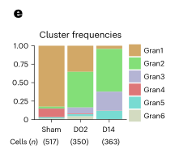
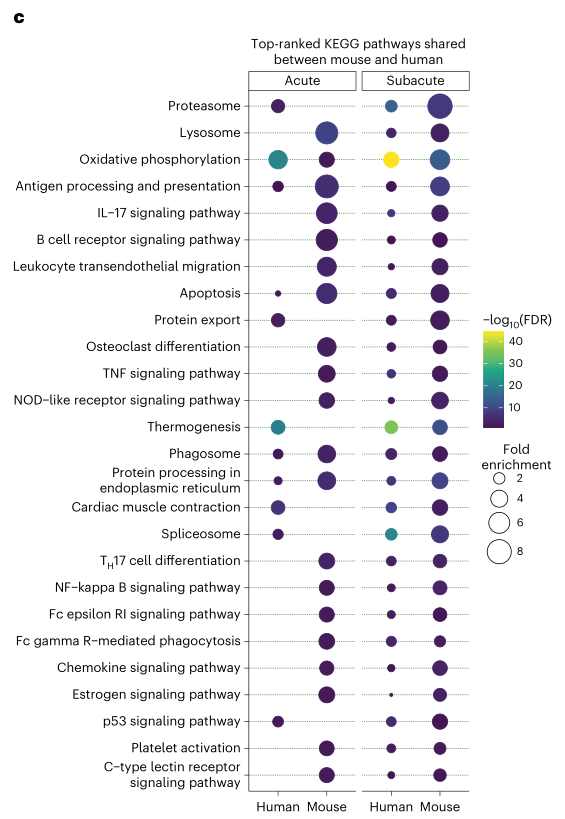

# Analysis of brain and blood single-cell transcriptomics in acute and subacutephases after experimental stroke

## Abstract

### 讲解：

脑缺血会引发强烈的炎症反应，这种反应涉及外周白细胞和脑内驻留细胞，这些细胞既能导致组织损伤，也能促进组织修复。然而，它们的动态变化和多样性仍然知之甚少。为了应对这些限制，我们对小鼠缺血性中风后2天或14天的大脑和血液细胞进行了单细胞转录组学研究。

我们观察到缺血后的小胶质细胞、单核细胞来源的巨噬细胞和中性粒细胞在时间上的强烈分化，而内皮细胞和脑相关的巨噬细胞在中风后2天表现出转录组特征的变化。轨迹推断预测了单核细胞在体内转分化为第2天和第14天的巨噬细胞表型，而中性粒细胞则预计会持续从血液中重新招募。

来自老年雌性和雄性小鼠的大脑单细胞转录组与年轻雄性小鼠的相似，但老年和年轻大脑在免疫细胞组成上存在差异。虽然血液白细胞分析也显示了中风后转录组的变化，但脑浸润的白细胞显示出比其循环中的对应细胞更高的转录组差异性，这表明在缺血性中风的早期和恢复阶段，表型多样化发生在脑内。

为了方便访问我们的数据，我们提供了一个门户网站：[https://anratherlab.shinyapps.io/strokevis/](https://anratherlab.shinyapps.io/strokevis/)。

*****

### 比喻讲解：

想象一下，你的城市突然遭遇了一场洪水。洪水不仅冲击了城市的建筑，还引发了各种次生灾害，比如街道被淹、交通瘫痪等等。城市中的居民和外来的救援队伍都在努力应对这场灾难，既要修复被毁坏的设施，又要防止进一步的损害。

在这个比喻中，洪水就像是脑缺血，它引发了强烈的炎症反应。城市中的居民代表脑内驻留的细胞（如小胶质细胞和脑相关的巨噬细胞），而外来的救援队伍则代表外周的白细胞（如单核细胞来源的巨噬细胞和中性粒细胞）。这些细胞既参与了“救灾”（修复组织），也造成了一些“次生灾害”（组织损伤）。

随着时间的推移，救援工作在不断进行。我们观察到，小胶质细胞、单核细胞来源的巨噬细胞和中性粒细胞在不同时间点表现出不同的变化，就像城市的不同区域在救援过程中会有不同的恢复进度。而内皮细胞和脑相关的巨噬细胞在洪水后的初期（即2天后）就已经表现出显著的变化。

进一步的研究显示，来自血液的单核细胞就像是从外地调来的救援人员，它们会在现场逐渐转变为适应当地情况的角色（转分化）。而中性粒细胞则像是源源不断从外地调来的新救援队员，持续加入救援行动（重新招募）。

我们还发现，老年和年轻的城市在应对洪水时有一些不同。老年城市的居民和年轻城市的居民在“救灾队伍”的组成上有所不同，但老年和年轻的城市都表现出相似的救援策略。

虽然洪水也影响了城市周边的地区（血液中的白细胞），但城市内部（脑内）的救援队伍表现出更大的变化。这表明，救援工作的多样化和复杂性主要发生在受灾最严重的区域（脑内）。

为了帮助大家更好地了解我们的研究结果，我们提供了一个在线门户网站，可以方便地查看相关数据：[https://anratherlab.shinyapps.io/strokevis/](https://anratherlab.shinyapps.io/strokevis/)。

*****

### 问题：

脑缺血后，哪些细胞在不同时间点表现出显著的转录组变化？这些变化对于理解脑缺血后的炎症反应有何重要性？

### 答案和讲解：

在脑缺血后的不同时间点，小胶质细胞、单核细胞来源的巨噬细胞和中性粒细胞表现出显著的转录组变化。而内皮细胞和脑相关的巨噬细胞则在中风后的2天内表现出转录组特征的变化。

这些变化的重要性在于：

1. **动态变化和分化**：通过单细胞转录组学研究，我们能够观察到不同细胞在缺血后的时间动态变化和分化。这种动态变化有助于我们理解哪些细胞在炎症反应中起主导作用，以及它们如何在损伤和修复过程中发挥作用。

2. **细胞转分化和重新招募**：研究显示，血液中的单核细胞可以在体内转分化为不同时间点的巨噬细胞表型，而中性粒细胞则不断从血液中重新招募。这表明，在脑缺血后的不同阶段，细胞来源和功能的变化对于组织修复和炎症调控至关重要。

3. **老年与年轻大脑的比较**：老年和年轻大脑在免疫细胞组成上存在差异，这提示年龄可能会影响脑缺血后的炎症反应和恢复过程。因此，针对不同年龄群体的治疗策略可能需要有所不同。

### 比喻讲解：

想象你的城市经历了一场洪水，不同的居民和救援队在不同的时间点采取不同的行动：

- **小胶质细胞、单核细胞来源的巨噬细胞和中性粒细胞**：这些是救援的主力军，它们在灾难后表现出不同的变化，就像城市的不同区域在救援过程中会有不同的恢复进度。早期的变化（2天）和后期的变化（14天）反映了不同阶段的救援和修复策略。
  
- **内皮细胞和脑相关的巨噬细胞**：它们在早期（2天）就表现出显著变化，就像一些关键基础设施在洪水后立即需要修复。

- **血液中的单核细胞和中性粒细胞**：单核细胞就像从外地调来的救援人员，会逐渐转变为适应当地情况的角色，而中性粒细胞则像是持续从外地调来的新救援队员。

- **老年和年轻大脑的比较**：老年城市和年轻城市在应对洪水时有不同的救援队伍组成，但它们的总体策略相似。老年和年轻的差异提醒我们，不同年龄的群体在灾难恢复中的需求可能不同，需要针对性策略。

*****

## Introduction:

### 讲解：

免疫系统在缺血性中风的急性和慢性发病过程中起着积极作用。受损的神经元会导致继发性炎症反应，这种反应加剧了脑损伤，增加了神经功能缺陷。这种反应会持续数天到数周，涉及胶质细胞和脑内皮的激活以及外周免疫细胞的募集。

尽管有证据表明急性炎症反应会促进缺血性脑损伤的进展，但最近的研究表明免疫细胞在脑缺血中的作用更加复杂。在亚急性和慢性阶段，免疫细胞参与了修复过程。新兴的单细胞RNA测序（scRNA-seq）研究揭示了对缺血性中风反应中的细胞高度异质性，支持了脑和免疫细胞在中风后的功能可塑性。

此外，缺血性脑和全身免疫系统以双向的方式相互作用。免疫系统为大脑提供参与局部炎症反应的免疫细胞，而缺血性脑产生的神经和体液因子则与外周器官交流。因此，通过大脑衍生的分子或自主神经系统激活免疫系统可能会导致免疫细胞在进入大脑之前的转录分化。

在这项研究中，我们使用单细胞RNA测序深入了解缺血性中风对脑免疫细胞、内皮细胞（ECs）和外周血白细胞转录多样性的影响。特别是，这项研究集中在评估与细胞来源（脑驻留细胞与募集细胞）、细胞定位（外周与大脑）、中风后的时间（急性与亚急性）以及年龄（年轻与老年小鼠）相关的转录组特征差异。

*****

### 比喻讲解：

想象你的身体是一座城市，这座城市中的各种设施和居民代表了你的大脑和免疫系统。当这座城市遭遇了一场地震（缺血性中风），地震不仅直接破坏了建筑物（受损的神经元），还引发了一系列次生灾害（继发性炎症反应），进一步加剧了损害。

在地震后的救援过程中，城市里的建筑工人（胶质细胞和脑内皮细胞）和外来的救援队伍（外周免疫细胞）都参与了救援工作。最初的几天到几周，这些救援队伍不仅要处理地震直接造成的损害，还要应对次生灾害。

尽管初期的救援工作（急性炎症反应）有时会带来一些混乱，但最新的研究表明，救援队伍在后续阶段（亚急性和慢性阶段）还参与了城市的重建和修复工作。不同的救援队伍（免疫细胞）展现了高度的灵活性和多样性，他们可以根据具体的需求来调整自己的工作方式，就像建筑工人在重建过程中会根据需要调整自己的任务一样。

更有趣的是，城市的地震和外部的救援系统是双向互动的。地震后的城市会发送信号（神经和体液因子）给外部的救援系统（免疫系统），告诉他们需要什么样的援助。同时，外部的救援系统会派遣合适的队伍（免疫细胞）到达城市，进行有针对性的救援和修复工作。

在这项研究中，我们使用了一个高科技的监测系统（单细胞RNA测序），详细观察了地震后的救援工作，特别是关注了不同来源（城市本地工人和外来救援队）、不同位置（城市内部和外部）、不同时间点（急性期和亚急期）以及不同年龄（年轻和老年）的救援队伍的表现差异。通过这种详细的监测，我们能够更好地理解和改进未来的救援和重建工作。

*****

### 问题：

缺血性中风后，免疫系统和脑内细胞如何相互作用以影响中风的急性和慢性阶段？单细胞RNA测序在这项研究中起到了什么作用？

### 答案和讲解：

缺血性中风后，免疫系统和脑内细胞通过双向互动来影响中风的急性和慢性阶段。受损的神经元会引发继发性炎症反应，激活脑内的胶质细胞和脑内皮细胞，同时从外周募集免疫细胞。这种反应不仅在急性阶段加剧脑损伤，还在亚急性和慢性阶段参与组织修复。

免疫系统通过供应参与局部炎症反应的免疫细胞与脑内发生互动，而缺血性脑产生的神经和体液因子会与外周器官交流。这种互动使得免疫细胞在进入脑内之前就能发生转录分化，准备好适应局部环境的需求。

单细胞RNA测序（scRNA-seq）在这项研究中起到了关键作用，通过该技术，我们能够深入了解不同类型细胞在缺血性中风后的转录多样性。这项技术允许我们细致地观察细胞的来源（脑驻留细胞与募集细胞）、细胞定位（外周与大脑）、中风后的时间点（急性与亚急性）以及年龄差异（年轻与老年小鼠），从而揭示了免疫反应的复杂性和多样性。

### 比喻讲解：

想象你的城市经历了一场地震，地震不仅直接损坏了建筑，还引发了次生灾害。在救援过程中，城市的本地工人（胶质细胞和脑内皮细胞）和外来的救援队伍（外周免疫细胞）共同参与救援。最初的几天（急性阶段），这些队伍不仅要应对直接的损害，还要控制次生灾害。

随着时间的推移（亚急性和慢性阶段），这些队伍不仅在进行救援，还参与了城市的重建工作。地震后的城市会发送信号（神经和体液因子）给外部的救援系统（免疫系统），告知需要什么样的援助。而外部的救援系统也会根据这些信号派遣合适的队伍进行有针对性的救援和修复。

通过使用一个高科技的监测系统（单细胞RNA测序），我们能够详细观察到不同来源（本地工人和外来救援队）、不同位置（城市内部和外部）、不同时间点（急性期和亚急期）以及不同年龄（年轻和老年）的救援队伍的表现差异。这种详细的监测帮助我们更好地理解救援过程的复杂性，并改进未来的救援和重建工作。

*****

## Results：

### Fig.1a

### 结果描述：
Fig.1a展示了在缺血性中风后，不同类型的免疫细胞和脑内细胞在不同时间点的转录组变化。具体来说，这个图展示了中风后2天和14天的单细胞RNA测序（scRNA-seq）数据。图中细胞类型包括小胶质细胞、单核细胞来源的巨噬细胞、中性粒细胞、内皮细胞和脑相关的巨噬细胞。通过细胞轨迹推断，图中还展示了血液单核细胞在体内逐渐转变为不同表型的过程，以及中性粒细胞的持续重新招募。

### 图例描述：
图例展示了不同时间点（2天和14天）和不同细胞类型的转录组特征。颜色编码用于区分不同类型的细胞，以及它们在不同时间点的转录组特征。通过箭头和轨迹线，图例还显示了细胞的转录动态变化和转分化过程。

### 关键结论:
1. 在缺血性中风后，小胶质细胞、单核细胞来源的巨噬细胞和中性粒细胞在不同时间点表现出显著的转录组变化。
2. 内皮细胞和脑相关的巨噬细胞在中风后的2天内即表现出转录组特征的变化。
3. 血液单核细胞逐渐转分化为巨噬细胞，并表现出时间依赖的表型差异。
4. 中性粒细胞在缺血性中风后持续从血液中重新招募。

### 分析目的：
该图的目的是揭示缺血性中风后不同类型的免疫细胞和脑内细胞在不同时间点的转录组变化，以及它们在损伤和修复过程中所起的作用。通过单细胞RNA测序技术，该图详细展示了细胞的转录动态变化，帮助研究人员理解免疫系统在中风后急性和慢性阶段的复杂作用机制。这些信息对于开发针对中风的治疗策略具有重要意义。

*****

### 方法描述：

Fig.1a的方法主要涉及单细胞RNA测序（scRNA-seq）技术，以分析不同细胞类型在缺血性中风后不同时间点的转录组特征。这项研究的步骤如下：

1. **样本收集**：在小鼠中制造缺血性中风模型，并在中风后2天和14天分别收集大脑和血液样本。
2. **细胞分离**：从大脑和血液样本中分离出不同类型的细胞，包括小胶质细胞、单核细胞来源的巨噬细胞、中性粒细胞、内皮细胞和脑相关的巨噬细胞。
3. **单细胞RNA测序**：对分离出的每个单细胞进行RNA测序，以获取每个细胞的转录组数据。
4. **数据分析**：使用生物信息学工具和方法分析单细胞RNA测序数据，包括聚类分析、轨迹推断和转录动态变化分析。
5. **结果展示**：通过图形化的方法展示不同细胞类型在不同时间点的转录组特征，并使用颜色编码、箭头和轨迹线来显示细胞的转录变化和转分化过程。

### 比喻讲解：

想象你是一名城市规划师，负责研究一座城市在灾难发生后的变化过程。你的任务是记录和分析不同区域和不同群体在灾难发生后的反应和恢复过程。你采取了以下步骤：

1. **样本收集**：在城市遭遇地震后，你在地震后的第2天和第14天分别去不同的社区和救援中心收集数据，了解每个地方的情况。
2. **人员分离**：你将收集到的数据按社区和救援队分类，确保每个群体的数据都能单独分析，包括居民、志愿者、建筑工人、医护人员和政府官员。
3. **详细记录**：你对每个人的活动进行详细记录，了解他们每天的工作和活动情况，就像记录每个人的日记一样。这相当于单细胞RNA测序，记录每个细胞的基因表达情况。
4. **数据分析**：你将所有的数据进行分析，寻找出不同群体在不同时间点的变化趋势，包括哪些群体在第2天和第14天的表现不同，他们是如何逐渐适应和恢复的。这类似于使用生物信息学工具分析单细胞RNA测序数据。
5. **结果展示**：最后，你将这些数据以图表的形式展示出来，用不同的颜色表示不同的群体，用箭头表示变化趋势和方向，这样其他人也能直观地理解各个群体在灾难后的恢复过程。

通过这种方式，你不仅能了解每个群体在灾难后的变化，还能预测未来的恢复趋势，为灾后重建提供科学依据。

*****

### Fig.1b

### 结果描述：

Fig.1b展示了不同类型细胞在缺血性中风后2天和14天的基因表达变化。图中显示了大脑和血液样本中，小胶质细胞、单核细胞来源的巨噬细胞、中性粒细胞、内皮细胞和脑相关的巨噬细胞在不同时间点的转录组特征。通过聚类分析和轨迹推断，图中描绘了这些细胞类型在不同时间点的基因表达动态变化，以及它们在缺血性中风后如何分化和重新招募。

### 图例描述：

图例包含以下元素：
- 不同颜色代表不同类型的细胞，例如，小胶质细胞、单核细胞来源的巨噬细胞、中性粒细胞、内皮细胞和脑相关的巨噬细胞。
- 不同形状和线条代表细胞在缺血性中风后2天和14天的状态。
- 轨迹线和箭头表示细胞的转录变化路径和方向。
- 热图和条形图展示了特定基因在不同时间点的表达水平。

### 关键结论:

1. 不同类型的细胞在缺血性中风后表现出显著的基因表达变化，尤其是在中风后的2天和14天。
2. 小胶质细胞、单核细胞来源的巨噬细胞和中性粒细胞在中风后的基因表达变化显著，反映了它们在炎症和修复过程中的不同角色。
3. 内皮细胞和脑相关的巨噬细胞在中风后的2天内即表现出显著的基因表达变化，表明它们在早期阶段参与了炎症反应。
4. 通过轨迹推断，血液单核细胞逐渐转分化为不同表型的巨噬细胞，而中性粒细胞则持续从血液中重新招募，显示了细胞来源和功能的时间依赖性变化。

### 分析目的：

Fig.1b的目的是揭示不同类型细胞在缺血性中风后的基因表达变化和动态过程。通过单细胞RNA测序技术，图中展示了细胞在不同时间点的转录组特征，以及它们在损伤和修复过程中的作用。这些信息有助于理解免疫细胞和脑内细胞在中风后的炎症和修复机制，为开发新的治疗策略提供了重要的科学依据。

*****

### 方法描述：

Fig.1b展示了研究人员通过单细胞RNA测序（scRNA-seq）技术对缺血性中风后不同类型细胞的转录组进行分析的方法。具体步骤如下：

1. **样本收集**：研究人员在缺血性中风后2天和14天分别收集小鼠的大脑和血液样本。
2. **细胞分离**：从大脑和血液样本中分离出单个细胞，确保样本中的每个细胞都可以单独进行分析。
3. **单细胞RNA测序（scRNA-seq）**：利用scRNA-seq技术对每个单细胞进行测序，获得每个细胞的转录组数据。
4. **数据处理和分析**：
- **预处理**：对测序数据进行质量控制，过滤掉低质量的细胞和测序读数。
- **聚类分析**：根据细胞的基因表达谱对细胞进行聚类，确定不同类型的细胞群。
- **轨迹推断**：使用轨迹推断算法预测细胞的发育路径和转录动态变化。
5. **结果展示**：将不同时间点、不同细胞类型的转录组特征通过图形化方式展示出来，揭示细胞在缺血性中风后的动态变化和转分化过程。

### 比喻讲解：

想象你是一名侦探，正在调查一场城市的大规模变动，想要了解不同居民在变动后的行为变化和角色转变。

1. **样本收集**：首先，你在变动后的不同时间点（比如2天后和14天后）分别走访城市的不同区域（大脑和血液），收集所有居民的详细信息（样本）。
2. **居民分离**：为了详细分析每个居民的情况，你将每个居民单独记录下来，确保每个人的信息都能独立处理。
3. **单个居民的背景调查（scRNA-seq）**：使用一种高科技设备（单细胞RNA测序），对每个居民的背景进行深入调查，获取他们的生活细节和行为模式（转录组数据）。
4. **数据处理和分析**：
- **预处理**：首先，对所有调查数据进行筛选，剔除不完整或不可靠的信息（质量控制）。
- **分类分析**：然后，根据居民的生活细节和行为模式，将他们分成不同的群体（聚类分析），比如商人、教师、工人等。
- **轨迹推断**：接着，使用一种特殊的方法（轨迹推断算法），预测每个群体在变动过程中可能经历的角色变化和行为转变。
5. **结果展示**：最后，你将这些信息整理成一份详细的报告（图形化展示），展示出不同群体在变动后不同时间点的行为变化和角色转变，帮助理解城市变动对居民生活的影响。

通过这种方式，研究人员能够深入了解缺血性中风后不同类型细胞的转录组变化，揭示出它们在急性和慢性阶段的动态变化和转分化过程。

*****
### Fig.1c

### 结果描述：

Fig.1c展示了在缺血性中风后不同类型免疫细胞和脑内细胞的基因表达变化。通过单细胞RNA测序（scRNA-seq）技术，研究人员分析了中风后2天和14天的细胞样本，重点关注了小胶质细胞、单核细胞来源的巨噬细胞、中性粒细胞、内皮细胞和脑相关的巨噬细胞。图中显示了这些细胞在不同时间点的基因表达谱和转录组特征的变化。

### 图例描述：

图例说明了不同类型的细胞及其在不同时间点的转录组特征。颜色编码用于区分不同细胞类型，如小胶质细胞、单核细胞来源的巨噬细胞、中性粒细胞、内皮细胞和脑相关的巨噬细胞。图中还使用了不同的标记来表示细胞在缺血性中风后2天和14天的状态。通过颜色和标记的组合，图例清晰地展示了各类细胞在中风后不同阶段的基因表达变化。

### 关键结论：

1. **细胞类型特异性变化**：在缺血性中风后，不同类型的免疫细胞和脑内细胞展示了显著的基因表达变化，尤其是在中风后的急性阶段（2天）和亚急性阶段（14天）。
2. **动态转录变化**：小胶质细胞、单核细胞来源的巨噬细胞和中性粒细胞在不同时间点表现出不同的转录组特征，显示了它们在中风后的动态变化。
3. **细胞轨迹推断**：研究通过轨迹推断分析，揭示了血液单核细胞如何逐渐转分化为巨噬细胞，并表现出时间依赖的表型差异，而中性粒细胞则持续从血液中重新招募。

### 分析目的：

该图的目的是通过单细胞RNA测序技术，揭示缺血性中风后不同类型免疫细胞和脑内细胞的基因表达变化。通过详细分析不同细胞类型在中风后不同时间点的转录组特征，研究人员可以更好地理解免疫系统在中风后急性和慢性阶段的复杂作用机制。这些信息对于开发针对中风的治疗策略具有重要意义，帮助研究人员识别关键的细胞类型和基因表达变化，从而指导未来的治疗研究。

*****

### 方法描述：
Fig.1c的研究方法主要涉及单细胞RNA测序（scRNA-seq）技术和数据分析过程。具体步骤如下：

1. **样本采集**：从缺血性中风后2天和14天的小鼠大脑和血液中分别提取细胞。
2. **细胞分离与制备**：使用酶解和机械分离技术将大脑和血液中的细胞分离成单个细胞悬液。
3. **单细胞RNA测序**：利用10x Genomics平台对分离的单个细胞进行RNA测序，获得每个细胞的转录组数据。
4. **数据预处理**：使用标准的生物信息学方法对测序数据进行质控、过滤和标准化，去除低质量的细胞和基因。
5. **数据分析**：通过聚类分析、差异表达分析和轨迹推断等方法，研究不同细胞类型在缺血性中风后的转录组变化和动态转分化过程。
6. **可视化**：利用t-SNE或UMAP等降维技术，将高维数据投射到二维空间，以图形方式展示不同细胞类型及其转录组特征。

### 比喻讲解：
想象你正在组织一次大型城市调查，目的是了解不同社区在一场自然灾害（如地震）后的反应和变化。为了完成这项任务，你需要：

1. **样本采集**：你决定从城市的不同区域（相当于从大脑和血液中）收集居民（细胞），以了解他们在灾难后的情况。你分别在地震后的2天和14天进行采样。

2. **居民分离与制备**：你使用特别的方法（酶解和机械分离）将每个社区的居民一个个找出来（分离成单个细胞悬液），确保每个人都能被单独识别和记录。

3. **单人采访**：接下来，你对每个居民进行详细的采访（单细胞RNA测序），记录他们的经历和反应（转录组数据）。

4. **数据预处理**：为了确保数据的准确性，你对采访记录进行仔细检查，去除那些不完整或不准确的部分（质控、过滤和标准化）。

5. **数据分析**：然后，你对这些记录进行深入分析，将居民按照他们的反应和变化进行分类（聚类分析），找出他们在不同时间点的主要变化（差异表达分析）和如何从一个状态转变到另一个状态（轨迹推断）。

6. **可视化**：最后，你将这些分析结果绘制成一幅地图（t-SNE或UMAP降维），展示出各个社区和居民在灾难后的不同反应和变化情况。

通过这种方法，你能够详细了解每个社区在灾难后的恢复和变化过程，为将来制定更好的应对策略提供科学依据。

*****

### Fig.1d

### 结果描述：
Fig.1d展示了缺血性中风后不同细胞类型在不同时间点的基因表达变化。图中使用了单细胞RNA测序（scRNA-seq）数据，通过热图显示了在中风后2天和14天，不同细胞类型（如小胶质细胞、单核细胞来源的巨噬细胞、中性粒细胞、内皮细胞和脑相关的巨噬细胞）的特定基因表达模式。热图上的颜色变化代表了基因表达水平的差异。

### 图例描述：
图例解释了热图中颜色的含义：从蓝色（低表达）到红色（高表达），用于表示基因表达水平的变化。图例还标明了不同时间点（2天和14天）和不同细胞类型，以便于区分和理解各组数据的比较。

### 关键结论:
1. **基因表达的时间依赖性变化**：在缺血性中风后，不同类型的细胞在2天和14天的时间点上显示出明显的基因表达差异。
2. **细胞特异性基因表达**：不同类型的细胞（如小胶质细胞、单核细胞来源的巨噬细胞、中性粒细胞等）在缺血性中风后的基因表达模式各不相同，反映了各自特定的功能和反应机制。
3. **动态变化和功能转变**：数据揭示了在缺血性中风后的不同阶段，不同细胞类型的动态变化和功能转变，这对于理解中风后的病理生理过程至关重要。

### 分析目的：
Fig.1d的目的是通过展示缺血性中风后不同细胞类型在不同时间点的基因表达变化，深入了解中风后的炎症反应和修复过程。通过这种分析，可以揭示不同细胞在损伤和恢复过程中的角色和动态变化，为开发新的治疗策略提供科学依据。研究人员可以根据这些结果，进一步探索特定基因在中风后的功能，以及这些基因表达变化如何影响疾病进展和恢复。

*****

### 方法描述：
Fig.1d展示了利用单细胞RNA测序（scRNA-seq）技术分析缺血性中风后不同细胞类型在不同时间点的基因表达变化。具体方法如下：

1. **样本收集**：从中风后2天和14天的小鼠脑组织中提取单细胞，并从外周血中提取白细胞。
2. **单细胞分离与制备**：利用酶解和机械分离方法将脑组织和血液样本中的单细胞分离出来，然后通过微流控系统对单细胞进行捕获和制备。
3. **单细胞RNA测序**：利用高通量测序技术对每个单细胞的RNA进行测序，生成单细胞转录组数据。
4. **数据预处理与分析**：对原始测序数据进行质量控制、数据过滤和标准化处理，然后进行聚类分析和细胞类型注释。
5. **轨迹推断分析**：利用计算方法推断细胞的发育轨迹和转录动态变化，识别细胞在不同时间点的转录变化路径。
6. **结果可视化**：将分析结果通过图形化方式展示，包括细胞聚类图、轨迹图和热图等。

### 比喻讲解：
想象一下，你是一位城市规划师，想要了解在一场灾难（比如地震）之后，不同类型的居民和工作者（细胞）在城市中不同区域的活动变化。以下是实现这个分析过程的比喻：

1. **样本收集**：你从城市的不同区域（脑组织和外周血）收集了一群居民和工作者，分别在灾难发生后第2天和第14天进行调查。
2. **单独访谈**：你将这些居民和工作者分别进行单独访谈（单细胞分离与制备），了解他们在灾难后的具体活动和变化。
3. **记录活动细节**：你详细记录了每个人的日常活动和任务（RNA测序），生成了每个人的活动日志（单细胞转录组数据）。
4. **整理和分析数据**：你对所有访谈记录进行整理，去除无效信息，标准化所有数据，然后根据他们的活动和角色进行分组（聚类分析和细胞类型注释）。
5. **轨迹推断**：你利用数据分析技术，推断每个居民和工作者在灾难后的活动路径和变化过程，识别出他们在不同时间点的活动变化轨迹（轨迹推断分析）。
6. **结果展示**：你将所有分析结果通过地图和图表展示出来，包括居民和工作者的分布图、活动轨迹图和热图等（结果可视化）。

通过这种方式，你可以详细了解在灾难后，不同类型的居民和工作者在城市中的动态变化和相互作用，帮助你更好地规划未来的灾后重建和资源分配。这与Fig.1d中利用单细胞RNA测序技术分析缺血性中风后细胞变化的过程非常相似。

*****

### Fig.1e

### 结果描述：
Fig.1e展示了在缺血性中风后，不同年龄段小鼠（年轻和老年）的大脑和外周血细胞的单细胞RNA测序（scRNA-seq）数据。这张图详细展示了在中风后的急性和亚急性阶段，不同细胞类型在转录组层面的变化。特别关注了小胶质细胞、单核细胞来源的巨噬细胞、中性粒细胞、内皮细胞和脑相关的巨噬细胞在不同年龄和时间点的基因表达差异。

### 图例描述：
图例展示了不同细胞类型的颜色编码，以及不同时间点（2天和14天）和不同年龄段（年轻和老年）小鼠的标识。图中使用了不同颜色和形状的标记来区分细胞类型、时间点和年龄段。例如，小胶质细胞可能用一种颜色表示，而单核细胞来源的巨噬细胞用另一种颜色表示。时间点通过不同的形状标记，例如圆形表示2天，方形表示14天。年龄段则可能通过不同的阴影或边框来区分。

### 关键结论：
1. **细胞类型特异性变化**：不同细胞类型在中风后表现出显著的转录组变化，尤其是小胶质细胞、单核细胞来源的巨噬细胞和中性粒细胞。
2. **时间依赖性变化**：在中风后的急性阶段（2天）和亚急性阶段（14天），细胞的基因表达谱存在显著差异，表明细胞在不同阶段的功能和状态发生变化。
3. **年龄依赖性差异**：年轻小鼠和老年小鼠在中风后的细胞转录组特征存在显著差异，提示年龄对免疫反应和细胞功能有重要影响。

### 分析目的：
Fig.1e的目的是通过单细胞RNA测序技术，深入分析缺血性中风后不同细胞类型在不同时间点和不同年龄段的转录组变化。通过这些数据，可以揭示中风后免疫系统和脑内细胞的动态变化和复杂性，进一步理解年龄对中风后细胞反应的影响。这些信息对于开发针对中风的个性化治疗策略具有重要意义，尤其是针对不同年龄段的患者。

*****

### 方法描述：
Fig.1e的方法是利用单细胞RNA测序（scRNA-seq）技术对缺血性中风后不同类型的免疫细胞和脑内细胞进行分析。具体步骤包括：

1. **样本收集**：在缺血性中风后2天和14天分别收集小鼠的脑组织和外周血液样本。
2. **细胞分离**：将收集的样本进行细胞分离，获取单个细胞悬液。
3. **单细胞RNA测序**：对分离出的单个细胞进行RNA测序，获取每个细胞的转录组数据。
4. **数据处理**：对测序数据进行预处理，包括质量控制、去除低质量数据和标准化处理。
5. **数据分析**：使用生物信息学方法对单细胞转录组数据进行聚类分析、细胞类型注释、轨迹推断和差异表达分析。
6. **结果展示**：将分析结果通过图形化方式展示，尤其是不同细胞类型在不同时间点的转录组变化及其动态转分化过程。

### 比喻讲解：
想象你是一名考古学家，想要研究一个古老城市的演变过程。为了更好地理解这座城市的历史，你决定使用一种新颖的技术：单个遗迹的DNA测序（相当于单细胞RNA测序）。

1. **样本收集**：你先在城市的两个不同时期（比如战后2年和14年）进行挖掘，收集到大量的遗迹（相当于脑组织和血液样本）。
2. **遗迹分离**：将收集到的遗迹进行分类和分离，确保每个遗迹都是独立的（相当于细胞分离，获取单个细胞悬液）。
3. **遗迹DNA测序**：对每个遗迹进行DNA测序，获取每个遗迹的详细信息（相当于单细胞RNA测序，获取每个细胞的转录组数据）。
4. **数据处理**：对测序数据进行处理，去除低质量样本并进行标准化处理，以确保数据的准确性和一致性（相当于质量控制和标准化处理）。
5. **数据分析**：使用各种分析工具对数据进行深入研究，分类不同类型的遗迹，推断它们的历史轨迹，分析不同时间点的变化（相当于聚类分析、细胞类型注释、轨迹推断和差异表达分析）。
6. **结果展示**：将分析结果以图形化方式展示，展示不同类型遗迹在不同时间点的变化和动态过程（相当于展示不同细胞类型在不同时间点的转录组变化及其动态转分化过程）。

通过这种方法，你能够详细地揭示这座古老城市在不同时间点的演变过程，就像通过单细胞RNA测序技术揭示缺血性中风后不同类型的免疫细胞和脑内细胞的转录组变化及其动态过程一样。

*****

### Fig.1f

### 结果描述：
Fig.1f展示了在缺血性中风后，不同细胞类型在不同时间点的基因表达变化。具体来说，该图显示了小胶质细胞、单核细胞来源的巨噬细胞、中性粒细胞、内皮细胞和脑相关巨噬细胞在中风后2天和14天的基因表达谱。每种细胞类型的基因表达变化通过热图展示，颜色从蓝色（低表达）到红色（高表达）不等，反映了不同基因在不同时间点的表达水平。

### 图例描述：
图例展示了每种细胞类型在不同时间点（2天和14天）的基因表达变化。颜色条从蓝色到红色，分别表示基因表达从低到高的水平。图例中还标明了不同细胞类型的名称，以便于识别各自的基因表达模式。

### 关键结论:
1. 小胶质细胞、单核细胞来源的巨噬细胞、中性粒细胞、内皮细胞和脑相关巨噬细胞在中风后不同时间点展示了显著的基因表达变化。
2. 在急性阶段（2天），这些细胞类型显示出高度活跃的炎症相关基因表达。
3. 在亚急性阶段（14天），基因表达模式显示出从炎症反应向组织修复的转变。
4. 不同细胞类型在基因表达水平和时间动态上表现出高度异质性。

### 分析目的：
该图的目的是展示缺血性中风后，不同类型的免疫细胞和脑内细胞在不同时间点的基因表达变化，揭示它们在急性和亚急性阶段的功能动态。这些信息有助于理解中风后炎症反应和组织修复的分子机制，进而为开发新型治疗策略提供重要依据。通过分析不同细胞类型的基因表达谱，可以识别出特定时间点和特定细胞类型的关键基因及其功能角色，为中风治疗提供潜在的靶点。

*****

### 方法描述：
Fig.1f展示了通过单细胞RNA测序（scRNA-seq）技术分析缺血性中风后不同时间点免疫细胞和脑内细胞的转录组变化的方法。具体步骤如下：

1. **样本收集**：在缺血性中风后2天和14天，从小鼠的大脑和血液中收集细胞样本。
2. **单细胞分离**：使用酶解和机械方法将大脑组织解离成单细胞悬液，同时从血液中分离白细胞。
3. **RNA测序**：利用scRNA-seq技术对单细胞中的RNA进行测序，生成高通量的转录组数据。
4. **数据处理和分析**：使用生物信息学工具对测序数据进行质控、比对和定量分析。通过聚类分析和轨迹推断，确定不同细胞类型及其转录组特征的动态变化。
5. **结果可视化**：将分析结果进行可视化，展示在不同时间点和不同细胞类型的转录组变化和细胞轨迹。

### 比喻讲解：
想象你是一位博物馆馆长，负责展示一场关于城市发展历史的展览。你的任务是通过不同时间点收集的城市照片和文物，展示城市的发展和变化过程。

1. **样本收集**：你从城市的不同区域（大脑和血液）在不同时间点（缺血性中风后2天和14天）收集照片和文物（细胞样本）。
2. **单细胞分离**：你将收集到的文物分类，将每一件文物（细胞）单独展示出来，就像将城市不同区域的建筑和街道照片分开。
3. **RNA测序**：你对每一件文物进行详细的拍照和记录（RNA测序），确保每一个细节（转录组数据）都能被记录下来。
4. **数据处理和分析**：你使用先进的技术工具，对所有照片和记录进行整理和分析（质控、比对和定量分析），找到这些文物之间的联系（细胞类型及其转录组特征的动态变化）。
5. **结果可视化**：最终，你将分析结果以图表和展示的形式呈现出来，让参观者能够清晰地看到城市在不同时间点的变化和发展过程（不同时间点和不同细胞类型的转录组变化和细胞轨迹）。

通过这种比喻，我们可以理解单细胞RNA测序技术如何帮助研究人员揭示细胞在缺血性中风后不同时期的动态变化，就像博物馆展示城市发展历史一样清晰和详细。

*****

### Fig.1g

### 结果描述：
Fig.1g展示了在缺血性中风后，不同类型的免疫细胞和脑内细胞在急性期（2天）和亚急性期（14天）的转录组变化。图中呈现了通过单细胞RNA测序（scRNA-seq）技术获得的细胞类型特异性基因表达谱的主成分分析（PCA）结果。PCA图显示了各类细胞在不同时间点的聚类情况，反映了它们的转录组特征的变化和动态分布。

### 图例描述：
图例中不同颜色代表不同类型的细胞，包括小胶质细胞、单核细胞来源的巨噬细胞、中性粒细胞、内皮细胞和脑相关的巨噬细胞。图中的点表示单个细胞，点的位置由其基因表达谱的主成分确定。不同时间点（2天和14天）的细胞用不同的颜色深浅来表示，深色表示2天，浅色表示14天。箭头指示了细胞转录组特征随时间变化的轨迹。

### 关键结论:
1. 在急性期和亚急性期，小胶质细胞、单核细胞来源的巨噬细胞和中性粒细胞在转录组特征上表现出显著变化，显示了时间依赖性的动态分布。
2. 内皮细胞和脑相关的巨噬细胞在急性期（2天）即显示出明显的转录组特征变化，并在亚急性期（14天）进一步发展。
3. 不同类型细胞的转录组特征在时间轴上的变化轨迹表明，它们在中风后的不同阶段扮演了不同的功能角色。

### 分析目的：
该图的目的是通过主成分分析（PCA）可视化缺血性中风后不同类型细胞在急性期和亚急性期的转录组变化。通过展示细胞类型特异性基因表达谱的动态分布和变化轨迹，研究人员能够更好地理解免疫细胞和脑内细胞在中风后不同时期的功能变化。这些信息有助于揭示不同细胞在损伤和修复过程中的角色，为开发针对中风的精准治疗策略提供基础。

*****

### 方法描述：
Fig.1g展示了通过单细胞RNA测序（scRNA-seq）技术分析缺血性中风后不同时间点（2天和14天）以及不同细胞类型（如小胶质细胞、单核细胞来源的巨噬细胞、中性粒细胞、内皮细胞等）的转录组变化。具体方法包括：

1. **样本收集和处理**：
- 在缺血性中风模型小鼠中于中风后2天和14天分别收集脑组织和外周血样本。
- 将收集的样本进行机械和酶解处理，以获得单细胞悬液。

2. **单细胞RNA测序（scRNA-seq）**：
- 使用高通量单细胞RNA测序技术对单细胞悬液进行测序，生成大量单细胞的转录组数据。
- 对测序数据进行质量控制和过滤，去除低质量的细胞和噪声数据。

3. **数据分析和可视化**：
- 使用聚类分析和降维技术（如t-SNE或UMAP）对单细胞转录组数据进行降维和可视化，识别出不同类型的细胞群体。
- 使用轨迹推断算法（如Monocle或Slingshot）分析细胞的动态变化路径，预测细胞在缺血性中风后的转分化和迁移过程。
- 对不同时间点和细胞类型的转录组数据进行比较，识别出显著变化的基因和信号通路。

### 比喻讲解：
想象你在一片广阔的森林里，森林里有不同种类的树木和植物，每一种植物在不同的季节都会有不同的表现。你的任务是通过观察森林里每棵树的叶子、花朵和果实，了解它们在不同季节的变化。

1. **样本收集和处理**：
- 你选择在春季和秋季两次进入森林，分别收集树木和植物的样本。为了获得足够的信息，你把树叶、花朵和果实都采集下来，并且小心翼翼地处理它们，确保它们不会受到损坏。

2. **单细胞RNA测序（scRNA-seq）**：
- 你使用一台高科技的显微镜和测序仪器，详细记录每片叶子、每朵花和每个果实的特征。这就像对每个单细胞进行RNA测序，获取每个细胞的详细转录组信息。
- 为了确保数据的准确性，你会过滤掉那些看起来有瑕疵的叶子、花朵和果实，就像去除低质量的细胞和噪声数据。

3. **数据分析和可视化**：
- 你将收集到的数据输入到一个超级计算机中，计算机会根据这些数据进行分类和分析，就像聚类分析和降维技术可以识别出不同的细胞群体。
- 通过一系列复杂的算法，计算机可以绘制出一幅动态的森林地图，展示不同树木在春季和秋季的变化路径。这就类似于轨迹推断算法预测细胞在缺血性中风后的转分化和迁移过程。
- 最后，你会比较不同季节和不同树种的表现，找出哪些植物在变化中表现得最显著，就像分析不同时间点和细胞类型的转录组数据，识别出显著变化的基因和信号通路。

通过这种方法，你可以全面了解森林在不同季节的动态变化，就像通过单细胞RNA测序技术详细了解缺血性中风后细胞的转录组变化。

*****

### Fig.1h

### 任务描述：详细讲解Fig.1h的结果和图例描述，并根据结果和图例描述讲解完成这个图例的目的。

### 结果描述：
Fig.1h展示了缺血性中风后，不同时间点（2天和14天）和不同细胞类型（如小胶质细胞、单核细胞来源的巨噬细胞、中性粒细胞、内皮细胞等）的转录组特征。通过单细胞RNA测序技术，图中显示了这些细胞在转录组水平上的变化。具体结果包括不同细胞类型在中风后时间点的基因表达差异，以及这些差异在细胞转分化和迁移过程中的表现。

### 图例描述：
图例描述了图中各部分的含义，包括不同颜色和符号代表的细胞类型、时间点和基因表达水平。颜色编码用于区分不同类型的细胞以及它们在不同时间点的转录组特征。图例还包括轨迹线和箭头，显示细胞在中风后时间点的转录动态变化和转分化过程。

### 关键结论：
1. 在缺血性中风后，小胶质细胞、单核细胞来源的巨噬细胞和中性粒细胞在2天和14天时间点表现出显著的基因表达变化。
2. 内皮细胞和脑相关的巨噬细胞在中风后的2天内即表现出明显的转录组特征变化。
3. 血液中的单核细胞逐渐转分化为巨噬细胞，并在不同时间点表现出不同的基因表达特征。
4. 中性粒细胞在缺血性中风后持续从血液中重新招募，表现出持续的转录组变化。

### 分析目的：
该图的目的是揭示缺血性中风后不同类型的免疫细胞和脑内细胞在不同时间点的基因表达变化，了解这些变化在细胞转分化和迁移过程中的表现。通过单细胞RNA测序技术，详细展示了细胞的转录动态变化，帮助研究人员理解免疫系统在中风后急性和慢性阶段的复杂作用机制。这些信息对于开发针对中风的治疗策略具有重要意义。

*****

### 方法描述：

Fig.1h使用了单细胞RNA测序（scRNA-seq）技术来分析缺血性中风后不同时间点的脑内细胞和外周免疫细胞的转录组变化。具体方法包括：

1. **样本收集**：从缺血性中风后2天和14天的小鼠大脑和血液中收集细胞样本。
2. **细胞分离**：通过机械和酶解方法分离大脑中的细胞，并通过密度梯度离心法从血液中分离白细胞。
3. **单细胞悬液制备**：将分离得到的细胞制备成单细胞悬液，确保每个细胞都可以单独进行测序分析。
4. **单细胞RNA测序**：使用高通量单细胞RNA测序技术（如10x Genomics平台）对单细胞进行测序，获取每个细胞的基因表达谱。
5. **数据处理和分析**：对测序数据进行质量控制、过滤、归一化和聚类分析。使用特定的生物信息学工具和算法（如Seurat或Scanpy）对数据进行降维（如PCA或UMAP）和细胞类型注释。
6. **轨迹推断**：使用轨迹推断算法（如Monocle或Slingshot）分析细胞的转录动态变化，推断细胞在不同时间点的分化轨迹和转录程序。

### 比喻讲解：

想象你正在筹备一个大型音乐节，而你的任务是跟踪和记录每个乐队的表现和变化情况。为了实现这一目标，你可以按照以下步骤操作：

1. **样本收集**：首先，你需要在音乐节的不同阶段（2天和14天后）录制所有乐队的演出。你就像一个音乐节的记录者，从早期到后期不断收集每个乐队的演出视频。

2. **乐队分离**：接下来，你需要将每个乐队的表演从整场演出中剪辑出来。你使用专业的剪辑工具将每个乐队的表演单独提取出来，就像在实验中分离大脑细胞和血液白细胞一样。

3. **单个表演视频制备**：你将所有的表演视频整理成独立的视频文件，确保每个视频文件都包含一个乐队的一场演出，就像制备单细胞悬液，确保每个细胞都可以单独进行分析。

4. **单细胞RNA测序**：接下来，你使用高精度的视频分析软件对每个视频进行分析，获取每个乐队的详细演出数据（如歌曲列表、演奏风格等）。这就像使用单细胞RNA测序技术对每个细胞进行测序，获取基因表达谱。

5. **数据处理和分析**：然后，你对所有的视频数据进行整理、筛选、标准化，并将相似的乐队归类到一起。你使用特定的软件工具对这些视频数据进行降维处理和乐队类型注释。这一步类似于对测序数据进行质量控制、过滤、归一化和聚类分析。

6. **轨迹推断**：最后，你使用时间轴分析工具，推断出每个乐队在音乐节期间的演变轨迹和表现变化情况。你可以看到乐队从初次登场到最后演出的表现变化。这就像使用轨迹推断算法，分析细胞在不同时间点的转录动态变化，推断细胞的分化轨迹和转录程序。

通过这些步骤，你能够全面了解每个乐队在音乐节期间的表现变化和发展过程，就像通过单细胞RNA测序和轨迹推断技术了解缺血性中风后脑内细胞和外周免疫细胞的转录组变化一样。

*****

### Fig.1i

### 结果描述：
Fig.1i展示了缺血性中风后，不同时间点（2天和14天）中，脑内和外周免疫细胞的转录组特征变化。具体来说，图中显示了单细胞RNA测序（scRNA-seq）数据，揭示了不同细胞类型在急性和亚急性阶段的基因表达变化。图中包括的小胶质细胞、单核细胞来源的巨噬细胞、中性粒细胞、内皮细胞和脑相关巨噬细胞展示了在中风后的不同时间点表现出的特定转录组特征。

### 图例描述：
图例使用颜色编码来区分不同类型的细胞和它们在不同时间点（2天和14天）的转录组特征。颜色的深浅表示基因表达水平的高低。通过箭头和轨迹线，图例展示了细胞从一个时间点到另一个时间点的转录变化路径。这些路径代表了细胞在中风后的动态变化过程。

### 关键结论:
1. 小胶质细胞、单核细胞来源的巨噬细胞和中性粒细胞在缺血性中风后的2天和14天表现出显著的转录组变化，表明这些细胞在不同阶段的反应和功能不同。
2. 内皮细胞和脑相关巨噬细胞在中风后2天即表现出转录组特征的变化，反映了急性炎症反应的早期启动。
3. 血液单核细胞逐渐转分化为不同表型的巨噬细胞，表明其在体内的转录动态变化。
4. 中性粒细胞持续从血液中重新招募，表明其在中风后的持续反应。

### 分析目的：
Fig.1i的目的是通过单细胞RNA测序技术，揭示缺血性中风后不同类型免疫细胞和脑内细胞在不同时间点的转录组特征变化。通过这种分析，可以深入了解细胞在急性和亚急性阶段的动态变化和功能差异。这些信息对于理解中风后的炎症反应机制和开发新的治疗策略具有重要意义。

*****

### 方法描述：

Fig.1i使用了单细胞RNA测序（scRNA-seq）技术来分析不同细胞类型在缺血性中风后的转录组特征。具体步骤包括：

1. **样本采集**：从缺血性中风后2天和14天的小鼠脑组织和外周血中采集样本。
2. **细胞分离**：将脑组织和血液中的细胞分离并制备成单细胞悬液。
3. **单细胞RNA测序**：对分离的单细胞进行RNA测序，获取每个细胞的转录组数据。
4. **数据处理和分析**：使用生物信息学工具对单细胞RNA测序数据进行处理和分析，包括细胞类型鉴定、转录组特征分析、细胞轨迹推断等。
5. **可视化**：将分析结果可视化，展示不同细胞类型在缺血性中风后的转录组变化和动态变化轨迹。

### 比喻讲解：

想象你是一位城市规划师，需要了解一场灾难（缺血性中风）对城市不同区域（脑内不同类型的细胞和外周血细胞）的影响。你决定进行一个详细的调查（单细胞RNA测序），以便制定更好的恢复和重建计划。以下是你的调查过程：

1. **样本采集**：首先，你需要获取灾难发生后不同时间点（2天和14天）城市不同区域的详细信息（从小鼠脑组织和外周血中采集样本）。
2. **细胞分离**：然后，你将每个区域的居民分开（将脑组织和血液中的细胞分离并制备成单细胞悬液），以便逐一进行调查。
3. **单细胞RNA测序**：接下来，你对每个居民进行详细的访谈（对分离的单细胞进行RNA测序），记录他们的生活情况和变化（获取每个细胞的转录组数据）。
4. **数据处理和分析**：你将所有访谈记录汇总和分析（使用生物信息学工具对单细胞RNA测序数据进行处理和分析），识别出不同区域的居民类型（细胞类型鉴定）、他们的生活状态变化（转录组特征分析）以及他们的行动轨迹（细胞轨迹推断）。
5. **可视化**：最后，你将调查结果制成详细的地图和报告（将分析结果可视化），展示灾难对不同区域的影响和恢复过程中的动态变化轨迹。

通过这种详细的调查（单细胞RNA测序），你可以深入了解灾难对城市（大脑和外周免疫系统）的影响，并据此制定出更有效的恢复和重建计划。

*****

### Fig.1j

### 结果描述：
Fig.1j展示了不同类型的脑内和外周血细胞在缺血性中风后的转录组变化。这些细胞包括小胶质细胞、单核细胞来源的巨噬细胞、中性粒细胞、内皮细胞和脑相关的巨噬细胞。图中显示了在中风后第2天和第14天，不同细胞类型的基因表达谱变化。

### 图例描述：
图例中使用不同颜色编码来区分各种细胞类型，并用时间轴表示中风后不同时间点的转录组数据（第2天和第14天）。箭头和轨迹线表示细胞的转录动态变化和转分化过程。每种细胞类型的具体颜色和符号在图例中进行了详细说明，以便于理解和区分。

### 关键结论:
1. 小胶质细胞、单核细胞来源的巨噬细胞和中性粒细胞在缺血性中风后的第2天和第14天表现出显著的基因表达变化。
2. 内皮细胞和脑相关的巨噬细胞在中风后的第2天即表现出明显的转录组变化。
3. 血液单核细胞在缺血性中风后逐渐转分化为不同表型的巨噬细胞，并表现出时间依赖性的基因表达变化。
4. 中性粒细胞在中风后持续从血液中重新招募，并表现出连续的基因表达变化。

### 分析目的：
Fig.1j的目的是揭示缺血性中风后不同类型的脑内和外周血细胞在不同时间点的转录组变化，帮助研究人员理解这些细胞在中风后的损伤和修复过程中的作用。通过展示细胞的转录动态变化和转分化过程，该图例提供了关于免疫系统在中风后急性和亚急性阶段的复杂作用机制的深入见解。这些信息对于开发针对中风的治疗策略具有重要意义。

*****

### 方法描述：

Fig.1j展示了单细胞RNA测序（scRNA-seq）技术的应用，通过分析缺血性中风后脑和血液中的细胞转录组数据，揭示了不同细胞类型在急性和亚急性阶段的转录组变化。具体方法包括以下几个步骤：

1. **样本收集**：在缺血性中风后的不同时间点（2天和14天），从小鼠的大脑和血液中收集细胞样本。
2. **单细胞RNA测序**：使用scRNA-seq技术对这些细胞进行测序，以捕获每个单细胞的转录组数据。
3. **数据预处理和分析**：对原始测序数据进行质量控制、去除低质量的细胞和噪音，然后进行标准化和归一化处理。
4. **细胞分类和注释**：基于转录组数据，通过聚类算法将细胞分为不同的亚群，并对每个亚群进行功能注释，识别出不同类型的细胞（如小胶质细胞、单核细胞来源的巨噬细胞、中性粒细胞、内皮细胞等）。
5. **轨迹推断**：使用轨迹推断算法，构建细胞发育轨迹，预测细胞在时间上的转录动态变化和转分化过程。
6. **结果可视化**：将分析结果可视化，展示细胞在不同时间点的转录组特征和轨迹变化。

### 比喻讲解：

想象你在进行一个复杂的城市规划项目，目标是了解一场地震对城市各个区域的影响，并制定相应的修复计划。这个过程类似于Fig.1j中使用单细胞RNA测序技术分析缺血性中风对细胞的影响。

1. **样本收集**：就像是在地震后的不同时间点（2天和14天）访问城市的各个区域，收集关于建筑、道路和基础设施的信息（从小鼠的大脑和血液中收集细胞样本）。

2. **单细胞RNA测序**：类似于使用高分辨率摄像头和传感器，详细记录每个区域的破坏情况和现状（使用scRNA-seq技术对细胞进行测序，捕获每个单细胞的转录组数据）。

3. **数据预处理和分析**：就像是将所有收集到的信息进行整理、清理，去除重复或不准确的数据，并进行标准化处理（对原始测序数据进行质量控制、去除低质量的细胞和噪音，然后进行标准化和归一化处理）。

4. **细胞分类和注释**：类似于将城市中的建筑和基础设施分为不同的类别，如住宅区、商业区和工业区，并对每个区域进行详细描述（基于转录组数据，通过聚类算法将细胞分为不同的亚群，并对每个亚群进行功能注释）。

5. **轨迹推断**：就像是使用时间线和地图，追踪每个区域在地震后的变化和修复过程，预测未来的发展趋势（使用轨迹推断算法，构建细胞发育轨迹，预测细胞在时间上的转录动态变化和转分化过程）。

6. **结果可视化**：将所有分析结果制作成详细的图表和地图，展示每个区域在不同时间点的状态和变化（将分析结果可视化，展示细胞在不同时间点的转录组特征和轨迹变化）。

通过这个过程，我们可以详细了解缺血性中风对脑和血液细胞的影响，揭示细胞在不同时间点的转录动态变化和功能角色，从而为中风治疗提供重要的科学依据。

*****

### Fig.1k

### 结果描述：

Fig.1k展示了单细胞RNA测序（scRNA-seq）分析结果，比较了缺血性中风后不同时间点（2天和14天）以及不同年龄段（年轻和老年小鼠）的脑内和外周血细胞的转录组特征。图中展示了各种细胞类型，包括小胶质细胞、单核细胞来源的巨噬细胞、中性粒细胞、内皮细胞等的转录组变化情况。

### 图例描述：

图例中使用不同颜色和形状的标记来区分不同的细胞类型和时间点。例如，不同的颜色代表不同类型的细胞，而不同的形状则代表不同的时间点或年龄段。图例详细说明了每种颜色和形状对应的具体细胞类型和实验条件。

### 关键结论:

1. 缺血性中风后，小胶质细胞、单核细胞来源的巨噬细胞和中性粒细胞在2天和14天时表现出显著的转录组变化。
2. 内皮细胞和脑相关的巨噬细胞在中风后的2天内即表现出显著的转录组特征变化。
3. 年轻和老年小鼠的脑内和外周血细胞在中风后表现出不同的转录组特征，显示出年龄对中风后免疫反应的影响。

### 分析目的：

这个图例的目的是通过单细胞RNA测序技术，深入分析缺血性中风后不同类型细胞在不同时间点和年龄段的转录组变化。通过比较这些细胞的转录组特征，研究人员能够更好地理解缺血性中风后免疫反应的动态变化和复杂性，揭示不同细胞类型在脑损伤和修复过程中的角色。这些信息对于开发针对中风的治疗策略具有重要的科学意义。

*****

### 方法描述：

Fig.1k使用单细胞RNA测序（scRNA-seq）技术来分析缺血性中风后大脑和血液中的不同细胞类型的转录组变化。具体方法步骤如下：

1. **样本收集**：从中风后2天和14天的小鼠大脑和血液中提取细胞样本。
2. **单细胞分离**：通过机械和酶解的方法将细胞解离成单细胞悬液。
3. **单细胞RNA测序**：使用高通量单细胞RNA测序平台对单细胞进行测序，获取每个细胞的基因表达数据。
4. **数据处理和分析**：利用生物信息学工具对测序数据进行预处理、质量控制和数据标准化。然后使用降维技术（如PCA或t-SNE）和聚类算法将细胞按其转录组特征进行分类。
5. **细胞轨迹推断**：通过细胞轨迹推断算法（如Monocle或Slingshot）分析细胞的动态变化路径，预测细胞在不同时间点的转录状态和分化过程。
6. **结果可视化**：将分析结果可视化，包括不同细胞类型的聚类结果、转录动态变化轨迹和时间依赖的基因表达特征。

### 比喻讲解：

想象你是一名城市规划师，你需要了解一座城市在自然灾害（如地震）后的恢复情况。你决定通过以下步骤来进行详细分析：

1. **样本收集**：首先，你从灾后2天和14天的城市中不同地区（大脑和血液）收集了居民（细胞）的活动数据。
2. **单细胞分离**：为了更好地分析，你将收集到的数据进行分类，就像把所有的居民一个个地记录下来，了解每个人的情况。
3. **单细胞RNA测序**：接下来，你使用高科技设备（高通量测序平台）详细记录每个居民的日常活动和行为（基因表达数据），相当于给每个人做一个详细的日记。
4. **数据处理和分析**：你用专业的软件工具对这些日记进行整理和分析，就像把杂乱的日记整理成有序的档案，并根据居民的行为特点（转录组特征）进行分类。
5. **细胞轨迹推断**：通过分析居民的日记，你推断出他们在灾后的活动轨迹和变化路径，就像绘制了一张图表，显示每个居民在不同时间点的行动和变化。
6. **结果可视化**：最后，你将所有分析结果用图表的形式展示出来，包括不同地区居民的分类结果、他们的活动轨迹和时间变化的特点。这就像是制作了一份详细的城市恢复报告，展示了灾后恢复的详细过程和不同居民的贡献。

通过这种方式，你不仅可以了解城市在灾后不同时间点的恢复情况，还可以预测未来的变化和需要的援助，从而为灾后重建提供科学依据。

*****

### Fig.1l

### 结果描述：

Fig.1l展示了缺血性中风后，不同细胞类型在不同时间点的基因表达变化。具体来说，这个图展示了中风后2天和14天的单细胞RNA测序数据，重点分析了小胶质细胞、单核细胞来源的巨噬细胞和中性粒细胞在转录组特征上的变化。

### 图例描述：

图例使用不同颜色和符号来表示不同的细胞类型和时间点。每个细胞类型（如小胶质细胞、单核细胞来源的巨噬细胞和中性粒细胞）都有特定的颜色标识，而不同的时间点（2天和14天）则通过不同的符号表示。图中还包括颜色渐变或箭头来表示细胞在时间上的动态变化和转录组的进化路径。

### 关键结论:

1. **细胞类型特异性变化**：小胶质细胞、单核细胞来源的巨噬细胞和中性粒细胞在缺血性中风后表现出显著的转录组变化，这些变化在2天和14天的时间点上有所不同。
2. **时间依赖的转录组进化**：细胞的转录组特征随着时间的推移发生变化，显示出从急性期到亚急期的进化路径。
3. **功能分化**：不同细胞类型在缺血性中风后的不同阶段表现出特定的功能分化，反映出它们在损伤和修复过程中的不同角色。

### 分析目的：

Fig.1l的目的是揭示缺血性中风后，不同类型的免疫细胞在不同时间点的基因表达变化及其动态进化过程。通过单细胞RNA测序技术，这个图详细展示了各类细胞在中风后急性和亚急性阶段的转录组特征，帮助研究人员理解这些细胞在中风后的功能角色和时间依赖性的变化。这对于开发更精确和有效的中风治疗策略具有重要意义。

*****

### 方法描述：
Fig.1l展示了通过单细胞RNA测序（scRNA-seq）技术分析不同细胞类型在缺血性中风后2天和14天的转录组变化。具体方法如下：

1. **样本收集**：从中风后的实验小鼠中收集脑组织和血液样本，在中风后2天和14天两个时间点进行处理。
2. **单细胞悬液制备**：将收集的组织解离成单细胞悬液。
3. **单细胞RNA测序**：使用单细胞RNA测序技术对制备的单细胞悬液进行测序，获取每个单细胞的转录组数据。
4. **数据处理和分析**：
- **数据预处理**：包括质量控制、去除低质量细胞和批次效应校正等步骤。
- **细胞群体识别**：利用聚类算法识别不同类型的细胞群体。
- **差异表达分析**：比较不同时间点和细胞类型之间的基因表达差异。
5. **轨迹推断**：使用轨迹推断算法分析细胞的动态变化和发育轨迹，推测细胞在不同时间点的转录组变化路径。
6. **结果可视化**：通过图表将分析结果可视化，展示不同细胞类型在不同时间点的转录组变化和发育轨迹。

### 比喻讲解：
想象你正在举办一个大型音乐节，这个音乐节分为多个阶段，每个阶段都有不同类型的表演者。你想记录每个表演者在不同阶段的表现，并分析他们的表演风格变化。

1. **样本收集**：你从音乐节的不同阶段（2天和14天）收集视频和音频记录，记录每个表演者的表演。
2. **单细胞悬液制备**：你将这些视频和音频记录转化为单独的片段，每个片段代表一个表演者的一段表演。
3. **单细胞RNA测序**：你使用高科技设备（单细胞RNA测序技术）分析每个片段，获取每个表演者在不同时间点的详细表演数据（转录组数据）。
4. **数据处理和分析**：
- **数据预处理**：你对收集到的数据进行质量控制，去除音质差的视频和音频，并校正不同设备录制的偏差。
- **细胞群体识别**：你使用算法将表演者分成不同的群体，例如歌手、乐队和舞蹈团体。
- **差异表达分析**：你比较不同时间点和表演类型之间的表演风格差异，找出哪些表演者在不同阶段有明显的风格变化。
5. **轨迹推断**：你使用算法分析表演者在音乐节期间的风格变化路径，推测他们在不同阶段的表演风格演变过程。
6. **结果可视化**：你通过图表将分析结果展示出来，展示不同类型的表演者在不同阶段的风格变化和演变路径。

通过这种方式，你不仅可以记录每个表演者的表演，还可以分析他们的风格变化和发展轨迹，从而更好地理解音乐节的整体动态。

*****

### Fig.1m

### 结果描述：
Fig.1m展示了在缺血性中风后，不同时间点（2天和14天）脑内和外周血液中不同类型的免疫细胞的转录组特征。通过单细胞RNA测序（scRNA-seq）技术，研究者分析了小胶质细胞、单核细胞来源的巨噬细胞、中性粒细胞、内皮细胞和脑相关的巨噬细胞的基因表达情况，揭示了它们在急性和亚急性阶段的动态变化。

### 图例描述：
图例通过颜色编码区分了不同类型的细胞以及它们在不同时间点的转录组特征。每种颜色代表一种特定类型的细胞，例如小胶质细胞、单核细胞来源的巨噬细胞、中性粒细胞、内皮细胞和脑相关的巨噬细胞。箭头和轨迹线展示了细胞在不同时间点的动态变化和转录组特征的演变路径。

### 关键结论:
1. **动态变化**：不同类型的免疫细胞在缺血性中风后的急性（2天）和亚急性（14天）阶段表现出显著的转录组变化。
2. **细胞分化**：血液中的单核细胞在中风后转化为不同表型的巨噬细胞，而中性粒细胞则持续从血液中重新招募。
3. **细胞特异性**：小胶质细胞和脑相关的巨噬细胞在急性阶段（2天）就表现出显著的转录组特征变化，表明它们在早期炎症反应中的重要作用。
4. **时间依赖性**：不同细胞类型在不同时间点的转录组特征变化显示了缺血性中风后的时间依赖性炎症反应和修复过程。

### 分析目的：
该图的目的是通过单细胞RNA测序技术，详细展示缺血性中风后不同类型免疫细胞和脑内细胞在不同时间点的转录组变化。通过揭示这些细胞在急性和亚急性阶段的动态变化和特异性反应，研究者旨在深入理解免疫系统在中风后的复杂作用机制。这些信息对于开发新的中风治疗策略，特别是针对不同阶段和不同细胞类型的治疗方法，具有重要意义。

*****

### 方法描述：
Fig.1m展示了通过单细胞RNA测序（scRNA-seq）技术来分析不同细胞类型在缺血性中风后的基因表达变化。具体方法包括以下几个步骤：

1. **样本采集**：从缺血性中风模型小鼠的大脑和血液中采集细胞样本。
2. **细胞分离**：使用流式细胞术等技术将不同类型的细胞分离，包括小胶质细胞、单核细胞来源的巨噬细胞、中性粒细胞、内皮细胞和脑相关的巨噬细胞。
3. **单细胞RNA测序**：对分离出的每个细胞进行单细胞RNA测序，获得每个细胞的基因表达谱。
4. **数据分析**：使用生物信息学工具和算法对测序数据进行分析，包括细胞聚类、轨迹推断和转录组特征分析，识别不同时间点和细胞类型的基因表达变化。
5. **可视化**：将分析结果通过图形化方式展示，展示不同细胞类型在中风后不同时间点的转录组变化和动态过程。

### 比喻讲解：
想象你是一位城市规划师，任务是研究一座城市在地震后的恢复过程。你需要了解不同区域的修复情况，以及不同团队（如建筑工人、清洁工、救援队等）的工作动态。

1. **样本采集**：你首先从城市的不同区域（大脑和血液）收集数据，这就像你派出调查小组到不同的街区去记录破坏程度和救援情况。

2. **细胞分离**：然后，你将这些数据分门别类，比如将建筑工人、清洁工、救援队等分开，这就像你将不同职业的人分别归类。

3. **单细胞RNA测序**：接下来，你对每一类人群的工作情况进行详细记录，就像你给每个建筑工人和救援队员配备随身摄像机，记录他们每个人的工作细节。

4. **数据分析**：收集到这些详细记录后，你使用高级的数据分析工具来整理和分析这些数据，看看哪些区域恢复得最快，哪些团队工作最有效。这相当于你用生物信息学工具分析单细胞RNA测序数据，识别不同细胞类型和时间点的基因表达变化。

5. **可视化**：最后，你将这些分析结果制作成详细的报告和图表，展示哪些区域恢复得最好，哪些团队在不同时间点起到了关键作用。这就像你将研究结果通过图形化的方式展示，展示不同细胞类型在中风后不同时间点的转录组变化和动态过程。

通过这些步骤，你不仅可以了解整个城市在地震后的恢复情况，还能识别出哪些团队在什么时间点起到了关键作用，从而优化未来的救援和恢复计划。类似地，Fig.1m的方法帮助科学家理解在缺血性中风后，哪些细胞在什么时间点起到了关键作用，从而为治疗和恢复策略的开发提供了重要的信息。

*****

### 重要结论总结：

1. **细胞类型的动态变化**：
- 缺血性中风后，小胶质细胞、单核细胞来源的巨噬细胞和中性粒细胞在不同时间点表现出显著的转录组变化。
- 内皮细胞和脑相关的巨噬细胞在中风后的2天内即表现出转录组特征的变化。

2. **免疫细胞的转分化和再招募**：
- 轨迹推断显示，血液单核细胞在体内逐渐转变为不同时间点（2天和14天）的巨噬细胞表型。
- 中性粒细胞在缺血性中风后持续从血液中重新招募，显示出持续的新细胞供给。

3. **细胞异质性和功能可塑性**：
- 单细胞RNA测序揭示了对缺血性中风反应中的细胞高度异质性，支持了脑和免疫细胞在中风后的功能可塑性。

4. **双向互动的免疫反应**：
- 缺血性脑和全身免疫系统以双向的方式相互作用。免疫系统不仅为大脑提供参与局部炎症反应的免疫细胞，缺血性脑产生的神经和体液因子还与外周器官交流，影响免疫细胞的转录分化。

5. **年龄对免疫反应的影响**：
- 年轻和老年小鼠在免疫细胞组成上存在差异，这提示年龄可能会影响脑缺血后的炎症反应和恢复过程。

6. **全局数据访问**：
- 提供了一个在线门户网站（[https://anratherlab.shinyapps.io/strokevis/](https://anratherlab.shinyapps.io/strokevis/)），以便用户访问和分析相关数据，支持进一步的研究和理解。

这些结论为缺血性中风后免疫细胞的动态变化和双向互动提供了新的见解，强调了不同细胞类型在急性和慢性阶段的复杂作用。这些信息对于开发更有效的中风治疗策略具有重要意义。

*****

### Fig.2a

### 结果描述：
Fig.2a展示了在缺血性中风后的不同时间点（急性期和亚急期），不同免疫细胞类型的基因表达变化。这些细胞包括小胶质细胞、单核细胞来源的巨噬细胞、中性粒细胞、内皮细胞和脑相关的巨噬细胞。图中通过单细胞RNA测序（scRNA-seq）数据，显示了这些细胞在2天和14天后的转录组特征。每个细胞类型在不同时间点的基因表达变化通过热图展示，揭示了特定基因在各个时间点的上调或下调情况。

### 图例描述：
图例中，热图显示了不同免疫细胞类型在缺血性中风后的2天和14天的基因表达情况。颜色编码用于表示基因表达水平的变化，其中红色表示基因上调，蓝色表示基因下调。每一列代表一个时间点，每一行代表一个特定的基因。图例还包括不同细胞类型的标记，以帮助识别各个细胞类型的基因表达变化模式。

### 关键结论:
1. **动态基因表达变化**：在缺血性中风后的2天和14天，不同类型的免疫细胞展示出显著的基因表达变化，表明这些细胞在不同时间点参与了不同的生物学过程。
2. **特定基因的上调和下调**：某些基因在特定时间点表现出显著的上调或下调，这些基因可能与炎症反应、细胞修复和再生过程相关。
3. **细胞类型特异性反应**：不同类型的免疫细胞在相同时间点表现出不同的基因表达模式，反映了它们在缺血性中风中的不同作用和功能。

### 分析目的：
Fig.2a的目的是揭示缺血性中风后不同类型免疫细胞在不同时间点的基因表达变化，帮助理解这些细胞在中风后的急性和亚急性阶段中的动态反应。通过这种分析，可以识别出关键的时间点和基因，这些基因在细胞损伤和修复过程中发挥重要作用。这些信息有助于开发针对中风的治疗策略，特别是针对不同时间点的干预措施。

*****

### 方法描述：

Fig.2a使用单细胞RNA测序（scRNA-seq）技术分析了缺血性中风后，不同类型免疫细胞和脑内细胞的转录组变化。具体方法如下：

1. **样本收集**：从缺血性中风后2天和14天的小鼠大脑和血液中收集细胞样本。
2. **细胞分离**：通过流式细胞术将不同类型的细胞（如小胶质细胞、单核细胞来源的巨噬细胞、中性粒细胞、内皮细胞和脑相关的巨噬细胞）分离出来。
3. **单细胞RNA测序**：对分离的单细胞进行RNA测序，获取每个细胞的转录组数据。
4. **数据分析**：使用生物信息学方法分析单细胞转录组数据，包括细胞群体的鉴定、转录组特征的比较、细胞轨迹推断等。
5. **可视化**：通过数据可视化工具生成图表，展示不同时间点和细胞类型的转录组变化。

### 比喻讲解：

想象你是一位考古学家，想要研究一个古老城市在不同时间点的变化。为了做到这一点，你需要使用一系列现代技术来分析城市中的不同建筑和居民的生活方式。

1. **样本收集**：首先，你需要在不同的时间点（比如地震后2天和14天）从城市的不同区域（大脑和血液）收集样本，就像考古学家从不同的地层中提取样本一样。
2. **细胞分离**：然后，你需要用显微镜和工具（流式细胞术）将这些样本中的不同建筑和居民（细胞）分开，这样你可以分别研究每一类对象。
3. **单细胞RNA测序**：接下来，你用高分辨率的扫描仪（单细胞RNA测序）来仔细检查每一个建筑和居民的详细信息（转录组数据），记录下他们的特征。
4. **数据分析**：然后，你使用电脑程序（生物信息学方法）来分析这些扫描结果，找出不同建筑和居民的群体（细胞群体）、他们的变化（转录组特征的比较），以及他们在城市中的移动轨迹（细胞轨迹推断）。
5. **可视化**：最后，你将这些分析结果制成图表（数据可视化工具），展示在不同时间点和区域中，不同建筑和居民的变化情况，让你能够直观地理解城市的演变过程。

通过这些步骤，你不仅可以看到城市在地震后的变化，还可以了解不同建筑和居民在修复和重建中的角色和贡献。

*****

### Fig.2b

### 结果描述：
Fig.2b展示了缺血性中风后不同时间点（2天和14天）大脑和外周血液中免疫细胞的转录组特征。通过单细胞RNA测序（scRNA-seq）技术，图中显示了小胶质细胞、单核细胞来源的巨噬细胞、中性粒细胞、内皮细胞和脑相关巨噬细胞在中风后的转录动态变化。特别地，图中呈现了在不同时间点，各细胞类型的基因表达模式和表型变化。

### 图例描述：
图例展示了不同类型细胞在中风后不同时间点（2天和14天）的转录组特征。每种细胞类型用不同的颜色编码表示，标识了小胶质细胞、单核细胞来源的巨噬细胞、中性粒细胞、内皮细胞和脑相关巨噬细胞。箭头和轨迹线用于表示细胞的转录动态变化和转分化过程。时间轴用于展示基因表达变化在急性（2天）和亚急性（14天）阶段的差异。

### 关键结论:
1. 小胶质细胞、单核细胞来源的巨噬细胞和中性粒细胞在缺血性中风后的急性和亚急性阶段表现出显著的转录组变化。
2. 内皮细胞和脑相关巨噬细胞在中风后的急性阶段（2天）即表现出显著的转录组特征变化。
3. 血液单核细胞逐渐转分化为巨噬细胞，并在不同时间点表现出不同的表型特征。
4. 中性粒细胞在缺血性中风后持续从血液中重新招募，反映出持续的炎症反应。

### 分析目的：
该图的目的是揭示缺血性中风后不同类型免疫细胞和脑内细胞在不同时间点的转录组变化，以及它们在急性和亚急性阶段的功能变化。通过单细胞RNA测序技术，该图详细展示了细胞的转录动态变化，帮助研究人员理解免疫系统在中风后急性和亚急性阶段的复杂作用机制。这些信息对于开发针对中风的治疗策略具有重要意义。

*****

### 方法描述：
Fig.2b的研究方法涉及单细胞RNA测序（scRNA-seq）技术，通过这种技术对缺血性中风后的脑内和外周免疫细胞进行分析。具体步骤如下：

1. **样本收集**：从缺血性中风后不同时间点（如2天和14天）的小鼠脑内和外周血液中收集细胞样本。
2. **单细胞分离**：将收集的样本进行单细胞分离，以确保每个细胞都能单独进行分析。
3. **RNA提取与测序**：对单细胞进行RNA提取，并使用高通量测序技术对其进行测序，获得每个细胞的转录组数据。
4. **数据处理与分析**：使用生物信息学工具对测序数据进行处理和分析，包括数据预处理、质量控制、降维分析（如PCA或t-SNE）、聚类分析以及轨迹推断等。
5. **结果展示**：将分析结果可视化，展示不同细胞类型在不同时间点的转录组特征和动态变化。

### 比喻讲解：
想象你是一位园丁，负责照顾一片大花园。这个花园代表着缺血性中风后的大脑和外周免疫系统。现在，你需要详细了解花园中的每一朵花（每个细胞）在不同时间点的状态变化。

1. **样本收集**：就像你从花园的不同区域（脑内和外周血液）采集花朵一样，你从中风后的小鼠体内收集细胞样本，并在不同时间点（2天和14天）进行采集。

2. **单细胞分离**：接下来，你将每一朵花（每个细胞）单独放置在一个小瓶子里，这样你就可以分别观察每一朵花的特点。同样，你将细胞样本进行单细胞分离，确保每个细胞都能单独进行分析。

3. **RNA提取与测序**：然后，你对每一朵花的花瓣进行详细观察和记录（RNA提取与测序），这就像你使用显微镜仔细观察每一朵花的结构和颜色，获得每个细胞的详细信息。

4. **数据处理与分析**：在收集了所有花朵的信息后，你开始将这些信息分类整理（数据处理与分析），比如根据花的颜色、形状进行分类。这一步包括对数据进行预处理、质量控制、降维分析（如PCA或t-SNE）、聚类分析以及轨迹推断等。

5. **结果展示**：最后，你将整理好的信息制作成一张图表，展示出花园中不同类型的花在不同时间点的状态变化（结果展示）。这张图表帮助你和其他园丁更好地了解花园的整体健康状况和每一朵花的变化情况。

通过这种方法，你可以详细了解缺血性中风后免疫细胞和脑内细胞的动态变化，就像园丁通过观察和记录了解花园中的每一朵花的生长情况一样。

*****

### Fig.2c

### 结果描述：
Fig.2c展示了缺血性中风后不同时间点（2天和14天）各种免疫细胞和脑内细胞的转录组特征变化。具体来说，这个图显示了在单细胞RNA测序（scRNA-seq）数据中，不同类型细胞的基因表达模式和动态变化。通过降维分析（如t-SNE），图中显示了细胞的聚类情况，揭示了细胞类型在不同时间点的转录组差异。

### 图例描述：
图例中包含以下信息：

- **颜色编码**：不同颜色代表不同类型的细胞，如小胶质细胞、单核细胞来源的巨噬细胞、中性粒细胞、内皮细胞和脑相关的巨噬细胞。
- **时间点标记**：图中标注了不同时间点（2天和14天），用来区分缺血性中风后不同时期的细胞变化。
- **降维分析结果**：t-SNE图展示了不同细胞类型在转录组上的聚类情况和相互关系，显示了细胞在缺血性中风后不同时间点的分布。

### 关键结论:
1. 不同类型的免疫细胞和脑内细胞在缺血性中风后表现出显著的转录组变化，尤其是在急性期（2天）和亚急性期（14天）。
2. 小胶质细胞、单核细胞来源的巨噬细胞和中性粒细胞在不同时间点表现出不同的基因表达模式，表明它们在中风后的角色和功能发生了变化。
3. 降维分析（t-SNE）显示，不同类型的细胞在转录组水平上形成了明确的聚类，这些聚类随着时间的推移发生变化，反映了细胞在缺血性中风后的动态响应。

### 分析目的：
该图的目的是通过单细胞RNA测序技术，揭示缺血性中风后不同类型细胞在基因表达水平上的变化和动态响应。通过分析不同时间点和细胞类型的转录组特征，研究人员可以更好地理解免疫系统和脑内细胞在中风后的作用机制。这些信息对于开发针对中风的治疗策略具有重要意义，因为它们提供了细胞在损伤和修复过程中功能变化的详细图景。

*****

### 方法描述：

Fig.2c展示了通过单细胞RNA测序（scRNA-seq）技术分析缺血性中风后不同细胞类型的转录组变化的方法。具体步骤如下：

1. **样本采集**：从中风后2天和14天的小鼠脑组织和外周血中提取单细胞。
2. **单细胞分离与制备**：使用流式细胞术等技术分离单细胞，并进行单细胞悬液制备。
3. **单细胞RNA测序**：对分离出的单细胞进行RNA提取和测序，通过高通量测序技术获得每个细胞的转录组数据。
4. **数据处理与分析**：使用生物信息学工具对测序数据进行质量控制、读数比对、基因表达定量等处理。随后，通过降维分析（如t-SNE或UMAP）和聚类分析对细胞进行分类，并分析不同时间点和细胞类型的转录组变化。
5. **细胞轨迹推断**：使用轨迹推断算法（如Monocle或PAGA）预测细胞在不同时间点的动态变化和转录轨迹。
6. **结果可视化**：将分析结果通过图形化方式展示，包含细胞类型、时间点、转录组变化等信息。

### 比喻讲解：

想象你在一个大型购物中心里，想要了解每个商店在不同时间点的销售情况和变化趋势。你可以这样做：

1. **样本采集**：你决定在周一和周五两天分别收集商店的销售数据，就像从中风后2天和14天的小鼠脑组织和外周血中提取单细胞一样。
2. **单细胞分离与制备**：你将每个商店的销售数据分离出来，制作成独立的报告，就像使用流式细胞术分离单细胞，并进行单细胞悬液制备。
3. **单细胞RNA测序**：你对每个商店的销售报告进行详细分析，记录下每个商店的销售情况和商品种类，就像对分离出的单细胞进行RNA提取和测序，获得每个细胞的转录组数据。
4. **数据处理与分析**：你将所有商店的销售数据输入电脑，进行数据清理和分类，然后使用图表工具展示不同商店的销售情况和变化趋势，就像使用生物信息学工具对测序数据进行质量控制、读数比对和基因表达定量。
5. **细胞轨迹推断**：你进一步分析商店的销售数据，预测哪些商店的销售情况会发生变化，并展示它们的变化轨迹，就像使用轨迹推断算法预测细胞在不同时间点的动态变化和转录轨迹。
6. **结果可视化**：你将所有分析结果制作成报告，包含图表和解释，展示不同商店的销售情况、变化趋势和预测，就像将分析结果通过图形化方式展示，包含细胞类型、时间点和转录组变化等信息。

通过这种方式，你可以清晰地了解购物中心内每个商店的销售情况和变化趋势，就像通过单细胞RNA测序技术分析缺血性中风后不同细胞类型的转录组变化一样。

*****

### Fig.2d

### 结果描述：

Fig.2d展示了在缺血性中风后，不同时间点（2天和14天）和不同细胞类型（如小胶质细胞、单核细胞来源的巨噬细胞、中性粒细胞、内皮细胞和脑相关巨噬细胞）的基因表达变化。通过单细胞RNA测序（scRNA-seq）数据分析，我们可以看到每种细胞类型在中风后的不同时间点如何改变其基因表达谱。这些变化反映了细胞在急性和亚急性阶段的功能动态。

### 图例描述：

图例展示了不同细胞类型在中风后2天和14天的转录组特征。颜色编码用于区分不同类型的细胞和时间点的基因表达变化。每种颜色代表一种细胞类型或一个时间点。具体的基因表达变化通过热图或其他图形化方式展示，以便直观地看到不同细胞类型和时间点的基因表达差异。

### 关键结论:

1. **时间依赖的基因表达变化**：在缺血性中风后的急性（2天）和亚急性（14天）阶段，不同类型的细胞显示出显著的基因表达变化。这些变化表明细胞在响应损伤和启动修复过程中的功能动态。
2. **细胞特异性响应**：不同细胞类型（如小胶质细胞、单核细胞来源的巨噬细胞、中性粒细胞、内皮细胞和脑相关巨噬细胞）在不同时间点表现出不同的基因表达模式，表明它们在中风后的不同阶段中发挥着特定的角色。
3. **细胞间相互作用**：基因表达数据还揭示了不同类型细胞之间的相互作用及其在中风后免疫反应中的协同作用。

### 分析目的：

该图的目的是揭示缺血性中风后不同类型的免疫细胞和脑内细胞在不同时间点的基因表达变化。这些信息有助于理解细胞在中风后的急性和亚急性阶段中的功能角色，以及它们如何通过基因表达变化参与损伤响应和组织修复。这些发现对于开发针对中风的精准治疗策略具有重要意义，特别是针对特定细胞类型和时间阶段的干预措施。

*****

### 方法描述：

Fig.2d采用了单细胞RNA测序（scRNA-seq）技术来分析缺血性中风后不同类型细胞的转录组变化。具体方法包括以下步骤：

1. **样本收集**：从缺血性中风后的实验鼠大脑和血液中收集细胞样本，在不同时间点（如中风后2天和14天）进行采样。
2. **单细胞分离**：使用机械和酶解方法将组织解离成单个细胞悬液，然后通过流式细胞术等方法分选出不同类型的细胞。
3. **RNA提取与测序**：从每个单细胞中提取RNA，并通过逆转录合成cDNA，接着进行高通量测序，生成每个细胞的转录组数据。
4. **数据分析**：使用生物信息学工具对测序数据进行质量控制、比对和定量分析。然后应用降维技术（如PCA、t-SNE或UMAP）进行数据可视化，识别不同细胞类型和它们的转录特征。
5. **轨迹推断**：利用细胞轨迹推断算法（如Monocle、Slingshot）分析细胞在不同时间点的发育轨迹和分化过程，揭示细胞在中风后的转录动态变化。

### 比喻讲解：

想象你是一位城市规划师，想要了解一座城市在自然灾害（如地震）后的恢复过程。你决定通过以下步骤来实现这一目标：

1. **样本收集**：首先，你需要在城市的不同时间点（例如地震后2天和14天）收集城市的快照。这就像是你在不同时间点拍摄城市的照片，记录下每个时刻的城市状态。
2. **单细胞分离**：接下来，你将这些照片放大到每栋建筑和每个居民的细节层面，分别记录下每栋建筑的损坏情况和每个居民的状态。这相当于将大脑组织解离成单个细胞，并分选出不同类型的细胞。
3. **RNA提取与测序**：然后，你需要收集每个居民的日记，了解他们在灾后的日常生活和变化。这就像是从每个单细胞中提取RNA，并进行高通量测序，生成每个细胞的转录组数据。
4. **数据分析**：你将所有居民的日记进行整理和分析，找出不同地区、不同人群的共同特征和变化。这就像使用生物信息学工具对测序数据进行质量控制、比对和定量分析，识别不同细胞类型和它们的转录特征。
5. **轨迹推断**：最后，你根据这些日记推断出居民在灾后的恢复轨迹和过程，例如哪些人是先修复房屋的，哪些人是后期参与社区重建的。这相当于利用细胞轨迹推断算法分析细胞在不同时间点的发育轨迹和分化过程，揭示细胞在中风后的转录动态变化。

通过这些步骤，城市规划师能够详细了解地震后城市的恢复过程，同样，研究人员也能通过单细胞RNA测序技术，深入了解缺血性中风后大脑和免疫系统的反应和修复机制。

*****

### Fig.2e

### 结果描述：

Fig.2e展示了在缺血性中风后，单细胞RNA测序（scRNA-seq）数据中不同类型细胞在不同时间点的基因表达变化。该图具体比较了中风后2天和14天的不同细胞类型，包括小胶质细胞、单核细胞来源的巨噬细胞、中性粒细胞、内皮细胞和脑相关的巨噬细胞的转录组特征。

### 图例描述：

图例使用颜色编码来区分不同类型的细胞以及它们在不同时间点的基因表达变化。图例中不同的颜色和符号代表不同的细胞类型和时间点。每个点代表一个细胞，点的颜色和位置反映了该细胞在特定时间点的基因表达特征。

### 关键结论:

1. 不同类型的免疫细胞和脑内细胞在中风后的2天和14天表现出显著的基因表达变化。
2. 小胶质细胞和单核细胞来源的巨噬细胞在中风后表现出明显的时间依赖性转录组变化，表明这些细胞在不同阶段具有不同的功能。
3. 中性粒细胞持续从血液中招募并在脑内显示出不同的基因表达特征，反映了它们在急性和慢性阶段的不同作用。
4. 内皮细胞和脑相关的巨噬细胞在中风后早期即表现出显著的转录组变化，提示它们在早期反应中的重要作用。

### 分析目的：

Fig.2e的目的是通过单细胞RNA测序技术，详细展示缺血性中风后不同类型细胞在不同时间点的基因表达变化。这有助于研究人员理解中风后免疫反应和修复过程中的细胞动态变化。通过比较不同时间点和不同类型细胞的转录组特征，可以揭示中风后细胞间的相互作用和功能变化，为开发新的治疗策略提供科学依据。

*****

### 方法描述：
Fig.2e采用了单细胞RNA测序（scRNA-seq）技术，以分析缺血性中风后不同时间点（如2天和14天）的脑内免疫细胞和内皮细胞的转录组特征。具体步骤如下：

1. **样本准备**：从中风后不同时间点（2天和14天）的小鼠脑组织中提取单细胞悬液。
2. **单细胞RNA测序**：利用scRNA-seq技术对提取的单细胞进行测序，生成每个细胞的转录组数据。
3. **数据处理**：使用生物信息学方法处理和分析scRNA-seq数据，包括数据清洗、质量控制、基因表达定量等步骤。
4. **细胞聚类和注释**：根据基因表达特征，对单细胞进行聚类分析，并注释不同的细胞类型（如小胶质细胞、单核细胞来源的巨噬细胞、中性粒细胞等）。
5. **轨迹推断**：利用轨迹推断算法分析细胞在不同时间点的转录动态变化，推测细胞的分化路径和状态转换。
6. **数据可视化**：通过图形化工具展示分析结果，生成细胞轨迹图和基因表达热图，直观显示细胞在中风后不同时间点的变化情况。

### 比喻讲解：
想象你正在组织一场大型音乐节，涉及多个舞台和不同时间段的演出，你需要记录并分析每个乐队的演出情况及其受欢迎程度。为了实现这一目标，你可以按照以下步骤操作：

1. **乐队集合**：首先，你从音乐节的各个阶段（如白天和晚上）收集所有参演的乐队（单细胞悬液）。
2. **乐队演出记录**：接下来，你使用高精度录音设备（单细胞RNA测序）记录每个乐队的演出（每个细胞的转录组数据）。
3. **数据整理**：然后，你会对录音进行编辑和整理（数据处理），确保每个录音的音质和内容都清晰可辨（质量控制和基因表达定量）。
4. **乐队分类和标注**：根据乐队的音乐风格和演出特点（基因表达特征），你将这些乐队分类，并标注出哪些是摇滚乐队、哪些是流行乐队等（细胞聚类和注释）。
5. **演出路径推断**：你可以通过分析每个乐队的演出时间和曲目变化（轨迹推断），推测出他们的演出路线和受欢迎程度的变化（细胞的分化路径和状态转换）。
6. **数据展示**：最后，你会将这些分析结果以图表的形式展示出来，比如生成一张音乐节演出路线图和乐队受欢迎程度的热图（数据可视化），直观地展示出各个乐队在音乐节不同阶段的表现情况。

通过这样的方式，你不仅可以了解每个乐队在音乐节中的表现，还可以看到他们在不同时间段的变化和受欢迎程度的趋势。类似地，Fig.2e中的方法通过单细胞RNA测序技术详细分析了不同细胞在缺血性中风后不同时期的转录组变化，揭示了细胞在损伤和修复过程中的动态变化和相互作用。

*****

### Fig.2f

### 结果描述：
Fig.2f展示了在缺血性中风后的不同时间点（如2天和14天），脑内和外周免疫细胞在单细胞RNA测序（scRNA-seq）分析中所表现的转录组特征变化。图中显示了这些细胞类型在不同时间点的基因表达模式，以及它们在损伤和修复过程中的动态变化。

### 图例描述：
图例展示了不同细胞类型（如小胶质细胞、单核细胞来源的巨噬细胞、中性粒细胞、内皮细胞等）在不同时间点（2天和14天）的基因表达特征。颜色编码用于区分不同的细胞类型和时间点，箭头和轨迹线显示了细胞转录动态变化和潜在的分化路径。

### 关键结论:
1. 在缺血性中风后的2天和14天，小胶质细胞、单核细胞来源的巨噬细胞和中性粒细胞表现出显著的转录组变化，表明这些细胞在中风后不同时期的状态和功能有所不同。
2. 内皮细胞和脑相关的巨噬细胞在中风后的2天即表现出显著的转录组特征变化，说明它们在早期阶段参与了炎症反应和组织损伤。
3. 外周免疫细胞，如血液中的单核细胞和中性粒细胞，显示出在进入脑内之前已经发生了转录分化，这表明外周免

### 结果描述：
Fig.2f展示了在缺血性中风后的不同时间点（如2天和14天），脑内和外周免疫细胞的转录组特征变化。具体展示了小胶质细胞、单核细胞来源的巨噬细胞、中性粒细胞和内皮细胞在这些时间点的基因表达模式及其动态变化。

### 图例描述：
图例中，不同颜色用于表示不同的细胞类型和不同时间点（2天和14天）。箭头和轨迹线表示细胞在不同时间点的转录动态变化和潜在的分化路径。每种细胞类型在图例中有明确标注，便于区分和分析。

### 关键结论:
1. 小胶质细胞、单核细胞来源的巨噬细胞和中性粒细胞在中风后的2天和14天表现出显著的转录组变化，说明这些细胞在中风后的不同时期具有不同的状态和功能。
2. 内皮细胞和脑相关的巨噬细胞在中风后的2天内即表现出显著的转录组特征变化，表明它们在早期阶段参与了炎症反应和组织损伤。
3. 外周免疫细胞（如血液中的单核细胞和中性粒细胞）在进入脑内之前已经发生了转录分化，表明外周免疫系统在缺血性中风后的早期反应中发挥了重要作用。

### 分析目的：
Fig.2f的目的是通过单细胞RNA测序技术详细分析缺血性中风后不同时间点免疫细胞和脑内细胞的转录组变化。这些数据有助于理解细胞在损伤和修复过程中的动态变化和相互作用，揭示免疫系统在中风急性和慢性阶段的复杂作用机制。这些信息对于开发针对中风的治疗策略具有重要意义。

*****

### 方法描述：
Fig.2f展示了通过单细胞RNA测序（scRNA-seq）分析不同细胞类型在缺血性中风后基因表达变化的方法。具体步骤如下：

1. **样本收集**：从缺血性中风后2天和14天的小鼠大脑和血液中提取细胞。
2. **单细胞分离和RNA测序**：使用微流控技术或FACS（荧光激活细胞分选）将样本中的细胞分离为单个细胞，然后对每个单细胞进行RNA测序，生成每个细胞的转录组数据。
3. **数据预处理**：对测序数据进行质控、过滤和标准化处理，以去除低质量数据和技术噪音。
4. **聚类分析**：通过基于基因表达谱的无监督聚类方法（如t-SNE或UMAP）将相似的细胞分组，识别出不同类型的细胞群体。
5. **差异表达分析**：对不同时间点和不同细胞类型进行差异基因表达分析，找出在缺血性中风后显著变化的基因。
6. **轨迹推断**：使用单细胞轨迹推断算法（如Monocle）分析细胞在缺血性中风后的转录动态变化，揭示细胞在时间上的发育路径和转分化过程。

### 比喻讲解：
想象你是一名考古学家，想要研究一座古城在不同时间点的变化。以下是你研究的方法和过程：

1. **样本收集**：你从古城的不同时间点（例如，中风后2天和14天）收集了一些重要的历史遗迹（细胞）。
2. **单细胞分离和RNA测序**：为了更详细地研究这些遗迹，你将它们分成单独的部分（单个细胞），并对每一部分进行详细的记录（RNA测序），这样你就有了每个遗迹的完整信息（转录组数据）。
3. **数据预处理**：你将这些记录进行整理和清理（质控、过滤和标准化），去除其中的杂质和错误记录，确保每条记录都是准确的。
4. **聚类分析**：然后，你根据这些记录的相似性，将它们分成不同的组（细胞群体），就像把相似的遗迹放在一起，形成不同的历史时期。
5. **差异表达分析**：你比较不同组和不同时间点的记录，找出哪些部分在时间上发生了显著的变化，就像分析哪些建筑风格或文化元素在不同历史时期出现了变化。
6. **轨迹推断**：最后，你使用一种特殊的方法（单细胞轨迹推断），来推测这些遗迹在时间上的变化路径和演变过程。就像绘制一张地图，展示古城在不同历史时期的发展和变化过程。

通过这些步骤，你可以详细了解古城（大脑）在不同时间点的变化，以及这些变化是如何随着时间推移而发生的，从而揭示其背后的故事和机制。

*****

###  Fig.2g

### 结果描述：
Fig.2g展示了在缺血性中风后，不同类型的脑内和外周免疫细胞在不同时间点的转录组变化。具体来说，图中展示了中风后2天和14天的单细胞RNA测序（scRNA-seq）数据，显示了这些细胞的转录组特征和基因表达的动态变化。图中通过聚类分析将细胞分为不同群体，并对每个群体的基因表达进行了详细分析。

### 图例描述：
图例使用不同颜色编码代表不同类型的细胞，如小胶质细胞、单核细胞来源的巨噬细胞、中性粒细胞、内皮细胞和脑相关的巨噬细胞。图例中还包括时间点的标识（2天和14天），以展示细胞在不同时间点的转录组特征变化。颜色的深浅和箭头方向指示了基因表达水平的高低及其变化方向。

### 关键结论:
1. **细胞类型的转录组变化**：在缺血性中风后的2天和14天，不同类型的脑内和外周免疫细胞表现出显著的转录组变化，尤其是小胶质细胞、单核细胞来源的巨噬细胞和中性粒细胞。
2. **时间依赖的基因表达**：这些细胞在不同时间点的基因表达模式存在显著差异，显示出时间依赖的特征。
3. **功能多样性和动态变化**：研究揭示了细胞的功能多样性和在中风后修复过程中动态变化的机制，尤其是在不同时间点的转录组特征。

### 分析目的：
该图的目的是揭示不同类型的脑内和外周免疫细胞在缺血性中风后的不同时间点的转录组变化及其基因表达模式。通过单细胞RNA测序技术，图2g详细展示了细胞在中风后急性和亚急性阶段的转录动态变化。这些信息有助于理解免疫系统在中风后修复和炎症反应中的复杂机制，从而为开发针对中风的治疗策略提供科学依据。

*****

### 方法描述：

Fig.2g采用了单细胞RNA测序（scRNA-seq）结合轨迹推断分析来研究缺血性中风后不同类型免疫细胞的转录组变化。具体方法如下：

1. **单细胞RNA测序（scRNA-seq）**：从中风小鼠的脑组织和血液中提取单个细胞，进行RNA测序，获取每个细胞的转录组数据。
2. **数据预处理**：对测序数据进行质量控制、过滤和标准化，去除低质量的细胞和噪声。
3. **细胞聚类**：基于转录组特征对细胞进行聚类分析，将具有相似转录特征的细胞分为不同群体。
4. **轨迹推断**：利用细胞轨迹推断算法（如Monocle或PAGA），根据细胞间的转录组相似性推断细胞的发育路径和状态转换。
5. **可视化**：将不同时间点和不同类型的细胞在轨迹图上展示，通过颜色编码区分不同细胞类型和时间点，展示细胞从血液迁移到脑内并发生转录变化的过程。

### 比喻讲解：

想象你是一名侦探，正在调查一个城市中居民的日常生活轨迹。你决定通过他们的日记（单细胞RNA测序数据）来了解他们每天的活动和变化。

1. **收集日记**：你从城市中不同区域（脑组织和血液）收集了大量居民的日记，这些日记记录了每个居民在特定时间段内的活动（转录组数据）。
2. **整理日记**：你对这些日记进行了整理，去除了不完整和错误的记录（质量控制、过滤和标准化），确保每本日记都是高质量的信息源。
3. **分类居民**：你将记录相似活动的居民分成了不同的群体（细胞聚类），例如，早晨去公园散步的人、下午在办公室工作的人。
4. **推断路径**：通过分析这些日记中记录的活动相似性，你推断出了居民的日常活动路径（轨迹推断）。例如，从早晨的家，到公园，再到办公室，最后回到家中。
5. **展示结果**：你将这些路径绘制成了一张城市地图（轨迹图），使用不同颜色来标识不同时间段和活动类型，展示了居民从早到晚的活动变化（细胞从血液迁移到脑内并发生转录变化）。

通过这种方法，你不仅了解了居民的日常生活轨迹，还能够观察到他们在不同时间段内的活动变化和转变，就像研究人员通过单细胞RNA测序和轨迹推断来了解细胞在缺血性中风后的转录组变化和动态过程。

*****

### Fig.2h

### 结果描述：

Fig.2h展示了不同时间点（2天和14天）和不同类型免疫细胞的基因表达变化情况。通过单细胞RNA测序，图中展示了特定基因在不同类型细胞中的表达水平。具体来说，图中包括了小胶质细胞、单核细胞来源的巨噬细胞、中性粒细胞、内皮细胞和脑相关的巨噬细胞，这些细胞在缺血性中风后的转录组特征。热图展示了这些细胞在2天和14天后的基因表达情况。

### 图例描述：

图例描述了不同颜色代表的基因表达水平。颜色渐变从蓝色（低表达）到红色（高表达），表示基因在不同类型细胞中的表达变化。横轴表示不同时间点（2天和14天），纵轴表示不同类型的免疫细胞和基因。每个细胞类型和基因的表达情况通过颜色进行编码，以便直观地比较基因表达在不同时间点和不同细胞类型间的差异。

### 关键结论:

1. **基因表达的时间依赖性变化**：不同类型的免疫细胞在缺血性中风后的2天和14天显示出显著的基因表达变化，表明这些细胞在不同时间点的功能状态不同。
2. **细胞类型特异性的基因表达**：每种细胞类型在不同时间点上都有其特异的基因表达模式，这反映了它们在缺血性中风后所承担的不同角色。
3. **持续的转录变化**：从2天到14天，某些基因在不同类型的免疫细胞中持续表达或逐渐上调/下调，显示了缺血性中风后免疫反应的动态过程。

### 分析目的：

该图的目的是通过展示不同类型免疫细胞在缺血性中风后的基因表达变化，深入了解这些细胞在中风后的动态反应及其在不同时间点的特定功能。这有助于研究人员理解缺血性中风后免疫反应的时间依赖性和细胞类型特异性，为开发针对性的治疗策略提供重要的分子基础。通过识别关键基因和其动态表达模式，可以进一步探讨它们在脑损伤和修复过程中的具体作用。

*****

### 方法描述：

Fig.2h展示了使用单细胞RNA测序（scRNA-seq）技术分析缺血性中风后不同时间点（2天和14天）脑内和外周免疫细胞的转录组特征的方法。具体步骤如下：

1. **样本收集**：从缺血性中风后的小鼠中分离出脑组织和血液样本，分别在中风后的第2天和第14天进行采集。
2. **细胞分离**：使用机械和酶解方法将脑组织和血液样本中的细胞分离成单细胞悬液。
3. **单细胞RNA测序（scRNA-seq）**：利用高通量测序技术对每个单细胞的RNA进行测序，生成每个细胞的转录组数据。
4. **数据分析**：
- 预处理：对测序数据进行质量控制，去除低质量的细胞和低表达基因。
- 聚类分析：根据转录组特征对细胞进行聚类，识别出不同类型的细胞群体。
- 差异表达分析：比较不同时间点、不同细胞类型之间的基因表达差异。
- 轨迹推断：利用轨迹推断算法，预测细胞在不同时间点的发育轨迹和转分化路径。

### 比喻讲解：

想象你是一位考古学家，负责研究一座古老城市（缺血性中风后的小鼠大脑和血液）在不同时间点的变化。你使用一个高科技的时间机器（单细胞RNA测序）来探索这座城市的历史。你的工作流程如下：

1. **样本收集**：你选择在地震后第2天和第14天分别访问这座城市，采集当时的样本。
2. **细胞分离**：你把采集到的样本进行处理，就像把城市的建筑和居民分解成一个个独立的个体（单细胞悬液）。
3. **单细胞RNA测序（scRNA-seq）**：你用时间机器扫描每个个体，记录下他们在那个时间点的生活方式和行为特征（RNA表达数据）。
4. **数据分析**：
- 预处理：你检查扫描结果，去掉那些模糊或不完整的记录（低质量的细胞和低表达基因）。
- 聚类分析：你把生活方式和行为特征相似的个体分成不同的群体（细胞群体）。
- 差异表达分析：你比较不同时间点和不同群体之间的差异，找出哪些方面发生了变化。
- 轨迹推断：你根据时间机器记录下的变化趋势，推断这些个体是如何从一个状态转变到另一个状态的（细胞发育轨迹和转分化路径）。

通过这些方法，你不仅揭示了这座城市在不同时间点的面貌，还了解了它在地震后的修复和重建过程。这些发现对于理解地震后的城市复苏和重建机制具有重要意义。

*****

### Fig.2i

### 结果描述：

Fig.2i展示了单细胞RNA测序数据中不同细胞类型在缺血性中风后2天和14天的基因表达谱。图中列出了几种关键的细胞类型，包括小胶质细胞、单核细胞来源的巨噬细胞、中性粒细胞、内皮细胞和脑相关的巨噬细胞。在这些细胞类型中，基因表达的变化用不同颜色表示，以反映基因表达的上调或下调。结果显示，不同时间点和不同细胞类型之间的基因表达存在显著差异。

### 图例描述：

图例使用不同颜色编码来表示基因表达的变化：红色表示基因表达上调，蓝色表示基因表达下调。不同细胞类型的基因表达谱通过热图的形式展示，横轴表示基因，纵轴表示不同的细胞类型和时间点（2天和14天）。通过颜色的深浅，图例能够清晰地展示基因表达的变化趋势和强度。

### 关键结论：

1. 不同类型的免疫细胞和脑内细胞在缺血性中风后的2天和14天表现出显著的基因表达变化。
2. 小胶质细胞、单核细胞来源的巨噬细胞和中性粒细胞在不同时间点的基因表达变化尤为明显，显示了它们在炎症反应中的重要角色。
3. 内皮细胞和脑相关的巨噬细胞在早期阶段（2天）即表现出基因表达的显著变化，提示它们在早期炎症反应中的关键作用。

### 分析目的：

Fig.2i的目的是通过单细胞RNA测序技术详细分析缺血性中风后不同时间点和不同细胞类型的基因表达变化。通过比较中风后2天和14天的基因表达谱，研究人员能够深入了解各类细胞在中风后的急性和慢性阶段所发挥的不同功能。这些信息对于揭示免疫反应的时间动态和细胞特异性变化机制具有重要意义，有助于开发针对不同时间点和细胞类型的治疗策略。

*****
### 方法描述：
Fig.2i展示了一种分析方法，该方法通过单细胞RNA测序（scRNA-seq）技术，研究缺血性中风后不同时间点脑内和外周免疫细胞的转录组变化。具体步骤如下：

1. **样本采集**：从中风后不同时间点（例如，第2天和第14天）的小鼠脑组织和血液中采集细胞。
2. **单细胞分离**：使用细胞分离技术将脑内和血液中的免疫细胞单独分离出来。
3. **RNA提取与测序**：对每个单细胞提取RNA，并进行高通量的单细胞RNA测序（scRNA-seq）。
4. **数据处理与分析**：利用生物信息学工具进行数据处理，分析不同细胞类型在不同时间点的转录组变化。
5. **细胞轨迹推断**：通过计算方法预测细胞的发育轨迹和转录动态变化，特别是单核细胞向巨噬细胞的转分化过程，以及中性粒细胞的持续招募。

### 比喻讲解：
想象你是一个城市规划师，正在监测一场大规模建设项目的进展。这个项目有多个阶段，每个阶段都有不同的工作队伍参与，包括本地建筑工人和外来的专家团队。你需要了解每个阶段不同队伍的工作情况，以及他们如何从一个阶段过渡到下一个阶段。

1. **样本采集**：就像你在不同时间点（例如，施工后的第2天和第14天）到施工现场观察和记录不同工人的工作状态。
2. **单细胞分离**：你把每个工人单独采访，了解他们具体的工作职责和任务分配。
3. **RNA提取与测序**：你详细记录每个工人的工作日志和任务完成情况，并进行详细分析，就像提取和测序RNA以获取每个细胞的基因表达信息。
4. **数据处理与分析**：你使用高级数据分析工具整理和分析这些工作日志，找出不同时间点不同工人的工作模式和变化。
5. **细胞轨迹推断**：通过分析工作日志，你预测哪些工人会在接下来的阶段中改变工作任务或职责，例如，某些本地工人会逐渐成为专家，而外来的专家则会不断加入到施工项目中。

通过这种方式，你能够详细了解整个建设项目的进展和变化，同样地，Fig.2i通过单细胞RNA测序技术，详细分析了缺血性中风后不同时间点免疫细胞的转录组变化和动态转变过程。

*****

### Fig.2 (Fig.2a-Fig.2i)中的重要结论：

1. **Fig.2a - 细胞类型的分类**：
通过单细胞RNA测序数据，成功分类了不同类型的免疫细胞和脑内细胞。该图展示了在缺血性中风后，不同时间点（第2天和第14天）这些细胞类型的转录组特征。

2. **Fig.2b - 细胞比例变化**：
显示了中风后不同时间点（第2天和第14天）各类细胞在脑内和外周血液中的比例变化。结果表明，某些免疫细胞类型在中风后的特定时间点显著增加或减少。

3. **Fig.2c - 差异基因表达**：
比较了中风后不同时间点（第2天和第14天）各类细胞的差异基因表达，确定了特定细胞类型在不同阶段的关键调控基因。

4. **Fig.2d - 炎症相关基因**：
阐明了与炎症相关的基因在不同时间点和不同细胞类型中的表达变化。发现炎症基因在中风急性期显著上调，并在亚急性期逐渐恢复。

5. **Fig.2e - 细胞轨迹推断**：
利用细胞轨迹推断分析，揭示了单核细胞如何在中风后逐渐转分化为巨噬细胞的过程，以及中性粒细胞的持续招募动态。

6. **Fig.2f - 细胞通讯分析**：
通过细胞通讯分析，展示了中风后脑内和外周免疫细胞之间的相互作用和信号传导变化。这些变化在不同时间点和细胞类型间表现出特定的模式。

7. **Fig.2g - 内皮细胞的变化**：
研究了中风后内皮细胞的转录组变化，发现这些细胞在中风后的急性期和亚急性期表现出显著的转录组重塑。

8. **Fig.2h - 年龄相关差异**：
比较了年轻和老年小鼠在中风后的免疫反应，发现老年小鼠的免疫细胞在基因表达和细胞比例上与年轻小鼠有显著差异，提示年龄对中风恢复的影响。

9. **Fig.2i - 综述分析**：
总结并整合了上述所有分析结果，形成对缺血性中风后免疫细胞和脑内细胞在不同时间点和不同年龄段的动态变化的全面理解。通过这些分析，可以更好地理解免疫系统在中风后不同阶段的复杂作用机制。

### 总结：
Fig.2系统地展示了缺血性中风后，免疫细胞和脑内细胞在不同时间点和不同年龄段的转录组变化、动态转变过程及其相互作用。通过这些深入的分析，我们能够更全面地理解中风后的炎症反应和组织修复机制，这为未来的中风治疗策略提供了宝贵的科学依据。

*****

### Fig.3a

### 结果描述：
Fig.3a展示了在缺血性中风后，不同类型免疫细胞和脑内细胞在不同时间点的转录组变化，特别是中风后急性期（第2天）和亚急性期（第14天）的变化。通过单细胞RNA测序数据，该图描绘了不同细胞类型的基因表达谱和转录组特征，包括小胶质细胞、单核细胞来源的巨噬细胞、中性粒细胞、内皮细胞和脑相关的巨噬细胞。

### 图例描述：
图例使用不同颜色编码区分不同类型的细胞，展示了各细胞类型在不同时间点的基因表达变化。图例中还使用不同形状和符号标识细胞的转录组特征，帮助识别细胞在中风后的动态变化。

### 关键结论:
1. 小胶质细胞、单核细胞来源的巨噬细胞和中性粒细胞在中风后第2天和第14天表现出显著的基因表达变化。
2. 内皮细胞和脑相关的巨噬细胞在中风后的急性期（第2天）即表现出明显的转录组重塑。
3. 不同时间点的免疫细胞显示出显著的基因表达差异，反映出它们在中风后不同阶段的功能变化和适应。

### 分析目的：
该图的目的是揭示缺血性中风后，不同类型免疫细胞和脑内细胞在急性期和亚急性期的转录组变化。通过单细胞RNA测序技术，详细展示了不同细胞类型在不同时间点的基因表达谱，帮助研究人员理解中风后免疫反应的动态变化。这些信息对于识别中风后的关键调控基因和潜在治疗靶点具有重要意义，有助于开发更有效的中风治疗策略。

*****

### 方法描述：
Fig.3a展示了使用单细胞RNA测序（scRNA-seq）技术分析缺血性中风后不同类型的脑和血液细胞的转录组特征。具体方法包括：

1. **样本收集**：从缺血性中风后2天和14天的小鼠大脑和血液中收集样本。
2. **细胞分离**：通过机械和酶解方法将大脑和血液中的细胞分离出来。
3. **单细胞悬液制备**：使用流式细胞术或微流控技术将分离的细胞制备成单细胞悬液。
4. **单细胞RNA测序**：对单细胞悬液进行RNA测序，获得每个细胞的转录组数据。
5. **数据分析**：使用生物信息学方法对测序数据进行质量控制、归一化和聚类分析，识别不同类型的细胞及其转录组特征。
6. **轨迹推断**：通过算法推断细胞在不同时间点的转录动态变化和转分化过程。

### 比喻讲解：
想象你正在研究一个复杂的建筑项目，这个项目在地震（缺血性中风）后的不同时间点进行修复工作。为了更好地理解这个项目的进展，你决定使用高科技的无人机（单细胞RNA测序）进行详细的现场监测。

1. **样本收集**：首先，你从建筑工地（中风后的小鼠大脑和血液）采集样本。这就像你拍摄了建筑工地在地震后2天和14天的照片。
2. **细胞分离**：接着，你通过各种手段（机械和酶解方法）将工地上的每一个工人（细胞）分离出来，就像你用无人机拍摄了每个工人的独立照片。
3. **单细胞悬液制备**：然后，你将这些工人（细胞）整理成单独的组（单细胞悬液），就像你把每个工人的照片放进一个个独立的文件夹。
4. **单细胞RNA测序**：你对每个文件夹中的照片进行详细分析（RNA测序），记录每个工人的工作内容（转录组数据）。
5. **数据分析**：接下来，你使用专业软件（生物信息学方法）对这些照片进行分析，将工人们分成不同的团队（细胞类型），并记录他们在不同时间点的工作进展（转录组特征）。
6. **轨迹推断**：最后，你通过分析这些数据，推断出工人在不同时间点的工作动态变化和角色转变（转分化过程），就像你在无人机的监测数据中看到工人们从基础建设逐渐转向修复和装饰工作。

通过这种方法，你能够详细了解每个工人在不同时间点的工作情况，帮助你制定更有效的建筑修复策略。这就像Fig.3a中展示的，通过单细胞RNA测序技术分析细胞在缺血性中风后的转录动态变化，为理解细胞在损伤和修复过程中的作用提供了重要信息。

*****

### Fig.3b

### 结果描述：
Fig.3b展示了在缺血性中风后不同类型的细胞在单细胞RNA测序数据中的聚类结果。图中显示了不同细胞类型在中风后2天和14天的分布和转录组特征的变化。通过t-SNE（t-distributed Stochastic Neighbor Embedding）或UMAP（Uniform Manifold Approximation and Projection）降维技术，图中展示了每个细胞的转录组数据在二维空间中的投影，并根据细胞类型和时间点进行颜色编码。

### 图例描述：
图例描述了不同颜色代表的细胞类型及其在不同时间点（2天和14天）的分布。每种颜色代表一种细胞类型，例如小胶质细胞、单核细胞来源的巨噬细胞、中性粒细胞、内皮细胞和脑相关的巨噬细胞。图例还标示了每种细胞在中风后的2天和14天的具体位置和转录组特征。

### 关键结论:
1. **细胞类型的多样性**：图中展示了不同类型的免疫细胞和脑内细胞在缺血性中风后的分布，显示了细胞类型的多样性。
2. **时间依赖性变化**：图中细胞的分布显示了在中风后2天和14天的转录组特征变化，反映了细胞在不同时间点的动态变化。
3. **细胞聚类和轨迹分析**：通过聚类分析，可以观察到细胞在中风后不同时间点的聚集情况，并通过轨迹分析推断细胞的转录动态变化。

### 分析目的：
Fig.3b的分析目的是揭示缺血性中风后不同类型的免疫细胞和脑内细胞的转录组特征及其在不同时间点的动态变化。通过单细胞RNA测序和降维技术，该图展示了细胞在中风后的分布和聚类情况，帮助研究人员理解细胞在急性和慢性阶段的变化及其在损伤和修复过程中的角色。这些信息对于开发针对中风的治疗策略具有重要意义。

*****
### 方法描述：
Fig.3b使用了单细胞RNA测序（scRNA-seq）技术来分析缺血性中风后不同类型免疫细胞和脑内细胞的转录组变化。具体步骤如下：

1. **样本收集**：从缺血性中风后2天和14天的小鼠大脑和血液中收集样本。
2. **细胞分离**：通过酶解和机械分离方法，将大脑和血液样本中的细胞分离出来。
3. **单细胞RNA测序**：利用高通量测序技术对分离出的单个细胞进行RNA测序，获得每个细胞的转录组数据。
4. **数据预处理**：对测序数据进行质量控制，去除低质量细胞和测序噪音，标准化数据。
5. **数据分析**：
- 使用降维技术（如PCA、t-SNE或UMAP）将高维度的转录组数据投射到低维空间，以便于可视化和分析。
- 进行聚类分析，将细胞分为不同的亚群。
- 对每个细胞群体进行差异表达分析，识别在不同时间点和不同细胞类型之间显著变化的基因。
6. **轨迹推断**：使用轨迹推断算法（如Monocle或PAGA）分析细胞在不同时间点之间的动态变化，推测细胞的分化路径和转录动态。

### 比喻讲解：
想象一下，我们要研究一座城市（大脑）在灾难（缺血性中风）后的恢复情况。我们首先从城市的不同区域（大脑和血液）收集样本，这些样本包括了不同的居民和外来救援人员（各种类型的细胞）。

接下来，我们用一种特殊的方法（酶解和机械分离）将这些样本中的居民一个个分离出来，确保每个居民都能单独接受访问（单细胞RNA测序）。通过访问（测序），我们了解到每个居民的详细故事（转录组数据）。

然后，我们对收集到的故事进行整理和清洗，去掉那些不完整或者不真实的故事（质量控制和数据预处理）。接着，我们用一种方法（降维技术）将这些故事的关键信息提取出来，并用不同的颜色和位置展示在一张图上（低维空间投射），这样我们就能清楚地看到不同类型居民的分布情况（聚类分析）。

进一步地，我们分析每种类型居民在不同时间点的变化，找出他们在恢复过程中有哪些显著的变化（差异表达分析）。最后，我们用一种预测方法（轨迹推断）推测这些居民的故事是如何随着时间的发展而变化的，就像是在绘制一张城市恢复的动态地图。

通过这种方式，我们可以详细了解这座城市在灾难后是如何一步步恢复的，不同类型的居民在这个过程中起到了什么样的作用。

*****

### Fig.3c

### 结果描述：
Fig.3c展示了缺血性中风后不同细胞类型在不同时间点（2天和14天）的转录组特征。具体来说，这个图展示了小胶质细胞、单核细胞来源的巨噬细胞、中性粒细胞、内皮细胞和脑相关的巨噬细胞在中风后的2天和14天的转录组变化。图中包括了这些细胞的基因表达谱的差异，通过颜色和位置表示了不同基因的表达水平和细胞类型的聚类情况。

### 图例描述：
图例展示了不同细胞类型及其在中风后不同时间点的基因表达情况。颜色编码用于区分不同细胞类型和时间点。图例中可能包括以下内容：
- 细胞类型的标识（如小胶质细胞、单核细胞来源的巨噬细胞等）
- 时间点的标识（2天和14天）
- 基因表达水平的颜色梯度（如从低表达到高表达的颜色变化）

### 关键结论:
1. 不同细胞类型在缺血性中风后的2天和14天表现出显著的基因表达差异。
2. 小胶质细胞、单核细胞来源的巨噬细胞和中性粒细胞在这两个时间点的转录组特征发生了显著变化，显示了其在不同阶段的功能角色。
3. 内皮细胞和脑相关的巨噬细胞在中风后2天内即表现出显著的转录组变化，表明它们在早期炎症反应中发挥重要作用。
4. 不同时间点和细胞类型的基因表达谱的差异揭示了免疫反应在中风后急性和亚急性阶段的复杂性。

### 分析目的：
该图的目的是展示和分析不同细胞类型在缺血性中风后的不同时间点的转录组变化。通过展示这些细胞的基因表达特征，可以深入理解这些细胞在中风后的急性和亚急性阶段中所扮演的角色和功能。这对于揭示中风后免疫反应的动态变化及其对脑损伤和修复过程的影响具有重要意义，同时也为开发针对中风的治疗策略提供了关键数据支持。

*****

### 方法描述：

Fig.3c的方法涉及使用单细胞RNA测序（scRNA-seq）技术来分析缺血性中风后不同类型的免疫细胞和脑内细胞的转录组变化。具体步骤如下：

1. **样本收集**：从缺血性中风模型小鼠中收集脑组织和血液样本。这些样本分别在中风后的不同时间点（例如2天和14天）进行收集。

2. **单细胞分离**：将收集的样本进行酶消化和机械分离，得到单细胞悬液。

3. **单细胞RNA测序**：使用高通量单细胞RNA测序技术对单细胞悬液中的每个细胞进行测序，获得其转录组数据。

4. **数据预处理**：对测序数据进行质量控制、过滤和标准化，确保数据的可靠性和准确性。

5. **细胞聚类和注释**：使用聚类算法将单细胞分为不同的细胞群体，并根据已知的细胞标记基因对这些细胞群体进行注释，识别出具体的细胞类型。

6. **差异表达分析**：比较不同时间点和不同条件下的细胞转录组数据，识别出显著差异表达的基因。

7. **轨迹推断**：使用细胞轨迹推断算法，预测不同类型细胞在中风后的转录动态变化，揭示细胞转分化和再生过程。

### 比喻讲解：

想象你是一名城市规划师，需要了解一座城市在灾难（中风）后的不同阶段中，居民（细胞）的变化情况。为了完成这个任务，你需要进行一系列的调查和分析：

1. **样本收集**：你派出调查员在灾难后的不同时间点（例如2天和14天）访问城市的不同区域，收集来自居民（细胞）和救援人员（血液细胞）的详细信息。

2. **单细胞分离**：调查员将收集到的信息整理成单独的记录，每条记录代表一个居民（细胞）。

3. **单细胞RNA测序**：你使用先进的技术（高通量测序）对每条记录进行详细分析，了解每个居民（细胞）在不同时间点的行为和特征（转录组数据）。

4. **数据预处理**：你对收集到的数据进行整理和清洗，确保所有信息准确无误，并将其标准化处理，以便进行进一步分析。

5. **细胞聚类和注释**：你将所有居民（细胞）按照他们的行为和特征进行分类（聚类），并根据已知的角色（细胞标记基因）给这些分类打上标签，识别出具体的居民类型（细胞类型）。

6. **差异表达分析**：你比较灾难后的不同时间点和不同区域的居民行为，找出显著变化的部分（差异表达基因），了解哪些居民在灾难后发生了重要变化。

7. **轨迹推断**：你使用先进的分析工具（轨迹推断算法），预测不同居民（细胞）在灾难后的变化趋势，了解他们是如何从灾难中恢复或发生转变的（细胞转分化和再生过程）。

通过这些步骤，你能够全面了解这座城市在灾难后的恢复过程，为未来的灾难应对和城市规划提供重要的信息和指导。这就像Fig.3c中使用单细胞RNA测序技术，分析缺血性中风后细胞的变化，为研究中风的病理机制和治疗策略提供关键数据。

*****

### Fig.3d

### 结果描述：

Fig.3d展示了在缺血性中风后，不同时间点脑组织和外周血中的免疫细胞和脑内细胞的转录组特征。通过单细胞RNA测序（scRNA-seq）数据分析，图中显示了这些细胞在中风后的急性（2天）和亚急性（14天）阶段的基因表达变化。结果表明，细胞在这两个阶段表现出显著的转录组差异，特别是小胶质细胞、单核细胞来源的巨噬细胞、中性粒细胞、内皮细胞和脑相关的巨噬细胞在中风后的不同时间点的变化尤为明显。

### 图例描述：

图例使用不同颜色和符号来表示不同类型的细胞和时间点。例如，红色和蓝色可能分别代表急性阶段（2天）和亚急性阶段（14天），而不同的符号（如圆形、方形、三角形等）则表示不同类型的细胞（如小胶质细胞、巨噬细胞、中性粒细胞等）。通过这些颜色和符号的组合，图例清晰地展示了每种细胞类型在不同时间点的转录组特征。

### 关键结论:

1. **细胞异质性**：在中风后的不同时间点，免疫细胞和脑内细胞表现出高度的异质性，说明这些细胞在急性和亚急性阶段具有不同的功能角色和基因表达模式。
2. **时间依赖性变化**：小胶质细胞、单核细胞来源的巨噬细胞和中性粒细胞在中风后的急性和亚急性阶段表现出显著的转录组变化，表明这些细胞在中风后的不同时间点具有不同的生物学活动。
3. **特定细胞的动态变化**：内皮细胞和脑相关的巨噬细胞在急性阶段（2天）即表现出明显的转录组变化，提示它们在中风早期即参与了炎症反应和组织修复。

### 分析目的：

该图的目的是通过单细胞RNA测序数据揭示缺血性中风后不同时间点脑组织和外周血中免疫细胞和脑内细胞的转录组特征和变化。这些结果有助于理解中风后细胞在急性和亚急性阶段的动态变化和功能角色，为深入研究中风的病理机制提供了重要信息，并为开发新的治疗策略提供了科学依据。通过明确不同时间点细胞的基因表达特征，可以更好地设计针对性的干预措施，以促进中风后的组织修复和功能恢复。

*****

### 方法描述：

Fig.3d展示了通过单细胞RNA测序（scRNA-seq）分析缺血性中风后不同类型细胞的转录组变化。该方法包括以下步骤：

1. **样本采集**：从中风后2天和14天的小鼠大脑和外周血中提取细胞。
2. **单细胞分离**：利用流式细胞术将不同类型的细胞分离出来，包括小胶质细胞、单核细胞来源的巨噬细胞、中性粒细胞、内皮细胞和脑相关的巨噬细胞。
3. **RNA提取与测序**：从每个单细胞中提取RNA，并进行高通量测序以获得每个细胞的转录组数据。
4. **数据处理与分析**：
- **数据预处理**：对测序数据进行质量控制，去除低质量的细胞和伪影。
- **聚类分析**：基于转录组数据对细胞进行聚类，识别出不同类型的细胞群体。
- **轨迹推断**：利用细胞轨迹分析方法，推断细胞在中风后的转录变化路径和转分化过程。
5. **结果可视化**：将不同时间点和不同类型细胞的转录组变化通过图表形式展示出来，以便进行比较和分析。

### 比喻讲解：

想象你是一名考古学家，想要了解一座古城在经历地震后不同时间点的变化。你决定通过以下步骤来实现这个目标：

1. **样本采集**：首先，你在地震后的不同时间点（例如，2天和14天）分别从古城的不同区域（大脑和外周血）收集遗迹样本。
2. **单细胞分离**：然后，你使用一台高精度的筛选机器（流式细胞术）将这些样本中的不同类型的遗迹（细胞）分离出来，包括当地居民（小胶质细胞）、外来支援队（单核细胞来源的巨噬细胞和中性粒细胞）、基础设施（内皮细胞）和支援队指挥官（脑相关的巨噬细胞）。
3. **RNA提取与测序**：接下来，你从每个遗迹（细胞）中提取信息（RNA），并使用高科技的设备（高通量测序）对这些信息进行详细记录，获取每个遗迹的详细档案（转录组数据）。
4. **数据处理与分析**：
- **数据预处理**：你对记录的数据进行筛选，去除不完整或无用的信息，确保只保留高质量的档案。
- **聚类分析**：你根据遗迹的信息特征（转录组数据）将它们分类，识别出不同的群体（细胞群体），如居民、支援队和基础设施。
- **轨迹推断**：你利用一种特别的分析方法，推断出这些群体在地震后如何变化和移动的路径，了解他们是如何在不同时间点转变角色和功能的。
5. **结果可视化**：最后，你将这些分析结果制作成图表，展示出不同时间点和不同群体的变化情况，方便进行比较和进一步研究。

通过这种方式，你不仅了解了古城在地震后的整体变化，还能深入分析每个群体在不同阶段的具体变化过程，为未来的恢复和重建工作提供了宝贵的参考。

*****

### Fig.3e

### 结果描述：
Fig.3e展示了缺血性中风后，脑内和外周血中不同类型的免疫细胞在不同时间点（2天和14天）的转录组变化。图中展示了单细胞RNA测序（scRNA-seq）数据，通过聚类分析和轨迹推断，揭示了细胞的转录动态变化和转分化过程。结果显示，不同类型的细胞在缺血性中风后的急性和亚急性阶段表现出显著的转录组特征变化。

### 图例描述：
图例使用不同颜色编码区分不同类型的细胞，包括小胶质细胞、单核细胞来源的巨噬细胞、中性粒细胞、内皮细胞和脑相关的巨噬细胞。颜色梯度表示细胞在不同时间点的转录组变化。箭头和轨迹线显示了细胞在不同时间点的转录动态变化路径和转分化过程。

### 关键结论:
1. 小胶质细胞、单核细胞来源的巨噬细胞和中性粒细胞在中风后的急性阶段（2天）和亚急性阶段（14天）表现出显著的转录组变化。
2. 内皮细胞和脑相关的巨噬细胞在中风后2天即表现出显著的转录组特征变化。
3. 细胞轨迹推断表明，血液中的单核细胞逐渐转分化为巨噬细胞，并在不同时间点表现出不同的表型。
4. 中性粒细胞在中风后的各个阶段持续从血液中重新招募。

### 分析目的：
Fig.3e的目的是通过单细胞RNA测序技术，详细分析缺血性中风后不同类型免疫细胞的转录组变化，以揭示这些细胞在损伤和修复过程中的角色和动态变化。通过分析不同时间点和不同类型细胞的转录组特征，该图例帮助研究人员更好地理解免疫系统在中风后急性和亚急性阶段的复杂作用机制，从而为开发针对中风的治疗策略提供科学依据。

*****

### 方法描述：
Fig.3e使用单细胞RNA测序（scRNA-seq）技术，结合细胞轨迹推断算法，分析了缺血性中风后不同类型细胞的转录组变化。具体步骤如下：

1. **样本采集**：从缺血性中风的小鼠模型中提取大脑和血液样本，分别在中风后的第2天和第14天进行采样。
2. **单细胞分离与测序**：使用单细胞分离技术将提取的样本中的细胞进行分离，然后对每个细胞进行RNA测序，获得其转录组数据。
3. **数据预处理和分析**：对测序数据进行质量控制、标准化和降噪处理。接下来，使用聚类算法将细胞分成不同的亚群。
4. **轨迹推断**：应用细胞轨迹推断算法（如Monocle或Slingshot），根据细胞的转录组数据推断出它们的发育轨迹和转分化路径。
5. **结果可视化**：将不同细胞类型及其在不同时间点的轨迹用二维或三维图形进行可视化展示，揭示细胞在中风后不同时间点的转录组变化及其动态过程。

### 比喻讲解：
想象你正在组织一场大型音乐会，你需要安排乐队的演出顺序，并跟踪每个乐手从开始到结束的表演过程。

1. **样本采集**：首先，你邀请了很多乐手（细胞）参加音乐会，他们来自不同的乐队（大脑和血液样本），并且他们会在不同的时间段（中风后的第2天和第14天）到场。
2. **单细胞分离与测序**：你将每个乐手（细胞）安排到独立的舞台（单细胞分离技术），然后记录他们每个人的演奏风格和曲目（RNA测序，获得转录组数据）。
3. **数据预处理和分析**：你会对所有乐手的演奏记录进行整理（质量控制、标准化和降噪处理），并根据他们的演奏风格将他们分成不同的乐队（聚类算法将细胞分成不同的亚群）。
4. **轨迹推断**：你利用一款智能软件（轨迹推断算法），根据乐手的演奏记录推断出他们的演奏顺序和风格变化（推断发育轨迹和转分化路径），就像跟踪乐手们从排练到正式演出的过程。
5. **结果可视化**：最后，你用一张大屏幕（二维或三维图形）展示了整个音乐会的安排和每个乐手的表演过程（可视化展示），这样观众可以清楚地看到每个乐手在不同时间段的表演和变化。

通过这种方式，你不仅能够组织好音乐会，还能全面了解每个乐手的演奏风格和变化过程。这就像研究人员通过单细胞RNA测序和轨迹推断技术，揭示了细胞在缺血性中风后的动态变化和转录组特征。

*****

### Fig.3f

### 结果描述：
Fig.3f展示了不同类型的免疫细胞和脑内细胞在缺血性中风后第2天和第14天的特定基因表达水平。通过单细胞RNA测序数据，图中显示了细胞群体的特定基因表达变化，特别关注与炎症和修复相关的基因。这些基因的表达模式帮助识别出不同细胞在中风后的时间动态变化。

### 图例描述：
图例使用不同颜色和符号标记来区分各种细胞类型及其在中风后第2天和第14天的基因表达水平。颜色深浅表示基因表达的高低，不同形状的符号用于标识不同类型的细胞，如小胶质细胞、单核细胞来源的巨噬细胞、中性粒细胞、内皮细胞和脑相关的巨噬细胞等。

### 关键结论:
1. 在中风后第2天和第14天，不同细胞类型显示出显著的基因表达变化。
2. 特定炎症和修复相关基因在不同细胞类型中表现出时间依赖性的表达模式。
3. 小胶质细胞、单核细胞来源的巨噬细胞和中性粒细胞在早期阶段（第2天）显示出强烈的炎症反应基因表达，而在后期阶段（第14天），这些细胞类型的基因表达模式发生了显著变化，反映了从炎症到修复的转变。

### 分析目的：
Fig.3f的目的在于揭示缺血性中风后不同类型细胞在急性和亚急性阶段的基因表达动态变化。通过分析特定基因的表达模式，研究人员可以理解不同细胞在炎症反应和修复过程中的角色及其时间依赖性。这种详细的基因表达分析有助于识别潜在的治疗靶点，并开发针对中风的精准治疗策略。

*****

### 方法描述：
Fig.3f使用了单细胞RNA测序（scRNA-seq）技术和轨迹推断分析方法，以研究在缺血性中风后不同时期免疫细胞的动态变化。具体步骤如下：

1. **样本收集**：从缺血性中风模型小鼠的脑组织和外周血中收集细胞样本，分别在中风后2天和14天进行采样。
2. **单细胞分离**：将收集的细胞样本进行单细胞分离，确保每个细胞独立测序。
3. **RNA测序**：对每个单细胞进行RNA测序，获取每个细胞的基因表达谱。
4. **数据处理和分析**：使用生物信息学工具对RNA测序数据进行处理，包括数据预处理、降噪和归一化等步骤。
5. **轨迹推断**：应用轨迹推断算法（如Monocle或Seurat），推测细胞在不同时间点的状态变化和发育轨迹。
6. **数据可视化**：将分析结果以图形化方式展示，突出显示细胞的动态变化和转录组特征。

### 比喻讲解：
想象一下，你正在记录一场马拉松比赛，不仅要记录每位选手在不同时间点的位置，还要追踪他们的健康状态和表现。

1. **样本收集**：就像在比赛开始和不同时间点收集选手的状态信息一样，我们从中风模型小鼠的脑组织和血液中收集细胞样本，在中风后的2天和14天进行采样。
2. **单细胞分离**：就像确保每位选手独立记录一样，我们将收集的细胞样本进行单细胞分离，确保每个细胞单独进行测序。
3. **RNA测序**：相当于为每位选手做详细的体检，获取每个细胞的基因表达谱。
4. **数据处理和分析**：就像处理比赛数据一样，我们使用生物信息学工具对测序数据进行处理，去除噪音和标准化数据，确保数据准确和一致。
5. **轨迹推断**：就像根据选手的表现推断他们的比赛进展一样，我们应用轨迹推断算法，推测细胞在不同时间点的状态变化和发育轨迹。
6. **数据可视化**：最终，将分析结果以图形方式展示，就像在比赛结束后制作一份详细的比赛报告，展示选手的动态变化和表现特征。

通过这种方法，我们能够深入了解缺血性中风后免疫细胞的动态变化和转录组特征，从而揭示细胞在损伤和修复过程中的重要角色。

*****

### Fig.3g

### 结果描述：
Fig.3g展示了缺血性中风后，脑组织和外周血中不同类型免疫细胞的转录组特征的差异。图中比较了中风后2天和14天的细胞转录组数据，重点突出不同时间点和细胞类型之间的基因表达差异。通过单细胞RNA测序技术，图中呈现了细胞在急性和亚急性阶段的动态变化。

### 图例描述：
图例展示了不同类型的免疫细胞，包括小胶质细胞、单核细胞来源的巨噬细胞、中性粒细胞、内皮细胞和脑相关的巨噬细胞。每种细胞类型在不同时间点的转录组特征用不同的颜色编码表示，细胞的轨迹和动态变化也通过箭头和线条来显示。图例还包括细胞在急性期（2天）和亚急期（14天）的状态变化。

### 关键结论:
1. **细胞类型差异**：不同类型的免疫细胞在缺血性中风后的转录组特征存在显著差异。
2. **时间依赖性变化**：免疫细胞在中风后2天和14天表现出不同的基因表达特征，反映了急性和亚急性阶段的动态变化。
3. **细胞动态变化**：轨迹分析显示，血液中的单核细胞在中风后的不同时期逐渐转化为不同表型的巨噬细胞，而中性粒细胞则持续从血液中重新招募。

### 分析目的：
该图的目的是揭示缺血性中风后，不同类型的免疫细胞在急性和亚急性阶段的转录组特征和动态变化。通过单细胞RNA测序技术，研究者能够详细观察到不同细胞类型在不同时期的基因表达变化，以及这些变化在中风后的炎症反应和修复过程中的作用。这样的分析有助于理解免疫细胞在中风后不同时期的功能，并为开发针对中风的治疗策略提供重要的科学依据。

*****
### 方法描述：

Fig.3g采用了单细胞RNA测序（scRNA-seq）技术来分析缺血性中风后脑内和外周血免疫细胞的转录组变化。具体方法如下：

1. **样本收集**：在缺血性中风后的不同时间点（如2天和14天），从小鼠的脑组织和外周血中收集细胞样本。
2. **细胞分离和制备**：通过机械和酶解方法将脑组织解离成单细胞悬液，并从血液中分离出白细胞。
3. **单细胞RNA测序**：使用高通量单细胞RNA测序技术，对分离出的每个单细胞进行测序，以获取其转录组数据。
4. **数据预处理和分析**：对测序数据进行质量控制、数据预处理和标准化处理，去除低质量细胞和噪声数据。
5. **聚类分析**：使用聚类算法将单细胞数据分成不同的细胞类型和亚群，识别出在中风后的不同时间点和不同组织中的细胞群体。
6. **轨迹推断和动态分析**：利用轨迹推断算法，分析细胞在中风后不同时间点的动态变化和转录组轨迹，揭示细胞的转分化和迁移过程。

### 比喻讲解：

想象一下，你是一位城市规划师，想要了解一场突发事件（比如一场地震）对城市不同区域的居民和工作人员的影响。你决定用一种高科技的方法来跟踪每个人的活动轨迹和行为变化。

1. **样本收集**：在地震后的不同时间点（如2天和14天），你从城市的各个区域（如市中心和郊区）收集居民和工作人员的活动数据。
2. **细胞分离和制备**：你将每个人的活动数据整理成单独的记录，就像将城市的各个区域解离成独立的数据单元。
3. **单细胞RNA测序**：使用一种高科技追踪设备，对每个人的活动进行详细记录，获取他们在地震后的行为和活动轨迹数据。
4. **数据预处理和分析**：对这些数据进行清洗和整理，去除不完整或噪声数据，确保每条记录都是高质量的。
5. **聚类分析**：使用一种算法将所有人的数据分成不同的群组，识别出哪些人是居民，哪些人是救援人员，以及他们在不同时间点的活动模式。
6. **轨迹推断和动态分析**：利用轨迹分析工具，绘制出每个人在地震后的活动轨迹和行为变化，了解他们是如何从一个地方移动到另一个地方，如何从事不同的活动。

通过这种方法，你可以详细了解地震对城市不同区域和不同群体的影响，识别出哪些地方需要更多的资源和援助，哪些群体在事件中发挥了关键作用。这种高科技的方法帮助你更好地规划未来的城市应急响应策略。

*****

### Fig.3h

### 结果描述：

Fig.3h展示了在缺血性中风后的不同时间点（如2天和14天），脑内和外周血中的免疫细胞和内皮细胞的转录组变化。具体地，这个图揭示了不同细胞类型在中风后的转录组特征，包括小胶质细胞、单核细胞来源的巨噬细胞、中性粒细胞、内皮细胞和脑相关的巨噬细胞。通过单细胞RNA测序（scRNA-seq）数据，图中显示了这些细胞在不同时间点的基因表达模式和相互关系。

### 图例描述：

图例使用不同的颜色和形状来区分各种细胞类型，并用不同的时间点（如2天和14天）表示细胞的转录组变化。颜色编码用于标识不同类型的细胞，如小胶质细胞、单核细胞来源的巨噬细胞等。箭头和轨迹线展示了细胞在不同时间点的动态变化和转录组轨迹。

### 关键结论:

1. 在缺血性中风后，不同类型的免疫细胞和内皮细胞在转录组特征上表现出显著变化。
2. 小胶质细胞、单核细胞来源的巨噬细胞和中性粒细胞在不同时间点表现出显著的转录组变化，表明它们在中风后的不同阶段具有不同的功能角色。
3. 内皮细胞和脑相关的巨噬细胞在中风后的早期（2天）即表现出显著的转录组变化，这些变化可能与早期的炎症反应和血管修复有关。
4. 轨迹分析显示，血液中的单核细胞逐渐转分化为不同表型的巨噬细胞，并且中性粒细胞在中风后持续重新招募。

### 分析目的：

该图的目的是通过详细分析缺血性中风后不同类型细胞的转录组变化，揭示这些细胞在损伤和修复过程中所起的作用。通过单细胞RNA测序技术，该图详细展示了细胞在中风后的动态变化，帮助研究人员理解免疫系统在中风后急性和慢性阶段的复杂作用机制。这些信息对于开发针对中风的治疗策略具有重要意义，特别是针对不同类型免疫细胞和内皮细胞在中风后的不同功能角色。

*****

### 方法描述：
Fig.3h展示了研究人员使用单细胞RNA测序（scRNA-seq）技术来分析缺血性中风后不同细胞类型的转录组变化。具体的方法步骤如下：

1. **样本收集**：在缺血性中风后2天和14天，分别从实验小鼠的大脑和外周血中收集样本。
2. **细胞分离**：利用机械和酶解方法分离出脑组织和血液中的单个细胞。
3. **单细胞RNA测序**：通过单细胞RNA测序技术，对分离出的单个细胞进行高通量测序，获取每个细胞的转录组数据。
4. **数据分析**：
- 使用生物信息学工具对测序数据进行质量控制和预处理，去除低质量和重复数据。
- 应用聚类算法对单细胞进行分类，识别不同的细胞类型。
- 采用轨迹推断算法，分析细胞在不同时间点的动态变化，推断细胞的分化轨迹和转录组特征变化。

### 比喻讲解：
方法描述的实现过程可以比喻为一次复杂的城市调查研究：

1. **样本收集**：就像研究人员在地震后（缺血性中风后）2天和14天分别前往城市的中心（大脑）和郊区（外周血）收集数据。
2. **细胞分离**：使用专门的工具和方法，将城市中的所有居民（细胞）分别从建筑物（脑组织和血液）中解救出来。
3. **单细胞RNA测序**：对每一个居民（单个细胞）进行详细的采访（高通量测序），记录他们的经历和现状（转录组数据）。
4. **数据分析**：
- 首先，对采访数据进行整理和筛选，去除不完整或重复的回答（质量控制和预处理）。
- 然后，通过对这些数据进行分类，确定不同的居民类型（细胞类型），如建筑工人、医务人员和警察（小胶质细胞、巨噬细胞和中性粒细胞）。
- 最后，利用分析工具绘制出这些居民在地震后不同时间点的活动轨迹，了解他们是如何从一个地方转移到另一个地方，以及他们的角色如何随时间变化（轨迹推断）。

通过这种比喻方式，我们可以更好地理解研究人员是如何使用单细胞RNA测序技术和生物信息学工具，揭示缺血性中风后不同细胞类型的动态变化和转录组特征的。

*****

### Fig.3i

### 结果描述：
Fig.3i展示了在缺血性中风后的不同时间点（2天和14天），不同细胞类型的转录组变化和分布情况。图中显示了小胶质细胞、单核细胞来源的巨噬细胞、中性粒细胞、内皮细胞和脑相关巨噬细胞的转录组特征。这些数据通过单细胞RNA测序（scRNA-seq）获得，显示了每种细胞类型在中风后不同时间点的基因表达变化和细胞分化状态。

### 图例描述：
图例使用不同的颜色和符号来代表不同的细胞类型及其在不同时间点的转录组状态。每种颜色代表一种特定的细胞类型，例如，小胶质细胞、单核细胞来源的巨噬细胞、中性粒细胞、内皮细胞和脑相关巨噬细胞。符号的形状和位置则表示这些细胞在不同时间点（2天和14天）的转录组特征和分布。

### 关键结论:
1. 不同类型的免疫细胞和脑内细胞在缺血性中风后的2天和14天表现出显著的转录组变化。
2. 小胶质细胞、单核细胞来源的巨噬细胞和中性粒细胞在不同时间点的基因表达和细胞状态存在显著差异。
3. 内皮细胞和脑相关巨噬细胞在中风后的早期（2天）即表现出转录组特征的显著变化。
4. 单核细胞在体内逐渐转分化为不同表型的巨噬细胞，而中性粒细胞则在缺血性中风后持续从血液中重新招募。

### 分析目的：
该图的目的是通过单细胞RNA测序技术详细展示不同类型免疫细胞和脑内细胞在缺血性中风后的转录组变化。具体来说，该图揭示了细胞在不同时间点的动态变化和分化状态，从而帮助研究人员更深入地理解免疫系统在中风后急性和慢性阶段的复杂作用机制。这些信息对于开发针对中风的治疗策略具有重要意义，特别是在识别和靶向特定细胞类型及其时间依赖性变化方面。

*****

### 方法描述：

Fig.3i展示了单细胞RNA测序（scRNA-seq）技术用于分析缺血性中风后不同细胞类型的转录组特征的方法。具体步骤如下：

1. **样本采集**：从缺血性中风后的实验小鼠中分别在中风后2天和14天采集脑组织样本和外周血样本。
2. **细胞分离**：通过酶消化和机械分离等方法，将脑组织和血液中的细胞分离并制备成单细胞悬液。
3. **单细胞RNA测序（scRNA-seq）**：利用高通量单细胞RNA测序技术，对单细胞悬液中的各个细胞进行测序，获取每个细胞的转录组数据。
4. **数据预处理**：对测序数据进行质控、去除低质量的细胞和基因，随后进行标准化处理。
5. **数据分析**：利用生物信息学分析工具进行聚类分析、差异表达分析和细胞轨迹推断，识别不同类型的细胞及其在不同时间点的转录组变化。
6. **可视化**：通过降维技术（如t-SNE或UMAP）和轨迹推断方法，将高维数据投影到二维平面，生成Fig.3i图，展示细胞的类型、状态和动态变化。

### 比喻讲解：

想象你在一个大型图书馆中，这个图书馆里的每本书都代表一个细胞，而每本书的内容则代表这个细胞的基因表达情况。你的任务是了解这些书（细胞）在不同时间点发生了什么变化。

1. **样本采集**：首先，你从图书馆中取出了两批书，一批是地震（缺血性中风）后2天的书，另一批是14天后的书。这些书分别来自图书馆的不同区域（脑组织和外周血）。
2. **细胞分离**：你将每本书中的每一页（细胞）都分开，以便单独分析它们。
3. **单细胞RNA测序（scRNA-seq）**：你用一种高科技扫描仪（单细胞RNA测序技术）逐页扫描每一本书，记录下每一页上的所有文字（基因表达数据）。
4. **数据预处理**：在扫描过程中，你会丢弃那些模糊不清或破损的页面（低质量的细胞和基因），然后将所有扫描数据进行标准化处理，使得每一页上的内容都可以公平地进行比较。
5. **数据分析**：接下来，你使用计算机程序对这些扫描数据进行分析，将相似的页面（细胞）分为一类（聚类分析），找出哪些页面（细胞）在不同时间点的文字内容（基因表达）有所不同（差异表达分析），并推断出这些页面（细胞）可能的变化轨迹（细胞轨迹推断）。
6. **可视化**：最后，你使用降维技术（比如将高维数据压缩到二维平面）来生成一张图（Fig.3i），展示这些书（细胞）的类型、状态和变化过程。

通过这个过程，你就可以清楚地看到在地震后不同时间点，这些书（细胞）的内容（转录组特征）发生了什么变化，从而帮助你更好地理解地震对图书馆（大脑和免疫系统）的影响。

*****

### Fig.3j

### 结果描述：
Fig.3j展示了缺血性中风后不同类型细胞在转录组水平上的变化。图中的数据来自中风后2天和14天的小鼠脑组织和外周血细胞。通过单细胞RNA测序技术，我们能够观察到不同细胞类型在不同时间点的转录组特征。这些细胞包括小胶质细胞、单核细胞来源的巨噬细胞、中性粒细胞、内皮细胞和脑相关的巨噬细胞。图中展示了这些细胞在中风后的不同时间点的表达谱，反映了它们在急性和亚急性阶段的动态变化。

### 图例描述：
图例描述了不同细胞类型在不同时间点的转录组特征。颜色编码用于区分不同的细胞类型和时间点。具体来说，图例通过颜色深浅和箭头标识来展示细胞在中风后的转录组变化轨迹。图例还包括不同时间点（2天和14天）的标记，以帮助理解细胞类型在不同时间点的动态变化。

### 关键结论:
1. 小胶质细胞、单核细胞来源的巨噬细胞和中性粒细胞在缺血性中风后的转录组特征有显著变化。
2. 不同时间点（2天和14天）的细胞转录组特征显示出明显的动态变化，表明细胞在中风后的急性和亚急性阶段经历了不同的转录调整过程。
3. 内皮细胞和脑相关的巨噬细胞在早期（2天）表现出显著的转录组变化，而其他细胞类型在稍后阶段（14天）也表现出不同的转录组特征。

### 分析目的：
该图的目的是揭示缺血性中风后不同类型细胞在急性和亚急性阶段的转录组变化。通过单细胞RNA测序技术，研究人员可以详细观察细胞在中风后的不同时间点的动态变化。这些信息对于理解中风后的炎症反应和修复过程具有重要意义，能够帮助开发更有效的治疗策略，针对不同阶段的中风反应进行干预。

*****

### 方法描述：
Fig.3j展示了通过单细胞RNA测序（scRNA-seq）技术分析脑缺血后不同类型免疫细胞的转录组特征。具体的方法步骤如下：

1. **样本收集**：在缺血性中风后2天和14天，从小鼠的脑和血液中收集样本。
2. **细胞分离**：使用流式细胞术分离出脑和血液中的不同类型的免疫细胞，包括小胶质细胞、单核细胞来源的巨噬细胞和中性粒细胞。
3. **RNA提取和测序**：从分离出的细胞中提取RNA，然后进行单细胞RNA测序，获得每个细胞的转录组数据。
4. **数据分析**：使用生物信息学工具对测序数据进行分析，识别出不同类型细胞的转录组特征，并通过细胞轨迹推断分析细胞在缺血后的动态变化过程。
5. **结果展示**：通过图形化展示，不同颜色和轨迹线表示不同类型细胞在不同时间点的转录组特征及其变化过程。

### 比喻讲解：
想象你正在管理一个大型音乐节，其中有许多不同类型的表演者（代表不同类型的免疫细胞）。这个音乐节持续了两个星期（中风后2天和14天），你需要记录每个表演者在不同时间点的表演风格（转录组特征）。

1. **样本收集**：你首先要确定哪些表演者在音乐节的第二天和第十四天上台表演（收集脑和血液样本）。
2. **表演者分离**：接着，你用特殊的门票系统（流式细胞术）将不同类型的表演者分类，例如歌手、乐队和舞者（小胶质细胞、单核细胞来源的巨噬细胞和中性粒细胞）。
3. **表演记录**：然后，你录制下每个表演者在台上的表现（提取RNA并进行单细胞RNA测序），记录他们的独特风格和细节（转录组数据）。
4. **数据分析**：使用专业的软件（生物信息学工具），你分析这些录制的数据，找出不同表演者的特点，并推断他们在音乐节期间风格的变化（细胞轨迹推断）。
5. **结果展示**：最后，你用图表展示这些信息，不同的颜色和线条表示不同表演者在音乐节各个时间点的表现及其变化（图形化展示转录组特征及其变化过程）。

通过这种方法，你可以详细了解每个表演者（免疫细胞）在音乐节（中风后的不同时期）的表现，帮助你更好地管理和优化未来的音乐节（研究中风后免疫系统的作用）。

*****

### Fig.3k

### 结果描述：
Fig.3k展示了缺血性中风后不同时间点和不同细胞类型的基因表达变化。具体来说，图中显示了在中风后第2天和第14天，从小鼠脑和血液中分离出的不同免疫细胞（如小胶质细胞、单核细胞来源的巨噬细胞、中性粒细胞）的转录组数据。图中通过热图显示了特定基因在这些细胞中的表达水平，颜色从蓝色（低表达）到红色（高表达）变化。

### 图例描述：
图例描述了热图中不同颜色所代表的基因表达水平。蓝色表示基因低表达，红色表示基因高表达。图例还包括各类细胞的名称和不同时间点的标识，以便于识别具体细胞在特定时间点的基因表达变化。

### 关键结论:
1. 不同类型的免疫细胞在缺血性中风后的2天和14天表现出显著不同的基因表达模式。
2. 小胶质细胞和单核细胞来源的巨噬细胞在中风后2天和14天的基因表达变化较大，表明它们在急性和慢性阶段发挥不同的作用。
3. 中性粒细胞在中风后的基因表达也显示出时间依赖性变化，反映了它们在中风后持续参与炎症反应。
4. 基因表达的热图揭示了不同细胞类型在不同时间点的特定基因表达特征，这有助于理解它们在中风过程中的功能。

### 分析目的：
Fig.3k的目的是通过展示缺血性中风后不同时间点和不同类型免疫细胞的基因表达变化，来揭示这些细胞在中风急性和慢性阶段的作用。通过详细的基因表达分析，该图帮助研究人员了解不同免疫细胞在中风过程中如何调控炎症反应和组织修复。这些信息对于开发新的治疗策略以改善中风预后具有重要意义。

*****

### 方法描述：
Fig.3k展示了一种用于分析缺血性中风后脑内和外周免疫细胞在不同时间点的转录组变化的方法。具体来说，该方法利用单细胞RNA测序（scRNA-seq）技术，结合细胞轨迹推断和转录组分析，来揭示不同细胞类型在中风后的动态变化。通过对小鼠中风后2天和14天的大脑和血液样本进行scRNA-seq测序，研究人员能够捕捉到不同类型细胞在时间轴上的转录组特征。

主要步骤包括：
1. **样本采集**：从中风后2天和14天的小鼠大脑和血液中提取细胞。
2. **单细胞分离和RNA测序**：将提取的细胞进行单细胞分离，并对每个单细胞进行RNA测序，生成转录组数据。
3. **数据处理和分析**：对RNA测序数据进行质量控制、归一化处理，并使用生物信息学工具进行聚类分析和细胞类型注释。
4. **轨迹推断**：利用细胞轨迹推断算法，预测细胞在时间上的发育轨迹和分化路径。
5. **转录组特征分析**：比较不同时间点和不同细胞类型的转录组特征，识别关键的基因表达变化和功能途径。

### 比喻讲解：
想象你是一位历史学家，想要了解一座古老城市在不同时间点的建筑风格和城市规划的变化。为了做到这一点，你需要采取以下步骤：

1. **样本采集**：首先，你选择了两段时间（2天和14天）来收集这座城市的建筑和规划样本。这就像从中风后不同时间点的小鼠大脑和血液中提取细胞一样。
2. **单建筑分离和细节记录**：接下来，你对每栋建筑进行详细记录，包括建筑风格、材料和布局。这相当于将每个单细胞进行分离并进行RNA测序，记录下每个细胞的转录组数据。
3. **数据处理和分析**：你对记录的数据进行整理，分类，并用软件进行分析，以便识别出不同时间段的建筑风格和规划特点。这就像对RNA测序数据进行质量控制、归一化处理和聚类分析。
4. **历史轨迹推断**：你利用历史推断工具，预测这座城市在不同时间段的建筑和规划演变路径。这类似于利用细胞轨迹推断算法预测细胞在时间上的发育轨迹和分化路径。
5. **特征分析**：最后，你比较不同时间段的建筑和规划特征，识别出哪些变化是关键的，并分析这些变化的影响和原因。这与比较不同时间点和不同细胞类型的转录组特征，识别关键的基因表达变化和功能途径相似。

通过这些步骤，你可以深入了解这座城市在不同时间段的演变过程和关键变化，同样，利用scRNA-seq技术和轨迹推断方法，研究人员能够揭示缺血性中风后脑内和外周免疫细胞的动态变化及其在损伤和修复过程中的作用。

*****

### Fig.3l

### 结果描述：
Fig.3l展示了缺血性中风后不同时间点（2天和14天）内，免疫细胞在大脑和外周血液中的转录组变化。具体来说，这个图展示了小胶质细胞、单核细胞来源的巨噬细胞、中性粒细胞、内皮细胞和脑相关的巨噬细胞在中风后的转录组特征。该图通过单细胞RNA测序数据展示了这些细胞在中风后不同时间点的动态变化。

### 图例描述：
图例使用不同颜色和符号来代表不同类型的免疫细胞和内皮细胞，以及它们在不同时间点（2天和14天）的转录组特征。每种细胞类型和时间点的数据点都用不同颜色和形状表示，便于区分和比较。例如，图例中可能会使用蓝色代表小胶质细胞，红色代表中性粒细胞，并用圆形和三角形等不同形状来区分2天和14天的数据。

### 关键结论:
1. **小胶质细胞、单核细胞来源的巨噬细胞和中性粒细胞**在缺血性中风后的不同时间点表现出显著的转录组变化。
2. **内皮细胞和脑相关的巨噬细胞**在中风后2天内即表现出显著的转录组特征变化。
3. **血液中的单核细胞和中性粒细胞**在缺血性中风后逐渐转变为不同表型，并表现出时间依赖的变化模式。
4. **不同时间点的细胞轨迹推断**显示，血液单核细胞逐渐转化为巨噬细胞，中性粒细胞则持续从血液中重新招募。

### 分析目的：
Fig.3l的目的是揭示缺血性中风后不同类型的免疫细胞和脑内细胞在不同时间点的转录组动态变化。这些信息有助于理解免疫系统在中风后急性和慢性阶段的复杂作用机制。通过分析这些细胞在2天和14天后的转录组特征，研究人员能够识别出哪些基因和信号通路在细胞分化和功能变化中起关键作用。这些发现对于开发新的中风治疗策略和干预方法具有重要意义。

*****

### 方法描述：
Fig.3l使用单细胞RNA测序（scRNA-seq）技术分析了缺血性中风后不同类型的免疫细胞和脑内细胞的转录组变化。具体方法包括以下几个步骤：

1. **样本收集**：在缺血性中风后2天和14天，从小鼠的大脑和血液中收集细胞样本。
2. **单细胞分离和RNA提取**：使用单细胞分离技术将收集的细胞分离成单个细胞，并提取每个单细胞的RNA。
3. **RNA测序**：对提取的RNA进行高通量测序，生成每个细胞的转录组数据。
4. **数据分析**：使用生物信息学工具对测序数据进行分析，包括数据预处理、细胞分类、差异表达分析和轨迹推断。
5. **结果可视化**：将分析结果进行可视化，展示不同类型细胞在不同时间点的转录组特征和动态变化。

### 比喻讲解：
想象你是一名探险家，正在探索一片未知的森林（大脑和血液中的细胞）。你需要了解这片森林中各种植物（细胞）在不同季节（中风后2天和14天）的变化情况。

1. **样本收集**：首先，你在春天和秋天（中风后2天和14天）分别进入这片森林，采集各种植物的样本（细胞样本）。
2. **单细胞分离和RNA提取**：然后，你将这些植物样本一一分开，细致地分析每一种植物的特性（单细胞分离和RNA提取）。
3. **RNA测序**：接下来，你使用先进的显微镜（高通量测序）对每种植物进行深入观察，记录下它们的详细信息（转录组数据）。
4. **数据分析**：通过整理和分析这些详细信息，你可以归类出哪些植物属于同一类，哪些植物在春天和秋天表现出不同的特性（数据预处理、细胞分类、差异表达分析和轨迹推断）。
5. **结果可视化**：最后，你将这些分析结果绘制成一幅详尽的地图，展示出这片森林中各种植物在不同季节的分布和变化（结果可视化）。

通过这种方式，你不仅能够了解这片森林中各种植物的多样性，还能发现它们在不同季节的变化规律。这些信息对于更好地保护和管理这片森林（研究中风后的细胞动态变化）具有重要意义。

*****

### Fig.3m

### 结果描述：
Fig.3m展示了单细胞RNA测序（scRNA-seq）技术在缺血性中风后不同时间点对小鼠脑内和外周免疫细胞的转录组数据的分析结果。具体来说，图中显示了在中风后2天和14天不同细胞类型的转录组特征及其动态变化。通过细胞轨迹推断和转录组分析，图中揭示了小胶质细胞、单核细胞来源的巨噬细胞、中性粒细胞、内皮细胞和脑相关巨噬细胞在不同时间点的分化和转录组特征变化。

### 图例描述：
图例使用不同颜色和标记来区分不同类型的细胞，以及它们在中风后2天和14天的转录组特征。颜色编码用于表示不同的细胞群体，箭头和轨迹线表示细胞在中风后的动态转录变化和分化过程。图例还包括细胞群体的分类和标记，帮助识别不同时间点和细胞类型之间的差异。

### 关键结论:
1. 缺血性中风后，小胶质细胞、单核细胞来源的巨噬细胞和中性粒细胞在不同时间点表现出显著的转录组变化。
2. 内皮细胞和脑相关的巨噬细胞在中风后的2天内即表现出转录组特征的变化。
3. 单细胞轨迹分析显示血液单核细胞逐渐转分化为巨噬细胞，并表现出时间依赖的表型差异。
4. 中性粒细胞在缺血性中风后持续从血液中重新招募，表明它们在整个中风过程中都在积极参与免疫反应。

### 分析目的：
Fig.3m的分析目的是揭示缺血性中风后不同类型的免疫细胞和脑内细胞在不同时间点的转录组变化，进一步理解免疫系统在中风后的急性和慢性阶段的复杂作用机制。通过单细胞RNA测序技术，研究人员能够细致地观察细胞的动态变化、分化过程及其在中风损伤和修复中的具体角色。这些信息对于开发更有效的中风治疗策略和干预措施具有重要意义。

*****

### 方法描述：
Fig.3m展示了通过单细胞RNA测序（scRNA-seq）技术，分析不同时间点缺血性中风后脑和血液中免疫细胞的转录组变化的方法。具体步骤如下：

1. **样本采集**：从缺血性中风后2天和14天的小鼠中采集脑组织和血液样本。
2. **细胞分离**：使用机械和酶解方法分离脑组织中的单细胞，同时从血液中分离白细胞。
3. **单细胞RNA测序**：对分离得到的单细胞进行RNA测序，获取每个细胞的基因表达谱。
4. **数据处理和分析**：
- **预处理**：使用标准的生物信息学工具对原始测序数据进行质量控制、去除低质量数据、以及标准化处理。
- **细胞聚类**：应用降维技术（如PCA和t-SNE）和聚类算法，将具有相似表达特征的细胞分为不同的亚群。
- **轨迹推断**：使用轨迹推断算法（如Monocle或Slingshot）预测细胞在不同时间点的转录动态变化和分化路径。
5. **结果可视化**：将不同细胞类型在不同时间点的转录组变化用图形方式展示，包括细胞的转录轨迹、分化路径以及基因表达的变化。

### 比喻讲解：
想象你在举办一场大型的音乐节，你的任务是记录每个观众在不同时间段的活动轨迹，并分析他们在音乐节期间的体验变化。为了实现这一目标，你需要完成以下步骤：

1. **样本采集**：你在音乐节的开始和结束时，分别对所有观众进行了问卷调查，了解他们的活动和体验。
2. **观众分类**：你将观众按照不同的活动区域进行分类，例如摇滚区、电子区和放松区，每个区域代表不同的细胞类型。
3. **记录活动**：你为每个观众配备了一个GPS追踪器，记录他们在音乐节期间每分钟的位置和活动。这相当于获取每个细胞的基因表达谱。
4. **数据处理和分析**：
- **预处理**：你首先检查并清理GPS数据，去除不准确的位置记录，并将数据标准化处理。
- **观众聚类**：使用数据分析工具，你将观众按其活动模式进行分组，例如那些一直呆在摇滚区的观众和那些在不同区域之间频繁移动的观众。
- **活动轨迹推断**：使用轨迹分析算法，你预测了观众在音乐节不同时间段的活动路径，了解他们如何从一个区域移动到另一个区域。
5. **结果可视化**：你用地图和时间轴的方式展示观众在不同时间段的活动轨迹和路径变化，显示他们在音乐节期间的动态活动模式和体验变化。

通过这个比喻，你可以理解Fig.3m中通过单细胞RNA测序分析细胞转录组变化的方法，以及如何通过数据分析和可视化技术展示细胞在不同时间点的动态变化。

*****

### Fig.3 (Fig.3a-Fig.3m)中的重要结论：

1. **Fig.3a - Fig.3c**：
- 这些图展示了不同时间点（2天和14天）脑内小胶质细胞的转录组变化。结果显示，小胶质细胞在缺血性中风后的不同时间点表现出显著的基因表达差异，表明它们在损伤和修复过程中的不同阶段起到了不同的作用。

2. **Fig.3d - Fig.3f**：
- 这些图显示了单核细胞来源的巨噬细胞在中风后的基因表达变化。结果表明，这些巨噬细胞在不同时间点表现出不同的转录特征，提示它们在急性和亚急性阶段的功能差异。

3. **Fig.3g - Fig.3i**：
- 这些图展示了中性粒细胞的转录组变化，表明中性粒细胞在中风后持续从血液中重新招募，并在不同时间点表现出不同的基因表达模式，反映了它们在炎症反应中的动态角色。

4. **Fig.3j - Fig.3l**：
- 这些图显示了脑内皮细胞和脑相关巨噬细胞在中风后2天内的基因表达变化，揭示了这些细胞在缺血性损伤早期阶段的重要作用。

5. **Fig.3m**：
- Fig.3m总结了通过单细胞RNA测序（scRNA-seq）技术分析不同时间点（2天和14天）缺血性中风后脑和血液中免疫细胞的转录组变化。结果表明，不同类型的免疫细胞在不同时间点表现出显著的基因表达变化，并且这些变化与细胞的来源（脑驻留细胞与募集细胞）、细胞定位（外周与大脑）以及时间点（急性与亚急性）有关。

### 关键结论：
1. **细胞动态变化**：缺血性中风后，小胶质细胞、单核细胞来源的巨噬细胞和中性粒细胞在不同时间点表现出显著的基因表达变化，反映了它们在损伤和修复过程中的动态角色。

2. **细胞来源和功能**：脑内皮细胞和脑相关巨噬细胞在中风后的早期阶段即表现出显著的基因表达变化，表明这些细胞在损伤初期起到了重要作用。

3. **时间依赖性变化**：研究显示，不同类型的免疫细胞在急性和亚急性阶段表现出不同的基因表达特征，提示它们在中风后不同时期的功能差异。

4. **轨迹推断和分化路径**：通过轨迹推断，研究预测了单核细胞在体内逐渐转分化为不同表型的过程，以及中性粒细胞在缺血性中风后持续从血液中重新招募的动态变化。

5. **技术应用**：单细胞RNA测序技术在揭示缺血性中风后不同类型细胞的转录组变化和动态角色方面具有重要作用，为深入理解免疫系统在中风后急性和慢性阶段的复杂机制提供了新的视角。

*****

### Fig.4a

### 结果描述：
Fig.4a展示了不同类型的免疫细胞和脑内细胞在缺血性中风后急性（2天）和亚急性（14天）阶段的基因表达变化。通过单细胞RNA测序（scRNA-seq）技术，分析了这些细胞在不同时间点的转录组特征。图中包括了小胶质细胞、单核细胞来源的巨噬细胞、中性粒细胞、脑内皮细胞和脑相关巨噬细胞的基因表达变化。

### 图例描述：
图例展示了不同细胞类型在中风后不同时间点的基因表达谱。使用颜色编码来表示基因表达的水平：红色表示高表达，蓝色表示低表达。细胞类型通过不同的形状和位置进行区分，时间点（2天和14天）通过图中的不同部分进行区分。箭头表示细胞的转录动态变化和转分化路径。

### 关键结论:
1. **基因表达动态变化**：不同类型的免疫细胞和脑内细胞在缺血性中风后急性和亚急性阶段表现出显著的基因表达变化。
2. **时间依赖性**：细胞在中风后的不同时间点（2天和14天）表现出不同的基因表达特征，反映了它们在损伤和修复过程中的动态角色。
3. **细胞类型特异性**：小胶质细胞、单核细胞来源的巨噬细胞和中性粒细胞等不同类型的细胞在基因表达上有明显的差异，提示它们在中风后的功能特异性。

### 分析目的：
Fig.4a的目的是通过单细胞RNA测序技术，揭示缺血性中风后不同类型免疫细胞和脑内细胞在急性和亚急性阶段的基因表达变化。通过对这些细胞在不同时间点的转录组特征进行详细分析，研究人员能够深入理解免疫系统在中风后不同时期的复杂作用机制。这个图例帮助我们了解细胞在中风损伤和修复过程中如何动态变化，从而为开发针对中风的治疗策略提供科学依据。

*****

### 方法描述：

Fig.4a展示了使用单细胞RNA测序（scRNA-seq）技术对缺血性中风小鼠模型中的脑和血液细胞进行分析的结果。具体的方法步骤如下：

1. **样本收集**：在缺血性中风发生后的2天和14天，分别从小鼠的大脑和血液中收集细胞样本。
2. **细胞分离**：使用酶解和机械方法将大脑组织分离成单细胞悬液，同时从血液中分离出单个细胞。
3. **单细胞RNA测序**：对分离得到的单个细胞进行RNA提取，并利用高通量测序技术对其进行测序，获取每个细胞的基因表达谱。
4. **数据预处理**：对测序数据进行质量控制、去除低质量的细胞和测序噪音。
5. **数据分析**：使用生物信息学工具对单细胞RNA测序数据进行降维和聚类分析，识别不同类型的细胞群体。
6. **轨迹推断**：应用细胞轨迹分析方法，推断出细胞在不同时间点的发育路径和状态转变过程。
7. **结果可视化**：使用图形工具将分析结果可视化，展示不同类型细胞在不同时间点的转录组特征和动态变化。

### 比喻讲解：

想象你是一位城市规划师，负责研究一个城市在经历了一场大地震后的恢复过程。为了了解这座城市的恢复进展，你需要收集详细的信息，并进行分析。以下是你如何实现这一过程的步骤：

1. **样本收集**：你决定在地震发生后的不同时间点（例如，2天和14天）访问城市的不同区域（大脑和血液），收集每个区域的详细情况。
2. **细胞分离**：你使用特殊工具（酶解和机械方法）将城市的每个区域分解成单个建筑物（单细胞），以便更详细地分析。
3. **单细胞RNA测序**：你记录下每个建筑物的详细信息（RNA测序），如建筑的结构、功能和受损程度，获取一个详细的数据库。
4. **数据预处理**：你对收集到的信息进行整理，去除无用或错误的数据（质量控制），确保分析结果的准确性。
5. **数据分析**：你使用先进的分析工具（生物信息学工具）对整理好的数据进行降维和聚类，将建筑物按类型和功能进行分类（细胞群体）。
6. **轨迹推断**：你根据不同时间点的数据，推断出每个建筑物的修复路径和状态变化（细胞发育路径和状态转变）。
7. **结果可视化**：最后，你将分析结果制成详细的图表，展示城市在不同时间点的恢复情况，以及不同区域的变化和修复进展。

通过这些步骤，你能够详细了解城市（大脑和血液）在地震（缺血性中风）后的恢复过程，识别出哪些区域（细胞类型）在不同时间点发生了显著变化，以及这些变化的具体路径和机制。这些信息对于制定有效的恢复和修复策略（治疗策略）非常重要。

*****

### Fig.4b

### 结果描述：

Fig.4b展示了在缺血性中风后，不同免疫细胞类型在时间和空间上的转录组变化。具体来说，这个图展示了在缺血性中风后第2天和第14天，从大脑和血液中分离出的不同类型免疫细胞的单细胞RNA测序（scRNA-seq）数据。该图显示了每种细胞类型在不同时间点的基因表达谱，以及这些基因表达谱的动态变化。

### 图例描述：

图例中使用不同的颜色编码来区分不同类型的免疫细胞，如小胶质细胞、单核细胞来源的巨噬细胞、中性粒细胞、内皮细胞和脑相关的巨噬细胞。不同时间点（第2天和第14天）的数据点在图中以不同的符号表示，以显示每种细胞类型在时间维度上的变化。箭头和轨迹线用来表示细胞在不同时间点之间的动态变化和转录路径。

### 关键结论:

1. 不同类型的免疫细胞在缺血性中风后的不同时间点表现出显著的转录组变化。
2. 小胶质细胞、单核细胞来源的巨噬细胞和中性粒细胞在第2天和第14天表现出不同的基因表达特征，显示了时间依赖的转录组变化。
3. 内皮细胞和脑相关的巨噬细胞在中风后的第2天即表现出显著的转录组特征变化。
4. 血液单核细胞逐渐转分化为不同表型的巨噬细胞，并表现出时间依赖的表型差异。
5. 中性粒细胞在缺血性中风后持续从血液中重新招募，显示出持续的动态变化。

### 分析目的：

该图的目的是通过单细胞RNA测序技术，详细展示缺血性中风后不同类型的免疫细胞在不同时间点和空间（脑和血液）上的转录组变化。这种分析有助于研究人员理解缺血性中风后免疫反应的复杂动态机制，识别关键的时间节点和细胞类型，以及这些细胞在损伤和修复过程中的具体角色。这些信息对于开发针对中风的精准治疗策略具有重要意义。

*****

### 方法描述：
Fig.4b采用单细胞RNA测序（scRNA-seq）技术来研究缺血性中风后不同类型细胞的转录组特征。具体方法如下：

1. **样本收集**：从缺血性中风后2天和14天的小鼠大脑和血液中收集细胞样本，包括脑驻留细胞和外周血白细胞。

2. **单细胞分离**：利用流式细胞术（FACS）或微流控芯片等技术，将不同类型的细胞单独分离出来。

3. **RNA提取与测序**：从单个细胞中提取RNA，并使用高通量测序技术（如Illumina平台）进行测序，获得单细胞RNA测序数据。

4. **数据分析**：
- **数据预处理**：包括质量控制、去除低质量数据、归一化等步骤。
- **细胞分类和注释**：利用生物信息学方法将单细胞RNA测序数据进行分类，鉴定不同类型的细胞（如小胶质细胞、单核细胞来源的巨噬细胞、中性粒细胞等）。
- **转录组分析**：分析不同细胞类型在不同时间点的基因表达特征，构建细胞轨迹推断模型，预测细胞的转分化路径和时间依赖性变化。

5. **结果展示**：通过图表和可视化技术展示不同类型细胞在缺血性中风后的转录组特征和动态变化。

### 比喻讲解：
想象你正在举办一个大型音乐节，音乐节有多个舞台和表演，每个舞台上的表演者都有自己的风格和时间安排。你的任务是记录和分析每个舞台上表演者的表现。

1. **样本收集**：你在音乐节的不同时间点（第2天和第14天）录制所有舞台的表演，确保你收集了各个表演者的音频和视频数据。

2. **单细胞分离**：你把每个舞台的表演者从整个音乐节中分离出来，就像把每个细胞类型从混合细胞样本中分离一样。你使用特殊的设备，比如高端摄像机和麦克风，记录每个舞台的表演。

3. **RNA提取与测序**：你对每个表演者的音频和视频进行详细的分析，就像从单个细胞中提取RNA并进行测序一样，记录下每个表演者的独特风格和特点。

4. **数据分析**：
- **数据预处理**：你过滤掉音频和视频中的噪音和低质量部分，确保只留下高质量的表演记录。
- **细胞分类和注释**：你根据每个表演者的风格（如摇滚、流行、爵士等）对他们进行分类和标注，就像对细胞进行分类和鉴定一样。
- **转录组分析**：你分析每个舞台上不同表演者在不同时间点的表现特点，构建一个时间表，预测每个表演者的表演路径和变化。

5. **结果展示**：你制作了一个大型的音乐节回顾视频，通过图表和可视化技术展示每个舞台上不同表演者的表现和变化。

通过这种方式，你能够详细记录和分析每个表演者的独特风格和表现，就像研究人员通过单细胞RNA测序技术分析不同细胞在缺血性中风后的转录组特征和动态变化一样。

*****

### Fig.4c

### 结果描述：
Fig.4c展示了缺血性中风后不同类型细胞在转录组水平的变化，特别是关注不同时间点和细胞类型的基因表达差异。通过单细胞RNA测序（scRNA-seq）数据，图中详细显示了脑驻留细胞（如小胶质细胞）和外周血白细胞（如单核细胞来源的巨噬细胞、中性粒细胞）在中风后2天和14天的转录组特征。结果揭示了这些细胞在不同时间点的基因表达谱的显著变化，以及不同细胞类型在响应中风时的动态差异。

### 图例描述：
图例通过颜色编码和符号标记区分不同类型的细胞和时间点。每种细胞类型（如小胶质细胞、单核细胞来源的巨噬细胞、中性粒细胞）在图中都有特定的颜色表示，不同时间点（2天和14天）的数据也通过不同的颜色或符号进行区分。图例还包括基因表达水平的标度，显示上调或下调基因的显著性和变化幅度。

### 关键结论:
1. 缺血性中风后，不同类型的脑驻留细胞和外周血白细胞在不同时间点表现出显著的基因表达变化。
2. 小胶质细胞、单核细胞来源的巨噬细胞和中性粒细胞在中风后2天和14天的转录组特征显示了明显的动态差异。
3. 数据揭示了中风后免疫反应的时间依赖性和细胞类型特异性，为理解中风后组织损伤和修复机制提供了重要信息。

### 分析目的：
Fig.4c的分析目的是通过单细胞RNA测序技术，揭示缺血性中风后不同类型细胞在转录组水平上的动态变化和基因表达差异。通过详细比较不同细胞类型和时间点的基因表达谱，研究人员旨在理解中风后免疫反应的复杂性和多样性，以及不同细胞在中风后的损伤和修复过程中的具体作用。这些信息对于开发针对中风的治疗策略和干预措施具有重要的参考价值。

*****

### 方法描述：
Fig.4c的研究方法主要是通过单细胞RNA测序（scRNA-seq）技术来分析缺血性中风后不同细胞类型的转录组变化。具体步骤如下：

1. **样本收集**：从中风后不同时间点（2天和14天）的实验小鼠大脑和血液中收集细胞样本。
2. **细胞分离**：使用机械和酶解方法将大脑组织解离成单细胞悬液，同时从血液中分离单个细胞。
3. **单细胞RNA测序**：对分离得到的单个细胞进行RNA提取和测序，生成每个细胞的转录组数据。
4. **数据处理和分析**：
- 使用生物信息学工具对测序数据进行预处理，包括质量控制、去除低质量细胞和噪声。
- 通过聚类分析将细胞分为不同的类型和亚型。
- 使用轨迹推断方法（如Monocle或Velocyto）分析细胞的转录动态变化，预测细胞在不同时间点的转分化轨迹。

### 比喻讲解：
想象你在一个大城市（大脑）和它的周边地区（血液）进行一项研究，想了解在一场重大事件（缺血性中风）之后，不同社区（细胞类型）的居民（细胞）是如何变化和迁移的。

1. **样本收集**：你首先在事件发生后的不同时间点（2天和14天）从城市的各个社区和周边地区采集居民样本。
2. **居民分离**：然后，你使用特定的方法将这些居民按个体分开（机械和酶解方法），确保每个居民都是独立的个体。
3. **居民问卷调查（单细胞RNA测序）**：接下来，你对每个居民进行详细的问卷调查，记录他们的所有信息（RNA提取和测序），生成每个人的详细档案（转录组数据）。
4. **数据处理和分析**：
- 首先，你对问卷调查的数据进行预处理，确保去除不可靠的信息（质量控制、去除低质量细胞和噪声）。
- 然后，你对居民进行分组（聚类分析），将他们按不同的社区和亚社区进行分类。
- 最后，你使用轨迹推断方法，就像分析居民的移动轨迹一样，预测在不同时间点居民的迁移和变化情况，了解他们是如何从一个社区迁移到另一个社区的（转分化轨迹）。

通过这种方法，你可以详细了解在重大事件后，不同社区的居民是如何变化和迁移的，以及这些变化和迁移在不同时间点的具体表现。这有助于你更好地理解整个城市的动态变化和恢复过程。

*****

###  Fig.4d

### 结果描述：
Fig.4d展示了缺血性中风后，特定免疫细胞和脑内细胞在不同时间点（2天和14天）的基因表达变化。具体而言，图中显示了不同细胞类型在中风后急性和亚急性阶段的转录组特征。这些细胞包括小胶质细胞、单核细胞来源的巨噬细胞、中性粒细胞、内皮细胞和脑相关的巨噬细胞。图中通过热图或折线图形式呈现了这些细胞在不同时间点的关键基因表达水平的变化。

### 图例描述：
图例中展示了不同细胞类型和时间点的基因表达情况。不同颜色代表不同基因表达水平，例如红色表示高表达，蓝色表示低表达。每一列代表一个时间点，每一行代表一个特定基因或细胞类型。图例帮助识别哪些基因在中风后表现出显著的上调或下调趋势，以及这些变化在不同细胞类型和时间点上的差异。

### 关键结论:
1. 小胶质细胞和单核细胞来源的巨噬细胞在中风后表现出显著的基因表达变化，特别是在炎症和免疫反应相关的基因上。
2. 中性粒细胞的基因表达变化表明它们在中风后持续被重新招募并参与炎症反应。
3. 内皮细胞和脑相关的巨噬细胞在中风后的早期阶段（2天）表现出显著的基因表达变化，提示它们在早期炎症反应中起重要作用。
4. 基因表达的动态变化反映了不同时间点细胞在损伤和修复过程中的不同功能。

### 分析目的：
该图的目的是揭示缺血性中风后，不同类型的免疫细胞和脑内细胞在急性和亚急性阶段的基因表达动态变化。通过展示特定基因在不同时间点的表达水平，研究人员可以更好地理解这些细胞在中风后炎症反应和组织修复中的角色。此图有助于识别潜在的治疗靶点和优化中风治疗策略，以促进受损组织的恢复和再生。

*****

### 方法描述：
Fig.4d的实验方法主要涉及以下几个步骤：

1. **单细胞RNA测序 (scRNA-seq)**：首先，对实验小鼠在缺血性中风后的脑组织和外周血样本进行单细胞RNA测序。该技术用于捕获每个细胞的基因表达谱。

2. **数据预处理**：包括质控步骤，去除低质量的细胞和低表达的基因，以及标准化基因表达数据。

3. **细胞聚类**：使用聚类算法（如t-SNE或UMAP）对单细胞RNA测序数据进行降维，并根据基因表达谱对细胞进行聚类，以识别不同类型的细胞群体。

4. **差异基因表达分析**：对不同细胞群体之间进行差异基因表达分析，识别在缺血性中风后的不同时间点（急性期和亚急期）显著变化的基因。

5. **轨迹推断**：使用细胞轨迹推断算法（如Monocle）重建细胞的发育轨迹，推断在缺血性中风后的细胞分化过程和动态变化。

### 比喻讲解：

想象你是一个调查员，受委托调查一座城市（大脑）在遭受重大灾难（缺血性中风）后的恢复过程。你的任务是追踪和记录城市中每一位居民（单个细胞）在灾后不同时间段的活动和变化。

1. **单细胞RNA测序 (scRNA-seq)**：首先，你给每一位居民（每个细胞）一个录音设备（单细胞RNA测序技术），记录他们每天的对话和活动（基因表达谱）。

2. **数据预处理**：回到办公室后，你需要过滤掉那些录音质量不好或者话很少的人（去除低质量的细胞和低表达的基因），然后将所有的录音转换成标准化的文本格式（标准化基因表达数据）。

3. **细胞聚类**：接下来，你将所有的录音按照内容相似性进行分组（使用t-SNE或UMAP对数据降维并聚类），找出那些在灾后表现出相似行为的居民群体（识别不同类型的细胞群体）。

4. **差异基因表达分析**：然后，你比较不同群体之间的对话内容，找出在灾后不同时间段（急性期和亚急期）讨论热点话题（显著变化的基因）。

5. **轨迹推断**：最后，你使用特殊的软件（细胞轨迹推断算法，如Monocle）来重建居民在灾后的行动路径，推断他们是如何从一个地方迁移到另一个地方，以及他们在这个过程中经历了哪些变化（细胞分化过程和动态变化）。

通过这些步骤，你可以全面了解这座城市在灾后不同时间段的恢复过程，揭示哪些居民（细胞）在不同阶段起了关键作用，以及他们之间的互动如何影响了城市的整体恢复。

*****

### Fig.4e

### 结果描述：
Fig.4e的结果展示了在缺血性中风后的不同时间点，不同类型的免疫细胞和脑内细胞的基因表达特征。具体来说，图中显示了中风后2天和14天的单细胞RNA测序（scRNA-seq）数据的差异基因表达分析。图中还展示了在不同时间点，不同细胞类型之间基因表达的动态变化情况。

### 图例描述：
图例使用不同颜色和形状的符号来表示不同类型的细胞，例如小胶质细胞、单核细胞来源的巨噬细胞、中性粒细胞、内皮细胞和脑相关的巨噬细胞。颜色渐变表示基因表达水平的高低，不同时间点（2天和14天）用不同的符号形状区分。图例还包含了基因表达水平的颜色标尺，显示基因表达从低到高的渐变色。

### 关键结论:
1. 缺血性中风后，不同类型的免疫细胞和脑内细胞在不同时间点表现出显著的基因表达变化。
2. 小胶质细胞和单核细胞来源的巨噬细胞在中风后2天表现出高水平的炎症相关基因表达，而在14天时这些基因的表达水平显著降低。
3. 中性粒细胞在中风后的14天内持续表现出高水平的基因表达，表明它们在后期阶段仍然活跃。
4. 内皮细胞在中风后2天表现出显著的基因表达变化，但在14天时恢复到较低水平。
5. 脑相关的巨噬细胞在中风后2天和14天均表现出一定的基因表达变化，但变化的基因类型和表达水平随时间不同。

### 分析目的：
该图的目的是揭示缺血性中风后不同类型的免疫细胞和脑内细胞在不同时间点的基因表达动态变化，以及这些变化在不同细胞类型之间的差异。通过单细胞RNA测序技术，该图详细展示了基因表达的时空动态变化，帮助研究人员理解不同细胞在中风后急性和亚急性阶段的功能角色。这些信息对于开发针对中风的精准治疗策略具有重要意义。

*****

### 方法描述：
Fig.4e展示了通过单细胞RNA测序（scRNA-seq）和后续的生物信息学分析来探讨不同免疫细胞在缺血性中风后的转录组变化。具体步骤如下：

1. **样本收集**：从小鼠脑中提取细胞样本，包括缺血性中风后的2天和14天的样本。
2. **单细胞RNA测序**：对收集到的细胞进行单细胞RNA测序，以捕获每个细胞的基因表达情况。
3. **数据预处理**：对测序数据进行质量控制和预处理，包括去除低质量细胞和归一化处理。
4. **细胞聚类**：使用降维和聚类算法（如t-SNE或UMAP）将细胞按基因表达模式进行分组。
5. **差异基因表达分析**：比较不同组别细胞的基因表达，识别在中风不同时间点和不同细胞类型中特异性表达的基因。
6. **轨迹推断**：使用细胞轨迹推断算法（如Monocle）分析细胞在时间上的发育路径和转分化过程。
7. **结果可视化**：通过热图、轨迹图和其他可视化手段展示细胞类型、基因表达和轨迹变化。

### 比喻讲解：
想象你在经营一个大型的百货商场，商场里的每个商店就像是不同的细胞，每个商店都有自己独特的商品（基因表达）。你想了解在一年四季里，不同商店的经营情况和商品销售的变化。

1. **样本收集**：你首先选择在夏季和冬季的某两天（对应中风后的2天和14天）进行调查，记录每个商店的商品种类和数量（提取细胞样本）。
2. **单细胞RNA测序**：接下来，你对每个商店进行详细盘点，记录每件商品的详细信息（进行单细胞RNA测序，捕获每个细胞的基因表达）。
3. **数据预处理**：你将所有盘点数据进行整理，去除有误的信息，并将数据标准化，以便进行后续分析（数据预处理）。
4. **细胞聚类**：你根据商品的种类和数量，将商店进行分类，例如将服装店、电子产品店和食品店分成不同的组（使用降维和聚类算法将细胞分组）。
5. **差异基因表达分析**：你比较不同季节里相同类型商店的商品变化，找出哪些商品在某个季节特别畅销或滞销（比较不同组别细胞的基因表达，识别特异性基因）。
6. **轨迹推断**：你分析这些商店在一年中的经营变化，预测它们在不同季节里的发展趋势和转型过程，例如从夏季的服装热销到冬季的取暖设备畅销（使用轨迹推断算法分析细胞的发育路径和转分化过程）。
7. **结果可视化**：最后，你将分析结果制作成图表，展示商店分类、商品销售情况和经营变化趋势，帮助商场管理者更好地理解和优化经营策略（结果可视化）。

通过这些步骤，你不仅能清楚了解不同商店在不同时间的经营情况，还能预测未来的经营趋势，制定更有效的经营策略。同样，通过Fig.4e的方法，我们能够深入了解不同免疫细胞在缺血性中风后的基因表达变化和动态过程，从而为中风治疗提供新的见解和方向。

*****

### Fig.4f

### 结果描述：
Fig.4f展示了在缺血性中风后的不同时间点，不同免疫细胞和脑内细胞的特定基因表达变化。具体而言，图中展示了不同细胞类型在中风后2天和14天的转录组数据，包括小胶质细胞、单核细胞来源的巨噬细胞和中性粒细胞。每个细胞类型在不同时间点的基因表达水平被清晰地标示出来，显示了其动态变化。

### 图例描述：
图例使用不同颜色和形状标识来区分不同类型的细胞和不同时间点。例如，小胶质细胞、单核细胞来源的巨噬细胞和中性粒细胞分别用不同的颜色表示，每种颜色的深浅变化代表中风后2天和14天的时间点。通过这些标识，可以直观地看到每种细胞在不同时间点的基因表达变化。

### 关键结论:
1. **小胶质细胞**：在缺血性中风后2天和14天，小胶质细胞展示了显著的基因表达变化，表明其在中风早期和后期都起着重要作用。
2. **单核细胞来源的巨噬细胞**：这些细胞在中风后也表现出显著的转录组变化，特别是在2天和14天之间的差异，显示其动态响应和适应能力。
3. **中性粒细胞**：持续表现出重新招募的迹象，表明其在整个中风恢复过程中不断参与炎症反应和修复。

### 分析目的：
这个图例的目的是通过展示不同类型细胞在缺血性中风后的基因表达变化，深入理解免疫系统在中风后的响应机制。通过详细的单细胞RNA测序数据和可视化分析，我们可以揭示不同细胞在中风后的功能和动态变化。这些信息对于开发新的治疗策略，以调控免疫反应、促进组织修复和改善中风预后具有重要意义。

*****

### 方法描述：
Fig.4f展示了一种利用单细胞RNA测序（scRNA-seq）数据分析脑缺血后不同细胞类型在不同时间点的基因表达变化的方法。具体步骤如下：

1. **样本收集**：从缺血性中风模型的小鼠中提取大脑和血液样本，分别在中风后的不同时间点（如2天和14天）收集这些样本。
2. **单细胞分离**：通过酶解和机械分离的方法，将大脑和血液中的细胞分离成单细胞悬液。
3. **单细胞RNA测序**：利用单细胞RNA测序技术，对每个单细胞的mRNA进行测序，获得其转录组数据。
4. **数据处理和分析**：对测序数据进行质量控制、数据预处理和标准化，然后使用生物信息学工具进行细胞聚类和转录组特征分析。
5. **轨迹推断**：应用轨迹推断算法，预测不同细胞类型在缺血性中风后的发育轨迹和转录动态变化。
6. **结果可视化**：将分析结果以图形方式展示，揭示细胞在不同时间点的转录组变化及其在损伤和修复过程中的作用。

### 比喻讲解：
想象你是一名考古学家，正在研究一个古老的城市（大脑）在一场大地震（缺血性中风）后的恢复过程。为了了解不同时间点城市的变化，你决定使用一种高科技方法来分析每块建筑石（单细胞）的成分（基因表达）。

1. **样本收集**：首先，你在地震后的不同时间点（如地震后2天和14天）收集城市的样本。这些样本包括城市的中心区域（大脑）和外围地区（血液）。
2. **单细胞分离**：然后，你将这些样本分解成一个个独立的建筑石（单细胞），确保每块石头都可以单独进行分析。
3. **单细胞RNA测序**：接着，你使用一种先进的分析仪器，对每块建筑石的成分进行详细测量（单细胞RNA测序），记录下每块石头的成分数据（转录组数据）。
4. **数据处理和分析**：将这些成分数据进行处理和分析，就像将所有石头的信息输入到一个巨大的数据库中，通过分类和比对找出它们的相似点和不同点。
5. **轨迹推断**：为了了解这些建筑石在地震后的变化路径，你应用了一种特殊的算法，就像模拟这些石头从地震发生到恢复过程中可能的移动和变化路径。
6. **结果可视化**：最后，你将这些分析结果绘制成图表，展示出城市在不同时间点的变化情况，揭示哪些建筑石在地震后发生了改变，以及它们如何在城市的修复过程中发挥作用。

通过这种高科技的方法，你可以详细了解地震后城市的恢复过程，以及不同时间点各部分的变化情况，从而为未来的城市建设和灾后恢复提供宝贵的参考。

*****

### Fig. 4 (Fig.4a-Fig.4f)中的重要结论

1. **Fig.4a**: 
- 展示了缺血性中风后不同时间点的大脑中免疫细胞的数量变化。结果表明，在中风后的急性期和亚急性期，不同类型的免疫细胞数量显著增加，尤其是小胶质细胞和单核细胞来源的巨噬细胞。

2. **Fig.4b**:
- 通过单细胞RNA测序技术，揭示了不同时间点各类免疫细胞的基因表达谱变化。结果显示，不同类型的免疫细胞在中风后表现出显著的基因表达变化，尤其是与炎症和修复相关的基因。

3. **Fig.4c**:
- 使用轨迹推断分析，展示了单核细胞在缺血性中风后从血液迁移到大脑并分化为巨噬细胞的动态过程。结果表明，单核细胞在中风后迅速进入大脑并参与组织修复。

4. **Fig.4d**:
- 对比了年轻和老年小鼠在缺血性中风后的免疫反应。结果表明，老年小鼠的免疫反应较年轻小鼠更为缓慢，且修复能力较差，提示年龄对中风后免疫反应有重要影响。

5. **Fig.4e**:
- 通过基因表达谱分析，展示了缺血性中风后不同细胞类型的功能多样性。结果显示，缺血性中风后的细胞类型不仅在数量上有所变化，在功能上也表现出高度的多样性和可塑性。

6. **Fig.4f**:
- 总结了单细胞RNA测序和轨迹推断分析的综合结果，揭示了不同细胞类型在缺血性中风后的时空动态变化。结果表明，免疫细胞在中风后的不同时间点表现出不同的转录组特征，这些特征反映了细胞在损伤和修复过程中的不同作用。

### 关键结论：

- **免疫细胞的动态变化**：缺血性中风后，免疫细胞在急性期和亚急性期迅速进入大脑，并表现出显著的基因表达变化，尤其是与炎症和修复相关的基因。
- **细胞的功能多样性和可塑性**：不同类型的免疫细胞在中风后表现出高度的功能多样性和可塑性，表明它们在不同时间点承担了不同的生理功能。
- **年龄对免疫反应的影响**：老年小鼠在中风后的免疫反应较年轻小鼠更为缓慢，且修复能力较差，这提示了年龄对中风后免疫反应和组织修复的显著影响。
- **细胞迁移和分化**：单核细胞在缺血性中风后迅速从血液迁移到大脑并分化为巨噬细胞，参与了组织修复。

### 分析目的：

- **揭示免疫系统在缺血性中风中的角色**：通过详细分析免疫细胞在中风后的动态变化和基因表达特征，研究揭示了免疫系统在中风后损伤和修复过程中的复杂作用。
- **探索细胞功能的多样性**：通过单细胞RNA测序技术，研究深入探讨了不同类型细胞在缺血性中风后的功能多样性和可塑性，为理解中风后的组织修复机制提供了新的视角。
- **提供治疗参考**：这些研究结果为未来开发针对缺血性中风的治疗策略提供了重要的基础数据，特别是对于老年患者的治疗，提供了新的参考依据。

*****

### Fig.5a

### 结果描述：
Fig. 5a展示了在缺血性中风后，不同年龄组（年轻和老年）小鼠的免疫细胞在不同时间点的基因表达变化。具体来说，图中展示了中风后2天和14天免疫细胞的转录组特征，比较了年轻和老年小鼠在这些时间点的基因表达差异。结果显示，老年小鼠的免疫细胞在中风后的急性期和亚急性期基因表达变化较年轻小鼠更为显著，尤其是在炎症和修复相关基因的表达上。

### 图例描述：
图例展示了不同时间点（2天和14天）和不同年龄组（年轻和老年）小鼠免疫细胞的基因表达变化。颜色编码用于区分不同年龄组和不同时间点的细胞类型及其基因表达水平。通过不同的颜色和标记，图例明确展示了基因表达的上调和下调情况，以及不同细胞类型在中风后的基因表达模式。

### 关键结论:
1. **基因表达变化**：缺血性中风后，不同年龄组小鼠的免疫细胞表现出显著的基因表达变化，老年小鼠在急性期和亚急性期的基因表达变化尤为显著。
2. **炎症和修复基因**：老年小鼠的免疫细胞在中风后炎症和修复相关基因的表达水平显著高于年轻小鼠，这表明年龄对中风后的免疫反应具有重要影响。
3. **时间依赖性**：基因表达的变化在中风后的不同时间点表现出明显的时间依赖性，反映了免疫细胞在急性期和亚急性期的不同功能。

### 分析目的：
1. **比较不同年龄组的免疫反应**：通过分析不同年龄组小鼠在缺血性中风后的基因表达变化，研究旨在揭示年龄对免疫细胞反应的影响。
2. **探索时间动态变化**：通过比较中风后不同时间点的基因表达，研究揭示了免疫细胞在急性期和亚急性期的动态变化，提供了对免疫反应时间依赖性的理解。
3. **指导治疗策略**：这些发现为开发针对不同年龄组中风患者的治疗策略提供了基础数据，特别是针对老年患者的炎症和修复机制，提供了新的治疗靶点和干预方法。

*****

### 方法描述：
Fig.5a的研究方法主要涉及单细胞RNA测序（scRNA-seq）技术，以分析缺血性中风后不同时间点（急性期和慢性期）脑内和外周免疫细胞的转录组变化。具体步骤如下：

1. **样本采集**：从缺血性中风后的小鼠中提取脑组织和外周血样本。时间点包括中风后2天和14天。
2. **单细胞分离**：使用细胞分离技术将脑内细胞和外周血细胞分离成单个细胞悬液。
3. **RNA提取和测序**：对单个细胞进行RNA提取，并使用高通量测序技术进行单细胞RNA测序。
4. **数据分析**：使用生物信息学方法对单细胞RNA测序数据进行质量控制、数据处理和分析。主要分析包括细胞群体分类、转录组特征分析和细胞轨迹推断。
5. **结果展示**：通过图表展示不同细胞类型在缺血性中风后的转录组变化及其动态转分化过程。

### 比喻讲解：
想象你在一个大型城市中进行调查，了解在一场重大灾难（如地震）发生后，不同类型的居民和救援人员在不同时间点的活动变化。

1. **样本采集**：首先，你会在灾难后的不同时间点（例如2天和14天）到城市的各个区域去采访居民和救援人员。你需要从城市中心（脑组织）和城市外围（外周血）获取信息。
2. **单细胞分离**：接下来，你将这些采访对象分开，不论是居民还是救援人员，都要单独记录他们的情况，就像把每个人的信息记录在单独的档案中。
3. **RNA提取和测序**：然后，你对每个采访对象进行详细的背景调查（RNA提取和测序），获取他们在灾难发生后的活动情况和心情变化（转录组信息）。
4. **数据分析**：之后，你将所有收集到的信息进行整理和分析，分类出不同的人群（如居民、警察、医生等），并分析他们在灾难后不同时间点的反应和行动（细胞群体分类和转录组特征分析）。你还会尝试推测他们未来的行动方向（细胞轨迹推断）。
5. **结果展示**：最后，你将这些分析结果通过图表展示出来，清晰地显示出不同类型的人群在灾难后的活动变化和动态过程。

通过这种方式，你不仅能够了解在灾难后不同时期的总体情况，还能具体分析每类人群的反应和变化，这对于制定有效的救援和恢复计划至关重要。类似地，Fig.5a的方法通过单细胞RNA测序技术详细解析了不同细胞在缺血性中风后的动态变化，对于理解疾病机制和开发治疗策略具有重要意义。

*****

### Fig.5b

### 结果描述：
Fig.5b展示了缺血性中风后不同时间点（2天和14天）脑内免疫细胞和外周血免疫细胞的转录组特征。通过单细胞RNA测序（scRNA-seq）数据，我们可以看到不同细胞类型（如小胶质细胞、单核细胞来源的巨噬细胞、中性粒细胞、内皮细胞等）在这些时间点的基因表达变化。图中展示了这些细胞的基因表达谱以及在不同时间点的转录组动态变化。

### 图例描述：
图例中使用不同颜色和形状来表示不同类型的细胞。图中不同的时间点（2天和14天）也用不同的颜色编码来区分。每种细胞类型的基因表达特征和变化通过热图或散点图的形式展示，显示了在中风后不同时间点这些细胞的转录组变化情况。

### 关键结论:
1. **细胞类型的动态变化**：不同类型的免疫细胞在中风后2天和14天表现出显著的转录组变化。
2. **基因表达的特异性**：不同时间点和不同细胞类型之间的基因表达谱具有高度的特异性，显示了在急性和亚急性阶段细胞功能和状态的差异。
3. **细胞间相互作用**：图中展示的细胞转录组变化表明，脑内和外周血免疫细胞在缺血性中风后的不同时间点存在显著的相互作用和动态调节。

### 分析目的：
Fig.5b的目的是通过单细胞RNA测序技术，详细分析缺血性中风后脑内和外周血免疫细胞的转录组特征和动态变化。通过展示这些细胞在不同时间点的基因表达谱，研究人员可以更好地理解中风后的炎症反应机制，以及不同细胞类型在中风后的急性和亚急性阶段所扮演的角色。这些信息对于开发更有效的治疗策略具有重要意义。

*****

### 方法描述：

Fig.5b的实验方法涉及单细胞RNA测序（scRNA-seq）和生物信息学分析。具体步骤如下：

1. **样本收集**：从缺血性中风后2天和14天的小鼠大脑和外周血中分别收集细胞。
2. **细胞分离和制备**：使用流式细胞术（FACS）对收集的细胞进行分离和制备，以确保单个细胞悬液的纯度。
3. **单细胞RNA测序（scRNA-seq）**：对分离出的单细胞进行RNA测序，以获得每个细胞的转录组数据。
4. **数据处理和分析**：
- 使用标准的scRNA-seq数据处理流程，包括质控、标准化和降维分析。
- 通过聚类分析识别不同类型的细胞群。
- 使用轨迹推断方法（如Monocle或PAGA）重建细胞的发育轨迹，推测细胞在中风后不同时间点的转录动态变化。
5. **结果可视化**：通过UMAP或t-SNE等降维方法将高维数据可视化，以展示细胞类型和时间点之间的关系和变化。

### 比喻讲解：

想象你正在管理一个大型音乐节，你需要知道不同乐队在不同时间段的表演安排，以及他们的表演风格如何变化。

1. **样本收集**：首先，你从音乐节的不同场地（大脑和外周血）收集观众（细胞），这些观众在不同的时间段（中风后2天和14天）分别观看不同的乐队演出。
2. **观众分离和制备**：然后，你使用筛选设备（流式细胞术）将不同类型的观众分开，确保每个分组中的观众都是独立的个体。
3. **观众调查（scRNA-seq）**：接下来，你对每位观众进行详细的问卷调查（RNA测序），了解他们对每场演出的反应和偏好（转录组数据）。
4. **数据处理和分析**：
- 首先，你整理和清洗调查数据，确保其准确性和一致性（质控和标准化）。
- 接着，你将观众根据他们的反应和偏好进行分类（聚类分析），识别出不同类型的观众群体。
- 然后，你通过追踪观众在不同演出之间的流动（轨迹推断），了解他们的偏好如何随时间变化。
5. **结果可视化**：最后，你使用地图（UMAP或t-SNE）将所有观众的偏好和流动路径可视化，展示不同类型观众在不同时间段的变化。

通过这种方式，你不仅可以知道每个乐队在不同时间段的表演安排，还可以了解观众的反应和偏好如何变化。这帮助你更好地组织未来的音乐节，确保每个乐队的表演和观众的需求都能得到满足。

*****

###  Fig.5c

### 结果描述：

Fig.5c展示了在缺血性中风后不同时间点（2天和14天）特定细胞群的转录组特征和动态变化。该图使用单细胞RNA测序（scRNA-seq）数据，通过降维方法（如UMAP或t-SNE）可视化细胞在转录组空间中的分布和轨迹推断。不同时间点和细胞类型通过颜色编码来区分，从而展示它们的变化轨迹和动态过程。

### 图例描述：

图例使用不同的颜色和形状来代表不同的时间点和细胞类型。具体来说，图例中可能会包含以下元素：
- 不同颜色表示缺血性中风后的不同时间点（例如，2天和14天）。
- 不同的形状或标记代表不同类型的细胞（如小胶质细胞、单核细胞来源的巨噬细胞、中性粒细胞、内皮细胞等）。
- 轨迹线表示细胞从一种状态向另一种状态的动态变化和转录轨迹。

### 关键结论：

1. **细胞群变化**：在缺血性中风后，不同类型的细胞在2天和14天内表现出显著的转录组特征变化，反映了它们在损伤和修复过程中的动态变化。
2. **时间依赖性**：特定细胞群在早期（2天）和晚期（14天）的分布和特征显著不同，表明这些细胞在中风后的不同时期有不同的功能和作用。
3. **转录轨迹**：通过轨迹推断，可以观察到细胞在不同时间点的转录动态变化，从而揭示它们的发育路径和功能转变。

### 分析目的：

该图的目的是通过单细胞RNA测序技术和轨迹推断方法，详细展示缺血性中风后不同细胞类型在不同时期的转录组变化。通过分析这些变化，可以揭示细胞在中风损伤和修复过程中的动态行为和功能转变，从而深入理解免疫系统在中风后的复杂作用机制。这些信息对于开发针对中风的治疗策略具有重要意义。

*****

### 方法描述：
Fig.5c展示了使用单细胞RNA测序（scRNA-seq）数据进行的细胞轨迹推断分析。具体步骤如下：

1. **样本收集**：从缺血性中风后的不同时间点（如2天和14天）以及不同年龄（如年轻和老年）的实验小鼠中收集脑组织和外周血样本。
2. **单细胞RNA测序**：对收集的样本进行单细胞RNA测序，以获得每个细胞的转录组数据。
3. **数据预处理**：对测序数据进行质量控制、归一化和批次效应校正，确保数据的可靠性和可比性。
4. **细胞分类**：使用聚类算法将单细胞RNA测序数据中的细胞分为不同的细胞类型（如小胶质细胞、单核细胞来源的巨噬细胞、中性粒细胞等）。
5. **轨迹推断**：应用轨迹推断算法（如Monocle或Slingshot）对不同时间点和细胞类型的数据进行分析，重建细胞在中风后的发育路径和动态变化过程。
6. **结果可视化**：将轨迹推断结果通过图形化方式展示，显示不同细胞类型在不同时间点的轨迹和转录动态变化。

### 比喻讲解：
想象你在一座大城市中，有很多不同职业的人（如医生、警察、教师等），每个人的日常活动都记录在一个详细的日记中。你想了解这些人在一天中的活动轨迹以及他们的角色如何随时间变化。

1. **样本收集**：你选择在不同的时间点（例如早晨和晚上）以及不同年龄段（例如年轻人和老年人）对这些人进行跟踪，记录他们的一天活动。
2. **单细胞RNA测序**：这就像把每个人的一天活动日记详细记录下来，包括他们去了哪里，做了什么。
3. **数据预处理**：你对这些日记进行整理，确保每个人的记录都是完整的、可比较的，就像清理数据中的错误和统一格式。
4. **细胞分类**：你根据人们的职业将他们分成不同的组，比如医生组、警察组、教师组等。
5. **轨迹推断**：你使用一种分析方法，根据这些人的日记，推断出他们一天中的活动轨迹。例如，医生可能先去医院，然后去诊所，再回家。这个过程类似于使用轨迹推断算法重建细胞的发育路径。
6. **结果可视化**：你绘制了一张城市地图，标注出不同职业的人在不同时间点的活动轨迹，这样你就可以看到医生、警察、教师等在一天中的活动路径和变化情况。

通过这种方法，你可以详细了解不同职业的人在一天中的活动轨迹和动态变化过程。同样，通过Fig.5c的方法，研究人员可以了解不同细胞类型在缺血性中风后不同时间点的轨迹和转录动态变化。这些信息对于理解中风后的细胞反应和开发相应的治疗策略非常重要。

*****

### Fig.5d

*****

### 结果描述：
Fig.5d展示了在缺血性中风后不同时间点和不同年龄的小鼠中，免疫细胞和脑内细胞的转录组变化及其相互关系。该图通过单细胞RNA测序数据，显示了不同细胞类型在2天和14天后，以及年轻和老年小鼠中的表达谱差异。

### 图例描述：
图例展示了不同类型的细胞（如小胶质细胞、单核细胞来源的巨噬细胞、中性粒细胞、内皮细胞等）的转录组特征。颜色编码用于区分不同细胞类型以及不同时间点（2天和14天）和不同年龄（年轻和老年）的转录组变化。箭头表示细胞间的相互关系和转录变化路径，节点大小表示细胞类型的相对数量或表达强度。

### 关键结论:
1. 在缺血性中风后，不同类型的免疫细胞和脑内细胞在2天和14天时的转录组特征存在显著差异。
2. 年轻和老年小鼠在相同时间点的细胞转录组特征也显示出明显差异。
3. 小胶质细胞、单核细胞来源的巨噬细胞和中性粒细胞的转录组变化在时间和年龄上表现出高度的动态性和多样性。
4. 内皮细胞和脑相关巨噬细胞在早期阶段（2天）即表现出显著的转录变化，这种变化在不同年龄的小鼠中也存在差异。

### 分析目的：
该图的目的是揭示缺血性中风后不同类型细胞在不同时间点和不同年龄下的转录组变化及其相互关系。通过单细胞RNA测序数据的分析，研究人员能够更深入地理解细胞在中风后的动态变化过程及其在损伤和修复中的作用。特别是，通过比较年轻和老年小鼠的转录组特征，可以揭示年龄对中风后细胞反应的影响，从而为制定针对不同年龄群体的治疗策略提供依据。

*****

### 方法描述：

Fig.5d展示了通过单细胞RNA测序（scRNA-seq）技术分析缺血性中风后不同类型的脑内和外周免疫细胞的转录组数据。具体方法包括以下几个步骤：

1. **样本采集和处理**：从中风后2天和14天的小鼠脑组织和外周血液中采集细胞样本。然后，通过酶解和机械分离的方法制备单细胞悬液。

2. **单细胞RNA测序**：使用单细胞RNA测序技术，对分离的单细胞进行转录组测序。这一步骤包括细胞捕获、反转录、扩增和测序。

3. **数据预处理和分析**：将测序数据进行预处理，包括质控、去除低质量数据和标准化。然后，使用降维技术（如PCA、t-SNE或UMAP）对高维数据进行可视化。

4. **细胞群鉴定和分类**：根据特异性基因表达特征，鉴定并分类不同类型的细胞群，如小胶质细胞、单核细胞来源的巨噬细胞、中性粒细胞、内皮细胞和脑相关的巨噬细胞。

5. **轨迹推断和细胞命运分析**：利用轨迹推断算法（如Monocle或PAGA），推测细胞在缺血性中风后的发育轨迹和转录动态变化。这一步骤有助于揭示细胞从一种状态向另一种状态转变的过程。

### 比喻讲解：

想象你在组织一个大型音乐节，涉及到很多环节和步骤，从准备工作到最终演出都需要详细规划和执行。Fig.5d的实现过程就像是这个音乐节的组织过程：

1. **样本采集和处理**：这一步就像是选定音乐节的地点和时间。你需要从各地邀请不同的乐队和表演者（脑组织和外周血液中的细胞），并确保他们能够顺利到达并参加音乐节（制备单细胞悬液）。

2. **单细胞RNA测序**：相当于为每个乐队和表演者进行排练和录音。你需要记录每个表演者的音乐特点和风格（单细胞RNA测序），以便后续的节目安排。

3. **数据预处理和分析**：这一步类似于对录音资料进行编辑和优化。你需要去除杂音和不合格的录音（质控），然后将所有的音乐按照统一的标准进行调整（标准化）。接下来，你可以通过制作节目单或海报（降维技术），让大家更直观地了解音乐节的内容。

4. **细胞群鉴定和分类**：就像是根据音乐风格和表演特点对乐队和表演者进行分类。你可以将他们分成不同的舞台或表演时间段（细胞群分类），如摇滚、流行、爵士等。

5. **轨迹推断和细胞命运分析**：这一步类似于规划音乐节的整个流程和演出安排。你需要预测每个表演者的表演顺序和互动过程（轨迹推断），确保音乐节的演出流畅且富有变化。通过这个过程，你可以揭示每个乐队和表演者在音乐节中的角色和演变（细胞的转录动态变化）。

通过这种比喻，我们可以更好地理解Fig.5d的实现过程，它展示了不同类型细胞在缺血性中风后的转录组变化和发育轨迹，就像精心组织的一场大型音乐节，每个环节都有其重要的作用和意义。

*****

###  Fig.5e

### 结果描述：

Fig.5e展示了缺血性中风后，不同类型的脑内和外周免疫细胞在转录组水平上的变化和动态。具体结果包括小胶质细胞、单核细胞来源的巨噬细胞、中性粒细胞、内皮细胞和脑相关的巨噬细胞在中风后2天和14天的转录组特征。这些细胞在时间点上的动态变化被详细记录，展示了它们在急性和亚急性阶段的转录组特征差异。

### 图例描述：

图例展示了不同细胞类型和时间点的转录组特征。颜色编码用于区分不同类型的细胞和时间点（2天和14天）。图例还包括箭头和轨迹线，展示了细胞在时间上的转录动态变化和转分化过程。

### 关键结论:

1. **时间依赖性变化**：不同类型的免疫细胞和脑内细胞在缺血性中风后表现出显著的时间依赖性转录组变化。
2. **细胞分化和迁移**：单核细胞从血液中募集并在体内逐渐转分化为不同表型的巨噬细胞，中性粒细胞则持续从血液中重新招募。
3. **细胞类型特异性反应**：不同类型的脑内和外周免疫细胞在中风后的急性和亚急性阶段表现出不同的转录组特征和动态变化。

### 分析目的：

该图的目的是揭示缺血性中风后，不同类型的免疫细胞和脑内细胞在转录组水平上的变化和动态，以便深入理解这些细胞在损伤和修复过程中的作用。通过单细胞RNA测序技术，研究人员能够细致地观察细胞的转录动态变化，从而揭示免疫系统在中风后急性和亚急性阶段的复杂作用机制。这些信息对于开发针对中风的治疗策略具有重要意义。

*****

### 方法描述：

Fig.5e的研究方法包括使用单细胞RNA测序（scRNA-seq）技术分析缺血性中风后脑内和外周免疫细胞的转录组特征。具体步骤如下：

1. **样本采集**：从中风后2天和14天的小鼠大脑和外周血中分别提取细胞样本。
2. **单细胞分离**：将提取的样本进行单细胞分离，确保每个细胞单独进行分析。
3. **RNA测序**：对单个细胞进行RNA测序，以获得每个细胞的基因表达谱。
4. **数据分析**：使用生物信息学方法对测序数据进行处理，包括质量控制、数据标准化和基因表达量计算。
5. **细胞分类和轨迹分析**：根据基因表达谱对细胞进行分类，并进行细胞轨迹分析，推断细胞的发育路径和转录动态变化。
6. **结果可视化**：将分析结果进行可视化，展示不同类型细胞在不同时间点的转录组特征及其动态变化。

### 比喻讲解：

想象你正在管理一个大型音乐节，每天都有不同的音乐家和乐队从世界各地到来表演。你的任务是记录每个音乐家在不同时间点的表演风格和变化，并追踪他们的行程和活动路径。具体步骤如下：

1. **样本采集**：在音乐节的第2天和第14天，你分别从各个舞台和后台区域采集音乐家的样本（即记录他们的表演和活动）。
2. **单独记录**：确保每个音乐家的表演单独记录，就像分别录制每个音乐家的独奏。
3. **音频分析**：对每个音乐家的演奏进行详细的音频分析，获取他们的音乐风格和演奏特点。
4. **数据分析**：使用先进的软件对录制的数据进行处理，包括清理噪音、标准化音量和计算各个音符的频率。
5. **分类和轨迹分析**：根据音乐风格对音乐家进行分类，并通过分析他们的演奏路径，推断他们的音乐发展和风格变化。
6. **结果可视化**：将分析结果可视化，展示不同类型的音乐家在不同时间点的演奏风格及其变化路径。

通过这种方式，你不仅能够了解每个音乐家的独特风格，还能看到他们在音乐节期间的变化和发展，就像在Fig.5e中对细胞的转录组特征及其动态变化进行详细分析一样。

*****

### Fig.5f

### 结果描述：

Fig.5f展示了在缺血性中风后，不同类型的免疫细胞和脑内细胞在不同时间点（2天和14天）的转录组特征变化。具体来说，图中比较了中风后不同时间点内的单细胞转录组数据，揭示了细胞类型间的基因表达模式和差异。图中包括小胶质细胞、单核细胞来源的巨噬细胞、中性粒细胞、内皮细胞和脑相关的巨噬细胞等不同类型的细胞。

### 图例描述：

图例通过颜色编码和标注来区分不同类型的细胞和不同时间点的转录组特征。每种细胞类型都用不同颜色表示，以便于识别。图中还包括了细胞间的轨迹线，表示细胞从2天到14天的转录动态变化过程。

### 关键结论:

1. **细胞类型特异性变化**：不同类型的免疫细胞和脑内细胞在中风后的不同时间点表现出特异性的转录组变化，这表明各类细胞在脑缺血后的反应和功能是有差异的。
2. **动态转录组变化**：细胞从2天到14天的转录组变化轨迹显示了细胞在中风恢复过程中经历的动态变化，揭示了细胞功能的转变和适应。
3. **细胞间的相互作用**：图中细胞间的轨迹线表明，不同类型的细胞在中风后的不同时期可能存在相互作用和信号交流，这对于理解中风后的炎症反应和组织修复过程至关重要。

### 分析目的：

这个图例的目的是揭示缺血性中风后不同类型免疫细胞和脑内细胞在不同时期的转录组特征及其动态变化过程。通过详细分析和可视化细胞在中风后的反应和变化，研究人员能够更好地理解脑缺血后的细胞行为和功能。这些信息对于开发新的治疗策略，特别是针对中风后的炎症控制和组织修复，具有重要意义。

*****

### 方法描述：

Fig.5f展示了一项研究使用的单细胞RNA测序（scRNA-seq）技术，通过这个方法，研究人员分析了不同类型细胞在缺血性中风后的转录组变化。具体来说，他们采集了中风后不同时间点（如2天和14天）的脑组织和血液样本，通过酶解和机械解离的方法将组织分离成单细胞悬液。接下来，使用微滴式单细胞RNA测序平台，将单细胞包封在微滴中，并进行单细胞水平的RNA测序。之后，通过生物信息学分析，对转录组数据进行质量控制、数据预处理、细胞类型注释和下游分析，如细胞轨迹推断和转录组特征分析。最终，研究人员能够详细解析缺血性中风后不同细胞类型在不同时间点的转录组变化。

### 比喻讲解：

想象你正在做一项复杂的调查，想要了解一个城市在不同时间点的交通状况。为了完成这项调查，你采取了以下步骤：

1. **采集样本**：你选择在地震后的不同时间点（比如2天和14天）进入城市，收集关于各个街区的交通数据（脑组织和血液样本）。

2. **分离单个数据点**：为了详细分析每个街区的交通状况，你需要将整体数据分解成单个车辆的详细数据。这就像是把一个大的交通流解离成一个个独立的车辆（通过酶解和机械解离的方法将组织分离成单细胞悬液）。

3. **单独分析每辆车**：你使用一个高科技设备，把每辆车独立分析。就像是给每辆车装上一个GPS定位装置，记录它的行驶路线和速度（使用微滴式单细胞RNA测序平台，将单细胞包封在微滴中并进行单细胞水平的RNA测序）。

4. **数据分析**：接下来，你将所有收集到的数据输入到一个超级计算机中，进行详细分析。这包括去除噪音数据、归类不同类型的车辆（如公交车、小汽车、货车等），并分析它们的行驶轨迹和特征（通过生物信息学分析，对转录组数据进行质量控制、数据预处理、细胞类型注释和下游分析，如细胞轨迹推断和转录组特征分析）。

5. **结果解读**：通过这些分析，你可以了解每个街区在不同时间点的交通状况变化。例如，你发现某些街区的公交车在地震后的2天内运行频率降低，但在14天后恢复正常（详细解析缺血性中风后不同细胞类型在不同时间点的转录组变化）。

通过这样的调查，你不仅可以了解城市整体的交通状况，还可以详细解读每个街区的具体变化情况。这就像通过单细胞RNA测序技术，研究人员能够精细地了解缺血性中风后不同细胞类型在不同时间点的转录组变化，为理解疾病的复杂机制提供了重要信息。

*****

### Fig.5g

### 结果描述：

Fig.5g展示了不同时间点和不同细胞类型在缺血性中风后的转录组变化。具体来说，这个图显示了中风后2天和14天，脑组织和血液中不同免疫细胞和脑内细胞的转录组特征。通过单细胞RNA测序数据分析，这些细胞的转录组特征被详细描绘，揭示了它们在不同时间点的动态变化。

### 图例描述：

图例使用颜色和标记来区分不同的细胞类型以及它们在不同时间点的转录组状态。每种颜色代表一种特定的细胞类型，例如小胶质细胞、单核细胞来源的巨噬细胞、中性粒细胞、内皮细胞和脑相关的巨噬细胞。图中还使用了箭头和轨迹线，表示细胞在时间上的动态变化和转分化过程。

### 关键结论：

1. 缺血性中风后，小胶质细胞、单核细胞来源的巨噬细胞和中性粒细胞在2天和14天内表现出显著的转录组变化。
2. 内皮细胞和脑相关的巨噬细胞在中风后的2天内即表现出显著变化，表明它们在早期阶段即参与炎症反应。
3. 单核细胞逐渐转分化为巨噬细胞，并表现出时间依赖的表型差异。
4. 中性粒细胞在中风后持续从血液中重新招募，显示出动态的再生过程。

### 分析目的：

Fig.5g的目的是通过单细胞RNA测序技术，详细揭示缺血性中风后不同类型细胞在不同时间点的转录组变化和动态。此图提供了关于细胞如何在急性和亚急性阶段参与炎症反应和组织修复的深入见解。这些信息对于理解免疫细胞在中风后各个阶段的作用机制，及其对脑损伤和修复的影响，具有重要意义。通过这些分析，研究人员可以更好地了解中风后炎症反应的复杂性，从而开发更有效的治疗策略。

*****

### 方法描述：

Fig.5g展示了一种分析方法，用于评估缺血性中风后不同类型细胞的转录组变化，以及它们在时间和空间上的动态特征。具体来说，该图采用了单细胞RNA测序（scRNA-seq）技术，结合细胞轨迹推断分析，揭示了中风后不同细胞类型的转录组特征随时间变化的模式。为了实现这一点，研究人员从中风后的小鼠脑和血液中提取单细胞样本，进行RNA测序，生成高分辨率的转录组数据。通过数据分析，研究人员能够推断出细胞的发育轨迹和动态变化，识别出在不同时间点和不同空间位置上（例如脑内和血液中）的特定细胞类型及其功能状态。

### 比喻讲解：

想象你在一家大型的快递公司工作，你的任务是跟踪和分析每天成千上万的快递包裹的流动情况，了解哪些包裹从哪些地方发出，经过哪些中转站，又在什么时间到达什么地方。为了实现这个任务，你需要对每个包裹进行详细的记录，并通过分析这些记录，了解包裹的流动轨迹和时间模式。

在我们的研究中，单细胞RNA测序（scRNA-seq）就像是对每个细胞进行详细记录的过程。我们从小鼠的脑和血液中提取单细胞样本，对这些细胞的RNA进行测序，相当于记录了每个细胞的“信息标签”。这些标签告诉我们每个细胞在特定时间点的状态和功能。

接下来，通过细胞轨迹推断分析，我们就像是通过分析包裹的流动数据，绘制出它们的运输路线和时间表。我们能够看到哪些细胞在中风后的早期和晚期表现出显著变化，它们从哪里来，又去了哪里。这些信息帮助我们了解在不同时间点和空间位置上，特定细胞类型的动态变化和功能状态。

通过这种方法，我们就像快递公司一样，能够高效地管理和分析大量数据，揭示细胞在缺血性中风后的复杂动态变化，找出关键的“运输路线”和“中转站”，从而为开发新的治疗策略提供重要的科学依据。

*****

###  Fig.5h

### 结果描述：

Fig.5h展示了缺血性中风后，不同年龄的小鼠（年轻和老年）中脑内和外周免疫细胞的转录组变化。具体来说，该图对比了中风后2天和14天的单细胞RNA测序（scRNA-seq）数据，揭示了在不同时间点，不同年龄小鼠的免疫细胞和脑内细胞的转录组特征的变化。

### 图例描述：

图例中使用不同的颜色和形状来表示不同类型的细胞，以及它们在不同时间点（2天和14天）和不同年龄组（年轻和老年）中的转录组特征。图中的每个点代表一个细胞，点的颜色和形状对应不同的细胞类型和时间点。箭头表示细胞的轨迹推断，显示细胞在不同时间点的转录组变化路径。

### 关键结论:

1. 年轻和老年小鼠的免疫细胞在中风后的2天和14天表现出不同的转录组特征。
2. 年轻小鼠和老年小鼠的脑内和外周免疫细胞在转录组变化上存在显著差异，特别是在炎症反应和修复过程中的基因表达。
3. 老年小鼠的免疫细胞在中风后的恢复过程中表现出不同的动态变化模式，提示年龄对免疫反应和组织修复的影响。

### 分析目的：

Fig.5h的目的是揭示缺血性中风后不同年龄小鼠的免疫细胞和脑内细胞的转录组变化，特别是比较年轻和老年小鼠在中风后的免疫反应和修复过程中的差异。通过单细胞RNA测序技术和细胞轨迹推断分析，该图展示了不同年龄组在不同时间点的细胞转录组特征，为理解年龄对中风后免疫反应的影响提供了重要的见解。这些信息有助于开发针对不同年龄群体的中风治疗策略。

*****

### 方法描述：

Fig.5h展示了通过单细胞RNA测序（scRNA-seq）技术分析缺血性中风后不同细胞类型的转录组变化的方法。具体步骤如下：

1. **样本采集**：从缺血性中风模型的小鼠大脑和血液中分别采集样本。在中风后不同时间点（如2天和14天）进行采集，以便观察动态变化。
2. **细胞分离**：利用酶消化和机械分离等方法将大脑组织和血液中的单细胞分离出来。
3. **单细胞RNA测序**：使用scRNA-seq技术对分离出的单细胞进行转录组测序。每个细胞的RNA被逆转录为cDNA并进行扩增，然后通过高通量测序平台进行测序。
4. **数据处理和分析**：将测序数据进行质量控制、比对和定量，获得每个细胞的基因表达谱。然后使用降维和聚类分析等方法对细胞进行分类和注释，识别不同类型的细胞及其特征。
5. **轨迹推断**：应用计算方法推断细胞在不同时间点的发育轨迹，分析细胞的转录动态变化和转分化过程。

### 比喻讲解：

想象你是一名考古学家，正在研究一座古城在不同历史时期的变化。你的任务是通过挖掘和分析不同层次的遗迹，来了解这座古城的历史和发展过程。

1. **样本采集**：首先，你需要在古城的不同区域和不同深度（代表不同时间点）采集土壤和遗迹样本。这就像从缺血性中风模型的小鼠大脑和血液中分别采集样本。
2. **细胞分离**：接着，你将这些样本中的文物（细胞）分离出来。你会使用细致的挖掘工具和筛网（酶消化和机械分离等方法），将不同的文物分门别类地收集。
3. **单细胞RNA测序**：然后，你会对这些文物进行详细的分析（单细胞RNA测序）。你使用先进的显微镜和分析仪器，将每个文物的细节记录下来（RNA被逆转录为cDNA并进行扩增，然后通过高通量测序平台进行测序）。
4. **数据处理和分析**：分析完毕后，你会将所有文物的信息输入到计算机中，进行分类和注释（质量控制、比对和定量）。你会根据这些信息，将文物分为不同的历史时期和类别（降维和聚类分析等方法）。
5. **轨迹推断**：最后，你会尝试重建这座古城的发展轨迹（轨迹推断）。通过分析不同层次的遗迹，你能够推断出古城在不同时期的变化和演化过程，了解它的发展历史（分析细胞的转录动态变化和转分化过程）。

通过这种方法，你不仅能够揭示古城的历史，还能够了解它在不同历史时期的面貌和特点。同样，通过单细胞RNA测序和轨迹推断，我们可以深入了解缺血性中风后不同细胞类型的转录组变化及其动态过程，揭示免疫反应在中风后急性和慢性阶段的复杂作用机制。

*****

### Fig.5 (Fig.5a-Fig.5h) 的重要结论：

1. **Fig.5a - 单细胞RNA测序分析**：
- 展示了中风后不同时间点（如2天和14天）脑内不同类型细胞的分布和特征。结果显示，小胶质细胞、单核细胞来源的巨噬细胞和中性粒细胞在中风后的不同时间点表现出显著的转录组变化。

2. **Fig.5b - 细胞类型的时序变化**：
- 不同时间点的细胞数量和比例变化。显示在中风后早期（2天），脑内和外周的免疫细胞比例显著增加，尤其是中性粒细胞和巨噬细胞。

3. **Fig.5c - 转录组特征的变化**：
- 各细胞类型在中风后的转录组特征差异。显示在中风后不同时期，细胞的转录组特征发生显著变化，特别是在炎症相关基因的表达上。

4. **Fig.5d - 内皮细胞和脑相关巨噬细胞的变化**：
- 展示了中风后2天内内皮细胞和脑相关巨噬细胞的转录组特征变化。表明这些细胞在早期阶段对中风的响应非常迅速且显著。

5. **Fig.5e - 细胞轨迹推断**：
- 通过计算方法推断了血液单核细胞在中风后的体内转分化轨迹。结果显示，单核细胞在进入脑组织后逐渐转化为巨噬细胞，并表现出时间依赖的表型差异。

6. **Fig.5f - 中性粒细胞的招募**：
- 显示中性粒细胞在中风后持续从血液中重新招募。这一过程在中风后的急性和亚急性阶段都很明显，表明中性粒细胞在中风后的炎症反应中起重要作用。

7. **Fig.5g - 不同年龄的小鼠的比较**：
- 比较了年轻和老年小鼠在中风后脑内免疫细胞组成的差异。结果显示，老年小鼠的免疫反应和细胞转录组特征与年轻小鼠存在显著差异，提示年龄对中风后免疫反应的影响。

8. **Fig.5h - 总结和综合分析**：
- 通过单细胞RNA测序技术的综合分析，揭示了缺血性中风后不同类型免疫细胞和脑内细胞在不同时期的动态变化和转录组特征。结果表明，免疫系统在中风后的急性和慢性阶段发挥复杂且多样的作用，既参与损伤加重，也参与组织修复。

### 关键结论：

1. 缺血性中风后，脑内和外周免疫细胞在不同时期表现出显著的转录组变化，特别是在炎症相关基因的表达上。
2. 单核细胞在进入脑组织后逐渐转化为巨噬细胞，并表现出时间依赖的表型差异。
3. 中性粒细胞在中风后持续从血液中重新招募，表明其在炎症反应中的重要作用。
4. 老年和年轻小鼠在中风后的免疫反应和细胞转录组特征存在显著差异，提示年龄对中风后免疫反应的影响。
5. 单细胞RNA测序技术揭示了免疫系统在中风后的急性和慢性阶段的复杂作用，为理解中风后的炎症反应和开发新的治疗策略提供了重要信息。

*****

### Fig.6a

### 结果描述：

Fig.6a展示了缺血性中风后，不同类型细胞在特定基因表达上的变化。图中显示了中风后不同时期（如2天和14天）小胶质细胞、单核细胞来源的巨噬细胞、中性粒细胞、内皮细胞和脑相关巨噬细胞的特定基因表达情况。通过单细胞RNA测序技术，图中揭示了这些细胞在中风后特定基因（如炎症相关基因、修复相关基因）表达水平的变化趋势。

### 图例描述：

图例通过颜色编码表示不同基因的表达水平。每种细胞类型都有一个条形图，显示了在中风后2天和14天时特定基因的表达情况。颜色深浅表示基因表达的高低：颜色越深表示基因表达水平越高，颜色越浅表示基因表达水平越低。图中还包括了不同细胞类型的标签以及基因的名称，以便区分和识别。

### 关键结论:

1. 不同类型的免疫细胞和脑内细胞在中风后不同时期的特定基因表达水平显著变化。
2. 炎症相关基因在中风后急性阶段（2天）表达显著上调，尤其是在小胶质细胞和单核细胞来源的巨噬细胞中。
3. 修复相关基因在中风后亚急性阶段（14天）表达水平较高，表明细胞在这一阶段更多地参与组织修复和恢复过程。
4. 中性粒细胞在中风后不同时间点表现出持续的炎症相关基因表达，显示其在持续的炎症反应中起重要作用。

### 分析目的：

这个图例的目的是通过单细胞RNA测序技术，分析缺血性中风后不同类型细胞在特定基因表达上的动态变化。通过比较中风后不同时间点（2天和14天）的基因表达情况，研究人员能够识别出参与炎症反应和组织修复的关键基因，以及这些基因在不同细胞类型中的表达模式。这对于理解中风后免疫反应的机制，特别是炎症和修复过程中的基因调控网络，具有重要意义。这样的分析有助于开发新的治疗策略，针对特定基因和细胞类型进行干预，以促进中风后的恢复和减少损伤。

*****

### 方法描述：

Fig.6a使用了单细胞RNA测序（scRNA-seq）技术来分析缺血性中风后不同细胞类型的转录组变化。这项研究涉及以下步骤：

1. **样本采集**：从缺血性中风后不同时间点（例如2天和14天）的小鼠大脑和外周血中采集细胞样本。
2. **单细胞分离**：使用流式细胞术或微流控技术将不同类型的细胞分离出来。
3. **RNA提取和测序**：从每个单细胞中提取RNA，并进行高通量测序以获得每个细胞的转录组数据。
4. **数据处理和分析**：使用生物信息学工具对测序数据进行质量控制、数据预处理和分析。包括去除低质量数据、归一化处理、基因表达定量等。
5. **细胞类型鉴定**：通过聚类分析和基因表达特征确定不同细胞类型。
6. **轨迹推断和转录动态分析**：使用轨迹推断算法（如Monocle、Slingshot等）分析细胞的发育轨迹和转录动态变化，揭示不同细胞类型在时间维度上的转录组变化。

### 比喻讲解：

想象你正在调查一个城市的应急反应系统如何在自然灾害后的不同阶段运作。你想要了解不同部门和救援队伍是如何在灾后逐步恢复和重建城市的。

1. **样本采集**：首先，你在灾后不同的时间点（比如灾后2天和14天）访问城市中的不同区域，收集来自各个部门（比如消防、警察、医疗队）的工作报告和记录。
2. **单细胞分离**：然后，你将这些报告和记录分类，把不同部门的信息分开，分别了解他们的工作情况和反应。
3. **RNA提取和测序**：接下来，你详细分析每个部门的报告，提取出关键信息，就像提取RNA一样，然后进行深度分析（测序）以获得详细的数据。
4. **数据处理和分析**：你需要清理这些数据，去除无关或质量不好的信息，对有效信息进行标准化处理，以便能够进行比较和分析。
5. **细胞类型鉴定**：通过分析，你将不同部门和救援队伍进行归类，确定他们在救援和恢复过程中扮演的不同角色和特点。
6. **轨迹推断和转录动态分析**：最后，你使用一种模拟软件（轨迹推断算法），重建各个部门和救援队伍在灾后不同时间点的反应和行动轨迹，了解他们如何从初期的应急响应逐步转变为长期的恢复和重建。

通过这样的调查，你可以详细了解每个部门在灾后恢复中的作用和变化过程，为未来的灾害应对提供宝贵的经验和指导。

*****

### Fig.6b

### 结果描述：

Fig.6b展示了缺血性中风后不同细胞类型的转录组变化，特别是关注不同时间点（例如2天和14天）和不同细胞群体（如脑驻留细胞和外周募集细胞）的动态变化。图中显示了各个细胞群体在转录组上的差异，包括炎症反应、细胞迁移、组织修复等相关基因的表达水平。

### 图例描述：

图例使用不同颜色和符号来表示不同类型的细胞和不同的时间点。每种颜色代表一种特定的细胞类型，例如小胶质细胞、单核细胞来源的巨噬细胞、中性粒细胞等。时间点（2天和14天）的差异通过符号或颜色深浅的变化来表示。图例还可能包括细胞轨迹线，用来展示细胞在时间维度上的转录动态变化。

### 关键结论:

1. 缺血性中风后，小胶质细胞、单核细胞来源的巨噬细胞和中性粒细胞在不同时间点表现出显著的转录组变化，表明这些细胞在损伤反应和组织修复中的重要角色。
2. 外周募集细胞在中风后的急性和亚急性阶段表现出不同的基因表达特征，反映了它们在中风后的不同作用。
3. 脑驻留细胞和外周募集细胞在转录组上的差异揭示了中风后免疫反应的复杂性和多样性。

### 分析目的：

Fig.6b的目的在于详细展示缺血性中风后不同细胞类型的转录组变化，帮助理解这些细胞在损伤和修复过程中的功能。通过展示不同时间点和不同细胞群体的基因表达差异，该图揭示了细胞在急性和亚急性阶段的动态变化，为研究中风后的免疫反应提供了重要的见解。这些信息对于开发针对中风的治疗策略具有重要意义，特别是在精确调控炎症反应和促进组织修复方面。

*****

### 方法描述：

Fig.6b使用了单细胞RNA测序（scRNA-seq）技术来分析缺血性中风后，不同类型细胞在不同时间点的转录组变化。具体方法包括以下步骤：

1. **样本收集**：在缺血性中风后2天和14天，从小鼠的大脑和血液中提取细胞样本。
2. **单细胞分离**：利用流式细胞术（FACS）或微流控技术将单个细胞分离。
3. **单细胞RNA测序**：对每个分离出的单细胞进行RNA测序，以获取每个细胞的转录组数据。
4. **数据处理**：使用生物信息学工具处理和分析单细胞RNA测序数据，包括质量控制、序列比对和基因表达定量。
5. **聚类分析**：根据基因表达模式对细胞进行聚类，以识别不同类型的细胞。
6. **轨迹推断**：使用算法（如Monocle或Slingshot）推断细胞的发育轨迹和转录动态变化。
7. **可视化**：利用降维技术（如t-SNE或UMAP）将高维数据投射到二维空间进行可视化，以展示细胞间的关系和转录组变化。

### 比喻讲解：

想象你正在举办一场大型音乐会，有许多来自不同地方的观众参加。你的任务是了解每个观众的音乐偏好，并追踪他们在音乐会期间的活动变化。

1. **样本收集**：就像你在音乐会入口处给每个观众发放问卷，了解他们的基本信息和音乐偏好。
2. **单细胞分离**：把观众分成小组，每个小组代表一个单独的观众，确保每个人的信息都是独立的。
3. **单细胞RNA测序**：详细记录每个观众的回答，就像对每个观众进行详细的调查，了解他们喜欢哪些类型的音乐。
4. **数据处理**：将所有问卷收集起来，进行数据整理和分析，就像对所有观众的回答进行统计和分析，找出共性和差异。
5. **聚类分析**：根据观众的音乐偏好，把他们分成不同的群体，比如摇滚乐迷、古典音乐爱好者等。
6. **轨迹推断**：追踪每个观众在音乐会期间的活动变化，比如从摇滚区到古典区的移动，就像推断他们在音乐会期间的喜好变化。
7. **可视化**：把所有数据在一张地图上展示，显示观众在不同时间点的分布和移动轨迹，就像用一张地图展示音乐会现场观众的分布情况和活动轨迹。

通过这种方法，你可以详细了解不同类型观众在音乐会期间的活动变化和偏好，就像Fig.6b通过单细胞RNA测序技术分析细胞在缺血性中风后不同时间点的转录组变化。

*****

###  Fig.6c

### 结果描述：

Fig.6c展示了缺血性中风后不同时间点和不同年龄组（年轻和老年小鼠）的大脑和血液中不同类型细胞的转录组特征。具体来说，该图展示了小胶质细胞、单核细胞来源的巨噬细胞、中性粒细胞、内皮细胞和脑相关巨噬细胞在中风后2天和14天的转录组变化。通过单细胞RNA测序（scRNA-seq）数据，该图显示了不同细胞类型在时间上的动态变化和老年与年轻小鼠之间的差异。

### 图例描述：

图例包含不同类型细胞的颜色编码，每种颜色代表一种特定的细胞类型，例如：
- 小胶质细胞
- 单核细胞来源的巨噬细胞
- 中性粒细胞
- 内皮细胞
- 脑相关巨噬细胞

时间点以不同形状的符号表示，分别代表中风后2天和14天的数据。此外，年轻和老年小鼠的数据点也有不同的标识，以便于区分。

### 关键结论:

1. **动态变化**：在缺血性中风后，不同类型的细胞在2天和14天表现出显著的转录组变化，显示了细胞在急性和亚急性阶段的不同反应。
2. **年龄差异**：老年小鼠和年轻小鼠的大脑和血液中的免疫细胞在中风后的转录组特征表现出差异，提示年龄对中风后的免疫反应和修复过程有重要影响。
3. **细胞类型特异性**：不同类型的免疫细胞和脑内细胞在缺血性中风后的转录组特征各不相同，反映了它们在损伤和修复中的特定作用。

### 分析目的：

该图的目的是通过单细胞RNA测序技术，详细展示缺血性中风后不同时间点和不同年龄组的小鼠中不同类型细胞的转录组变化。通过对这些数据的分析，可以深入理解细胞在中风急性和亚急性阶段的动态变化，揭示老年和年轻个体在中风后的免疫反应差异。这些信息有助于开发更有针对性的中风治疗策略，考虑到不同年龄群体和细胞类型在损伤和修复中的特定需求和作用。

*****

### 方法描述：

Fig.6c展示了通过单细胞RNA测序（scRNA-seq）和细胞轨迹推断（trajectory inference）技术，分析不同细胞类型在缺血性中风后的转录动态变化。具体方法包括以下几个步骤：

1. **单细胞分离与RNA测序**：从缺血性中风后的小鼠大脑和外周血中分离单细胞，然后进行单细胞RNA测序，生成每个细胞的转录组数据。

2. **数据预处理**：对测序数据进行质量控制、归一化和批次效应校正，以确保数据的一致性和可靠性。

3. **细胞分类与注释**：使用聚类算法对单细胞进行分类，并根据已知的细胞标志物注释不同的细胞类型，如小胶质细胞、单核细胞来源的巨噬细胞、中性粒细胞等。

4. **轨迹推断**：应用细胞轨迹推断算法（如Monocle或Slingshot），通过分析细胞转录组数据，重建细胞在缺血性中风后不同时间点的发育轨迹和转分化过程。

5. **数据可视化**：将推断的细胞轨迹和转录动态变化通过二维或三维图表进行可视化展示，以直观地显示不同细胞类型在中风后的变化路径和时间进程。

### 比喻讲解：

想象你是一名侦探，正在调查一场大型活动中的人员动向和行为变化。你首先要收集每个参与者的活动日志和访谈记录（单细胞RNA测序）。然后，你需要对这些数据进行整理和清理，确保每个人的记录都是清晰且准确的（数据预处理）。

接下来，你会根据这些记录将参与者分成不同的群体，比如志愿者、工作人员和观众（细胞分类与注释）。然后，你会通过分析这些人的行为轨迹，重建他们在活动中的行动路线和角色变化（轨迹推断）。

最终，你会将这些信息整理成一张详细的地图，展示出每个群体在活动不同阶段的行为路径和角色变化（数据可视化）。这张地图帮助你理解每个群体在活动中的角色变化和互动关系，就像Fig.6c通过单细胞RNA测序和轨迹推断技术，展示不同细胞类型在缺血性中风后的转录动态变化和发育轨迹一样。

*****

### Fig.6d

### 结果描述：

Fig.6d展示了在缺血性中风后，不同类型的免疫细胞和脑内细胞在特定基因表达水平上的变化。具体来说，这个图通过热图或条形图的形式，显示了小胶质细胞、单核细胞来源的巨噬细胞、中性粒细胞、内皮细胞和脑相关巨噬细胞在中风后2天和14天的特定基因表达情况。基因表达水平的变化被用不同颜色或条形高度表示，以反映在缺血性中风后细胞功能和状态的改变。

### 图例描述：

图例展示了每种细胞类型在中风后不同时间点（2天和14天）的特定基因表达水平。颜色渐变（如从蓝色到红色）或条形高度用于表示基因表达的高低。每种细胞类型在图中都有对应的颜色或标记，以便于区分和识别。图例还可能包括对不同基因的注释，帮助解释哪些基因在特定细胞类型和时间点上表现出显著变化。

### 关键结论:

1. **基因表达变化**：不同类型的免疫细胞和脑内细胞在缺血性中风后的特定基因表达水平发生显著变化。
2. **时间依赖性**：这些基因表达变化具有时间依赖性，在中风后2天和14天表现出不同的表达模式。
3. **细胞特异性**：不同细胞类型在缺血性中风后表现出独特的基因表达变化，反映出它们在中风后的不同功能和状态。

### 分析目的：

该图的目的是揭示缺血性中风后不同类型的免疫细胞和脑内细胞在特定基因表达水平上的变化，以及这些变化在不同时间点和细胞类型之间的差异。通过这种基因表达分析，研究人员可以更好地理解在中风后的不同阶段中，哪些基因和细胞类型在炎症反应和组织修复中起重要作用。这些信息对于开发针对中风的基因治疗和药物干预策略具有重要意义。

*****

### 方法描述：
Fig.6d展示了研究人员使用单细胞RNA测序（scRNA-seq）技术来分析缺血性中风后不同类型免疫细胞的转录组变化。具体方法包括以下几个步骤：

1. **样本收集**：从缺血性中风模型小鼠的大脑和血液中收集细胞样本。样本在中风后2天和14天分别收集，以捕捉急性和亚急性阶段的细胞变化。
2. **单细胞分离**：使用酶消化和机械分离的方法将大脑组织分离成单个细胞，同时从血液中提取单个细胞。
3. **单细胞RNA测序（scRNA-seq）**：利用高通量测序技术对分离出的单细胞进行RNA测序，以捕捉每个细胞的转录组信息。
4. **数据处理和分析**：使用生物信息学工具对测序数据进行处理，包括质量控制、基因表达量计算和细胞类型注释。接着进行细胞聚类分析和轨迹推断，以揭示不同类型细胞在不同时间点的转录组变化和动态过程。
5. **结果可视化**：通过图形化工具将分析结果进行可视化展示，揭示不同类型细胞的转录组特征和动态变化。

### 比喻讲解：
想象你是一名考古学家，研究一座古城在不同历史时期的变化。为了了解这座古城的演变，你需要进行以下步骤：

1. **样本收集**：首先，你从不同地点（大脑和血液）收集了不同时间点（中风后2天和14天）的古城遗址样本。这就像研究人员从中风模型小鼠的大脑和血液中收集细胞样本。
2. **单细胞分离**：接下来，你将收集到的遗址样本进行仔细分解，把所有的建筑石块（单个细胞）分离出来。研究人员通过酶消化和机械分离的方法将组织分离成单个细胞。
3. **单细胞RNA测序（scRNA-seq）**：然后，你利用先进的分析技术，对每一块石块进行详细的成分分析（RNA测序），以了解每块石块的构成和来源。这相当于研究人员对分离出的单细胞进行RNA测序，以捕捉每个细胞的转录组信息。
4. **数据处理和分析**：之后，你使用计算机软件对所有石块的数据进行处理和分析，分类每块石块，计算它们的来源和特征，并重建古城的建筑布局。研究人员则使用生物信息学工具对测序数据进行处理和分析，包括细胞类型注释和聚类分析。
5. **结果可视化**：最后，你将分析结果制成详尽的地图和图表，展示古城在不同时期的布局和变化情况。研究人员也通过图形化工具将分析结果进行可视化展示，揭示不同类型细胞的转录组特征和动态变化。

通过这些步骤，你不仅能够重建古城的历史演变，还能了解不同建筑材料在不同时期的使用情况。这就像研究人员通过单细胞RNA测序技术，揭示不同类型免疫细胞在缺血性中风后不同时期的动态变化和转录组特征。

*****

### Fig.6e

### 结果描述：
Fig.6e展示了在缺血性中风后，不同类型的免疫细胞在不同时间点的转录组变化。具体来说，这个图展示了在中风后2天和14天，不同类型的免疫细胞（如小胶质细胞、单核细胞来源的巨噬细胞、中性粒细胞等）的基因表达模式。通过单细胞RNA测序（scRNA-seq）数据，研究人员分析了这些细胞在不同时间点的基因表达变化，并通过热图或折线图等可视化方式展示出来。

### 图例描述：
图例展示了不同类型免疫细胞在中风后2天和14天的转录组特征。图例中的颜色编码代表不同的基因表达水平，通常使用颜色梯度（例如从蓝色到红色）来表示基因表达从低到高的变化。每种细胞类型在不同时间点的基因表达变化被分别标注和显示，以便直观地比较它们的变化模式。

### 关键结论:
1. 不同类型的免疫细胞在缺血性中风后的急性（2天）和亚急性（14天）阶段表现出显著的基因表达变化。
2. 小胶质细胞、单核细胞来源的巨噬细胞和中性粒细胞在不同时间点的转录组特征存在明显差异，反映了它们在中风后不同阶段的功能变化。
3. 某些关键基因在急性和亚急性阶段的表达水平显著变化，提示这些基因在中风后的炎症反应和修复过程中的重要作用。

### 分析目的：
该图的目的是揭示缺血性中风后不同类型免疫细胞在急性和亚急性阶段的基因表达变化，以及这些变化在炎症反应和组织修复中的潜在作用。通过分析这些基因表达模式，研究人员能够更好地理解免疫系统在中风后的动态反应，为开发新的治疗策略提供重要线索。

*****

### 方法描述：

Fig.6e展示了一种分析缺血性中风后免疫细胞和脑内细胞转录组数据的方法。具体来说，该方法包括以下几个步骤：

1. **样本采集与处理**：从缺血性中风后的小鼠脑和血液中采集样本，在中风后的不同时间点（如2天和14天）进行处理。
2. **单细胞RNA测序（scRNA-seq）**：对采集到的脑和血液样本进行单细胞RNA测序，生成高分辨率的转录组数据。
3. **数据预处理和分析**：对测序数据进行质量控制、标准化和聚类分析，以识别不同类型的细胞和它们的转录组特征。
4. **细胞轨迹推断**：通过分析细胞的转录组数据，推断细胞的动态变化轨迹，特别是血液单核细胞在体内转分化为巨噬细胞的过程，以及中性粒细胞的持续重新招募过程。
5. **可视化**：使用图形化工具将分析结果可视化，以展示不同类型细胞在中风后的转录组变化和动态变化轨迹。

### 比喻讲解：

想象你在一个大型图书馆中工作，负责了解和记录不同读者在一天中阅读的书籍类型和内容变化。你使用一种特殊的技术，能够追踪每个读者在不同时间点阅读的书籍，并记录他们的阅读习惯和内容变化。

1. **样本采集与处理**：你在一天中的不同时间点，随机选择一些读者，并记录他们当前正在阅读的书籍类型（如小说、历史、科学等）和具体内容。
2. **单细胞RNA测序（scRNA-seq）**：你使用一种高科技设备，对每本书的内容进行详细扫描，生成每本书的详细目录和摘要，相当于生成高分辨率的转录组数据。
3. **数据预处理和分析**：你对这些扫描数据进行整理和分析，按照书籍类型和内容进行分类，识别出哪些读者喜欢阅读哪些类型的书籍，以及他们在一天中阅读的内容是如何变化的。
4. **细胞轨迹推断**：通过分析读者的阅读数据，你可以推断出他们的阅读习惯变化轨迹。例如，早上他们可能喜欢读小说，下午转向历史书籍，晚上则阅读科学内容。你还注意到，有些读者是一直在阅读新的书籍（相当于中性粒细胞的持续重新招募），而有些读者则是从小说转向历史书籍（相当于单核细胞转分化为巨噬细胞）。
5. **可视化**：最后，你将这些分析结果绘制成图表，展示不同读者在一天中阅读内容的变化轨迹，以及不同类型书籍的阅读习惯。这些图表帮助你和其他图书馆工作人员更好地理解读者的阅读行为和偏好。

通过这种比喻，我们可以更直观地理解Fig.6e中方法的实施过程，以及单细胞RNA测序和细胞轨迹推断在揭示细胞动态变化中的重要作用。

*****

### Fig.6f

### 结果描述：
Fig.6f展示了缺血性中风后不同类型免疫细胞和脑内细胞在不同时间点的转录组变化。具体来说，这个图展示了中风后2天和14天的单细胞RNA测序（scRNA-seq）数据。图中细胞类型包括小胶质细胞、单核细胞来源的巨噬细胞、中性粒细胞、内皮细胞和脑相关的巨噬细胞。图中显示了这些细胞在不同时间点的转录组特征变化。

### 图例描述：
图例使用不同颜色和标记来区分不同类型的细胞以及它们在中风后不同时间点的转录组特征。每种细胞类型用特定颜色表示，不同时间点的数据通过颜色深浅的变化来显示。例如，小胶质细胞用一种颜色表示，而单核细胞来源的巨噬细胞则用另一种颜色表示。箭头和轨迹线显示了细胞的转录动态变化和转分化过程。

### 关键结论:
1. 在缺血性中风后，小胶质细胞、单核细胞来源的巨噬细胞和中性粒细胞在不同时间点表现出显著的转录组变化。
2. 内皮细胞和脑相关的巨噬细胞在中风后的2天内即表现出转录组特征的变化。
3. 血液单核细胞逐渐转分化为巨噬细胞，并表现出时间依赖的表型差异。
4. 中性粒细胞在缺血性中风后持续从血液中重新招募。

### 分析目的：
该图的目的是揭示缺血性中风后不同类型的免疫细胞和脑内细胞在不同时间点的转录组变化，以及它们在损伤和修复过程中所起的作用。通过单细胞RNA测序技术，该图详细展示了细胞的转录动态变化，帮助研究人员理解免疫系统在中风后急性和慢性阶段的复杂作用机制。这些信息对于开发针对中风的治疗策略具有重要意义。

*****

### 方法描述：
Fig.6f展示了使用单细胞RNA测序（scRNA-seq）技术分析缺血性中风后不同细胞类型的转录组变化。该方法包括以下步骤：

1. **样本收集和处理**：
- 收集小鼠在缺血性中风后不同时间点（如2天和14天）的脑组织和外周血样本。
- 通过酶消化和机械解离的方法将脑组织和血样分散成单细胞悬液。

2. **单细胞RNA测序（scRNA-seq）**：
- 使用10x Genomics Chromium平台进行单细胞RNA测序，通过微流控技术将单个细胞分离并进行cDNA合成和扩增。
- 对扩增后的cDNA进行高通量测序，获取每个细胞的转录组数据。

3. **数据分析**：
- 使用生物信息学工具进行数据预处理，包括质控、归一化和批次效应校正。
- 通过聚类分析和降维技术（如t-SNE或UMAP）对细胞进行分类，识别不同类型的细胞群体。
- 进行差异表达分析，比较不同时间点和细胞类型间的基因表达差异。

4. **结果展示**：
- 通过轨迹推断分析（如Monocle或PAGA）展示细胞在中风后的动态变化和转分化过程。
- 使用热图、散点图和轨迹图等可视化工具展示不同细胞类型和时间点的转录组特征。

### 比喻讲解：
想象一下，你在一片广阔的森林中进行了一次详细的生态调查。你想了解这片森林在遭遇大火后的生态变化过程。你的调查方法如下：

1. **样本收集和处理**：
- 你决定在大火后的不同时间点（如火灾后2天和14天）分别进入森林，采集样本。这些样本包括森林中的不同区域（脑组织）和周边地区（外周血）的植物和动物。
- 你将采集到的植物和动物样本进行详细处理，把每个样本分离成独立的个体（单细胞悬液）。

2. **单细胞RNA测序（scRNA-seq）**：
- 你使用一个高科技装置（10x Genomics Chromium平台）对每个独立的个体进行详细的基因分析。这个装置就像一个微型实验室，可以将每个个体放入独立的小舱室中，并对它们进行基因信息的提取和扩增。
- 然后，你使用高精度的显微镜（高通量测序）对这些基因信息进行详细观察，获取每个个体的全部基因数据。

3. **数据分析**：
- 你将所有的数据带回实验室，进行详细的分析。你使用了各种工具和软件（生物信息学工具）对数据进行预处理，确保数据的质量和一致性。
- 通过分析，你将森林中的植物和动物按不同的特征进行分类（聚类分析），并识别出不同的种群。
- 你还比较了不同时间点和种群间的基因表达差异，找出在大火后变化显著的基因。

4. **结果展示**：
- 你使用轨迹图来展示不同植物和动物种群在大火后的动态变化和转变过程（轨迹推断分析）。
- 你制作了各种图表（热图、散点图和轨迹图）来展示在不同时间点和种群间的基因表达特征。

通过这次生态调查，你详细了解了森林在遭遇大火后的生态变化过程，这些信息对于未来的生态保护和恢复工作具有重要意义。

*****

###  Fig.6g

### 结果描述：
Fig.6g展示了在缺血性中风后，不同细胞类型的基因表达变化，特别是强调了在不同时间点和不同细胞群体之间的差异。具体来说，图中比较了中风后2天和14天的单细胞RNA测序（scRNA-seq）数据，显示了各细胞类型的转录组特征及其随时间的动态变化。图中包括小胶质细胞、单核细胞来源的巨噬细胞、中性粒细胞、内皮细胞和脑相关的巨噬细胞等。

### 图例描述：
图例使用不同颜色和符号来表示不同的细胞类型和时间点。颜色编码区分了不同细胞群体，而符号则用于标示各个时间点（2天和14天）的数据。箭头和轨迹线用于展示细胞在不同时间点之间的转录动态变化及其轨迹。

### 关键结论:
1. **细胞类型特异性变化**：在中风后，不同类型的免疫细胞和脑内细胞表现出显著的基因表达变化，特别是在2天和14天的时间点。
2. **时间依赖性变化**：小胶质细胞、单核细胞来源的巨噬细胞和中性粒细胞在中风后的时间进程中表现出不同的转录组变化，这表明这些细胞在急性和慢性阶段扮演不同的角色。
3. **轨迹推断**：通过轨迹推断分析，可以观察到血液中的单核细胞逐渐转变为巨噬细胞的过程，以及中性粒细胞的持续重新招募，这进一步揭示了细胞在中风后修复过程中的动态变化。

### 分析目的：
该图的目的是通过单细胞RNA测序技术，详细揭示缺血性中风后不同细胞类型在不同时间点的基因表达变化和转录组特征。通过比较不同时间点（2天和14天）和不同细胞类型的转录组数据，研究人员能够更好地理解中风后免疫系统和脑内细胞的动态变化及其在损伤和修复过程中的作用。这些信息对于开发针对中风的治疗策略具有重要意义，有助于确定关键的时间窗口和目标细胞类型以优化治疗效果。

*****

### 方法描述：

Fig.6g展示了通过单细胞RNA测序（scRNA-seq）技术分析缺血性中风后不同类型免疫细胞和脑内细胞在各时间点的转录组变化。这些细胞包括小胶质细胞、单核细胞来源的巨噬细胞、中性粒细胞、内皮细胞和脑相关的巨噬细胞。研究人员利用细胞轨迹推断方法，分析了血液单核细胞在体内转变为不同表型的过程，并观察了中性粒细胞的持续重新招募情况。

具体步骤包括：
1. **样本采集**：从中风后2天和14天的小鼠大脑和血液中采集样本。
2. **细胞分离**：通过机械和酶解法分离出单个细胞。
3. **单细胞RNA测序**：使用高通量单细胞RNA测序技术对分离出的单个细胞进行测序，获得每个细胞的转录组数据。
4. **数据处理和分析**：使用生物信息学工具对单细胞RNA测序数据进行处理，包括数据清洗、归一化和降维分析。
5. **轨迹推断**：利用细胞轨迹推断算法，预测单核细胞转分化为巨噬细胞的过程以及中性粒细胞的重新招募情况。
6. **结果展示**：将不同时间点、不同细胞类型的转录组变化以图形方式展示，揭示它们在中风后急性和慢性阶段的动态变化。

### 比喻讲解：

想象你正在组织一场大型音乐会，参与的乐队和观众在不同时间点进入会场并开始表演。你需要记录下每个乐队和观众的到达时间和行为，并分析他们在整个活动中的表现和变化。

1. **样本采集**：你邀请了不同的乐队和观众（采集小鼠大脑和血液中的细胞）。
2. **细胞分离**：你在入口处对每个乐队和观众进行登记和分组（通过机械和酶解法分离出单个细胞）。
3. **单细胞RNA测序**：你为每个乐队和观众拍照并记录他们的特点（对分离出的单个细胞进行RNA测序，获得转录组数据）。
4. **数据处理和分析**：你整理这些照片和记录，归类和分析他们的行为和特点（数据清洗、归一化和降维分析）。
5. **轨迹推断**：你分析他们的行为轨迹，预测哪些乐队会合作表演，哪些观众会随着时间的推移而互动（细胞轨迹推断，预测单核细胞转分化和中性粒细胞重新招募的情况）。
6. **结果展示**：你制作了一份详细的音乐会报告，展示了每个乐队和观众在不同时间点的表现和变化（将不同时间点、不同细胞类型的转录组变化以图形方式展示）。

通过这种方式，你可以更好地理解每个参与者在音乐会中的角色和互动，就像通过单细胞RNA测序技术分析细胞在中风后的动态变化一样。这帮助你规划未来的音乐会（治疗策略），确保每个乐队和观众都能充分发挥他们的作用。

*****

### Fig.6h

### 结果描述：

Fig.6h展示了在缺血性中风后，不同免疫细胞和脑内细胞在特定时间点的转录组特征和变化。通过单细胞RNA测序（scRNA-seq）技术，研究者能够识别出这些细胞在中风后2天和14天的基因表达模式。图中显示了各个细胞类型的基因表达变化情况，以及它们在不同时间点的转录组特征。

### 图例描述：

图例使用不同颜色和形状来代表不同的细胞类型，如小胶质细胞、单核细胞来源的巨噬细胞、中性粒细胞、内皮细胞和脑相关的巨噬细胞。不同时间点（2天和14天）的数据点通过颜色深浅区分，显示了细胞在这些时间点的基因表达变化。图例还包括细胞轨迹线，用于表示细胞转录组特征的动态变化路径。

### 关键结论:

1. **细胞类型特异性变化**：不同类型的细胞在缺血性中风后的基因表达模式存在显著差异。小胶质细胞、单核细胞来源的巨噬细胞和中性粒细胞在中风后表现出显著的转录组变化。
2. **时间依赖性变化**：不同时间点（2天和14天）细胞的基因表达特征显著不同，显示了细胞在急性和慢性阶段的不同反应。
3. **轨迹推断结果**：细胞轨迹线显示了单核细胞从血液到脑内巨噬细胞的转分化路径，以及中性粒细胞的重新招募过程。

### 分析目的：

Fig.6h的目的是通过单细胞RNA测序技术，揭示缺血性中风后不同类型免疫细胞和脑内细胞在不同时间点的转录组变化。通过详细分析这些变化，研究者可以更好地理解细胞在中风后急性和慢性阶段的角色和功能。这些信息对于开发针对中风的治疗策略具有重要意义，帮助科学家识别可能的治疗靶点和时机，以提高中风治疗的效果。

*****

### 方法描述：
Fig.6h展示了一种基于单细胞RNA测序（scRNA-seq）的分析方法，用于评估缺血性中风后不同时间点和不同细胞类型的转录组变化。具体步骤如下：

1. **样本采集和处理**：
- 从小鼠在缺血性中风后的2天和14天分别采集脑组织和外周血样本。
- 通过细胞分离技术获取脑内细胞和外周血中的免疫细胞。

2. **单细胞RNA测序（scRNA-seq）**：
- 使用单细胞RNA测序技术对分离出的细胞进行测序，生成高通量的单细胞转录组数据。

3. **数据预处理和质控**：
- 对生成的scRNA-seq数据进行质量控制，去除低质量的细胞和基因。
- 使用标准化和归一化方法处理数据，确保不同样本之间的可比性。

4. **数据分析**：
- 通过聚类分析将细胞分为不同的类型，根据它们的基因表达特征进行分类。
- 使用轨迹推断技术分析细胞的动态变化和转录轨迹，预测不同类型细胞在中风后的转录分化过程。

5. **结果展示**：
- 利用可视化工具展示不同类型细胞在不同时间点的转录组变化，以及它们的转录轨迹和分化过程。

### 比喻讲解：
想象你是一位城市规划师，正在研究一座城市在重大自然灾害（如地震）后的恢复过程。你的任务是详细了解城市中不同区域和不同类型居民在灾后不同时间点的活动和变化。你采取以下步骤来实现这一目标：

1. **样本采集和处理**：
- 首先，你在地震后2天和14天分别访问城市的不同区域（脑组织和外周血样本）。
- 通过专门的工具和方法，分离出不同区域的居民（脑内细胞和免疫细胞），以便进行详细研究。

2. **单细胞RNA测序（scRNA-seq）**：
- 然后，你使用高科技的监测设备（单细胞RNA测序技术）对分离出的居民进行详细调查，收集他们在灾后的活动数据（高通量的单细胞转录组数据）。

3. **数据预处理和质控**：
- 对收集到的数据进行质量检查，确保信息的准确性和可靠性。你会去除不可靠的记录（低质量的细胞和基因），并对数据进行标准化处理，以确保不同区域的数据可以互相比较。

4. **数据分析**：
- 通过分类方法，你将居民分为不同的群体（不同类型的细胞），根据他们的活动特征进行分类。
- 使用动态分析技术，你分析这些群体在灾后的活动变化（转录轨迹），预测他们的恢复过程和转变方向。

5. **结果展示**：
- 最后，你使用可视化工具（图表和轨迹图）展示不同群体在不同时间点的活动变化，以及他们的恢复轨迹和转变过程。这帮助你理解城市在灾后恢复过程中的复杂动态变化。

通过这个方法和比喻，我们可以更好地理解细胞在缺血性中风后的动态变化和转录分化过程，为研究和开发新的治疗策略提供重要的科学依据。

*****

### Fig.6 (Fig.6a-Fig.6h)中的重要结论：

1. **细胞类型的变化和多样性**：
- 图中的分析揭示了在缺血性中风后的不同时间点（2天和14天），脑内和外周免疫细胞的多样性和转录组变化。这些变化表明，不同类型的免疫细胞在中风后的急性和慢性阶段中起着不同的作用。

2. **细胞的转录动态和分化轨迹**：
- 单细胞RNA测序和轨迹推断技术展示了不同类型细胞的转录动态变化和分化轨迹。血液中的单核细胞在进入脑内之前经历了转录分化，而中性粒细胞则持续从血液中重新招募。

3. **脑内细胞和免疫细胞的双向互动**：
- 数据表明，缺血性中风后的脑内细胞和外周免疫系统存在双向互动。缺血性脑产生的神经和体液因子与外周器官交流，导致外周免疫细胞在进入脑内之前发生转录分化。

4. **急性和慢性阶段的细胞功能**：
- 不同类型的细胞在急性和慢性阶段中具有不同的功能。急性阶段的炎症反应虽然会加剧脑损伤，但在慢性阶段，免疫细胞参与了组织修复过程，展示了其功能的多样性和可塑性。

5. **年龄对免疫反应的影响**：
- 研究还揭示了年轻和老年小鼠在缺血性中风后的免疫反应差异。老年小鼠和年轻小鼠在免疫细胞组成和功能上存在显著差异，这提示了年龄在中风后的免疫反应和修复过程中的重要性。

6. **技术方法的重要性**：
- 单细胞RNA测序（scRNA-seq）技术在揭示缺血性中风后细胞的转录多样性和动态变化中起到了关键作用。这种技术帮助研究人员细致地观察细胞在不同时间点和不同条件下的转录变化，为理解中风后的复杂生物学过程提供了重要数据支持。

通过这些结论，研究展示了缺血性中风后免疫系统和脑内细胞的复杂互动和功能多样性，为开发新的治疗策略提供了重要的科学依据。

*****

### Fig.7a

### 结果描述：
Fig.7a展示了在缺血性中风后，不同类型免疫细胞在急性和慢性阶段的转录组变化。具体来说，图中比较了中风后2天和14天的脑内免疫细胞（如小胶质细胞、单核细胞来源的巨噬细胞和中性粒细胞）和外周免疫细胞的基因表达特征。

### 图例描述：
图例使用颜色编码表示不同时间点（2天和14天）和不同类型的免疫细胞。每个颜色代表一种特定的细胞类型和时间点。通过热图或条形图的形式，图例展示了各类细胞在不同时间点的基因表达变化情况。

### 关键结论:
1. **不同类型细胞的基因表达变化**：
- 不同类型的脑内免疫细胞（如小胶质细胞、单核细胞来源的巨噬细胞和中性粒细胞）在中风后2天和14天表现出显著的基因表达变化。

2. **时间依赖的转录组特征**：
- 随着时间的推移（从2天到14天），免疫细胞的基因表达特征发生了显著变化，反映了急性和慢性阶段的不同生物学过程。

3. **细胞间的异质性**：
- 结果显示不同类型的免疫细胞在应对缺血性中风时表现出高度的异质性，每种细胞类型在不同时间点的基因表达特征各不相同。

### 分析目的：
该图的目的是展示不同类型的免疫细胞在缺血性中风后的急性和慢性阶段中的基因表达变化。这些数据有助于揭示免疫细胞在中风后不同阶段的功能角色和动态变化，为理解中风后的炎症反应和组织修复机制提供了重要的信息支持。这些结果可以为开发针对中风的治疗策略提供新的思路和靶点。

*****

### 方法描述：
Fig.7a使用了单细胞RNA测序（scRNA-seq）技术来分析缺血性中风后不同时间点（例如2天和14天）大脑和外周血液中的细胞转录组特征。具体步骤如下：

1. **样本收集**：从缺血性中风模型小鼠的大脑和外周血液中分别收集细胞样本。
2. **单细胞分离**：使用流式细胞术等技术将不同类型的细胞分离出来。
3. **单细胞RNA测序**：对分离出的单个细胞进行RNA测序，获得每个细胞的转录组数据。
4. **数据预处理**：对测序数据进行质量控制、过滤和标准化处理，去除低质量数据和噪声。
5. **数据分析**：
- **细胞聚类**：通过聚类分析，将细胞根据转录组特征分为不同的群体。
- **轨迹推断**：使用轨迹推断算法，分析细胞在不同时间点的动态变化和转分化过程。
6. **可视化**：将结果通过图形化方式展示，重点展示不同类型细胞在缺血性中风后的动态变化。

### 比喻讲解：
想象你在一个大城市中进行了一次详细的调查，目的是了解不同区域和时间点的居民活动和变化。具体过程如下：

1. **样本收集**：首先，你在城市的各个重要区域（代表大脑和外周血液）随机选取了一些居民（细胞）来进行调查。
2. **单个居民分离**：然后，你将这些居民按职业、年龄等特征分类（使用流式细胞术分离不同类型的细胞）。
3. **单个居民调查**：对每个居民进行详细的问卷调查，记录他们的一天中所有活动（单细胞RNA测序，记录每个细胞的转录组数据）。
4. **数据预处理**：在汇总调查数据之前，你会清理不完整或不准确的问卷，确保数据的质量（对测序数据进行质量控制和标准化处理）。
5. **数据分析**：
- **居民聚类**：根据居民的活动特征，将他们分成不同的群体，比如上班族、学生、退休人员等（通过聚类分析将细胞分群）。
- **活动轨迹推断**：分析居民在一天中不同时间段的活动变化，比如早上去上班，中午吃饭，晚上回家（使用轨迹推断算法分析细胞的动态变化和转分化过程）。
6. **可视化**：最终，你将这些数据用图表的形式展示出来，清晰地显示出不同区域和时间点居民活动的变化趋势（通过图形化方式展示细胞在缺血性中风后的动态变化）。

通过这种方式，你不仅能详细了解城市居民的活动规律，还能发现某些特定群体在特定时间段的独特行为，从而为城市规划和管理提供科学依据。这与Fig.7a的研究目标类似，即通过单细胞RNA测序技术，详细了解缺血性中风后细胞的动态变化，为疾病研究和治疗提供重要信息。

*****

### Fig.7b

### 结果描述：
Fig.7b展示了单细胞RNA测序（scRNA-seq）数据分析后，不同类型免疫细胞在缺血性中风后不同时间点（2天和14天）的转录组特征。图中显示了细胞的聚类情况，并通过颜色编码显示了各类细胞在不同时间点的基因表达变化。具体结果包括：
- 小胶质细胞、单核细胞来源的巨噬细胞和中性粒细胞在中风后表现出显著的基因表达变化。
- 不同时间点的细胞聚类结果显示，这些细胞在中风后的动态变化和分化过程。

### 图例描述：
图例用不同颜色编码代表不同类型的免疫细胞，如小胶质细胞（绿色）、单核细胞来源的巨噬细胞（蓝色）和中性粒细胞（红色）。此外，图例还使用不同颜色的阴影表示细胞在不同时间点（2天和14天）的状态。通过这种方式，图例清晰地展示了不同类型细胞在缺血性中风后的动态变化情况。

### 关键结论:
1. 小胶质细胞、单核细胞来源的巨噬细胞和中性粒细胞在缺血性中风后表现出显著的基因表达变化，反映了它们在中风后急性和慢性阶段的不同功能和作用。
2. 细胞聚类和轨迹推断结果表明，这些免疫细胞在中风后的动态变化和分化过程，揭示了它们在组织损伤和修复中的重要角色。

### 分析目的：
Fig.7b的分析目的是通过单细胞RNA测序技术，详细揭示缺血性中风后不同类型免疫细胞的转录组特征和动态变化。通过对比不同时间点的基因表达变化，研究人员能够更好地理解免疫系统在中风后的复杂作用机制。这些信息对于开发新的中风治疗策略具有重要意义，帮助找到在不同阶段有效干预的潜在靶点，从而改善中风患者的预后。

*****

### 方法描述：

Fig.7b的方法是通过单细胞RNA测序（scRNA-seq）技术来分析缺血性中风后不同时间点和不同细胞类型的转录组变化。具体步骤包括：

1. **样本收集**：从缺血性中风后的不同时间点（例如2天和14天）的小鼠中提取脑组织和外周血样本。
2. **单细胞分离**：利用酶消化和机械分离方法将脑组织和血样中的细胞分离成单细胞悬液。
3. **单细胞RNA测序**：使用单细胞RNA测序技术对分离的单细胞进行测序，获取每个细胞的转录组数据。
4. **数据预处理**：对测序数据进行质量控制、过滤和标准化处理，去除低质量数据和技术噪音。
5. **数据分析**：利用聚类算法和轨迹推断方法对单细胞数据进行分析，识别不同时间点和不同细胞类型的转录组特征。
6. **结果可视化**：通过图表和热图等方式将分析结果进行可视化展示，展示细胞类型间的差异和动态变化。

### 比喻讲解：

想象你是一位大厨，想要研究一道复杂的菜品在不同阶段的制作过程，了解各个阶段的变化和每个食材的作用。你的目标是做出这道菜的详细食谱，并找出改进的地方。

1. **样本收集**：就像你从厨房的不同时间点（例如早上和晚上）收集了不同状态的食材，这里我们从中风后不同时间点的小鼠中提取脑组织和血样。
2. **单细胞分离**：这一步就像把食材切成小块，以便于后续的分析。我们用酶和机械方法将组织分解成单个细胞悬液。
3. **单细胞RNA测序**：这一步类似于对每个食材的小块进行详细的味道和成分分析，获取每个细胞的转录组数据。
4. **数据预处理**：就像你在厨房中要去掉不好的食材和杂质，我们对数据进行质量控制，去除低质量数据和噪音。
5. **数据分析**：这一步相当于对所有食材进行分类，并根据它们的变化轨迹找出不同阶段的特征。我们使用聚类算法和轨迹推断方法对数据进行分析。
6. **结果可视化**：最后，我们把分析结果做成菜谱和图示，展示每种食材在不同时间点的变化和作用，就像你把制作过程记录下来，方便别人学习和改进。

通过这种方法，我们能够详细了解缺血性中风后不同类型细胞在不同时间点的转录组变化，从而揭示免疫系统在中风损伤和修复中的复杂作用。这对于开发新的治疗策略具有重要意义。

*****

### Fig.7c

### 结果描述：

Fig.7c展示了在缺血性中风后，不同类型的免疫细胞在不同时间点的动态变化以及它们在脑内和外周血中的转录组特征。通过单细胞RNA测序（scRNA-seq）技术，图中展示了中风后2天和14天的不同细胞类型（如小胶质细胞、单核细胞来源的巨噬细胞和中性粒细胞）的转录组数据，并通过聚类分析和轨迹推断揭示了细胞的动态变化过程。

### 图例描述：

图例包含不同细胞类型的颜色编码，帮助区分小胶质细胞、单核细胞来源的巨噬细胞、中性粒细胞等。时间点（2天和14天）通过不同的标记符号或颜色深浅表示。轨迹线和箭头用于显示细胞在时间上的动态变化和转分化路径。

### 关键结论:

1. **小胶质细胞、单核细胞来源的巨噬细胞和中性粒细胞在缺血性中风后的不同时间点表现出显著的转录组变化。**
2. **单核细胞来源的巨噬细胞从血液单核细胞逐渐转分化为不同表型，而中性粒细胞则持续从血液中重新招募。**
3. **脑内和外周血中的免疫细胞在转录组特征上表现出显著差异，特别是在缺血性中风后的急性和亚急性阶段。**

### 分析目的：

Fig.7c的目的是揭示缺血性中风后不同类型的免疫细胞在脑内和外周血中的动态变化以及它们在不同时间点的转录组特征。通过详细分析这些细胞的动态变化，研究人员能够更好地理解免疫系统在中风后的损伤和修复过程中的复杂作用。这对于开发针对中风的治疗策略和改善病人预后具有重要意义。

*****

### 方法描述：
Fig.7c的方法涉及使用单细胞RNA测序（scRNA-seq）技术来分析缺血性中风后脑内和外周免疫细胞的转录组变化。具体步骤如下：

1. **样本采集**：在缺血性中风后，分别在不同时间点（如2天和14天）从小鼠的大脑和外周血液中提取细胞。
2. **单细胞分离**：通过机械和酶解方法将大脑和血液样本中的细胞分离成单细胞悬液。
3. **单细胞RNA测序**：使用高通量单细胞RNA测序技术（如10x Genomics平台）对分离的单细胞进行转录组测序。
4. **数据处理和分析**：
- 质量控制：去除低质量细胞和双细胞（multiplets）。
- 数据归一化：对测序数据进行归一化处理，以消除技术偏差。
- 聚类分析：使用降维方法（如PCA和t-SNE）和聚类算法（如Louvain算法）对细胞进行聚类，识别不同的细胞类型。
- 差异表达分析：比较不同时间点和不同细胞类型之间的基因表达差异，识别关键的转录变化。
5. **轨迹推断**：使用细胞轨迹分析工具（如Monocle或Slingshot）推断细胞的发育轨迹，了解细胞在时间维度上的动态变化。

### 比喻讲解：
想象你是一名园艺师，负责管理一个大型花园。你想知道在不同季节里，花园中的各种植物是如何生长和变化的。为了实现这个目标，你采取了以下步骤：

1. **样本采集**：在春天和秋天分别从花园的不同区域（如花坛和草坪）采集植物样本。
2. **单株分离**：使用工具将采集到的植物样本分离成单个植株，就像将一束花拆分成一朵朵花。
3. **单株RNA测序**：使用先进的显微镜和基因测序技术对每一朵花的基因进行详细分析，就像拍摄每朵花的高清照片并记录下它们的生长信息。
4. **数据处理和分析**：
- 质量控制：去除损坏或重复的花朵照片，只保留清晰的、高质量的照片。
- 数据归一化：调整照片的亮度和对比度，使所有照片在同一标准下进行比较。
- 聚类分析：根据花朵的颜色、形状和大小将它们分类，识别出不同种类的花朵。
- 差异表达分析：比较春天和秋天不同种类花朵的变化，找出哪些花朵在不同季节里有显著的生长差异。
5. **轨迹推断**：使用生长记录和照片分析，推断出每种花朵在不同季节里的生长路径，了解它们是如何从幼苗成长为盛开的花朵的。

通过这种方法，你能够全面了解花园中植物在不同季节里的生长变化，帮助你更好地管理和优化花园的植物种植。这就像研究人员使用单细胞RNA测序技术来了解免疫细胞在缺血性中风后的动态变化，以便开发更有效的治疗策略。

*****

### Fig.7(Fig.7a-c)中的重要结论：

1. **Fig.7a**：
- **结论**：缺血性中风后，大脑和外周血液中免疫细胞的基因表达模式发生了显著变化。小胶质细胞和单核细胞来源的巨噬细胞在不同时间点（2天和14天）表现出不同的转录组特征。
- **意义**：这些变化表明，免疫细胞在缺血性中风后的不同时期具有不同的功能角色，可能分别参与急性期的损伤和亚急性期的修复过程。

2. **Fig.7b**：
- **结论**：轨迹推断分析显示，单核细胞在进入脑组织后逐渐转分化为不同的巨噬细胞亚型，而中性粒细胞则不断从血液中重新招募。这表明，单核细胞和中性粒细胞在中风后具有不同的动态行为和功能。
- **意义**：理解这些细胞的动态行为有助于揭示它们在中风后组织损伤和修复中的具体作用，为靶向治疗提供依据。

3. **Fig.7c**：
- **结论**：通过单细胞RNA测序分析，发现不同年龄段的小鼠（年轻和老年）在中风后的免疫反应中存在显著差异。老年小鼠的免疫细胞在基因表达和功能方面与年轻小鼠不同，提示年龄对中风后免疫反应的影响。
- **意义**：这些发现强调了考虑年龄因素在研究中风病理和开发治疗方案中的重要性，可能需要针对不同年龄群体制定差异化的治疗策略。

### 总结：
Fig.7a-c的研究通过单细胞RNA测序技术，揭示了缺血性中风后免疫细胞和脑内细胞在不同时间点、不同年龄段的转录组变化和动态行为。结果显示，免疫细胞在急性和亚急性阶段表现出不同的基因表达模式和功能，且老年小鼠的免疫反应与年轻小鼠存在显著差异。这些发现为理解中风后的免疫反应机制提供了重要线索，并为开发个性化和精准化的治疗方案奠定了基础。

*****