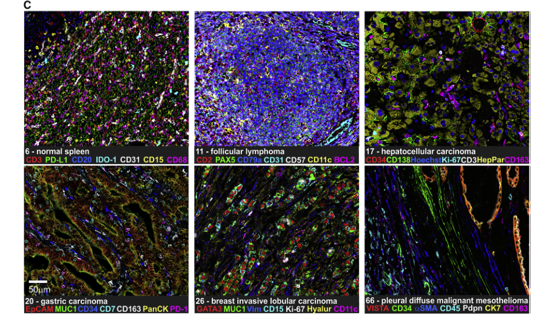

# Coordinated Cellular Neighborhoods Orchestrate Antitumoral Immunity at the Colorectal Cancer Invasive Front

### Fig. 1a

### 结果描述：
Fig. 1a 显示了本研究的概念框架，详细描述了如何通过重新设计的CODEX技术以及先进的计算方法来研究大肠癌（CRC）侵袭前沿的免疫肿瘤微环境（iTME）。具体步骤如下：

1. **患者选择和样本准备**：研究从715名CRC患者的数据库中选择了17名有Crohn's-like反应（CLR）和18名有弥散性炎症浸润（DII）的患者，构建了包含代表性iTME区域的组织微阵列（TMA）。

2. **CODEX技术的优化**：重新设计并优化了CODEX平台，使其适用于福尔马林固定石蜡包埋（FFPE）组织。这包括使用迭代退火、成像和剥离荧光标记的DNA探针。

3. **免疫细胞簇（CT）的鉴定**：通过无监督的X-shift聚类和手动门控方法，识别并验证了28个独特的免疫细胞簇。

4. **细胞邻域（CN）的识别**：基于CT的局部密度，确定了9个不同的CN，并将其在原始组织切片和荧光图像上进行验证。

5. **张量分解分析**：通过非负Tucker张量分解，分析了不同患者群体中CT和CN的耦合，揭示了不同患者群体之间iTME的空间组织差异。

### 图例描述：
Fig. 1a包括以下部分：

1. **患者选择和样本准备**：
- 图例A展示了研究的概念框架，说明如何通过重新设计的CODEX技术和先进的计算方法来研究CRC侵袭前沿的iTME。
- 图例B展示了患者选择的排除标准。
- 图例C展示了134名晚期CRC患者的iTME架构光谱。
- 图例D展示了CRC研究队列患者的特征。
- 图例E展示了CRC研究队列的Kaplan-Meier生存曲线。

### 关键结论：
1. 重新设计的CODEX技术使得在FFPE组织中进行高参数免疫荧光成像成为可能。
2. 使用无监督的聚类方法识别并验证了28个独特的免疫细胞簇。
3. 基于CT的局部密度确定了9个不同的细胞邻域，并在原始组织切片和荧光图像上验证了这些邻域的存在。
4. 通过张量分解分析，揭示了不同患者群体中CT和CN的耦合差异，表明iTME的空间组织在不同患者群体中存在显著差异。

### 分析目的：
图例的目的在于展示研究的总体设计和方法框架，以及患者选择的标准和iTME架构的多样性。通过详细说明CODEX技术的优化和应用，以及无监督聚类和张量分解分析方法的使用，图例旨在阐明如何通过多层次的空间组织分析来深入理解CRC的iTME，并揭示其在不同患者群体中的功能和预后相关性。

*****

### 方法描述：
Fig. 1a展示了研究的概念框架，具体步骤包括：
1. **患者选择和样本准备**：从715名CRC患者中选择17名有Crohn's-like反应（CLR）和18名有弥散性炎症浸润（DII）的患者，构建了包含代表性iTME区域的组织微阵列（TMA）。
2. **CODEX技术的优化**：重新设计并优化CODEX平台，使其适用于福尔马林固定石蜡包埋（FFPE）组织。该技术使用迭代退火、成像和剥离荧光标记的DNA探针。
3. **免疫细胞簇（CT）的鉴定**：通过无监督的X-shift聚类和手动门控方法，识别并验证28个独特的免疫细胞簇。
4. **细胞邻域（CN）的识别**：基于CT的局部密度，确定了9个不同的CN，并在原始组织切片和荧光图像上进行验证。
5. **张量分解分析**：通过非负Tucker张量分解，分析不同患者群体中CT和CN的耦合，揭示不同患者群体之间iTME的空间组织差异。

### 比喻讲解：
1. **患者选择和样本准备**：
想象你在挑选一个城市的街区进行详细研究，你需要从不同类型的街区中挑选一些典型的来代表整个城市。你选择了17个有类似社区中心（如公园）的街区和18个没有这些设施的街区，然后制作了这些街区的详细地图。

2. **CODEX技术的优化**：
就像使用高科技摄像机对这些街区进行拍照，但这些摄像机需要重新设计以适应某些特殊条件（比如拍摄古老建筑的细节）。在这个过程中，你使用了一种特别的摄影技术，可以多次拍照，每次拍摄不同的细节，然后把这些细节合成一张高分辨率的全景图。

3. **免疫细胞簇（CT）的鉴定**：
你对每张街区地图进行详细标记，识别出不同类型的建筑（如住宅、商店、学校等），然后通过一种无监督的分类算法（类似于自动分组软件）把这些建筑归类成28种不同的类型。

4. **细胞邻域（CN）的识别**：
基于这些建筑类型，你确定了每个街区的不同邻里（比如有的街区是商业区，有的是住宅区）。每个邻里都有其独特的建筑组合，并在地图上进行验证，确保这些分类是正确的。

5. **张量分解分析**：
最后，你使用了一种高级的数据分析方法（类似于三维立体模型），把每个街区的建筑和邻里关系放在一起进行分析。这就像是把城市的所有街区拼成一个完整的模型，分析不同街区之间的相互关系，找出那些影响城市整体功能的重要因素。通过这种方法，你揭示了在不同类型的街区中，建筑和邻里的关系是如何不同的，并找出这些差异背后的原因。

*****

### Fig. 1b

### 结果描述：
Fig. 1b展示了本研究选择的患者群体的特点和总体设计，包括以下部分：

1. **排除标准（图例B）**：
- 将接受过术前治疗、肿瘤分期为0-2或未知、没有免疫浸润、材料不足以进行Graham-Appelman评分、低免疫浸润和缺乏滤泡的患者排除在外。
2. **iTME架构光谱（图例C）**：
- 展示了134名晚期CRC患者的iTME架构，从Crohn's-like反应（CLR）到弥散性炎症浸润（DII）的分布情况。
3. **患者特征（图例D）**：
- 描述了选择的患者群体的具体特征，如性别、年龄、癌症类型、位置和分期等，确保CLR和DII患者在这些方面匹配。
4. **生存曲线（图例E）**：
- 显示了CLR和DII患者的Kaplan-Meier生存曲线，明确CLR患者的生存率显著高于DII患者。

### 图例描述：
Fig. 1b包括以下部分：

1. **排除标准（图例B）**：
- 详细列出了患者选择的排除标准，以确保研究中包含的患者具有足够的临床数据和免疫特征。
2. **iTME架构光谱（图例C）**：
- 展示了134名晚期CRC患者的iTME架构分布，涵盖从Crohn's-like反应（CLR）到弥散性炎症浸润（DII）的全范围。
3. **患者特征（图例D）**：
- 列出了研究中包含的患者的详细特征，包括性别、年龄、癌症类型、位置和分期等，确保研究结果的可比性和可靠性。
4. **生存曲线（图例E）**：
- 通过Kaplan-Meier生存曲线展示了CLR和DII患者的生存率差异，明确了两组患者在生存结果上的显著差异。

### 关键结论:
1. **患者选择的严谨性**：通过严格的排除标准，确保了研究中包含的患者具有足够的临床数据和免疫特征，以便于后续的分析和比较。
2. **iTME架构的多样性**：展示了晚期CRC患者中iTME架构的广泛分布，从CLR到DII，强调了研究对象的多样性。
3. **患者特征的匹配性**：确保CLR和DII患者在性别、年龄、癌症类型、位置和分期等方面匹配，从而增强研究结果的可靠性。
4. **生存率的显著差异**：Kaplan-Meier生存曲线明确显示CLR患者的生存率显著高于DII患者，突出了不同iTME架构对生存结果的影响。

### 分析目的：
Fig. 1b的目的是展示研究中选择的患者群体的特点和总体设计，强调了通过严格的排除标准确保研究对象的适当性，展示了iTME架构在晚期CRC患者中的广泛分布，并通过详细的患者特征匹配和生存曲线分析，突显了不同iTME架构对患者生存结果的影响。通过这些图例，研究旨在为后续的免疫肿瘤微环境分析提供坚实的基础，验证不同患者群体之间iTME架构和生存结果的显著差异。

*****

### 方法描述：
Fig. 1b的研究方法旨在展示如何选择和准备大肠癌（CRC）患者样本，以及如何优化CODEX技术来分析这些样本。具体步骤如下：

1. **患者选择**：从一个包含715名CRC患者的数据库中，选择了17名具有Crohn's-like反应（CLR）的患者和18名具有弥散性炎症浸润（DII）的患者。这些患者样本经过严格的选择标准，包括排除接受过术前治疗、病理分期较低（pTNM评分0-2或未知）、免疫浸润缺乏（Klintrup-Mäkinen评分0）、材料不足以进行Graham-Appelman评分等条件。

2. **组织微阵列（TMA）构建**：从选定的患者样本中提取肿瘤侵袭前沿的组织块，并使用高精度TMA技术创建包含这些区域的组织微阵列。每个TMA包含四个代表性区域的组织切片，用于后续的多重标记荧光成像。

3. **CODEX技术的优化**：对CODEX平台进行了重新设计和全面自动化，以适应FFPE组织。这包括迭代退火、成像和剥离荧光标记的DNA探针，使其能够在存档的癌症样本中进行高参数单细胞标记可视化、定量和生物标志物发现。

4. **数据采集和分析**：使用优化后的CODEX技术对TMA进行多标记荧光成像，捕获细胞类型和空间组织的详细信息。通过无监督的X-shift聚类方法识别免疫细胞簇（CT），并通过Voronoi图和接触矩阵进行空间可视化。

### 比喻讲解：
我们可以把整个过程比作一个精心设计的城市探索计划，旨在了解城市的不同区域和居民之间的互动。

1. **患者选择**：就像在地图上挑选一些有代表性的城市，这些城市必须符合某些标准，比如有足够的历史记录，没有经历过重大改造等。选择17个城市代表CLR，18个城市代表DII。

2. **组织微阵列（TMA）构建**：一旦选定了城市，我们从每个城市的中心区域提取一些样本，就像从城市的几个主要街区提取样品一样。然后，将这些样本组合成一个微型城市地图，这个地图展示了每个城市的不同街区。

3. **CODEX技术的优化**：接下来，我们改进了我们的探测设备，使其能够在旧地图（FFPE组织）上工作。这个设备可以像无人机一样反复飞过城市，不断捕捉高分辨率的图像，并标记出每个街区的主要建筑和设施（荧光标记的DNA探针）。

4. **数据采集和分析**：最终，我们使用这个改进的无人机设备，对每个城市地图进行详细的拍摄，记录下每个街区的居民和建筑类型。然后，使用先进的算法（无监督聚类），我们将这些街区分类，并绘制出它们之间的关系图，就像制作出一张详细的城市互动图，展示不同区域之间的联系和互动方式。

通过这种方式，我们不仅能够详细了解每个城市的内部结构，还能发现哪些街区之间的联系最为紧密，这对城市管理和发展有着重要的参考价值。

*****

###  Fig. 1c

### 结果描述：
Fig. 1c展示了大肠癌（CRC）研究队列中134名晚期患者的免疫肿瘤微环境（iTME）架构光谱，显示了从Crohn's-like反应（CLR）到弥散性炎症浸润（DII）的不同类型iTME的分布。具体结果如下：

1. **iTME架构光谱**：图例展示了从CLR到DII的iTME类型在134名患者中的分布情况。这一光谱展示了患者iTME架构的多样性。
2. **CLR与DII的频率**：在这134名患者中，不同类型的iTME架构展示了显著的差异。CLR和DII在不同患者中的分布频率有明显的区别。

### 图例描述：
1. **iTME架构光谱**（图1C）：这一部分图例展示了在134名晚期CRC患者中的iTME架构分布。不同的颜色和条形图表示了从CLR到DII的不同iTME类型在患者中的分布情况。

### 关键结论:
1. CRC患者中存在不同类型的iTME架构，从CLR到DII不等。
2. 这些不同的iTME类型在患者群体中的分布具有显著差异，反映了iTME架构的多样性和复杂性。

### 分析目的：
这个图例的目的是展示晚期CRC患者中iTME架构的多样性，并通过视觉化不同iTME类型在患者中的分布，提供关于这些架构在临床上的重要性和潜在影响的见解。通过对134名患者的iTME架构进行详细分析，研究人员可以深入了解不同类型的iTME如何影响患者的预后和治疗反应，为个性化治疗策略的开发提供依据。

*****

### 方法描述：
Fig. 1c 描述了从一个包含134名晚期大肠癌（CRC）患者的数据库中选取患者，并基于他们的免疫肿瘤微环境（iTME）架构分布情况进行分析。研究团队将患者分为两组：一组表现出Crohn's-like反应（CLR），另一组则表现为弥散性炎症浸润（DII）。这些患者组别的选择基于特定的排除标准，包括排除接受过术前治疗、病理学肿瘤、淋巴结和转移（pTNM）评分为0-2或未知，以及缺乏免疫浸润和滤泡的患者。通过这两个极端的iTME架构分布，研究团队能够在空间上详细研究免疫和肿瘤的相互作用。

### 比喻讲解：
想象你正在策划一个大型城市的调查，这个城市有不同的区域，每个区域的结构和功能都有所不同。你希望了解这些区域如何运作以及它们之间的互动关系。

1. **选择调查区域**：
- 你有一个包含134个城市街区的大数据库。为了有效调查，你决定选择一些具有明显特点的街区。就像选取晚期CRC患者一样，你选择了一些街区，这些街区的建筑风格和人口分布有显著差异。

2. **定义极端样本**：
- 在这些街区中，你挑选了两类截然不同的区域。一类街区有着类似克罗恩病反应的特征，比如很多绿地和花园（代表Crohn's-like反应，CLR）。另一类街区则布满了高密度建筑和居民（代表弥散性炎症浸润，DII）。

3. **排除不符合条件的区域**：
- 为了确保调查的有效性，你排除了一些不符合标准的街区。例如，那些正在大规模翻修的街区（代表接受过术前治疗的患者），或者那些数据不完整的街区（pTNM评分为0-2或未知的患者）。

4. **深入调查这些街区**：
- 现在，你对这些具有典型特点的街区进行详细调查，记录下每个街区的建筑风格、人口密度、绿地覆盖率等。通过比较这些极端样本，你可以更好地了解不同街区的运作方式及其对整体城市健康的影响。

这个比喻帮助我们理解如何通过选择极端样本来深入研究CRC患者的iTME架构分布，并揭示其中的关键差异。研究团队通过选择两类具有代表性的患者群体，从而更好地理解不同免疫反应模式对疾病预后的影响。

*****

### Fig. 1d

### 结果描述：
Fig. 1d 显示了参与CRC研究队列的患者特征。这些特征包括性别、年龄、癌症类型、癌症位置和分期。在这个图中，CLR（Crohn's-like反应）和DII（弥散性炎症浸润）两组患者在这些特征上进行了匹配。匹配结果显示，这两组患者在性别、年龄、癌症类型、癌症位置和分期等方面没有显著差异，从而确保了在比较这两组患者的iTME时，排除了这些潜在混杂因素的影响。

### 图例描述：
Fig. 1d 包括以下内容：
- **性别**：显示CLR和DII患者的性别比例（男性和女性）。
- **年龄**：显示两组患者的年龄分布情况。
- **癌症类型**：显示两组患者的癌症类型，包括不同的病理亚型。
- **癌症位置**：显示癌症在结肠中的具体位置。
- **癌症分期**：显示患者的癌症分期，包括不同的临床分期（I-IV）。

### 关键结论:
- CLR和DII两组患者在性别、年龄、癌症类型、癌症位置和分期上进行了严格匹配，确保了这些特征在两组之间没有显著差异。
- 这种匹配使得比较两组患者的iTME架构和相关免疫反应的研究结果更加可靠，减少了其他变量对结果的影响。

### 分析目的：
Fig. 1d 的目的是展示参与研究的两组CRC患者在基本特征上的匹配情况。通过确保CLR和DII两组患者在性别、年龄、癌症类型、癌症位置和分期等方面没有显著差异，研究能够更加准确地比较两组患者的iTME架构和相关免疫反应。这种匹配设计帮助研究团队排除了其他混杂因素对结果的影响，从而能够更清晰地揭示iTME在不同患者群体中的关键差异和其对疾病预后的影响。

*****

### 方法描述：
Fig. 1d 展示了研究队列中患者的特征，包括性别、年龄、癌症类型、癌症位置和分期。研究通过从数据库中选择符合特定标准的患者，并确保CLR和DII两组患者在这些特征上的匹配，以保证结果的可比性。具体步骤如下：

1. **患者选择标准**：排除了接受过术前治疗、pTNM评分为0-2或未知、没有免疫浸润（Klintrup-Mäkinen评分为0）、材料不足以进行Graham-Appelman评分，以及K-M评分为1且没有或仅有少量滤泡（G-A评分为0或1）的患者。

2. **患者匹配**：在选择CLR和DII患者时，确保两组在性别、年龄、癌症类型、位置和分期上的匹配。这是为了确保两组之间的可比性，使得后续分析结果具有统计学上的有效性。

3. **数据分析**：对患者的特征进行了详细记录和比较，包括使用Kaplan-Meier生存曲线分析患者的总体生存情况。

### 比喻讲解：
**方法描述的比喻讲解**：

1. **患者选择标准**：
想象你在一个庞大的苹果园里挑选苹果，你的任务是挑选两个篮子，每个篮子中的苹果都需要符合特定的标准。首先，你要排除那些已经被虫子咬过或者不新鲜的苹果，这就像是排除那些接受过术前治疗或材料不足以进行评分的患者。接着，你还要确保每个苹果的颜色、大小和形状都符合你的要求，这类似于排除pTNM评分为0-2或未知、没有免疫浸润的患者。

2. **患者匹配**：
在挑选苹果的时候，你还需要确保两个篮子中的苹果看起来尽可能相似。例如，一个篮子中的苹果不能全是红苹果，而另一个篮子中全是绿苹果。你要保证两个篮子里的苹果在颜色、大小和形状上都很匹配。这就像在选择CLR和DII患者时，确保两组在性别、年龄、癌症类型、位置和分期上的匹配。这样你才能公平地比较两个篮子的苹果，或者说是两组患者的数据。

3. **数据分析**：
最后，你记录下每个篮子中苹果的详细信息，比如每个苹果的重量和大小，并且在一段时间后观察它们的保鲜情况。这类似于记录患者的详细特征，并使用Kaplan-Meier生存曲线分析患者的总体生存情况。通过这种方法，你可以得出哪些苹果更耐储存，或者哪些患者的预后更好。

这个过程就像是在一个大型苹果园里挑选和比较苹果，通过严格的选择标准和匹配条件，确保每个篮子中的苹果具有可比性，从而得出可靠的结论。

*****

### Fig. 1e

### 结果描述：
Fig. 1e 展示了通过Kaplan-Meier生存曲线分析CLR（Crohn’s-like反应）和DII（弥散性炎症浸润）患者的总体生存情况。结果表明，CLR患者的总体生存率显著高于DII患者。

具体结果如下：
- Kaplan-Meier生存曲线显示，CLR患者的生存曲线始终高于DII患者。
- 使用log-rank检验对两组生存曲线进行比较，结果显示两组之间的差异具有统计学显著性（p值<0.05）。

### 图例描述：
Fig. 1e 包括以下内容：
- Kaplan-Meier生存曲线，其中CLR患者的生存曲线用实线表示，DII患者的生存曲线用虚线表示。
- X轴代表时间（单位为月），Y轴代表总体生存率（以百分比表示）。
- 图中标示了两组患者的样本量和每个时间点的生存率。
- 图例中注明了使用log-rank检验进行统计分析，并报告了p值。

### 关键结论:
1. CLR患者的总体生存率显著高于DII患者。
2. 生存曲线分析表明，iTME结构与患者的预后密切相关，CLR患者由于具有较多的TLS，其生存情况优于DII患者。

### 分析目的：
图例的目的是通过Kaplan-Meier生存曲线和log-rank检验，展示两种不同iTME结构的CRC患者（CLR和DII）在总体生存率上的显著差异。通过这种分析方法，可以直观地显示出iTME的空间结构如何影响CRC患者的预后，从而为进一步研究iTME在肿瘤免疫应答中的作用提供依据。这一结果强调了在治疗和预后评估中考虑iTME结构的重要性。

*****

### 方法描述：
Fig. 1e 显示了CRC研究队列患者的Kaplan-Meier生存曲线，并使用log-rank检验来比较CLR（Crohn’s-like反应）患者和DII（弥散性炎症浸润）患者的总体生存率。研究方法包括以下步骤：

1. **患者选择**：从715名CRC患者中筛选出符合条件的患者，并分为CLR组和DII组。每组包括17名CLR患者和18名DII患者，这些患者在性别、年龄、癌症类型、位置和分期上进行了匹配。

2. **数据收集**：收集每位患者的临床数据，包括生存时间和死亡情况。所有患者均为晚期CRC患者，并有长期的临床随访数据。

3. **Kaplan-Meier生存分析**：使用Kaplan-Meier方法绘制两组患者的生存曲线。Kaplan-Meier方法通过逐步减少未存活患者数量来计算随时间推移的生存概率。

4. **log-rank检验**：使用log-rank检验比较CLR和DII患者组的生存曲线，确定两组之间的生存差异是否具有统计学显著性。log-rank检验是一种非参数检验，适用于比较两组或多组患者生存曲线。

### 比喻讲解：
想象你正在参加一场马拉松比赛，比赛分为两组，一组是CLR组，另一组是DII组。每位参赛者都在同一起跑线开始比赛。

1. **参赛者选择**：首先，你从所有参赛者中挑选出身体状况相似的选手，将他们分为两组，CLR组和DII组。这就像研究中从715名患者中筛选出符合条件的患者，并将其分为CLR组和DII组。

2. **收集数据**：你记录每位选手在比赛中的表现，包括他们跑完的时间和何时退出比赛。研究中也类似，收集每位患者的生存时间和死亡情况。

3. **绘制生存曲线**：随着比赛的进行，你绘制了一张图表，显示两组选手在不同时间点的存活情况。例如，比赛开始后30分钟，还有多少选手在继续比赛。Kaplan-Meier方法就像是这张图表，逐步减少退出比赛的选手数量，显示随时间推移的存活概率。

4. **比较两组表现**：比赛结束后，你使用log-rank检验比较两组选手的表现，看哪一组在比赛中表现更好。log-rank检验就像是裁判，通过统计方法比较两组的生存曲线，确定哪一组的表现更好，是否存在显著差异。

通过这个比喻，你可以看到Kaplan-Meier生存分析和log-rank检验如何帮助研究人员比较不同患者组的生存情况，从而揭示影响患者预后的关键因素。

*****

### Fig. 1 (Fig.1a-Fig.1e) 中的重要结论：

1. **Fig. 1a: 概念框架**：
- 通过重新设计的CODEX技术和高级计算方法，能够详细研究CRC侵袭前沿的免疫肿瘤微环境（iTME）。
- 通过高参数免疫荧光成像和无监督聚类，识别并验证了28个独特的免疫细胞簇。
- 基于细胞邻域的局部密度，确定了9个不同的细胞邻域，并在原始组织切片和荧光图像上验证了这些邻域的存在。
- 使用张量分解分析揭示了不同患者群体中免疫细胞和细胞邻域的耦合差异。

2. **Fig. 1b: 排除标准**：
- 研究明确了用于选择CRC患者的排除标准，以确保研究样本的质量和一致性。
- 排除标准包括：术前治疗、病理肿瘤分级（pTNM）评分为0-2或未知、缺乏免疫浸润、材料不足以进行Graham-Appelman评分，以及低免疫浸润和缺乏或很少的滤泡等。

3. **Fig. 1c: iTME架构光谱**：
- 134名晚期CRC患者的免疫肿瘤微环境（iTME）展示了从Crohn’s-like反应（CLR）到弥散性炎症浸润（DII）的架构光谱。
- 这种架构光谱揭示了CRC患者中存在的多样化免疫反应模式。

4. **Fig. 1d: 患者特征**：
- 研究中的CRC患者在性别、年龄、癌症类型、位置和分期方面进行了匹配，以确保两组患者在基础特征上的一致性，从而减少混杂变量对结果的影响。

5. **Fig. 1e: Kaplan-Meier生存曲线**：
- Kaplan-Meier生存曲线和log-rank检验表明，CLR患者组的总体生存率显著高于DII患者组。
- 这表明具有Crohn’s-like反应的患者相较于具有弥散性炎症浸润的患者有更好的预后，提示了不同的免疫反应模式对CRC患者预后的影响。

### 重要结论：
- **组织微环境的异质性**：CRC侵袭前沿的免疫肿瘤微环境表现出显著的异质性，且这种异质性与患者预后密切相关。
- **技术创新**：重新设计的CODEX技术使得在福尔马林固定石蜡包埋（FFPE）组织中进行高参数免疫荧光成像成为可能，提供了研究肿瘤微环境的新方法。
- **细胞邻域分析**：基于细胞邻域的分析揭示了不同患者群体中免疫细胞和细胞邻域的耦合差异，为理解免疫反应的空间组织提供了新的视角。
- **预后相关性**：免疫反应模式（如Crohn’s-like反应与弥散性炎症浸润）的差异显著影响CRC患者的总体生存率，提示免疫微环境的组织结构在抗肿瘤免疫中的重要作用。

*****

###  Fig.2a

### 结果描述：
Fig. 2a 展示了重新设计的CODEX工作流程，该流程被优化用于福尔马林固定石蜡包埋（FFPE）组织的高度多重荧光显微镜成像。工作流程包括以下几个关键步骤：

1. **组织微阵列（TMA）的组装**：选择并准备FFPE组织块，构建包含多种癌症和非恶性肿瘤以及正常组织的TMA。
2. **抗体筛选和验证**：筛选、验证并滴定用于CODEX的DNA结合抗体，确保其在FFPE组织中的特异性和效果。
3. **CODEX染色和成像**：使用优化的CODEX平台进行染色、成像和多循环反应，以获取高参数的荧光图像。
4. **数据分析**：使用计算方法进行图像处理、细胞类型识别和空间分析，生成单细胞分辨率的组织图谱。

### 图例描述：
Fig. 2a 包含了CODEX工作流程的各个步骤：

1. **CODEX工作流程**：
- 工作流程从组织块的准备开始，经过抗体染色、图像采集和数据分析，最后生成高参数荧光图像和分析结果。
- 流程图展示了每个步骤的具体操作，包括组织固定、切片、抗体染色和多循环成像。

### 关键结论:
- 重新设计的CODEX平台成功优化用于FFPE组织，能够进行高度多重的荧光成像。
- CODEX技术通过多循环反应和计算方法，能够在单细胞水平上精确识别和分析组织中的细胞类型和空间分布。

### 分析目的：
Fig. 2a 的目的是详细描述重新设计和优化的CODEX工作流程，以展示该技术在FFPE组织中进行高参数荧光成像的能力。通过展示工作流程的每个关键步骤，该图例强调了CODEX技术在分析复杂组织微环境中的应用潜力，并为后续研究提供了技术框架和验证方法。

*****

### 方法描述：
Fig. 2a 描述了CODEX工作流程，通过多轮迭代退火、成像和剥离荧光标记的DNA探针实现高参数免疫荧光成像。以下是详细步骤：

1. **染色和固定**：使用DNA-结合抗体对FFPE组织样本进行染色。抗体结合到组织上的特定位点后，组织样本被固定。
2. **退火和成像**：将荧光标记的DNA探针与抗体上的DNA互补序列退火，随后进行成像以捕获荧光信号。
3. **荧光剥离**：通过化学处理剥离荧光标记，使抗体上的DNA探针可以与新的荧光标记探针结合。
4. **多轮迭代**：重复退火、成像和剥离步骤，直到完成所有标记抗体的成像。
5. **数据处理**：使用CODEX工具包对原始图像进行处理，包括图像拼接、背景减除和去卷积等步骤，以获得高质量的多参数图像数据。

### 比喻讲解：
想象你在一个复杂的拼图游戏中，每块拼图代表一种特定的蛋白质标记，完整的拼图展示了整个组织的复杂结构。下面是比喻解释过程：

1. **染色和固定**：就像先给每块拼图涂上不同的颜色，使其能在整体拼图中准确反映其位置和特性。这里，染色步骤是将不同颜色的颜料（DNA结合抗体）涂在拼图（组织样本）上，然后用胶水（固定剂）固定住。

2. **退火和成像**：现在，你用一个特殊的滤镜（荧光标记的DNA探针）来看这些涂上颜色的拼图。这种滤镜只能看到某一种颜色（特定抗体结合的荧光标记）。然后，你用相机拍照（成像），记录下这个滤镜下看到的颜色。

3. **荧光剥离**：拍完照片后，你用橡皮擦（化学处理）把这个颜色擦掉，让拼图变得干净，以便可以涂上新的颜色。

4. **多轮迭代**：你不断更换滤镜和橡皮擦，每次用不同的颜色标记拼图并拍照，直到所有颜色都被记录下来。这就像反复给拼图涂色、拍照、擦掉，再涂新的颜色，再拍照。

5. **数据处理**：最后，你将所有拍到的照片拼接起来，去掉不需要的背景和模糊的部分，得到一张清晰的、多色的拼图图像，展示了整个组织的复杂结构和各个蛋白质标记的位置。

通过这种方式，你不仅能看到每块拼图的颜色，还能看到整个拼图的复杂美丽，了解其内部的详细结构和各个部分的相互关系。

*****

### Fig. 2b

### 结果描述：
Fig. 2b 展示了多肿瘤组织微阵列（TMA）中使用56种标记的CODEX面板进行成像的结果。结果显示了多个组织核心的七色图像，这些图像展示了不同组织类型中多种蛋白质标记的表达模式。具体的标记包括免疫细胞标记（如CD3、CD20、CD68等）和其他相关的功能标记（如PD-L1、IDO-1等）。

### 图例描述：
Fig. 2b 包含以下部分：

1. **七色总览图像**：显示了多肿瘤TMA的七色总览图像，使用56种标记的CODEX面板进行成像。每个核心代表不同类型的组织，包括正常组织和不同类型的肿瘤组织。
2. **高倍放大图像**：展示了选定的组织核心的高倍放大七色图像，详细展示了这些标记在不同组织中的具体分布和表达模式。

### 关键结论:
1. 使用56种标记的CODEX面板能够在多个不同组织类型中成功检测到多种蛋白质标记的表达，展示了该技术在多参数单细胞标记可视化和定量分析中的有效性。
2. CODEX技术能够在多种肿瘤和正常组织中生成高质量的荧光图像，这些图像展示了细胞类型和功能标记的预期分布模式。

### 分析目的：
Fig. 2b 的目的是展示使用优化的CODEX技术在多肿瘤TMA中进行高参数多重荧光成像的能力和效果。通过展示不同组织类型中多种标记的表达图像，图例证明了该技术在广泛的组织类型中进行高精度标记和成像的有效性。这为后续的单细胞分析和组织微环境研究提供了强有力的支持，并展示了CODEX技术在临床样本分析中的潜力。

*****

### 方法描述：
Fig. 2b展示了重新设计的CODEX平台在福尔马林固定石蜡包埋（FFPE）组织中的应用。具体方法如下：

1. **CODEX工作流程**：
- **样品准备**：从70种不同类型的肿瘤和非恶性肿瘤及16种正常组织中选择了70个独特的组织样本，构建了多肿瘤TMA。
- **抗体验证**：使用多轮反应和图像采集来验证抗体组合，确保在多个周期内的抗体信号一致性和组织完整性。
- **成像与分析**：使用重新设计的CODEX平台对这些TMA进行多参数荧光成像，获取每个组织核心的高分辨率图像。
- **数据处理**：使用CODEX Toolkit上传、处理和拼接TIFF图像文件，生成超堆栈图像并进行去模糊和背景减除。

### 比喻讲解：
重新设计的CODEX平台在FFPE组织中的应用可以比喻为一个高效的团队协作流程，详细步骤如下：

1. **样品准备**：
- 就像在进行一场国际烹饪比赛，每个参赛者都准备了70道独特的菜肴，这些菜肴代表了各种不同的烹饪风格和食材。这些菜肴被整齐地排列在一个展示台上，便于评委们品尝和评判。

2. **抗体验证**：
- 比喻为一道道菜肴的准备和烹饪过程，每道菜都需要经过多轮的调味和烹调，以确保每道菜在每一个步骤中都能保持一致的味道和质感。这就像在多个反应周期中验证抗体组合，确保每个周期内的抗体信号保持一致，组织结构不受破坏。

3. **成像与分析**：
- 比喻为评委们对每道菜进行品尝和评分。评委们需要用高分辨率的味觉和视觉感受来评判每道菜的味道、质感和外观。在CODEX平台中，这一步骤是通过多参数荧光成像技术获取每个组织核心的高分辨率图像。

4. **数据处理**：
- 就像评委们在比赛结束后将所有菜肴的评分数据整理、分析并综合评价每个参赛者的表现。在CODEX平台中，这一步骤通过CODEX Toolkit上传、处理和拼接TIFF图像文件，生成超堆栈图像并进行去模糊和背景减除，以获得清晰且有用的图像数据。

通过这个比喻，我们可以更容易地理解重新设计的CODEX平台在FFPE组织中的应用过程，确保在多个周期内的抗体信号一致性和组织完整性，从而获得高质量的多参数荧光成像数据。

*****

### Fig.2c

### 结果描述：
Fig. 2c展示了使用重新设计的CODEX平台对多个肿瘤和正常组织样本进行多参数荧光成像的结果。具体包括：

1. **组织样本的高分辨率图像**：
- 显示了正常脾脏、滤泡性淋巴瘤、肝细胞癌、胃癌、乳腺浸润性小叶癌和胸膜弥漫性恶性间皮瘤的七色高倍放大图像。

2. **预期抗原分布模式**：
- 每种组织样本中，抗体标记的抗原分布与预期一致。例如：
- 脾脏组织显示正常的红髓和白髓分布（CD3、CD20、CD68），存在粒细胞（CD15），红髓巨噬细胞中IDO-1的定位，以及脾窦内皮细胞中PD-L1的显著表达。
- 在间皮瘤中，检测到强烈且普遍的VISTA表达，这与最近的基因组特征研究结果一致。

### 图例描述：
Fig. 2c包括以下部分：

1. **多肿瘤TMA的七色高倍放大图像**：
- 展示了正常脾脏、滤泡性淋巴瘤、肝细胞癌、胃癌、乳腺浸润性小叶癌和胸膜弥漫性恶性间皮瘤的七色高倍放大图像。
- 各种抗体标记的抗原分布在每种组织样本中均可见，显示了高质量的多参数荧光成像结果。

### 关键结论:
1. **CODEX平台的有效性**：
- 重新设计的CODEX平台能够成功应用于FFPE组织，显示出多参数荧光成像的高分辨率和高灵敏度。
- 不同组织样本中的抗原分布与预期一致，验证了抗体的特异性和成像方法的可靠性。

2. **间皮瘤中特异标记的检测**：
- 检测到间皮瘤中强烈且普遍的VISTA表达，证明了该平台在检测肿瘤特异性标记中的应用潜力。

### 分析目的：
Fig. 2c的目的在于展示重新设计的CODEX平台在多种肿瘤和正常组织中的应用效果，通过多参数荧光成像验证抗体的特异性和成像方法的可靠性。通过展示正常脾脏、滤泡性淋巴瘤、肝细胞癌、胃癌、乳腺浸润性小叶癌和胸膜弥漫性恶性间皮瘤的高分辨率图像，该图例旨在证明该平台在FFPE组织中的应用效果，并展示其在多参数检测中的高灵敏度和高分辨率，尤其是在检测肿瘤特异性标记方面的潜力。

*****

### 方法描述：
Fig. 2c 显示了高倍显微镜下的七色图像，这些图像展示了多种组织核心在使用56个标记的CODEX面板成像后的结果。具体步骤如下：

1. **组织微阵列（TMA）的组装**：从多种组织（包括正常组织和多种癌症组织）中选择70个独特的组织，构建了一个多肿瘤TMA。

2. **组织固定和处理**：使用优化后的CODEX方法，对FFPE组织进行迭代退火、成像和剥离荧光标记的DNA探针，进行多循环反应和图像采集。

3. **抗体筛选和验证**：使用DNA连接的抗体对组织进行染色，确保特异性和信号强度，通过单独染色和多循环实验进行验证。

4. **图像采集和处理**：使用Akoya CODEX仪器和软件，自动完成成像和流体交换。图像采集后，通过代码工具包进行图像拼接和漂移补偿，去除背景噪音并创建超堆栈图像。

5. **标记物的可视化和验证**：使用特定抗体对不同组织核心进行染色，通过显微镜成像展示了正常脾脏、滤泡性淋巴瘤、肝细胞癌、胃癌、乳腺浸润性小叶癌和胸膜弥漫性恶性间皮瘤等多种组织的抗原分布模式。

### 比喻讲解：
想象你是一个艺术家，负责创作一幅大型壁画，但这幅壁画不是用普通的颜料，而是用特殊的发光颜料绘制的。你需要在壁画上展示不同的场景和人物，比如城市景观、乡村风光和各种活动。每个场景都需要用不同颜色的发光颜料来描绘细节。

1. **选材和准备**：
就像艺术家选择画布一样，科学家们从多种组织中选择了70个不同的组织，包括正常组织和多种癌症组织，并将这些组织样本排列成一个多肿瘤组织微阵列（TMA）。这就像准备好一个大型的、混合了多种景观的画布。

2. **染色和处理**：
你使用了一种特殊的染料，这种染料可以在光照下发光。科学家们使用了重新设计的CODEX方法，将组织样本进行处理，就像在画布上依次涂上不同颜色的发光颜料。这个过程包括迭代退火、成像和剥离荧光标记的DNA探针，确保每一层染色都能准确地显示组织中的特定结构和细胞类型。

3. **抗体筛选和验证**：
就像选择不同颜色的颜料以确保每个颜色在光照下都能准确显示一样，科学家们选择并验证了特定的抗体，这些抗体连接着可以发光的DNA探针，用来染色组织。这一步确保了每种染色都是准确且有特异性的。

4. **图像采集和处理**：
当壁画完成后，你需要在不同光照条件下拍摄这幅壁画的照片，以捕捉每种颜色的发光效果。科学家们使用CODEX仪器和软件，自动进行成像和流体交换。拍摄完成后，使用软件将图像拼接在一起，去除背景噪音，就像在照片中调整亮度和对比度，确保每个细节都清晰可见。

5. **标记物的可视化和验证**：
最后，你展示了完成的壁画，每个场景都清晰可见。科学家们使用特定抗体对不同组织核心进行染色，通过显微镜成像展示了多种组织的抗原分布模式。这一步确保了每个组织中的细胞和结构都能通过荧光染色清晰地展示出来。

通过这种比喻，你可以更容易理解Fig. 2c中展示的复杂实验过程，像艺术家创作和展示一幅多层次、细节丰富的壁画一样，科学家们使用先进的技术对多种组织进行染色和成像，以展示其内部的细微结构。

*****

### 重要结论：

**Fig. 2a-2c的重要结论如下：**

1. **CODEX工作流程优化（Fig. 2a）：**
- 重新设计并优化了CODEX平台，使其适用于福尔马林固定石蜡包埋（FFPE）组织。这包括使用迭代退火、成像和剥离荧光标记的DNA探针，实现高参数免疫荧光成像。
- 优化后的CODEX方法可以在单个组织切片中检测多达56种蛋白标记，从而能够详细地描述组织的细胞和微环境特征。

2. **多肿瘤组织微阵列（TMA）的高通量分析（Fig. 2b）：**
- 使用56个标记的CODEX面板对多种组织核心（包括正常组织和多种癌症组织）进行了高通量分析。
- 通过七色图像展示了不同组织核心的详细标记分布，验证了CODEX技术在多种组织类型中的适用性和可靠性。

3. **特定组织标记物的分布模式验证（Fig. 2c）：**
- 在多个组织核心中展示了特定抗原（如脾脏、滤泡性淋巴瘤、肝细胞癌、胃癌、乳腺浸润性小叶癌和胸膜弥漫性恶性间皮瘤）的分布模式，证实了这些标记物的预期分布。
- 通过高倍显微镜成像，展示了每个组织核心的细节和标记物分布，验证了CODEX技术在细胞水平上的高分辨率和多重标记检测能力。

**总结：**
这些结论表明，重新设计的CODEX平台能够成功应用于FFPE组织，能够高通量、多参数地分析多种组织类型，并且通过详细的标记物分布验证了其可靠性和适用性。

*****

### Fig.3a

### 结果描述：
Fig. 3a 展示了用于组装大肠癌（CRC）组织微阵列（TMA）的示意图。TMA包括代表性区域，这些区域来自具有Crohn’s-like反应（CLR）和弥散性炎症浸润（DII）的患者。在每个患者样本中，选择了4个代表性的iTME区域，包括富含淋巴滤泡（CLR组）和弥散性免疫浸润（DII组）的区域。这些组织区域用于进行56标记的CODEX成像，以分析iTME的空间结构和细胞组成。

### 图例描述：
- **图例3A**：展示了大肠癌（CRC）组织微阵列（TMA）组装的示意图。蓝色点代表淋巴滤泡/TLSs。
- **图例3B**：展示了CLR和DII患者代表性TMA核心的七色图像。
- **图例3C**：展示了聚类细胞类型（CT）的Voronoi图，合并以减少复杂性。
- **图例3D**：展示了八个免疫细胞簇在所有CRC患者中的频率，以及分别在CLR和DII患者中的频率。
- **图例3E**：展示了CLR和DII患者中CT丰度的主成分分析（PCA）。
- **图例3F**：展示了主成分2中的CT载荷。

### 关键结论:
1. 使用56标记的CODEX成像技术，可以详细分析大肠癌（CRC）侵袭前沿的免疫肿瘤微环境（iTME）。
2. 在CLR和DII患者中，免疫细胞簇（CT）的频率和分布存在显著差异。
3. 主成分分析（PCA）显示了不同患者组中的CT丰度变化，提示了免疫细胞在iTME中的特定功能和空间分布。

### 分析目的：
通过Fig. 3a的示意图，研究者展示了如何从CRC患者中选择代表性iTME区域，并组装成组织微阵列（TMA），以便使用CODEX技术进行多重标记成像和空间分析。这一过程的目的是详细描述iTME的细胞组成和空间结构，并比较不同患者组之间的差异，从而揭示iTME在抗肿瘤免疫中的作用和潜在的临床预后标志物。

*****

### 方法描述：
Fig. 3a描述了在CRC侵袭前沿组装组织微阵列（TMA）的过程。研究人员从715名CRC患者的数据库中选择了17名有Crohn's-like反应（CLR）和18名有弥散性炎症浸润（DII）的患者。这两个患者组分别代表了iTME架构的两个极端。每个患者组的TMA包含了4个代表性的iTME区域。

1. **样本选择**：研究选择了符合标准的患者，并根据其iTME特征将其分为CLR和DII两个组。
2. **TMA的构建**：从每个患者组中选择4个代表性的iTME区域，并将这些区域嵌入到组织微阵列中。
3. **标记和成像**：使用56个标记进行CODEX成像，标记免疫细胞类型和其他组织成分。
4. **数据分析**：通过无监督的X-shift聚类方法分析和识别CT，并通过手动门控验证这些CT。

### 比喻讲解：
可以将Fig. 3a的方法比喻为制作一本详尽的城市地图，以便更好地了解城市中各个区域的功能和组成。

1. **样本选择**：这就像是从一个大城市中选择了两个不同类型的社区，一个社区是居民密集区（CLR），另一个社区是商业区（DII）。研究人员确保选择的社区具有代表性，并且两个社区的其他变量（如人口结构、地理位置等）尽可能匹配。

2. **TMA的构建**：就像是从每个社区中选择了4个具有代表性的街区，将这些街区的详细信息放入一个大地图中。这个大地图（TMA）包含了所有选择的街区，以便能够在一个整体框架下进行详细分析。

3. **标记和成像**：就像是在地图上使用不同的颜色和符号标记每个街区的特征。例如，用红色标记住宅区，用蓝色标记商业区，用绿色标记公园等。这样可以清楚地看到每个街区的组成和功能。

4. **数据分析**：然后，通过先进的计算方法（X-shift聚类）分析这些标记的数据，识别出每个街区的特征，并通过手动验证确保这些特征的准确性。这就像是通过数据分析和实地考察确认每个街区的真实情况，确保地图上的信息准确无误。

通过这种方式，研究人员能够详细了解CRC侵袭前沿的iTME架构，并比较不同患者组之间的差异，从而为癌症治疗提供有价值的见解。

*****

### Fig.3b

### 结果描述：
Fig. 3b展示了代表性TMA核心的七色图像，这些图像分别来自有Crohn's-like反应（CLR）和弥散性炎症浸润（DII）患者。图像中显示了在不同患者组中的免疫肿瘤微环境（iTME）的空间组成。图中展示了多个标记的表达，这些标记用于识别不同类型的免疫细胞和其他组织成分。CLR患者的核心显示了丰富的淋巴滤泡结构，而DII患者的核心则显示了缺乏这种结构的弥散性炎症浸润。

### 图例描述：
Fig. 3b的图例描述了从两个患者组（CLR和DII）中选取的代表性TMA核心的七色图像。每个核心图像展示了使用56个标记的CODEX成像结果。图像中的颜色代表了不同的免疫细胞类型和其他组织成分，帮助研究人员识别和比较不同患者组的iTME架构。

### 关键结论:
1. CLR患者的iTME中存在丰富的淋巴滤泡结构，这些结构被认为与较好的预后相关。
2. DII患者的iTME中缺乏淋巴滤泡结构，而是以弥散性炎症浸润为特征，这与较差的预后相关。
3. 使用CODEX技术可以高效地标记和成像多种免疫细胞类型和其他组织成分，提供关于iTME的详细空间信息。

### 分析目的：
Fig. 3b的目的是展示在两个不同的CRC患者组（CLR和DII）中，iTME的空间组成和结构差异。通过展示七色图像，研究人员能够清楚地识别和比较不同免疫细胞类型和组织成分在不同患者组中的分布和密度。这样，能够更好地理解不同类型的iTME如何影响患者的预后，并为个性化的癌症治疗策略提供数据支持。

*****

### 方法描述：
Fig. 3b展示了CLR（Crohn's-like反应）和DII（弥散性炎症浸润）患者的代表性TMA（组织微阵列）核心的七色图像。这些图像通过优化的CODEX（共检测索引）技术获取，该技术允许在单个组织切片中进行高参数免疫荧光成像。每个TMA核心都显示了多个免疫细胞类型的空间分布。

### 比喻讲解：
假设你正在观察一个城市的鸟瞰图，想要了解不同街区的功能和特点。每个街区都有其独特的建筑风格和居民类型。现在，你有一个特殊的透视镜，可以让你同时看到城市的不同层面和活动。

1. **TMA的准备和选择**：
- 就像你选择城市中的特定街区进行详细观察一样，研究人员选择了17名CLR患者和18名DII患者的组织样本，代表了这两种不同的免疫肿瘤微环境（iTME）架构。

2. **CODEX技术的优化和应用**：
- 想象你有一个强大的望远镜，可以同时看到城市的多种活动。CODEX技术类似于这种望远镜，它使用带有DNA条形码的抗体，通过反复的荧光染色和洗脱步骤，实现对FFPE（福尔马林固定石蜡包埋）组织样本的高参数成像。

3. **高参数免疫荧光成像**：
- 就像通过望远镜你可以区分城市中的不同建筑、车辆和人群，CODEX技术允许在单个组织切片中同时检测和成像多达56种不同的蛋白标记，从而识别和定位各种免疫细胞类型。

4. **图像处理和分析**：
- 当你从望远镜中观察到复杂的城市活动时，你需要分析和解释这些观察结果。研究人员通过图像处理和分析技术，对每个TMA核心中的免疫细胞进行识别和量化，生成七色图像来展示不同细胞类型的空间分布。

通过这种方式，Fig. 3b展示了如何使用优化的CODEX技术对不同CRC患者的iTME进行详细的空间分析，就像通过高倍望远镜观察和理解城市中不同街区的活动一样。这种方法帮助研究人员揭示了与不同预后相关的免疫细胞分布模式，为改进癌症免疫治疗提供了新的视角。

*****

### Fig.3c

### 结果描述：
Fig. 3c展示了通过Voronoi图可视化的免疫细胞簇（CT）的空间分布。这些图显示了CLR（Crohn's-like反应）和DII（弥散性炎症浸润）患者的代表性TMA（组织微阵列）核心。每个核心中的细胞被分配到不同的CT，Voronoi图通过多边形展示每个细胞邻近的区域，从而揭示了各CT的空间组织。图中通过合并相似的簇来简化可视化，显示了8个主要的免疫细胞簇及其在所有CRC患者、CLR患者和DII患者中的频率。

### 图例描述：
- **图例A**：示意图显示了CRC TMA的组装过程。蓝点代表滤泡/TLSs。
- **图例B**：CLR和DII患者的代表性TMA核心的七色图像。
- **图例C**：免疫细胞簇的Voronoi图，通过合并簇以简化可视化。
- **图例D**：8个免疫簇及其在所有CRC患者（顶部）、CLR患者和DII患者（底部）中的频率。
- **图例E**：CLR和DII患者中CT丰度的主成分分析（PCA）。
- **图例F**：主成分2中的CT负载。

### 关键结论：
1. 通过Voronoi图可视化的免疫细胞簇显示了CRC患者iTME的复杂空间组织。
2. 不同免疫细胞簇在CLR和DII患者中的频率显示了显著的差异，反映了iTME在这两组患者中的不同组成和结构。
3. PCA分析揭示了驱动这些差异的CT组合，进一步表明了免疫细胞在不同患者群体中的分布和功能差异。

### 分析目的：
Fig. 3c的目的是展示通过优化的CODEX技术和Voronoi图对CRC患者iTME中的免疫细胞簇进行详细的空间分析。这些图揭示了不同免疫细胞簇在CLR和DII患者中的分布模式，帮助研究人员理解iTME的复杂空间组织及其在不同预后中的作用。通过展示CT的空间分布和频率，图例为后续分析提供了基础，尤其是在理解免疫细胞在抗肿瘤免疫反应中的作用方面。

*****

### 方法描述：
Fig. 3c的方法涉及使用Voronoi图可视化聚类的免疫细胞簇（CT）。具体步骤如下：

1. **背景减除和细胞分割**：从CODEX成像数据中去除背景噪音并分割出单个细胞。
2. **无监督聚类和人工门控**：应用无监督的X-shift聚类算法，根据标记物的表达谱识别和验证28个独特的细胞簇。
3. **Voronoi图生成**：使用Voronoi算法生成图形，其中每个细胞簇被分配一个独特的颜色。Voronoi图将图像空间划分为多个区域，每个区域代表一个细胞簇。
4. **合并和简化**：为了简化可视化，将聚类结果合并为几个主要类别。

### 比喻讲解：
假设你要组织一场大型嘉年华会，而每个参展商都有自己独特的展位。你的目标是把展位布置得井井有条，并且用一种方式展示出来，让游客可以一眼看到展位的分布情况。

1. **清理场地和划分展位**：首先，你需要清理嘉年华会场地，把垃圾和杂物都清除干净。然后，你会把场地划分成许多小块，每一块都代表一个展位（背景减除和细胞分割）。

2. **识别展位类型**：接下来，你需要识别每个展位的类型。比如，有些展位卖食品，有些展位卖手工艺品，还有些展位提供游戏和娱乐项目。你通过检查每个展位的特征（比如卖的东西）来分类（无监督聚类和人工门控）。

3. **绘制展位图**：为了让游客更方便地找到他们感兴趣的展位，你决定制作一个展位分布图。你使用一种称为Voronoi图的技术，这就像是在场地上放置每个展位的标记点，然后根据这些标记点把场地划分成多个区域。每个区域代表一个展位的范围，并用不同的颜色标记（生成Voronoi图）。

4. **简化展示**：为了让展位图更清晰，你将相似的展位合并成几个主要类别。例如，所有卖食品的展位用一种颜色，所有卖手工艺品的展位用另一种颜色。这使得展位图更易于理解（合并和简化）。

通过这些步骤，你成功地制作了一张嘉年华会展位的分布图，让游客可以一目了然地找到自己感兴趣的展位。这就像研究人员通过Voronoi图展示免疫细胞簇的分布一样，使他们能够更清晰地理解这些细胞在组织中的分布和功能。

*****

### Fig.3d

### 结果描述：
Fig. 3d展示了在所有CRC患者中以及分别在CLR和DII患者中的八个主要免疫细胞簇（CT）的频率。数据中共包含132,437个细胞，其中在CLR患者中有57,894个细胞，在DII患者中有74,543个细胞。

1. **总体免疫细胞簇频率**：图中上部展示了在所有CRC患者中八个主要免疫细胞簇的频率。每个柱状图代表一个免疫细胞簇的频率，标注了不同细胞类型的比例。

2. **CLR和DII患者的频率**：图中下部分别展示了在CLR和DII患者中八个主要免疫细胞簇的频率。CLR患者和DII患者的柱状图分别用不同颜色标示，展示了在这两类患者中不同免疫细胞簇的差异。

### 图例描述：
Fig. 3d由三部分组成：

1. **顶部**：显示了八个免疫细胞簇在所有CRC患者中的总体频率。
2. **中部**：显示了CLR患者中每个免疫细胞簇的频率。
3. **底部**：显示了DII患者中每个免疫细胞簇的频率。

每个部分中，柱状图展示了不同免疫细胞簇的频率，并用不同颜色区分，以便比较不同患者群体中的免疫细胞组成。

### 关键结论:
1. **总体频率**：在所有CRC患者中，免疫细胞簇的分布揭示了主要免疫细胞类型的存在和比例。
2. **患者群体差异**：CLR患者和DII患者在某些免疫细胞簇的频率上存在显著差异。例如，CLR患者中B细胞频率较高，而DII患者中巨噬细胞频率较高。这些差异可能与患者的预后相关。
3. **免疫细胞亚群**：在CLR和DII患者中，CD8+ T细胞和调节性T细胞（Treg）簇的频率无显著差异。

### 分析目的：
Fig. 3d的目的是展示不同CRC患者群体中的免疫细胞组成，以揭示与患者预后相关的潜在免疫特征。通过比较CLR和DII患者的免疫细胞簇频率，研究者可以识别出不同患者群体中的免疫特征差异。这些信息有助于理解免疫细胞在抗肿瘤免疫中的作用，并可能为个性化治疗策略的开发提供依据。

*****

### 方法描述：
Fig. 3d 的方法描述涉及使用重新设计的CODEX技术和无监督聚类方法来鉴定和量化CRC侵袭前沿免疫肿瘤微环境（iTME）的免疫细胞簇（CT）。具体步骤如下：

1. **组织微阵列（TMA）准备**：从715名CRC患者中选择具有Crohn's-like反应（CLR）和弥散性炎症浸润（DII）特征的患者，构建组织微阵列（TMA）。
2. **CODEX多标记荧光显微术**：使用56种标记物对TMA进行高参数免疫荧光成像，以识别各种免疫细胞类型。
3. **数据处理和细胞分割**：对获得的图像进行处理，包括细胞分割和像素强度定量。
4. **无监督聚类**：使用X-shift算法对免疫细胞进行无监督聚类，识别和验证28个独特的免疫细胞簇。
5. **Voronoi图和免疫细胞簇频率分析**：使用Voronoi图形可视化免疫细胞簇，并量化每个免疫细胞簇在所有患者和分组患者中的频率。
6. **主成分分析（PCA）**：对免疫细胞簇的频率进行主成分分析，识别驱动差异的主要成分。

### 比喻讲解：
为了更好地理解Fig. 3d的实现过程，我们可以用一个比喻来描述：

**比喻：城市公园里的鸟类调查**

想象你是一个鸟类学家，你要对城市公园里的鸟类进行详细调查。你的任务是确定公园里不同种类的鸟类数量和分布，并了解哪些鸟类在不同的区域出现得更多。

1. **组织微阵列（TMA）准备**：
- 就像你选择了几个公园中的特定区域（TMA），这些区域有各种特征，例如有些地方有很多树（CLR），有些地方是开放的草地（DII）。

2. **CODEX多标记荧光显微术**：
- 你带着一个高科技望远镜（CODEX技术），这个望远镜能帮助你同时观察到许多种不同的鸟类（56种标记物）。

3. **数据处理和细胞分割**：
- 当你看望远镜时，你拍摄了许多照片（图像处理），每张照片里都有很多鸟类。你要把这些鸟类从背景中分割出来（细胞分割和像素定量）。

4. **无监督聚类**：
- 然后，你用一种智能算法（X-shift算法）来分析这些鸟类照片，自动将相似的鸟类分成不同的群体（28个独特的免疫细胞簇）。

5. **Voronoi图和免疫细胞簇频率分析**：
- 你用一种叫做Voronoi图的方法来绘制这些鸟类群体的分布情况，就像在地图上标记每个鸟群的栖息地。你还统计了每种鸟类在所有公园和不同区域中的数量（频率分析）。

6. **主成分分析（PCA）**：
- 最后，你进行主成分分析（PCA），这就像是找出哪些鸟类群体在不同区域之间有显著的差异，帮助你理解这些差异背后的原因（驱动因素）。

通过这个比喻，你可以看到Fig. 3d的方法如何通过高科技工具和智能算法来研究复杂的生物系统，揭示了CRC侵袭前沿iTME中免疫细胞的组织和功能差异。

*****

### Fig.3e

### 结果描述：
Fig. 3e 显示了主成分分析（PCA）的结果，旨在通过CT（免疫细胞簇）的丰度区分Crohn’s-like反应（CLR）患者和弥散性炎症浸润（DII）患者。分析结果表明，前两个主成分在CLR和DII患者中表现出显著的差异。这两个主成分的组合使得这两类患者在主成分空间中分离开来，表明不同的免疫细胞簇在这两类患者中有不同的分布和丰度。

### 图例描述：
Fig. 3e 包含以下部分：

- **PCA 分析图**：
- 横轴（主成分1）和纵轴（主成分2）分别代表解释数据总变异量的两个主要成分。
- 图中展示了CLR患者（蓝色点）和DII患者（橙色点）在这两个主成分上的分布。
- 每个点代表一个患者的CT丰度数据在主成分空间中的投影。
- 图例显示，主成分1和主成分2在CLR患者和DII患者中具有不同的加权值，这表明它们在细胞类型上的不同分布。

### 关键结论:
1. PCA分析表明，主成分1和主成分2能够区分CLR和DII患者，反映了两者在免疫细胞簇丰度上的显著差异。
2. 这两个主成分的组合使得CLR和DII患者在主成分空间中明显分离，进一步验证了两类患者在iTME中的免疫细胞构成存在显著差异。

### 分析目的：
Fig. 3e的目的是使用主成分分析来总结和展示CLR和DII患者在免疫细胞簇丰度上的主要差异。通过将复杂的多维数据简化为两个主要成分，该图例帮助研究人员识别和理解不同类型CRC患者的免疫细胞簇分布的关键差异。这种分析有助于揭示可能驱动不同临床结局的关键免疫特征，为未来的诊断和治疗提供依据。

*****

### 方法描述：
Fig. 3e中的方法是主成分分析（PCA），用于识别不同患者组（CLR和DII）之间免疫细胞簇（CT）组成的主要变异组合，并评估这些变异在患者组之间的差异。具体步骤如下：

1. **数据收集和预处理**：收集从CODEX技术获得的免疫细胞簇（CT）的频率数据，并进行标准化处理。

2. **计算协方差矩阵**：基于CT频率数据计算协方差矩阵，以确定不同CT之间的相关性。

3. **特征值和特征向量分解**：对协方差矩阵进行特征值分解，得到特征值和特征向量。特征值代表每个主成分的变异量，特征向量则定义了这些主成分的方向。

4. **降维和主成分选择**：选择具有最大特征值的前两个主成分，以捕获数据中最大的变异。

5. **投影和可视化**：将每个患者的CT频率数据投影到前两个主成分上，并在二维空间中可视化这些投影，以观察不同患者组之间的差异。

6. **统计分析**：使用t检验比较CLR和DII患者在前两个主成分上的得分，确定这些主成分是否显著区分了患者组。

### 比喻讲解：
想象你正在整理一个大家庭的照片相册。照片中有很多人，每个人都有不同的姿势和表情。为了更好地理解这些照片中的变化和相似性，你决定用一个简单的方法来整理这些照片。

1. **数据收集和预处理**：首先，你把每张照片上的人的姿势和表情记录下来，就像记录每个免疫细胞簇（CT）的频率。

2. **计算协方差矩阵**：接下来，你比较这些姿势和表情，看看哪些人常常一起出现，就像计算协方差矩阵来确定不同CT之间的相关性。

3. **特征值和特征向量分解**：然后，你找到了一些特定的姿势和表情组合，它们可以解释大多数照片中的变化。这些组合就像是特征值和特征向量，特征值告诉你每个组合的重要性，特征向量则定义了这些组合的方向。

4. **降维和主成分选择**：你选择了最重要的两个组合，因为它们能够解释大多数照片中的变化。这就像选择具有最大特征值的前两个主成分。

5. **投影和可视化**：你把每张照片中的姿势和表情投影到这两个组合上，并在一个二维空间中展示出来。这让你可以很容易地看到不同照片之间的相似性和差异，就像将每个患者的CT频率数据投影到前两个主成分上进行可视化。

6. **统计分析**：最后，你比较了这些投影在不同家庭成员组之间的分布，看看是否有显著的差异。这就像使用t检验比较CLR和DII患者在前两个主成分上的得分，以确定这些主成分是否显著区分了患者组。

通过这种方式，你可以更好地理解和整理家庭照片中的复杂变化，就像通过PCA方法分析和可视化不同患者组之间的免疫细胞簇组成。

*****

###  Fig.3f

### 结果描述：
Fig. 3f显示了主成分2（PC2）的细胞簇（CT）负载情况，揭示了在CLR和DII患者之间的CT组成差异。PC2主要反映了非免疫和非肿瘤细胞簇的变异，包括构成组织结构成分的细胞簇，如血管和结缔组织。PC2在DII患者中显示出更高的负载，这意味着DII患者的这些非免疫和非肿瘤细胞簇在其iTME中具有更高的代表性。

### 图例描述：
图例F展示了主成分2（PC2）中的细胞簇负载情况。该图显示了不同细胞簇在PC2中的权重。非免疫和非肿瘤细胞簇（如血管和结缔组织）在PC2中具有较高的正权重，表明它们对PC2的贡献较大。

### 关键结论:
主成分2（PC2）揭示了CLR和DII患者之间的非免疫和非肿瘤细胞簇的组成差异。DII患者在PC2中具有更高的负载，表明其iTME中非免疫和非肿瘤细胞簇的比例较高，这可能与其预后相关。

### 分析目的：
图例的目的是通过主成分分析（PCA）来识别和展示不同患者组（CLR和DII）之间在iTME中细胞簇组成的主要变异源。具体来说，通过展示PC2的负载情况，图例旨在强调非免疫和非肿瘤细胞簇在不同患者组中的显著差异，并探讨其在抗肿瘤免疫反应中的潜在影响。

*****

### 方法描述：
Fig. 3f 使用主成分分析（PCA）来识别驱动CRC患者之间差异的细胞类型组合。具体步骤如下：

1. **数据准备**：首先收集了所有患者样本中的免疫细胞簇（CT）数据，包括细胞类型的数量和比例。
2. **PCA分析**：使用PCA方法，对这些CT数据进行降维处理，找到主要的主成分，这些主成分是能够解释数据最大变异的线性组合。
3. **主成分解释**：分析前两个主成分，观察它们在不同患者组中的分布，找出哪些细胞类型对这些主成分的贡献最大，从而揭示不同患者群体之间的主要差异。

### 比喻讲解：
1. **数据准备**：
- 想象我们有一个大礼堂，礼堂里有许多桌子，每张桌子上都摆放着不同种类的水果（细胞类型）。每种水果的数量和比例不同。
- 我们需要了解哪些桌子上的水果组合（细胞类型组合）能够代表礼堂的整体情况（患者的整体情况）。

2. **PCA分析**：
- 我们决定通过拍摄礼堂的照片来进行分析。我们用一种特殊的相机，这种相机可以拍出能显示礼堂里最主要的水果组合（细胞类型组合）的照片。
- 首先，我们对这些照片进行处理，找到每张照片中显示的最主要的水果组合（主成分），这些水果组合是解释礼堂内最大变化的关键因素。

3. **主成分解释**：
- 拍完照片后，我们挑选出最能代表礼堂的两张照片，这两张照片中的水果组合（主成分）是最能反映礼堂内水果分布差异的。
- 通过观察这些照片，我们发现哪些水果组合（细胞类型组合）在不同桌子上（不同患者群体）出现的频率最高，从而揭示出不同群体之间的主要差异。

这样，通过使用PCA方法，我们可以简化复杂的细胞数据，找出在不同患者群体中最具代表性的细胞类型组合，帮助我们理解患者之间的差异。

*****

### Fig. 3 (Fig.3a - Fig.3f) 中的重要结论：

1. **组织微阵列（TMA）的构建和免疫细胞的识别（Fig.3a - 3b）**：
- 研究团队构建了包括17名CLR患者和18名DII患者的TMA，用以分析CRC侵袭前沿的免疫肿瘤微环境（iTME）。
- 使用56个标志物通过CODEX技术进行了高参数免疫荧光成像，并对每个样本的免疫细胞进行了详细的标记和识别。

2. **细胞类型的空间分布和可视化（Fig.3c）**：
- 使用Voronoi图对识别出的免疫细胞簇（CT）进行可视化，展示了每个患者样本中不同细胞类型的空间分布。
- 合并相似的细胞簇以简化可视化，突出显示了iTME中的主要细胞类型及其相对位置。

3. **免疫细胞簇的频率和组间差异（Fig.3d）**：
- 分析显示，在所有CRC患者中，巨噬细胞的频率最高，占34%；其次是CD4+ T细胞（15%）、CD8+ T细胞（13%）和B细胞（10%）。
- 比较CLR和DII患者，发现CLR患者中B细胞的频率更高，而DII患者中巨噬细胞的频率更高。

4. **主成分分析（PCA）（Fig.3e）**：
- 使用PCA分析了CT的丰度，发现前两个主成分在CLR患者中比在DII患者中更为显著。
- 第一个主成分主要由B细胞、浆细胞和CD4+ T细胞组成，第二个主成分主要由非免疫和非肿瘤细胞簇（如血管和平滑肌组织）组成。

5. **驱动变异的细胞类型组合（Fig.3f）**：
- 进一步分析PCA结果，确定了不同免疫细胞类型在主成分中的载荷。
- 发现这些载荷在CLR和DII患者之间存在显著差异，表明不同患者群体的iTME结构和免疫细胞分布有显著的不同。

### 关键结论：
1. **CLR和DII患者的iTME组成和结构存在显著差异**：
- CLR患者表现出较高的B细胞和浆细胞频率，而DII患者中巨噬细胞频率更高。
- PCA分析揭示了CLR患者和DII患者之间iTME的显著差异，这些差异主要由特定免疫细胞类型的丰度和空间分布驱动。

2. **高参数免疫荧光成像和CODEX技术在iTME分析中的有效性**：
- 使用优化的CODEX技术对FFPE组织进行高参数免疫荧光成像，成功识别和标记了多种免疫细胞类型。
- 这种技术方法提供了深入分析iTME中细胞类型分布和相互作用的工具，帮助理解不同患者群体中的免疫反应差异。

这些结论为进一步研究CRC的免疫微环境提供了重要的基础，并为未来的免疫治疗策略提供了有价值的见解。

*****

### Fig.4a

### 结果描述：
Fig. 4a 详细展示了如何识别CRC侵袭前沿iTME中的细胞邻域（CN）。通过分析组织样本中细胞类型的局部密度，研究团队识别了9个不同的细胞邻域。具体步骤如下：

1. **窗口定义**：为每个细胞定义其10个最近的邻居，形成一个“窗口”。
2. **特征向量生成**：将每个窗口转换为一个包含29个细胞类型频率的特征向量。
3. **聚类分析**：对这些特征向量进行MiniBatch K-means聚类，识别10个不同的细胞邻域（CN）。
4. **可视化**：使用不同颜色标记每个CN，并将这些标记应用于组织切片和荧光图像，以验证和展示CN的存在和分布。

### 图例描述：
Fig. 4a 包括以下部分：

1. **窗口定义**：
- 图例A.1展示了为每个细胞定义10个最近邻居的方法。
2. **特征向量生成**：
- 图例A.2展示了如何将每个窗口转换为一个包含29个细胞类型频率的特征向量。
3. **聚类分析**：
- 图例A.3展示了使用MiniBatch K-means方法对这些特征向量进行聚类，识别不同的细胞邻域（CN）。
4. **可视化**：
- 图例A.4展示了如何将不同颜色标记应用于组织切片和荧光图像，以显示和验证识别出的CN。

### 关键结论：
1. **细胞邻域的识别**：
- 通过定义局部密度窗口，并对其进行聚类分析，成功识别出9个不同的细胞邻域。
- 这些细胞邻域在组织切片和荧光图像上显示出独特的空间分布和特征。

2. **细胞邻域的验证和可视化**：
- 通过对识别出的CN进行颜色标记，并将其应用于组织切片和荧光图像，验证了这些CN的存在和分布。

### 分析目的：
1. **探索iTME的空间组织结构**：
- Fig. 4a旨在展示通过分析细胞类型的局部密度和空间分布，可以识别和验证CRC侵袭前沿iTME中的不同细胞邻域。
- 这种方法为理解iTME的复杂空间组织结构提供了新的视角，有助于揭示不同细胞邻域在肿瘤免疫微环境中的角色和功能。

2. **为进一步研究提供基础**：
- 识别和验证不同的细胞邻域，为后续研究提供了一个坚实的基础，使得研究人员能够更深入地探索这些邻域在肿瘤进展和免疫反应中的具体作用。

*****

### 方法描述：
Fig. 4a展示了识别大肠癌（CRC）免疫肿瘤微环境（iTME）中细胞邻域（CN）的过程。方法包括以下步骤：

1. **窗口定义**：对于每个细胞，识别其最近的10个邻居细胞，形成一个“窗口”。
2. **窗口特征提取**：根据28个细胞簇（CT）的组成，计算每个窗口中各CT的频率。
3. **窗口聚类**：使用MiniBatchK-Means聚类算法将所有窗口进行聚类，以识别具有特定CT组成的CN。
4. **组织图像染色**：将识别出的CN映射回原始组织图像上，以便在组织切片和荧光图像中可视化这些CN。
5. **CN验证**：通过将这些分配叠加到原始组织H&E染色和荧光图像上，验证CN的准确性。

### 比喻讲解：
假设你在一个大城市中进行调查，希望了解不同街区（CN）的特点。这个过程可以比作一个详细的城市分析过程：

1. **定义窗口（窗）**：想象你站在城市的一个特定地点（细胞），环顾四周，记录下你周围最近的10个建筑物（邻居细胞）。这些建筑物组成了一个“窗口”，代表你所处的这个位置的局部环境。

2. **提取窗口特征**：接下来，你注意到这些建筑物的类型，比如住宅楼（CT1）、商店（CT2）、学校（CT3）等等。你记录下每种类型的建筑物在这个窗口中的数量（频率），这就像是为每个窗口打了一个标签，描述其具体组成。

3. **窗口聚类**：然后，你将城市中所有这些窗口的信息收集起来，并使用一种算法（就像是一个聪明的助手）将具有相似建筑物组合的窗口归为一类。这些类就是我们的“街区”或细胞邻域（CN），每个街区都有自己独特的建筑物组成。

4. **组织图像染色**：为了更直观地理解这些街区的分布情况，你将这些街区的信息映射回到城市地图上（组织切片）。这就像是用不同颜色在地图上标出不同的街区，让你一眼就能看出哪些地方属于哪个街区。

5. **CN验证**：最后，为了确保你所识别的街区是准确的，你将这些标记与实际的城市景观（H&E染色和荧光图像）进行比对。这就像是实地考察，确认你在地图上标出的街区与现实中的城市布局相符合。

通过这个比喻，你可以更好地理解如何识别和验证CRC iTME中的细胞邻域，并了解这些邻域在癌症微环境中的作用。

*****

### Fig.4b

### 结果描述：
Fig. 4b展示了在大肠癌（CRC）免疫肿瘤微环境（iTME）中识别出的9个不同的细胞邻域（CN），每个邻域由28个细胞簇（CT）中的特定频率组成。这些CN代表了CRC iTME的核心组织成分，并在原始H&E染色和荧光图像上得到了验证。每个CN的特征和频率如下：

- CN-1: 富含T细胞
- CN-2: 主要由肿瘤细胞组成的“肿瘤主体”
- CN-3: 富含免疫细胞的基质
- CN-4: 富含巨噬细胞
- CN-5: 富含B细胞、CD4+ T细胞、CD11c+ DCs和CD163+巨噬细胞，几乎不包含其他CT，对应于淋巴滤泡（TLS）
- CN-6: 肿瘤细胞与免疫和非免疫CT混合的“肿瘤边界”
- CN-7: 血管化的平滑肌
- CN-8: 主要由平滑肌细胞组成
- CN-9: 富含粒细胞

### 图例描述：
Fig. 4b包括以下部分：

1. **细胞邻域的识别**：
- 展示了识别的9个不同CN及其在28个CT中的频率组成（富集分数）。
2. **H&E染色和荧光图像对比**：
- 在代表性的H&E染色和荧光图像中显示了这些CN的分布和特征。
3. **各CN的频率**：
- 每个CN的频率以点的形式表示，横线代表所有患者的均值。

### 关键结论：
1. 识别并验证了9个不同的细胞邻域，这些邻域代表了CRC iTME的核心组织成分。
2. 这些CN在不同患者群体中的存在表明其在组织结构中的保守性。

### 分析目的：
Fig. 4b的目的是展示通过细胞邻域（CN）识别技术，如何在大肠癌（CRC）免疫肿瘤微环境（iTME）中定义和验证关键的组织成分。通过可视化这些CN在H&E染色和荧光图像中的分布，研究人员可以深入理解iTME的空间组织及其在肿瘤进展和免疫反应中的作用。这为进一步探索CRC iTME中的细胞互动和功能提供了基础，并可能揭示新的治疗靶点。

*****

### 方法描述：
Fig. 4b 的方法描述如下：

1. **细胞类型（CT）的识别**：
- 使用无监督的X-shift聚类方法对肠癌组织中的细胞进行分类，确定了28种独特的细胞类型。

2. **细胞邻域（CN）的识别**：
- 每个细胞邻域（CN）是由特定局部密度的不同细胞类型组成的区域。为了识别这些细胞邻域，首先从每个细胞开始，定义一个包含其10个最近邻居细胞的“窗口”。
- 然后，计算该窗口中28种细胞类型的组成频率，生成一个长度为28的向量。
- 将所有窗口的数据聚合在一起，使用MiniBatch K-means聚类方法对这些窗口进行聚类，选择聚类数k=10。
- 每个窗口随后被分配给一个细胞邻域（CN），即由其周围邻居的组成确定。

3. **细胞邻域的验证**：
- 通过在原始组织切片和荧光图像上覆盖这些分配，验证细胞邻域的分配。
- 在验证过程中，将包含成像伪影（如组织折叠和自发荧光沉淀）的簇移除。

### 比喻讲解：
为了更容易理解Fig. 4b的方法，可以将这个过程比作一个社区调查研究：

1. **社区成员分类**：
- 想象你要对一个城市中的所有居民进行分类，把他们分成不同的职业，例如教师、医生、建筑工人等。这就像使用X-shift聚类对肠癌组织中的细胞进行分类，识别出28种不同的细胞类型。

2. **邻里识别**：
- 你决定研究每个居民所在的社区。为此，你从每个居民的家开始，定义一个包含其10个最近邻居的“窗口”。这样，你可以了解每个居民周围邻居的职业分布。
- 然后，你将每个“窗口”的职业分布情况转换成一个向量，表示这个小区域内每种职业的频率。
- 接着，你将所有这些小区域的数据聚合在一起，使用MiniBatch K-means聚类方法对这些小区域进行分类。假设你选择将城市划分为10个社区（k=10）。
- 每个小区域随后被分配给一个社区，即由其周围邻居的组成确定。这样，你就可以识别出哪些社区是医生较多的社区，哪些社区是教师较多的社区，等等。

3. **邻里的验证**：
- 为了确保这些社区划分的准确性，你将这些划分结果在城市的地图上覆盖，检查每个社区的边界是否合理。例如，医生较多的社区是否真的集中在医院周围，教师较多的社区是否靠近学校等。
- 在这个过程中，你会移除一些包含噪音或错误数据的区域，例如地图上有标记错误的地方。这样，你就可以更准确地描述城市中不同社区的分布情况。

通过这种方式，你不仅可以了解每个细胞（居民）在肠癌组织（城市）中的分布情况，还可以识别出由特定细胞类型（职业）组成的细胞邻域（社区），并将其在原始组织切片和荧光图像上进行验证。

*****

### Fig.4c

### 结果描述：
Fig. 4c 展示了在CLR（Crohn’s-like反应）和DII（弥散性炎症浸润）患者中识别出的9个细胞邻域（CN）的Voronoi图。这些图显示了不同细胞邻域在两类患者中的分布情况，并通过H&E染色图像的插图进行验证。通过Voronoi图可以观察到每个细胞邻域的空间组织结构，以及它们在CLR和DII患者中的差异。

### 图例描述：
1. **Voronoi图**：
- 每个图显示了CLR和DII患者的代表性组织切片中的细胞邻域分布。
- 不同颜色代表不同的细胞邻域（CN），通过空间位置将组织切片划分为若干个区域。

2. **插图**：
- H&E染色图像插图展示了每个细胞邻域在组织切片中的实际形态，进一步验证了Voronoi图的准确性。

### 关键结论:
1. 在CLR和DII患者中均识别出9个细胞邻域，这些邻域在不同患者群体中具有一致性和可重复性。
2. H&E染色图像验证了这些细胞邻域在组织中的实际存在和分布情况。
3. 不同细胞邻域在CLR和DII患者中的分布存在显著差异，表明iTME（免疫肿瘤微环境）的组织结构在两类患者中具有不同的特征。

### 分析目的：
通过Fig. 4c 的图例和结果描述，研究的目的在于展示通过Voronoi图识别和可视化的细胞邻域在CLR和DII患者中的分布情况。通过在组织切片上的空间分布分析，验证和确认这些细胞邻域的实际存在，揭示了iTME在不同患者群体中的空间组织差异。这个图例的最终目的是通过细胞邻域的空间分析，理解iTME的结构特征及其对抗肿瘤免疫反应的潜在影响。

*****

### 方法描述：
Fig. 4c 的方法涉及对大肠癌（CRC）侵袭前沿组织的细胞邻域（CN）进行识别和分类。具体步骤如下：

1. **细胞标记和成像**：使用CODEX技术对患者样本中的细胞进行标记，并进行高参数的免疫荧光成像，生成包含多个标记物的图像数据。

2. **细胞类型识别**：通过无监督的X-shift聚类算法，对图像数据中的细胞进行分类，识别出28种不同的细胞类型（CT）。

3. **窗口分析**：对于每个细胞，识别其最邻近的10个细胞（包括该细胞自身），并将这10个细胞称为一个“窗口”。

4. **窗口聚类**：将每个窗口的细胞类型组成向量进行聚类分析，使用MiniBatchKMeans算法将窗口分类为不同的细胞邻域（CN）。

5. **CN分配**：根据窗口聚类结果，将每个细胞分配到相应的CN中，并在组织切片图像上可视化这些CN。

### 比喻讲解：
**比喻讲解**：

1. **细胞标记和成像**：
想象你在一个大型城市里，每栋建筑物（细胞）都有自己独特的外观和颜色（细胞标记）。你拍摄了一张城市的鸟瞰图（高参数的免疫荧光成像），这张图展示了城市中每栋建筑物的详细信息。

2. **细胞类型识别**：
现在，你需要确定每栋建筑物的类型，比如学校、医院、商店、住宅等（细胞类型）。你使用了一种智能算法（X-shift聚类算法），根据建筑物的外观和位置，将它们分类为28种不同的建筑物类型。

3. **窗口分析**：
接下来，你在城市的每个建筑物周围画了一个圈，圈内包括这个建筑物及其周围最近的10栋建筑物（窗口）。这样，你可以了解每个建筑物周围的环境。

4. **窗口聚类**：
你把每个圈内的建筑物类型记录下来，形成一个列表，然后使用另一种智能算法（MiniBatchKMeans算法），根据这些列表的相似性，将这些圈分为不同的“邻居”（细胞邻域，CN）。

5. **CN分配**：
最后，你把每栋建筑物分配到相应的“邻居”中，并在城市的鸟瞰图上标出这些不同的“邻居”，让你可以直观地看到城市中不同区域的建筑物分布和功能特点。

通过这种方式，你就能够识别和可视化大肠癌侵袭前沿组织中的细胞邻域，了解它们在肿瘤微环境中的角色和相互关系。

*****

###  Fig.4d

### 结果描述：
Fig. 4d 的结果展示了在大肠癌（CRC）侵袭前沿中，通过CODEX技术识别的九个细胞邻域（CN）的空间分布。图中每个CN通过不同颜色标记，显示在两个代表性的患者（患者33和患者19）的组织切片上。结果显示，这些CN在不同患者中具有一致的空间分布和特征。

### 图例描述：
Fig. 4d 包括以下内容：
1. **左侧面板**：代表患者33的组织切片，显示了九个不同的CN。每个CN用不同的颜色表示，图中展示了这些CN在组织中的具体分布情况。
2. **右侧面板**：相同的表示方法，展示了患者19的组织切片和相应的CN分布。
3. **插图**：每个面板中都包含了相应的H&E染色图像，用于提供组织学背景和对比。

### 关键结论：
1. 识别出的九个细胞邻域在不同患者中的组织切片上显示出一致的空间分布，表明这些CN在CRC侵袭前沿中是保守的结构。
2. 每个CN具有特定的细胞组成和空间特征，能够明确区分不同的组织区域和功能。

### 分析目的：
Fig. 4d 的目的是展示通过CODEX技术识别的九个细胞邻域在CRC侵袭前沿中的空间分布情况，并验证这些CN在不同患者中的一致性和保守性。通过展示具体患者的组织切片及其对应的CN分布，图例旨在强调这些CN作为保守结构的重要性，进一步说明它们在CRC肿瘤微环境中的功能角色。这为理解CRC的空间组织结构提供了直观的证据，并为后续分析其功能和临床相关性奠定了基础。

*****

### 方法描述：
Fig. 4d展示了使用Voronoi图方法将CRC患者组织中的细胞邻域（CN）进行可视化的过程。具体方法包括以下步骤：

1. **确定细胞邻域（CN）**：使用MiniBatchK-Means算法，根据每个细胞周围最近的10个邻居细胞的组成来聚类细胞邻域。
2. **构建Voronoi图**：通过将组织切片中的细胞坐标映射到二维平面，生成Voronoi图。
3. **邻域标注**：将每个细胞分配到相应的CN，并在图中对不同的CN进行着色，以展示不同类型的细胞和其所在的邻域。
4. **图像验证**：将生成的Voronoi图与原始的H&E染色图像和荧光图像进行比对，确保识别的CN与实际的组织结构一致。

### 比喻讲解：
想象你是在一个城市的规划部门工作，你需要了解城市中不同区域的特点和它们的相互关系。你决定使用一种新方法来更好地理解这些区域。以下是你如何完成这个任务的：

1. **确定细胞邻域（CN）**：
- 想象每个细胞是一个家庭，而每个家庭住在一个特定的房子里。你决定查看每个家庭周围最近的10个邻居，看看这些邻居的组成是什么。这样，你可以找到每个家庭所在的“邻里”。
- 就像你会根据一个社区中房子的类型、住户的职业和活动来定义不同的邻里，这里你使用了MiniBatchK-Means算法，将每个细胞周围的10个邻居作为一个窗口，通过这些邻居的类型来聚类出不同的细胞邻域。

2. **构建Voronoi图**：
- 现在，你需要把这些邻里绘制成地图。你决定使用一种叫做Voronoi图的方法。这就像是在城市地图上划分区域，每个区域代表一个邻里。每个家庭的位置被映射到一个二维平面上，然后根据每个家庭和他们邻居的关系，生成这些区域。
- Voronoi图的每个区域表示一个邻里，这样你就可以清晰地看到每个家庭属于哪个邻里。

3. **邻域标注**：
- 接下来，你要为每个邻里上色，就像你会为城市地图上的不同区域上色一样，以便清楚地区分不同的邻里。你给每个细胞分配一个颜色，根据它所属的邻里进行着色。
- 这就像你在地图上为住宅区、商业区和工业区等不同类型的区域上不同的颜色，以便一眼就能看出它们的区别。

4. **图像验证**：
- 最后，你需要确保你的地图是准确的。你将生成的Voronoi图与原始的H&E染色图像和荧光图像进行比对，确保你识别的邻里与实际的组织结构一致。这就像你会将你的城市地图与实际的城市街道图进行比对，确保地图上的区域划分和实际情况相符。

通过这些步骤，你成功地绘制了一张详细的“城市地图”，展示了CRC患者组织中不同细胞邻域的分布和关系。这张图不仅帮助你更好地理解组织结构，还为进一步研究和分析提供了有价值的信息。

*****

### Fig.4e

### 结果描述：
Fig. 4e展示了大肠癌（CRC）患者组织中不同细胞邻域（CN）的可视化和标注。具体结果如下：

1. **CN分类与标注**：通过MiniBatchK-Means算法，识别了9个不同的细胞邻域（CN）。这些CN基于28个免疫细胞簇（CT）的局部密度进行聚类，结果显示每个CN在不同的组织样本中的分布和组成。
2. **Voronoi图的展示**：图中展示了患者33和患者19的代表性Voronoi图，这些图显示了不同CN在组织中的空间分布。
3. **荧光图像对比**：右侧图像显示了对应的七色荧光图像，与Voronoi图进行对比，以验证CN的准确性。
4. **H&E图像对比**：图中的插图展示了相应的H&E染色图像，进一步验证了CN的组织学特征。

### 图例描述：
Fig. 4e包括以下内容：

1. **左侧面板**：展示了不同患者（33号和19号）的代表性Voronoi图。这些图中每个颜色区域代表一个特定的CN。
2. **右侧面板**：展示了与左侧Voronoi图对应的七色荧光图像，用于验证不同CN的空间分布。
3. **插图**：每个Voronoi图的插图展示了相应的H&E染色图像，用于进一步验证CN的组织学特征。

### 关键结论:
1. **CN的识别和验证**：通过计算和视觉化方法，成功识别和验证了CRC组织中的9个不同CN。
2. **组织学特征一致性**：不同CN在Voronoi图、荧光图像和H&E染色图像中的一致性验证了这些CN在实际组织中的存在和分布。
3. **空间分布特征**：不同CN在组织中的空间分布反映了CRC iTME的复杂结构和多样性。

### 分析目的：
这个图例的目的是展示如何通过高参数免疫荧光成像和计算聚类方法来识别和验证CRC患者组织中的细胞邻域。通过Voronoi图的生成和荧光图像以及H&E染色图像的对比，图例详细说明了不同CN在组织中的空间分布和组织学特征。这种分析方法不仅揭示了iTME的复杂结构，还为进一步研究CRC的免疫反应机制和潜在治疗靶点提供了重要的基础。

*****

### 方法描述：
Fig. 4e 使用了CODEX技术来分析CRC侵袭前沿组织的免疫肿瘤微环境（iTME）。具体方法如下：

1. **组织微阵列（TMA）构建**：从17名CLR和18名DII患者中选取代表性iTME区域，构建TMA。
2. **CODEX技术的应用**：优化后的CODEX平台用于FFPE组织，结合DNA标记抗体和荧光标记探针，进行高参数免疫荧光成像。
3. **细胞邻域（CN）的识别**：基于细胞类型（CT）的局部密度，定义并识别了9个不同的CN。
4. **图像处理和可视化**：通过Voronoi图展示每个CN在组织中的分布，并将这些分布与原始H&E染色切片和荧光图像进行比较，以验证CN的存在和准确性。

### 比喻讲解：
想象你在一个大型公园里漫步，这个公园有各种不同的区域，每个区域都有特定的景观和活动。例如，有花园区、运动区、游乐区和野餐区。现在，你想了解每个区域的具体情况，比如每个区域的植物种类、设施分布和人群活动情况。

1. **公园地图构建（TMA构建）**：首先，你需要创建一个详细的公园地图，把公园划分成若干小块，每块代表一个特定区域。这就像是从不同的患者样本中选取代表性区域，构建一个包含这些区域的组织微阵列（TMA）。

2. **公园调查（CODEX技术的应用）**：然后，你使用一台高科技相机，能够拍摄出每个区域的详细照片，并能区分不同的植物种类、设施和活动。这类似于使用优化后的CODEX技术，结合DNA标记抗体和荧光标记探针，进行高参数免疫荧光成像，捕捉每个细胞的详细信息。

3. **区域识别（CN的识别）**：接下来，你分析这些照片，识别出每个区域的特征。例如，花园区主要有各种花卉和植物，运动区有运动设施和锻炼的人，游乐区有各种游乐设备和孩子们，野餐区有桌椅和野餐的人群。这就像是基于细胞类型的局部密度，定义并识别出9个不同的细胞邻域（CN）。

4. **地图标记和验证（图像处理和可视化）**：最后，你把这些信息标记在公园地图上，比如用不同颜色标记每个区域，然后把这些标记与实地照片进行比较，确保每个区域的标记准确无误。这类似于通过Voronoi图展示每个CN在组织中的分布，并与原始H&E染色切片和荧光图像进行比较，以验证CN的存在和准确性。

*****

### Fig.4f

### 结果描述：
Fig. 4f 显示了在CLR（Crohn's-like反应）和DII（弥散性炎症浸润）患者群体中，9个细胞邻域（CN）的频率分布。每个点代表每个患者的平均CN频率，水平线表示患者群体的平均频率。结果表明，除了CN-5（滤泡）在CLR患者中显著富集外，其余8个CN的频率在CLR和DII患者之间没有显著差异。

### 图例描述：
Fig. 4f 包括以下内容：

1. **图形描述**：
- 横轴表示9个不同的细胞邻域（CN-1到CN-9）。
- 纵轴表示这些CN在每个患者中的频率（以百分比表示）。
- 蓝色点表示CLR患者的频率分布。
- 橙色点表示DII患者的频率分布。
- 每个CN的横线表示该CN在所有患者中的平均频率。
- 图中使用了星号表示显著性差异（***p < 0.001, Student’s t test）。

2. **数据说明**：
- 数据点表示每个患者的四个TMA核心的平均频率。
- 水平线表示患者群体的平均频率。

### 关键结论:
1. CN-5（滤泡）在CLR患者中显著富集，而在DII患者中显著减少。
2. 其余8个CN的频率在CLR和DII患者之间没有显著差异，表明这些CN在不同患者群体中是保守的。

### 分析目的：
图例的目的是比较CLR和DII患者群体中9个细胞邻域（CN）的频率分布，以识别可能与患者预后相关的特定CN的差异。通过展示每个CN在不同患者群体中的频率分布，研究者能够确定哪些CN在不同的免疫肿瘤微环境（iTME）中表现出显著差异，这对于理解CRC患者的抗肿瘤免疫反应具有重要意义。

*****

### 方法描述：
Fig. 4f的目的是评估不同细胞邻域（CN）的频率在Crohn's-like反应（CLR）和弥散性炎症浸润（DII）患者中的差异。研究团队使用CODEX技术对从患者样本中获取的组织微阵列（TMA）进行了高参数免疫荧光成像，并通过以下步骤识别和量化CN的频率：

1. **数据收集**：通过CODEX技术对组织样本进行标记和成像。
2. **图像处理**：使用专门的软件对成像数据进行处理，以提取每个细胞的空间坐标和标记表达数据。
3. **细胞簇（CT）和细胞邻域（CN）的识别**：利用无监督的聚类方法（如X-shift聚类）识别CT，并基于CT的局部密度进一步识别CN。
4. **频率计算**：计算每个患者样本中每个CN的频率，并将这些频率归一化为总细胞数的百分比。
5. **统计分析**：使用Student's t检验比较CLR和DII患者组之间每个CN的频率差异，并绘制频率分布图。

### 比喻讲解：
1. **数据收集**：想象你是一个探险家，进入一个巨大的图书馆，里面有许多书架（患者样本）。你使用一个高科技设备（CODEX技术）来扫描每个书架，记录每本书（细胞）的位置信息和内容标签（标记表达数据）。

2. **图像处理**：现在你回到探险基地，使用专门的软件（图像处理软件）整理和分析你记录的信息，就像把扫描的图书信息输入电脑，整理出每本书的具体位置和内容。

3. **细胞簇和细胞邻域的识别**：接下来，你使用一个高级分类工具（X-shift聚类）来将书分成不同的类别（细胞簇，CT）。然后，基于这些类别，你识别出每个书架上的特定区域（细胞邻域，CN），比如说某一特定书架区域有大量历史书籍，而另一区域可能主要是科学书籍。

4. **频率计算**：你计算每个书架上每个特定区域（CN）中书籍的数量，并将其转换为总书籍数的百分比。这就像计算某个书架上的历史书籍占总书籍数的百分比。

5. **统计分析**：最后，你对比两个不同图书馆（CLR和DII患者组）之间特定区域（CN）的书籍比例差异。你使用统计工具（Student's t检验）来判断这些差异是否显著，并绘制图表展示结果。这就像用数学方法比较两个图书馆中历史书籍的比例，看哪个图书馆的历史书籍比例更高，并将结果绘制成图。

*****

### 重要结论总结 (Fig. 4a-Fig. 4f)

**Fig. 4a**:
- 使用细胞邻域（CN）识别方法，对每个细胞的邻近10个细胞组成的“窗口”进行分析，并基于这些窗口的细胞类型组合进行聚类。

**Fig. 4b**:
- 在两个患者组（CLR和DII）中共识别出9个不同的细胞邻域（CN），每个CN在不同患者组中均存在，说明这些CN在大肠癌免疫肿瘤微环境（iTME）中是保守的。
- 具体识别出包括富含T细胞、B细胞、巨噬细胞和粒细胞的CN，以及包含肿瘤细胞和免疫细胞的混合CN。

**Fig. 4c**:
- 显示了每个患者组中各CN的Voronoi图，直观展示了细胞在组织中的空间分布。
- H&E图像验证了Voronoi图的准确性和CN的空间结构。

**Fig. 4d**:
- 展示了一个CLR患者和一个DII患者的代表性Voronoi图和相应的七色图像，进一步验证了CN在组织中的存在及其特征。

**Fig. 4e**:
- 显示了与Fig. 4d类似的另一个CLR和DII患者的代表性Voronoi图和七色图像，进一步支持了CN的识别和验证。

**Fig. 4f**:
- 通过比较CLR和DII患者中各CN的频率，发现除了CN-5（富含B细胞和T细胞的滤泡结构）在CLR患者中显著增多外，其他CN的频率在两个患者组之间没有显著差异。
- 这表明，尽管CLR和DII患者在滤泡结构上存在显著差异，但其他细胞邻域在两个患者组中是相对保守的。

### 关键结论：
1. **细胞邻域的保守性**：在大肠癌的免疫肿瘤微环境中，9个不同的细胞邻域在CLR和DII患者中是保守存在的，这表明这些CN在肿瘤微环境中具有重要的结构和功能角色。

2. **滤泡结构的差异**：CN-5（滤泡）在CLR患者中显著增多，这可能与更好的免疫反应和预后相关，而在DII患者中缺乏滤泡结构可能导致较差的免疫反应和预后。

3. **细胞邻域的频率分布**：除了滤泡结构外，其他细胞邻域在两个患者组中的频率分布没有显著差异，这意味着这些CN在不同患者中的免疫肿瘤微环境中发挥类似的作用。

### 分析目的：
通过识别和比较大肠癌患者中不同细胞邻域的频率和分布，研究揭示了免疫肿瘤微环境的空间组织结构，并找出了与预后相关的关键细胞邻域，特别是滤泡结构。这为进一步理解大肠癌的免疫反应机制提供了重要的基础。

*****

### Fig.5a

