# Genome-wide association analysis of left ventricular imaging-derived phenotypes identifies 72 risk loci and yields genetic insights into hypertrophic cardiomyopathy

## Abstract:

## 讲解：

左心室局部壁厚（LVRWT）是心血管疾病（CVDs）患者发病率和死亡率的独立预测因子。为了识别对个体LVRWT具有特定遗传影响的因素，我们建立了一种新颖的深度学习算法，以准确计算来自英国生物银行的42,194名个体的心脏磁共振成像（CMR）中的12个LVRWT。

通过对CMR衍生的12个LVRWT进行全基因组关联研究（GWAS），我们发现了72个与至少一种LVRWT表型相关的显著遗传位点（P<5×10^-8），这些位点被揭示为在心脏发育和收缩通路中积极参与。

使用遗传相关性和孟德尔随机化分析（P<0.01），我们观察到了LVRWT特征与肥厚型心肌病（HCM）之间的显著因果关系。收缩末期下间隔LVRWT的多基因风险评分与新发HCM显著相关，从而有助于识别高风险个体。

这些发现提供了对LVRWT表型遗传决定因素的见解，并揭示了HCM病因的生物学基础。

*****

## 比喻讲解：

想象你的心脏是一座房子，而左心室的局部壁厚（LVRWT）就像是房子的墙壁厚度。墙壁的厚度对房子的稳固性和安全性至关重要。如果墙壁过薄，房子可能会变得不稳固，更容易倒塌。

为了找出影响墙壁厚度的具体因素，我们研发了一种新的深度学习算法，这就像是我们发明了一种高精度的测量工具，可以非常准确地测量这座房子每个部分的墙壁厚度。我们在英国生物银行中找到了42,194个人的数据，通过他们的心脏磁共振成像（CMR），我们测量了12个不同部分的墙壁厚度。

接下来，我们就像进行了一次大规模的调查，研究哪些基因与这些墙壁厚度有关。结果，我们找到了72个重要的“建筑材料”，这些基因对至少一种墙壁厚度有显著影响（P<5×10^-8），并且发现这些材料在房子建设和维持稳固性的过程中非常重要。

通过遗传相关性和孟德尔随机化分析（P<0.01），我们发现这些墙壁厚度与肥厚型心肌病（HCM）之间有显著的因果关系。就好比是墙壁厚度的变化直接影响了房子是否容易受到破坏。在收缩末期，我们发现下间隔部分墙壁厚度的多基因风险评分与新发的HCM显著相关，这就帮助我们找出了哪些房子更容易出现问题。

这些发现让我们更深入地了解了影响墙壁厚度的“建筑材料”，并为我们揭示了肥厚型心肌病病因的生物学基础。通过这些知识，我们可以更好地识别和保护那些“高风险的房子”，避免它们出现问题。

*****

## 问题：

深度学习算法在研究左心室局部壁厚（LVRWT）中的作用是什么？这种算法如何帮助识别与肥厚型心肌病（HCM）相关的高风险个体？

## 答案和讲解：

深度学习算法在研究左心室局部壁厚（LVRWT）中的作用是通过高精度计算和分析，准确测量心脏不同区域的壁厚。具体来说，该算法处理了来自42,194名个体的心脏磁共振成像（CMR）数据，精确计算了12个LVRWT。这些测量数据被用来进行全基因组关联研究（GWAS），从而识别出72个与LVRWT表型显著相关的遗传位点（P<5×10^-8）。

通过遗传相关性和孟德尔随机化分析（P<0.01），研究进一步揭示了LVRWT特征与肥厚型心肌病（HCM）之间的显著因果关系。特别是，研究发现收缩末期下间隔LVRWT的多基因风险评分与新发HCM显著相关。这意味着通过深度学习算法和基因分析，科学家能够识别出那些在未来可能发展为HCM的高风险个体，从而有助于早期干预和预防。

## 比喻讲解：

深度学习算法在这个研究中的作用就像是一种非常先进的测量工具，能够精准地测量房子的每一部分墙壁厚度（LVRWT）。通过这些测量数据，我们可以进行大规模的调查，找到那些影响墙壁厚度的关键“建筑材料”（遗传位点）。这些“建筑材料”对房子的稳固性非常重要。

进一步分析发现，墙壁厚度的变化与房子是否容易倒塌（HCM）有直接关系。特别是，我们发现某些区域的墙壁厚度（收缩末期下间隔LVRWT）的变化可以帮助我们识别那些未来可能会出现问题的房子（高风险个体）。通过这种方法，我们能够更早地发现问题并采取措施，保护这些“房子”不受损害。

*****

##  Introduction:

## 讲解：

左心室（LV）结构和功能在不利影响个体预后中的关键作用越来越受到重视。LV结构和功能的变化与急性心肌梗死、心力衰竭和死亡率相关。同样，LV壁厚是肥厚型心肌病（HCM）、舒张功能障碍和心室心律失常的独立预测因子。不同的LV局部壁厚（LVRWT）具有不同的临床意义，对其进行定量分析对心血管疾病（CVD）的诊断具有重要意义。因此，作为CVD中间表型的LVRWT需要及时检测。

心血管磁共振成像（CMR）由于其无创和多功能特性，是量化LV表型的最受欢迎的医学成像方式之一。然而，由于不同个体的心脏结构高度可变和小目标定量任务，这对大规模研究中心脏壁厚的准确估计构成了最大挑战。因此，迄今为止，还没有对LVRWT成像表型进行大规模的全基因组关联研究（GWAS）。以前对CMR衍生特征的遗传结构的研究主要集中在LV体积和功能指标上，如搏出量和射血分数。

为了解决这个问题，我们建立了一种名为心肌分割和测量方法（MSMM）的新型深度学习框架，以精确估计LVRWT。英国生物银行（UKB）是最大的群体成像研究之一，已获得高质量标准化的CMR检查和基因型数据，提供了研究LVRWT特征未知遗传决定因素的极好机会。

在本研究中，我们旨在研究12个LVRWT的遗传基础：在收缩末期和舒张末期的前壁、前隔壁、下隔壁、后壁、后外侧壁和前外侧壁LVRWT。使用基于深度学习的方法分割LV结构并设计自动测量算法以量化心肌壁厚，我们对42,194名UKB参与者的12个LVRWT特征进行了GWAS（所有特征均来自中腔切片，一半在收缩末期相位（ES），一半在舒张末期相位（ED））。随后，我们使用遗传相关性和孟德尔随机化（MR）分析评估了LVRWT特征与CVD之间的假定因果关系。最后，我们建立了每个LVRWT特征的多基因风险评分（PRS），并验证了这些LVRWT-PRS是否有能力在439,981名没有CMR成像的个体中识别HCM。

总体而言，这项研究大大增强了我们对LVRWT遗传基础的理解，并可能为识别个体化HCM预防中的高风险亚群提供有价值的风险分层指导。

*****

## 比喻讲解：

想象你的心脏是一辆汽车，左心室（LV）就像汽车的发动机。发动机的结构和功能对汽车的整体性能至关重要。如果发动机出现问题，汽车就可能无法正常运行，甚至完全抛锚。心脏的左心室壁厚（LVRWT）就像发动机的不同部件的厚度，它们对发动机的性能有重要影响。

随着时间的推移，汽车发动机的不同部件可能会由于各种原因发生变化，比如使用不当或缺乏维护。同样，左心室的结构和功能也可能会因为疾病或其他因素而发生变化。这些变化与急性心肌梗死、心力衰竭和死亡率密切相关。不同部件的厚度（LVRWT）对于预测这些问题的发生非常重要，就像不同部件的磨损程度可以预示发动机故障一样。

为了更好地理解和监测这些变化，我们就像开发了一种先进的工具——心肌分割和测量方法（MSMM），这是一种基于深度学习的框架，可以精确测量心脏的各个部位，就像使用高精度工具来测量发动机的各个部件一样。通过这种方法，我们能够从英国生物银行的42,194名参与者中获得的数据中，准确测量出12个不同部分的LVRWT。

这些测量数据就像是对发动机进行全面检查的结果，我们可以通过这些数据进行大规模的研究，找出哪些基因（“零部件”）对心脏壁厚（“发动机部件厚度”）有重要影响。这项研究揭示了72个与心脏壁厚相关的显著遗传位点，这些位点在心脏发育和收缩过程中发挥重要作用。

通过进一步的分析，我们发现某些基因变化与肥厚型心肌病（HCM）有直接关系。就好比某些部件的磨损程度直接影响了发动机是否会出现严重故障。我们建立了多基因风险评分（PRS），就像为发动机各部件的磨损程度建立了一套评分系统，通过这套系统，我们能够提前识别那些未来可能会发生严重故障的发动机（高风险个体）。

总之，这项研究帮助我们更好地理解了心脏壁厚的遗传基础，并为预防和早期干预肥厚型心肌病提供了宝贵的信息，就像提前维护和修理汽车发动机，避免其在关键时刻出现故障一样。

*****

## 问题：

心肌分割和测量方法（MSMM）在研究左心室局部壁厚（LVRWT）中的作用是什么？这种方法如何帮助我们更好地理解和预防肥厚型心肌病（HCM）？

## 答案和讲解：

心肌分割和测量方法（MSMM）是一种基于深度学习的新型框架，用于精确估计左心室局部壁厚（LVRWT）。它通过处理来自英国生物银行42,194名参与者的心脏磁共振成像（CMR）数据，准确测量12个不同部分的LVRWT。这些测量数据被用于进行大规模的全基因组关联研究（GWAS），识别出与LVRWT显著相关的遗传位点。

MSMM的作用不仅在于提供精确的LVRWT测量，还在于帮助科学家研究这些壁厚与心血管疾病（CVD）之间的关系。通过遗传相关性和孟德尔随机化分析，研究揭示了LVRWT特征与肥厚型心肌病（HCM）之间的因果关系。此外，研究还建立了多基因风险评分（PRS），用于评估个体发展HCM的风险。这一信息可以用于识别高风险个体，从而进行早期干预和预防。

## 比喻讲解：

心肌分割和测量方法（MSMM）就像是一种高精度的检测工具，用于检查汽车发动机的各个部件（LVRWT）。通过这种工具，我们可以非常精确地测量发动机不同部件的厚度（LVRWT），并将这些数据用于大规模的研究，找出哪些零部件（遗传位点）对发动机性能有重要影响。

通过进一步分析这些数据，我们可以发现某些零部件的磨损程度（LVRWT变化）与发动机故障（HCM）之间的关系。最终，我们建立了一套评分系统（PRS），可以提前识别出那些未来可能会出现严重故障的发动机（高风险个体），从而进行及时的维护和预防，避免在关键时刻发生问题。

*****

## Results

### Fig.1

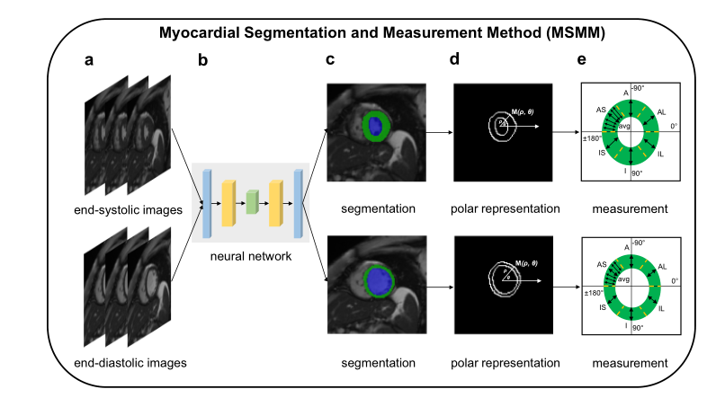

### 结果描述：

图1的结果展示了心肌分割和测量方法（MSMM）在量化左心室壁厚（LVRWT）中的应用。该图包含以下部分：

1. **原始图像（图1a）**：显示了收缩末期和舒张末期的心脏磁共振成像（CMR）图像。
2. **分割网络架构（图1b）**：展示了用于分割心脏图像的深层聚合（DLA）深度学习网络架构。
3. **深度学习分割结果（图1c）**：展示了经过训练的深度学习模型对CMR图像进行分割的结果，蓝色表示左心室腔，绿色表示左心室心肌。
4. **极坐标表示（图1d）**：展示了分割轮廓的极坐标表示，用于近似方向角映射到距离的函数，并标记了左心室结构的关键点。
5. **方向角平均（图1e）**：展示了该函数应用于目标方向附近的一组均匀间隔的方向角，并取其平均值，以实现稳健的量化。

### 图例描述：

图1 | 使用深度学习测量左心室壁厚。一个完整且新颖的框架——心肌分割和测量方法（MSMM），用于量化心肌壁厚。a部分显示了收缩末期和舒张末期的原始CMR图像。b部分展示了基于深层聚合（DLA）的分割网络结构。c部分显示了经过训练的深度学习模型对初始CMR图像进行分割，生成逐像素的输出。蓝色：左心室腔，绿色：左心室心肌。d部分展示了分割轮廓的极坐标表示，用于近似方向角映射到距离的函数，并标记了左心室结构的关键点。e部分显示了该函数应用于目标方向附近的一组均匀间隔的方向角，并取其平均值以进行稳健的量化。IS：下隔壁，I：后壁，IL：后外侧壁，AL：前外侧壁，A：前壁，AS：前隔壁。

### 关键结论:

1. 使用深层聚合（DLA）模型能够成功地分割心脏的CMR图像，并准确地识别左心室腔和左心室心肌。
2. 极坐标表示和方向角平均的方法提供了一种稳健的量化心肌壁厚的方法，从而实现了对12个LVRWT特征的精确测量。

### 分析目的：

该图的目的是展示心肌分割和测量方法（MSMM）的工作流程及其应用效果。通过该方法，可以从CMR图像中准确量化左心室壁厚，为进一步的心血管疾病研究和诊断提供重要的基础数据。这为遗传关联研究和心血管疾病风险评估提供了可靠的测量工具和方法。

*****

### 方法描述：

图1展示了一种称为心肌分割和测量方法（MSMM）的新颖框架，用于量化心肌壁厚。该方法包括以下几个步骤：

1. **原始图像获取（图1a）**：首先，通过心脏磁共振成像（CMR）获取收缩末期和舒张末期的原始图像。

2. **分割网络架构（图1b）**：使用基于深层聚合（DLA）的深度学习模型进行图像分割。该模型经过训练，可以识别和区分图像中的左心室腔和左心室心肌。

3. **深度学习分割（图1c）**：训练好的深度学习模型将初始CMR图像分割成像素级输出，蓝色代表左心室腔，绿色代表左心室心肌。

4. **极坐标表示（图1d）**：分割后的轮廓转换为极坐标表示，以近似方向角映射到距离的函数，并标记左心室结构的关键点。

5. **方向角平均（图1e）**：将该函数应用于目标方向附近的一组均匀间隔的方向角，并取其平均值以实现稳健的量化，得到左心室壁厚的精确测量值。

### 比喻讲解：

想象你要测量一个不规则物体的厚度，比如一个复杂的雕塑。这个过程就像我们在图1中所做的一样：

1. **获取图像（图1a）**：首先，你拍摄了雕塑在不同角度的高分辨率照片，就像我们通过CMR获取心脏图像一样。

2. **分割网络架构（图1b）**：接下来，你使用一个特别设计的计算机程序，这个程序就像一位熟练的艺术家，可以在每张照片上识别和标记出雕塑的不同部分（比如雕塑的表面和内部结构）。

3. **深度学习分割（图1c）**：程序运行后，每张照片都被详细标记出来，就像是给雕塑的每一部分都涂上了不同的颜色（蓝色代表左心室腔，绿色代表左心室心肌）。

4. **极坐标表示（图1d）**：然后，你将这些标记转换成一种特殊的坐标系统，这种系统就像是将雕塑的轮廓展开成一个平面图，以便于测量。

5. **方向角平均（图1e）**：最后，你在这些平面图上选择了一些关键点，然后测量这些点之间的距离，并取平均值。这样，你就能得到雕塑各个部分的厚度，从而精确地了解它的结构。

通过这种方式，我们能够非常精确地测量心脏左心室的壁厚，并将这些测量结果用于进一步的医学研究和诊断。

*****

### Fig.2a

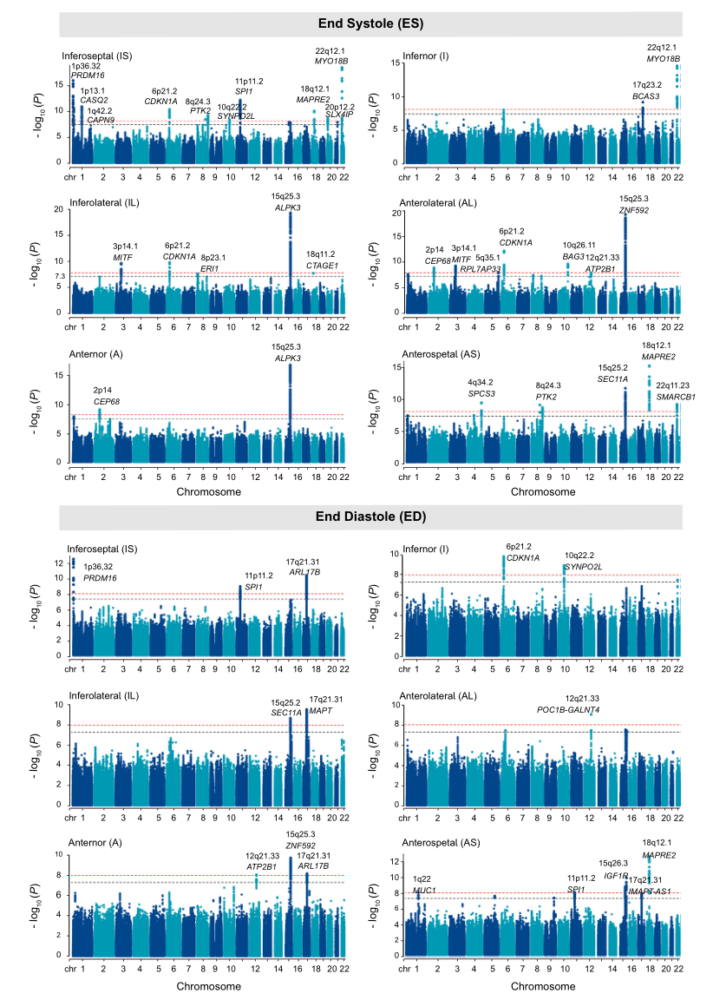

### 结果描述：

图2展示了12种左心室局部壁厚（LVRWT）表型的全基因组关联研究（GWAS）结果。每个曼哈顿图展示了染色体位置（x轴）与每个LVRWT表型的-log10(P)值（y轴）之间的关系。黑色虚线表示全基因组显著性阈值（P<5×10^-8），红色虚线表示经过多重校正后的显著性水平（P<1.0×10^-8）。图中标记了每个LVRWT表型中显著位点附近的基因名称。

### 图例描述：

图2 | 12种LVRWT表型的全基因组关联研究结果的曼哈顿图。曼哈顿图显示了每个LVRWT表型在x轴上的染色体位置和y轴上的-log10(P)值。黑色虚线表示全基因组显著性阈值（P<5×10^-8），红色虚线表示多重校正后的显著性水平（P<1.0×10^-8）。包含P<1×10^-8变异的位点标注了最近的基因名称。P值基于BOLT-LMM软件中的卡方检验统计量。LVRWT表示左心室局部壁厚，IS表示下隔壁，I表示后壁，IL表示后外侧壁，AL表示前外侧壁，A表示前壁，AS表示前隔壁。

### 关键结论：

通过对12种LVRWT表型进行GWAS，我们确定了多个与这些表型显著相关的遗传变异。每个LVRWT表型的曼哈顿图中都显示了不同的基因位点，黑色虚线和红色虚线分别表示全基因组显著性阈值和多重校正后的显著性水平。结果表明，有多个基因位点在不同的LVRWT表型中达到显著性水平，揭示了这些表型的遗传基础。

### 分析目的：

图2的目的是通过展示12种LVRWT表型的GWAS结果，识别出与每个表型显著相关的基因位点。这些结果帮助我们理解LVRWT表型的遗传基础，并为进一步研究这些表型与心血管疾病（如肥厚型心肌病）的关系提供了基础数据。这一分析有助于识别潜在的遗传风险位点，从而为个体化的疾病预防和治疗提供指导。

*****

### 方法描述：

图2的结果是通过对12种左心室局部壁厚（LVRWT）表型进行全基因组关联研究（GWAS）获得的。具体方法如下：

1. **数据收集**：从英国生物银行（UK Biobank）中收集42,194名参与者的心脏磁共振成像（CMR）数据，并测量12种LVRWT表型。这些表型包括在收缩末期（ES）和舒张末期（ED）的前壁（A）、前隔壁（AS）、下隔壁（IS）、后壁（I）、后外侧壁（IL）和前外侧壁（AL）的壁厚。

2. **遗传变异数据**：对所有参与者进行全基因组基因分型和基因组数据的标准化处理。使用BOLT-LMM软件对每个LVRWT表型进行GWAS，分析约8.5百万个具有良好基因分型质量的变异。

3. **统计分析**：对LVRWT表型进行归一化处理，消除潜在的混杂因素。通过卡方检验计算每个遗传变异与LVRWT表型的关联P值。绘制曼哈顿图，展示每个LVRWT表型中不同染色体位置上遗传变异的-log10(P)值。

4. **显著性阈值**：设定全基因组显著性阈值（P<5×10^-8）和多重校正后的显著性水平（P<1.0×10^-8），用于识别显著关联的遗传位点。

### 比喻讲解：

想象你在进行一场大型比赛，目的是找出影响车速的关键因素。每辆车代表一个人的心脏，每个车轮的厚度代表左心室不同部分的壁厚（LVRWT）。你要找出每辆车在不同情况下（收缩末期和舒张末期）的车轮厚度是如何影响车速的。

1. **数据收集**：首先，你收集了很多车的比赛数据。这些数据包括每辆车在不同比赛阶段的车轮厚度（就像从心脏磁共振成像中测量的12种LVRWT表型）。

2. **遗传变异数据**：然后，你检查每辆车的设计图纸，记录下每个车轮的细节（基因数据），确保所有设计细节都是标准化的。

3. **统计分析**：接下来，你使用高级分析工具（BOLT-LMM软件），分析每个车轮的厚度与车速之间的关系。通过这种分析，你计算出每个设计细节对车速的影响程度（P值）。

4. **显著性阈值**：最后，你设定了两个标准：一个是基本显著性标准（P<5×10^-8），另一个是严格的多重校正标准（P<1.0×10^-8）。这些标准帮助你确定哪些设计细节（遗传变异）对车速（LVRWT表型）有显著影响。

通过这种方法，你能够识别出影响车速的关键设计因素，同样，图2的研究通过GWAS方法识别出与LVRWT表型显著相关的遗传变异，为理解心脏结构和功能的遗传基础提供了重要信息。

*****

###  Fig.3a

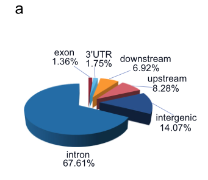

### 结果描述：

图3a展示了12个左心室区域壁厚（LVRWT）特征的风险变异在不同功能类别中的比例。这些功能类别包括内含子区域、基因上游和下游区域、基因间区域、3'非翻译区（3'UTR）、5'非翻译区（5'UTR）和外显子区域。图中用不同颜色的扇形区域表示每个功能类别的比例。

### 图例描述：

图3 | 12个LVRWT特征风险变异的功能特征。a部分的饼图表示12个LVRWT特征风险变异在每个功能类别中的比例（内含子区域、基因上游和下游区域、基因间区域、3'非翻译区（3'UTR）、5'非翻译区（5'UTR）和外显子区域）。

### 关键结论：

从图3a可以看出，12个LVRWT特征的风险变异在内含子区域、基因上游和下游区域以及基因间区域中显著富集，而在3'UTR、5'UTR和外显子区域中的比例相对较小。这表明，大多数与LVRWT相关的风险变异集中在非编码区域，这些区域可能在调控基因表达和基因功能方面发挥重要作用。

### 分析目的：

图3a的目的是展示12个LVRWT特征的风险变异在不同功能类别中的分布情况。通过分析这些风险变异的功能特征，可以更好地理解它们在基因调控和心脏结构及功能中的潜在作用。这些信息对于揭示LVRWT特征的遗传基础以及评估与心血管疾病相关的遗传风险具有重要意义。

*****

### 方法描述：

图3a展示了对12个左心室局部壁厚（LVRWT）特征的风险变异的功能类型进行注释的方法。首先，研究人员对在全基因组关联研究（GWAS）中识别出的与LVRWT显著相关的风险变异进行功能注释。使用了SnpEff工具来确定这些变异的位置和功能类型。具体功能类型包括内含子区域、基因上下游区域、基因间区域、3'非翻译区（UTR）、5'UTR和外显子区域。然后，研究人员通过饼图展示了这些风险变异在不同功能类型中的分布比例。

### 比喻讲解：

想象你在一个大型图书馆里，有许多不同类型的书籍（如小说、科普、历史等）。你的任务是对这些书籍进行分类，并统计每种类型的书籍数量。

首先，你需要找到所有与特定主题相关的书籍（在这个比喻中，这些书籍就像是与LVRWT相关的风险变异）。你可以使用一个高级检索工具（类似于SnpEff工具），这个工具可以帮你快速找到并标记出所有相关的书籍。

接下来，你开始对这些书籍进行分类。你把它们分成几个主要类型，比如小说、科普、历史等（对应于图中的不同功能类型：内含子区域、基因上下游区域、基因间区域、3'UTR、5'UTR和外显子区域）。然后，你记录下每种类型的书籍数量。

最后，你把这些分类结果制作成一个饼图，这样每个人都可以直观地看到每种类型的书籍在总数中的比例（就像图3a中的饼图展示了不同功能类型的风险变异的比例）。

通过这种方法，你不仅能了解与特定主题相关的书籍数量，还能了解这些书籍在不同类别中的分布情况。这种信息对于深入理解这些书籍的特点和作用非常重要。类似地，在LVRWT研究中，了解风险变异的功能类型有助于揭示这些变异在基因表达和疾病风险中的潜在作用。

*****

### Fig.3b

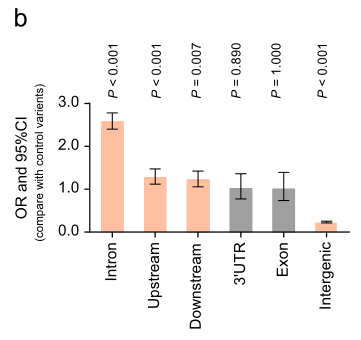

### 结果描述：

图3b展示了对12个左心室局部壁厚（LVRWT）特征的风险变异在不同功能类型中的富集分析结果。图中通过条形图表示每种功能类型的变异的富集程度，包括内含子区域、基因上游和下游区域、基因间区域、3'非翻译区（UTR）、5'UTR和外显子区域。条形图的高度表示富集的显著性，误差条表示95%置信区间。P值通过双尾Fisher精确检验计算得出。

### 图例描述：

图3 | 12个LVRWT特征风险变异的功能特征。a 饼图展示了每种功能类型的风险变异的比例（内含子区域、基因上游和下游区域、基因间区域、3'UTR、5'UTR和外显子区域）。b 条形图展示了12个LVRWT特征风险变异在每种功能类型中的富集分析结果。P值通过双尾Fisher精确检验计算，条形表示95%置信区间。

### 关键结论:

图3b的结果显示，12个LVRWT特征的风险变异显著富集于内含子区域、基因上游和下游区域以及基因间区域。这些结果表明，这些特征的风险变异主要集中在这些功能区域内，可能在这些区域对基因调控起到重要作用。

### 分析目的：

图3b的分析目的是确定与LVRWT特征相关的风险变异在不同基因功能区域的分布情况，并评估这些变异在这些功能区域的富集程度。通过了解这些变异在不同功能区域的富集情况，可以揭示这些变异在基因表达和调控中的潜在作用，从而为理解LVRWT特征的遗传基础提供重要信息。

*****

### Fig.3b 方法描述：

Fig.3b展示了12种左心室局部壁厚（LVRWT）特征的风险变异在不同功能类型变异中的富集分析。具体方法如下：

1. **数据准备**：首先，收集与12种LVRWT特征相关的风险变异。每种特征的风险变异都经过全基因组关联研究（GWAS）筛选，并确定其基因组位置和功能类别。

2. **功能分类**：将风险变异按其基因组位置和功能分类为：内含子区域（intron region）、基因上下游区域（gene upstream and downstream regions）、基因间区域（intergenic region）、3'非翻译区（3'UTR）、5'非翻译区（5'UTR）和外显子区域（exon region）。

3. **富集分析**：利用Fisher精确检验进行富集分析，计算每个功能类别中风险变异的富集程度，并生成95%的置信区间（CIs）。富集程度通过比较实际观察到的风险变异数与预期值进行评估。

### 比喻讲解：

#### 方法描述：

方法描述如同一次考古探险，探险队员们（研究人员）从众多挖掘现场（GWAS研究）中收集了许多古物（风险变异），这些古物分布在不同的地层（基因组位置和功能类别）中。为了了解这些古物的来源和意义，队员们对这些古物进行分类，并计算它们在不同地层中的富集程度。

#### 比喻讲解：

想象你是一名考古学家，正在探索一片广袤的古代遗址。你发现了许多有趣的古物（风险变异），这些古物散布在遗址的不同层次（基因组位置和功能类别）中。

首先，你收集了所有这些古物，并按它们所处的层次进行分类，比如，有些古物来自地表（外显子区域），有些来自更深的地层（内含子区域），还有些古物则分布在遗址的边缘地带（基因间区域）。

接下来，你需要确定这些古物在各个层次中的富集程度。就好像你要计算每个层次中发现古物的概率。你利用一种统计工具（Fisher精确检验），来计算每个层次中的实际古物数与预期古物数的比例。如果某个层次中的古物数远高于预期数，那么你就可以说这些古物在这个层次中是富集的。

最后，你绘制了一张图表，展示不同层次中古物的富集情况。通过这种方法，你可以深入了解这些古物的分布规律和背后的意义，为进一步的研究提供重要的线索。

*****

###  Fig.3c

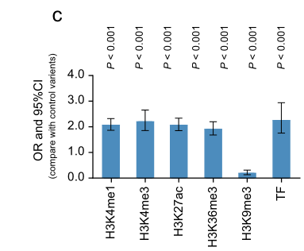

### 结果描述：

Fig.3c展示了12种左心室局部壁厚（LVRWT）特征的风险变异在不同表观基因组标记中的富集分析结果。具体而言，风险变异在以下表观基因组标记中显示出显著富集：启动子标记（H3K4me3），增强子标记（H3K4me1、H3K27ac、H3K36me3），和转录因子结合位点（TFBSs），而在抑制性转录标记（H3K9me3）中显著贫化。

### 图例描述：

Fig.3 | 12种LVRWT特征的风险变异的功能特征。c部分展示了风险变异在表观基因组标记中的富集分析结果，包括启动子标记（H3K4me3），增强子标记（H3K4me1、H3K27ac、H3K36me3），转录因子结合位点（TFBSs），以及抑制性转录标记（H3K9me3）。富集分析通过双尾Fisher精确检验计算，置信区间（CIs）用条形表示。

### 关键结论：

风险变异显著富集于启动子标记和增强子标记，这表明这些变异可能通过影响基因表达调控来发挥作用。同时，这些风险变异在转录因子结合位点的富集进一步支持了它们在基因调控中的重要性。相反，在抑制性转录标记中的显著贫化表明这些变异不太可能通过抑制性机制来影响基因表达。

### 分析目的：

该图例的目的是评估与12种LVRWT特征相关的风险变异在不同表观基因组标记中的分布，进而推断这些变异在基因调控和表达中的潜在作用。这有助于理解这些风险变异如何通过表观基因组机制影响心脏的结构和功能，特别是左心室壁厚的调控。

*****

### 方法描述：

Fig.3c 展示了对12种左心室局部壁厚（LVRWT）性状的风险变异体在表观基因组标记中的富集分析。这些标记包括启动子区的H3K4三甲基化标记（H3K4me3）、增强子区的H3K4单甲基化标记（H3K4me1）、H3K27乙酰化标记（H3K27ac）和H3K36三甲基化标记（H3K36me3），以及转录因子结合位点（TFBSs）。此外，还分析了在抑制性转录标记H3K9三甲基化标记（H3K9me3）中的富集情况。使用双尾Fisher精确检验计算P值，并用误差条表示95%的置信区间（CIs）。

### 比喻讲解：

想象我们在做一项关于“果园中不同果树的健康状况”的研究。我们知道有些果树的健康状况与特定的土壤条件（比如土壤中的矿物质含量和酸碱度）有关。为了找出这些关系，我们决定分析果园中每棵果树的土壤样本，并记录土壤中的不同成分。

在这个比喻中，果树代表12种LVRWT性状，而土壤条件则代表不同的表观基因组标记（例如H3K4me3、H3K4me1等）。我们将收集到的土壤样本进行分析，以确定哪种土壤成分（表观基因组标记）在健康的果树（土壤样本中有风险变异体）中更为常见。

具体过程如下：

1. **采集土壤样本**：我们从果园中每棵果树周围的土壤中采集样本，就像我们在研究中收集LVRWT性状的基因数据一样。

2. **分析土壤成分**：我们分析土壤中的不同成分，比如矿物质、酸碱度等。这类似于我们在研究中分析不同的表观基因组标记。

3. **富集分析**：我们比较健康果树和普通果树的土壤成分，找出哪些成分在健康果树中更为常见。这就像我们比较带有风险变异体的基因和普通基因，找出哪些表观基因组标记在这些基因中更为富集。

4. **统计检验**：我们使用统计方法（如双尾Fisher精确检验）来确定这些土壤成分是否显著不同于普通果树的土壤成分。这就像我们在研究中使用统计检验来确定表观基因组标记的富集情况。

最终，我们的目标是找到那些关键的土壤成分，从而解释为什么某些果树更健康。这与我们的研究目标类似，即找出哪些表观基因组标记在LVRWT性状中更为重要，以帮助理解这些性状的遗传基础和其与心血管疾病的关系。

*****

### Fig.3d

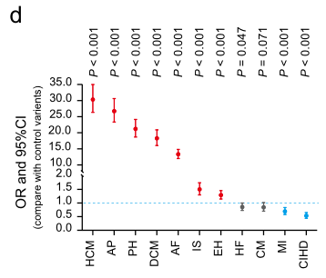

### 结果描述：

图3d展示了12种左心室局部壁厚（LVRWT）性状的风险变异体在11种心血管疾病（CVDs）风险位点中的富集分析结果。图中的柱状图显示了每种LVRWT性状的风险变异体在不同CVDs风险位点中的富集情况，富集比（OR）显示在y轴上，误差条表示95%的置信区间。统计显著性通过双尾Fisher精确检验计算得出。

### 图例描述：

图3 | 12种LVRWT性状风险变异体的功能特征分析。d部分显示了12种LVRWT性状的风险变异体在11种心血管疾病（CVDs）风险位点中的富集分析。通过双尾Fisher精确检验计算P值，柱状图显示了富集比（OR）和95%的置信区间（CIs）。

### 关键结论：

图3d的结果表明，12种LVRWT性状的风险变异体在多个心血管疾病风险位点中显著富集。这表明这些LVRWT性状与多种心血管疾病共享相同的遗传背景或调控机制。特别是一些LVRWT性状在某些CVDs风险位点中显示出显著的富集，提示这些变异体可能在心血管疾病的发展过程中起重要作用。

### 分析目的：

图3d的目的是确定12种LVRWT性状的风险变异体是否在11种心血管疾病风险位点中显著富集。通过这种分析，可以评估LVRWT性状与心血管疾病之间的遗传关联，进一步理解这些性状在心血管疾病发病机制中的潜在作用。这对于识别高风险个体和开发个性化的预防和治疗策略具有重要意义。

*****

### 方法描述：

图3d展示了对12个左心室局部壁厚（LVRWT）特征的风险变异位点进行富集分析的方法。这些变异位点在11种心血管疾病（CVDs）中进行富集分析，包括高血压、肺动脉高压、扩张型心肌病、肥厚型心肌病（HCM）、心肌病、心力衰竭、心房颤动、心肌梗死、心绞痛、慢性缺血性心脏病和缺血性中风。该分析方法使用了两尾Fisher精确检验，计算每种CVDs的变异位点富集的P值，并使用95%置信区间（CIs）表示结果。通过这些分析，可以确定这些LVRWT特征的风险变异位点是否在各类CVDs中显著富集，从而揭示这些变异位点与CVDs的潜在关联。

### 比喻讲解：

想象你正在厨房里烘焙各种不同类型的蛋糕（心血管疾病，CVDs），而你有一批特别的配料（LVRWT特征的风险变异位点）。你想知道这些配料是否在某些蛋糕中更常见，因此你决定进行一次系统的检查。

你将每种蛋糕切开并检查内部，看这些特别的配料（风险变异位点）是否存在并统计数量。这就像是在每种心血管疾病中寻找这些变异位点的富集情况。为了确保结果的可靠性，你使用了一种叫做两尾Fisher精确检验的工具，就像在测量每种蛋糕中的配料分布情况。

通过这种方法，你可以计算出每种蛋糕中这些配料的富集P值，并用95%的置信区间表示结果。这些置信区间就像是给你的结果加上了一层保障，确保你看到的不是偶然现象，而是有统计学意义的结果。

最终，你发现有些蛋糕（比如肥厚型心肌病HCM）中这些特别的配料显著富集，这意味着这些蛋糕的制作可能特别依赖这些配料。通过这次检查，你更好地了解了这些配料在不同蛋糕中的分布情况，也揭示了这些配料与某些蛋糕类型之间的潜在关联。这就好比找出了LVRWT特征的风险变异位点与各种心血管疾病之间的关系，帮助你理解这些变异位点在疾病中的作用。

*****

## Fig.3 (Fig.3a-d) 中的重要结论：

### Fig.3a 重要结论：
图3a展示了与12个左心室局部壁厚（LVRWT）特征相关的风险变异位点在不同功能类别中的比例。结果显示，这些风险变异位点显著富集在内含子区、基因上游和下游区域、以及基因间区域，表明这些变异位点在基因调控中可能具有重要作用。

### Fig.3b 重要结论：
图3b展示了12个LVRWT特征的风险变异位点在不同功能类型中的富集分析结果。结果表明，这些风险变异位点在内含子区、基因上游和下游区域以及基因间区域的富集显著高于对照组，进一步支持了这些变异位点在基因调控中可能的重要角色。

### Fig.3c 重要结论：
图3c展示了12个LVRWT特征的风险变异位点在表观遗传标记中的富集分析结果。结果显示，这些变异位点显著富集于启动子标记（H3K4me3）、增强子标记（H3K4me1、H3K27ac、H3K36me3）和转录因子结合位点（TFBS），而在抑制性转录标记（H3K9me3）中显著缺失。这表明这些变异位点可能通过激活染色质状态来调控基因表达，进而影响心血管疾病的发生。

### Fig.3d 重要结论：
图3d展示了12个LVRWT特征的风险变异位点在11种心血管疾病（CVDs）中的富集分析结果。结果表明，这些变异位点在多种CVDs（包括肥厚型心肌病、高血压、肺动脉高压、慢性缺血性心脏病和缺血性中风）中显著富集。这进一步支持了这些风险变异位点与心血管疾病的潜在关联，提示这些变异位点可能通过调控基因表达来增加心血管疾病的发生风险。

*****
###  Fig.4a

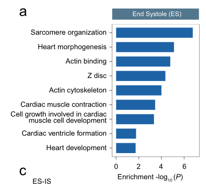

### 结果描述：

图4a展示了与左心室局部壁厚（LVRWT）在收缩末期（end systole）相关的基因进行通路富集分析的结果。这些结果表明，显著基因富集在与心脏发育、心脏收缩和心肌细胞发育相关的生物学通路中。

### 图例描述：

图4 | 与LVRWT相关的易感基因的通路富集和组织富集分析。a、b部分展示了显著基因在收缩末期（a）和舒张末期（b）中的通路富集分析。显著富集的基因本体（GO）术语通过http://kobas.cbi.pku.edu.cn进行分析，并在与收缩末期相关的显著基因中识别出具有显著统计学意义的GO术语（P<0.05，双侧）。c、d部分展示了GTEx v8数据中54种特定组织类型的基因表达结果，通过FUMA进行分析。计算P值时使用双侧检验，多个校正后显著的条形用红色表示。组织富集分析在收缩末期（c）和舒张末期（d）中分别针对下隔（IS）进行。

### 关键结论:

1. 在收缩末期，与LVRWT相关的显著基因富集在与心脏发育、心脏收缩和心肌细胞发育相关的生物学通路中。
2. 这些基因在心脏的左心室和心房附属物中的表达显著高于其他组织，表明它们在这些组织中具有重要功能。

### 分析目的：

图4a的目的是通过通路富集分析，识别与LVRWT在收缩末期相关的显著基因所参与的生物学通路。这有助于理解这些基因在心脏功能和发育中的作用，并揭示它们如何影响左心室壁厚的变化。这种分析可以提供关于基因如何通过特定的生物学通路调控心脏结构和功能的重要见解，从而帮助解释LVRWT与心血管疾病之间的关联。

*****

### 方法描述：

Fig. 4a 使用了基因本体（GO）术语进行路径富集分析，以识别与左心室局部壁厚（LVRWT）相关的显著基因。在这一分析中，研究人员首先选定了与LVRWT显著相关的基因集合。这些基因通过全基因组关联研究（GWAS）和其它基因注释方法识别。然后，使用KOBAS（一个用于基因和蛋白质路径富集分析的在线工具），研究人员对这些基因进行了GO术语分析，以识别在心脏发育、心脏收缩和心肌细胞发育等生物路径中显著富集的基因。

### 比喻讲解：

想象你正在进行一次寻宝游戏，你的任务是找到一组隐藏在一个巨大图书馆中的特定书籍，这些书籍包含关于心脏发育、心脏收缩和心肌细胞发育的秘密。

首先，你收到了一个线索清单（显著基因列表），这些线索告诉你哪些书籍可能包含有用的信息。然后，你使用了一种特别的工具——一个强大的搜索引擎（KOBAS），来帮助你在图书馆中找到这些书籍。

你将这些线索输入到搜索引擎中，搜索引擎开始扫描整个图书馆中的书籍，并将所有符合条件的书籍（基因）挑选出来。这些书籍被分类到不同的书架（GO术语），比如“心脏发育”、“心脏收缩”和“心肌细胞发育”等。

最后，你得到了一份书籍清单，上面标明了每本书在哪个书架上，以及它们对你的任务有多重要（显著性水平）。通过这份清单，你可以更容易地理解和研究心脏的发育和功能，这样你就完成了这次寻宝游戏的任务。

*****

### Fig.4b

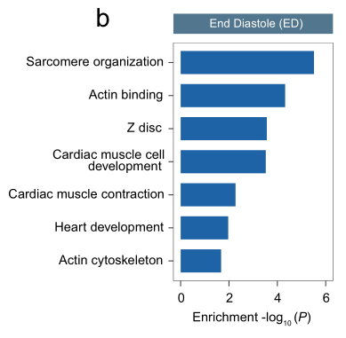

### 结果描述：

Fig. 4b 展示了使用基因本体（GO）术语进行的路径富集分析结果，显示了在舒张末期（ED）与左心室局部壁厚（LVRWT）显著相关的基因。图中列出了显著富集的GO术语，包括与心脏发育、心脏收缩和心肌细胞发育相关的路径。每个GO术语的显著性水平通过P值表示，并在图中进行了标注。

### 图例描述：

图4 | 与LVRWT相关的易感基因的路径富集和组织富集。a, b 基因本体（GO）术语的路径富集分析在http://kobas.cbi.pku.edu.cn进行。显著富集的GO术语（P<0.05，双侧）从舒张末期（a）和收缩末期（b）的显著基因分析中识别出来。c, d 使用FUMA从GTEx v8获得54种特定组织类型的组织表达结果。P值计算为双侧。通过多重校正存活的条形图用红色表示。组织富集分析分别针对收缩末期（c）和舒张末期（d）的下隔壁（IS）进行。IS：下隔壁，ES：收缩末期，ED：舒张末期。

### 关键结论：

图4b的关键结论是，显著相关的基因在多个与心脏发育、心脏收缩和心肌细胞发育相关的GO术语中富集。这些结果表明，这些基因在心脏的结构和功能中发挥重要作用，并且在舒张末期的LVRWT中具有显著的影响。

### 分析目的：

图4b的目的是通过GO术语的路径富集分析，识别出与LVRWT显著相关的基因所涉及的生物路径。这有助于理解这些基因在心脏发育和功能中的角色，并提供关于LVRWT如何影响心脏病理生理过程的见解。通过这些分析，可以揭示基因在心脏结构和功能中的潜在机制，进一步推动对心血管疾病的研究。

*****

### 方法描述：

Fig. 4b展示了对与左心室局部壁厚（LVRWT）相关的易感基因进行基因本体论（Gene Ontology, GO）路径富集分析的结果。具体方法如下：

1. **数据获取**：从全基因组关联研究（GWAS）中识别出与LVRWT相关的候选基因。
2. **功能注释**：使用网络工具（如KOBAS）对这些候选基因进行功能注释，确定其参与的生物学过程、细胞组分和分子功能。
3. **富集分析**：执行GO富集分析，以确定哪些生物学过程、细胞组分和分子功能在这些候选基因中显著富集。通过统计分析，计算每个GO条目的显著性P值。
4. **结果展示**：将显著富集的GO条目进行可视化展示，突出那些在心脏发育、心脏收缩和心肌细胞发育中显著富集的基因。

### 比喻讲解：

想象你正在一个大型图书馆中搜索与特定主题相关的书籍。你希望找出所有关于心脏健康的书籍，并了解这些书籍是如何分类的。具体步骤如下：

1. **数据获取**：你先从图书馆的数据库中提取出所有关于心脏健康的书籍清单，这就像从GWAS中识别出与LVRWT相关的候选基因一样。
2. **功能注释**：然后，你查看每本书的目录和简介，了解每本书主要讨论的内容，这相当于对候选基因进行功能注释。
3. **富集分析**：接下来，你统计哪些类别（如心脏发育、心脏收缩、心肌细胞发育）中的书籍数量最多，这就类似于执行GO富集分析，确定哪些生物学过程在候选基因中显著富集。
4. **结果展示**：最后，你将这些统计结果制成图表，展示心脏健康书籍在不同类别中的分布情况，就像Fig. 4b中展示的GO富集分析结果一样。这帮助你快速了解哪些主题在心脏健康书籍中最为常见。

*****

###  Fig.4c

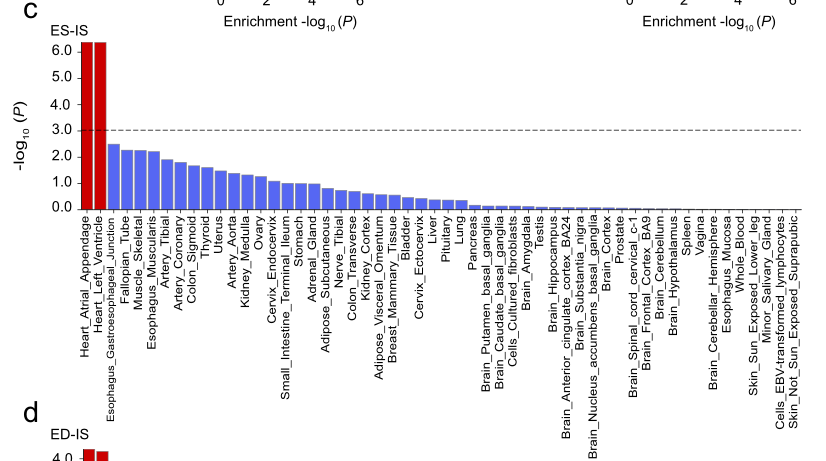

### 结果描述：

Fig. 4c展示了使用GTEx v8数据集进行的54种特定组织类型的基因表达分析结果。特别展示了心脏左心室（LV）和心房附件（AA）在多个LVRWT表型中的基因表达显著性。图中每个条形表示在特定组织中基因表达的P值。

### 图例描述：

Fig. 4c | 组织富集分析结果。使用FUMA对GTEx v8数据集的54种特定组织类型进行基因表达分析。图中的P值是双侧计算的，并且通过多重校正（P<0.05/54）后，显著的条形以红色表示。图例显示的是在收缩末期（ES）和舒张末期（ED）的下隔壁（IS）LVRWT的基因表达结果。

### 关键结论：

结果显示，心脏左心室和心房附件的基因表达在多个LVRWT表型中具有显著性，表明这些组织在LVRWT的遗传基础研究中起重要作用。特别是，下隔壁（IS）LVRWT在收缩末期（ES）和舒张末期（ED）中的基因表达显著性高，突出其在心脏相关遗传研究中的重要性。

### 分析目的：

Fig. 4c的目的是展示在54种不同组织类型中，与LVRWT表型相关的基因表达显著性，特别强调了心脏左心室和心房附件的基因表达。这有助于识别出在心脏发育、功能和疾病中起重要作用的基因，为进一步的生物学研究和临床应用提供基础数据。

*****

### 文本内容

Fig. 4c: Tissue expression results for 54 specific tissue types were obtained from GTEx v8 using FUMA. The P values were calculated as two-sided. those bar that survived multiple correction (P<0.05/54) are denoted with red. Tissue enrichment analysis was performed for inferoseptal (IS) at end systole (ES) in (c) and end diastole (ED) in (d). IS inferoseptal, ES end systole, ED end diastole.

## 方法描述：

图4c的方法是利用FUMA工具分析来自GTEx v8的54种特定组织类型的基因表达结果。具体步骤如下：

1. **数据来源**：使用GTEx v8数据库中的基因表达数据。
2. **分析工具**：使用FUMA（Functional Mapping and Annotation of Genome-Wide Association Studies）进行基因表达的功能富集和路径分析。
3. **统计分析**：计算每种组织类型的P值，采用双侧检验。
4. **多重校正**：对54种组织类型的P值进行多重校正，校正后的显著性水平为P<0.05/54。
5. **结果展示**：在图4c中展示了在收缩末期（ES）和舒张末期（ED）下隔壁（IS）基因的组织富集分析结果，使用红色条表示通过多重校正的显著结果。

## 比喻讲解：

想象你正在一个图书馆里研究一本百科全书，这本书涵盖了54种不同的主题（对应于54种特定的组织类型）。你想知道在这些主题中，哪些部分的内容对你研究的特定问题（比如下隔壁在收缩末期和舒张末期的基因表达）特别重要。

1. **数据来源**：首先，你从图书馆借来了这本包含54个不同主题的百科全书（GTEx v8数据库）。
2. **分析工具**：然后，你使用了一种特殊的高亮笔（FUMA工具），它可以帮助你标记出每个主题中与你研究问题相关的内容。
3. **统计分析**：接下来，你用高亮笔在每个主题的内容上做标记（计算P值），标记的过程中你会特别注意那些内容是否与研究问题有显著关联（双侧检验）。
4. **多重校正**：因为你标记了54个不同的主题，所以你要特别小心，避免过多的误报。因此，你采用了一个严格的标准来决定哪些标记是真正重要的（多重校正，显著性水平P<0.05/54）。
5. **结果展示**：最后，你在研究笔记本上用红色标记出那些经过严格筛选后依然显著的内容（图4c中的红色条），这些内容就是你需要特别关注的重点，表示在收缩末期和舒张末期下隔壁基因表达中显著富集的组织类型。

通过这种方法，你能够从大量的信息中筛选出最相关和重要的部分，为你的研究提供有力的支持。

*****

### Fig.4d

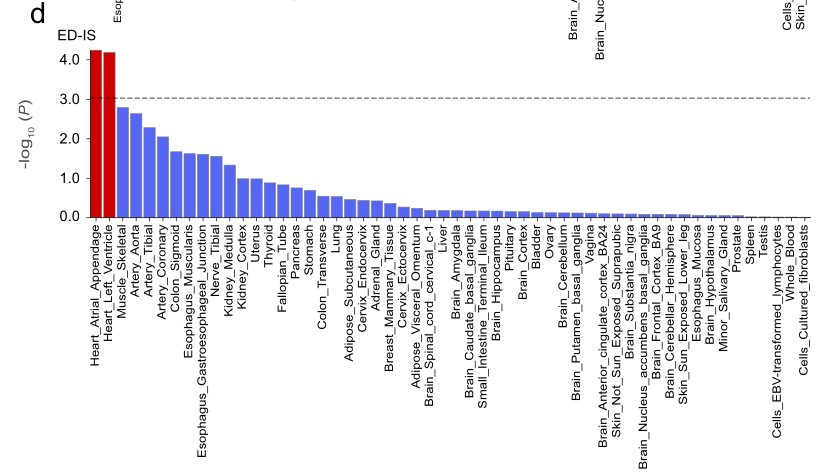

### 文本内容

Fig. 4c: Tissue expression results for 54 specific tissue types were obtained from GTEx v8 using FUMA. The P values were calculated as two-sided. those bar that survived multiple correction (P<0.05/54) are denoted with red. Tissue enrichment analysis was performed for inferoseptal (IS) at end systole (ES) in (c) and end diastole (ED) in (d). IS inferoseptal, ES end systole, ED end diastole.

## 结果描述：

图4d展示了使用GTEx v8数据通过FUMA工具对54种特定组织类型进行基因表达分析的结果，重点关注的是舒张末期（ED）下隔壁（IS）的组织富集分析。每种组织类型的基因表达结果通过计算双侧P值来评估显著性，经过多重校正（P<0.05/54）后显著的结果用红色表示。

## 图例描述：

图4 | LVRWT相关易感基因的通路富集和组织富集分析。a, b部分在http://kobas.cbi.pku.edu.cn上进行基因本体（GO）术语的通路富集分析。在（a）舒张末期和（b）收缩末期分别识别出显著富集的GO术语（P<0.05，双侧）。c, d部分展示了使用GTEx v8通过FUMA进行的54种特定组织类型的组织表达结果。P值通过双侧检验计算，经过多重校正（P<0.05/54）后显著的结果用红色表示。组织富集分析分别在收缩末期（ES）和舒张末期（ED）的下隔壁（IS）进行。

## 关键结论：

图4d的结果表明，在54种特定组织类型中，有一些组织在舒张末期（ED）下隔壁（IS）基因表达中显著富集。经过多重校正后，这些显著富集的组织类型用红色条表示。该结果显示了不同组织在心脏舒张末期下隔壁基因表达中的相对重要性。

## 分析目的：

图4d的目的是通过GTEx v8数据和FUMA工具，对54种特定组织类型的基因表达进行富集分析，以确定在舒张末期（ED）下隔壁（IS）基因表达中哪些组织类型具有显著富集。这个分析有助于识别与心脏特定区域和功能相关的关键组织，为进一步研究这些组织在心脏功能和疾病中的角色提供了线索。

*****

### Fig. 4d 方法描述：

Fig. 4d的目的是展示特定组织类型中与左心室局部壁厚（LVRWT）相关基因的组织表达分析结果。这些基因在心脏发育、心脏收缩和心肌细胞发育等生物学途径中起重要作用。为了进行组织表达分析，研究人员使用了GTEx（Genotype-Tissue Expression）数据集，该数据集包含了多种人类组织的基因表达数据。通过对心房附壁和左心室两种心脏组织进行分析，研究人员评估了这些基因在不同组织中的表达水平，计算P值以确定其显著性。P值小于0.05/54被认为是显著的。

### 比喻讲解：

方法描述：图4d展示了对心脏组织中的基因表达进行分析的方法。研究人员使用GTEx数据集来测量基因在心房附壁和左心室两种特定心脏组织中的表达水平。他们通过计算P值来评估这些基因的表达是否显著，P值小于0.05/54被认为是显著的。

比喻讲解：

想象你正在组织一次大型音乐会，而你需要找出哪些乐器在不同类型的音乐中发挥了重要作用。你有一个巨大的数据库，记录了许多音乐会中每种乐器的使用情况和表现效果。为了这次研究，你决定专注于两种类型的音乐：古典音乐和流行音乐。

你首先从数据库中提取出所有关于古典音乐和流行音乐的记录。然后，你统计每种乐器在这两种音乐类型中的使用频率和表现效果。接下来，你计算每种乐器的表现显著性，找出哪些乐器在这两种音乐中表现特别突出。如果某种乐器在古典音乐和流行音乐中的表现都非常好，你就会标记它为“重要乐器”。

在这项研究中，研究人员类似地使用GTEx数据集，分析了心房附壁和左心室两种心脏组织中的基因表达。他们通过计算P值，找出了在这两种组织中显著表达的基因，就像你找出在古典音乐和流行音乐中都表现突出的乐器一样。这个过程帮助他们理解了哪些基因在心脏功能和发育中起关键作用。

*****

## Figure 4的重要结论

1. **途径富集分析**：
- 图4a和图4b展示了基因本体（GO）分析结果，揭示了与左心室局部壁厚（LVRWT）相关的候选基因显著富集在与心脏发育、心脏收缩和心肌细胞发育相关的生物学途径中。
- 这些途径对于心脏重塑（cardiac remodeling）至关重要。

2. **组织表达分析**：
- 图4c和图4d显示了候选基因在54种特定组织类型中的表达结果，特别是在心房附壁和左心室两种心脏组织中表现出显著的P值（P=2.64×10^-6）。
- 这些结果表明，与LVRWT相关的基因在心脏组织中具有显著的表达水平，强调了这些基因在心脏功能和发育中的重要性。

总结来说，Figure 4展示了LVRWT相关基因的功能特性和组织表达模式，强调了这些基因在心脏发育和功能中的关键作用。这些发现显著推进了我们对LVRWT表型遗传基础的理解，并表明候选基因编码的蛋白质在肌节基础结构的构建和维持中起着重要作用。

*****

### Fig.5a

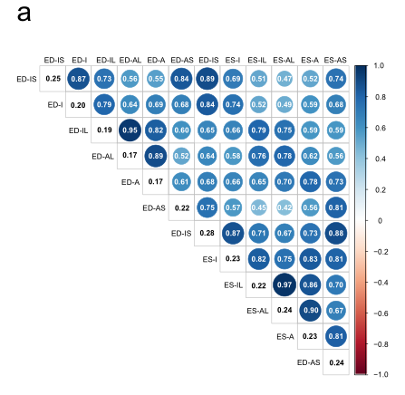

### 结果描述：

Figure 5A展示了12个左心室局部壁厚（LVRWT）特征之间的单核苷酸多态性（SNP）遗传相关性和遗传力估计结果。图中用颜色和圆圈大小表示相关性的强度和方向，范围从-1到+1。对角线上的数值显示了每个LVRWT特征的SNP遗传力（h^2_g）。遗传相关性是使用BOLT-RELM和LDSC方法计算的，显著相关性（P<0.05）在图中标示出来。

### 图例描述：

图5A | 12个LVRWT特征之间的SNP遗传力和遗传相关性。相关性的程度由颜色图例和圆圈大小表示，范围从-1到+1。SNP遗传力显示在对角线上。我们使用BOLT-RELM和LDSC方法估计了单核苷酸多态性（SNP）遗传力（h^2_g）和遗传相关性。显示的P值是未经调整的，仅显示显著相关性（P<0.05）。

### 关键结论：

1. **遗传力估计**：
- 最高的SNP遗传力估计值出现在收缩末期的下隔壁（ES-IS），为28%，其次是舒张末期的下隔壁（ED-IS），为25%。这些结果表明这些特征的遗传变异对表型变异的贡献最大。
- 前壁（A）和前外侧壁（AL）在舒张末期（ED）的遗传力较低，均为17%。

2. **遗传相关性**：
- 同一心动周期相位（如收缩末期或舒张末期）的不同区域之间存在强正遗传相关性。例如，收缩末期的下外侧壁（ES-IL）和前外侧壁（ES-AL）之间的相关性为r_g = 0.97。
- 不同心动周期相位之间的区域存在中等程度的相关性。例如，收缩末期的前壁（ES-A）和舒张末期的前隔壁（ED-AS）之间的相关性较低，为r_g = 0.42。

### 分析目的：

Figure 5A的目的是通过展示LVRWT特征之间的遗传力和遗传相关性，揭示这些特征的遗传基础及其相互关系。这有助于理解不同左心室壁厚特征在遗传层面的关联，以及遗传因素如何共同影响心脏结构的不同部分。通过识别这些遗传相关性，可以更好地解读心脏病理生理过程中的遗传贡献，进而指导个性化治疗和预防策略的制定。

*****
### 方法描述：

Fig. 5a 的方法是通过单核苷酸多态性（SNP）遗传力和遗传相关性分析来量化和展示12种左心室局部壁厚（LVRWT）特征之间的遗传相关性。研究者使用了BOLT-RELM和LDSC两种方法来估算遗传相关性。

1. **SNP遗传力估算**：使用BOLT-RELM（基因型协方差的随机效应线性模型）来估算每个LVRWT特征的单核苷酸多态性（SNP）遗传力，即每个LVRWT特征的表型变异中由遗传因素解释的比例。

2. **遗传相关性估算**：利用LDSC（链接不平衡得分回归）方法估算LVRWT特征之间的遗传相关性。这涉及计算每对LVRWT特征之间的遗传相似性，即基因对不同特征的影响程度。

3. **数据可视化**：使用热图展示遗传相关性，颜色和圆圈大小表示相关性的强度，范围从-1到+1。对角线显示每个特征的SNP遗传力估算值。

### 比喻讲解：

想象一下，你在管理一个大型农场，有12个不同的水果种植区域，每个区域种植一种不同的水果。你想了解这些水果的生长情况（类似于LVRWT特征），并且想知道哪些水果的生长表现是由共同的因素（遗传因素）影响的，以及这些因素对每种水果的影响有多大。

1. **估算单一水果的生长表现的遗传力**：你使用了一种先进的分析工具（类似于BOLT-RELM），可以估算每种水果的生长表现中有多少是由遗传因素决定的。这个工具就像是一个高精度的检测器，可以帮助你量化遗传因素对每种水果生长的影响。

2. **估算水果之间的遗传相关性**：接下来，你使用另一种工具（类似于LDSC），来分析不同水果之间的遗传相似性。这就像是对比不同水果的生长环境和条件，看看是否有共同的因素在影响它们的生长表现。比如，如果苹果和橘子的生长表现相似，你就可以推测它们可能受到类似的遗传因素影响。

3. **数据可视化**：最后，你把这些分析结果制作成一个图表（热图），就像是一个大型的农场地图，显示不同水果之间的相似性和差异性。颜色和圆圈的大小表示遗传相关性的强度，颜色越深、圆圈越大，表示相关性越强。对角线上的数值表示每种水果的遗传力估算值，帮助你直观地了解每种水果的生长表现中有多少是由遗传因素决定的。

通过这种方法，你可以更好地理解农场中不同水果的生长规律，找出哪些水果的生长表现是由共同的遗传因素影响的，从而制定更有效的种植和管理策略。

*****

###  Fig.5b

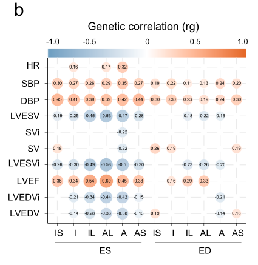

### 结果描述：

Fig. 5b 展示了12种左心室局部壁厚（LVRWT）特征与10种心脏结构和功能特征之间的遗传相关性。结果通过热图形式显示，颜色和圆圈的大小表示相关性的强度，范围从-1到+1。热图显示了LVRWT特征与心脏射血分数（LVEF）、搏出量（SV）、左心室舒张末期容积（LVEDV）、左心室收缩末期容积（LVESV）及其体表面积标准化版本（LVEDVi，LVESVi）、心率、舒张压和收缩压之间的遗传相关性。遗传相关性范围从高度正相关（例如LVRWT特征与LVEF）到高度负相关（例如LVRWT特征与LVEDV）。

### 图例描述：

Fig. 5b | 左心室局部壁厚（LVRWT）特征与10种心脏结构和功能特征之间的遗传相关性。颜色和圆圈大小表示相关性的强度，范围从-1到+1。两侧显示的P值为未调整的双侧P值，使用LDSC进行遗传相关性估计。仅显示显著相关性（P<0.05）。

### 关键结论:

图5b揭示了LVRWT特征与多种心脏结构和功能特征之间的显著遗传相关性。大多数LVRWT特征与心脏射血分数（LVEF）和搏出量（SV）呈高度正相关，与左心室舒张末期容积（LVEDV）和左心室收缩末期容积（LVESV）呈高度负相关。此外，LVRWT特征还与心率、舒张压和收缩压呈现不同程度的正相关。这些发现表明，LVRWT特征与心脏整体功能和结构密切相关，且这些相关性有显著的遗传基础。

### 分析目的：

图5b的目的是通过展示12种LVRWT特征与10种心脏结构和功能特征之间的遗传相关性，揭示LVRWT特征与心脏功能和结构的遗传联系。通过这张图，研究人员可以更好地理解LVRWT特征在心脏生理学中的作用，以及这些特征如何与心脏其他重要指标相关联。这为进一步研究心脏疾病的遗传基础和可能的治疗方法提供了重要的线索。

*****

### 方法描述：

Fig. 5b展示了左心室局部壁厚（LVRWT）与10种心脏结构和功能特征之间的遗传相关性。这些心脏特征包括心率、舒张压、收缩压、左心室舒张末期容积（LVEDV）、左心室收缩末期容积（LVESV）、搏出量（SV）、体表面积指数化的这些特征（LVEDVi、LVESVi、SVi）和左心室射血分数（LVEF）。使用了链接不平衡得分回归（LDSC）软件，通过LVRWT特征的总结统计数据和心脏特征的总结数据，估计其遗传相关性。方法步骤如下：

1. **数据获取**：从先前的全基因组关联研究（GWAS）中获取LVRWT特征和心脏特征的总结统计数据。
2. **LDSC分析**：使用LDSC软件进行遗传相关性分析，估计LVRWT特征和心脏特征之间的遗传相关性。
3. **结果可视化**：用图表展示各LVRWT特征与心脏特征之间的相关性程度。

### 比喻讲解：

想象你有一个庞大的家族，相当于你的基因组。家族中的每个人都有不同的爱好和性格，这就像不同的基因表现。现在，你想了解家族成员之间的关系，例如哪些人之间有相似的爱好，哪些人之间有更多的共同点。这类似于我们在研究基因之间的相关性。

首先，你需要收集家族成员的资料，包括他们的爱好和性格特征（类似于获取LVRWT特征和心脏特征的总结统计数据）。接下来，你使用一种叫做“关系分析工具”的软件，这就像LDSC软件，它可以分析这些资料并找出家族成员之间的关系强度。

具体来说，你把所有的资料输入这个软件，让它分析并计算出每一对家族成员之间的相似度。这些相似度结果会告诉你哪些成员之间有很强的共同点，哪些成员之间的关系较弱。最后，你用图表把这些结果展示出来，例如使用不同颜色和大小的圆圈来表示不同程度的相似度。

通过这种方法，你可以清楚地看到家族中不同成员之间的关系强度。这类似于在Fig. 5b中，我们通过LDSC软件分析LVRWT特征与心脏特征之间的遗传相关性，并用图表展示其结果。这样，我们可以理解哪些心脏特征与LVRWT特征有更强的遗传联系，从而为心血管疾病的研究提供重要的见解。

*****

### Fig.5c

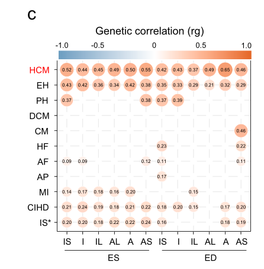

### 结果描述：

Fig. 5c展示了12种左心室局部壁厚（LVRWT）特征与11种心血管疾病（CVDs）之间的遗传相关性。结果显示，这些LVRWT特征与不同CVDs之间存在显著的正遗传相关性。最显著的遗传相关性出现在舒张末期前壁厚度（ED-A）与肥厚型心肌病（HCM）之间（r_g = 0.65, P = 7.0×10^−4）。此外，下隔壁LVRWT在收缩末期和舒张末期与HCM的遗传相关性也非常显著（ES-IS: r_g = 0.52, P = 1.4×10^−3；ED-IS: r_g = 0.42, P = 6.8×10^−3）。总体上，HCM与LVRWT特征的遗传相关性在所有CVDs中最高（r_g 范围: 0.37-0.65）。

### 图例描述：

图5c | 左心室局部壁厚（LVRWT）特征与心血管疾病（CVDs）之间的遗传相关性。遗传相关性的程度通过颜色图例和圆圈面积表示，范围从-1到+1。LVRWT LV局部壁厚，CVDs 心血管疾病，IS 下隔壁，I 后壁，IL 后外侧壁，AL 前外侧壁，A 前壁，AS 前隔壁，ES 收缩末期，ED 舒张末期，EH 原发性高血压，PAH 肺动脉高压，DCM 扩张型心肌病，HCM 肥厚型心肌病，CM 心肌病，HF 心力衰竭，AF 房颤，AP 心绞痛，MI 心肌梗死，CHID 慢性缺血性心脏病，IS* 缺血性卒中，HR 心率，SBP 收缩压，DBP 舒张压，LVESV 左心室收缩末期容积，SVi 体表面积指数化的搏出量，SV 搏出量，LVESVi 体表面积指数化的左心室收缩末期容积，LVEF 左心室射血分数，LVEDVi 体表面积指数化的左心室舒张末期容积，LVEDV 左心室舒张末期容积。

### 关键结论：

图5c显示了LVRWT特征与多种CVDs之间的显著遗传相关性，尤其是LVRWT与HCM之间的相关性最为显著。这表明LVRWT特征可能在HCM的遗传基础中起重要作用。舒张末期前壁厚度（ED-A）与HCM之间的遗传相关性最高，其他如下隔壁LVRWT在收缩末期和舒张末期与HCM的相关性也显著。

### 分析目的：

该图的目的是展示LVRWT特征与多种CVDs之间的遗传相关性，通过定量分析揭示哪些LVRWT特征在特定CVDs中具有重要的遗传关联。这有助于理解LVRWT特征在不同心血管疾病中的遗传背景，特别是肥厚型心肌病（HCM），并为进一步的研究和临床干预提供依据。

*****

### 方法描述：

Fig. 5c 的方法是通过遗传相关性分析，探索左心室局部壁厚（LVRWT）与心血管疾病（CVDs）之间的共享遗传效应。具体步骤如下：

1. **数据来源**：使用从11个选定的CVDs（如肥厚型心肌病（HCM）、高血压、肺动脉高压等）的全基因组关联研究（GWAS）总结统计数据。
2. **遗传相关性计算**：使用链式不平衡评分回归（LDSC）软件计算LVRWT与各CVD之间的遗传相关性。LDSC通过比较单核苷酸多态性（SNP）效应大小，估计不同表型之间的遗传相关性。
3. **显著性检验**：用LDSC软件估算出的相关性系数进行统计显著性检验，确定哪些LVRWT特征与哪些CVDs有显著的遗传相关性。
4. **结果可视化**：将遗传相关性结果通过热图展示，颜色和圆圈大小表示相关性的强度和方向（正相关或负相关），只有显著的相关性被展示出来。

### 比喻讲解：

想象你有一组钥匙和一组锁，每个钥匙和锁都有独特的花纹。我们的目标是找到哪些钥匙可以打开哪些锁。

1. **数据来源**：首先，你收集了一堆钥匙（LVRWT特征）和一堆锁（11个选定的CVDs）。
2. **遗传相关性计算**：然后，你使用一种特殊的测量工具（LDSC软件），这个工具可以比较每把钥匙的花纹和每个锁的花纹，计算出每把钥匙与每个锁之间的匹配度（遗传相关性）。
3. **显著性检验**：接着，你对这些匹配度进行测试，看看哪些钥匙和锁之间的匹配度显著高，表示这把钥匙更有可能打开这个锁。
4. **结果可视化**：最后，你用一张热图来展示这些结果。颜色越深、圆圈越大，表示这把钥匙和这个锁的匹配度越高，说明它们之间的相关性越强。

通过这种方法，我们可以直观地看到哪些LVRWT特征（钥匙）与哪些CVDs（锁）之间有显著的遗传相关性，从而帮助我们更好地理解心脏结构与心血管疾病之间的遗传联系。

*****

## Figure 5的重要结论：

1. **单核苷酸多态性（SNP）遗传力估算**：
- 左心室局部壁厚（LVRWT）特征的遗传力估算显示，不同LVRWT特征的遗传力存在显著差异。最高的遗传力估算值为收缩末期下隔壁（ES-IS）的28%，其次是舒张末期下隔壁（ED-IS）的25%。而前壁（A）和前外侧壁（AL）在舒张末期（ED）显示的遗传力较低，为17%。

2. **LVRWT特征之间的遗传相关性**：
- LVRWT特征之间的遗传相关性从高到低不等。相同心脏周期阶段的区域之间存在较强的正相关性（例如，收缩末期前外侧壁（ES-AL）和收缩末期后外侧壁（ES-IL）之间的相关性为0.97），而不同心脏周期阶段的区域之间的相关性适中（例如，收缩末期前壁（ES-A）和舒张末期前隔壁（ED-AS）之间的相关性为0.42）。

3. **LVRWT特征与心脏结构和功能特征的遗传相关性**：
- LVRWT特征与心脏体积和功能特征（如左心室射血分数（LVEF）和搏出量（SV））之间具有高度的正相关性（遗传相关性范围为0.16到0.60）。
- LVRWT特征与左心室舒张末期体积（LVEDV）、左心室收缩末期体积（LVESV）以及这些特征的体表面积指数版本（LVEDVi和LVESVi）之间具有负相关性（遗传相关性范围为-0.58到-0.13）。

4. **LVRWT特征与心血管疾病（CVDs）的遗传相关性**：
- LVRWT特征与各种心血管疾病（如肥厚型心肌病（HCM）、高血压、肺动脉高压、慢性缺血性心脏病和缺血性中风）之间具有显著的遗传相关性。
- 在所有LVRWT特征中，舒张末期前壁（ED-A）与肥厚型心肌病（HCM）之间的遗传相关性最高（r_g = 0.65）。
- 收缩末期和舒张末期的下隔壁LVRWT（ES-IS和ED-IS）均与肥厚型心肌病（HCM）有显著的正遗传相关性（ES-IS：r_g = 0.52，ED-IS：r_g = 0.42）。

这些结论表明LVRWT特征在不同心脏周期阶段具有不同的遗传特性，并且与心脏功能特征和多种心血管疾病有显著的遗传关联。这些发现有助于进一步理解LVRWT特征的遗传基础以及它们在心血管疾病中的潜在作用。

*****

###  Fig.6

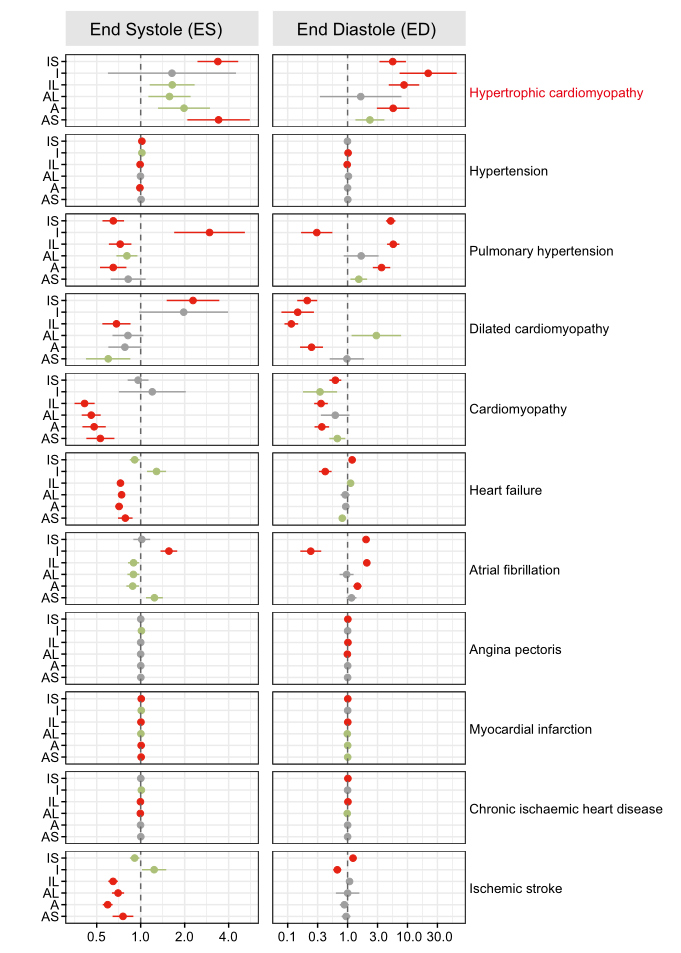

### 结果描述：

图6a展示了使用孟德尔随机化（MR）方法分析左心室局部壁厚（LVRWT）特征与心血管疾病（CVDs）之间因果关系的结果。图中每个点表示一个LVRWT特征与一种CVD之间的因果关系效应量（OR，Odds Ratio），横线表示95%的置信区间（CI）。颜色编码表示显著性水平：红色表示经过多重校正后的显著性（P<0.05/55），绿色表示名义上的显著性（P<0.05），灰色表示不显著。

### 图例描述：

图6 | 使用孟德尔随机化方法分析LVRWT表型与CVDs之间的因果关系。用于孟德尔随机化的GWAS数据来源详见补充数据2。效应量以LVRWT每标准差增量与CVDs风险的OR形式表示。横线表示95%的置信区间（CI），颜色编码表示显著性水平：红色表示经过多重校正后的显著性（P<0.05/55），绿色表示名义上的显著性（P<0.05），灰色表示不显著相关。对于两样本MR分析，我们使用MR-Egger回归、加权中位数和基于模式的估计作为敏感性分析，主要模型使用逆方差加权（IVW）方法。LVRWT：左心室局部壁厚，CVDs：心血管疾病，IS：下隔壁，I：后壁，IL：后外侧壁，AL：前外侧壁，A：前壁，AS：前隔壁，OR：优势比，SD：标准差。点表示每个变异的暴露和结果关联估计的均值，交叉符号表示标准误（SE）。

### 关键结论：

1. 大多数LVRWT特征与肥厚型心肌病（HCM）之间存在显著的因果关系，特别是在收缩末期（ES）和舒张末期（ED）的下隔壁（IS）、前外侧壁（AL）和前壁（A）LVRWT。
2. 某些LVRWT特征在心肌病（如HCM）中的因果效应显著，但对其他心血管疾病（如高血压、心绞痛、心肌梗死、慢性缺血性心脏病和缺血性中风）的因果效应不显著。

### 分析目的：

该图的目的是通过孟德尔随机化方法确定LVRWT特征与各种心血管疾病（CVDs）之间的因果关系。这些分析帮助识别哪些LVRWT特征可能直接导致特定的心血管疾病，并揭示这些特征在心血管疾病中的潜在病理机制。通过这些结果，可以更好地理解LVRWT特征在心血管疾病中的作用，为预防和治疗提供科学依据。

*****

### 结果描述：

图6展示了通过孟德尔随机化（MR）分析左心室局部壁厚（LVRWT）特征与心血管疾病（CVDs）之间因果关系的结果。图中的每个点表示LVRWT特征对CVDs风险的效应大小（以OR表示），水平条表示95%的置信区间。颜色编码表示显著性水平：红色表示多重校正后的显著性（P<0.05/55），绿色表示名义显著性（P<0.05），灰色表示非显著相关。研究还使用了MR-Egger回归、加权中位数和基于模式的估计作为敏感性分析，主要模型是逆方差加权技术。

### 图例描述：

图6 | 使用孟德尔随机化方法分析LVRWT表型与CVDs之间的因果效应。用于孟德尔随机化的GWAS数据来源详见补充数据2。效应大小以每个LVRWT标准差增量对CVDs风险的比值（OR）表示。水平条表示95%置信区间（95% CIs），颜色编码表示显著性水平：红色表示多重校正后的显著性（P<0.05/55），绿色表示名义显著性（P<0.05），灰色表示非显著相关。对于两样本MR分析，使用了MR-Egger回归、加权中位数和基于模式的估计作为敏感性分析，主要模型是逆方差加权技术。LVRWT表示左心室局部壁厚，CVDs表示心血管疾病，IS表示下隔壁，I表示后壁，IL表示后外侧壁，AL表示前外侧壁，A表示前壁，AS表示前隔壁，OR表示比值比，SD表示标准差。点表示每个变异对暴露和结果的关联估计值的均值，交叉符号表示标准误。

### 关键结论:

图6的关键结论是LVRWT特征与心血管疾病（CVDs）之间存在显著的因果关系。具体来说，10个LVRWT特征显著增加了肥厚型心肌病（HCM）的风险（P<0.01），而其他CVDs如高血压、心绞痛、心肌梗死、慢性缺血性心脏病和缺血性卒中的风险没有显著增加（P>0.05）。这表明LVRWT特征与HCM之间存在潜在的因果关系，而与其他CVDs的关联较弱。

### 分析目的：

图6的目的是通过孟德尔随机化方法分析LVRWT特征与心血管疾病（CVDs）之间的因果关系。这种分析方法能够提供更为稳健的因果推断，避免传统观察性研究中的混杂因素影响。通过识别LVRWT特征对特定CVDs的因果效应，该研究能够帮助我们更好地理解这些特征在疾病发病机制中的作用，并为个体化预防和治疗策略提供科学依据。

*****

### Fig.7a

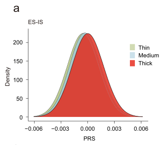

结果描述：

图7a显示了根据多基因风险评分（PRS）分类的参与者中，薄、中等和厚的左心室局部壁厚（LVRWT）的分布情况。具体而言，图中展示了收缩末期（end systole，ES）下隔壁（inferoseptal，IS）LVRWT的PRS分布情况。图中不同颜色的箱线图分别代表了不同PRS分类的LVRWT厚度分布情况。
图例描述：

图7a | 按多基因风险评分（PRS）分类的下隔壁（inferoseptal，IS）收缩末期（end systole，ES）左心室局部壁厚（LVRWT）分布。薄、中等和厚LVRWT参与者的PRS分布情况。箱线图展示了每个PRS分类的LVRWT分布，中央线表示中位数，上下边缘分别表示第一个和第三个四分位数，须线延伸到超过箱边1.5倍四分位距的范围。使用双侧学生t检验计算P值，星号表示统计显著性差异：*p<0.05；**p<0.01；***p<0.001。
关键结论:

图7a的关键结论是多基因风险评分（PRS）可以显著区分左心室局部壁厚（LVRWT）的不同厚度。PRS较高的参与者在收缩末期下隔壁（ES-IS）LVRWT厚度上显著高于PRS较低的参与者，表明PRS在预测LVRWT厚度方面具有良好的区分能力。
分析目的：

图7a的目的是展示多基因风险评分（PRS）在区分不同左心室局部壁厚（LVRWT）厚度方面的有效性。通过展示不同PRS分类下的LVRWT厚度分布情况，研究表明PRS可以作为一个有力的工具，用于预测个体的LVRWT厚度，从而帮助识别高风险个体。这对于个性化医疗和早期干预策略的制定具有重要意义。

*****

### 方法描述：

图7a显示了推导每个左心室区域壁厚（LVRWT）特征的多基因风险评分（PRS）的方法。研究人员首先基于全基因组关联研究（GWAS）中的独立遗传变异的效应大小，对每个LVRWT特征构建了PRS。具体步骤如下：

1. **数据收集与预处理**：使用UK Biobank的基因型和表型数据，筛选出具有良好质量的CMR成像数据的参与者。
2. **全基因组关联研究（GWAS）**：对12个LVRWT特征进行GWAS，识别出与这些特征相关的遗传变异。
3. **PRS构建**：利用GWAS中显著的遗传变异，按照每个变异的效应大小计算每个参与者的PRS。
4. **PRS分类与分析**：将参与者按PRS值划分为低、中、高风险组，并分析不同风险组中LVRWT特征的分布情况。

### 比喻讲解：

想象你有一群植物，它们的生长高度（LVRWT特征）受多种因素（遗传变异）影响。我们想预测哪些植物未来会长得更高（心血管疾病风险更高），于是我们采用以下步骤：

1. **数据收集与预处理**：首先，我们从一个巨大的植物园（UK Biobank）中挑选出健康的植物，并记录下它们的生长高度（CMR成像数据）。
2. **全基因组关联研究（GWAS）**：接下来，我们研究哪些因素（遗传变异）与植物的高度显著相关（GWAS），找到这些因素后，就像找到了一些决定植物生长的重要元素。
3. **PRS构建**：然后，我们根据每个因素对植物生长的影响力（效应大小），为每株植物计算一个分数（PRS），这个分数反映了它未来可能的高度。
4. **PRS分类与分析**：最后，我们将这些植物按分数（PRS值）分为低、中、高三组，看看哪些组的植物更可能长得高（高风险组）。通过这种方法，我们可以提前知道哪些植物需要更多的关注和护理（心血管疾病风险评估）。

这个过程帮助我们识别出需要特别注意的高风险个体，提前采取预防措施，就像在植物还小的时候就给予特别的养护，以确保它们健康成长。

*****

### Fig.7b

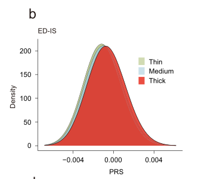

### 结果描述：

图7b展示了收缩末期（end systole, ES）和舒张末期（end diastole, ED）下间隔（inferoseptal, IS）左心室区域壁厚（LVRWT）的多基因风险评分（PRS）分布。图中的箱线图（box plot）展示了不同PRS分组（薄、中等、厚）中个体LVRWT的分布情况。横轴表示PRS分组，纵轴表示LVRWT值。

### 图例描述：

图7b | LVRWT多基因风险评分（PRS）的分布。箱线图显示了在不同PRS分组（薄、中等、厚）中，个体的LVRWT分布情况。a部分展示了收缩末期（end systole, ES）的下间隔（inferoseptal, IS）LVRWT的PRS分布。b部分展示了舒张末期（end diastole, ED）的下间隔（inferoseptal, IS）LVRWT的PRS分布。每个箱线图的中央线表示中位数，上下边缘表示第一和第三四分位数，须线延伸到不超过箱体1.5倍四分位距的最远点，离群点（outliers）则用单独的点表示。

### 关键结论:

图7b表明，不同PRS分组中个体的LVRWT存在显著差异。高PRS组（厚组）的个体LVRWT值明显高于中等和低PRS组（薄组），这表明高PRS值与较厚的LVRWT相关。特别是，在收缩末期和舒张末期，LVRWT的PRS都能够有效区分个体的LVRWT值。

### 分析目的：

图7b的目的是评估多基因风险评分（PRS）在区分个体左心室区域壁厚（LVRWT）方面的有效性。通过展示不同PRS分组中个体LVRWT的分布情况，研究人员能够验证PRS在预测LVRWT厚度方面的效力。这一分析有助于确定PRS是否可以作为一个有效的工具，用于识别具有较高心血管疾病风险的个体。

*****

### 方法描述：

Fig.7b展示了在舒张末期（end diastole，ED）下隔壁左心室局部壁厚（inferoseptal LVRWT）的多基因风险评分（polygenic risk score，PRS）在不同个体中的分布情况。具体方法如下：

1. **数据收集**：首先，从英国生物银行中收集了大量个体的基因型数据和心脏磁共振成像（CMR）数据。
2. **全基因组关联研究（GWAS）**：对这些数据进行GWAS，识别出与12个LVRWT特征显著相关的遗传位点。
3. **多基因风险评分（PRS）计算**：利用这些显著相关的遗传位点及其效应大小，计算每个个体的多基因风险评分。具体来说，每个个体的PRS是根据他们携带的每个显著位点的基因型以及该位点的效应大小加权计算得出的。
4. **数据分析**：将所有参与者根据其PRS分数进行分类，并分析这些分类与LVRWT厚度之间的关系。特别地，分析了高PRS组、中等PRS组和低PRS组中LVRWT厚度的分布情况。

### 比喻讲解：

想象你在一个汽车修理厂工作，你需要评估很多辆汽车的发动机健康状况。每辆汽车的发动机都有很多部件，每个部件的状况都会影响整个发动机的性能。

1. **数据收集**：首先，你从很多汽车上收集了所有部件的状态信息，比如每个部件的磨损程度和使用情况。
2. **全基因组关联研究（GWAS）**：接下来，你进行了一次大规模的调查，找出了哪些部件（基因位点）对发动机性能（LVRWT特征）有显著影响。就像找到了一些关键的零件，这些零件的状况特别重要。
3. **多基因风险评分（PRS）计算**：然后，你根据每辆汽车的这些关键部件的状态，计算出一个综合的风险评分（PRS）。这个评分就像是一个总体的健康指数，反映了每辆汽车的发动机整体状况。每个关键部件的状况按照其重要程度加权，得出一个总分。
4. **数据分析**：最后，你把所有的汽车按照这个综合健康指数（PRS）分成三组：高风险组、中等风险组和低风险组。你发现高风险组的汽车发动机状况普遍较差，而低风险组的汽车发动机状况较好。这帮助你更好地评估每辆汽车的发动机健康状况，并预测哪些汽车可能需要更多的维护和保养。

*****

### Fig.7c

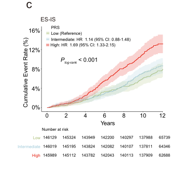

*****

*****