# Integrative spatial analysis reveals a multi-layered organization of glioblastoma

## SUMMARY

### 讲解：

该文本描述了一个综合研究，结合了空间转录组学、空间蛋白质组学和计算方法，旨在定义胶质瘤的细胞状态并揭示其组织结构。以下是具体内容的详细讲解：

1. **胶质瘤细胞状态的多样性**：
- 胶质瘤中包含不同状态的恶性细胞。
- 研究通过结合空间转录组学（spatial transcriptomics）和空间蛋白质组学（spatial proteomics），以及计算方法来定义这些细胞状态。

2. **发现的三种主要组织模式**：
- **第一种模式**：
- 胶质瘤由小的局部环境组成，每个局部环境通常富含一种主要的细胞状态。
- **第二种模式**：
- 特定的细胞状态对对（pairs of states）在多个尺度上优先邻近存在。这种状态的配对在不同的肿瘤中是一致的。
- **第三种模式**：
- 这些成对的相互作用共同定义了一个由五层组成的全局结构。

3. **缺氧在组织结构中的作用**：
- 缺氧似乎驱动了这些层的形成，因为缺氧与包括所有癌细胞状态的长程组织相关。
- 因此，远离任何缺氧/坏死焦点的肿瘤区域以及缺乏缺氧的肿瘤（如低级别IDH突变胶质瘤）组织结构较为松散。

4. **总结**：
- 研究提供了一个关于胶质瘤细胞状态组织的概念框架，强调了缺氧作为长程组织者的作用。

通过这个研究，科学家们不仅定义了胶质瘤中不同的细胞状态，还揭示了这些细胞状态如何在肿瘤中组织和相互作用，特别是缺氧在这一过程中扮演的关键角色。

*****

### Introduction

这段文本描述了脑胶质瘤（gliomas）的空间结构及其研究历史，特别是关于胶质母细胞瘤（GBMs）的研究。以下是详细讲解：

1. **Percival Bailey的开创性研究（1932年）**：
- Percival Bailey在他的1932年的论文中优雅地描述了胶质瘤的空间结构。他观察到，尽管脑肿瘤的显微结构极其多样，但其中某些特征具有家族相似性。

2. **胶质瘤的异质性和侵袭性**：
- 胶质瘤通常具有高度的异质性和侵袭性，但特定的空间模式始终存在。

3. **Hans Joachim Scherer的贡献（1938年）**：
- 在1938年，Hans Joachim Scherer详细描述了胶质瘤，尤其是胶质母细胞瘤的重复性空间结构：
- **有组织的次级结构**：这类结构特征表现为胶质瘤细胞依赖或模仿脑内现存的正常结构。
- **无定形的癌细胞排列**：癌细胞以无组织的方式分布。
- **独立形成的结构**：癌细胞形成的结构不依赖于现存的正常结构。
- **坏死区域周围的间质反应**：这些区域伴随着坏死和缺氧现象。

4. **坏死和正常脑神经结构周围的局部组织**：
- 坏死（和缺氧）焦点以及正常脑神经结构周围的区域表现出局部组织化。
- 在这些区域之外，胶质瘤组织主要表现为缺乏组织学上的组织化。

总结来说，这段文本揭示了胶质瘤的复杂空间结构，以及早期研究者在描述和理解这些结构方面的重要贡献。Percival Bailey和Hans Joachim Scherer的研究奠定了我们对脑胶质瘤空间组织模式的基本认识。

*****

### 比喻讲解：

可以将脑胶质瘤的研究比作探索一个古老而复杂的迷宫，这个迷宫由许多不同的房间和路径组成，各种图案和结构交织在一起。以下是比喻讲解：

1. **Percival Bailey的开创性研究（1932年）**：
- 想象Percival Bailey是一位考古学家，他发现了一个迷宫，并注意到虽然这个迷宫里的房间和走廊看起来各不相同，但某些相似的图案和布局总是反复出现。就像他发现了这些重复出现的“家族相似性”。

2. **胶质瘤的异质性和侵袭性**：
- 这个迷宫非常复杂和难以预测（异质性），并且它不断扩展和渗透到新的区域（侵袭性）。但即便如此，仍有一些特定的模式一直存在。

3. **Hans Joachim Scherer的贡献（1938年）**：
- 想象Hans Joachim Scherer是一位迷宫学家，他进一步详细描述了这个迷宫中的重复性结构，尤其是在一些特别复杂的区域（如胶质母细胞瘤）：
- **有组织的次级结构**：这就像一些房间是依靠迷宫原有的墙壁和走廊建造的，或是模仿了这些结构。
- **无定形的癌细胞排列**：一些房间中的家具和装饰品是随机摆放的，没有特定的模式。
- **独立形成的结构**：有些房间有自己独特的布局和装饰风格，不依赖于原有的迷宫结构。
- **坏死区域周围的间质反应**：就像迷宫中有一些破败的、废弃的房间，这些房间周围会有一些新的装饰或修复迹象。

4. **坏死和正常脑神经结构周围的局部组织**：
- 坏死的房间（破败的区域）和正常房间（完好的脑神经结构）周围，有明显的装饰和布局模式。
- 在这些区域之外，迷宫的大部分区域都是杂乱无章的，没有明显的布局。

通过这种比喻，可以更好地理解胶质瘤的复杂性及其研究的重要性。就像探索迷宫一样，研究胶质瘤需要仔细观察和记录其结构和模式，以揭示其背后的规律和机制。

*****

### 问题：

Hans Joachim Scherer在1938年的研究中详细描述了哪些胶质瘤的空间结构？这些结构对理解胶质瘤的侵袭性和异质性有何意义？

### 答案和讲解：

Hans Joachim Scherer在1938年的研究中详细描述了以下胶质瘤的空间结构：

1. **有组织的次级结构**：
- 胶质瘤细胞依赖或模仿脑内现存的正常结构进行侵袭。
   
2. **无定形的癌细胞排列**：
- 癌细胞以无组织的方式排列，显示出胶质瘤的混乱特性。

3. **独立形成的结构**：
- 癌细胞形成的结构不依赖于脑内现存的正常结构，表现出胶质瘤的独特性和复杂性。

4. **坏死区域周围的间质反应**：
- 胶质瘤周围的间质组织对坏死区域的反应，显示出肿瘤内部的动态变化和应对机制。

这些结构对理解胶质瘤的侵袭性和异质性非常重要，因为它们展示了胶质瘤如何在脑内扩散、适应和生存。这些结构特点帮助科学家更好地理解胶质瘤的复杂性和多样性，为开发更有效的治疗方法提供了重要的线索。

### 比喻讲解：

可以将Hans Joachim Scherer的研究比作对一个复杂迷宫的详细勘探：

1. **有组织的次级结构**：
- 想象迷宫中的一些走廊和房间是依照原有的建筑风格建造的，就像胶质瘤细胞模仿脑内的正常结构一样。

2. **无定形的癌细胞排列**：
- 一些房间的家具和装饰品是随机摆放的，没有特定的模式，类似于胶质瘤中无组织的癌细胞排列。

3. **独立形成的结构**：
- 有些房间有自己独特的布局和装饰风格，不依赖于原有的迷宫结构，类似于胶质瘤中独立形成的结构。

4. **坏死区域周围的间质反应**：
- 迷宫中有一些破败的、废弃的房间，周围有一些新的装饰或修复迹象，类似于胶质瘤周围的间质组织对坏死区域的反应。

通过这种比喻，可以更好地理解胶质瘤的空间结构和其侵袭性及异质性的重要性，就像探索一个复杂的迷宫需要理解其各部分的结构和布局一样。

*****

### 讲解：

该文本讨论了技术进步如何使我们能够重新审视由传统组织病理学捕捉到的空间结构，并通过对细胞类型和细胞状态进行全面、细致的基因组分析来定量描述这些结构。以下是具体的讲解：

1. **空间结构的重新审视和定量描述**：
- 通过技术发展，我们现在能够重新审视传统组织病理学捕捉到的空间结构，并以更细致、更全面的基因组分析来定量描述这些结构。

2. **scRNA-seq在胶质瘤研究中的应用**：
- 研究的第一步是通过单细胞RNA测序（scRNA-seq）来定义胶质瘤中的多种细胞成分。
- 在先前需要组织解离的研究中，定义了四种主要的异柠檬酸脱氢酶（IDH）野生型GBM癌细胞状态：
- 神经祖细胞样（NPC）
- 少突胶质细胞祖细胞样（OPC）
- 星形胶质细胞样（AC）
- 间充质样（MES）

3. **IDH突变型胶质瘤的研究**：
- 对于IDH突变型胶质瘤，定义了三种主要的恶性细胞状态以及不同胶质瘤亚型中的免疫细胞景观。

4. **空间转录组学和蛋白质组学的应用**：
- 下一步需要在原位空间中映射这些已定义的细胞成分。
- 最近出现了多种用于空间转录组学（例如，Visium）和蛋白质组学（例如，CODEX）的方法，使得这种映射成为可能。

该研究展示了如何通过最新的技术手段，对胶质瘤细胞成分进行详细定义，并在空间上进行映射，以便更好地理解胶质瘤的细胞生态系统。

*****

### 问题：

在研究胶质瘤的过程中，研究人员如何利用单细胞RNA测序（scRNA-seq）和空间转录组学方法来定义和映射不同的细胞成分和状态？

### 答案和讲解：

研究人员首先利用单细胞RNA测序（scRNA-seq）来定义胶质瘤中的多种细胞成分和状态。具体步骤如下：

1. **定义细胞状态**：
- 通过scRNA-seq，研究人员在IDH野生型GBM癌细胞中定义了四种主要状态：神经祖细胞样（NPC）、少突胶质细胞祖细胞样（OPC）、星形胶质细胞样（AC）和间充质样（MES）。
- 在IDH突变型胶质瘤中，研究人员定义了三种主要的恶性细胞状态，并分析了不同胶质瘤亚型中的免疫细胞景观。

2. **空间转录组学和蛋白质组学映射**：
- 为了在空间上准确定位这些已定义的细胞成分，研究人员使用了最新的空间转录组学（例如Visium）和空间蛋白质组学（例如CODEX）方法。
- 这些方法使得研究人员能够在胶质瘤的生态系统中进行原位空间映射，精确定位不同细胞成分和状态。

### 比喻讲解：

可以将这项研究比作一个城市规划项目，研究人员首先通过调查（scRNA-seq）了解城市中的不同居民类型和他们的状态，然后使用高精度地图绘制技术（空间转录组学和蛋白质组学）将这些居民类型精确标注在城市地图上：

1. **定义细胞状态**：
- 就像调查团队走访城市的每个角落，发现了四种主要的居民类型：学生（NPC）、技术工人（OPC）、社区服务人员（AC）和建筑工人（MES）。在另一类城市（IDH突变型胶质瘤）中，发现了三种主要的居民类型及其区域中的警察和消防员（免疫细胞）。

2. **空间转录组学和蛋白质组学映射**：
- 使用最新的GPS和3D地图技术，将这些不同的居民类型和他们的分布精确地绘制在城市地图上，使得城市的每个细节都一目了然。

通过这种方式，可以更好地理解研究人员是如何利用先进技术手段来定义和映射胶质瘤中的不同细胞成分和状态的。

*****

### 讲解：

该段文本描述了对胶质母细胞瘤（GBM）空间组织结构的研究，并提出了一些关键问题和方法。以下是详细讲解：

1. **Visium研究的背景和挑战**：
- Visium的首次GBM研究通过定义空间邻域来应对这一挑战，但未能解析到具体的细胞状态及其组织结构。

2. **Ravi等人的观察**：
- Ravi等人观察到神经发育相关邻域与缺氧相关的间充质邻域和炎症相关邻域的空间分离。
- 这表明局部肿瘤微环境（TME）是决定癌细胞状态的主要因素。

3. **特定空间相互作用的研究**：
- 其他研究确定了特定的空间相互作用，包括巨噬细胞诱导的MES样状态，以及OPC样GBM癌细胞与神经元通过谷氨酸能信号和AMPARs的突触对话。

4. **未解问题**：
- 关于细胞状态和细胞类型如何相互关联及其与微环境其他元素的关系，仍有许多未解的问题。
- 由于它们显著的空间多样性，是否存在跨胶质瘤的一致模式或组织规则？
- 空间位置在多大程度上决定了细胞状态的多样性？

5. **研究方法和数据集成**：
- 为了解决这些问题，研究者使用10X Visium对19个胶质瘤样本进行了分析，并使用CODEX对12个样本进行了分析，将这些数据与已发布的GBM Visium数据集进行了整合。

6. **定量框架的开发**：
- 研究者开发了一个定量框架，用于系统地描述胶质瘤空间组织的重复特征。

通过这种方法，研究者试图揭示胶质瘤中细胞状态和空间位置之间的关系，以及局部肿瘤微环境对癌细胞状态的影响。

*****
比喻讲解：

可以将这项研究想象成一次探索胶质母细胞瘤（GBM）“城市”布局的任务，目的是理解这些“城市”中不同“社区”和“居民”的组织方式。以下是详细的比喻讲解：

Visium研究的背景和挑战：

初次探索这座GBM“城市”的研究就像是绘制一张城市地图，标出不同“社区”的位置，但没有细致到解析每个“居民”的具体状态和他们的组织结构。

Ravi等人的观察：

Ravi等人观察到，这座城市中神经发育相关的“社区”和缺氧相关的间充质“社区”以及炎症相关的“社区”之间有明显的空间分隔。

这就像在城市中发现了不同功能区：一些地区是教育区，一些地区是工业区，还有一些是医疗区。城市的微环境（TME）决定了每个地区的主要功能和居民的状态。

特定空间相互作用的研究：
其他研究发现了特定的空间互动，就像在城市中发现了一些有趣的邻里关系：

巨噬细胞“居民”能诱导某些癌细胞“居民”变成MES样状态，就像社区领袖能影响居民的行为。

OPC样GBM癌细胞与神经元通过谷氨酸能信号和AMPARs进行突触对话，就像两个邻居之间通过电报进行通信。

未解问题：
        
关于这些“居民”（细胞状态和类型）如何相互关联以及他们与城市其他元素（微环境）的关系，仍有许多未解之谜。

由于城市布局的多样性，是否存在一致的城市规划模式？城市的地理位置在多大程度上决定了居民的行为和状态？

研究方法和数据集成：
    
为了解决这些问题，研究者对19个GBM“城市”进行了全面调查，并对12个样本进行了深入分析，然后将这些数据与已发布的GBM城市地图进行了整合。

定量框架的开发：

研究者开发了一个定量框架，就像是一个城市规划工具，用于系统地描述GBM“城市”布局的重复特征。

通过这种方法，研究者试图揭示不同细胞状态和空间位置之间的关系，就像城市规划者试图理解城市各个地区之间的关系以及这些地区如何影响居民的生活方式。

*****

### 问题：

研究中提到的Ravi等人的观察是如何揭示局部肿瘤微环境（TME）对癌细胞状态的影响的？研究者为了解答细胞状态与空间位置关系而采取了哪些方法？

### 答案和讲解：

**Ravi等人的观察：**
Ravi等人发现了神经发育相关的邻域与缺氧相关的间充质邻域和炎症相关的邻域之间的空间分离。这表明局部肿瘤微环境（TME）在很大程度上决定了癌细胞的状态。这意味着肿瘤中的不同区域有着不同的微环境，这些微环境直接影响着癌细胞的行为和特性。例如，缺氧的区域可能导致细胞更具有侵袭性，而炎症区域可能与免疫反应有关。

**研究方法：**
为了解决细胞状态与空间位置之间的关系，研究者采取了以下方法：
1. 对19个胶质瘤样本进行了10X Visium分析，并对12个样本进行了CODEX分析。
2. 将这些数据与已发布的GBM Visium数据进行了整合。
3. 开发了一个定量框架，用于系统地描述胶质瘤空间组织的重复特征。

### 比喻讲解：

可以将Ravi等人的观察比作对一座城市的区域划分的理解：
- 他们发现了不同功能区，如教育区（神经发育相关邻域）、工业区（缺氧相关的间充质邻域）和医疗区（炎症相关邻域）之间有明确的界限。
- 这就像城市规划中，城市的不同区域有不同的环境条件，直接影响着区域内居民的生活方式和行为。例如，工业区的污染可能影响居民的健康，而医疗区的设施则可能促进居民的康复。

**研究方法比喻：**
- 为了进一步理解这些城市区域与居民生活方式之间的关系，研究者对多个城市进行了详细的调查和分析，就像城市规划者对不同城市的功能区进行全面评估。
- 他们将这些数据整合在一起，开发了一个工具，用于系统地描述城市布局的重复特征。这类似于城市规划者开发出一套标准，用于评估和比较不同城市的功能区布局。

*****

## RESULTS

### Spatial transcriptomics of glioma

该文本描述了研究人员如何使用10X Visium空间转录组学平台，通过RNA-seq对胶质瘤进行空间分析。以下是详细讲解：

1. **使用平台**：
- 研究人员使用了10X Visium空间转录组学平台，该平台通过RNA测序来进行空间分析（如图1A所示）。

1. **捕获点的直径和细胞数量**：
- 捕获点的直径为55微米，每个捕获点包含1到35个细胞，通过图像分析发现胶质母细胞瘤（GBM）中位数为8个细胞（如图S1A所示）。

1. **样本处理**：
- 在四个病例中，研究人员分析了同一个肿瘤的多个冷冻组织块，每个块来自不同区域，并通过导航引导肿瘤切除术进行注释，标记为坏死区、浸润区或T1对比增强区。

1. **分析的样本类型和数量**：
- 研究人员分析了13个GBM切片和6个IDH突变型胶质瘤切片（包括三个1p/19q共缺失的少突胶质细胞瘤和三个星形细胞瘤）。
- 这些样本与来自外部Visium数据集的13个GBM切片进行了整合，经过质量控制后，总共保留了70,618个捕获点（详见表S1和STAR方法）。

通过这种方法，研究人员能够获得胶质瘤的空间转录组学图谱，为进一步理解胶质瘤的空间异质性和分子特征提供了宝贵的数据。

图例:

#### fig. 1a

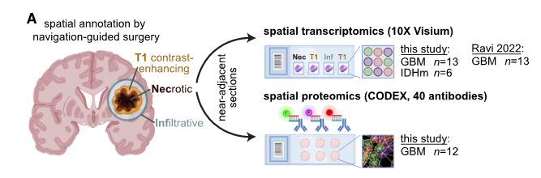

实验设计和患者队列。新鲜的来自GBM (n = 13)冷冻组织切片 和 IDH- 的突变神经胶质瘤 (n = 6)通过 10X Visium 进行分析。CODEX 在 12 个邻近的 GBM 上进行含有 40 种抗体的组织切片。四肿瘤由神经表面活性剂进行空间注释导航引导手术期间的geon。这个GBMVisium 队列与外部 GBM 相结合Visium 队列 9 用于联合分析。方案已创建与 BioRender.com 合作。

#### Fig. S1A

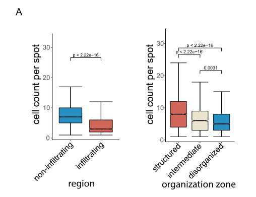

细分分析。左图：非浸润性和浸润性样品的细胞密度（每 55 mm 点的细胞计数）。右图：细胞密度（每55 mm 点），用于通过 CODEX 伪点的空间相干性分析对结构化、中间和无组织区域进行分类。方框表示中位数和第一个和第三个四分位数。上部和下部晶须延伸到最大值和最小值不超过四分位数范围的 1.5 倍第三个和第一个四分位数。区间外的数据点表示为点，p 值指示在通过 t 检验计算的图上。

*****

### 比喻讲解：

可以将这项研究比作在一个广阔的花园里进行植物普查，通过记录不同位置的植物种类和数量来了解花园的整体布局和特点。具体比喻如下：

1. **使用平台**：
- 就像使用一台高级的无人机来拍摄整个花园的航拍图（10X Visium空间转录组学平台），通过这些图像来分析花园中的植物分布（RNA-seq）。

2. **捕获点的直径和细胞数量**：
- 捕获点就像无人机拍摄的照片，每张照片覆盖一个直径为55毫米的圆圈。在这个圆圈内，可能有1到35株植物，通过照片分析得出平均每个圆圈内有8株植物（胶质母细胞瘤中的中位数）。

3. **样本处理**：
- 在四个不同的区域中，研究人员分别采集了不同区域的土壤样本（冷冻组织块），这些区域被标记为干旱区（坏死区）、湿润区（浸润区）或花朵繁茂区（T1对比增强区），通过精准的导航系统进行采样。

4. **分析的样本类型和数量**：
- 研究人员共分析了13个干旱区样本（GBM切片）和6个湿润区样本（IDH突变型胶质瘤切片，其中包括三个1p/19q共缺失的少突胶质细胞瘤和三个星形细胞瘤）。
- 这些样本与来自另一个花园的13个类似样本进行了整合，经过仔细检查后，总共分析了70,618张无人机拍摄的照片（捕获点）。

通过这种方式，研究人员能够绘制出整个花园的详细地图，了解不同区域的植物分布和特征，这对于进一步研究和保护花园提供了重要的信息。

*****

### 问题：

在使用10X Visium空间转录组学平台对胶质瘤进行空间分析时，研究人员如何处理和整合不同区域的样本？这些样本整合后的总捕获点数量是多少？

### 答案和讲解：

研究人员通过以下步骤处理和整合不同区域的样本：

1. **样本处理**：
- 从同一个肿瘤的不同区域采集冷冻组织块，这些区域通过导航引导肿瘤切除术进行注释，标记为坏死区、浸润区或T1对比增强区。
- 分析了13个GBM切片和6个IDH突变型胶质瘤切片，其中包括三个1p/19q共缺失的少突胶质细胞瘤和三个星形细胞瘤。

2. **数据整合**：
- 将这些样本与来自外部Visium数据集的13个GBM切片进行了整合。
- 经过质量控制后，总共保留了70,618个捕获点。

通过这种处理和整合，研究人员能够获得一个综合的空间转录组学图谱，为深入理解胶质瘤的异质性提供了丰富的数据。

### 比喻讲解：

可以将这项研究比作在一个广阔的花园里进行植物普查，通过记录不同位置的植物种类和数量来了解花园的整体布局和特点：

1. **样本处理**：
- 就像从花园的不同区域采集土壤样本，这些区域被标记为干旱区（坏死区）、湿润区（浸润区）或花朵繁茂区（T1对比增强区）。
- 分析了13个干旱区样本（GBM切片）和6个湿润区样本（IDH突变型胶质瘤切片，其中包括三个1p/19q共缺失的少突胶质细胞瘤和三个星形细胞瘤）。

2. **数据整合**：
- 将这些样本与来自另一个花园的13个类似样本进行了整合。
- 经过仔细检查后，总共分析了70,618张无人机拍摄的照片（捕获点）。

通过这种方式，研究人员能够绘制出整个花园的详细地图，了解不同区域的植物分布和特征，这对于进一步研究和保护花园提供了重要的信息。

*****

### 讲解：

该文本描述了研究人员使用两种初步方法对捕获点进行分类和注释，以识别并注释肿瘤样本中的不同区域。以下是详细讲解：

1. **拷贝数异常（CNA）推断**：
- 研究人员通过平均每个染色体区域中基因的表达来推断拷贝数异常（CNA）。
- 这种方法用于将捕获点分类为主要恶性、主要非恶性或混合。
- 结果显示，推断的CNA包括胶质母细胞瘤（GBM）的标志性变化（染色体7增益和染色体10缺失）和少突胶质细胞瘤的标志性变化（染色体1p/19q共缺失）。
- 这些CNA显著与癌症富集区域相关（例如，肿瘤核心区与浸润区的对比）。

2. **Leiden聚类分析**：
- 研究人员对每个样本和每个肿瘤的多个切片进行Leiden聚类分析。
- 通过基因集富集分析对聚类结果进行注释，以识别不同的细胞群体和区域。

这些方法帮助研究人员识别并注释肿瘤样本中的不同区域，为进一步研究肿瘤的空间异质性提供了基础。

### 图例:

#### Figures 1B 

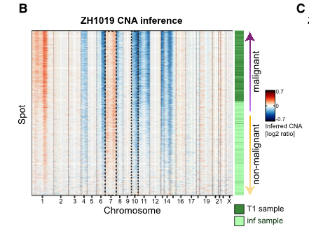

B.推断拷贝数畸变 (CNA)通过滑动窗口中的平均相对表达150 个分析基因按基因排序后染色体位置。 ZH1019，从中我们轮廓渗透样本和 aT1 对比
增强样本，此处显示为示例。行对应于按恶性肿瘤排列的斑点根据 CNA 推断的水平；列对应于基因按染色体位置排列。注释-化条对应于从中的区域
斑点衍生（T1或渗透）和恶性南希级别。

#### Fig. 1C

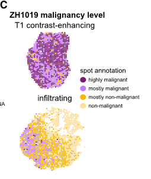

(C) ZH1019 T1 对比度增强的空间图ZH1019 浸润样本，其斑点由恶性程度注释，如 (B) 中所述。

#### Fig. 1D

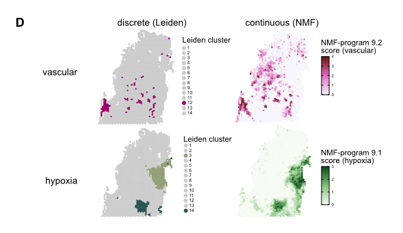

(D) 每样本 Leiden（左）和 NMF 聚类（右）ZH916散装用于血管和缺氧簇（所有其他簇均显示为灰色）。另请参见图 S1。

#### S1B, S1C,  S1D

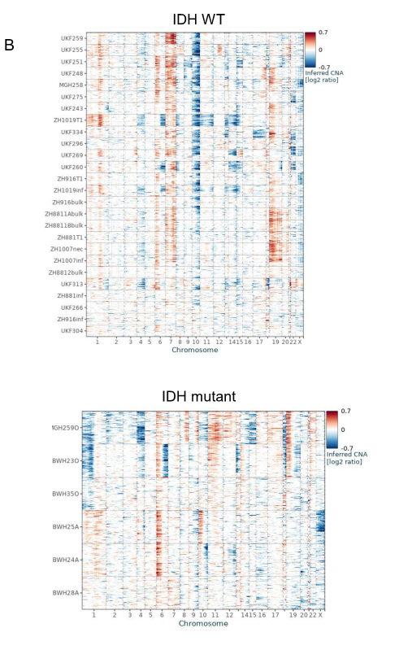

(B) GBM WT（顶部）和 IDH 突变（底部）队列的所有样本的拷贝数畸变 (CNA)。通过平均相对表达推断 CNA在 150 个分析基因的窗口中。行对应于按恶性程度推断排列的点（参见 STAR 方法），列对应于基因按染色体位置排列。

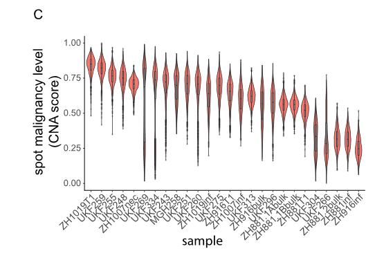

(C) 按 (A) 中定义的 GBM 样本、盒子和晶须的样本找出 CNA 分数。

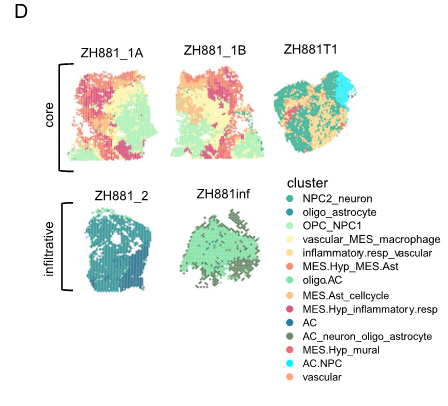

(D) 在有多个样本的肿瘤中，对每个肿瘤的组织切片（除了每个样本之外）联合进行莱顿聚类。

*****

### 比喻讲解：

可以将这项研究比作在一片混合的森林中进行调查，目的是识别和分类不同类型的树木和植物。具体比喻如下：

1. **拷贝数异常（CNA）推断**：
- 研究人员就像森林调查员，通过观察每个区域的植物种类和数量来推断该区域的特征。
- 他们通过统计每个区域中植物的数量和种类来判断该区域是主要由某种特定植物组成（主要恶性）、主要由其他植物组成（主要非恶性）还是混合组成（混合）。
- 调查结果显示了森林中的标志性特征，例如，某些区域有大量的橡树（染色体7增益）和松树（染色体10缺失），这些特征与森林的核心区域和边缘区域有显著关联。

2. **Leiden聚类分析**：
- 研究人员就像对森林进行分区的园艺师，他们对每个样本区域进行聚类分析。
- 通过观察植物种类的富集情况，将不同的区域进行分类和标注，以识别不同的植物群落和区域特征。

这些方法帮助研究人员识别并分类了森林中的不同区域，为进一步研究森林的空间结构和多样性提供了基础。

*****

### 问题：

在研究中，研究人员使用了哪两种方法来分类和注释捕获点，并如何利用这些方法识别胶质瘤中的不同区域？

### 答案和讲解：

研究人员使用了以下两种方法来分类和注释捕获点：

1. **拷贝数异常（CNA）推断**：
- 通过平均每个染色体区域中基因的表达来推断拷贝数异常（CNA）。
- 这种方法用于将捕获点分类为主要恶性、主要非恶性或混合。
- 他们发现的CNA包括胶质母细胞瘤（GBM）的标志性变化（染色体7增益和染色体10缺失）和少突胶质细胞瘤的标志性变化（染色体1p/19q共缺失）。
- 这些CNA显著与癌症富集区域相关（例如，肿瘤核心区与浸润区的对比）。

2. **Leiden聚类分析**：
- 对每个样本和每个肿瘤的多个切片进行Leiden聚类分析。
- 通过基因集富集分析对聚类结果进行注释，以识别不同的细胞群体和区域。

这两种方法帮助研究人员识别并注释了肿瘤样本中的不同区域，为进一步研究肿瘤的空间异质性提供了基础。

### 比喻讲解：

可以将这项研究比作在一片混合的森林中进行调查，目的是识别和分类不同类型的树木和植物：

1. **拷贝数异常（CNA）推断**：
- 研究人员就像森林调查员，通过观察每个区域的植物种类和数量来推断该区域的特征。
- 他们通过统计每个区域中植物的数量和种类来判断该区域是主要由某种特定植物组成（主要恶性）、主要由其他植物组成（主要非恶性）还是混合组成（混合）。
- 调查结果显示了森林中的标志性特征，例如，某些区域有大量的橡树（染色体7增益）和松树（染色体10缺失），这些特征与森林的核心区域和边缘区域有显著关联。

2. **Leiden聚类分析**：
- 研究人员就像对森林进行分区的园艺师，他们对每个样本区域进行聚类分析。
- 通过观察植物种类的富集情况，将不同的区域进行分类和标注，以识别不同的植物群落和区域特征。

通过这些方法，研究人员能够识别和分类森林中的不同区域，为进一步研究森林的空间结构和多样性提供了基础。

*****

### 讲解：

在这个研究中，研究人员在每个样本上进行了Leiden聚类，以便离散地将成分相似的点分组。然而，他们希望更好地捕捉细胞状态的连续性质。

为此，研究人员在每个样本上执行了非负矩阵分解（NMF）分析。通过这种方法，他们提取出了一些稳健的表达程序，这些程序在多个参数下都能一致地检测到。

具体步骤如下：
1. **Leiden聚类**：
- 在每个样本中进行Leiden聚类，将具有相似成分的点离散地分组。
- 这种方法能够识别出样本内部的相似区域。

2. **非负矩阵分解（NMF）**：
- 为了更好地捕捉细胞状态的连续变化，研究人员对每个样本进行NMF分析。
- NMF是一种降维技术，通过将高维数据分解为两个低维非负矩阵，提取出关键的表达程序。

3. **稳健表达程序**：
- 研究人员通过NMF提取出了一些在多个参数下都能一致检测到的表达程序。
- 这些表达程序反映了细胞状态的连续变化，提供了比离散聚类更细腻的细胞状态描述。

### 图例:
Figure 1D and S1E

#### Fig. 1D

(D) 每样本 Leiden（左）和 NMF 聚类（右）ZH916散装用于血管和缺氧簇（所有其他簇均显示为灰色）。另请参见图 S1。

#### S1E

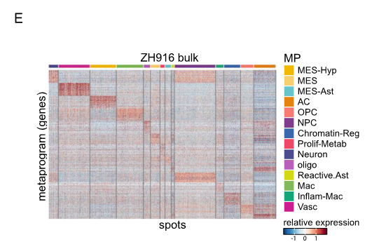

(E) 一个样品 (ZH916) 中的斑点与 MP 基因，值是对数转换的标准化表达。

*****

### 比喻讲解：

可以将这项研究比作在一个大型音乐会场馆中分析听众的喜好，以便更好地理解他们的音乐品味。具体比喻如下：

1. **Leiden聚类**：
- 想象你在音乐会场馆中通过座位的选择来分析听众的喜好。Leiden聚类就像是将喜欢相似音乐类型的听众分配到一起，例如，把所有喜欢摇滚的听众安排在一个区域，把喜欢古典音乐的听众安排在另一个区域。这样，每个区域的听众都有相似的音乐喜好。

2. **非负矩阵分解（NMF）**：
- 为了更精细地了解听众的音乐品味，你决定进行更深入的分析。NMF就像是通过调查问卷来分析每个听众的详细音乐喜好，将每个听众的喜好分解成多个音乐风格的组合。例如，一个听众可能同时喜欢70%的摇滚和30%的爵士音乐。

3. **稳健表达程序**：
- 通过这种方法，你提取出了每个听众的音乐喜好组合，这些组合在不同的问卷参数下都能一致地检测到。这就像发现了一些稳健的音乐偏好模式，这些模式能够准确地反映出听众的音乐品味变化，比简单地将听众分组能提供更细腻的喜好描述。

通过这种比喻，我们可以更好地理解该研究是如何通过NMF来捕捉细胞状态的连续变化，超越了Leiden聚类所提供的离散分组方式。

*****

### 问题：

研究人员为什么在Leiden聚类之后选择使用非负矩阵分解（NMF）进行进一步分析？这种方法能带来什么优势？

### 答案和讲解：

**研究人员选择使用非负矩阵分解（NMF）的原因**：

- **捕捉细胞状态的连续性质**：Leiden聚类能够将成分相似的点离散地分组，但这种方法只能识别出细胞的离散状态。研究人员希望能够更好地捕捉细胞状态的连续变化，因此选择了NMF进行进一步分析。

**NMF的优势**：

- **提取稳健的表达程序**：NMF能够提取出在多个参数下都能一致检测到的表达程序，这些程序反映了细胞状态的连续变化。
- **细腻的细胞状态描述**：与Leiden聚类相比，NMF提供了更细腻的细胞状态描述，能够更准确地反映细胞的连续变化。

### 比喻讲解：

可以将这项研究比作在一个大型音乐会场馆中分析听众的喜好，以便更好地理解他们的音乐品味：

- **Leiden聚类**：就像通过座位的选择来分析听众的喜好，将喜欢相似音乐类型的听众分配到一起。例如，把所有喜欢摇滚的听众安排在一个区域，把喜欢古典音乐的听众安排在另一个区域。
- **非负矩阵分解（NMF）**：为了更精细地了解听众的音乐品味，NMF就像是通过调查问卷来分析每个听众的详细音乐喜好，将每个听众的喜好分解成多个音乐风格的组合。例如，一个听众可能同时喜欢70%的摇滚和30%的爵士音乐。
- **NMF的优势**：这种方法提取出了稳健的音乐偏好模式，这些模式能够准确地反映出听众的音乐品味变化，比简单地将听众分组能提供更细腻的喜好描述。

通过这种比喻，可以更好地理解研究人员为什么选择使用NMF，以及这种方法带来的优势。

*****

## Recurrent patterns of expression heterogeneity across gliomas

### 讲解：

该文本描述了研究人员如何定义表达程序，以反映基因表达异质性的核心模式，并将这些程序整合成空间基因表达程序（metaprograms, MPs）。以下是详细讲解：

1. **表达程序的识别和比较**：
- 研究人员在个体GBM（胶质母细胞瘤）样本中识别了492个基因表达程序，通过Leiden聚类或NMF（非负矩阵分解）方法进行识别。
- 他们发现了显著的相似性，这些相似性使他们能够根据基因身份重叠定义14个程序簇，每个簇覆盖来自多个GBM样本的程序（如图2A和2B所示，详见STAR方法）。

2. **空间基因表达程序的定义**：
- 对于每组程序，研究人员定义了一个包含50个基因的共识程序，称为空间基因表达程序（MP），以反映GBM中的重复异质性模式（如图2C和S1E所示，恶性空间基因表达程序在图中用粗体表示）。
- 类似地，研究人员在IDH突变型胶质瘤中定义了六个空间基因表达程序（如图S2A和S2B以及表S2所示，详见STAR方法）。

这些定义和整合的空间基因表达程序帮助研究人员理解GBM和IDH突变型胶质瘤中的表达异质性，为进一步的研究提供了重要的基础。

### 图例:
#### Figures 2A, 2B, 2C

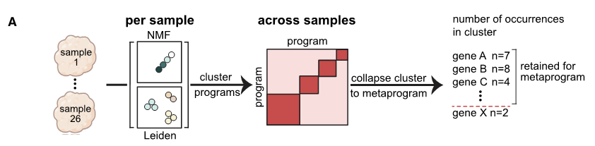

A) 使用 BioRender.com 创建的空间基因表达程序 (MP) 生成方法方案。每个样本均由 Leiden 和 NMF 单独聚类。所有莱顿和所有所有样本中的 NMF 程序均按其基因重叠进行聚类。通过选择最常出现的基因，每个簇都被折叠成一致的 MP跨集群内的程序。

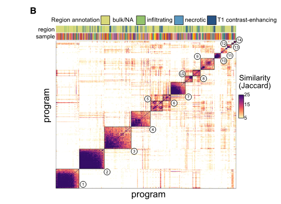

(B) 基于基因身份重叠的相似性矩阵（通过 Jaccard 指数量化），适用于所有源自 NMF 和 Leiden 簇的程序。程序均已注释通过样本和区域标识。簇号对应于 (C) 中的表。

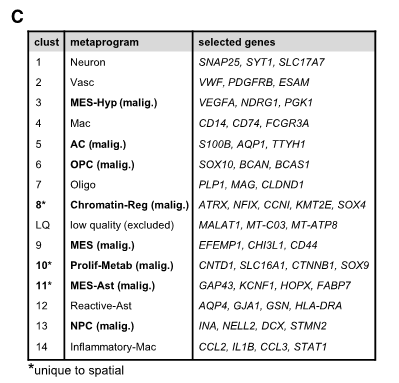

(C) 空间基因表达程序名称和对应于 (B) 中编号的簇的所选基因的表。恶性空间基因表达程序以粗体表示。

#### S1E, S2A, S2B

(E) 一个样品 (ZH916) 中的斑点与 MP 基因，值是对数转换的标准化表达。

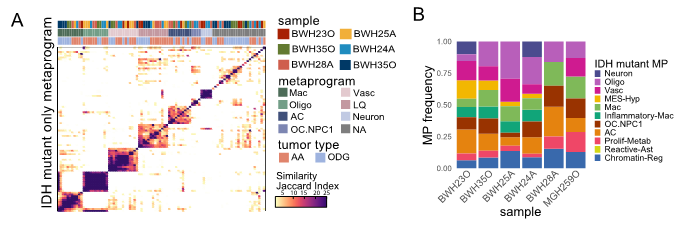

(A) 所有 IDH 突变样本中的所有 Leiden 和 NMF 基因程序按基因重叠（杰卡德指数）进行聚类，以导出 IDH 突变空间基因表达程序。
(B) IDH 突变体样品的 MP 组成。

*****

### 比喻讲解：

可以将这项研究比作整理一本大百科全书，目的是将散落在不同章节中的相似主题汇总成统一的条目，以便更好地理解和查找信息。具体比喻如下：

1. **表达程序的识别和比较**：
- 研究人员就像是在大百科全书中找到492篇关于不同主题的文章（基因表达程序），通过两种方法（Leiden聚类或NMF）进行分类。
- 他们发现这些文章之间有很多相似之处，使他们能够将这些相似文章归类成14个主题簇，每个主题簇包括来自多个不同章节的文章（如图2A和2B所示）。

2. **空间基因表达程序的定义**：
- 对于每个主题簇，研究人员就像是编写了一篇综合性的文章，包含50个关键点（基因），称为空间基因表达程序（MP），这篇文章反映了大百科全书中关于该主题的主要内容和模式（如图2C和S1E所示，恶性空间基因表达程序在图中用粗体表示）。
- 类似地，研究人员在另一部分的大百科全书中也定义了六篇关于特定主题的综合性文章（如图S2A和S2B以及表S2所示）。

通过这种方式，研究人员能够更好地理解和组织GBM和IDH突变型胶质瘤中的表达异质性，为将来的研究和探索提供了更清晰的结构和方向。

*****

### 问题：

研究人员是如何定义和整合基因表达程序的？在GBM和IDH突变型胶质瘤中，他们分别定义了多少个空间基因表达程序（MP）？

### 答案和讲解：

研究人员通过以下步骤定义和整合基因表达程序：

1. **识别基因表达程序**：
- 在个体GBM样本中识别了492个基因表达程序，使用Leiden聚类或非负矩阵分解（NMF）方法进行识别。

2. **定义程序簇**：
- 根据基因身份重叠，定义了14个程序簇，每个簇覆盖来自多个GBM样本的表达程序（如图2A和2B所示）。

3. **定义空间基因表达程序（MP）**：
- 对于每组程序簇，定义了一个包含50个基因的共识程序，称为空间基因表达程序（MP），反映了GBM中的重复异质性模式（如图2C和S1E所示）。
- 在IDH突变型胶质瘤中，定义了六个空间基因表达程序（如图S2A和S2B以及表S2所示）。

**总结**：
- 在GBM中定义了14个空间基因表达程序。
- 在IDH突变型胶质瘤中定义了六个空间基因表达程序。

### 比喻讲解：

可以将这项研究比作整理一本大百科全书，将相似主题的文章汇总成统一的条目，以便更好地理解和查找信息：

1. **识别基因表达程序**：
- 就像是在大百科全书中找到492篇关于不同主题的文章，通过两种方法（Leiden聚类或NMF）进行分类。

2. **定义程序簇**：
- 根据文章内容的相似性，将这些文章归类成14个主题簇，每个主题簇包括来自多个不同章节的文章（如图2A和2B所示）。

3. **定义空间基因表达程序（MP）**：
- 对于每个主题簇，编写一篇包含50个关键点的综合性文章，称为空间基因表达程序（MP），反映了大百科全书中关于该主题的主要内容和模式（如图2C和S1E所示）。
- 类似地，在另一部分的大百科全书中也定义了六篇关于特定主题的综合性文章（如图S2A和S2B以及表S2所示）。

通过这种方式，研究人员能够更好地理解和组织GBM和IDH突变型胶质瘤中的表达异质性，为将来的研究和探索提供了更清晰的结构和方向。

*****

### 讲解：

该文本描述了研究中如何使用非负矩阵分解（NMF）来提取主要表达模式（MPs），并且这些MPs与单细胞状态高度相似。以下是详细讲解：

1. **表达谱和单细胞状态的相似性**：
- 尽管捕获点（spots）的表达谱通常反映的是多种细胞状态的组合，但通过NMF提取的MPs与单细胞状态高度相似（如图2D和图S2C所示）。

2. **方法的有效性**：
- 该方法能够突出显示个体细胞状态，这一能力得到了模拟结果的进一步支持（如图S2D和图S2E，以及STAR方法）。
- 这种能力与两大特性有关：使用NMF来推导程序（programs），以及将MPs定义为从多个样本中推导出的程序的一致性。

3. **玩具示例（Toy Example）**：
- 假设有多个捕获点，每个点包含8个细胞，且某种细胞状态X分别在这些捕获点中占据1到8个细胞。
- 将这些捕获点聚类并定义每个聚类的表达谱将会导致一个X细胞富集的聚类，但其表达谱也会包含其他细胞状态的影响。
- 然而，NMF的设计目的是检测在捕获点之间一致变化的主要表达谱，因此NMF倾向于仅将X检测为一个因素。

### 图例:

#### Fig.2D

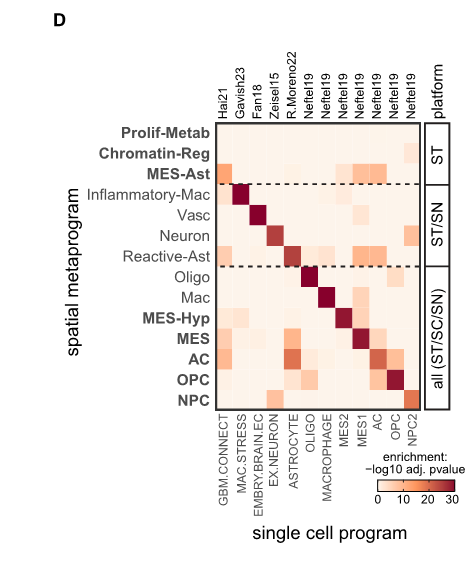

(D) 使用先前从顶部所示的研究中定义的基因集（列）来丰富空间空间基因表达程序（行）。 富集度计算公式超几何检验（？log 10 FDR 调整的 p 值）。

#### S2 c&D&E

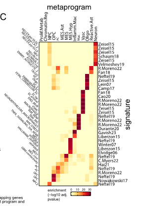

(C) 使用先前从顶部所示的研究中定义的基因集（行）来丰富空间空间基因表达程序（列）。富集值计算公式为超几何测试；显着性由 -log 10 FDR 调整的 p 值 < 0.01 定义。

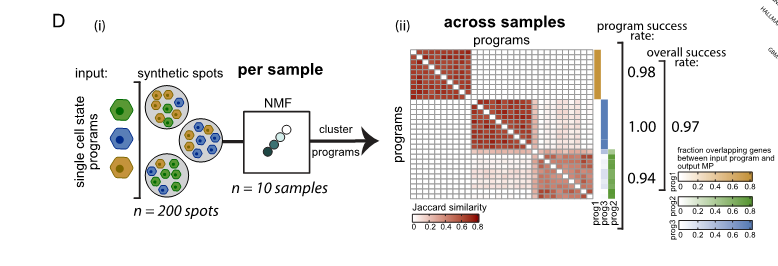

(D) (i) 显示合成点生成和 NMF 模拟的方案。 (ii) 生成的输出标记物和基准测试结果的 Jaccard 相似度矩阵。参数：表达量≤0.3，成分≤0.36（STAR 方法）。

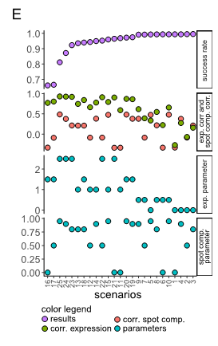

(E) 成功率以及每个模拟场景生成的相关性和输入参数的摘要。成功率和相关性被平均跨越 50 次模拟。

*****

### 比喻讲解：

可以将这项研究比作在一个大型音乐会中识别不同乐器的声音，即使这些声音通常是混合在一起的。具体比喻如下：

1. **表达谱和单细胞状态的相似性**：
- 想象每个捕获点（spot）就像是一个乐队演奏的录音，这个录音中包含了多种乐器的声音（细胞状态）。通过NMF方法，我们能够从混合的录音中分离出每种乐器的单独声音（单细胞状态），这些分离出的声音与单个乐器演奏时的声音非常相似（如图2D和图S2C所示）。

2. **方法的有效性**：
- 这种分离乐器声音的方法得到了模拟实验的进一步支持，就像通过电脑模拟测试来验证我们能否准确地从混合录音中识别出各个乐器的声音（如图S2D和图S2E，以及STAR方法）。
- 这个方法有效的原因有两个：首先，我们使用NMF来从录音中提取主要的音乐片段（程序）；其次，我们将这些主要的音乐片段定义为从多个录音中提取的一致声音（MPs）。

3. **玩具示例（Toy Example）**：
- 想象有多个录音，每个录音包含8种乐器，某种特定的乐器X在这些录音中的比例分别是1到8。
- 如果将这些录音进行聚类，并定义每个聚类的音乐特点，我们会得到一个X乐器富集的聚类，但这个聚类的音乐特点也会包含其他乐器的声音。
- 然而，NMF就像一个高效的音乐分离器，它的设计目的是检测在录音之间一致变化的主要音乐片段，因此NMF倾向于仅将X乐器的声音作为一个独立的因素检测出来。

通过这种方式，我们能够从复杂的混合录音中准确分离出每种乐器的声音，这就像研究中能够从混合的细胞表达谱中提取出单一的细胞状态。

*****

### 问题：

在研究中，使用非负矩阵分解（NMF）提取的主要表达模式（MPs）如何与单细胞状态相似？该方法如何有效地突出个体细胞状态？

### 答案和讲解：

**答案和讲解：**

NMF提取的主要表达模式（MPs）与单细胞状态相似，因为它能从混合的表达谱中分离出主要的细胞状态。该方法的有效性得益于以下两点：

1. **使用NMF推导程序**：
- NMF能够检测在捕获点之间一致变化的主要表达谱，因此倾向于将主要的细胞状态检测为独立因素。这使得NMF提取的MPs能够突出个体细胞状态，而不受其他细胞状态的干扰。

2. **定义MPs为一致性的程序**：
- 将MPs定义为从多个样本中推导出的一致性程序，进一步提高了方法的可靠性和准确性。这意味着MPs是多个样本中反复出现的主要表达谱，能够更好地代表单一的细胞状态。

通过这些方法，NMF能够从复杂的表达谱数据中提取出清晰的单细胞状态，尽管每个捕获点的表达谱可能包含多种细胞状态的组合。

**比喻讲解：**

可以将这项研究比作在一个大型音乐会中识别不同乐器的声音，即使这些声音通常是混合在一起的：

1. **表达谱和单细胞状态的相似性**：
- 每个捕获点（spot）就像是一个乐队演奏的录音，这个录音中包含了多种乐器的声音（细胞状态）。通过NMF方法，我们能够从混合的录音中分离出每种乐器的单独声音（单细胞状态），这些分离出的声音与单个乐器演奏时的声音非常相似。

2. **方法的有效性**：
- 这种分离乐器声音的方法得到了模拟实验的进一步支持，就像通过电脑模拟测试来验证我们能否准确地从混合录音中识别出各个乐器的声音。
- NMF就像一个高效的音乐分离器，它的设计目的是检测在录音之间一致变化的主要音乐片段，因此NMF倾向于仅将主要的乐器声音作为独立因素检测出来。

通过这种方式，我们能够从复杂的混合录音中准确分离出每种乐器的声音，这就像研究中能够从混合的细胞表达谱中提取出单一的细胞状态。

*****

### 讲解：

该文本讨论了在非负矩阵分解（NMF）方法中，不同细胞状态之间的相关性如何影响结果，以及这种方法与其他方法的区别。

1. **NMF方法的细胞状态组合**：
- 如果X细胞状态与Y细胞状态相关，那么NMF可能会识别X和Y的组合。
- 只有当X和Y在所有样本中始终高度相关时，我们才会期望主成分（MP）反映它们的组合。
- 如果在某些样本中这种相关性较低，那么共识MP将强调共享的NMF基因（反映X），而不是样本特异性基因（包括Y）。

2. **MP方法与其他方法的区别**：
- 本研究中的MP方法不同于早期的聚焦于空间定义程序的研究，这些研究通常包含混合的细胞类型（如图S2F所示）。
- 与基于配对的单细胞或单核RNA测序（sc/snRNA-seq）的点解卷方法也不同，这种方法适合捕捉样本特异性的细胞状态，但对平台依赖的差异（如对某些细胞状态和细胞类型的解离偏差）较为敏感。

通过这种分析方法，研究人员能够更准确地识别和区分不同细胞状态及其组合，提高对细胞异质性的理解。

### 图例:

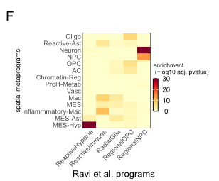

（F）GBM空间主成分（MPs）在Ravi等人定义的五种GBM空间区域状态中的富集情况（富集通过超几何检验计算，显著性定义为-log10 FDR调整后的p值< 0.01）。

*****

### 比喻讲解

可以将这段内容比作在一个城市的不同区域进行音乐风格的调查，通过分析这些区域的音乐喜好来了解整个城市的音乐特征。

1. **NMF方法的音乐风格组合**：
- 假设音乐风格X和Y在某些区域内的喜好是相关的。NMF方法就像一个音乐分析工具，它可以识别出这些区域中X和Y的组合。
- 只有当所有区域中的X和Y始终高度相关时，我们才会期望最终的音乐特征（MP）反映它们的组合。
- 如果在某些区域中X和Y的相关性较低，那么最终的音乐特征将强调所有区域中共有的音乐风格（反映X），而不是特定区域内独有的音乐风格（包括Y）。

2. **MP方法与其他方法的区别**：
- 这种MP方法不同于以前的研究，这些研究主要关注特定区域的音乐风格，这些区域往往包含混合的音乐类型（如图S2F所示）。
- 也不同于基于具体区域音乐数据的分解方法，这些方法适合捕捉特定区域的音乐风格，但对不同音乐平台（如不同的音乐流媒体服务）的偏差较为敏感。

通过这种音乐分析方法，研究人员能够更准确地识别和区分不同区域的音乐风格及其组合，从而更好地理解整个城市的音乐偏好和特征。

*****

### 问题：

在使用非负矩阵分解（NMF）方法时，如果两个细胞状态X和Y在所有样本中并不总是高度相关，那么NMF的结果会如何反映这些细胞状态的组合？这种方法与其他聚焦于空间定义程序的方法有何不同？

### 答案和讲解：

**答案**：

如果两个细胞状态X和Y在所有样本中并不总是高度相关，NMF的结果将更倾向于反映共享的NMF基因（代表X），而不是样本特异性基因（包括Y）。

**讲解**：

当X和Y在所有样本中始终高度相关时，主成分（MP）会反映它们的组合。然而，如果在某些样本中这种相关性较低，NMF的共识MP将强调共享的NMF基因（反映X），而不是样本特异性基因（包括Y）。这种方法与早期的研究不同，后者主要关注空间定义的程序，通常包含混合的细胞类型。此外，这种方法也不同于基于配对的单细胞或单核RNA测序（sc/snRNA-seq）的点解卷方法，后者适合捕捉样本特异性的细胞状态，但对平台依赖的差异较为敏感。

### 比喻讲解：

可以将这个过程比作在一个城市的不同区域进行音乐风格的调查。如果音乐风格X和Y在所有区域中总是一起出现（高度相关），那么最终的音乐特征分析（MP）会反映它们的组合。但如果在某些区域中X和Y并不总是一起出现（相关性较低），那么最终的音乐特征分析会更强调所有区域中共同的音乐风格（代表X），而不是特定区域独有的音乐风格（包括Y）。这种分析方法与以前只关注特定区域音乐风格的研究不同，它更能准确地识别和区分不同区域的音乐风格及其组合。

*****

### 讲解：

该文本描述了研究人员在胶质母细胞瘤（GBM）中鉴定出的14种空间基因表达程序（MPs），其中包括8种恶性程序和6种非恶性程序。以下是详细讲解：

1. **鉴定的MPs种类**：
- **恶性MPs**（8种）：这些程序反映了癌细胞的不同状态。
- **非恶性MPs**（6种）：这些程序反映了非恶性细胞类型。

2. **非恶性MPs**：
- **Mac**（巨噬细胞/小胶质细胞）
- **Inflammatory-Mac**（炎性巨噬细胞/中性粒细胞）
- **Oligo**（少突胶质细胞）
- **Vasc**（内皮细胞和周细胞）
- **Neuron**（神经元）
- **Reactive-Ast**（反应性星形胶质细胞）：包含经典的星形胶质细胞标记（如AGT和GJA1）和一些表明其处于反应性状态的附加标记（如金属硫蛋白）。

3. **恶性MPs**：
- 其中5种恶性程序直接映射到单细胞GBM状态：
- **MES-hypoxia (MES2)**
- **MES (MES1)**
- **NPC-like**
- **OPC-like**
- **AC-like**

4. **基因重叠**：
- 与神经发育相关的恶性MPs（NPC-like、OPC-like和AC-like）与相应的非恶性细胞类型特征有很高的基因重叠，这一点在从scRNA-seq数据中得出的相应MPs中也有体现（如图S2H所示）。

### 图例:
Figures 2C and 2D; Table S2; 

#### Fig.2C

(C) 空间基因表达程序名称和对应于 (B) 中编号的簇的所选基因的表。恶性空间基因表达程序以粗体表示。

#### Fig.2D

(D) 使用先前从顶部所示的研究中定义的基因集（列）来丰富空间空间基因表达程序（行）。 富集度计算公式超几何检验（？log 10 FDR 调整的 p 值）。

#### Figure S2G; Figure S2H

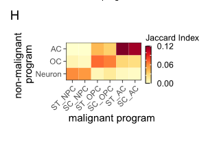

(G) 核心恶性空间基因表达程序（每个基因）与每个平台上的等效空间基因表达程序（ST，空间转录组学；
SC，单细胞 RNA 测序）。对于每个平台，该类型的 GBM 数据用于计算相关性。

