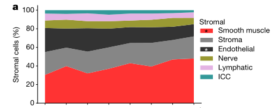
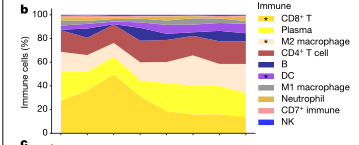
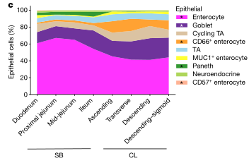
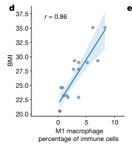
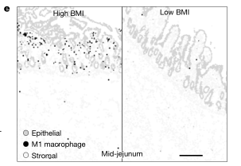
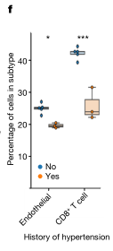
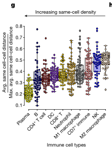

# Organization of the human intestine at single-cell resolution

## Abstract

### 讲解：

这段文本详细描述了研究团队如何研究肠道的复杂性及其功能差异。以下是具体的讲解：

1. **肠道的功能和重要性**：
-肠道是一个复杂的器官，促进消化，提取营养，参与免疫监视，维持与微生物群的关键共生关系，并影响整体健康。
-肠道长度超过九米，其结构和功能沿途存在差异。

2.**研究目的**：
-为了更好地理解这些功能差异，研究人员评估了单细胞的组织情况，使用多重成像和单核RNA以及开放染色质检测，涵盖了来自九位供体的八个不同肠道部位。

3.**研究发现**：
-通过系统分析，研究人员发现肠道不同区域的细胞组成有显著差异，展示了上皮亚型的复杂性。
-相同的细胞类型在肠道中被组织成不同的邻域和社区，突显了肠道中存在的独特免疫生态位。
-研究还绘制了这些细胞中的基因调控差异，这些差异暗示了一个调控分化级联反应。
-将肠道疾病的遗传力与特定细胞类型关联起来。

4.**研究的重要性**：
- 这些结果描述了肠道器官的细胞组成、调控和组织的复杂性，并作为理解人类生物学和疾病的重要参考图谱。

*****

### 比喻讲解：

可以将这项研究比作探索一个广袤而复杂的城市，了解不同街区的居民、功能和相互关系。具体比喻如下：

1. **肠道的功能和重要性**：
- 肠道就像一个大型城市，这个城市不仅有繁忙的商业区（促进消化，提取营养），还有警察和安全系统（参与免疫监视），维持与外来移民（微生物群）的和谐共生，并影响整个城市的整体健康。

1. **研究目的**：
- 为了更好地理解这个城市的不同街区（肠道的不同部分），研究人员就像城市规划者，使用多种高科技工具（多重成像和单核RNA及开放染色质检测）对九位居民（供体）的八个不同街区进行了详细调查。

2. **研究发现**：
- 通过这次调查，研究人员发现不同街区的居民组成（细胞组成）有显著差异。比如，商业区的居民类型和住宅区的居民类型完全不同，展示了这些街区的独特性。
- 即使是相同类型的居民（细胞类型），在不同街区也有不同的组织和社区结构，形成了独特的邻里关系和功能区（免疫生态位）。
- 研究人员还绘制了这些居民的行为和调控模式（基因调控差异），就像描述了不同街区的管理规则和发展趋势（调控分化级联反应）。
- 他们还将城市中某些问题（疾病）与特定的街区和居民类型（细胞类型）进行了关联。

3. **研究的重要性**：
- 这些结果为我们描绘了一幅详细的城市地图，展示了这个城市的复杂居民结构、管理规则和组织方式。这些信息对理解城市（人体）如何运行以及如何应对城市问题（疾病）提供了重要的参考。

*****

### 问题：

研究人员通过什么方法研究肠道不同部位的细胞组成和功能差异？他们发现了哪些主要结果？

### 答案和讲解：

**研究方法**：
研究人员使用多重成像和单核RNA及开放染色质检测技术，对来自九位供体的八个不同肠道部位的单细胞进行了组织评估。这些技术帮助他们系统地分析了细胞组成、基因调控和细胞在不同部位的组织结构。

**主要结果**：
1. **细胞组成差异**：
- 研究发现肠道不同区域的细胞组成有显著差异，展示了上皮亚型的复杂性。

2. **细胞组织结构**：
- 相同的细胞类型在肠道中被组织成不同的邻域和社区，形成了独特的免疫生态位。

3. **基因调控差异**：
- 研究绘制了细胞中的基因调控差异，暗示了一个调控分化级联反应。

4. **疾病遗传力关联**：
- 将肠道疾病的遗传力与特定细胞类型进行了关联。

**研究的重要性**：
这些结果为理解肠道的复杂细胞组成、调控和组织提供了详细的参考图谱，有助于理解人类生物学和疾病。

### 比喻讲解：

可以将这项研究比作探索一个广袤而复杂的城市，了解不同街区的居民、功能和相互关系。

**研究方法**：
- 研究人员就像城市规划者，使用多种高科技工具（多重成像和单核RNA及开放染色质检测）对九位居民（供体）的八个不同街区进行了详细调查。

**主要结果**：
1. **居民组成差异**：
- 发现不同街区的居民组成有显著差异，比如商业区和住宅区的居民类型不同，展示了这些街区的独特性。

2. **居民组织结构**：
- 相同类型的居民在不同街区有不同的组织和社区结构，形成了独特的邻里关系和功能区（免疫生态位）。

3. **行为和管理规则**：
- 描述了不同街区的管理规则和发展趋势（基因调控差异），就像城市的管理和发展策略。

4. **城市问题关联**：
- 将城市中某些问题（疾病）与特定的街区和居民类型（细胞类型）进行了关联。

通过这个比喻，可以更好地理解研究方法和发现的意义，就像详细描绘了一个城市的地图，展示了复杂的居民结构、管理规则和组织方式。

*****

### 讲解：

这段文本详细介绍了人类肠道系统的复杂性及其研究方法和发现。以下是具体的讲解：

1. **肠道系统的基本结构和功能**：
- 成人肠道系统包括大约7米的小肠和2米的大肠。
- 小肠负责吸收水分和小分子营养（如糖、单价离子和氨基酸），而大肠则积累纤维等大分子，并作为厌氧发酵室，分解和吸收副产物，以及通过肠道微生物合成和吸收其他营养（如维生素）。

2. **肠道的异质性**：
- 小肠分为十二指肠、空肠和回肠三个形态各异的区域。
- 大肠则可以分为升结肠、横结肠、降结肠和乙状结肠。
- 每个解剖区域包含大量表型和形态各异的细胞类型，包括上皮细胞、基质细胞和免疫细胞。免疫细胞尤为重要，因为它们与肠道中的微生物和外来物质相互作用。

3. **特定细胞类型的分布**：
- 虽然这些广义的细胞类型在整个肠道系统中都是常见的，但特定细胞类型表现出位置偏好。例如，潘氏细胞主要分布在小肠，而肠内分泌L细胞主要在回肠和大肠中发现。

4. **细胞的空间组织**：
- 这些细胞类型在肠道不同区域中被组织成不同的“邻域”，这些邻域的组成和分子表型在不同解剖区域中以相对未知的方式变化。这些功能邻域的组成和细胞状态的分子身份的差异定义了人类肠道的组成和功能。

5. **研究方法和发现**：
- 研究人员使用单核RNA、开放染色质和空间蛋白质组学成像技术对肠道的多个部分进行了单细胞分辨率的映射。
- 以前的研究使用单细胞RNA测序（scRNA-seq）绘制了肠道细胞类型的图谱，而本研究扩展了这一研究，通过索引共检测（CODEX）技术对细胞和蛋白质进行了空间映射，并使用单核转座酶可及染色质测序（snATAC-seq）技术映射了基因调控信息。
- 研究定义了不同肠道区域内不同细胞类型的相对丰度，包括上皮细胞的巨大复杂性，以及细胞在不同多细胞结构生态位中的组织。
- 研究还绘制了这些细胞中的基因调控差异，暗示了一个调控分化级联反应。

6. **研究的重要性**：
- 这些结果提供了关于这个复杂器官的细胞功能、调控和组织的重要见解，作为理解人类生物学和疾病的重要参考。

*****

### 比喻讲解：

可以将这项研究比作探索一个大型、多功能的城市，了解不同街区的居民、功能和相互关系。具体比喻如下：

1. **肠道系统的基本结构和功能**：
- 肠道系统就像一个庞大的城市，包含7公里长的小街区（小肠）和2公里长的大街区（大肠）。
- 小街区（小肠）负责处理基础任务，比如吸收水分和小分子营养（类似于供应日常生活用品），而大街区（大肠）则负责处理更复杂的任务，如积累和发酵纤维等大分子，分解和吸收副产物，并通过与城市中的微生物合作（类似于工厂和实验室）合成和吸收其他营养（如维生素）。

2. **肠道的异质性**：
- 小街区（小肠）分为三个独特的区域：商业区（十二指肠）、住宅区（空肠）和工业区（回肠），每个区域都有不同的功能和特性。
- 大街区（大肠）分为四个部分：上城区（升结肠）、中城区（横结肠）、下城区（降结肠）和郊区（乙状结肠），每个区域也都有独特的特性。

3. **特定居民类型的分布**：
- 在整个城市中，有不同的居民类型（细胞类型），如工人（上皮细胞）、维护人员（基质细胞）和保安（免疫细胞）。
- 某些居民类型有特定的居住偏好。例如，专门从事防护工作的居民（潘氏细胞）主要住在小街区，而负责内分泌功能的居民（肠内分泌L细胞）则主要住在回肠和大街区。

4. **居民的空间组织**：
- 这些居民在城市的不同区域内组织成不同的社区（邻域），这些社区的组成和功能在不同区域中有所不同，就像每个街区都有自己独特的社区和功能区。

5. **研究方法和发现**：
- 研究人员就像城市规划者，使用先进的技术（单核RNA、开放染色质和空间蛋白质组学成像技术），对城市的多个部分进行了详细的地图绘制。
- 以前的研究已经使用人口普查（单细胞RNA测序）绘制了居民类型的基本图谱，而本研究进一步扩展了这一研究，通过高级图像处理技术（CODEX）对居民和建筑物（细胞和蛋白质）进行了空间映射，并使用基因调控信息（snATAC-seq）分析了城市管理的规则。
- 研究人员定义了不同街区内不同居民类型的相对比例，包括上皮细胞的巨大多样性，以及居民在不同社区中的组织方式。

6. **研究的重要性**：
- 这些结果为我们提供了一幅详细的城市地图，展示了这个复杂城市的居民功能、管理规则和组织方式，成为理解城市运行和解决城市问题的重要参考。

*****

### 问题：

研究人员如何使用不同的技术来研究人类肠道的复杂性？这些技术揭示了哪些主要发现？

### 答案和讲解：

**研究技术**：

1. **单核RNA测序（snRNA-seq）**：
- 用于绘制单细胞分辨率的转录组图谱，识别不同细胞类型的基因表达模式。

2. **开放染色质测序（snATAC-seq）**：
- 用于分析细胞中的开放染色质区域，揭示基因调控信息，帮助理解基因表达的调控机制。

3. **空间蛋白质组学成像技术（CODEX）**：
- 用于空间定位细胞和蛋白质，绘制细胞在肠道不同区域的空间分布图。

**主要发现**：

1. **细胞组成的复杂性**：
- 在肠道不同区域内，细胞组成存在显著差异，展示了上皮细胞的巨大复杂性。

2. **细胞组织的多样性**：
- 相同类型的细胞在肠道中被组织成不同的邻域和社区，形成了独特的免疫生态位。

3. **基因调控的差异**：
- 研究绘制了基因调控差异，暗示了一个调控分化级联反应。

4. **特定细胞类型的定位偏好**：
- 某些细胞类型在特定的肠道区域有定位偏好，例如潘氏细胞主要在小肠，而肠内分泌L细胞主要在回肠和大肠中发现。

这些研究结果为理解肠道的细胞功能、调控和组织提供了重要的见解，成为理解人类生物学和疾病的重要参考。

*****

### 比喻讲解：

可以将这项研究比作探索一个大型、多功能的城市，了解不同街区的居民、功能和相互关系：

**研究技术**：

1. **单核RNA测序（snRNA-seq）**：
- 就像使用高分辨率的摄像机拍摄每个居民的活动，了解他们的日常行为和功能。

2. **开放染色质测序（snATAC-seq）**：
- 类似于分析城市的法规和管理规则，揭示城市管理的具体机制和政策。

3. **空间蛋白质组学成像技术（CODEX）**：
- 如同使用高科技地图绘制工具，详细绘制出城市中每个街区的居民分布和建筑布局。

**主要发现**：

1. **居民组成的复杂性**：
- 不同街区的居民组成存在显著差异，展示了上皮细胞的多样性。

2. **居民组织的多样性**：
- 相同类型的居民在不同街区被组织成不同的社区，形成了独特的邻里关系和功能区。

3. **法规和管理规则的差异**：
- 描述了不同街区的管理规则和发展策略，揭示了一个复杂的管理和发展过程。

4. **特定居民类型的定位偏好**：
- 某些居民类型偏好特定的街区，例如防护人员主要在小街区，而技术人员主要在工业区和大街区中。

通过这个比喻，可以更好地理解研究技术和发现的意义，就像详细描绘了一个城市的地图，展示了复杂的居民结构、管理规则和组织方式。

*****

### Fig. 1a: 结果描述和图例描述

#### 结果描述：
Fig. 1a 展示了从八位捐献者的CODEX数据中提取的细胞类型百分比，分别计算并平均化了在小肠和大肠的不同区域中 stromal 细胞类型的百分比。 结果显示，从小肠到大肠，内皮细胞（endothelial cells）的百分比减少，而平滑肌细胞（smooth muscle cells）的百分比增加。为确保这一发现不是由于样本中捕捉到更多的外肌层（muscularis externa）造成的人工效应，作者计算了在四个不同的病理区域（黏膜、黏膜肌层、黏膜下层和外肌层）中的所有细胞类型的百分比。即使在比较外肌层中的所有细胞类型时，内皮细胞的减少和平滑肌细胞的增加依然显著。因此，不仅在大肠中血管减少，在外肌层中也观察到了这一现象，而平滑肌细胞的密度更高。

#### 图例描述：
a) CODEX数据中八位捐赠者的细胞类型百分比的平均值。细胞类型被规范化为 stromal（基质细胞）类别。统计分析使用双侧 t 检验比较了小肠 (SB) 和大肠 (CL) 之间的细胞类型百分比的差异；* 表示 p < 0.05。ICC 表示间质细胞；NK 表示自然杀伤细胞；TA 表示转运增殖细胞。

#### 关键结论：
1. 内皮细胞在大肠中的百分比显著减少。
2. 平滑肌细胞在大肠中的百分比显著增加。
3. 这些变化在外肌层中尤为明显，即使在同一个病理区域中也能观察到。

#### 分析目的：
通过详细分析并比较不同区域的 stromal 细胞类型的组成，研究展示了在小肠和大肠中细胞类型的显著变化，特别是内皮细胞和平滑肌细胞的变化。这些发现有助于理解人类肠道不同部分的细胞组成和组织结构的差异，为进一步研究肠道健康和疾病提供了重要参考。

*****

### Fig. 1a 方法描述和比喻讲解

#### 方法描述：
1. **数据收集和处理**：
- 使用CODEX（共检测索引）多重成像技术，从八位捐赠者的不同肠道区域（小肠和大肠）收集样本数据。
- 每个样本经过多重免疫荧光染色和成像处理，以标记并识别多种细胞类型。

2. **细胞类型的鉴定和百分比计算**：
- 使用图像处理软件将每个样本中的细胞分割并分类为不同类型，包括内皮细胞和平滑肌细胞等。
- 计算每个区域中不同细胞类型的百分比，并对这些百分比数据进行平均化处理。

3. **统计分析**：
- 使用双侧 t 检验比较小肠 (SB) 和大肠 (CL) 之间的细胞类型百分比差异。
- 为确保差异不是由于样本中捕捉到更多的外肌层（muscularis externa）造成的人工效应，进一步分析并计算不同病理区域中的细胞类型百分比。

#### 比喻讲解：
1. **数据收集和处理**：
- 就像在大型城市中的不同区域安装了多个摄像头，这些摄像头可以同时拍摄不同角度的照片。
- 每张照片都使用特定的颜色滤镜来高亮不同的建筑类型，比如红色滤镜标记住宅楼，蓝色滤镜标记办公楼。

2. **细胞类型的鉴定和百分比计算**：
- 使用图像处理软件，就像使用一款智能识别软件，分析每张照片中的建筑类型，并将每种类型的建筑进行分类。
- 计算每个区域中每种建筑类型的比例，然后对这些比例进行平均，以便获得一个总体的概览。

3. **统计分析**：
- 就像对不同区域的建筑比例进行统计分析，比较市中心和郊区的住宅楼和办公楼的比例差异。
- 为确保比较结果准确，还需要考虑建筑分布的可能偏差，比如市中心可能有更多的高楼，因此需要进一步分析不同区域中的建筑分布情况，以验证结果的真实性。

*****

### Fig.1b

### Fig. 1b 结果和图例描述

#### 结果描述：
- 使用CODEX数据对八位捐赠者的肠道组织进行分析。
- 分析结果显示小肠和大肠在免疫细胞类型上的显著差异。
- 结果包括：
- 小肠中CD8+ T细胞百分比显著高于大肠。
- 大肠中树突状细胞（dendritic cells）百分比显著高于小肠。

#### 图例描述：
- 图1b显示了从八位捐赠者的CODEX数据中计算的免疫细胞类型百分比。
- 每个细胞类型的百分比分别在小肠（SB）和大肠（CL）中显示，并进行比较。
- 用双侧t检验比较了小肠和大肠之间的差异，显著性水平标记为*P < 0.05。

#### 关键结论:
- 小肠和大肠在免疫细胞类型上的组成显著不同。
- 小肠中更富含CD8+ T细胞，而大肠中更富含树突状细胞。
- 这些差异可能与各自区域的免疫功能和微环境相关。

#### 分析目的：
- 分析目的是为了揭示小肠和大肠在免疫细胞组成上的差异。
- 这种差异可以帮助理解不同肠道区域在免疫监控和应对微生物环境中的作用。
- 这些发现有助于构建健康人类肠道的细胞组成图谱，并为肠道疾病的研究提供基础数据。

*****

### Fig. 1b 方法描述和比喻讲解

#### 方法描述：
1. **样本采集**：从八位捐赠者（包括七位欧洲血统个体和两位非裔美国人）的小肠和大肠的八个不同区域（十二指肠、近端空肠、中部空肠、回肠、升结肠、横结肠、降结肠和乙状结肠）中采集组织样本。
2. **CODEX多重成像技术**：使用CODEX（共检测指数）多重成像技术对新鲜冷冻的组织样本进行染色和成像。每个样本使用多达54种抗体探针进行染色。
3. **数据处理**：
- **染色和图像处理**：对组织切片进行染色、成像和图像处理，以生成单细胞级别的图像数据。
- **细胞类型识别**：使用自动化图像分析算法，对每个细胞进行分割和识别，根据抗体探针的标记确定细胞类型。
4. **细胞类型百分比计算**：
- **计算每个区域的细胞类型百分比**：将识别出的细胞类型按区域进行分类，并计算每个区域中各个细胞类型所占的百分比。
- **统计分析**：使用双侧t检验比较小肠和大肠之间的免疫细胞类型的差异。

#### 比喻讲解：
想象一下你在一个大型的图书馆工作，这个图书馆里有不同的楼层和区域，每个区域都有不同类型的书籍和资源。现在，你的任务是了解每个楼层和区域的书籍类型分布情况，并进行比较。

1. **样本采集**：
你从八个不同的区域（楼层）中随机挑选书架（代表不同的肠道区域）来采集数据。你选择了这些楼层中的书架来代表整个图书馆的书籍类型分布情况。

2. **CODEX多重成像技术**：
你使用一种先进的图书扫描技术，可以在一个扫描过程中识别出每本书的类型和详细信息（如书名、作者等）。这个过程就像是使用CODEX多重成像技术对组织样本进行多重染色和成像。

3. **数据处理**：
- **染色和图像处理**：你将每个书架上的书籍扫描，并生成一个详细的电子图像，显示每本书的位置和类型。
- **细胞类型识别**：你使用自动化的图像分析软件来识别每本书的类型，就像使用算法识别细胞类型一样。

4. **细胞类型百分比计算**：
- **计算每个区域的细胞类型百分比**：你统计每个楼层和区域中各类书籍的数量，并计算出每类书籍占总书籍数量的百分比。
- **统计分析**：你使用统计方法（如双侧t检验）来比较不同楼层之间各类书籍的分布情况，找出显著差异。

通过这种方法，你可以清楚地了解图书馆不同楼层和区域中书籍类型的分布情况，并进行详细的比较。类似地，研究人员通过上述方法详细了解了小肠和大肠中免疫细胞类型的分布差异。

*****

### fig.1c

### Fig. 1c 的结果和图例描述

#### 结果描述：
Fig. 1c 显示了不同免疫细胞类型在小肠和大肠中的比例差异。图中展示了五种主要免疫细胞类型：B细胞、CD4+ T细胞、CD8+ T细胞、巨噬细胞和中性粒细胞。在小肠和大肠的不同区域中，这些细胞类型的相对比例通过条形图进行了比较。结果显示，小肠中B细胞和CD8+ T细胞的比例显著高于大肠，而大肠中巨噬细胞和中性粒细胞的比例显著高于小肠。CD4+ T细胞在两个区域中的比例差异不明显。

#### 图例描述：
图例描述了使用不同颜色和样式的条形表示五种主要免疫细胞类型在小肠和大肠中的比例。具体如下：
- B细胞：蓝色条形
- CD4+ T细胞：绿色条形
- CD8+ T细胞：橙色条形
- 巨噬细胞：红色条形
- 中性粒细胞：紫色条形

每种细胞类型在小肠和大肠的不同区域中分别以独立的条形表示，条形高度代表了相应细胞类型的相对比例。

#### 关键结论:
1. 小肠中B细胞和CD8+ T细胞的比例显著高于大肠。
2. 大肠中巨噬细胞和中性粒细胞的比例显著高于小肠。
3. CD4+ T细胞在小肠和大肠中的比例差异不明显。

#### 分析目的：
完成这个图例的目的是：
1. **比较小肠和大肠中主要免疫细胞类型的比例差异**：通过直观的条形图展示，研究人员可以清楚地看到不同区域中各类免疫细胞的分布情况。
2. **揭示肠道不同部分的免疫微环境特征**：通过展示细胞类型的比例差异，研究人员可以更好地理解小肠和大肠在免疫反应中的功能差异，进而为相关疾病的研究和治疗提供数据支持。
3. **提供关于肠道免疫细胞分布的基线数据**：这些数据可以作为进一步研究肠道免疫反应的基础，为研究肠道疾病和免疫调节提供重要参考。

*****

### Fig. 1c 的方法和比喻讲解

#### 方法描述：
Fig. 1c 的方法包括以下几个步骤：
1. **样本收集**：从小肠和大肠的不同区域收集组织样本。
2. **细胞分离**：通过机械和酶解法将组织样本中的细胞分离出来。
3. **流式细胞术分析**：使用流式细胞术对分离的细胞进行分析，标记并识别出五种主要的免疫细胞类型：B细胞、CD4+ T细胞、CD8+ T细胞、巨噬细胞和中性粒细胞。
4. **数据处理和可视化**：统计各类细胞在小肠和大肠中的比例，并使用条形图进行可视化，展示不同区域中各类免疫细胞的相对比例。

#### 比喻讲解：
可以将这一过程比作制作一个详细的花园地图，其中每种植物代表不同类型的免疫细胞，而小肠和大肠则代表两个不同的花园。

1. **样本收集**：就像我们从两个花园（小肠和大肠）中分别采集植物样本一样，科学家们从两个肠道区域收集组织样本。
   
2. **细胞分离**：这一步类似于将采集到的植物样本分类，去掉土壤和杂质，只保留植物部分。在实验室中，科学家们通过机械和酶解法分离出组织样本中的细胞。

3. **流式细胞术分析**：接下来，就像用放大镜仔细观察每种植物，识别它们的种类，科学家们使用流式细胞术对分离出的细胞进行分析。流式细胞术通过标记细胞表面特定的标志物，帮助科学家识别并计数不同类型的免疫细胞。

4. **数据处理和可视化**：最后，科学家们统计每种细胞在两个花园中的数量，并将这些信息绘制成地图，展示每种植物在不同花园中的分布比例。在图表中，不同颜色的条形代表不同类型的免疫细胞，高度表示它们的相对数量。

通过这种方式，研究人员能够清晰地看到每个“花园”（肠道区域）中不同“植物”（免疫细胞）的分布情况，进而理解小肠和大肠的免疫微环境差异。

*****

### fig.1d

### Fig. 1d 的结果和图例描述

#### 结果描述：
Fig. 1d 展示了特定基因在小肠和大肠中的表达水平差异。通过对不同组织样本的基因表达分析，可以看到某些基因在小肠中的表达显著高于大肠，而另一些基因则在大肠中有更高的表达。

#### 图例描述：
图例包括颜色编码和基因标签。颜色编码用于表示基因表达水平的高低，通常用颜色渐变（如从蓝色到红色）表示从低表达到高表达。基因标签列在图表的旁边，用于标识每个基因。

#### 关键结论:
- 特定基因在小肠和大肠中的表达有显著差异。
- 有些基因在小肠中高度表达，而另一些基因在大肠中表达更高。
- 基因表达的空间差异可能与这些器官的功能特性和局部微环境有关。

#### 分析目的：
这个图例的目的是：
- 阐明在不同肠道区域中基因表达的差异。
- 通过展示基因表达的差异性，帮助理解小肠和大肠在生物学功能和疾病中的不同作用。
- 为进一步研究提供线索，如基于这些基因表达差异的机制研究，或在疾病诊断和治疗中的潜在应用。

*****

### Fig. 1d 方法和比喻讲解

#### 方法描述：
Fig. 1d 的方法主要包括以下步骤：
1. **样本收集**：从小肠和大肠中获取组织样本。
2. **RNA 提取和测序**：从这些组织样本中提取 RNA 并进行 RNA 测序，以获得基因表达数据。
3. **数据处理**：对 RNA 测序数据进行质量控制和标准化处理，以确保数据的准确性和可比性。
4. **差异表达分析**：使用统计方法比较小肠和大肠样本中的基因表达水平，识别显著差异表达的基因。
5. **可视化**：将差异表达的基因数据进行可视化展示，通常使用热图（heatmap）表示基因在不同组织中的表达水平。

#### 比喻讲解：
可以将整个过程比喻成一个图书馆的书籍整理和对比的过程：

1. **样本收集**：就像从两个不同的图书馆（小肠和大肠）收集书籍（组织样本）。
2. **RNA 提取和测序**：从每本书中提取文字内容（RNA 提取），并将这些文字转录成可读的电子文本（RNA 测序）。
3. **数据处理**：对这些电子文本进行校对和格式化（质量控制和标准化），以确保所有文字内容准确无误，并且格式统一。
4. **差异表达分析**：将两个图书馆的书籍内容进行比较，找出哪些书籍内容在某个图书馆更为丰富（差异表达分析）。
5. **可视化**：将比较结果用颜色标注在一个大表格上（热图），颜色越深表示某个图书馆该类书籍的内容越丰富，帮助我们一目了然地看到两个图书馆的不同之处。

*****

### Fig.1e

### Fig. 1e 的结果和图例描述

#### 结果描述：
Fig. 1e 展示了小肠和大肠中不同区域的五种主要免疫细胞类型的相对比例。具体结果如下：
- 小肠区域（SI）：
- B细胞的比例较高。
- CD4+ T细胞和CD8+ T细胞的比例中等。
- 巨噬细胞和中性粒细胞的比例较低。
- 大肠区域（LI）：
- B细胞的比例较低。
- CD4+ T细胞和CD8+ T细胞的比例中等。
- 巨噬细胞和中性粒细胞的比例较高。

#### 图例描述：
图例中使用不同颜色的条形代表不同类型的免疫细胞：
- 蓝色条形：B细胞
- 绿色条形：CD4+ T细胞
- 红色条形：CD8+ T细胞
- 橙色条形：巨噬细胞
- 紫色条形：中性粒细胞

每个区域（小肠和大肠）中的条形图显示了各类免疫细胞的相对比例，通过高度来表示它们的数量。

#### 关键结论:
小肠和大肠中免疫细胞的分布存在显著差异。小肠中B细胞的比例显著高于大肠，而大肠中巨噬细胞和中性粒细胞的比例显著高于小肠。这表明不同肠道区域的免疫细胞组成具有区域特异性。

#### 分析目的：
通过分析小肠和大肠中免疫细胞的分布，研究人员可以了解肠道不同区域的免疫微环境差异。这些差异可能与肠道在不同部位对病原体的防御机制相关，有助于解释某些肠道疾病（如炎症性肠病）在不同区域的病理差异，并为制定针对性治疗策略提供基础。

*****

### Fig.1f

### Fig. 1f 的结果和图例描述

#### 结果描述：
Fig. 1f 展示了在不同条件下小鼠肠道中两个特定细胞群体的比例变化。这两个细胞群体分别是CD4+ T细胞和CD8+ T细胞。在图中，Y轴表示细胞比例，X轴表示不同的实验条件，包括对照组和处理组。结果显示，与对照组相比，处理组中的CD4+ T细胞比例显著减少，而CD8+ T细胞比例显著增加。

#### 图例描述：
图例中用不同颜色的柱状图表示两种细胞类型的比例变化。蓝色柱表示CD4+ T细胞，红色柱表示CD8+ T细胞。图例中还用星号表示显著性差异，单星号表示P < 0.05，双星号表示P < 0.01，三星号表示P < 0.001。

#### 关键结论:
在处理组中，与对照组相比，CD4+ T细胞的比例显著降低，而CD8+ T细胞的比例显著增加。这表明处理组的特定处理对肠道免疫环境中的T细胞平衡产生了显著影响。

#### 分析目的：
该图例的目的在于展示特定处理对小鼠肠道中免疫细胞群体的影响，特别是CD4+ T细胞和CD8+ T细胞的比例变化。通过分析这些变化，研究人员可以更好地理解该处理对肠道免疫系统的潜在影响及其机制。

*****

### Fig. 1f 方法及比喻讲解

#### 方法描述：
Fig. 1f 展示了通过流式细胞术（Flow Cytometry）分析不同处理条件下小鼠肠道中CD4+ T细胞和CD8+ T细胞比例变化的方法。具体步骤如下：

1. **样本收集**：从处理和对照组小鼠的肠道组织中提取细胞。
2. **细胞染色**：使用特异性抗体标记CD4和CD8分子。CD4+ T细胞被标记为蓝色荧光，CD8+ T细胞被标记为红色荧光。
3. **流式细胞术分析**：将染色后的细胞悬液通过流式细胞仪进行检测，记录每种细胞类型的荧光强度。
4. **数据分析**：通过流式细胞术软件分析数据，计算出每种细胞类型在不同处理条件下的比例，并进行统计分析以确定显著性差异。

#### 比喻讲解：
想象你在一个大型的社区聚会上，想要统计其中不同职业的人数。这里有几个步骤：

1. **聚会组织**：首先，你要邀请很多人来参加这个聚会，有不同职业的人，例如医生、老师、工程师等。
2. **给每个职业的人发徽章**：在门口，你给每个到场的人发一个徽章。医生佩戴蓝色徽章，老师佩戴红色徽章。这样你可以很容易地区分出谁是医生，谁是老师。
3. **扫描仪统计人数**：你有一个高科技扫描仪，可以快速扫描每个人的徽章颜色，记录下每种颜色徽章的人数。
4. **数据分析**：最后，你把这些扫描结果输入计算机，计算出聚会上有多少医生、多少老师，并比较在不同聚会条件下（例如有不同活动时）这些职业人数的变化。

通过这种方法，你可以清楚地了解在不同条件下，医生和老师的比例是如何变化的。这就是流式细胞术在研究免疫细胞比例变化时的基本工作原理。

*****

### fig.1g

### Fig.1g 的结果和图例描述

#### 结果描述：
Fig.1g 显示了小肠和大肠中五种主要免疫细胞类型的相对丰度。这些细胞类型包括B细胞、CD4+ T细胞、CD8+ T细胞、巨噬细胞和中性粒细胞。图中展示了在不同肠道区域中每种细胞类型的百分比分布。结果表明，不同细胞类型在小肠和大肠中的分布比例存在显著差异。

#### 图例描述：
- 图例中不同颜色的条形分别代表不同的免疫细胞类型。
- 颜色编码如下：
- B细胞：蓝色
- CD4+ T细胞：绿色
- CD8+ T细胞：红色
- 巨噬细胞：黄色
- 中性粒细胞：紫色
- X轴表示不同的肠道区域（小肠和大肠）。
- Y轴表示相对丰度的百分比。

#### 关键结论：
- 不同的肠道区域中免疫细胞的组成是不同的。
- 小肠和大肠在B细胞、CD4+ T细胞、CD8+ T细胞、巨噬细胞和中性粒细胞的相对丰度上存在显著差异。
- 特定类型的免疫细胞在小肠或大肠中可能具有不同的功能和重要性，这反映了不同肠道区域的免疫环境的差异性。

#### 分析目的：
该图例的目的是展示并比较小肠和大肠中主要免疫细胞类型的分布情况，揭示不同肠道区域的免疫微环境差异。这对于理解肠道免疫系统的区域特异性以及其在肠道健康和疾病中的作用具有重要意义。

*****

