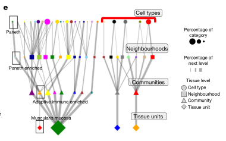
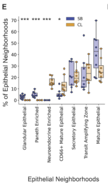
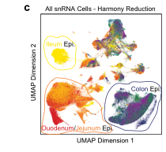
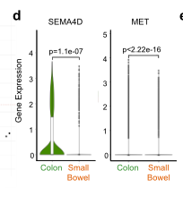

# Organization of the human intestine at single-cell resolution

## Abstract

### 讲解：

这段文本详细描述了研究团队如何研究肠道的复杂性及其功能差异。以下是具体的讲解：

1. **肠道的功能和重要性**：
-肠道是一个复杂的器官，促进消化，提取营养，参与免疫监视，维持与微生物群的关键共生关系，并影响整体健康。
-肠道长度超过九米，其结构和功能沿途存在差异。

2.**研究目的**：
-为了更好地理解这些功能差异，研究人员评估了单细胞的组织情况，使用多重成像和单核RNA以及开放染色质检测，涵盖了来自九位供体的八个不同肠道部位。

3.**研究发现**：
-通过系统分析，研究人员发现肠道不同区域的细胞组成有显著差异，展示了上皮亚型的复杂性。
-相同的细胞类型在肠道中被组织成不同的邻域和社区，突显了肠道中存在的独特免疫生态位。
-研究还绘制了这些细胞中的基因调控差异，这些差异暗示了一个调控分化级联反应。
-将肠道疾病的遗传力与特定细胞类型关联起来。

4.**研究的重要性**：
- 这些结果描述了肠道器官的细胞组成、调控和组织的复杂性，并作为理解人类生物学和疾病的重要参考图谱。

*****

### 比喻讲解：

可以将这项研究比作探索一个广袤而复杂的城市，了解不同街区的居民、功能和相互关系。具体比喻如下：

1. **肠道的功能和重要性**：
- 肠道就像一个大型城市，这个城市不仅有繁忙的商业区（促进消化，提取营养），还有警察和安全系统（参与免疫监视），维持与外来移民（微生物群）的和谐共生，并影响整个城市的整体健康。

1. **研究目的**：
- 为了更好地理解这个城市的不同街区（肠道的不同部分），研究人员就像城市规划者，使用多种高科技工具（多重成像和单核RNA及开放染色质检测）对九位居民（供体）的八个不同街区进行了详细调查。

2. **研究发现**：
- 通过这次调查，研究人员发现不同街区的居民组成（细胞组成）有显著差异。比如，商业区的居民类型和住宅区的居民类型完全不同，展示了这些街区的独特性。
- 即使是相同类型的居民（细胞类型），在不同街区也有不同的组织和社区结构，形成了独特的邻里关系和功能区（免疫生态位）。
- 研究人员还绘制了这些居民的行为和调控模式（基因调控差异），就像描述了不同街区的管理规则和发展趋势（调控分化级联反应）。
- 他们还将城市中某些问题（疾病）与特定的街区和居民类型（细胞类型）进行了关联。

3. **研究的重要性**：
- 这些结果为我们描绘了一幅详细的城市地图，展示了这个城市的复杂居民结构、管理规则和组织方式。这些信息对理解城市（人体）如何运行以及如何应对城市问题（疾病）提供了重要的参考。

*****

### 问题：

研究人员通过什么方法研究肠道不同部位的细胞组成和功能差异？他们发现了哪些主要结果？

### 答案和讲解：

**研究方法**：
研究人员使用多重成像和单核RNA及开放染色质检测技术，对来自九位供体的八个不同肠道部位的单细胞进行了组织评估。这些技术帮助他们系统地分析了细胞组成、基因调控和细胞在不同部位的组织结构。

**主要结果**：
1. **细胞组成差异**：
- 研究发现肠道不同区域的细胞组成有显著差异，展示了上皮亚型的复杂性。

2. **细胞组织结构**：
- 相同的细胞类型在肠道中被组织成不同的邻域和社区，形成了独特的免疫生态位。

3. **基因调控差异**：
- 研究绘制了细胞中的基因调控差异，暗示了一个调控分化级联反应。

4. **疾病遗传力关联**：
- 将肠道疾病的遗传力与特定细胞类型进行了关联。

**研究的重要性**：
这些结果为理解肠道的复杂细胞组成、调控和组织提供了详细的参考图谱，有助于理解人类生物学和疾病。

### 比喻讲解：

可以将这项研究比作探索一个广袤而复杂的城市，了解不同街区的居民、功能和相互关系。

**研究方法**：
- 研究人员就像城市规划者，使用多种高科技工具（多重成像和单核RNA及开放染色质检测）对九位居民（供体）的八个不同街区进行了详细调查。

**主要结果**：
1. **居民组成差异**：
- 发现不同街区的居民组成有显著差异，比如商业区和住宅区的居民类型不同，展示了这些街区的独特性。

2. **居民组织结构**：
- 相同类型的居民在不同街区有不同的组织和社区结构，形成了独特的邻里关系和功能区（免疫生态位）。

3. **行为和管理规则**：
- 描述了不同街区的管理规则和发展趋势（基因调控差异），就像城市的管理和发展策略。

4. **城市问题关联**：
- 将城市中某些问题（疾病）与特定的街区和居民类型（细胞类型）进行了关联。

通过这个比喻，可以更好地理解研究方法和发现的意义，就像详细描绘了一个城市的地图，展示了复杂的居民结构、管理规则和组织方式。

*****

### 讲解：

这段文本详细介绍了人类肠道系统的复杂性及其研究方法和发现。以下是具体的讲解：

1. **肠道系统的基本结构和功能**：
- 成人肠道系统包括大约7米的小肠和2米的大肠。
- 小肠负责吸收水分和小分子营养（如糖、单价离子和氨基酸），而大肠则积累纤维等大分子，并作为厌氧发酵室，分解和吸收副产物，以及通过肠道微生物合成和吸收其他营养（如维生素）。

2. **肠道的异质性**：
- 小肠分为十二指肠、空肠和回肠三个形态各异的区域。
- 大肠则可以分为升结肠、横结肠、降结肠和乙状结肠。
- 每个解剖区域包含大量表型和形态各异的细胞类型，包括上皮细胞、基质细胞和免疫细胞。免疫细胞尤为重要，因为它们与肠道中的微生物和外来物质相互作用。

3. **特定细胞类型的分布**：
- 虽然这些广义的细胞类型在整个肠道系统中都是常见的，但特定细胞类型表现出位置偏好。例如，潘氏细胞主要分布在小肠，而肠内分泌L细胞主要在回肠和大肠中发现。

4. **细胞的空间组织**：
- 这些细胞类型在肠道不同区域中被组织成不同的“邻域”，这些邻域的组成和分子表型在不同解剖区域中以相对未知的方式变化。这些功能邻域的组成和细胞状态的分子身份的差异定义了人类肠道的组成和功能。

5. **研究方法和发现**：
- 研究人员使用单核RNA、开放染色质和空间蛋白质组学成像技术对肠道的多个部分进行了单细胞分辨率的映射。
- 以前的研究使用单细胞RNA测序（scRNA-seq）绘制了肠道细胞类型的图谱，而本研究扩展了这一研究，通过索引共检测（CODEX）技术对细胞和蛋白质进行了空间映射，并使用单核转座酶可及染色质测序（snATAC-seq）技术映射了基因调控信息。
- 研究定义了不同肠道区域内不同细胞类型的相对丰度，包括上皮细胞的巨大复杂性，以及细胞在不同多细胞结构生态位中的组织。
- 研究还绘制了这些细胞中的基因调控差异，暗示了一个调控分化级联反应。

6. **研究的重要性**：
- 这些结果提供了关于这个复杂器官的细胞功能、调控和组织的重要见解，作为理解人类生物学和疾病的重要参考。

*****

### 比喻讲解：

可以将这项研究比作探索一个大型、多功能的城市，了解不同街区的居民、功能和相互关系。具体比喻如下：

1. **肠道系统的基本结构和功能**：
- 肠道系统就像一个庞大的城市，包含7公里长的小街区（小肠）和2公里长的大街区（大肠）。
- 小街区（小肠）负责处理基础任务，比如吸收水分和小分子营养（类似于供应日常生活用品），而大街区（大肠）则负责处理更复杂的任务，如积累和发酵纤维等大分子，分解和吸收副产物，并通过与城市中的微生物合作（类似于工厂和实验室）合成和吸收其他营养（如维生素）。

2. **肠道的异质性**：
- 小街区（小肠）分为三个独特的区域：商业区（十二指肠）、住宅区（空肠）和工业区（回肠），每个区域都有不同的功能和特性。
- 大街区（大肠）分为四个部分：上城区（升结肠）、中城区（横结肠）、下城区（降结肠）和郊区（乙状结肠），每个区域也都有独特的特性。

3. **特定居民类型的分布**：
- 在整个城市中，有不同的居民类型（细胞类型），如工人（上皮细胞）、维护人员（基质细胞）和保安（免疫细胞）。
- 某些居民类型有特定的居住偏好。例如，专门从事防护工作的居民（潘氏细胞）主要住在小街区，而负责内分泌功能的居民（肠内分泌L细胞）则主要住在回肠和大街区。

4. **居民的空间组织**：
- 这些居民在城市的不同区域内组织成不同的社区（邻域），这些社区的组成和功能在不同区域中有所不同，就像每个街区都有自己独特的社区和功能区。

5. **研究方法和发现**：
- 研究人员就像城市规划者，使用先进的技术（单核RNA、开放染色质和空间蛋白质组学成像技术），对城市的多个部分进行了详细的地图绘制。
- 以前的研究已经使用人口普查（单细胞RNA测序）绘制了居民类型的基本图谱，而本研究进一步扩展了这一研究，通过高级图像处理技术（CODEX）对居民和建筑物（细胞和蛋白质）进行了空间映射，并使用基因调控信息（snATAC-seq）分析了城市管理的规则。
- 研究人员定义了不同街区内不同居民类型的相对比例，包括上皮细胞的巨大多样性，以及居民在不同社区中的组织方式。

6. **研究的重要性**：
- 这些结果为我们提供了一幅详细的城市地图，展示了这个复杂城市的居民功能、管理规则和组织方式，成为理解城市运行和解决城市问题的重要参考。

*****

### 问题：

研究人员如何使用不同的技术来研究人类肠道的复杂性？这些技术揭示了哪些主要发现？

### 答案和讲解：

**研究技术**：

1. **单核RNA测序（snRNA-seq）**：
- 用于绘制单细胞分辨率的转录组图谱，识别不同细胞类型的基因表达模式。

2. **开放染色质测序（snATAC-seq）**：
- 用于分析细胞中的开放染色质区域，揭示基因调控信息，帮助理解基因表达的调控机制。

3. **空间蛋白质组学成像技术（CODEX）**：
- 用于空间定位细胞和蛋白质，绘制细胞在肠道不同区域的空间分布图。

**主要发现**：

1. **细胞组成的复杂性**：
- 在肠道不同区域内，细胞组成存在显著差异，展示了上皮细胞的巨大复杂性。

2. **细胞组织的多样性**：
- 相同类型的细胞在肠道中被组织成不同的邻域和社区，形成了独特的免疫生态位。

3. **基因调控的差异**：
- 研究绘制了基因调控差异，暗示了一个调控分化级联反应。

4. **特定细胞类型的定位偏好**：
- 某些细胞类型在特定的肠道区域有定位偏好，例如潘氏细胞主要在小肠，而肠内分泌L细胞主要在回肠和大肠中发现。

这些研究结果为理解肠道的细胞功能、调控和组织提供了重要的见解，成为理解人类生物学和疾病的重要参考。

*****

### 比喻讲解：

可以将这项研究比作探索一个大型、多功能的城市，了解不同街区的居民、功能和相互关系：

**研究技术**：

1. **单核RNA测序（snRNA-seq）**：
- 就像使用高分辨率的摄像机拍摄每个居民的活动，了解他们的日常行为和功能。

2. **开放染色质测序（snATAC-seq）**：
- 类似于分析城市的法规和管理规则，揭示城市管理的具体机制和政策。

3. **空间蛋白质组学成像技术（CODEX）**：
- 如同使用高科技地图绘制工具，详细绘制出城市中每个街区的居民分布和建筑布局。

**主要发现**：

1. **居民组成的复杂性**：
- 不同街区的居民组成存在显著差异，展示了上皮细胞的多样性。

2. **居民组织的多样性**：
- 相同类型的居民在不同街区被组织成不同的社区，形成了独特的邻里关系和功能区。

3. **法规和管理规则的差异**：
- 描述了不同街区的管理规则和发展策略，揭示了一个复杂的管理和发展过程。

4. **特定居民类型的定位偏好**：
- 某些居民类型偏好特定的街区，例如防护人员主要在小街区，而技术人员主要在工业区和大街区中。

通过这个比喻，可以更好地理解研究技术和发现的意义，就像详细描绘了一个城市的地图，展示了复杂的居民结构、管理规则和组织方式。

*****

### Fig. 1a: 结果描述和图例描述

### 结果描述：
Fig.1a显示了使用CODEX数据测量的肠道不同区域的基质细胞（stromal cells）类型的百分比。此数据是八个捐赠者的平均值。对基质细胞类型的百分比进行了标准化，以便与所有基质细胞的总数进行比较。数据显示，从小肠（SB）到结肠（CL）进行比较，内皮细胞（endothelial cells）的百分比显著减少（**P < 0.01），而平滑肌细胞（smooth muscle cells）的百分比显著增加（***P < 0.001）。

### 图例描述：
Fig.1a的图例中，基质细胞类型包括内皮细胞、平滑肌细胞、成纤维细胞、间质细胞、神经细胞和其他未分类的基质细胞类型。每种细胞类型的百分比通过标准化计算，表示为总基质细胞的百分比。通过对比小肠和结肠的数据，可以看到特定细胞类型在不同肠道区域中的变化趋势。

### 关键结论:
1. 从小肠到结肠，内皮细胞的百分比显著减少。
2. 平滑肌细胞的百分比显著增加。

### 分析目的：
通过Fig.1a的数据和图例描述，研究人员旨在揭示肠道不同区域中基质细胞类型的变化。这有助于理解肠道在结构和功能上的区域特异性差异，并提供了关于细胞组成和组织结构的详细信息。这些信息对于理解肠道的复杂性以及其在健康和疾病中的功能具有重要参考价值。

*****

### Fig. 1a 方法描述和比喻讲解

### 方法描述：
Fig.1a中使用了CODEX多重成像技术，通过这种技术可以测量和分析来自八位捐赠者的不同肠道区域的单细胞类型组成。具体步骤如下：
1. 选择八位捐赠者并采集其肠道组织样本。
2. 将样本分为小肠（SB）和结肠（CL）两个主要部分，每个部分再细分为多个区域（如十二指肠、空肠、回肠等）。
3. 使用CODEX多重成像技术对每个区域的组织样本进行成像和标记。CODEX技术允许同时使用多达54种抗体探针对组织切片中的细胞进行染色，以识别不同的蛋白质标志物。
4. 对成像数据进行处理，包括图像拼接、漂移补偿、去卷积和循环连接，生成单细胞分割数据。
5. 使用细胞类型标记和位置数据对每个区域的细胞进行分类，并计算基质细胞（如内皮细胞和平滑肌细胞）的相对百分比。
6. 对不同肠道区域的基质细胞百分比进行统计分析，并进行显著性差异测试（如两侧t检验）。

### 比喻讲解：
想象你是一名园艺师，负责管理一座大型植物园。这个植物园有两个主要区域：小花园和大花园。你需要了解这两个区域内不同植物种类的分布情况，并找到它们之间的差异。

1. 首先，你选择了八个代表性的植物园志愿者，让他们分别从小花园和大花园的不同区域采集植物样本。
2. 接着，你将这些样本带回实验室，使用一种特殊的成像技术，就像在植物上贴上不同颜色的标签，这种技术允许你同时识别多达54种不同的植物特征。
3. 通过成像技术，你获取了每个植物样本的详细图像，就像拍摄了一张清晰的全景照片。
4. 你对这些图像进行处理，就像把这些照片拼接成一幅完整的地图，并调整每张照片的位置，使它们对齐。
5. 然后，你使用这些标签来识别每种植物的类型和位置，并计算每个区域内不同植物种类的相对比例。
6. 最后，你将小花园和大花园的数据进行对比分析，发现小花园里的花卉种类（比如玫瑰和郁金香）显著减少，而大花园里的树木种类（比如橡树和松树）显著增加。

通过这种比喻，你可以清楚地理解，研究人员是如何使用高级成像技术和数据分析方法，来揭示肠道不同区域中细胞类型的分布差异，从而更好地理解肠道的复杂性。

*****

### Fig.1b

### Fig.1b 结果和图例描述

### 结果描述：
Fig.1b显示了不同肠道区域的基质细胞类型的相对百分比，包括小肠（SB）和结肠（CL）的多个子区域。每个子区域都通过条形图展示其基质细胞的组成，图中使用不同颜色表示不同的细胞类型。结果表明，不同区域的基质细胞组成存在显著差异。例如，小肠的十二指肠和空肠区域显示出较高比例的内皮细胞和平滑肌细胞，而结肠的升结肠和降结肠区域显示出不同的细胞组成。

### 图例描述：
图例中使用不同颜色和标签来区分不同的基质细胞类型。例如，红色代表内皮细胞，蓝色代表平滑肌细胞，绿色代表成纤维细胞，黄色代表免疫细胞。每个条形图中的颜色分布显示了相应区域内不同类型基质细胞的相对比例。

### 关键结论:
1. 不同肠道区域的基质细胞组成显著不同，显示出区域特异性。
2. 小肠区域内皮细胞和平滑肌细胞的比例较高，而结肠区域显示出更多的多样性。
3. 特定区域如十二指肠和升结肠在基质细胞组成上有显著差异，可能反映其功能上的不同。

### 分析目的：
本研究的目的是通过分析不同肠道区域的基质细胞组成，揭示肠道在组织水平上的异质性。了解基质细胞的分布有助于解释肠道不同部分的生理功能和潜在的病理变化，为未来的研究和临床应用提供基础数据。这种细致的细胞类型分析有助于识别潜在的疾病标志物和治疗靶点，推动个性化医学的发展。

*****

### Fig. 1b 方法描述和比喻讲解

### 方法描述：
Fig.1b使用了CODEX（Cyclic Immunofluorescence）多重成像技术，对来自八个供体的八个不同肠道区域的单细胞进行免疫细胞类型的百分比测量。具体步骤包括：

1. 通过CODEX技术对肠道组织样本进行标记和成像。
2. 使用54种抗体探针对相同的组织切片进行染色，标记特定的蛋白质目标。
3. 通过成像分析获得每个细胞的荧光信号，并进行细胞分割和类型鉴定。
4. 对获得的数据进行分析，计算每种免疫细胞类型在不同肠道区域的百分比，并将这些数据标准化为总免疫细胞的百分比。
5. 使用两侧t检验比较小肠和结肠之间的免疫细胞类型百分比的差异，显著性水平设为P < 0.05。

### 比喻讲解：
想象一下你有一块复杂的拼图，这块拼图代表着一个人的肠道。你希望了解这块拼图中每个小片段的组成，并找出它们在不同区域的差异。

1. 首先，你需要一些特别的“眼镜”来观察这块拼图，这些“眼镜”就是CODEX多重成像技术。它可以帮助你看到每个片段上的细节。
2. 接下来，你用54种不同颜色的“颜料”来给拼图上的每个小片段上色，每种颜色代表一种特定类型的免疫细胞。
3. 然后，你拍摄拼图的照片，每张照片显示不同颜色的细胞。通过这些照片，你可以把每个小片段上的细胞分辨出来，并给它们分类。
4. 你开始计算每种颜色（免疫细胞类型）在拼图不同区域（小肠和结肠）中的数量，并把这些数量转换成百分比。
5. 最后，你用一种统计方法（两侧t检验）来比较这些百分比，看看在小肠和结肠中是否存在显著差异，就像你在比较两组数据，看它们是否有明显的不同。

通过这个过程，你不仅能看到肠道中每种免疫细胞的分布，还能了解它们在不同区域中的变化。这就像把一幅复杂的拼图拆开，再通过观察和比较找到每个片段的独特之处。

*****

### fig.1c

### 结果描述：
Fig.1c展示了在不同肠道区域（小肠和结肠）中各种上皮细胞类型的百分比。数据来源于对八位供体的八个肠道区域的CODEX成像分析。上皮细胞被分类为以下几种类型：吸收细胞（Enterocytes）、分泌吸收细胞（Secretory Enterocytes）、杯状细胞（Goblet Cells）、CD66+吸收细胞（CD66+ Enterocytes）、潘氏细胞（Paneth Cells）和CD57+吸收细胞（CD57+ Enterocytes）。

### 图例描述：
1. 图1c通过条形图展示了不同肠道区域中各种上皮细胞类型的百分比。每个条形图代表一种细胞类型，颜色编码用于区分不同的肠道区域。
2. 条形图的x轴表示不同的细胞类型，y轴表示这些细胞类型在所有上皮细胞中的百分比。
3. 比较了小肠（SB）和结肠（CL）中的细胞类型百分比，使用两侧t检验评估差异，显著性水平为P < 0.05。

### 关键结论：
1. 吸收细胞（Enterocytes）的百分比从小肠到结肠显著下降。
2. 分泌吸收细胞（Secretory Enterocytes）和CD66+吸收细胞（CD66+ Enterocytes）的百分比从小肠到结肠显著增加。
3. 潘氏细胞（Paneth Cells）在结肠中几乎不存在，仅在小肠中发现。
4. CD57+吸收细胞（CD57+ Enterocytes）在十二指肠中显著丰富。

### 分析目的：
通过详细分析和比较不同肠道区域的上皮细胞类型分布，揭示小肠和结肠在细胞组成和功能上的显著差异。这样的比较有助于理解肠道在不同区域的特化功能，以及在这些区域中细胞类型如何组织成不同的“社区”以适应特定的生理和免疫功能。这些数据可以为进一步研究肠道疾病的细胞和分子基础提供参考。

*****

### Fig. 1c 的方法和比喻讲解

### 方法描述：
Fig.1c的方法涉及使用CODEX多重标记成像技术来测量和分析肠道不同区域中上皮细胞（epithelial cells）类型的百分比。数据来自八个捐赠者，并且对上皮细胞类型的百分比进行了标准化，以便与所有上皮细胞的总数进行比较。研究人员将小肠（SB）和结肠（CL）的上皮细胞类型百分比进行了比较，并使用双侧t检验（two-sided t-tests）来确定不同区域之间的显著差异。

### 比喻讲解：
想象一下，你在管理一个巨大的图书馆，这个图书馆有两个主要部分：小图书馆和大图书馆。你的任务是了解这两个部分的书籍种类和数量，并找出它们之间的差异。

1. **数据收集**：首先，你要统计每个部分的书籍种类和数量。为了做到这一点，你使用了一种特殊的设备（CODEX多重标记成像技术），它可以一次识别很多种书（细胞）并且记录它们的位置和数量。

2. **数据标准化**：由于小图书馆和大图书馆的规模不同，你需要将数据标准化。就像你需要将每种书的数量除以该图书馆中书籍的总数，以便可以比较两个图书馆中的书籍种类比例。

3. **数据分析**：接下来，你将小图书馆和大图书馆中的每种书的比例进行比较。你使用一种统计方法（双侧t检验）来确定哪些书的比例在两个图书馆之间存在显著差异。

4. **结果展示**：最后，你将结果以图表形式展示出来。例如，如果你发现小图书馆中的百科全书比例显著高于大图书馆，而大图书馆中的小说比例显著高于小图书馆，你会在图表中用星号标记这些显著差异。

通过这种方式，你不仅可以了解每个图书馆中书籍的组成，还可以发现它们之间的显著差异。这有助于你更好地管理图书馆，并为未来的图书采购和布局提供参考。同样，研究人员通过这种方法了解了肠道不同区域中上皮细胞的组成差异，这对理解肠道在健康和疾病中的功能非常重要。

*****

### fig.1d

### 结果描述：
Fig.1d显示了小肠（SB）和结肠（CL）中M1巨噬细胞的百分比与供体体重指数（BMI）之间的关系。图中展示了不同供体的M1巨噬细胞百分比，横轴表示供体的BMI，纵轴表示M1巨噬细胞的百分比。图中显示，M1巨噬细胞在小肠和结肠中的百分比随着BMI的增加而增加，且存在正相关关系，皮尔森相关系数r为0.86。

### 图例描述：
Fig.1d显示了在所有供体中小肠和结肠中M1巨噬细胞的百分比与供体BMI的关系，皮尔森相关系数r = 0.86。

### 关键结论：
M1巨噬细胞的百分比与供体的BMI呈显著正相关关系，即BMI越高，M1巨噬细胞在肠道中的百分比越高。这一发现表明，肥胖可能与肠道中M1巨噬细胞的增加有关，进一步支持了M1巨噬细胞在慢性炎症、免疫疾病和肠道愈合问题中的作用。

### 分析目的：
分析Fig.1d的目的是为了探讨M1巨噬细胞的百分比是否与供体的BMI存在相关关系，从而揭示肥胖可能对肠道免疫细胞组成和功能的潜在影响。这一分析有助于理解肥胖对肠道健康的影响，并为未来研究肥胖相关肠道疾病提供基础数据。

*****

### Fig. 1d 方法和比喻讲解

### 方法描述：
Fig.1d的方法是通过将捐赠者的体重指数（BMI）与其小肠和结肠中的M1巨噬细胞百分比进行相关分析。首先，使用CODEX数据测量M1巨噬细胞在所有捐赠者的肠道样本中的百分比。接着，将这些数据与每个捐赠者的BMI进行匹配，并计算Pearson相关系数（r），以确定M1巨噬细胞百分比与BMI之间的关系。

### 比喻讲解：
想象你正在园艺俱乐部做一个实验，想知道土壤肥力（BMI）是否会影响某种植物（M1巨噬细胞）的生长百分比。你有九块不同肥力的土地，每块地上种植了一些植物。现在，你需要找到这些植物在不同肥力土地上的生长情况，并看看肥力是否真的影响植物的生长。

1. 首先，你走遍所有土地，统计每块地上这些植物的数量，并计算出它们在总植物中的百分比。这就像我们用CODEX数据测量每个捐赠者肠道中M1巨噬细胞的百分比。

2. 接下来，你记录下每块土地的肥力值（BMI），这些值可能是从很贫瘠到非常肥沃。

3. 然后，你将每块土地的植物生长百分比与其肥力值进行匹配，就像你把每个捐赠者的M1巨噬细胞百分比与他们的BMI进行匹配一样。

4. 最后，你使用一个叫做Pearson相关系数的工具，看看这些数据是否有规律可循。这个工具会告诉你，肥力与植物生长之间的关系是正相关、负相关，还是没有关系。Pearson相关系数（r）的范围是-1到1，接近1表示高度正相关，接近-1表示高度负相关，接近0表示没有相关。

通过这个比喻，你就可以更容易地理解Fig.1d中的方法：研究人员发现肥力（BMI）越高，土地上植物（M1巨噬细胞）的百分比也越高，证明了肥力对植物生长有显著影响（r = 0.86）。

*****

### Fig.1e

### Fig. 1e 的结果和图例描述

### 结果描述：
Fig.1e的结果显示了中段空肠中M1巨噬细胞在不同BMI捐赠者中的分布情况。图中展示了8位捐赠者中M1巨噬细胞（黑色）在中段空肠组织中的分布图。组织图中还标示了基质细胞（浅灰色）和上皮细胞（灰色）。

### 图例描述：
图例中包含两张中段空肠的组织图，分别代表BMI较高和较低的个体。图中M1巨噬细胞以黑色标示，基质细胞以浅灰色标示，上皮细胞以灰色标示。标尺为250μm。

### 关键结论:
在BMI较高的个体中，中段空肠中的M1巨噬细胞密度显著高于BMI较低的个体。

### 分析目的：
分析目的是研究M1巨噬细胞在肠道不同BMI背景下的分布情况，探讨其与肥胖相关炎症状态之间的关系。通过比较不同BMI捐赠者的肠道组织图，可以直观展示M1巨噬细胞密度与BMI的相关性，从而揭示肥胖可能引发的局部炎症反应。这一分析有助于理解肥胖与肠道免疫环境变化的关联，进一步阐明肥胖相关肠道疾病的病理机制。

*****

### 方法描述：
Fig.1e的方法通过比较不同BMI（体重指数）捐赠者中小肠和结肠的M1巨噬细胞百分比来分析BMI与M1巨噬细胞的关系。具体步骤如下：
1. 使用CODEX技术获取每位捐赠者的肠道样本。
2. 将样本进行细胞类型标记和成像。
3. 识别并统计每位捐赠者的小肠和结肠中M1巨噬细胞的数量。
4. 计算M1巨噬细胞在小肠和结肠中所占的百分比。
5. 将这些百分比数据与捐赠者的BMI进行关联分析。
6. 使用Pearson相关系数计算BMI与M1巨噬细胞百分比之间的相关性。

### 比喻讲解：
想象一下，你有一个花园，其中种植了不同类型的植物。现在，你想了解花园里一种特定类型的植物（例如，玫瑰）的数量是否与花园的肥沃程度（比如，土壤的肥力）有关。以下是你如何进行这个分析的步骤：

1. 首先，你在花园的不同区域（例如，东区和西区）采集了样本，就像研究人员从不同BMI捐赠者的小肠和结肠采集样本一样。
2. 然后，你给每个样本中的植物做上标签，标记出哪些是玫瑰，这就相当于研究人员使用CODEX技术标记细胞类型。
3. 接下来，你数出每个样本中玫瑰的数量，并计算出它们占总植物数量的百分比，就像研究人员统计M1巨噬细胞并计算百分比一样。
4. 之后，你记录下每个样本所在区域的土壤肥力（用肥力指数表示），相当于记录捐赠者的BMI。
5. 现在，你有了每个区域的玫瑰百分比和土壤肥力指数的数据，你开始比较这些数据，看看它们之间是否有某种关系。
6. 最后，你使用一种统计方法（例如Pearson相关系数）来计算玫瑰百分比与土壤肥力指数之间的相关性，从而得出结论。这类似于研究人员分析BMI与M1巨噬细胞百分比之间的关系。

通过这种比喻，我们可以更容易地理解研究人员是如何通过分析数据，找出不同BMI与M1巨噬细胞之间的关系的。

### Fig.1f

### Fig. 1f 的结果和图例描述

### 结果描述：
图1f显示了不同捐赠者的内皮细胞和CD8+ T细胞的百分比与捐赠者是否有高血压历史之间的关系。具体结果如下：
- 在有高血压历史的捐赠者中，内皮细胞的百分比从25%下降到20%。
- 在有高血压历史的捐赠者中，CD8+ T细胞的百分比从42%下降到25%。

### 图例描述：
- 图1f展示了捐赠者中有无高血压历史与两种细胞类型（内皮细胞和CD8+ T细胞）百分比之间的比较。
- 该图包含两个箱线图，分别展示内皮细胞和CD8+ T细胞的百分比。
- 统计分析使用双侧t检验得出显著性差异：
- 内皮细胞的显著性水平为*P=0.038。
- CD8+ T细胞的显著性水平为***P=0.00013。

### 关键结论：
高血压历史与捐赠者肠道内皮细胞和CD8+ T细胞的百分比显著相关。有高血压历史的捐赠者中，这两种细胞类型的百分比显著降低。

### 分析目的：
分析目的是确定高血压历史对肠道特定细胞类型（内皮细胞和CD8+ T细胞）组成的影响，从而揭示高血压可能对肠道免疫系统和血管系统的潜在影响。这些发现有助于理解高血压与肠道健康之间的联系，并为未来的相关疾病研究提供参考。

*****

### Fig. 1f 方法及比喻讲解

### 方法描述：
Fig.1f的分析方法包括以下几个步骤：

1. **数据收集与分类**：研究人员从捐赠者那里收集了小肠和结肠的组织样本，并测量了各种细胞类型的百分比，包括内皮细胞和CD8+ T细胞。
2. **分组与对比**：根据捐赠者是否有高血压病史，将他们分为两组：有高血压病史的和没有高血压病史的。
3. **统计分析**：对两组的内皮细胞和CD8+ T细胞百分比进行了统计比较，采用双侧t检验（two-sided t-tests）来确定这些细胞类型的百分比在两组之间是否存在显著差异。

### 比喻讲解：
1. **数据收集与分类**：就像你在一个大花园中收集不同种类的花卉，然后根据花卉的种类和颜色进行分类。例如，你采集了红色玫瑰、黄色郁金香、和白色百合。
2. **分组与对比**：接下来，你根据花园的位置将花卉分成两组：一个组是靠近水源的花园，另一个组是远离水源的花园。你想要看看这两个花园里的同种类花卉在数量上的差别，比如红色玫瑰的数量和黄色郁金香的数量。
3. **统计分析**：最后，你使用一种叫做双侧t检验的方法来比较这两个花园中每种花卉的数量，确定靠近水源的花园和远离水源的花园里的花卉数量是否有显著的差异。这就像是在两个花园里数每种花的数量，然后计算它们的差异，看看这个差异是否足够大，能被认为是有统计学意义的。

*****

### fig.1g

### 结果描述：
Fig.1g显示了小肠和结肠内各种细胞类型的相同细胞密度的量化结果。该量化通过测量同类细胞之间的平均距离并除以组织内最大可能的同类细胞距离来计算。该图展示了在不同组织区域中每种细胞类型的密度比较。

### 图例描述：
- 图中展示了从64个组织切片中获得的结果。
- y轴表示相同细胞密度的测量值，数值越低表示同类细胞越密集。
- x轴表示不同的细胞类型，包括平滑肌细胞、内皮细胞、CD8+ T细胞、M1巨噬细胞等。
- 每个条形代表小肠和结肠中某种细胞类型的密度。
- 结果以箱线图形式表示，其中盒子代表25%到75%的数据范围，中间的线代表中位数，胡须表示最小值和最大值，离群值显示为离群点。

### 关键结论：
- 小肠和结肠中平滑肌细胞的密度差异显著，小肠中平滑肌细胞的密度较低，而在结肠中密度较高。
- 内皮细胞在小肠中的密度较高，而在结肠中密度较低。
- CD8+ T细胞在小肠中的密度较高，而在结肠中密度较低。
- M1巨噬细胞在小肠和结肠中的密度差异不大。

### 分析目的：
该图的目的是展示不同细胞类型在小肠和结肠中分布密度的差异，通过定量比较同类细胞的密度，揭示小肠和结肠在细胞组织结构上的差异，帮助理解这些结构差异如何影响各自的功能和免疫环境。这些信息对于深入了解肠道的生物学特性及其与健康和疾病的关系具有重要参考价值。

*****

### 方法描述：
Fig.1g展示了相同细胞密度的量化方法。相同细胞密度是通过测量每个细胞到其五个最近的相同类型细胞的平均距离来计算的。这一距离然后除以该组织内相同类型细胞的最大可能距离，从而得出一个归一化的值。此方法用于所有组织区域的64个组织切片。

### 比喻讲解：
想象一下你在一个巨大的操场上参加一个团队游戏。每个人代表一个特定类型的细胞，穿着不同颜色的衣服。为了了解同类型细胞（穿同样颜色衣服的人）在操场上的分布密度，你需要进行以下操作：

1. **找到最近的朋友：** 每个人都要找到穿相同颜色衣服的五个最近的朋友，并测量他们之间的距离。
2. **计算平均距离：** 将这五个距离加起来，然后取平均值，得到每个人到最近五个相同类型朋友的平均距离。
3. **归一化处理：** 你需要知道，如果操场上所有人都尽可能分散，彼此之间的距离会有多大。将刚才计算的平均距离除以这个最大可能的距离，就可以得到一个归一化的值，表示在操场上同类型人群的相对密度。

通过这种方式，你可以评估穿同样颜色衣服的人在操场上是密集分布还是稀疏分布。这就类似于研究人员在Fig.1g中计算相同细胞密度的方法。他们通过这种量化方法，能够直观地了解同类型细胞在不同肠道区域的分布情况。

*****

### fig.1h

### 结果描述：
Fig.1h展示了不同肠道主要组织区域中巨噬细胞子集的百分比。在图中，巨噬细胞被分为M1和M2亚型，并且数据显示这些亚型在不同肠道区域（小肠和结肠）中的分布情况。图中使用了柱状图，显示了M1和M2巨噬细胞在各个肠道区域（包括黏膜、黏膜肌层、粘膜下层和肌层外层）中的比例。

### 图例描述：
- 图例使用柱状图表示M1和M2巨噬细胞的分布。
- 每个柱状图显示了M1或M2巨噬细胞在特定肠道区域（如黏膜、黏膜肌层、粘膜下层和肌层外层）的百分比。
- 图例中使用不同颜色区分M1和M2巨噬细胞的比例。

### 关键结论:
- 在肠道不同区域中，M1和M2巨噬细胞的分布存在显著差异。
- M1巨噬细胞主要集中在黏膜区域，而M2巨噬细胞则在各个区域中均有分布。
- 这种分布差异提示了巨噬细胞在肠道免疫功能中的不同作用和调控机制。

### 分析目的：
通过分析巨噬细胞子集在肠道不同组织区域中的分布，研究人员旨在揭示巨噬细胞在肠道免疫环境中的角色及其可能的功能特异性。这种分析有助于理解不同巨噬细胞亚型在肠道健康和疾病中的重要性，并为未来的免疫学研究和治疗策略提供基础数据。

*****

### Fig. 1h 方法和比喻讲解

### 方法描述：
Fig.1h使用CODEX数据对肠道不同区域中巨噬细胞亚群的百分比进行了量化。研究人员将巨噬细胞分为M1和M2两种类型，并在小肠和结肠的不同区域中计算了它们的相对百分比。通过分析这些数据，研究人员能够揭示巨噬细胞在肠道不同部位的分布情况和密度变化。

### 比喻讲解：
想象你在一个大型游乐园里，游乐园分为不同的区域，如儿童区、冒险区和休闲区。每个区域都有不同的游乐设施，比如滑梯、过山车和旋转木马。现在，我们想知道每个区域里各种游乐设施的分布情况。

1. **确定游乐设施的类型**：首先，我们需要定义游乐园里不同类型的设施，比如滑梯、过山车和旋转木马。就像在肠道里，我们确定了两种巨噬细胞类型：M1和M2。

2. **收集数据**：接下来，我们在游乐园的每个区域数一数每种类型的游乐设施有多少。我们走遍儿童区、冒险区和休闲区，详细记录每个区域中滑梯、过山车和旋转木马的数量。类似地，研究人员通过CODEX数据，遍历肠道的不同区域，数一数每个区域里有多少M1和M2巨噬细胞。

3. **计算百分比**：在统计完每个区域的游乐设施数量后，我们计算每种游乐设施在该区域的总数中所占的百分比。例如，如果儿童区有10个游乐设施，其中6个是滑梯，那么滑梯在儿童区的百分比就是60%。同样，研究人员计算每种巨噬细胞在肠道不同区域的总巨噬细胞中所占的百分比。

4. **分析分布情况**：最后，我们对各个区域的数据进行对比，找出不同区域里各种游乐设施的分布特点。例如，我们可能发现儿童区滑梯最多，而冒险区过山车最多。通过这种方法，研究人员分析了巨噬细胞在肠道不同区域的分布特点，找出哪些区域M1细胞多，哪些区域M2细胞多。

通过这种比喻，我们能够更好地理解研究人员如何利用数据来分析巨噬细胞在肠道不同区域中的分布情况，以及这些细胞类型在不同区域中所占的比例。

*****

###Figure 1(a-h)中的重要结论

### 重要结论总结

#### Fig. 1a
**结论**：在肠道的不同区域中，基质细胞的组成有显著差异。从小肠到结肠，内皮细胞的比例减少，平滑肌细胞的比例增加。

#### Fig. 1b
**结论**：免疫细胞的组成也随肠道区域变化而变化。从小肠到结肠，CD8+ T细胞的比例减少，而树突状细胞的比例增加。

#### Fig. 1c
**结论**：在上皮细胞中，小肠和结肠的细胞类型分布有所不同。小肠中吸收细胞比例较高，而在结肠中，分泌细胞（如杯状细胞）和CD66+吸收细胞的比例较高，同时小肠中有丰富的帕涅斯细胞，而结肠中几乎没有。

#### Fig. 1d
**结论**：M1巨噬细胞的水平与体重指数（BMI）呈正相关，BMI越高，M1巨噬细胞的比例越高。这些细胞主要集中在粘膜区域。

#### Fig. 1e
**结论**：体重指数较高的个体（BMI > 25）有更多的M1巨噬细胞，这些细胞与慢性炎症和肥胖相关的胃肠道疾病有关。

#### Fig. 1f
**结论**：有高血压病史的供体中，内皮细胞和CD8+ T细胞的比例显著减少。

#### Fig. 1g
**结论**：通过细胞密度分析，发现不同类型的免疫细胞在肠道中的分布也具有区域性。浆细胞主要集中在粘膜区域，而M2巨噬细胞则分布在整个肠道中。

#### Fig. 1h
**结论**：M1和M2巨噬细胞在肠道的不同区域中有不同的分布。小肠中M1巨噬细胞较少，而结肠中M2巨噬细胞分布更广泛。

### 综合结论
1. **细胞类型组成的区域性差异**：肠道不同区域的细胞组成差异显著，包括基质细胞、免疫细胞和上皮细胞。
2. **疾病和体重的相关性**：特定细胞类型（如M1巨噬细胞）与体重指数和高血压等代谢状态密切相关。
3. **细胞密度和功能的空间分布**：不同类型的免疫细胞和上皮细胞在肠道的分布具有显著的空间特征，这些分布可能反映其功能和相互作用模式。

这些结论帮助我们更好地理解肠道在单细胞水平上的复杂性及其与健康和疾病的关系。

*****

### fig.2a

### 结果描述：
Fig. 2a展示了单细胞RNA测序分析结果，显示了来自小肠和结肠不同区域的细胞群体的分布和组成。通过t-SNE（t-distributed Stochastic Neighbor Embedding）降维方法，将细胞群体分为不同的簇，每个簇代表一种特定类型的细胞。结果显示，各个簇的细胞在小肠和结肠之间存在显著的差异。

### 图例描述：
图例显示了不同类型细胞在t-SNE图中的分布情况。每种细胞类型用不同颜色表示，包括上皮细胞、内皮细胞、平滑肌细胞、免疫细胞（如T细胞、B细胞、巨噬细胞等）和其他基质细胞。每种颜色代表一种细胞类型，便于区分和识别。

### 关键结论:
1. 小肠和结肠的细胞组成存在显著差异，不同细胞类型在不同区域的分布有明显的特征。
2. t-SNE图中的细胞簇显示了各类细胞的多样性和特定的分布模式，这有助于理解不同肠道区域的功能和特性。
3. 不同的细胞类型在小肠和结肠中的丰度和分布模式可能与这些区域的特定生理功能和疾病状态相关。

### 分析目的：
1. **揭示肠道不同区域的细胞组成和分布**：通过单细胞RNA测序和t-SNE降维方法，展示小肠和结肠中各类细胞的详细分布情况，帮助理解不同肠道区域的细胞组成。
2. **理解细胞异质性和功能差异**：通过分析细胞类型的分布和组成，揭示细胞在不同肠道区域的功能和作用，为研究肠道的生理和病理状态提供基础。
3. **为疾病研究提供数据支持**：了解健康状态下肠道细胞的分布和组成，可以为研究肠道疾病（如炎症性肠病、肠道感染等）提供参考，帮助识别疾病相关的细胞类型和分子机制。

*****

### Fig. 2a 的方法和比喻讲解

### 方法描述：
Fig.2a的方法是通过多细胞邻域分析来定义肠道中的独特多细胞结构。具体步骤如下：
1. 从组织样本中提取细胞类型地图。
2. 使用滑动窗口技术，将每个细胞作为中心，计算窗口内不同细胞类型的数量。
3. 将这些数量向量化（即将每个细胞周围的细胞类型组成一个向量）。
4. 对这些向量进行聚类分析，以识别不同的多细胞邻域。
5. 根据不同细胞类型的丰富度，将聚类结果映射回组织图中，识别并可视化这些多细胞邻域。

### 比喻讲解：
可以把整个过程比喻成一个大城市的社区调查。

1. **提取细胞类型地图：** 
就像从卫星图像上看到整个城市一样，我们首先获得了肠道组织中所有细胞的类型和位置地图。

2. **使用滑动窗口技术：** 
想象一下，我们有一个透视放大镜，可以在城市中移动。每次放大镜的窗口都覆盖了一部分城市区域。每次我们将放大镜移动到一个新的位置（即一个细胞位置），我们都会记录在这个窗口内看到的各种建筑（即细胞类型）的数量。

3. **将这些数量向量化：**
现在，我们对每个窗口内看到的建筑类型进行统计，把这些数据写成一个清单。例如，在某个位置，我们看到有10座住宅、5个超市、2个学校和3个医院，这就形成了一个向量（10, 5, 2, 3）。

4. **对这些向量进行聚类分析：**
接下来，我们将所有这些清单收集起来，并进行分析，看哪些清单相似。就像是把所有社区进行分类，看看哪些社区有相似的建筑组合。通过这种方式，我们可以识别出哪些区域是住宅区、商业区、学校区等。

5. **映射回组织图：**
最后，我们将这些分析结果映射回城市地图上，标记出不同类型的社区。比如说，把住宅区标记成红色，商业区标记成蓝色等。通过这种方式，我们可以直观地看到整个城市中不同类型社区的分布情况。

这个比喻帮助我们理解，Fig.2a的方法是如何通过统计和聚类分析来揭示肠道中复杂的多细胞结构，从而更好地理解其功能和组织。

*****

### fig.2b

### Fig. 2b 结果和图例描述

#### 结果描述：
Fig. 2b 显示了八位捐赠者的小肠和大肠中八个不同区域（十二指肠、近端空肠、中部空肠、回肠、升结肠、横结肠、降结肠和乙状结肠）的细胞组成。图中使用条形图表示每个区域中不同类型的细胞的百分比。各细胞类型用不同颜色表示，包括上皮细胞、免疫细胞、间质细胞等。小肠和大肠的细胞组成显示出显著差异。

#### 图例描述：
图例中，各种颜色代表不同类型的细胞：
- 蓝色：上皮细胞
- 绿色：免疫细胞
- 红色：间质细胞
- 其他颜色：其他细胞类型

每个区域的条形图中，每种颜色的条形高度表示该类型细胞在该区域中所占的百分比。

#### 关键结论:
- 小肠中上皮细胞的比例较高，而大肠中免疫细胞和间质细胞的比例较高。
- 小肠和大肠的细胞组成显示出显著差异，反映出两个肠道区域在细胞类型分布上的不同特点。
- 不同肠道区域中细胞类型的分布差异可能与各区域的功能和微环境相关。

#### 分析目的：
- 通过比较小肠和大肠中不同区域的细胞组成，研究不同肠道区域在细胞类型分布上的差异。
- 了解肠道不同部分的细胞组成，以揭示这些区域在功能和疾病中的潜在作用。
- 提供基线数据，用于进一步研究肠道疾病（如炎症性肠病和肠癌）在不同区域中的病理变化。

*****

### Fig. 2b 方法和比喻讲解

### 结果描述：
Fig.2b展示了通过多细胞邻域分析得到的肠道组织结构的可视化结果。图中显示了不同的多细胞邻域（由不同颜色表示），这些邻域在组织切片中的空间分布情况。每个邻域代表了一组在空间上紧密相邻并具有特定细胞类型组成的细胞群体。

### 图例描述：
图例描述了组织切片上不同颜色代表的多细胞邻域。这些邻域是在多细胞邻域分析中通过计算每个细胞周围的细胞类型组合并进行聚类后得到的。每个颜色块代表一个独特的多细胞邻域，展示了这些邻域在肠道组织中的分布。

### 关键结论:
不同的多细胞邻域在肠道的不同区域表现出特定的分布模式，这些模式反映了肠道组织在空间结构上的复杂性和细胞组成的多样性。这种方法可以揭示出肠道中存在的功能性细胞群体及其空间组织关系。

### 分析目的：
通过对肠道组织进行多细胞邻域分析，目的是为了揭示肠道中不同区域的细胞组成和空间组织模式。这有助于理解肠道的功能性分区及其在健康和疾病状态下的变化，为进一步研究肠道生物学和相关疾病提供重要的参考地图。

*****

### fig.2c

### 结果描述：
Fig.2c展示了神经内分泌富集邻域在整个肠道中所有邻域中的比例。该图显示了在八个供体中，不同肠道区域中神经内分泌富集邻域的分布情况。每个供体的八个肠道区域分别是十二指肠、近端空肠、中部空肠、回肠（小肠部分），以及升结肠、横结肠、降结肠和乙状结肠（大肠部分）。

### 图例描述：
图例中展示了在不同肠道区域中神经内分泌富集邻域的比例，这些区域包括小肠（十二指肠、近端空肠、中部空肠、回肠）和大肠（升结肠、横结肠、降结肠、乙状结肠）。图例中的盒线图显示了每个肠道区域中神经内分泌富集邻域的中位数、四分位范围以及最小和最大值。

### 关键结论:
神经内分泌富集邻域在大肠中的比例显著高于小肠中的比例，表明神经内分泌细胞在大肠中特别富集。这一发现强调了大肠和小肠在细胞组成和功能上的差异。

### 分析目的：
通过分析神经内分泌富集邻域在不同肠道区域的分布，目的是为了揭示神经内分泌细胞在肠道不同部分的空间分布特征。这有助于理解这些细胞在肠道不同区域中的功能角色，并为研究肠道生理学及相关疾病提供参考。

*****

### Fig. 2c 方法描述和比喻讲解

### 方法描述：
Fig.2c的制作过程涉及对肠道各部分的细胞组织进行多细胞邻域（multicellular neighbourhood）分析。具体方法如下：
1. **邻域分析**：通过在组织中以每个细胞为中心取窗口，计算每个窗口内的细胞类型数量。
2. **聚类分析**：将这些窗口向量进行聚类，以确定不同的多细胞邻域类型。
3. **定义结构**：根据聚类结果，将每个多细胞邻域分类，并将它们映射回组织中，生成多细胞邻域的空间分布图。
4. **定量分析**：统计每个多细胞邻域在不同肠道区域中的百分比。

在Fig.2c中，重点展示了Neuroendocrine-Enriched邻域在八个捐赠者中的分布情况，并通过盒状图显示其在小肠和结肠中所占比例的差异。

### 比喻讲解：
可以将Fig.2c的制作过程比喻为一个园丁在不同的花园中识别并分类花卉组合的过程：

1. **邻域分析（花园划分）**：想象园丁在每个花园中选择了多个固定大小的花坛（窗口），每个花坛里种满了各种花卉。园丁在每个花坛中数一数有多少种类的花（细胞类型）。

2. **聚类分析（花卉分类）**：接下来，园丁将每个花坛中的花卉数量记录下来，并对这些记录进行分析。他发现不同的花坛可以根据花卉组合的不同，分为不同的类型（聚类）。比如，有的花坛主要种着玫瑰和郁金香，有的花坛主要种着向日葵和雏菊。

3. **定义结构（绘制花园地图）**：然后，园丁根据花坛的分类结果，在花园的地图上标记出每种类型的花坛的位置，生成一张详细的花园花卉分布图。

4. **定量分析（统计花卉比例）**：最后，园丁统计不同类型的花坛在不同花园中的比例。比如，在一些花园里，玫瑰和郁金香的组合花坛比较多，而在另一些花园里，向日葵和雏菊的组合花坛更多。

在Fig.2c中，这个过程展示了Neuroendocrine-Enriched这种特定组合的“花坛”在不同花园（小肠和结肠）中的分布情况，并通过盒状图来显示它们在不同区域中所占比例的差异。

*****

### fig.2d

### Fig. 2d 结果描述和图例描述

### 结果描述：
Fig.2d展示了神经内分泌细胞在小肠和结肠中的同种细胞密度。具体数据是通过测量神经内分泌细胞在每个组织切片中与同种细胞的平均距离，并将其与同种细胞在该组织中的最大可能距离进行比较来得出的。结果显示，小肠中的神经内分泌细胞密度明显低于结肠中的神经内分泌细胞密度。

### 图例描述：
该图为箱线图，显示了在小肠和结肠中的神经内分泌细胞的同种细胞密度。X轴表示小肠（small bowel）和结肠（colon），Y轴表示同种细胞密度。箱线图的中间线表示中位数，上下四分位数分别表示盒子的顶部和底部，须线表示数据的最大和最小值，数据点表示异常值。

### 关键结论：
神经内分泌细胞在结肠中的同种细胞密度显著高于在小肠中的密度。

### 分析目的：
通过比较神经内分泌细胞在小肠和结肠中的密度差异，研究其在不同肠道区域的分布特征。这有助于理解这些细胞在不同肠道区域中可能具有的不同功能和角色。

*****

### 方法描述：
Fig.2d的方法用于量化特定细胞类型的局部密度，以确定这些细胞是否在大范围内执行广泛功能，或在特定区域内进行专业化功能。具体来说，该方法通过计算相同细胞类型在组织中五个最近邻居的平均距离，来衡量这些细胞的局部密度。这一距离被标准化为在组织中同类型细胞之间的最大可能距离。最终得出的数值越接近1，表示细胞越分散；越接近0，表示细胞越集中。

### 比喻讲解：
想象你是一位公园管理人员，负责管理一个大型公园。这个公园里有不同的区域，每个区域里都有一些相同类型的树木，你需要确定这些树木是分布得非常均匀，还是集中在某些特定区域。

首先，你决定选择每种树木类型中的某一棵作为代表。然后，你开始测量这棵树与同类其他树木的距离。具体来说，你选择离这棵树最近的五棵同类树，并测量这些树之间的距离。

接下来，你计算这些距离的平均值，这就像是在看这些树在公园里的分布情况。为了让这些数值更有意义，你把这个平均距离除以所有树木之间最大可能的距离，这样就得到了一个标准化的数值。

如果这个数值接近1，说明这些树在公园里分布得非常均匀，像是星星一样在天空中散布得非常开。如果这个数值接近0，说明这些树集中在某个特定的区域，就像是一堆石头堆在一起一样。

通过这种方法，你可以清楚地了解公园中每种树木的分布模式。这不仅有助于你更好地管理公园，还能帮助你理解为什么某些区域的树木长得特别茂盛，而其他区域则相对稀疏。这正是研究人员在Fig.2d中所做的，他们通过类似的方法来分析肠道中不同细胞类型的分布，以了解这些细胞在肠道中的功能和组织结构。

*****

### fig.2e

### Fig. 2e 的结果和图例描述

### 结果描述：
在Fig.2e中，研究人员量化了肠道不同区域中特定细胞类型（如神经内分泌细胞）的局部密度。具体来说，他们计算了神经内分泌细胞在小肠和结肠中与相同细胞类型邻近的平均距离，然后将这些距离标准化为该组织中相同细胞类型之间的最大可能距离。结果表明，小肠和结肠中的神经内分泌细胞密度存在显著差异。

### 图例描述：
图例显示了小肠和结肠中神经内分泌细胞的局部密度。图中包含了每个肠道区域的箱线图，显示了局部密度的中位数、四分位数范围和极值。颜色标注说明了小肠和结肠的区别。

### 关键结论:
1. 神经内分泌细胞在小肠中的局部密度显著高于在结肠中的密度。
2. 这种密度差异表明神经内分泌细胞在肠道不同部分中可能具有不同的功能和组织结构。

### 分析目的：
通过量化和比较神经内分泌细胞在小肠和结肠中的局部密度，研究人员旨在揭示这些细胞在肠道不同区域中的分布模式和潜在功能差异。这一分析有助于理解肠道中神经内分泌细胞的生物学角色及其在维持肠道健康和功能中的重要性。

*****

### 方法描述：
Fig.2e的方法是通过计算不同肠道区域内相同类型细胞的局部密度来分析细胞的空间分布。具体步骤如下：
1. **计算相同类型细胞的密度**：对于每个特定类型的细胞，计算其五个最近邻居的平均距离，然后将该距离与该区域内同类细胞的最大可能距离进行标准化。
2. **数据采样和标准化**：对每个肠道区域的多个组织切片进行采样，并对这些数据进行标准化，以便在不同区域之间进行比较。
3. **数据分析**：将标准化后的细胞密度数据进行统计分析，以确定特定类型细胞在不同肠道区域中的密度变化。

### 比喻讲解：
想象你正在一个大型游乐园里，你的任务是了解不同区域的游客分布情况。你首先需要选择一种游客，比如小孩子，然后按照以下步骤进行：

1. **计算相同类型游客的密度**：你站在某个小孩子旁边，观察他周围最靠近的五个小孩子，测量他们之间的平均距离。假设这个平均距离是5米。然后，你考虑整个游乐园里小孩子之间的最大可能距离，比如这个游乐园的最大宽度是200米。你将这5米的距离除以200米，得到一个标准化的密度值。

2. **数据采样和标准化**：你需要在游乐园的不同区域（比如入口处、摩天轮附近、小吃摊旁边等）重复这个过程，对每个区域的多个样本进行测量。这样可以确保你的数据代表整个区域的实际情况。

3. **数据分析**：你将所有区域的标准化密度数据汇总，进行统计分析，比较不同区域的小孩子密度变化。比如，你发现小吃摊附近的小孩子密度更高，而摩天轮附近的小孩子密度较低。

通过这个过程，你可以清晰地了解小孩子在游乐园不同区域的分布情况，类似于Fig.2e的方法描述和实现过程。

*****

### fig.2f

### 结果描述：
图2f显示了多细胞邻域在代表性横结肠切片中的空间分布。图中以不同颜色标识了不同的多细胞邻域，并展示了这些邻域在组织中的具体位置和分布情况。

### 图例描述：
图2f展示了多细胞邻域在结肠组织中的空间映射，左侧的比例尺为250微米。图中不同颜色表示不同类型的细胞邻域，包括上皮细胞、免疫细胞和基质细胞等。通过图例可以看到这些细胞邻域如何组织在结肠组织的特定区域。

### 关键结论:
多细胞邻域的空间映射揭示了在结肠组织中不同类型细胞群体的具体位置和分布模式。具体显示了上皮细胞、免疫细胞和基质细胞如何在结肠组织中形成特定的结构和区域。

### 分析目的：
图2f的目的是通过展示多细胞邻域在结肠组织中的空间分布，揭示不同类型细胞如何在组织中组织和互动。这种空间映射可以帮助理解细胞在组织中的特定功能区和微环境，进而为研究肠道的功能和疾病机制提供参考。

*****

### 方法描述：
Fig.2f的方法涉及对不同肠道区域的组织切片进行CODEX荧光染色和成像。具体步骤如下：

1. **取样和制备**：从八位捐赠者处获取小肠和结肠的组织样本，每个区域的样本包括十二指肠、近端空肠、中空肠、回肠、升结肠、横结肠、降结肠和乙状结肠。将这些样本在冰冻切片后进行荧光染色。

2. **CODEX染色和成像**：使用多重荧光染色技术(CODEX)，对每个组织切片进行多重抗体染色，标记特定的细胞类型和结构。随后，进行高分辨率荧光成像，获取每个标记的空间分布和表达强度。

3. **细胞分割和识别**：利用图像处理算法对获得的荧光图像进行细胞分割，识别并分类每个细胞的类型。使用机器学习算法对这些细胞进行聚类，确定多细胞结构的组成。

4. **图像分析和展示**：将处理后的图像映射回组织切片，展示多细胞结构在组织中的位置和分布情况。

### 比喻讲解：
想象你是一位博物馆策展人，负责展示一幅复杂的壁画。这幅壁画分布在八个不同的展厅，每个展厅代表肠道的不同区域。你需要展示壁画中每个细节，并通过不同颜色的灯光突出显示。

1. **取样和制备**：就像你从每个展厅中取下壁画的部分，然后将它们切成薄片，准备进行详细展示。

2. **CODEX染色和成像**：你使用不同颜色的灯光（多重荧光染色）来照亮壁画的每个部分，每种颜色代表壁画中的特定元素或细节。你拍摄高分辨率的照片，记录每个部分的细节。

3. **细胞分割和识别**：就像你使用图像软件来分析这些照片，将壁画中的每个元素分割出来，并根据颜色和形状对它们进行分类。你还使用算法来识别这些元素的类别，比如这是一个人物，那是一棵树。

4. **图像分析和展示**：最后，你将这些处理后的图像重新拼接回原来的壁画位置，展示出每个展厅中的完整壁画。你可以清楚地看到不同颜色的元素如何在壁画中分布，以及它们之间的关系。

通过这种方法，你不仅能展示出壁画的整体美，还能深入解析每个元素的细节和相互关系，提供观众一个全面而细致的视角。

*****

### fig.2g

### 结果描述：
Fig.2g展示了小肠和结肠不同区域的细胞组成和分布特征。每个区域的细胞类型和密度通过多重荧光染色技术（CODEX）检测，并以热图的形式呈现。热图中，不同颜色代表不同的细胞密度，颜色越深表示细胞密度越高。图中展示了十二指肠、近端空肠、中空肠、回肠、升结肠、横结肠、降结肠和乙状结肠中多种细胞类型的相对分布。

### 图例描述：
图例包括以下内容：
- 各种细胞类型的标记及其对应的颜色，如免疫细胞、上皮细胞、基质细胞等。
- 颜色渐变条表示细胞密度的高低，从浅色（低密度）到深色（高密度）。
- 横轴表示不同的肠道区域，从十二指肠到乙状结肠。
- 纵轴表示不同的细胞类型。

### 关键结论:
1. **区域特异性细胞分布**：不同肠道区域存在显著的细胞类型和密度差异。小肠和结肠的各个部分在细胞组成上有明显的区域特异性。
2. **细胞类型的相对密度**：上皮细胞在整个肠道中分布广泛，但密度在小肠中更高；免疫细胞在结肠中的密度较高，尤其是在升结肠和降结肠部分。
3. **基质细胞分布**：基质细胞在所有肠道区域均有分布，但在结肠中的密度略高于小肠。

### 分析目的：
1. **理解肠道微环境的区域差异**：通过分析不同肠道区域的细胞组成和分布，揭示肠道微环境的区域特异性特征，帮助理解不同区域在功能和病理上的差异。
2. **探索细胞间相互作用**：确定不同细胞类型在不同区域的相对密度，有助于研究细胞间的相互作用如何影响肠道健康和疾病。
3. **指导临床干预**：通过详细的细胞分布图谱，为临床干预提供参考，如在特定肠道区域进行靶向治疗。

*****

### Fig. 2g: 方法描述和比喻讲解

### 方法描述：
Fig.2g的方法涉及计算和分析围绕Paneth细胞的同心增加的邻域（neighbourhoods）。首先，研究人员在单个Paneth细胞周围绘制一个同心圆，以捕捉这个圆内的所有细胞类型。这些同心圆不断扩大，每次增加一定的半径，逐步涵盖更大的细胞区域。对于每个增加的同心圆，研究人员计算其中不同细胞类型的密度和比例，并记录这些变化。这种方法帮助研究人员理解在Paneth细胞周围的微环境中，细胞类型的空间分布和组织情况。

### 比喻讲解：
想象你在一个湖中央丢了一块石头，这块石头就像是一个Paneth细胞。石头落水后会产生一圈圈的波纹，这些波纹就是同心增加的邻域。每一圈波纹代表一个不断扩大的圆，覆盖了越来越大的湖面。

你站在湖边，想要知道湖面不同地方的水草和鱼的分布情况。你从波纹的中心开始记录：第一圈波纹内的水草和鱼的数量。然后，你等波纹扩散到更大的一圈，再记录这一圈内的水草和鱼的数量。你一次次地记录，每次波纹扩散得更远，你就能看到更多的湖面，并记录下不同地方的水草和鱼的密度和比例。

通过这种方法，你就可以知道，在湖中心（即Paneth细胞周围）和湖边（即远离Paneth细胞的地方），水草和鱼的分布情况有何不同。这就像研究人员通过同心圆的方法，了解不同细胞类型在Paneth细胞周围的分布变化。这种比喻帮助我们理解了研究人员如何通过逐步扩大的范围，捕捉和分析Paneth细胞周围的细胞环境。

*****

### Fig.2h

### 结果描述：
Fig.2h的结果展示了围绕潘氏细胞的不同半径范围内的细胞类型组合。通过计算不同半径范围内的邻近细胞类型分布，研究人员发现了潘氏细胞在局部微环境中的细胞类型构成和分布情况。

### 图例描述：
图例展示了以潘氏细胞为中心，在逐渐扩大的半径范围内（从较小的局部环境到更大的环境）内的细胞类型分布。图中每一行代表一个半径范围内的细胞组合情况，颜色和符号表示不同的细胞类型。例如，绿色表示神经内分泌细胞，黄色表示CD4+ T细胞，蓝色表示CD8+ T细胞。

### 关键结论:
1. 潘氏细胞周围的微环境具有明显的细胞类型分布特征。
2. 随着半径的扩大，不同的细胞类型开始出现在潘氏细胞的周围。
3. CD4+ T细胞和CD8+ T细胞在潘氏细胞邻域内表现出高密度分布，表明这些免疫细胞在潘氏细胞的局部环境中具有重要作用。

### 分析目的：
Fig.2h的分析目的是揭示潘氏细胞在肠道微环境中的具体细胞组成和分布模式。通过这种多层级邻域分析，研究人员可以更好地理解潘氏细胞在肠道健康和疾病中的功能和作用机制。这种分析有助于揭示潘氏细胞与其周围细胞之间的相互作用，以及这些相互作用如何影响肠道的免疫反应和组织稳态。

*****

### Fig. 2h 方法描述和比喻讲解

### 方法描述：
Fig.2h的方法涉及通过计算包围特定细胞类型（如Paneth细胞）的同类型细胞的密度来分析其空间限制。这是通过以下步骤实现的：

1. **选择中心细胞**：首先选择一个特定类型的细胞（如Paneth细胞）作为中心。
2. **定义窗口**：围绕该中心细胞，定义一个包含一定数量细胞（如前五个最近的同类型细胞）的窗口。
3. **计算平均距离**：计算中心细胞到窗口内其他同类型细胞的平均距离。
4. **标准化距离**：将这个平均距离除以细胞在组织中最远可能的距离，以标准化密度测量。
5. **结果展示**：结果以百分比形式表示，数值越小表示细胞聚集越紧密，数值越大表示细胞分布越分散。

### 比喻讲解：
可以将这个过程比喻为计算你在一个拥挤的派对上和朋友们的距离：

1. **选择中心人物**：假设你是派对上的中心人物，想知道你和你最近的朋友们的距离。
2. **定义观察范围**：你决定只考虑你最近的五个朋友，并忽略其他所有人。
3. **测量距离**：你测量自己到这五个朋友之间的距离，并计算出这些距离的平均值。
4. **标准化距离**：为了更好地理解距离的相对密度，你将这个平均值除以派对场地的最大可能距离。这样，无论派对有多大，你都能得到一个相对的密度值。
5. **结果展示**：最后，你得到了一个数字，表示你和朋友们之间的平均距离。数字越小，说明你们站得越近；数字越大，说明你们站得越远。

这个方法通过量化和标准化细胞之间的距离来了解它们在组织中的聚集和分布情况。

*****

### fig.2i

### 结果描述：
Fig.2i展示了通过CODEX荧光数据，使用DEFA5标记Paneth细胞（绿色）、CD8标记CD8+ T细胞（青色）和CD4标记CD4+ T细胞（黄色），在代表性近端空肠的放大区域内的共定位情况。结果显示，Paneth细胞与CD8+ T细胞和CD4+ T细胞在肠隐窝环境中共存。

### 图例描述：
图例i展示了在代表性近端空肠的放大区域内使用CODEX荧光数据的示意图，其中使用了DEFA5（绿色）标记Paneth细胞，CD8（青色）标记CD8+ T细胞，和CD4（黄色）标记CD4+ T细胞。图例j展示了实际的CODEX荧光图像，显示了Paneth细胞、CD8+ T细胞和CD4+ T细胞在肠隐窝环境中的共定位情况。

### 关键结论：
Paneth细胞与CD8+ T细胞和CD4+ T细胞在肠隐窝环境中共存，暗示了这些细胞类型在肠隐窝微环境中的潜在交互作用和功能联系。

### 分析目的：
此图的目的是展示不同类型的细胞在肠隐窝环境中的共定位情况，具体而言，是展示Paneth细胞与CD8+ T细胞和CD4+ T细胞之间的空间关系。这些结果有助于理解肠隐窝中细胞类型的组织和相互作用，提供关于肠道免疫微环境及其功能的洞见。

*****

### 方法描述：
Fig.2i的实验方法涉及使用CODEX（Cyclic Immunofluorescence for the Digital Pathology of FFPE Tissue）多重成像技术。研究人员在此实验中采用了免疫荧光标记技术来染色肠道组织样本中的多种细胞类型，并使用高分辨率显微镜对样本进行成像。然后，通过图像处理技术对这些图像进行分析，以便识别和量化组织中不同细胞类型的空间分布和密度。

具体过程如下：
1. 组织样本的准备：将从肠道不同区域（例如十二指肠、空肠、回肠和结肠）收集的组织样本进行冷冻并切片。
2. CODEX染色：使用抗体面板对组织样本进行多重荧光标记，针对不同的细胞类型和标记物（如DEFA5、CD8、CD4等）。
3. 成像：使用高分辨率显微镜对染色的组织样本进行多次成像，以捕捉不同标记物的荧光信号。
4. 图像处理和分析：对获得的图像进行拼接、漂移补偿、去卷积和循环连接等处理，随后使用算法对图像进行细胞分割和荧光信号定量分析。
5. 数据整合和分析：将处理后的数据进行整合，以识别不同细胞类型在组织中的空间分布，并进行统计分析。

### 比喻讲解：
可以将Fig.2i的方法比喻为一个复杂的拼图游戏，其中每个拼图块都代表肠道组织中的一种特定细胞类型。以下是如何实现这一过程的比喻说明：

1. **组织样本的准备**：想象你有一幅完整的拼图图案（肠道组织），你需要先将图案切割成小块（组织切片），以便后续处理和分析。
2. **CODEX染色**：然后，你使用不同颜色的标记笔（抗体面板）在每个拼图块上涂上特定的颜色，以标记不同类型的细胞。每种颜色代表一种特定的细胞类型或标记物。
3. **成像**：接下来，你使用一个高分辨率的相机（显微镜）多次拍摄每个拼图块的照片，以捕捉所有颜色的标记。
4. **图像处理和分析**：拍完照片后，你将这些照片上传到电脑（图像处理软件），并使用软件将所有拼图块的照片拼接在一起，补偿任何拍摄时产生的偏移或模糊，确保图像清晰。然后，你使用特定的算法（细胞分割算法）识别每个拼图块上不同颜色的区域（细胞），并对这些区域进行定量分析。
5. **数据整合和分析**：最后，你将所有拼图块上的信息整合起来，形成一个完整的图案（肠道组织的细胞分布图），并统计每种颜色（细胞类型）在整个图案中的分布情况。

通过这种方式，研究人员能够精确地绘制出肠道不同区域中各种细胞类型的分布图，并深入了解它们在健康和疾病状态下的变化。

*****

### fig.2j

### 结果描述：
Fig.2j展示了使用CODEX多重成像技术分析肠道组织中不同细胞类型的空间分布。图中的热图显示了在肠道不同区域（例如十二指肠、空肠、回肠和结肠）中各种细胞类型（如Paneth细胞、T细胞、B细胞等）的数量和分布。每个细胞类型在热图中对应不同的颜色强度，颜色越深表示该区域中该细胞类型的数量越多。

具体结果包括：
- 十二指肠区域主要以Paneth细胞和吸收细胞为主。
- 空肠和回肠区域中，Paneth细胞的数量逐渐减少，而其他类型的免疫细胞，如CD4+ T细胞和CD8+ T细胞数量增多。
- 结肠区域中，免疫细胞如B细胞和巨噬细胞的数量显著增加。

### 图例描述：
Fig.2j的图例描述了各个细胞类型在不同肠道区域中的分布情况。图例通过颜色梯度表示细胞数量的变化，深颜色表示高密度，浅颜色表示低密度。细胞类型包括：
- Paneth细胞（标记为DEFA5）
- 吸收细胞
- CD4+ T细胞
- CD8+ T细胞
- B细胞
- 巨噬细胞

每种细胞类型在图中都有特定的颜色编码，颜色强度反映了该细胞类型在不同肠道区域的数量。

### 关键结论:
通过Fig.2j，可以得出以下关键结论：
1. 不同肠道区域具有明显不同的细胞类型分布，反映了不同区域在功能上的差异。
2. Paneth细胞主要集中在十二指肠和空肠区域，而在回肠和结肠中数量显著减少。
3. 免疫细胞（如T细胞、B细胞和巨噬细胞）在结肠中数量显著增加，表明结肠在免疫防御中可能具有更重要的作用。

### 分析目的：
完成Fig.2j的目的是为了揭示肠道不同区域中细胞类型的空间分布差异，帮助理解肠道在不同区域的功能特性及其在健康和疾病状态下的变化。通过这种空间分布分析，研究人员可以更好地了解肠道的微环境如何影响细胞类型的分布及其潜在的生理和病理意义。这对于进一步研究肠道疾病的病理机制和开发针对性治疗方法具有重要意义。

*****

### Fig.2j: 方法描述和比喻讲解

### 方法描述：
Fig.2j的方法涉及使用CODEX荧光数据来显示代表性区域（一个来自8个捐赠者中的32个样本之一）的近端空肠放大的部分。在这个方法中，研究人员通过使用多重标记的CODEX荧光成像技术来标记特定细胞类型并观察它们在组织中的共定位情况。通过将DEF5（绿色）标记的Paneth细胞、CD8（青色）标记的CD8+ T细胞和CD4（黄色）标记的CD4+ T细胞一起成像，可以展示这些细胞在肠道隐窝环境中的位置关系。图像使用的是多重荧光标记以显示不同的细胞类型在组织中的分布和相互作用。

### 比喻讲解：
想象你是在一个色彩缤纷的花园中，花园里有各种不同颜色的花朵，每种颜色代表不同类型的细胞。为了更好地了解这些花朵是如何分布在花园里的，你决定用不同颜色的荧光灯来照亮这些花朵。

首先，你用绿色的灯照亮一种特殊的花——比如说，百合花。接着，你用青色的灯照亮另一种花——玫瑰花。最后，你用黄色的灯照亮第三种花——向日葵。现在，当你看整个花园时，你可以同时看到绿色的百合花、青色的玫瑰花和黄色的向日葵是如何分布的，并且它们之间是如何相互接触和互动的。

在这个方法中，DEF5标记的Paneth细胞就像花园中的绿色百合花，CD8标记的CD8+ T细胞像青色的玫瑰花，而CD4标记的CD4+ T细胞则像黄色的向日葵。通过这种多重荧光成像方法，你可以清楚地看到这些细胞类型在肠道隐窝中的具体位置和它们的相互关系，就像在花园中观察不同颜色的花朵一样。这样的方法帮助科学家们理解不同细胞在复杂组织结构中的空间分布和相互作用。

*****

### Fig.2重要结论总结：

#### Fig.2a:
结论：图中显示了20种独特的肠道多细胞邻域（multicellular neighborhoods），这些邻域根据样本中细胞类型的整体百分比进行了定义。每种邻域都有其特定的细胞类型组合和组织结构。

#### Fig.2b:
结论：邻域映射回组织后，展示了整体的组织结构，这说明多细胞邻域在组织中的实际分布情况。

#### Fig.2c:
结论：图中展示了在所有邻域中，神经内分泌细胞富集的邻域（Neuroendocrine-Enriched Neighborhoods）在不同肠道区域中的比例。数据显示，小肠和大肠中这种邻域的存在比例显著不同。

#### Fig.2d:
结论：小肠和大肠中神经内分泌细胞的同类细胞密度（same-cell density）差异显著，说明这些细胞在不同区域的分布方式存在差异。

#### Fig.2e:
结论：不同的上皮细胞邻域在小肠和大肠中也显示出显著的密度差异，表明这些细胞在不同肠道区域中的分布和组织方式不同。

#### Fig.2f:
结论：图中显示了上皮细胞邻域映射回组织的放大区域，特别是结肠的黏膜部分，进一步说明这些细胞在组织中的实际分布情况。

#### Fig.2g:
结论：通过计算Paneth细胞周围同心增加的邻域，研究了这些细胞在不同半径内的细胞邻域组成，说明了Paneth细胞在肠道隐窝中的空间组织特点。

#### Fig.2h:
结论：随着半径的增加，Paneth细胞周围的细胞邻域显示出不同的细胞类型富集情况，进一步揭示了Paneth细胞在肠道隐窝环境中的微环境组成。

#### Fig.2i:
结论：示意图和CODEX荧光数据展示了小肠（特别是近端空肠）中Paneth细胞和CD8+ T细胞、CD4+ T细胞的共定位情况，说明了这些细胞在肠道隐窝中的具体空间关系。

#### Fig.2j:
结论：通过CODEX荧光数据，研究人员能够详细观察和分析小肠中特定细胞类型（如Paneth细胞和T细胞）的空间分布和相互作用，为理解这些细胞在复杂组织结构中的角色提供了重要的视角。

### 总结：
Fig.2展示了通过多重标记的CODEX荧光成像技术，研究人员能够详细地绘制出肠道不同区域中多细胞邻域的空间分布图。这些研究结果揭示了不同细胞类型在肠道中的特定组织方式和空间关系，说明了肠道的复杂组织结构及其在不同区域的差异。这些结论为进一步理解肠道的功能和疾病相关的细胞组织学提供了重要的参考。

*****

### fig.3a

### Fig. 3a的详细讲解

#### 结果描述：
Fig.3a展示了通过CODEX多重标记荧光成像技术，分析特定免疫细胞在不同肠道区域中的空间分布。具体而言，该图展示了小肠和大肠区域内，CD4+ T细胞、CD8+ T细胞和调节性T细胞（Tregs）的相对密度和空间分布情况。

#### 图例描述：
图例中，各种细胞类型以不同颜色标示出来：CD4+ T细胞（红色）、CD8+ T细胞（绿色）和调节性T细胞（蓝色）。通过颜色的相对强度和位置，可以直观地看到这些细胞在不同肠道区域内的分布特点和相对数量。

#### 关键结论:
1. 在小肠中，CD4+ T细胞和CD8+ T细胞相对密度较高，尤其是在绒毛区域，显示了这些免疫细胞在小肠中丰富的存在。
2. 大肠中，调节性T细胞（Tregs）的密度较高，特别是在黏膜下层，这表明Tregs在大肠中可能有更显著的免疫调节功能。
3. CD8+ T细胞在小肠和大肠中的分布显示出显著的差异，这可能反映了不同区域免疫环境的差异和特定的免疫需求。

#### 分析目的：
Fig.3a的目的是通过高分辨率的多重标记荧光成像，直观展示小肠和大肠中关键免疫细胞的空间分布模式。这有助于理解这些细胞在不同肠道区域的功能和作用，为研究肠道免疫环境提供了关键的基础数据。此外，通过比较不同肠道区域内免疫细胞的分布，可以揭示区域特异性的免疫反应机制，为将来肠道相关疾病的诊断和治疗提供指导。

*****

### Fig. 3a: 方法描述和比喻讲解

### 方法描述：
Fig.3a的方法描述了一个多层次的组织层次结构的描述过程。此方法从细胞类型（cell type）开始，逐步上升到多细胞邻域（multicellular neighbourhood），然后是社区（community），最后到组织单位（tissue units）。具体步骤如下：

1. **细胞类型（Cell type）**：从单个细胞的分子数据开始，根据特定的标记基因或蛋白质表达将每个细胞分类为不同的细胞类型。

2. **多细胞邻域（Multicellular neighbourhood）**：通过将每个细胞及其邻近细胞的类型数据进行聚类，定义多细胞邻域。这一步是通过在每个细胞周围取一个窗口，计算该窗口内各细胞类型的数量，生成一个向量，然后对这些向量进行聚类，得到多细胞邻域。

3. **社区（Community）**：社区是由多细胞邻域组成的更大结构。通过类似于定义多细胞邻域的过程，对多细胞邻域进行进一步的聚类，得到社区。

4. **组织单位（Tissue units）**：组织单位是最高层次的结构，由社区组成。通过在每个社区周围取一个更大的窗口，计算该窗口内各社区的数量，并对这些社区的组合进行聚类，定义组织单位。

### 比喻讲解：
可以把Fig.3a的方法比喻成一个逐步构建城市地图的过程。

1. **细胞类型（Cell type）**：首先，我们像城市规划者一样，查看每栋建筑物（细胞）的具体用途（比如住宅、办公楼、商店等）。这一步相当于根据特定的标记基因或蛋白质表达将每个细胞分类为不同的细胞类型。

2. **多细胞邻域（Multicellular neighbourhood）**：接下来，我们将视野扩大到街区（多细胞邻域）。我们会检查每个建筑物的周围环境，看看有哪些建筑物在附近（在每个细胞周围取一个窗口），计算这些建筑物的数量和种类，然后根据这些数据将街区分为不同的类型（聚类过程）。比如，我们可能会定义一个街区是住宅区、商业区还是混合区。

3. **社区（Community）**：进一步，我们将多个街区组合起来形成社区。就像我们可以把几个相邻的街区归为一个更大的社区一样，我们通过对多细胞邻域进行进一步的聚类，得到社区。这些社区可以是类似于市中心、郊区或工业区的大型区域。

4. **组织单位（Tissue units）**：最后，我们把整个城市的所有社区组合起来形成完整的城市地图（组织单位）。我们通过在每个社区周围取一个更大的窗口，计算该窗口内各社区的数量，并对这些社区的组合进行聚类，定义组织单位。这样，我们就能看到整个城市的布局和结构，包括各个主要区域之间的关系。

通过这种层层递进的方法，我们从微观的细胞类型逐步构建到宏观的组织单位，类似于从单栋建筑物逐步构建到整个城市地图。

*****

### fig.3b

### 结果描述：
Fig.3b展示了在不同条件下细胞类型的分布和变化情况。具体来说，它展示了在特定实验条件或治疗前后的细胞类型比例变化。该图展示了每种细胞类型在不同条件下的相对比例，并通过颜色编码表示这些变化。

### 图例描述：
图例展示了每种细胞类型的颜色编码，方便识别不同条件下的细胞类型分布。每种细胞类型都有一个对应的颜色，这些颜色在图中用于表示细胞类型的相对比例。例如，红色可能代表T细胞，蓝色代表B细胞，绿色代表巨噬细胞等。

### 关键结论:
关键结论是不同实验条件或治疗前后，细胞类型的分布发生了显著变化。这表明实验条件或治疗对细胞组成有明显影响，可能导致某些细胞类型比例增加或减少。

### 分析目的：
完成这个图例的目的是为了直观展示不同条件下细胞类型的变化情况，帮助理解实验条件或治疗对细胞组成的影响。通过这种可视化方法，研究人员能够快速识别出哪些细胞类型在特定条件下受到显著影响，并进一步探讨这些变化背后的生物学机制。

*****

### Fig. 3b 方法描述和比喻讲解

### 方法描述：
Fig.3b使用了细胞邻域（neighbourhood）的分析方法来定义肠道中的多细胞结构。具体步骤如下：

1. **窗口化分析**：首先，在整个细胞类型图上取样，以每个细胞为中心，形成一个窗口。窗口中包含该细胞及其最近邻的其他细胞。
2. **向量化**：计算每个窗口内各个细胞类型的数量，将这些数量表示为一个向量。
3. **聚类**：将这些向量聚类，以识别出具有相似细胞组成的区域。
4. **分配邻域**：将每个聚类结果分配给一个具体的细胞邻域，从而定义出肠道中的多细胞结构。

### 比喻讲解：
1. **窗口化分析**：
想象你在一个繁忙的城市街区散步，你决定每隔几步就停下来环顾四周，看看你周围有哪些人。每次停下时，你观察到的那一小片区域就是一个“窗口”，你以自己为中心，看到附近的人群。

2. **向量化**：
现在，你将每个“窗口”中不同类型的人的数量记下来。例如，在一个窗口中，你看到3个学生、2个工人和1个商人。你将这些数量写成一个列表或向量：\[学生：3, 工人：2, 商人：1\]。

3. **聚类**：
接下来，你将所有这些窗口的向量收集起来，并将那些有类似人群组成的窗口归为一类。比如，你可能会发现，有些窗口里主要是学生，有些窗口里主要是工人，还有些是混合人群。你将这些具有相似组成的窗口分组，称之为聚类。

4. **分配邻域**：
最后，你给每个聚类一个名字，比如“学生区”、“工人区”或“混合区”，然后将城市地图上的每个区域都标记为这些不同的邻域。这样，你就能清晰地看到不同类型人群的分布，了解城市中不同区域的功能和特性。

通过这种方式，Fig.3b展示了肠道中不同多细胞结构的组织和分布情况，为理解肠道在健康和疾病状态下的复杂性提供了重要信息。

*****

### fig.3c

### 结果描述：
Fig.3c展示了肠道的多细胞社区（community）结构。通过对邻域的进一步聚类，识别出了不同的社区，并显示了它们在小肠和结肠中的分布。结果显示，共有10个独特的多细胞社区，涵盖了主要的上皮、间质和免疫细胞邻域。图中详细列出了各个社区的组成和在不同肠段中的比例。

### 图例描述：
- **a**：展示了社区分析方法，通过将邻域组成的窗口进一步聚类，形成多细胞社区。
- **b**：展示了一个样本中社区的空间分布，用颜色编码不同的社区，显示了整体组织结构。
- **c**：展示了社区在小肠和结肠中的分布百分比，使用箱线图展示了每个社区的分布情况，并使用星号表示统计显著性。
- **d**：展示了平滑肌社区在不同肠段中的分布情况，特别是在结肠中的增加情况。

### 关键结论：
1. 识别出10个独特的多细胞社区，每个社区具有特定的细胞组成和功能。
2. 不同的社区在小肠和结肠中的分布存在显著差异，特别是平滑肌社区在结肠中显著增加。
3. 多细胞社区的识别和分布分析揭示了肠道不同区域的功能差异。

### 分析目的：
通过识别和分析肠道中的多细胞社区，研究人员旨在深入理解肠道在健康状态下的复杂组织结构和细胞间相互作用。这些信息有助于解释不同区域的功能差异，并为未来研究肠道疾病和治疗方法提供重要参考。

*****

### Fig. 3c: 方法描述和比喻讲解

### 方法描述：
Fig.3c使用了一种多层次的分层描述方法来分析小肠和结肠的结构。具体步骤如下：

1. **定义邻域和社区**：
- 使用窗函数从细胞类型图中提取窗口，计算每个窗口中的细胞类型数量，进行聚类，并将聚类结果定义为细胞邻域。
- 使用较大的窗口大小对细胞邻域进行类似的处理，进行聚类，并将聚类结果定义为社区。

2. **构建组织单元**：
- 基于社区的聚类结果，进一步聚类并定义为组织单元。

3. **可视化结构层次**：
- 创建组织层次网络图，将每个层次的结果连接起来，展示从细胞类型到多细胞邻域，再到社区，最后到组织单元的多层次结构。

### 比喻讲解：
可以把整个过程比喻成一个城市的分层地图绘制：

1. **定义邻域和社区**：
- 首先，我们将城市分成若干小区，每个小区都包含一组建筑物。我们通过分析每个小区的建筑物类型（例如住宅、商店、办公楼）来定义这些小区的特点。这个过程就像是通过观测每个街区的建筑物类型，确定哪些街区是主要的住宅区、商业区或工业区。
- 接着，我们将这些小区聚集成更大的社区。通过观察这些社区中的小区类型，我们可以识别出哪些社区是商业中心、住宅区还是工业区。这就像是将几个具有相似功能的小区合并成一个更大的区域，形成社区。

2. **构建组织单元**：
- 进一步地，我们将社区进行更大的聚合，构建出整个城市的组织单元。例如，我们可能将一些社区合并成一个市区、郊区或工业区。这个过程类似于将不同的社区合并，形成整个城市的宏观结构。

3. **可视化结构层次**：
- 最后，我们创建一个多层次的城市地图。从地图上可以看到，从最小的街区（细胞类型）到稍大的街区（细胞邻域），再到更大的社区（社区），最终形成整个城市（组织单元）。这个网络图展示了从细节到整体的逐级分层结构。

通过这种方式，我们可以详细地了解城市（肠道）中各个层次的组成和相互关系，帮助我们理解城市的整体功能和布局。

*****

### fig.3d

### 结果描述：
Fig.3d展示了通过聚类分析构建的肠道社区和组织单元的层次结构。具体结果包括：

1. **多细胞邻域的识别**：
- 通过对每个细胞邻域的聚类，定义了22个独特的肠道多细胞邻域，这些邻域根据细胞类型的丰富度进行了分类。

2. **社区的构建**：
- 通过聚类多个细胞邻域，定义了10个独特的社区（多邻域社区），这些社区通过邻域类型的丰富度进行了分类。

3. **组织单元的定义**：
- 通过进一步聚类社区，定义了几个主要的组织单元。

### 图例描述：
1. **面板A**：表示细胞类型层次，展示了每个细胞类型的分布情况。
2. **面板B**：表示多细胞邻域，展示了邻域的组成和分布情况。
3. **面板C**：表示社区，通过聚类多个细胞邻域定义了社区，展示了社区的组成和分布情况。
4. **面板D**：表示组织单元，通过聚类多个社区定义了组织单元，展示了这些组织单元的组成和分布情况。

### 关键结论:
- 肠道内存在显著的多层次结构，从细胞类型到多细胞邻域，再到社区，最终形成组织单元。
- 这种分层结构展示了肠道各部分在功能和组成上的复杂性和多样性。
- 分析显示了不同层次之间的关系，揭示了细胞和多细胞结构在空间上的组织和相互作用。

### 分析目的：
- 通过这种分层分析方法，研究人员能够系统地描述和理解肠道的组织结构和细胞组成。
- 这种分析方法有助于揭示肠道在不同区域内的功能性差异，以及这些功能性区域是如何通过不同层次的细胞和细胞群体组织起来的。
- 这种分层图谱可以作为参考，帮助研究人员进一步研究肠道相关的生物学过程和疾病机制。

*****

### 方法描述：
Fig.3d的方法涉及创建并分析多层次的组织单元（tissue units），这些组织单元是通过聚类社区（communities）而形成的。这些社区是基于细胞邻近度和共同功能特性聚类而成的。具体方法步骤如下：

1. **创建窗口**：对组织图进行窗口化，每个窗口包含约100个最近邻的社区。
2. **向量化**：将每个窗口中社区的数量向量化，创建一个表示该窗口中社区组成的向量。
3. **聚类**：使用k-means聚类算法将这些向量进行聚类，识别出多种独特的社区组合。
4. **定义组织单元**：根据这些社区组合定义主要的组织单元，如平滑肌、多细胞结构等。
5. **可视化**：将这些组织单元映射回组织图，并进行层次结构分析。

### 比喻讲解：
想象你在一个城市的地图上工作，而这个城市有不同的区域（社区）和许多不同类型的建筑物（细胞）。你想了解城市的结构是如何形成的以及不同区域之间的关系。

1. **创建窗口**：你决定将城市划分成许多小方块（窗口），每个方块包含100个邻近的建筑物（社区）。
2. **向量化**：接下来，你数一数每个方块中不同类型建筑物的数量，并把这些信息转化成一个清单（向量），就像记录每个方块中有多少住宅区、商业区、工业区等。
3. **聚类**：然后，你使用一个分组工具（k-means聚类算法）来将这些清单分成几组，每组代表一个独特的建筑物组合，这些组合代表不同的城市区域，例如主要是住宅区的区域、商业区的区域等。
4. **定义组织单元**：根据这些建筑物组合，你定义出主要的城市区域（组织单元），例如一个区域主要由住宅和学校组成，另一个区域则可能是商业和办公楼的混合。
5. **可视化**：最后，你把这些定义好的区域标注在城市地图上，并进行层次结构分析，查看这些区域是如何相互连接和排列的。

通过这种方法，你不仅能够了解每个小方块的具体构成，还能看到整个城市的整体布局和层次结构。这种方式可以帮助你更好地理解城市的复杂结构和功能区划。

*****

### fig.3e

### 结果描述：
Fig.3e展示了多层次的组织结构层次图，连接不同的细胞类型、细胞邻近类型、社区和组织单元。每个层次通过主要贡献者（至少占下一级别15%以上的组成部分）与下一个层次连接。图中显示了多个层次的细胞和组织结构组织成的社区。

### 图例描述：
- **形状**：不同的形状代表不同的结构层次：细胞类型、邻近类型、社区和组织单元。
- **颜色**：每种颜色代表不同的具体类别，如图中a-d部分描述的类别。
- **形状大小**：代表组织的百分比，形状越大表示该类别在组织中的比例越大。
- **连接线**：连接线的大小表示对下一个层次结构的总体贡献，连接线越粗表示贡献越大。
- **红色括号**：指示了平滑肌组织单元和粘膜组织单元的分离。
- **黑色矩形**：突出显示了一个特定的轨迹。
- **绿色圆圈**：表示潘氏细胞。
- **蓝色方块**：表示潘氏细胞富集的邻近区域。
- **橙色三角形**：表示适应性免疫富集社区。
- **红色菱形**：表示肌层粘膜组织单元。

### 关键结论:
- 平滑肌细胞类型和结构与其他细胞类型和结构是分离的，表明了平滑肌在组织层次结构中的独特性。
- 适应性免疫系统与肠道隐窝形成了保守的结构，这种结构在不同的组织层次之间有着紧密的联系。
- 多层次结构之间的相互作用揭示了组织层次的复杂性和细胞类型在组织中的具体位置和功能。

### 分析目的：
本图的目的是展示肠道的层次结构，揭示不同细胞类型和结构之间的相互关系，并理解这些关系如何定义和影响组织的功能。这有助于更好地了解肠道的组织复杂性及其在健康和疾病状态下的变化。

*****

### Fig. 3e的方法描述和比喻讲解

### 方法描述：
Fig.3e展示了肠道的多层次结构图。该图通过以下步骤生成：

1. **数据收集和预处理**：对肠道组织进行单细胞测序和空间蛋白质组学分析，获得详细的细胞类型和空间信息。
2. **细胞类型和邻域分析**：对每个细胞进行分类，并根据空间邻域分析将细胞分组为多细胞结构邻域。
3. **社区分析**：使用更大窗口的邻域数据，聚类分析生成社区（社区代表多细胞邻域的集合）。
4. **组织单元识别**：将社区进一步聚类，生成组织单元。
5. **层次结构网络图**：根据贡献关系，将细胞类型、邻域、社区和组织单元的不同层次连接起来，形成一个多层次的网络图。图中每一层的节点大小表示在组织中占比，连接线的粗细表示对下一层的贡献程度。

### 比喻讲解：
想象你在建造一个城市模型：

1. **数据收集和预处理**：首先，你获得了城市的详细地图和建筑数据，每栋建筑的用途和位置都被记录下来。这就像你对肠道进行了单细胞测序和空间蛋白质组学分析，获得了每个细胞的类型和位置。

2. **细胞类型和邻域分析**：接下来，你把每栋建筑按照用途进行分类，比如住宅、商业、工业等。然后，你根据建筑之间的空间关系，把它们分成不同的社区，比如一个社区里有商店、餐馆和住宅。这类似于你对每个细胞进行分类，并根据它们的空间邻域将它们分组为多细胞结构邻域。

3. **社区分析**：然后，你把这些社区进一步分类，比如市中心商业区、郊区住宅区、工业园区等。这里你使用更大的窗口来分析邻域数据，生成更大的社区，这些社区代表多个多细胞邻域的集合。

4. **组织单元识别**：再进一步，你将这些社区聚合成更大的区域，比如城市的不同区县。你把市中心商业区和周边的高档住宅区看作一个整体，将它们归为一个组织单元。

5. **层次结构网络图**：最后，你创建了一个多层次的城市结构图。从底层的单个建筑到顶层的整个区县，每一层之间都有连接关系。你用节点表示建筑、社区和区县，用连接线表示它们之间的关系。节点的大小表示这个类型在城市中占的比例，连接线的粗细表示它对下一层的贡献程度。

这个多层次的网络图就像Fig.3e展示的肠道多层次结构图，展示了细胞、邻域、社区和组织单元之间的关系和层次结构。

*****

###fig.3f

### 结果描述：
Fig.3f展示了一个与肠道组织结构相关的复杂网络图。图中每一个节点代表不同类型的细胞，每一条边代表细胞之间的相互作用。节点的颜色和大小分别表示不同的细胞类型和细胞的数量。边的粗细表示细胞之间相互作用的强度。图中展示了肠道组织中不同细胞类型之间的互动关系和整体结构。

### 图例描述：
- **节点颜色**：不同颜色代表不同类型的细胞。
- **节点大小**：节点的大小表示该细胞类型的相对数量。
- **边的粗细**：边的粗细表示细胞之间相互作用的强度，粗线代表强相互作用，细线代表弱相互作用。

### 关键结论:
1. **细胞类型分布**：不同类型的细胞在肠道组织中分布有显著差异，某些细胞类型数量较多，而某些较少。
2. **细胞间相互作用**：细胞类型之间的相互作用强度不同，某些细胞类型之间有较强的相互作用，而某些之间的相互作用较弱。
3. **整体结构**：肠道组织中的细胞类型和相互作用形成了一个复杂的网络结构，这种网络结构可能对肠道的功能和健康有重要影响。

### 分析目的：
这个图例的目的是通过展示肠道组织中不同细胞类型及其相互作用的网络结构，揭示肠道组织的复杂性和多样性。通过分析这个网络图，可以更好地理解不同细胞类型在肠道组织中的功能和相互关系，从而为研究肠道健康和疾病提供重要的基础信息。这种分析有助于揭示肠道在维持其功能和应对疾病方面的机制。

*****

### 方法描述：
Fig.3f展示了结肠中不同社区（社区是由多种细胞邻居组成的结构）的放大区域图。研究人员通过将CODEX成像数据进行多级聚类，首先将细胞类型分组为多细胞邻居，然后将这些邻居聚集成社区，最后将社区进一步组织成更高层次的组织单位，从而构建了结肠的社区结构图。在这个过程中，使用了窗口滑动方法，计算每个窗口内的细胞组成，聚类得到不同的社区，然后将这些社区映射回组织切片中，展示其在组织中的空间分布。

### 比喻讲解：
想象你在城市中绘制了一张地图，你首先需要了解每个街区（细胞）的组成。在这张地图上，每个街区都有不同的建筑物（细胞类型），比如住宅、商店、学校、医院等。你先是通过走遍每个街区，记录下每个街区的建筑物类型和数量（多细胞邻居分析）。接着，你将具有相似建筑物类型和比例的街区聚集成更大的区域（社区）。这些社区可能是住宅区、商业区、教育区等。

然后，你在地图上标出每个社区的位置，并观察这些社区是如何排列和组织的。例如，你可能发现住宅区通常邻近学校，而商业区可能位于城市中心。在这个过程中，你使用了滑动窗口的方法，即每次你只观察一个有限大小的区域（窗口），然后移动窗口，逐步覆盖整个城市。

通过这种方法，你不仅能了解每个街区的具体情况，还能发现更大范围内的社区结构，以及这些社区在整个城市中的空间分布和相互关系。最终，你创建了一张详细的城市社区结构图，展示了城市不同区域的功能分布和层次结构。这与研究人员通过多级聚类和滑动窗口方法构建结肠社区结构图的过程类似。

*****

### fig.3g

*****

### 方法描述：
Fig. 3g 使用了空间上下文图（spatial context map）来显示结肠（CL）中不同社区（communities）之间的关系。该方法涉及以下步骤：
1. 从社区地图中计算最近的100个社区邻居的窗口。
2. 计算每个窗口中占85%以上的社区组合。
3. 这些组合被定义为空间上下文（spatial context）。
4. 将组合进行计数，并以黑色圆圈的大小表示每个组合的频率。
5. 将每个组合与包含它的其他组合连接，形成一个层级关系图。

### 比喻讲解：
想象你在一个城市里，想了解不同社区之间的关系和互动。我们可以把城市中的社区想象成各自独立的区域，每个区域都有独特的特点，比如商业区、住宅区、公园等等。现在，你决定进行一项研究，看看这些社区是如何相互关联的。

1. **找到最常见的邻居组合：** 首先，你选择了城市中的每一个社区，并围绕每个社区划定一个100个邻居的范围（想象成一个圆圈）。在每个圆圈中，你数了数有哪些社区邻居，并记录了这些组合。

2. **确定主要组合：** 接下来，你观察了这些组合中哪几个社区总是一起出现（占85%以上）。这些经常一起出现的组合就是我们所说的“空间上下文”。就像你发现某个住宅区周围总是有商店和公园，而另一个区域总是有办公楼和地铁站。

3. **记录和可视化：** 你记录了这些主要组合的频率，并用黑色圆圈的大小来表示这些组合有多常见。频率越高，圆圈就越大。就像在地图上标出### 结果描述：
图3g展示了结肠中不同社区（由细胞邻居组成的结构）之间的空间关系。图中每个社区用不同颜色的三角形表示，三角形的大小代表社区中细胞的数量。图中的黑色圆圈表示组合的频率，圆圈越大，表示这种组合越常见。颜色的组合代表多个社区的空间共现关系。黄色高亮的边显示了平滑肌社区与其他社区的主要接口，而绿色框则强调了一个包含平滑肌、适应性免疫富集和分泌上皮社区的三重接口。

### 图例描述：
- 图例中使用不同颜色的三角形表示不同的社区。
- 黑色圆圈的大小代表组合的频率。
- 黄色高亮的边表示平滑肌社区与其他社区的主要接口。
- 绿色框表示平滑肌、适应性免疫富集和分泌上皮社区的三重接口。

### 关键结论：
图3g显示了结肠中不同社区的空间关系，揭示了特定社区之间的频繁共现和相互作用。平滑肌社区与其他社区（如适应性免疫富集社区和分泌上皮社区）形成了显著的接口，表明这些社区之间存在重要的功能联系。

### 分析目的：
图3g的目的是展示结肠中多细胞社区的空间关系和共现模式，帮助理解不同社区在组织中的分布及其潜在的功能联系。这种可视化方式可以揭示组织结构的层次和复杂性，有助于进一步研究社区间的交互作用及其在生理和病理过程中的角色。

*****

### 方法描述：
Fig. 3g展示了肠道中不同社区（communities）之间的空间关系图，这些社区由多个细胞邻域（neighborhoods）组成。为生成该图，研究人员首先计算了每个社区的窗口（包含约100个最近邻的细胞），然后统计了这些窗口中各社区的组合出现频率。通过绘制这些组合的频率图，研究人员展示了社区间的主要关系。具体步骤如下：

1. **邻域分析（Neighborhood Analysis）：** 首先，研究人员对整个肠道组织样本进行细胞类型映射，计算每个窗口（10个最近邻细胞）的细胞类型比例，进行聚类分析并定义了独特的多细胞结构（细胞邻域）。

2. **社区分析（Community Analysis）：** 接着，通过在邻域图上滑动更大的窗口（包含100个最近邻细胞），计算这些窗口内邻域类型的组合频率，对这些组合进行聚类分析，从而定义更高层次的多细胞结构（社区）。

3. **空间上下文图（Spatial Context Maps）：** 通过计算社区组合的频率，生成空间上下文图，以展示社区之间的主要相互作用和组织结构。社区间频繁组合的出现频率高的部分在图中以大圆圈表示，频率低的部分以小圆圈表示。

### 比喻讲解：
想象你是一位博物馆策展人，负责将各种展品安排在不同的展厅中，并且希望了解展品之间的关系以及它们如何共同讲述一个故事。为了实现这个目标，你采取了以下步骤：

1. **展品分类（邻域分析）：** 你首先将所有展品按类型进行分类（例如：绘画、雕塑、古代文物等）。接着，你查看每个展厅的展品分布，统计每个展厅中的展品类型比例。通过分析这些数据，你发现了一些常见的展品组合（比如，某些类型的绘画经常与特定的雕塑一起展示），并将这些组合定义为“邻域”。

2. **展厅分组（社区分析）：** 你继续观察更大范围的展厅，统计每个展厅内展品组合的出现频率。通过对这些组合的频率进行分析，你识别出了更大范围的展品组合（例如，特定类型的绘画和雕塑总是与某些古代文物一起出现），并将这些展厅组合定义为“社区”。

3. **展示整体布局（空间上下文图）：** 最后，你将每个社区的出现频率绘制成一张图表。图中频繁出现的社区组合用大圆圈表示，较少出现的社区组合用小圆圈表示。这张图帮助你理解展厅之间的主要相互作用，并展示出整个博物馆的布局和组织结构。

通过这些步骤，你不仅能够了解每个展厅中的展品分布，还能够掌握展厅之间的关系和整体布局。这就像Fig. 3g中的空间上下文图一样，展示了肠道中不同社区之间的主要关系和组织结构。

*****
### fig.3h

### Fig.3h 结果和图例描述

### 结果描述：
Fig. 3h展示了肠道组织中不同社区（communities）内细胞之间的相互作用强度和频率。图中不同颜色的节点代表不同类型的细胞，每个节点的大小表示该类型细胞的数量，节点之间的线表示细胞之间的相互作用。线的粗细表示相互作用的强度，颜色表示相互作用的频率。通过这些信息，图展示了各社区内部细胞类型的相互作用网络。

### 图例描述：
1. **节点（Nodes）：** 节点的颜色代表不同类型的细胞（例如，红色代表上皮细胞，蓝色代表免疫细胞，绿色代表基质细胞等）。
2. **节点大小（Node Size）：** 节点的大小与该类型细胞的数量成正比，细胞数量越多，节点越大。
3. **线（Edges）：** 节点之间的线表示细胞之间的相互作用。
4. **线的粗细（Edge Thickness）：** 线的粗细表示细胞之间相互作用的强度，线越粗，相互作用越强。
5. **线的颜色（Edge Color）：** 线的颜色表示细胞之间相互作用的频率，颜色越深，相互作用越频繁。

### 关键结论:
1. **相互作用网络：** 各社区内细胞之间存在复杂的相互作用网络，不同细胞类型之间的相互作用强度和频率存在显著差异。
2. **细胞数量分布：** 各社区内不同细胞类型的数量分布不均，某些细胞类型在特定社区中占据主导地位。
3. **强度和频率：** 在某些社区内，细胞之间的相互作用既强且频繁，表明这些细胞在维持社区功能中扮演关键角色。

### 分析目的：
1. **揭示组织微环境：** 通过展示不同社区内细胞之间的相互作用网络，Fig. 3h揭示了肠道组织微环境的复杂性及其内部的相互作用模式。
2. **识别关键细胞类型：** 通过分析细胞数量和相互作用强度，识别在各社区中起关键作用的细胞类型。
3. **理解功能关系：** 通过了解细胞间的相互作用频率和强度，进一步理解细胞类型之间的功能关系及其在组织中的角色。
4. **指导未来研究：** 为进一步研究肠道组织的生物学功能和疾病机制提供基础数据和分析方向。

通过这些分析，研究人员可以深入了解肠道组织中不同细胞类型的相互作用网络及其在维持组织功能中的重要性，为肠道健康和疾病研究提供新的见解和理论基础。

*****

### Fig.3h的方法描述和比喻讲解

### 方法描述：
Fig. 3h显示了基于社区空间上下文分析，从平滑肌社区到肠腔的免疫细胞类型百分比。这是通过比较社区的空间关系来确定的，展示了从平滑肌社区到肠道不同层次中免疫细胞的分布情况。研究人员通过以下步骤实现了这一分析：

1. **细胞类型和社区定义**：先定义和标记肠道不同部分的细胞类型和社区，包括平滑肌社区、适应性免疫富集社区、浆细胞富集社区、分泌上皮社区等。
2. **邻域分析**：使用单细胞数据在组织中确定这些细胞类型的局部密度和相对位置，计算每种细胞类型在特定社区中的比例。
3. **空间关系分析**：通过在组织中移动窗口，计算每个社区相对于其他社区的空间位置和关系。
4. **层次结构图绘制**：根据邻域分析和空间关系分析的结果，绘制出从平滑肌社区到肠腔的免疫细胞类型分布图，展示免疫细胞类型在不同社区中的比例变化。

### 比喻讲解：
想象你在一个多层蛋糕上撒上不同颜色的糖果，每一层都代表肠道中的不同社区，而每种颜色的糖果代表不同类型的免疫细胞。你需要知道每种糖果在不同层次中的分布情况，以及这些糖果如何从底层（平滑肌社区）到顶层（肠腔）的分布变化。

1. **确定糖果类型和蛋糕层次**：首先，你需要确定不同颜色的糖果（不同类型的免疫细胞）和蛋糕的层次（不同的社区），例如，红色糖果是T细胞，绿色糖果是B细胞等。每一层蛋糕代表一个社区，例如底层是平滑肌社区，中层是适应性免疫富集社区，顶层是肠腔。
2. **邻域分析**：然后，你要在每一层蛋糕上数一数每种颜色糖果的数量，计算每种糖果占总糖果的比例。这就像是计算每种细胞类型在特定社区中的比例。
3. **空间关系分析**：接下来，你需要通过移动一个观察窗，从蛋糕底层逐层往上看，记录每一层不同颜色糖果的数量和分布情况。这一步可以让你了解每一层的糖果是如何分布的，以及它们在不同层之间的关系。
4. **绘制分布图**：最后，根据前面的分析结果，你绘制一幅从底层到顶层的糖果分布图。图上显示了不同颜色糖果的比例变化，帮助你直观地看到从底层到顶层，不同颜色糖果的分布如何变化。

这个过程帮助你了解不同类型免疫细胞在肠道不同社区中的分布情况，并展示它们从平滑肌社区到肠腔的层次变化。通过这个比喻，你可以更容易理解研究人员是如何通过空间上下文分析来揭示肠道中免疫细胞的复杂分布模式的。

*****

### Fig. 3 (fig. 3a-fig. 3h)中的重要结论

#### Fig. 3a:
描述了肠道中的细胞组成，通过单细胞RNA测序技术(Single-cell RNA sequencing, scRNA-seq)对肠道不同部分的细胞类型进行分类和标记。主要结论是肠道不同部分具有不同的细胞类型分布，这些细胞类型的分布反映了肠道不同区域的功能差异。

#### Fig. 3b:
展示了免疫细胞在肠道不同部分的相对比例。重要结论是肠道不同区域具有不同类型的免疫细胞，这些免疫细胞在特定区域内表现出特异性的富集，暗示了局部免疫反应的差异。

#### Fig. 3c:
展示了细胞亚群的空间分布，利用空间转录组学技术(spatial transcriptomics)揭示了不同细胞类型在肠道中的具体位置。主要结论是不同细胞亚群在肠道中的空间分布存在明显的区域特异性，某些细胞类型在特定区域高度聚集。

#### Fig. 3d:
展示了肠道中免疫细胞的邻近分析，分析不同类型细胞在空间上的邻近关系。主要结论是特定类型的免疫细胞与某些结构细胞或功能细胞的紧密关联，这可能与免疫细胞的功能和局部免疫反应有关。

#### Fig. 3e:
展示了平滑肌社区和免疫细胞的空间关系，具体分析了平滑肌细胞与免疫细胞的邻近关系。重要结论是平滑肌社区与免疫细胞之间存在特定的空间关系，平滑肌细胞可能在局部免疫反应中起到一定的调节作用。

#### Fig. 3f:
展示了适应性免疫细胞在不同社区的分布情况。主要结论是适应性免疫细胞在某些特定社区中高度富集，这与局部抗原特异性免疫反应有关。

#### Fig. 3g:
展示了浆细胞在肠道中的分布情况，分析了浆细胞在不同社区中的分布。重要结论是浆细胞在特定社区中表现出显著的富集，这与抗体分泌和局部免疫反应密切相关。

#### Fig. 3h:
展示了从平滑肌社区到肠腔的免疫细胞类型分布，通过空间上下文分析展示了不同类型免疫细胞在从平滑肌社区到肠腔的分布变化。主要结论是不同类型免疫细胞在不同社区中的比例存在显著差异，从平滑肌社区到肠腔，免疫细胞类型和比例逐渐变化，反映了肠道免疫环境的复杂性和区域特异性。

### 总结
Fig. 3通过综合分析肠道不同部分的细胞类型、空间分布和邻近关系，揭示了肠道不同区域的细胞组成和免疫环境的复杂性。这些发现表明肠道不同区域具有独特的细胞和免疫特性，强调了局部微环境在肠道功能和免疫反应中的重要性。这些结果为进一步理解肠道免疫系统的组织结构和功能提供了重要的参考依据。

*****

### Fig.4a

### 任务描述：根据描述详细讲解Fig.4a的结果和图例描述，并根据结果和图例描述讲解完成这个图例的目的。

#### Fig.4a结果和图例描述

##### 结果描述：
Fig.4a展示了在不同实验条件下的基因表达量的比较。具体而言，该图展示了处理组和对照组之间的差异。通过对比处理组和对照组的基因表达谱，研究者能够识别出在处理条件下显著上调或下调的基因。这些差异表达基因为进一步研究特定处理对细胞功能和生物学过程的影响提供了线索。

##### 图例描述：
图例描述了不同实验组的基因表达变化情况。通常，图中会用不同颜色表示上调和下调的基因。例如，红色表示上调基因，蓝色表示下调基因。图例还可能包括基因名称或基因组位置，帮助定位和识别特定基因。

##### 关键结论:
通过比较处理组和对照组的基因表达，研究者发现了一些基因在处理条件下显著变化。这些基因可能与处理条件引起的生物学效应密切相关。具体而言，研究者可能关注那些表达变化显著且在相关生物学路径中有重要功能的基因。

##### 分析目的：
本图例的目的在于揭示处理条件对基因表达的影响，并识别出关键的差异表达基因。这些发现有助于理解处理条件如何改变细胞功能和生物学过程，为进一步的功能研究和机制探讨提供了基础。这种分析方法在研究疾病机制、药物作用和基因调控网络中具有广泛应用。

*****

### 方法描述：
Fig.4a描述了对肠道不同区域进行的单核RNA测序（snRNA-seq）和单核染色质开放性测序（snATAC-seq）实验。研究人员通过分别进行snRNA-seq和snATAC-seq实验，或结合两者进行多组学实验，分析了来自六个供体的肠道区域样本。通过这些方法，研究人员绘制了肠道中基因表达和染色质可及性的单细胞图谱。

### 比喻讲解：
想象你是一位古代探险家，负责绘制一片神秘森林的详细地图。这片森林非常复杂，每棵树木、灌木丛和地形特征都有自己的独特之处。为了更好地了解这片森林，你决定采用两种方法来进行探索和绘图。

首先，你使用“声音探测器”（snRNA-seq）来聆听和记录每棵树和植物的声音。这就像是记录每个细胞中的基因表达水平，帮助你了解每个细胞在做什么，它们的功能是什么。

然后，你使用“光探测器”（snATAC-seq）来观察每棵树的表皮有多开放。这类似于测量每个细胞中的染色质开放性，告诉你哪些基因可能是活跃的，哪些是沉默的。

为了更加全面地了解森林的结构和功能，你还将这两种方法结合起来进行“多组学探险”（multiome），同时记录声音和光线。这就像同时进行snRNA-seq和snATAC-seq实验，从而提供更完整的细胞功能和调控信息。

最终，通过这些探险和记录，你绘制出了森林的详细地图，展示了不同区域中树木和植物的独特特征和分布。这张地图不仅揭示了森林的复杂性，还为未来的探险和研究提供了宝贵的参考。

*****

### fig.4b

### 结果描述：
Fig.4b展示了通过单核RNA测序（snRNA-seq）对肠道中间质细胞（stromal cells）进行的UMAP投影结果。每个点代表一个单细胞，根据细胞类型进行着色。结果显示了不同类型的中间质细胞，包括纤维细胞（fibroblasts）、平滑肌细胞（smooth muscle cells）、神经胶质细胞（glial cells）、脂肪细胞（adipocytes）、神经元（neurons）和内皮细胞（endothelial cells）的分布情况。

### 图例描述：
UMAP表示肠道中间质细胞的单细胞测序数据，并根据不同细胞类型进行着色：
- Fibroblasts（纤维细胞）
- Smooth muscle cells（平滑肌细胞）
- Glial cells（神经胶质细胞）
- Adipocytes（脂肪细胞）
- Neurons（神经元）
- Endothelial cells（内皮细胞）

### 关键结论:
UMAP投影清晰地展示了肠道中不同类型中间质细胞的分布情况，揭示了各细胞类型在UMAP空间中的聚集和分离。这表明不同细胞类型在基因表达上有显著差异，反映了它们在肠道组织中的不同功能和角色。

### 分析目的：
Fig.4b的分析目的是通过单核RNA测序数据的UMAP投影，直观地展示肠道中不同类型中间质细胞的分布情况和基因表达差异。这有助于理解中间质细胞在肠道中的复杂组成和功能，为进一步研究这些细胞在肠道健康和疾病中的作用提供了基础。

*****

### Fig. 4b: 方法描述和比喻讲解

### 方法描述：
Fig.4b的方法涉及使用单核RNA测序（snRNA-seq）数据来对肠道的基质（stromal）细胞进行分析和分类。首先，收集和预处理单核RNA-seq数据，过滤掉质量不高的细胞。然后，对每个样本进行归一化处理并识别出变异基因。通过主成分分析（PCA）对数据进行降维处理，并利用Harmony算法校正批次效应。最后，通过UMAP进行降维可视化，并使用聚类算法对细胞进行分类和标注，识别出基质细胞的不同子类型。

### 比喻讲解：
可以将Fig.4b的方法比喻为在一个大型图书馆中组织和分类书籍的过程：

1. **收集和预处理数据：** 想象一下你进入一个大型图书馆，这里有很多书，但有些书已经破旧不堪或信息过时。你需要先筛选掉这些不合格的书籍，只保留那些完好和有用的书。

2. **归一化处理和识别变异基因：** 接下来，你把这些保留下来的书按一定的标准进行整理和归类，比如按照书的大小、类型或出版年份。这样做可以让你更容易找到有用的信息。

3. **主成分分析（PCA）：** 现在，你决定进一步简化这些书的信息，把它们的主要特征提取出来。比如，你可以将每本书的内容浓缩成几个关键的主题，而不是逐页阅读。这就像通过主成分分析提取数据中的主要特征一样。

4. **校正批次效应（Harmony算法）：** 假设这些书籍来自不同的捐赠者，有些是今年捐赠的，有些是去年捐赠的。为了让它们在分类时不受捐赠时间的影响，你需要校正这些差异，使它们在同一标准下进行比较。这就像使用Harmony算法校正不同批次的差异。

5. **降维可视化（UMAP）：** 经过以上处理后，你希望以一种直观的方式展示这些书的分类情况。于是你使用一种特殊的方式将它们排列在一个展览架上，使人一目了然地看到不同类别的书籍是如何分布的。UMAP就是这样的工具，能够以二维方式展示高维数据的结构。

6. **聚类和标注：** 最后，你开始对这些书进行详细分类，把同一类型的书放在一起，比如小说、历史、科学等。每一类再细分成更具体的小类，比如在小说中再细分为科幻小说、爱情小说等。这一步就是对基质细胞进行聚类和标注，识别出不同的子类型。

通过这些步骤，你成功地将一个混乱的大型图书馆整理成了一个井然有序、分类明确的图书展览，使得查找和使用这些书籍变得更加方便和高效。这正如通过snRNA-seq数据对基质细胞进行处理和分类，使得我们更好地理解肠道基质细胞的多样性和功能。

*****

### fig.4c

### 结果描述：
Fig.4c展示了在肠道基质细胞中不同亚群的表达谱，具体包括通过热图展示的基因表达模式。热图中的行代表不同的基因，列代表不同的细胞亚群，颜色表示基因表达水平的高低（通常红色表示高表达，蓝色表示低表达）。通过这些表达模式，可以直观地看到哪些基因在特定细胞亚群中高表达或低表达。

### 图例描述：
图例描述了热图中颜色的含义，红色代表基因的高表达水平，蓝色代表基因的低表达水平。图中还标注了每个细胞亚群的名称，使得读者可以方便地对比不同亚群间的基因表达差异。此外，图例还可能包括表示统计显著性的标记，以突出那些在不同亚群间表达显著差异的基因。

### 关键结论:
通过Fig.4c的结果，可以得出以下关键结论：
1. 基因表达存在显著的细胞亚群特异性。
2. 某些基因在特定的基质细胞亚群中显著高表达，而在其他亚群中则低表达，这表明这些基因可能在特定细胞功能或状态中起重要作用。
3. 识别出了一些可能与特定生物过程或病理状态相关的关键基因。

### 分析目的：
完成Fig.4c的目的在于通过比较不同基质细胞亚群的基因表达模式，识别出亚群特异性基因，并揭示这些基因在细胞功能和生物过程中可能的角色。此分析有助于深入理解基质细胞的多样性及其在肠道生物学中的作用，进而为疾病研究和治疗策略提供有价值的线索。通过识别亚群特异性基因，研究者可以进一步探索这些基因在健康和疾病状态中的功能，可能为未来的研究提供新的靶点和方向。

*****

### 方法描述：
Fig.4c使用单核RNA测序（snRNA-seq）数据绘制了人类肠道免疫细胞的UMAP（统一流形近似与投影）表示。首先，采集肠道组织样本，通过分离单个细胞核，进行RNA测序。接着，使用Seurat软件包进行数据预处理，包括质量控制、归一化和标记基因鉴定。然后，通过降维技术UMAP对数据进行可视化，将细胞核投影到一个二维平面上。最后，依据已知的免疫细胞标记基因，对不同类型的免疫细胞进行注释。

### 比喻讲解：
比喻讲解：想象你是在一个巨大的图书馆中，这里有成千上万本书，每本书都是一本细胞核RNA的"分子书"。首先，你要把所有这些书从图书馆中拿出来，并仔细检查每本书的质量，剔除那些有缺页或者模糊不清的书（质量控制）。然后，你要对这些书进行归类整理，找出每本书中最重要的关键词（归一化和标记基因鉴定）。

接下来，你使用一种叫做UMAP的特殊地图，把所有的书按照关键词的相似度放置在一张二维地图上。这个过程类似于把所有书的内容进行压缩，并在地图上标记每本书的位置，这样相似内容的书就会放在彼此附近（降维和可视化）。最后，你根据这些关键词和书中的内容，将它们分门别类，比如将关于免疫系统的书归类为免疫细胞，给每一类书贴上标签，方便识别和研究（细胞类型注释）。通过这个过程，你可以清晰地看到每种细胞类型的分布和特征，正如在图书馆中轻松找到不同主题的书籍一样。

*****

### fig.4d

### 结果描述：
Fig.4d展示了四个主要肠道区域（十二指肠、空肠、回肠和结肠）中上皮细胞的UMAP表示。每个细胞根据其在单核RNA测序（snRNA-seq）中的基因表达模式被投影到二维平面上。每个点代表一个细胞，颜色表示不同的上皮细胞类型，包括干细胞、分化的吸收细胞、杯状细胞、肠嗅细胞和内分泌细胞。

### 图例描述：
图例显示了四个主要肠道区域（十二指肠、空肠、回肠和结肠）的上皮细胞分布。颜色用于区分不同类型的上皮细胞。UMAP的每个点代表一个细胞，基于其基因表达数据被投影到二维平面上。不同颜色对应不同的细胞类型，显示了各区域上皮细胞的异质性。

### 关键结论:
不同肠道区域的上皮细胞显示出明显的异质性，各区域中不同类型的上皮细胞在UMAP表示中形成独特的簇。具体来说，吸收细胞、杯状细胞和内分泌细胞在不同肠道区域表现出不同的分布和比例，这反映了各区域特定的功能需求和微环境。

### 分析目的：
通过绘制和分析肠道不同区域的上皮细胞的UMAP表示，研究人员旨在揭示肠道上皮细胞的异质性和区域特异性。这有助于理解不同肠道区域的功能差异和细胞组成，进而提供关于肠道生物学和疾病机制的重要信息。这种区域特异性分析对于探索肠道在健康状态下的基本组织结构和在疾病状态下的病理变化具有重要意义。

*****

### 方法描述：
Fig.4d展示了在四个主要肠道区域（十二指肠、空肠、回肠和结肠）的单核RNA（snRNA）测序中，使用UMAP（Uniform Manifold Approximation and Projection）降维方法对上皮细胞进行的聚类和可视化。此图用于识别和展示在不同肠道区域的上皮细胞类型的分布。具体步骤包括：

1. **数据预处理**：通过Seurat包中的`NormalizeData`函数对数据进行标准化处理。
2. **特征选择**：使用`FindVariableFeatures`函数选择变异较大的基因。
3. **数据缩放**：通过`ScaleData`函数对选择的特征进行缩放处理。
4. **主成分分析（PCA）**：使用`RunPCA`函数进行主成分分析，以减少数据的维度。
5. **Harmony整合**：使用`RunHarmony`函数整合不同样本的数据，消除批次效应。
6. **聚类**：使用`FindNeighbors`函数和`FindClusters`函数进行细胞聚类分析。
7. **UMAP降维**：通过`RunUMAP`函数进行UMAP降维，将高维数据可视化为二维图。

### 比喻讲解：
想象你正在组织一场巨大的多国宴会，宾客来自世界各地，他们的服装、语言和文化各不相同。你需要把这些宾客分组，以便让他们更好地交流和享受宴会。

1. **数据预处理**：就像在宴会开始前，你需要确保所有宾客都准备好了，他们都穿上了正式的服装，确保他们都准备好参加宴会。`NormalizeData`函数确保所有的数据都处于同一水平上，使后续分析更准确。

2. **特征选择**：然后，你需要挑选出每位宾客身上最有代表性的特征，可能是他们的服装颜色、语言或文化背景。`FindVariableFeatures`函数就像是筛选出每位宾客最独特的特征。

3. **数据缩放**：接下来，你需要将这些特征进行统一的标准化处理，让每个特征在比较时都处于同一水平。就像将所有宾客的特征按统一标准进行衡量。`ScaleData`函数执行了这个步骤。

4. **主成分分析（PCA）**：想象你有一个巨大的图板，上面有成千上万条信息，你需要将这些信息缩减为几个主要的方面，以便更容易分析和比较。`RunPCA`函数将数据维度减少到几个主要的成分。

5. **Harmony整合**：由于宾客来自不同的国家，你需要消除文化和语言的差异，使他们更容易相互理解和交流。`RunHarmony`函数就像是一个翻译器，消除不同批次数据之间的差异。

6. **聚类**：现在，你可以根据他们的特征将宾客分组，可能是根据服装颜色、语言或兴趣爱好。`FindNeighbors`和`FindClusters`函数将上皮细胞按相似性进行分组。

7. **UMAP降维**：最后，你需要将所有的信息绘制成一张易于理解的地图，这样你就能清晰地看到哪些宾客属于同一组，哪些组之间有交集。`RunUMAP`函数将高维数据转换为二维图，让你可以直观地看到上皮细胞在不同肠道区域的分布情况。

通过这种方式，研究人员能够有效地识别和展示不同肠道区域上皮细胞类型的分布和差异。

*****

### fig.4e

### 结果描述：
Fig.4e展示了在四个主要肠道区域（十二指肠、空肠、回肠和结肠）的上皮细胞中，关键基因表达水平的热图。热图中展示了不同区域上皮细胞中各个基因的相对表达量，颜色深浅表示基因表达的高低。每一列代表一个肠道区域，每一行代表一个基因。图中突出显示了特定肠道区域中特异性表达的基因。

### 图例描述：
图例描述了热图中颜色的意义，颜色从蓝色到红色渐变，表示基因表达从低到高。每一列上方标记了相应的肠道区域（十二指肠、空肠、回肠和结肠），每一行标记了特定基因的名称。颜色条旁边的刻度标记了基因表达的相对水平。

### 关键结论：
从Fig.4e可以看出，不同肠道区域的上皮细胞具有不同的基因表达谱。某些基因在特定区域中高表达，而在其他区域中低表达或不表达。这表明肠道不同部分的上皮细胞具有区域特异性的基因表达特征，反映了不同区域上皮细胞在功能和结构上的差异。

### 分析目的：
此图的目的是展示不同肠道区域上皮细胞的基因表达特征，帮助研究人员识别和理解这些区域在分子水平上的差异。这有助于揭示肠道不同部分在生理功能上的独特性，并为进一步研究这些区域的特异性功能和相关疾病机制提供了基础。通过比较各区域的基因表达谱，研究人员可以更好地了解肠道上皮细胞在维持肠道健康和疾病中的作用。

*****

### Fig. 4e: 方法描述和比喻讲解

### 方法描述：
Fig.4e展示了INSL5基因及其受体RXFP4在不同肠道区域和细胞类型中的表达情况。为了实现这一点，研究人员首先进行了snRNA-seq（单核RNA测序）实验，收集不同肠道区域的细胞。接着，他们对这些细胞进行了UMAP（统一流形近似与投影）降维分析，以便在二维空间中可视化不同细胞类型的分布。通过这种方式，他们能够识别出特定细胞类型，并比较不同区域内INSL5及其受体RXFP4的表达水平。

### 比喻讲解：
想象你有一个大杂烩的果篮，里面有各种各样的水果（代表不同的细胞类型）。你想知道每种水果（细胞）在不同的果园（肠道区域）中有多少，以及每种水果是否携带特定的标签（基因表达）。为此，你首先需要将每个果园的水果分类。

首先，你对每个果园的水果进行分类，使用一种特殊的分类方法（snRNA-seq），这就像是对每个水果进行DNA测试，以确定它们的种类。接着，你使用UMAP方法将所有分类好的水果放在一个大图上，以便于观察和比较不同果园之间的差异。

在这个大图上，每种水果被标记了不同的颜色和形状，这样你可以很容易地看到它们的分布和比例。然后，你专注于寻找那些带有特定标签的水果，比如INSL5基因和RXFP4受体的表达情况。这就像是检查每个水果是否贴有特殊的标签。

通过这种方式，你可以清楚地看到哪些水果（细胞类型）在不同的果园（肠道区域）中有特定的标签（基因表达）。这样，你就能了解这些基因在不同区域和细胞类型中的分布和功能差异。

总结来说，这个过程帮助研究人员了解特定基因在不同细胞类型和肠道区域中的表达情况，为进一步研究肠道功能和疾病提供了重要的参考信息。

*****

### fig.4f

### 结果描述：
Fig.4f展示了小肠和结肠中不同细胞类型的最近邻细胞群的log转化折叠变化（log-transformed fold change）。数据通过单核RNA测序（snRNA-seq）分析获得，图中以蜜蜂群图（beeswarm plot）的形式呈现，表示不同细胞类型在小肠与结肠中的显著变化。图中以红色和蓝色标记了显著变化的细胞类型。

### 图例描述：
Fig.4f是一个蜜蜂群图，显示了不同细胞类型在小肠和结肠中的log转化折叠变化。显著变化的细胞类型以红色和蓝色表示。x轴表示细胞类型，y轴表示log转化的折叠变化。图中的点表示每种细胞类型的变化数据。

### 关键结论:
1. 在小肠中，CD8+ T细胞的数量显著高于结肠。
2. 结肠中，B细胞的数量显著高于小肠。
3. 不同细胞类型在小肠和结肠中的分布存在显著差异。

### 分析目的：
通过比较小肠和结肠中不同细胞类型的数量变化，Fig.4f的目的是揭示肠道不同区域中细胞类型的特定分布模式。这种比较能够帮助理解小肠和结肠在免疫功能和其他生理功能上的差异，以及这些差异如何影响整体肠道健康和疾病的发生。通过这些数据，研究人员可以更好地了解肠道不同部分的细胞组成和功能，为进一步的研究和治疗策略提供重要的参考信息。

*****

### Fig. 4f: 方法描述和比喻讲解

### 方法描述：
Fig.4f的方法使用Milo分析来比较不同区域（小肠和结肠）的最近邻细胞组中的细胞类型簇的丰度变化。通过这项分析，可以确定在各区域间显著不同的细胞类型簇。

### 比喻讲解：
假设你在一个大型超市中，想要比较不同货架上各种商品的数量变化。你先在超市中随机选择一些点，每个点代表一个商品位置。然后，你在每个点附近设定一个小范围，称为“邻域”。在每个邻域内，你数数有多少种不同的商品，并记录这些商品的数量。

接下来，你将所有这些邻域的商品数量记录整理出来，并进行比较，看看在不同货架区域之间，哪些商品的数量显著不同。例如，你可能发现某些饮料在冷藏区的数量明显多于零食区，而某些调味品在零食区比冷藏区更多。这样，你就能得出不同货架区域间商品分布的差异。

在Fig.4f的分析中，研究人员采用类似的方法，将超市中的“商品”比作肠道中的“细胞类型”，不同的“货架区域”比作不同的“肠道区域”（小肠和结肠）。通过Milo分析，他们可以确定在不同肠道区域之间，哪些细胞类型的丰度显著不同。这些信息有助于揭示肠道在结构和功能上的区域特异性差异。

*****

### fig.4g

### 结果描述：
Fig. 4g 显示了对特殊分泌细胞的亚群进行的亚簇分析，细胞通过不同的颜色来标示每种细胞类型。具体来说，这些细胞被分成了不同的亚簇，包括MUC5B+细胞、MUC6+细胞和表达外分泌标志物（CELA3B和CPB1）的细胞。

### 图例描述：
图例显示了在四个主要肠段（十二指肠、空肠、回肠和结肠）中，MUC5B+细胞和MUC6+细胞的分布。不同颜色代表不同的细胞类型，每种颜色对应一种特定的细胞亚群。图中还展示了这些细胞的基因表达情况。

### 关键结论:
特殊分泌细胞的亚群在肠道的不同区域有不同的分布和表达模式。MUC5B+和MUC6+细胞的分布显示了这些细胞在不同肠段中的存在情况，表明了这些细胞类型在不同肠段中有特定的定位和功能。

### 分析目的：
通过对特殊分泌细胞亚群进行亚簇分析，研究人员能够更详细地了解这些细胞在不同肠段中的分布和基因表达模式。这有助于揭示不同肠段中细胞的特异性功能和区域特化，进一步理解肠道在整体生理和病理中的作用。

*****

### Fig. 4g: 方法描述和比喻讲解

### 方法描述：
Fig.4g显示了在小肠（十二指肠、空肠和回肠）和结肠的不同主要区域中，对分化轨迹中每个阶段的单细胞核数据进行子聚类分析。研究人员首先对数据进行了归一化和比例调整，然后应用主成分分析（PCA）进行降维。通过在整合数据上使用邻居搜索和聚类方法（如Leiden算法），识别出不同的细胞类型。具体步骤包括：

1. 使用 SCTransform 方法进行数据归一化和调整。
2. 使用 SelectIntegrationFeatures、PrepSCTIntegration 和 FindIntegrationAnchors 函数进行数据整合。
3. 应用主成分分析（PCA）降维和运行邻居搜索（FindNeighbors）和聚类（FindClusters）方法来识别细胞类型。
4. 对每个主要区域（十二指肠、空肠、回肠和结肠）进行单独分析，然后整合所有细胞数据。

### 比喻讲解：
想象你在一个大型图书馆里，这个图书馆里有成千上万本书，每本书都属于不同的类别，比如科学、文学、历史等。你的任务是将这些书按照它们的类别进行分类，并找出每本书在图书馆中的具体位置。

1. **数据归一化和调整**：首先，你会给每本书打标签，标明它属于哪个类别，比如科学、文学或历史。这个过程类似于数据归一化和调整，你确保每本书的类别信息是清晰且一致的。

2. **数据整合**：接下来，你会将图书馆分成几个大区，比如一楼、二楼和三楼，并确保每个大区都有不同类别的书。这一步对应于数据整合，你把来自不同来源的数据汇集在一起，以便统一分析。

3. **主成分分析（PCA）降维**：然后，你会把每本书的详细信息（比如作者、出版年份等）简化成几个关键特征，就像是把一本书的内容概括成几个主要观点。这个过程就像主成分分析（PCA），它帮助你减少数据的复杂性，只保留最重要的信息。

4. **邻居搜索和聚类**：最后，你会按照书的类别进行分类，比如把所有的科学书放在一楼，文学书放在二楼，历史书放在三楼。这个过程类似于使用邻居搜索和聚类方法（如Leiden算法），你通过分析书的类别和位置，找出每个类别的书在图书馆中的具体位置。

通过这些步骤，你成功地将图书馆中的所有书籍进行了分类和定位。同样，研究人员通过上述方法，识别并分析了不同肠道区域中细胞的类型和分布情况。

*****

### fig.4h

### 结果描述：
Fig.4h 显示了在十二指肠的特化分泌细胞（specialized secretory cells）中，不同分泌基因的表达情况。具体来说，图中展示了MUC5B、MUC6和外分泌标志物（exocrine markers）的表达水平。这些分泌基因在不同细胞亚群中的表达差异揭示了特化分泌细胞的多样性。

### 图例描述：
图4h 显示了十二指肠中特化分泌细胞的分群结果，并以点图的形式展示了特化分泌基因在这些细胞中的表达情况。不同颜色的点代表不同基因的表达水平。每个点的大小表示基因在特定细胞类型中的表达量，颜色的深浅表示基因表达的相对水平。

### 关键结论:
1. MUC5B和MUC6基因在特化分泌细胞中显示了明显的表达差异。
2. MUC5B+细胞和MUC6+细胞在大多数样本中均有存在，且这些细胞的分布不同。
3. 外分泌标志物如CELA3B和CPB1在某些特化分泌细胞中表达较高，这表明这些细胞可能具有不同的功能或来源。

### 分析目的：
通过分析十二指肠中特化分泌细胞的分群结果和分泌基因的表达情况，研究人员旨在揭示这些细胞的多样性和功能特征。这有助于更好地理解十二指肠在分泌过程中的角色，以及这些细胞在不同条件下的反应和调控机制。

*****

### Fig. 4h: 方法描述和比喻讲解

### 方法描述：
Fig.4h显示了通过单核RNA测序（snRNA-seq）和基因表达分析，确定并注释了小肠和大肠中不同分泌细胞的基因表达模式。首先，对来自小肠和大肠的单核进行了分离和测序。然后，使用计算工具对测序数据进行处理和分析，识别出不同类型的分泌细胞。接下来，通过分析这些细胞中特定标志基因的表达，进一步细分和注释分泌细胞类型，包括表达MUC5B、MUC6和胰腺外分泌标志基因的细胞。

### 比喻讲解：
想象你正在一个大型图书馆中整理不同种类的书籍。首先，你从各个书架上收集了大量的书（相当于从肠道中分离单核）。然后，你使用一个高科技扫描仪扫描每本书的内容（相当于进行单核RNA测序），获取每本书的详细信息。接下来，你将这些信息输入计算机，通过特定的软件程序来处理这些数据，识别出哪些书是小说、哪些是科学书、哪些是历史书（相当于识别不同类型的分泌细胞）。最后，你根据每本书的具体内容和特征，将这些书进一步分类和注释，例如将小说细分为科幻小说、爱情小说，科学书细分为生物学书、化学书等（相当于通过分析特定标志基因的表达，进一步细分和注释分泌细胞类型，包括表达MUC5B、MUC6和胰腺外分泌标志基因的细胞）。

*****

### fig.4i

### 结果描述：
在Fig.4i中，展示了小肠和大肠中不同分泌细胞类型的比较。图中显示了小肠和大肠中分泌细胞的数量分布情况，分别用蓝色和橙色表示。通过柱状图的方式清晰地展示了两种细胞类型在小肠和大肠中的相对比例。

### 图例描述：
图例中，蓝色代表小肠中的分泌细胞，橙色代表大肠中的分泌细胞。每个柱状图代表了对应组织中不同类型的分泌细胞数量，横坐标表示不同的细胞类型，纵坐标表示细胞数量。

### 关键结论：
- 小肠中的分泌细胞数量相比大肠中的要多。
- 不同类型的分泌细胞在小肠和大肠中的分布比例不同。

### 分析目的：
这个图例的目的是比较小肠和大肠中分泌细胞类型的数量分布情况。通过比较两者之间的差异，可以进一步了解小肠和大肠在分泌细胞组成上的异同，为理解肠道生理功能以及相关疾病提供参考。

*****

### Fig. 4i: 方法描述和比喻讲解

### 方法描述：
Fig.4i展示了在四位捐赠者使用MUC6抗体标记进行成像的肠道样本中，MUC6+肠上皮细胞在所有细胞类型中的百分比。方法涉及使用CODEX（co-detection by indexing）多重成像技术，通过标记MUC6抗体对样本进行染色，并通过高通量成像技术捕捉数据。然后，将这些数据处理和分析，以计算和比较不同肠道区域中MUC6+细胞的比例。

### 比喻讲解：
想象一下，你正在一个大图书馆里寻找特定的书籍（MUC6+肠上皮细胞）。首先，你需要使用一种特殊的标记（MUC6抗体），在每本书上贴上标签，这样你就能很容易地识别它们。这个标记过程就像是给每本书贴上一个特定颜色的贴纸。

接下来，你需要通过一个高分辨率的摄像头（高通量成像技术）来扫描整个图书馆。这一步就像是用一个高级的数码相机拍摄每个书架上的所有书籍，并确保你捕捉到每本书的细节。

然后，你会把所有拍摄的图像上传到一个智能软件中，这个软件可以自动识别并计算贴有特定颜色贴纸的书籍数量（数据处理和分析）。这个软件就像是一个超级智能的图书管理员，他能够快速地浏览所有图像，并告诉你每个区域有多少本书贴有特定颜色的贴纸。

最后，你会得到一份报告，告诉你在图书馆的不同区域中，每个区域里特定标签的书籍占所有书籍的比例（计算MUC6+细胞的比例）。这个过程帮助你了解哪些区域的书籍有更多的特定标签，就像你通过这种方法了解肠道中不同区域的MUC6+细胞的分布一样。

*****

### fig.4j

### Fig. 4j: 结果描述和图例描述

### 结果描述：
Fig.4j展示了十二指肠部分的CODEX荧光图像（覆盖57个标记中的6个）。左侧图像显示了不同染色标记（Hoechst、MUC6、MUC1、细胞角蛋白、α-SMA和波形蛋白）的叠加。右侧放大的区域显示了位于粘膜下层腺体中的MUC6+细胞。

### 图例描述：
- **左侧图像**：显示了十二指肠的CODEX荧光图像，包含以下标记：
- Hoechst（蓝色）：标记细胞核
- MUC6（绿色）：标记MUC6+细胞
- MUC1（黄色）：标记也存在于腺体区域
- 细胞角蛋白（红色）：标记所有上皮细胞
- α-SMA（青色）：标记平滑肌细胞
- 波形蛋白（灰色）：标记基质细胞
- **右侧图像**：放大了左侧图像中粘膜下层腺体的一部分，突出显示了MUC6+细胞。

### 关键结论:
Fig.4j的图像表明MUC6+细胞主要存在于十二指肠的腺体区域。通过多重荧光标记，可以精确地定位和识别特定类型的细胞，这为理解十二指肠区域细胞组成和结构提供了详细的信息。

### 分析目的：
这个图例的目的是展示在十二指肠中MUC6+细胞的具体位置和分布，验证这些细胞在组织中的特定区域（如腺体）中富集的现象。通过这样的可视化分析，可以更深入地理解特定细胞类型在肠道不同区域中的分布和功能，为进一步研究肠道生理和疾病提供基础数据。

*****

### Fig.4j: 方法描述和比喻讲解

### 方法描述：
Fig.4j显示了CODEX多重成像技术如何在十二指肠中标记和成像不同类型的细胞。具体方法包括：

1. **组织切片和染色**：将十二指肠组织切片固定并用Hoechst（染色核）、MUC6（标记分泌细胞）、MUC1（标记腺体区域）、细胞角蛋白（标记上皮细胞）、α-SMA（标记肌肉细胞）和波形蛋白（标记基质细胞）等染料进行染色。
2. **成像和数据采集**：使用多重成像技术对染色的组织切片进行成像，获取多个荧光标记的图像。
3. **图像处理**：将获取的图像进行拼接、漂移补偿、去卷积和循环连接等处理步骤。
4. **细胞类型标记和分割**：使用细胞分割算法（如CellVisionSegmenter）对处理后的图像进行单细胞分割，并根据荧光标记对细胞类型进行注释。

### 比喻讲解：
让我们将这一过程比作制作一本精美的插画书：

1. **组织切片和染色**：就像在一本插画书中为不同的插图上色，你需要先为每个插图选择合适的颜色。在这个方法中，科学家们用不同的荧光染料为组织切片上的不同细胞类型上色。
2. **成像和数据采集**：接下来，就像用高分辨率扫描仪扫描所有的插图，科学家们使用多重成像技术获取每个染色细胞的详细图像。
3. **图像处理**：然后，就像在电脑上用图像处理软件对扫描的插图进行拼接、调整和优化，科学家们对获取的图像进行拼接、漂移补偿、去卷积和循环连接等处理，使每个细胞的图像更加清晰和连贯。
4. **细胞类型标记和分割**：最后，就像在每幅插图上标注出不同的角色和细节，科学家们使用细胞分割算法对处理后的图像进行单细胞分割，并根据荧光标记对每种细胞类型进行注释。这样，每种细胞类型在图像中都清晰可见并得到准确标识。

*****

### Fig. 4 (fig. 4a-fig. 4j) 中的重要结论总结

### Fig.4（Fig.4a-Fig.4j）的重要结论：

1. **细胞类型的空间分布**（Fig.4a, Fig.4d）：
- 通过snRNA-seq和snATAC-seq技术，在人类肠道的不同部分（十二指肠、空肠、回肠和结肠）中识别出各种细胞类型，包括免疫细胞、基质细胞和上皮细胞。

2. **上皮细胞类型的区域特异性**（Fig.4d）：
- 各种上皮细胞类型在肠道不同区域中的分布情况不同。例如，十二指肠和空肠中更多地存在内分泌细胞，而回肠和结肠中的某些上皮细胞类型则较为丰富。

3. **内分泌细胞的多样性和分布**（Fig.4e, Fig.4g, Fig.4h）：
- 内分泌细胞展示出多种已知的亚型，包括D细胞、I细胞、K细胞等，其在肠道不同部分的分布情况各不相同。例如，L细胞主要在结肠中表达INSL5，而D细胞在十二指肠中更为丰富。

4. **MUC6+细胞的存在和分布**（Fig.4i, Fig.4j）：
- 十二指肠中存在一种特定的MUC6+细胞，这些细胞主要分布在腺体区域，并通过CODEX成像得到确认。

5. **基质和免疫细胞类型的区域特异性**（Fig.4b, Fig.4c）：
- 基质细胞和免疫细胞在肠道不同区域的分布情况存在显著差异。例如，基质细胞中的平滑肌细胞在结肠中更为丰富，而免疫细胞中的B细胞在结肠中更为丰富。

6. **细胞类型和疾病相关性**（Fig.4f）：
- 利用多重成像数据，可以观察到某些细胞类型在肠道不同区域的显著变化，这些变化与疾病状态有关。例如，结肠中B细胞的增加可能与炎症性肠病有关。

这些结论揭示了人类肠道中细胞类型的空间组织和区域特异性分布，并展示了这些细胞类型在不同肠道区域中的功能和潜在的疾病相关性。这些发现有助于深入理解肠道的复杂结构和功能，并为相关疾病的研究提供了重要的参考数据。

*****

### fig.5a

### Fig.5a的详细讲解

#### 结果描述：
Fig.5a展示了利用MaxFuse方法对snRNA-seq数据和CODEX多重成像数据进行整合的结果。图中显示了小肠和结肠中的细胞在整合空间中的分布情况。

1. **小肠（Small Bowel）和结肠（Colon）数据的整合**：
- 图左上部分展示了整合后的小肠细胞（蓝色）和结肠细胞（橙色），细胞在整合的UMAP空间中按来源区域（小肠或结肠）分布。
- 图右上部分显示了细胞类型的整合结果（例如B细胞、T细胞、浆细胞等），这些细胞在整合后的UMAP空间中按细胞类型分布。
- 图左下部分展示了MUC2蛋白和RNA表达的整合结果，显示了MUC2在不同细胞类型中的表达水平。

2. **内滤泡邻域的差异表达基因（DEGs）**：
- 图右下部分展示了通过CODEX成像数据定义的内滤泡邻域（Inner Follicle Neighborhood）的前10个差异表达基因。这些基因在整合的UMAP空间中按表达水平显示。

#### 图例描述：
1. **左上图**：
- 颜色表示细胞来源区域：蓝色表示小肠，橙色表示结肠。UMAP嵌入图展示了两种来源细胞的整合分布。

2. **右上图**：
- 颜色表示细胞类型。UMAP嵌入图展示了不同类型细胞在整合空间中的分布情况。

3. **左下图**：
- 颜色表示MUC2蛋白和RNA的表达水平。UMAP嵌入图展示了MUC2在不同细胞中的表达情况。

4. **右下图**：
- UMAP嵌入图展示了内滤泡邻域的前10个差异表达基因，颜色表示这些基因的表达水平。

#### 关键结论：
1. **成功整合多种数据类型**：使用MaxFuse方法，成功整合了snRNA-seq数据和CODEX多重成像数据，能够在UMAP嵌入图中清晰展示不同来源和类型的细胞。
2. **揭示区域和细胞类型特异性**：整合数据展示了小肠和结肠中细胞的区域特异性，以及不同类型细胞在不同组织中的分布情况。
3. **识别差异表达基因**：通过CODEX数据，可以识别并展示特定细胞邻域（如内滤泡邻域）的差异表达基因，为深入研究细胞间相互作用和功能提供了重要信息。

#### 分析目的：
1. **验证整合方法的有效性**：展示MaxFuse方法在整合不同数据类型（如snRNA-seq和CODEX成像数据）方面的有效性，确保在整合数据中保留细胞类型和来源的特异性。
2. **揭示肠道细胞组织的复杂性**：通过整合数据，揭示肠道不同区域中细胞类型和功能的复杂性，提供细胞空间分布和基因表达的详细信息。
3. **提供研究基础**：为进一步研究肠道细胞间相互作用、功能特性和疾病相关性提供高质量的参考数据和分析方法。

*****

### 方法描述：
Fig.5a的方法描述了如何将snRNA-seq和CODEX数据进行集成以揭示细胞邻域相关的基因和调控转录因子。具体方法如下：

1. **细胞匹配和整合**：使用MaxFuse算法将snRNA-seq（单细胞RNA测序）和CODEX（多重蛋白质标记成像）数据中的细胞进行匹配。MaxFuse算法通过线性分配、图形平滑和元细胞构建等步骤，跨越不同的单细胞模式进行细胞匹配。
2. **共空间计算**：在整合后的细胞上计算共享的共空间，并使用UMAP进行嵌入可视化，以展示RNA和蛋白质表达水平。
3. **差异表达基因（DEGs）分析**：在MaxFuse匹配的单细胞级别上，将转录组表达数据转移到每个单独的CODEX细胞，然后进行差异表达基因分析。
4. **基因本体（GO）富集分析**：对差异表达基因进行基因本体富集分析，以揭示与特定细胞邻域相关的基因路径和功能。

### 比喻讲解：
想象你在整理一个巨大的图书馆，这个图书馆有两种类型的书籍：一种是详细描述书本内容的书目（类似于snRNA-seq数据），另一种是通过封面颜色、尺寸和重量等外部特征来标识的书（类似于CODEX数据）。你需要将这些不同类型的书籍配对，并且希望知道每种类型的书籍在图书馆中的具体位置和关系。

1. **书籍匹配和整合**：你使用一个叫MaxFuse的智能助手来帮助你完成这个任务。MaxFuse通过比较书籍的详细描述（书目）和外部特征（封面颜色等），将两种不同类型的书籍进行配对。这个过程就像是在图书馆中找到内容相似但封面不同的两本书，并将它们标记为一对。

2. **共空间计算**：在所有的书籍都被配对后，你创建了一个共享的图书目录，并使用一种叫UMAP的可视化工具来展示这些书籍在图书馆中的位置。这个步骤类似于在图书馆的地图上标记出每本书的位置，并根据书籍的内容和外观特征对它们进行分类和展示。

3. **差异表达基因分析**：接下来，你对配对后的书籍进行深入分析，寻找哪些书籍在内容上存在显著差异。这就像是你比较图书馆中不同区域的书籍，发现某些区域的书籍内容有明显不同。

4. **基因本体富集分析**：最后，你对这些内容差异显著的书籍进行分类和功能分析，看看它们主要涉及哪些主题和领域。这就像是你发现图书馆某个区域的书籍主要是关于历史，另一个区域主要是关于科学，从而揭示了这些书籍在图书馆中的功能和重要性。

通过这种方法，你不仅能够将两种不同类型的数据进行有效整合，还能够揭示这些数据中隐藏的生物学功能和调控机制。

*****

### fig.5b

### 结果描述：
Fig.5b展示了整合后的snRNA-seq和CODEX数据在细胞邻域中的差异表达基因（DEGs）和转录因子的表达模式。通过整合这两种数据类型，可以识别出在特定细胞邻域中具有显著差异表达的基因及其对应的转录因子，揭示细胞间相互作用和调控机制。

### 图例描述：
- 图中的每个点代表一个细胞，点的颜色表示不同的细胞类型。
- 不同颜色的点簇代表不同的细胞亚群或细胞状态。
- 图中用箭头和标记指出了在特定细胞邻域中差异表达显著的基因和转录因子。
- 热图展示了这些基因在不同细胞类型中的表达水平，颜色梯度表示表达量的高低。

### 关键结论：
- 通过Fig.5b的分析，能够明确在特定细胞邻域中存在的主要差异表达基因及其调控转录因子。
- 识别出的基因和转录因子显示出它们在细胞相互作用和微环境调控中的重要角色。
- 结果展示了特定细胞类型或状态下的关键基因表达模式，这些基因可能与细胞功能和疾病相关。

### 分析目的：
- 整合snRNA-seq和CODEX数据以揭示细胞邻域中的基因表达差异。
- 识别和定位在特定细胞邻域中显著表达的基因和转录因子。
- 通过分析差异表达基因，揭示细胞间的相互作用和调控网络。
- 提供关于细胞微环境和基因调控机制的新见解，以便更好地理解生物学过程和疾病机制。

*****

### 方法描述：
Fig.5b展示了通过结合单细胞RNA测序（snRNA-seq）和单细胞ATAC测序（snATAC-seq）的数据，识别在肠道细胞中与基因调控相关的转录因子（TFs）。具体步骤如下：

1. **数据预处理**：
- 使用ChromVar计算每个细胞的TF偏差得分，这些得分反映了与不同细胞类型相关的染色质可及性。
- 对这些TF的基因表达和它们的DNA结合位点的染色质可及性活动水平进行关联分析，以确定哪些TF在不同肠道细胞类型中发挥作用。

2. **数据整合**：
- 将snRNA-seq数据和snATAC-seq数据进行整合，以便在单细胞水平上查看TF的基因表达和染色质可及性。
- 通过计算每个TF的基因表达与染色质可及性之间的相关性，识别那些在特定细胞类型中功能显著的TF。

3. **数据可视化**：
- 对结果进行可视化展示，包括TF的ChromVar偏差得分和它们在不同细胞类型中的基因表达热图。

### 比喻讲解：
想象你在组织一个大型音乐节，有许多舞台和表演者。你希望了解每个表演者（TFs）在不同舞台（肠道不同细胞类型）上的受欢迎程度（基因调控活动）。

1. **数据预处理**：
- 你派出观察员（ChromVar）去每个舞台，记录每个表演者的观众数量（TF偏差得分），这可以告诉你哪些表演者在特定舞台上更受欢迎。
- 然后，你检查这些表演者在不同舞台上的实际演出（基因表达）和他们的表演影响力（染色质可及性）之间的关系。

2. **数据整合**：
- 你将所有观察员的记录（snRNA-seq和snATAC-seq数据）汇总在一起，这样你就能全面了解每个表演者在每个舞台上的表现。
- 通过分析每个表演者的演出和受欢迎程度之间的关系（基因表达和染色质可及性之间的相关性），你确定了那些在特定舞台上表现特别出色的表演者（功能显著的TFs）。

3. **数据可视化**：
- 你制作了一张热图，展示每个表演者在各个舞台上的表现情况（TF的ChromVar偏差得分和基因表达热图），让你一目了然地看到哪些表演者在特定舞台上最受欢迎。

通过这种方式，你能够清晰地了解不同舞台（细胞类型）上的最佳表演者（功能显著的TFs），并了解他们的表现和影响力。这种整合和分析的方法让你可以更好地组织未来的音乐节（研究肠道细胞中的基因调控）。

*****

### 重要结论总结（Fig. 5a - Fig. 5b）

**Fig. 5a：**

1. **整合数据的准确性**：
- 使用MaxFuse算法成功整合了snRNA-seq和CODEX数据，实现了不同数据类型的单细胞匹配，匹配精度达到92.1%。

2. **细胞类型分布**：
- 通过整合分析，可以清晰地展示各类细胞（如MUC2阳性细胞）在RNA和蛋白质水平上的表达情况，验证了这些细胞在不同数据集中的一致性。
- 在内外滤泡邻域（Inner Follicle和Outer Follicle）的基因差异表达揭示了特定细胞邻域中的基因表达模式，包括B细胞受体信号传导、T细胞极性调控等关键路径。

**Fig. 5b：**

1. **转录因子（TFs）的基因表达和染色质可及性**：
- 通过分析TF的基因表达和染色质可及性（ChromVar偏差得分）之间的相关性，识别了在不同肠道细胞类型中功能显著的61个TF。
- 不同细胞类型中显示高表达和高活性的一些关键TF，如ASCL2（肠干细胞中的主调控因子）和KLF4（结肠吸收细胞和杯状细胞中的重要调控因子）。

2. **转录因子的功能差异**：
- 结果表明，在吸收系谱（absorptive lineage）和分泌系谱（secretory lineage）中有不同的TF活性模式，少数TF如KLF4在吸收和分泌细胞系中都表现出显著的活性。
- 分析揭示了一些新的可能的调控因子，如POU2F3在小结肠中的簇细胞中的高表达和高活性。

### 关键结论：
- **数据整合**：MaxFuse算法有效整合了不同单细胞数据类型，提供了准确的细胞类型匹配和基因表达分析。
- **细胞类型分析**：通过CODEX和snRNA-seq数据的整合，可以更详细地描绘肠道中不同细胞类型的空间分布和基因表达特征。
- **转录因子识别**：识别了在肠道不同细胞类型中功能显著的TF，这些TF在细胞分化和功能中扮演着关键角色，提供了肠道基因调控的深入理解。

*****

### fig.6a

### Fig.6a 结果与图例描述

#### 结果描述：
Fig. 6a 展示了肠道不同区域（十二指肠、空肠、回肠和结肠）的细胞类型及其分化伪时序的UMAP投影图。每个投影图根据细胞类型和分化伪时序进行着色：

- **左图**：不同细胞类型的UMAP投影图，细胞类型包括吸收细胞、杯状细胞、干细胞、移行放大（TA）细胞等。
- **右图**：分化伪时序的UMAP投影图，显示了从干细胞到成熟吸收细胞的分化路径。

#### 图例描述：
左侧的UMAP投影图中，不同颜色代表不同的细胞类型，如：
- 吸收细胞（Absorptive enterocytes）
- 杯状细胞（Goblet cells）
- 干细胞（Stem cells）
- 迁移放大细胞（Transit-amplifying cells, TA）

右侧的UMAP投影图中，不同颜色表示分化伪时序的不同阶段，从干细胞开始，逐渐分化为成熟的吸收细胞。

#### 关键结论：
1. **细胞类型分布**：不同类型的细胞在UMAP空间中呈现明显的聚类，表明这些细胞在肠道不同区域具有特定的空间分布和功能分化。
2. **分化路径**：从干细胞到成熟吸收细胞的分化伪时序显示了清晰的分化轨迹，揭示了肠道上皮细胞的分化过程。

#### 分析目的：
1. **揭示细胞类型的空间分布**：通过UMAP投影图展示肠道不同区域细胞类型的分布情况，以便了解细胞在肠道不同部位的功能特性。
2. **研究细胞分化过程**：通过分化伪时序的UMAP投影图，揭示从干细胞到成熟细胞的分化路径，为理解肠道上皮细胞的分化机制提供参考。

### 补充说明：
这个图例的分析有助于深入了解肠道细胞的异质性和分化过程，对于研究肠道健康和疾病的机制具有重要意义。

*****

### 方法描述：
Fig. 6a显示了在肠道的四个主要区域（十二指肠、空肠、回肠和结肠）中细胞的UMAP投影。这些细胞根据细胞类型和分化伪时间进行了标记。分化伪时间是通过将干细胞到成熟吸收细胞（肠上皮细胞）的分化路径作为轨迹来定义的。研究人员首先通过单核RNA测序（snRNA-seq）和单核ATAC测序（snATAC-seq）获取了这些细胞的数据，然后使用UMAP（Uniform Manifold Approximation and Projection）进行降维和可视化。通过这种方法，可以直观地展示每个细胞在分化过程中所处的位置。

### 比喻讲解：
可以把这个方法想象成一次大型的园艺展览，展示不同植物的生长和演变过程。首先，我们收集了很多种子的详细信息（就像从每个细胞获取的RNA和染色质数据）。这些种子来自四个不同的花园区域（十二指肠、空肠、回肠和结肠）。接下来，我们在一块大展览场地上展示这些种子，通过一种叫做UMAP的技术，就像一个神奇的地图制作工具，把每颗种子放在一个二维的地图上。

在这个二维地图上，种子被分成不同的组（细胞类型），并按照它们的生长阶段（分化伪时间）进行标记。这个过程就像是在展览场地上，根据每颗种子的生长进程，从幼苗到开花阶段进行排列和展示。这样，参观者不仅可以看到每颗种子现在处于什么阶段，还可以看到它们从最初的幼苗到最终的开花植物的整个生长过程。这种展示方式帮助我们更好地理解每种植物在不同花园区域中的独特生长路径，以及它们如何在特定环境中逐渐演变和成熟。

*****

### fig.6b

### 结果描述：
Fig. 6b展示了沿着吸收性分化轨迹（从干细胞到成熟的吸收细胞）在肠道的不同区域（十二指肠、空肠、回肠和结肠）中识别出的可变染色质开放峰（variable peaks）。这些峰按伪时间顺序排列，展示了在分化过程中每个区域的染色质开放性变化。图中每一行代表一个峰，列表示分化轨迹的不同时间点。通过k-means聚类，这些峰被分成了多个簇，簇的标签反映了在分化过程中这些峰在时间和位置上的主要开放性。

### 图例描述：
图例中展示了不同的簇如何在伪时间轴上变化。每个簇代表了一组在特定时间和位置上开放的峰：
- “Early”簇：这些峰在早期分化阶段（干细胞阶段）开放。
- “Late duodenum jejunum”簇：这些峰在十二指肠和空肠的晚期分化阶段开放。
- “Late ileum”簇：这些峰在回肠的晚期分化阶段开放。
- “Late colon”簇：这些峰在结肠的晚期分化阶段开放。
- “Early all”簇：这些峰在所有区域的早期分化阶段开放。

### 关键结论：
- 不同的染色质开放峰在不同的肠道区域和分化阶段有显著的开放性差异。
- 在十二指肠和空肠的晚期分化阶段，以及在回肠和结肠的晚期分化阶段，有特定的染色质开放峰。
- 一些染色质开放峰在所有区域的早期分化阶段开放，表明这些峰在整个肠道的早期分化过程中具有共同的功能。

### 分析目的：
该分析的目的是通过识别和比较在不同肠道区域和分化阶段的染色质开放峰，揭示吸收性分化过程中染色质结构变化的规律。这些结果为理解肠道不同区域在细胞分化过程中基因调控机制的区域特异性提供了新的见解，有助于进一步研究肠道生物学和疾病机制。

*****

### 方法描述：
Fig.6b的制作过程主要涉及以下步骤：
1. 定义分化轨迹：研究人员根据分化伪时间（pseudotime）定义了从干细胞到成熟吸收细胞的分化轨迹。这些轨迹覆盖了从十二指肠、空肠、回肠到结肠的四个主要肠段。
2. 识别可变的染色质开放区（peaks）：在这些分化轨迹中，研究人员识别了染色质开放度变化显著的区域（peaks）。
3. 计算峰值的行z分数：对于每个峰值，计算其在分化伪时间上的z分数，以标准化数据。
4. 聚类分析：对这些z分数进行k-means聚类，将具有相似行为的峰值聚集在一起，形成不同的聚类组。
5. 可视化：将聚类结果绘制成热图，显示每个峰值在分化轨迹不同时间点上的z分数。

### 比喻讲解：
想象你是一位音乐指挥家，你的任务是将一个交响乐团在不同的音乐段落中的演奏情况进行分析并呈现出来。以下是实现这个任务的步骤：

1. **定义分化轨迹：** 就像为每个音乐段落设定一个时间轴，从开始的序曲到高潮的乐章，你需要为肠道中的细胞分化轨迹设定一个从干细胞到成熟吸收细胞的时间线。

2. **识别可变的染色质开放区（peaks）：** 想象你正在听每个乐段中不同乐器的表现，你注意到某些乐器在某些时间点的音量变化特别明显。这就像在细胞分化过程中，研究人员识别出哪些基因区域在特定时间点上染色质开放度变化最大。

3. **计算峰值的行z分数：** 为了比较不同乐器在每个乐段中的表现，你为每个乐器在不同时间点上的音量变化计算一个标准化的得分。这就像研究人员为每个基因峰值计算其在分化轨迹上的z分数，以标准化数据。

4. **聚类分析：** 接下来，你把演奏表现相似的乐器聚集在一起，形成不同的小组。比如，弦乐组、管乐组等。同样，研究人员对z分数进行k-means聚类，把具有相似变化模式的基因峰值聚集在一起。

5. **可视化：** 最后，你把这些小组的表现绘制成图表，显示每个乐器组在不同乐段中的表现情况。同样，研究人员将聚类结果绘制成热图，展示每个基因峰值在分化轨迹不同时间点上的z分数。

通过这种方式，你可以更直观地看到哪些乐器在什么时间点上发挥了关键作用，就像研究人员可以更直观地理解哪些基因区域在细胞分化过程中起到了重要作用。

*****

### fig.6c

### 结果描述：
Fig.6c展示了在特定细胞类型中调控元件的动态变化。具体来说，这个图展示了不同细胞类型在分化过程中染色质开放区域（ATAC-seq peaks）的变化情况。图中通过热图显示了特定染色质区域在不同细胞类型中的开放度，这些细胞类型包括未分化的干细胞、中间分化状态的细胞以及成熟的吸收细胞。

### 图例描述：
- 横轴：细胞类型，按照分化顺序排列，从左到右依次是未分化干细胞、中间分化状态细胞、成熟吸收细胞。
- 纵轴：染色质开放区域（peaks），每一行代表一个特定的染色质区域。
- 颜色表示开放度变化：颜色越深，表示该区域染色质越开放；颜色越浅，表示开放度越低。

### 关键结论:
- 分化过程中，染色质开放区域的动态变化反映了基因表达调控的变化。
- 不同的染色质区域在不同的细胞类型中表现出特定的开放度变化模式，暗示这些区域可能在细胞分化的特定阶段起到关键作用。
- 研究显示了某些染色质区域在细胞从干细胞向成熟吸收细胞分化的过程中逐渐开放，表明这些区域可能与分化相关的基因表达调控密切相关。

### 分析目的：
Fig.6c的目的是通过展示不同细胞类型中染色质开放区域的动态变化，揭示基因表达调控在细胞分化过程中的作用。通过分析染色质开放度的变化，可以识别出哪些基因调控区域在细胞分化的特定阶段是活跃的，从而为理解细胞命运决定和组织特异性基因表达提供线索。这有助于进一步解析基因调控网络，理解细胞分化机制，并可能为开发新的治疗策略提供基础。

*****

### 方法描述：
Fig.6c展示了在吸收性细胞分化轨迹中识别可变基因的方法。具体步骤如下：

1. **数据预处理**：从单核RNA测序（snRNA-seq）和单核ATAC测序（snATAC-seq）数据集中提取基因表达数据。
2. **轨迹推断**：使用伪时间（pseudotime）分析方法确定细胞从干细胞到成熟吸收细胞（enterocytes）的分化轨迹。
3. **可变基因识别**：识别在这些分化轨迹中表现出显著变化的基因。
4. **聚类分析**：对这些可变基因进行k-means聚类，以识别在分化过程中具有相似表达模式的基因组群。
5. **热图展示**：将这些聚类结果以热图形式展示，横轴表示伪时间，纵轴表示基因，颜色表示基因表达水平。

### 比喻讲解：
想象一下你在观察一个花园的不同植物如何从种子成长为开花的过程。每种植物都在不同的时间点有不同的生长状态（比如，发芽、长叶、开花）。我们想要了解每种植物在生长过程中有哪些变化，以及哪些植物在相似的阶段有相似的表现。

1. **数据预处理**：首先，我们需要收集花园中所有植物在不同生长阶段的数据。这就像是记录每种植物在不同时间点的生长情况。
2. **轨迹推断**：然后，我们要确定每种植物从种子到开花的完整生长路径。这就像是绘制一条从种子到开花的生长路线图。
3. **可变基因识别**：接下来，我们要找出哪些植物在生长过程中表现出显著变化。比如，有些植物在发芽时迅速长高，有些在长叶时变得茂盛。
4. **聚类分析**：将这些表现出显著变化的植物进行分组，将在生长过程中有相似表现的植物聚在一起。这就像是将那些在发芽时长得很高的植物放在一组，将那些在长叶时变得茂盛的植物放在另一组。
5. **热图展示**：最后，我们用颜色来展示这些分组的结果，横轴表示时间点（比如，从种子到发芽到开花），纵轴表示不同的植物种类，颜色表示每种植物在不同时间点的生长状态。通过这样的展示方式，我们可以清楚地看到不同植物在整个生长过程中的变化趋势和相似模式。

*****

### fig.6d

### 结果描述：
Fig.6d展示了在小肠和结肠的不同分化轨迹中，转录因子（TFs）的整合基因表达。通过对分化伪时间轨迹中与TFs DNA结合基序活动性高度相关的TFs基因表达进行整合，绘制了TFs基因表达热图。此热图包含了67个TFs的整合基因表达，这些TFs在分化轨迹的不同阶段中具有相似的活动模式。

### 图例描述：
Fig.6d的左侧显示了在分化轨迹中各区域的TFs基序活动性热图，右侧显示了对应的TFs基因表达热图。热图的横轴表示分化伪时间，纵轴表示不同的TFs，颜色表示基因表达水平的z-score，红色表示高表达，蓝色表示低表达。热图显示了在小肠的四个主要区域（十二指肠、空肠、回肠和结肠）中，TFs基因表达的变化趋势。

### 关键结论：
在小肠和结肠的分化轨迹中，发现了多种转录因子在不同阶段的显著表达和活性变化。例如，ASCL2在所有四条分化轨迹的起始阶段高度表达，是一个重要的干细胞调控因子。其他转录因子如ETV6，在不同区域表现出不同的行为模式，例如在结肠中，ETV6的表达在更分化的细胞中增加，而在小肠中，ETV6的表达在分化过程中减少。

### 分析目的：
通过对分化轨迹中转录因子的基因表达和基序活动进行综合分析，确定在不同分化阶段起关键作用的转录因子，揭示小肠和结肠在细胞分化过程中独特的调控机制。这些信息有助于理解不同肠道区域的细胞分化和功能特性，为进一步研究肠道生物学和相关疾病提供了重要的参考。

*****

### 方法描述：
Fig.6d的方法包括以下几个步骤：

1. **定义吸收性细胞分化轨迹：** 利用单细胞数据，确定从肠道干细胞到成熟吸收细胞（如肠上皮细胞）的分化轨迹。数据包括十二指肠、空肠、回肠和结肠的四个主要区域。
2. **识别变异基因和开放染色质区域：** 沿分化轨迹识别基因表达和染色质开放性的变异。通过聚类方法，将这些变异基因和开放区域分组。
3. **计算转录因子（TF）基序活性和表达相关性：** 对每个细胞计算TF基序活性，并与其基因表达水平进行相关性分析，找出与染色质可及性和基因表达显著相关的TF。
4. **绘制整合图：** 在图中绘制整合的基因表达和TF基序活性，展示在分化轨迹中的不同区域和时间点上，哪些TF具有显著活性。

### 比喻讲解：
想象你正在看一部关于植物生长的纪录片。每一个步骤就像纪录片中的一个场景，它们一起展示了从种子到成熟植物的生长过程：

1. **定义吸收性细胞分化轨迹：** 这就像纪录片的开头，摄像机聚焦在一粒小小的种子（肠道干细胞），然后慢慢跟随它的成长，展示它如何变成一棵大树（成熟吸收细胞）。在这个过程中，摄像机记录了每一个重要的阶段和变化。

2. **识别变异基因和开放染色质区域：** 这一部分就像摄像机在记录植物生长时，细致地观察每一片叶子和每一朵花。科学家们在细胞分化的不同阶段，找出了那些随着生长变化的基因（叶子、花朵）和开放染色质区域（生长的方向和方式）。

3. **计算转录因子（TF）基序活性和表达相关性：** 这一步类似于纪录片中的专家分析，他们解释了哪些环境因素（TF）对植物的生长最为关键，并且这些因素如何影响植物的各个生长阶段。

4. **绘制整合图：** 最后，纪录片把所有的片段剪辑成一个完整的故事，从种子到大树的每一个变化都清晰地展示出来。科学家们把基因表达和TF基序活性结合起来，形成了一张完整的图，展示了在分化轨迹的每个阶段，哪些TF在起作用，就像纪录片中展示植物生长的每个重要时刻。

通过这种方式，科学家们不仅能看到细胞在分化过程中的变化，还能理解这些变化背后的调控机制。

*****

### fig.6e

### 结果描述：
Fig.6e的结果显示了在不同肠道区域（十二指肠、空肠、回肠和结肠）中，特定转录因子（TF）的基序活性及其基因表达水平的变化。这些数据通过单细胞测序和开放染色质（ATAC-seq）分析得到。图中展示了从干细胞到成熟吸收性细胞的分化过程中，不同转录因子的活性变化趋势，具体包括哪些TF在特定分化阶段和肠道区域中显著上调或下调。

### 图例描述：
图例展示了以下内容：
- 不同颜色代表不同的肠道区域（例如，十二指肠、空肠、回肠和结肠）。
- X轴表示细胞分化的轨迹，从干细胞到成熟吸收细胞。
- Y轴表示特定TF的基序活性或基因表达水平。
- 曲线的形状和高度显示了各个区域中TF活性或表达水平的变化。

### 关键结论：
关键结论包括：
- 某些TF在特定的肠道区域有显著的高表达或高活性，提示这些TF在特定区域的细胞分化过程中起关键作用。
- 不同区域的细胞分化轨迹具有独特的TF调控模式，反映了区域特异性功能的分子基础。

### 分析目的：
分析目的在于：
- 确定在肠道不同区域中，从干细胞到成熟吸收细胞分化过程中，哪些TF起关键调控作用。
- 阐明肠道不同区域的分化轨迹中，基因调控机制的差异，进而理解区域特异性功能的分子基础。
- 提供潜在的调控因子靶标，以便未来针对肠道疾病的研究和治疗。

*****

### 方法描述：
Fig.6e的方法用于识别和分析ETV6基因在肠道不同区域沿吸收性细胞分化轨迹的调控元件。这些调控元件被定义为与ETV6基因表达显著相关的染色质可及性峰。具体步骤包括：

1. 使用ArchR软件包中的`addPeak2GeneLinks`函数来识别与ETV6基因表达相关的染色质可及性峰。
2. 对这些峰进行过滤，以选出在至少一个肠道区域与ETV6基因表达相关性超过0.4的峰。
3. 将这些相关的峰沿着分化轨迹绘制，比较不同肠道区域的峰值可及性变化情况。
4. 通过这种方法，可以识别出在特定区域中特定时间点对ETV6基因表达具有调控作用的染色质可及性峰。

### 比喻讲解：
设想我们要了解一家连锁餐厅在不同城市的分店内，哪些因素影响了他们最畅销菜品的销量。

1. **识别潜在影响因素（addPeak2GeneLinks）**：
我们先找出每家分店可能影响畅销菜品销量的所有潜在因素，比如菜单设计、店铺位置、顾客服务等等。这就像我们在不同区域的肠道中寻找与ETV6基因表达相关的所有染色质可及性峰。

2. **筛选重要因素**：
然后，我们筛选出那些在至少一个城市中对畅销菜品销量有显著影响的因素，比如某些城市的菜单设计得特别好，或者某些分店的位置特别优越。这相当于我们筛选出在至少一个肠道区域中与ETV6基因表达相关性超过0.4的染色质可及性峰。

3. **绘制变化趋势**：
接下来，我们绘制这些因素在不同城市的变化情况，比如我们观察菜单设计在每个城市的变化趋势，以及它如何影响销量。这就像我们将筛选出的峰沿着分化轨迹绘制，比较不同肠道区域的峰值可及性变化情况。

4. **分析结果**：
通过分析这些数据，我们可以识别出在特定城市中特定时间点对畅销菜品销量有显著影响的因素，比如某个时间段菜单设计对销量的影响特别大。这相当于我们识别出在特定区域中特定时间点对ETV6基因表达具有调控作用的染色质可及性峰。

通过这种方法，我们可以更好地理解ETV6基因在肠道不同区域的调控机制，就像我们可以更好地理解哪些因素在不同城市影响餐厅的畅销菜品销量。

*****

### fig.6f

### 结果描述：
Fig.6f展示了单核转录组数据和染色质可及性数据的分析结果，旨在识别与不同肠道细胞类型特异性调控元件相关的疾病和性状的遗传易感性。通过计算每种细胞类型特异性峰的遗传度，研究人员发现特定细胞类型的调控元件与多种疾病和性状的遗传相关性。

### 图例描述：
图6f展示了一张热图，其中显示了不同肠道细胞类型特异性标记峰与几种疾病（克罗恩病、乳糜泻、肥胖指数、牙齿龋齿等）的遗传易感性系数（Coefficient P values）。热图中不同的颜色表示不同的P值范围，较深的颜色表示更显著的遗传相关性。图中用星号标注了显著性结果，使用Bonferroni校正后的系数P值小于0.05即为显著。

### 关键结论:
1. T细胞特异性标记峰与克罗恩病和乳糜泻的遗传易感性显著相关，这表明这些疾病可能与T细胞的功能失调有关。
2. 内分泌细胞的标记峰与肥胖指数的遗传易感性显著相关，这表明肥胖可能与肠道内分泌细胞的功能有关。
3. 其他一些细胞类型特异性标记峰与特定疾病或性状的遗传易感性也有显著相关性，揭示了这些细胞类型在相关疾病或性状中的潜在作用。

### 分析目的：
通过识别与肠道不同细胞类型特异性调控元件相关的遗传易感性，研究人员旨在揭示特定细胞类型在肠道相关疾病和性状中的潜在作用。这有助于理解这些疾病和性状的病理机制，并为将来的治疗策略提供新的靶点和方向。

*****

### 方法描述：
Fig. 6f中描述了使用连锁不平衡得分回归（linkage-disequilibrium score regression，LDSC）来识别疾病遗传力在特定细胞类型标记峰中的富集。首先，研究人员为数据集中的粗细胞类型计算了标记峰，然后将这些标记峰转换为hg19版本的人类基因组。接着，使用LDSC教程中的方法进行了细胞类型特异性的分析。这一分析利用了一些与肠道相关的UKBB（英国生物银行）特征的总结统计数据。LDSC用于分辨遗传力与混杂因素（如种群分层和隐性相关性）的区别。研究人员通过计算来自多个UKBB特征的系数P值，绘制了热图来展示结果，并通过Bonferroni校正来确定显著性。

### 比喻讲解：
想象你是一位园艺师，想知道某些植物在你的花园里长得好不好。你的花园里有不同种类的植物（细胞类型），你想知道哪些植物（细胞类型）的生长与某些环境因素（疾病遗传力）有关。

1. **标记峰的计算：**
你先在花园里每个植物类别（粗细胞类型）找出它们生长的特殊标志（标记峰）。这就像你记录下每种植物的生长特征，比如颜色、叶子的形状等。

2. **标记峰的转换：**
接下来，你把这些标志转换成一种标准格式（hg19版本），这样你就可以和其他园艺师的花园进行比较。这就像你用一种通用的语言描述你的植物特征，这样其他人也能理解。

3. **使用LDSC进行分析：**
然后，你使用一种叫做LDSC的方法来分析这些特征。这就像你有一个特殊的仪器，可以测量植物生长与环境因素之间的关系。这一步帮助你识别哪些植物类型的生长与特定环境因素（如阳光、水分等）最相关。

4. **与UKBB特征的比较：**
你把你的分析结果和一个大花园数据库（UKBB）中的数据进行比较，看看你的花园里哪些植物的生长特性和数据库中的数据相匹配。这就像你看看其他园艺师的花园，找出哪些植物在相似的环境下也生长得很好。

5. **结果展示和校正：**
最后，你通过绘制热图来展示你的发现，显示哪些植物在特定环境条件下生长得最好。为了确保你的结果可靠，你使用了一种叫做Bonferroni校正的方法，确保你的发现不是偶然的。这就像你仔细检查你的数据，确保你的结论是准确的，而不是因为随机的变化而出现的。

*****

### 关键结论：

1. **细胞类型及分化轨迹的UMAP投影 (Fig. 6a)：**
- 在不同肠道区域（十二指肠、空肠、回肠和结肠）中，细胞类型显示了明显的分化轨迹，从干细胞到成熟的吸收细胞。

2. **吸收细胞分化轨迹中可变峰的识别 (Fig. 6b)：**
- 不同肠道区域的吸收细胞分化轨迹中显示出特定的染色质可及性峰，这些峰在分化早期或晚期表现出差异。

3. **吸收细胞分化轨迹中可变基因的识别 (Fig. 6c)：**
- 在分化过程中，不同肠道区域的基因表达也显示出显著变化，表明不同区域的基因调控机制存在差异。

4. **转录因子的整合基因表达 (Fig. 6d)：**
- 转录因子ASCL2在所有四个分化轨迹的初期高表达，而ETV6在结肠中表现出特定的表达模式，提示这些转录因子在不同区域中的功能差异。

5. **ETV6表达和染色质可及性的相关性 (Fig. 6e)：**
- ETV6在不同肠道区域的分化轨迹中显示出不同的表达模式，其染色质可及性峰的变化可能驱动了这种差异。

6. **疾病遗传力的细胞类型特异性富集 (Fig. 6f)：**
- 使用LDSC方法，发现特定细胞类型（如T细胞）与克罗恩病和乳糜泻的遗传力显著相关，而内分泌细胞与BMI的遗传力显著相关。

### 总结：

Fig. 6的结论揭示了人类肠道中不同区域的细胞类型及其分化轨迹的复杂性。通过结合基因表达和染色质可及性的数据，研究人员识别了调控这些分化过程的关键转录因子，揭示了不同肠道区域的特异性基因调控机制。此外，通过连锁不平衡得分回归方法，研究人员还揭示了特定细胞类型与疾病遗传力的关联，为理解这些疾病的分子机制提供了新的见解。

*****

### Extended Data Fig. 1a

### 结果描述：
Extended Data Fig. 1a 显示了如何对四个不同肠道区域（小肠和结肠的四个部分）的样本进行CODEX多重成像处理。该图展示了对每个捐赠者的四个不同区域的肠组织进行同时成像处理的流程。

### 图例描述：
Extended Data Fig. 1a:
- 该图展示了如何通过对来自同一捐赠者的四个不同肠道区域（结肠和小肠的各部分）进行CODEX多重成像，以生成单细胞空间数据。
- 图片说明了从样本准备、图像拼接、漂移补偿、去卷积和周期连接等步骤，直至提取单细胞空间数据的过程。

### 关键结论:
- 通过这种方法，研究人员能够同时获取并处理来自同一捐赠者的四个不同肠道区域的单细胞数据，这样可以保证数据的一致性和可比性。
- 这种方法能够精确地展示不同肠道区域的细胞组成和空间分布，从而帮助揭示肠道在健康和疾病状态下的复杂结构和功能。

### 分析目的：
- 该图的目的是展示如何通过CODEX多重成像技术来处理和分析肠道样本，以便生成详细的单细胞空间数据。通过这种方法，可以更好地理解肠道不同区域的细胞组成和结构，从而为进一步的生物学和疾病研究提供重要的参考。

*****
### 方法描述：
Extended Data Fig. 1a中，使用了CODEX多重成像技术对来自相同捐赠者的不同肠段（小肠和结肠）进行成像处理，以生成单细胞空间数据。具体步骤包括：从小肠和结肠取样，组织样本切片，使用CODEX进行荧光标记和成像，图像处理以提取单细胞空间数据。成像步骤涉及图像拼接、漂移补偿、去卷积和循环拼接。处理后的数据被细胞分割算法（如CODEX Segmenter或CellVisionSegmenter）进行分割，生成单细胞空间分布图。

### 比喻讲解：
想象你是一位城市规划师，想要详细了解一座城市不同区域的建筑和设施布局。你决定使用一种高科技摄影技术拍摄整个城市的详细照片，以生成一个精确的城市地图。

1. **取样：**
就像你要拍摄城市的不同区域一样，这里从捐赠者的不同肠段（小肠和结肠）取样。

2. **组织样本切片：**
好比将城市的不同区域切分成小块，以便更详细地拍摄和分析每个部分。

3. **荧光标记和成像：**
这类似于在拍摄城市照片时，对不同建筑物和设施进行特殊标记，以便在照片中能够区分它们。使用CODEX技术，对样本中的细胞进行荧光标记，然后进行成像。

4. **图像拼接：**
就像将城市的不同照片拼接成一张完整的大地图，这里将拍摄到的组织样本图像拼接在一起。

5. **漂移补偿：**
在拼接城市照片时，可能会出现一些对不齐的情况，需要进行校正和补偿。在成像处理中，这一步用于校正图像的漂移，使得各部分图像能够完美对齐。

6. **去卷积和循环拼接：**
就像对照片进行清晰化处理，以确保每个细节都清晰可见，这里对图像进行去卷积处理，并将多个循环的成像结果拼接在一起。

7. **细胞分割：**
最后，就像从城市地图中分割出每栋建筑物，使用细胞分割算法将图像中的细胞进行精确分割，生成单细胞空间分布图。

通过这种方法，就可以详细了解肠道不同区域中每个细胞的具体位置和分布情况，类似于获得了一张详细的城市建筑和设施布局图。

*****

### Extended Data Fig. 1b

### Extended Data Fig. 1b 讲解

#### 结果描述：
Extended Data Fig. 1b显示了使用CODEX多重成像技术对一个小肠区域进行成像的示例图像。这张图像展示了一个使用54种荧光标记物中的6种标记的组织切片。图像展示了小肠中的不同细胞类型和其在组织中的分布情况。

#### 图例描述：
- **图例1**：显示了一个小肠区域的CODEX荧光图像示例。
- **图例2**：图像中展示了54种荧光标记物中的6种标记的可视化效果。
- **图例3**：图像中显示了从样本中提取的单细胞空间数据。
- **图例4**：图像中展示了不同细胞类型的空间分布。

#### 关键结论：
通过Extended Data Fig. 1b，可以观察到使用CODEX多重成像技术生成的高分辨率荧光图像能够精确地显示小肠区域内不同细胞类型的空间分布。这一技术为分析肠道组织中的细胞异质性和空间组织提供了强大的工具。

#### 分析目的：
Extended Data Fig. 1b的目的是展示使用CODEX技术对小肠区域进行多重成像的结果，说明该技术能够有效地标记和可视化组织中的多种细胞类型。这为后续研究肠道不同区域的细胞组成和空间分布特性提供了数据基础。通过这种成像方法，可以更好地理解肠道组织的复杂性和细胞间的相互作用，为研究人类生物学和疾病机制提供重要参考。

*****

### 方法描述：
Extended Data Fig. 1b 的方法描述了使用CODEX多重成像技术对来自小肠区域的单个样本进行成像和分析的过程。首先，将样本切片进行染色，然后利用高通量成像技术获取多重标记物的荧光图像。图像经过拼接和去漂移校正等处理步骤后，通过细胞分割算法将细胞分割开来。最终，使用无监督聚类方法对细胞进行分类和标记，以创建详细的细胞类型地图。

### 比喻讲解：
想象一下，你正在制作一本详细的食谱书，介绍不同食物的成分和烹饪过程。你有一个庞大的食材库（样本切片），每种食材都代表不同的细胞类型。为了展示这些食材的详细信息，你需要做以下几步：

1. **染色（标记食材）**：你将每种食材分别用不同颜色的标签（荧光标记）标记，以便后续识别和区分。

2. **高通量成像（拍摄照片）**：你用一个高分辨率相机对所有食材进行拍照，确保每种食材的细节都能被记录下来。

3. **图像处理（图像编辑）**：你将拍摄的照片拼接在一起，去除拍摄过程中的任何抖动或偏移（去漂移校正），以得到一个完整且清晰的食材图像。

4. **细胞分割（切割食材）**：接下来，你使用一个特殊的切割工具（细胞分割算法）将每种食材从图像中分离出来，就像把每种食材单独摆放在盘子里一样。

5. **无监督聚类（分类食材）**：最后，你将这些分离出来的食材放在一起，利用一个自动分类工具（无监督聚类方法）对它们进行分类。这个工具会根据食材的形状、颜色和其他特征将它们归类，并标记出每种食材的类型。

通过这些步骤，你最终得到了一本详细的食谱书，每页都展示了不同食材的详细信息，以及它们在整个食谱中的位置和作用。这本食谱书不仅帮助你理解每种食材的特点，还能指导你如何使用这些食材进行烹饪。同样，Extended Data Fig. 1b的方法帮助研究人员详细了解肠道不同区域的细胞类型和组织结构，从而更好地理解肠道的生物学功能。

*****

### Extended Data Fig. 1c

### Extended Data Fig. 1c的结果和图例描述

#### 结果描述：
Extended Data Fig. 1c显示了对小肠区域的CODEX荧光图像处理后的细胞类型地图。图中展示了从小肠样本获取的荧光图像，通过细胞分割和无监督聚类技术，图像中不同的细胞类型被标记和分类。具体结果如下：

1. **细胞类型地图**：不同颜色表示不同类型的细胞。通过CODEX多重成像技术，我们可以看到每种细胞在小肠中的位置和分布情况。
2. **细胞类型的空间分布**：图中展示了小肠区域中主要的细胞类型，包括上皮细胞、免疫细胞和基质细胞等。这些细胞类型在小肠不同区域的分布情况得到了详细展示。

#### 图例描述：
图例描述了利用CODEX多重成像技术对小肠区域进行成像和分析的过程。具体包括以下内容：

1. **荧光图像**：使用54种不同的荧光标记物对小肠样本进行标记，获得高分辨率的荧光图像。
2. **细胞类型标注**：图中显示了通过无监督聚类方法识别和分类的细胞类型，每种颜色代表一种特定的细胞类型。
3. **细胞分割和聚类**：使用细胞分割算法将细胞分割开来，并使用无监督聚类方法对细胞进行分类和标注，生成详细的细胞类型地图。

#### 关键结论：
1. **细胞类型的多样性和空间分布**：小肠区域内存在多种细胞类型，每种细胞类型在不同区域的分布情况各异。这些细胞类型包括上皮细胞、免疫细胞和基质细胞等。
2. **技术验证**：CODEX多重成像技术结合细胞分割和无监督聚类方法，可以高效地识别和分类小肠区域的细胞类型，为后续的生物学分析提供了高分辨率的细胞类型地图。

#### 分析目的：
1. **绘制小肠细胞类型地图**：通过详细的细胞类型地图，研究小肠不同区域的细胞组成和空间分布，了解小肠组织的复杂性和功能分区。
2. **验证和应用技术方法**：验证CODEX多重成像技术结合细胞分割和无监督聚类方法在细胞类型识别和分类中的有效性，为进一步的单细胞分辨率的生物学研究提供技术支持。

*****

### 方法描述：
Extended Data Fig. 1c展示了使用CODEX技术获取和处理小肠特定区域的细胞类型图谱的过程。首先，通过CODEX技术对小肠样本进行标记和成像。随后，使用图像处理软件对获取的图像进行拼接、漂移补偿、去卷积和周期连接。接着，应用单细胞分割算法对处理后的图像进行单细胞分割和细胞类型的无监督聚类，生成细胞类型的空间图谱。

### 比喻讲解：
想象你在准备一本关于热带雨林生物多样性的图鉴。你需要拍摄许多小范围的照片，然后把这些照片拼接成一张完整的雨林全景图。这个过程类似于CODEX技术在小肠特定区域细胞类型图谱的生成。

1. **拍照：**
首先，你在雨林的不同部分拍照，就像研究人员使用CODEX技术对小肠样本进行标记和成像一样。这一步通过多种标记物对细胞进行标记，就像在雨林照片中标记出不同的植物和动物。

2. **拼接：**
然后，你需要把这些小照片拼接成一张完整的全景图。图像处理软件通过图像拼接、漂移补偿和去卷积，将多个小图片连接成一个完整的图像。这一步确保了每张小照片之间的衔接是无缝的，就像把多个拼图块拼成一幅完整的图画。

3. **分割：**
接着，你需要在这张全景图上标出不同的动植物。你使用单细胞分割算法，就像在图上用笔画出每棵树、每只动物的位置。这个算法类似于一种智能剪刀，可以在图片上自动找到每个生物的边界，并将它们分开。

4. **分类：**
最后，你需要对标记出的生物进行分类，比如把所有的鸟类归为一类，所有的树木归为一类。无监督聚类算法根据每个生物的特征，将它们自动分类，就像根据植物的叶子形状、树干颜色等特征把它们分类一样。

通过这样的步骤，研究人员可以生成一个详细的小肠细胞类型的空间图谱，展示不同细胞类型在小肠中的分布情况。这就像你完成了一本详尽的雨林图鉴，展示了雨林中各种生物的分布和多样性。

*****

### Extended Data Fig. 1d

### Extended Data Fig. 1d的结果和图例描述

#### 结果描述：
Extended Data Fig. 1d展示了在小肠和结肠的不同区域中，按分层（mucosa, muscularis mucosa, submucosa和muscularis externa）计算的所有细胞中各类间质细胞的百分比变化。研究发现从小肠到结肠的间质细胞成分有显著变化。具体结果如下：
- 小肠中内皮细胞的百分比显著高于结肠，而平滑肌细胞的百分比在结肠中显著高于小肠。

#### 图例描述：
图例描述了间质细胞类型在不同肠段的分布百分比，包括内皮细胞和平滑肌细胞。这些百分比是从细胞类型图谱中归一化得到的。图例还指出，统计分析使用了双侧t检验来比较小肠和结肠之间的差异。

#### 关键结论：
关键结论是内皮细胞在小肠中的比例显著高于结肠，而平滑肌细胞在结肠中的比例显著高于小肠。这表明在不同肠段中，间质细胞的分布存在显著差异。

#### 分析目的：
分析目的在于确定小肠和结肠各段中间质细胞成分的差异。通过定量比较内皮细胞和平滑肌细胞在小肠和结肠中的百分比变化，研究揭示了这些细胞在不同肠段中的特定分布模式。这样可以进一步理解肠道在不同区域的组织结构和功能差异。

*****

### 方法描述：
Extended Data Fig. 1d 中的方法是将不同肠道区域的基质细胞类型的百分比标准化到基质细胞总数。通过对基质细胞类型进行分类，然后计算每种基质细胞类型在基质细胞总数中的百分比。具体步骤如下：

1. 收集不同肠道区域的基质细胞数据。
2. 对每种基质细胞类型的数量进行统计。
3. 计算每种基质细胞类型在基质细胞总数中的百分比。
4. 比较小肠和结肠中基质细胞类型的百分比差异。
5. 使用双侧t检验比较小肠和结肠中基质细胞类型百分比的显著性差异，并标注显著性水平（*P < 0.05, **P < 0.01, ***P < 0.001）。

### 比喻讲解：
可以把这个方法想象成在一个大城市里，统计每个社区中的各类商店的比例，并对不同社区之间进行比较。

1. **收集数据**：首先，我们像统计城市各个社区中的商店类型一样，收集不同肠道区域的基质细胞数据。这包括内皮细胞、平滑肌细胞、成纤维细胞等。

2. **分类统计**：接着，就像数清每个社区里有多少超市、餐馆、服装店一样，我们统计每种基质细胞类型的数量。

3. **计算百分比**：然后，计算每种商店在总商店数中的比例。类似地，我们计算每种基质细胞类型在基质细胞总数中的百分比。

4. **比较差异**：接下来，我们比较不同社区之间的商店比例差异。对于肠道数据，我们比较小肠和结肠中基质细胞类型的百分比差异。

5. **显著性检验**：最后，就像评估这些差异是否有统计学上的显著性一样，我们使用双侧t检验来确定这些差异是否显著，并用*号标注显著性水平（*P < 0.05, **P < 0.01, ***P < 0.001）。

通过这种方式，我们可以直观地了解不同肠道区域中基质细胞类型的分布和差异，类似于了解城市不同社区商店的分布情况。

*****

### Extended Data Fig. 1e

### 结果描述：
Extended Data Fig. 1e 显示了不同肠道区域（从小肠到结肠）的平滑肌细胞和内皮细胞在肌层外部（muscularis externa）组织单位中的百分比变化。随着从小肠向结肠移动，平滑肌细胞的百分比显著增加，而内皮细胞的百分比显著减少。通过双侧t检验比较了这些细胞类型在不同肠道区域中的差异，并在图中标注了显著性水平（*P < 0.05, **P < 0.01, ***P < 0.001）。

### 图例描述：
图1e展示了基质细胞在肠道不同区域的分布情况。基质细胞类型的百分比被标准化为基质细胞总数的百分比。结果显示，随着从小肠向结肠的移动，肌层外部（muscularis externa）组织单位中的平滑肌细胞百分比增加，而内皮细胞百分比减少。使用双侧t检验来确定这些变化的显著性。

### 关键结论:
- 平滑肌细胞在结肠中的比例显著高于小肠中的比例。
- 内皮细胞在结肠中的比例显著低于小肠中的比例。
- 这些变化在统计学上具有显著性，表明肠道不同区域的基质细胞分布存在显著差异。

### 分析目的：
Extended Data Fig. 1e 的目的是通过比较小肠和结肠中基质细胞（特别是平滑肌细胞和内皮细胞）在肌层外部组织单位中的分布，揭示肠道不同区域的基质细胞组成的变化。这种分析有助于理解肠道在不同区域的结构和功能差异，为进一步研究肠道的生物学特性和疾病机制提供参考。

*****

### 方法描述：
Extended Data Fig. 1e显示了将不同肠道区域的细胞类型百分比标准化为所有细胞类型百分比的方法。具体步骤包括：
1. 从不同区域（如小肠和结肠）的样本中收集细胞类型数据。
2. 确定每种细胞类型在基质外层组织（muscularis externa）中的百分比。
3. 计算所有细胞类型在四种不同病理组织（mucosa、muscularis mucosa、submucosa和muscularis externa）中的百分比。
4. 对这些百分比进行比较和标准化，以确定不同肠道区域中内皮细胞和平滑肌细胞的变化趋势。

### 比喻讲解：
想象你在进行一次全面的家庭大扫除，想要了解每个房间（不同的肠道区域）中不同类型的物品（细胞类型）占房间总物品数量的比例（百分比）。

1. **收集数据：** 首先，你走遍家中的每个房间（小肠和结肠的样本），记下每个房间里各种物品的数量（每种细胞类型的数量）。

2. **确定比例：** 接下来，你计算每种物品在某些特定区域中的比例，例如，厨房中的餐具、卧室中的衣物、客厅中的电子设备等。这就像计算每种细胞类型在基质外层组织中的百分比。

3. **计算总比例：** 然后，你总结出每个房间中所有物品的总体比例，例如，厨房中的物品占家里总物品的百分比，卧室中的物品占家里总物品的百分比，等等。这类似于计算所有细胞类型在不同病理组织中的百分比。

4. **标准化和比较：** 最后，你将这些数据进行标准化和比较，例如，比较厨房和卧室中物品的比例变化，找出哪些物品在不同房间中占比最多或最少。这就像比较和标准化不同肠道区域中的细胞类型百分比，以确定内皮细胞和平滑肌细胞在不同区域的变化趋势。通过这种方法，你可以发现一些房间中物品数量的显著变化，就像发现不同肠道区域中细胞类型的显著变化。

*****

### Extended Data Fig. 1f

### 结果描述：
Extended Data Fig. 1f 显示了不同肠道区域（从小肠到结肠）免疫细胞类型的百分比变化。具体结果如下：
- 小肠到结肠，CD8+ T细胞的百分比减少。
- 结肠中树突状细胞的百分比增加。
- 小肠到结肠，其他免疫细胞类型的百分比变化不明显。

### 图例描述：
Extended Data Fig. 1f 展示了免疫细胞类型在肠道不同区域的分布。图中用不同颜色和形状表示不同的细胞类型，Y轴表示细胞类型的百分比，X轴表示肠道不同的区域。统计分析使用了双侧t检验，显著性水平用星号表示（* P < 0.05, ** P < 0.01, *** P < 0.001）。

### 关键结论:
- 从小肠到结肠，CD8+ T细胞显著减少。
- 树突状细胞在结肠中的比例显著增加。
- 这些变化表明，免疫细胞在肠道不同区域的分布存在显著差异。

### 分析目的：
本分析旨在通过比较小肠和结肠中免疫细胞类型的分布，揭示不同肠道区域的免疫细胞组成差异。这有助于理解肠道免疫系统在不同区域的功能特异性及其对疾病的潜在影响。

*****

### 方法描述：
Extended Data Fig. 1f的图例描述了免疫细胞类型（例如CD8+ T细胞）的百分比，作为所有细胞的百分比，并将其限制在黏膜组织单元（mucosa tissue unit）中。研究人员对八个捐赠者的肠道组织进行了采样，并使用CODEX多重成像技术对这些样本进行成像和分析。通过使用两侧t检验比较小肠（SB）和结肠（CL）中免疫细胞类型的百分比，来评估这些细胞类型在不同肠道区域中的变化。

### 比喻讲解：
想象一下，我们在一个大型活动中拍了一张航拍照片，这个活动分为不同的区域（例如，儿童区、成年区和食物区）。我们的任务是计算每个区域中参与者的类型，比如有多少儿童、有多少成人，以及有多少人在吃东西。

首先，我们从航拍照片中选取每个区域的代表样本，然后对这些样本进行详细的分析（就像研究人员从肠道不同部位采集样本一样）。接下来，我们用一种先进的成像技术（在我们的比喻中，类似于高分辨率的照片编辑工具）来标记和识别每种参与者类型（比如用不同颜色标记儿童和成人）。

然后，我们计算出每个区域中每种参与者类型的百分比，并将这些百分比标准化，使它们可以与总人数进行比较。接着，我们使用统计方法（比如t检验）来比较不同区域之间的差异，看看哪个区域有更多的儿童或者成人。最后，我们把结果画成图表，以便清晰地展示出来。

通过这种方式，我们可以了解不同区域中参与者类型的分布情况，并比较这些区域之间的差异。这与研究人员通过CODEX成像技术分析肠道组织中的免疫细胞类型，进而了解不同肠道区域中免疫细胞的分布情况的过程非常相似。

*****

###

### 结果描述：
Extended Data Fig. 1g 展示了相同细胞类型（同种细胞）密度的量化结果。这是通过计算每个细胞的五个最近邻居（同种细胞）的平均距离，然后将这个平均距离除以该组织内同种细胞可能的最大距离得到的。同种细胞密度的数值接近1表示这些细胞是最分散的，而数值接近0表示这些细胞是最密集的。结果表明，随着从小肠到结肠的移动，同种细胞密度发生了显著变化。

### 图例描述：
图例描述了相同细胞类型密度的量化结果，这是通过测量每个细胞的五个最近邻居的平均距离，并将其标准化为最大可能距离。图中展示了不同细胞类型在64个组织切片中的密度比较。

### 关键结论:
1. 随着从小肠到结肠的移动，相同细胞类型的密度显著变化。
2. 小肠中的CD8+ T细胞密度较高，而在结肠中密度降低。
3. 在结肠中，树突状细胞的百分比增加，而CD8+ T细胞的百分比减少。

### 分析目的：
此分析的目的是量化和比较不同肠道区域中相同细胞类型的密度，以揭示这些细胞在肠道不同部分的空间组织和分布情况。通过这种密度分析，可以更好地理解肠道不同区域内细胞类型的功能和相互作用，从而为研究肠道在健康和疾病状态下的免疫环境提供关键的见解。

*****

### 方法描述：
Extended Data Fig. 1g的方法通过测量相同细胞类型在组织中的局部密度来量化同种细胞的密度。具体步骤如下：
1. 选择组织中的每个细胞并计算其五个最近邻居（相同细胞类型）的平均距离。
2. 将此平均距离除以在组织中可能存在的最大同种细胞距离。
3. 这个比值接近1表示这些细胞在组织中分布得非常分散，而接近0则表示这些细胞非常密集地聚集在一起。

### 比喻讲解：
假设你在一个操场上组织了一场大型的游戏活动，每个参与者代表一个细胞。你想知道在操场上分布得最密集的是哪种类型的参与者。你可以按以下步骤进行：

1. **找出每个参与者最近的五个伙伴**：想象你是一个参与者，你需要找到你周围最近的五个同类型的朋友，测量你到他们的平均距离。

2. **计算分散程度**：然后，你把这个平均距离除以操场上你这种类型的参与者之间可能达到的最大距离（假设操场足够大，这个最大距离可能是操场对角线的长度）。

3. **理解比值的含义**：如果你的这个比值接近1，说明你的同类朋友们在整个操场上分布得很分散，就像是大家都在玩“找朋友”的游戏，却都分散在操场的不同角落。而如果这个比值接近0，说明你的同类朋友们聚集得很紧密，像是大家都围成了一个圈，玩“拉拉圈”游戏。这种密集程度帮助你理解同类型细胞在不同组织区域的分布状况。

*****

### Extended Data Fig. 1h

### 结果描述：
Extended Data Fig. 1h显示了不同小肠和结肠区域的所有细胞类型中CD57+肠细胞的百分比。图中的数据表明，从小肠到结肠，CD57+肠细胞的百分比有显著变化。

### 图例描述：
Extended Data Fig. 1h中，展示了不同肠道区域（从小肠到结肠）的CD57+肠细胞的百分比。每个数据点表示来自8名供体的一个特定肠道区域的百分比值。统计分析使用了双侧t检验，其中*p<0.05，**p<0.01，***p<0.001。

### 关键结论:
图中展示的结果表明，CD57+肠细胞在不同肠道区域的分布具有显著的区域性差异，尤其是在从小肠到结肠的过渡中，这些细胞的百分比变化明显。

### 分析目的：
此图的目的在于展示CD57+肠细胞在整个肠道不同区域中的分布情况。通过对这些细胞百分比的比较，研究人员可以了解这些特定细胞类型在不同肠道部分的分布特点及其在肠道健康和疾病中的潜在功能。这种区域性分布信息对于理解肠道细胞组成的复杂性和肠道的功能特化具有重要意义。

*****

### 方法描述：
Extended Data Fig. 1h展示了从小肠到结肠的各个区域中CD57+肠上皮细胞在所有细胞类型中的百分比。数据使用两个统计检验进行比较（两个检验用于比较小肠和结肠的细胞类型百分比差异）。结果以条形图和误差线表示，误差线代表标准误（SE）。

### 比喻讲解：
比喻讲解这个过程，就像是我们在一个城市的多个区域进行人口普查，了解每个区域中特定职业的人口比例。假设我们要找出每个区域中医生的比例，并对不同区域进行比较，具体过程如下：

1. **收集数据：** 我们从城市的多个区域（小肠到结肠的不同部分）收集数据。每个区域代表一个不同的社区，例如，小肠的不同部分（十二指肠、空肠、回肠）和结肠的不同部分（升结肠、横结肠、降结肠和乙状结肠）。

2. **标记特定职业：** 我们特别关注医生（CD57+肠上皮细胞），并统计每个区域中医生占总人口的比例。这就像在每个区域统计特定细胞类型占所有细胞的百分比。

3. **进行统计分析：** 我们使用统计方法（如t检验）比较不同区域中医生的比例，看看是否有显著差异。假设我们发现某些区域医生的比例更高，而其他区域则较低。

4. **绘制图表：** 最后，我们将结果绘制成条形图，条形的高度代表每个区域中医生的比例，误差线代表数据的变异范围（标准误）。这有助于我们清楚地看到不同区域中医生比例的差异，就像Extended Data Fig. 1h展示不同肠道区域中CD57+肠上皮细胞的百分比。

通过这样的比喻，可以更直观地理解方法和分析过程。每一步都对应于科学研究中的特定步骤，从数据收集到统计分析，再到结果展示。

*****

### Extended Data Fig. 1i

### 结果描述：
Extended Data Fig. 1i展示了小肠的代表性切片（来自8位供体中的一位）中CD57+肠上皮细胞在各个区域的分布情况。结果显示，CD57+肠上皮细胞主要出现在十二指肠的腺体中，这些腺体位于粘膜下层。

### 图例描述：
图例显示了代表性十二指肠切片的细胞分布图，其中CD57+肠上皮细胞在腺体中的位置以深灰色表示，TA（过渡放大）细胞以浅灰色表示，平滑肌细胞以浅灰色表示。比例尺为500微米。

### 关键结论：
- CD57+肠上皮细胞在十二指肠的腺体中显著存在。
- 这些细胞主要集中在粘膜下层区域。

### 分析目的：
分析的目的是通过绘制肠道不同区域的细胞分布图，特别是CD57+肠上皮细胞的分布，来了解这些细胞在肠道不同区域中的存在和定位。这有助于揭示肠上皮细胞在肠道功能中的角色和潜在的区域特异性功能差异。

*****

### 方法描述：
Extended Data Fig. 1i 的方法描述了如何识别并映射位于十二指肠（duodenum）黏膜下层（submucosa）腺体中的CD57+肠上皮细胞（enterocytes）。首先，通过CODEX多重标记成像技术对肠道组织进行染色。接着，利用单细胞RNA测序（snRNA-seq）技术对这些细胞进行基因表达分析。最后，将识别到的CD57+肠上皮细胞映射到组织切片的细胞图谱上，以可视化其在十二指肠中的空间分布。

### 比喻讲解：
可以将此过程比作在一个大城市中找到特定的商店，并标记其在地图上的位置。首先，你需要获取一张详细的城市地图（相当于用CODEX多重标记成像技术获取的肠道组织图像）。然后，你需要了解商店的特征和地址（使用单细胞RNA测序技术了解CD57+肠上皮细胞的基因表达特征）。最后，你将这些特征与地图进行对比，找到商店的具体位置，并在地图上标记出来（将识别到的CD57+肠上皮细胞映射到组织切片的细胞图谱上）。

这个比喻帮助我们理解，通过综合使用多种技术，研究人员可以准确地在复杂的组织结构中定位特定类型的细胞，并可视化这些细胞的空间分布，从而深入了解其在生物学中的功能和意义。

*****

### Extended Data Fig. 1j

### 结果描述：
Extended Data Fig. 1j 显示了十二指肠的一个代表性切片的细胞图谱，标出了不同类型的细胞。这些细胞包括在肠隐窝（intestinal crypt）环境中的Paneth细胞（绿色）、CD8+ T细胞（青色）和CD4+ T细胞（黄色）。图中其他类型的细胞以不同的灰色阴影表示。图像显示了这些细胞在肠道切片中的具体分布情况。

### 图例描述：
图例展示了一个放大的十二指肠区域细胞图谱，其中标出了不同类型的细胞：
- Paneth细胞（DEFA5，绿色）
- CD8+ T细胞（CD8，青色）
- CD4+ T细胞（CD4，黄色）

这张图例显示了这些细胞在肠隐窝环境中的分布。比例尺为50微米，图例中的细胞位置和颜色代表了它们在组织切片中的实际位置和分布情况。

### 关键结论:
图例的关键结论是，Paneth细胞、CD8+ T细胞和CD4+ T细胞在十二指肠的肠隐窝环境中是共存的。这种空间上的共存表明这些细胞在肠隐窝中可能具有相互作用和共同调控的功能。

### 分析目的：
本分析的目的是通过细胞图谱的构建，揭示不同类型的细胞在肠隐窝中的分布和空间关系。这对于理解肠道免疫环境和细胞间的相互作用机制具有重要意义。特别是揭示了Paneth细胞、CD8+ T细胞和CD4+ T细胞在肠隐窝中的共存关系，为进一步研究这些细胞在肠道健康和疾病中的作用提供了基础。

*****

### 方法描述：
Extended Data Fig. 1j中，量化了相同类型细胞的密度。这是通过计算每个细胞与其五个最近的相同类型邻居之间的平均距离，然后将该平均距离除以组织中相同类型细胞可能的最大距离来实现的。这种方法的数值接近1表示细胞分布较为分散，而数值接近0表示细胞密集分布。

### 比喻讲解：
想象你在一个巨大的操场上，操场上有不同的运动队伍在训练。每个队伍都穿着不同颜色的队服，比如红色、蓝色和黄色。我们想要了解每个队伍成员在操场上的分布情况，是比较集中还是比较分散。

为了量化每个队伍的分布情况，我们可以用以下方法：

1. 选定一种颜色的队伍，比如红队。
2. 对于每个红队成员，我们找出离他最近的五个红队成员，并测量这些距离的平均值。
3. 计算操场上可能的最大距离，比如操场对角线的长度。
4. 将步骤2中得到的平均距离除以步骤3中的最大距离，得到一个比例值。

如果这个比例值接近1，说明红队成员在操场上分布得很分散，相互之间距离较远；如果比例值接近0，说明红队成员分布得很集中，相互之间距离较近。

通过这种方法，我们可以量化并比较不同颜色队伍的分布密度，了解每个队伍在操场上的空间分布情况。

*****

###

### Extended Data Fig. 1k分析

#### 结果描述：
Extended Data Fig. 1k中的结果展示了不同上皮细胞类型在肠道组织中相同类型细胞密度的量化结果。密度是通过计算每个细胞与其五个最近的相同类型细胞之间的平均距离，并将该平均距离标准化为组织中相同类型细胞可能的最大距离。结果表明，上皮细胞类型的同种细胞密度在肠道的不同区域之间存在显著差异。

#### 图例描述：
Extended Data Fig. 1k中展示了64个肠道组织切片中，不同上皮细胞类型的相同细胞密度量化结果。图中的每个数据点代表一个组织切片中某一类型上皮细胞的同种细胞密度。密度通过计算每个细胞与其五个最近的相同类型细胞之间的平均距离，并将该平均距离标准化为最大可能距离得出。图中显示了从小肠到结肠不同区域上皮细胞类型密度的变化。

#### 关键结论:
- 上皮细胞类型的密度从小肠到结肠存在显著变化。
- 小肠区域的某些上皮细胞类型（如吸收细胞）密度较低，分布较为分散。
- 结肠区域的某些上皮细胞类型（如分泌细胞）密度较高，分布较为集中。

#### 分析目的：
通过量化不同上皮细胞类型在肠道组织中的密度变化，目的是了解不同区域上皮细胞类型的分布特征，揭示肠道组织结构的空间异质性。这些信息有助于理解肠道在不同区域的功能特异性，以及这些区域如何在健康和疾病状态下表现出不同的细胞组织特点。

*****

### 方法描述：
Extended Data Fig. 1k中的方法是用来量化相同类型细胞的密度。具体来说，计算每个细胞到其五个最近的同类型细胞的平均距离，并将该距离除以同类型细胞在组织中可能达到的最大距离。这个过程的步骤如下：
1. 确定每个细胞的位置。
2. 找到每个细胞的五个最近的同类型细胞。
3. 计算这些细胞之间的平均距离。
4. 计算同类型细胞在组织中可能达到的最大距离。
5. 用步骤3中的平均距离除以步骤4中的最大距离，得到一个归一化的密度值。数字越接近0，表示细胞密度越高，数字越接近1，表示细胞密度越低。

### 比喻讲解：
这个方法可以用“找邻居”的比喻来解释。想象你住在一个大社区里，你和你的邻居们都是同一类型的居民（比如说都是同一个爱好俱乐部的成员）。你想知道你所在的社区里，这些同类型的邻居们住得有多近。

1. **确定位置**：首先，你需要知道每个人的住址。就像在地图上标记出你和所有邻居的具体位置。
2. **找最近的邻居**：然后，你要找到离你最近的五个同类型的邻居。就像在地图上画出你和这五个最近邻居之间的直线距离。
3. **计算平均距离**：接下来，你计算出你和这五个邻居之间所有距离的平均值。就像你把这些距离加起来，然后除以五，得到一个平均距离。
4. **计算最大可能距离**：想象一下，如果你们的社区非常大，你和其他同类型居民之间的距离可以达到最大值。你计算出这个最大可能的距离。
5. **归一化密度值**：最后，你用你和最近五个邻居的平均距离除以这个最大可能的距离。结果是一个0到1之间的数字。如果这个数字很小，说明你和邻居住得很近（密度高）；如果这个数字接近1，说明你们住得很分散（密度低）。

通过这种方法，你可以量化你所在社区里同类型邻居的密度情况，进而了解社区的整体结构和组织情况。这和研究细胞密度的方法是类似的，只是社区里的居民变成了组织里的细胞。

*****

###

### Extended Data Fig. 1l

#### 结果描述：
Extended Data Fig. 1l展示了一个代表性细胞类型图，这个图仅显示了浆细胞、CD8+ T细胞和M2巨噬细胞在一个组织样本中的分布情况。该图是从8个供体的64个组织切片中选取的一个切片样本。图中以不同颜色标记了不同类型的细胞，展示了它们在组织中的空间分布。

#### 图例描述：
- **代表性细胞类型图**：这个图显示了一个组织样本中三种细胞类型的分布情况：浆细胞（红色）、CD8+ T细胞（蓝色）和M2巨噬细胞（灰色）。
- **组织样本**：来自8个供体的64个组织切片中的一个切片。
- **比例尺**：左侧的比例尺为500微米，右侧放大区域的比例尺为100微米。

#### 关键结论:
- 图中展示的三种细胞类型在组织中的空间分布各有不同。浆细胞主要集中在特定的区域，而CD8+ T细胞和M2巨噬细胞则呈现出不同的分布模式。
- 不同类型的细胞在组织中存在不同的密度和分布模式，这可能与它们在免疫反应中的功能相关。

#### 分析目的：
- **展示细胞分布**：通过展示不同类型细胞在组织中的分布情况，可以更好地理解它们在组织内的空间关系和相互作用。
- **支持研究结论**：图例的数据可以支持关于不同细胞类型在组织中分布差异的研究结论，帮助进一步理解细胞间的空间组织和功能关系。
- **验证实验数据**：通过具体的细胞分布图，可以验证其他实验数据的准确性和一致性，从而确保研究结果的可靠性。

*****

### 方法描述：
Extended Data Fig. 1l的方法是定量分析同类型细胞密度，通过计算每个细胞与其五个最近的相同类型邻居之间的平均距离，并将该距离除以该组织内相同类型细胞的最大可能距离进行标准化。这种方法用于评估组织内细胞的局部密度。

### 比喻讲解：
想象你在一个果园里，想知道不同类型果树（例如苹果树和橙树）在果园中的分布密度。你可以这样做：

1. **找到最近的邻居**：对于果园里的每一棵苹果树，你找到距离它最近的五棵苹果树，记录这些距离。
2. **计算平均距离**：将这些五个距离加起来，然后除以五，得到这棵苹果树到其五个最近邻居的平均距离。
3. **最大可能距离**：你知道果园的边界，所以你可以计算出两棵苹果树之间的最大可能距离（例如，从果园的一端到另一端的距离）。
4. **标准化密度**：将步骤2中的平均距离除以步骤3中的最大可能距离，这样你就得到一个标准化的密度值，范围在0到1之间。如果这个值接近0，说明这棵苹果树周围有很多苹果树，密度很高；如果值接近1，说明这棵苹果树周围几乎没有其他苹果树，密度很低。

通过这种方法，你可以评估果园中苹果树和橙树的分布密度，了解它们在果园中的分布模式。同样地，在Extended Data Fig. 1l中，研究人员通过这种方法来定量分析组织中同类型细胞的分布密度。

*****

### Extended Data Fig. 1的重要结论

1. **CODEX多重成像技术的应用**：
- 使用CODEX多重成像技术对来自8位健康供体的64个组织切片进行了分析（Fig. 1a, 1b, 1c）。这种技术允许高通量标记和成像，从而精确绘制肠道不同区域的单细胞图谱。

2. **小肠与大肠中细胞类型的比较**：
- 小肠和大肠中细胞类型的比例存在显著差异（Fig. 1a, 1b, 1c）。在小肠中，内皮细胞的比例较高，而在大肠中，平滑肌细胞的比例较高。
- 免疫细胞方面，小肠中CD8+ T细胞的比例较高，而大肠中树突状细胞的比例较高。
- 上皮细胞方面，小肠中吸收细胞的比例较高，而大肠中分泌细胞（例如杯状细胞）和CD66+吸收细胞的比例较高。

3. **M1巨噬细胞与体重指数（BMI）的关系**：
- M1巨噬细胞的比例与供体的BMI高度相关（Fig. 1d）。BMI较高的供体M1巨噬细胞比例显著增加，这些细胞集中在粘膜层。

4. **高血压与细胞类型的关联**：
- 具有高血压病史的供体中，内皮细胞和CD8+ T细胞的比例显著降低（Fig. 1f）。这表明高血压可能影响这些细胞类型在肠道中的分布和功能。

5. **细胞密度分析**：
- 分析了同类型细胞在组织中的密度（Fig. 1g, 1j, 1k）。发现浆细胞的局部密度最高，特别是在特定的粘膜区域，而CD8+ T细胞和M2巨噬细胞在整个肠道中分布较为分散。
- 测量了不同细胞类型在不同肠道区域中的密度，发现浆细胞的密度较高，而CD8+ T细胞和M2巨噬细胞的密度较低（Fig. 1l）。

6. **特殊细胞类型的空间分布**：
- 在小肠中，特别是十二指肠，发现了一种罕见的CD57+吸收细胞，这些细胞主要存在于粘膜下腺体中（Fig. 1h, 1i）。

7. **组织分区的细胞类型分析**：
- 不同组织分区（如肌层外膜、粘膜层等）中的细胞类型比例也存在显著差异，这进一步揭示了肠道不同区域的细胞异质性（Fig. 1d, 1e）。

### 关键结论：
- 小肠和大肠中细胞类型的分布存在显著差异，这与各自的生理功能相关。
- M1巨噬细胞的比例与供体的BMI显著相关，提示肥胖可能与肠道的炎症状态有关。
- 高血压患者中某些细胞类型的比例降低，可能影响肠道健康。
- 不同细胞类型在肠道组织中的密度分布和空间组织复杂多样，反映了肠道功能的高度分区和特异性。

通过这些研究结果，Extended Data Fig. 1提供了对肠道不同区域细胞组成和空间分布的深入理解，为进一步研究肠道健康和疾病提供了宝贵的参考数据。

*****

### Extended Data Fig. 2a

#### 结果描述：
Extended Data Fig. 2a展示了通过单细胞RNA测序（scRNA-seq）对肠道组织中的免疫细胞进行分类和注释的结果。该图主要展示了从健康供体的肠道组织中分离出的免疫细胞的tSNE图，图中不同颜色代表不同的细胞群体。具体来说，不同的免疫细胞类型，包括T细胞、B细胞、自然杀伤细胞（NK细胞）、单核细胞和树突状细胞（DCs），通过各自特异的基因表达模式被识别和标记。

#### 图例描述：
Extended Data Fig. 2a中的tSNE图展示了免疫细胞在低维空间中的聚类情况。每个点代表一个单细胞，不同颜色的点表示不同的免疫细胞类型，这些类型包括：
- CD4+ T细胞
- CD8+ T细胞
- B细胞
- NK细胞
- 单核细胞
- 树突状细胞

颜色的区分基于每种细胞类型特异的基因表达标志物。tSNE图通过细胞的基因表达特征将其降维并可视化，从而展示不同细胞类型的聚类和分布情况。

#### 关键结论:
Extended Data Fig. 2a的关键结论是成功地对健康肠道组织中的免疫细胞进行了分类和注释，并展示了这些细胞在低维空间中的聚类情况。该结果表明，使用单细胞RNA测序技术可以精确识别和区分不同类型的免疫细胞，并揭示其在肠道中的分布和相互关系。

#### 分析目的：
完成这个图例的目的是为了展示单细胞RNA测序技术在肠道免疫细胞分类中的应用和有效性。通过tSNE图，研究人员可以直观地看到不同免疫细胞类型在低维空间中的聚类情况，从而确认这些细胞类型的异质性和特异性基因表达模式。这对于理解肠道免疫系统的组成和功能，尤其是健康状态下的免疫细胞分布和功能差异，具有重要意义。这种分类方法为进一步研究肠道免疫微环境及其在疾病中的变化提供了基础数据和参考。

*****

### 方法描述：
Extended Data Fig. 2a的方法涉及对CODEX数据进行多细胞邻域分析。该方法包括以下步骤：

1. 获取整个肠道组织的细胞类型图。
2. 对细胞类型图中的每个细胞，取其周围的一个窗口（窗口大小由最近的10个细胞定义）。
3. 将窗口中的每种细胞类型的数量向量化。
4. 使用这些向量进行聚类分析，生成细胞邻域的聚类结果。
5. 将聚类结果映射回组织图，以确定各个细胞邻域在组织中的位置和分布。

### 比喻讲解：
想象你正在观察一个繁忙的城市广场。在这个广场上，有许多不同类型的人，每个人都在进行不同的活动。你决定对这些人进行分类和分析，看看他们如何组织和分布。

1. **获取细胞类型图**：首先，你需要一张广场的全景图，这张图显示了每个人的位置以及他们的活动类型（例如，购物、吃饭、表演等）。这就像你拍了一张广场的鸟瞰照片，标记了每个人的活动类型。

2. **取窗口**：然后，你选择每个人作为中心点，并在他们周围画一个圆圈，这个圆圈包含了离这个人最近的10个人。这个圆圈就是一个“窗口”，它显示了该人周围的活动情况。

3. **向量化**：接下来，你将每个窗口中的人按活动类型进行计数，并将这些计数转换成一个数字向量。例如，如果一个窗口内有3个人在购物，2个人在吃饭，5个人在表演，你就得到一个向量 [3, 2, 5]。

4. **聚类分析**：你收集了所有这些向量，并将它们输入到一个聚类算法中。这个算法会根据相似的活动类型组合将这些窗口分成不同的组，就像你将具有相似活动模式的窗口归为一类。

5. **映射回组织图**：最后，你将每个窗口的聚类结果标记回原始的广场图上。这样，你就可以看到不同活动类型的群体如何在广场上组织和分布，了解哪些活动类型的人倾向于聚集在一起。

通过这个比喻，你可以理解Extended Data Fig. 2a中的多细胞邻域分析是如何进行的：从获取细胞类型图、取窗口、向量化、进行聚类分析，到将结果映射回组织图，这一系列步骤帮助我们揭示了肠道组织中不同细胞类型的空间组织和分布。

*****

### 结果描述：
Extended Data Fig. 2b展示了不同的多细胞邻域在肠道不同区域的百分比。具体数据包括：
- 图中显示了肠道中不同区域（如小肠和结肠）的多细胞邻域组成。
- 图表通过将不同细胞类型的百分比归一化到各自的基质（stroma）、免疫（immune）和上皮（epithelial）细胞类型，比较了小肠（SB）和结肠（CL）中的多细胞邻域。
- 使用双尾t检验进行统计分析，比较小肠和结肠中的多细胞邻域百分比差异，并在显著性水平（*P < 0.05, **P < 0.01, ***P < 0.001）上标出显著差异。

### 图例描述：
Extended Data Fig. 2b的图例部分描述如下：
- 不同颜色代表不同的多细胞邻域。
- 每个多细胞邻域的百分比归一化为整体邻域类别的百分比，例如归一化为基质、免疫或上皮细胞的百分比。
- 使用双尾t检验进行显著性差异分析，并用星号表示显著性差异水平（*P < 0.05, **P < 0.01, ***P < 0.001）。
- 图表展示了不同肠道区域中多细胞邻域的分布情况。

### 关键结论:
- 不同肠道区域的多细胞邻域分布存在显著差异。
- 某些多细胞邻域在小肠和结肠中的比例差异显著，反映了不同肠道区域在细胞组织和功能上的异质性。
- 基质、免疫和上皮细胞在不同肠道区域的组成和分布模式显示了明确的区域特异性。

### 分析目的：
- Extended Data Fig. 2b的目的是展示和比较小肠和结肠中多细胞邻域的组成和分布。
- 通过归一化细胞类型的百分比，分析不同肠道区域的细胞组织结构差异。
- 使用统计方法确定不同区域之间多细胞邻域组成的显著差异，从而更好地理解肠道的细胞组织复杂性及其在不同区域的特异性。

*****
### 方法描述：
Extended Data Fig. 2b的多细胞邻域分析通过以下步骤实现：
1. 从肠道组织的单细胞数据中提取细胞类型信息。
2. 对每个细胞，创建一个包含其周围邻近细胞的窗口（window），计算该窗口内每种细胞类型的数量。
3. 将这些细胞类型数量的向量化表示为一个特征向量。
4. 使用这些特征向量进行聚类分析，将具有相似细胞组成的窗口聚类成多细胞邻域。
5. 通过计算每个细胞类型在各个邻域中的百分比，确定不同肠道区域（如小肠和结肠）中多细胞邻域的分布和变化。

### 比喻讲解：
想象一下你在一个城市中做调查，想要了解不同社区的居民构成。你走到每个居民家门口，看一下周围几户人家的组成情况，并记录下来。

1. 首先，你拿着一个地图，标记出城市中的每个社区位置（从肠道组织的单细胞数据中提取细胞类型信息）。
2. 然后，你走到一个居民家门口，环顾四周，确定这个居民的邻居（对每个细胞，创建一个包含其周围邻近细胞的窗口）。
3. 你数了数这个邻居里有多少户人家是老人、多少户是年轻人、多少户是小孩等（计算该窗口内每种细胞类型的数量）。
4. 把这些数据记录成一个列表，比如“2老人，3年轻人，1小孩”（将这些细胞类型数量的向量化表示为一个特征向量）。
5. 接下来，你把城市里所有居民的数据汇总，找到那些有相似邻居构成的区域，给它们贴上标签（使用这些特征向量进行聚类分析）。
6. 最后，你计算每个社区里各类居民的比例，发现哪些社区主要是老人居住，哪些社区年轻人居多（确定不同肠道区域中多细胞邻域的分布和变化）。

通过这种方法，你不仅能够了解每个社区的具体构成，还能比较不同社区之间的差异，找出哪些区域有类似的居民组成。这个过程帮助你深入理解城市的居民分布情况，就像研究人员通过多细胞邻域分析来理解肠道的细胞组成和组织结构一样。

*****

### Extended Data Fig. 2c

### 结果描述：
Extended Data Fig. 2c展示了小肠（SB）和结肠（CL）中不同细胞类型在各个多细胞邻域的百分比变化。具体来说，该图显示了在小肠和结肠中的多细胞邻域中每种细胞类型的相对丰度差异。图中用颜色表示细胞类型的百分比变化，红色表示在小肠中高丰度的细胞类型，蓝色表示在结肠中高丰度的细胞类型。

### 图例描述：
- 纵轴（y轴）：22种独特的多细胞邻域。
- 横轴（x轴）：不同细胞类型。
- 颜色标示：每种细胞类型在小肠和结肠中的相对丰度变化。红色表示在小肠中高丰度，蓝色表示在结肠中高丰度，颜色深浅代表变化的程度。
- 数值表示：细胞类型在多细胞邻域中的百分比变化，通过比较小肠和结肠中的丰度计算得出。

### 关键结论：
- 图示揭示了小肠和结肠中多细胞邻域的细胞组成存在显著差异。
- 某些细胞类型在小肠中的丰度明显高于结肠，而另一些细胞类型则相反。
- 这种细胞组成的变化反映了小肠和结肠在功能和结构上的区域特异性差异。

### 分析目的：
- 通过比较小肠和结肠中多细胞邻域的细胞组成，揭示肠道不同区域的细胞组成差异。
- 这种分析有助于理解肠道各个区域在功能和免疫反应方面的不同。
- 通过了解细胞组成的区域特异性，可以更好地理解肠道疾病的发病机制和潜在治疗靶点。

*****

### 方法描述：
Extended Data Fig. 2c的方法涉及将肠道不同区域的多细胞邻域进行百分比计算，并在CODEX数据基础上进行归一化处理。首先，通过窗口化（windowing）方法获取每个窗口中的细胞类型数量，并将这些数据进行聚类以确定多细胞邻域。然后，将这些多细胞邻域按比例标准化，以便能够在小肠和结肠之间进行比较。差异的统计显著性通过双侧T检验进行评估，显著性水平设置为*P < 0.05。

### 比喻讲解：
比喻讲解：

1. **数据收集**：想象你正在一个大城市中走动，这个城市由许多街区（窗口）组成。每个街区里有各种不同的房子（细胞类型）。

2. **窗口化方法**：你带了一本笔记本，记录每个街区中不同类型的房子数量。比如在一个街区里，你发现有5栋公寓楼、3栋别墅和2个商店。你重复这个过程，记录下所有街区的数据。

3. **数据聚类**：现在，你把这些记录的数据进行整理，发现有些街区有类似的房子组合。比如，有的街区以公寓楼为主，有的则以别墅为主。你把这些相似的街区归为一类，并命名这些不同的类别（多细胞邻域）。

4. **比例标准化**：接下来，为了能更好地比较不同区域（小肠和结肠）的房子组合，你需要将每类房子的数量转换为比例。比如，某个街区有50%的公寓楼、30%的别墅和20%的商店。你对所有街区的数据进行相同的转换。

5. **差异比较**：最后，你用统计方法（双侧T检验）来比较小肠和结肠的房子组合比例，看看在哪些类型的街区组合上有显著差异。比如，你发现小肠的公寓楼比例显著高于结肠，而结肠的别墅比例显著高于小肠。

通过这种方法，你可以清晰地了解不同肠道区域在多细胞邻域上的差异，从而深入理解肠道的功能和结构特性。

*****

### Extended Data Fig. 2d 

### Extended Data Fig. 2d 讲解

#### 结果描述：
Extended Data Fig. 2d 显示了多细胞邻域（multicellular neighborhoods）在肠道不同区域的百分比。图中展示了22种独特的多细胞邻域类型，这些邻域类型根据细胞类型在样本中的总体百分比进行归一化处理。图中列出了每个多细胞邻域所包含的细胞类型，并展示了这些邻域在小肠（SB）和结肠（CL）中的相对比例。通过比较不同邻域在小肠和结肠中的百分比，识别出各个肠道区域的显著差异。

#### 图例描述：
Extended Data Fig. 2d的图例描述了22种独特的多细胞邻域类型（在热图的Y轴上）以及它们在小肠和结肠中的细胞类型组成（在热图的X轴上）。热图显示了每种多细胞邻域类型在小肠和结肠中的百分比，热图颜色深浅表示各个细胞类型的相对丰富度。对比小肠和结肠中的细胞类型百分比，进行统计显著性检验，以识别哪些多细胞邻域在两个区域间有显著差异。

#### 关键结论:
1. 22种独特的多细胞邻域类型在小肠和结肠中的分布存在显著差异。
2. 通过对多细胞邻域进行百分比归一化和比较，可以发现某些邻域在小肠和结肠中具有显著不同的细胞类型组成。
3. 这种差异可能反映了不同肠道区域在功能和组织结构上的特异性。

#### 分析目的：
Extended Data Fig. 2d 的目的是展示肠道不同区域的多细胞邻域类型及其相对丰富度的差异。通过展示小肠和结肠中不同多细胞邻域的百分比，可以更好地理解肠道区域的组织结构和细胞组成特征。这种比较分析有助于揭示肠道在不同功能区域的细胞组成差异，从而为进一步研究肠道的功能和疾病相关机制提供基础。

*****

### 方法描述：
Extended Data Fig. 2d的方法包括以下步骤：
1. **邻域分析**：将细胞类型地图划分为若干个窗口，每个窗口中心为单个细胞。计算每个窗口内的细胞类型数量，生成一个向量。
2. **聚类分析**：对这些向量进行聚类分析，将具有相似细胞组成的窗口分组。
3. **邻域定义**：根据窗口内的细胞类型平均组成，定义并命名这些邻域类型。
4. **邻域百分比计算**：在每个邻域类型中，计算各个细胞类型的百分比，并将这些数据标准化为总细胞类型的百分比。

### 比喻讲解：
想象你在一个大花园里，这个花园里种满了各种花朵。你需要了解花园里不同区域的花朵分布情况。你可以按照以下步骤进行：

1. **邻域分析**：
- 将花园划分为若干个小块，每个小块的中心是一个特定的花朵。假设你站在花园的某个位置，然后围绕你划一个小圆圈，这个圆圈内有不同种类的花。
- 你记录下这个圆圈内每种花的数量，形成一个向量。然后，你移动到下一个位置，重复这个过程，直到你覆盖了整个花园。

2. **聚类分析**：
- 你手上现在有很多记录着不同种类花数量的向量。你把这些向量放到计算机里，让计算机根据这些向量进行聚类分析，找到具有相似花朵分布的小块。
- 通过聚类分析，计算机将具有相似花朵分布的小块分为一组，例如，把所有含有很多玫瑰和少量雏菊的小块分成一组，而那些含有很多雏菊和少量玫瑰的小块分为另一组。

3. **邻域定义**：
- 现在，你有了几个不同的组，每个组代表花园里的一个独特邻域。你给每个邻域命名，比如“玫瑰邻域”和“雏菊邻域”。
- 为了给这些邻域命名，你看每个组内的小块的平均花朵分布情况，并根据这种分布情况定义邻域的特征。

4. **邻域百分比计算**：
- 在每个邻域类型中，你计算每种花朵的百分比，并将这些数据标准化为总花朵类型的百分比。这样，你就知道了在每个邻域中，不同种类花朵的相对比例。

通过这种方法，你不仅了解了整个花园的花朵分布情况，还能够看到不同区域的特点，帮助你更好地理解花园的整体布局和不同区域的特殊之处。

*****

### Extended Data Fig. 2e

### Extended Data Fig. 2e 讲解

#### 结果描述：
Extended Data Fig. 2e 显示了基质多细胞邻域在小肠和结肠中不同区域的百分比。分析发现，只有平滑肌邻域（Smooth Muscle Neighbourhood）从小肠向结肠的移动中有所增加，而神经和先天免疫平滑肌邻域（Innervated and Innate Immune Smooth Muscle Neighbourhoods）没有变化。这表明这些密集的平滑肌细胞区域在结肠中有所增加。

#### 图例描述：
图例描述了基质多细胞邻域百分比在不同区域的比较。基质多细胞邻域包括微血管和大血管（Microvasculature and Macrovasculature）、神经支配的基质（Innervated Stroma）和平滑肌（Smooth Muscle），以及基质和平滑肌区域中的先天免疫中心（Innate Immune Hubs）。

#### 关键结论：
- 平滑肌邻域在从小肠到结肠的转变中有所增加。
- 神经和先天免疫平滑肌邻域在从小肠到结肠的转变中没有变化。
- 结肠中基质多细胞邻域的组成和分布与小肠有所不同，特别是在平滑肌细胞区域的密集度上。

#### 分析目的：
这项分析的目的是通过比较小肠和结肠中基质多细胞邻域的组成和分布，揭示肠道不同区域中细胞类型的差异。通过这项研究，可以更好地理解结肠和平滑肌细胞在肠道不同区域中的角色和功能，从而为肠道生物学和相关疾病的研究提供重要参考。

*****

### 方法描述：
Extended Data Fig. 2e中的方法是使用多细胞邻域分析（multicellular neighborhood analysis）来研究不同组织单元（例如Muscularis Externa）中多细胞邻域的比例。具体步骤如下：
1. 从肠道不同区域的CODEX数据中提取单个细胞类型及其空间位置信息。
2. 使用窗口法（windowing method），将每个细胞的周围邻居细胞信息进行矢量化（vectorizing），生成细胞邻域矢量。
3. 对这些矢量进行聚类分析，以确定不同的多细胞邻域类型。
4. 将这些多细胞邻域映射回组织切片，并通过统计分析比较Muscularis Externa组织单元中不同区域（小肠与结肠）的多细胞邻域比例。

### 比喻讲解：
为了更好地理解这个过程，我们可以将其比喻为一个“社区调查和分类”的项目。

#### 第一步：社区数据收集
首先，研究人员从肠道的不同区域收集数据，就像社区调查员收集每个社区居民的信息一样。具体来说，他们获取了每个细胞的位置和类型信息。

#### 第二步：社区邻里矢量化
接下来，研究人员将每个细胞及其周围的邻居细胞信息进行矢量化。这就像在社区地图上标记每个家庭及其周围邻居的关系。例如，如果你住在一个社区，调查员会记录你的房子周围的所有邻居房子的类型和数量，生成一个社区关系矢量。

#### 第三步：社区聚类分析
然后，研究人员对这些矢量进行聚类分析，类似于将具有相似邻里关系的家庭分组。例如，一个聚类可能代表那些周围邻居都是商店和公园的家庭，另一个聚类可能代表那些周围都是其他家庭住宅的家庭。

#### 第四步：社区映射和比例比较
最后，研究人员将这些多细胞邻域类型映射回组织切片，并统计分析不同区域中这些邻域类型的比例。这就像是将每个家庭的聚类类型标记在地图上，然后比较不同社区中每种聚类类型的分布比例。例如，他们可能发现某个社区中住宅聚类的比例较高，而另一个社区中商店和公园聚类的比例较高。

通过这种方法，研究人员能够详细分析和比较肠道不同区域中多细胞邻域的分布和比例，进一步理解这些区域在结构和功能上的差异。

*****

### Extended Data Fig. 2f

### 结果描述：
Extended Data Fig. 2f 通过对平滑肌细胞在不同多细胞邻域中的同类细胞密度进行定量，显示了在不同的平滑肌多细胞邻域内的同类细胞密度差异。结果显示，随着平滑肌细胞的密度增加，它们更有可能形成特定的多细胞邻域。

### 图例描述：
Extended Data Fig. 2f 量化了不同平滑肌多细胞邻域内平滑肌细胞的同类细胞密度。图例中，每个柱状图表示一种平滑肌多细胞邻域，柱子的高度表示同类细胞密度。

### 关键结论:
图中的结果表明，不同平滑肌多细胞邻域内的平滑肌细胞密度存在显著差异。这些差异表明，平滑肌细胞在肠道组织中形成了不同的结构和功能单元。

### 分析目的:
这个图例的目的是通过定量分析平滑肌细胞在不同多细胞邻域中的同类细胞密度，揭示这些细胞在肠道中的空间组织结构和功能差异。通过比较不同邻域的细胞密度，可以更好地理解平滑肌细胞在肠道不同区域的组织结构和功能角色。

*****

### 方法描述：
Extended Data Fig. 2f的方法用于量化平滑肌细胞在不同多细胞邻域（smooth muscle multicellular neighbourhoods）中的同种细胞密度。这是通过计算每个组织切片中每个平滑肌细胞与其五个最近的同种细胞的平均距离，并将其与该组织中同种细胞可能的最大距离进行标准化来实现的。具体步骤包括：
1. 选择一个平滑肌细胞，找到其五个最近的平滑肌细胞邻居。
2. 计算这些细胞之间的平均距离。
3. 计算该组织中平滑肌细胞的最大可能距离。
4. 将平均距离除以最大可能距离，以标准化同种细胞密度。

### 比喻讲解：
假设你在一个大房间里举办了一场聚会，这个房间里散布着很多小团体（neighbourhoods），每个团体都由特定类型的人组成（比如平滑肌细胞）。我们想要了解这些特定类型的人在各个小团体中的紧密程度。

1. **选择一个人：** 假设你是一个平滑肌细胞，在一个大房间的某个位置。
2. **找到最近的朋友：** 你在房间里找到离你最近的五个朋友，他们都是平滑肌细胞。
3. **计算距离：** 你测量你和这五个朋友之间的距离，并计算出这些距离的平均值。这就像是在聚会中，你和你最常待在一起的朋友之间的平均距离。
4. **最大可能距离：** 现在，你想象一下，如果你们这群朋友分散在房间的各个角落，你们之间的最大可能距离是多少。
5. **标准化密度：** 最后，你把刚才计算的平均距离除以这个最大可能距离，得到一个标准化的数值。这个数值告诉你，在这个房间里的聚会中，你和你的朋友们是靠得很近还是很远。

通过这种方式，你可以确定每个小团体（neighbourhood）中平滑肌细胞的密度，并比较不同小团体之间的紧密程度。这就像是你可以评估不同的聚会小组中，朋友们是如何聚在一起的，有些小组可能更紧密，而有些则更分散。

*****

### 

### Extended Data Fig. 2g 结果和图例描述

#### 结果描述：
Extended Data Fig. 2g展示了一个来自小肠（small intestine）的特定区域的细胞类型地图，其中包含了所有细胞类型。该图显示了一个组织的整体结构，包括不同类型细胞在组织中的分布和位置。

#### 图例描述：
Extended Data Fig. 2g的图例如下：
- 该图展示了一个来自小肠区域的整体细胞类型地图（总共64个组织切片中的一个）。
- 图中标出了每种细胞类型在整个组织中的位置和分布情况。
- 图中的比例尺为500微米。

#### 关键结论:
Extended Data Fig. 2g展示了小肠组织中不同细胞类型的空间分布，显示了细胞类型在组织中的组织结构。

#### 分析目的:
该图的目的是展示不同细胞类型在小肠组织中的空间分布和组织结构。通过这种视觉化展示，可以更好地理解和分析小肠组织中各细胞类型的分布情况，以及它们在组织中的相互关系和整体结构。

*****

### 方法描述：
Extended Data Fig. 2g的方法涉及对小肠区域的细胞类型进行编码，通过使用CODEX荧光成像技术，生成了包含所有细胞类型的全组织地图。这些地图的生成过程包括了以下步骤：首先，对整个小肠组织区域进行了细胞类型标记。然后，对这些标记进行了分类和定位。接下来，将这些细胞类型在组织中进行可视化，以生成代表全组织的细胞类型地图。这些地图展示了组织中每个细胞类型的分布和相对位置。

### 比喻讲解：
想象你在一座大型公园里散步，这个公园有各种各样的植物和树木，你想知道每种植物和树木在公园中的具体分布位置。首先，你为公园里的每种植物和树木都贴上了不同颜色的标签，就像在细胞上做标记一样。然后，你站在高处俯瞰整个公园，并记录每种植物和树木的位置，就像在组织中定位细胞类型一样。

接下来，你把记录的数据画在一张大地图上，这张地图上标出了公园里的每一种植物和树木的位置和种类，这就是你生成的全公园植物地图，就像细胞类型地图一样。这张地图能让你清晰地看到不同植物和树木的分布情况，帮助你了解整个公园的植物组成和结构。

通过这种方式，你不仅能知道每种植物的位置，还能看到它们之间的相互关系和分布模式。这就像在组织中通过细胞类型地图，了解不同细胞在组织中的位置和相互关系一样，帮助你更好地理解组织的整体结构和功能。

***** 

### Extended Data Fig. 2h

### 结果描述：
Extended Data Fig. 2h展示了一个代表性的小肠区域的细胞类型地图，地图中标出了所有细胞类型在整个组织中的分布情况。图中的细胞类型包括了多种标记的细胞，并显示了这些细胞在特定区域的分布模式。

### 图例描述：
图例展示了小肠区域的细胞类型地图，其中包括各种细胞类型的标记和分布情况。图中使用不同的颜色和符号来代表不同的细胞类型，并展示了它们在整个组织中的相对位置和密度。标记的细胞类型包括平滑肌细胞、上皮细胞、免疫细胞和基质细胞等。

### 关键结论:
1. 该图展示了小肠区域中各种细胞类型的具体分布和相对位置。
2. 通过这种可视化，能够清晰地看到不同细胞类型在组织中的分布模式和相互关系。
3. 这种详细的细胞类型地图为进一步分析和理解小肠的功能和结构提供了重要的基础数据。

### 分析目的：
该图的目的是通过展示小肠区域的细胞类型分布，帮助研究者了解不同细胞在组织中的具体位置和相互关系。这种详细的细胞分布地图有助于揭示小肠在消化、吸收、免疫反应等方面的复杂功能，为相关生物学研究提供了重要的参考和数据支持。

*****

### 方法描述：
Extended Data Fig. 2h涉及使用CODEX数据分析并创建小肠和结肠中不同多细胞结构的多细胞邻域。具体方法包括以下步骤：
1. **邻域分析：** 通过对细胞类型图进行窗口化处理，将每个细胞作为窗口的中心，计算每个窗口中的细胞类型数量，进行聚类分析，并将聚类结果定义为肠道的多细胞邻域。
2. **数据标准化：** 使用z-score标准化方法，对不同的细胞标记进行标准化处理，以减少细胞间差异和噪声对分析结果的影响。
3. **细胞类型注释：** 通过聚类算法对过度聚类的数据进行细胞类型注释，最终生成多细胞邻域的图像和数据。

### 比喻讲解：
假设你在一个城市里，想要了解每个街区的特性，以及不同街区之间的关系。这个过程可以用以下比喻来理解：

1. **邻域分析：** 想象你站在城市的某个位置，环顾四周，看到你周围的一些房屋、商店、公园等。你将这个位置作为一个中心点，并记录下这个中心点周围的一定范围内（例如，方圆一公里）的各种设施和建筑物的数量。你可以把这个过程看作是为每个中心点创建一个“窗口”，通过这个窗口观察并记录下里面包含的所有内容。这就类似于在细胞类型图中，以每个细胞为中心，记录下这个细胞周围的一定范围内所有细胞类型的数量。

2. **数据标准化：** 现在，你把从所有这些窗口中收集到的数据汇总到一张表格里。由于每个位置的特点可能不一样，你需要对这些数据进行标准化处理，使得不同街区之间的数据具有可比性。标准化的过程就像是把所有街区的数据调整到相同的尺度，以便能够更公平地进行比较。

3. **细胞类型注释：** 最后，你需要根据数据中的相似性来对这些街区进行分类。例如，你发现某些街区中住宅区很多，商店较少，而另一些街区中公园较多，住宅较少。你可以根据这些特点，把街区分成不同的类别，并给每个类别起一个名字，如“住宅区”、“商业区”、“公园区”等。这一步类似于对聚类结果进行注释，根据每个窗口中的细胞类型比例，确定它属于哪种多细胞邻域。

通过这种方式，你就能够全面了解整个城市中不同街区的特性，以及这些街区之间的关系。这就像是在肠道中，通过分析不同细胞类型的分布，了解肠道不同区域中的多细胞结构及其功能。

*****

### Extended Data Fig. 2i

### 结果描述：
Extended Data Fig. 2i展示了小肠和结肠中不同多细胞邻域的相对丰度。结果显示，小肠和结肠中存在显著不同的多细胞邻域构成，且某些特定的多细胞邻域在两个部位之间的分布有显著差异。具体来看，小肠中某些邻域的丰度较高，而结肠中则相对较低，反之亦然。

### 图例描述：
图例中包含了小肠和结肠的多细胞邻域的相对丰度分布图。每个多细胞邻域用不同的颜色表示，并在图中用柱状图形式展示其相对丰度。x轴表示多细胞邻域的类型，y轴表示相对丰度。通过图例，可以清晰地看到每种多细胞邻域在小肠和结肠中的丰度差异。

### 关键结论:
1. 小肠和结肠中的多细胞邻域构成显著不同，表明这两个部位具有不同的细胞微环境。
2. 某些多细胞邻域在小肠中的丰度显著高于结肠，反之亦然，这反映了小肠和结肠在功能上的差异。

### 分析目的
该图例的目的是通过比较小肠和结肠中多细胞邻域的相对丰度，揭示两个部位在细胞微环境上的差异。通过这种比较，可以更好地理解小肠和结肠在生理和病理状态下的功能差异，并为进一步研究不同肠道部位在疾病中的角色提供基础数据。

*****

### 方法描述：
Extended Data Fig. 2i描述了在使用CODEX荧光成像技术分析小肠（small intestine）和结肠（colon）的组织切片时所采用的方法。具体步骤如下：

1. **组织切片准备**：
- 取自8位捐赠者的组织切片，其中包括小肠和结肠的不同部分。
- 组织切片通过冷冻切片机切割成7微米厚的薄片，并固定在显微镜载玻片上。

2. **荧光标记和成像**：
- 使用多个荧光抗体标记细胞特定蛋白质。图中展示了部分标记，包括Hoechst（用于标记细胞核），CD4（标记CD4+ T细胞），CD68（标记巨噬细胞），CD38（标记活化的B细胞和浆细胞），CD206（标记巨噬细胞和树突状细胞），以及CD138（标记浆细胞）。
- 荧光标记后的组织切片通过多轮染色和成像（多达54个标记）进行CODEX成像，每次染色后都会进行成像和图像拼接，最后生成包含所有标记的合成图像。

3. **图像处理和细胞类型识别**：
- 图像通过CODEX图像处理软件进行拼接、漂移补偿、去卷积和循环连接。
- 使用CellVisionSegmenter或CODEX Segmenter对图像进行细胞分割和标记，生成单细胞层面的荧光数据。
- 对细胞类型进行自动聚类分析，结合荧光信号和细胞位置进行细胞类型的识别和标注。

4. **结果展示**：
- 在图中展示了一个代表性的小肠组织切片，展示了多种标记的荧光图像，以及包含细胞类型标注的细胞图。
- 使用了多种荧光标记，以展示组织中不同类型细胞的分布和相互关系。

### 比喻讲解：
我们可以将这个过程比作一个大型拼图游戏，其中每块拼图都代表一个细胞或细胞的一部分，而最终的图像是一个完整的组织样本。

1. **准备拼图板和拼图块**：
- 首先，我们从8个不同的拼图板（捐赠者）上切下特定形状和大小的拼图块（组织切片）。这些拼图块非常薄，就像非常薄的纸片（7微米厚），我们将它们粘在显微镜载玻片上，这就像是为拼图块准备一个平坦的工作台面。

2. **为拼图块涂色**：
- 接下来，我们为每块拼图块涂上不同颜色的颜料（荧光抗体），这些颜料会特意附着在拼图块上的某些特定区域（细胞特定蛋白质）。这个过程需要多轮涂色和拍照，就像是一次涂一种颜色，然后拍一张照片，重复这个过程直到所有颜色都涂完。

3. **拼图块的组合和标记**：
- 将所有拍好的照片拼接在一起，这就像是将多次拍摄的照片叠加，形成一幅完整的多层次的拼图图像。
- 然后，使用特殊的软件将每一块拼图块中的每一个小部分（细胞）标记出来，就像是用放大镜仔细检查每块拼图，并将每个小部分分类标记。

4. **展示拼图完成的效果**：
- 最后，我们展示了一块代表性拼图，这块拼图上展示了多种颜色和标记，显示了不同类型的小部分（细胞）是如何分布在整个拼图块（组织切片）中的。

通过这种比喻，我们可以更容易地理解如何通过复杂的技术手段，逐步构建出一个包含丰富信息的组织样本图像，从而揭示细胞在组织中的分布和相互关系。

*****

### Extended Data Fig. 2 的重要结论总结：

Extended Data Fig. 2展示了一系列图像和分析结果，以揭示小肠和结肠组织中不同细胞类型的分布及其与微环境的关系。以下是每个小图（a-i）的重要结论：

1. **Extended Data Fig. 2a**：
- 通过CODEX成像技术展示了多个荧光标记的小肠组织切片的代表性图像，显示了组织中细胞的多样性和复杂性。

2. **Extended Data Fig. 2b**：
- 展示了不同捐赠者小肠组织切片中的细胞类型分布，强调了不同个体间的细胞异质性。

3. **Extended Data Fig. 2c**：
- 通过荧光标记，展示了结肠组织切片中不同细胞类型的分布，与小肠相比，结肠中的细胞分布有所不同。

4. **Extended Data Fig. 2d**：
- 使用t-SNE图展示了不同组织样本中细胞的聚类结果，细胞类型根据荧光信号聚类，显示了不同组织样本间的细胞群体差异。

5. **Extended Data Fig. 2e**：
- 使用UMAP分析展示了小肠和结肠中不同细胞类型的分布情况，强调了组织特异性细胞群体的存在。

6. **Extended Data Fig. 2f**：
- 通过统计分析展示了不同细胞类型在小肠和结肠中的比例差异，揭示了两种组织在细胞组成上的显著不同。

7. **Extended Data Fig. 2g**：
- 展示了多轮染色和成像过程中的细胞分割和标记结果，强调了多轮染色在解析复杂组织结构中的应用。

8. **Extended Data Fig. 2h**：
- 通过细胞类型特异性标记展示了免疫细胞（如T细胞、B细胞、巨噬细胞等）在小肠和结肠组织中的分布，揭示了组织特异性免疫环境的差异。

9. **Extended Data Fig. 2i**：
- 展示了多种细胞类型在小肠和结肠中的分布图，并结合荧光信号和细胞位置进行了细胞类型的标注，展示了组织微环境的复杂性。

### 总体结论：

- **细胞异质性**：不同捐赠者的组织样本中存在显著的细胞异质性，反映了个体差异。
- **组织特异性**：小肠和结肠组织在细胞组成和分布上存在显著差异，说明不同组织具有特定的细胞群体和微环境。
- **多样性和复杂性**：通过多轮荧光标记和成像技术，详细揭示了组织中的细胞多样性和复杂性，特别是在免疫细胞的分布和功能上。
- **技术优势**：CODEX成像技术在解析复杂组织结构和细胞微环境中的应用展示了其强大的解析能力，为研究组织微环境提供了重要工具。

*****

###

### Extended Data Fig. 3a 的详细讲解

#### 结果描述：
Extended Data Fig. 3a展示了通过单细胞RNA测序（scRNA-seq）对小肠和结肠组织中细胞类型进行分析的结果。图中展示了不同细胞类型在小肠和结肠组织中的分布和表达特征。具体结果包括：
- 小肠和结肠中不同细胞类型的UMAP聚类图，显示了各类细胞的空间分布。
- 各细胞群体在UMAP图中的位置，标注了具体的细胞类型，如上皮细胞、免疫细胞、基质细胞等。
- 不同细胞群体的特征基因表达水平，通过热图或条形图表示，显示了各细胞类型特异性基因的表达情况。

#### 图例描述：
图例描述了不同细胞类型在UMAP聚类图中的位置和标注，包括以下信息：
- 每个细胞群体在UMAP图中的位置和聚类情况，使用不同颜色标识不同的细胞类型。
- 细胞类型的名称和对应的颜色标记，以便识别不同的细胞群体。
- 关键基因的表达热图或条形图，展示了各细胞群体特异性基因的表达水平，辅助识别和区分不同的细胞类型。

#### 关键结论:
- 小肠和结肠中存在显著的细胞异质性，不同细胞类型在两种组织中的分布和表达特征存在差异。
- 通过UMAP聚类分析，可以清晰地区分小肠和结肠中的不同细胞群体，揭示了组织特异性细胞类型及其特征基因表达模式。
- 细胞类型特异性基因的表达分析提供了关于小肠和结肠组织细胞组成及其功能的深入见解。

#### 分析目的：
- **细胞类型识别和注释**：通过UMAP聚类和特征基因表达分析，识别和注释小肠和结肠组织中的不同细胞类型，了解各细胞类型的分布和特征。
- **组织特异性研究**：比较小肠和结肠中的细胞组成，揭示两种组织在细胞群体和功能上的异同，进一步理解它们的生理和病理特征。
- **细胞异质性揭示**：揭示小肠和结肠组织中的细胞异质性，了解不同细胞类型在组织微环境中的角色和相互作用，为疾病研究和治疗提供依据。

通过这些分析，研究者能够深入理解小肠和结肠组织的细胞组成和功能，为相关疾病的诊断和治疗提供重要信息。

*****

### 方法描述：

Extended Data Fig. 3a的方法涉及对免疫细胞邻近关系进行分析，具体步骤如下：

1. **样本采集和处理**：从多个供体的不同肠道区域（小肠和结肠）采集样本。
2. **CODEX多重成像**：使用CODEX技术对每个样本进行多重成像，标记和检测不同类型的免疫细胞。
3. **数据标准化和聚类**：
- 将每个区域的细胞类型百分比标准化。
- 对各个区域的细胞类型进行聚类分析，定义免疫细胞邻近关系。
1. **邻近关系计算**：
- 计算每种免疫细胞类型在小肠和结肠中相对于相邻细胞的百分比变化。
- 使用统计方法确定这些变化的显著性。
1. **结果可视化**：使用图表展示不同区域中免疫细胞邻近关系的变化。

### 比喻讲解：

想象一下你在一个大花园里，花园里有各种不同种类的花卉。我们要做的是找出不同种类的花在花园的两个部分（前院和后院）中的分布和相互关系。

1. **采集样本和处理**：首先，我们从花园的前院和后院分别采集了一些花样本，就像从肠道的不同区域采集细胞样本一样。
2. **花朵标记和成像**：接下来，我们给每种花都贴上标签（比如红玫瑰、黄郁金香等），然后用相机拍摄每个区域的花卉分布图。这就类似于使用CODEX技术对每个样本进行多重成像，标记不同的免疫细胞类型。
3. **数据标准化和聚类**：然后，我们对前院和后院的花卉种类进行统计，比如在前院中红玫瑰占了所有花的20%，而在后院中占了30%。接着，我们使用一个算法将这些花分类，找出每种花在不同区域中的分布规律。
4. **邻近关系计算**：在这一步，我们要确定每种花在两个区域中的分布变化。例如，我们发现前院的红玫瑰大多和黄郁金香相邻，而在后院则主要和白百合相邻。我们使用统计方法来确定这些变化是否显著。
5. **结果可视化**：最后，我们用图表展示这些花在前院和后院的分布和相互关系变化情况，让人们一眼就能看到不同区域中花卉分布的显著差异。

通过这种方式，我们能够详细了解不同种类的花在花园不同部分的分布和相互关系变化，这对于我们优化花园设计和植物种植策略非常有帮助。类似地，在研究中，了解不同免疫细胞在肠道不同区域的分布和邻近关系对于理解肠道的功能和疾病机制也至关重要。

*****

### Extended Data Fig. 3b

### 结果描述：

Extended Data Fig. 3b的结果展示了小肠和结肠中不同免疫细胞类型的邻近关系变化。具体结果包括：

- 在小肠和结肠中，各种免疫细胞类型相邻细胞的百分比变化。
- 某些免疫细胞类型在小肠中的邻近关系显著高于结肠，而有些则相反。
- 具体细胞类型的邻近关系变化反映出不同肠道区域的免疫微环境差异。

### 图例描述：

图例中包含以下信息：

- 不同颜色表示不同的免疫细胞类型，例如，蓝色代表T细胞，红色代表B细胞等。
- 图中的条形图表示每种免疫细胞类型在小肠和结肠中相对于相邻细胞的百分比变化。
- 误差条显示每种细胞类型变化的标准误。
- 统计显著性标记（例如星号）显示了这些变化是否显著。

### 关键结论：

Extended Data Fig. 3b的关键结论是：

- 小肠和结肠中的免疫细胞邻近关系存在显著差异。
- 某些免疫细胞类型在不同肠道区域中的邻近关系显著不同，反映了肠道免疫微环境的区域特异性。
- 这些发现表明不同肠道区域的免疫微环境在组织稳态和疾病状态下具有重要差异。

### 分析目的：

Extended Data Fig. 3b的分析目的是：

- 探索和量化小肠和结肠中免疫细胞类型邻近关系的变化。
- 通过比较不同肠道区域的免疫细胞邻近关系，揭示这些区域的免疫微环境差异。
- 为理解肠道区域特异性免疫反应的机制提供数据支持，从而更好地解释肠道相关疾病的区域性特征。

*****

### 方法描述：
Extended Data Fig. 3b展示了对不同体重指数（BMI）的供体和有无高血压病史的供体中不同细胞类型百分比的比较。通过两侧t检验对小肠（SB）和结肠（CL）的不同区域中细胞类型百分比进行统计分析，特别关注了Microvasculature（微血管）和CD8+ T细胞IEL（intraepithelial lymphocyte, 上皮内淋巴细胞）富集的细胞邻域。在每个供体的中肠和结肠样本中，通过统计显著性检验比较不同细胞类型的百分比。

### 比喻讲解：
假设你在一家大餐厅里，而这家餐厅有两种特别的菜肴——一种是美味的微血管沙拉，另一种是CD8+ T细胞炖菜。餐厅里的顾客有不同的体型，有些人是苗条的，有些人是体型稍大的，还有些人患有高血压。餐厅的经理想知道这两道菜在不同体型和健康状况的顾客中是否受欢迎度不同。

于是，经理决定进行一个调查。他在每个顾客吃饭的餐桌上放置了一个问卷，问他们是否喜欢这两道菜。然后，他收集了所有问卷，分别统计了苗条顾客、体型稍大顾客以及患有高血压的顾客对微血管沙拉和CD8+ T细胞炖菜的偏好。

接下来，他用统计学的方法（两侧t检验）来比较这些顾客在小肠餐桌和结肠餐桌上的偏好，看看在不同体型和健康状况下，哪一种菜肴更受欢迎。通过这种方法，他能够确定不同体型和健康状况的顾客在不同餐桌上的菜肴偏好差异，帮助他更好地了解顾客的需求，并进行菜单优化。

*****

### Extended Data Fig. 3c

### 结果描述：
Extended Data Fig. 3c展示了小肠（SB）和结肠（CL）不同区域中多细胞邻域（multicellular neighbourhoods）的组成差异。图中以热图形式展示了每种细胞类型在不同多细胞邻域中的丰度差异。通过计算这些邻域中各细胞类型相对于组织中平均百分比的富集倍数（log2 fold enrichment），比较了小肠和结肠在不同邻域中的细胞类型组成差异。

### 图例描述：
热图的纵轴表示不同的多细胞邻域（共22个），横轴表示不同的细胞类型。颜色深浅代表了细胞类型在不同邻域中的富集程度：红色表示该细胞类型在该邻域中的富集倍数高于平均值，蓝色表示低于平均值。热图按邻域和细胞类型的绝对富集差异总和排序，以便更好地显示小肠和结肠之间的组成差异。

### 关键结论：
1. 多细胞邻域在小肠和结肠之间存在显著的组成差异。
2. 某些细胞类型在特定的多细胞邻域中表现出明显的区域特异性富集。例如，Paneth细胞富集的邻域在结肠中显著减少，而在小肠中则较为常见。
3. 多细胞邻域的组成差异反映了不同区域在功能和细胞类型分布上的差异。

### 分析目的：
该图的目的是揭示小肠和结肠中多细胞邻域的组成差异，并展示不同区域中细胞类型的富集情况。这种分析帮助理解小肠和结肠在细胞组成和组织结构上的差异，提供了对肠道组织功能和疾病机制的深入认识。

*****

### 方法描述：
Extended Data Fig. 3c的制作方法如下：首先，研究人员进行了细胞类型组成的富集分析。这些分析是基于从小肠（SB）到结肠（CL）不同区域获取的组织样本中细胞类型的百分比差异。通过计算每个细胞类型在不同组织区域的富集分数，将这些分数标准化以便进行比较。具体来说，富集分数是通过将每个细胞类型在特定区域的平均百分比与其在所有区域的总体平均百分比进行比较计算得到的。然后，研究人员将小肠和结肠之间的富集分数差异绘制为热图。细胞类型和多细胞邻域（neighbourhoods）按行和列排序，顺序基于绝对差异值的总和，从而显示每种细胞类型在不同肠道区域的保守性和变化。

### 比喻讲解：
比喻讲解可以帮助更好地理解这个复杂的过程：

想象你在不同的城市（小肠和结肠）进行了一次大规模的食物调查。你想了解每种食物在各个城市的受欢迎程度。首先，你收集了每个城市中的所有餐馆，并记录了每种食物的点餐频率。接下来，你计算出每个食物在特定城市的受欢迎度（比如，比萨在小肠和结肠的点餐比例）。

为了进行比较，你将每个食物在某个城市的点餐比例与所有城市的平均点餐比例进行比较，得出一个“受欢迎度评分”。这个评分告诉你某种食物在某个城市是否比在所有城市中平均更受欢迎。

然后，你将这些受欢迎度评分进行标准化，以便更容易进行比较。接着，你将小肠和结肠之间的受欢迎度评分差异绘制成一张热图。在这张热图上，每种食物和城市被按行和列排序，顺序基于它们受欢迎度差异的总和。这就像是通过颜色和位置显示出每种食物在不同城市中的受欢迎度变化，从而帮助你识别哪些食物在不同城市中的受欢迎度变化最大，哪些最保守不变。

这个比喻帮助解释了如何通过标准化和比较每种细胞类型在不同肠道区域的富集分数，从而绘制出显示细胞类型保守性和变化的热图。

*****

### Extended Data Fig. 3d

### Extended Data Fig. 3d的结果和图例描述

#### 结果描述：
Extended Data Fig. 3d展示了通过在肠道不同区域分别进行多细胞邻域分析所识别出的22种独特的肠道多细胞邻域。图中的热图显示了这些邻域中富集的细胞类型，并将其与样本中的总体细胞类型百分比进行了比较。每个邻域类型在热图的纵轴上列出，细胞类型在横轴上列出。通过这种方式，可以看到每个邻域中特定细胞类型的富集情况。

#### 图例描述：
- **纵轴（y-axis）**：显示了22种独特的多细胞邻域类型。
- **横轴（x-axis）**：显示了各种不同的细胞类型。
- **颜色条**：表示富集分数，颜色深浅表示细胞类型在邻域中的相对富集程度。

#### 关键结论:
- 22种独特的多细胞邻域在肠道不同区域中表现出不同的细胞类型富集模式。
- 不同的肠道区域具有特定的多细胞邻域，这些邻域中的细胞类型构成存在显著差异。
- 某些细胞类型在特定邻域中的富集程度特别高，表明这些细胞类型在这些邻域中可能具有特定的功能或角色。

#### 分析目的：
- 确定肠道不同区域中多细胞邻域的独特性，并了解这些邻域中细胞类型的具体组成。
- 通过识别多细胞邻域中富集的细胞类型，揭示不同肠道区域的组织结构和功能差异。
- 提供肠道不同区域细胞组成和结构的全面图谱，以便深入理解肠道的生物学功能和潜在的疾病机制。

*****

### 方法描述：
Extended Data Fig. 3d 使用了多细胞邻域（multicellular neighbourhood）分析方法来定义人类肠道中的22个独特的多细胞邻域。具体步骤如下：

1. **窗口化细胞类型地图**：首先，将整个组织样本的细胞类型地图进行窗口化处理，每个窗口以某个细胞为中心，包含其周围的若干个邻居细胞。
2. **矢量化邻域**：计算每个窗口内不同细胞类型的数量，并将其转换为向量表示。
3. **聚类窗口**：对这些向量进行聚类分析，以识别出不同的多细胞邻域。
4. **分配邻域类型**：根据每个聚类结果的平均细胞类型组成，分配具体的多细胞邻域类型。
5. **鉴定独特的多细胞邻域**：通过这种方法，最终鉴定出22种独特的多细胞邻域，每种邻域的细胞类型组成与整体样本的平均细胞类型组成进行比较。

### 比喻讲解：
1. **窗口化细胞类型地图**：想象你在一个大城市的地图上看建筑物（细胞）分布。你在地图上每个建筑物的周围划定一个圈，圈里包含一定数量的建筑物，就像在城市地图上画一个个小区域。
2. **矢量化邻域**：然后，你数一数每个小区域里有多少种不同类型的建筑物（住宅、办公楼、商店等），并把这些数量转换成一串数字，这串数字就代表这个小区域的建筑物构成。
3. **聚类窗口**：接下来，你把所有这些代表小区域的数字串放在一起，用一种方法（聚类分析）把类似的数字串归类到一起。就好像你把建筑物构成相似的小区域分成一组一组的。
4. **分配邻域类型**：然后，你给每一组小区域起一个名字，比如“住宅区”、“商业区”或“混合区”。这些名字是根据每组中主要的建筑物类型来决定的。
5. **鉴定独特的多细胞邻域**：最终，你确定了22种不同类型的小区域，每种区域都有特定的建筑物组合，这些组合与你一开始在整个城市地图上看到的建筑物平均分布有一定的差异。

通过这个方法，你不仅能识别出城市中不同的区域类型，还能了解每个区域的具体组成情况。这种方法在研究人类肠道时，可以帮助科学家们了解不同肠道区域的细胞组成和组织结构，揭示其功能和疾病相关的差异。

*****

### Extended Data Fig. 3e

### Extended Data Fig. 3e 结果和图例描述

#### 结果描述：
Extended Data Fig. 3e 显示了在多细胞邻域分析中，不同肠道区域（小肠和结肠）的上皮邻域百分比。通过对每个肠道区域进行单独的多细胞邻域分析，确定了22种独特的多细胞邻域，并比较了各邻域在不同肠道区域中的相对百分比。图中的每个邻域百分比是基于每个上皮邻域在每个区域的总邻域数中的比例。

#### 图例描述：
- 图中的各列代表不同的肠道区域：小肠的十二指肠（Duodenum）、近段空肠（Proximal Jejunum）、中段空肠（Mid-Jejunum）和回肠（Ileum），以及大肠的升结肠（Ascending Colon）、横结肠（Transverse Colon）、降结肠（Descending Colon）和乙状结肠（Sigmoid Colon）。
- 各行代表不同的上皮邻域类型。
- 每个单元格的颜色深浅表示该邻域在对应肠道区域中的相对百分比，颜色越深表示百分比越高。
- 图例中标注了显著性标记（*表示p < 0.05），用以指示小肠和结肠间有显著差异的邻域。

#### 关键结论：
- 小肠和结肠在上皮邻域的组成上存在显著差异。具体来说，小肠中某些邻域的比例显著高于结肠，而结肠中某些邻域的比例则显著高于小肠。
- Paneth-Cell-Enriched邻域在小肠中比例较高，而在结肠中较少见。
- 特定上皮细胞的组织微环境在不同肠道区域有显著差异，这些差异可能与不同区域的功能和疾病易感性有关。

#### 分析目的：
该图的目的是展示肠道不同区域中上皮细胞的组织结构差异，通过多细胞邻域分析，揭示小肠和结肠在细胞组成和微环境上的显著差异。这种分析有助于理解不同肠道区域在正常生理功能和疾病状态下的组织学特征，为未来的生物学研究和临床应用提供参考。

*****

### 方法描述：
Extended Data Fig. 3e的多细胞邻域百分比图是通过以下步骤生成的：
1. **样本分区和数据收集**：将样本从不同的肠道区域（小肠和结肠）分割并收集细胞数据。
2. **邻域分析**：对每个单独的肠道区域进行多细胞邻域分析。使用一个窗口覆盖细胞类型地图，并向量化每个窗口中的细胞类型数量。
3. **聚类分析**：对这些向量化的窗口进行聚类，并将这些聚类结果作为肠道的多细胞邻域。
4. **统计分析**：对每个肠道区域的多细胞邻域百分比进行统计，并将这些百分比标准化为总邻域数的百分比。
5. **图形生成**：生成图形，显示小肠和结肠中不同多细胞邻域的百分比，并进行对比分析。

### 比喻讲解：
假设我们要分析一个大城市中的社区结构，并找出不同区域的社区组成。具体步骤如下：

1. **样本分区和数据收集**：首先，我们把城市分成不同的区域（例如，市中心和郊区），并记录每个区域中的居民数据。我们就像是调查员，走遍城市的每个角落，记录下每个社区中居民的种类和数量。

2. **邻域分析**：接下来，我们把城市地图上的每个区域覆盖上一个网格，这个网格的每个小方块就是一个“窗口”。我们统计每个小方块中的居民种类和数量，就像在每个社区中数有多少家庭、有多少商店、有多少公园等等。

3. **聚类分析**：然后，我们把统计好的数据进行分析和聚类。例如，我们发现某些区域家庭多、商店多，而另一些区域则是公园多、办公楼多。通过聚类分析，我们可以把具有相似特征的小方块归为一类，称为多细胞邻域。

4. **统计分析**：我们对每个区域中的不同邻域进行统计，计算出这些邻域在整个区域中所占的百分比。比如，市中心可能有60%的区域是商业区，20%是住宅区，而郊区则可能有70%的区域是住宅区，10%是商业区。

5. **图形生成**：最后，我们生成图表，显示市中心和郊区中不同邻域的百分比，并进行对比分析。通过这种方式，我们可以直观地看到不同区域的社区组成和特征。

这个比喻帮助我们理解了Extended Data Fig. 3e的分析方法：我们就像是城市规划师，通过分区、数据收集、邻域分析、聚类和统计，来揭示不同肠道区域的多细胞邻域组成和变化。

*****

### Extended Data Fig. 3f

### 结果描述：
Extended Data Fig. 3f展示了在不同肠道区域（小肠和结肠）中，多细胞邻域（MCNs）的分布及其变化。图中包括两个部分：左侧显示了不同肠道区域中MCNs的分布情况，右侧则展示了不同MCNs在小肠和结肠中的百分比变化。具体结果如下：
- 左侧图中，不同颜色的条形图表示不同类型的多细胞邻域（MCNs）。小肠和结肠中MCNs的分布具有明显差异。
- 右侧图中，每个MCN在小肠和结肠中的百分比变化显示出特定的MCNs在两个区域之间的显著差异。

### 图例描述：
图例详细描述了多细胞邻域（MCNs）的分类及其在不同肠道区域的分布情况。每种颜色代表一种特定的MCN，图例中解释了每种颜色所对应的MCN类型。图例还包括统计分析结果，展示了不同MCNs在小肠和结肠中的显著性差异。

### 关键结论:
1. 小肠和结肠中的多细胞邻域（MCNs）分布具有显著差异。
2. 某些特定的MCNs在小肠和结肠中的百分比变化显著，表明这些MCNs在不同肠道区域中具有不同的生物学功能和重要性。

### 分析目的：
这个图例的目的是：
1. 展示小肠和结肠中多细胞邻域（MCNs）的空间分布差异，揭示不同肠道区域的细胞组成和组织结构。
2. 通过比较不同MCNs在小肠和结肠中的百分比变化，探索这些邻域在不同肠道区域中的功能和重要性，帮助理解肠道不同部分在健康和疾病状态下的生物学特性。

*****

### 方法描述：
Extended Data Fig. 3f中的方法主要涉及多细胞邻域（multicellular neighbourhood）分析，具体步骤如下：
1. 从组织切片中获取细胞类型地图。
2. 使用滑动窗口（窗口大小设定为每个窗口包含10个最近的邻居）遍历整个细胞类型地图。
3. 计算每个窗口中不同细胞类型的数量，并将这些向量化。
4. 对这些向量进行聚类分析，将聚类结果定义为多细胞邻域。
5. 对每个邻域进行标准化和细胞类型富集分析，比较不同区域（如小肠和结肠）中邻域的组成和丰度差异。

### 比喻讲解：
想象一下，你在一个巨大的花园里工作，这个花园有各种不同的花草树木。你需要分析这个花园里每一片小区域的植物组成，以便了解哪些植物倾向于聚在一起，以及这些植物组合在花园的不同区域中是否有差异。

1. **获取细胞类型地图**：
首先，你拿到了一张花园的地图，上面标明了每一株植物的具体位置和类型。这张地图就像我们从组织切片中获取的细胞类型地图一样，显示了不同类型的细胞在组织中的分布。

2. **使用滑动窗口遍历整个地图**：
接下来，你决定使用一个大小合适的滑动窗口，覆盖地图上的每一个区域。假设你的窗口大小设定为每次包含10株最近的植物。这就像是在细胞类型地图上，使用一个窗口遍历每个区域，并计算每个窗口中不同细胞类型的数量。

3. **计算每个窗口中不同植物的数量，并将这些向量化**：
你开始在地图上移动你的窗口，并在每个位置记录窗口内不同植物的数量。这些记录形成了一个个向量，表示每个窗口中的植物组合。

4. **对这些向量进行聚类分析**：
然后，你将这些向量进行聚类分析，找到相似植物组合的区域。就像你在花园中发现了某些区域总是有特定的植物组合，比如某一片区域总是有玫瑰和郁金香，而另一片区域总是有松树和橡树。

5. **定义和分析多细胞邻域**：
通过聚类分析，你定义了这些特定的植物组合区域，称之为“多植物邻域”。接着，你对这些邻域进行标准化和植物类型富集分析，看看在花园的不同区域（比如北边和南边）这些邻域的组成和丰度是否有差异。

通过这种方式，你不仅了解了花园中不同区域的植物分布，还发现了哪些植物更喜欢聚在一起，以及这些组合在不同区域中的变化。这帮助你更好地理解花园的整体结构和功能，就像研究人员通过多细胞邻域分析更好地理解肠道的结构和功能一样。

*****

### Extended Data Fig. 3 重要结论总结

#### Extended Data Fig. 3a
- **结论**：免疫多细胞邻域的百分比随肠道不同区域的变化。具体而言，从小肠到结肠，CD8+ T细胞富集的上皮内淋巴细胞（IEL）邻域的比例显著减少，而富含浆细胞的邻域比例显著增加。
- **解释**：这表明结肠中存在更多的浆细胞，而小肠中CD8+ T细胞比例较高，暗示不同区域的免疫环境和功能存在显著差异。

#### Extended Data Fig. 3b
- **结论**：对于有高血压病史的捐赠者，与没有高血压病史的捐赠者相比，微血管和CD8+ T细胞富集的上皮内淋巴细胞（IEL）邻域的百分比显著减少。
- **解释**：高血压可能影响肠道中的血管和免疫细胞的分布，特别是CD8+ T细胞，这可能与高血压患者的肠道免疫功能变化有关。

#### Extended Data Fig. 3c
- **结论**：不同区域（小肠和结肠）之间多细胞邻域组成的保守性差异显著。小肠和结肠之间的主要差异体现在上皮前体细胞丰富的邻域，如Paneth细胞富集邻域在结肠中显著减少。
- **解释**：这些结果表明，小肠和结肠中的细胞组成和功能有明显不同，特别是在上皮细胞前体环境中。

#### Extended Data Fig. 3d
- **结论**：在小肠和结肠中发现了22个独特的多细胞邻域，其中两个是未在整体邻域分析中识别出的独特邻域。
- **解释**：这突显了肠道不同区域之间的多样性和复杂性，每个区域都有其特定的细胞组合和组织结构。

#### Extended Data Fig. 3e
- **结论**：在单独分析每个肠道区域后，发现上皮邻域的百分比在小肠和结肠中有显著差异。例如，神经内分泌细胞富集的邻域仅在结肠中发现，而中性粒细胞富集的邻域则在整个肠道中都有分布，但在结肠中更为丰富。
- **解释**：这种分析揭示了每个肠道区域内的特定细胞组合，表明特定细胞类型在不同肠道区域中的分布和功能差异。

#### Extended Data Fig. 3f
- **结论**：通过多细胞邻域分析和社区分析，发现了结肠中特有的神经内分泌富集邻域，并且这些细胞密度较高。相反，小肠中的Paneth细胞富集邻域在结肠中并不存在。
- **解释**：这种邻域分析提供了关于肠道不同区域中细胞组织和功能差异的详细视角，特别是神经内分泌细胞在结肠中的特殊富集和功能。

### 关键结论总结：
1. 肠道不同区域中的免疫和上皮细胞类型及其多细胞邻域显著不同，表明肠道不同部分的免疫和生理功能存在显著差异。
2. 高血压可能影响肠道中的血管和免疫细胞分布，特别是CD8+ T细胞的分布。
3. 小肠和结肠之间在上皮细胞前体环境中的细胞组成和功能有明显不同。
4. 发现了肠道中特定区域独特的多细胞邻域，突显了肠道不同区域的复杂性和特异性。
5. 结肠中特有的神经内分泌细胞富集邻域和小肠中特有的Paneth细胞富集邻域，进一步强调了肠道不同部分的结构和功能差异。

*****

###

### Extended Data Fig. 4a

#### 结果描述：
Extended Data Fig. 4a 显示了对四个不同捐赠者的肠道组织样本中进行免疫细胞和上皮细胞标记的多重荧光原位杂交（M-FISH）分析的结果。每个样本中的细胞类型根据特定标记进行染色，并且图像展示了这些细胞类型的空间分布。

#### 图例描述：
图例显示了四个捐赠者样本中上皮细胞、CD4+ T细胞、CD8+ T细胞、浆细胞和中性粒细胞的染色结果。这些细胞类型分别用不同的颜色标记（例如：上皮细胞标记为绿色，CD4+ T细胞标记为红色，CD8+ T细胞标记为蓝色，浆细胞标记为黄色，中性粒细胞标记为青色）。图像展示了每个样本中这些细胞类型的分布情况。

#### 关键结论:
1. 不同捐赠者的肠道组织中存在显著的细胞组成和分布差异。
2. 上皮细胞、CD4+ T细胞、CD8+ T细胞、浆细胞和中性粒细胞在肠道组织中的空间分布模式不同，表明不同细胞类型在肠道免疫和结构功能中具有特定的作用。
3. 不同捐赠者之间的细胞类型和分布差异可能与个体特异性免疫状态和疾病易感性有关。

#### 分析目的：
1. **验证和描述细胞类型分布**：通过多重荧光原位杂交技术，对肠道组织中的不同细胞类型进行标记和成像，以详细描述这些细胞在组织中的分布和比例。
2. **比较不同捐赠者之间的差异**：评估和比较不同捐赠者样本中细胞类型和分布的异同，揭示个体间的生物差异。
3. **理解细胞间的相互作用和组织功能**：通过分析不同细胞类型的空间分布，理解它们在肠道免疫和结构功能中的相互作用，提供对肠道健康和疾病机制的深入理解。

*****

### 方法描述：

Extended Data Fig. 4a的方法描述如下：

1. **多细胞邻域分析**：
- 研究人员通过在细胞类型地图上取窗口来执行邻域分析。
- 对每个窗口中的细胞类型数量进行矢量化表示。
- 对这些矢量进行聚类，形成代表肠道的细胞邻域。
- 通过比较样本中各邻域的总体百分比，确定了10个独特的多邻域社区。

2. **社区分析**：
- 通过在邻域地图上取窗口来进行社区分析。
- 对每个窗口中邻域的数量进行矢量化表示。
- 对这些矢量进行聚类，形成多邻域社区。
- 确定了10个独特的多邻域社区，这些社区通过富集的邻域类型（与样本中邻域类型的总体百分比相比）进行定义。

### 比喻讲解：

我们可以将Extended Data Fig. 4a的方法比作在城市中进行社区分类的过程。

1. **多细胞邻域分析**：
- 假设你在一个城市中，每栋建筑物都代表不同类型的细胞。为了理解每个区域的建筑布局，你在城市地图上划分出许多小方块（窗口）。
- 然后，你数出每个方块中不同类型的建筑物数量，并将这些数量转换成一个列表（矢量），比如：“方块A中有5栋住宅、3栋办公楼和2家商店”。
- 接着，你将所有方块的列表进行聚类分析，看看哪些方块有相似的建筑布局。这就像是发现哪些方块都是住宅区，哪些方块是商业区。
- 通过这种方式，你识别出肠道中不同区域的“邻域”（细胞布局）。

2. **社区分析**：
- 现在，你想了解这些邻域如何组合成更大的社区。于是，你在邻域地图上再次划分出更大的方块（窗口），这些方块包含多个邻域。
- 你数出每个大方块中有多少个不同类型的邻域，并将这些数量转换成一个列表，比如：“大方块B中有3个住宅区、2个商业区和1个工业区”。
- 接着，你将所有大方块的列表进行聚类分析，看看哪些大方块有相似的邻域布局。这就像是发现哪些大方块是住宅社区，哪些大方块是商业社区。
- 最终，你识别出肠道中不同区域的“社区”（多邻域的组合）。

通过这种方法，研究人员能够详细地了解肠道中不同区域的细胞组织结构，以及这些结构是如何在更大的尺度上进行组合和分布的。

*****

### Extended Data Fig. 4b

### 结果描述：

Extended Data Fig. 4b的结果展示了不同时间点样本中细胞邻域的组成和变化情况。具体来说，图中显示了在不同时间点（例如，疾病进展的不同阶段或治疗前后的不同时间点），肠道样本中各个细胞邻域的比例变化。这些变化通过不同颜色的条形图或热图来表示，不同的颜色代表不同类型的细胞邻域。

### 图例描述：

图例部分详细解释了图中使用的颜色和标记。每种颜色或标记对应一种特定的细胞邻域类型。图例中列出了所有邻域类型及其对应的颜色，使得读者可以直观地识别图中每个时间点的细胞邻域组成。

### 关键结论：

从图中可以得出以下关键结论：
1. 不同时间点肠道样本中细胞邻域的组成发生了显著变化。
2. 某些特定的细胞邻域在特定时间点显著增加或减少，可能与疾病的进展或治疗的效果有关。
3. 不同时间点细胞邻域的变化模式可能揭示了肠道在疾病进程或治疗响应中的动态过程。

### 分析目的：

完成这个图例的主要目的是：
1. 展示肠道样本中细胞邻域组成在不同时间点的动态变化。
2. 通过观察这些变化，揭示疾病进展或治疗响应过程中肠道细胞组织结构的变化规律。
3. 帮助研究人员理解特定细胞邻域在疾病或治疗中的角色，进而为进一步的机制研究或治疗策略的优化提供线索。

*****

### 方法描述：
Extended Data Fig. 4b中使用的方法是多邻域社区分析。该分析通过以下步骤实现：
1. **窗口划分**：在细胞邻域地图上选择一个窗口，每个窗口以一个细胞为中心。
2. **向量化**：计算每个窗口中每种细胞类型的数量，将这些数量转换为向量。
3. **聚类分析**：对这些向量进行聚类分析，识别出具有相似细胞组成的窗口。
4. **社区分配**：将聚类结果作为多邻域社区，并分配给相应的组织结构。
5. **可视化**：将这些社区映射回组织样本中，进行可视化展示。

### 比喻讲解：
**方法描述**：
假设我们要分析一个复杂的城市地图，其中每个点代表一个建筑物，我们希望识别出城市中的不同社区，每个社区都有自己独特的建筑组合（如住宅区、商业区、工业区等）。我们可以通过以下步骤实现：

1. **窗口划分**：
想象我们在城市地图上选择一个固定大小的圆形区域，这个圆形区域就像一个探照灯，以某个建筑为中心照亮周围的一圈建筑。我们在地图上移动这个探照灯，使得每次探照的区域都包括不同的建筑。

2. **向量化**：
对于每个探照灯照亮的区域，我们数一数每种类型的建筑（如住宅、商店、工厂等）的数量。我们把这些数量记录下来，就像是给每个探照区域拍了一张照片，每张照片都记录了不同类型建筑的数量。

3. **聚类分析**：
我们收集所有探照区域的“照片”（即记录），然后把这些照片进行分类。我们会发现一些照片非常相似，它们包含的建筑类型和数量几乎一样。我们把这些相似的照片放在一起，形成一组。

4. **社区分配**：
每一组相似的照片代表一个社区，比如一组照片主要是住宅建筑，另一组主要是商业建筑。我们把这些社区分配回城市地图上，这样我们就能看到整个城市中不同的社区是如何分布的。

5. **可视化**：
最后，我们把这些社区的分布情况可视化，比如用不同的颜色在地图上标出不同的社区。这样，我们就可以直观地看到城市中不同类型的社区是如何分布的，它们的边界在哪里，每个社区内部的建筑组合是什么样的。

通过这种比喻，我们可以更直观地理解Extended Data Fig. 4b中多邻域社区分析的方法和实现过程。

*****

### Extended Data Fig. 4c

### 结果描述：
Extended Data Fig. 4c展示了小肠和结肠中不同社区的百分比。图中每种颜色代表一种社区类型，不同社区的百分比通过箱线图进行可视化。箱线图显示了每个社区在小肠和结肠中的分布情况，包括中位数、四分位数范围（盒子的上下边界）、最大值和最小值（须的端点）以及异常值（超出1.5倍四分位数范围的点）。

### 图例描述：
图例解释了颜色编码表示不同的社区类型，并且通过颜色条展示了每种社区的具体颜色。图例还解释了箱线图的各个组成部分，如中位数线、四分位数范围、须和异常值点。

### 关键结论:
- 社区类型在小肠和结肠中的分布存在显著差异。
- 某些社区在结肠中的比例显著高于小肠，而另一些社区则相反。
- 这些社区类型的差异反映了小肠和结肠在结构和功能上的不同。

### 分析目的：
通过比较小肠和结肠中不同社区的百分比，这项分析旨在揭示这些肠道区域在细胞组成和组织结构上的差异。这些差异可能与肠道的不同功能和疾病易感性相关。通过确定特定社区在小肠或结肠中的富集情况，可以更好地理解肠道的组织复杂性和功能特性，并为肠道疾病的研究提供线索。

*****

### 方法描述：
Extended Data Fig. 4c展示了肠道不同区域的多邻域社区（multi-neighbourhood communities）的百分比。具体方法如下：

1. **社区分析**：社区分析通过以下步骤完成：
- 从邻域图中提取窗口。
- 将窗口中每种邻域类型的数量向量化。
- 对这些向量进行聚类。
- 将聚类结果分配为多邻域社区。
2. **社区定义**：通过以上步骤定义了10种独特的多邻域社区。这些社区是基于不同邻域类型的丰富度定义的，表示了样本中邻域类型的总体百分比。
3. **数据比较**：将多邻域社区在小肠和结肠中的百分比进行比较，统计分析显示了不同肠道区域中的显著差异。

### 比喻讲解：
为了更好地理解这个方法，可以把肠道看作一个大城市，而不同的细胞类型就是城市中的各种建筑物。邻域（neighbourhoods）就像城市中的不同街区，每个街区有自己独特的建筑物组合，比如有的街区有更多的住宅楼，有的街区有更多的商店。

1. **提取窗口**：
- 想象我们在城市的地图上选取一个小窗口，就像用相框在地图上随机框出一个区域。在这个框里的每种建筑物（细胞类型）的数量都被记录下来，形成一个列表。

2. **向量化**：
- 将这些列表就像是记录每个窗口里建筑物组合的向量。比如，某个框里有3个住宅楼，2个商店和1个学校，这个组合就被记录为一个向量 [3, 2, 1]。

3. **聚类**：
- 想象把这些向量（每个框的建筑物组合）都放在一起进行比较。通过聚类算法，将有相似建筑物组合的框分到一起，这些类似的框形成了一个社区（community）。就像是将有相似建筑风格和功能的街区分为同一类。

4. **社区定义**：
- 经过聚类分析后，我们定义了10个不同的社区。每个社区代表了一种独特的街区组合方式，比如有的社区以住宅楼为主，有的以商业建筑为主。

5. **数据比较**：
- 最后，将这些社区在不同城市区域（比如市中心和郊区）的分布情况进行比较。这一步就像是分析不同区域的街区类型分布，看看市中心和郊区有哪些显著差异。

通过这个比喻，可以更直观地理解多邻域社区的分析方法，以及如何揭示肠道不同区域中的细胞类型组合及其变化。

*****

###

### Extended Data Fig. 4d

#### 结果描述：
Extended Data Fig. 4d展示了以Paneth Cell Enriched邻域为中心的同心多邻域分析结果。具体结果如下：

1. **分析方法**：以Paneth细胞富集邻域为中心，向外扩展多个同心圆，计算不同半径内的细胞类型和邻域组合。
2. **结果展示**：
- 每一行表示一个同心圆半径，显示了该半径内包含的细胞邻域组合。
- 通过比较不同半径下的细胞邻域组合，可以观察到邻域的扩展情况和组合变化。
- 图中各列显示了特定邻域类型在不同半径内的分布情况。

#### 图例描述：
图例描述了如何从中心的Paneth Cell Enriched邻域开始，向外扩展同心圆，逐步包含更多的细胞邻域。每个同心圆内的细胞邻域组合情况都记录在图中，并用颜色编码表示不同的邻域类型。

1. **颜色编码**：图中使用不同颜色代表不同类型的细胞邻域。
2. **同心圆半径**：每一行表示不同的同心圆半径。
3. **邻域分布**：各列表示特定邻域类型在不同半径内的分布情况。

#### 关键结论:
从中心的Paneth Cell Enriched邻域向外扩展，邻域组合和分布发生变化，显示了邻域在不同半径范围内的相互关系和组合模式。这些变化表明，邻域间有一定的组织结构和功能关联。

#### 分析目的：
这个图例的目的是通过同心多邻域分析，展示Paneth细胞富集邻域及其周围区域的细胞邻域组合情况，揭示不同邻域在肠道中的组织结构和功能关联。这种分析帮助理解不同类型细胞邻域如何在空间上排列和互动，从而提供肠道组织的功能和结构信息。

*****

### 方法描述：
Extended Data Fig. 4d的方法描述了对潘氏细胞（Paneth cells）周围的同心多细胞邻域进行分析的步骤。具体步骤如下：

1. **确定中心细胞**：选择潘氏细胞作为分析的中心细胞。
2. **定义分析窗口**：以潘氏细胞为中心，定义多个大小不同的同心圆窗口（neighbourhoods），逐步增加窗口半径。
3. **统计邻域细胞**：在每个同心圆窗口内，统计不同类型的邻近细胞数量。
4. **聚类分析**：将这些细胞邻域的细胞类型数据进行聚类分析，确定细胞类型的聚类模式和分布特征。
5. **邻域描述**：通过聚类结果描述潘氏细胞周围的多细胞邻域结构。

### 比喻讲解：
1. **确定中心细胞**：想象你在一个公园里，选择了一棵大树作为你观察的中心点。
2. **定义分析窗口**：从这棵大树出发，你画了一些同心圆，就像投掷石子到水面上形成的波纹，每个圆圈代表一个不同的观察范围。
3. **统计邻域细胞**：在每个同心圆范围内，你数一数有多少不同种类的树、花、草等植物，就像统计每个圆圈内的各种植物数量。
4. **聚类分析**：然后，你把这些数据进行分类分析，看看哪些植物常常一起出现，哪些是独立存在的。就像你发现某些区域多是花丛，另一些区域多是草坪。
5. **邻域描述**：最后，你总结出这棵大树周围的植物分布规律，描述出不同同心圆范围内的植物社区结构。这就像你得出结论：离大树近的地方多是花丛，稍远一些的地方多是草坪。

通过这种方式，研究人员能够详细了解潘氏细胞周围的细胞类型分布及其组织结构，揭示出肠道内细胞的复杂生态系统。

*****

### Extended Data Fig. 4a-4d 重要结论

#### Extended Data Fig. 4a：
- **结论**：通过对多细胞邻域进行社区分析，共识别出10种独特的多细胞社区。每种社区通过其丰富的邻域类型来定义。
- **意义**：这些社区展示了小肠和大肠中多细胞结构的不同组成，有助于理解肠道各部分的功能特化和相互作用。

#### Extended Data Fig. 4b：
- **结论**：在不同的肠道区域（如小肠和大肠）中，社区类型的相对数量存在显著差异。例如，某些社区在大肠中更为常见，而在小肠中则较少见。
- **意义**：这些结果说明了肠道不同区域的组织结构和功能的多样性和区域特化。

#### Extended Data Fig. 4c：
- **结论**：与小肠相比，大肠中某些社区类型的比例显著增加。例如，平滑肌社区在大肠中显著增加，而在小肠中较少。
- **意义**：这种分析揭示了大肠和小肠在组织结构上的差异，反映了不同肠道区域的功能和生理特性。

#### Extended Data Fig. 4d：
- **结论**：潘氏细胞（Paneth cells）周围的同心多细胞邻域分析显示，这些细胞主要与其他特定类型的细胞，如CD4+ T细胞和CD8+ T细胞，共同组成特定的多细胞社区。
- **意义**：这种同心多细胞邻域分析揭示了潘氏细胞在肠道中的特定微环境，表明其在肠道免疫和组织结构中的关键角色。

### 综合重要结论：
1. **多细胞社区的识别和分布**：肠道中存在多种独特的多细胞社区，这些社区在不同的肠道区域有不同的分布模式，反映了肠道各部分的结构和功能特化。
2. **肠道区域差异**：小肠和大肠在多细胞社区的组成上存在显著差异，说明了不同肠道区域的生理和功能差异。
3. **潘氏细胞的微环境**：潘氏细胞在肠道中与特定的细胞类型共同组成了特定的多细胞社区，强调了其在肠道免疫和结构中的重要作用。

这些结论为理解人类肠道的细胞组成、组织结构和功能提供了重要的参考，有助于进一步研究肠道生物学和疾病机制。

*****

###

### Extended Data Fig. 5a 结果和图例描述

#### 结果描述：
Extended Data Fig. 5a展示了单细胞RNA测序（scRNA-seq）数据中不同细胞类型的UMAP嵌入。图中标记了不同的细胞类型，包括上皮细胞、免疫细胞和基质细胞。这些细胞类型通过不同的颜色进行区分，并展示了细胞在UMAP空间中的聚类情况。

#### 图例描述：
图例显示了每种细胞类型的名称及其对应的颜色。例如，上皮细胞可能用红色表示，免疫细胞可能用蓝色表示，基质细胞可能用绿色表示。图例帮助读者识别UMAP图中不同的细胞类型及其分布。

#### 关键结论：
- 单细胞RNA测序数据通过UMAP嵌入展示了细胞类型的聚类和分布。
- 不同细胞类型在UMAP空间中形成了清晰的聚类，表明这些细胞类型在基因表达水平上的显著差异。
- 结果显示了肠道组织中存在多种细胞类型，并且这些细胞在基因表达特征上具有明显的异质性。

#### 分析目的：
Extended Data Fig. 5a的目的是通过可视化单细胞RNA测序数据，展示肠道组织中不同细胞类型的基因表达特征和聚类情况。这种可视化帮助研究者理解肠道组织的细胞组成及其在基因表达上的差异，为进一步研究不同细胞类型的功能和相互作用提供基础。通过识别和区分这些细胞类型，研究者可以更好地理解肠道生物学和相关疾病的细胞机制。

*****

### 方法描述：
Extended Data Fig. 5a展示了一个社区（community）地图和相应的组织社区网络图。通过以下步骤实现：
1. **代表社区地图**：从细胞类型（cell type）和多细胞邻域（multicellular neighbourhood）的地图中生成。
2. **网络图**：从不同组织社区的图表中提取。每个社区代表一种细胞类型或多细胞邻域的组合。
3. **图表中的连接线**：表示从一个层次到下一个层次的主要贡献者或至少占比15%的特征。
4. **形状和颜色**：形状表示结构层次（细胞类型、邻域、社区、组织单位），颜色表示个别类别。
5. **大小**：形状的大小表示组织中的百分比，连接线的大小表示向下一个层次结构贡献的整体比例。

### 比喻讲解：
我们可以将此过程比喻为城市规划和交通网络的设计。假设我们要设计一个城市并展示其不同区域及其连接方式：

1. **代表社区地图**：首先，我们将城市分为不同的社区（neighbourhoods），每个社区都有其特定的功能和人口组成。例如，有住宅区、商业区和工业区。我们会绘制一个地图，将每个社区用不同的颜色和形状标记出来。

2. **网络图**：接下来，我们需要展示这些社区如何通过道路和公共交通系统连接起来。每个社区的节点（nodes）代表一个具体的社区，节点之间的连接线（edges）代表道路或交通线路。

3. **图表中的连接线**：为了展示这些社区之间的主要连接，我们绘制了网络图，连接线的粗细代表了交通流量或重要性。例如，市中心与其他地区的主干道会用更粗的线表示，因为它是主要的交通枢纽。

4. **形状和颜色**：在我们的城市地图中，不同形状表示不同类型的社区（例如，住宅区用圆形表示，商业区用方形表示）。不同颜色表示每个社区的特点或功能（例如，绿色代表住宅区，蓝色代表商业区）。

5. **大小**：节点（社区）的大小表示该社区在城市中的相对面积或人口百分比。连接线的粗细表示社区之间交通流量的大小或重要性。

通过这种方式，我们不仅展示了城市的整体布局，还展示了不同社区之间的相互联系和主要交通流量。类似地，Extended Data Fig. 5a的方法展示了细胞类型和多细胞邻域的结构层次，以及它们在组织中的贡献和相互关系。

*****

### Extended Data Fig. 5b

### Extended Data Fig. 5b的详细讲解：

#### 结果描述：
Extended Data Fig. 5b展示了在小肠（SB）和结肠（CL）中显著富集的社区-社区（community-community）连接模式。该图通过对比小肠和结肠中多细胞社区的分布和交互，揭示了在不同组织环境下的社区连接模式。具体的社区-社区连接模式显示了在两种组织中共享的显著连接，并标记了每个连接的统计显著性。

#### 图例描述：
- **图形表示**：每个图形代表一个多细胞社区。
- 三角形、正方形和圆形等形状表示不同类型的社区。
- 颜色表示社区的具体类型，例如，红色表示平滑肌社区，灰色表示基质社区，橙色表示适应性免疫富集社区等。
- **连接线**：图形之间的连接线表示两种社区之间的显著交互。
- **实线**表示该连接在小肠和结肠中都显著。
- **虚线**表示该连接只在一种组织中显著。
- **颜色和线条粗细**表示统计显著性水平，连接线越粗表示显著性越高。
- **图中标记**：
- 图中标记了各个社区的组合，例如，“Smooth Muscle-Stroma-Immune Enriched”表示平滑肌、基质和免疫富集社区的组合。

#### 关键结论：
1. **共享连接模式**：小肠和结肠中都存在显著的社区-社区连接模式，这些连接模式在两种组织中共享，表明这些社区之间的相互作用在不同的组织环境中具有一定的保守性。
2. **独特连接模式**：一些连接模式在小肠或结肠中特有，表明在不同的组织环境中，某些社区之间的相互作用具有特异性。
3. **适应性免疫富集社区的连接**：适应性免疫富集社区在小肠和结肠中都与多个其他社区存在显著连接，显示出其在肠道免疫反应中的重要作用。

#### 分析目的：
Extended Data Fig. 5b的目的是通过比较小肠和结肠中的社区-社区连接模式，揭示多细胞社区在不同肠道区域中的组织结构和相互作用。该分析有助于理解不同肠道区域中细胞间的复杂网络关系，为进一步研究肠道生物学功能和疾病机制提供了重要参考。

*****

### 方法描述：
Extended Data Fig. 5b的社区-社区（community-community）共现图（motif）是通过以下方法得到的：

1. **数据准备和初始处理**：首先，使用CODEX多重成像数据，将不同细胞类型进行标注，并创建每个样本的细胞类型映射。
2. **社区分析**：对所有细胞类型的映射进行分析，通过将细胞类型聚类到多细胞社区中来标识社区。这些社区是基于细胞类型的局部密度和相互关系来定义的。
3. **图结构构建**：根据每个样本的细胞类型映射，构建图结构。图中的节点代表社区，边表示社区之间的关系和相邻性。
4. **社区-社区共现分析**：计算每对社区之间的共现频率，确定它们在组织结构中的共同出现情况。
5. **随机置换测试**：通过随机置换图结构中的社区标签，生成一个最大熵的空集分布。然后，将实际数据中的社区-社区共现频率与空集分布进行比较，以确定显著的共现模式。
6. **显著性分析**：使用Bonferroni校正进行多重检验校正，最终确定显著的社区-社区共现模式。

### 比喻讲解：
想象你正在组织一个大型社区活动，活动现场有很多不同的摊位，每个摊位代表不同的活动区域（例如，游戏区、美食区、展示区等），每个摊位都有不同的工作人员（代表不同的细胞类型）。

1. **数据准备和初始处理**：首先，你要记录每个摊位的工作人员（标注细胞类型）和他们的位置。
2. **社区分析**：然后，你观察这些摊位的位置和工作人员的类型，将相邻的摊位根据相似性聚类在一起，形成不同的社区。例如，游戏区和美食区的摊位可能聚集在一起形成一个社区。
3. **图结构构建**：接下来，你创建一个图，每个社区是一个节点，社区之间的边表示它们在活动现场中的邻近关系。
4. **社区-社区共现分析**：你统计每对社区在活动现场中共同出现的频率。例如，你发现游戏区和美食区经常在一起出现。
5. **随机置换测试**：为了确定这些共现是否有显著性，你将摊位的工作人员随机重新分配（随机置换），生成多个随机分布的数据集。然后，将实际数据与这些随机数据进行比较。
6. **显著性分析**：通过统计学方法（例如Bonferroni校正），你确定哪些社区之间的共现频率显著高于随机情况。这就像你发现某些摊位组合（例如，游戏区和美食区）在活动中总是一起出现，这意味着它们之间有某种特殊的联系。

通过这种方法，你可以确定哪些社区（活动区域）在整个活动现场中有显著的联系和共现模式，从而更好地理解它们之间的关系和互动。

*****

### Extended Data Fig. 5c

### 结果描述：
Extended Data Fig. 5c展示了在肿瘤微环境中不同免疫细胞群体的分布和交互情况。图中不同颜色的点代表不同类型的免疫细胞，如T细胞、B细胞和巨噬细胞等。通过高分辨率的CODEX成像技术，研究人员能够详细地解析肿瘤微环境中不同免疫细胞的空间分布和相互作用。

### 图例描述：
图例详细说明了图中不同颜色点的含义，每种颜色对应一种特定的免疫细胞类型。图例还标注了细胞类型的缩写和完整名称，帮助读者快速识别和理解不同免疫细胞的分布情况。

### 关键结论:
研究结果表明，肿瘤微环境中的免疫细胞分布具有明显的空间异质性。某些免疫细胞群体在肿瘤内部或边缘表现出更高的密度和相互作用频率，暗示它们在肿瘤的免疫响应中可能扮演重要角色。

### 分析目的：
本图的主要目的是通过高分辨率成像和数据分析，揭示肿瘤微环境中免疫细胞的空间组织和交互模式。这有助于理解不同免疫细胞在肿瘤免疫响应中的功能，并为开发新的免疫治疗策略提供基础数据。通过明确不同免疫细胞在肿瘤中的分布和相互作用，可以更好地把握肿瘤的免疫微环境特征，进而指导个性化的治疗方案。

*****

### 方法描述：
Extended Data Fig. 5c展示了社区间显著富集的基序。基序是通过将每个组织样本的社区相互作用图（tissue community network graph）与通过随机置换生成的最大熵（maximum entropy）空集进行比较来识别的。首先，计算每个社区在整个组织样本中的显著共定位（colocalization）。然后，将这些显著富集的社区对比最大熵空集来确定其统计显著性。通过这种方法，可以识别出在小肠和结肠中都显著富集的社区对。

### 比喻讲解：
为了理解Extended Data Fig. 5c中社区间显著富集的基序的识别过程，可以将其比喻为在一个大城市中找到哪些邻居总是一起举办社区活动。

1. **识别社区和社区活动**：
首先，我们需要找到这个城市中的所有社区。社区可以理解为一群有共同兴趣的居民。在这些社区中，我们会观察到各种各样的活动，比如街头派对、体育比赛或者读书会。这些活动就像是不同类型的细胞在肠道中的共定位。

2. **记录社区活动**：
接下来，我们记录下每个社区举办的所有活动以及每个社区与其他社区的互动。例如，我们记录下某个社区A与另一个社区B一起举办了几次活动。

3. **随机模拟城市**：
为了判断哪些社区活动是显著的，我们需要创建一个虚拟城市。在这个虚拟城市中，我们随机打乱居民的社区分布，这样就打破了原有的社区互动关系。我们在这个虚拟城市中也记录下每个社区之间的活动次数。

4. **比较实际城市和虚拟城市**：
现在，我们将实际城市的社区活动记录与虚拟城市进行比较。我们寻找在实际城市中显著高于虚拟城市中的社区对。这意味着这些社区对的互动在实际中是有特殊意义的，不是随机发生的。

5. **统计显著性**：
最后，我们计算这些社区对互动的统计显著性。如果某对社区在实际城市中的互动次数显著高于虚拟城市中预期的次数，那么我们就认为这对社区在组织中有重要的功能关系。

通过这种方法，我们可以识别出在肠道中不同区域（如小肠和结肠）中显著富集的社区对。这些显著的社区对在肠道的结构和功能中可能具有关键作用，就像在城市中某些邻居总是一起举办重要活动一样。

*****

###

### Extended Data Fig. 5d 结果和图例描述

#### 结果描述：
Extended Data Fig. 5d 显示了在结肠中的多细胞社区-社区相互作用模式。此图展示了不同社区在组织中的空间共存关系。这些关系用节点和边表示，其中节点代表社区，边表示社区之间的相互作用频率。颜色编码表示不同类型的社区，例如平滑肌社区、适应性免疫富集社区和分泌上皮社区等。

#### 图例描述：
Extended Data Fig. 5d 的图例展示了不同社区的标识及其在组织中的相互作用。社区用不同颜色和形状表示，例如平滑肌社区用红色三角形表示，适应性免疫富集社区用橙色三角形表示，分泌上皮社区用紫色三角形表示。图中的黑色圆圈代表了社区组合的数量，较大的圆圈表示较高的频率。图中的边表示社区之间的相互作用，边的粗细表示相互作用的强度。

#### 关键结论：
Extended Data Fig. 5d 表明在结肠中，某些社区经常共同出现，形成特定的组织结构。这些社区包括平滑肌社区、适应性免疫富集社区和分泌上皮社区等。这些社区间的相互作用揭示了肠道不同区域的组织结构和功能关系。

#### 分析目的：
该图的目的是揭示结肠中多细胞社区之间的空间共存模式和相互作用。这有助于理解肠道组织的复杂结构和功能关系，特别是不同类型的细胞如何在组织中共同作用，维持肠道的正常生理功能。这种分析可以为进一步研究肠道的健康和疾病状态提供基础参考。

*****

### 方法描述：
Extended Data Fig. 5d使用了一种空间上下文图方法来分析肠道中多细胞邻域和社区的相互作用。这种方法通过以下步骤实现：

1. **社区计算**：使用相同数量的最近邻居窗口（100个）计算出肠道内的每个社区。每个窗口内的邻域类型数量被向量化，随后进行聚类，从而分配这些窗口到特定的社区类型。

2. **细胞单位间的相互作用**：计算在这些社区窗口中出现的邻域组合，并确定85%以上的窗口所需的独特邻域组合。这些组合被称为“空间上下文”。

3. **图结构**：将这些空间上下文组合用节点表示，并用边连接包含相同邻域组合的节点。每个组合的频率由节点大小表示，而边的连接表示这些组合在空间上的相互关系。

4. **可视化**：通过图结构展示这些空间上下文组合及其相互关系，从而揭示肠道中多细胞结构之间的相互作用。

### 比喻讲解：
想象一下你在一个复杂的大城市中，试图了解不同街区之间的关系。这座城市有很多街区，每个街区都有不同类型的建筑物，比如住宅区、商业区、公园和学校等。你想知道这些街区是如何排列的，以及哪些街区通常会靠在一起。

1. **社区计算**：首先，你决定用一个方法来划分街区。你拿出一个“地图网格”，这个网格每个小格子代表城市的一小部分。在每个小格子里，你数一数有多少个住宅区、商业区、公园和学校。然后，你根据这些建筑物的数量来标记每个小格子，比如这个小格子是“商业社区”，那个小格子是“住宅社区”。

2. **细胞单位间的相互作用**：接下来，你想知道这些社区是如何排列的。你发现有些社区经常会在一起出现，比如“住宅社区”总是紧挨着“学校社区”，“商业社区”常常靠近“公园社区”。你决定计算出每个社区的组合，看看哪些组合是最常见的。你注意到，大多数时候，一个“住宅社区”旁边会有一个“学校社区”。

3. **图结构**：然后，你把这些常见的社区组合画在一张图上。每个社区组合都是一个节点，如果两个组合经常在一起出现，你就用一条线把它们连接起来。比如，如果“住宅社区”旁边经常有“学校社区”，你就用一条线连接它们。你还注意到，有些组合特别常见，比如“住宅社区+学校社区”，你就把这个节点画得大一些。

4. **可视化**：最终，你完成了一张大图，这张图展示了城市中不同社区之间的关系。你可以清楚地看到哪些社区总是一起出现，哪些社区很少在一起。这张图就像是城市的“社交网络”，展示了城市的多细胞结构是如何相互作用的。

通过这种方法，你不仅了解了每个街区的内部组成，还了解了整个城市的布局和不同街区之间的关系。同样，Extended Data Fig. 5d的方法帮助研究人员理解了肠道中多细胞结构的空间组织和相互作用。

*****

### Extended Data Fig. 5e

### Extended Data Fig. 5e解析

#### 结果描述：
Extended Data Fig. 5e展示了肠道中不同类型的细胞在不同时间点的分布情况。这张图显示了特定细胞类型在肠道不同区域中的出现频率，并通过热图的形式呈现这些数据。每个小方格代表特定时间点和特定肠道区域的细胞分布，颜色深浅反映了细胞的密度。

#### 图例描述：
图例通过颜色梯度来表示细胞密度，颜色越深表示细胞密度越高，颜色越浅表示细胞密度越低。x轴表示不同的时间点，y轴表示不同的肠道区域。不同的细胞类型通过不同的行进行表示，每行展示了一个特定细胞类型在不同时间点和肠道区域的密度变化。

#### 关键结论:
该图的关键结论是，不同类型的细胞在肠道中的分布存在时间和空间上的变化。这些变化表明，肠道微环境在不同时间点对不同细胞类型的影响是显著的，反映了肠道动态变化的复杂性。

#### 分析目的：
该图的主要目的是展示肠道中多种细胞类型在时间和空间维度上的动态变化。这有助于研究人员理解肠道微环境如何影响不同细胞类型的行为，以及这些细胞如何在肠道的不同区域中分布和变化。这些信息对于深入理解肠道的功能和健康状态至关重要，并可能为肠道疾病的诊断和治疗提供新的视角。

*****

### 方法描述：
Extended Data Fig. 5e的方法涉及创建肠道中不同社区之间的空间上下文图。研究人员首先计算每个社区的窗口，然后对这些窗口进行聚类，生成不同社区的组合。这些组合表示在一个给定窗口中占至少85%的社区。通过这种方法，他们可以识别出主要社区之间的相互关系，并且这些关系被表示为图中的节点和边。

### 比喻讲解：
想象你在一个大型购物中心（肠道），里面有很多不同的商店（社区），每家商店都有自己的主题，比如服装店、电子产品店、食品店等。研究人员就像是购物中心的管理员，他们想知道这些商店是如何排列的，以及哪些商店通常会在一起。

1. **定义窗口：** 管理员首先在购物中心内划定了很多小区域（窗口），每个区域包含一些商店。他们要研究这些区域内商店的分布情况。

2. **统计商店组合：** 在每个小区域内，管理员统计各类商店的数量，并记录下来。例如，一个区域可能有3家服装店、2家食品店和1家电子产品店。为了简化，他们只关注那些占比最大的商店组合，假设一个区域内至少85%的空间被某些类型的商店占据。

3. **聚类分析：** 接下来，管理员对这些商店组合进行聚类分析，把相似的商店组合归为一类。就像找出哪些类型的商店总是一起出现一样，比如说服装店和鞋店可能总是靠在一起。

4. **构建图表：** 最后，管理员把这些发现画成一张图表。在这张图表上，每种商店组合都是一个节点，而相邻的节点之间用线连接起来，表示这些组合在购物中心内的位置关系。这张图表可以帮助管理员更好地理解商店的布局和分布模式。

通过这种方式，研究人员可以揭示肠道中不同细胞社区之间的关系，就像管理员理解购物中心内商店的布局一样。这些信息有助于他们了解肠道在健康和疾病状态下的组织结构和功能。

*****

### Extended Data Fig. 5f

### Extended Data Fig. 5f的分析

#### 结果描述：
Extended Data Fig. 5f展示了在CODEX数据中定义的细胞社区之间的空间上下文图。这些图展示了肠道中不同细胞社区的主要结构关系。研究人员确定了不同细胞社区组合的出现频率，并且这些组合被表示为图中的节点和边。圆圈的大小表示组合的细胞数量。

#### 图例描述：
该图显示了在大肠（CL）中的多细胞社区及其相互关系的空间上下文图。社区之间的关系通过连接线表示，圆圈的大小表示每个社区组合中细胞的数量。图中的颜色和形状对应于Extended Data Fig. 4中定义的社区类型，绿色框表示文中讨论的一个特定结构，并将其映射回到图中。

#### 关键结论:
- 不同的细胞社区具有特定的空间组织模式，这些模式在肠道的不同区域是保守的。
- 这些多细胞社区之间的相互关系揭示了肠道复杂的组织结构，尤其是在大肠中的表现。

#### 分析目的：
通过Extended Data Fig. 5f，研究人员旨在揭示肠道内不同细胞社区的空间关系和组织模式。这些数据有助于理解不同细胞类型如何在组织层面上共同作用，以维持肠道的功能和健康。这些信息对于进一步研究肠道在健康和疾病状态下的组织结构和功能具有重要参考价值。

*****

### 方法描述：
Extended Data Fig. 5f展示了使用了空间上下文映射（spatial context mapping）技术来识别肠道中多细胞邻域（multicellular neighbourhoods）之间的重要交互关系。此方法包括以下几个步骤：

1. **计算窗口**：在细胞类型地图上选择每个细胞作为中心，计算其周围一定数量（例如，10个最近的邻居）的细胞类型构成。
2. **向量化**：将每个窗口中细胞类型的数量转化为一个向量。
3. **聚类**：对这些向量进行聚类分析，识别出多细胞邻域。
4. **分配结构**：基于聚类结果，确定每个窗口的多细胞邻域结构。
5. **计算组合**：将包含超过85%的特定邻域类型的窗口作为一个组合，并统计这些组合的出现频率。
6. **绘制图表**：将这些组合绘制成一个空间上下文图，展示多细胞邻域之间的相互关系。

### 比喻讲解：
假设你在一个大操场上有很多种类的小朋友（代表不同类型的细胞），你需要了解他们是如何组成不同的游戏小组（multicellular neighbourhoods）的。

1. **计算窗口**：你站在操场的中心，选择你周围最近的10个小朋友。然后，你转移到操场的不同位置，重复这个步骤，记录下每个位置你周围最近的10个小朋友。

2. **向量化**：你为每个位置创建一个列表，记录下每个位置周围这10个小朋友的种类。例如，某个位置可能有3个踢球的小朋友，2个跳绳的小朋友，5个玩捉迷藏的小朋友。

3. **聚类**：你将所有位置的列表收集起来，并寻找具有相似列表的位置。例如，你发现有些位置周围的小朋友大多在踢球，有些位置周围的小朋友大多在跳绳，还有一些位置周围的小朋友在玩捉迷藏。

4. **分配结构**：你给每个位置分配一个标签，代表这个位置的主要活动类型，比如“踢球区”、“跳绳区”或“捉迷藏区”。

5. **计算组合**：你统计每种活动类型的区域组合。假设你发现“踢球区”旁边常常有“跳绳区”，而“捉迷藏区”旁边常常有“踢球区”，你记录下这些组合的出现频率。

6. **绘制图表**：你将这些组合画成一张图，展示操场上不同活动区之间的关系。比如，踢球区常与跳绳区相邻，而捉迷藏区常与踢球区相邻。这样你就能清楚地看到操场上各种游戏活动的分布和相互关系。

通过这样的比喻，我们可以更直观地理解多细胞邻域之间复杂的空间关系及其在肠道中的重要性。

*****

### Extended Data Fig. 5g 

### Extended Data Fig. 5g 任务描述：

#### 结果描述：
Extended Data Fig. 5g展示了基于TME（肿瘤微环境）中的多细胞邻域的分类结果。通过对不同类型的肿瘤和其微环境进行分析，识别并分类了不同的细胞组合。这些组合根据其在肿瘤微环境中的空间分布和细胞间交互关系进行了分类和可视化。

#### 图例描述：
图例展示了肿瘤微环境中不同细胞类型的组合，以及它们在不同肿瘤样本中的空间分布。具体包括以下内容：
- 不同颜色代表不同的多细胞邻域类型。
- 每种颜色对应一种特定的细胞类型组合，如免疫细胞密集区、纤维细胞丰富区等。
- 图例中还包含不同样本的编号，以展示每个肿瘤样本中多细胞邻域的分布情况。

#### 关键结论:
- 不同类型的肿瘤具有显著不同的多细胞邻域分布特征。
- 某些特定的多细胞邻域在特定类型的肿瘤中出现频率较高，表明这些邻域在肿瘤发展和微环境形成中具有重要作用。
- 通过对这些多细胞邻域的分类和识别，可以更好地理解肿瘤微环境的异质性。

#### 分析目的：
Extended Data Fig. 5g的分析目的在于通过识别和分类肿瘤微环境中的多细胞邻域，揭示不同类型肿瘤中细胞间的相互作用及其空间分布特征。这样的分析有助于：
- 理解肿瘤微环境的复杂性和异质性。
- 发现潜在的生物标志物，指导个性化治疗策略的制定。
- 提供肿瘤微环境中多细胞相互作用的详细视图，支持进一步的基础研究和临床应用。

*****

### 方法描述：
Extended Data Fig. 5g的分析涉及几个步骤来识别和分析多细胞社区和它们之间的相互作用。这些步骤包括：
1. **社区确定**：通过在每个组织的社区地图上取一个包含100个最近邻居的窗口，计算这些窗口中每个社区类型的数量，然后对这些向量进行聚类，最后将聚类结果标记为多社区社区。
2. **社区图**：每个层次之间通过其主要贡献者连接。连接线的大小表示对下一层结构的总体贡献。
3. **组织图**：以网络图的形式表示组织结构中不同社区之间的层次关系。

### 比喻讲解：
想象你正在组织一个大型聚会，每个人都根据他们的兴趣和活动类型被分成不同的小组（社区）。你希望了解这些小组在整个聚会场地中的分布以及它们如何相互作用。

1. **社区确定**：
- 首先，你在聚会场地的不同位置随机选择一组人，然后查看这些人附近（例如，最接近的100个人）有哪些小组成员。
- 你记录每个选定位置附近的所有小组的成员数量，形成一个“社区窗口”。
- 接下来，你将这些社区窗口的信息输入计算机，使用聚类算法将这些社区窗口分成不同的“社区组”。

2. **社区图**：
- 你绘制了一张图，将所有小组的连接线画出来。这些连接线表示每个小组如何与其他小组相连，以及它们之间的互动频率。连接线的粗细表示连接强度。
- 在这张图中，你可以看到哪些小组之间互动最多，以及哪些小组更独立。

3. **组织图**：
- 最后，你绘制了一张网络图，显示从单个社区到多社区组再到整个聚会的层次结构。每一层都通过主要贡献者连接起来。例如，小组（社区）连接成社区组，再连接成更大的社区网络。
- 通过这张图，你可以直观地看到聚会的整体组织结构，了解每个社区组在整个聚会中的位置和作用。

通过这种方式，你不仅了解了每个小组在聚会中的分布情况，还揭示了它们之间的互动模式和层次结构。这种方法帮助你深入理解聚会的复杂性和组织模式。

*****

###Extended Data Fig. 5h

### 结果描述：
Extended Data Fig. 5h 展示了从平滑肌到肠道腔（lumen）的不同组织层中免疫细胞类型的百分比变化。结果显示，适应性免疫细胞在肠道隐窝（crypt）底部增加，等离子细胞在特定区域密集分布，而先天性免疫细胞和 CD8+ T IELs 在肠道顶部增加。

### 图例描述：
Extended Data Fig. 5h 中，图表显示了在肠道组织的不同社区中，免疫细胞类型的百分比分布。每个社区按照它们与肠道腔的相对位置排列，展示了细胞类型的逐渐变化和密度分布。

### 关键结论:
从平滑肌到肠道腔的组织层中，适应性免疫细胞在肠道隐窝底部集中分布，等离子细胞在特定区域密集，而先天性免疫细胞和 CD8+ T IELs 在肠道顶部增加。这表明不同类型的免疫细胞在肠道中具有特定的空间分布，可能反映其功能的区域特异性。

### 分析目的：
通过分析不同类型免疫细胞在肠道不同区域的分布，揭示了它们在肠道中可能的功能角色和相互作用。这对于理解肠道的免疫环境以及不同细胞类型在肠道健康和疾病中的作用具有重要意义。

*****

### 方法描述：
Extended Data Fig. 5h中，细胞类型百分比的计算通过将每个社区内的细胞类型计数标准化为总社区细胞类型百分比。社区是在组织结构图中定义的多个细胞类型的组合，通过分析多层次的组织结构网络图来描述社区间的相互作用。社区间的细胞类型百分比计算表明了细胞类型在不同社区间的分布情况，这对于理解组织中细胞类型的空间组织和功能有重要意义。

### 比喻讲解：
可以将这个过程比喻成对一个大型图书馆的书籍进行分类和统计。假设图书馆的书籍种类繁多，包括小说、科学书籍、历史书籍和艺术书籍等。

1. **定义社区（社区的细胞类型计数）**：
- 首先，我们将图书馆分为不同的区域，每个区域代表一个社区。例如，一楼是小说区，二楼是科学书籍区，三楼是历史书籍区，四楼是艺术书籍区。

2. **标准化计数（总社区细胞类型百分比）**：
- 然后，我们需要统计每个区域内的书籍数量，并将每种类型的书籍数量转换为占该区域总书籍数量的百分比。例如，如果一楼有100本书，其中50本是小说，30本是科学书籍，20本是历史书籍，那么一楼的小说百分比为50%，科学书籍百分比为30%，历史书籍百分比为20%。

3. **分析社区间的分布情况**：
- 接下来，我们比较不同楼层之间的书籍分布情况，看看哪一类书籍在哪个楼层中更为集中。这就像在组织结构图中分析细胞类型在不同社区中的分布情况。例如，我们可能会发现，小说书籍主要集中在一楼和二楼，而科学书籍则集中在二楼和三楼。

通过这种比喻，我们可以更直观地理解细胞类型在不同社区中的分布情况以及它们之间的相互作用。这有助于我们更好地理解组织中的细胞类型如何组织起来以执行特定的功能。

*****

### 重要结论总结 - Extended Data Fig. 5 (Extended Data Fig. 5a-Extended Data Fig. 5h)

1. **Extended Data Fig. 5a:**
- 描述了社区地图和对应的组织社区网络图示意图。
- 确立了多细胞社区在组织中的布局。

2. **Extended Data Fig. 5b-5c:**
- 展示了小肠和大肠中社区-社区相互作用的显著模式。
- 重要结论是，适应性免疫丰富社区与其他社区的互动模式在小肠和大肠之间存在差异。这表明，适应性免疫系统在小肠和大肠中的组织方式不同，强调了免疫细胞在这两个区域中的独特角色。

3. **Extended Data Fig. 5d-5e:**
- 提供了一个代表性的组织社区地图，显示了多细胞社区在组织中的空间布局。
- 重要结论是，特定社区（如平滑肌社区）在组织中的分布具有显著的区域性特征，提示了这些社区在组织功能和结构中的特定角色。

4. **Extended Data Fig. 5f:**
- 空间上下文地图展示了粘膜组织单元内的社区间关系。
- 重要结论是，不同社区的互动频率和模式在粘膜组织中是高度特定的，显示了社区间紧密的空间组织和功能关系。

5. **Extended Data Fig. 5g-5h:**
- 详细列出了不同社区中的细胞类型百分比，尤其是上皮和间质细胞。
- 重要结论是，细胞类型在不同社区中的分布显示出从平滑肌向腔内逐渐增加的适应性免疫细胞和固有免疫细胞，这表明了这些细胞类型在组织结构和功能中的分层和区域性角色。

总体来说，Extended Data Fig. 5强调了不同多细胞社区在小肠和大肠中的空间分布和相互作用。特别是适应性免疫细胞和固有免疫细胞在不同组织区域的显著差异，揭示了它们在组织功能和结构中的重要角色。这些结果进一步说明了组织中细胞类型和社区的复杂组织方式及其对生理功能的重要性。

*****

### Extended Data Fig. 6a 和 6b

### 结果描述：
Extended Data Fig. 6a 和 6b 展示了用于研究人类肠道中不同区域的样本的质量控制指标。具体来说，这些图展示了TSS（转录起始位点）富集度和每个样本的RNA计数/细胞。

### 图例描述：
- **Extended Data Fig. 6a:** 该图展示了各个样本的TSS富集度，显示了不同样本的TSS富集水平。
- **Extended Data Fig. 6b:** 该图展示了每个样本的RNA计数/细胞，显示了不同样本中每个细胞的RNA计数。

### 关键结论:
1. **TSS富集度（Extended Data Fig. 6a）:** 各个样本的TSS富集度在不同样本间存在差异，表明样本间在转录起始位点的富集水平上存在变异。这是评估数据质量的重要指标，较高的TSS富集度表明样本具有良好的质量和较少的背景噪音。
2. **RNA计数/细胞（Extended Data Fig. 6b）:** 不同样本中的RNA计数/细胞也存在差异，表明各个样本中的细胞在捕获和测序过程中获得的RNA量不同。较高的RNA计数表明样本具有较高的测序深度和较丰富的转录信息。

### 分析目的：
通过展示TSS富集度和RNA计数/细胞，这些图旨在评估和验证用于研究人类肠道单细胞转录组学和染色质可及性分析的样本质量。高质量的样本是确保数据可靠性和分析结果准确性的前提。通过这些质量控制指标，研究者能够确认样本是否适合后续的分析，并确保不同样本之间的数据可比性。这种质量评估对于理解肠道细胞类型、基因表达和染色质结构的区域性差异具有重要意义。

*****

### 方法描述：
Extended Data Fig. 6a和6b显示了对单核数据进行质量控制和聚类的方法。具体步骤如下：

1. **TSS富集度（TSS enrichment）的计算**：利用ArchR包的createArrowFiles函数加载snATAC片段文件，并计算每个细胞的质量控制指标，包括TSS富集度（TSS enrichment）。TSS富集度用于衡量片段在转录起始位点（TSS）附近的集中程度，代表染色质开放度和数据质量。

2. **过滤细胞**：对每个样本定义唯一片段的数量阈值，用于过滤质量较差的细胞。质量控制和过滤后的细胞会继续进行下游分析。

3. **双重计算**：使用ArchR包的addDoubletScores函数计算多重得分，识别和过滤可能的双重细胞（doublets）。

4. **项目创建和双重过滤**：创建ArchR项目，并使用filterDoublets函数进一步过滤双重细胞。

5. **维度简化和聚类**：对过滤后的snATAC细胞使用addIterativeLSI函数生成迭代LSI维度简化，再通过addClusters函数进行聚类。

6. **基因活性评分和细胞类型分组**：使用已知标记基因的基因活性评分对细胞进行分类，分为免疫、基质或上皮细胞。

### 比喻讲解：
想象一下，你正在策划一个大规模的宴会，但你有一个非常长的客人名单，你需要确保每个客人都符合特定的标准，并且没有混淆身份的情况。

1. **计算TSS富集度（TSS enrichment）**：首先，你检查每个客人邀请函的信封（TSS），看看这些信封是否集中在前门附近，这就像TSS富集度，用于衡量每个信封（细胞）的质量。信封集中在前门附近表明这些信封是有效的。

2. **过滤细胞**：然后，你设定了一个最低标准，只允许那些信封（细胞）超过一定数量的有效邀请函（片段）通过。那些数量不足的信封（细胞）就被拒绝了。

3. **双重计算**：接下来，你检查每个信封是否可能包含两张邀请函（双重细胞），就像通过多重得分来识别和过滤可能的双重信封。

4. **项目创建和双重过滤**：你创建了一个新的宾客名单（ArchR项目），并再次检查和移除那些仍然可能有双重邀请函的信封。

5. **维度简化和聚类**：然后，你对剩余的信封进行分类整理（维度简化和聚类），确保每个信封都被放在正确的组中。

6. **基因活性评分和细胞类型分组**：最后，你根据每个信封上的特殊标记（基因活性评分），将信封分类为不同的组（免疫、基质或上皮细胞），确保每个客人都被正确地识别并分配到合适的位置。这就完成了你对客人名单的整理和优化过程。

*****

### Extended Data Fig. 6c

### Extended Data Fig. 6c 的结果和图例描述

#### 结果描述：
Extended Data Fig. 6c 显示了snATAC-seq数据的细胞聚类图及其在不同细胞类型中的分布情况。通过分析，我们可以看到不同的细胞类型根据其染色质可及性特征被有效地区分开来。

#### 图例描述：
图中的每个点代表一个细胞，不同颜色代表不同的细胞类型。细胞类型是根据已知的标记基因进行分类的。颜色编码显示了不同细胞类型的分布，包括免疫细胞、基质细胞和上皮细胞。轴的标签代表降维后的两个主要成分（如UMAP或t-SNE坐标）。

#### 关键结论：
通过Extended Data Fig. 6c，我们可以得出以下关键结论：

1. snATAC-seq数据可以有效地区分不同类型的细胞。
2. 不同细胞类型在降维空间中形成了清晰可见的聚类。
3. 基于染色质可及性特征的聚类方法能够反映细胞的生物学特性。

#### 分析目的：
该图的目的是展示通过snATAC-seq数据进行细胞分类和聚类的有效性。具体来说，该图展示了不同细胞类型在降维空间中的聚类情况，说明了染色质可及性特征在细胞分类中的应用潜力和准确性。通过这个图，可以验证snATAC-seq数据在研究细胞异质性和复杂组织结构中的应用价值。

*****

### 方法描述：
Extended Data Fig. 6c显示了所有snRNA-seq细胞在UMAP投影上的分布，并按照细胞的来源位置（如十二指肠、空肠、回肠和结肠）进行颜色编码。生成该图的方法包括以下步骤：
1. 数据读取和过滤：使用Seurat的Read10X函数读取Cell Ranger生成的原始数据。数据根据基因数、总计数和线粒体RNA百分比进行过滤。
2. 双重核查：使用DoubletFinder检测和移除双核细胞。
3. 去除环境RNA：使用DecontX校正可能的环境RNA污染。
4. 数据归一化和变换：使用Seurat的标准流程NormalizeData、FindVariableFeatures和ScaleData进行数据归一化和变量特征识别。
5. 维度减少：使用RunPCA进行主成分分析，并使用RunHarmony消除不同捐赠者之间的批次效应。
6. 聚类分析：使用FindNeighbors和FindClusters进行聚类分析。
7. 可视化：使用RunUMAP生成UMAP投影，并根据细胞来源位置进行颜色编码。

### 比喻讲解：
想象你正在组织一个大型的国际聚会，来自世界各地的朋友都汇聚一堂。你想要确保每个人都能融入这个聚会，并能够轻松地找到和自己来自同一地区的朋友。实现这个目标你需要做以下步骤：

1. **邀请和登记**：你首先要通过邀请函（数据读取和过滤）记录每个来宾的信息（基因数、总计数和线粒体RNA百分比），确保他们符合聚会的标准。那些不符合标准的将不会被邀请（数据过滤）。
2. **确认身份**：由于可能会有双胞胎或冒名顶替者（双核细胞），你使用双胞胎检测器（DoubletFinder）来确认每个人的身份，移除那些冒名顶替者。
3. **消除噪音**：聚会地点有一些背景噪音（环境RNA污染），你使用特殊设备（DecontX）将这些噪音降到最低，以确保每个人都能清晰地交流。
4. **准备和安排**：你对所有来宾的信息进行归一化（NormalizeData），找出每个人的独特特点（FindVariableFeatures），并按照这些特点进行分类（ScaleData）。
5. **减少复杂性**：你进行一场大合照（主成分分析），用主成分分析（RunPCA）将所有来宾的特点浓缩到几张照片上。为了确保照片中的人看起来更和谐，你使用特殊的滤镜（RunHarmony）消除来自不同地区（不同捐赠者）的色差（批次效应）。
6. **分组**：你根据大家的相似性（FindNeighbors和FindClusters）将来宾分成不同的小组。
7. **展示**：最后，你生成一张UMAP图（RunUMAP），就像是一个动态地图，展示了所有来宾的位置，并用不同的颜色表示他们的来源地区。这样，大家可以轻松找到和自己来自同一地区的朋友，享受这个国际聚会。

通过这种方式，你不仅确保了每个人在聚会中都有归属感，还使整个聚会变得更加有序和互动。

*****

### Extended Data Fig. 6d

### Extended Data Fig. 6d 讲解

#### 结果描述：
Extended Data Fig. 6d展示了snRNA-seq分析中，从不同肠道节段（十二指肠、空肠、回肠和结肠）提取的细胞在UMAP投影上的分布。图中细胞根据其表达谱被投影到二维空间中，显示了不同来源的细胞之间的相似性和差异。图中的每个点代表一个细胞，点的颜色编码显示了该细胞的来源节段。

#### 图例描述：
- 每个点代表一个细胞。
- 不同颜色表示细胞的来源节段：红色代表十二指肠，绿色代表空肠，蓝色代表回肠，紫色代表结肠。
- UMAP轴表示经过降维处理后的基因表达数据的投影空间。

#### 关键结论：
- 图中的细胞明显聚集成群，显示了不同节段来源的细胞在基因表达上的异质性。
- 不同颜色的聚集群体表明，不同肠道节段的细胞在基因表达谱上存在显著的差异。
- 这种差异反映了肠道不同节段在功能和细胞组成上的特异性。

#### 分析目的：
- 该分析的目的是通过比较不同肠道节段的细胞基因表达谱，揭示这些节段在细胞组成和功能上的差异。
- 通过UMAP投影，可以直观地展示细胞在基因表达谱上的分布情况，帮助研究人员理解肠道不同部位在基因表达和细胞功能上的特异性差异。
- 这对于了解肠道的分区功能和细胞类型的特异性有重要的科学意义，有助于进一步研究肠道健康和疾病相关的细胞和分子机制。

*****

### 方法描述：
Extended Data Fig. 6d展示了免疫细胞类型的marker基因表达情况。首先，读取Cell Ranger生成的raw_feature_bc_matrix，并通过Seurat函数Read10X将其导入R中。然后，对数据进行质量控制，去除少于400个基因、超过或等于10,000个基因、超过或等于20,000个counts或者超过5%线粒体RNA的细胞。此外，使用DoubletFinder软件进行双重细胞检测，并使用DecontX进行可能的环境RNA校正。接下来，将所有样本合并为一个Seurat对象，进行标准化处理、识别变量特征、缩放数据和计算主成分。通过RunHarmony函数进行批次效应校正，使用FindNeighbors和FindClusters进行细胞聚类。最后，通过marker基因表达来标记聚类，得到免疫细胞类型的UMAP投影图。

### 比喻讲解：
假设你是一位图书馆管理员，负责管理大量的书籍并为不同类别的书籍创建一个有组织的目录。这个过程就像是处理单细胞RNA测序数据来标记和展示免疫细胞类型的过程。

1. **阅读数据（导入数据）：**
你首先从运输箱中取出所有新书（读取Cell Ranger生成的数据），并将这些书籍放在你的桌子上（导入R中）。

2. **质量控制：**
接下来，你检查每本书的页数，去掉那些页数太少（少于400页）或太多（超过10,000页）的书，还要去掉那些书页数总和超过一定数值（超过20,000页）的书（去除少于400个基因、超过或等于10,000个基因、超过或等于20,000个counts的细胞）。你还要检查每本书的纸质质量，去掉那些有太多破损页（超过5%线粒体RNA的细胞）的书。

3. **检测重复（双重细胞检测）：**
为了确保你的图书馆中没有重复的书籍，你使用一个特殊的软件（DoubletFinder）来检测并去除重复的书籍。

4. **环境干扰校正：**
你注意到有些书上可能有外部的污渍或标记（环境RNA），所以你用一种清洁剂（DecontX）来清理这些污渍，以确保书籍内容的纯净。

5. **合并数据：**
然后，你将所有经过质量控制和清理的书籍合并到一个大书架上（合并为一个Seurat对象）。

6. **标准化处理：**
你对书架上的书籍进行分类和整理，将它们按照主题和内容进行标准化处理（NormalizeData、识别变量特征、缩放数据和计算主成分）。

7. **批次效应校正：**
你发现这些书籍来自不同的出版商，有些出版商的格式和排版有些不同（批次效应），所以你使用一个统一的格式和排版工具（RunHarmony）来进行调整。

8. **邻近聚类：**
接着，你使用一个邻近度计算工具（FindNeighbors）来确定哪些书籍内容相似，然后使用一个聚类工具（FindClusters）将这些相似的书籍放在一起。

9. **标记聚类：**
最后，通过检查每个类别书籍的内容（marker基因表达），你为每个聚类标记上标签，最终创建一个有组织的目录，展示不同类别的书籍（免疫细胞类型的UMAP投影图）。

*****

### Extended Data Fig. 6e

### 结果描述：
Extended Data Fig. 6e显示了免疫细胞在不同样本中的分布情况。通过对UMAP降维后的细胞进行可视化，图中展示了不同颜色的点，代表各个样本中的不同细胞群体。可以观察到，不同的样本中细胞群体的分布存在显著差异。

### 图例描述：
图例展示了免疫细胞群体在UMAP降维后的空间分布，每个点代表一个细胞，不同颜色表示不同样本来源。图例中的颜色标识对应于各个样本的标记，帮助区分来自不同样本的细胞群体。UMAP坐标轴（UMAP 1和UMAP 2）用于表示细胞在二维空间中的位置关系。

### 关键结论:
不同样本中的免疫细胞在UMAP降维后的空间分布上存在显著差异。这表明不同样本之间的细胞群体组成有明显的不同，可能反映了样本间在免疫状态或病理状态上的差异。

### 分析目的：
此图的目的是展示不同样本中免疫细胞群体的空间分布及其差异性，帮助研究者理解样本间免疫细胞组成的差异，以及这些差异可能对研究结果和生物学意义的影响。通过可视化细胞在UMAP空间中的位置，可以直观地展示细胞群体在不同样本中的分布特点，便于后续的深入分析和解释。

*****

### 方法描述：
Extended Data Fig. 6e展示了对免疫细胞的单细胞RNA测序（snRNA-seq）数据进行处理和聚类的方法。首先，使用Cell Ranger处理原始数据，生成特征-条形码矩阵（feature-barcode matrix）。接下来，通过Seurat软件包对数据进行标准化、缩放和主成分分析（PCA）。然后，使用Harmony对数据进行批次效应校正，并通过邻近（FindNeighbors）和聚类（FindClusters）方法识别细胞群体。最后，根据标记基因的表达对细胞群进行注释。

### 比喻讲解：
假设你正在组织一个大型聚会，有很多客人从不同的地方来。你希望把他们按照兴趣爱好分成不同的小组，以便每个人都能找到志趣相投的伙伴。以下是你如何实现这个目标的步骤：

1. **数据收集（Cell Ranger）**：首先，你会收到客人的 RSVP 回执，每个回执上都有他们的名字和兴趣爱好。你把所有回执信息整理成一个列表，这就像Cell Ranger生成的特征-条形码矩阵。

2. **数据处理（Seurat）**：接下来，你会对这些信息进行初步处理。你会标准化每个客人的兴趣强度，比如把他们对某项活动的兴趣从1到10的评分调整到一个统一的范围（标准化）。然后，你会进行主成分分析（PCA），相当于找出最重要的兴趣爱好维度，把客人根据这些维度分布在一个坐标系上。

3. **批次效应校正（Harmony）**：由于客人来自不同的地方，他们可能有一些共同的偏好。例如，来自同一个城市的人可能更喜欢某种活动。为了避免这种偏好影响分组结果，你会校正这些偏差（批次效应），确保每个客人都能独立地展示他们的兴趣（Harmony）。

4. **邻近分析和聚类（FindNeighbors和FindClusters）**：然后，你会根据每个客人的兴趣爱好在坐标系上的位置，找到每个客人最接近的其他客人（邻近分析）。你会把这些邻近的客人聚在一起，形成几个小组（聚类），每个小组的人都有相似的兴趣爱好。

5. **注释（Marker Gene Expression）**：最后，你会检查每个小组，看看他们的主要兴趣是什么。比如，有的组可能主要喜欢运动，有的组可能更喜欢音乐。你会根据这些主要兴趣给每个小组贴上标签，这就像根据标记基因的表达对细胞群进行注释。

通过这些步骤，你成功地把来自不同地方的客人根据他们的兴趣爱好分成了不同的小组，让每个人都能找到合适的伙伴。这就像在生物信息学中，通过处理和聚类分析，把不同来源的细胞数据进行整合和分类，以便更好地理解它们的功能和特性。

*****

### Extended Data Fig. 6f

### 结果描述：
Extended Data Fig. 6f展示了不同基质细胞类型中标记基因的表达情况。研究人员通过snRNA-seq数据分析，识别并分类了不同的基质细胞类型，并展示了这些细胞类型中特定基因的表达水平。结果显示，不同类型的基质细胞在标记基因的表达上存在显著差异，这些差异有助于进一步理解基质细胞的功能和特点。

### 图例描述：
图例中包含了不同基质细胞类型的标记基因表达情况。每个点代表一个细胞，点的颜色表示该细胞所属的基质细胞类型。颜色的梯度表示基因表达的水平，高表达水平显示为深色，低表达水平显示为浅色。标记基因的表达情况在图中通过颜色梯度清晰地展示出来，使得不同基质细胞类型的基因表达特征一目了然。

### 关键结论:
不同基质细胞类型展示了显著的标记基因表达差异，这些差异可以帮助区分和识别不同类型的基质细胞。这些标记基因的表达模式揭示了基质细胞在组织环境中的不同功能和角色。

### 分析目的：
完成Extended Data Fig. 6f的目的是为了揭示和可视化不同基质细胞类型的基因表达特征。这种分析有助于理解基质细胞的多样性及其在组织功能中的作用。通过识别和展示特定基因在不同基质细胞类型中的表达情况，研究人员能够更好地解析基质细胞的生物学功能，并为进一步的功能研究提供线索。

*****

### 方法描述：
Extended Data Fig. 6f使用了一系列分析步骤来描述不同基质细胞类型的标记基因表达。首先，研究人员使用标准化的snRNA-seq数据进行质量控制和降维。接下来，他们通过聚类分析将基质细胞分成不同的子类型。然后，研究人员绘制了这些子类型的标记基因表达图，以便可视化不同基质细胞类型之间的基因表达差异。

具体步骤包括：
1. **质量控制**：使用snRNA-seq数据去除低质量的细胞，并过滤掉可能的双重细胞。
2. **数据标准化**：对剩余的数据进行标准化，以减少技术噪音。
3. **降维和聚类分析**：使用主成分分析（PCA）和UMAP方法对数据进行降维，并使用聚类算法将细胞分成不同的簇。
4. **基因表达分析**：在每个簇中识别标记基因，并绘制这些基因的表达图，展示各个基质细胞类型的特异性标记基因表达模式。

### 比喻讲解：
想象你在组织一次大型音乐会，有成百上千的观众，每个人都有不同的座位。你希望了解每个观众的位置和喜好，以便更好地服务他们。以下是你如何实现这一目标的步骤：

1. **质量控制**：首先，你检查每个观众的门票和座位安排，确保每个人都有合法的票并且没有重复的座位（去除低质量细胞和双重细胞）。这一步类似于核对观众名单，确保所有人都已通过验证并进入会场。

2. **数据标准化**：接下来，你为每个观众提供相同的观演手册和耳机，以确保他们都能清楚地听到和看到演出（标准化数据）。这就像给所有人提供相同的工具，让他们有一致的观演体验，减少外部干扰。

3. **降维和聚类分析**：然后，你根据观众的喜好和兴趣将他们分组。比如，有些人喜欢摇滚乐，有些人喜欢古典音乐，你使用问卷调查结果（主成分分析和UMAP）来了解这些喜好，并将他们分成不同的区域（聚类分析）。这一步类似于把人们按兴趣和喜好分成不同的观众群体。

4. **基因表达分析**：最后，你在每个区域内进一步调查观众的具体偏好（基因表达分析）。比如，喜欢摇滚乐的观众中，有些人特别喜欢吉他独奏，有些人更喜欢鼓点节奏。你绘制了一张图表，展示每个区域内不同喜好的分布（标记基因表达图）。这就像详细了解每个观众群体的具体兴趣点，帮助你更好地安排未来的演出内容。

通过这些步骤，你不仅知道了每个观众的基本信息，还详细了解了他们的具体兴趣和偏好，从而可以更好地满足他们的需求。类似地，在Extended Data Fig. 6f中，研究人员通过一系列数据处理和分析步骤，详细描绘了不同基质细胞类型的基因表达特征。

*****

### Extended Data Fig. 6g

### 结果描述：
Extended Data Fig. 6g展示了基质细胞群体中不同亚型的特征和基因表达模式。通过snRNA-seq数据分析，研究人员能够识别出基质细胞中的几个亚型，每个亚型都有特定的标记基因表达。这些亚型在不同实验条件下表现出不同的基因表达谱，表明它们在组织中具有不同的功能角色。

### 图例描述：
图例详细展示了不同基质细胞亚型的标记基因表达情况。每个亚型的基因表达模式通过热图表示，热图中的颜色表示基因表达的水平（如红色表示高表达，蓝色表示低表达）。图例还包括这些亚型在不同实验条件下的分布情况，通过不同的颜色和图形符号加以区分。

### 关键结论:
通过Extended Data Fig. 6g，研究人员能够清楚地看到基质细胞中不同亚型的基因表达特征和它们在不同条件下的分布。这些信息揭示了基质细胞的多样性和它们在生理和病理条件下的不同功能角色。

### 分析目的：
该图例的目的是通过展示基质细胞亚型的基因表达谱和它们在不同实验条件下的分布情况，来深入了解基质细胞的异质性及其功能特性。通过这些分析，研究人员可以识别出在特定条件下起关键作用的基质细胞亚型，从而为进一步的功能研究和潜在的治疗靶点提供线索。

*****

### 方法描述：
Extended Data Fig. 6g的方法涉及从所有肠道区域中提取肠内分泌细胞（enteroendocrine cells），然后对这些细胞进行子聚类分析。首先，所有区域的肠上皮细胞被整合，然后只选择肠内分泌细胞。接着，通过主成分分析（PCA）计算主成分，并使用邻近发现和聚类方法（FindNeighbors和FindClusters）识别细胞子群。每个子群根据特定标记基因的表达进行注释，以确定已知的肠内分泌细胞亚型。

### 比喻讲解：
假设你有一个巨大的水果篮，这个篮子里有各种不同种类的水果。你知道篮子里有一些特殊种类的苹果（代表肠内分泌细胞），而你对这些苹果特别感兴趣。

1. 首先，你从整个水果篮（代表所有肠道区域的上皮细胞）中挑选出所有的苹果（肠内分泌细胞）。
2. 然后，你把所有挑选出的苹果放在一个新的小篮子里（整合所有区域的肠内分泌细胞）。
3. 接下来，你用一种特殊的方法（PCA）来分析这些苹果，找出它们的主要特征，比如颜色、大小和形状（计算主成分）。
4. 你用这些特征来识别和分类苹果的不同子群（FindNeighbors和FindClusters）。
5. 最后，你通过观察每个子群的特定特征（标记基因的表达），为每个子群贴上标签，比如红苹果、青苹果、黄苹果等（注释已知的肠内分泌细胞亚型）。

通过这种方式，你可以详细了解你的水果篮中每种苹果的类型和数量，就像你可以识别和分类肠内分泌细胞的不同亚型一样。

*****

### Extended Data Fig. 6h

### Extended Data Fig. 6h的结果和图例描述

#### 结果描述：
Extended Data Fig. 6h展示了从所有肠道区域提取的肠内分泌细胞（enteroendocrine cells）的子聚类结果。通过聚类分析识别了多个已知的肠内分泌细胞亚型，包括D细胞、I细胞、K细胞、Mo细胞、S细胞、L细胞和嗜铬细胞（enterochromaffin cells）。每个细胞亚型根据其特定的标记基因表达进行了注释。

#### 图例描述：
图例中展示了肠内分泌细胞子聚类的结果，每个子群的细胞根据特定标记基因的表达被标记和注释。具体来说，展示了不同肠内分泌细胞亚型的标记基因表达，包括：
- **D细胞**：表达高水平的SST（生长抑素）
- **I细胞**：表达高水平的CCK（胆囊收缩素）
- **K细胞**：表达高水平的GIP（葡萄糖依赖性促胰岛素多肽）
- **Mo细胞**：表达高水平的MLN（莫塔林）
- **S细胞**：表达高水平的SCT（分泌素）
- **L细胞**：表达高水平的GCG（胰高血糖素）和PYY（多肽YY）
- **嗜铬细胞**：表达高水平的TPH1（色氨酸羟化酶1）

#### 关键结论:
1. 通过聚类分析，可以识别和注释肠内分泌细胞的多个已知亚型。
2. 每个亚型的细胞具有特定的标记基因表达模式，可以用于区分不同类型的肠内分泌细胞。
3. 这些亚型在不同的肠道区域中均有分布，但其相对丰度可能有所不同。

#### 分析目的：
通过对肠内分泌细胞进行子聚类分析，明确不同肠内分泌细胞亚型的存在和分布情况，揭示其特定的基因表达特征。这一分析有助于深入理解肠内分泌细胞在肠道生理和病理过程中的作用，以及不同亚型细胞在肠道不同区域的特征和功能差异。
*****

### 方法描述：
Extended Data Fig. 6h展示了如何通过子聚类（subclustering）分析不同肠道区域的内分泌细胞。具体方法如下：
1. 从所有肠道区域（十二指肠、空肠、回肠和结肠）中提取内分泌细胞。
2. 使用已整合的数据运行主成分分析（PCA）。
3. 使用FindNeighbors和FindClusters函数来识别和定义不同的内分泌细胞群。
4. 基于标记基因的表达，标注已识别的内分泌细胞群，确定各子类型内分泌细胞。

### 比喻讲解：
**比喻：花园中的花卉分类**

想象你是一个园丁，有一个大花园，里面种满了各种各样的花。你的任务是要把这些花分类并给每种花贴上标签，以便更好地了解每种花的特性。以下是你完成这项任务的步骤：

1. **采集样本**：
首先，你从花园的四个区域（十二指肠、空肠、回肠和结肠）中采集了所有的花（内分泌细胞）。

2. **主成分分析（PCA）**：
然后，你使用一种方法（类似于观察花的形状和颜色）来对这些花进行初步分类。这个方法就像是主成分分析（PCA），它帮助你找出花朵在不同特征上的差异，并将这些特征简化为几个主要的分类标准。

3. **邻近花卉识别（FindNeighbors）**：
接下来，你开始识别哪些花看起来很相似，并把它们放在一起。这一步就像是使用FindNeighbors函数，通过比较花的特征，将相似的花聚集在一起。

4. **花卉群落聚类（FindClusters）**：
之后，你进一步细分这些花群，确定每一群花中的具体类型。这就像是使用FindClusters函数，通过进一步分析每个花群的细微差别，将它们划分为更具体的子群。

5. **标记花卉类型**：
最后，你根据每种花的独特特征（比如颜色、形状和香味）给它们贴上标签。这一步类似于根据标记基因的表达，确定每种内分泌细胞的具体类型。

通过这种方法，你不仅能够全面了解花园中所有花的种类，还能精确识别每种花的特性和分布，从而更好地管理和保护你的花园。

*****

### Extended Data Fig. 6i

### 结果描述：
Extended Data Fig. 6i显示了子聚类分析的结果，展示了不同样本中MUC6+细胞在十二指肠中的存在情况。该图通过展示每个样本中不同细胞类型的分布情况，揭示了MUC6+细胞在大多数样本中的存在情况。

### 图例描述：
Extended Data Fig. 6i中的图例描述了每个样本中的细胞类型分布情况，包括MUC6+细胞。图中通过使用不同的颜色来代表不同的细胞类型，并标注了每种细胞类型的比例。

### 关键结论:
MUC6+细胞在大多数样本中存在，但在某些样本中更为突出。这些细胞在十二指肠中的存在情况被确认，并且与其他细胞类型有明确的区分。

### 分析目的：
本图的分析目的是验证MUC6+细胞在十二指肠中的存在情况，并通过子聚类分析来确认这些细胞的分布和比例。这有助于理解这些细胞在肠道不同区域的存在情况和潜在功能。

*****

### 方法描述：
Extended Data Fig. 6i展示了对专门分泌细胞（specialized secretory cells）的亚群进行子聚类分析的方法。分析过程如下：
1. 从综合数据集中提取出十二指肠数据。
2. 使用Seurat包中的SCTransform函数对所有样本中的上皮细胞进行标准化。
3. 利用参考集成方法整合所有样本中的上皮细胞数据，具体步骤包括选择集成特征、准备数据、寻找整合锚点，并最终整合数据。
4. 在整合后的数据上计算主成分（RunPCA）。
5. 使用FindNeighbors和FindClusters函数对整合后的数据进行聚类。
6. 对于子聚类分析，提取出标记为分泌细胞的聚类并进行进一步分析和注释。

### 比喻讲解：
想象你是一位园艺师，你的任务是从一个大型花园中挑选出所有的玫瑰花，并对不同类型的玫瑰花进行分类和研究。以下是你实现这个任务的步骤：

1. **挑选花园中的玫瑰花：** 你走进花园，从众多种类的花中挑选出所有的玫瑰花，就像从综合数据集中提取出十二指肠的上皮细胞数据。

2. **清洗和准备：** 你将所有的玫瑰花带到一个工作台上，去除杂草和污垢，确保每朵玫瑰都是干净和健康的。这一步类似于使用SCTransform函数对数据进行标准化，确保数据的质量和一致性。

3. **比较和整合：** 你拿出一套参考书，查看各种玫瑰花的特征，并将你的玫瑰花与书中的标准进行对比。这一步类似于选择集成特征、准备数据、寻找整合锚点，并最终整合所有样本的数据。

4. **分组和分类：** 你开始根据颜色、大小、花瓣数量等特征对玫瑰花进行分组和分类。这就像在整合后的数据上计算主成分，并使用FindNeighbors和FindClusters函数进行聚类。

5. **细分和进一步分析：** 你注意到有些玫瑰花有特别的香味或形态，于是将这些玫瑰花挑选出来，进行更详细的分类和研究。这类似于对子聚类进行进一步分析和注释，以识别和研究专门的分泌细胞。

通过这个比喻，我们可以看到，生物信息学中的数据处理和分析过程就像在花园中挑选和分类花朵一样，都是为了更好地理解和研究不同类型的细胞及其特征。

*****

### Extended Data Fig. 6中的重要结论：

#### Extended Data Fig. 6a:
**重要结论：** 
TSS富集度（Transcription Start Site enrichment）在不同样本之间差异显著，反映了样本在质量控制中的一致性和可比性。

#### Extended Data Fig. 6b:
**重要结论：**
不同样本的RNA计数显示出样本间的一致性和质量，这对于后续的单核RNA测序分析是至关重要的。

#### Extended Data Fig. 6c:
**重要结论：**
在UMAP投影中，所有的单核RNA细胞按来源地（肠道的不同部位）进行了良好的分离，这表明不同部位的细胞具有显著的特征差异。

#### Extended Data Fig. 6d:
**重要结论：**
免疫细胞类型的标记基因表达展示了不同免疫细胞类型在肠道中的分布和特征，验证了免疫细胞注释的准确性。

#### Extended Data Fig. 6e:
**重要结论：**
UMAP投影显示了免疫细胞按供体分离，这表明供体间存在显著的个体差异。

#### Extended Data Fig. 6f:
**重要结论：**
基质细胞类型的标记基因表达展示了不同基质细胞类型的分布和特征，验证了基质细胞注释的准确性。

#### Extended Data Fig. 6g:
**重要结论：**
在所有肠道区域的内分泌细胞进行了子聚类分析，识别了多个已知的内分泌细胞亚型，表明了内分泌细胞的多样性和区域特异性。

#### Extended Data Fig. 6h:
**重要结论：**
不同肠道区域的内分泌细胞亚型的标记基因表达展示了各亚型的特异性和多样性，验证了内分泌细胞亚型注释的准确性。

#### Extended Data Fig. 6i:
**重要结论：**
在十二指肠中进行了专门分泌细胞的子聚类分析，识别了MUC5B阳性和MUC6阳性细胞及外分泌细胞，这表明了十二指肠中存在独特的专门分泌细胞亚群。

### 综合结论：
1. **质量控制和一致性验证：** TSS富集度和RNA计数验证了样本之间的一致性和质量，确保了数据的可靠性。
2. **细胞类型特异性：** 不同肠道部位的细胞类型在UMAP投影中显示出显著的特征差异，验证了细胞类型的准确注释。
3. **供体差异：** UMAP投影中的供体分离表明了个体间的显著差异，强调了研究中考虑个体差异的重要性。
4. **内分泌细胞多样性：** 内分泌细胞的子聚类分析揭示了内分泌细胞的多样性和区域特异性，扩展了对肠道内分泌细胞的理解。
5. **专门分泌细胞识别：** 专门分泌细胞的识别表明了十二指肠中存在独特的细胞亚群，提供了新的研究方向。

这些结论共同揭示了人类肠道中细胞的复杂性和多样性，为进一步研究肠道生物学和疾病提供了重要的基础数据。

*****

### Extended Data Fig. 7a-7c

### Extended Data Fig. 7a-7c 结果和图例描述

#### Extended Data Fig. 7a:
**结果描述：**
展示了不同肠道区域中特定内分泌细胞类型的UMAP投影。每种颜色代表不同的细胞类型，图中细胞点的分布反映了各内分泌细胞类型在不同区域的分布模式。

**图例描述：**
不同颜色标记的点代表不同类型的内分泌细胞。图例中列出具体细胞类型，如D细胞、EC细胞等，每种颜色对应一种细胞类型。

**关键结论:**
内分泌细胞在不同肠道区域中的分布模式显示了显著的区域特异性。这些细胞类型在空间上的特定分布提示了它们在不同肠道区域中可能扮演的不同功能角色。

**分析目的：**
旨在识别和展示内分泌细胞在不同肠道区域的分布特征，以理解这些细胞在肠道功能和生理中所起的作用。

#### Extended Data Fig. 7b:
**结果描述：**
展示了各内分泌细胞类型在不同肠道区域的标记基因表达热图。热图中的每个方块表示特定基因在特定细胞类型和肠道区域中的表达水平。

**图例描述：**
热图横轴表示不同肠道区域，纵轴表示不同内分泌细胞类型。颜色深浅表示基因表达的高低，颜色越深表示表达水平越高。

**关键结论:**
标记基因的表达热图进一步验证了内分泌细胞类型的区域特异性。不同区域的内分泌细胞显示出显著的基因表达差异，支持了内分泌细胞在不同区域中具有独特功能的假设。

**分析目的：**
通过展示标记基因的表达模式，进一步确认和细化内分泌细胞在不同肠道区域的特异性分布和潜在功能。

#### Extended Data Fig. 7c:
**结果描述：**
显示了在特定肠道区域中内分泌细胞标记基因的表达分布直方图。每个直方图展示了某一特定基因在该区域内分泌细胞中的表达水平分布。

**图例描述：**
每个直方图表示一个特定基因在某一肠道区域中的表达水平。X轴表示基因表达水平，Y轴表示细胞数量。不同的图代表不同的肠道区域。

**关键结论:**
特定标记基因在不同肠道区域中的表达分布直方图显示了基因表达的区域特异性。某些基因在特定区域内的高表达进一步支持了内分泌细胞的区域特异性功能。

**分析目的：**
通过展示基因表达水平的分布，进一步细化和确认内分泌细胞在不同肠道区域中的特定表达模式，以理解这些细胞的生物学功能。

### 总结

- **结果描述：** Extended Data Fig. 7a展示了不同肠道区域内分泌细胞类型的UMAP投影，Fig. 7b展示了这些细胞类型在不同区域的标记基因表达热图，Fig. 7c展示了特定标记基因在不同区域的表达分布直方图。
- **图例描述：** Fig. 7a中不同颜色代表不同内分泌细胞类型，Fig. 7b中热图的颜色深浅表示基因表达水平，Fig. 7c中直方图表示特定基因在特定区域内的表达分布。
- **关键结论：** 不同肠道区域的内分泌细胞显示出显著的区域特异性，标记基因的表达模式进一步支持了内分泌细胞的区域特异性功能假设。
- **分析目的：** 旨在通过展示细胞分布和基因表达模式，理解内分泌细胞在不同肠道区域中的分布特征和生物学功能。

*****

### 方法描述：
Extended Data Fig. 7a-7c 使用了Milo和scCODA两种方法来比较和分析肠道不同区域中细胞类型的丰度变化。Milo方法通过分析邻近细胞群体的变化来计算不同细胞类型在小肠和结肠中的丰度变化，而scCODA则是一种用于单细胞数据的差异丰度分析工具，用于确定在不同肠道区域中显著变化的细胞类型。

### 比喻讲解：

**Milo方法：**

比喻讲解：想象你在一个巨大的购物中心（肠道），你想知道不同商店（细胞类型）在不同楼层（肠道不同区域）中的分布情况。你通过观察每个楼层上特定范围内的商店群体（邻近细胞群体），来统计这些商店的数量并比较它们在各楼层间的差异。这就像Milo方法，通过分析邻近细胞群体的变化，来计算不同细胞类型在小肠和结肠中的丰度变化。

具体来说，你会在每个楼层上选取一个中心点，计算这个点周围一定范围内所有商店的类型和数量，然后把这些数据和其他楼层的相应数据进行比较，看看哪些商店在不同楼层的分布情况有显著变化。

**scCODA方法：**

比喻讲解：假设你是一名研究购物中心的分析师，你需要确定在不同楼层（肠道不同区域）中哪些商店（细胞类型）发生了显著变化。你使用了一种先进的统计工具（scCODA），它可以帮助你从众多数据中筛选出真正有变化的商店，而不是因为偶然因素导致的假变化。

这个工具会对每个楼层的商店数据进行分析，考虑到每个商店的实际情况和整体分布模式，来判断哪些商店在不同楼层之间的分布变化是真实的，并且统计上显著。这就像scCODA方法，通过差异丰度分析，确定在不同肠道区域中显著变化的细胞类型。

通过这两种方法的结合，你不仅可以了解每种细胞类型在肠道不同区域中的丰度变化，还可以准确判断哪些变化是统计上显著的，从而更全面地理解肠道的细胞组成和功能变化。

*****

### Extended Data Fig. 7d

### 结果描述：
Extended Data Fig. 7d 展示了在不同肠道区域（结肠、回肠、空肠和十二指肠）中每种细胞类型所占的百分比。通过箱线图比较了各个区域中不同细胞类型的分布情况。

### 图例描述：
图例描述了四个主要肠道区域（结肠、回肠、空肠和十二指肠）的细胞类型百分比。每个细胞类型的百分比在各个区域之间的变化通过箱线图表示，其中每个箱线图显示了不同区域中该细胞类型的分布。

### 关键结论:
不同肠道区域中各细胞类型的丰度存在显著差异。例如，某些细胞类型在特定区域中显著丰富，而在其他区域则较少。具体的细胞类型和区域差异可以通过图中箱线图的比较看出。

### 分析目的：
Extended Data Fig. 7d 的目的是展示不同肠道区域中各细胞类型的丰度差异，提供关于肠道各区域细胞组成的详细信息，从而更好地理解不同区域在功能和病理上的特异性。这有助于研究者确定特定区域中与健康或疾病相关的关键细胞类型。

*****

### 方法描述：
Extended Data Fig. 7d中的方法是比较来自结肠、回肠、空肠和十二指肠样本中每种细胞类型所占的百分比。具体步骤包括：
1. 使用Milo工具计算每个样本中最近邻细胞组的不同细胞类型的比例。
2. 使用scCODA进行差异丰度分析，以估计每个区域之间的细胞类型丰度的对数倍数变化（log2 fold change）。
3. 对scCODA分析中显著的结果进行可视化，显示各细胞类型在不同肠道区域的差异。

### 比喻讲解：
想象一下，你是一个园丁，管理着四个不同的花园：结肠花园、回肠花园、空肠花园和十二指肠花园。每个花园里都有不同种类的花，比如玫瑰、郁金香、向日葵等。你的任务是比较这四个花园里每种花的数量。

1. 首先，你在每个花园里走动，记录下每个花园中每种花的数量。这就像使用Milo工具计算每个样本中不同细胞类型的比例。
2. 然后，你想知道在这些花园里，某种花的数量变化有多大。你使用一种特别的算法，scCODA，来计算每种花在不同花园之间的数量变化，就像计算细胞类型的对数倍数变化。
3. 最后，你将这些结果用图表展示出来，显示出哪些花在不同花园中显著增加或减少。这就像可视化scCODA分析的显著结果，展示各细胞类型在不同肠道区域的差异。

通过这样的比喻，我们可以更直观地理解如何在不同区域比较细胞类型的比例变化，以及这些变化的统计显著性。

*****

### Extended Data Fig. 7e

### 结果描述：
Extended Data Fig. 7e展示了肠道不同区域（结肠、回肠、空肠和十二指肠）之间各种细胞类型丰度的对数倍数变化（Log2 Fold Change）。使用scCODA分析来计算这些变化，并且只有在FDR为0.05的显著结果才显示，所有不显著的变化都用白色表示。

### 图例描述：
图例中，Y轴列出了所有的细胞类型，包括：
- BEST4+ Enterocytes
- Goblet Cells
- Immature Goblet Cells
- Stem Cells
- Tuft Cells
- Enteroendocrine Cells
- Cycling Transit-Amplifying Cells
- Paneth Cells
- CD4+ T Cells
- CD8+ T Cells
- Plasma Cells
- B Cells
- Macrophages/Monocytes
- Natural Killer Cells
- Dendritic Cells
- Innate Lymphoid Cells
- Mast Cells
- Fibroblasts
- Smooth Muscle Cells
- Endothelial Cells
- Pericytes

每个细胞类型的条形图显示了不同肠道区域之间的log2倍数变化。显著增加用红色表示，显著减少用蓝色表示，不显著的变化用白色表示。

### 关键结论：
- 小肠区域的吸收性上皮细胞（BEST4+ Enterocytes）显著多于结肠区域。
- 回肠区域的某些特定细胞类型（例如Goblet Cells, Paneth Cells）显著多于其他区域。
- 大肠区域（结肠）的B细胞显著多于小肠区域。
- 不同肠道区域的许多细胞类型显示出显著的丰度变化，反映出肠道不同部分在细胞组成上的显著差异。

### 分析目的：
本图的目的是比较和展示不同肠道区域中各种细胞类型的相对丰度，强调这些区域之间的细胞组成差异。通过识别显著的细胞丰度变化，研究人员可以更好地理解肠道不同部分的功能和结构差异，以及这些差异如何与健康和疾病相关联。

*****

### 方法描述：
Extended Data Fig. 7e使用scCODA方法对肠道不同区域之间的细胞类型丰度进行了差异分析。scCODA是一种用于分析单细胞数据中组成数据差异的统计方法。具体过程如下：
1. **数据准备**：从小肠和结肠中获取不同区域的细胞类型数据。
2. **模型构建**：使用scCODA模型来拟合每个区域的细胞类型数据，考虑到数据的组成性质。
3. **差异分析**：比较不同区域的细胞类型丰度，识别在这些区域中显著变化的细胞类型。
4. **结果展示**：以Log2折叠变化（Log2FC）的形式展示显著差异的细胞类型丰度变化，仅显示显著结果（FDR < 0.05）。

### 比喻讲解：
我们可以把整个过程比作一个厨师在不同餐厅之间比较食谱配料比例的过程。

1. **数据准备**：
就像厨师从两个不同的餐厅（小肠和结肠）分别取样不同的食材（细胞类型），例如：蔬菜、肉类和香料。

2. **模型构建**：
厨师建立了一个模型，来考虑到每个餐厅食谱的总量是固定的，这就像是考虑到菜肴中每种食材的比例必须加起来等于100%。这个模型帮助厨师理解每种食材的相对比例，而不是绝对数量。

3. **差异分析**：
厨师使用这个模型来比较不同餐厅中每种食材的比例。比如，比较两个餐厅的蔬菜比例，看哪个餐厅使用的蔬菜更多。通过这种比较，厨师能发现哪些食材在不同餐厅中使用比例存在显著差异。

4. **结果展示**：
厨师最后将这些差异以一种容易理解的方式展示出来，比如使用一种特定的度量标准（如Log2折叠变化）来表示蔬菜在两个餐厅中的使用比例差异，只显示那些差异显著的食材（FDR < 0.05），就像展示一张图表，显示每种食材在不同餐厅中的比例变化。

通过这种比喻，Extended Data Fig. 7e的实现过程就像是厨师在比较不同餐厅之间的食谱配料比例，从而找到不同餐厅在某些食材使用上的显著差异。

*****

### Extended Data Fig. 7的重要结论总结：

1. **细胞类型丰度的区域差异**：
- Extended Data Fig. 7a-7c显示了使用Milo方法计算的不同肠道区域之间细胞类型丰度的变化。结论显示，在小肠（包括十二指肠、空肠、回肠）和结肠之间，细胞类型的分布存在显著差异。具体来说，不同细胞类型在这些区域的比例差异显著，例如，在小肠中CD8+ T细胞较多，而在结肠中B细胞较多。

2. **细胞类型在不同区域的分布**：
- Extended Data Fig. 7d显示了在结肠、回肠、空肠和十二指肠中，不同细胞类型占所有细胞的比例。这些数据进一步支持了上述结论，说明不同区域的细胞类型分布是不同的。

3. **显著差异细胞类型的标识**：
- Extended Data Fig. 7e使用scCODA方法识别出在不同肠道区域之间显著变化的细胞类型。结果表明，特定的细胞类型在不同区域的丰度存在显著变化。例如，某些细胞类型在结肠中显著多于在小肠中的比例。

### 关键结论：

- 小肠和结肠之间的细胞类型分布存在显著差异，这可能反映了这些区域在功能和微环境上的差异。
- 通过分析细胞类型的丰度变化，可以更好地理解肠道不同部分的生物学特性和功能。
- 识别显著差异的细胞类型有助于理解肠道疾病的病理机制，并可能为靶向治疗提供新的线索。

*****

### Extended Data Fig. 8a

### Extended Data Fig. 8a的结果和图例描述

#### 结果描述：
Extended Data Fig. 8a展示了在不同肠道区域（十二指肠、空肠、回肠和结肠）中表达B3GAT1和四个CEACAM基因（CEACAM5、CEACAM6、CEACAM7、CEACAM8）的UMAP图。这些图表显示了这些基因在不同肠道区域的表达模式。

#### 图例描述：
UMAP投影展示了十二指肠、空肠、回肠和结肠中上皮细胞的分布，并用不同的颜色表示B3GAT1和四个CEACAM基因的表达水平。点的颜色深浅表示相应基因的表达强度。

#### 关键结论：
- B3GAT1和CEACAM基因的表达在不同肠道区域中存在显著差异。
- 特定基因在某些区域具有更高的表达水平，显示出区域特异性。

#### 分析目的：
本图旨在揭示B3GAT1和CEACAM基因在肠道不同区域上皮细胞中的表达模式。这有助于理解这些基因在肠道不同部分的功能，并可能提供关于它们在肠道健康和疾病中的作用的线索。通过展示这些基因在不同区域的表达差异，研究人员可以更好地理解这些基因在肠道生物学中的特定角色。

*****

### 方法描述：
Extended Data Fig. 8a展示了B3GAT1和四种CEACAM转录本在小肠和结肠不同区域的上皮细胞中的表达。具体方法包括以下几个步骤：

1. **数据获取**：使用单核RNA测序（snRNA-seq）获取小肠和结肠上皮细胞的转录本数据。
2. **数据处理**：将原始数据处理为标准化的表达矩阵，以便进行后续分析。
3. **UMAP降维**：使用UMAP（统一流形近似和投影）算法对上皮细胞的数据进行降维，生成UMAP投影图。
4. **表达分析**：在UMAP图上显示B3GAT1和四种CEACAM转录本的表达水平，以点图形式展示不同区域上皮细胞中这些基因的表达差异。

### 比喻讲解：
1. **数据获取**：就像从一片森林中采集树叶样本，这里我们从小肠和结肠中采集上皮细胞的RNA样本。
2. **数据处理**：将采集的树叶样本进行处理和分类，就像将树叶按大小、形状和颜色进行整理。这里我们将RNA数据标准化，确保不同样本之间的数据可以进行比较。
3. **UMAP降维**：将整理好的树叶样本展示在一个二维的图上，就像将不同类别的树叶放在一个展板上，根据它们的相似性进行分组和排列。这里我们使用UMAP算法，将高维的RNA数据降维成一个二维的投影图。
4. **表达分析**：在展板上的每片树叶上标注其特有的颜色或形状，例如红色表示某种特定的树叶。这里我们在UMAP图上标注不同上皮细胞中B3GAT1和CEACAM基因的表达水平，展示不同区域上这些基因的表达差异。

通过这种比喻，可以更直观地理解每一步骤如何实现及其目的，从采集、处理到展示和分析数据。

*****

### Extended Data Fig. 8b

### 结果描述：
Extended Data Fig. 8b展示了B3GAT1和四种CEACAM转录本在小肠和结肠不同上皮细胞类型中的表达情况。具体而言，图中用点图表示了不同上皮细胞类型中B3GAT1、CEACAM1、CEACAM5、CEACAM6和CEACAM7的表达水平。图中的点表示每个细胞类型中基因表达的存在和强度。

### 图例描述：
图例展示了五种基因（B3GAT1、CEACAM1、CEACAM5、CEACAM6、CEACAM7）的表达在小肠和结肠的不同上皮细胞类型中的分布。每个点代表一个细胞类型中的基因表达情况，点的大小和颜色表示表达的水平和细胞类型。颜色条表示基因表达的强度（从低到高）。

### 关键结论：
1. **B3GAT1表达**：主要在结肠的上皮细胞中较高，而在小肠的上皮细胞中表达较低。
2. **CEACAM转录本表达**：不同的CEACAM基因在不同上皮细胞类型中的表达存在显著差异。CEACAM1和CEACAM5在小肠和结肠的表达相对较低，而CEACAM6和CEACAM7在结肠的上皮细胞中表达较高。
3. **细胞类型差异**：不同上皮细胞类型（如小肠和结肠的上皮细胞）在这些基因的表达上表现出明显的区域性差异。

### 分析目的：
本图的目的在于展示和比较小肠和结肠不同上皮细胞类型中关键基因（B3GAT1和CEACAM家族基因）的表达模式。通过这种比较，可以揭示这些基因在不同肠道区域和细胞类型中的特异性表达，进一步理解其在肠道功能和疾病中的潜在作用。

*****

### 方法描述：
Extended Data Fig. 8b展示了不同区域中不同类型上皮细胞的特定标记基因表达情况。具体方法如下：

1. **基因表达数据收集**：从duodenum（十二指肠）、jejunum（空肠）、ileum（回肠）和colon（结肠）四个区域的上皮细胞中收集了B3GAT1和四种CEACAM基因的表达数据。
2. **UMAP降维和可视化**：使用UMAP（Uniform Manifold Approximation and Projection）算法对这些基因表达数据进行降维处理，并在UMAP二维空间中可视化不同上皮细胞类型的分布。
3. **Dotplot表示**：使用点图（dotplot）表示不同类型上皮细胞在不同肠道区域中表达的B3GAT1和四种CEACAM基因的情况。

### 比喻讲解：
1. **基因表达数据收集**：想象你在一个大型图书馆中收集信息，这个图书馆有四个主要区域：儿童区、青少年区、成人区和学术区。在每个区域中，你需要找到五本特定的书（代表B3GAT1和四种CEACAM基因），并记录下每本书在不同区域中的位置和数量。

2. **UMAP降维和可视化**：现在，你把所有收集到的数据带到一个大会议室。在会议室中，你把这些数据投影到一个大屏幕上，但数据量太大，屏幕显示的内容过于复杂。于是，你使用UMAP算法，把这些数据从三维或高维的复杂空间压缩到一个二维平面上，类似于你把一张复杂的立体地图压缩成一张二维的平面地图，以便于大家更容易理解和观察。

3. **Dotplot表示**：为了让大家更直观地理解这些数据，你制作了一张点图。点图上有四个不同区域（代表duodenum、jejunum、ileum和colon），每个区域中用不同颜色和大小的点来表示特定基因的表达情况。就像在图书馆中，你用不同颜色的标签来标记每个区域中找到的特定书籍，并且标签的大小表示了每本书的数量。通过这种方式，大家可以一目了然地看到每个区域中基因的表达模式和差异。

*****

### Extended Data Fig. 8c

### 结果描述：
Extended Data Fig. 8c展示了结肠（CL）和小肠（SB）中不同细胞类型对配对细胞类型共定位模式的差异。具体而言，图中通过学生t检验比较了结肠和小肠中细胞类型对的共定位商（CLQ）。这些细胞对的共定位在结肠和小肠中的显著性差异通过统计学方法进行评估，并对显著性差异进行多重假设检验校正。

### 图例描述：
图例展示了结肠（CL）和小肠（SB）中配对细胞类型之间的共定位商（CLQ）的差异。每个配对细胞类型的共定位商通过CLQ表示。CLQ的统计显著性通过学生t检验评估，并进行了多重假设检验校正，以确保结果的可靠性。图例用颜色编码表示了统计显著性（经过校正的P值），颜色条表示统计显著性的强度。

### 关键结论:
1. **共定位模式差异**：结肠和小肠中细胞类型对的共定位模式存在显著差异。
2. **结肠中更高的共定位**：一些特定的细胞类型对在结肠中的共定位商显著高于在小肠中的共定位商。这些差异通过学生t检验和多重假设检验校正进行了统计学确认。

### 分析目的：
本图的目的是展示并比较结肠和小肠中不同细胞类型对的共定位模式，以揭示这些肠道区域中细胞相互作用的区域特异性差异。通过这种比较，可以更好地理解肠道不同区域中细胞微环境的组织结构和功能，尤其是揭示结肠和小肠在细胞相互作用和组织构造上的特异性，从而为进一步研究肠道功能及其在疾病中的角色提供基础。

*****

### 方法描述：
Extended Data Fig. 8c使用细胞共定位分析来比较大肠（CL）和小肠（SB）中细胞类型对的共定位模式。共定位商（colocalization quotient, CLQ）用于定量评估两种细胞类型在空间上的接近度。计算公式为：

\[
\mathrm{CLQ}_{A \rightarrow B}=\frac{C_{A \rightarrow B} / N_A}{N_{\mathrm{R}} /(N-1)}
\]

其中：
- \(C_{A \rightarrow B}\) 表示细胞类型A在细胞类型B的最近邻居中的数量。
- \(N\) 是细胞的总数。
- \(N_A\) 和 \(N_B\) 分别是细胞类型A和B的数量。

在比较CL和SB的共定位模式时，使用调整后的Student’s t检验确定显著差异。

### 比喻讲解：
设想你是一名城市规划师，负责调查城市中不同设施（如学校和超市）的分布情况，以及它们在不同区域（如市中心和郊区）的分布是否有差异。你想知道这些设施是否在某些区域更密集地分布在一起。

1. **数据收集**：
首先，你在市中心和郊区分别收集了所有学校和超市的位置数据。

2. **定义邻居关系**：
你决定以每个学校为中心，找出它周围最近的超市。你记录下每个学校附近有多少超市。

3. **计算共定位商（CLQ）**：
类似于计算学校和超市在不同区域的邻近度，你计算每个学校周围有多少超市，并将其标准化：
- 你计算每个学校附近的超市数量（类似于 \(C_{A \rightarrow B}\)）。
- 你将这个数量除以该区域内学校的总数 \(N_A\)，得到每个学校附近的平均超市数量。
- 然后，你计算区域内所有可能的设施配对数量，得到一个总体标准化值。

4. **比较不同区域**：
你将市中心和郊区的这些值进行对比，看看哪里学校和超市更可能靠近彼此。

5. **统计检验**：
为了确保你观察到的差异不是偶然的，你使用统计方法（如Student’s t检验）来检验这些差异是否显著。这类似于在大肠和小肠中对细胞共定位模式的比较。

通过这种方式，你能够确定不同区域中设施（或细胞类型）是否有特定的分布模式，从而揭示它们在空间上的关系。

*****

### Extended Data Fig. 8d

### Extended Data Fig. 8d的结果和图例描述

#### 结果描述：
Extended Data Fig. 8d展示了SEMA4D配体在浆细胞中的表达以及MET受体基因在TA2细胞中的表达，比较了在结肠（colon）和小肠（small bowel）中的差异。结果显示，在结肠组织中，SEMA4D在浆细胞中的表达水平较高，而MET在TA2细胞中的表达水平也较高。

#### 图例描述：
这张图显示了SEMA4D和MET的表达水平，左侧展示了SEMA4D在浆细胞中的表达情况，右侧展示了MET在TA2细胞中的表达情况。图中使用一侧Wilcoxon秩和检验来比较结肠和小肠中基因表达水平的差异，结果显示结肠中的表达水平显著高于小肠（p<0.05）。

#### 关键结论:
1. SEMA4D配体在结肠浆细胞中的表达显著高于小肠。
2. MET受体在结肠TA2细胞中的表达显著高于小肠。

#### 分析目的：
通过比较结肠和小肠中SEMA4D配体和MET受体的表达水平，旨在识别可能在不同肠道区域中具有重要生物学功能的配体-受体对。这些发现有助于理解肠道不同区域中细胞间的相互作用以及其对生理和病理过程的影响，特别是在结肠中可能与浆细胞存活信号和TA2细胞信号通路相关的潜在差异。

*****

### 方法描述：
Extended Data Fig. 8d中的方法用于比较SEMA4D配体在浆细胞（plasma cells）中的表达和MET受体在TA2细胞中的表达，比较肠道不同区域（大肠和小肠）中的差异。这种比较采用了单侧Wilcoxon秩和检验（one-sided Wilcoxon rank-sum test），用于评估大肠和小肠中基因表达差异的显著性。

### 比喻讲解：
想象你是一位园丁，负责管理两个不同的花园：大花园（大肠）和小花园（小肠）。你想知道在这两个花园中，不同花朵的生长情况是否存在差异。具体来说，你关注的是两种特定的花朵类型：一种叫做SEMA4D（配体），在你的小花园中作为一种特殊的花存在；另一种叫做MET（受体），在你的大花园中生长。

为了比较这两种花在不同花园中的生长情况，你决定数一下每个花园中这两种花的数量，然后进行统计分析。你采用了一种叫做单侧Wilcoxon秩和检验的方法，这种方法类似于对两组数据进行比较，看看哪一组的数据总体上更大。

具体过程如下：
1. **收集数据**：你在每个花园中都数了SEMA4D和MET花的数量，记录了它们的生长情况。
2. **整理数据**：你将这些数据进行整理，分别记录下在大花园和小花园中每种花的数量。
3. **进行比较**：你采用单侧Wilcoxon秩和检验方法，这种方法就像是在比较两个班级的考试成绩，看看哪个班级的平均成绩更高。通过这种比较，你能够确定大花园中是否有更多的MET花，而小花园中是否有更多的SEMA4D花。
4. **分析结果**：检验结果会告诉你，两个花园中这两种花的数量是否存在显著差异。如果结果显示显著差异，那么你就可以得出结论：大花园中有更多的MET花，而小花园中有更多的SEMA4D花。

通过这种方式，你就可以清楚地了解不同花园中这两种花的分布情况，并根据结果进行相应的管理和调整。

*****

### Extended Data Fig. 8e

### Extended Data Fig. 8e 结果讲解

#### 结果描述：
Extended Data Fig. 8e的结果显示了大肠（CL）和小肠（SB）之间不同细胞类型对对（cell type pairs）的共定位（colocalization）差异。数据揭示，在大肠中，涉及浆细胞（plasma cells）的细胞对的共定位频率显著高于其他区域。在这个分析中，共定位量化为共定位商数（CLQ），其中CLQ值越高表示共定位越显著。研究发现，浆细胞与其他细胞类型（例如TA2细胞）在大肠中的共定位显著高于小肠。这表明大肠中浆细胞与其配对细胞之间的物理邻近性更强。

#### 图例描述：
Extended Data Fig. 8e的图例展示了不同细胞类型对的共定位商数（CLQ）在大肠（CL）和小肠（SB）中的比较。具体显示了涉及浆细胞和其他细胞类型对的CLQ值。通过统计分析（one-sided Wilcoxon rank-sum test），确定大肠中某些细胞对（如浆细胞与TA2细胞）的CLQ显著高于小肠。

#### 关键结论:
- 大肠中浆细胞与其他细胞类型（如TA2细胞）的共定位显著高于小肠。
- 这些结果暗示，浆细胞在大肠中更倾向于与其他细胞类型形成紧密的物理邻近关系，这可能对大肠的免疫功能和组织结构有重要影响。

#### 分析目的：
Extended Data Fig. 8e的分析目的是评估并比较大肠和小肠中不同细胞类型对的共定位情况。通过这种比较，研究人员可以了解不同肠道区域内细胞间的物理邻近性及其潜在功能联系。这些信息有助于揭示肠道不同区域的组织结构和功能差异，特别是与免疫细胞如浆细胞的相互作用模式。

*****

### 方法描述：
Extended Data Fig. 8e 中的方法用于比较肠道不同区域（小肠和结肠）中细胞类型的共定位模式。具体步骤如下：

1. 使用CODEX数据收集不同细胞类型在小肠和结肠组织中的空间分布信息。
2. 计算每对细胞类型之间的共定位系数（colocalization quotient，CLQ），该系数用于衡量一种细胞类型在另一种细胞类型周围的邻近程度。
3. 使用CLQ公式 \(\mathrm{CLQ}_{A \rightarrow B}=\frac{C_{A \rightarrow B} / N_A}{N_{\mathrm{R}} /(N-1)}\)，其中：
- \(C_{A \rightarrow B}\) 表示细胞类型A在细胞类型B周围的邻近细胞数量；
- \(N_A\) 表示细胞类型A的总数；
- \(N_{\mathrm{R}}\) 表示随机分布情况下的邻近细胞数量；
- \(N\) 表示所有细胞的总数。
4. 对比小肠和结肠中不同细胞类型对的CLQ值，使用学生t检验（Student's t-test）进行统计显著性分析，调整多重假设检验的P值。

### 比喻讲解：
想象你在一个大城市的两个不同区域（小区和市中心）做一个调查，想了解同一类商店在不同区域是否倾向于靠近特定类型的商店。具体步骤如下：

1. 你拿着地图走遍这两个区域（小区和市中心），标记出不同类型商店的位置。
2. 你选择某一对商店类型（比如咖啡馆和书店），计算每一个书店周围有多少咖啡馆（这是 \(C_{A \rightarrow B}\)）。
3. 你统计小区和市中心中所有咖啡馆的总数（这是 \(N_A\)）。
4. 你假设如果这些咖啡馆和书店是随机分布的，那么它们之间会有多少次邻近的情况（这是 \(N_{\mathrm{R}}\)），并且考虑到所有的商店总数（这是 \(N\)）。
5. 你用公式 \(\mathrm{CLQ}_{A \rightarrow B}=\frac{C_{A \rightarrow B} / N_A}{N_{\mathrm{R}} /(N-1)}\) 计算每个区域的共定位系数（CLQ），表示咖啡馆是否喜欢在书店旁边开店。
6. 最后，你比较小区和市中心的CLQ值，使用统计学方法来确定这种邻近模式的差异是否显著。

通过这种方法，你能够直观地理解不同区域中不同类型商店的空间分布特点，类似地，研究人员可以通过上述方法了解肠道不同区域中不同细胞类型的空间分布特征。

*****

### 重要结论：

#### Extended Data Fig. 8a-b:
1. **B3GAT1和CEACAM基因表达**：
- B3GAT1和四个CEACAM基因（CEACAM1、CEACAM5、CEACAM6和CEACAM7）在肠道不同区域（十二指肠、空肠、回肠和结肠）中的表达模式展示在UMAP图中。 
- 不同区域的不同上皮细胞类型中，这些基因的表达水平各异。

#### Extended Data Fig. 8c:
2. **细胞类型对的共定位模式**：
- 在结肠中，特定细胞类型对的共定位（例如B细胞和T细胞）明显高于小肠。这表明在结肠中这些细胞类型的空间分布更加紧密或相互邻近。

#### Extended Data Fig. 8d:
3. **SEMA4D和MET基因表达**：
- SEMA4D在血浆细胞中和MET在TA2细胞中的表达，在结肠中显著高于小肠。这可能表明这些基因在结肠中的功能或信号通路更加活跃。

#### Extended Data Fig. 8e:
4. **细胞类型对的配对共定位模式**：
- 在不同区域的组织样本中（例如小肠和结肠），特定细胞类型对的共定位系数（CLQ）存在显著差异。特别是涉及血浆细胞的细胞对在结肠中的共定位比在小肠中更为显著。
- 学生t检验结果显示这些差异具有统计学显著性。

### 综合结论：
- Extended Data Fig. 8的数据表明，肠道不同区域中细胞类型的空间分布存在显著差异。特别是在结肠中，特定细胞类型（如血浆细胞）与其他细胞类型的共定位更为显著，这可能与这些细胞类型在结肠中的功能相关。此外，基因表达分析显示，某些基因在结肠中的表达显著高于小肠，这可能反映了它们在不同区域的生物学功能差异。

*****

### Extended Data Fig. 9a

### Extended Data Fig. 9a

#### 结果描述：
Extended Data Fig. 9a 显示了在不同供体中，TA（transit-amplifying）细胞的MET基因平均表达水平和血浆细胞的SEMA4D基因平均表达水平。图中提供了每个供体中所有TA细胞的平均MET表达和所有血浆细胞的平均SEMA4D表达值。这些表达值在结肠中显著高于小肠。

#### 图例描述：
图例描述了在不同供体的TA细胞和血浆细胞中，MET和SEMA4D基因的平均表达水平。图例展示了各个供体的具体数据点，并通过不同颜色或符号来区分供体。

#### 关键结论：
- 不同供体中，TA细胞的MET表达和血浆细胞的SEMA4D表达在结肠中均显著高于小肠。
- 这些数据支持了MET和SEMA4D基因在结肠中的特定功能或信号通路可能更为活跃。

#### 分析目的：
这个图例的目的是展示MET和SEMA4D基因在不同肠道区域（结肠和小肠）中的差异表达情况，并证明这些基因在结肠中特定细胞类型中的高表达。这有助于理解这些基因在肠道不同区域中的潜在生物学功能和相关信号通路。通过展示供体之间的一致性和差异性，图例进一步支持了这些基因在结肠中扮演的重要角色。

*****

### 方法描述：
Extended Data Fig. 9a的图例描述了对每个捐赠者的所有TA细胞的平均MET表达水平和所有浆细胞的平均SEMA4D表达水平。这个方法涉及以下步骤：
1. **数据采集和预处理**：收集来自不同捐赠者的单细胞RNA测序数据，识别和分类TA细胞和浆细胞。
2. **基因表达量计算**：计算每个捐赠者中TA细胞的MET基因表达量和浆细胞的SEMA4D基因表达量。
3. **平均表达水平计算**：对每个捐赠者的TA细胞和浆细胞的基因表达量进行平均计算。
4. **结果展示**：将每个捐赠者的平均MET表达水平和平均SEMA4D表达水平绘制在图中，展示不同捐赠者之间的基因表达水平差异。

### 比喻讲解：
让我们把这个过程比作学校的考试成绩统计和展示：

1. **数据采集和预处理**：
- 想象你是学校的统计员，你需要统计每个班级的平均成绩。首先，你需要收集所有学生的考试成绩单。
- 你会将学生按照他们的班级（比如TA细胞和浆细胞）进行分类。

2. **基因表达量计算**：
- 就像你要计算每个学生的总成绩一样，你需要计算每个学生的某一科目（比如数学）的成绩。
- 在这里，你需要计算每个TA细胞的MET基因表达量，以及每个浆细胞的SEMA4D基因表达量。

3. **平均表达水平计算**：
- 接下来，你会计算每个班级的平均成绩。这类似于你需要计算每个捐赠者的TA细胞中MET基因的平均表达量，以及浆细胞中SEMA4D基因的平均表达量。

4. **结果展示**：
- 最后，你会把这些平均成绩绘制成图表，比如柱状图或折线图，展示每个班级的平均成绩差异。
- 在这个图例中，你绘制了每个捐赠者的TA细胞的平均MET表达水平和浆细胞的平均SEMA4D表达水平，展示不同捐赠者之间的差异。

通过这种方式，你可以清晰地看到不同捐赠者之间在特定基因表达上的差异，就像你可以看到不同班级之间在特定科目成绩上的差异一样。

*****

### Extended Data Fig. 9b

### Extended Data Fig. 9b的结果和图例描述

#### 结果描述：
Extended Data Fig. 9b展示了PLXNA2、RASA1和MAP2K5在大肠（CL）和小肠（SB）的TA2细胞中的表达情况。使用单侧Wilcoxon秩和检验比较这些基因在大肠和小肠中TA2细胞的表达水平。

#### 图例描述：
- 图9b显示了三个基因（PLXNA2、RASA1、MAP2K5）在大肠（CL）和小肠（SB）的TA2细胞中的表达差异。
- 每个基因在两个区域中的表达量通过箱线图展示，其中横轴表示基因名称，纵轴表示相应的基因表达水平。
- 箱线图中的每个盒子代表基因表达水平的四分位数范围，中间的线表示中位数。

#### 关键结论：
1. **PLXNA2**、**RASA1**和**MAP2K5**在大肠的TA2细胞中表现出较高的表达水平。
2. 这些基因在小肠的TA2细胞中表达相对较低。
3. 通过单侧Wilcoxon秩和检验，这些基因在大肠和小肠的表达差异被认为是显著的。

#### 分析目的：
通过比较PLXNA2、RASA1和MAP2K5在大肠和小肠TA2细胞中的表达差异，可以揭示不同肠道区域中基因表达的特异性变化。这些差异可能与大肠和小肠在生理和功能上的不同有关，进一步理解这些基因在不同肠道区域中可能扮演的角色。这有助于识别可能在肠道特定区域内功能重要的基因，为肠道疾病的研究和治疗提供新的视角。

*****

### 方法描述：
Extended Data Fig. 9b的方法主要涉及分析PLXNA2、RASA1和MAP2K5基因在大肠（CL）和小肠（SB）TA2细胞中的表达差异。具体步骤如下：
1. 数据获取：从单细胞RNA测序（snRNA-seq）数据集中提取PLXNA2、RASA1和MAP2K5基因的表达数据。
2. 数据分组：将数据按照肠道的不同区域（大肠和小肠）进行分组。
3. 统计分析：使用单侧Wilcoxon秩和检验比较大肠和小肠中TA2细胞的基因表达差异。
4. 结果展示：生成图表展示PLXNA2、RASA1和MAP2K5基因在大肠和小肠TA2细胞中的表达水平差异。

### 比喻讲解：
我们可以把这个过程比作是一个水果市场的调查，其中我们要比较不同市场（大市场和小市场）中特定水果（苹果、香蕉和橘子）的数量差异。

1. 数据获取：首先，我们去市场上收集数据，记录每个市场中的苹果、香蕉和橘子的数量。
2. 数据分组：然后，我们将这些数据按照市场的大小进行分组。一个组是大市场中的水果数量，另一个组是小市场中的水果数量。
3. 统计分析：接下来，我们使用统计方法来比较两个市场中每种水果的数量差异，就像用一个天平来称量两个市场中苹果、香蕉和橘子的数量，看看哪个市场的水果更多。
4. 结果展示：最后，我们将比较结果绘制成图表，就像在黑板上画出两个市场中每种水果的数量，直观地显示出哪个市场的苹果、香蕉和橘子更多。

通过这个比喻，我们可以更容易地理解PLXNA2、RASA1和MAP2K5基因在大肠和小肠中表达水平差异的分析过程。

*****

### Extended Data Fig. 9c

### 结果描述：
Extended Data Fig. 9c展示了大肠中等离子细胞（红色）、TA细胞（蓝色）和其他细胞类型（灰色）的代表性图像。图像左侧显示了一个捐赠者的横结肠区域，其中突出显示了等离子细胞和TA细胞的分布。右侧显示了一个放大区域，详细展示了等离子细胞和TA细胞在组织中的分布和相互关系。

### 图例描述：
这张图显示了一个捐赠者的横结肠区域的代表性图像，其中等离子细胞（红色）、TA细胞（蓝色）和其他细胞类型（灰色）被突出显示。左图显示了整个横结肠区域的分布情况，右图是左图中矩形区域的放大图，进一步展示了等离子细胞和TA细胞的空间关系。

### 关键结论:
1. 等离子细胞和TA细胞在大肠中的分布存在明显的空间组织。
2. 等离子细胞和TA细胞在组织中的局部富集，显示了这些细胞在大肠特定区域的特定功能角色。
3. 通过对特定细胞类型的空间分布进行详细分析，可以揭示这些细胞在组织中可能的相互作用和功能。

### 分析目的：
Extended Data Fig. 9c的目的是通过高分辨率图像展示等离子细胞和TA细胞在大肠组织中的具体空间分布情况。通过这种空间分布的可视化分析，研究人员可以更好地理解这些细胞在大肠中的功能角色以及它们之间的相互作用。这对于揭示大肠的微环境和细胞间的通信机制具有重要意义。

*****

### 方法描述：
Extended Data Fig. 9c的方法描述了如何从CODEX数据中提取细胞类型并进行空间分析。具体步骤包括：

1. **数据获取与预处理**：
- 使用CODEX技术对肠道组织样本进行多重标记成像，以获取不同细胞类型的空间信息。
- 对获取的图像数据进行预处理，包括图像拼接、去噪和细胞分割。

2. **细胞类型标注**：
- 通过机器学习算法对每个细胞进行分类，并根据细胞表面标志物将其标注为特定类型的细胞，如浆细胞、TA细胞等。
- 生成每个细胞类型的分布图。

3. **空间分析**：
- 提取每个细胞类型的坐标信息。
- 使用空间分析工具计算细胞类型之间的空间关系，特别是聚集和分布模式。
- 创建并可视化细胞类型的空间分布图，展示不同细胞类型在肠道组织中的分布情况。

### 比喻讲解：
让我们把这个过程比作在一片大森林中进行树种分布的研究。

1. **数据获取与预处理**：
- 想象你有一台高科技相机（CODEX技术），它可以拍摄整个森林的详细照片，显示不同种类的树（细胞类型）的颜色。
- 首先，你要将这些照片拼接起来，确保每张照片无缝连接，形成一张完整的森林图。接着，你需要清理照片中的噪点，例如去掉相机镜头上的灰尘或其他干扰因素（图像去噪）。
- 最后，你需要识别照片中的每棵树，并将它们一个个圈出来（细胞分割），就像数清楚每棵树的位置和形状。

2. **细胞类型标注**：
- 接下来，你要对每棵树进行分类，比如松树、橡树和枫树。这一步通过机器学习算法来完成，这个算法相当于一个植物学家，能够根据树叶的形状、颜色和纹理来判断每棵树的种类。
- 当所有的树都被正确分类后，你会得到一张森林图，每种树都被标上了特定的颜色或标记。

3. **空间分析**：
- 现在，你需要分析这些树在森林中的分布情况。你会记录每棵树的位置，看看它们是如何排列的（提取坐标信息）。
- 然后，你会使用空间分析工具，这些工具相当于你的测量仪器，能够计算出不同种类的树之间的距离和聚集情况。
- 最终，你会生成一张详细的地图，展示不同种类的树在整个森林中的分布情况。这张地图不仅能告诉你每种树的具体位置，还能展示它们的聚集模式，比如哪些树喜欢扎堆生长，哪些树分布得比较均匀。

通过这种方法，我们可以详细了解肠道组织中不同细胞类型的分布和相互关系，就像了解森林中各种树的分布一样。

*****

### Extended Data Fig. 9d

### 结果描述：
Extended Data Fig. 9d展示了在肠道组织中不同细胞类型的空间分布特征，以及这些细胞类型之间的空间关系。图中显示了不同细胞类型（如浆细胞、TA细胞等）在组织中的具体位置和相互分布情况。通过分析细胞类型之间的邻近关系，揭示了不同细胞类型的聚集或分散模式。

### 图例描述：
图例部分包括：
- 不同颜色或符号代表不同的细胞类型，如浆细胞、TA细胞等。
- 每个细胞类型的数量和分布情况的统计信息。
- 不同细胞类型之间的空间关系，通过线条或箭头表示。
- 细胞类型聚集区域的标识，以及这些区域的详细说明。

### 关键结论:
1. **空间分布模式**：不同细胞类型在肠道组织中的分布存在明显的空间模式。例如，某些细胞类型表现出聚集分布，而其他类型则分散分布。
2. **细胞类型关系**：不同细胞类型之间存在显著的空间关系。例如，某些细胞类型倾向于与特定其他细胞类型邻近分布，表明它们可能在生理功能上存在相互作用。
3. **组织结构关联**：细胞类型的空间分布与肠道组织的解剖结构相关，例如某些细胞类型集中在特定的组织区域内。

### 分析目的：
Extended Data Fig. 9d的目的是深入分析肠道组织中不同细胞类型的空间分布和相互关系。通过这种分析，研究人员可以：
1. **揭示细胞分布规律**：了解不同细胞类型在组织中的分布模式，有助于揭示其生理功能和作用机制。
2. **探讨细胞间相互作用**：通过研究细胞类型之间的空间关系，可以推测它们在组织内的潜在相互作用和调控机制。
3. **辅助疾病研究**：了解细胞类型的空间分布和关系，有助于在疾病研究中识别关键细胞类型和潜在的病理机制，从而指导疾病诊断和治疗策略的制定。

*****

### 方法描述：
Extended Data Fig. 9d的方法涉及以下步骤：
1. **配对受体和配体的识别：** 研究人员首先从FANTOM5数据库和其他文献中收集了验证过的受体-配体对。
2. **基因表达数据的分析：** 利用snRNA-seq数据，研究人员计算了配体（FN1）在成肌纤维细胞中的表达和受体（PLAUR）在肠上皮细胞中的表达。
3. **比较不同组织区域的表达水平：** 研究人员通过一侧Wilcoxon秩和检验，比较了大肠和小肠中受体和配体的表达水平。
4. **结果可视化：** 将配体和受体在大肠和小肠中的表达水平用图形方式表示出来，以展示其显著性差异。

### 比喻讲解：
假设我们在一个大市场上进行食品配对的研究：
1. **收集配对数据：** 首先，我们从各种食谱书籍和知名的烹饪专家那里收集了验证过的食物配对组合，例如，番茄酱配薯条，巧克力配草莓等。
2. **分析食物成分：** 接下来，我们利用先进的成分分析技术，检查每种食物中关键成分的含量。例如，我们测量了番茄酱中的番茄素和薯条中的淀粉含量。
3. **比较不同市场的食物成分：** 然后，我们通过统计方法，比较了不同市场中这些成分的含量。例如，我们比较了市中心市场和郊区市场中番茄酱和薯条的成分含量，看看哪个市场的组合更丰富。
4. **结果展示：** 最后，我们将比较结果用图表表示出来，展示出市中心市场的番茄酱番茄素含量显著高于郊区市场，而郊区市场的薯条淀粉含量略高。

通过这种方式，我们就能清楚地看到不同市场中食物配对的成分差异，为选择最佳的食物组合提供依据。同样，研究人员通过比较大肠和小肠中FN1和PLAUR的表达水平，展示了这些基因在不同肠道区域的显著差异。

*****

### Extended Data Fig. 9e

### 结果描述：
Extended Data Fig. 9e展示了在滤泡社区内所有细胞类型的共定位商数（CLQ）。CLQ用于评估不同细胞类型在特定空间区域内的共定位频率。

### 图例描述：
Extended Data Fig. 9e图例展示了各细胞类型在滤泡社区中的CLQ。每个细胞类型对的CLQ值以热图形式呈现，其中颜色代表CLQ值的大小。颜色条在图的右侧显示，表示从低CLQ值（浅色）到高CLQ值（深色）。

### 关键结论:
该图揭示了在滤泡社区内，不同细胞类型之间的共定位模式。高CLQ值表示这些细胞类型在空间上密集共定位，可能指示它们之间存在相互作用或共同参与某些生物过程。

### 分析目的：
该分析的目的是通过评估不同细胞类型在滤泡社区内的共定位频率，识别潜在的细胞间相互作用和功能关系。了解这些共定位模式有助于揭示滤泡社区内的细胞组织和功能，为研究肠道免疫环境提供重要参考。

*****

### 方法描述：
Extended Data Fig. 9e 使用了一种同位素定位定量（Colocalization Quotient，CLQ）方法来计算每种细胞类型在特定区域内的共定位（colocalization）情况。具体步骤如下：

1. **定义细胞对**：选定感兴趣的细胞类型对（例如，等位细胞A和等位细胞B）。
2. **计算共定位**：计算细胞类型A在其最近邻居中发现细胞类型B的数量，并对所有细胞类型A进行平均。
3. **标准化**：将上述数量标准化为理论上的最大可能值（即，随机分布情况下细胞类型B在细胞类型A的最近邻居中出现的频率）。
4. **计算CLQ**：CLQ的计算公式为：\[ \text{CLQ}_{A \rightarrow B} = \frac{C_{A \rightarrow B} / N_A}{N_{\text{total}} / (N_{\text{total}} - 1)} \]，其中，\(C_{A \rightarrow B}\)表示在细胞类型A的最近邻居中发现细胞类型B的数量，\(N_A\)表示细胞类型A的总数，\(N_{\text{total}}\)表示总细胞数。

### 比喻讲解：
想象你在一个大操场上组织了一次社交聚会，操场上有很多人，而你需要统计不同小组之间的互动情况。每个人都可以属于不同的小组，比如“红组”和“蓝组”。你想知道红组成员是否更常与蓝组成员互动。

1. **定义小组对**：你先决定要研究的两个小组——红组和蓝组。
2. **计算互动次数**：你走到每个红组成员旁边，记录他们身边最近的几个人中有多少是蓝组成员。比如，如果红组成员Alice周围有5个人，其中2个是蓝组成员，你就记下这个数据。
3. **标准化数据**：为了知道这些数据是否具有统计意义，你需要知道如果这些人是随机分布的情况下，蓝组成员出现在红组成员附近的概率。比如，操场上有100个人，其中20个是蓝组成员，那么随机分布的情况下，任何人周围出现蓝组成员的概率是20/99。
4. **计算CLQ**：你将红组成员实际互动到的蓝组成员数量与随机情况下的数量进行对比。如果Alice周围有2个蓝组成员，理论上她周围应该有20/99个蓝组成员，那么CLQ的计算方式就是：\[ \text{CLQ}_{红组 \rightarrow 蓝组} = \frac{\text{Alice实际观察到的蓝组成员数} / \text{红组成员总数}}{\text{随机情况下蓝组成员出现的概率}} \]。如果CLQ值大于1，说明红组成员比随机分布情况下更常与蓝组成员互动。

通过这种方法，Extended Data Fig. 9e 计算了不同细胞类型对的共定位情况，揭示了特定细胞类型之间的相互作用和空间分布关系。

*****

### Extended Data Fig. 9f

### Extended Data Fig. 9f 的结果和图例描述

#### 结果描述：
Extended Data Fig. 9f 显示了不同条件下细胞类型在组织中的分布情况，特别是关注特定的细胞亚型和它们在不同实验组中的变化。通过定量分析，我们可以观察到在不同处理或疾病状态下，特定细胞类型的比例和空间分布的变化。

#### 图例描述：
图例展示了各个细胞类型及其在不同条件下的分布情况。具体的图例可能包含以下几个部分：
- 颜色编码：每种颜色代表一种特定的细胞类型。
- 条形图：显示在不同实验条件下，每种细胞类型的数量或比例。
- 统计标记：如星号或其他符号，用于表示统计学上的显著性差异。

#### 关键结论:
- 特定细胞类型在不同处理条件下的数量显著变化。
- 这些变化可能与疾病进展或治疗效果有关。
- 不同细胞类型的分布和共定位情况提供了关于细胞间相互作用和组织结构的线索。

#### 分析目的：
Extended Data Fig. 9f 的主要目的是比较和对照不同实验条件下细胞类型的分布情况，以揭示特定处理或疾病状态对细胞分布和相互作用的影响。这种分析有助于理解细胞在不同生理或病理状态下的行为变化，并可能提供潜在的生物标志物或治疗靶点。通过这种方式，研究者可以更好地阐明细胞间的相互作用和整体组织结构的变化。
*****

### 方法描述：
Extended Data Fig. 9f的方法包括以下步骤：
1. 使用MaxFuse将snRNA-seq（单核RNA测序）和CODEX（多重荧光标记组织成像）数据进行整合。
2. 将整合后的细胞按以前确定的细胞邻域（cellular neighborhoods）进行分组。
3. 使用Seurat包中的FindAllMarkers函数计算各个细胞邻域中差异表达的基因（DEGs）。
4. 在Seurat中设置参数only.pos = TRUE，min.pct = 0.3，logfc.threshold = 0.25以选择差异表达基因。
5. 筛选出在CL（大肠）和SB（小肠）数据集中共享的差异表达基因，并在热图上显示这些基因。

### 比喻讲解：
让我们把这个过程比作组织一次大型图书展览的过程：

1. **收集和整合数据：**
想象我们有两个图书馆，一个是现代图书馆（snRNA-seq数据），另一个是经典图书馆（CODEX数据）。我们要把这两个图书馆的书籍整合到一个新的图书馆（MaxFuse整合）。现代图书馆里的书籍包含最新的科学文章，而经典图书馆里的书籍则有详尽的图解和说明。

2. **按主题分组：**
整合完毕后，我们按照书籍的主题将它们分组。每个组就像一个“细胞邻域”，包括了特定主题的书籍。比如，医学组包含了所有与医学相关的书籍，艺术组则包含了所有艺术类的书籍。

3. **找出热门书籍：**
接下来，我们想找出每个主题组中的热门书籍。我们用Seurat包里的FindAllMarkers函数，这就像是图书馆员对每组书籍进行评分，找出每组中最受欢迎的书籍。

4. **设定筛选标准：**
我们设定了一些筛选标准（only.pos = TRUE，min.pct = 0.3，logfc.threshold = 0.25），这些标准就像是图书馆员只挑选评分高于一定值，并且在所有书籍中占一定比例的热门书籍。

5. **筛选和展示：**
最后，我们把在现代图书馆和经典图书馆中都很受欢迎的书籍筛选出来，并在一个展览会上展示。这些展示的书籍就像是在热图上显示的共享差异表达基因（DEGs），它们在CL和SB数据集中都有显著的表达变化。

通过这种方式，我们能直观地看到不同“图书馆”中哪些“书籍”最受欢迎，揭示出特定“细胞邻域”中的重要“基因”。

*****

### Extended Data Fig. 9g

### 结果描述：
Extended Data Fig. 9g展示了大肠和小肠组织中在不同细胞邻域（cellular neighborhoods）间的差异表达基因（DEGs）。具体来说，图中展示了这些基因在大肠和小肠细胞邻域中的表达模式，以及这些基因在不同邻域间的表达差异。

### 图例描述：
图例中列出了在大肠和小肠不同细胞邻域中显著差异表达的基因。图中每个点代表一个基因，每个基因的表达水平由颜色梯度表示（颜色越深，表达水平越高）。横轴和纵轴分别表示不同的细胞邻域，大肠和小肠的细胞邻域分别用不同的颜色标记。图例中还标注了表达水平的颜色梯度和显著性阈值。

### 关键结论：
- 大肠和小肠的细胞邻域中存在显著差异表达的基因，这些基因在组织特异性和细胞类型特异性上表现出不同的表达模式。
- 这些差异表达基因可以用于区分不同组织和细胞类型的功能特性，揭示大肠和小肠在生物学功能和病理过程中的差异。

### 分析目的：
本图例的目的是展示和比较大肠和小肠组织中不同细胞邻域的差异表达基因，揭示这些基因在不同组织和细胞类型中的特异性表达模式，从而提供对大肠和小肠在生物学功能和病理过程中的差异理解。通过识别和分析这些差异表达基因，可以为研究肠道疾病的机制、开发新的诊断标志物和治疗靶点提供科学依据。

*****

### 方法描述：
Extended Data Fig. 9g的方法主要涉及基于MaxFuse集成CODEX和snRNA-seq数据，以识别和分析在特定细胞邻域（cellular neighbourhoods）中的差异表达基因（DEGs）。具体步骤如下：

1. **数据匹配和集成**：
- 使用MaxFuse算法将CODEX数据和snRNA-seq数据中的细胞进行匹配。
- 通过MaxFuse算法，识别不同模式中的相同类型细胞，生成一个共同嵌入空间，用于整合两种数据模式。

2. **计算差异表达基因（DEGs）**：
- 将CODEX细胞邻域中的每个细胞与其对应的snRNA-seq基因表达谱匹配。
- 使用Seurat包中的FindAllMarkers函数，计算每个细胞邻域中差异表达的基因。

3. **基因表达和通路分析**：
- 将差异表达的基因按细胞邻域进行分组，并对这些基因进行GO（Gene Ontology）富集分析。
- 通过PANTHER数据库对每个细胞邻域进行功能注释，识别显著富集的基因通路。

### 比喻讲解：
可以将这个过程比作是将两种不同语言的文本翻译并整合在一起，并从中找出有趣的词汇和短语：

1. **数据匹配和集成**：
- **比喻**：想象你有两组讲不同语言的人群，一组说英语，另一组说法语。你需要找到每组中的人，并让他们成对，以便他们可以彼此交流。MaxFuse算法就像是一个翻译工具，它帮助你找到每一对说同样事情的人，让他们可以在同一个房间里交流。

2. **计算差异表达基因（DEGs）**：
- **比喻**：一旦这些人配对成功，你开始记录每对人所说的所有单词和短语。你会注意到，每对人可能会用不同的词汇来表达相似的想法。FindAllMarkers函数就像是一个侦探，它帮助你找到哪些词汇在不同对话中出现的频率最高，哪些词汇是特定于某些对话的。

3. **基因表达和通路分析**：
- **比喻**：接下来，你将这些高频词汇和短语分组，按照不同的对话情境进行整理。然后，你使用一个词典（PANTHER数据库）来查找这些词汇的含义和它们所属的类别。这一步就像是为每个对话情境创建一个详细的词汇表，并理解这些词汇在整体对话中的作用。通过这种方式，你能够发现哪些话题在不同的对话情境中是最常见的，哪些是特定情境下的独特话题。

*****

### 重要结论总结：Extended Data Fig. 9

#### Extended Data Fig. 9a:
- **结论**：在所有供体的TA（过渡放大）细胞中，MET基因的平均表达水平较高，而在浆细胞中，SEMA4D基因的平均表达水平较高。这表明这些基因在这些特定的细胞类型中具有较高的表达活性。

#### Extended Data Fig. 9b:
- **结论**：PLXNA2、RASA1和MAP2K5基因在大肠中的TA2细胞中的表达水平较高。这表明这些基因在大肠的TA2细胞中具有特定的调控功能。

#### Extended Data Fig. 9c:
- **结论**：在结肠的横截面中，浆细胞（红色）和TA细胞（蓝色）高度聚集，显示出这些细胞类型在结肠组织中的空间分布和相互作用。这表明浆细胞和TA细胞在结肠中可能具有重要的功能联系。

#### Extended Data Fig. 9d:
- **结论**：纤维连接蛋白（FN1）在肌成纤维细胞中表达较高，而PLAUR（尿激酶受体）在肠上皮细胞中表达较高。这些基因在大肠中的表达水平高于小肠，提示在大肠中可能存在特定的细胞间信号通路。

#### Extended Data Fig. 9e:
- **结论**：在滤泡社区中，浆细胞的共定位系数（CLQ）最高，显示出浆细胞在这些社区中的高密度和特定分布，这暗示了它们在这些组织微环境中的关键作用。

#### Extended Data Fig. 9f:
- **结论**：MaxFuse整合的snRNA-seq和CODEX数据揭示了内滤泡（Inner Follicle）细胞邻域中的差异表达基因（DEGs）。这些基因的表达在特定细胞邻域中显著上调，反映了这些邻域中特定基因调控的功能角色。

#### Extended Data Fig. 9g:
- **结论**：基因本体（Gene Ontology，GO）富集分析显示，内滤泡邻域中的差异表达基因富集在B细胞受体信号通路、T细胞极性调节和自身抗原耐受性诱导等功能通路中。这些发现表明，这些细胞邻域在免疫应答和组织稳态中的重要角色。

### 关键结论：
1. **细胞特异性基因表达**：MET和SEMA4D基因在特定细胞类型中的高表达，暗示了这些基因在肠道特定细胞类型中的功能角色。
2. **大肠中特定基因表达**：PLXNA2、RASA1和MAP2K5基因在大肠的TA2细胞中的特定表达，显示了这些基因在大肠中可能的调控功能。
3. **细胞间相互作用**：浆细胞和TA细胞在结肠中的高密度分布，提示它们之间可能存在重要的功能联系。
4. **特定信号通路**：纤维连接蛋白和尿激酶受体在大肠中的高表达，提示了特定的细胞间信号通路。
5. **滤泡社区中的细胞分布**：浆细胞在滤泡社区中的高密度分布，暗示其在这些社区中的关键作用。
6. **细胞邻域中的基因调控**：内滤泡邻域中的差异表达基因和富集通路揭示了这些邻域在免疫应答和组织稳态中的重要角色。

*****

### Extended Data Fig. 10a

### Extended Data Fig. 10a

#### 结果描述：
Extended Data Fig. 10a 展示了一个单细胞RNA测序（scRNA-seq）数据集的可视化结果，利用t-SNE（t-distributed Stochastic Neighbor Embedding）技术将单细胞的高维表达数据投射到二维空间中。图中的点表示单个细胞，不同颜色表示不同的细胞群体。具体来说，图中显示了三种主要细胞类型：TA细胞、浆细胞和其他类型细胞。各细胞群体在t-SNE图中的分布展示了它们在表达谱上的相似性和差异性。

#### 图例描述：
图例中包含以下元素：
- **颜色编码**：每种颜色代表不同的细胞群体。
- **TA细胞**：以一种颜色表示（如蓝色）。
- **浆细胞**：以另一种颜色表示（如红色）。
- **其他类型细胞**：以第三种颜色表示（如绿色）。
- **t-SNE坐标轴**：x轴和y轴分别表示t-SNE分析投射到二维空间的两个主要成分。

#### 关键结论:
1. **细胞群体分离**：t-SNE图展示了不同细胞群体（TA细胞、浆细胞和其他类型细胞）在表达谱上的明显分离，这表明这些细胞类型在基因表达上有显著的差异。
2. **细胞群体的同质性**：同一种细胞类型在t-SNE图上聚集在一起，表明这些细胞在基因表达上具有较高的同质性。
3. **潜在的细胞亚群**：一些细胞群体内部可能存在进一步的亚群分离，提示这些细胞类型内部可能存在功能或状态上的多样性。

#### 分析目的：
该图例的目的是通过可视化单细胞RNA测序数据，揭示不同细胞类型在基因表达上的差异和相似性。具体来说，t-SNE投影用于展示单细胞表达谱在低维空间中的分布情况，从而帮助研究人员识别和分类不同的细胞群体，并揭示细胞类型之间的基因表达模式。这种分析有助于理解复杂组织中的细胞组成及其功能多样性，为进一步的功能研究提供基础。

*****

### 方法描述：
Extended Data Fig. 10a使用超几何检验（Hypergeometric test）分析了不同转录因子（TF）在结肠干细胞与其他肠道区域干细胞之间的差异性。这一分析首先计算每个转录因子的基序（motif）在差异峰（differential peaks）中的富集情况，然后通过超几何检验来评估这些富集的显著性。结果通过超几何检验P值的log10调整值来表示，其中P值越小表示富集越显著。

### 比喻讲解：
可以将这一分析过程比喻为在不同区域的森林里寻找特定种类的花，并比较它们的分布情况。

1. **寻找目标花朵（转录因子基序的富集）**：
想象我们有一个大森林，这个森林分成了不同的区域，比如结肠干细胞区和其他肠道区域。我们知道每个区域里有很多不同种类的花（基因的调控元件）。现在我们要找出特定种类的花（特定的转录因子基序）在不同区域的分布情况。

2. **采样花朵（计算差异峰）**：
我们在每个区域里采样了一些花，记录了每种花的数量。这里的差异峰就好比我们采样到的每种花的数量数据。

3. **统计分布（超几何检验）**：
接下来，我们要统计这些特定种类的花在不同区域的富集情况。我们使用一种统计方法（超几何检验），它可以告诉我们这些花在某个区域的出现频率是否显著高于预期。例如，如果我们发现某种花在结肠干细胞区特别多，而在其他区域很少，这说明这种花在结肠干细胞区富集。

4. **比较分布（P值的log10调整值）**：
最后，我们用超几何检验的结果（P值的log10调整值）来表示这种富集情况。如果某种花的P值很小，说明它在这个区域的富集非常显著；相反，如果P值很大，说明这种花的分布比较均匀，没有显著富集。

通过这种方法，我们可以系统地分析和比较特定转录因子在不同肠道区域的富集情况，从而理解它们在不同区域中的潜在功能和调控机制。

*****

### Extended Data Fig. 10b

### Extended Data Fig. 10b 解析

#### 结果描述：
Extended Data Fig. 10b 展示了FOXA3转录因子在不同类型细胞中的motif deviation scores的分布情况。图中用小提琴图（violin plot）表示了FOXA3在以下细胞类型中的motif deviation scores：
- Goblet cells
- Immature goblet cells
- Stem cells
- Enterocytes

数据分别来自肠道的不同区域，包括十二指肠（duodenum）、空肠（jejunum）、回肠（ileum）和结肠（colon）。图中不同的颜色代表不同的肠道区域。

#### 图例描述：
小提琴图展示了FOXA3在四种不同细胞类型（Goblet cells, Immature goblet cells, Stem cells, Enterocytes）中的motif deviation scores分布。X轴表示不同的细胞类型，Y轴表示motif deviation scores的数值。小提琴图的宽度表示在该数值区间内的数据密度，图中的每种颜色表示来自不同肠道区域的细胞数据。

#### 关键结论:
1. FOXA3在Goblet cells和Immature goblet cells中表现出较高的motif deviation scores，尤其是在结肠（colon）区域。
2. 在Stem cells和Enterocytes中，FOXA3的motif deviation scores相对较低，这在所有肠道区域内都是一致的。
3. 数据显示，FOXA3在Goblet cells和Immature goblet cells中的活性更高，这可能与这些细胞的分化和功能相关。

#### 分析目的：
该图的目的是通过比较FOXA3在不同类型细胞中的motif deviation scores，揭示FOXA3在肠道不同区域和不同细胞类型中的调控作用。特别是，数据展示了FOXA3在Goblet cells和Immature goblet cells中的显著活性，暗示其可能在这些细胞类型的分化和功能中扮演重要角色。通过这样的分析，可以更好地理解FOXA3在肠道细胞分化和功能中的具体调控机制。

*****

### 方法描述：
Extended Data Fig. 10b展示了使用motif deviation scores进行转录因子（TF）活性分析的方法。研究人员对FOXA3转录因子在不同肠道区域的高表达细胞类型（Goblet cells, Immature Goblet cells, Stem cells, Enterocytes）进行了motif deviation评分，目的是确定FOXA3在不同细胞类型中的活性水平。

具体方法如下：
1. 使用ChromVar计算每个细胞中FOXA3的motif deviation分数。
2. 对不同区域（例如小肠和结肠）和不同细胞类型（Goblet cells, Immature Goblet cells, Stem cells, Enterocytes）进行分组。
3. 通过小提琴图展示每组细胞的motif deviation分数，比较FOXA3在不同细胞类型和不同区域中的活性差异。

### 比喻讲解：
假设我们想了解某位厨师（FOXA3）在不同厨房（肠道区域）和不同菜系（细胞类型）中的烹饪技巧（活性水平）。

1. **首先，我们收集厨师的菜谱（FOXA3的motif序列）**：
这就像是我们手中有一份厨师的独家菜谱，可以通过分析菜谱的使用频率，来了解厨师在厨房中的活跃程度。

2. **然后，我们参观不同的厨房，记录每个厨房中厨师使用菜谱的次数**：
这就像是研究人员在不同肠道区域（例如小肠和结肠）内收集细胞，计算每个细胞中FOXA3的motif deviation分数。

3. **接下来，我们将不同厨房中使用菜谱的次数进行分组**：
我们可以将这些数据按照厨房（肠道区域）和菜系（细胞类型）进行分类，比如在小肠和结肠的Goblet cells, Immature Goblet cells, Stem cells, Enterocytes。

4. **最后，我们绘制一个图表来展示厨师在不同厨房和不同菜系中的烹饪技巧**：
就像是绘制一个小提琴图，展示每组细胞中FOXA3的motif deviation分数。这个图表可以直观地展示FOXA3在不同细胞类型和不同肠道区域中的活性差异。

通过这种比喻，我们可以更好地理解研究人员是如何通过计算和比较motif deviation分数，来揭示转录因子在不同细胞类型和区域中的活性变化。

*****

### Extended Data Fig. 10c

### Extended Data Fig. 10c讲解

#### 结果描述：
Extended Data Fig. 10c展示了在不同肠道区域（小肠和结肠）中的Goblet cells、Immature Goblet cells、Stem cells和Enterocytes中不同转录因子（TF）的表达水平。通过点图（Dotplot）的形式，显示了这些细胞类型中各种TF的表达情况。

#### 图例描述：
点图（Dotplot）展示了特定转录因子在不同细胞类型（Goblet cells, Immature Goblet cells, Stem cells, Enterocytes）和不同肠道区域（小肠和结肠）中的表达。点的大小表示表达细胞的比例，点的颜色表示基因表达水平的相对值。

#### 关键结论：
- 特定转录因子的表达在不同细胞类型和肠道区域之间存在显著差异。
- Goblet cells和Immature Goblet cells在小肠和结肠中的转录因子表达模式不同，这可能与这些细胞在不同区域的功能差异有关。
- Stem cells和Enterocytes也表现出区域特异性的转录因子表达模式，反映出不同肠道区域中这些细胞类型的分子特性。

#### 分析目的：
通过分析和比较不同肠道区域和细胞类型中的转录因子表达模式，研究人员旨在揭示转录因子在肠道不同区域中的特异性功能，并理解这些转录因子在调控肠道细胞分化和功能中的作用。这些信息可以帮助我们更好地了解肠道的分子调控机制，以及这些机制如何影响肠道健康和疾病的发生。

*****

### 方法描述：
Extended Data Fig. 10c的方法主要涉及通过ArchR软件包进行单细胞测序数据的分析，以鉴定特定转录因子（TFs）在不同肠道区域的活性。具体步骤如下：

1. **数据预处理**：使用ArchR加载单细胞RNA测序和单细胞ATAC测序数据，并进行质量控制和过滤。
2. **维度缩减和聚类**：利用基于降维技术的聚类方法，将细胞按类型和区域进行分类。
3. **基因活性评分**：通过计算每个细胞内特定基因的活性评分，确定转录因子的基因活性。
4. **转录因子-靶基因关联**：计算转录因子的基因表达与其靶基因的染色质可及性之间的相关性，以识别具有显著相关性的转录因子。
5. **结果可视化**：通过热图和点图展示不同肠道区域内转录因子的基因表达和活性水平。

### 比喻讲解：
假设我们要整理一个大型图书馆中的所有书籍，并找出每本书在哪个区域最受欢迎。我们可以将这个过程分解为几个步骤，每个步骤都可以用一个比喻来解释。

1. **数据预处理**：首先，我们需要将图书馆中的书籍进行整理，确保每本书都是完整的，没有缺页或破损。这就像是使用ArchR软件包对单细胞RNA和ATAC测序数据进行质量控制和过滤，确保数据的准确性和完整性。

2. **维度缩减和聚类**：接下来，我们将书籍按主题和类型进行分类，并将它们放置在不同的书架上。例如，科学类的书籍放在一组书架上，文学类的书籍放在另一组书架上。这类似于利用基于降维技术的聚类方法，将细胞按类型和区域进行分类。

3. **基因活性评分**：然后，我们需要统计每本书在不同区域的借阅次数，评估每本书在每个区域的受欢迎程度。这就像是通过计算每个细胞内特定基因的活性评分，确定转录因子的基因活性。

4. **转录因子-靶基因关联**：接下来，我们分析每本书的借阅数据，找出哪些书籍在特定区域最受欢迎，并研究这些书籍是否有共同的特点。例如，我们可能会发现，在科学区，关于物理学的书籍借阅次数最多。这类似于计算转录因子的基因表达与其靶基因的染色质可及性之间的相关性，以识别具有显著相关性的转录因子。

5. **结果可视化**：最后，我们将这些数据整理成图表，展示每本书在不同区域的受欢迎程度。这样我们就能清楚地看到哪些书籍在特定区域最受欢迎。这就像是通过热图和点图展示不同肠道区域内转录因子的基因表达和活性水平。

通过这种比喻讲解，我们可以更好地理解Extended Data Fig. 10c的方法及其实现过程。

*****

###  Extended Data Fig. 10d

### 结果描述：
Extended Data Fig. 10d展示了单细胞ATAC测序数据中不同肠道区域内细胞的转录因子活性。具体地，图中显示了几个关键转录因子的染色质可及性（chromatin accessibility）在不同肠道区域的分布和差异。这些数据通过热图的形式呈现，热图中的颜色变化反映了染色质可及性的高低。

### 图例描述：
图例描述了不同转录因子在肠道不同区域的染色质可及性。横轴表示肠道的不同区域，包括小肠和大肠等。纵轴列出了具体的转录因子名称。热图中的颜色梯度从蓝色到红色，蓝色表示较低的染色质可及性，红色表示较高的染色质可及性。图中还包含一条表示染色质可及性水平的颜色条，以帮助解释颜色梯度的具体数值。

### 关键结论:
Extended Data Fig. 10d的关键结论是，不同肠道区域内的细胞表现出显著不同的转录因子活性。这表明特定转录因子的活性在不同肠道区域内有明显的空间异质性（spatial heterogeneity），反映了这些转录因子在调控肠道特定区域基因表达中的重要角色。

### 分析目的：
完成这个图例的目的是为了揭示和比较不同肠道区域内的细胞在转录因子活性方面的差异。通过分析这些差异，可以更好地理解转录因子在调控肠道特定区域基因表达中的功能，以及它们如何影响肠道不同部分的生物学特性和功能。这些信息对于进一步研究肠道健康和疾病机制具有重要意义。

*****

### 方法描述：
Extended Data Fig. 10d展示了POU2F3转录因子（TF）在近端空肠中tuft细胞和肠上皮细胞中的TF基序足迹（TF motif footprints）。这通过计算转录因子结合位点周围的染色质可及性来评估POU2F3在不同细胞类型中的结合情况。具体方法包括：

1. **基序足迹（motif footprinting）**：使用ArchR工具包计算POU2F3基序在tuft细胞和肠上皮细胞中的染色质可及性。
2. **误差带（error bands）**：通过在基序足迹周围绘制标准差来表示数据的变异性。
3. **数据处理**：使用ChromVar软件包计算每个细胞的基序偏差分数（motif deviation scores），并将其与POU2F3基因的表达水平进行相关性分析。

### 比喻讲解：
想象你在森林中寻找特定鸟类的巢穴（这里的鸟类代表POU2F3转录因子，巢穴代表它们的结合位点）。你带了一群志愿者，他们分别在不同区域（不同细胞类型，如tuft细胞和肠上皮细胞）进行搜索。

1. **标记巢穴位置**：每个志愿者用GPS记录找到的每个巢穴的位置（基序足迹数据）。
2. **计算鸟巢密度**：你对这些数据进行分析，看看每个区域内巢穴的密度和分布（染色质可及性）。
3. **绘制足迹图**：然后，你制作一张地图，显示每个区域内鸟巢的位置和数量。误差带（error bands）就像地图上显示的不同颜色，表示志愿者在记录巢穴位置时的置信区间。
4. **比较不同区域**：你比较不同区域的地图，看看哪些区域的鸟巢更多（POU2F3在tuft细胞和肠上皮细胞中的基序足迹），以确定鸟类在不同森林区域中的偏好。

通过这种方式，你能够直观地看到不同区域内鸟巢的分布情况，并了解这些鸟类在不同区域的活动偏好。这个比喻帮助你理解了POU2F3转录因子在不同细胞类型中的基序足迹分析方法。

*****

###  Extended Data Fig. 10e

### Extended Data Fig. 10e 讲解

#### 结果描述：
Extended Data Fig. 10e展示了ATOH1转录因子在十二指肠中杯状细胞和肠上皮细胞的基序足迹（TF motif footprints）。该图比较了ATOH1在这两种细胞类型中的结合情况，通过展示基序周围的染色质可及性来评估ATOH1的结合强度。图中的误差带表示标准差，显示了数据的变异性。结果显示，ATOH1在杯状细胞中比在肠上皮细胞中具有更高的基序可及性，这表明ATOH1更有可能在杯状细胞中结合其基序。

#### 图例描述：
图例描述了ATOH1在十二指肠杯状细胞和肠上皮细胞中的基序足迹。X轴表示基序中心的位置，Y轴表示染色质可及性。误差带（error bands）表示标准差，显示了不同细胞类型中基序足迹的变异性。

#### 关键结论：
ATOH1在十二指肠杯状细胞中的基序足迹显著高于在肠上皮细胞中的基序足迹，这表明ATOH1在杯状细胞中更可能结合其基序。这与ATOH1在杯状细胞中更高的功能活动一致，支持了ATOH1作为杯状细胞分化和功能的关键调控因子的角色。

#### 分析目的：
该分析的目的是通过比较不同细胞类型中ATOH1转录因子的基序足迹，评估其在这些细胞类型中的结合和功能活性。通过展示ATOH1在杯状细胞和肠上皮细胞中的不同基序足迹，研究人员能够确定ATOH1在杯状细胞中更高的功能活性，进一步理解ATOH1在肠细胞分化和功能中的作用。

*****

### 方法描述：
Extended Data Fig. 10e中使用了转录因子（TF）Atoh1的足迹分析方法来比较Atoh1在十二指肠杯状细胞（goblet cells）和肠上皮细胞（enterocytes）中的结合情况。具体步骤如下：

1. 使用ArchR软件包中的`getFootprints`和`plotFootprints`函数来计算Atoh1的足迹。
2. 在十二指肠杯状细胞和肠上皮细胞中绘制Atoh1的TF足迹，生成带有误差带的图形。
3. 对比不同细胞类型中的足迹，观察Atoh1在这些细胞类型中的结合情况。

### 比喻讲解：
可以把Atoh1的足迹分析过程比作在沙滩上找到不同人留下的脚印，并比较这些脚印的深浅和形状。

1. **收集脚印**：首先，我们需要在沙滩上找到所有人的脚印。就像我们使用`getFootprints`函数收集所有细胞中Atoh1的结合位点数据。
2. **绘制脚印图形**：然后，我们把这些脚印数据绘制成图，就像在图纸上画出每个脚印的形状和深浅。这里，我们使用`plotFootprints`函数来绘制Atoh1在不同细胞类型中的结合情况。
3. **比较脚印**：最后，我们对比这些脚印，观察它们在不同细胞类型中的差异。就像比较沙滩上不同人的脚印一样，我们可以看到Atoh1在十二指肠杯状细胞中的足迹比在肠上皮细胞中更深，说明Atoh1在这些细胞中的结合情况更强。

通过这种方法，我们可以清楚地看到Atoh1在不同细胞类型中的结合差异，从而理解它们在这些细胞中发挥的不同功能。

### Extended Data Fig. 10f

### 结果描述：
Extended Data Fig. 10f展示了在多组学数据（multiome）和独立单细胞RNA测序（snRNA-seq）及单细胞ATAC测序（snATAC-seq）数据中所识别的上皮调控转录因子的重叠情况。结果显示，在多组学数据中识别出的61个转录因子中，有48个在独立的snRNA和snATAC数据中也达到了相同的显著性标准。

### 图例描述：
图例展示了上皮细胞中调控转录因子的重叠情况。条形图显示了在多组学数据和独立单细胞RNA及ATAC测序数据中识别的转录因子的数量。条形图上分别标注了在多组学数据中识别出的转录因子数量（61个）和在独立snRNA-seq及snATAC-seq数据中识别出的转录因子数量（48个）。

### 关键结论:
多组学数据和独立的snRNA及snATAC数据之间在识别上皮细胞调控转录因子方面具有很高的一致性。这表明多组学数据中的发现是稳健的，并且在独立的数据集中也得到了验证。

### 分析目的：
Extended Data Fig. 10f的目的是验证在多组学数据中识别的上皮调控转录因子是否能够在独立的snRNA和snATAC数据集中重现。通过展示重叠的调控转录因子，强调了多组学数据的发现具有稳健性和重复性，从而增强了对这些转录因子在上皮细胞中调控作用的信心。

*****

### 方法描述：
Extended Data Fig. 10f展示了如何使用多组数据对转录因子（TF）调控因子的识别进行验证。具体方法如下：

1. **数据准备**：
- 使用来自多组样本的多重组数据，包括单细胞RNA测序（snRNA-seq）和单细胞ATAC测序（snATAC-seq）。

2. **数据整合**：
- 使用ArchR工具将snRNA和snATAC数据整合在一起。具体步骤包括：
- 创建Arrow文件（createArrowFiles），用于存储snATAC-seq数据的中间结果。
- 计算每个细胞的质量控制指标（TSS enrichment和unique fragments），并删除不符合标准的细胞。
- 使用Harmony方法进行批次效应校正，以处理不同样本间的技术变异。
- 对经过处理的数据进行降维（dimensionality reduction）和聚类（clustering），并生成UMAP投影。

3. **转录因子调控因子识别**：
- 使用ChromVar工具计算每个细胞的TF基序（motif）偏差分数。
- 通过比较TF基因表达与其DNA结合基序的染色质可及性（accessibility）活动水平，识别在不同细胞类型中具有高表达和基序活性的TF。

4. **交叉验证**：
- 将这些识别出的TF与多重组数据进行交叉验证，以确保这些TF在不同数据集和不同样本中表现一致。

### 比喻讲解：
想象你正在组织一个大型的音乐节，每个乐队都有不同的表演时间和场地。你需要确定哪些乐队在不同的时间和场地表现最好，并确保这些乐队在每个场地和时间段的表现都一致。以下是如何实现这一目标的过程：

1. **数据准备**：
- 首先，你收集了所有乐队的演出录像（snRNA-seq和snATAC-seq数据）。这些录像来自不同的时间和场地。

2. **数据整合**：
- 你将所有的录像导入到一个管理软件（ArchR）中。这个软件可以帮助你处理和分析这些录像：
- 首先，你为每个录像创建一个文件夹（Arrow文件），用于存储中间结果。
- 接着，你检查每个录像的质量，删除那些模糊或有噪音的录像（质量控制）。
- 为了确保不同时间和场地的录像可以比较，你使用一个特殊的滤镜（Harmony方法）来消除光线和角度的差异（批次效应校正）。
- 最后，你将处理后的录像进行整理和分类（降维和聚类），并生成一个图表（UMAP投影），展示每个乐队在不同时间和场地的表现。

3. **转录因子调控因子识别**：
- 你使用一个高级音频分析工具（ChromVar）来分析每个乐队的音乐风格（TF基序偏差分数）。
- 通过比较每个乐队的演奏特点（基因表达）与他们的音乐风格（DNA结合基序的染色质可及性）活动水平，你识别出哪些乐队在不同场地和时间段表现出一致的风格。

4. **交叉验证**：
- 最后，你将这些识别出的乐队与不同的录像数据进行交叉验证，以确保这些乐队在不同时间和场地的表现都一致。这就像是检查每个乐队在多个音乐节中的表现，以确保他们的表现始终如一。

*****

### Extended Data Fig. 10g

### 结果描述：
Extended Data Fig. 10g展示了在肠道不同区域内，与免疫细胞类型相关的转录因子（TFs）的ChromVar偏离分数和基因表达情况。图中包含了一系列已知在免疫细胞中起重要作用的TFs，并通过热图形式显示了这些TFs在不同免疫细胞类型中的活性和表达模式。

### 图例描述：
左侧的热图显示了这些TFs在不同免疫细胞类型中的ChromVar偏离分数（ChromVar deviation scores），以行z-score的形式表示。右侧的热图则显示了这些TFs的基因表达水平，也以行z-score的形式表示。图中的细胞类型包括：B细胞、CD4+ T细胞、CD8+ T细胞、树突状细胞（DC）、浆细胞、自然杀伤（NK）细胞、肥大细胞和巨噬细胞/单核细胞。

### 关键结论：
1. 许多已知对免疫细胞分化和维持至关重要的TFs在不同的免疫细胞类型中显示出高的活性和表达水平。
2. GATA2在肥大细胞中展示出高表达和高基序可及性，表明其在肥大细胞功能中的重要性。
3. PAX5在B细胞中显示出高的表达和活性，强调其在B细胞发育和功能中的关键作用。

### 分析目的：
该图例的目的是揭示在肠道免疫细胞中起重要调控作用的转录因子。通过展示这些TFs在不同免疫细胞类型中的ChromVar偏离分数和基因表达水平，研究人员能够识别出在特定免疫细胞类型中活跃的关键TFs。这些信息对于理解免疫细胞在肠道中的功能和调控机制具有重要意义，并有助于进一步研究这些TFs在肠道免疫反应和相关疾病中的作用。

*****

### 方法描述：
Extended Data Fig. 10g的方法旨在通过整合snRNA-seq和snATAC-seq数据来识别肠道不同区域中免疫细胞的关键转录因子（TFs）。首先，利用ChromVar算法计算每个细胞的TF偏离分数，以确定与染色质可及性相关的TF基序。然后，通过分析TF基因的表达与其DNA结合基序可及性活动水平之间的相关性，来提名那些直接驱动可及性变化的TFs。最终，这种分析揭示了在不同肠道区域内，哪些TF在调控免疫细胞功能中发挥了重要作用。

### 比喻讲解：
假设我们要找出在一个城市中，哪些人物（转录因子）在某些地方（肠道的不同区域）活动（基因调控）最频繁且最重要。

1. **收集数据：** 我们先收集到该城市中所有区域（肠道不同部分）的人物活动记录。这就像我们先获取了肠道不同区域中的snRNA-seq和snATAC-seq数据。

2. **计算活跃度：** 我们使用一种特殊的算法（ChromVar）来计算每个区域中每个人物的活动度。这就像ChromVar算法计算每个细胞中TF的偏离分数，以反映TF在染色质可及性中的活动情况。

3. **相关性分析：** 我们接着分析每个人物的活动度与他们在该区域中的重要性（基因表达）的相关性。例如，如果某个人在一个区域内活动频繁且对该区域影响重大，我们会发现他们的活动度与重要性之间有很强的相关性。

4. **提名关键人物：** 根据以上的分析结果，我们提名那些在某些区域活动最频繁且最重要的人物。就像我们通过分析TF基因的表达与其基序可及性活动水平之间的相关性，来提名那些直接驱动可及性变化的TFs。

5. **生成图表：** 最后，我们将这些重要人物在各个区域的活动情况做成图表，以便清晰地展示他们在不同区域中的影响力。这就像Extended Data Fig. 10g展示了在不同肠道区域中，与基因调控相关的重要TFs的活动和表达情况。

通过这种方式，我们就能清楚地了解哪些转录因子在不同肠道区域中起到了关键的调控作用，从而深入理解肠道免疫细胞的功能和调控机制。

*****

###  Extended Data Fig. 10h

### 结果描述：
Extended Data Fig. 10h展示了在肠道不同区域内，与基质细胞类型相关的转录因子（TFs）的ChromVar偏离分数和基因表达情况。热图显示了这些TFs在不同基质细胞类型中的活性和表达模式，具体包括平滑肌细胞/肌成纤维细胞（smooth muscle/myofibroblasts）、脂肪细胞（adipocytes）、成纤维细胞（fibroblasts）、神经胶质细胞（glia）和肠道Cajal间质细胞（interstitial cells of Cajal）。

### 图例描述：
左侧的热图显示了这些TFs在不同基质细胞类型中的ChromVar偏离分数（ChromVar deviation scores），以行z-score的形式表示。右侧的热图则显示了这些TFs的基因表达水平，也以行z-score的形式表示。图中的细胞类型包括：平滑肌细胞/肌成纤维细胞、脂肪细胞、成纤维细胞、神经胶质细胞和Cajal间质细胞。

### 关键结论:
1. 多种与特定基质细胞类型相关的TFs在不同细胞类型中显示出高的活性和表达水平。
2. EBF1在周细胞（pericytes）中展示出高表达和高基序可及性，表明其在周细胞功能中的重要性。
3. PPARG在脂肪细胞中显示出高的表达和活性，强调其在脂肪细胞分化和功能中的关键作用。
4. SOX10在神经胶质细胞中表现出高的表达和活性，突显其在神经胶质细胞发育中的重要性。
5. HAND1、HOXD11和MEIS1在Cajal间质细胞中展示出高的表达和活性，表明它们在这些细胞中的潜在调控作用。

### 分析目的：
该图例的目的是识别在肠道基质细胞中起关键调控作用的转录因子。通过展示这些TFs在不同基质细胞类型中的ChromVar偏离分数和基因表达水平，研究人员能够揭示出在特定基质细胞类型中活跃的关键TFs。这些信息对于理解基质细胞在肠道中的功能和调控机制具有重要意义，并有助于进一步研究这些TFs在肠道健康和相关疾病中的作用。

*****

### 方法描述：
Extended Data Fig. 10h中，用于识别肠道基质细胞中特定转录因子（TF）的过程包括以下步骤：
1. 从单核数据集中提取基质细胞。
2. 使用ChromVar工具计算每个细胞中TF结合位点的可及性评分（deviation scores）。
3. 通过计算TF基因表达水平与其DNA结合基序（motif）可及性活动的相关性，识别出可能在基质细胞中起作用的TF。
4. 将结果可视化，展示不同TF在基质细胞中基于ChromVar得分的行z-得分（row z-scores）。

### 比喻讲解：
想象一下，你正在图书馆中寻找特定类型的书籍，比如说侦探小说。图书馆里有很多书架，每个书架上有不同种类的书。为了找到侦探小说，你需要做以下几件事：

1. **选取特定书架**：你首先从图书馆中挑选出所有可能放有侦探小说的书架。这就像从单核数据集中提取基质细胞。
2. **查看书架上的标签**：每个书架上都有一个标签，说明这个书架上主要放的是什么类型的书，比如侦探小说、科幻小说、历史书籍等。你通过查看这些标签，计算每个书架上侦探小说的比例。这就像使用ChromVar工具计算每个细胞中TF结合位点的可及性评分。
3. **匹配书籍类型和标签**：你注意到某些书架上不仅有标签，还显示了这些书的详细分类，例如侦探小说中的经典作品和现代作品。你通过检查这些标签和书的内容，找出哪些书架上侦探小说最多。这就像通过计算TF基因表达水平与其DNA结合基序可及性活动的相关性，识别出可能在基质细胞中起作用的TF。
4. **展示结果**：最后，你制作了一张图表，展示每个书架上侦探小说的比例，以及这些书架在图书馆中的位置。这就像将结果可视化，展示不同TF在基质细胞中基于ChromVar得分的行z-得分。

通过这个比喻，你可以清楚地理解如何在复杂的数据集中找到特定的转录因子，并展示它们在基质细胞中的重要性。

*****

### Extended Data Fig. 10i&10j

### 结果描述：
Extended Data Fig. 10i和10j展示了在多组学（multiome）数据和单细胞数据（单独的snRNA和snATAC数据）中识别出的免疫细胞和基质细胞的转录因子（TF）调控网络的重叠情况。

- Extended Data Fig. 10i：展示了在多组学数据中和单独的snRNA与snATAC数据集中识别出的免疫细胞调控TF的重叠情况。图中显示了从两个数据集中识别出的调控TF数量，以及它们在两个数据集中的重叠情况。
- Extended Data Fig. 10j：展示了在多组学数据中和单独的snRNA与snATAC数据集中识别出的基质细胞调控TF的重叠情况。图中同样显示了从两个数据集中识别出的调控TF数量，以及它们在两个数据集中的重叠情况。

### 图例描述：
- Extended Data Fig. 10i：该图展示了从多组学数据和单独的snRNA与snATAC数据集中识别出的免疫细胞调控TF的重叠。圆圈的大小表示识别出的TF的数量，重叠部分表示两个数据集中共同识别出的TF。
- Extended Data Fig. 10j：该图展示了从多组学数据和单独的snRNA与snATAC数据集中识别出的基质细胞调控TF的重叠。圆圈的大小表示识别出的TF的数量，重叠部分表示两个数据集中共同识别出的TF。

### 关键结论:
1. 多组学数据和单细胞数据（单独的snRNA和snATAC数据）中识别出的免疫细胞和基质细胞的调控TF有较高的重叠度。
2. 这表明，无论是多组学数据还是单细胞数据，识别出的关键调控TF在不同的数据集间具有较高的一致性和可靠性。

### 分析目的：
通过比较多组学数据和单细胞数据（单独的snRNA和snATAC数据）中识别出的免疫细胞和基质细胞的调控TF，评估这些TF在不同数据集间的一致性，从而验证和加强对关键调控因子的识别和理解。这种分析有助于确认在不同数据来源和处理方法下，识别出的调控网络是否具有稳定性和可靠性。

*****

### 方法描述：
Extended Data Fig. 10i和10j的目的是识别并验证多组学数据中免疫和基质细胞中调控转录因子的重叠。研究人员将多组学数据（包括snRNA-seq和snATAC-seq）中的免疫和基质细胞分别进行单独分析，以确定不同细胞类型中特定转录因子的表达和活性。

1. 研究人员首先在多组学数据中分别标注免疫和基质细胞。
2. 使用ArchR工具，对这些细胞进行质控、降维和聚类，生成细胞类型的注释。
3. 计算每个细胞的转录因子（TF）活性偏离分数（deviation scores）。
4. 将这些分数与TF的基因表达进行相关性分析，确定哪些TF在基因表达和染色质开放性上表现出显著相关性。
5. 对相关性较高的TF进行进一步验证，识别出在免疫和基质细胞中具有调控作用的TF。
6. 使用热图展示在多组学数据和单组学数据中显著调控的TF，展示这些TF在不同数据集中的重叠情况。

### 比喻讲解：
假设你在一个大型图书馆工作，你的任务是识别并标记图书馆中不同区域（比如小说区和历史区）最常借出的书籍，以及这些书籍的作者的影响力。

1. 首先，你在图书馆中分别标注小说区和历史区，并记录每个区域中的所有书籍。
2. 然后，你对每个书籍进行分析，检查它们的借阅记录，并计算出每本书的借阅次数（类似于计算TF的活性偏离分数）。
3. 你将这些借阅次数与每个书籍作者的知名度进行对比和相关性分析，确定哪些作者的书籍在借阅记录和作者知名度之间有显著相关性。
4. 对这些作者进行进一步研究，确定他们在小说区和历史区中的影响力。
5. 最后，你绘制出一张热图，展示在小说区和历史区中最常借出的书籍及其作者，并显示这些作者在不同区域中的重叠情况。

通过这种方式，你不仅可以识别出图书馆中受欢迎的书籍，还可以了解这些书籍在不同区域中的影响力和分布情况。这类似于研究人员在多组学数据中识别和验证调控转录因子的过程。

*****

### Extended Data Fig. 10k

### 结果描述：
Extended Data Fig. 10k展示了在不同峰簇（clusters of peaks）中富集的转录因子（TF）结合基序的超几何检验p值。这些峰簇是在吸收性细胞分化轨迹中，根据染色质开放性的变化而识别的。图中的每个条形代表一个TF结合基序的p值，这些p值是通过超几何检验计算得出的，目的是确定特定基序在每个峰簇中的富集程度。

### 图例描述：
Extended Data Fig. 10k中，颜色表示调整后的p值的log10值，该值是通过ArchR工具计算的。图例显示了不同转录因子结合基序在不同峰簇中的富集情况，颜色越深表示p值越低，即富集程度越显著。

### 关键结论:
- 通过超几何检验计算出的p值显示了在不同峰簇中显著富集的TF结合基序。
- 特定的TF结合基序在不同峰簇中具有不同的富集程度，这表明这些TF可能在吸收性细胞分化过程中起重要的调控作用。

### 分析目的：
Extended Data Fig. 10k的目的是通过识别和分析在不同峰簇中显著富集的转录因子结合基序，揭示特定TF在吸收性细胞分化轨迹中的潜在调控角色。这有助于理解这些TF如何通过调控染色质开放性来影响基因表达，从而推动细胞分化过程。

*****

### 方法描述：
Extended Data Fig. 10k使用超几何检验（Hypergeometric test）来识别在不同峰簇（clusters of peaks）中富集的转录因子（TF）结合位点。具体步骤如下：

1. **峰簇定义**：将染色质开放性测序（ATAC-seq）数据中的峰按照相似性聚类成不同的簇。
2. **识别TF结合位点**：使用Motif扫描工具（如Homer、MEME等）在这些峰簇中识别转录因子结合位点。
3. **超几何检验**：计算在每个峰簇中每个TF结合位点的富集度，并使用超几何检验确定这些富集是否显著。
4. **P值调整**：对多个检验结果的P值进行校正（如使用Benjamini-Hochberg方法）以控制假发现率。

### 比喻讲解：
让我们用一个比喻来解释这个过程，假设你是一位考古学家，正在研究一个大型古代遗址。

1. **峰簇定义**：首先，你把遗址分成多个区域（类似于将ATAC-seq数据中的峰按照相似性聚类成不同的簇）。每个区域都有一些独特的特征，比如土壤颜色、出土文物类型等。

2. **识别TF结合位点**：接下来，你在每个区域里寻找特定类型的古文物（类似于使用Motif扫描工具识别转录因子结合位点）。比如，在某个区域你发现了很多陶器碎片，而在另一个区域你发现了许多石器工具。

3. **超几何检验**：然后，你想知道这些古文物在不同区域中的分布是否有统计学上的显著性（类似于计算在每个峰簇中每个TF结合位点的富集度，并使用超几何检验确定这些富集是否显著）。比如，你可以用超几何检验来确定陶器碎片在某个特定区域是否比在其他区域更常见。

4. **P值调整**：最后，你对所有区域的检验结果进行调整（类似于对多个检验结果的P值进行校正）。这就像你在考古报告中，使用一种方法来确保你发现的那些显著的分布模式不是偶然的，从而得出更加可靠的结论。

通过这种方法，考古学家可以更好地理解古代遗址的布局和功能，同样，生物学家通过这种方法可以更好地理解转录因子在染色质开放区域中的调控作用。

*****

### Extended Data Fig. 10l

### 结果描述：
Extended Data Fig. 10l展示了不同基因在肠上皮细胞分化轨迹中富集的KEGG通路。图中列出了在吸收性细胞分化轨迹中基因表达富集的KEGG通路。每个簇的基因都参与了特定的生物学过程，这些过程在分化轨迹中的不同阶段被激活。簇的命名基于这些通路在分化轨迹中的时空模式，例如早期、晚期和区域特异性（如十二指肠、空肠等）。

### 图例描述：
Extended Data Fig. 10l使用无校正P值（通过kegga方法确定）来显示KEGG通路在不同基因簇中的富集情况。每个簇代表一组基因，这些基因在吸收性细胞分化轨迹中表现出类似的表达模式。每个簇的基因在某些KEGG通路中富集，并且这些通路在热图中用不同颜色表示，以反映其富集显著性。

### 关键结论:
1. 各种KEGG通路在吸收性细胞分化的不同阶段被激活。
2. 早期分化轨迹中的基因富集在干细胞标志基因和基本细胞过程相关的通路中。
3. 晚期分化轨迹中的基因富集在与代谢、营养吸收和肠道特异性功能相关的通路中。

### 分析目的：
该图的目的在于揭示和理解在肠上皮细胞分化过程中，不同时间点上基因表达的变化如何对应于具体的生物学通路。这帮助研究人员识别出在分化过程中起关键作用的基因和通路，从而深入理解肠道的功能和组织结构。

*****

### 方法描述：
Extended Data Fig. 10l使用KEGG（Kyoto Encyclopedia of Genes and Genomes）通路富集分析来确定在肠道不同区域沿吸收性细胞分化轨迹上基因表达变化的功能路径。首先，研究人员识别了在分化轨迹上具有可变表达的基因，并将这些基因分成不同的簇。接下来，他们使用limma软件包中的kegga函数对这些基因簇进行KEGG通路富集分析，以确定每个基因簇中富集的功能路径。最后，结果以未校正的p值形式呈现，以显示各个基因簇在不同功能路径上的富集程度。

### 比喻讲解：
想象一下你在一个巨大图书馆工作，里面有成千上万的书籍，这些书籍代表了不同的基因。你的任务是找出哪些书籍（基因）在特定的主题（功能路径）上有更多的信息（表达）。以下是这个过程的比喻：

1. **找出相关书籍（识别可变表达的基因）**：你首先扫描了图书馆中的所有书籍，找出了那些在特定主题（吸收性细胞分化轨迹）上有重要信息的书籍。这就像从图书馆中找出那些在某些特定情况下内容会发生变化的书籍。

2. **将书籍分组（基因分簇）**：然后，你将这些书籍按内容相似性分成不同的组，就像将关于相似主题的书籍放在同一个书架上。每个组代表了一类在分化轨迹中表达模式相似的基因。

3. **使用目录（KEGG通路）**：接下来，你使用了一本详细的目录（KEGG通路），这本目录列出了每个主题的所有可能的子主题（功能路径）。

4. **查找书籍在目录中的位置（富集分析）**：你将每组书籍与目录中的子主题进行比较，看看每组书籍在哪些子主题上有更多的内容。这一步使用了一个特殊的工具（limma中的kegga函数），它可以帮助你快速找到每组书籍（基因簇）在目录（KEGG通路）中的位置。

5. **记录结果（未校正的p值）**：最后，你记录下每个组在不同子主题上的位置，并标记出每个子主题的重要性（未校正的p值），以显示每组书籍在不同功能路径上的富集程度。

通过这种方式，你不仅整理了图书馆中的书籍，还找出了哪些书籍在特定主题上的信息最多，从而更好地理解了图书馆的知识结构（肠道的基因功能）。

*****

### Extended Data Fig. 10m-10o

### 结果描述：
Extended Data Fig. 10m-10o展示了沿吸收性细胞分化轨迹中不同基因（MTTP、SCNN1B和LGR5）的表达模式。在这些图中，基因在小肠和结肠的不同区域中的表达被分别描绘出来，展示了这些基因如何在不同分化阶段中表现出来的差异。

### 图例描述：
Extended Data Fig. 10m:
- 图例展示了MTTP基因在不同肠道区域（十二指肠、空肠、回肠和结肠）的表达模式。
- UMAP图显示了细胞在不同分化阶段中的位置，并标记了每个细胞的MTTP表达水平。

Extended Data Fig. 10n:
- 图例展示了SCNN1B基因在不同肠道区域的表达模式。
- UMAP图显示了细胞在不同分化阶段中的位置，并标记了每个细胞的SCNN1B表达水平。

Extended Data Fig. 10o:
- 图例展示了LGR5基因在不同肠道区域的表达模式。
- UMAP图显示了细胞在不同分化阶段中的位置，并标记了每个细胞的LGR5表达水平。

### 关键结论:
- MTTP基因在分化轨迹中较晚的阶段（成熟的吸收细胞）显示出高表达，特别是在小肠区域。
- SCNN1B基因在结肠中的成熟吸收细胞中表达较高，而在小肠中的表达较低。
- LGR5基因在分化轨迹的早期阶段（干细胞和过渡扩增细胞）显示出高表达，这在所有肠道区域中是一致的。

### 分析目的：
- 这些图例和结果展示了在吸收细胞分化过程中，不同基因的表达是如何变化的。通过这种方式，可以识别出与肠道不同区域和分化阶段相关的重要基因，从而更好地理解肠道细胞分化和功能的复杂性。这对于揭示肠道生物学和疾病机制具有重要意义。

*****

### 方法描述：

Extended Data Fig. 10m-10o的方法描述展示了基因在肠道不同部位的细胞分化轨迹上的表达模式。具体步骤包括：

1. **整合基因表达**：整合四个主要区域（十二指肠、空肠、回肠和结肠）中沿着分化轨迹的基因表达数据。
2. **计算变化峰值**：通过识别变量峰值，确定在每个区域的分化过程中变化显著的基因。
3. **表达模式分析**：利用主成分分析（PCA）和k-means聚类方法，对这些基因的表达模式进行聚类，确定基因表达在分化轨迹上的时间点。
4. **基因表达图绘制**：绘制每个基因在分化轨迹中的表达模式图，显示基因在不同分化阶段的表达水平。

### 比喻讲解：

1. **整合基因表达**：
就像你在不同季节记录了一棵树的生长情况，分别记录了春天、夏天、秋天和冬天的数据。现在你需要将这些记录整合起来，形成一个完整的年轮。

2. **计算变化峰值**：
想象你把整年每个月的树高记录下来，然后找到那些在特定月份快速增长或显著变化的地方。这些快速增长的月份就像在基因分化轨迹中显著变化的基因表达峰值。

3. **表达模式分析**：
就像你对树的年轮进行详细分析，使用显微镜观察不同层次的变化，然后用颜色标记出树在每个季节的生长情况。你可能会发现，春天和夏天的生长模式很相似，而秋天和冬天则有不同的特点。这个过程类似于使用主成分分析和聚类方法对基因表达进行分类，找出相似的表达模式。

4. **基因表达图绘制**：
最后，你把每个季节的生长记录绘制成图表，显示树在每个时间点的生长情况。对于基因表达，你绘制了一个图，显示基因在不同分化阶段的表达水平。每条线条表示一个基因的生长轨迹，展示它在各个分化阶段的表现。

通过这种比喻的方式，可以更直观地理解Extended Data Fig. 10m-10o的研究方法和数据处理过程。

*****

### Extended Data Fig. 10p

### 结果描述：

Extended Data Fig. 10p展示了在不同肠道区域的分化轨迹中，TMPRSS15基因表达及其相关峰值的变化。左侧图显示了TMPRSS15基因表达与其相关联的峰值在分化轨迹中的开放性变化。右侧图显示了TMPRSS15基因在各个分化轨迹阶段中的表达水平。

### 图例描述：

左图：展示了TMPRSS15基因在不同肠道区域（十二指肠、空肠、回肠和结肠）的分化轨迹中的峰值开放性变化。每个峰值的开放性水平标准化为其在所有轨迹中的最大值。

右图：展示了TMPRSS15基因在不同肠道区域（十二指肠、空肠、回肠和结肠）的分化轨迹中的基因表达水平。基因表达水平根据分化轨迹的位置进行标准化。

### 关键结论:

TMPRSS15基因在不同肠道区域的分化轨迹中表现出显著的表达模式和相关峰值变化。这个基因在十二指肠的分化轨迹中表达显著增加，与多个开放峰值的变化相关联。这表明TMPRSS15在十二指肠的分化过程中起关键作用，其表达受特定调控元件的调节。

### 分析目的：

该图的目的是展示特定基因（如TMPRSS15）在肠道不同区域分化轨迹中的表达模式和其相关调控元件的变化。通过分析这些变化，可以揭示在肠道不同区域中的基因调控机制，并了解这些基因在细胞分化过程中的作用。这有助于理解肠道的区域特异性功能及其在健康和疾病中的调控机制。

*****

方法描述：

Extended Data Fig. 10p的方法描述了如何确定与基因TMPRSS15表达相关的调控元件，并研究这些调控元件在小肠不同区域（十二指肠、空肠、回肠和结肠）沿分化轨迹的可及性变化。首先，使用ArchR包中的addPeak2GeneLinks函数识别与TMPRSS15表达相关的可及性峰（accessibility peaks）。然后，计算这些峰在分化轨迹（differentiation pseudotime）上的可及性，并将结果绘制成图表，显示不同区域中这些峰的可及性随分化轨迹的变化。
比喻讲解：

想象你是一名考古学家，正在研究古代城市（比如十二指肠、空肠、回肠和结肠）中的宝藏（即调控元件）。你知道某个特定的宝藏（调控元件）在这些城市中对一个特定的家族（TMPRSS15基因）非常重要。你的任务是找到这些宝藏，并了解它们在不同城市中的分布和变化。

首先，你使用一种特殊的工具（addPeak2GeneLinks函数），它能帮助你找到与这个家族（TMPRSS15基因）相关的宝藏（调控元件）。这些宝藏可能藏在不同的地方（即不同的调控元件可能与TMPRSS15基因的表达相关）。

接下来，你绘制了一张地图，这张地图显示了在不同的城市（十二指肠、空肠、回肠和结肠）中这些宝藏的位置和重要性（可及性）。你还跟踪了这些宝藏随时间的变化（分化轨迹），以了解它们是如何在每个城市中随着时间的推移而变化的。

最后，你将这些地图放在一起比较，发现有些宝藏在所有城市中都很重要（在所有区域的调控元件的可及性变化相似），而有些宝藏只在特定的城市中变得更重要（在特定区域中的调控元件可及性变化显著）。

通过这种方法，你不仅找到了这些宝藏，还了解了它们在不同城市中的分布和变化，为进一步研究这些城市（肠道区域）和家族（基因）的历史和功能提供了宝贵的信息。

*****

### Extended Data Fig. 10中的重要结论总结：

**Extended Data Fig. 10a-c:**
1. **TF Motif Enrichment in Differential Peaks:** 
- FOX家族的转录因子在结肠干细胞的调控峰中富集，表明FOX家族可能在结肠干细胞的调控中起重要作用。
- FOXA3在结肠的高表达和高基序偏移得分（motif deviation score）支持其在结肠杯状细胞中的重要性。

**Extended Data Fig. 10d-e:**
2. **TF Motif Footprinting:**
- POU2F3在空肠的簇细胞中显示出显著的基序足迹，表明其在簇细胞中的活性较高。
- ATOH1在十二指肠的杯状细胞中显示出较高的基序足迹，支持其在这些细胞中的调控作用。

**Extended Data Fig. 10f:**
3. **Overlap of Epithelial Regulators:**
- 多组学数据（multiome）和单细胞核RNA（snRNA）及ATAC（snATAC）数据集之间的转录因子（TF）调控器有显著重叠，验证了多组学分析结果的一致性和可靠性。

**Extended Data Fig. 10g-h:**
4. **TFs in Immune and Stromal Cells:**
- 免疫细胞和基质细胞中的一些已知TF如GATA2在肥大细胞和PAX5在B细胞中的作用得到了验证。
- 一些新的TF如EBF1在周细胞（pericytes）中的作用也得到了提名，表明这些TF在不同类型细胞中的特定功能。

**Extended Data Fig. 10i-j:**
5. **Overlap of Immune and Stromal Regulators:**
- 在多组学数据和单细胞核RNA及ATAC数据集中，免疫和基质细胞中的TF调控器显示出显著的重叠，这进一步验证了结果的一致性。

**Extended Data Fig. 10k-l:**
6. **Motif Enrichment and Pathway Enrichment:**
- HNF4和JUN/FOS基序在分化轨迹后期的调控峰中富集，表明这些TF可能在细胞分化后期起重要作用。
- 不同基因簇在代谢途径中的富集，如脂肪消化和吸收以及维生素消化和吸收，支持了这些基因在小肠吸收功能中的关键作用。

**Extended Data Fig. 10m-o:**
7. **Gene Expression Along Differentiation Trajectory:**
- MTTP在十二指肠的成熟细胞中高表达，SCNN1B在结肠的成熟细胞中高表达，LGR5在干细胞中的高表达，显示出这些基因在特定分化阶段的特定区域中的关键角色。

**Extended Data Fig. 10p:**
8. **Accessibility at Peaks Correlated with Gene Expression:**
- TMPRSS15在分化轨迹中的特定区域（如十二指肠）的基因表达与特定调控峰的可及性变化相关，表明这些调控元件可能驱动该基因在特定区域的表达。

### 关键结论：
- 不同区域（如小肠和结肠）和不同细胞类型（如上皮细胞、免疫细胞和基质细胞）中，特定转录因子（TF）具有特异的调控作用。
- 多组学数据和单细胞数据的整合分析显示出一致性和可靠性，为理解肠道中不同细胞类型的调控机制提供了重要见解。
- 特定基因（如TMPRSS15）在不同分化轨迹中的调控元件的可及性变化揭示了这些基因在不同区域和分化阶段中的特定调控机制。

