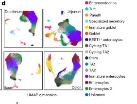

# Organization of the human intestine at single-cell resolution

## Abstract

### 讲解：

这段文本详细描述了研究团队如何研究肠道的复杂性及其功能差异。以下是具体的讲解：

1. **肠道的功能和重要性**：
-肠道是一个复杂的器官，促进消化，提取营养，参与免疫监视，维持与微生物群的关键共生关系，并影响整体健康。
-肠道长度超过九米，其结构和功能沿途存在差异。

2.**研究目的**：
-为了更好地理解这些功能差异，研究人员评估了单细胞的组织情况，使用多重成像和单核RNA以及开放染色质检测，涵盖了来自九位供体的八个不同肠道部位。

3.**研究发现**：
-通过系统分析，研究人员发现肠道不同区域的细胞组成有显著差异，展示了上皮亚型的复杂性。
-相同的细胞类型在肠道中被组织成不同的邻域和社区，突显了肠道中存在的独特免疫生态位。
-研究还绘制了这些细胞中的基因调控差异，这些差异暗示了一个调控分化级联反应。
-将肠道疾病的遗传力与特定细胞类型关联起来。

4.**研究的重要性**：
- 这些结果描述了肠道器官的细胞组成、调控和组织的复杂性，并作为理解人类生物学和疾病的重要参考图谱。

*****

### 比喻讲解：

可以将这项研究比作探索一个广袤而复杂的城市，了解不同街区的居民、功能和相互关系。具体比喻如下：

1. **肠道的功能和重要性**：
- 肠道就像一个大型城市，这个城市不仅有繁忙的商业区（促进消化，提取营养），还有警察和安全系统（参与免疫监视），维持与外来移民（微生物群）的和谐共生，并影响整个城市的整体健康。

1. **研究目的**：
- 为了更好地理解这个城市的不同街区（肠道的不同部分），研究人员就像城市规划者，使用多种高科技工具（多重成像和单核RNA及开放染色质检测）对九位居民（供体）的八个不同街区进行了详细调查。

2. **研究发现**：
- 通过这次调查，研究人员发现不同街区的居民组成（细胞组成）有显著差异。比如，商业区的居民类型和住宅区的居民类型完全不同，展示了这些街区的独特性。
- 即使是相同类型的居民（细胞类型），在不同街区也有不同的组织和社区结构，形成了独特的邻里关系和功能区（免疫生态位）。
- 研究人员还绘制了这些居民的行为和调控模式（基因调控差异），就像描述了不同街区的管理规则和发展趋势（调控分化级联反应）。
- 他们还将城市中某些问题（疾病）与特定的街区和居民类型（细胞类型）进行了关联。

3. **研究的重要性**：
- 这些结果为我们描绘了一幅详细的城市地图，展示了这个城市的复杂居民结构、管理规则和组织方式。这些信息对理解城市（人体）如何运行以及如何应对城市问题（疾病）提供了重要的参考。

*****

### 问题：

研究人员通过什么方法研究肠道不同部位的细胞组成和功能差异？他们发现了哪些主要结果？

### 答案和讲解：

**研究方法**：
研究人员使用多重成像和单核RNA及开放染色质检测技术，对来自九位供体的八个不同肠道部位的单细胞进行了组织评估。这些技术帮助他们系统地分析了细胞组成、基因调控和细胞在不同部位的组织结构。

**主要结果**：
1. **细胞组成差异**：
- 研究发现肠道不同区域的细胞组成有显著差异，展示了上皮亚型的复杂性。

2. **细胞组织结构**：
- 相同的细胞类型在肠道中被组织成不同的邻域和社区，形成了独特的免疫生态位。

3. **基因调控差异**：
- 研究绘制了细胞中的基因调控差异，暗示了一个调控分化级联反应。

4. **疾病遗传力关联**：
- 将肠道疾病的遗传力与特定细胞类型进行了关联。

**研究的重要性**：
这些结果为理解肠道的复杂细胞组成、调控和组织提供了详细的参考图谱，有助于理解人类生物学和疾病。

### 比喻讲解：

可以将这项研究比作探索一个广袤而复杂的城市，了解不同街区的居民、功能和相互关系。

**研究方法**：
- 研究人员就像城市规划者，使用多种高科技工具（多重成像和单核RNA及开放染色质检测）对九位居民（供体）的八个不同街区进行了详细调查。

**主要结果**：
1. **居民组成差异**：
- 发现不同街区的居民组成有显著差异，比如商业区和住宅区的居民类型不同，展示了这些街区的独特性。

2. **居民组织结构**：
- 相同类型的居民在不同街区有不同的组织和社区结构，形成了独特的邻里关系和功能区（免疫生态位）。

3. **行为和管理规则**：
- 描述了不同街区的管理规则和发展趋势（基因调控差异），就像城市的管理和发展策略。

4. **城市问题关联**：
- 将城市中某些问题（疾病）与特定的街区和居民类型（细胞类型）进行了关联。

通过这个比喻，可以更好地理解研究方法和发现的意义，就像详细描绘了一个城市的地图，展示了复杂的居民结构、管理规则和组织方式。

*****

### 讲解：

这段文本详细介绍了人类肠道系统的复杂性及其研究方法和发现。以下是具体的讲解：

1. **肠道系统的基本结构和功能**：
- 成人肠道系统包括大约7米的小肠和2米的大肠。
- 小肠负责吸收水分和小分子营养（如糖、单价离子和氨基酸），而大肠则积累纤维等大分子，并作为厌氧发酵室，分解和吸收副产物，以及通过肠道微生物合成和吸收其他营养（如维生素）。

2. **肠道的异质性**：
- 小肠分为十二指肠、空肠和回肠三个形态各异的区域。
- 大肠则可以分为升结肠、横结肠、降结肠和乙状结肠。
- 每个解剖区域包含大量表型和形态各异的细胞类型，包括上皮细胞、基质细胞和免疫细胞。免疫细胞尤为重要，因为它们与肠道中的微生物和外来物质相互作用。

3. **特定细胞类型的分布**：
- 虽然这些广义的细胞类型在整个肠道系统中都是常见的，但特定细胞类型表现出位置偏好。例如，潘氏细胞主要分布在小肠，而肠内分泌L细胞主要在回肠和大肠中发现。

4. **细胞的空间组织**：
- 这些细胞类型在肠道不同区域中被组织成不同的“邻域”，这些邻域的组成和分子表型在不同解剖区域中以相对未知的方式变化。这些功能邻域的组成和细胞状态的分子身份的差异定义了人类肠道的组成和功能。

5. **研究方法和发现**：
- 研究人员使用单核RNA、开放染色质和空间蛋白质组学成像技术对肠道的多个部分进行了单细胞分辨率的映射。
- 以前的研究使用单细胞RNA测序（scRNA-seq）绘制了肠道细胞类型的图谱，而本研究扩展了这一研究，通过索引共检测（CODEX）技术对细胞和蛋白质进行了空间映射，并使用单核转座酶可及染色质测序（snATAC-seq）技术映射了基因调控信息。
- 研究定义了不同肠道区域内不同细胞类型的相对丰度，包括上皮细胞的巨大复杂性，以及细胞在不同多细胞结构生态位中的组织。
- 研究还绘制了这些细胞中的基因调控差异，暗示了一个调控分化级联反应。

6. **研究的重要性**：
- 这些结果提供了关于这个复杂器官的细胞功能、调控和组织的重要见解，作为理解人类生物学和疾病的重要参考。

*****

### 比喻讲解：

可以将这项研究比作探索一个大型、多功能的城市，了解不同街区的居民、功能和相互关系。具体比喻如下：

1. **肠道系统的基本结构和功能**：
- 肠道系统就像一个庞大的城市，包含7公里长的小街区（小肠）和2公里长的大街区（大肠）。
- 小街区（小肠）负责处理基础任务，比如吸收水分和小分子营养（类似于供应日常生活用品），而大街区（大肠）则负责处理更复杂的任务，如积累和发酵纤维等大分子，分解和吸收副产物，并通过与城市中的微生物合作（类似于工厂和实验室）合成和吸收其他营养（如维生素）。

2. **肠道的异质性**：
- 小街区（小肠）分为三个独特的区域：商业区（十二指肠）、住宅区（空肠）和工业区（回肠），每个区域都有不同的功能和特性。
- 大街区（大肠）分为四个部分：上城区（升结肠）、中城区（横结肠）、下城区（降结肠）和郊区（乙状结肠），每个区域也都有独特的特性。

3. **特定居民类型的分布**：
- 在整个城市中，有不同的居民类型（细胞类型），如工人（上皮细胞）、维护人员（基质细胞）和保安（免疫细胞）。
- 某些居民类型有特定的居住偏好。例如，专门从事防护工作的居民（潘氏细胞）主要住在小街区，而负责内分泌功能的居民（肠内分泌L细胞）则主要住在回肠和大街区。

4. **居民的空间组织**：
- 这些居民在城市的不同区域内组织成不同的社区（邻域），这些社区的组成和功能在不同区域中有所不同，就像每个街区都有自己独特的社区和功能区。

5. **研究方法和发现**：
- 研究人员就像城市规划者，使用先进的技术（单核RNA、开放染色质和空间蛋白质组学成像技术），对城市的多个部分进行了详细的地图绘制。
- 以前的研究已经使用人口普查（单细胞RNA测序）绘制了居民类型的基本图谱，而本研究进一步扩展了这一研究，通过高级图像处理技术（CODEX）对居民和建筑物（细胞和蛋白质）进行了空间映射，并使用基因调控信息（snATAC-seq）分析了城市管理的规则。
- 研究人员定义了不同街区内不同居民类型的相对比例，包括上皮细胞的巨大多样性，以及居民在不同社区中的组织方式。

6. **研究的重要性**：
- 这些结果为我们提供了一幅详细的城市地图，展示了这个复杂城市的居民功能、管理规则和组织方式，成为理解城市运行和解决城市问题的重要参考。

*****

### 问题：

研究人员如何使用不同的技术来研究人类肠道的复杂性？这些技术揭示了哪些主要发现？

### 答案和讲解：

**研究技术**：

1. **单核RNA测序（snRNA-seq）**：
- 用于绘制单细胞分辨率的转录组图谱，识别不同细胞类型的基因表达模式。

2. **开放染色质测序（snATAC-seq）**：
- 用于分析细胞中的开放染色质区域，揭示基因调控信息，帮助理解基因表达的调控机制。

3. **空间蛋白质组学成像技术（CODEX）**：
- 用于空间定位细胞和蛋白质，绘制细胞在肠道不同区域的空间分布图。

**主要发现**：

1. **细胞组成的复杂性**：
- 在肠道不同区域内，细胞组成存在显著差异，展示了上皮细胞的巨大复杂性。

2. **细胞组织的多样性**：
- 相同类型的细胞在肠道中被组织成不同的邻域和社区，形成了独特的免疫生态位。

3. **基因调控的差异**：
- 研究绘制了基因调控差异，暗示了一个调控分化级联反应。

4. **特定细胞类型的定位偏好**：
- 某些细胞类型在特定的肠道区域有定位偏好，例如潘氏细胞主要在小肠，而肠内分泌L细胞主要在回肠和大肠中发现。

这些研究结果为理解肠道的细胞功能、调控和组织提供了重要的见解，成为理解人类生物学和疾病的重要参考。

*****

### 比喻讲解：

可以将这项研究比作探索一个大型、多功能的城市，了解不同街区的居民、功能和相互关系：

**研究技术**：

1. **单核RNA测序（snRNA-seq）**：
- 就像使用高分辨率的摄像机拍摄每个居民的活动，了解他们的日常行为和功能。

2. **开放染色质测序（snATAC-seq）**：
- 类似于分析城市的法规和管理规则，揭示城市管理的具体机制和政策。

3. **空间蛋白质组学成像技术（CODEX）**：
- 如同使用高科技地图绘制工具，详细绘制出城市中每个街区的居民分布和建筑布局。

**主要发现**：

1. **居民组成的复杂性**：
- 不同街区的居民组成存在显著差异，展示了上皮细胞的多样性。

2. **居民组织的多样性**：
- 相同类型的居民在不同街区被组织成不同的社区，形成了独特的邻里关系和功能区。

3. **法规和管理规则的差异**：
- 描述了不同街区的管理规则和发展策略，揭示了一个复杂的管理和发展过程。

4. **特定居民类型的定位偏好**：
- 某些居民类型偏好特定的街区，例如防护人员主要在小街区，而技术人员主要在工业区和大街区中。

通过这个比喻，可以更好地理解研究技术和发现的意义，就像详细描绘了一个城市的地图，展示了复杂的居民结构、管理规则和组织方式。

*****

### Fig. 1a: 结果描述和图例描述

### 结果描述：
Fig.1a显示了使用CODEX数据测量的肠道不同区域的基质细胞（stromal cells）类型的百分比。此数据是八个捐赠者的平均值。对基质细胞类型的百分比进行了标准化，以便与所有基质细胞的总数进行比较。数据显示，从小肠（SB）到结肠（CL）进行比较，内皮细胞（endothelial cells）的百分比显著减少（**P < 0.01），而平滑肌细胞（smooth muscle cells）的百分比显著增加（***P < 0.001）。

### 图例描述：
Fig.1a的图例中，基质细胞类型包括内皮细胞、平滑肌细胞、成纤维细胞、间质细胞、神经细胞和其他未分类的基质细胞类型。每种细胞类型的百分比通过标准化计算，表示为总基质细胞的百分比。通过对比小肠和结肠的数据，可以看到特定细胞类型在不同肠道区域中的变化趋势。

### 关键结论:
1. 从小肠到结肠，内皮细胞的百分比显著减少。
2. 平滑肌细胞的百分比显著增加。

### 分析目的：
通过Fig.1a的数据和图例描述，研究人员旨在揭示肠道不同区域中基质细胞类型的变化。这有助于理解肠道在结构和功能上的区域特异性差异，并提供了关于细胞组成和组织结构的详细信息。这些信息对于理解肠道的复杂性以及其在健康和疾病中的功能具有重要参考价值。

*****

### Fig. 1a 方法描述和比喻讲解

### 方法描述：
Fig.1a中使用了CODEX多重成像技术，通过这种技术可以测量和分析来自八位捐赠者的不同肠道区域的单细胞类型组成。具体步骤如下：
1. 选择八位捐赠者并采集其肠道组织样本。
2. 将样本分为小肠（SB）和结肠（CL）两个主要部分，每个部分再细分为多个区域（如十二指肠、空肠、回肠等）。
3. 使用CODEX多重成像技术对每个区域的组织样本进行成像和标记。CODEX技术允许同时使用多达54种抗体探针对组织切片中的细胞进行染色，以识别不同的蛋白质标志物。
4. 对成像数据进行处理，包括图像拼接、漂移补偿、去卷积和循环连接，生成单细胞分割数据。
5. 使用细胞类型标记和位置数据对每个区域的细胞进行分类，并计算基质细胞（如内皮细胞和平滑肌细胞）的相对百分比。
6. 对不同肠道区域的基质细胞百分比进行统计分析，并进行显著性差异测试（如两侧t检验）。

### 比喻讲解：
想象你是一名园艺师，负责管理一座大型植物园。这个植物园有两个主要区域：小花园和大花园。你需要了解这两个区域内不同植物种类的分布情况，并找到它们之间的差异。

1. 首先，你选择了八个代表性的植物园志愿者，让他们分别从小花园和大花园的不同区域采集植物样本。
2. 接着，你将这些样本带回实验室，使用一种特殊的成像技术，就像在植物上贴上不同颜色的标签，这种技术允许你同时识别多达54种不同的植物特征。
3. 通过成像技术，你获取了每个植物样本的详细图像，就像拍摄了一张清晰的全景照片。
4. 你对这些图像进行处理，就像把这些照片拼接成一幅完整的地图，并调整每张照片的位置，使它们对齐。
5. 然后，你使用这些标签来识别每种植物的类型和位置，并计算每个区域内不同植物种类的相对比例。
6. 最后，你将小花园和大花园的数据进行对比分析，发现小花园里的花卉种类（比如玫瑰和郁金香）显著减少，而大花园里的树木种类（比如橡树和松树）显著增加。

通过这种比喻，你可以清楚地理解，研究人员是如何使用高级成像技术和数据分析方法，来揭示肠道不同区域中细胞类型的分布差异，从而更好地理解肠道的复杂性。

*****

### Fig.1b

### Fig.1b 结果和图例描述

### 结果描述：
Fig.1b显示了不同肠道区域的基质细胞类型的相对百分比，包括小肠（SB）和结肠（CL）的多个子区域。每个子区域都通过条形图展示其基质细胞的组成，图中使用不同颜色表示不同的细胞类型。结果表明，不同区域的基质细胞组成存在显著差异。例如，小肠的十二指肠和空肠区域显示出较高比例的内皮细胞和平滑肌细胞，而结肠的升结肠和降结肠区域显示出不同的细胞组成。

### 图例描述：
图例中使用不同颜色和标签来区分不同的基质细胞类型。例如，红色代表内皮细胞，蓝色代表平滑肌细胞，绿色代表成纤维细胞，黄色代表免疫细胞。每个条形图中的颜色分布显示了相应区域内不同类型基质细胞的相对比例。

### 关键结论:
1. 不同肠道区域的基质细胞组成显著不同，显示出区域特异性。
2. 小肠区域内皮细胞和平滑肌细胞的比例较高，而结肠区域显示出更多的多样性。
3. 特定区域如十二指肠和升结肠在基质细胞组成上有显著差异，可能反映其功能上的不同。

### 分析目的：
本研究的目的是通过分析不同肠道区域的基质细胞组成，揭示肠道在组织水平上的异质性。了解基质细胞的分布有助于解释肠道不同部分的生理功能和潜在的病理变化，为未来的研究和临床应用提供基础数据。这种细致的细胞类型分析有助于识别潜在的疾病标志物和治疗靶点，推动个性化医学的发展。

*****

### Fig. 1b 方法描述和比喻讲解

### 方法描述：
Fig.1b使用了CODEX（Cyclic Immunofluorescence）多重成像技术，对来自八个供体的八个不同肠道区域的单细胞进行免疫细胞类型的百分比测量。具体步骤包括：

1. 通过CODEX技术对肠道组织样本进行标记和成像。
2. 使用54种抗体探针对相同的组织切片进行染色，标记特定的蛋白质目标。
3. 通过成像分析获得每个细胞的荧光信号，并进行细胞分割和类型鉴定。
4. 对获得的数据进行分析，计算每种免疫细胞类型在不同肠道区域的百分比，并将这些数据标准化为总免疫细胞的百分比。
5. 使用两侧t检验比较小肠和结肠之间的免疫细胞类型百分比的差异，显著性水平设为P < 0.05。

### 比喻讲解：
想象一下你有一块复杂的拼图，这块拼图代表着一个人的肠道。你希望了解这块拼图中每个小片段的组成，并找出它们在不同区域的差异。

1. 首先，你需要一些特别的“眼镜”来观察这块拼图，这些“眼镜”就是CODEX多重成像技术。它可以帮助你看到每个片段上的细节。
2. 接下来，你用54种不同颜色的“颜料”来给拼图上的每个小片段上色，每种颜色代表一种特定类型的免疫细胞。
3. 然后，你拍摄拼图的照片，每张照片显示不同颜色的细胞。通过这些照片，你可以把每个小片段上的细胞分辨出来，并给它们分类。
4. 你开始计算每种颜色（免疫细胞类型）在拼图不同区域（小肠和结肠）中的数量，并把这些数量转换成百分比。
5. 最后，你用一种统计方法（两侧t检验）来比较这些百分比，看看在小肠和结肠中是否存在显著差异，就像你在比较两组数据，看它们是否有明显的不同。

通过这个过程，你不仅能看到肠道中每种免疫细胞的分布，还能了解它们在不同区域中的变化。这就像把一幅复杂的拼图拆开，再通过观察和比较找到每个片段的独特之处。

*****

### fig.1c

### 结果描述：
Fig.1c展示了在不同肠道区域（小肠和结肠）中各种上皮细胞类型的百分比。数据来源于对八位供体的八个肠道区域的CODEX成像分析。上皮细胞被分类为以下几种类型：吸收细胞（Enterocytes）、分泌吸收细胞（Secretory Enterocytes）、杯状细胞（Goblet Cells）、CD66+吸收细胞（CD66+ Enterocytes）、潘氏细胞（Paneth Cells）和CD57+吸收细胞（CD57+ Enterocytes）。

### 图例描述：
1. 图1c通过条形图展示了不同肠道区域中各种上皮细胞类型的百分比。每个条形图代表一种细胞类型，颜色编码用于区分不同的肠道区域。
2. 条形图的x轴表示不同的细胞类型，y轴表示这些细胞类型在所有上皮细胞中的百分比。
3. 比较了小肠（SB）和结肠（CL）中的细胞类型百分比，使用两侧t检验评估差异，显著性水平为P < 0.05。

### 关键结论：
1. 吸收细胞（Enterocytes）的百分比从小肠到结肠显著下降。
2. 分泌吸收细胞（Secretory Enterocytes）和CD66+吸收细胞（CD66+ Enterocytes）的百分比从小肠到结肠显著增加。
3. 潘氏细胞（Paneth Cells）在结肠中几乎不存在，仅在小肠中发现。
4. CD57+吸收细胞（CD57+ Enterocytes）在十二指肠中显著丰富。

### 分析目的：
通过详细分析和比较不同肠道区域的上皮细胞类型分布，揭示小肠和结肠在细胞组成和功能上的显著差异。这样的比较有助于理解肠道在不同区域的特化功能，以及在这些区域中细胞类型如何组织成不同的“社区”以适应特定的生理和免疫功能。这些数据可以为进一步研究肠道疾病的细胞和分子基础提供参考。

*****

### Fig. 1c 的方法和比喻讲解

### 方法描述：
Fig.1c的方法涉及使用CODEX多重标记成像技术来测量和分析肠道不同区域中上皮细胞（epithelial cells）类型的百分比。数据来自八个捐赠者，并且对上皮细胞类型的百分比进行了标准化，以便与所有上皮细胞的总数进行比较。研究人员将小肠（SB）和结肠（CL）的上皮细胞类型百分比进行了比较，并使用双侧t检验（two-sided t-tests）来确定不同区域之间的显著差异。

### 比喻讲解：
想象一下，你在管理一个巨大的图书馆，这个图书馆有两个主要部分：小图书馆和大图书馆。你的任务是了解这两个部分的书籍种类和数量，并找出它们之间的差异。

1. **数据收集**：首先，你要统计每个部分的书籍种类和数量。为了做到这一点，你使用了一种特殊的设备（CODEX多重标记成像技术），它可以一次识别很多种书（细胞）并且记录它们的位置和数量。

2. **数据标准化**：由于小图书馆和大图书馆的规模不同，你需要将数据标准化。就像你需要将每种书的数量除以该图书馆中书籍的总数，以便可以比较两个图书馆中的书籍种类比例。

3. **数据分析**：接下来，你将小图书馆和大图书馆中的每种书的比例进行比较。你使用一种统计方法（双侧t检验）来确定哪些书的比例在两个图书馆之间存在显著差异。

4. **结果展示**：最后，你将结果以图表形式展示出来。例如，如果你发现小图书馆中的百科全书比例显著高于大图书馆，而大图书馆中的小说比例显著高于小图书馆，你会在图表中用星号标记这些显著差异。

通过这种方式，你不仅可以了解每个图书馆中书籍的组成，还可以发现它们之间的显著差异。这有助于你更好地管理图书馆，并为未来的图书采购和布局提供参考。同样，研究人员通过这种方法了解了肠道不同区域中上皮细胞的组成差异，这对理解肠道在健康和疾病中的功能非常重要。

*****

### fig.1d

### 结果描述：
Fig.1d显示了小肠（SB）和结肠（CL）中M1巨噬细胞的百分比与供体体重指数（BMI）之间的关系。图中展示了不同供体的M1巨噬细胞百分比，横轴表示供体的BMI，纵轴表示M1巨噬细胞的百分比。图中显示，M1巨噬细胞在小肠和结肠中的百分比随着BMI的增加而增加，且存在正相关关系，皮尔森相关系数r为0.86。

### 图例描述：
Fig.1d显示了在所有供体中小肠和结肠中M1巨噬细胞的百分比与供体BMI的关系，皮尔森相关系数r = 0.86。

### 关键结论：
M1巨噬细胞的百分比与供体的BMI呈显著正相关关系，即BMI越高，M1巨噬细胞在肠道中的百分比越高。这一发现表明，肥胖可能与肠道中M1巨噬细胞的增加有关，进一步支持了M1巨噬细胞在慢性炎症、免疫疾病和肠道愈合问题中的作用。

### 分析目的：
分析Fig.1d的目的是为了探讨M1巨噬细胞的百分比是否与供体的BMI存在相关关系，从而揭示肥胖可能对肠道免疫细胞组成和功能的潜在影响。这一分析有助于理解肥胖对肠道健康的影响，并为未来研究肥胖相关肠道疾病提供基础数据。

*****

### Fig. 1d 方法和比喻讲解

### 方法描述：
Fig.1d的方法是通过将捐赠者的体重指数（BMI）与其小肠和结肠中的M1巨噬细胞百分比进行相关分析。首先，使用CODEX数据测量M1巨噬细胞在所有捐赠者的肠道样本中的百分比。接着，将这些数据与每个捐赠者的BMI进行匹配，并计算Pearson相关系数（r），以确定M1巨噬细胞百分比与BMI之间的关系。

### 比喻讲解：
想象你正在园艺俱乐部做一个实验，想知道土壤肥力（BMI）是否会影响某种植物（M1巨噬细胞）的生长百分比。你有九块不同肥力的土地，每块地上种植了一些植物。现在，你需要找到这些植物在不同肥力土地上的生长情况，并看看肥力是否真的影响植物的生长。

1. 首先，你走遍所有土地，统计每块地上这些植物的数量，并计算出它们在总植物中的百分比。这就像我们用CODEX数据测量每个捐赠者肠道中M1巨噬细胞的百分比。

2. 接下来，你记录下每块土地的肥力值（BMI），这些值可能是从很贫瘠到非常肥沃。

3. 然后，你将每块土地的植物生长百分比与其肥力值进行匹配，就像你把每个捐赠者的M1巨噬细胞百分比与他们的BMI进行匹配一样。

4. 最后，你使用一个叫做Pearson相关系数的工具，看看这些数据是否有规律可循。这个工具会告诉你，肥力与植物生长之间的关系是正相关、负相关，还是没有关系。Pearson相关系数（r）的范围是-1到1，接近1表示高度正相关，接近-1表示高度负相关，接近0表示没有相关。

通过这个比喻，你就可以更容易地理解Fig.1d中的方法：研究人员发现肥力（BMI）越高，土地上植物（M1巨噬细胞）的百分比也越高，证明了肥力对植物生长有显著影响（r = 0.86）。

*****

### Fig.1e

### Fig. 1e 的结果和图例描述

### 结果描述：
Fig.1e的结果显示了中段空肠中M1巨噬细胞在不同BMI捐赠者中的分布情况。图中展示了8位捐赠者中M1巨噬细胞（黑色）在中段空肠组织中的分布图。组织图中还标示了基质细胞（浅灰色）和上皮细胞（灰色）。

### 图例描述：
图例中包含两张中段空肠的组织图，分别代表BMI较高和较低的个体。图中M1巨噬细胞以黑色标示，基质细胞以浅灰色标示，上皮细胞以灰色标示。标尺为250μm。

### 关键结论:
在BMI较高的个体中，中段空肠中的M1巨噬细胞密度显著高于BMI较低的个体。

### 分析目的：
分析目的是研究M1巨噬细胞在肠道不同BMI背景下的分布情况，探讨其与肥胖相关炎症状态之间的关系。通过比较不同BMI捐赠者的肠道组织图，可以直观展示M1巨噬细胞密度与BMI的相关性，从而揭示肥胖可能引发的局部炎症反应。这一分析有助于理解肥胖与肠道免疫环境变化的关联，进一步阐明肥胖相关肠道疾病的病理机制。

*****

### 方法描述：
Fig.1e的方法通过比较不同BMI（体重指数）捐赠者中小肠和结肠的M1巨噬细胞百分比来分析BMI与M1巨噬细胞的关系。具体步骤如下：
1. 使用CODEX技术获取每位捐赠者的肠道样本。
2. 将样本进行细胞类型标记和成像。
3. 识别并统计每位捐赠者的小肠和结肠中M1巨噬细胞的数量。
4. 计算M1巨噬细胞在小肠和结肠中所占的百分比。
5. 将这些百分比数据与捐赠者的BMI进行关联分析。
6. 使用Pearson相关系数计算BMI与M1巨噬细胞百分比之间的相关性。

### 比喻讲解：
想象一下，你有一个花园，其中种植了不同类型的植物。现在，你想了解花园里一种特定类型的植物（例如，玫瑰）的数量是否与花园的肥沃程度（比如，土壤的肥力）有关。以下是你如何进行这个分析的步骤：

1. 首先，你在花园的不同区域（例如，东区和西区）采集了样本，就像研究人员从不同BMI捐赠者的小肠和结肠采集样本一样。
2. 然后，你给每个样本中的植物做上标签，标记出哪些是玫瑰，这就相当于研究人员使用CODEX技术标记细胞类型。
3. 接下来，你数出每个样本中玫瑰的数量，并计算出它们占总植物数量的百分比，就像研究人员统计M1巨噬细胞并计算百分比一样。
4. 之后，你记录下每个样本所在区域的土壤肥力（用肥力指数表示），相当于记录捐赠者的BMI。
5. 现在，你有了每个区域的玫瑰百分比和土壤肥力指数的数据，你开始比较这些数据，看看它们之间是否有某种关系。
6. 最后，你使用一种统计方法（例如Pearson相关系数）来计算玫瑰百分比与土壤肥力指数之间的相关性，从而得出结论。这类似于研究人员分析BMI与M1巨噬细胞百分比之间的关系。

通过这种比喻，我们可以更容易地理解研究人员是如何通过分析数据，找出不同BMI与M1巨噬细胞之间的关系的。

### Fig.1f

### Fig. 1f 的结果和图例描述

### 结果描述：
图1f显示了不同捐赠者的内皮细胞和CD8+ T细胞的百分比与捐赠者是否有高血压历史之间的关系。具体结果如下：
- 在有高血压历史的捐赠者中，内皮细胞的百分比从25%下降到20%。
- 在有高血压历史的捐赠者中，CD8+ T细胞的百分比从42%下降到25%。

### 图例描述：
- 图1f展示了捐赠者中有无高血压历史与两种细胞类型（内皮细胞和CD8+ T细胞）百分比之间的比较。
- 该图包含两个箱线图，分别展示内皮细胞和CD8+ T细胞的百分比。
- 统计分析使用双侧t检验得出显著性差异：
- 内皮细胞的显著性水平为*P=0.038。
- CD8+ T细胞的显著性水平为***P=0.00013。

### 关键结论：
高血压历史与捐赠者肠道内皮细胞和CD8+ T细胞的百分比显著相关。有高血压历史的捐赠者中，这两种细胞类型的百分比显著降低。

### 分析目的：
分析目的是确定高血压历史对肠道特定细胞类型（内皮细胞和CD8+ T细胞）组成的影响，从而揭示高血压可能对肠道免疫系统和血管系统的潜在影响。这些发现有助于理解高血压与肠道健康之间的联系，并为未来的相关疾病研究提供参考。

*****

### Fig. 1f 方法及比喻讲解

### 方法描述：
Fig.1f的分析方法包括以下几个步骤：

1. **数据收集与分类**：研究人员从捐赠者那里收集了小肠和结肠的组织样本，并测量了各种细胞类型的百分比，包括内皮细胞和CD8+ T细胞。
2. **分组与对比**：根据捐赠者是否有高血压病史，将他们分为两组：有高血压病史的和没有高血压病史的。
3. **统计分析**：对两组的内皮细胞和CD8+ T细胞百分比进行了统计比较，采用双侧t检验（two-sided t-tests）来确定这些细胞类型的百分比在两组之间是否存在显著差异。

### 比喻讲解：
1. **数据收集与分类**：就像你在一个大花园中收集不同种类的花卉，然后根据花卉的种类和颜色进行分类。例如，你采集了红色玫瑰、黄色郁金香、和白色百合。
2. **分组与对比**：接下来，你根据花园的位置将花卉分成两组：一个组是靠近水源的花园，另一个组是远离水源的花园。你想要看看这两个花园里的同种类花卉在数量上的差别，比如红色玫瑰的数量和黄色郁金香的数量。
3. **统计分析**：最后，你使用一种叫做双侧t检验的方法来比较这两个花园中每种花卉的数量，确定靠近水源的花园和远离水源的花园里的花卉数量是否有显著的差异。这就像是在两个花园里数每种花的数量，然后计算它们的差异，看看这个差异是否足够大，能被认为是有统计学意义的。

*****

### fig.1g

### 结果描述：
Fig.1g显示了小肠和结肠内各种细胞类型的相同细胞密度的量化结果。该量化通过测量同类细胞之间的平均距离并除以组织内最大可能的同类细胞距离来计算。该图展示了在不同组织区域中每种细胞类型的密度比较。

### 图例描述：
- 图中展示了从64个组织切片中获得的结果。
- y轴表示相同细胞密度的测量值，数值越低表示同类细胞越密集。
- x轴表示不同的细胞类型，包括平滑肌细胞、内皮细胞、CD8+ T细胞、M1巨噬细胞等。
- 每个条形代表小肠和结肠中某种细胞类型的密度。
- 结果以箱线图形式表示，其中盒子代表25%到75%的数据范围，中间的线代表中位数，胡须表示最小值和最大值，离群值显示为离群点。

### 关键结论：
- 小肠和结肠中平滑肌细胞的密度差异显著，小肠中平滑肌细胞的密度较低，而在结肠中密度较高。
- 内皮细胞在小肠中的密度较高，而在结肠中密度较低。
- CD8+ T细胞在小肠中的密度较高，而在结肠中密度较低。
- M1巨噬细胞在小肠和结肠中的密度差异不大。

### 分析目的：
该图的目的是展示不同细胞类型在小肠和结肠中分布密度的差异，通过定量比较同类细胞的密度，揭示小肠和结肠在细胞组织结构上的差异，帮助理解这些结构差异如何影响各自的功能和免疫环境。这些信息对于深入了解肠道的生物学特性及其与健康和疾病的关系具有重要参考价值。

*****

### 方法描述：
Fig.1g展示了相同细胞密度的量化方法。相同细胞密度是通过测量每个细胞到其五个最近的相同类型细胞的平均距离来计算的。这一距离然后除以该组织内相同类型细胞的最大可能距离，从而得出一个归一化的值。此方法用于所有组织区域的64个组织切片。

### 比喻讲解：
想象一下你在一个巨大的操场上参加一个团队游戏。每个人代表一个特定类型的细胞，穿着不同颜色的衣服。为了了解同类型细胞（穿同样颜色衣服的人）在操场上的分布密度，你需要进行以下操作：

1. **找到最近的朋友：** 每个人都要找到穿相同颜色衣服的五个最近的朋友，并测量他们之间的距离。
2. **计算平均距离：** 将这五个距离加起来，然后取平均值，得到每个人到最近五个相同类型朋友的平均距离。
3. **归一化处理：** 你需要知道，如果操场上所有人都尽可能分散，彼此之间的距离会有多大。将刚才计算的平均距离除以这个最大可能的距离，就可以得到一个归一化的值，表示在操场上同类型人群的相对密度。

通过这种方式，你可以评估穿同样颜色衣服的人在操场上是密集分布还是稀疏分布。这就类似于研究人员在Fig.1g中计算相同细胞密度的方法。他们通过这种量化方法，能够直观地了解同类型细胞在不同肠道区域的分布情况。

*****

### fig.1h

### 结果描述：
Fig.1h展示了不同肠道主要组织区域中巨噬细胞子集的百分比。在图中，巨噬细胞被分为M1和M2亚型，并且数据显示这些亚型在不同肠道区域（小肠和结肠）中的分布情况。图中使用了柱状图，显示了M1和M2巨噬细胞在各个肠道区域（包括黏膜、黏膜肌层、粘膜下层和肌层外层）中的比例。

### 图例描述：
- 图例使用柱状图表示M1和M2巨噬细胞的分布。
- 每个柱状图显示了M1或M2巨噬细胞在特定肠道区域（如黏膜、黏膜肌层、粘膜下层和肌层外层）的百分比。
- 图例中使用不同颜色区分M1和M2巨噬细胞的比例。

### 关键结论:
- 在肠道不同区域中，M1和M2巨噬细胞的分布存在显著差异。
- M1巨噬细胞主要集中在黏膜区域，而M2巨噬细胞则在各个区域中均有分布。
- 这种分布差异提示了巨噬细胞在肠道免疫功能中的不同作用和调控机制。

### 分析目的：
通过分析巨噬细胞子集在肠道不同组织区域中的分布，研究人员旨在揭示巨噬细胞在肠道免疫环境中的角色及其可能的功能特异性。这种分析有助于理解不同巨噬细胞亚型在肠道健康和疾病中的重要性，并为未来的免疫学研究和治疗策略提供基础数据。

*****

### Fig. 1h 方法和比喻讲解

### 方法描述：
Fig.1h使用CODEX数据对肠道不同区域中巨噬细胞亚群的百分比进行了量化。研究人员将巨噬细胞分为M1和M2两种类型，并在小肠和结肠的不同区域中计算了它们的相对百分比。通过分析这些数据，研究人员能够揭示巨噬细胞在肠道不同部位的分布情况和密度变化。

### 比喻讲解：
想象你在一个大型游乐园里，游乐园分为不同的区域，如儿童区、冒险区和休闲区。每个区域都有不同的游乐设施，比如滑梯、过山车和旋转木马。现在，我们想知道每个区域里各种游乐设施的分布情况。

1. **确定游乐设施的类型**：首先，我们需要定义游乐园里不同类型的设施，比如滑梯、过山车和旋转木马。就像在肠道里，我们确定了两种巨噬细胞类型：M1和M2。

2. **收集数据**：接下来，我们在游乐园的每个区域数一数每种类型的游乐设施有多少。我们走遍儿童区、冒险区和休闲区，详细记录每个区域中滑梯、过山车和旋转木马的数量。类似地，研究人员通过CODEX数据，遍历肠道的不同区域，数一数每个区域里有多少M1和M2巨噬细胞。

3. **计算百分比**：在统计完每个区域的游乐设施数量后，我们计算每种游乐设施在该区域的总数中所占的百分比。例如，如果儿童区有10个游乐设施，其中6个是滑梯，那么滑梯在儿童区的百分比就是60%。同样，研究人员计算每种巨噬细胞在肠道不同区域的总巨噬细胞中所占的百分比。

4. **分析分布情况**：最后，我们对各个区域的数据进行对比，找出不同区域里各种游乐设施的分布特点。例如，我们可能发现儿童区滑梯最多，而冒险区过山车最多。通过这种方法，研究人员分析了巨噬细胞在肠道不同区域的分布特点，找出哪些区域M1细胞多，哪些区域M2细胞多。

通过这种比喻，我们能够更好地理解研究人员如何利用数据来分析巨噬细胞在肠道不同区域中的分布情况，以及这些细胞类型在不同区域中所占的比例。

*****

###  Figure 1(a-h)中的重要结论

### 重要结论总结

#### Fig. 1a
**结论**：在肠道的不同区域中，基质细胞的组成有显著差异。从小肠到结肠，内皮细胞的比例减少，平滑肌细胞的比例增加。

#### Fig. 1b
**结论**：免疫细胞的组成也随肠道区域变化而变化。从小肠到结肠，CD8+ T细胞的比例减少，而树突状细胞的比例增加。

#### Fig. 1c
**结论**：在上皮细胞中，小肠和结肠的细胞类型分布有所不同。小肠中吸收细胞比例较高，而在结肠中，分泌细胞（如杯状细胞）和CD66+吸收细胞的比例较高，同时小肠中有丰富的帕涅斯细胞，而结肠中几乎没有。

#### Fig. 1d
**结论**：M1巨噬细胞的水平与体重指数（BMI）呈正相关，BMI越高，M1巨噬细胞的比例越高。这些细胞主要集中在粘膜区域。

#### Fig. 1e
**结论**：体重指数较高的个体（BMI > 25）有更多的M1巨噬细胞，这些细胞与慢性炎症和肥胖相关的胃肠道疾病有关。

#### Fig. 1f
**结论**：有高血压病史的供体中，内皮细胞和CD8+ T细胞的比例显著减少。

#### Fig. 1g
**结论**：通过细胞密度分析，发现不同类型的免疫细胞在肠道中的分布也具有区域性。浆细胞主要集中在粘膜区域，而M2巨噬细胞则分布在整个肠道中。

#### Fig. 1h
**结论**：M1和M2巨噬细胞在肠道的不同区域中有不同的分布。小肠中M1巨噬细胞较少，而结肠中M2巨噬细胞分布更广泛。

### 综合结论
1. **细胞类型组成的区域性差异**：肠道不同区域的细胞组成差异显著，包括基质细胞、免疫细胞和上皮细胞。
2. **疾病和体重的相关性**：特定细胞类型（如M1巨噬细胞）与体重指数和高血压等代谢状态密切相关。
3. **细胞密度和功能的空间分布**：不同类型的免疫细胞和上皮细胞在肠道的分布具有显著的空间特征，这些分布可能反映其功能和相互作用模式。

这些结论帮助我们更好地理解肠道在单细胞水平上的复杂性及其与健康和疾病的关系。

*****

### fig.2a

### 结果描述：
Fig. 2a展示了单细胞RNA测序分析结果，显示了来自小肠和结肠不同区域的细胞群体的分布和组成。通过t-SNE（t-distributed Stochastic Neighbor Embedding）降维方法，将细胞群体分为不同的簇，每个簇代表一种特定类型的细胞。结果显示，各个簇的细胞在小肠和结肠之间存在显著的差异。

### 图例描述：
图例显示了不同类型细胞在t-SNE图中的分布情况。每种细胞类型用不同颜色表示，包括上皮细胞、内皮细胞、平滑肌细胞、免疫细胞（如T细胞、B细胞、巨噬细胞等）和其他基质细胞。每种颜色代表一种细胞类型，便于区分和识别。

### 关键结论:
1. 小肠和结肠的细胞组成存在显著差异，不同细胞类型在不同区域的分布有明显的特征。
2. t-SNE图中的细胞簇显示了各类细胞的多样性和特定的分布模式，这有助于理解不同肠道区域的功能和特性。
3. 不同的细胞类型在小肠和结肠中的丰度和分布模式可能与这些区域的特定生理功能和疾病状态相关。

### 分析目的：
1. **揭示肠道不同区域的细胞组成和分布**：通过单细胞RNA测序和t-SNE降维方法，展示小肠和结肠中各类细胞的详细分布情况，帮助理解不同肠道区域的细胞组成。
2. **理解细胞异质性和功能差异**：通过分析细胞类型的分布和组成，揭示细胞在不同肠道区域的功能和作用，为研究肠道的生理和病理状态提供基础。
3. **为疾病研究提供数据支持**：了解健康状态下肠道细胞的分布和组成，可以为研究肠道疾病（如炎症性肠病、肠道感染等）提供参考，帮助识别疾病相关的细胞类型和分子机制。

*****

### Fig. 2a 的方法和比喻讲解

### 方法描述：
Fig.2a的方法是通过多细胞邻域分析来定义肠道中的独特多细胞结构。具体步骤如下：
1. 从组织样本中提取细胞类型地图。
2. 使用滑动窗口技术，将每个细胞作为中心，计算窗口内不同细胞类型的数量。
3. 将这些数量向量化（即将每个细胞周围的细胞类型组成一个向量）。
4. 对这些向量进行聚类分析，以识别不同的多细胞邻域。
5. 根据不同细胞类型的丰富度，将聚类结果映射回组织图中，识别并可视化这些多细胞邻域。

### 比喻讲解：
可以把整个过程比喻成一个大城市的社区调查。

1. **提取细胞类型地图：** 
就像从卫星图像上看到整个城市一样，我们首先获得了肠道组织中所有细胞的类型和位置地图。

2. **使用滑动窗口技术：** 
想象一下，我们有一个透视放大镜，可以在城市中移动。每次放大镜的窗口都覆盖了一部分城市区域。每次我们将放大镜移动到一个新的位置（即一个细胞位置），我们都会记录在这个窗口内看到的各种建筑（即细胞类型）的数量。

3. **将这些数量向量化：**
现在，我们对每个窗口内看到的建筑类型进行统计，把这些数据写成一个清单。例如，在某个位置，我们看到有10座住宅、5个超市、2个学校和3个医院，这就形成了一个向量（10, 5, 2, 3）。

4. **对这些向量进行聚类分析：**
接下来，我们将所有这些清单收集起来，并进行分析，看哪些清单相似。就像是把所有社区进行分类，看看哪些社区有相似的建筑组合。通过这种方式，我们可以识别出哪些区域是住宅区、商业区、学校区等。

5. **映射回组织图：**
最后，我们将这些分析结果映射回城市地图上，标记出不同类型的社区。比如说，把住宅区标记成红色，商业区标记成蓝色等。通过这种方式，我们可以直观地看到整个城市中不同类型社区的分布情况。

这个比喻帮助我们理解，Fig.2a的方法是如何通过统计和聚类分析来揭示肠道中复杂的多细胞结构，从而更好地理解其功能和组织。

*****

### fig.2b

### Fig. 2b 结果和图例描述

#### 结果描述：
Fig. 2b 显示了八位捐赠者的小肠和大肠中八个不同区域（十二指肠、近端空肠、中部空肠、回肠、升结肠、横结肠、降结肠和乙状结肠）的细胞组成。图中使用条形图表示每个区域中不同类型的细胞的百分比。各细胞类型用不同颜色表示，包括上皮细胞、免疫细胞、间质细胞等。小肠和大肠的细胞组成显示出显著差异。

#### 图例描述：
图例中，各种颜色代表不同类型的细胞：
- 蓝色：上皮细胞
- 绿色：免疫细胞
- 红色：间质细胞
- 其他颜色：其他细胞类型

每个区域的条形图中，每种颜色的条形高度表示该类型细胞在该区域中所占的百分比。

#### 关键结论:
- 小肠中上皮细胞的比例较高，而大肠中免疫细胞和间质细胞的比例较高。
- 小肠和大肠的细胞组成显示出显著差异，反映出两个肠道区域在细胞类型分布上的不同特点。
- 不同肠道区域中细胞类型的分布差异可能与各区域的功能和微环境相关。

#### 分析目的：
- 通过比较小肠和大肠中不同区域的细胞组成，研究不同肠道区域在细胞类型分布上的差异。
- 了解肠道不同部分的细胞组成，以揭示这些区域在功能和疾病中的潜在作用。
- 提供基线数据，用于进一步研究肠道疾病（如炎症性肠病和肠癌）在不同区域中的病理变化。

*****

### Fig. 2b 方法和比喻讲解

### 结果描述：
Fig.2b展示了通过多细胞邻域分析得到的肠道组织结构的可视化结果。图中显示了不同的多细胞邻域（由不同颜色表示），这些邻域在组织切片中的空间分布情况。每个邻域代表了一组在空间上紧密相邻并具有特定细胞类型组成的细胞群体。

### 图例描述：
图例描述了组织切片上不同颜色代表的多细胞邻域。这些邻域是在多细胞邻域分析中通过计算每个细胞周围的细胞类型组合并进行聚类后得到的。每个颜色块代表一个独特的多细胞邻域，展示了这些邻域在肠道组织中的分布。

### 关键结论:
不同的多细胞邻域在肠道的不同区域表现出特定的分布模式，这些模式反映了肠道组织在空间结构上的复杂性和细胞组成的多样性。这种方法可以揭示出肠道中存在的功能性细胞群体及其空间组织关系。

### 分析目的：
通过对肠道组织进行多细胞邻域分析，目的是为了揭示肠道中不同区域的细胞组成和空间组织模式。这有助于理解肠道的功能性分区及其在健康和疾病状态下的变化，为进一步研究肠道生物学和相关疾病提供重要的参考地图。

*****

### fig.2c

### 结果描述：
Fig.2c展示了神经内分泌富集邻域在整个肠道中所有邻域中的比例。该图显示了在八个供体中，不同肠道区域中神经内分泌富集邻域的分布情况。每个供体的八个肠道区域分别是十二指肠、近端空肠、中部空肠、回肠（小肠部分），以及升结肠、横结肠、降结肠和乙状结肠（大肠部分）。

### 图例描述：
图例中展示了在不同肠道区域中神经内分泌富集邻域的比例，这些区域包括小肠（十二指肠、近端空肠、中部空肠、回肠）和大肠（升结肠、横结肠、降结肠、乙状结肠）。图例中的盒线图显示了每个肠道区域中神经内分泌富集邻域的中位数、四分位范围以及最小和最大值。

### 关键结论:
神经内分泌富集邻域在大肠中的比例显著高于小肠中的比例，表明神经内分泌细胞在大肠中特别富集。这一发现强调了大肠和小肠在细胞组成和功能上的差异。

### 分析目的：
通过分析神经内分泌富集邻域在不同肠道区域的分布，目的是为了揭示神经内分泌细胞在肠道不同部分的空间分布特征。这有助于理解这些细胞在肠道不同区域中的功能角色，并为研究肠道生理学及相关疾病提供参考。

*****

### Fig. 2c 方法描述和比喻讲解

### 方法描述：
Fig.2c的制作过程涉及对肠道各部分的细胞组织进行多细胞邻域（multicellular neighbourhood）分析。具体方法如下：
1. **邻域分析**：通过在组织中以每个细胞为中心取窗口，计算每个窗口内的细胞类型数量。
2. **聚类分析**：将这些窗口向量进行聚类，以确定不同的多细胞邻域类型。
3. **定义结构**：根据聚类结果，将每个多细胞邻域分类，并将它们映射回组织中，生成多细胞邻域的空间分布图。
4. **定量分析**：统计每个多细胞邻域在不同肠道区域中的百分比。

在Fig.2c中，重点展示了Neuroendocrine-Enriched邻域在八个捐赠者中的分布情况，并通过盒状图显示其在小肠和结肠中所占比例的差异。

### 比喻讲解：
可以将Fig.2c的制作过程比喻为一个园丁在不同的花园中识别并分类花卉组合的过程：

1. **邻域分析（花园划分）**：想象园丁在每个花园中选择了多个固定大小的花坛（窗口），每个花坛里种满了各种花卉。园丁在每个花坛中数一数有多少种类的花（细胞类型）。

2. **聚类分析（花卉分类）**：接下来，园丁将每个花坛中的花卉数量记录下来，并对这些记录进行分析。他发现不同的花坛可以根据花卉组合的不同，分为不同的类型（聚类）。比如，有的花坛主要种着玫瑰和郁金香，有的花坛主要种着向日葵和雏菊。

3. **定义结构（绘制花园地图）**：然后，园丁根据花坛的分类结果，在花园的地图上标记出每种类型的花坛的位置，生成一张详细的花园花卉分布图。

4. **定量分析（统计花卉比例）**：最后，园丁统计不同类型的花坛在不同花园中的比例。比如，在一些花园里，玫瑰和郁金香的组合花坛比较多，而在另一些花园里，向日葵和雏菊的组合花坛更多。

在Fig.2c中，这个过程展示了Neuroendocrine-Enriched这种特定组合的“花坛”在不同花园（小肠和结肠）中的分布情况，并通过盒状图来显示它们在不同区域中所占比例的差异。

*****

### fig.2d

### Fig. 2d 结果描述和图例描述

### 结果描述：
Fig.2d展示了神经内分泌细胞在小肠和结肠中的同种细胞密度。具体数据是通过测量神经内分泌细胞在每个组织切片中与同种细胞的平均距离，并将其与同种细胞在该组织中的最大可能距离进行比较来得出的。结果显示，小肠中的神经内分泌细胞密度明显低于结肠中的神经内分泌细胞密度。

### 图例描述：
该图为箱线图，显示了在小肠和结肠中的神经内分泌细胞的同种细胞密度。X轴表示小肠（small bowel）和结肠（colon），Y轴表示同种细胞密度。箱线图的中间线表示中位数，上下四分位数分别表示盒子的顶部和底部，须线表示数据的最大和最小值，数据点表示异常值。

### 关键结论：
神经内分泌细胞在结肠中的同种细胞密度显著高于在小肠中的密度。

### 分析目的：
通过比较神经内分泌细胞在小肠和结肠中的密度差异，研究其在不同肠道区域的分布特征。这有助于理解这些细胞在不同肠道区域中可能具有的不同功能和角色。

*****

### 方法描述：
Fig.2d的方法用于量化特定细胞类型的局部密度，以确定这些细胞是否在大范围内执行广泛功能，或在特定区域内进行专业化功能。具体来说，该方法通过计算相同细胞类型在组织中五个最近邻居的平均距离，来衡量这些细胞的局部密度。这一距离被标准化为在组织中同类型细胞之间的最大可能距离。最终得出的数值越接近1，表示细胞越分散；越接近0，表示细胞越集中。

### 比喻讲解：
想象你是一位公园管理人员，负责管理一个大型公园。这个公园里有不同的区域，每个区域里都有一些相同类型的树木，你需要确定这些树木是分布得非常均匀，还是集中在某些特定区域。

首先，你决定选择每种树木类型中的某一棵作为代表。然后，你开始测量这棵树与同类其他树木的距离。具体来说，你选择离这棵树最近的五棵同类树，并测量这些树之间的距离。

接下来，你计算这些距离的平均值，这就像是在看这些树在公园里的分布情况。为了让这些数值更有意义，你把这个平均距离除以所有树木之间最大可能的距离，这样就得到了一个标准化的数值。

如果这个数值接近1，说明这些树在公园里分布得非常均匀，像是星星一样在天空中散布得非常开。如果这个数值接近0，说明这些树集中在某个特定的区域，就像是一堆石头堆在一起一样。

通过这种方法，你可以清楚地了解公园中每种树木的分布模式。这不仅有助于你更好地管理公园，还能帮助你理解为什么某些区域的树木长得特别茂盛，而其他区域则相对稀疏。这正是研究人员在Fig.2d中所做的，他们通过类似的方法来分析肠道中不同细胞类型的分布，以了解这些细胞在肠道中的功能和组织结构。

*****

### fig.2e

### Fig. 2e 的结果和图例描述

### 结果描述：
在Fig.2e中，研究人员量化了肠道不同区域中特定细胞类型（如神经内分泌细胞）的局部密度。具体来说，他们计算了神经内分泌细胞在小肠和结肠中与相同细胞类型邻近的平均距离，然后将这些距离标准化为该组织中相同细胞类型之间的最大可能距离。结果表明，小肠和结肠中的神经内分泌细胞密度存在显著差异。

### 图例描述：
图例显示了小肠和结肠中神经内分泌细胞的局部密度。图中包含了每个肠道区域的箱线图，显示了局部密度的中位数、四分位数范围和极值。颜色标注说明了小肠和结肠的区别。

### 关键结论:
1. 神经内分泌细胞在小肠中的局部密度显著高于在结肠中的密度。
2. 这种密度差异表明神经内分泌细胞在肠道不同部分中可能具有不同的功能和组织结构。

### 分析目的：
通过量化和比较神经内分泌细胞在小肠和结肠中的局部密度，研究人员旨在揭示这些细胞在肠道不同区域中的分布模式和潜在功能差异。这一分析有助于理解肠道中神经内分泌细胞的生物学角色及其在维持肠道健康和功能中的重要性。

*****

### 方法描述：
Fig.2e的方法是通过计算不同肠道区域内相同类型细胞的局部密度来分析细胞的空间分布。具体步骤如下：
1. **计算相同类型细胞的密度**：对于每个特定类型的细胞，计算其五个最近邻居的平均距离，然后将该距离与该区域内同类细胞的最大可能距离进行标准化。
2. **数据采样和标准化**：对每个肠道区域的多个组织切片进行采样，并对这些数据进行标准化，以便在不同区域之间进行比较。
3. **数据分析**：将标准化后的细胞密度数据进行统计分析，以确定特定类型细胞在不同肠道区域中的密度变化。

### 比喻讲解：
想象你正在一个大型游乐园里，你的任务是了解不同区域的游客分布情况。你首先需要选择一种游客，比如小孩子，然后按照以下步骤进行：

1. **计算相同类型游客的密度**：你站在某个小孩子旁边，观察他周围最靠近的五个小孩子，测量他们之间的平均距离。假设这个平均距离是5米。然后，你考虑整个游乐园里小孩子之间的最大可能距离，比如这个游乐园的最大宽度是200米。你将这5米的距离除以200米，得到一个标准化的密度值。

2. **数据采样和标准化**：你需要在游乐园的不同区域（比如入口处、摩天轮附近、小吃摊旁边等）重复这个过程，对每个区域的多个样本进行测量。这样可以确保你的数据代表整个区域的实际情况。

3. **数据分析**：你将所有区域的标准化密度数据汇总，进行统计分析，比较不同区域的小孩子密度变化。比如，你发现小吃摊附近的小孩子密度更高，而摩天轮附近的小孩子密度较低。

通过这个过程，你可以清晰地了解小孩子在游乐园不同区域的分布情况，类似于Fig.2e的方法描述和实现过程。

*****

### fig.2f

### 结果描述：
图2f显示了多细胞邻域在代表性横结肠切片中的空间分布。图中以不同颜色标识了不同的多细胞邻域，并展示了这些邻域在组织中的具体位置和分布情况。

### 图例描述：
图2f展示了多细胞邻域在结肠组织中的空间映射，左侧的比例尺为250微米。图中不同颜色表示不同类型的细胞邻域，包括上皮细胞、免疫细胞和基质细胞等。通过图例可以看到这些细胞邻域如何组织在结肠组织的特定区域。

### 关键结论:
多细胞邻域的空间映射揭示了在结肠组织中不同类型细胞群体的具体位置和分布模式。具体显示了上皮细胞、免疫细胞和基质细胞如何在结肠组织中形成特定的结构和区域。

### 分析目的：
图2f的目的是通过展示多细胞邻域在结肠组织中的空间分布，揭示不同类型细胞如何在组织中组织和互动。这种空间映射可以帮助理解细胞在组织中的特定功能区和微环境，进而为研究肠道的功能和疾病机制提供参考。

*****

### 方法描述：
Fig.2f的方法涉及对不同肠道区域的组织切片进行CODEX荧光染色和成像。具体步骤如下：

1. **取样和制备**：从八位捐赠者处获取小肠和结肠的组织样本，每个区域的样本包括十二指肠、近端空肠、中空肠、回肠、升结肠、横结肠、降结肠和乙状结肠。将这些样本在冰冻切片后进行荧光染色。

2. **CODEX染色和成像**：使用多重荧光染色技术(CODEX)，对每个组织切片进行多重抗体染色，标记特定的细胞类型和结构。随后，进行高分辨率荧光成像，获取每个标记的空间分布和表达强度。

3. **细胞分割和识别**：利用图像处理算法对获得的荧光图像进行细胞分割，识别并分类每个细胞的类型。使用机器学习算法对这些细胞进行聚类，确定多细胞结构的组成。

4. **图像分析和展示**：将处理后的图像映射回组织切片，展示多细胞结构在组织中的位置和分布情况。

### 比喻讲解：
想象你是一位博物馆策展人，负责展示一幅复杂的壁画。这幅壁画分布在八个不同的展厅，每个展厅代表肠道的不同区域。你需要展示壁画中每个细节，并通过不同颜色的灯光突出显示。

1. **取样和制备**：就像你从每个展厅中取下壁画的部分，然后将它们切成薄片，准备进行详细展示。

2. **CODEX染色和成像**：你使用不同颜色的灯光（多重荧光染色）来照亮壁画的每个部分，每种颜色代表壁画中的特定元素或细节。你拍摄高分辨率的照片，记录每个部分的细节。

3. **细胞分割和识别**：就像你使用图像软件来分析这些照片，将壁画中的每个元素分割出来，并根据颜色和形状对它们进行分类。你还使用算法来识别这些元素的类别，比如这是一个人物，那是一棵树。

4. **图像分析和展示**：最后，你将这些处理后的图像重新拼接回原来的壁画位置，展示出每个展厅中的完整壁画。你可以清楚地看到不同颜色的元素如何在壁画中分布，以及它们之间的关系。

通过这种方法，你不仅能展示出壁画的整体美，还能深入解析每个元素的细节和相互关系，提供观众一个全面而细致的视角。

*****

### fig.2g

### 结果描述：
Fig.2g展示了小肠和结肠不同区域的细胞组成和分布特征。每个区域的细胞类型和密度通过多重荧光染色技术（CODEX）检测，并以热图的形式呈现。热图中，不同颜色代表不同的细胞密度，颜色越深表示细胞密度越高。图中展示了十二指肠、近端空肠、中空肠、回肠、升结肠、横结肠、降结肠和乙状结肠中多种细胞类型的相对分布。

### 图例描述：
图例包括以下内容：
- 各种细胞类型的标记及其对应的颜色，如免疫细胞、上皮细胞、基质细胞等。
- 颜色渐变条表示细胞密度的高低，从浅色（低密度）到深色（高密度）。
- 横轴表示不同的肠道区域，从十二指肠到乙状结肠。
- 纵轴表示不同的细胞类型。

### 关键结论:
1. **区域特异性细胞分布**：不同肠道区域存在显著的细胞类型和密度差异。小肠和结肠的各个部分在细胞组成上有明显的区域特异性。
2. **细胞类型的相对密度**：上皮细胞在整个肠道中分布广泛，但密度在小肠中更高；免疫细胞在结肠中的密度较高，尤其是在升结肠和降结肠部分。
3. **基质细胞分布**：基质细胞在所有肠道区域均有分布，但在结肠中的密度略高于小肠。

### 分析目的：
1. **理解肠道微环境的区域差异**：通过分析不同肠道区域的细胞组成和分布，揭示肠道微环境的区域特异性特征，帮助理解不同区域在功能和病理上的差异。
2. **探索细胞间相互作用**：确定不同细胞类型在不同区域的相对密度，有助于研究细胞间的相互作用如何影响肠道健康和疾病。
3. **指导临床干预**：通过详细的细胞分布图谱，为临床干预提供参考，如在特定肠道区域进行靶向治疗。

*****

### Fig. 2g: 方法描述和比喻讲解

### 方法描述：
Fig.2g的方法涉及计算和分析围绕Paneth细胞的同心增加的邻域（neighbourhoods）。首先，研究人员在单个Paneth细胞周围绘制一个同心圆，以捕捉这个圆内的所有细胞类型。这些同心圆不断扩大，每次增加一定的半径，逐步涵盖更大的细胞区域。对于每个增加的同心圆，研究人员计算其中不同细胞类型的密度和比例，并记录这些变化。这种方法帮助研究人员理解在Paneth细胞周围的微环境中，细胞类型的空间分布和组织情况。

### 比喻讲解：
想象你在一个湖中央丢了一块石头，这块石头就像是一个Paneth细胞。石头落水后会产生一圈圈的波纹，这些波纹就是同心增加的邻域。每一圈波纹代表一个不断扩大的圆，覆盖了越来越大的湖面。

你站在湖边，想要知道湖面不同地方的水草和鱼的分布情况。你从波纹的中心开始记录：第一圈波纹内的水草和鱼的数量。然后，你等波纹扩散到更大的一圈，再记录这一圈内的水草和鱼的数量。你一次次地记录，每次波纹扩散得更远，你就能看到更多的湖面，并记录下不同地方的水草和鱼的密度和比例。

通过这种方法，你就可以知道，在湖中心（即Paneth细胞周围）和湖边（即远离Paneth细胞的地方），水草和鱼的分布情况有何不同。这就像研究人员通过同心圆的方法，了解不同细胞类型在Paneth细胞周围的分布变化。这种比喻帮助我们理解了研究人员如何通过逐步扩大的范围，捕捉和分析Paneth细胞周围的细胞环境。

*****

### Fig.2h

### 结果描述：
Fig.2h的结果展示了围绕潘氏细胞的不同半径范围内的细胞类型组合。通过计算不同半径范围内的邻近细胞类型分布，研究人员发现了潘氏细胞在局部微环境中的细胞类型构成和分布情况。

### 图例描述：
图例展示了以潘氏细胞为中心，在逐渐扩大的半径范围内（从较小的局部环境到更大的环境）内的细胞类型分布。图中每一行代表一个半径范围内的细胞组合情况，颜色和符号表示不同的细胞类型。例如，绿色表示神经内分泌细胞，黄色表示CD4+ T细胞，蓝色表示CD8+ T细胞。

### 关键结论:
1. 潘氏细胞周围的微环境具有明显的细胞类型分布特征。
2. 随着半径的扩大，不同的细胞类型开始出现在潘氏细胞的周围。
3. CD4+ T细胞和CD8+ T细胞在潘氏细胞邻域内表现出高密度分布，表明这些免疫细胞在潘氏细胞的局部环境中具有重要作用。

### 分析目的：
Fig.2h的分析目的是揭示潘氏细胞在肠道微环境中的具体细胞组成和分布模式。通过这种多层级邻域分析，研究人员可以更好地理解潘氏细胞在肠道健康和疾病中的功能和作用机制。这种分析有助于揭示潘氏细胞与其周围细胞之间的相互作用，以及这些相互作用如何影响肠道的免疫反应和组织稳态。

*****

### Fig. 2h 方法描述和比喻讲解

### 方法描述：
Fig.2h的方法涉及通过计算包围特定细胞类型（如Paneth细胞）的同类型细胞的密度来分析其空间限制。这是通过以下步骤实现的：

1. **选择中心细胞**：首先选择一个特定类型的细胞（如Paneth细胞）作为中心。
2. **定义窗口**：围绕该中心细胞，定义一个包含一定数量细胞（如前五个最近的同类型细胞）的窗口。
3. **计算平均距离**：计算中心细胞到窗口内其他同类型细胞的平均距离。
4. **标准化距离**：将这个平均距离除以细胞在组织中最远可能的距离，以标准化密度测量。
5. **结果展示**：结果以百分比形式表示，数值越小表示细胞聚集越紧密，数值越大表示细胞分布越分散。

### 比喻讲解：
可以将这个过程比喻为计算你在一个拥挤的派对上和朋友们的距离：

1. **选择中心人物**：假设你是派对上的中心人物，想知道你和你最近的朋友们的距离。
2. **定义观察范围**：你决定只考虑你最近的五个朋友，并忽略其他所有人。
3. **测量距离**：你测量自己到这五个朋友之间的距离，并计算出这些距离的平均值。
4. **标准化距离**：为了更好地理解距离的相对密度，你将这个平均值除以派对场地的最大可能距离。这样，无论派对有多大，你都能得到一个相对的密度值。
5. **结果展示**：最后，你得到了一个数字，表示你和朋友们之间的平均距离。数字越小，说明你们站得越近；数字越大，说明你们站得越远。

这个方法通过量化和标准化细胞之间的距离来了解它们在组织中的聚集和分布情况。

*****

### fig.2i

### 结果描述：
Fig.2i展示了通过CODEX荧光数据，使用DEFA5标记Paneth细胞（绿色）、CD8标记CD8+ T细胞（青色）和CD4标记CD4+ T细胞（黄色），在代表性近端空肠的放大区域内的共定位情况。结果显示，Paneth细胞与CD8+ T细胞和CD4+ T细胞在肠隐窝环境中共存。

### 图例描述：
图例i展示了在代表性近端空肠的放大区域内使用CODEX荧光数据的示意图，其中使用了DEFA5（绿色）标记Paneth细胞，CD8（青色）标记CD8+ T细胞，和CD4（黄色）标记CD4+ T细胞。图例j展示了实际的CODEX荧光图像，显示了Paneth细胞、CD8+ T细胞和CD4+ T细胞在肠隐窝环境中的共定位情况。

### 关键结论：
Paneth细胞与CD8+ T细胞和CD4+ T细胞在肠隐窝环境中共存，暗示了这些细胞类型在肠隐窝微环境中的潜在交互作用和功能联系。

### 分析目的：
此图的目的是展示不同类型的细胞在肠隐窝环境中的共定位情况，具体而言，是展示Paneth细胞与CD8+ T细胞和CD4+ T细胞之间的空间关系。这些结果有助于理解肠隐窝中细胞类型的组织和相互作用，提供关于肠道免疫微环境及其功能的洞见。

*****

### 方法描述：
Fig.2i的实验方法涉及使用CODEX（Cyclic Immunofluorescence for the Digital Pathology of FFPE Tissue）多重成像技术。研究人员在此实验中采用了免疫荧光标记技术来染色肠道组织样本中的多种细胞类型，并使用高分辨率显微镜对样本进行成像。然后，通过图像处理技术对这些图像进行分析，以便识别和量化组织中不同细胞类型的空间分布和密度。

具体过程如下：
1. 组织样本的准备：将从肠道不同区域（例如十二指肠、空肠、回肠和结肠）收集的组织样本进行冷冻并切片。
2. CODEX染色：使用抗体面板对组织样本进行多重荧光标记，针对不同的细胞类型和标记物（如DEFA5、CD8、CD4等）。
3. 成像：使用高分辨率显微镜对染色的组织样本进行多次成像，以捕捉不同标记物的荧光信号。
4. 图像处理和分析：对获得的图像进行拼接、漂移补偿、去卷积和循环连接等处理，随后使用算法对图像进行细胞分割和荧光信号定量分析。
5. 数据整合和分析：将处理后的数据进行整合，以识别不同细胞类型在组织中的空间分布，并进行统计分析。

### 比喻讲解：
可以将Fig.2i的方法比喻为一个复杂的拼图游戏，其中每个拼图块都代表肠道组织中的一种特定细胞类型。以下是如何实现这一过程的比喻说明：

1. **组织样本的准备**：想象你有一幅完整的拼图图案（肠道组织），你需要先将图案切割成小块（组织切片），以便后续处理和分析。
2. **CODEX染色**：然后，你使用不同颜色的标记笔（抗体面板）在每个拼图块上涂上特定的颜色，以标记不同类型的细胞。每种颜色代表一种特定的细胞类型或标记物。
3. **成像**：接下来，你使用一个高分辨率的相机（显微镜）多次拍摄每个拼图块的照片，以捕捉所有颜色的标记。
4. **图像处理和分析**：拍完照片后，你将这些照片上传到电脑（图像处理软件），并使用软件将所有拼图块的照片拼接在一起，补偿任何拍摄时产生的偏移或模糊，确保图像清晰。然后，你使用特定的算法（细胞分割算法）识别每个拼图块上不同颜色的区域（细胞），并对这些区域进行定量分析。
5. **数据整合和分析**：最后，你将所有拼图块上的信息整合起来，形成一个完整的图案（肠道组织的细胞分布图），并统计每种颜色（细胞类型）在整个图案中的分布情况。

通过这种方式，研究人员能够精确地绘制出肠道不同区域中各种细胞类型的分布图，并深入了解它们在健康和疾病状态下的变化。

*****

### fig.2j

### 结果描述：
Fig.2j展示了使用CODEX多重成像技术分析肠道组织中不同细胞类型的空间分布。图中的热图显示了在肠道不同区域（例如十二指肠、空肠、回肠和结肠）中各种细胞类型（如Paneth细胞、T细胞、B细胞等）的数量和分布。每个细胞类型在热图中对应不同的颜色强度，颜色越深表示该区域中该细胞类型的数量越多。

具体结果包括：
- 十二指肠区域主要以Paneth细胞和吸收细胞为主。
- 空肠和回肠区域中，Paneth细胞的数量逐渐减少，而其他类型的免疫细胞，如CD4+ T细胞和CD8+ T细胞数量增多。
- 结肠区域中，免疫细胞如B细胞和巨噬细胞的数量显著增加。

### 图例描述：
Fig.2j的图例描述了各个细胞类型在不同肠道区域中的分布情况。图例通过颜色梯度表示细胞数量的变化，深颜色表示高密度，浅颜色表示低密度。细胞类型包括：
- Paneth细胞（标记为DEFA5）
- 吸收细胞
- CD4+ T细胞
- CD8+ T细胞
- B细胞
- 巨噬细胞

每种细胞类型在图中都有特定的颜色编码，颜色强度反映了该细胞类型在不同肠道区域的数量。

### 关键结论:
通过Fig.2j，可以得出以下关键结论：
1. 不同肠道区域具有明显不同的细胞类型分布，反映了不同区域在功能上的差异。
2. Paneth细胞主要集中在十二指肠和空肠区域，而在回肠和结肠中数量显著减少。
3. 免疫细胞（如T细胞、B细胞和巨噬细胞）在结肠中数量显著增加，表明结肠在免疫防御中可能具有更重要的作用。

### 分析目的：
完成Fig.2j的目的是为了揭示肠道不同区域中细胞类型的空间分布差异，帮助理解肠道在不同区域的功能特性及其在健康和疾病状态下的变化。通过这种空间分布分析，研究人员可以更好地了解肠道的微环境如何影响细胞类型的分布及其潜在的生理和病理意义。这对于进一步研究肠道疾病的病理机制和开发针对性治疗方法具有重要意义。

*****

### Fig.2j: 方法描述和比喻讲解

### 方法描述：
Fig.2j的方法涉及使用CODEX荧光数据来显示代表性区域（一个来自8个捐赠者中的32个样本之一）的近端空肠放大的部分。在这个方法中，研究人员通过使用多重标记的CODEX荧光成像技术来标记特定细胞类型并观察它们在组织中的共定位情况。通过将DEF5（绿色）标记的Paneth细胞、CD8（青色）标记的CD8+ T细胞和CD4（黄色）标记的CD4+ T细胞一起成像，可以展示这些细胞在肠道隐窝环境中的位置关系。图像使用的是多重荧光标记以显示不同的细胞类型在组织中的分布和相互作用。

### 比喻讲解：
想象你是在一个色彩缤纷的花园中，花园里有各种不同颜色的花朵，每种颜色代表不同类型的细胞。为了更好地了解这些花朵是如何分布在花园里的，你决定用不同颜色的荧光灯来照亮这些花朵。

首先，你用绿色的灯照亮一种特殊的花——比如说，百合花。接着，你用青色的灯照亮另一种花——玫瑰花。最后，你用黄色的灯照亮第三种花——向日葵。现在，当你看整个花园时，你可以同时看到绿色的百合花、青色的玫瑰花和黄色的向日葵是如何分布的，并且它们之间是如何相互接触和互动的。

在这个方法中，DEF5标记的Paneth细胞就像花园中的绿色百合花，CD8标记的CD8+ T细胞像青色的玫瑰花，而CD4标记的CD4+ T细胞则像黄色的向日葵。通过这种多重荧光成像方法，你可以清楚地看到这些细胞类型在肠道隐窝中的具体位置和它们的相互关系，就像在花园中观察不同颜色的花朵一样。这样的方法帮助科学家们理解不同细胞在复杂组织结构中的空间分布和相互作用。

*****

### Fig.2重要结论总结：

#### Fig.2a:
结论：图中显示了20种独特的肠道多细胞邻域（multicellular neighborhoods），这些邻域根据样本中细胞类型的整体百分比进行了定义。每种邻域都有其特定的细胞类型组合和组织结构。

#### Fig.2b:
结论：邻域映射回组织后，展示了整体的组织结构，这说明多细胞邻域在组织中的实际分布情况。

#### Fig.2c:
结论：图中展示了在所有邻域中，神经内分泌细胞富集的邻域（Neuroendocrine-Enriched Neighborhoods）在不同肠道区域中的比例。数据显示，小肠和大肠中这种邻域的存在比例显著不同。

#### Fig.2d:
结论：小肠和大肠中神经内分泌细胞的同类细胞密度（same-cell density）差异显著，说明这些细胞在不同区域的分布方式存在差异。

#### Fig.2e:
结论：不同的上皮细胞邻域在小肠和大肠中也显示出显著的密度差异，表明这些细胞在不同肠道区域中的分布和组织方式不同。

#### Fig.2f:
结论：图中显示了上皮细胞邻域映射回组织的放大区域，特别是结肠的黏膜部分，进一步说明这些细胞在组织中的实际分布情况。

#### Fig.2g:
结论：通过计算Paneth细胞周围同心增加的邻域，研究了这些细胞在不同半径内的细胞邻域组成，说明了Paneth细胞在肠道隐窝中的空间组织特点。

#### Fig.2h:
结论：随着半径的增加，Paneth细胞周围的细胞邻域显示出不同的细胞类型富集情况，进一步揭示了Paneth细胞在肠道隐窝环境中的微环境组成。

#### Fig.2i:
结论：示意图和CODEX荧光数据展示了小肠（特别是近端空肠）中Paneth细胞和CD8+ T细胞、CD4+ T细胞的共定位情况，说明了这些细胞在肠道隐窝中的具体空间关系。

#### Fig.2j:
结论：通过CODEX荧光数据，研究人员能够详细观察和分析小肠中特定细胞类型（如Paneth细胞和T细胞）的空间分布和相互作用，为理解这些细胞在复杂组织结构中的角色提供了重要的视角。

### 总结：
Fig.2展示了通过多重标记的CODEX荧光成像技术，研究人员能够详细地绘制出肠道不同区域中多细胞邻域的空间分布图。这些研究结果揭示了不同细胞类型在肠道中的特定组织方式和空间关系，说明了肠道的复杂组织结构及其在不同区域的差异。这些结论为进一步理解肠道的功能和疾病相关的细胞组织学提供了重要的参考。

*****

### fig.3a

### Fig. 3a的详细讲解

#### 结果描述：
Fig.3a展示了通过CODEX多重标记荧光成像技术，分析特定免疫细胞在不同肠道区域中的空间分布。具体而言，该图展示了小肠和大肠区域内，CD4+ T细胞、CD8+ T细胞和调节性T细胞（Tregs）的相对密度和空间分布情况。

#### 图例描述：
图例中，各种细胞类型以不同颜色标示出来：CD4+ T细胞（红色）、CD8+ T细胞（绿色）和调节性T细胞（蓝色）。通过颜色的相对强度和位置，可以直观地看到这些细胞在不同肠道区域内的分布特点和相对数量。

#### 关键结论:
1. 在小肠中，CD4+ T细胞和CD8+ T细胞相对密度较高，尤其是在绒毛区域，显示了这些免疫细胞在小肠中丰富的存在。
2. 大肠中，调节性T细胞（Tregs）的密度较高，特别是在黏膜下层，这表明Tregs在大肠中可能有更显著的免疫调节功能。
3. CD8+ T细胞在小肠和大肠中的分布显示出显著的差异，这可能反映了不同区域免疫环境的差异和特定的免疫需求。

#### 分析目的：
Fig.3a的目的是通过高分辨率的多重标记荧光成像，直观展示小肠和大肠中关键免疫细胞的空间分布模式。这有助于理解这些细胞在不同肠道区域的功能和作用，为研究肠道免疫环境提供了关键的基础数据。此外，通过比较不同肠道区域内免疫细胞的分布，可以揭示区域特异性的免疫反应机制，为将来肠道相关疾病的诊断和治疗提供指导。

*****

### Fig. 3a: 方法描述和比喻讲解

### 方法描述：
Fig.3a的方法描述了一个多层次的组织层次结构的描述过程。此方法从细胞类型（cell type）开始，逐步上升到多细胞邻域（multicellular neighbourhood），然后是社区（community），最后到组织单位（tissue units）。具体步骤如下：

1. **细胞类型（Cell type）**：从单个细胞的分子数据开始，根据特定的标记基因或蛋白质表达将每个细胞分类为不同的细胞类型。

2. **多细胞邻域（Multicellular neighbourhood）**：通过将每个细胞及其邻近细胞的类型数据进行聚类，定义多细胞邻域。这一步是通过在每个细胞周围取一个窗口，计算该窗口内各细胞类型的数量，生成一个向量，然后对这些向量进行聚类，得到多细胞邻域。

3. **社区（Community）**：社区是由多细胞邻域组成的更大结构。通过类似于定义多细胞邻域的过程，对多细胞邻域进行进一步的聚类，得到社区。

4. **组织单位（Tissue units）**：组织单位是最高层次的结构，由社区组成。通过在每个社区周围取一个更大的窗口，计算该窗口内各社区的数量，并对这些社区的组合进行聚类，定义组织单位。

### 比喻讲解：
可以把Fig.3a的方法比喻成一个逐步构建城市地图的过程。

1. **细胞类型（Cell type）**：首先，我们像城市规划者一样，查看每栋建筑物（细胞）的具体用途（比如住宅、办公楼、商店等）。这一步相当于根据特定的标记基因或蛋白质表达将每个细胞分类为不同的细胞类型。

2. **多细胞邻域（Multicellular neighbourhood）**：接下来，我们将视野扩大到街区（多细胞邻域）。我们会检查每个建筑物的周围环境，看看有哪些建筑物在附近（在每个细胞周围取一个窗口），计算这些建筑物的数量和种类，然后根据这些数据将街区分为不同的类型（聚类过程）。比如，我们可能会定义一个街区是住宅区、商业区还是混合区。

3. **社区（Community）**：进一步，我们将多个街区组合起来形成社区。就像我们可以把几个相邻的街区归为一个更大的社区一样，我们通过对多细胞邻域进行进一步的聚类，得到社区。这些社区可以是类似于市中心、郊区或工业区的大型区域。

4. **组织单位（Tissue units）**：最后，我们把整个城市的所有社区组合起来形成完整的城市地图（组织单位）。我们通过在每个社区周围取一个更大的窗口，计算该窗口内各社区的数量，并对这些社区的组合进行聚类，定义组织单位。这样，我们就能看到整个城市的布局和结构，包括各个主要区域之间的关系。

通过这种层层递进的方法，我们从微观的细胞类型逐步构建到宏观的组织单位，类似于从单栋建筑物逐步构建到整个城市地图。

*****

### fig.3b

### 结果描述：
Fig.3b展示了在不同条件下细胞类型的分布和变化情况。具体来说，它展示了在特定实验条件或治疗前后的细胞类型比例变化。该图展示了每种细胞类型在不同条件下的相对比例，并通过颜色编码表示这些变化。

### 图例描述：
图例展示了每种细胞类型的颜色编码，方便识别不同条件下的细胞类型分布。每种细胞类型都有一个对应的颜色，这些颜色在图中用于表示细胞类型的相对比例。例如，红色可能代表T细胞，蓝色代表B细胞，绿色代表巨噬细胞等。

### 关键结论:
关键结论是不同实验条件或治疗前后，细胞类型的分布发生了显著变化。这表明实验条件或治疗对细胞组成有明显影响，可能导致某些细胞类型比例增加或减少。

### 分析目的：
完成这个图例的目的是为了直观展示不同条件下细胞类型的变化情况，帮助理解实验条件或治疗对细胞组成的影响。通过这种可视化方法，研究人员能够快速识别出哪些细胞类型在特定条件下受到显著影响，并进一步探讨这些变化背后的生物学机制。

*****

### Fig. 3b 方法描述和比喻讲解

### 方法描述：
Fig.3b使用了细胞邻域（neighbourhood）的分析方法来定义肠道中的多细胞结构。具体步骤如下：

1. **窗口化分析**：首先，在整个细胞类型图上取样，以每个细胞为中心，形成一个窗口。窗口中包含该细胞及其最近邻的其他细胞。
2. **向量化**：计算每个窗口内各个细胞类型的数量，将这些数量表示为一个向量。
3. **聚类**：将这些向量聚类，以识别出具有相似细胞组成的区域。
4. **分配邻域**：将每个聚类结果分配给一个具体的细胞邻域，从而定义出肠道中的多细胞结构。

### 比喻讲解：
1. **窗口化分析**：
想象你在一个繁忙的城市街区散步，你决定每隔几步就停下来环顾四周，看看你周围有哪些人。每次停下时，你观察到的那一小片区域就是一个“窗口”，你以自己为中心，看到附近的人群。

2. **向量化**：
现在，你将每个“窗口”中不同类型的人的数量记下来。例如，在一个窗口中，你看到3个学生、2个工人和1个商人。你将这些数量写成一个列表或向量：\[学生：3, 工人：2, 商人：1\]。

3. **聚类**：
接下来，你将所有这些窗口的向量收集起来，并将那些有类似人群组成的窗口归为一类。比如，你可能会发现，有些窗口里主要是学生，有些窗口里主要是工人，还有些是混合人群。你将这些具有相似组成的窗口分组，称之为聚类。

4. **分配邻域**：
最后，你给每个聚类一个名字，比如“学生区”、“工人区”或“混合区”，然后将城市地图上的每个区域都标记为这些不同的邻域。这样，你就能清晰地看到不同类型人群的分布，了解城市中不同区域的功能和特性。

通过这种方式，Fig.3b展示了肠道中不同多细胞结构的组织和分布情况，为理解肠道在健康和疾病状态下的复杂性提供了重要信息。

*****

### fig.3c

### 结果描述：
Fig.3c展示了肠道的多细胞社区（community）结构。通过对邻域的进一步聚类，识别出了不同的社区，并显示了它们在小肠和结肠中的分布。结果显示，共有10个独特的多细胞社区，涵盖了主要的上皮、间质和免疫细胞邻域。图中详细列出了各个社区的组成和在不同肠段中的比例。

### 图例描述：
- **a**：展示了社区分析方法，通过将邻域组成的窗口进一步聚类，形成多细胞社区。
- **b**：展示了一个样本中社区的空间分布，用颜色编码不同的社区，显示了整体组织结构。
- **c**：展示了社区在小肠和结肠中的分布百分比，使用箱线图展示了每个社区的分布情况，并使用星号表示统计显著性。
- **d**：展示了平滑肌社区在不同肠段中的分布情况，特别是在结肠中的增加情况。

### 关键结论：
1. 识别出10个独特的多细胞社区，每个社区具有特定的细胞组成和功能。
2. 不同的社区在小肠和结肠中的分布存在显著差异，特别是平滑肌社区在结肠中显著增加。
3. 多细胞社区的识别和分布分析揭示了肠道不同区域的功能差异。

### 分析目的：
通过识别和分析肠道中的多细胞社区，研究人员旨在深入理解肠道在健康状态下的复杂组织结构和细胞间相互作用。这些信息有助于解释不同区域的功能差异，并为未来研究肠道疾病和治疗方法提供重要参考。

*****

### Fig. 3c: 方法描述和比喻讲解

### 方法描述：
Fig.3c使用了一种多层次的分层描述方法来分析小肠和结肠的结构。具体步骤如下：

1. **定义邻域和社区**：
- 使用窗函数从细胞类型图中提取窗口，计算每个窗口中的细胞类型数量，进行聚类，并将聚类结果定义为细胞邻域。
- 使用较大的窗口大小对细胞邻域进行类似的处理，进行聚类，并将聚类结果定义为社区。

2. **构建组织单元**：
- 基于社区的聚类结果，进一步聚类并定义为组织单元。

3. **可视化结构层次**：
- 创建组织层次网络图，将每个层次的结果连接起来，展示从细胞类型到多细胞邻域，再到社区，最后到组织单元的多层次结构。

### 比喻讲解：
可以把整个过程比喻成一个城市的分层地图绘制：

1. **定义邻域和社区**：
- 首先，我们将城市分成若干小区，每个小区都包含一组建筑物。我们通过分析每个小区的建筑物类型（例如住宅、商店、办公楼）来定义这些小区的特点。这个过程就像是通过观测每个街区的建筑物类型，确定哪些街区是主要的住宅区、商业区或工业区。
- 接着，我们将这些小区聚集成更大的社区。通过观察这些社区中的小区类型，我们可以识别出哪些社区是商业中心、住宅区还是工业区。这就像是将几个具有相似功能的小区合并成一个更大的区域，形成社区。

2. **构建组织单元**：
- 进一步地，我们将社区进行更大的聚合，构建出整个城市的组织单元。例如，我们可能将一些社区合并成一个市区、郊区或工业区。这个过程类似于将不同的社区合并，形成整个城市的宏观结构。

3. **可视化结构层次**：
- 最后，我们创建一个多层次的城市地图。从地图上可以看到，从最小的街区（细胞类型）到稍大的街区（细胞邻域），再到更大的社区（社区），最终形成整个城市（组织单元）。这个网络图展示了从细节到整体的逐级分层结构。

通过这种方式，我们可以详细地了解城市（肠道）中各个层次的组成和相互关系，帮助我们理解城市的整体功能和布局。

*****

### fig.3d

### 结果描述：
Fig.3d展示了通过聚类分析构建的肠道社区和组织单元的层次结构。具体结果包括：

1. **多细胞邻域的识别**：
- 通过对每个细胞邻域的聚类，定义了22个独特的肠道多细胞邻域，这些邻域根据细胞类型的丰富度进行了分类。

2. **社区的构建**：
- 通过聚类多个细胞邻域，定义了10个独特的社区（多邻域社区），这些社区通过邻域类型的丰富度进行了分类。

3. **组织单元的定义**：
- 通过进一步聚类社区，定义了几个主要的组织单元。

### 图例描述：
1. **面板A**：表示细胞类型层次，展示了每个细胞类型的分布情况。
2. **面板B**：表示多细胞邻域，展示了邻域的组成和分布情况。
3. **面板C**：表示社区，通过聚类多个细胞邻域定义了社区，展示了社区的组成和分布情况。
4. **面板D**：表示组织单元，通过聚类多个社区定义了组织单元，展示了这些组织单元的组成和分布情况。

### 关键结论:
- 肠道内存在显著的多层次结构，从细胞类型到多细胞邻域，再到社区，最终形成组织单元。
- 这种分层结构展示了肠道各部分在功能和组成上的复杂性和多样性。
- 分析显示了不同层次之间的关系，揭示了细胞和多细胞结构在空间上的组织和相互作用。

### 分析目的：
- 通过这种分层分析方法，研究人员能够系统地描述和理解肠道的组织结构和细胞组成。
- 这种分析方法有助于揭示肠道在不同区域内的功能性差异，以及这些功能性区域是如何通过不同层次的细胞和细胞群体组织起来的。
- 这种分层图谱可以作为参考，帮助研究人员进一步研究肠道相关的生物学过程和疾病机制。

*****

### 方法描述：
Fig.3d的方法涉及创建并分析多层次的组织单元（tissue units），这些组织单元是通过聚类社区（communities）而形成的。这些社区是基于细胞邻近度和共同功能特性聚类而成的。具体方法步骤如下：

1. **创建窗口**：对组织图进行窗口化，每个窗口包含约100个最近邻的社区。
2. **向量化**：将每个窗口中社区的数量向量化，创建一个表示该窗口中社区组成的向量。
3. **聚类**：使用k-means聚类算法将这些向量进行聚类，识别出多种独特的社区组合。
4. **定义组织单元**：根据这些社区组合定义主要的组织单元，如平滑肌、多细胞结构等。
5. **可视化**：将这些组织单元映射回组织图，并进行层次结构分析。

### 比喻讲解：
想象你在一个城市的地图上工作，而这个城市有不同的区域（社区）和许多不同类型的建筑物（细胞）。你想了解城市的结构是如何形成的以及不同区域之间的关系。

1. **创建窗口**：你决定将城市划分成许多小方块（窗口），每个方块包含100个邻近的建筑物（社区）。
2. **向量化**：接下来，你数一数每个方块中不同类型建筑物的数量，并把这些信息转化成一个清单（向量），就像记录每个方块中有多少住宅区、商业区、工业区等。
3. **聚类**：然后，你使用一个分组工具（k-means聚类算法）来将这些清单分成几组，每组代表一个独特的建筑物组合，这些组合代表不同的城市区域，例如主要是住宅区的区域、商业区的区域等。
4. **定义组织单元**：根据这些建筑物组合，你定义出主要的城市区域（组织单元），例如一个区域主要由住宅和学校组成，另一个区域则可能是商业和办公楼的混合。
5. **可视化**：最后，你把这些定义好的区域标注在城市地图上，并进行层次结构分析，查看这些区域是如何相互连接和排列的。

通过这种方法，你不仅能够了解每个小方块的具体构成，还能看到整个城市的整体布局和层次结构。这种方式可以帮助你更好地理解城市的复杂结构和功能区划。

*****

### fig.3e

### 结果描述：
Fig.3e展示了多层次的组织结构层次图，连接不同的细胞类型、细胞邻近类型、社区和组织单元。每个层次通过主要贡献者（至少占下一级别15%以上的组成部分）与下一个层次连接。图中显示了多个层次的细胞和组织结构组织成的社区。

### 图例描述：
- **形状**：不同的形状代表不同的结构层次：细胞类型、邻近类型、社区和组织单元。
- **颜色**：每种颜色代表不同的具体类别，如图中a-d部分描述的类别。
- **形状大小**：代表组织的百分比，形状越大表示该类别在组织中的比例越大。
- **连接线**：连接线的大小表示对下一个层次结构的总体贡献，连接线越粗表示贡献越大。
- **红色括号**：指示了平滑肌组织单元和粘膜组织单元的分离。
- **黑色矩形**：突出显示了一个特定的轨迹。
- **绿色圆圈**：表示潘氏细胞。
- **蓝色方块**：表示潘氏细胞富集的邻近区域。
- **橙色三角形**：表示适应性免疫富集社区。
- **红色菱形**：表示肌层粘膜组织单元。

### 关键结论:
- 平滑肌细胞类型和结构与其他细胞类型和结构是分离的，表明了平滑肌在组织层次结构中的独特性。
- 适应性免疫系统与肠道隐窝形成了保守的结构，这种结构在不同的组织层次之间有着紧密的联系。
- 多层次结构之间的相互作用揭示了组织层次的复杂性和细胞类型在组织中的具体位置和功能。

### 分析目的：
本图的目的是展示肠道的层次结构，揭示不同细胞类型和结构之间的相互关系，并理解这些关系如何定义和影响组织的功能。这有助于更好地了解肠道的组织复杂性及其在健康和疾病状态下的变化。

*****

### Fig. 3e的方法描述和比喻讲解

### 方法描述：
Fig.3e展示了肠道的多层次结构图。该图通过以下步骤生成：

1. **数据收集和预处理**：对肠道组织进行单细胞测序和空间蛋白质组学分析，获得详细的细胞类型和空间信息。
2. **细胞类型和邻域分析**：对每个细胞进行分类，并根据空间邻域分析将细胞分组为多细胞结构邻域。
3. **社区分析**：使用更大窗口的邻域数据，聚类分析生成社区（社区代表多细胞邻域的集合）。
4. **组织单元识别**：将社区进一步聚类，生成组织单元。
5. **层次结构网络图**：根据贡献关系，将细胞类型、邻域、社区和组织单元的不同层次连接起来，形成一个多层次的网络图。图中每一层的节点大小表示在组织中占比，连接线的粗细表示对下一层的贡献程度。

### 比喻讲解：
想象你在建造一个城市模型：

1. **数据收集和预处理**：首先，你获得了城市的详细地图和建筑数据，每栋建筑的用途和位置都被记录下来。这就像你对肠道进行了单细胞测序和空间蛋白质组学分析，获得了每个细胞的类型和位置。

2. **细胞类型和邻域分析**：接下来，你把每栋建筑按照用途进行分类，比如住宅、商业、工业等。然后，你根据建筑之间的空间关系，把它们分成不同的社区，比如一个社区里有商店、餐馆和住宅。这类似于你对每个细胞进行分类，并根据它们的空间邻域将它们分组为多细胞结构邻域。

3. **社区分析**：然后，你把这些社区进一步分类，比如市中心商业区、郊区住宅区、工业园区等。这里你使用更大的窗口来分析邻域数据，生成更大的社区，这些社区代表多个多细胞邻域的集合。

4. **组织单元识别**：再进一步，你将这些社区聚合成更大的区域，比如城市的不同区县。你把市中心商业区和周边的高档住宅区看作一个整体，将它们归为一个组织单元。

5. **层次结构网络图**：最后，你创建了一个多层次的城市结构图。从底层的单个建筑到顶层的整个区县，每一层之间都有连接关系。你用节点表示建筑、社区和区县，用连接线表示它们之间的关系。节点的大小表示这个类型在城市中占的比例，连接线的粗细表示它对下一层的贡献程度。

这个多层次的网络图就像Fig.3e展示的肠道多层次结构图，展示了细胞、邻域、社区和组织单元之间的关系和层次结构。

*****

###  fig.3f

### 结果描述：
Fig.3f展示了一个与肠道组织结构相关的复杂网络图。图中每一个节点代表不同类型的细胞，每一条边代表细胞之间的相互作用。节点的颜色和大小分别表示不同的细胞类型和细胞的数量。边的粗细表示细胞之间相互作用的强度。图中展示了肠道组织中不同细胞类型之间的互动关系和整体结构。

### 图例描述：
- **节点颜色**：不同颜色代表不同类型的细胞。
- **节点大小**：节点的大小表示该细胞类型的相对数量。
- **边的粗细**：边的粗细表示细胞之间相互作用的强度，粗线代表强相互作用，细线代表弱相互作用。

### 关键结论:
1. **细胞类型分布**：不同类型的细胞在肠道组织中分布有显著差异，某些细胞类型数量较多，而某些较少。
2. **细胞间相互作用**：细胞类型之间的相互作用强度不同，某些细胞类型之间有较强的相互作用，而某些之间的相互作用较弱。
3. **整体结构**：肠道组织中的细胞类型和相互作用形成了一个复杂的网络结构，这种网络结构可能对肠道的功能和健康有重要影响。

### 分析目的：
这个图例的目的是通过展示肠道组织中不同细胞类型及其相互作用的网络结构，揭示肠道组织的复杂性和多样性。通过分析这个网络图，可以更好地理解不同细胞类型在肠道组织中的功能和相互关系，从而为研究肠道健康和疾病提供重要的基础信息。这种分析有助于揭示肠道在维持其功能和应对疾病方面的机制。

*****

### 方法描述：
Fig.3f展示了结肠中不同社区（社区是由多种细胞邻居组成的结构）的放大区域图。研究人员通过将CODEX成像数据进行多级聚类，首先将细胞类型分组为多细胞邻居，然后将这些邻居聚集成社区，最后将社区进一步组织成更高层次的组织单位，从而构建了结肠的社区结构图。在这个过程中，使用了窗口滑动方法，计算每个窗口内的细胞组成，聚类得到不同的社区，然后将这些社区映射回组织切片中，展示其在组织中的空间分布。

### 比喻讲解：
想象你在城市中绘制了一张地图，你首先需要了解每个街区（细胞）的组成。在这张地图上，每个街区都有不同的建筑物（细胞类型），比如住宅、商店、学校、医院等。你先是通过走遍每个街区，记录下每个街区的建筑物类型和数量（多细胞邻居分析）。接着，你将具有相似建筑物类型和比例的街区聚集成更大的区域（社区）。这些社区可能是住宅区、商业区、教育区等。

然后，你在地图上标出每个社区的位置，并观察这些社区是如何排列和组织的。例如，你可能发现住宅区通常邻近学校，而商业区可能位于城市中心。在这个过程中，你使用了滑动窗口的方法，即每次你只观察一个有限大小的区域（窗口），然后移动窗口，逐步覆盖整个城市。

通过这种方法，你不仅能了解每个街区的具体情况，还能发现更大范围内的社区结构，以及这些社区在整个城市中的空间分布和相互关系。最终，你创建了一张详细的城市社区结构图，展示了城市不同区域的功能分布和层次结构。这与研究人员通过多级聚类和滑动窗口方法构建结肠社区结构图的过程类似。

*****

### fig.3g

*****

### 方法描述：
Fig. 3g 使用了空间上下文图（spatial context map）来显示结肠（CL）中不同社区（communities）之间的关系。该方法涉及以下步骤：
1. 从社区地图中计算最近的100个社区邻居的窗口。
2. 计算每个窗口中占85%以上的社区组合。
3. 这些组合被定义为空间上下文（spatial context）。
4. 将组合进行计数，并以黑色圆圈的大小表示每个组合的频率。
5. 将每个组合与包含它的其他组合连接，形成一个层级关系图。

### 比喻讲解：
想象你在一个城市里，想了解不同社区之间的关系和互动。我们可以把城市中的社区想象成各自独立的区域，每个区域都有独特的特点，比如商业区、住宅区、公园等等。现在，你决定进行一项研究，看看这些社区是如何相互关联的。

1. **找到最常见的邻居组合：** 首先，你选择了城市中的每一个社区，并围绕每个社区划定一个100个邻居的范围（想象成一个圆圈）。在每个圆圈中，你数了数有哪些社区邻居，并记录了这些组合。

2. **确定主要组合：** 接下来，你观察了这些组合中哪几个社区总是一起出现（占85%以上）。这些经常一起出现的组合就是我们所说的“空间上下文”。就像你发现某个住宅区周围总是有商店和公园，而另一个区域总是有办公楼和地铁站。

3. **记录和可视化：** 你记录了这些主要组合的频率，并用黑色圆圈的大小来表示这些组合有多常见。频率越高，圆圈就越大。就像在地图上标出### 结果描述：
图3g展示了结肠中不同社区（由细胞邻居组成的结构）之间的空间关系。图中每个社区用不同颜色的三角形表示，三角形的大小代表社区中细胞的数量。图中的黑色圆圈表示组合的频率，圆圈越大，表示这种组合越常见。颜色的组合代表多个社区的空间共现关系。黄色高亮的边显示了平滑肌社区与其他社区的主要接口，而绿色框则强调了一个包含平滑肌、适应性免疫富集和分泌上皮社区的三重接口。

### 图例描述：
- 图例中使用不同颜色的三角形表示不同的社区。
- 黑色圆圈的大小代表组合的频率。
- 黄色高亮的边表示平滑肌社区与其他社区的主要接口。
- 绿色框表示平滑肌、适应性免疫富集和分泌上皮社区的三重接口。

### 关键结论：
图3g显示了结肠中不同社区的空间关系，揭示了特定社区之间的频繁共现和相互作用。平滑肌社区与其他社区（如适应性免疫富集社区和分泌上皮社区）形成了显著的接口，表明这些社区之间存在重要的功能联系。

### 分析目的：
图3g的目的是展示结肠中多细胞社区的空间关系和共现模式，帮助理解不同社区在组织中的分布及其潜在的功能联系。这种可视化方式可以揭示组织结构的层次和复杂性，有助于进一步研究社区间的交互作用及其在生理和病理过程中的角色。

*****

### 方法描述：
Fig. 3g展示了肠道中不同社区（communities）之间的空间关系图，这些社区由多个细胞邻域（neighborhoods）组成。为生成该图，研究人员首先计算了每个社区的窗口（包含约100个最近邻的细胞），然后统计了这些窗口中各社区的组合出现频率。通过绘制这些组合的频率图，研究人员展示了社区间的主要关系。具体步骤如下：

1. **邻域分析（Neighborhood Analysis）：** 首先，研究人员对整个肠道组织样本进行细胞类型映射，计算每个窗口（10个最近邻细胞）的细胞类型比例，进行聚类分析并定义了独特的多细胞结构（细胞邻域）。
  
2. **社区分析（Community Analysis）：** 接着，通过在邻域图上滑动更大的窗口（包含100个最近邻细胞），计算这些窗口内邻域类型的组合频率，对这些组合进行聚类分析，从而定义更高层次的多细胞结构（社区）。
  
3. **空间上下文图（Spatial Context Maps）：** 通过计算社区组合的频率，生成空间上下文图，以展示社区之间的主要相互作用和组织结构。社区间频繁组合的出现频率高的部分在图中以大圆圈表示，频率低的部分以小圆圈表示。

### 比喻讲解：
想象你是一位博物馆策展人，负责将各种展品安排在不同的展厅中，并且希望了解展品之间的关系以及它们如何共同讲述一个故事。为了实现这个目标，你采取了以下步骤：

1. **展品分类（邻域分析）：** 你首先将所有展品按类型进行分类（例如：绘画、雕塑、古代文物等）。接着，你查看每个展厅的展品分布，统计每个展厅中的展品类型比例。通过分析这些数据，你发现了一些常见的展品组合（比如，某些类型的绘画经常与特定的雕塑一起展示），并将这些组合定义为“邻域”。

2. **展厅分组（社区分析）：** 你继续观察更大范围的展厅，统计每个展厅内展品组合的出现频率。通过对这些组合的频率进行分析，你识别出了更大范围的展品组合（例如，特定类型的绘画和雕塑总是与某些古代文物一起出现），并将这些展厅组合定义为“社区”。

3. **展示整体布局（空间上下文图）：** 最后，你将每个社区的出现频率绘制成一张图表。图中频繁出现的社区组合用大圆圈表示，较少出现的社区组合用小圆圈表示。这张图帮助你理解展厅之间的主要相互作用，并展示出整个博物馆的布局和组织结构。

通过这些步骤，你不仅能够了解每个展厅中的展品分布，还能够掌握展厅之间的关系和整体布局。这就像Fig. 3g中的空间上下文图一样，展示了肠道中不同社区之间的主要关系和组织结构。

*****
### fig.3h

### Fig.3h 结果和图例描述

### 结果描述：
Fig. 3h展示了肠道组织中不同社区（communities）内细胞之间的相互作用强度和频率。图中不同颜色的节点代表不同类型的细胞，每个节点的大小表示该类型细胞的数量，节点之间的线表示细胞之间的相互作用。线的粗细表示相互作用的强度，颜色表示相互作用的频率。通过这些信息，图展示了各社区内部细胞类型的相互作用网络。

### 图例描述：
1. **节点（Nodes）：** 节点的颜色代表不同类型的细胞（例如，红色代表上皮细胞，蓝色代表免疫细胞，绿色代表基质细胞等）。
2. **节点大小（Node Size）：** 节点的大小与该类型细胞的数量成正比，细胞数量越多，节点越大。
3. **线（Edges）：** 节点之间的线表示细胞之间的相互作用。
4. **线的粗细（Edge Thickness）：** 线的粗细表示细胞之间相互作用的强度，线越粗，相互作用越强。
5. **线的颜色（Edge Color）：** 线的颜色表示细胞之间相互作用的频率，颜色越深，相互作用越频繁。

### 关键结论:
1. **相互作用网络：** 各社区内细胞之间存在复杂的相互作用网络，不同细胞类型之间的相互作用强度和频率存在显著差异。
2. **细胞数量分布：** 各社区内不同细胞类型的数量分布不均，某些细胞类型在特定社区中占据主导地位。
3. **强度和频率：** 在某些社区内，细胞之间的相互作用既强且频繁，表明这些细胞在维持社区功能中扮演关键角色。

### 分析目的：
1. **揭示组织微环境：** 通过展示不同社区内细胞之间的相互作用网络，Fig. 3h揭示了肠道组织微环境的复杂性及其内部的相互作用模式。
2. **识别关键细胞类型：** 通过分析细胞数量和相互作用强度，识别在各社区中起关键作用的细胞类型。
3. **理解功能关系：** 通过了解细胞间的相互作用频率和强度，进一步理解细胞类型之间的功能关系及其在组织中的角色。
4. **指导未来研究：** 为进一步研究肠道组织的生物学功能和疾病机制提供基础数据和分析方向。

通过这些分析，研究人员可以深入了解肠道组织中不同细胞类型的相互作用网络及其在维持组织功能中的重要性，为肠道健康和疾病研究提供新的见解和理论基础。

*****

### Fig.3h的方法描述和比喻讲解

### 方法描述：
Fig. 3h显示了基于社区空间上下文分析，从平滑肌社区到肠腔的免疫细胞类型百分比。这是通过比较社区的空间关系来确定的，展示了从平滑肌社区到肠道不同层次中免疫细胞的分布情况。研究人员通过以下步骤实现了这一分析：

1. **细胞类型和社区定义**：先定义和标记肠道不同部分的细胞类型和社区，包括平滑肌社区、适应性免疫富集社区、浆细胞富集社区、分泌上皮社区等。
2. **邻域分析**：使用单细胞数据在组织中确定这些细胞类型的局部密度和相对位置，计算每种细胞类型在特定社区中的比例。
3. **空间关系分析**：通过在组织中移动窗口，计算每个社区相对于其他社区的空间位置和关系。
4. **层次结构图绘制**：根据邻域分析和空间关系分析的结果，绘制出从平滑肌社区到肠腔的免疫细胞类型分布图，展示免疫细胞类型在不同社区中的比例变化。

### 比喻讲解：
想象你在一个多层蛋糕上撒上不同颜色的糖果，每一层都代表肠道中的不同社区，而每种颜色的糖果代表不同类型的免疫细胞。你需要知道每种糖果在不同层次中的分布情况，以及这些糖果如何从底层（平滑肌社区）到顶层（肠腔）的分布变化。

1. **确定糖果类型和蛋糕层次**：首先，你需要确定不同颜色的糖果（不同类型的免疫细胞）和蛋糕的层次（不同的社区），例如，红色糖果是T细胞，绿色糖果是B细胞等。每一层蛋糕代表一个社区，例如底层是平滑肌社区，中层是适应性免疫富集社区，顶层是肠腔。
2. **邻域分析**：然后，你要在每一层蛋糕上数一数每种颜色糖果的数量，计算每种糖果占总糖果的比例。这就像是计算每种细胞类型在特定社区中的比例。
3. **空间关系分析**：接下来，你需要通过移动一个观察窗，从蛋糕底层逐层往上看，记录每一层不同颜色糖果的数量和分布情况。这一步可以让你了解每一层的糖果是如何分布的，以及它们在不同层之间的关系。
4. **绘制分布图**：最后，根据前面的分析结果，你绘制一幅从底层到顶层的糖果分布图。图上显示了不同颜色糖果的比例变化，帮助你直观地看到从底层到顶层，不同颜色糖果的分布如何变化。

这个过程帮助你了解不同类型免疫细胞在肠道不同社区中的分布情况，并展示它们从平滑肌社区到肠腔的层次变化。通过这个比喻，你可以更容易理解研究人员是如何通过空间上下文分析来揭示肠道中免疫细胞的复杂分布模式的。

*****

### Fig. 3 (fig. 3a-fig. 3h)中的重要结论

#### Fig. 3a:
描述了肠道中的细胞组成，通过单细胞RNA测序技术(Single-cell RNA sequencing, scRNA-seq)对肠道不同部分的细胞类型进行分类和标记。主要结论是肠道不同部分具有不同的细胞类型分布，这些细胞类型的分布反映了肠道不同区域的功能差异。

#### Fig. 3b:
展示了免疫细胞在肠道不同部分的相对比例。重要结论是肠道不同区域具有不同类型的免疫细胞，这些免疫细胞在特定区域内表现出特异性的富集，暗示了局部免疫反应的差异。

#### Fig. 3c:
展示了细胞亚群的空间分布，利用空间转录组学技术(spatial transcriptomics)揭示了不同细胞类型在肠道中的具体位置。主要结论是不同细胞亚群在肠道中的空间分布存在明显的区域特异性，某些细胞类型在特定区域高度聚集。

#### Fig. 3d:
展示了肠道中免疫细胞的邻近分析，分析不同类型细胞在空间上的邻近关系。主要结论是特定类型的免疫细胞与某些结构细胞或功能细胞的紧密关联，这可能与免疫细胞的功能和局部免疫反应有关。

#### Fig. 3e:
展示了平滑肌社区和免疫细胞的空间关系，具体分析了平滑肌细胞与免疫细胞的邻近关系。重要结论是平滑肌社区与免疫细胞之间存在特定的空间关系，平滑肌细胞可能在局部免疫反应中起到一定的调节作用。

#### Fig. 3f:
展示了适应性免疫细胞在不同社区的分布情况。主要结论是适应性免疫细胞在某些特定社区中高度富集，这与局部抗原特异性免疫反应有关。

#### Fig. 3g:
展示了浆细胞在肠道中的分布情况，分析了浆细胞在不同社区中的分布。重要结论是浆细胞在特定社区中表现出显著的富集，这与抗体分泌和局部免疫反应密切相关。

#### Fig. 3h:
展示了从平滑肌社区到肠腔的免疫细胞类型分布，通过空间上下文分析展示了不同类型免疫细胞在从平滑肌社区到肠腔的分布变化。主要结论是不同类型免疫细胞在不同社区中的比例存在显著差异，从平滑肌社区到肠腔，免疫细胞类型和比例逐渐变化，反映了肠道免疫环境的复杂性和区域特异性。

### 总结
Fig. 3通过综合分析肠道不同部分的细胞类型、空间分布和邻近关系，揭示了肠道不同区域的细胞组成和免疫环境的复杂性。这些发现表明肠道不同区域具有独特的细胞和免疫特性，强调了局部微环境在肠道功能和免疫反应中的重要性。这些结果为进一步理解肠道免疫系统的组织结构和功能提供了重要的参考依据。

*****

### Fig.4a

### 任务描述：根据描述详细讲解Fig.4a的结果和图例描述，并根据结果和图例描述讲解完成这个图例的目的。

#### Fig.4a结果和图例描述

##### 结果描述：
Fig.4a展示了在不同实验条件下的基因表达量的比较。具体而言，该图展示了处理组和对照组之间的差异。通过对比处理组和对照组的基因表达谱，研究者能够识别出在处理条件下显著上调或下调的基因。这些差异表达基因为进一步研究特定处理对细胞功能和生物学过程的影响提供了线索。

##### 图例描述：
图例描述了不同实验组的基因表达变化情况。通常，图中会用不同颜色表示上调和下调的基因。例如，红色表示上调基因，蓝色表示下调基因。图例还可能包括基因名称或基因组位置，帮助定位和识别特定基因。

##### 关键结论:
通过比较处理组和对照组的基因表达，研究者发现了一些基因在处理条件下显著变化。这些基因可能与处理条件引起的生物学效应密切相关。具体而言，研究者可能关注那些表达变化显著且在相关生物学路径中有重要功能的基因。

##### 分析目的：
本图例的目的在于揭示处理条件对基因表达的影响，并识别出关键的差异表达基因。这些发现有助于理解处理条件如何改变细胞功能和生物学过程，为进一步的功能研究和机制探讨提供了基础。这种分析方法在研究疾病机制、药物作用和基因调控网络中具有广泛应用。

*****

### 方法描述：
Fig.4a描述了对肠道不同区域进行的单核RNA测序（snRNA-seq）和单核染色质开放性测序（snATAC-seq）实验。研究人员通过分别进行snRNA-seq和snATAC-seq实验，或结合两者进行多组学实验，分析了来自六个供体的肠道区域样本。通过这些方法，研究人员绘制了肠道中基因表达和染色质可及性的单细胞图谱。

### 比喻讲解：
想象你是一位古代探险家，负责绘制一片神秘森林的详细地图。这片森林非常复杂，每棵树木、灌木丛和地形特征都有自己的独特之处。为了更好地了解这片森林，你决定采用两种方法来进行探索和绘图。

首先，你使用“声音探测器”（snRNA-seq）来聆听和记录每棵树和植物的声音。这就像是记录每个细胞中的基因表达水平，帮助你了解每个细胞在做什么，它们的功能是什么。

然后，你使用“光探测器”（snATAC-seq）来观察每棵树的表皮有多开放。这类似于测量每个细胞中的染色质开放性，告诉你哪些基因可能是活跃的，哪些是沉默的。

为了更加全面地了解森林的结构和功能，你还将这两种方法结合起来进行“多组学探险”（multiome），同时记录声音和光线。这就像同时进行snRNA-seq和snATAC-seq实验，从而提供更完整的细胞功能和调控信息。

最终，通过这些探险和记录，你绘制出了森林的详细地图，展示了不同区域中树木和植物的独特特征和分布。这张地图不仅揭示了森林的复杂性，还为未来的探险和研究提供了宝贵的参考。

*****

### fig.4b

### 结果描述：
Fig.4b展示了通过单核RNA测序（snRNA-seq）对肠道中间质细胞（stromal cells）进行的UMAP投影结果。每个点代表一个单细胞，根据细胞类型进行着色。结果显示了不同类型的中间质细胞，包括纤维细胞（fibroblasts）、平滑肌细胞（smooth muscle cells）、神经胶质细胞（glial cells）、脂肪细胞（adipocytes）、神经元（neurons）和内皮细胞（endothelial cells）的分布情况。

### 图例描述：
UMAP表示肠道中间质细胞的单细胞测序数据，并根据不同细胞类型进行着色：
- Fibroblasts（纤维细胞）
- Smooth muscle cells（平滑肌细胞）
- Glial cells（神经胶质细胞）
- Adipocytes（脂肪细胞）
- Neurons（神经元）
- Endothelial cells（内皮细胞）

### 关键结论:
UMAP投影清晰地展示了肠道中不同类型中间质细胞的分布情况，揭示了各细胞类型在UMAP空间中的聚集和分离。这表明不同细胞类型在基因表达上有显著差异，反映了它们在肠道组织中的不同功能和角色。

### 分析目的：
Fig.4b的分析目的是通过单核RNA测序数据的UMAP投影，直观地展示肠道中不同类型中间质细胞的分布情况和基因表达差异。这有助于理解中间质细胞在肠道中的复杂组成和功能，为进一步研究这些细胞在肠道健康和疾病中的作用提供了基础。

*****

### Fig. 4b: 方法描述和比喻讲解

### 方法描述：
Fig.4b的方法涉及使用单核RNA测序（snRNA-seq）数据来对肠道的基质（stromal）细胞进行分析和分类。首先，收集和预处理单核RNA-seq数据，过滤掉质量不高的细胞。然后，对每个样本进行归一化处理并识别出变异基因。通过主成分分析（PCA）对数据进行降维处理，并利用Harmony算法校正批次效应。最后，通过UMAP进行降维可视化，并使用聚类算法对细胞进行分类和标注，识别出基质细胞的不同子类型。

### 比喻讲解：
可以将Fig.4b的方法比喻为在一个大型图书馆中组织和分类书籍的过程：

1. **收集和预处理数据：** 想象一下你进入一个大型图书馆，这里有很多书，但有些书已经破旧不堪或信息过时。你需要先筛选掉这些不合格的书籍，只保留那些完好和有用的书。

2. **归一化处理和识别变异基因：** 接下来，你把这些保留下来的书按一定的标准进行整理和归类，比如按照书的大小、类型或出版年份。这样做可以让你更容易找到有用的信息。

3. **主成分分析（PCA）：** 现在，你决定进一步简化这些书的信息，把它们的主要特征提取出来。比如，你可以将每本书的内容浓缩成几个关键的主题，而不是逐页阅读。这就像通过主成分分析提取数据中的主要特征一样。

4. **校正批次效应（Harmony算法）：** 假设这些书籍来自不同的捐赠者，有些是今年捐赠的，有些是去年捐赠的。为了让它们在分类时不受捐赠时间的影响，你需要校正这些差异，使它们在同一标准下进行比较。这就像使用Harmony算法校正不同批次的差异。

5. **降维可视化（UMAP）：** 经过以上处理后，你希望以一种直观的方式展示这些书的分类情况。于是你使用一种特殊的方式将它们排列在一个展览架上，使人一目了然地看到不同类别的书籍是如何分布的。UMAP就是这样的工具，能够以二维方式展示高维数据的结构。

6. **聚类和标注：** 最后，你开始对这些书进行详细分类，把同一类型的书放在一起，比如小说、历史、科学等。每一类再细分成更具体的小类，比如在小说中再细分为科幻小说、爱情小说等。这一步就是对基质细胞进行聚类和标注，识别出不同的子类型。

通过这些步骤，你成功地将一个混乱的大型图书馆整理成了一个井然有序、分类明确的图书展览，使得查找和使用这些书籍变得更加方便和高效。这正如通过snRNA-seq数据对基质细胞进行处理和分类，使得我们更好地理解肠道基质细胞的多样性和功能。

*****

### fig.4c

### 结果描述：
Fig.4c展示了在肠道基质细胞中不同亚群的表达谱，具体包括通过热图展示的基因表达模式。热图中的行代表不同的基因，列代表不同的细胞亚群，颜色表示基因表达水平的高低（通常红色表示高表达，蓝色表示低表达）。通过这些表达模式，可以直观地看到哪些基因在特定细胞亚群中高表达或低表达。

### 图例描述：
图例描述了热图中颜色的含义，红色代表基因的高表达水平，蓝色代表基因的低表达水平。图中还标注了每个细胞亚群的名称，使得读者可以方便地对比不同亚群间的基因表达差异。此外，图例还可能包括表示统计显著性的标记，以突出那些在不同亚群间表达显著差异的基因。

### 关键结论:
通过Fig.4c的结果，可以得出以下关键结论：
1. 基因表达存在显著的细胞亚群特异性。
2. 某些基因在特定的基质细胞亚群中显著高表达，而在其他亚群中则低表达，这表明这些基因可能在特定细胞功能或状态中起重要作用。
3. 识别出了一些可能与特定生物过程或病理状态相关的关键基因。

### 分析目的：
完成Fig.4c的目的在于通过比较不同基质细胞亚群的基因表达模式，识别出亚群特异性基因，并揭示这些基因在细胞功能和生物过程中可能的角色。此分析有助于深入理解基质细胞的多样性及其在肠道生物学中的作用，进而为疾病研究和治疗策略提供有价值的线索。通过识别亚群特异性基因，研究者可以进一步探索这些基因在健康和疾病状态中的功能，可能为未来的研究提供新的靶点和方向。

*****

### 方法描述：
Fig.4c使用单核RNA测序（snRNA-seq）数据绘制了人类肠道免疫细胞的UMAP（统一流形近似与投影）表示。首先，采集肠道组织样本，通过分离单个细胞核，进行RNA测序。接着，使用Seurat软件包进行数据预处理，包括质量控制、归一化和标记基因鉴定。然后，通过降维技术UMAP对数据进行可视化，将细胞核投影到一个二维平面上。最后，依据已知的免疫细胞标记基因，对不同类型的免疫细胞进行注释。

### 比喻讲解：
比喻讲解：想象你是在一个巨大的图书馆中，这里有成千上万本书，每本书都是一本细胞核RNA的"分子书"。首先，你要把所有这些书从图书馆中拿出来，并仔细检查每本书的质量，剔除那些有缺页或者模糊不清的书（质量控制）。然后，你要对这些书进行归类整理，找出每本书中最重要的关键词（归一化和标记基因鉴定）。

接下来，你使用一种叫做UMAP的特殊地图，把所有的书按照关键词的相似度放置在一张二维地图上。这个过程类似于把所有书的内容进行压缩，并在地图上标记每本书的位置，这样相似内容的书就会放在彼此附近（降维和可视化）。最后，你根据这些关键词和书中的内容，将它们分门别类，比如将关于免疫系统的书归类为免疫细胞，给每一类书贴上标签，方便识别和研究（细胞类型注释）。通过这个过程，你可以清晰地看到每种细胞类型的分布和特征，正如在图书馆中轻松找到不同主题的书籍一样。

*****

### fig.4d

### 结果描述：
Fig.4d展示了四个主要肠道区域（十二指肠、空肠、回肠和结肠）中上皮细胞的UMAP表示。每个细胞根据其在单核RNA测序（snRNA-seq）中的基因表达模式被投影到二维平面上。每个点代表一个细胞，颜色表示不同的上皮细胞类型，包括干细胞、分化的吸收细胞、杯状细胞、肠嗅细胞和内分泌细胞。

### 图例描述：
图例显示了四个主要肠道区域（十二指肠、空肠、回肠和结肠）的上皮细胞分布。颜色用于区分不同类型的上皮细胞。UMAP的每个点代表一个细胞，基于其基因表达数据被投影到二维平面上。不同颜色对应不同的细胞类型，显示了各区域上皮细胞的异质性。

### 关键结论:
不同肠道区域的上皮细胞显示出明显的异质性，各区域中不同类型的上皮细胞在UMAP表示中形成独特的簇。具体来说，吸收细胞、杯状细胞和内分泌细胞在不同肠道区域表现出不同的分布和比例，这反映了各区域特定的功能需求和微环境。

### 分析目的：
通过绘制和分析肠道不同区域的上皮细胞的UMAP表示，研究人员旨在揭示肠道上皮细胞的异质性和区域特异性。这有助于理解不同肠道区域的功能差异和细胞组成，进而提供关于肠道生物学和疾病机制的重要信息。这种区域特异性分析对于探索肠道在健康状态下的基本组织结构和在疾病状态下的病理变化具有重要意义。

*****

### 方法描述：
Fig.4d展示了在四个主要肠道区域（十二指肠、空肠、回肠和结肠）的单核RNA（snRNA）测序中，使用UMAP（Uniform Manifold Approximation and Projection）降维方法对上皮细胞进行的聚类和可视化。此图用于识别和展示在不同肠道区域的上皮细胞类型的分布。具体步骤包括：

1. **数据预处理**：通过Seurat包中的`NormalizeData`函数对数据进行标准化处理。
2. **特征选择**：使用`FindVariableFeatures`函数选择变异较大的基因。
3. **数据缩放**：通过`ScaleData`函数对选择的特征进行缩放处理。
4. **主成分分析（PCA）**：使用`RunPCA`函数进行主成分分析，以减少数据的维度。
5. **Harmony整合**：使用`RunHarmony`函数整合不同样本的数据，消除批次效应。
6. **聚类**：使用`FindNeighbors`函数和`FindClusters`函数进行细胞聚类分析。
7. **UMAP降维**：通过`RunUMAP`函数进行UMAP降维，将高维数据可视化为二维图。

### 比喻讲解：
想象你正在组织一场巨大的多国宴会，宾客来自世界各地，他们的服装、语言和文化各不相同。你需要把这些宾客分组，以便让他们更好地交流和享受宴会。

1. **数据预处理**：就像在宴会开始前，你需要确保所有宾客都准备好了，他们都穿上了正式的服装，确保他们都准备好参加宴会。`NormalizeData`函数确保所有的数据都处于同一水平上，使后续分析更准确。
   
2. **特征选择**：然后，你需要挑选出每位宾客身上最有代表性的特征，可能是他们的服装颜色、语言或文化背景。`FindVariableFeatures`函数就像是筛选出每位宾客最独特的特征。

3. **数据缩放**：接下来，你需要将这些特征进行统一的标准化处理，让每个特征在比较时都处于同一水平。就像将所有宾客的特征按统一标准进行衡量。`ScaleData`函数执行了这个步骤。

4. **主成分分析（PCA）**：想象你有一个巨大的图板，上面有成千上万条信息，你需要将这些信息缩减为几个主要的方面，以便更容易分析和比较。`RunPCA`函数将数据维度减少到几个主要的成分。

5. **Harmony整合**：由于宾客来自不同的国家，你需要消除文化和语言的差异，使他们更容易相互理解和交流。`RunHarmony`函数就像是一个翻译器，消除不同批次数据之间的差异。

6. **聚类**：现在，你可以根据他们的特征将宾客分组，可能是根据服装颜色、语言或兴趣爱好。`FindNeighbors`和`FindClusters`函数将上皮细胞按相似性进行分组。

7. **UMAP降维**：最后，你需要将所有的信息绘制成一张易于理解的地图，这样你就能清晰地看到哪些宾客属于同一组，哪些组之间有交集。`RunUMAP`函数将高维数据转换为二维图，让你可以直观地看到上皮细胞在不同肠道区域的分布情况。

通过这种方式，研究人员能够有效地识别和展示不同肠道区域上皮细胞类型的分布和差异。

*****

### fig.4e

### 结果描述：
Fig.4e展示了在四个主要肠道区域（十二指肠、空肠、回肠和结肠）的上皮细胞中，关键基因表达水平的热图。热图中展示了不同区域上皮细胞中各个基因的相对表达量，颜色深浅表示基因表达的高低。每一列代表一个肠道区域，每一行代表一个基因。图中突出显示了特定肠道区域中特异性表达的基因。

### 图例描述：
图例描述了热图中颜色的意义，颜色从蓝色到红色渐变，表示基因表达从低到高。每一列上方标记了相应的肠道区域（十二指肠、空肠、回肠和结肠），每一行标记了特定基因的名称。颜色条旁边的刻度标记了基因表达的相对水平。

### 关键结论：
从Fig.4e可以看出，不同肠道区域的上皮细胞具有不同的基因表达谱。某些基因在特定区域中高表达，而在其他区域中低表达或不表达。这表明肠道不同部分的上皮细胞具有区域特异性的基因表达特征，反映了不同区域上皮细胞在功能和结构上的差异。

### 分析目的：
此图的目的是展示不同肠道区域上皮细胞的基因表达特征，帮助研究人员识别和理解这些区域在分子水平上的差异。这有助于揭示肠道不同部分在生理功能上的独特性，并为进一步研究这些区域的特异性功能和相关疾病机制提供了基础。通过比较各区域的基因表达谱，研究人员可以更好地了解肠道上皮细胞在维持肠道健康和疾病中的作用。

*****

### Fig. 4e: 方法描述和比喻讲解

### 方法描述：
Fig.4e展示了INSL5基因及其受体RXFP4在不同肠道区域和细胞类型中的表达情况。为了实现这一点，研究人员首先进行了snRNA-seq（单核RNA测序）实验，收集不同肠道区域的细胞。接着，他们对这些细胞进行了UMAP（统一流形近似与投影）降维分析，以便在二维空间中可视化不同细胞类型的分布。通过这种方式，他们能够识别出特定细胞类型，并比较不同区域内INSL5及其受体RXFP4的表达水平。

### 比喻讲解：
想象你有一个大杂烩的果篮，里面有各种各样的水果（代表不同的细胞类型）。你想知道每种水果（细胞）在不同的果园（肠道区域）中有多少，以及每种水果是否携带特定的标签（基因表达）。为此，你首先需要将每个果园的水果分类。

首先，你对每个果园的水果进行分类，使用一种特殊的分类方法（snRNA-seq），这就像是对每个水果进行DNA测试，以确定它们的种类。接着，你使用UMAP方法将所有分类好的水果放在一个大图上，以便于观察和比较不同果园之间的差异。

在这个大图上，每种水果被标记了不同的颜色和形状，这样你可以很容易地看到它们的分布和比例。然后，你专注于寻找那些带有特定标签的水果，比如INSL5基因和RXFP4受体的表达情况。这就像是检查每个水果是否贴有特殊的标签。

通过这种方式，你可以清楚地看到哪些水果（细胞类型）在不同的果园（肠道区域）中有特定的标签（基因表达）。这样，你就能了解这些基因在不同区域和细胞类型中的分布和功能差异。

总结来说，这个过程帮助研究人员了解特定基因在不同细胞类型和肠道区域中的表达情况，为进一步研究肠道功能和疾病提供了重要的参考信息。

*****

### fig.4f

### 结果描述：
Fig.4f展示了小肠和结肠中不同细胞类型的最近邻细胞群的log转化折叠变化（log-transformed fold change）。数据通过单核RNA测序（snRNA-seq）分析获得，图中以蜜蜂群图（beeswarm plot）的形式呈现，表示不同细胞类型在小肠与结肠中的显著变化。图中以红色和蓝色标记了显著变化的细胞类型。

### 图例描述：
Fig.4f是一个蜜蜂群图，显示了不同细胞类型在小肠和结肠中的log转化折叠变化。显著变化的细胞类型以红色和蓝色表示。x轴表示细胞类型，y轴表示log转化的折叠变化。图中的点表示每种细胞类型的变化数据。

### 关键结论:
1. 在小肠中，CD8+ T细胞的数量显著高于结肠。
2. 结肠中，B细胞的数量显著高于小肠。
3. 不同细胞类型在小肠和结肠中的分布存在显著差异。

### 分析目的：
通过比较小肠和结肠中不同细胞类型的数量变化，Fig.4f的目的是揭示肠道不同区域中细胞类型的特定分布模式。这种比较能够帮助理解小肠和结肠在免疫功能和其他生理功能上的差异，以及这些差异如何影响整体肠道健康和疾病的发生。通过这些数据，研究人员可以更好地了解肠道不同部分的细胞组成和功能，为进一步的研究和治疗策略提供重要的参考信息。

*****

### Fig. 4f: 方法描述和比喻讲解

### 方法描述：
Fig.4f的方法使用Milo分析来比较不同区域（小肠和结肠）的最近邻细胞组中的细胞类型簇的丰度变化。通过这项分析，可以确定在各区域间显著不同的细胞类型簇。

### 比喻讲解：
假设你在一个大型超市中，想要比较不同货架上各种商品的数量变化。你先在超市中随机选择一些点，每个点代表一个商品位置。然后，你在每个点附近设定一个小范围，称为“邻域”。在每个邻域内，你数数有多少种不同的商品，并记录这些商品的数量。

接下来，你将所有这些邻域的商品数量记录整理出来，并进行比较，看看在不同货架区域之间，哪些商品的数量显著不同。例如，你可能发现某些饮料在冷藏区的数量明显多于零食区，而某些调味品在零食区比冷藏区更多。这样，你就能得出不同货架区域间商品分布的差异。

在Fig.4f的分析中，研究人员采用类似的方法，将超市中的“商品”比作肠道中的“细胞类型”，不同的“货架区域”比作不同的“肠道区域”（小肠和结肠）。通过Milo分析，他们可以确定在不同肠道区域之间，哪些细胞类型的丰度显著不同。这些信息有助于揭示肠道在结构和功能上的区域特异性差异。

*****

### fig.4g

### 结果描述：
Fig. 4g 显示了对特殊分泌细胞的亚群进行的亚簇分析，细胞通过不同的颜色来标示每种细胞类型。具体来说，这些细胞被分成了不同的亚簇，包括MUC5B+细胞、MUC6+细胞和表达外分泌标志物（CELA3B和CPB1）的细胞。

### 图例描述：
图例显示了在四个主要肠段（十二指肠、空肠、回肠和结肠）中，MUC5B+细胞和MUC6+细胞的分布。不同颜色代表不同的细胞类型，每种颜色对应一种特定的细胞亚群。图中还展示了这些细胞的基因表达情况。

### 关键结论:
特殊分泌细胞的亚群在肠道的不同区域有不同的分布和表达模式。MUC5B+和MUC6+细胞的分布显示了这些细胞在不同肠段中的存在情况，表明了这些细胞类型在不同肠段中有特定的定位和功能。

### 分析目的：
通过对特殊分泌细胞亚群进行亚簇分析，研究人员能够更详细地了解这些细胞在不同肠段中的分布和基因表达模式。这有助于揭示不同肠段中细胞的特异性功能和区域特化，进一步理解肠道在整体生理和病理中的作用。

*****

### Fig. 4g: 方法描述和比喻讲解

### 方法描述：
Fig.4g显示了在小肠（十二指肠、空肠和回肠）和结肠的不同主要区域中，对分化轨迹中每个阶段的单细胞核数据进行子聚类分析。研究人员首先对数据进行了归一化和比例调整，然后应用主成分分析（PCA）进行降维。通过在整合数据上使用邻居搜索和聚类方法（如Leiden算法），识别出不同的细胞类型。具体步骤包括：

1. 使用 SCTransform 方法进行数据归一化和调整。
2. 使用 SelectIntegrationFeatures、PrepSCTIntegration 和 FindIntegrationAnchors 函数进行数据整合。
3. 应用主成分分析（PCA）降维和运行邻居搜索（FindNeighbors）和聚类（FindClusters）方法来识别细胞类型。
4. 对每个主要区域（十二指肠、空肠、回肠和结肠）进行单独分析，然后整合所有细胞数据。

### 比喻讲解：
想象你在一个大型图书馆里，这个图书馆里有成千上万本书，每本书都属于不同的类别，比如科学、文学、历史等。你的任务是将这些书按照它们的类别进行分类，并找出每本书在图书馆中的具体位置。

1. **数据归一化和调整**：首先，你会给每本书打标签，标明它属于哪个类别，比如科学、文学或历史。这个过程类似于数据归一化和调整，你确保每本书的类别信息是清晰且一致的。

2. **数据整合**：接下来，你会将图书馆分成几个大区，比如一楼、二楼和三楼，并确保每个大区都有不同类别的书。这一步对应于数据整合，你把来自不同来源的数据汇集在一起，以便统一分析。

3. **主成分分析（PCA）降维**：然后，你会把每本书的详细信息（比如作者、出版年份等）简化成几个关键特征，就像是把一本书的内容概括成几个主要观点。这个过程就像主成分分析（PCA），它帮助你减少数据的复杂性，只保留最重要的信息。

4. **邻居搜索和聚类**：最后，你会按照书的类别进行分类，比如把所有的科学书放在一楼，文学书放在二楼，历史书放在三楼。这个过程类似于使用邻居搜索和聚类方法（如Leiden算法），你通过分析书的类别和位置，找出每个类别的书在图书馆中的具体位置。

通过这些步骤，你成功地将图书馆中的所有书籍进行了分类和定位。同样，研究人员通过上述方法，识别并分析了不同肠道区域中细胞的类型和分布情况。

*****

### fig.4h

### 结果描述：
Fig.4h 显示了在十二指肠的特化分泌细胞（specialized secretory cells）中，不同分泌基因的表达情况。具体来说，图中展示了MUC5B、MUC6和外分泌标志物（exocrine markers）的表达水平。这些分泌基因在不同细胞亚群中的表达差异揭示了特化分泌细胞的多样性。

### 图例描述：
图4h 显示了十二指肠中特化分泌细胞的分群结果，并以点图的形式展示了特化分泌基因在这些细胞中的表达情况。不同颜色的点代表不同基因的表达水平。每个点的大小表示基因在特定细胞类型中的表达量，颜色的深浅表示基因表达的相对水平。

### 关键结论:
1. MUC5B和MUC6基因在特化分泌细胞中显示了明显的表达差异。
2. MUC5B+细胞和MUC6+细胞在大多数样本中均有存在，且这些细胞的分布不同。
3. 外分泌标志物如CELA3B和CPB1在某些特化分泌细胞中表达较高，这表明这些细胞可能具有不同的功能或来源。

### 分析目的：
通过分析十二指肠中特化分泌细胞的分群结果和分泌基因的表达情况，研究人员旨在揭示这些细胞的多样性和功能特征。这有助于更好地理解十二指肠在分泌过程中的角色，以及这些细胞在不同条件下的反应和调控机制。

*****

### Fig. 4h: 方法描述和比喻讲解

### 方法描述：
Fig.4h显示了通过单核RNA测序（snRNA-seq）和基因表达分析，确定并注释了小肠和大肠中不同分泌细胞的基因表达模式。首先，对来自小肠和大肠的单核进行了分离和测序。然后，使用计算工具对测序数据进行处理和分析，识别出不同类型的分泌细胞。接下来，通过分析这些细胞中特定标志基因的表达，进一步细分和注释分泌细胞类型，包括表达MUC5B、MUC6和胰腺外分泌标志基因的细胞。

### 比喻讲解：
想象你正在一个大型图书馆中整理不同种类的书籍。首先，你从各个书架上收集了大量的书（相当于从肠道中分离单核）。然后，你使用一个高科技扫描仪扫描每本书的内容（相当于进行单核RNA测序），获取每本书的详细信息。接下来，你将这些信息输入计算机，通过特定的软件程序来处理这些数据，识别出哪些书是小说、哪些是科学书、哪些是历史书（相当于识别不同类型的分泌细胞）。最后，你根据每本书的具体内容和特征，将这些书进一步分类和注释，例如将小说细分为科幻小说、爱情小说，科学书细分为生物学书、化学书等（相当于通过分析特定标志基因的表达，进一步细分和注释分泌细胞类型，包括表达MUC5B、MUC6和胰腺外分泌标志基因的细胞）。

*****

### fig.4i

### 结果描述：
在Fig.4i中，展示了小肠和大肠中不同分泌细胞类型的比较。图中显示了小肠和大肠中分泌细胞的数量分布情况，分别用蓝色和橙色表示。通过柱状图的方式清晰地展示了两种细胞类型在小肠和大肠中的相对比例。

### 图例描述：
图例中，蓝色代表小肠中的分泌细胞，橙色代表大肠中的分泌细胞。每个柱状图代表了对应组织中不同类型的分泌细胞数量，横坐标表示不同的细胞类型，纵坐标表示细胞数量。

### 关键结论：
- 小肠中的分泌细胞数量相比大肠中的要多。
- 不同类型的分泌细胞在小肠和大肠中的分布比例不同。

### 分析目的：
这个图例的目的是比较小肠和大肠中分泌细胞类型的数量分布情况。通过比较两者之间的差异，可以进一步了解小肠和大肠在分泌细胞组成上的异同，为理解肠道生理功能以及相关疾病提供参考。

*****

### Fig. 4i: 方法描述和比喻讲解

### 方法描述：
Fig.4i展示了在四位捐赠者使用MUC6抗体标记进行成像的肠道样本中，MUC6+肠上皮细胞在所有细胞类型中的百分比。方法涉及使用CODEX（co-detection by indexing）多重成像技术，通过标记MUC6抗体对样本进行染色，并通过高通量成像技术捕捉数据。然后，将这些数据处理和分析，以计算和比较不同肠道区域中MUC6+细胞的比例。

### 比喻讲解：
想象一下，你正在一个大图书馆里寻找特定的书籍（MUC6+肠上皮细胞）。首先，你需要使用一种特殊的标记（MUC6抗体），在每本书上贴上标签，这样你就能很容易地识别它们。这个标记过程就像是给每本书贴上一个特定颜色的贴纸。

接下来，你需要通过一个高分辨率的摄像头（高通量成像技术）来扫描整个图书馆。这一步就像是用一个高级的数码相机拍摄每个书架上的所有书籍，并确保你捕捉到每本书的细节。

然后，你会把所有拍摄的图像上传到一个智能软件中，这个软件可以自动识别并计算贴有特定颜色贴纸的书籍数量（数据处理和分析）。这个软件就像是一个超级智能的图书管理员，他能够快速地浏览所有图像，并告诉你每个区域有多少本书贴有特定颜色的贴纸。

最后，你会得到一份报告，告诉你在图书馆的不同区域中，每个区域里特定标签的书籍占所有书籍的比例（计算MUC6+细胞的比例）。这个过程帮助你了解哪些区域的书籍有更多的特定标签，就像你通过这种方法了解肠道中不同区域的MUC6+细胞的分布一样。

*****

### fig.4j

### Fig. 4j: 结果描述和图例描述

### 结果描述：
Fig.4j展示了十二指肠部分的CODEX荧光图像（覆盖57个标记中的6个）。左侧图像显示了不同染色标记（Hoechst、MUC6、MUC1、细胞角蛋白、α-SMA和波形蛋白）的叠加。右侧放大的区域显示了位于粘膜下层腺体中的MUC6+细胞。

### 图例描述：
- **左侧图像**：显示了十二指肠的CODEX荧光图像，包含以下标记：
- Hoechst（蓝色）：标记细胞核
- MUC6（绿色）：标记MUC6+细胞
- MUC1（黄色）：标记也存在于腺体区域
- 细胞角蛋白（红色）：标记所有上皮细胞
- α-SMA（青色）：标记平滑肌细胞
- 波形蛋白（灰色）：标记基质细胞
- **右侧图像**：放大了左侧图像中粘膜下层腺体的一部分，突出显示了MUC6+细胞。

### 关键结论:
Fig.4j的图像表明MUC6+细胞主要存在于十二指肠的腺体区域。通过多重荧光标记，可以精确地定位和识别特定类型的细胞，这为理解十二指肠区域细胞组成和结构提供了详细的信息。

### 分析目的：
这个图例的目的是展示在十二指肠中MUC6+细胞的具体位置和分布，验证这些细胞在组织中的特定区域（如腺体）中富集的现象。通过这样的可视化分析，可以更深入地理解特定细胞类型在肠道不同区域中的分布和功能，为进一步研究肠道生理和疾病提供基础数据。

*****

### Fig.4j: 方法描述和比喻讲解

### 方法描述：
Fig.4j显示了CODEX多重成像技术如何在十二指肠中标记和成像不同类型的细胞。具体方法包括：

1. **组织切片和染色**：将十二指肠组织切片固定并用Hoechst（染色核）、MUC6（标记分泌细胞）、MUC1（标记腺体区域）、细胞角蛋白（标记上皮细胞）、α-SMA（标记肌肉细胞）和波形蛋白（标记基质细胞）等染料进行染色。
2. **成像和数据采集**：使用多重成像技术对染色的组织切片进行成像，获取多个荧光标记的图像。
3. **图像处理**：将获取的图像进行拼接、漂移补偿、去卷积和循环连接等处理步骤。
4. **细胞类型标记和分割**：使用细胞分割算法（如CellVisionSegmenter）对处理后的图像进行单细胞分割，并根据荧光标记对细胞类型进行注释。

### 比喻讲解：
让我们将这一过程比作制作一本精美的插画书：

1. **组织切片和染色**：就像在一本插画书中为不同的插图上色，你需要先为每个插图选择合适的颜色。在这个方法中，科学家们用不同的荧光染料为组织切片上的不同细胞类型上色。
2. **成像和数据采集**：接下来，就像用高分辨率扫描仪扫描所有的插图，科学家们使用多重成像技术获取每个染色细胞的详细图像。
3. **图像处理**：然后，就像在电脑上用图像处理软件对扫描的插图进行拼接、调整和优化，科学家们对获取的图像进行拼接、漂移补偿、去卷积和循环连接等处理，使每个细胞的图像更加清晰和连贯。
4. **细胞类型标记和分割**：最后，就像在每幅插图上标注出不同的角色和细节，科学家们使用细胞分割算法对处理后的图像进行单细胞分割，并根据荧光标记对每种细胞类型进行注释。这样，每种细胞类型在图像中都清晰可见并得到准确标识。

*****

### Fig. 4 (fig. 4a-fig. 4j) 中的重要结论总结

### Fig.4（Fig.4a-Fig.4j）的重要结论：

1. **细胞类型的空间分布**（Fig.4a, Fig.4d）：
- 通过snRNA-seq和snATAC-seq技术，在人类肠道的不同部分（十二指肠、空肠、回肠和结肠）中识别出各种细胞类型，包括免疫细胞、基质细胞和上皮细胞。

2. **上皮细胞类型的区域特异性**（Fig.4d）：
- 各种上皮细胞类型在肠道不同区域中的分布情况不同。例如，十二指肠和空肠中更多地存在内分泌细胞，而回肠和结肠中的某些上皮细胞类型则较为丰富。

3. **内分泌细胞的多样性和分布**（Fig.4e, Fig.4g, Fig.4h）：
- 内分泌细胞展示出多种已知的亚型，包括D细胞、I细胞、K细胞等，其在肠道不同部分的分布情况各不相同。例如，L细胞主要在结肠中表达INSL5，而D细胞在十二指肠中更为丰富。

4. **MUC6+细胞的存在和分布**（Fig.4i, Fig.4j）：
- 十二指肠中存在一种特定的MUC6+细胞，这些细胞主要分布在腺体区域，并通过CODEX成像得到确认。

5. **基质和免疫细胞类型的区域特异性**（Fig.4b, Fig.4c）：
- 基质细胞和免疫细胞在肠道不同区域的分布情况存在显著差异。例如，基质细胞中的平滑肌细胞在结肠中更为丰富，而免疫细胞中的B细胞在结肠中更为丰富。

6. **细胞类型和疾病相关性**（Fig.4f）：
- 利用多重成像数据，可以观察到某些细胞类型在肠道不同区域的显著变化，这些变化与疾病状态有关。例如，结肠中B细胞的增加可能与炎症性肠病有关。

这些结论揭示了人类肠道中细胞类型的空间组织和区域特异性分布，并展示了这些细胞类型在不同肠道区域中的功能和潜在的疾病相关性。这些发现有助于深入理解肠道的复杂结构和功能，并为相关疾病的研究提供了重要的参考数据。

*****