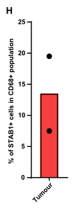
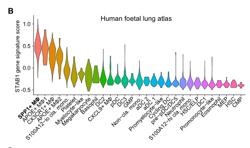
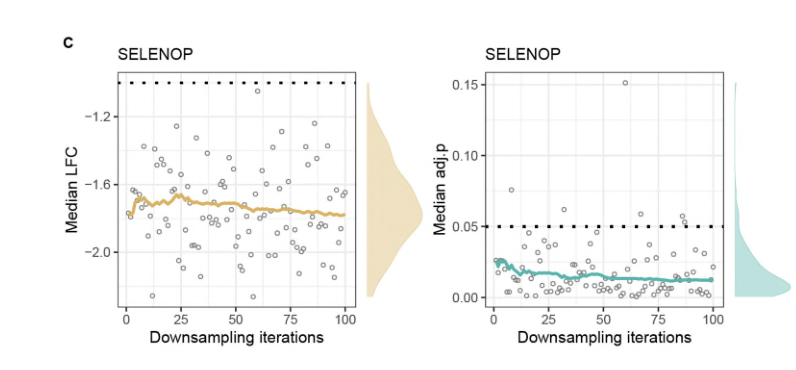

# Single-cell and spatial transcriptomics analysis of non-small cell lung cancer

## Abstract

### 讲解：

肺癌是全球第二大最常见的癌症，也是导致癌症相关死亡的首要原因。肿瘤生态系统中包含多种不同类型的免疫细胞，其中髓系细胞尤其普遍，并且在促进疾病发展方面发挥了重要作用。在我们的研究中，我们利用单细胞和空间转录组学技术对来自25名未经治疗的腺癌和鳞状细胞癌患者的大约90万个细胞进行了分析。

我们注意到，在肿瘤中，抗炎性巨噬细胞与NK细胞/T细胞之间存在反向关系，同时NK细胞的细胞毒性也有所降低。尽管在腺癌和鳞状细胞癌中观察到相似的细胞类型组成，但我们发现各种免疫检查点抑制因子的共表达存在显著差异。

此外，我们揭示了肿瘤中巨噬细胞的转录“重编程”证据，这些细胞向胆固醇输出转变，并采用了一种类似于胎儿的转录特征，这促进了铁的外流。我们的多组学资源提供了肿瘤相关巨噬细胞的高分辨率分子图谱，增强了我们对它们在肿瘤微环境中角色的理解。

*****

### 比喻讲解：

想象一下，肺癌就像一个复杂的城市，这个城市中有各种各样的居民（细胞）。肺癌是这个城市中最常见的建筑之一，也是导致城市衰败的主要原因。这个城市中的居民（免疫细胞）种类繁多，其中一种特别多的居民是髓系细胞，它们就像城市中的工人，在城市的运转中扮演着重要角色。

在我们的研究中，我们就像城市规划师一样，对来自25个未经过治疗的腺癌和鳞状细胞癌患者的90万个居民（细胞）进行了详细的调查。我们发现，在城市中，有一种奇怪的现象：抗炎性的巨噬细胞（相当于城市中的和平使者）和NK细胞/T细胞（相当于城市的保安队伍）之间存在着反向关系，这意味着和平使者越多，保安队伍就越少，而且保安队伍的战斗力也下降了。

尽管在腺癌和鳞状细胞癌这两个不同的城市区域中，我们看到了类似的居民组成，但是我们发现不同区域中的免疫检查点抑制因子的共表达存在显著差异，就好比不同街区的居民有不同的生活习惯和规则。

更有趣的是，我们发现这些巨噬细胞（和平使者）在肿瘤中发生了转录“重编程”，它们就像是换了一种工作模式，从原本的日常工作转向了胆固醇输出，并且采用了一种类似于胎儿的工作方式，这种转变促进了铁的外流。我们的多组学资源就像一幅详细的城市地图，提供了肿瘤相关巨噬细胞的高分辨率分子图谱，帮助我们更好地理解它们在城市（肿瘤微环境）中的角色。

*****

### 问题：

在研究中，科学家们发现了肿瘤中的巨噬细胞发生了什么样的转录变化？这种变化对肿瘤微环境有何影响？

### 答案和讲解：

科学家们在研究中发现，肿瘤中的巨噬细胞发生了转录“重编程”，即这些细胞的基因表达模式发生了显著变化。具体来说，巨噬细胞转向了胆固醇输出，并采用了一种类似于胎儿的转录特征，这种变化还促进了铁的外流。这种转录重编程改变了巨噬细胞在肿瘤中的功能，使它们从传统的免疫角色转变为一种更适合肿瘤环境的状态。

这种变化对肿瘤微环境有重要影响。巨噬细胞在肿瘤微环境中扮演着关键角色，它们的功能转变可以影响肿瘤的生长和免疫逃逸机制。例如，转向胆固醇输出和促进铁的外流可能帮助肿瘤细胞更好地适应并扩散。因此，理解巨噬细胞的这种转录重编程对开发新的癌症治疗策略至关重要。

### 比喻讲解：

就像城市中的和平使者（巨噬细胞）改变了他们的工作模式，从传统的巡逻和维护治安，转变为帮助城市处理废物（胆固醇输出）和输送资源（铁的外流）。这种工作模式的转变使得他们不再主要负责治安，而是更适应于城市当前的需求（肿瘤环境），这可能会让城市中的坏分子（肿瘤细胞）更容易生存和发展。因此，了解和平使者的这种转变对于制定新的城市管理策略（癌症治疗）非常重要。

*****

## Introduction

### 讲解：

肺癌是第二大最常见的癌症，也是全球癌症死亡的首要原因。肺癌的五年生存率在最晚期的患者中约为6%。非小细胞肺癌（NSCLC）是最常见的肺癌类型，占总病例的约85%，其次是小细胞肺癌，占总病例的15%。肺癌是一种复杂的疾病，其中肿瘤微环境起着关键作用，巨噬细胞（Mɸ）在疾病进展中密切参与。

特别是肿瘤相关巨噬细胞（TAMs）可以发挥双重作用：通过抑制免疫反应、促进血管生成和协助组织重塑来促进肿瘤，也可以通过促进炎症和对癌细胞的细胞毒性活动来抑制肿瘤。肺癌与巨噬细胞之间复杂的相互作用，强调了理解它们动态关系的重要性，以开发更有效的治疗策略。

在非小细胞肺癌中，腺癌（LUAD）是最常见的组织学亚型，其次是鳞状细胞癌（LUSC）。对于早期非小细胞肺癌（I期/II期），目前的金标准治疗是肺叶切除术（即解剖性肺叶切除）。而对于不可切除的III期或转移性IV期非小细胞肺癌患者，则采用化疗和新辅助靶向血管内皮生长因子（VEGF）或免疫检查点抑制剂（如PD1、PDL1和CTLA4）相结合的治疗方法。过去十年中，在发现预测生物标志物方面取得的进展，为基于肿瘤组织学和PDL1表达的靶向治疗和免疫治疗提供了新的治疗前景。

许多研究利用单细胞技术探索了非小细胞肺癌中的转录变化，深入研究了肺肿瘤微环境，揭示了与患者预后相关的多种T细胞功能、B细胞在非小细胞肺癌中对抗肿瘤治疗的多样性的重要性、肿瘤浸润的髓系细胞的多种状态，提出它们作为免疫治疗的新靶点，以及组织驻留的中性粒细胞与抗PDL1治疗失败的关联。这些研究还揭示了晚期和转移性肿瘤的肿瘤异质性和细胞变化，以及肿瘤治疗诱导的癌细胞向原始细胞状态的转变。

在许多研究中，每个患者分析的细胞数量有限，并且通常没有系统地收集患者匹配的非肿瘤组织，从而限制了对肿瘤及其周围非肿瘤组织中生物异质性的解析。此外，除了少数例外，腺癌和鳞状细胞癌通常被视为单一实体，这阻碍了对这两种在分子和病理水平上截然不同的癌症类型的特定标志的研究。尽管单细胞RNA测序（scRNA-seq）可以在组织内高分辨率地识别细胞类型及其状态，但它缺乏定位它们空间分布或捕捉局部细胞-细胞相互作用以及介导这些相互作用的配体和受体的能力，因此阻碍了我们全面探索肿瘤微环境和其中复杂细胞-细胞相互作用的能力。

为了克服上述限制，我们结合了来自25名未经治疗的腺癌或鳞状细胞癌患者的近90万个细胞的单细胞RNA测序数据和8名患者的空间转录组学数据，以研究肿瘤和相邻非肿瘤组织中细胞组织的差异。我们进一步研究了巨噬细胞群体及其在肿瘤环境中发生的分子变化，其中一些变化类似于人类胎儿发育过程中观察到的巨噬细胞变化。

*****

### 比喻讲解：

想象一下，肺癌就像一个复杂的城市，这个城市中有不同类型的居民（细胞）。肺癌是这个城市中最常见的建筑之一，也是导致城市衰败的主要原因。这个城市的居民（细胞）中，有两大主要群体：非小细胞肺癌（NSCLC）居民，占了约85%；小细胞肺癌居民，占了15%。

在这个城市中，巨噬细胞（Mɸ）就像城市中的维护工人，他们对城市的状态有着重要影响。肿瘤相关巨噬细胞（TAMs）可以扮演双重角色：一方面，它们通过抑制城市的防御力量（免疫反应）、修建新的道路（促进血管生成）和重建建筑（组织重塑）来帮助坏分子（肿瘤）；另一方面，它们也可以通过引发城市暴动（促进炎症）和直接攻击坏分子（对癌细胞的细胞毒性活动）来保护城市。

在非小细胞肺癌居民中，腺癌（LUAD）是最常见的亚型，就像城市中最常见的建筑风格，其次是鳞状细胞癌（LUSC）。对于早期的城市改造项目（I期/II期），最好的办法是拆除一部分旧建筑（肺叶切除术）。而对于那些无法拆除的严重损坏区域（III期或IV期），我们会使用各种工具和技术（化疗、新辅助靶向VEGF或免疫检查点抑制剂如PD1、PDL1和CTLA4）来处理。

过去十年，随着我们对城市建筑材料和居民特性的了解不断深入，我们开发了新的工具和技术（预测生物标志物），这些都为城市改造（靶向治疗和免疫治疗）提供了新的希望。

许多研究使用单细胞技术（就像是精密的显微镜）来探索城市中各个居民的变化，揭示了不同T细胞（防御队伍）功能与城市未来（患者预后）的关系，B细胞（特定功能的居民）的多样性对抗肿瘤治疗的重要性，肿瘤浸润的髓系细胞（特殊的维护工人）的多种状态，提出它们作为新的目标进行城市管理（免疫治疗），以及中性粒细胞（特定的城市居民）与抗PDL1治疗失败的关联。

然而，很多研究中每个患者（城市）分析的细胞数量有限，并且没有系统地收集与之匹配的非肿瘤组织（周边健康区域），这限制了对城市内不同区域（肿瘤和周边非肿瘤组织）之间差异的理解。此外，腺癌和鳞状细胞癌通常被视为同一种类型，阻碍了对它们独特特征的研究。

为了克服这些限制，我们结合了来自25名未经治疗的腺癌或鳞状细胞癌患者的近90万个细胞的单细胞RNA测序数据和8名患者的空间转录组学数据，就像绘制了一个详细的城市地图，研究肿瘤和相邻非肿瘤组织中居民分布的差异。我们进一步研究了巨噬细胞群体及其在肿瘤环境中的变化，这些变化类似于人类胎儿发育过程中观察到的巨噬细胞变化。

*****

### 问题：

在非小细胞肺癌（NSCLC）的治疗中，为什么研究巨噬细胞（Mɸ）在肿瘤微环境中的角色和变化如此重要？

### 答案和讲解：

在非小细胞肺癌（NSCLC）的治疗中，研究巨噬细胞（Mɸ）在肿瘤微环境中的角色和变化非常重要，因为巨噬细胞在肿瘤进展中扮演着双重角色。肿瘤相关巨噬细胞（TAMs）可以通过以下几种方式促进肿瘤：

1. **抑制免疫反应**：巨噬细胞可以抑制其他免疫细胞的活性，使肿瘤细胞能够逃避免疫系统的攻击。
2. **促进血管生成**：巨噬细胞可以促进新血管的形成，为肿瘤提供营养和氧气，支持其生长。
3. **组织重塑**：巨噬细胞可以重塑周围组织，为肿瘤扩展提供有利环境。

此外，巨噬细胞也可以通过以下几种方式抑制肿瘤：

1. **促进炎症**：通过引发炎症反应，巨噬细胞可以吸引更多的免疫细胞来攻击肿瘤。
2. **直接细胞毒性**：巨噬细胞可以直接攻击和杀死癌细胞。

这种双重角色使得巨噬细胞成为治疗的关键目标，理解它们在肿瘤微环境中的行为和变化可以帮助开发新的治疗策略，增强抗癌疗效。

### 比喻讲解：

想象一下，巨噬细胞（Mɸ）在城市（肿瘤微环境）中扮演着双重角色，就像城市中的维护工人（巨噬细胞）。一方面，他们可以帮助坏分子（肿瘤细胞）通过关闭警报系统（抑制免疫反应）、建造新的秘密通道（促进血管生成）和重建隐藏地点（组织重塑）。另一方面，这些维护工人也可以通过发动暴动（促进炎症）和直接打击坏分子（直接细胞毒性）来保护城市。

了解这些维护工人在不同情况下的行为变化，可以帮助我们制定更有效的城市管理计划（治疗策略），从而更好地保护城市（对抗肿瘤）。

*****

## Results

### Fig.1a

### 结果描述：

图1A显示了研究的总体概况。具体步骤如下：

1. 从切除的肿瘤组织、相邻的非肿瘤组织（背景）和健康捐赠者的肺组织中提取单细胞悬液。
2. 使用CD45+或CD235−富集，并进行单细胞RNA测序（scRNA-seq）。
3. 新鲜、快速冷冻的肿瘤、背景和健康组织的冷冻切片用于10x Visium空间转录组学。

### 图例描述：

图1A概述了研究的流程：

- **左上角**：展示了研究的整体设计和流程，从样本采集到分析的每一步。
- **左下角**：显示了不同患者的切片数量以及样本来源（包括肿瘤、背景和健康组织）的概述。
- **中间**：展示了从切除的肿瘤组织和背景组织中提取的单细胞悬液经过CD45+或CD235−富集后进行单细胞RNA测序（scRNA-seq）。
- **右下角**：展示了通过10x Visium平台对新鲜、快速冷冻的肿瘤、背景和健康组织的冷冻切片进行空间转录组学分析的过程。

### 关键结论:

- 图1A的结果显示了样本的采集、富集和分析流程，强调了从不同来源组织中提取单细胞并进行高通量分析的复杂性。
- 使用了单细胞RNA测序和空间转录组学技术，以全面揭示非小细胞肺癌（NSCLC）患者肿瘤及其相邻非肿瘤组织的细胞组成和空间分布。

### 分析目的：

- 该图例的目的是展示研究的整体设计和流程，说明如何从不同来源的组织样本中提取单细胞悬液，并通过单细胞RNA测序和空间转录组学技术进行高分辨率的细胞组成和空间分布分析。
- 通过展示样本的采集和分析流程，该图例为后续的详细数据分析提供了背景信息，帮助理解研究结果的来源和分析方法的有效性。

*****

### 方法描述：

图1A展示了研究的总体方法流程，包括以下步骤：

1. **样本收集**：从25名未经治疗的腺癌（LUAD）或鳞状细胞癌（LUSC）患者和两名健康的已故捐赠者处收集肺组织切除样本。
2. **组织富集**：通过流式细胞术对CD45+免疫细胞和CD235−非红细胞富集，以分离免疫细胞和其他非免疫细胞群体。
3. **单细胞RNA测序**：对从肿瘤、背景（非肿瘤组织）和健康组织中提取的单细胞悬液进行单细胞RNA测序（scRNA-seq）。
4. **空间转录组学**：使用10x Genomics Visium平台，对8名患者的肿瘤和背景组织切片进行空间转录组学分析，共36个切片。
5. **数据处理和分析**：进行质量控制、标准化和数据分析，包括高变基因选择、降维、批次校正和Leiden聚类分析，以识别和注释不同的细胞类型。

### 比喻讲解：

想象你是一位城市规划师，受委托研究一个复杂的城市（即肺癌患者的肺组织）的不同区域。你的任务是详细分析城市的各个部分，并绘制一张高分辨率的地图。

1. **样本收集**：首先，你从25个城市中的不同区域（腺癌和鳞状细胞癌患者）和两个健康城市（健康捐赠者）中收集了各种建筑（肺组织样本）。
2. **组织富集**：你使用特殊的筛选技术（类似于流式细胞术）将城市中的居民分成不同的群体。例如，CD45+富集的居民代表城市中的警察和消防员（免疫细胞），而CD235−富集的居民则代表普通居民（非红细胞）。
3. **单细胞RNA测序**：然后，你对这些居民进行了详细的访谈（单细胞RNA测序），记录下他们的身份、职责和活动（基因表达数据）。
4. **空间转录组学**：为了更好地了解居民的分布和互动关系，你使用了一种先进的地理定位技术（10x Genomics Visium平台），对城市的不同区域进行了高分辨率的空间分析。
5. **数据处理和分析**：最后，你对所有收集到的信息进行了严格的质量检查和标准化处理。你使用降维和聚类分析技术，将居民分成不同的社区和群体，并标注他们的功能和特点。

通过这些步骤，你最终绘制出了一张详细的城市地图，展示了不同居民的分布和互动关系，从而更好地理解城市的结构和功能。这张地图为你提供了宝贵的信息，帮助你制定更有效的城市管理和发展策略。

*****

### Fig.1b

### 结果描述：

图1B展示了研究中的患者队列概述，包括25名未经治疗的腺癌（LUAD）或鳞状细胞癌（LUSC）患者以及2名健康的已故捐赠者。每个符号代表一个患者，并标示了不同类型的分析（单细胞RNA测序和空间转录组学）在每个患者样本中执行的情况。

### 图例描述：

- **符号**：每个符号代表一个患者。
- **颜色编码**：不同的颜色表示不同类型的肺癌（腺癌、鳞状细胞癌）和健康捐赠者。
- **分析类型**：图中标示了单细胞RNA测序和空间转录组学分析在每个患者样本中进行的情况。

### 关键结论:

- 图1B清晰地展示了研究涉及的患者样本的类型和数量，以及每个样本所进行的具体分析类型。
- 研究共包含25名未经治疗的肺癌患者（13名腺癌患者，8名鳞状细胞癌患者，4名未明确的肺癌患者）和2名健康的已故捐赠者。
- 每个患者样本都进行了单细胞RNA测序分析，并且其中8名患者的样本还进行了空间转录组学分析。

### 分析目的：

- 图1B的目的是展示研究中使用的患者样本的分布和所进行的分析类型，为后续的数据分析提供背景信息。
- 通过展示样本的总体情况，图1B帮助读者理解研究的规模和多样性，以及不同类型分析在患者样本中的应用情况。

*****

### 方法描述：

图1B展示了研究队列的概述。研究涉及从25名未经治疗的肺腺癌（LUAD）、鳞状细胞癌（LUSC）或未确定类型肺癌患者以及两名健康已故捐赠者中收集的肺组织样本。这些样本包括肿瘤组织、匹配的正常非肿瘤组织和健康组织。每个样本经过细胞富集（CD45+和CD235-）后，进行单细胞RNA测序（scRNA-seq）和空间转录组学（使用10x Genomics Visium平台）。

具体步骤如下：

1. **样本收集**：从25名未经治疗的肺腺癌、鳞状细胞癌或未确定类型肺癌患者，以及两名健康已故捐赠者中收集肺组织样本。
2. **样本处理**：从每个患者中收集肿瘤组织和匹配的正常非肿瘤组织，健康捐赠者的样本用于对照。
3. **细胞富集**：使用CD45+富集免疫细胞，使用CD235a富集非免疫细胞，去除红细胞。
4. **单细胞RNA测序**：对富集的单细胞进行RNA测序，分析其基因表达特征。
5. **空间转录组学**：对新鲜、快速冷冻的肿瘤和背景组织切片使用10x Genomics Visium平台进行空间转录组学分析。

### 比喻讲解：

想象一下，你正在组织一个大型音乐会（研究），这次音乐会邀请了25位未经过任何训练的音乐家（未经治疗的肺癌患者）和两位经验丰富的音乐家（健康捐赠者）。你的目标是分析他们的表演风格（基因表达特征）。

1. **样本收集**：首先，你从每位音乐家（患者）那里收集了他们的演奏录音（肿瘤组织样本）和他们平时的练习录音（匹配的正常非肿瘤组织）。同时，你也收集了两位经验丰富的音乐家的录音（健康组织）。

2. **样本处理**：你把每位音乐家的录音分为两部分：一部分是他们的正式演奏（肿瘤组织），另一部分是他们的练习演奏（正常非肿瘤组织）。健康音乐家的录音作为对照。

3. **细胞富集**：你对每个录音进行筛选，找出每位音乐家演奏中最重要的部分。你挑选了所有带有独特音符的片段（CD45+富集免疫细胞），以及那些没有重复音符的片段（CD235a富集非免疫细胞，去除红细胞）。

4. **单细胞RNA测序**：接下来，你对这些精选的片段进行详细分析，记录下每一个音符和节拍的变化（单细胞RNA测序，分析基因表达特征）。

5. **空间转录组学**：最后，你将这些录音分成不同的时间段，分析每个时间段的音符和节拍是如何排列的（使用10x Genomics Visium平台进行空间转录组学分析）。

通过这些步骤，你能够全面了解每位音乐家的演奏风格和特点（基因表达特征和空间分布），从而揭示出他们在音乐会上（肿瘤微环境）如何演奏（细胞行为）以及他们与其他音乐家的互动（细胞间相互作用）。

*****

### Fig.1c

### 结果描述：

图1C展示了来自肿瘤样本和背景（包括正常和健康组织）样本的单细胞RNA测序数据的UMAP投影结果。通过质量控制、标准化、批次校正和Leiden聚类，我们将细胞分为不同的广义细胞类型，并通过UMAP进行可视化。结果显示，来自肿瘤和背景样本的细胞被分别注释为不同的广义细胞类型，包括髓系细胞、自然杀伤（NK）细胞、T细胞、B细胞和非免疫细胞。

### 图例描述：

图1C包含以下内容：

- **UMAP投影图**：展示了肿瘤样本和背景样本的单细胞RNA测序数据。不同颜色代表不同的广义细胞类型。
- **细胞类型标注**：细胞类型包括髓系细胞（单核细胞、巨噬细胞、树突状细胞（DCs）和肥大细胞）、自然杀伤（NK）细胞、T细胞、B细胞和非免疫细胞。

### 关键结论:

- 通过UMAP投影和聚类分析，可以区分并识别出肿瘤样本和背景样本中的多种广义细胞类型。
- 肿瘤和背景样本中存在显著的细胞异质性，不同样本的细胞类型分布和基因表达特征有明显差异。

### 分析目的：

- 该图例的目的是展示通过单细胞RNA测序技术和UMAP投影方法识别和分类肿瘤样本和背景样本中的广义细胞类型。
- 通过图示细胞类型的分布和基因表达特征，为进一步研究肿瘤微环境中的细胞异质性和细胞间相互作用提供基础数据。
- 强调了单细胞RNA测序技术在揭示肿瘤和背景组织中复杂细胞组成方面的强大能力，有助于深入理解肿瘤微环境的动态变化和细胞特征。

*****

### 方法描述：

图1C展示了单细胞RNA测序（scRNA-seq）数据的分析流程，具体步骤如下：

1. **数据质量控制（QC）**：对scRNA-seq数据进行质量控制，以确保分析使用的都是高质量的细胞。最终，共鉴定出895,806个高质量的细胞。
2. **数据标准化和转换**：对数据进行标准化和log1p转换，以减少技术噪音和实现数据的可比性。
3. **高度可变基因选择**：选择高度可变的基因，这些基因在不同细胞类型之间的表达差异更大，有助于区分不同的细胞类型。
4. **降维处理**：采用降维技术（如PCA）将高维数据降到较低维度，方便后续分析。
5. **批次效应校正**：通过批次校正方法（如Harmony或ComBat）消除不同实验批次之间的系统性偏差。
6. **Leiden聚类**：对降维后的数据进行聚类分析（如Leiden算法），将相似的细胞分成不同的簇。
7. **注释和可视化**：根据已知的标记基因对聚类结果进行注释，并使用UMAP（Uniform Manifold Approximation and Projection）技术将高维数据可视化，展示不同细胞类型的分布。

### 比喻讲解：

想象一下，你要整理一个巨大而复杂的图书馆，里面有成千上万本书，每本书都代表一个细胞，而每本书的内容则是这个细胞的基因表达信息。

1. **数据质量控制（QC）**：首先，你要确保所有书都是完整的，没有缺页或损坏。你检查每本书的页数和内容，剔除那些不完整或质量不好的书。最终，你留下了大约895,806本高质量的书。
2. **数据标准化和转换**：接下来，你需要统一这些书的格式，使它们更易于比较。你将所有书的内容按照一定的规则进行重新排版和格式转换。
3. **高度可变基因选择**：在这么多书中，有些书的内容变化特别大，这些书更能代表不同的类别。你选出这些变化最大的书，以便更好地进行分类。
4. **降维处理**：为了更方便地管理和分析这些书，你把每本书的主要内容提取出来，用更少的词语进行总结，就像是为每本书写一个简短的摘要。
5. **批次效应校正**：有些书是从不同的图书馆分批次借来的，所以它们的封面颜色和纸张可能会有所不同。你要把这些不同批次的书统一处理，使它们看起来更一致。
6. **Leiden聚类**：然后，你把这些书按内容相似性进行分类，把内容相似的书放在同一类里，就像是把同一类型的书放在同一个书架上。
7. **注释和可视化**：最后，你根据每类书的特点给它们贴上标签，并用一张地图（UMAP）来展示这些书在图书馆中的分布情况，这样你就可以直观地看到每种类型的书都放在哪里。

通过这些步骤，你成功地把一个巨大而复杂的图书馆整理成了一个有序且易于管理的系统，使你能够更好地理解和研究这些书（细胞）的内容和分类。

*****

### Fig.1d

### 结果描述：

图1D展示了在肿瘤样本中用于广泛细胞类型注释的代表性基因的点图。这些基因在不同细胞类型中的表达水平被可视化，以帮助识别和分类这些细胞类型。

### 图例描述：

图1D是一个点图，展示了在肿瘤样本中用于广泛细胞类型注释的代表性基因。点图中的每个点表示一个基因在特定细胞类型中的表达情况：

- **Y轴**：显示了不同的细胞类型，如单核细胞、巨噬细胞、树突状细胞（DCs）、肥大细胞、自然杀伤细胞（NK cells）、T细胞、B细胞和非免疫细胞。
- **X轴**：展示了用于注释的代表性基因，如LYZ、CD68、CD14、MRC1（巨噬细胞标记），KRT19、EPCAM（上皮细胞标记）等。
- **点的大小**：表示在该细胞类型中表达该基因的细胞百分比。
- **点的颜色**：表示该基因在该细胞类型中的平均表达水平。

### 关键结论：

- 不同细胞类型展示了特定基因的表达模式，有助于识别和注释这些细胞类型。
- 例如，LYZ、CD68、CD14、MRC1等基因在单核细胞和巨噬细胞中高表达，而KRT19和EPCAM基因在上皮细胞中高表达。
- 点图清晰地显示了每个基因在不同细胞类型中的表达差异，支持了细胞类型的准确注释。

### 分析目的：

- 该图例的目的是展示在肿瘤样本中，用于注释不同细胞类型的代表性基因的表达模式。
- 通过展示这些基因在不同细胞类型中的表达情况，图1D为后续的细胞分类和功能研究提供了基础，确保了细胞类型注释的准确性和可靠性。
- 这对于理解肿瘤微环境中的细胞组成及其功能具有重要意义，有助于揭示肿瘤进展的分子机制和潜在治疗靶点。
  

*****

### 方法描述：

图1D的方法包括以下步骤：

1. **细胞分离与标记**：从肺癌患者的肿瘤组织和相邻的非肿瘤组织中提取单细胞悬液，并使用抗CD45和CD235a抗体对免疫细胞和非免疫细胞进行富集和标记。

2. **单细胞RNA测序**：对富集后的细胞进行单细胞RNA测序（scRNA-seq），以获得每个细胞的基因表达谱。

3. **数据处理**：
- **质量控制（QC）**：去除低质量细胞和双重细胞。
- **归一化与log1p转换**：对数据进行归一化和对数转换，以便后续分析。
- **高变基因选择**：选择高变基因进行分析。
- **降维分析**：使用降维技术（如UMAP）将高维数据映射到低维空间，以便可视化。
- **批次效应校正**：使用Leiden聚类算法对数据进行批次效应校正和聚类分析。

4. **细胞注释**：基于基因表达特征，将细胞注释为不同类型的免疫细胞和非免疫细胞，包括单核细胞、巨噬细胞、树突状细胞（DCs）、肥大细胞、自然杀伤（NK）细胞、T细胞、B细胞和非免疫细胞。

5. **细胞类型的可视化**：使用UMAP可视化各类细胞的分布和表达特征。

### 比喻讲解：

想象你正在整理一个大型图书馆，这个图书馆中有很多种类的书籍（细胞），每本书都记录了详细的信息（基因表达谱）。为了更好地理解和管理这个图书馆，你需要对这些书籍进行分类和整理。具体步骤如下：

1. **书籍分离与标记**：你从图书馆的不同区域（肿瘤组织和非肿瘤组织）中收集书籍，并使用标签（抗CD45和CD235a抗体）将书籍分为不同类别（免疫细胞和非免疫细胞）。

2. **单本书籍的内容分析**：对每本书进行详细阅读和记录（单细胞RNA测序），以获取每本书的全部内容（基因表达谱）。

3. **数据处理**：
- **质量控制**：去除损坏的书籍和重复的书籍。
- **归一化与转换**：对数据进行标准化和对数转换，使得数据更易于分析。
- **高变基因选择**：选择最能区分书籍类别的特征（高变基因）进行分析。
- **降维分析**：使用降维技术将复杂的信息简化到一个二维平面上，便于可视化。
- **批次效应校正**：校正不同时间段收集的书籍之间的差异（批次效应），并进行分类（聚类分析）。

1. **书籍注释**：根据书籍的内容特征，将书籍分类为不同类型，包括小说（单核细胞）、历史书（巨噬细胞）、科学书（树突状细胞）等。

2. **书籍类型的可视化**：使用二维平面图（UMAP），展示不同类别书籍的分布和特征，使得你可以直观地看到不同类型书籍在图书馆中的位置和分布。

通过这种方式，你不仅能够整理和分类图书馆中的书籍，还能更好地理解它们之间的关系和分布情况，就像研究人员通过单细胞RNA测序和数据分析来理解肺癌组织中不同细胞类型的分布和功能一样。

*****

### Fig.1e 

### 结果描述：

图1E显示了单细胞RNA测序（scRNA-seq）数据中巨噬细胞和上皮细胞的基因共表达情况。具体结果如下：

- **MYELOID（髓系细胞）基因**：LYZ, CD68, MRC1
- **上皮细胞基因**：EPCAM, KRT19

图中展示了三种细胞类型的基因共表达：
1. **AT2细胞**：约44,399个细胞
2. **CAMLs（癌症相关巨噬细胞样细胞）**：约2,520个细胞
3. **AIMɸ（抗炎性巨噬细胞）**：约16,120个细胞

通过图中的等高线图，可以看到不同细胞类型在表达这些基因时的特征。

### 图例描述：

- **等高线图**：展示了在三种细胞类型（AT2细胞、CAMLs、AIMɸ）中髓系基因（LYZ, CD68, MRC1）和上皮基因（EPCAM, KRT19）的共表达情况。
- **归一化、标度和对数转换的基因表达**：图中显示了经过归一化、标度和对数转换后的基因表达水平。

### 关键结论:

- 图1E显示了不同细胞类型中髓系基因和上皮基因的共表达模式。
- 癌症相关巨噬细胞样细胞（CAMLs）显示了与AT2细胞和抗炎性巨噬细胞（AIMɸ）不同的基因共表达特征，表明这些细胞在肿瘤微环境中的独特角色和功能。

### 分析目的：

- 该图例的目的是通过展示髓系基因和上皮基因在不同细胞类型中的共表达情况，揭示巨噬细胞在肿瘤微环境中的功能多样性。
- 通过比较AT2细胞、癌症相关巨噬细胞样细胞（CAMLs）和抗炎性巨噬细胞（AIMɸ）的基因共表达模式，研究人员能够更好地理解这些细胞在肿瘤进展中的角色，为开发针对性的治疗策略提供数据支持。

*****

### 方法描述：

图1E展示了AT2细胞、CAMLs（癌症相关巨噬细胞样细胞）和AIMɸ（抗炎巨噬细胞）中髓系和上皮基因的共表达情况。具体步骤如下：

1. **基因表达数据的收集和处理**：从单细胞RNA测序数据中提取了特定基因的表达信息。这些基因包括髓系标志基因（如LYZ、CD68、MRC1）和上皮标志基因（如EPCAM）。
2. **细胞类型的识别和分类**：根据基因表达数据，将细胞分为AT2细胞、CAMLs和AIMɸ。
3. **共表达分析**：使用共表达图（Contour Plot）展示这些细胞中髓系和上皮基因的表达情况，显示这些基因在不同细胞类型中的共表达模式。

### 比喻讲解：

想象一下，你在一座城市中进行调查，想了解不同社区（细胞类型）中的居民（基因）是如何分布和共存的。

1. **数据收集和处理**：首先，你从这座城市的每个社区中收集居民的详细信息。这就像你通过单细胞RNA测序技术，获取每个细胞中基因的表达情况。你特别关注两类居民：髓系居民（LYZ、CD68、MRC1）和上皮居民（EPCAM）。

2. **细胞类型识别和分类**：接着，你根据这些居民的分布情况，把城市分为三个主要社区：AT2细胞社区、CAMLs社区和AIMɸ社区。每个社区都有不同的居民组合和特点。

3. **共表达分析**：然后，你制作了一张详细的地图（共表达图），展示了这些居民在不同社区中的分布情况。通过这张地图，你可以看到哪些居民（基因）在同一社区中共存，以及他们是如何分布的。这张地图显示了在AT2细胞、CAMLs和AIMɸ这三个社区中，髓系居民和上皮居民是如何共同存在的。这就像共表达图展示了不同细胞类型中基因的共表达模式，使你能够更清楚地了解不同基因在各种细胞类型中的表达情况。

通过这种方式，你可以详细了解城市（肿瘤微环境）中不同社区（细胞类型）和居民（基因）的复杂关系，从而为制定更有效的城市管理策略（治疗策略）提供信息。

*****

### Fig.1f

### 结果描述：

图1F展示了AT2细胞、CAMLs（癌症相关巨噬细胞样细胞）和AIMɸ（抗炎巨噬细胞）中髓系和上皮基因的标准化、缩放和对数转换的基因表达情况的箱线图。具体显示了以下基因的表达情况：

- 髓系基因：LYZ、APOE、CD68、MRC1
- 上皮基因：EPCAM、KRT8、KRT19

每个基因在不同细胞类型中的表达情况通过箱线图呈现，展示了基因表达的中位数、四分位数范围以及离群值。

### 图例描述：

图1F为箱线图，显示了以下细胞类型中髓系基因和上皮基因的标准化、缩放和对数转换的基因表达水平：

- **左侧**：展示了AT2细胞中LYZ、APOE、CD68、MRC1、EPCAM、KRT8、KRT19基因的表达情况。
- **中间**：展示了CAMLs细胞中上述基因的表达情况。
- **右侧**：展示了AIMɸ细胞中上述基因的表达情况。

每个箱线图显示了基因表达的中位数、四分位数范围和离群值。

### 关键结论：

- 在AT2细胞中，髓系基因的表达较低，而上皮基因（EPCAM、KRT8、KRT19）的表达较高。
- 在CAMLs细胞中，既有髓系基因（LYZ、APOE、CD68、MRC1）也有上皮基因（EPCAM、KRT8、KRT19）的表达，这表明CAMLs具有混合的髓系和上皮特征。
- 在AIMɸ细胞中，髓系基因的表达较高，而上皮基因的表达较低。

### 分析目的：

该图例的目的是展示不同细胞类型中髓系和上皮基因的表达情况，从而揭示各细胞类型的特征。通过比较AT2细胞、CAMLs和AIMɸ的基因表达，研究人员可以理解CAMLs的独特特征，即它们同时具有髓系和上皮特征。这种混合特征可能与CAMLs在肿瘤微环境中的功能有关。通过这种分析，研究人员可以更好地了解这些细胞在肿瘤进展和免疫反应中的角色。

*****

### 方法描述：

图1F显示了巨噬细胞（Mɸ）和上皮细胞（EPCAM，KRT8，KRT19）在肿瘤组织中的共表达情况。为了生成这个图，研究人员进行了以下步骤：

1. **单细胞RNA测序（scRNA-seq）**：
- 从肿瘤和背景组织中提取单细胞悬液。
- 使用CD45+富集免疫细胞，使用CD235a柱去除红细胞。
- 对这些细胞进行单细胞RNA测序，获得每个细胞的基因表达谱。

2. **数据处理**：
- 进行数据质量控制，筛选出高质量的细胞。
- 使用标准化和对数变换方法处理数据。
- 选择高变异基因，进行降维分析（例如PCA，UMAP）。
- 进行批次效应校正和Leiden聚类分析。

3. **细胞类型注释**：
- 根据特定基因的表达情况对细胞进行注释，识别巨噬细胞和上皮细胞。
- 使用代表性基因（如LYZ，APOE，CD68，MRC1代表巨噬细胞，EPCAM，KRT8，KRT19代表上皮细胞）进行注释。

4. **共表达分析**：
- 将巨噬细胞和上皮细胞的基因表达数据进行共表达分析。
- 通过点图（dot plot）展示这些基因在不同细胞群体中的表达情况，使用标准化、对数变换的基因表达值进行展示。
- 生成箱线图（box plot）展示不同细胞群体中这些基因的表达分布情况。

### 比喻讲解：

想象你在一个大型图书馆里，图书馆里有许多书架，每个书架上都有不同类型的书籍。你决定进行一个调查，了解每个书架上哪些书籍是最常借阅的，并将这些书籍与另一个书架上的书籍进行对比。

1. **图书分类和登记**：
- 你将所有书籍按类别进行分类，比如小说、科学、历史等（相当于从肿瘤和背景组织中提取单细胞）。
- 为每本书籍记录借阅次数（相当于进行单细胞RNA测序，获得每个细胞的基因表达谱）。

2. **数据处理**：
- 你过滤掉那些不常借阅的书籍，留下借阅次数较多的书籍（进行数据质量控制，筛选出高质量的细胞）。
- 对借阅数据进行标准化处理，比如将所有借阅次数转换为一个统一的尺度（标准化和对数变换）。
- 选择那些借阅次数变化较大的书籍（选择高变异基因），进行数据降维处理，将书籍按借阅次数聚类（PCA，UMAP降维分析）。

3. **书籍注释**：
- 根据书籍的类别标签（小说、科学等），将书籍进行注释（根据特定基因的表达情况对细胞进行注释）。
- 使用代表性的书籍类型来注释不同的书架（使用代表性基因进行注释）。

4. **共借阅分析**：
- 你将不同书架上借阅次数较多的书籍进行对比，分析哪些书籍在不同书架上有共同的借阅者（共表达分析）。
- 使用点图展示每个书架上常借阅书籍的情况（通过点图展示基因表达情况）。
- 生成箱线图展示每个书架上借阅书籍的分布情况（生成箱线图展示基因表达分布情况）。

通过这样的比喻，你可以更直观地理解图1F中巨噬细胞和上皮细胞基因共表达分析的过程。

*****

### Fig.1 g

### 结果描述：

图1G显示了肿瘤和背景组织中非免疫细胞类型的相对比例。通过对CD235-富集的细胞进行分析，研究人员比较了肿瘤和背景组织中不同非免疫细胞亚群的比例。结果表明，肿瘤组织中某些非免疫细胞类型的比例显著增加或减少。

### 图例描述：

图1G展示了在肿瘤和背景组织中非免疫细胞亚群的相对比例。具体内容包括：

- **箭头指示变化**：箭头表示相对于背景组织，某种细胞类型在肿瘤组织中的增加（↑）或减少（↓）。
- **统计显著性**：使用两侧Wilcoxon秩和检验和Bonferroni校正进行多重比较，显示了具有统计显著性（*P<0.05，**P<0.01，***P<0.001）的变化。
- **细胞类型**：包括成纤维细胞、淋巴内皮细胞（LECs）、II型肺泡细胞（AT2细胞）、下调上皮标志物的非典型上皮细胞、上调髓系标志物的转变上皮细胞以及肿瘤组织中的增殖上皮细胞。

### 关键结论:

- 在肿瘤组织中，成纤维细胞的比例显著增加，而淋巴内皮细胞的比例显著减少。
- 肿瘤组织中的上皮细胞显示出更高的多样性，包括II型肺泡细胞、下调上皮标志物的非典型上皮细胞、上调髓系标志物的转变上皮细胞以及增殖上皮细胞。
- 这些结果表明，肿瘤组织中的上皮细胞可能是突变肿瘤细胞和非突变正常细胞的混合体，暗示肿瘤的恶性转化导致了细胞状态的进一步多样化。

### 分析目的：

- 图1G的目的是展示肿瘤和背景组织中非免疫细胞类型的相对比例变化，揭示不同细胞类型在肿瘤微环境中的异质性。
- 通过比较肿瘤和背景组织中非免疫细胞亚群的比例变化，研究人员旨在理解肿瘤微环境中的细胞动态及其在肿瘤进展中的潜在作用。

*****

### 方法描述：

图1G的主要方法步骤如下：

1. **数据质量控制（QC）**：对单细胞RNA测序数据进行质量控制，筛选出高质量的细胞。
2. **数据标准化和转换**：对筛选出的数据进行标准化和log1p转换，以确保数据在后续分析中的可比性。
3. **高变异基因选择**：选择高变异基因进行进一步分析，以减少计算复杂性和噪声干扰。
4. **降维和批处理校正**：通过降维技术（如PCA、t-SNE或UMAP）对数据进行降维处理，并进行批处理校正，以减少技术噪声和批次效应。
5. **聚类分析**：使用Leiden聚类算法对细胞进行聚类，以识别不同的细胞类型和状态。
6. **细胞类型注释**：根据特征基因的表达模式对每个聚类进行细胞类型注释。
7. **细胞类型可视化**：使用UMAP等可视化技术将不同细胞类型和状态在二维空间中展示出来。
8. **免疫和非免疫细胞成分分析**：比较肿瘤组织和背景组织中免疫和非免疫细胞的相对比例，分析它们在不同组织中的分布差异。

### 比喻讲解：

想象一下，我们正在进行一次大型的城市人口调查，以了解城市中不同社区的居民构成和分布。我们使用了一种特殊的技术（单细胞RNA测序）来对城市中的每个人进行详细的身份识别。

1. **质量控制**：首先，我们确保我们调查的数据是可靠的，就像检查居民身份证的真实性，筛选出伪造的或不完整的身份证数据。
2. **数据标准化和转换**：然后，我们将所有居民的身份信息标准化，以便我们可以公平地比较每个人的信息。这就像将不同格式的身份证信息转换成统一的格式。
3. **高变异基因选择**：接着，我们选择了一些最具代表性的居民信息（高变异基因）进行进一步分析，就像从庞大的人口数据中筛选出一些关键特征。
4. **降维和批处理校正**：我们使用一种方法（降维技术）来简化数据，使之更易于理解和分析。同时，我们还进行了一些数据校正，去除可能的噪声和偏差，这类似于纠正不同调查员在数据收集过程中的误差。
5. **聚类分析**：然后，我们对居民进行分组（聚类），识别出不同的社区和人群类型。这就像根据居民的职业、年龄和兴趣等特征，将他们分成不同的社区。
6. **细胞类型注释**：根据每个组的特征，我们给每个社区贴上标签，标明这是医生社区、教师社区还是学生社区等。
7. **细胞类型可视化**：我们使用地图（UMAP）将这些社区在城市地图上展示出来，使我们可以清楚地看到每个社区的分布情况。
8. **免疫和非免疫细胞成分分析**：最后，我们比较了不同社区（肿瘤组织和背景组织）中各类居民（细胞）的相对比例，分析它们在不同区域中的分布差异。这就像比较城市中心和郊区居民的职业构成，了解不同区域的社会经济状况。

*****

### Fig.1h

### 结果描述：

图1H显示了肿瘤组织和背景组织中各种免疫细胞类型的相对比例。具体结果如下：

- **单细胞RNA测序数据**经过质量控制后，分析了来自肿瘤和背景组织的免疫细胞的相对比例。
- **肿瘤组织中**：
- B细胞和树突状细胞（DCs）的比例显著增加。
- 单核细胞和未成熟髓系细胞的比例显著减少。
- 自然杀伤细胞（NK细胞）和淋巴内皮细胞（LECs）的比例显著减少。
- **背景组织中**：
- 调节性T细胞（Tregs）的比例增加。
- 疲劳的细胞毒性T细胞和γδ T细胞的比例减少。
- **对比分析**显示了肿瘤组织和背景组织之间免疫细胞类型的显著差异。

### 图例描述：

图1H展示了肿瘤和背景组织中免疫细胞类型的相对比例。具体说明如下：

- **左图**：展示了免疫细胞在肿瘤和背景组织中的总体相对比例。箭头指示在肿瘤组织与背景组织之间的增加（↑）或减少（↓）。用两侧Wilcoxon秩和检验和Bonferroni校正进行多重比较，标记了显著性水平（*P<0.05, **P<0.01, ***P<0.001）。
- **右图**：进一步细分了不同免疫细胞类型的相对比例，包括NK细胞、树突状细胞（DCs）、B细胞、T细胞和巨噬细胞（Mɸ）。同样使用箭头和显著性标记来展示肿瘤组织与背景组织之间的差异。

### 关键结论:

- 肿瘤组织中B细胞和树突状细胞的比例显著增加，而单核细胞和未成熟髓系细胞的比例显著减少。
- 调节性T细胞在背景组织中的比例增加，而疲劳的细胞毒性T细胞和γδ T细胞在背景组织中的比例减少。
- 这些结果表明肿瘤微环境中免疫细胞的组成发生了显著变化，反映了肿瘤发展过程中免疫逃逸和免疫调节的机制。

### 分析目的：

- 该图例的目的是比较肿瘤组织和背景组织中免疫细胞的相对比例，揭示肿瘤微环境中免疫细胞构成的差异。
- 通过分析这些差异，研究人员可以更好地理解肿瘤如何影响免疫系统，以及不同免疫细胞在肿瘤进展中的角色。
- 这些信息对于开发针对肿瘤微环境的免疫治疗策略具有重要意义。

*****

### 方法描述：

图1H的方法包括以下步骤：

1. **样本采集和富集**：从非小细胞肺癌（NSCLC）患者的肿瘤和背景组织中收集样本。使用CD235-标记对样本进行富集，以分离免疫细胞。

2. **单细胞RNA测序（scRNA-seq）**：对富集的免疫细胞进行单细胞RNA测序，生成高质量的基因表达数据。

3. **数据处理和质量控制**：对scRNA-seq数据进行质量控制，去除低质量细胞和可能的双重细胞。对基因表达数据进行归一化和log1p转换。

4. **高变基因选择和降维分析**：选择高变基因进行分析，并使用降维技术（如UMAP）进行数据可视化。

5. **细胞聚类和注释**：使用Leiden聚类算法将细胞聚类成不同的群体，并根据基因表达特征对每个群体进行注释，识别出不同类型的免疫细胞（如NK细胞、DC细胞、B细胞、T细胞和巨噬细胞）。

6. **细胞比例计算和统计分析**：计算肿瘤和背景组织中每种免疫细胞类型的相对比例，并进行统计分析，以比较肿瘤和背景组织中免疫细胞群体的差异。

### 比喻讲解：

想象一下，你是一个城市的市长，想要了解城市中不同居民的分布情况，以便制定更好的城市管理政策。为此，你决定进行一次详细的人口普查。

1. **样本采集和富集**：首先，你派遣工作人员到城市的不同区域（肿瘤和背景组织）收集样本。你使用特定的标记（CD235-）对样本进行筛选，确保你只收集到某些特定类型的居民（免疫细胞）。

2. **单细胞RNA测序（scRNA-seq）**：接下来，你对收集到的居民进行详细调查（单细胞RNA测序），记录他们的特征和行为（基因表达数据）。

3. **数据处理和质量控制**：你对调查数据进行整理和检查，去除那些不完整或不可靠的记录（低质量细胞和双重细胞），并对数据进行标准化处理（归一化和log1p转换）。

4. **高变基因选择和降维分析**：为了更好地分析数据，你选择了那些最具代表性的特征（高变基因），并使用特殊工具（UMAP）将数据简化为易于理解的形式。

5. **细胞聚类和注释**：你将居民分成不同的群体（细胞聚类），并根据他们的特征（基因表达特征）对每个群体进行标注（注释），识别出城市中的不同居民类型（如NK细胞、DC细胞、B细胞、T细胞和巨噬细胞）。

6. **细胞比例计算和统计分析**：最后，你计算出每个区域中不同居民类型的比例，并进行统计分析，比较城市不同区域中居民分布的差异。这些信息将帮助你更好地了解城市的人口结构，从而制定更加有效的管理政策。

*****
### Fig.1i

### 结果描述：

图1I展示了在肿瘤和背景组织中不同免疫细胞亚群的相对比例，包括NK细胞、DC细胞、B细胞、T细胞和巨噬细胞。具体发现如下：

- 肿瘤样本中NK细胞的比例显著降低，而背景组织中NK细胞的比例相对较高。
- DC细胞在肿瘤样本中显示出增加的趋势，相较于背景组织。
- B细胞在肿瘤和背景组织中的比例没有显著变化。
- 在肿瘤样本中，T细胞（尤其是调节性T细胞，Tregs）的比例增加，而耗竭的细胞毒性T细胞的比例减少。
- 巨噬细胞（特别是抗炎性巨噬细胞，AIMɸ）的比例在肿瘤样本中显著增加，同时在肿瘤样本中发现了一个循环抗炎性巨噬细胞亚群。

### 图例描述：

图1I显示了通过CD235-富集样本中不同免疫细胞亚群的相对比例变化，具体如下：

- **柱状图**：展示了NK细胞、DC细胞、B细胞、T细胞和巨噬细胞在肿瘤和背景组织中的相对比例。每个细胞类型的比例用箭头表示增加（↑）或减少（↓），通过两侧Wilcoxon秩和检验和Bonferroni多重比较校正来确定统计显著性。显著性水平标记为*P<0.05, **P<0.01, ***P<0.001。

### 关键结论:

- 肿瘤样本中，NK细胞比例降低，显示出其细胞毒性功能受到抑制。
- 调节性T细胞在肿瘤中富集，可能抑制肿瘤免疫监视。
- 巨噬细胞在肿瘤样本中表现出显著的抗炎性特征，这可能与其在肿瘤微环境中的免疫抑制功能相关。
- 巨噬细胞和T细胞/NK细胞比例的变化表明巨噬细胞在抑制细胞毒性细胞浸润方面发挥重要作用。

### 分析目的：

- 该图例旨在展示肿瘤和背景组织中免疫细胞群体的组成和比例变化。
- 通过比较这些变化，可以揭示肿瘤微环境中免疫细胞的动态特征和相互作用，帮助理解不同细胞类型在肿瘤进展中的角色，为开发新的免疫治疗策略提供重要线索。

*****

### 方法描述：

图1I展示了在肿瘤和背景组织中，使用单细胞RNA测序（scRNA-seq）数据进行细胞类型和亚型的相对比例分析。具体步骤如下：

1. **数据处理**：从肿瘤和背景组织中提取单细胞并进行RNA测序。使用质量控制（QC）步骤确保获得高质量的数据。
2. **数据标准化和转换**：对数据进行标准化和log1p转换，以减少技术噪音。
3. **高变基因选择和降维**：选择高变基因，并使用降维技术（如PCA）减少数据的复杂性。
4. **批处理校正和聚类**：使用Leiden聚类算法对数据进行聚类，并进行批处理校正，以消除不同样本之间的技术偏差。
5. **细胞类型注释**：根据特定基因标记，对聚类结果中的细胞进行注释，识别出各种免疫细胞（如NK细胞、DC细胞、B细胞、T细胞和巨噬细胞）和非免疫细胞。
6. **比例计算**：计算不同细胞类型在肿瘤和背景组织中的相对比例，并通过统计测试比较两者之间的差异。

### 比喻讲解：

想象你是一个城市规划师，想要了解一个城市（肿瘤）和其郊区（背景组织）中的居民构成。你决定通过以下步骤进行分析：

1. **数据处理**：首先，你在城市和郊区的不同街区（组织样本）中，随机挑选了很多居民（单细胞）进行采访（RNA测序）。但你要确保这些居民的信息是可靠的（质量控制）。
2. **数据标准化和转换**：接下来，你将所有居民的信息（基因表达数据）进行标准化和处理，使其在一个统一的标准下便于分析（标准化和log1p转换）。
3. **高变基因选择和降维**：你挑选了一些最具代表性的居民（高变基因），并通过一些方法（降维技术）将信息简化，使其更易理解。
4. **批处理校正和聚类**：为了确保不同街区之间的信息是一致的，你对信息进行了校正（批处理校正），然后将居民分成不同的群体（聚类）。
5. **细胞类型注释**：根据居民的职业和兴趣（特定基因标记），你将他们分成不同的类别（细胞类型注释），比如保安（NK细胞）、老师（DC细胞）、学生（B细胞）、公务员（T细胞）和工人（巨噬细胞）。
6. **比例计算**：最后，你计算每个群体在城市和郊区中的比例，并通过统计分析比较两者之间的差异，看看哪里工人更多，哪里学生更多（比例计算和比较）。

这样，通过一系列的采访和分析，你得到了一个关于城市和郊区居民构成的详细图景，这帮助你更好地理解了这两个区域的特征和差异。

*****

### Figure 1 重要结论总结

#### Fig. 1A - Study Overview
- 展示了研究的总体设计和流程，包括从不同来源（肿瘤、背景和健康组织）提取单细胞悬液，并进行单细胞RNA测序（scRNA-seq）和10x Visium空间转录组学分析。

#### Fig. 1B - Cohort Overview
- 展示了研究队列的概况，符号表示个体患者和执行的分析类型。

#### Fig. 1C - UMAP Projection
- 通过UMAP投影展示了肿瘤和背景/健康数据集的细胞类型分布，揭示了不同细胞类型在肿瘤和背景组织中的分布差异。

#### Fig. 1D - Dotplot of Representative Genes
- 点图显示了用于广泛细胞类型注释的代表性基因在肿瘤样本中的表达，帮助识别不同细胞类型。

#### Fig. 1E - Contour Plot of Co-expression
- 等高线图显示了巨噬细胞（LYZ、CD68、MRC1）和上皮细胞（EPCAM）的基因共表达情况，帮助识别癌症相关的巨噬细胞样细胞（CAMLs）。

#### Fig. 1F - Boxplot of Gene Expression
- 箱线图展示了巨噬细胞和上皮细胞基因在不同细胞类型（AT2细胞、CAMLs和AIMɸ）中的表达，揭示了它们在肿瘤中的差异。

#### Fig. 1G - Proportion of Non-immune Cell Subsets
- 相对比例图展示了肿瘤和背景组织中非免疫细胞亚群的相对比例，发现肿瘤中纤维细胞增加，淋巴内皮细胞减少。

#### Fig. 1H - Proportion of Immune Cells
- 相对比例图展示了肿瘤和背景组织中免疫细胞亚群的相对比例，发现肿瘤中单核细胞和未成熟髓系细胞减少，而树突细胞和B细胞增加。

#### Fig. 1I - Proportion of Immune Cell Subsets
- 相对比例图展示了肿瘤和背景组织中NK细胞、DC细胞、B细胞、T细胞和巨噬细胞亚群的相对比例，发现肿瘤中NK细胞的细胞毒性降低，调节性T细胞（Tregs）积累，抗炎性巨噬细胞（AIMɸ）增加。

### 总结：

1. **研究设计和样本处理**：研究从不同来源的组织中提取单细胞，并通过单细胞RNA测序和空间转录组学进行详细分析。
2. **细胞类型分布**：肿瘤和背景组织中细胞类型的分布存在显著差异，尤其是巨噬细胞和上皮细胞的基因表达。
3. **细胞比例变化**：肿瘤组织中某些细胞类型（如纤维细胞、树突细胞和B细胞）增加，而其他类型（如单核细胞和未成熟髓系细胞）减少。
4. **免疫细胞功能变化**：肿瘤中NK细胞的细胞毒性降低，调节性T细胞积累，抗炎性巨噬细胞增加，显示出肿瘤微环境中复杂的免疫调节。

这些结论为理解非小细胞肺癌（NSCLC）中的细胞组成和免疫调节提供了重要的见解，有助于开发新的治疗策略。

*****

### Fig.2a

### 结果描述：

图2A展示了免疫细胞类型在肿瘤和背景组织中的相对细胞类型丰度之间的Pearson相关性热图。具体结果如下：

- 热图中的颜色表示Pearson相关性值，颜色越深表示相关性越强。
- 每个单元格的颜色代表特定免疫细胞类型在肿瘤和背景组织中的相对丰度之间的Pearson相关性。
- 星号表示两侧Pearson积矩相关系数上的显著性水平（*P<0.05，**P<0.01，***P<0.001）。

### 图例描述：

图2A展示了免疫细胞类型在肿瘤和背景组织中的相对细胞类型丰度之间的Pearson相关性热图。具体内容包括：

- 横轴和纵轴分别表示不同的免疫细胞类型。
- 颜色条表示相关性的大小和方向（正相关或负相关）。
- 星号表示相关性显著性水平。

### 关键结论:

- 图2A揭示了不同免疫细胞类型在肿瘤和背景组织中的相关性模式。
- 特定免疫细胞类型在肿瘤和背景组织中的丰度之间存在显著相关性，表明这些细胞类型在不同环境中的行为存在关联。

### 分析目的：

- 图2A的目的是评估和比较免疫细胞类型在肿瘤和背景组织中的相对丰度，并确定它们之间的相关性。
- 通过分析这些相关性，研究人员可以更好地理解免疫细胞在肿瘤微环境中的动态行为及其相互作用，从而为开发新的免疫治疗策略提供基础。

*****

### 方法描述：

图2A展示了不同免疫细胞类型的相对细胞类型丰度之间的Pearson相关性。这些步骤如下：

1. **数据收集和预处理**：从NSCLC患者的肿瘤和背景组织样本中提取单细胞RNA测序数据，经过质量控制、标准化和降维处理。
2. **细胞类型注释**：根据基因表达谱，将细胞分类为不同的免疫细胞类型（例如，NK细胞、T细胞等）。
3. **计算Pearson相关性**：使用Pearson相关性系数计算不同免疫细胞类型之间的相对丰度相关性。
4. **绘制热图**：根据Pearson相关性系数绘制热图，颜色表示相关性值，星号表示相关性的显著性水平。

### 比喻讲解：

想象一下，我们要了解一个大城市（肿瘤）中各种职业（免疫细胞）的分布情况，并且想知道这些职业之间的关系有多紧密（相关性）。

1. **数据收集和预处理**：首先，我们通过调查（单细胞RNA测序）收集了大量关于城市居民的信息（细胞数据）。为了确保数据的准确性，我们进行了一些数据清理（质量控制）和标准化处理。

2. **细胞类型注释**：接下来，我们根据居民的职业特征（基因表达谱），将他们分成不同的职业类别（例如，NK细胞、T细胞等）。

3. **计算Pearson相关性**：然后，我们计算每个职业类别在城市不同区域的分布情况（相对丰度），并使用Pearson相关性系数来确定这些职业之间的关系有多紧密。例如，如果在某个区域，工程师（NK细胞）和医生（T细胞）的数量变化趋势非常相似，那么它们的相关性系数就会很高。

4. **绘制热图**：最后，我们将这些职业之间的关系用一个色彩斑斓的地图（热图）展示出来。地图上的颜色表示职业之间关系的紧密程度（相关性值），星号表示这些关系是否显著（显著性水平）。

通过这种方法，我们可以更好地理解城市（肿瘤）中各种职业（免疫细胞）的分布和它们之间的关系，从而有助于我们制定更好的城市规划（治疗策略）。

*****

### Fig.2b

### 结果描述：

图2B展示了LUAD（肺腺癌）和LUSC（肺鳞状细胞癌）中不同细胞类型之间的配体-受体（L-R）相互作用的数量。热图中每个细胞类型对之间的交互数量以颜色表示，颜色越深表示交互数量越多。图中左侧是LUAD数据集的结果，右侧是LUSC数据集的结果。细胞类型通过层次聚类方法按照欧几里得距离进行聚类。

### 图例描述：

- **左侧热图**：展示了LUAD中不同细胞类型之间的配体-受体相互作用数量。颜色从浅到深，表示交互数量从少到多。
- **右侧热图**：展示了LUSC中不同细胞类型之间的配体-受体相互作用数量，颜色同样从浅到深表示交互数量从少到多。
- **行列聚类**：使用完全链接法对行和列进行层次聚类，根据欧几里得距离将相似的细胞类型进行聚类。
- **星号标注**：表示双侧Pearson乘积-矩相关系数显著性水平。

### 关键结论:

1. **细胞间相互作用的差异**：LUAD和LUSC在细胞间相互作用的数量上存在显著差异，尽管它们的细胞组成相似。
2. **主要相互作用细胞类型**：在LUAD和LUSC中，非免疫细胞、抗炎巨噬细胞（AIMɸ）和T细胞之间的相互作用数量最多，但具体的相互作用网络有所不同。
3. **配体-受体相互作用的特异性**：不同肿瘤类型中，有些配体-受体相互作用是特异性的，例如某些相互作用仅在LUAD中出现，而另一些仅在LUSC中出现。

### 分析目的：

图2B的目的是通过比较LUAD和LUSC中细胞类型之间的配体-受体相互作用网络，揭示两种肿瘤类型在细胞间通讯上的差异。这有助于理解为什么尽管两种癌症在细胞组成上相似，但它们在临床表现和预后上存在差异。通过揭示这些差异，研究人员可以识别出新的治疗靶点，并为不同类型肺癌的个性化治疗提供依据。

*****

### 方法描述：

图2B显示了LUAD和LUSC肿瘤微环境中细胞间相互作用网络的比较。具体方法如下：

1. **数据收集**：从LUAD和LUSC患者的样本中收集单细胞RNA测序（scRNA-seq）数据。
2. **细胞类型标注**：使用scRNA-seq数据对细胞类型进行注释，识别不同的免疫和非免疫细胞类型。
3. **细胞间相互作用推断**：利用CellPhoneDB工具，根据细胞类型间的基因共表达，推断细胞-细胞之间的配体-受体（L-R）相互作用。
4. **网络构建**：构建LUAD和LUSC中细胞类型间的L-R相互作用网络，统计每种细胞类型之间的L-R对的数量。
5. **热图展示**：使用热图展示细胞类型间的L-R相互作用数量，比较LUAD和LUSC中不同细胞类型间的相互作用网络。

### 比喻讲解：

想象你正在组织一个大型社交活动，邀请了来自两个不同社区的居民：一个社区叫做LUAD，另一个社区叫做LUSC。你想了解这两个社区的居民在活动中的互动方式。

1. **数据收集**：首先，你记录了每个参加活动的居民的信息，包括他们的身份（细胞类型）和他们所说的每一句话（基因表达数据）。
2. **居民身份标注**：接着，你根据他们的谈话内容（scRNA-seq数据）来确定每个居民的身份，例如有些人是警察（免疫细胞），有些人是医生（非免疫细胞）。
3. **互动推断**：然后，你使用一个特别的分析工具CellPhoneDB，就像是一个社交关系分析器，它能够根据居民之间的对话频率和内容来推断谁和谁在互动（配体-受体相互作用）。
4. **网络构建**：你构建了两个社交网络图，一个是LUAD社区的居民互动网络，另一个是LUSC社区的居民互动网络。你统计了每个网络中居民之间互动的频率和类型。
5. **热图展示**：最后，你用热图展示了两个社区居民之间互动的频率，颜色越深表示互动越频繁。通过比较这两个热图，你可以看到LUAD和LUSC社区居民之间的互动模式有什么不同。

这种方法帮助我们理解LUAD和LUSC这两个社区（肿瘤微环境）中居民（细胞）之间的复杂互动关系，揭示不同细胞类型在不同肿瘤环境中的作用和相互影响。

*****

### Fig.2c

### 结果描述：

图2C展示了LUAD和LUSC肿瘤类型中特定免疫检查点抑制剂（ICI）基因及其对应细胞类型的相互作用网络。具体结果如下：

- 识别了LUAD和LUSC中独特的L-R相互作用。
- LUAD中特定的L-R相互作用包括LGALS9-HAVCR2（TIM3）、NECTIN2-CD226（DNAM1）和NECTIN2/NECTIN3-TIGIT。
- LUSC中特定的L-R相互作用包括CD96-NECTIN1。
- 两种肿瘤类型中都发现了CD80/CD86-CTLA4和HLA-F-LILRB1/2的相互作用。
- PD1-PDL1相互作用在两个肿瘤亚型中均未显著检测到。

### 图例描述：

- 图2C是一个桑基图（Sankey diagram），展示了LUAD和LUSC中免疫检查点抑制剂基因的特定相互作用网络。
- 线条颜色表示相互作用的存在：橙色表示仅在LUAD中，绿色表示仅在LUSC中，蓝色表示在两种肿瘤类型中均存在。
- 右侧的点图（dot plot）显示了ICI基因在特定细胞类型中的表达情况。点的大小表示细胞群体中表达该基因的细胞比例，颜色表示基因的平均表达水平。

### 关键结论:

- LUAD和LUSC在免疫检查点抑制剂相互作用网络中存在显著差异。
- LUAD中检测到更多的独特L-R相互作用，而LUSC中仅发现了少数特异性相互作用。
- CD80/CD86-CTLA4和HLA-F-LILRB1/2在两种肿瘤类型中均存在，表明这些相互作用可能在不同的NSCLC亚型中都具有重要作用。
- PD1-PDL1相互作用未显著检测到，提示在这些肿瘤类型中可能存在其他更重要的ICI相互作用。

### 分析目的：

- 该图例的目的是比较LUAD和LUSC中免疫检查点抑制剂的基因相互作用网络，以揭示不同肿瘤亚型中的特异性相互作用。
- 通过识别LUAD和LUSC中特定的L-R相互作用，可以为不同NSCLC亚型的个性化免疫治疗策略提供依据。
- 该图例还旨在突出不同肿瘤亚型中潜在的治疗靶点，从而推动新的免疫治疗研究。

*****

### 方法描述：

Fig. 2C展示了通过CellPhoneDB识别并展示不同肿瘤类型（LUAD和LUSC）中细胞-细胞相互作用网络的过程。具体步骤如下：

1. **单细胞RNA测序数据准备**：从LUAD和LUSC患者中提取单细胞悬液，并进行单细胞RNA测序（scRNA-seq），以获取每个细胞的基因表达谱。
2. **细胞类型注释和分析**：利用单细胞RNA测序数据，通过细胞类型标注和聚类分析，确定每个细胞的类型及其基因表达特征。
3. **CellPhoneDB分析**：使用CellPhoneDB工具，根据基因表达数据推断细胞-细胞之间的配体-受体（L-R）相互作用。CellPhoneDB通过统计学方法识别不同细胞类型之间显著的配体-受体对。
4. **数据可视化**：将显著的细胞-细胞相互作用对通过Sankey图进行可视化展示，以直观显示LUAD和LUSC中不同细胞类型之间的相互作用及其差异。

### 比喻讲解：

想象一下，你是一位城市规划师，负责了解一个城市中居民之间的互动方式。这个城市分为两个区域：LUAD区和LUSC区。你想要了解这两个区域中的居民（细胞）是如何通过电话（基因）相互交流的。以下是实现这个目标的过程：

1. **数据收集**：首先，你从LUAD区和LUSC区的居民那里收集了他们的电话记录（单细胞RNA测序数据），每个居民都有自己独特的通话记录（基因表达谱）。
2. **居民分类**：然后，你根据电话记录分析，将居民分为不同的群体（细胞类型），比如商人、教师、学生等（巨噬细胞、T细胞、B细胞等）。
3. **互动分析**：接下来，你使用一个强大的分析工具——CellPhoneDB，就像一个高科技的电话交换机，它可以根据电话记录推断出哪些居民（细胞）之间有显著的通话（配体-受体相互作用）。它通过分析每个居民的通话频率和模式，找到那些重要的互动。
4. **结果展示**：最后，你使用Sankey图来展示这些互动，就像在城市地图上用彩色箭头标注出居民之间的通话路径。这些箭头可以告诉你LUAD区和LUSC区的居民是如何交流的，以及这些交流有什么不同。

通过这种方式，你能够清楚地看到不同区域中的居民（细胞）之间的互动模式，了解他们如何通过电话（基因）进行交流。这有助于你更好地理解城市（肿瘤微环境）的运作，并制定更有效的管理和发展策略（治疗策略）。

*****

### Fig.2d

### 结果描述：

Fig. 2D展示了LUAD（肺腺癌）和LUSC（肺鳞状细胞癌）中不同免疫检查点抑制剂（ICIs）基因的表达情况，以及这些基因在不同细胞类型中的表达水平。图中使用了点图（dot plot）来展示这些数据。点的大小代表基因在特定细胞群体中表达的百分比，而点的颜色代表基因的平均表达水平（经标准化和对数转换）。

### 图例描述：

图2D的图例描述了在LUAD和LUSC中免疫检查点抑制剂基因（如TIM3、DNAM1、TIGIT、CD96、CTLA4、LILRB1/2等）在不同细胞类型中的表达情况。图中的点图分为两部分：左侧是LUAD中的表达情况，右侧是LUSC中的表达情况。

- **X轴**：不同的细胞类型，包括非免疫细胞和免疫细胞（如T细胞、B细胞、巨噬细胞等）。
- **Y轴**：不同的免疫检查点抑制剂基因（如TIM3、DNAM1、TIGIT、CD96、CTLA4、LILRB1/2等）。
- **点的大小**：表示基因在特定细胞类型中表达的百分比。
- **点的颜色**：表示基因的平均表达水平（经标准化和对数转换）。

### 关键结论:

- 在LUAD和LUSC中，免疫检查点抑制剂基因的表达存在显著差异。例如，LGALS9-HAVCR2 (TIM3), NECTIN2-CD226 (DNAM1) 和 NECTIN2/NECTIN3-TIGIT 在LUAD中频繁出现，而CD96-NECTIN1 在LUSC中更为常见。
- CD80/CD86-CTLA4 和 HLAF-LILRB1/2 在两种肿瘤亚型中均有发现，说明它们在不同类型的肺癌中可能具有共同的作用。
- PD1-PDL1 交互作用在任何一个肿瘤亚型中均未显著出现，表明在LUAD和LUSC中可能有其他ICIs是更有效的治疗靶点。

### 分析目的：

- 图2D的目的在于展示LUAD和LUSC中免疫检查点抑制剂基因的表达模式和分布，以揭示不同肿瘤亚型中细胞-细胞相互作用的潜在差异。
- 通过比较这些基因在不同细胞类型中的表达，可以识别出特定的免疫检查点抑制剂，这些基因可能作为新的治疗靶点，用于开发更有效的免疫治疗策略。
- 这种比较分析有助于理解LUAD和LUSC在分子和细胞层面的差异，从而为个性化治疗方案提供依据。

*****

### 方法描述：

Fig.2d采用了单细胞RNA测序（scRNA-seq）和CellPhoneDB软件来分析非小细胞肺癌（NSCLC）中不同细胞类型之间的配体-受体（L-R）相互作用。具体步骤如下：

1. **单细胞RNA测序数据的获取**：从25名未经治疗的肺腺癌（LUAD）或鳞状细胞癌（LUSC）患者中提取肿瘤和背景组织的单细胞悬液，进行scRNA-seq。
2. **数据预处理**：对获取的scRNA-seq数据进行质量控制、标准化和批次校正。
3. **细胞类型注释**：使用特定的基因表达模式对细胞进行注释，识别出各种免疫细胞和非免疫细胞类型。
4. **配体-受体分析**：使用CellPhoneDB软件分析细胞之间的L-R相互作用。CellPhoneDB根据scRNA-seq数据中不同细胞类型的基因共表达情况，预测可能的配体-受体对。
5. **结果可视化**：通过点图展示在不同肿瘤类型中，特定免疫检查点抑制剂（ICIs）相关的基因及其对应细胞类型的表达情况。点的大小代表基因在该细胞类型中表达的百分比，颜色表示基因的平均表达水平。

### 比喻讲解：

想象一个大型音乐节，每个乐队（细胞类型）都有自己的曲目（基因表达）。不同的乐队通过对讲机（配体-受体相互作用）进行交流，有些对讲机只在某些乐队之间传递消息（特定的L-R相互作用）。

1. **乐队集合**：首先，我们从25个不同的音乐节现场（患者的肿瘤和背景组织）收集所有的乐队（细胞），并录制下他们的表演（单细胞RNA测序）。
2. **数据整理**：接下来，我们对这些录音进行整理和清理（数据预处理），确保每个乐队的音质和音量（数据质量）一致。
3. **乐队分类**：然后，我们根据每个乐队演奏的曲目风格（基因表达模式），将他们归类到不同的音乐类型（细胞类型）。
4. **对讲机分析**：现在，我们使用一种特殊的软件（CellPhoneDB），分析哪些乐队在使用对讲机互相交流。我们检查每个乐队的对讲机频道（基因共表达情况），确定哪些对讲机对（配体-受体）正在传递消息。
5. **结果展示**：最后，我们将这些对讲机交流的结果展示出来。通过点图，我们可以看到每个乐队（细胞类型）使用特定对讲机对（ICIs相关基因）的情况。点的大小表示这个乐队中有多少成员在使用这个对讲机（基因表达百分比），颜色表示他们使用这个对讲机的频率（基因的平均表达水平）。

通过这种方式，我们可以了解不同乐队之间是如何通过对讲机（配体-受体相互作用）进行交流的，这对我们理解音乐节的整体氛围（肿瘤微环境）有很大帮助。

*****

### Fig.2e

### 结果描述：

Fig.2e展示了在肺腺癌（LUAD）和鳞状细胞癌（LUSC）肿瘤微环境中，VEGFA/B配体及其受体之间的特定相互作用。这些相互作用是通过CellPhoneDB分析确定的，并通过桑基图可视化，展示了不同细胞类型之间的配体-受体（L-R）对。在LUAD和LUSC中均检测到了一些共同的相互作用对，但也有一些仅在某一肿瘤类型中独特存在的相互作用对。

### 图例描述：

- **桑基图**：用于展示VEGFA/B配体及其受体在LUAD和LUSC肿瘤微环境中的特定相互作用。线条的颜色表示L-R相互作用对的存在：橙色表示仅在LUAD中存在，绿色表示仅在LUSC中存在，蓝色表示在两种肿瘤类型中都存在。
- **线条和节点**：线条连接不同的细胞类型，节点代表细胞类型，线条的粗细表示相互作用的强度或频率。
- **主要配体-受体对**：包括VEGFA/B-FLT1、VEGFA-KDR和VEGFA-NRP1/2等。

### 关键结论:

- 在LUAD和LUSC中都检测到了VEGFA/B配体及其受体的相互作用，但相互作用的具体配对在两个肿瘤类型中有所不同。
- 在LUAD中，VEGFA/B及其受体的相互作用对比在LUSC中更为频繁，尤其是在成纤维细胞中。
- 这种差异可能反映了LUAD和LUSC在血管生成信号传导方面的不同机制，这对于制定特异性的治疗策略具有重要意义。

### 分析目的：

- **目的是确定并比较LUAD和LUSC肿瘤微环境中VEGFA/B及其受体的配体-受体相互作用**，以揭示这些相互作用在两种肿瘤类型中的差异。
- 通过这种比较，可以更好地理解LUAD和LUSC在血管生成信号传导中的不同机制，这对于开发针对性的抗血管生成治疗策略至关重要。
- 该图例展示了这些关键相互作用的存在及其在不同肿瘤类型中的分布，有助于识别潜在的治疗靶点，提高治疗效果。

*****

### 方法描述：

图2E的方法使用了CellPhoneDB工具来推断在非小细胞肺癌（NSCLC）肿瘤微环境中细胞之间的配体-受体（L-R）相互作用。具体步骤如下：

1. **数据准备**：收集并整合来自LUAD（腺癌）和LUSC（鳞状细胞癌）患者的单细胞RNA测序数据。
2. **细胞类型注释**：将单细胞数据进行注释，识别出不同类型的免疫细胞和非免疫细胞。
3. **配体-受体对推断**：使用CellPhoneDB工具分析不同细胞类型之间的配体-受体相互作用，生成一个细胞之间相互作用的网络。
4. **特异性互动识别**：将LUAD和LUSC的数据分别分析，识别出在这两种肿瘤类型中独特的L-R相互作用对。
5. **结果可视化**：使用桑基图（Sankey diagram）展示在LUAD和LUSC中检测到的特定L-R相互作用对，图中不同颜色的线条代表在不同肿瘤类型中特有的相互作用。

### 比喻讲解：

想象你在一个热闹的市场上，有许多摊位（细胞）在进行各种交易（配体-受体相互作用）。你想知道每个摊位都在和谁进行交易，以及他们在交易什么。

1. **数据准备**：首先，你收集了市场上所有摊位的信息，包括他们卖什么商品（单细胞RNA测序数据）。
2. **摊位分类**：然后，你根据摊位卖的商品类型，把这些摊位分成不同的类别（细胞类型注释），比如卖蔬菜的摊位、卖水果的摊位等等。
3. **交易对分析**：接下来，你使用一个高科技工具（CellPhoneDB），分析每个摊位和其他摊位之间的交易记录，找出他们之间的交易对（配体-受体相互作用）。
4. **特定交易识别**：然后，你分别查看蔬菜市场和水果市场，找出在这两个市场中特有的交易对，比如蔬菜市场中特有的蔬菜-调料交易，水果市场中特有的水果-果汁交易。
5. **结果展示**：最后，你用一个图表（桑基图）展示这些交易对，不同颜色的线条表示在不同市场中特有的交易对，让你一目了然地看到市场上复杂的交易网络。

通过这个比喻，你可以更好地理解图2E的方法是如何通过分析细胞之间的配体-受体相互作用，揭示非小细胞肺癌中不同肿瘤类型的细胞间通信网络。

*****

### Fig.2f

### 结果描述：

图2F展示了在LUAD（腺癌）和LUSC（鳞状细胞癌）肿瘤微环境中，EGFR（表皮生长因子受体）及其相互作用配体的特定细胞间相互作用网络。桑基图显示了在LUAD和LUSC中不同细胞类型之间特定的EGFR配体-受体相互作用对。

### 图例描述：

图2F中的桑基图用于展示LUAD和LUSC肿瘤微环境中，特定细胞类型之间的EGFR相互作用。线条颜色区分了不同肿瘤类型中独特的配体-受体相互作用：

- 橙色线条表示仅在LUAD中发现的相互作用。
- 绿色线条表示仅在LUSC中发现的相互作用。
- 蓝色线条表示在两种肿瘤类型中都发现的相互作用。

桑基图中，每个方框代表一种细胞类型，方框之间的线条表示不同细胞类型之间的配体-受体相互作用。

### 关键结论:

- LUAD和LUSC中EGFR及其配体的相互作用存在显著差异。
- 在LUAD中，EGFR与其多个配体（如EREG、AREG、HBEGF、MIF）有显著的相互作用，这些配体主要在AT2细胞和循环上皮细胞中表达。
- LUSC中，EGFR与MIF的相互作用更为常见。

### 分析目的：

该图例的目的是展示LUAD和LUSC肿瘤微环境中，EGFR及其相互作用配体的特定细胞间相互作用网络。通过分析这些相互作用，研究人员能够揭示不同肿瘤类型中细胞通信的特异性，从而提供潜在的靶向治疗策略。这些发现有助于理解EGFR信号通路在不同肿瘤类型中的作用，并可能为个性化治疗方案的开发提供依据。

*****

### 方法描述：

图2F展示了利用单细胞RNA测序（scRNA-seq）和空间转录组学（STx）数据，推断非小细胞肺癌（NSCLC）中EGFR（表皮生长因子受体）信号通路相关的细胞-细胞相互作用。具体步骤如下：

1. **数据收集和处理**：
- 从25名未经治疗的NSCLC患者中采集肿瘤和背景组织样本，使用10x Genomics Visium平台进行空间转录组学分析。
- 提取并处理scRNA-seq数据和空间转录组学数据。

2. **细胞类型识别和空间分布**：
- 使用scRNA-seq数据，进行细胞类型的识别和注释。
- 利用空间转录组学数据，确定不同细胞类型在组织切片中的空间分布。

3. **细胞-细胞相互作用分析**：
- 使用CellPhoneDB软件推断细胞间的配体-受体（L–R）相互作用。
- 重点分析EGFR信号通路相关的L–R对，如EGFR-EREG、EGFR-AREG、EGFR-HBEGF和EGFR-MIF。
- 比较LUAD（腺癌）和LUSC（鳞状细胞癌）中EGFR信号通路相关的L–R对的表达情况。

### 比喻讲解：

想象一下，我们正在研究一个大型购物中心（肿瘤组织）中的人群行为。这个购物中心有两个主要区域：一个是专门出售高端商品的区域（LUAD），另一个是主要出售大众商品的区域（LUSC）。

1. **数据收集和处理**：
- 首先，我们派出调查员（研究人员）到购物中心的每个角落，记录下每个顾客（细胞）的详细信息和行为。
- 调查员不仅要记录每个顾客的特征（scRNA-seq数据），还要绘制顾客在购物中心的活动路径（空间转录组学数据）。

2. **细胞类型识别和空间分布**：
- 接着，我们根据顾客的特征，将他们分类为不同类型的购物者（细胞类型），例如那些只买高端商品的顾客（特定类型的细胞）。
- 然后，我们绘制了一张购物中心的地图，标记出每种类型的顾客主要分布在哪些区域（空间分布）。

3. **细胞-细胞相互作用分析**：
- 使用一种高级分析工具（CellPhoneDB软件），我们可以推断出不同类型的顾客之间是如何互动的（配体-受体相互作用）。
- 具体来说，我们特别关注在购物中心内，哪些顾客喜欢使用特定的通讯方式（EGFR信号通路相关的L–R对），比如EGFR-EREG、EGFR-AREG、EGFR-HBEGF和EGFR-MIF。
- 最后，我们比较了两个区域（LUAD和LUSC）中，使用这些特定通讯方式的顾客数量和分布情况，看看它们是否有显著差异。

通过这种方式，我们不仅了解了购物中心内不同类型顾客的分布，还揭示了他们之间复杂的互动方式，为优化购物中心的运营提供了宝贵的信息。类似地，通过分析肿瘤组织中细胞的空间分布和相互作用，研究人员可以更好地理解肿瘤的微环境，并开发针对性的治疗策略。

*****

### 总结：Figure 2 (Fig.2a-Fig.2f)中的重要结论

#### Fig. 2A: 免疫细胞类型的相对细胞类型丰度的Pearson相关热图
- 研究显示了不同免疫细胞类型在肿瘤和背景组织中的丰度存在显著的相关性。
- 发现抗炎性巨噬细胞（STAB1+ Mɸ/AIMɸ）与T/NK细胞的频率存在强负相关性，这表明巨噬细胞在限制细胞毒性细胞（如T细胞和NK细胞）浸润中的关键作用。

#### Fig. 2B: LUAD和LUSC中的LR相互作用数量的热图
- LUAD和LUSC中细胞-细胞相互作用网络显示出显著的差异。
- LUAD和LUSC中主要涉及非免疫细胞、抗炎性巨噬细胞（AIMɸ）和T细胞的相互作用，但LUAD中总体上具有更高数量的配体-受体（L–R）对。

#### Fig. 2C: LUAD和LUSC中特定免疫检查点抑制剂（ICI）相互作用的桑基图
- LUAD和LUSC中表达的免疫检查点抑制剂和其相应的抑制分子存在显著差异。
- 在LUAD中频繁识别到的对包括LGALS9-HAVCR2（TIM3）、NECTIN2-CD226（DNAM1）和NECTIN2/NECTIN3-TIGIT，而在LUSC中则更常见CD96-NECTIN1。

#### Fig. 2D: 免疫检查点抑制剂基因和细胞类型的点图
- 分析显示，LUAD和LUSC中某些免疫检查点抑制剂（如CTLA4、TIGIT、LILRB1/2和TIM3）可能是治疗NSCLC的有前途的靶点。

#### Fig. 2E: LUAD和LUSC中VEGFA/B相互作用的桑基图
- 研究发现，虽然VEGFA和VEGFB在LUAD和LUSC中均有表达，但其受体在LUAD中更为常见，特别是在成纤维细胞中。

#### Fig. 2F: LUAD和LUSC中EGFR相互作用的桑基图
- 研究发现，EGFR配体信号在LUAD和LUSC中有所不同，例如EGFR-EREG、EGFR-AREG、EGFR-HBEGF和EGFR-MIF。
- 尽管EGFR配体信号在LUAD和LUSC中均有表达，但MIF的表达在LUSC中更为频繁。

### 重要结论：

1. **细胞-细胞相互作用的差异**：LUAD和LUSC在细胞-细胞相互作用网络上存在显著差异，特别是在免疫检查点抑制剂和VEGFA/B、EGFR配体信号的表达上。

2. **抗炎性巨噬细胞的关键作用**：抗炎性巨噬细胞在限制细胞毒性细胞浸润中的关键作用表明它们在肿瘤微环境中的重要调控角色。

3. **免疫检查点抑制剂的潜在靶点**：CTLA4、TIGIT、LILRB1/2和TIM3在NSCLC中的差异表达表明这些分子可能是未来免疫治疗的有前途的靶点。

4. **VEGFA/B和EGFR信号的差异**：LUAD和LUSC中VEGFA/B和EGFR配体信号的不同表达模式可能解释了这两种癌症亚型在临床表现上的差异，提示针对这些信号通路的治疗可能需要亚型特异性策略。

*****

### Fig.3a

### 结果描述：

Fig.3a展示了通过cell2location软件估算的AT2细胞、抗炎性巨噬细胞（AIMɸ）和调节性T细胞（Tregs）在肿瘤切片中的细胞丰度。这些细胞类型在肿瘤组织中的空间分布被可视化展示，反映了各细胞类型在肿瘤切片中的具体位置和丰度差异。

### 图例描述：

图3a分为三部分，分别显示了三个不同细胞类型在肿瘤切片中的空间分布：

1. **左图**：AT2细胞在肿瘤切片中的分布。
2. **中图**：抗炎性巨噬细胞（AIMɸ）在肿瘤切片中的分布。
3. **右图**：调节性T细胞（Tregs）在肿瘤切片中的分布。

每个图展示了对应细胞类型在肿瘤组织中不同位置的丰度，通过颜色深浅来表示丰度的高低，颜色越深表示细胞丰度越高。

### 关键结论：

1. **空间分布差异**：图3a展示了AT2细胞、AIMɸ和Tregs在肿瘤组织中的具体分布，揭示了这些细胞类型在肿瘤微环境中的空间异质性。
2. **丰度信息**：通过颜色深浅表示的细胞丰度信息，可以看出不同细胞类型在肿瘤组织中存在丰度差异，这对于理解肿瘤微环境中细胞间的相互作用具有重要意义。

### 分析目的：

图3a的目的在于通过展示AT2细胞、抗炎性巨噬细胞（AIMɸ）和调节性T细胞（Tregs）在肿瘤切片中的空间分布和丰度，揭示这些细胞类型在肿瘤微环境中的具体位置和分布模式。这有助于理解不同细胞类型在肿瘤进展和免疫微环境中的作用，以及它们之间可能的相互作用。通过这种空间分布分析，可以为未来的肿瘤治疗策略提供有价值的细胞靶点信息。

*****

### 方法描述：

图3A的方法描述了如何结合单细胞RNA测序（scRNA-seq）和空间转录组学（STx）数据，以确认不同细胞类型在组织切片上的空间分布。具体步骤如下：

1. **样本处理**：从8名患者（7名匹配了用于scRNA-seq的样本）中获取新鲜、快速冷冻的肿瘤和背景组织切片。
2. **数据生成**：对这些切片使用10x Genomics Visium平台进行空间转录组学分析，总共分析了36个切片（20个肿瘤切片，16个背景切片）。
3. **数据整合**：使用cell2location方法，结合scRNA-seq数据中不同细胞类型的特异性表达谱，进行细胞类型丰度的去卷积分析，以确定每种细胞类型在组织切片上的分布。
4. **细胞类型频率分析**：计算不同细胞类型在肿瘤和背景组织切片上的丰度频率。
5. **结果验证**：比较肿瘤与背景组织中细胞类型的丰度差异，验证scRNA-seq和STx数据的一致性。
6. **空间共定位分析**：检查通过cell2location确定的细胞类型在组织切片上的空间排列，验证细胞类型是否共定位。

### 比喻讲解：

想象你在一个城市里，有很多不同的居民（细胞类型），你想知道这些居民住在城市的哪些地方，以及他们是否住在一起（共定位）。

1. **样本处理**：就像你从城市的不同区域（患者）采集了街区（组织切片），并将这些街区放在一个特别的地图上（10x Genomics Visium平台）。
2. **数据生成**：你用高分辨率的相机（空间转录组学分析）拍摄了这些街区的照片，每张照片都显示了街区里居民的密度和分布。
3. **数据整合**：你手上有一本详细的居民名录（scRNA-seq数据），这本名录告诉你每个居民的特征。你利用这本名录和你的照片，分析每个街区的照片，确定哪些居民住在哪些街区（cell2location方法）。
4. **细胞类型频率分析**：你计算每个街区里不同居民的数量，比较城市中心（肿瘤）和郊区（背景组织）居民的数量差异。
5. **结果验证**：你检查你的照片和名录，确保你的分析结果是一致的（验证scRNA-seq和STx数据）。
6. **空间共定位分析**：你再仔细看看每张照片，看看不同居民是否住在同一个街区（空间共定位），确认哪些居民总是住在一起。

通过这些步骤，你可以准确了解城市的居民分布和他们的居住模式，从而更好地理解城市的结构和功能。

*****

### Fig.3b

### 结果描述：

图3B显示了肿瘤和背景组织切片中不同免疫细胞和非免疫细胞类型的相对丰度。这些细胞类型的丰度是通过cell2location方法估算并且分别在肿瘤和背景组织中计算的。结果表明，肿瘤组织中的B细胞和循环AT2细胞比例显著增加，而未成熟细胞、NK细胞和淋巴管内皮细胞（LECs）的比例显著减少。此外，其他一些细胞类型在肿瘤和背景组织中的比例差异也得到了体现，但与单细胞RNA测序数据或空间转录组学数据之间存在一些差异。

### 图例描述：

- **左图（免疫细胞）**：显示了免疫细胞在肿瘤和背景组织中的相对比例。每种免疫细胞类型的丰度通过cell2location方法估算。箭头指示了肿瘤组织相对于背景组织中某些细胞类型的增加（↑）或减少（↓）。通过双侧Wilcoxon秩和检验和Bonferroni校正进行成对比较，并标注了显著性水平（*P<0.05, **P<0.01, ***P<0.001）。
- **右图（非免疫细胞）**：显示了非免疫细胞在肿瘤和背景组织中的相对比例。同样，箭头指示了肿瘤组织相对于背景组织中某些细胞类型的增加或减少，并标注了显著性水平。

### 关键结论：

- 肿瘤组织中的B细胞和循环AT2细胞比例显著增加。
- 未成熟细胞、NK细胞和LECs在肿瘤组织中的比例显著减少。
- 其他细胞类型在肿瘤和背景组织中的比例差异显示了肿瘤微环境中细胞组成的复杂性。

### 分析目的：

图3B的目的是展示肿瘤和背景组织中不同免疫细胞和非免疫细胞类型的相对丰度，以揭示肿瘤微环境（TME）中细胞组成的变化。通过比较肿瘤和背景组织中的细胞类型比例差异，可以更好地理解肿瘤微环境的动态变化和细胞间相互作用，从而为肿瘤的生物学特性和潜在的治疗靶点提供新的见解。

*****

### 方法描述：

图3B中的方法涉及通过整合单细胞RNA测序（scRNA-seq）和空间转录组学（STx）数据来分析细胞类型在肿瘤和背景组织中的分布和频率。具体步骤如下：

1. **样本准备**：
- 从25名未治疗的腺癌（LUAD）或鳞状细胞癌（LUSC）患者中提取近90万个细胞的单细胞RNA测序数据。
- 从这25名患者中选取8名患者的肿瘤和背景组织切片进行空间转录组学分析，共处理36个切片。

2. **数据整合**：
- 使用scRNA-seq数据对不同细胞类型进行分类和标注。
- 利用cell2location工具，将scRNA-seq数据中标注的细胞类型映射到STx组织切片上，从而确定这些细胞类型在组织中的空间分布和频率。

3. **数据分析**：
- 通过计算每个细胞类型在所有切片中的频率来确定其在肿瘤和背景组织中的分布。
- 使用Wilcoxon秩和检验（Wilcoxon rank test）和Bonferroni校正来比较肿瘤和背景组织中不同细胞类型的相对比例。

### 比喻讲解：

想象你是一位城市规划师，需要了解一个城市中不同类型的建筑（细胞）如何分布，以及它们在不同区域（肿瘤和背景组织）中的数量差异。你有两种工具可以使用：一个是高分辨率的卫星图像（scRNA-seq），另一个是详细的街区地图（STx）。

1. **收集数据**：
- 你从城市的不同区域（25名患者的肿瘤和背景组织）收集了许多卫星图像（单细胞RNA测序数据）。
- 然后，你选择了一些特定的街区（8名患者的肿瘤和背景组织切片），并用详细的街区地图（空间转录组学）来进一步了解这些区域的建筑分布。

2. **整合数据**：
- 你首先使用卫星图像（scRNA-seq数据）来识别和标注不同类型的建筑（细胞类型）。
- 然后，你使用一个特殊的工具（cell2location），将卫星图像中识别出的建筑类型映射到街区地图上。这就像是将卫星图像中的信息叠加到街区地图上，从而确定每种建筑类型在城市中的具体位置和数量。

3. **分析数据**：
- 你计算每种建筑类型在所有街区地图（组织切片）中的数量，比较它们在不同区域（肿瘤和背景组织）中的分布。
- 通过统计分析（Wilcoxon秩和检验和Bonferroni校正），你比较了肿瘤和背景组织中不同建筑类型（细胞类型）的相对比例，以确定哪些类型的建筑在肿瘤区域中更多，哪些在背景区域中更多。

这种方法帮助你全面了解城市（肿瘤微环境）中不同建筑（细胞类型）的分布和数量差异，为你进一步的城市规划（治疗策略）提供了重要信息。

*****

### Fig.3c

### 结果描述：

图3C展示了配体-受体（L-R）基因对在肿瘤和背景组织切片中的空间共定位情况。研究人员估计了每个切片中所有点上的L-R基因对共表达情况，并比较了肿瘤和背景切片中共定位与非共定位点的频率。通过卡方检验（χ2 test）和Bonferroni多重比较校正，图中的深灰色方块表示肿瘤和背景切片中共定位基因对的频率显著不同。绿色列注释表示在至少8名患者中的4名中显著的L-R基因对。行注释指示了肿瘤类型。

### 图例描述：

图3C展示了L-R基因对在肿瘤和背景切片中的共定位频率的热图。具体描述如下：

- **热图**：
- 纵轴表示不同的L-R基因对。
- 横轴表示肿瘤和背景切片。
- 每个方块的颜色表示共定位基因对的频率，深灰色方块表示肿瘤和背景之间共定位基因对的频率显著不同。
- **列注释**：
- 绿色列注释表示在至少8名患者中的4名中显著的L-R基因对。
- **行注释**：
- 行注释指示了肿瘤类型。

### 关键结论:

图3C的结果显示了一些L-R基因对在肿瘤和背景组织中共定位的显著差异。这表明这些L-R基因对在肿瘤微环境中的作用可能不同，某些特定的L-R交互在肿瘤组织中更为活跃，可能在肿瘤进展和微环境调控中起重要作用。

### 分析目的：

图3C的目的是通过展示L-R基因对在肿瘤和背景组织中的共定位频率，揭示这些基因对在肿瘤微环境中的空间分布差异。通过比较肿瘤和背景组织中L-R基因对的共定位情况，研究人员能够识别出在肿瘤进展中可能起关键作用的分子交互，从而为理解肿瘤微环境的复杂性和开发新的治疗策略提供线索。

*****
### 方法描述：

Fig. 3C 的方法描述如下：

1. **共表达估算**：在每个切片的每个位置上，估算配体-受体（L-R）基因对的共表达。具体来说，考虑如果同一个位置上的两个基因的表达量都超过其在该切片上的中位值，则认为该位置存在共表达。

2. **频率比较**：将肿瘤切片和背景切片中共表达和非共表达的频率进行比较。使用卡方（χ²）检验来评估这些频率之间的显著性差异，并进行Bonferroni多重比较校正。

3. **统计功效**：由于LUSC和LUAD患者的样本较少（LUSC = 3，LUAD = 5），统计功效不足以进行LUAD和LUSC之间的空间定位比较分析。

4. **共定位验证**：验证先前提到的肿瘤特异性L-R对（如NRP1-VEGFA，NECTIN2-TIGIT，LGALS9-HAVCR2和CD96-NECTIN1）在肿瘤切片中比在背景切片中有更显著的共定位。

### 比喻讲解：

想象你是一名城市规划师，你正在研究一个大城市中的两个社区：一个是繁忙的商业区（肿瘤组织），另一个是安静的住宅区（背景组织）。你的任务是找出这两个社区中哪些地方有更多的商店和咖啡馆同时存在（配体-受体基因对的共表达）。

1. **共表达估算**：你走遍城市的每一个街区（每个切片的每个位置），记录下每个街区中商店和咖啡馆（L-R基因对）的数量。如果一个街区同时有很多商店和咖啡馆，并且数量都超过了该社区的平均水平（中位值），你就把这个街区标记为“热点”（共表达）。

2. **频率比较**：然后，你比较商业区和住宅区中“热点”街区的数量。你使用统计方法（卡方检验）来确定这些热点街区的数量是否有显著差异，并进行多次比较以确保结果的可靠性（Bonferroni校正）。

3. **统计功效**：由于你在某些特定区域的样本量较少（LUSC和LUAD患者），你无法对这些区域进行详细的比较分析。

4. **共定位验证**：你最终验证了一些特定的商店和咖啡馆组合（如NRP1-VEGFA，NECTIN2-TIGIT，LGALS9-HAVCR2和CD96-NECTIN1）在商业区（肿瘤切片）中比在住宅区（背景切片）中更频繁地同时出现。这验证了这些组合在商业区的“热点”确实更多。

通过这种方法，你成功地绘制了城市中不同区域的商业活动热点图，帮助更好地理解不同社区中商店和咖啡馆的分布情况。

*****

### Fig.3d

### 结果描述：

Fig. 3D展示了在肿瘤和背景切片中配体-受体（L-R）基因对共表达的频率。结果显示，在8名患者的肿瘤切片中，与背景切片相比，多个L-R基因对的共定位频率显著更高，包括NRP1-VEGFA，NECTIN2-TIGIT，LGALS9-HAVCR2和CD96-NECTIN1。图中的箱线图显示了每个患者肿瘤和背景切片中这些L-R基因对的共表达频率。

### 图例描述：

图3D展示了在肿瘤和背景切片中L-R基因对共表达频率的箱线图。每个箱线图代表一个患者的肿瘤或背景切片中L-R基因对的共表达频率。箱线图显示了中位数、四分位数和1.5倍四分位距范围内的数据。数据点表示每个患者的个体切片中的共表达频率。

### 关键结论:

- 多个L-R基因对在肿瘤切片中比在背景切片中更频繁地共定位，表明这些L-R相互作用在肿瘤微环境中更为活跃。
- 这验证了肿瘤特异性L-R相互作用在肿瘤组织中的显著性，支持其在肿瘤进展中的潜在作用。

### 分析目的：

- 该图例的目的是比较肿瘤和背景切片中L-R基因对的共表达频率，以验证肿瘤特异性L-R相互作用在肿瘤微环境中的存在和显著性。
- 通过展示不同患者切片中L-R基因对的共表达频率差异，该图例强调了这些相互作用在肿瘤微环境中的重要性，为进一步研究这些L-R相互作用在肿瘤进展中的具体机制提供了基础。

*****

### 方法描述：

图3D中的方法涉及统计分析，以确定在肿瘤和背景组织中共表达配体-受体（L-R）对的基因在空间上共定位的频率。具体步骤如下：

1. **L-R基因共定位**：使用CellPhoneDB分析在单细胞RNA测序（scRNA-seq）数据集中确定的L-R对，评估这些基因在空间转录组学（STx）数据集中是否共定位。
2. **共定位定义**：如果L-R对的基因在同一空间点（spot）中表达水平高于中位值，则认为它们在该点上共定位。
3. **频率计算**：比较肿瘤和背景切片中共定位和非共定位基因对的空间点频率。
4. **统计检验**：使用卡方检验（χ² test）评估肿瘤和背景切片中共定位基因对的频率差异，随后进行Bonferroni多重比较校正，以确保结果的统计显著性。

### 比喻讲解：

想象一下，你在一个大型购物中心中调查哪些店铺（基因）通常一起开在同一层楼（空间点）。你的目标是找出哪些组合（配对）在不同的购物中心（肿瘤和背景组织）中频率不同。

1. **确定配对店铺**：首先，你使用之前的数据分析工具（CellPhoneDB）找出哪些店铺经常一起开在同一层楼。例如，你发现咖啡店（配体基因）和书店（受体基因）经常在同一层楼出现。
2. **共定位定义**：然后，你走遍购物中心的每一层楼，记录咖啡店和书店是否都在这一层楼上开店。如果这两个店铺都在这一层楼上，并且它们的规模（表达水平）都超过某个标准（中位值），你就记下它们在这一层楼上共定位。
3. **频率计算**：接着，你统计在购物中心的所有楼层中，咖啡店和书店共定位的次数，并分别在肿瘤和背景的购物中心中进行统计。
4. **统计检验**：最后，你使用统计方法（卡方检验）来比较两个购物中心中这些店铺组合出现频率的差异。为了确保你的结论可靠，你还进行多重比较校正，就像确保你在多个购物中心的调查结果一样可靠。

通过这种方法，你可以确定在不同环境中，哪些基因对在空间上的共定位频率显著不同，为理解肿瘤和背景组织中的细胞间相互作用提供了重要信息。

*****

### fig.3e

### 结果描述：

图3E显示了在肿瘤和背景组织中关键配体-受体（L-R）对的空间共定位。具体结果如下：

- 图中展示了NRP1-VEGFA、NECTIN2-TIGIT、PD1-PDL1、CD96-NECTIN1和HAVCR2-LGALS9五对配体-受体的空间共定位情况。
- 上半部分展示了这些L-R对在肿瘤组织中的共定位情况，下半部分展示了它们在背景组织中的共定位情况。
- 每对L-R对分别在不同的组织切片中显示，代表了每对基因在相应组织中的共定位点。

### 图例描述：

图3E展示了使用10x Visium平台在肿瘤和背景组织切片中检测到的L-R对的空间共定位情况：

- **上半部分**：展示了肿瘤组织中每对L-R基因共定位点的空间位置。
- **下半部分**：展示了背景组织中每对L-R基因共定位点的空间位置。
- 每个图像的颜色标记了相应的共定位点，显示这些基因对在肿瘤和背景组织中表达的特定位置。

### 关键结论：

- 在肿瘤组织中，NRP1-VEGFA、NECTIN2-TIGIT、CD96-NECTIN1和HAVCR2-LGALS9基因对的共定位频率显著高于背景组织。
- PD1-PDL1在肿瘤和背景组织中的共定位没有显著差异。

### 分析目的：

- 该图例的目的是通过空间转录组学技术，展示关键配体-受体对在肿瘤和背景组织中的共定位情况，验证这些基因对在不同组织环境中的表达和相互作用模式。
- 通过比较肿瘤和背景组织中的共定位频率，可以深入理解这些配体-受体对在肿瘤微环境中的角色及其潜在的生物学功能，为开发新的治疗靶点提供线索。

*****

### 方法描述：

图3E的方法涉及使用10x Visium平台和cell2location工具来确定关键配体-受体（L-R）对在肿瘤和背景组织中的空间共定位情况。具体步骤如下：

1. **样本处理**：从8名患者中提取肿瘤和背景组织的切片，每位患者包括两份连续的10微米厚切片，共36个切片（其中20个来自肿瘤，16个来自背景组织）。

2. **空间转录组学分析**：使用10x Visium平台对切片进行空间转录组学分析，生成每个切片中不同位置的基因表达数据。

3. **数据整合**：将scRNA-seq数据与空间转录组学数据整合，使用cell2location工具将scRNA-seq识别的细胞类型映射到空间转录组学切片中，以确定每个位置的细胞类型及其丰度。

4. **L-R共定位分析**：通过cell2location工具分析各个位置上L-R对的基因表达情况，确定每对基因在各位置的共定位频率。使用卡方（χ²）检验比较肿瘤和背景组织中共定位与非共定位位置的频率差异。

5. **可视化和结果验证**：绘制空间图像，显示在肿瘤和背景组织中共定位的L-R对的位置分布情况，并验证关键L-R对在肿瘤组织中显著共定位的现象。

### 比喻讲解：

想象一下，我们有一座大城市（肿瘤）和其周边的郊区（背景组织）。我们希望了解城市中哪些居民（细胞）和他们之间的互动（配体-受体对）与郊区有什么不同。

1. **样本处理**：我们从城市和郊区中分别选择了一些街区（切片），这些街区包含了各自区域的代表性特征。

2. **空间转录组学分析**：接下来，我们对这些街区进行详细的调查（使用10x Visium平台），记录下每个街区的居民类型及其活动（基因表达数据）。

3. **数据整合**：然后，我们将从详细调查中得到的数据与之前获取的居民类型信息（scRNA-seq数据）结合，利用cell2location工具，将具体的居民类型映射到每个街区的位置上，确定每个街区的居民分布和数量。

4. **L-R共定位分析**：接下来，我们分析每个街区中不同居民之间的互动（配体-受体对基因表达情况），看看哪些互动在特定位置上更频繁发生。通过统计学方法（卡方检验），我们比较了城市和郊区中这些互动在不同位置的共定位频率。

5. **可视化和结果验证**：最后，我们绘制地图，展示城市和郊区中这些互动的位置分布情况，并验证在城市中哪些互动更频繁地共定位（比如城市中的某些街区特别热闹，居民之间的互动特别多）。

通过这种方式，我们不仅了解了城市和郊区的居民分布差异，还揭示了哪些居民之间的互动在城市中特别活跃，这有助于我们进一步理解城市（肿瘤）中复杂的社会结构（细胞微环境）和互动网络。

*****

### Figure 3 (Fig.3a-Fig.3e)中的重要结论

#### Fig.3a
- **结论**：利用10x Visium空间转录组学技术和cell2location工具，对肿瘤和背景组织中的细胞类型及其空间分布进行了详细分析。图中展示了AT2细胞、抗炎性巨噬细胞（AIMɸ）和调节性T细胞（Tregs）的空间丰度分布。

#### Fig.3b
- **结论**：对肿瘤和背景组织中不同细胞类型的相对比例进行了比较。结果显示，与背景组织相比，肿瘤组织中B细胞和循环AT2细胞的比例显著增加，而未成熟细胞、NK细胞和淋巴内皮细胞（LECs）的比例显著减少。

#### Fig.3c
- **结论**：通过空间转录组学技术，确定了在肿瘤和背景组织中显著共定位的配体-受体（L-R）对。结果显示，一些特定的L-R对在肿瘤组织中的共定位频率显著高于背景组织，特别是NRP1-VEGFA、NECTIN2-TIGIT、LGALS9-HAVCR2和CD96-NECTIN1等。

#### Fig.3d
- **结论**：进一步量化了显著共定位的L-R对在肿瘤和背景组织中的分布频率，确认了这些对在肿瘤组织中共定位频率的显著增加。

#### Fig.3e
- **结论**：展示了在肿瘤和背景组织中一些关键L-R对的空间共定位情况。结果表明，在肿瘤组织中，NRP1-VEGFA、NECTIN2-TIGIT、LGALS9-HAVCR2和CD96-NECTIN1等L-R对显著共定位，而PD1-PDL1对则未见显著共定位。

### 总结：
- 通过整合单细胞RNA测序（scRNA-seq）和空间转录组学（Visium）数据，研究确定了肿瘤组织和背景组织中不同细胞类型的空间分布和相对比例差异。
- 鉴定出肿瘤组织中一些特定的细胞类型比例显著变化，如B细胞和循环AT2细胞增加，而未成熟细胞、NK细胞和LECs减少。
- 发现了一些特定的配体-受体对（如NRP1-VEGFA、NECTIN2-TIGIT等）在肿瘤组织中的共定位频率显著高于背景组织，这些发现有助于理解肿瘤微环境中细胞间的复杂互动网络。

*****

### fig.4a

### 结果描述：

Fig.4a展示了使用CopyKAT工具分析肿瘤组织中的染色体数目异常（CNA）。图中展示了不同患者样本中AT2细胞和癌症相关巨噬细胞样细胞（CAMLs）以及其他细胞类型的染色体增益（红线）和损失（蓝线）情况。

### 图例描述：

- **Y轴**：不同患者样本中的细胞类型，包括AT2细胞、循环AT2细胞、非典型上皮细胞和CAMLs。
- **X轴**：染色体位置，从1号染色体到22号染色体。
- **红线**：表示染色体增益的频率。
- **蓝线**：表示染色体损失的频率。

图中展示了每种细胞类型在不同染色体位置上发生染色体数目异常（增益和损失）的情况，目的是比较不同细胞类型之间的基因组不稳定性。

### 关键结论:

1. **染色体数目异常（CNA）广泛存在**：在肿瘤组织中的AT2细胞和CAMLs中检测到广泛的患者特异性CNA，而在背景组织中未见显著CNA。
2. **细胞类型间的相似性**：AT2细胞和循环AT2细胞在部分患者中共享相似的CNA模式，表明这些细胞群体之间可能存在密切的谱系关系。
3. **CAMLs的CNA特征**：CAMLs展示了与AT2细胞相似的CNA模式，表明CAMLs可能与肿瘤细胞存在密切的相互作用或来自相同的谱系起源。

### 分析目的：

1. **揭示基因组不稳定性**：通过分析不同细胞类型的CNA，揭示了肿瘤组织中基因组不稳定性模式，帮助理解肿瘤细胞和相关细胞之间的遗传关系。
2. **鉴定关键细胞群体**：通过比较AT2细胞、循环AT2细胞和CAMLs之间的CNA，鉴定出可能在肿瘤进展中起重要作用的细胞群体。
3. **提供治疗靶点**：了解不同细胞类型的CNA特征，有助于开发针对特定细胞群体的精准治疗策略。

*****

### 方法描述：

图4A使用了CopyKAT（Copy-number Karyotyping of Tumors）方法来检测肿瘤样本中个体细胞的基因组拷贝数异常（CNAs）。具体步骤如下：

1. **数据采集**：从手术切除的肿瘤样本中提取单细胞RNA测序数据（scRNA-seq）。
2. **数据处理**：将scRNA-seq数据输入CopyKAT工具，该工具通过计算邻近基因的表达水平来推断基因组拷贝数。
3. **分析过程**：
- CopyKAT根据基因表达数据推断每个细胞的DNA拷贝数变化。
- 在基因组的特定区域，如果多个基因的表达水平发生一致性变化，这表明该区域可能存在拷贝数异常。
4. **结果展示**：图4A展示了不同患者肿瘤组织中细胞的染色体拷贝数变化情况，其中红线表示染色体臂的拷贝数增加（扩增），蓝线表示拷贝数减少（缺失）。

### 比喻讲解：

想象一下，我们要检查一个图书馆中所有书架上的书籍数量是否正常。每个书架代表基因组的一个染色体臂，每本书代表一个基因。我们通过以下步骤来实现这个目标：

1. **数据采集**：首先，我们从图书馆的不同区域（肿瘤样本）收集书籍的记录（单细胞RNA测序数据）。
2. **数据处理**：然后，我们将这些记录输入到一个智能系统（CopyKAT）中，该系统可以通过检查每个书架上书籍的数量来推断是否有异常。
3. **分析过程**：
- 系统会检查每个书架上的书籍数量，并比较它们是否与正常情况一致。如果一个书架上的书籍数量明显多于或少于正常值，这就表示该书架（染色体臂）可能存在问题（拷贝数异常）。
- 系统会通过查看相邻书架上的书籍数量变化来确认这一点。如果相邻书架上的书籍数量也发生了类似变化，那么这种变化就更可能是真的。
4. **结果展示**：最后，系统会生成一份报告，图示化展示不同区域（不同患者）中每个书架（染色体臂）上书籍数量的变化情况。红色线条表示书架上的书籍数量增加（扩增），蓝色线条表示书籍数量减少（缺失）。

这种方法帮助我们识别和定位图书馆（基因组）中潜在的异常区域，从而更好地理解这些异常对图书馆（细胞功能）可能产生的影响。

*****
### Fig.4b

### 结果描述：

图4B展示了使用Partition-Based Graph Abstraction (PAGA)方法在非免疫细胞中的细胞谱系推断结果。PAGA图叠加在扩散映射（force-directed layout，FLE嵌入）上，显示了在肿瘤中的非免疫细胞的分化连续性。图中展示了细胞从肺泡II型（AT2）细胞、循环AT2/上皮细胞、和非典型上皮细胞一侧的分化路径，以及另一侧的纤毛上皮细胞和过渡上皮细胞。

### 图例描述：

- **PAGA图**：显示非免疫细胞的分化连续性，节点代表不同细胞群，边表示细胞群之间的联系强度。
- **扩散映射（FLE嵌入）**：图中的布局根据细胞之间的相似性，形成一个力导向布局，展示细胞群在高维空间中的相对位置。
- **分化路径**：在PAGA图上，可以看到AT2细胞、循环AT2细胞、非典型上皮细胞、纤毛上皮细胞和过渡上皮细胞之间的分化连续性。

### 关键结论：

- 图4B的结果显示了在肿瘤中的非免疫细胞之间存在显著的分化连续性，特别是在AT2细胞、循环AT2细胞、非典型上皮细胞、纤毛上皮细胞和过渡上皮细胞之间的关系。
- PAGA图表明，肿瘤中的这些细胞群体具有连续的分化路径，提示它们可能源自共同的祖细胞类型，并在肿瘤微环境中经历特定的分化和转变过程。

### 分析目的：

- 该图例的目的是通过使用PAGA方法展示肿瘤中非免疫细胞的分化路径和谱系关系。
- 通过这种分析，可以识别肿瘤中不同细胞群体之间的联系和分化连续性，从而更好地理解肿瘤细胞的起源和演变。
- 这些信息对于理解肿瘤的发育过程以及开发针对特定细胞群体的治疗策略具有重要意义。

*****

### 方法描述：

图4b中的方法使用了Partition-Based Graph Abstraction（PAGA）进行轨迹推断，以展示非血细胞群体在肿瘤中的分化路径。PAGA是一种计算方法，用于在单细胞RNA测序数据中识别和可视化细胞的分化轨迹。具体步骤如下：

1. **数据预处理**：首先，对单细胞RNA测序数据进行预处理，包括质量控制、标准化和特征选择，以确保数据的高质量和适用性。
2. **降维和聚类**：使用降维技术（如PCA）对数据进行降维，并使用聚类算法将细胞分组。
3. **PAGA分析**：使用PAGA方法构建细胞之间的图结构，识别出不同细胞群体之间的连通性和分化关系。
4. **轨迹推断**：通过PAGA分析，推断出细胞的分化路径，并生成可视化图，展示细胞从一个状态向另一个状态的分化过程。

### 比喻讲解：

想象你是一个历史学家，试图绘制一条古代文明的发展路径。你有一大堆来自不同时间和地点的文物（单细胞RNA测序数据）。为了理解这些文明之间的关系，你需要整理和分析这些文物。

1. **数据预处理**：首先，你对这些文物进行清理和分类，确保它们的来源和年代是准确的（质量控制、标准化和特征选择）。
2. **降维和聚类**：接着，你使用某种方法（如PCA），将这些文物分成不同的类别，比如陶器、工具、装饰品等（降维和聚类）。
3. **PAGA分析**：然后，你绘制出这些文物之间的关系图，显示不同类别之间的连通性，比如哪些陶器风格是从哪些工具类型演变而来的（PAGA方法构建图结构）。
4. **轨迹推断**：通过分析这些关系图，你可以推断出这些文明的发展路径，比如从早期工具制造到复杂的装饰艺术的演变过程，并用一张图展示出来（生成可视化图，展示分化路径）。

这种方法帮助你更好地理解古代文明的演变和发展，就像PAGA方法帮助科学家理解细胞在肿瘤中的分化路径一样。

*****

### Fig.4c

### 结果描述：

图4c展示了AT2细胞、循环AT2细胞和不典型上皮细胞在肿瘤组织中的空间分布，这些细胞与病理学家定义的肿瘤区域重叠。

- **左上**：合格病理学家对切片进行了盲注解，标记了肿瘤浸润区域。
- **中上**：将肿瘤区域与Visium spots进行了分组。
- **右上**：显示通过质量控制的Visium spots。
- **左下**：使用cell2location估算在Visium spots上的AT2细胞的丰度，并与病理学家定义的肿瘤区域重叠。
- **中下**：展示了循环AT2细胞在相同切片上的分布，并与病理学家定义的肿瘤区域重叠。
- **右下**：显示了不典型上皮细胞的分布情况，并与病理学家定义的肿瘤区域重叠。

### 图例描述：

图4c包括以下内容：

- **第一行**：
- **左侧**：合格病理学家对肿瘤区域的盲注解，绿色轮廓表示肿瘤浸润区域。
- **中间**：将病理学家定义的肿瘤区域与Visium spots进行了对齐和分组。
- **右侧**：显示了通过质量控制的Visium spots。

- **第二行**：
- **左侧**：使用cell2location估算在Visium spots上的AT2细胞丰度，并与病理学家定义的肿瘤区域重叠。
- **中间**：展示了循环AT2细胞在相同切片上的分布情况，并与病理学家定义的肿瘤区域重叠。
- **右侧**：显示了不典型上皮细胞的分布情况，并与病理学家定义的肿瘤区域重叠。

### 关键结论:

- 通过cell2location的估算，AT2细胞和循环AT2细胞在病理学家定义的肿瘤区域内显示了高度的重叠，这支持了这些细胞在肿瘤组织中的定位。
- 不典型上皮细胞在肿瘤区域的分布较少重叠，显示出这些细胞在肿瘤内的分布相对独立。

### 分析目的：

- 图4c的目的是验证通过cell2location方法估算的细胞类型丰度与病理学家定义的肿瘤区域的一致性。
- 通过将单细胞RNA测序数据与空间转录组学数据结合，这一图例展示了不同细胞类型在肿瘤组织中的空间分布，强调了AT2细胞和循环AT2细胞在肿瘤发展中的重要角色。
- 这种验证有助于确认单细胞RNA测序和空间转录组学结合的分析方法的有效性和准确性。

*****

### 方法描述：

图4C的方法描述了如何结合不同技术的结果来确认肿瘤细胞的位置并推断细胞类型。具体步骤如下：

1. **病理学评估**：由合格的病理学家对肿瘤切片进行盲评估，确定肿瘤浸润区域并标记。
2. **Visium平台数据**：对肿瘤切片进行10x Visium空间转录组学分析，生成空间基因表达数据。
3. **cell2location分析**：使用cell2location算法，将scRNA-seq数据与Visium数据整合，推断每个空间点（spot）上细胞类型的丰度。
4. **细胞类型预测**：通过cell2location估计AT2细胞、循环AT2细胞和不典型上皮细胞在切片中的位置，并将其与病理学家标注的肿瘤区域进行比较。
5. **叠加图像**：在同一切片上叠加病理学标注和细胞类型预测结果，以可视化细胞类型与肿瘤位置的匹配情况。

### 比喻讲解：

想象一下，你正在为一个大型城市进行详细的地图绘制工作，目的是找到城市中不同类型的建筑物（细胞）和区域（肿瘤）。你需要结合多种信息源，确保你的地图精确而全面。以下是实现过程：

1. **病理学评估**：就像是请了一位经验丰富的城市规划师（病理学家），他能够通过步行巡视城市并记录下哪些区域是住宅区、商业区或工业区（肿瘤浸润区域）。这个规划师对每个区域进行详细标注，告诉你哪里可能是“热点”（肿瘤区域）。

2. **Visium平台数据**：你使用了一种高科技的无人机（10x Visium平台），它能够飞过城市上空并拍摄高清的全景照片。这些照片不仅展示了建筑物的位置，还揭示了建筑物的某些特征（空间基因表达数据）。

3. **cell2location分析**：接下来，你将无人机拍摄的照片与从街道视角拍摄的详细照片（scRNA-seq数据）结合起来。你使用了一款先进的软件（cell2location算法），它能够分析这些照片，告诉你每个建筑物的确切类型，比如这是一个住宅楼（AT2细胞），那是一个办公楼（循环AT2细胞），或者是一个商场（不典型上皮细胞）。

4. **细胞类型预测**：这个软件会在地图上标记出每种建筑物的具体位置。你可以看到哪里是住宅区，哪里是商业区等。

5. **叠加图像**：最后，你将城市规划师的手绘地图（病理学标注）和无人机拍摄的高科技照片（细胞类型预测结果）叠加在一起。这就像将两张透明的地图重叠在一起，让你能够一目了然地看到每个区域的详细信息和建筑物类型，确保你的城市地图既准确又全面。

通过这个过程，你不仅获得了一张详细的城市地图，还能理解每个区域的建筑物类型和分布，为进一步的城市规划和管理提供了宝贵的信息。

*****

### fig.4d

### 结果描述：

图4D展示了基因本体（Gene Ontology, GO）生物过程和REACTOME路径的富集分析结果，这些结果来自于在肿瘤和背景组织中的AT2细胞之间的差异表达基因（DEGs）的差异表达分析。图中展示了显著上调的基因所参与的生物过程和路径。

### 图例描述：

图4D中的过度表示分析（ORA）结果展示了在肿瘤和背景组织之间差异表达的AT2细胞中上调的基因集。使用了ClusterProfiler R包进行分析，展示了GO生物过程和REACTOME数据库中的富集结果。具体来说，图中展示了在肿瘤样本中与背景样本相比，显著上调的基因所参与的功能路径。

### 关键结论:

- 在肿瘤组织中的AT2细胞中，显著上调的基因与缺氧反应（hypoxia）、TP53通路和代谢重编程相关。
- AT2细胞在肿瘤中不仅上调了与糖酵解相关的基因，也上调了与氧化磷酸化相关的基因，这表明这些细胞在肿瘤环境中可能利用多种代谢途径来支持其生长和生存。

### 分析目的：

图4D的目的是通过富集分析确定在肿瘤和背景组织中的AT2细胞之间的差异表达基因所涉及的生物过程和代谢路径。通过识别这些显著上调的基因及其相关路径，可以深入了解AT2细胞在肿瘤微环境中的功能变化，并探索这些细胞在肿瘤进展中的潜在作用。这为后续的研究提供了目标基因和通路，有助于开发新的治疗策略。

*****

### 方法描述：

图4D展示了AT2细胞在肿瘤和背景组织中的基因表达差异。具体方法如下：

1. **差异表达分析（DEA）**：使用py_DESeq2软件包对肿瘤与背景组织中的AT2细胞进行差异表达基因（DEGs）分析。通过计算每个基因在两组细胞中的表达水平，确定哪些基因在肿瘤中显著上调或下调。
2. **基因本体（GO）和REACTOME分析**：利用ClusterProfiler R包对差异表达的基因进行富集分析，识别出在肿瘤中显著上调的基因所涉及的生物过程和信号通路。
3. **可视化**：使用火山图（Volcano plot）和富集分析图展示差异表达基因及其在生物过程和信号通路中的分布。

### 比喻讲解：

想象一下，你是一个图书馆管理员，负责管理两个图书馆的书籍，一个是旧图书馆（背景组织），另一个是新图书馆（肿瘤组织）。你的任务是找出这两个图书馆中有哪些书籍（基因）是不同的，以及这些书籍的主题（生物过程和信号通路）有哪些不同。

1. **差异表达分析（DEA）**：首先，你要逐一比较两个图书馆中的每本书，记录每本书在两个图书馆中的数量。这就像你在数每个基因在肿瘤和背景组织中的表达量。你会发现某些书籍在新图书馆中显著增加（上调），而有些则减少（下调）。

2. **基因本体（GO）和REACTOME分析**：接下来，你要分析这些不同的书籍主题，看看哪些主题在新图书馆中更常见。例如，你可能会发现新图书馆中更多的是关于科技和医学的书籍，而旧图书馆中更多的是历史和文学的书籍。这一步就像是你在识别差异表达基因所涉及的生物过程和信号通路。

3. **可视化**：最后，你制作了一张图表（火山图），标明哪些书籍在新图书馆中显著增加或减少。同时，你还制作了另一张图表（富集分析图），展示新图书馆中最常见的书籍主题。这些图表帮助你和其他管理员更直观地了解两个图书馆之间的差异，以及这些差异的具体内容。

通过这种方式，你可以全面了解新旧图书馆（肿瘤和背景组织）中的书籍（基因）差异，以及这些差异对图书馆整体（组织）功能的影响。

*****

### Fig.4e

### 结果描述：

图4E展示了一个代表性患者的AT2细胞和癌相关巨噬细胞样细胞（CAMLs）中拷贝数变异（CNAs）的详细概况。图中显示了不同染色体区域的染色体增益（红色条）和丢失（蓝色条）在特定染色体区域中的频率。

### 图例描述：

图4E详细展示了以下内容：

- **条形图**：表示染色体各区域中携带染色体增益（红色条）或丢失（蓝色条）的细胞比例。每个条形表示在特定染色体区域中携带这些拷贝数变异的细胞频率。
- **细胞类型**：主要展示了来自同一患者的AT2细胞和癌相关巨噬细胞样细胞（CAMLs）。

### 关键结论:

- 在代表性患者的AT2细胞和CAMLs中，存在广泛的染色体增益和丢失，这表明这些细胞具有显著的基因组不稳定性。
- AT2细胞和CAMLs之间的基因组拷贝数变异模式相似，提示这些细胞类型之间可能存在密切的谱系关系或共同的基因组改变机制。

### 分析目的：

- 图4E的目的是展示在非小细胞肺癌（NSCLC）患者中AT2细胞和CAMLs的染色体拷贝数变异情况。
- 通过比较这些细胞的CNA模式，可以揭示肿瘤细胞和癌相关巨噬细胞样细胞之间的基因组关系，帮助理解这些细胞在肿瘤进展中的潜在作用。

*****

### 方法描述：

图4E展示了用于检测在非小细胞肺癌（NSCLC）肿瘤样本中存在的拷贝数变异（CNAs）的详细分析方法。具体步骤如下：

1. **数据收集和处理**：
- 从肿瘤样本中提取单细胞RNA测序数据。
- 使用CopyKAT（Copy-number Karyotyping of Tumors）工具来检测每个细胞的基因组拷贝数变异。CopyKAT基于单细胞RNA测序数据，通过推断基因组片段中相邻基因的表达水平来计算DNA拷贝数变异。

2. **结果分析**：
- 绘制不同细胞类型和患者中每条染色体臂的拷贝数变异情况。
- 使用红线表示染色体臂的拷贝数增加（扩增），蓝线表示拷贝数减少（缺失）。

3. **细胞类型比较**：
- 在一个代表性患者的肿瘤中，详细比较了AT2细胞和癌相关巨噬细胞（CAMLs）中染色体臂的拷贝数变异情况。

### 比喻讲解：

想象你是一名考古学家，正在一座古老的城市废墟中寻找线索，以了解这座城市的历史。每栋建筑物的结构和设计都可以揭示这座城市的过去。

1. **数据收集和处理**：
- 你首先需要从不同的建筑物中收集碎片（单细胞RNA测序数据）。
- 使用一个特殊的工具（CopyKAT），这个工具可以帮助你通过分析建筑物碎片的排列方式（基因表达水平）来推断出整栋建筑物的原始设计（DNA拷贝数变异）。

2. **结果分析**：
- 你将绘制一张地图，标出每栋建筑物的扩建或损坏部分。用红色标记表示建筑物扩建的部分（染色体扩增），用蓝色标记表示被破坏或缺失的部分（染色体缺失）。

3. **细胞类型比较**：
- 在一个特别重要的区域（代表性患者的肿瘤）中，你详细比较了两栋不同类型的建筑物（AT2细胞和癌相关巨噬细胞）的扩建和破坏情况。通过这样的比较，你可以发现这些建筑物的历史和变化模式，并推断它们在城市发展中的作用。

通过这种比喻方式，可以更直观地理解如何通过单细胞RNA测序数据和CopyKAT工具来检测和分析非小细胞肺癌中的拷贝数变异，以及如何比较不同细胞类型之间的基因组变化。

*****

### Fig.4f

### 结果描述：

图4F展示了在肿瘤样本中不同细胞类型之间染色体拷贝数变异（CNAs）分布的KL散度（Kullback-Leibler divergence）。该图以散点图形式显示了不同细胞类型在拷贝数增加和减少方面的KL散度值。每个点代表一个细胞类型，横轴表示拷贝数减少的KL散度，纵轴表示拷贝数增加的KL散度。

### 图例描述：

图4F中，散点图展示了在肿瘤数据集中不同细胞类型（如AT2细胞、循环AT2细胞、癌相关巨噬细胞（CAMLs）等）之间的KL散度值。红色点表示拷贝数增加的KL散度，蓝色点表示拷贝数减少的KL散度。图中所有免疫细胞类型被归类在一起，用于绘图比较。

### 关键结论:

图4F的关键结论是不同细胞类型在肿瘤中表现出不同的拷贝数变异模式，特别是AT2细胞、循环AT2细胞和癌相关巨噬细胞（CAMLs）在拷贝数增加和减少方面的KL散度值相似。这表明这些细胞类型在基因组变异方面具有相似的特征。

### 分析目的：

图4F的目的是通过KL散度值来比较肿瘤中不同细胞类型的基因组拷贝数变异分布。KL散度用于量化两个概率分布之间的差异，因此通过分析KL散度值，可以揭示不同细胞类型在基因组变异方面的相似性和差异性，从而更好地理解这些细胞在肿瘤发展中的角色和相互关系。

*****

### 方法描述：

图4F展示了使用Kullback-Leibler (KL)散度来比较不同细胞类型之间的基因拷贝数变异（CNA）分布的方法。具体步骤如下：

1. **数据准备**：从scRNA-seq数据中提取基因拷贝数变异（CNA），这些变异在肿瘤细胞中通常表现为染色体的部分增益或损失。
2. **计算KL散度**：对于每个细胞类型，计算其基因拷贝数变异的分布。然后，使用KL散度来量化两个概率分布（即不同细胞类型之间的基因拷贝数变异分布）之间的差异。
3. **可视化结果**：在散点图中展示不同细胞类型之间的KL散度，X轴表示基因拷贝数的损失，Y轴表示基因拷贝数的增益。通过KL散度，可以识别哪些细胞类型在基因拷贝数变异模式上最相似。

### 比喻讲解：

想象你在一家大型图书馆工作，这家图书馆有很多不同的书架，每个书架代表一种不同类型的细胞。你的任务是比较这些书架上书籍（基因）的分布，看看哪些书架（细胞类型）有相似的书籍分布模式（基因拷贝数变异）。

1. **数据准备**：首先，你需要统计每个书架上的书籍数量。就像统计每种细胞类型中基因拷贝数变异的情况一样，你需要知道每个书架上有多少本书，哪些书是增添的（基因增益），哪些书是缺失的（基因损失）。
2. **计算KL散度**：接下来，你需要比较不同书架上的书籍分布。为了量化这种差异，你使用了一种叫KL散度的工具。KL散度就像一个比较工具，可以告诉你两个书架上的书籍分布有多么相似或不同。如果两个书架上的书籍分布很相似，那么它们的KL散度值会很小；如果差异很大，KL散度值会很大。
3. **可视化结果**：最后，你将这些比较结果绘制成一个散点图。图中的每个点代表两个书架之间的比较，X轴表示书籍的缺失情况，Y轴表示书籍的增添情况。通过查看这些点的分布，你可以很容易地看到哪些书架（细胞类型）在书籍分布（基因拷贝数变异）上最相似。

通过这种方法，你能够系统地比较和分析不同细胞类型之间的基因拷贝数变异模式，找出它们之间的相似性和差异，这对于理解肿瘤细胞的特性和发展具有重要意义。

*****

### Fig.4g

### 结果描述：

图4G展示了在肿瘤切片中，通过细胞2定位（cell2location）估算的AT2细胞和癌症相关巨噬细胞样细胞（CAMLs）的细胞丰度。结果显示了三个代表性肿瘤切片中AT2细胞和CAMLs的空间分布。

### 图例描述：

- **第一列**：展示了AT2细胞在肿瘤切片中的空间分布，颜色深浅表示细胞丰度的高低。
- **第二列**：展示了CAMLs在同一肿瘤切片中的空间分布，颜色深浅同样表示细胞丰度的高低。
- **每一行**：代表一个肿瘤切片，展示了不同细胞类型在该切片中的分布情况。

### 关键结论：

- 在肿瘤切片中，AT2细胞和CAMLs显示出显著的空间共定位，表明这两种细胞类型在肿瘤微环境中可能存在密切的物理关联。
- 这种共定位暗示了CAMLs与AT2细胞在肿瘤进展中的潜在互动关系，可能涉及细胞间的信号传递和物质交换。

### 分析目的：

- 该图例的目的是通过空间转录组学数据，展示不同细胞类型在肿瘤切片中的分布情况，并揭示它们之间的空间共定位关系。
- 通过展示AT2细胞和CAMLs的共定位，研究人员可以进一步理解这些细胞在肿瘤微环境中的相互作用，这对于揭示肿瘤的生物学特性和发展机制具有重要意义。
- 这种分析有助于识别可能的细胞间信号通路和靶点，为开发新的癌症治疗策略提供依据。

*****

### 方法描述：

图4G的分析方法涉及通过cell2location工具估算细胞类型的丰度，并通过空间转录组学（STx）技术在肿瘤切片中展示这些细胞类型的空间分布。具体步骤如下：

1. **样本准备**：从肿瘤和背景组织中提取组织切片。
2. **空间转录组学（STx）分析**：使用10x Visium平台对这些切片进行空间转录组学测序，以获得每个切片中基因表达的空间分布数据。
3. **细胞类型丰度估算**：利用cell2location工具，根据单细胞RNA测序（scRNA-seq）数据推断每个空间位置（spot）上的细胞类型及其丰度。
4. **数据整合与可视化**：将估算的细胞类型丰度映射到对应的空间位置，并通过空间图像展示在肿瘤切片上的不同细胞类型的空间分布。

### 比喻讲解：

想象一下，你是一位城市规划师，负责为一座城市的不同区域分配居民（细胞类型）。你手头有一份详细的城市地图（组织切片），上面标注了每个区域的建筑物（空间位置）。你的任务是确定每个建筑物中居住的居民类型及其数量。

首先，你收集了城市中各个建筑物的样本（组织切片），并通过高级的测绘技术（10x Visium平台）测量了每个建筑物中各类活动（基因表达）的具体位置。

接下来，你使用一款智能软件（cell2location工具），根据你之前对城市居民的详细调查（单细胞RNA测序数据），推断出每个建筑物中居住的居民类型及其数量。

最后，你将这些推断结果映射回城市地图上，并绘制出一幅详细的城市分布图，展示不同类型的居民（细胞类型）在城市各个区域中的分布情况。

通过这种方法，你不仅能够直观地看到每个建筑物中居住的居民类型，还能够了解不同类型的居民在城市中的分布模式。这对于你制定城市管理和发展策略（肿瘤研究和治疗策略）非常有帮助。

*****

### Fig.4h

### 结果描述：

图4H展示了在所有肿瘤切片中通过cell2location估算的细胞类型组成的层次聚类结果。图中显示了不同细胞类型在各个肿瘤切片中共存和空间分布的相似性。聚类结果通过计算不同细胞类型在肿瘤切片中出现的频率，并以层次聚类的形式展示其相似性。

### 图例描述：

图4H中展示了使用cell2location估算的细胞类型丰度，并通过层次聚类分析了这些细胞类型在所有肿瘤切片中的相对分布。具体细节如下：

- **层次聚类树状图**：展示了不同细胞类型之间的相关性，越接近的分支表示这些细胞类型在肿瘤切片中具有更高的共存频率。
- **热图**：展示了各个肿瘤切片中不同细胞类型的相对丰度，颜色表示丰度的高低，从浅色（低丰度）到深色（高丰度）。
- **细胞类型注释**：列出了所有被分析的细胞类型，包括肿瘤相关巨噬细胞（CAMLs）、AT2细胞等。

### 关键结论：

- 结果表明，不同细胞类型在肿瘤切片中的分布存在显著的空间异质性。
- 一些细胞类型，如CAMLs和AT2细胞，在肿瘤切片中表现出较高的共存频率，说明它们在肿瘤微环境中可能具有紧密的相互作用。

### 分析目的：

- 该图例的目的是通过层次聚类分析揭示肿瘤切片中不同细胞类型的空间分布模式及其共存关系。
- 通过展示这些细胞类型的共存频率和相对丰度，可以更好地理解肿瘤微环境中的细胞异质性和相互作用，从而为进一步的功能研究和治疗策略提供线索。

*****

### 方法描述：

Fig. 4H 使用了层次聚类（Hierarchical Clustering）方法来计算细胞类型组成的相关距离。具体步骤如下：

1. **数据收集和预处理**：从所有通过质量控制（QC）的肿瘤切片中收集细胞类型组成数据。
2. **相关距离计算**：计算每个细胞类型在所有通过QC的切片中相对丰度的相关距离。
3. **层次聚类**：使用这些相关距离进行层次聚类分析，以确定不同细胞类型在组织切片中的相互关系。
4. **结果展示**：通过层次聚类图（树状图）展示不同细胞类型之间的相关性。

### 比喻讲解：

想象你在一个图书馆工作，需要对大量书籍进行分类和整理。你决定按照书籍的内容和主题相关性来进行分类。具体过程如下：

1. **收集书籍信息**：首先，你收集了所有书籍的信息，包括书籍的内容和主题。
2. **计算相关性**：接下来，你根据书籍内容的相似性计算每两本书之间的相关性。比如，如果两本书都涉及相似的主题或内容，它们的相关性就会很高。
3. **进行分类**：然后，你使用这些相关性数据，通过一个层次聚类的算法，将书籍进行分类。层次聚类就像是把书籍放到不同的书架上，相似的书籍放在相邻的书架上，而不同的书籍则放在更远的书架上。
4. **展示结果**：最后，你通过一个树状图展示这些分类结果。这个树状图就像一个图书分类指南，展示了哪些书籍是相似的，并且它们如何按照内容和主题进行分组。

通过这个过程，你不仅成功地对图书馆的书籍进行了有序的分类，还能够清晰地展示出每本书的主题和内容之间的关系。对于Fig. 4H的分析过程来说，细胞类型就像书籍，细胞组成数据就像书籍的信息，层次聚类算法帮助我们将相似的细胞类型分组，并通过树状图展示它们的关系和分类结果。

*****

### Fig.4i

### 结果描述：

Fig. 4I展示了通过非负矩阵分解（NMF）对细胞类型丰度估计进行聚类的结果。这些丰度估计是通过cell2location从所有通过质量控制的肿瘤切片中获得的。图中显示了细胞类型在肿瘤切片中的共现模式，通过颜色强度表示共现的频率。

### 图例描述：

- **图4I**：使用非负矩阵分解（NMF）对细胞类型丰度估计进行分析，生成的聚类图展示了不同细胞类型在肿瘤切片中的共现模式。颜色强度代表细胞类型在同一位置上出现的频率。较深的颜色表示这些细胞类型更频繁地共同出现。

### 关键结论:

- 通过NMF分析，我们可以识别出在肿瘤切片中共现的细胞类型组合。
- 这些共现模式揭示了不同细胞类型在肿瘤微环境中的空间组织关系，有助于理解肿瘤中细胞的互动和相互作用。

### 分析目的：

- 该图例的目的是通过非负矩阵分解（NMF）方法分析细胞类型的共现模式，从而识别出在肿瘤切片中具有显著共现关系的细胞类型组合。
- 这种分析方法可以帮助揭示不同细胞类型在肿瘤微环境中的空间组织和相互作用关系，为理解肿瘤的生物学特性和发展新的治疗策略提供重要信息。

*****

### 方法描述：

图4I展示了使用非负矩阵分解（NMF）方法对肿瘤切片中不同细胞类型的丰度进行估算。这种方法通过分解高维数据矩阵，识别出具有类似基因表达特征的细胞群体。具体步骤如下：

1. **数据准备**：从scRNA-seq数据中提取细胞类型特定的表达特征，并结合空间转录组学（STx）数据。
2. **矩阵分解**：应用NMF方法，将高维数据矩阵分解为两个低维矩阵，一个表示细胞类型特征，另一个表示细胞类型在每个样本中的丰度。
3. **结果分析**：通过分析分解后的矩阵，确定不同细胞类型在肿瘤切片中的空间分布和相对丰度。
4. **验证**：通过与其他方法（如cell2location）的结果进行对比验证，确保分解结果的可靠性和准确性。

### 比喻讲解：

想象一下，我们有一个复杂的拼图，这个拼图代表了肿瘤切片中各种细胞类型的分布。每一块拼图片代表一种特定的基因表达特征，我们需要把这些拼图片组合起来，形成完整的图景。

1. **数据准备**：首先，我们从不同的拼图盒子（scRNA-seq数据和空间转录组学数据）中取出拼图片。这些拼图片上有各种图案和颜色，代表不同的基因表达特征和细胞类型。

2. **矩阵分解**：接下来，我们使用NMF方法，就像是一个聪明的拼图解决器。这个解决器会把所有的拼图片进行分类，并把它们分解成两个部分：一个部分代表拼图片的图案特征，另一个部分代表每个拼图片在不同位置上的数量。

3. **结果分析**：通过分析这些分解后的拼图片，我们可以看到哪些拼图片（细胞类型）在整个拼图（肿瘤切片）中是如何分布的，以及它们的相对数量。

4. **验证**：最后，我们将这个聪明的拼图解决器的结果与其他方法（如cell2location）的结果进行对比，就像是检查拼图是否正确拼合。通过这种方式，我们可以确保每一块拼图片都在正确的位置，并且整体图景是准确的。

这种方法帮助我们更好地理解肿瘤切片中各种细胞类型的空间分布和相对丰度，为研究肿瘤微环境提供了重要的工具。

*****

### Figure 4 中的重要结论

1. **肿瘤样本的染色体拷贝数异常（CNA）**：
- 使用CopyKAT分析显示，肿瘤组织中存在广泛的、患者特异性的染色体拷贝数异常（CNA）。
- 在肿瘤样本中，AT2细胞和循环AT2细胞表现出显著的CNA。

2. **细胞谱系关系**：
- 通过Partition-Based Graph Abstraction（PAGA）推断出的细胞分化轨迹显示，AT2细胞、循环AT2细胞和非典型上皮细胞之间存在紧密的谱系关系。

3. **病理学验证**：
- 盲法病理学评估证实了由cell2location预测的AT2细胞和循环AT2细胞的肿瘤细胞状态与病理学定义的肿瘤位点的重叠。

4. **肿瘤AT2细胞的基因表达特征**：
- 与背景组织相比，肿瘤中的AT2细胞上调了与缺氧、TP53通路和代谢重编程相关的基因。

5. **癌症相关巨噬细胞样细胞（CAMLs）**：
- CAMLs显示出与来自同一患者的AT2细胞和循环AT2细胞相似的CNA。
- 层次聚类分析和非负矩阵分解（NMF）证实，CAMLs与AT2细胞在肿瘤切片中共定位。

6. **CAMLs的起源和功能**：
- PAGA分析表明，CAMLs可能源自紧密附着于癌细胞的STAB1+巨噬细胞，可能正在经历吞噬作用或融合。

7. **肿瘤巨噬细胞的功能重编程**：
- 肿瘤巨噬细胞（包括STAB1+巨噬细胞）上调了与胆固醇和脂质运输及代谢相关的基因，促进胆固醇和铁的外排，从而支持肿瘤进展。

这些结论表明，肿瘤微环境中的细胞尤其是巨噬细胞的基因表达和功能发生了显著变化，这些变化有助于肿瘤的生长和扩散。理解这些变化对于开发新的治疗策略具有重要意义。

*****

### Fig.5a

### 结果描述：

Figure 5A展示了抗炎性巨噬细胞（AIMɸ）在肿瘤和背景组织中差异表达基因（DEGs）的火山图。图中红色点代表在肿瘤组织中显著上调的基因。

### 图例描述：

- **火山图（Volcano plot）**：x轴表示log2（fold change），y轴表示-log10（p-value）。
- **红点**：代表在肿瘤组织中显著上调的基因（即差异表达基因）。
- **灰点**：代表未显著上调的基因。

### 关键结论:

- AIMɸ在肿瘤组织中显著上调了与胆固醇和脂质运输及代谢相关的基因，包括ABCA1、APOC1、APOE、FABP3和FABP5。
- 这些基因的上调表明，AIMɸ在肿瘤微环境中可能通过促进胆固醇和脂质的外排来支持肿瘤的生长和进展。

### 分析目的：

- 通过展示抗炎性巨噬细胞在肿瘤和背景组织中的基因表达差异，Figure 5A旨在揭示AIMɸ在肿瘤微环境中的功能变化。
- 具体而言，此图例帮助确定了哪些基因在肿瘤中的AIMɸ中显著上调，从而阐明了AIMɸ如何通过胆固醇和脂质代谢支持肿瘤进展的机制。

*****

### 方法描述：

Fig. 5A展示了对肿瘤中的抗炎巨噬细胞（AIMɸ）和肺泡巨噬细胞（AMɸ）进行差异表达基因（DEGs）分析的方法。具体步骤如下：

1. **样本准备**：从肿瘤和背景组织中分离巨噬细胞（AIMɸ和AMɸ）。
2. **RNA测序**：对分离的巨噬细胞进行单细胞RNA测序，获得它们的转录组数据。
3. **数据处理**：对RNA测序数据进行质量控制、标准化和归一化处理。
4. **差异表达分析**：使用py_DESeq2软件包对肿瘤和背景中的巨噬细胞进行差异表达分析，确定在肿瘤中上调和下调的基因。
5. **结果可视化**：使用火山图展示差异表达基因，其中红色点表示在肿瘤中显著上调的基因。

### 比喻讲解：

**比喻讲解**：

想象一下，你在一个大城市中调查两种不同的维护工人（巨噬细胞）的工作方式。你有两种工人：一种是抗炎维护工人（AIMɸ），他们主要负责解决城市中的小问题，让城市保持平静和稳定；另一种是肺泡维护工人（AMɸ），他们主要负责维护城市的基础设施，确保城市的正常运行。

1. **样本准备**：你从城市的两个区域（肿瘤和背景）中找到了这些维护工人，并邀请他们来参加你的调查。
2. **RNA测序**：你给每个维护工人发了一份详细的问卷，记录他们每天的工作内容和工作方式（单细胞RNA测序）。
3. **数据处理**：你收集了所有问卷并进行整理，确保每份问卷都完整且信息准确（数据质量控制、标准化和归一化）。
4. **差异表达分析**：你对比了来自肿瘤区域和背景区域的维护工人的工作内容，找出了在肿瘤区域中，他们做了哪些不同的工作（差异表达分析）。
5. **结果可视化**：你将这些差异用一个图表展示出来，比如，用红色标记出那些在肿瘤区域中，维护工人做得更多的工作（火山图展示差异表达基因）。

通过这个比喻，我们可以更直观地理解如何通过单细胞RNA测序和差异表达分析，来研究不同类型巨噬细胞在肿瘤和背景中的功能差异。

*****

### Fig.5b

### 结果描述：

Fig. 5B展示了肿瘤中的肺泡巨噬细胞（AMɸ）和抗炎巨噬细胞（AIMɸ）与背景组织中的这些细胞在基因表达上的差异。通过对这些细胞的差异表达基因（DEGs）进行基因本体论（GO）生物过程和REACTOME路径富集分析，揭示了这些细胞在肿瘤环境中和背景组织中的不同功能。

### 图例描述：

Fig. 5B包括两个主要部分：

1. **火山图**：展示了肿瘤与背景组织中的AMɸ和AIMɸ的差异表达基因。红色标记表示在肿瘤中上调的基因。
2. **富集分析图**：展示了使用clusterProfiler R包进行的基因本体论（GO）生物过程和REACTOME数据库的富集分析结果。图中显示了在肿瘤中AMɸ和AIMɸ上调基因显著富集的生物过程和路径。

### 关键结论:

- 在肿瘤环境中的AMɸ和AIMɸ上调了与胆固醇和脂质运输及代谢相关的基因（如ABCA1、APOC1、APOE、FABP3和FABP5）。
- 这些细胞的基因表达谱显示出与肿瘤生长和代谢需求相关的功能，特别是由于癌细胞增殖所需的新生细胞膜的高需求。
- 结果表明，在肿瘤环境中，巨噬细胞（尤其是AMɸ和AIMɸ）通过胆固醇输出和脂质代谢来支持肿瘤的生长。

### 分析目的：

- Fig. 5B的目的是通过比较肿瘤和背景组织中的巨噬细胞基因表达差异，揭示这些细胞在肿瘤环境中的功能变化。
- 通过基因本体论和REACTOME路径富集分析，识别出在肿瘤中显著上调的基因及其相关的生物过程和路径，帮助理解巨噬细胞在肿瘤微环境中的作用及其对肿瘤进展的支持作用。

*****

### 方法描述：

图5B展示了对肿瘤与背景组织中巨噬细胞（AMɸ和AIMɸ）差异表达基因（DEGs）的过度表示分析。具体步骤如下：

1. **差异表达基因分析（DEA）**：使用py_DESeq2包进行差异表达基因分析，确定在肿瘤与背景组织中巨噬细胞之间差异显著的基因。
2. **过度表示分析（Overrepresentation Analysis, ORA）**：使用clusterProfiler R包对差异表达的基因进行过度表示分析。
- **数据来源**：使用基因本体（Gene Ontology, GO）生物过程数据库和REACTOME数据库。
- **目的**：确定在肿瘤中与背景组织相比，哪些生物过程和反应通路在巨噬细胞中被显著富集。
3. **可视化结果**：将过度表示分析的结果以柱状图或其他图表形式展示，显示显著富集的生物过程和反应通路。

### 比喻讲解：

想象你在一个巨大的图书馆（细胞）里工作，这个图书馆有两个主要区域：一个是正常的阅读区（背景组织），另一个是专门的研究区（肿瘤组织）。你的任务是找出这两个区域之间有哪些书（基因）是不同的，以及这些不同的书如何影响读者的行为和活动（生物过程和反应通路）。

1. **寻找差异书籍**：首先，你要比较两个区域的书籍，找出哪些书在研究区比在阅读区更多（差异表达基因）。
2. **分析书籍内容**：接着，你使用一个特殊的软件工具（py_DESeq2包），来确定这些差异书籍的具体内容是什么。这就像是用一个高效的扫描仪快速浏览所有的书，找出哪些书在不同区域的数量差异显著。
3. **过度表示分析**：然后，你使用另一个工具（clusterProfiler R包）对这些差异书籍进行详细分析，看看这些书籍的内容如何影响读者的行为。例如，你可能会发现研究区有更多关于生物科学的书，而阅读区有更多关于文学的书。你会使用基因本体（Gene Ontology, GO）生物过程数据库和REACTOME数据库，这些数据库就像是详细的图书分类系统，帮助你确定这些书的主题和影响。
4. **展示分析结果**：最后，你将这些分析结果用图表展示出来，就像是做了一张详细的图书馆地图，显示在不同区域中哪些书籍类别（生物过程和反应通路）被显著富集。这可以帮助你和其他研究者更好地理解两个区域之间的差异以及这些差异如何影响图书馆的整体功能。

通过这个比喻，差异表达基因分析和过度表示分析的过程就像是在图书馆中寻找和分析书籍的差异，以揭示不同区域中书籍内容对读者行为和活动的影响。

*****

### Fig.5c

### 结果描述：

图5C展示了对肿瘤和背景组织切片进行CD68和中性脂质（BODIPY 493/503）免疫组化（IHC）染色的结果。最大强度投影的Z堆栈图像显示了肿瘤和背景组织中的CD68阳性巨噬细胞和BODIPY阳性中性脂质的分布和积累情况。图像显示肿瘤组织中中性脂质的信号显著增加。

### 图例描述：

图5C包含以下内容：

- **图像展示**：
- 左侧：肿瘤组织切片的免疫组化染色图像，显示CD68（标记巨噬细胞）和BODIPY 493/503（标记中性脂质）的染色结果。
- 右侧：背景组织切片的免疫组化染色图像，显示相同的染色结果。
- **比例尺**：图像中的比例尺为50微米，表示实际尺寸。

### 关键结论：

- 在肿瘤组织中，CD68阳性巨噬细胞周围有显著增多的中性脂质积累。
- 背景组织中的中性脂质积累明显少于肿瘤组织。

### 分析目的：

- 该图例的目的是通过免疫组化染色展示肿瘤和背景组织中中性脂质的分布情况。
- 通过对比肿瘤和背景组织中CD68阳性巨噬细胞周围的BODIPY 493/503染色信号，研究巨噬细胞在肿瘤微环境中是否促进中性脂质（如胆固醇）的积累。
- 这些结果支持了前面的发现，即在肿瘤微环境中巨噬细胞发生转录“重编程”，促进胆固醇输出和积累，从而可能支持肿瘤的进展。

*****

### 方法描述：

图5C描述了通过免疫组化（IHC）和BODIPY 493/503染色来检测肿瘤和背景组织切片中的中性脂肪和胆固醇水平。具体步骤如下：

1. **样本准备**：从肿瘤和背景组织中切取新鲜的冷冻切片。
2. **染色**：
- 使用CD68抗体进行免疫组化（IHC）染色，以标记巨噬细胞。
- 使用BODIPY 493/503染色，以标记中性脂肪和胆固醇。
3. **显微镜观察**：利用显微镜观察染色切片，进行最大强度投影（Maximum Intensity Projection）以获得细胞染色图像。
4. **数据分析**：通过计算BODIPY信号的面积覆盖率，比较肿瘤和背景组织中中性脂肪和胆固醇的含量。

### 比喻讲解：

想象你是一位城市规划师，正在调查两个不同区域的垃圾分布情况，一个是繁忙的市中心（肿瘤组织），另一个是宁静的郊区（背景组织）。你的任务是确定这两个区域的垃圾（中性脂肪和胆固醇）分布情况。

1. **样本准备**：你从市中心和郊区分别采集了一些垃圾样本（组织切片），放在显微镜下观察。
2. **染色**：
- 你给垃圾样本中的特定成分（巨噬细胞）贴上标签（CD68抗体），就像给垃圾分类一样。
- 然后，你使用一种特殊的染料（BODIPY 493/503），这种染料可以让所有的塑料瓶（中性脂肪和胆固醇）在显微镜下发光。
3. **显微镜观察**：你用显微镜仔细观察这些贴了标签和染料的垃圾样本，并拍摄它们的照片，就像拍摄城市地图一样，显示垃圾在不同区域的分布情况。
4. **数据分析**：你计算照片中发光的塑料瓶占据的面积（BODIPY信号的面积覆盖率），然后比较市中心和郊区的塑料瓶分布情况，发现市中心的垃圾更多。

通过这种方法，你不仅能够看到垃圾的分布情况，还能确定特定区域（肿瘤和背景组织）垃圾含量的差异。这就帮助你更好地理解不同区域垃圾（中性脂肪和胆固醇）的分布和处理方式。

*****

### fig.5d

### 结果描述：

图5D展示了通过BODIPY 493/503染色评估肿瘤和背景组织切片中中性脂肪和胆固醇含量的比较结果。图中显示了肿瘤组织和背景组织中BODIPY信号覆盖面积的统计结果。具体数据通过配对双侧t检验进行分析，匹配了同一患者的肿瘤和背景组织切片。

### 图例描述：

图5D中展示了BODIPY染色信号在肿瘤和背景组织切片中的覆盖面积。图中采用箱线图（box plot）表示信号覆盖面积，展示了肿瘤和背景组织中的中性脂肪和胆固醇含量差异。配对双侧t检验结果表明，在所有患者（n=5）中，肿瘤组织切片中的BODIPY信号覆盖面积显著高于背景组织切片。

### 关键结论:

图5D的关键结论是，肿瘤组织中的中性脂肪和胆固醇含量显著高于背景组织。这一发现通过统计分析得到了验证，表明肿瘤组织在代谢物质积累方面存在显著差异。

### 分析目的：

该图例的目的在于比较肿瘤组织和背景组织中中性脂肪和胆固醇的含量。通过BODIPY 493/503染色和统计分析，研究人员能够确定肿瘤微环境中代谢物质的积累情况。这一分析有助于理解肿瘤相关巨噬细胞在促进肿瘤进展中的作用，并为进一步研究肿瘤代谢提供了数据支持。

*****

### 方法描述：

图5D中使用了中性脂质染色（BODIPY™ 493/503）对肿瘤和背景组织切片进行染色，以检测组织中中性脂质的含量。具体步骤如下：

1. **样本准备**：从肺癌患者的肿瘤组织和相邻的非肿瘤组织（背景）中切取薄片。
2. **染色**：使用BODIPY™ 493/503染料对这些切片进行染色，该染料能够特异性地结合中性脂质，从而在显微镜下呈现出绿色荧光信号。
3. **显微成像**：通过显微镜获取Z轴堆叠的最大强度投影图像，以观察和记录染色信号。
4. **信号分析**：比较肿瘤和背景组织切片中BODIPY™染色信号的面积覆盖率，以确定两者之间中性脂质含量的差异。
5. **统计分析**：使用配对的双尾t检验比较肿瘤和背景组织切片中BODIPY™染色信号面积的显著性差异。

### 比喻讲解：

想象一下，你正在进行一个城市的光污染检测项目。为了测量城市不同区域的光污染程度，你使用了一种特别的光检测仪，这种检测仪可以特定地检测和显示出光污染的强度和分布情况。

1. **样本准备**：你选择了城市的两个区域，一个是市中心（肿瘤组织），另一个是郊区（背景组织），并从每个区域中拍摄了一系列的照片（切片）。
2. **染色**：你使用了一种特殊的荧光标记，这种标记可以在照片中显现出光污染的强度，类似于用BODIPY™ 493/503染料来显示中性脂质含量。在这个过程中，你给每张照片都加上了这个标记，使得光污染区域在照片中发出绿色的光。
3. **显微成像**：然后，你使用一个高分辨率的摄像机（显微镜）拍摄这些照片的多个层次（Z轴堆叠），最后合成为一个完整的高强度图像，显示出光污染的分布情况。
4. **信号分析**：你把市中心和郊区的照片放在一起对比，观察哪一个区域的光污染面积更大。这就像是比较肿瘤和背景组织中BODIPY™染色信号的覆盖面积，判断哪个区域中性脂质含量更高。
5. **统计分析**：为了确定这些差异是否具有统计学意义，你使用了一种数学方法（配对的双尾t检验），来计算市中心和郊区之间光污染面积的差异是否显著。

通过这种方法，你可以准确地评估城市不同区域的光污染程度，而在生物医学研究中，类似的方法被用来检测和比较肿瘤和正常组织中中性脂质的含量。

*****

### Fig.5e

### 结果描述：

Figure 5E展示了使用CD68和STAB1的免疫组化（IHC）染色在肿瘤组织和背景组织中检测CD68+和STAB1+细胞的结果。该图像展示了两种类型的染色信号：

- 在肿瘤组织中，可以看到CD68和STAB1的染色信号，并且染色细胞较多，显示出强烈的阳性信号。
- 在背景组织中，CD68和STAB1的染色信号较少，染色细胞相对较少，显示出较弱的阳性信号。

### 图例描述：

图5E展示了在肿瘤组织（左图）和背景组织（右图）中对CD68和STAB1进行免疫组化染色的结果：

- **左图**（肿瘤组织）：图像展示了肿瘤组织中CD68和STAB1染色的细胞，细胞显示出强烈的染色信号。
- **右图**（背景组织）：图像展示了背景组织中CD68和STAB1染色的细胞，细胞显示出较弱的染色信号。
- 图像的放大部分显示了单个细胞的详细染色情况，以便观察CD68和STAB1双阳性细胞的特征。

### 关键结论：

- 肿瘤组织中CD68和STAB1双阳性细胞（STAB1+CD68+细胞）的数量明显多于背景组织。
- 这些结果表明肿瘤组织中存在较高比例的STAB1+巨噬细胞（Mɸ），这些细胞可能在肿瘤微环境中起重要作用。

### 分析目的：

- 通过免疫组化染色法检测肿瘤和背景组织中的CD68和STAB1阳性细胞，以比较这两种组织中巨噬细胞的分布和数量差异。
- 确定STAB1+巨噬细胞在肿瘤微环境中的存在和分布，从而进一步理解这些细胞在肿瘤进展中的潜在作用。
- 为研究巨噬细胞在肿瘤微环境中的功能和可能的治疗靶点提供依据。

*****

### 方法描述：

图5E展示了在肿瘤和背景组织切片中进行CD68和STAB1免疫组化（IHC）染色的方法。具体步骤如下：

1. **样本准备**：从肿瘤和背景组织中获取新鲜切片，并进行快速冷冻。
2. **染色**：使用针对CD68和STAB1的抗体进行免疫组化染色。CD68是巨噬细胞的标志物，而STAB1是特定类型巨噬细胞（STAB1+ Mɸ）的标志物。
3. **成像**：通过荧光显微镜获取染色切片的图像。
4. **分析**：对获得的图像进行分析，评估CD68和STAB1在肿瘤和背景组织中的表达情况。重点关注CD68+巨噬细胞中STAB1+细胞的比例。

### 比喻讲解：

想象你正在进行一次城市探险，目的是找到城市中那些特殊的工人（巨噬细胞），并了解他们在不同地区的分布和活动（肿瘤和背景组织中的表达情况）。

1. **样本准备**：就像你从城市的不同区域（肿瘤和背景组织）收集了地图和样本，并将这些样本进行快速冷冻，以便保存它们的原始状态。
2. **染色**：然后，你使用特定的标签（抗体）为这些工人进行标记。例如，给所有的工人戴上蓝色的帽子（CD68抗体），而那些特殊的工人则再戴上红色的手套（STAB1抗体）。
3. **成像**：接下来，你用一台高分辨率相机（荧光显微镜）拍摄这些工人所在区域的照片，确保你能清楚地看到他们的帽子和手套。
4. **分析**：最后，你仔细分析这些照片，计算那些戴着蓝色帽子和红色手套的工人（CD68+和STAB1+细胞）的数量，并比较他们在不同区域（肿瘤和背景组织）中的分布情况。

通过这种方法，你能够准确地了解这些特殊工人在城市中的位置和数量，从而获得关于他们活动的重要信息。这有助于你理解他们在不同环境中的角色和功能，就像研究巨噬细胞在肿瘤微环境中的作用一样。

*****

### Fig.5f

### 结果描述：

图5F显示了在肿瘤和背景组织中STAB1+CD68+巨噬细胞的相对比例。具体数据展示如下：

- 通过免疫组化染色，计算了CD68+巨噬细胞中STAB1+细胞的比例。
- 数据显示在肿瘤组织中STAB1+CD68+细胞的比例显著高于背景组织。
- 结果以百分比形式呈现，显示STAB1+CD68+细胞在肿瘤组织中的覆盖面积远高于背景组织。

### 图例描述：

图5F展示了STAB1+细胞在CD68+巨噬细胞群体中的比例，具体如下：

- Y轴表示STAB1+CD68+细胞的相对比例，以百分比表示。
- X轴表示样本来源，包括肿瘤组织和背景组织。
- 数据以柱状图形式呈现，柱子顶部显示数据的平均值和标准差。

### 关键结论:

- 在肿瘤组织中，STAB1+巨噬细胞（CD68+）的比例显著高于背景组织。
- 这表明在肿瘤微环境中，STAB1+巨噬细胞可能在肿瘤进展中发挥重要作用。

### 分析目的：

- 该图例的目的是展示在肿瘤和背景组织中，STAB1+巨噬细胞的相对比例差异。
- 通过比较肿瘤与背景组织中STAB1+巨噬细胞的比例，研究人员希望了解这些细胞在肿瘤微环境中的特定角色。
- 结果支持了STAB1+巨噬细胞在肿瘤进展中的潜在重要性，为进一步研究这些细胞在肿瘤生物学中的作用提供了依据。

*****

### 方法描述：

图5F的方法是通过免疫组化（IHC）染色技术，定量STAB1+细胞在CD68+巨噬细胞群体中的比例。具体步骤如下：

1. **样本准备**：从肿瘤和背景组织中提取组织切片。
2. **染色**：使用抗体对切片中的CD68和STAB1进行染色，CD68是巨噬细胞的标志物，而STAB1是抗炎巨噬细胞（AIMɸ）的标志物。
3. **图像采集**：使用显微镜获取染色后的组织切片图像。
4. **图像分析**：通过图像分析软件计算CD68+巨噬细胞群体中STAB1+细胞的比例。
5. **结果呈现**：将STAB1+CD68+面积占总CD68+面积的百分比结果进行展示，并用平均值和标准差表示（n=3生物学重复）。

### 比喻讲解：

想象一下，你正在做一个关于城市居民的调查，想要知道在特定的街区（巨噬细胞群体）中，有多少居民是医生（STAB1+细胞）。

1. **样本准备**：首先，你要选定一些城市街区（肿瘤和背景组织）进行调查。
2. **染色**：接着，你给每个街区的所有居民都发放特殊的徽章，让巨噬细胞戴上CD68徽章，抗炎巨噬细胞戴上STAB1徽章。
3. **图像采集**：然后，你使用无人机（显微镜）在每个街区上空拍摄清晰的高分辨率照片，确保每个居民的徽章都清晰可见。
4. **图像分析**：你将这些照片输入到计算机（图像分析软件）中，计算机会自动识别每个徽章，统计出带有CD68徽章的巨噬细胞中有多少同时带有STAB1徽章的抗炎巨噬细胞。
5. **结果呈现**：最后，你将统计结果进行整理，展示出在每个街区中，有多少比例的居民（巨噬细胞）是医生（抗炎巨噬细胞），并用平均值和标准差来表示这些数据的可靠性和变异性。

通过这种方式，你就能直观地了解在肿瘤和背景组织中，抗炎巨噬细胞在巨噬细胞群体中的分布情况。

*****

### fig.5g

### 结果描述：

Figure 5G展示了在肿瘤组织中CD68+巨噬细胞、STAB1+细胞和泛细胞角蛋白（PanCK）染色的免疫组织化学（IHC）结果。具体步骤如下：

1. **样本准备**：从肿瘤组织中提取组织切片。
2. **染色**：使用抗体对切片中的CD68、STAB1和PanCK进行染色，CD68是巨噬细胞的标志物，STAB1是抗炎巨噬细胞（AIMɸ）的标志物，而PanCK是上皮细胞的标志物。
3. **图像采集**：使用显微镜获取染色后的组织切片图像。
4. **结果展示**：图像展示了染色结果的最大强度投影，展示了在单个细胞上的详细放大图。

### 图例描述：

Figure 5G描述了肿瘤组织中通过IHC染色获得的CD68、STAB1和PanCK的结果：

- **左图**：显示了在肿瘤组织切片中，CD68+巨噬细胞的分布。
- **中图**：显示了STAB1+细胞的分布。
- **右图**：显示了PanCK+上皮细胞的分布。
- **放大图**：显示了单个细胞的详细图像，展示了CD68、STAB1和PanCK的共染色结果。

### 关键结论:

- 在肿瘤组织中，CD68+巨噬细胞、STAB1+细胞和PanCK+上皮细胞的分布通过IHC染色得到了明确展示。
- 结果显示，STAB1+细胞主要与CD68+巨噬细胞共定位，同时也靠近PanCK+上皮细胞。
- 这些共染色结果表明了STAB1+巨噬细胞在肿瘤微环境中的位置和潜在功能。

### 分析目的：

- 该图例的目的是通过IHC染色展示肿瘤组织中不同细胞类型的空间分布和共定位情况。
- 通过明确展示CD68+巨噬细胞、STAB1+细胞和PanCK+上皮细胞在肿瘤组织中的分布，可以帮助研究者理解这些细胞在肿瘤微环境中的相互作用和潜在功能。
- 这种染色方法和结果有助于验证巨噬细胞在肿瘤微环境中的作用，尤其是STAB1+抗炎巨噬细胞与其他细胞类型的相互关系。

*****

### 方法描述：

Fig. 5G展示了对肿瘤组织切片进行免疫组化（IHC）染色的方法，以检测CD68、STAB1和泛细胞角蛋白（PanCK）的表达。这些步骤如下：

1. **样本准备**：从NSCLC患者的肿瘤组织中取出切片，并进行快速冷冻。
2. **固定与切片**：将冷冻的肿瘤组织切片固定在载玻片上。
3. **免疫染色**：使用特定的抗体对CD68（巨噬细胞标志物）、STAB1（稳定素1）和PanCK（上皮细胞标志物）进行染色。
4. **显微镜观察**：利用显微镜对染色后的切片进行观察，生成最大强度投影的Z-stack图像。
5. **细胞定位**：通过免疫荧光染色，确定CD68+巨噬细胞、STAB1+细胞和PanCK+上皮细胞在肿瘤组织中的分布和共定位情况。

### 比喻讲解：

方法的实现过程就像是为城市中的建筑物进行标记和拍摄夜景照片，以便更好地理解城市结构和功能。具体过程如下：

1. **样本准备**：就像是从城市的不同区域（肿瘤组织）取样。
2. **固定与切片**：类似于将城市地图（冷冻切片）固定在展示板上（载玻片上）。
3. **免疫染色**：使用特定的标记（抗体）给不同的建筑物（细胞类型）上色。例如，给医院（巨噬细胞）涂上红色，给学校（稳定素1细胞）涂上蓝色，给住宅区（上皮细胞）涂上绿色。
4. **显微镜观察**：就像是使用高清相机拍摄夜景照片，通过不同颜色的灯光（染色）区分不同类型的建筑物。
5. **细胞定位**：通过观察这些带颜色的建筑物（细胞）的分布，确定它们在城市（肿瘤组织）中的位置和相互关系。这就像是分析城市布局，了解医院、学校和住宅区的分布及其相互关系。

这种方法帮助研究人员理解肿瘤组织中不同细胞类型的空间分布和相互作用，就像城市规划师通过分析城市地图和夜景照片来优化城市布局一样。

*****

### Fig.5h

### 结果描述：

图5H展示了在非小细胞肺癌（NSCLC）组织中，STAB1+巨噬细胞在CD68+巨噬细胞群体中的比例。数据以每个生物学重复（n=2）的形式呈现，显示STAB1+CD68+细胞在总CD68+细胞中的百分比。结果表明，STAB1+巨噬细胞在CD68+巨噬细胞中占有显著比例。

### 图例描述：

图5H展示了CD68+巨噬细胞群体中STAB1+巨噬细胞的百分比。数据以平均值和单个数据点的形式呈现，显示了两个生物学重复（n=2）中的观察结果。图例使用条形图显示了每个样本中STAB1+CD68+细胞占总CD68+细胞的百分比。

### 关键结论：

图5H的结果表明，在NSCLC组织中，STAB1+巨噬细胞在CD68+巨噬细胞群体中占有显著比例。这意味着STAB1+巨噬细胞在肿瘤微环境中具有重要的存在和可能的功能。

### 分析目的：

图5H的目的是量化和展示STAB1+巨噬细胞在CD68+巨噬细胞群体中的比例，从而帮助研究人员理解STAB1+巨噬细胞在非小细胞肺癌（NSCLC）肿瘤微环境中的存在和潜在作用。这有助于进一步研究这些细胞在肿瘤进展和治疗反应中的角色。

*****

### 方法描述：

图5H的目的是定量分析在非小细胞肺癌（NSCLC）肿瘤组织中的STAB1+巨噬细胞（Mɸ）在CD68+巨噬细胞群体中的比例。具体方法如下：

1. **组织切片制备**：从NSCLC患者的肿瘤组织中制备组织切片。
2. **免疫组织化学染色**：对这些切片进行免疫组织化学染色，使用抗体标记CD68和STAB1两个标记物：
- CD68是一个巨噬细胞标记，用于识别巨噬细胞。
- STAB1是一个特定的巨噬细胞亚群标记，用于识别STAB1+巨噬细胞。
3. **显微镜观察**：在显微镜下观察染色结果，使用Z轴堆叠最大强度投影图像来清晰显示细胞。
4. **图像分析**：使用图像分析软件对染色结果进行定量分析，计算STAB1+细胞在CD68+巨噬细胞中的比例。
5. **数据表示**：将数据以平均值和单个数据点的形式呈现，表示为STAB1+CD68+细胞在所有CD68+巨噬细胞中的百分比。

### 比喻讲解：

想象你正在进行一项任务，目的是在一个城市（肿瘤组织）中找到特定类型的工人（巨噬细胞）中有多少是特定的专家（STAB1+巨噬细胞）。你采取以下步骤：

1. **准备地图**：首先，你制作了一张详细的城市地图，显示所有建筑物和街道（组织切片制备）。
2. **标记工人**：接下来，你使用不同颜色的标记（抗体），在地图上标出所有的工人（CD68+巨噬细胞）和那些具有特定技能的专家（STAB1+巨噬细胞）。
3. **显微镜观察**：你使用高倍显微镜观察这些标记结果，确保你能清楚地看到每一个工人和专家的位置（显微镜观察和Z轴堆叠最大强度投影图像）。
4. **分析结果**：然后，你使用图像分析软件来计算有多少工人是专家。在这个过程中，你会计算专家（STAB1+细胞）在所有工人（CD68+巨噬细胞）中的比例（图像分析）。
5. **展示数据**：最后，你以图表的形式展示你的发现，显示专家在工人中所占的百分比（数据表示）。

通过这些步骤，你能够详细地了解在城市中的工人群体中有多少是具有特定技能的专家，并以一种可视化的方式展示出来。

*****

### fig.5i

### 结果描述：

Figure 5I展示了在肿瘤中的不同巨噬细胞亚群和CAMLs（癌症相关巨噬细胞样细胞）中"STAB1特征基因"的表达情况。每个点图显示了不同巨噬细胞亚群和CAMLs中每个STAB1特征基因的表达水平。

### 图例描述：

Figure 5I的图例如下：

- **Dotplot（点图）**：展示了在肿瘤中的不同巨噬细胞亚群（包括Alveolar Mɸ、AIMɸ、STAB1+ Mɸ）和CAMLs中STAB1特征基因的表达水平。
- **X轴**：标记了不同的巨噬细胞亚群和CAMLs。
- **Y轴**：列出了每个STAB1特征基因。
- **点的大小**：表示每个基因在细胞群体中表达的细胞百分比。
- **点的颜色**：表示每个基因在该群体中的平均标准化表达水平。

### 关键结论:

Figure 5I的结果表明，STAB1特征基因在STAB1+巨噬细胞中高度表达，这些基因在其他巨噬细胞亚群和CAMLs中的表达水平较低。这些特征基因包括STAB1、FOLR2、SLC40A1、MERTK、GPR34和F13A1。这些基因的高表达显示了STAB1+巨噬细胞的独特转录特征。

### 分析目的：

Figure 5I的目的是展示在不同巨噬细胞亚群和CAMLs中STAB1特征基因的表达模式，突显STAB1+巨噬细胞的独特转录特征。这种分析帮助我们理解STAB1+巨噬细胞在肿瘤微环境中的特殊角色和功能，特别是在与其他巨噬细胞亚群和CAMLs的比较中。通过这种方式，我们能够更深入地了解这些细胞在肿瘤中的动态变化和潜在的生物学机制。

*****

### 方法描述：

图5I使用了差异表达分析（DEA）方法，以识别在肿瘤中的STAB1+巨噬细胞（Mɸ）与其他巨噬细胞（如肺泡巨噬细胞（AMɸ）和抗炎性巨噬细胞（AIMɸ））相比独特表达的基因。具体步骤如下：

1. **细胞类型识别**：使用单细胞RNA测序数据，通过基因表达谱识别不同类型的巨噬细胞。
2. **基因表达分析**：比较STAB1+巨噬细胞与其他巨噬细胞在肿瘤中的基因表达差异。
3. **差异基因筛选**：筛选出在STAB1+巨噬细胞中显著上调或下调的基因。
4. **基因列表生成**：生成一组特定于STAB1+巨噬细胞的差异表达基因列表，即“STAB1特征基因”。

### 比喻讲解：

想象一下，我们在一个城市中进行了一项调查，目的是找到某个特定社区的独特特征。这个城市代表肿瘤，城市中的不同社区代表不同类型的巨噬细胞。我们要找的特定社区是STAB1+巨噬细胞社区。

1. **识别社区**：首先，我们通过观察每个社区的独特特征（基因表达谱）来识别不同的社区（巨噬细胞类型）。就像通过街道名称和建筑风格来识别不同的社区一样，我们通过基因表达谱识别不同的巨噬细胞类型。

2. **社区比较**：接下来，我们比较STAB1+巨噬细胞社区与其他巨噬细胞社区的特征。就像比较不同社区的生活方式和文化，我们比较这些巨噬细胞的基因表达差异。

3. **筛选特征**：然后，我们筛选出STAB1+巨噬细胞社区中显著不同的特征（基因）。就像找到这个社区中特有的建筑风格或特有的活动，我们找出STAB1+巨噬细胞中特有的基因表达。

4. **生成特征列表**：最后，我们生成一个列表，列出所有这些特有的特征（差异表达基因），即“STAB1特征基因”。这就像生成一个清单，列出该社区中特有的所有建筑风格和活动。

通过这种方法，我们可以清楚地了解STAB1+巨噬细胞在肿瘤中的独特性，帮助我们进一步研究这些细胞在肿瘤进展中的作用。

*****

### fig.5j

### 结果描述：

Figure 5J显示了在肿瘤中的STAB1+巨噬细胞（Mɸ）与肺泡巨噬细胞（AMɸ）之间的差异表达基因（DEGs）。图中的火山图展示了基因表达的显著性和倍数变化。红色点代表在STAB1+巨噬细胞中显著上调的基因，灰色点代表没有显著变化的基因。火山图的横轴表示基因表达的对数折叠变化（log2FC），纵轴表示p值的负对数（-log10 p-value）。

### 图例描述：

Figure 5J展示了在肿瘤中的STAB1+巨噬细胞（Mɸ）与肺泡巨噬细胞（AMɸ）之间的差异表达基因（DEGs）的火山图。图中红色标记了在STAB1+巨噬细胞中显著上调的基因，横轴为对数折叠变化（log2FC），纵轴为p值的负对数（-log10 p-value）。

### 关键结论:

- STAB1+巨噬细胞中有一些基因显著上调，表明这些基因在STAB1+巨噬细胞中特异性高表达。
- 这些上调的基因可能与STAB1+巨噬细胞在肿瘤微环境中的功能相关。

### 分析目的：

- 图例的目的是识别在STAB1+巨噬细胞中相对于肺泡巨噬细胞显著上调的基因，以揭示STAB1+巨噬细胞在肿瘤微环境中的特定转录特征。
- 通过确定这些差异表达基因，可以进一步研究这些基因在肿瘤进展中的作用，以及它们是否可以作为潜在的治疗靶点。

*****

### 方法描述：

图5J展示了差异表达基因（DEG）的火山图，这些基因在肿瘤中的肺泡巨噬细胞（AMɸ）与STAB1+巨噬细胞之间的表达差异。具体方法如下：

1. **数据获取**：从肿瘤组织中提取单细胞RNA测序数据，分别标记肺泡巨噬细胞（AMɸ）和STAB1+巨噬细胞。
2. **基因表达分析**：使用py_DESeq2包对比这两类细胞中的基因表达水平，识别差异表达基因（DEGs）。
3. **数据处理**：将数据标准化和归一化处理，以消除技术性差异和批次效应。
4. **统计分析**：计算每个基因的对数折叠变化（log2 fold change, log2FC）和显著性P值，确定在两类细胞中显著上调或下调的基因。
5. **结果展示**：将基因的log2FC和-对数P值（-log10 P-value）绘制在火山图中，红色点表示显著差异表达的基因。

### 比喻讲解：

想象你是一名厨师，负责两种不同风味的菜肴（肺泡巨噬细胞和STAB1+巨噬细胞）的配方分析。为了找到它们之间的不同，你需要进行以下步骤：

1. **数据获取**：你从两个不同的菜谱（肿瘤中的细胞类型）中获取了所有的食材清单（基因表达数据）。
2. **基因表达分析**：你使用一个高效的助手（py_DESeq2包），逐个对比两个菜谱中的每种食材的用量（基因表达水平），识别出哪些食材在两个菜谱中用量不同（差异表达基因）。
3. **数据处理**：你将所有的食材用量进行标准化和调整，确保每个菜谱中的食材用量可以公平对比（消除技术性差异和批次效应）。
4. **统计分析**：你计算每种食材在两个菜谱中的用量差异（log2FC）和其显著性（P值），找到哪些食材在两个菜谱中显著不同（显著差异表达的基因）。
5. **结果展示**：你将这些用量差异和显著性绘制在一张特殊的图表上（火山图），红色点表示那些用量差异特别显著的食材（显著差异表达的基因），帮助你快速识别出两个菜谱之间的关键差异。

通过这种方法，你可以清楚地看到肺泡巨噬细胞和STAB1+巨噬细胞之间的基因表达差异，从而理解它们在肿瘤环境中所扮演的不同角色。

*****

### Fig.5k

### 结果描述：

图5K展示了基因本体（GO）生物过程的过度表达分析结果，比较了在肿瘤中的STAB1+巨噬细胞（Mɸ）和肺泡巨噬细胞（AMɸ）与抗炎巨噬细胞（AIMɸ）之间的差异。具体结果如下：

1. 上图显示了在STAB1+巨噬细胞中上调的基因的过表达生物过程。这些基因主要涉及铁输出和胆固醇代谢。
2. 下图显示了在肺泡巨噬细胞（AMɸ）和抗炎巨噬细胞（AIMɸ）中上调的基因的过表达生物过程。这些基因主要涉及铁储存和其他铁代谢相关过程。

### 图例描述：

图5K是一个火山图，展示了在不同巨噬细胞类型中基因表达差异的基因本体（GO）生物过程分析结果：

- **左上图**：显示了在STAB1+巨噬细胞中上调的基因的过表达生物过程。这些过程涉及铁输出和胆固醇代谢。
- **右上图**：显示了在STAB1+巨噬细胞中下调的基因的过表达生物过程。
- **左下图**：显示了在肺泡巨噬细胞（AMɸ）和抗炎巨噬细胞（AIMɸ）中上调的基因的过表达生物过程。这些过程涉及铁储存和其他铁代谢相关过程。
- **右下图**：显示了在肺泡巨噬细胞（AMɸ）和抗炎巨噬细胞（AIMɸ）中下调的基因的过表达生物过程。

### 关键结论：

- STAB1+巨噬细胞在肿瘤环境中上调了与铁输出和胆固醇代谢相关的基因，这表明这些细胞在肿瘤环境中可能通过调节铁和胆固醇代谢来促进肿瘤进展。
- 肺泡巨噬细胞（AMɸ）和抗炎巨噬细胞（AIMɸ）在肿瘤环境中上调了与铁储存和其他铁代谢相关的基因，表明这些细胞可能在肿瘤环境中通过不同的代谢途径发挥作用。

### 分析目的：

图5K的目的是通过基因本体（GO）生物过程分析，揭示不同类型巨噬细胞在肿瘤微环境中的功能差异。通过比较STAB1+巨噬细胞、肺泡巨噬细胞（AMɸ）和抗炎巨噬细胞（AIMɸ）的基因表达差异，研究人员可以深入了解这些细胞在肿瘤进展中的不同角色和机制，从而为开发针对巨噬细胞的肿瘤治疗策略提供新的线索。

*****

### 方法描述：

Fig. 5K展示了对肿瘤巨噬细胞（特别是STAB1+巨噬细胞）与其他巨噬细胞（如肺泡巨噬细胞和抗炎性巨噬细胞）之间的差异基因表达分析（DEA）。这项分析的目的是识别这些巨噬细胞在铁调节和代谢方面的特定基因表达模式。具体方法如下：

1. **差异基因表达分析（DEA）**：
- 使用py_DESeq2软件包对肿瘤中不同类型巨噬细胞（如STAB1+巨噬细胞和其他巨噬细胞）进行DEA，以识别差异表达的基因。
- 分析对比了STAB1+巨噬细胞与肺泡巨噬细胞（AMɸ）和抗炎性巨噬细胞（AIMɸ）的基因表达。

2. **基因富集分析**：
- 使用clusterProfiler R包对差异表达的基因进行基因本体（GO）生物过程和REACTOME通路的富集分析，以识别与铁调节和代谢相关的显著通路。

3. **结果可视化**：
- 在火山图中展示差异表达基因（DEGs），红色标记显著上调的基因。
- 用富集分析结果展示上调基因的GO和REACTOME通路。

### 比喻讲解：

想象一下，我们正在研究一个城市（肿瘤微环境），其中有不同类型的工厂（巨噬细胞）。这些工厂在处理和管理资源（如铁和胆固醇）方面有不同的职责和效率。我们想知道哪种工厂在资源管理方面表现得更突出，并且他们的工作流程和技术有何不同。

1. **工厂性能评估（差异基因表达分析）**：
- 我们首先对不同类型的工厂（如STAB1+工厂、肺泡工厂和抗炎性工厂）进行详细检查。使用一种特殊的软件工具（py_DESeq2），我们记录下每个工厂中涉及资源管理（基因表达）的关键流程和技术（基因）。
- 我们将这些记录进行对比，找出哪些流程和技术在STAB1+工厂中更常见或更高效（差异表达的基因）。

2. **资源管理技术分析（基因富集分析）**：
- 接下来，我们使用一个分析工具（clusterProfiler R包），对这些差异表达的技术和流程进行进一步的分析。我们希望发现这些工厂在资源管理（铁和胆固醇代谢）方面的特殊策略和优势。
- 例如，某些工厂可能更擅长从废料中提取铁（基因富集分析中的特定通路）。

3. **结果展示（可视化）**：
- 我们将这些分析结果展示在一张图表（火山图）中，就像一张性能报告，红色标记代表那些在STAB1+工厂中表现突出的技术和流程（显著上调的基因）。
- 通过这张图表，我们可以清楚地看到哪些工厂在资源管理方面最为高效，以及他们具体使用了哪些技术和策略。

通过这种方式，我们可以更好地理解不同类型巨噬细胞在肿瘤微环境中的角色和功能，并找出那些对肿瘤进展起重要作用的关键基因和通路。

*****

### Figure 5中的重要结论

1. **肿瘤巨噬细胞的胆固醇输出和铁释放增加**：
- 肿瘤环境中的巨噬细胞，包括肺泡巨噬细胞（AMɸ）和抗炎性巨噬细胞（AIMɸ），显示出与胆固醇和脂质运输及代谢相关的基因上调（如ABCA1、APOC1、APOE、FABP3和FABP5）。这表明这些巨噬细胞通过增加胆固醇输出来适应肿瘤环境的需求。

2. **肿瘤组织中中性脂质水平增加**：
- BODIPY染色显示，与背景组织相比，肿瘤组织中的中性脂质水平显著增加，进一步证实了巨噬细胞在肿瘤环境中促进胆固醇输出的作用。

3. **STAB1+巨噬细胞在铁释放中的作用**：
- STAB1+巨噬细胞在肿瘤中表达高水平的铁转运蛋白（如SLC40A1编码的ferroportin），并且这些细胞下调了铁储存相关基因（如FTH1和FTL）。这表明STAB1+巨噬细胞通过释放铁来支持肿瘤的生长。

4. **STAB1+巨噬细胞的肿瘤特异性表达谱**：
- STAB1+巨噬细胞显示出特有的转录特征，与正常组织中的巨噬细胞不同。这些特征表明STAB1+巨噬细胞在肿瘤环境中经过了“重编程”，适应了肿瘤的特殊需求。

5. **STAB1+巨噬细胞与胎儿巨噬细胞的相似性**：
- 通过比较分析，发现肿瘤中的STAB1+巨噬细胞与胎儿肺发育过程中的巨噬细胞具有相似的转录特征。这表明STAB1+巨噬细胞可能经历了“肿瘤胎儿重编程”，以支持肿瘤的生长和扩散。

这些结论揭示了肿瘤巨噬细胞在肿瘤微环境中通过促进胆固醇和铁的输出，来支持肿瘤细胞的生长和扩展的重要机制。同时，STAB1+巨噬细胞的特异性表达谱和“肿瘤胎儿重编程”现象，提供了新的治疗靶点和策略。

*****

### Fig.6a

### 结果描述：

图6A展示了通过整合肿瘤来源的巨噬细胞（包括STAB1+巨噬细胞）、背景巨噬细胞和胎儿肺巨噬细胞数据后，进行的层次聚类分析的结果。这些数据集通过Harmony算法进行整合，以便在统一的主成分空间中进行比较。结果显示了不同细胞类型之间的相关性和聚类关系。

### 图例描述：

图6A的层次聚类树（树状图）显示了肿瘤、背景和胎儿肺来源的巨噬细胞及其祖细胞在整合后的主成分空间中的相关性：

- **X轴**：代表了不同的细胞类型，包括肿瘤中的巨噬细胞（如STAB1+巨噬细胞）、背景巨噬细胞和胎儿肺巨噬细胞。
- **Y轴**：表示细胞类型之间的相关性距离（correlation distance），距离越短表示这些细胞类型在基因表达上的相似性越高。
- **树枝**：显示了细胞类型之间的聚类关系，相近的细胞类型被聚类在一起。

### 关键结论:

- **STAB1+巨噬细胞与胎儿巨噬细胞的相似性**：
- 肿瘤中的STAB1+巨噬细胞与胎儿肺巨噬细胞（尤其是SPP1+巨噬细胞）表现出高度的基因表达相似性，表明这些肿瘤巨噬细胞可能经历了“肿瘤胎儿重编程”，以适应肿瘤微环境。
- **肿瘤和背景巨噬细胞的差异**：
- 背景巨噬细胞与肿瘤巨噬细胞（尤其是STAB1+巨噬细胞）在基因表达上表现出显著的差异，说明肿瘤微环境对巨噬细胞有特定的重编程效应。
- **肿瘤巨噬细胞与其他免疫细胞的相关性**：
- 肿瘤巨噬细胞（如STAB1+巨噬细胞）在表达谱上与其他肿瘤相关免疫细胞（如树突状细胞、单核细胞）有一定的相似性，表明这些细胞可能共同参与了肿瘤微环境的调控。

### 分析目的：

- **探究肿瘤巨噬细胞的重编程机制**：
- 通过将肿瘤巨噬细胞、背景巨噬细胞和胎儿肺巨噬细胞的数据整合在一起，研究这些细胞在基因表达上的相似性和差异性，以了解肿瘤微环境如何重编程巨噬细胞，使其适应和促进肿瘤生长。
- **确定肿瘤巨噬细胞的特异性标志**：
- 通过分析不同细胞类型之间的聚类关系，确定肿瘤巨噬细胞（尤其是STAB1+巨噬细胞）的特异性转录特征，为进一步研究其在肿瘤中的功能和潜在的治疗靶点提供依据。

*****

### 方法描述：

Fig.6a 的方法描述如下：

研究人员将肿瘤微环境中的巨噬细胞（Mɸ）与正常组织和胎儿肺巨噬细胞进行了整合分析。具体步骤包括：

1. **数据整合**：将肿瘤样本、背景样本和胎儿肺单细胞RNA测序（scRNA-seq）数据进行整合。总共包括347,364个肿瘤和背景样本中的髓系细胞，以及6,947个胎儿肺髓系细胞和前体细胞。
2. **数据预处理**：使用Harmony方法对数据进行整合，处理批次效应，使得不同数据来源的细胞在同一空间中进行比较。
3. **聚类分析**：对整合后的数据进行Leiden聚类分析，构建细胞间的邻域图，识别不同的细胞类型和状态。
4. **层次聚类**：应用层次聚类方法，估算细胞类型在整合后的主成分嵌入空间中的相关性距离，构建树状图。
5. **相似性分析**：通过计算相关性距离，分析不同细胞类型的基因表达相似性，特别关注肿瘤中的STAB1+巨噬细胞与胎儿肺巨噬细胞的相似性。

### 比喻讲解：

想象一下，我们要研究三座城市中的居民，他们分别是肿瘤城市、背景城市和胎儿城市。每个城市的居民（细胞）都有自己的特点和行为习惯（基因表达）。为了更好地理解这些城市中的居民如何相互影响和改变，我们需要把他们放在一个统一的地图上进行比较。

首先，我们把这三座城市的居民集合到一个大广场上（数据整合）。在这个广场上，我们使用一个特殊的工具（Harmony方法），将来自不同城市的居民进行重新分配和调整，使得他们的分布更加均匀，不再受城市边界的影响（处理批次效应）。

接下来，我们在这个广场上设置了多个观察站，每个观察站会记录周围居民的特征和行为（Leiden聚类分析）。通过这些观察站，我们可以识别出不同类型的居民群体（细胞类型）和他们的状态。

然后，我们使用一种层次聚类的方法，构建了一棵家谱树（树状图），这棵树展示了不同居民群体之间的亲缘关系和相似性（相关性距离）。通过这棵树，我们可以看到哪些群体之间的联系更紧密，哪些群体有着相似的基因表达模式。

最后，我们特别关注肿瘤城市中的STAB1+巨噬细胞，发现它们和胎儿城市中的巨噬细胞有很高的相似性。就像是在这两个城市中，有一群人（细胞）他们有着相似的生活方式和行为模式，这表明肿瘤中的这些巨噬细胞可能经历了类似胎儿时期的重编程，获得了支持肿瘤生长和转移的特性。

*****

### Fig.6b

### 结果描述：

Figure 6b展示了在一个公开可用的人类胎儿肺图谱中，"STAB1基因特征"在不同髓系细胞和前体细胞群体中的表达水平。通过小提琴图（violin plot），我们可以看到在不同细胞群体中，这些基因的表达模式和水平。

### 图例描述：

Figure 6b使用小提琴图展示了"STAB1基因特征"在不同髓系细胞和前体细胞群体中的表达水平。图中，每个小提琴图代表一个细胞群体，展示了该群体中所有细胞的基因表达分布。小提琴图的宽度表示在不同表达水平上的细胞密度，宽度越大表示在该表达水平上的细胞数量越多。颜色表示基因表达的均值，颜色越深表示表达水平越高。

### 关键结论:

在Figure 6b中，"STAB1基因特征"在胎儿肺髓系细胞中的某些群体中显示出高水平的表达，特别是在SPP1+巨噬细胞中。这表明这些胎儿肺巨噬细胞具有类似于肿瘤中STAB1+巨噬细胞的基因表达特征，支持了肿瘤巨噬细胞可能经历了类似于胎儿发育过程中的重编程。

### 分析目的：

Figure 6b的目的是通过展示"STAB1基因特征"在胎儿肺髓系细胞中的表达分布，验证肿瘤中STAB1+巨噬细胞的基因表达模式与胎儿肺巨噬细胞的相似性。这有助于理解肿瘤微环境中的巨噬细胞是否经历了类似于胎儿发育过程的重编程，从而获得支持肿瘤生长和转移的特性。

*****

### 结果描述：

图6C展示了在不同的胎儿肺巨噬细胞群体中，“STAB1基因签名”各个基因的表达情况。每个点代表一个基因在特定细胞群体中的表达水平，点的大小表示在该群体中表达该基因的细胞百分比，颜色表示基因的平均表达量。

### 图例描述：

图6C的图例如下：

- **X轴**：显示了不同的胎儿肺巨噬细胞群体。
- **Y轴**：列出了“STAB1基因签名”中的各个基因。
- **点的大小**：表示每个基因在该细胞群体中表达的细胞比例。
- **点的颜色**：表示基因在该细胞群体中的平均表达水平，颜色越深表示表达量越高。

### 关键结论：

- 图6C显示了“STAB1基因签名”在胎儿肺不同巨噬细胞群体中的表达特征。
- 某些基因在特定巨噬细胞群体中的表达水平显著更高，表明这些基因在这些细胞群体中的特异性表达。
- 通过这些数据可以看出，“STAB1基因签名”中的多个基因在胎儿肺巨噬细胞中具有一致的高表达模式。

### 分析目的：

图6C的目的是展示“STAB1基因签名”中各个基因在胎儿肺不同巨噬细胞群体中的表达情况。这有助于：

- 确认“STAB1基因签名”在胎儿肺巨噬细胞中的表达特征。
- 鉴定特定基因在不同巨噬细胞群体中的特异性表达情况。
- 为进一步研究这些基因在巨噬细胞功能和发育中的作用提供依据。
- 提供胎儿肺巨噬细胞在发育过程中可能具有的转录特征，这些特征可能与肿瘤微环境中的巨噬细胞相似。

*****

### Fig.6c

### 结果描述：

图6C展示了在选择的胎儿肺巨噬细胞群体中“STAB1基因签名”的每个基因的表达情况。图表以点图形式呈现，点的大小表示在簇中表达基因的细胞百分比，颜色表示每个簇中基因的平均表达水平。

### 图例描述：

图6C是一个点图，展示了在胎儿肺巨噬细胞群体中“STAB1基因签名”各基因的表达情况。每个点表示一个基因在特定细胞群体中的表达：
- **X轴**：列出了胎儿肺巨噬细胞群体中“STAB1基因签名”的基因。
- **Y轴**：列出了不同的胎儿肺巨噬细胞亚群。
- **点的大小**：表示在簇中表达该基因的细胞百分比。
- **点的颜色**：表示每个簇中该基因的平均表达水平，颜色越深表示表达水平越高。

### 关键结论：

通过分析图6C，可以得出以下关键结论：
- “STAB1基因签名”在特定的胎儿肺巨噬细胞亚群中具有较高的表达水平。
- 某些基因在特定细胞群体中的表达更为突出，显示了这些基因在不同巨噬细胞亚群中的特异性表达模式。
- 这些表达模式表明，胎儿肺巨噬细胞在功能和特性上具有异质性。

### 分析目的：

图6C的分析目的是：
- 展示“STAB1基因签名”在胎儿肺巨噬细胞群体中的表达情况，帮助识别特定基因在不同细胞亚群中的表达特征。
- 通过揭示特定基因在不同细胞群体中的表达差异，进一步理解胎儿肺巨噬细胞的异质性及其在发育过程中可能的功能角色。
- 提供数据支持，以便将来在肿瘤环境中研究类似的巨噬细胞特征，探讨其在肿瘤微环境中的潜在作用。

*****

### 方法描述：

图6C显示了用于分析胎儿肺巨噬细胞群体中特定基因表达的方法。具体步骤如下：

1. **数据收集**：从公开可用的人类胎儿肺单细胞RNA测序数据集中收集巨噬细胞和祖细胞的单细胞RNA测序数据。
2. **整合分析**：将胎儿肺巨噬细胞与肿瘤和背景来源的巨噬细胞进行整合分析，使用Harmony方法进行数据整合。
3. **Leiden聚类**：在综合数据上执行Leiden聚类，以识别不同的细胞群体。
4. **基因表达分析**：绘制小提琴图显示胎儿肺巨噬细胞群体中“STAB1基因签名”各基因的表达情况。点图显示每个基因在选择的胎儿肺巨噬细胞群体中的表达，点的大小表示在簇中表达基因的细胞百分比，颜色表示每个簇中基因的平均表达水平。

### 比喻讲解：

**方法描述**：
1. 从现有的公开资源中收集了有关人类胎儿肺的详细数据，就像从一个大型图书馆中收集有关特定主题的所有书籍。
2. 将这些数据与我们在肿瘤和背景组织中获得的数据进行整合分析，就像将来自不同图书馆的书籍放在一起，并按主题重新整理。
3. 在这些数据上执行Leiden聚类分析，以识别不同的细胞群体，就像在整理好的书籍中，根据内容相似性将它们分成不同的类别。
4. 对这些细胞群体中的基因表达情况进行详细分析，绘制小提琴图和点图，展示每个基因在不同细胞群体中的表达情况，就像绘制图表展示每个书籍类别中的常见主题。

**比喻讲解**：
想象你是一位图书馆管理员，负责整理一个包含不同主题书籍的大型图书馆。你需要了解这些书籍的内容，并将它们分类：

1. **收集书籍**：你从一个大型图书馆中收集了所有关于人类胎儿肺的书籍（数据）。
2. **整合书籍**：你将这些书籍与来自另一个图书馆（肿瘤和背景组织）的书籍整合在一起，并根据内容重新整理，就像我们将不同来源的数据整合在一起。
3. **分类书籍**：你使用一种特别的方法（Leiden聚类），将所有书籍按主题进行分类，就像我们在数据上执行Leiden聚类以识别不同的细胞群体。
4. **分析书籍内容**：你为每个书籍类别绘制图表，展示每个类别中最常见的主题和关键词，就像我们对不同细胞群体中的基因表达情况进行详细分析，绘制小提琴图和点图展示基因的表达情况。

通过这种方法，我们可以深入了解不同细胞群体中特定基因的表达情况，类似于通过整理和分析图书馆中的书籍，深入了解每个类别的内容。

*****

### fig.6d

### 结果描述：

图6D展示了“STAB1基因签名”在MoMac-VERSE数据集中不同巨噬细胞群体中的表达情况。具体表现为：

- 小提琴图显示了在MoMac-VERSE数据集中，不同巨噬细胞群体中“STAB1基因签名”的表达水平。
- 每个小提琴图代表一个巨噬细胞群体，图中显示了该群体中所有细胞的基因表达分布。
- 颜色表示每个基因在各自巨噬细胞群体中的平均表达水平。

### 图例描述：

图6D的小提琴图展示了在MoMac-VERSE数据集中，巨噬细胞群体对“STAB1基因签名”的基因表达水平：

- 小提琴图的每个部分代表不同的巨噬细胞群体。
- 横坐标表示不同的巨噬细胞群体。
- 纵坐标表示基因表达水平。
- 小提琴图的形状展示了每个群体中基因表达水平的分布。
- 图中颜色代表了基因在不同细胞群体中的平均表达水平。

### 关键结论:

图6D的结果显示，“STAB1基因签名”在不同的巨噬细胞群体中存在显著差异。某些巨噬细胞群体显示出较高的“STAB1基因签名”表达水平，提示这些群体在功能和特性上可能与STAB1基因相关。这一结果进一步支持了不同巨噬细胞群体在生物学功能和潜在病理机制上的差异。

### 分析目的：

图6D的目的是展示“STAB1基因签名”在MoMac-VERSE数据集中不同巨噬细胞群体中的基因表达差异。通过分析这些差异，可以更深入地了解STAB1基因在不同巨噬细胞群体中的特定角色，以及这些基因表达特征如何影响巨噬细胞的功能和疾病相关性。这一分析有助于揭示不同巨噬细胞群体在生物学和病理学中的独特作用，并为进一步研究巨噬细胞的功能和机制提供基础数据。

*****

### 方法描述：

Fig.6d展示了使用Violin plot（小提琴图）对“STAB1基因签名”在MoMac-VERSE数据集中不同巨噬细胞群体中的表达水平进行比较分析的方法。具体步骤如下：

1. **数据选择**：选择了公开可用的MoMac-VERSE数据集，该数据集包含来自12种不同健康和病理组织的140,327个单细胞的数据。
2. **基因签名定义**：定义了“STAB1基因签名”，这是一组特定基因，用于识别和表征特定巨噬细胞亚群。
3. **数据整合与分析**：整合了MoMac-VERSE数据集中的单细胞数据，并使用Violin plot展示“STAB1基因签名”在不同巨噬细胞群体中的表达水平。Violin plot展示了基因表达分布的密度，反映了不同细胞群体中基因表达的差异。

### 比喻讲解：

**方法描述：**

1. **数据选择**：就像选择不同城市的居民来研究他们的生活习惯一样，研究人员选择了MoMac-VERSE数据集，这个数据集包含了来自12个不同健康和病理组织的巨噬细胞数据。
2. **基因签名定义**：定义“STAB1基因签名”就像选择一组特定的特征（如服饰风格、语言习惯）来识别某一类特定的城市居民。
3. **数据整合与分析**：将这些不同城市的居民数据整合在一起，然后使用小提琴图（Violin plot）来展示这些居民（巨噬细胞）在“STAB1基因签名”上的表现（基因表达水平）。小提琴图展示了这些特征的分布密度，帮助我们了解不同城市居民（巨噬细胞群体）在这些特征上的差异。

**比喻讲解：**

想象你是一位社会学家，想要研究不同城市居民的生活习惯。你从12个不同的城市收集了详细的居民数据，就像研究人员从12种不同健康和病理组织中收集巨噬细胞数据一样。接下来，你决定专注于一组特定的生活习惯（“STAB1基因签名”），比如他们的服饰风格和语言习惯。这些生活习惯的选择类似于定义特定的基因签名。

然后，你将所有城市的居民数据整合在一起，使用一种特殊的图表——小提琴图，来展示这些居民在这些生活习惯上的表现。小提琴图就像是展示居民分布的密度图，显示不同城市的居民在这些生活习惯上的差异。通过观察这些图表，你可以看到某些城市的居民在特定习惯上的独特表现，帮助你更好地理解这些城市的文化和居民特征。同样，研究人员通过这种方法来展示和分析不同巨噬细胞群体中“STAB1基因签名”的表达水平差异，深入理解不同病理状态下巨噬细胞的功能和特征。

*****

### fig.6e

### 结果描述：

Figure 6e展示了使用Dotplot（点图）分析“STAB1基因签名”在MoMac-VERSE数据集中不同巨噬细胞群体中的表达水平。图中的点表示每个基因在特定巨噬细胞群体中的表达情况，点的大小代表基因在细胞群体中表达的百分比，颜色代表基因表达的平均水平。

### 图例描述：

Figure 6e的图例展示了不同巨噬细胞群体中各个“STAB1基因签名”基因的表达情况：

- 点的大小表示在该细胞群体中表达该基因的细胞比例。
- 点的颜色表示基因在该细胞群体中的平均表达水平。
- 纵轴列出了不同的巨噬细胞群体。
- 横轴列出了“STAB1基因签名”中的各个基因。

### 关键结论:

Figure 6e显示了“STAB1基因签名”在MoMac-VERSE数据集中不同巨噬细胞群体中的表达模式，发现HES1+巨噬细胞显示出最高的“STAB1基因签名”表达水平。这表明这些巨噬细胞群体在功能和特征上与“STAB1基因签名”相关联，暗示这些细胞在肿瘤环境中可能具有类似的功能特性。

### 分析目的：

Figure 6e的目的是通过展示“STAB1基因签名”在不同巨噬细胞群体中的表达模式，来确定哪些巨噬细胞群体与“STAB1基因签名”相关。这有助于识别在肿瘤微环境中具有特定功能和特征的巨噬细胞亚群，为进一步研究这些细胞在肿瘤发展和免疫反应中的作用提供基础。

*****

### 方法描述：

图6E展示了“STAB1基因特征”在MoMac-VERSE数据集中不同巨噬细胞群体中的表达。具体方法如下：

1. **数据集选择**：使用了一个已发布的人类单核细胞和巨噬细胞的单细胞RNA测序数据集，称为MoMac-VERSE，该数据集包含来自12种不同健康和病理组织的140,327个细胞。
2. **基因签名定义**：从STAB1+巨噬细胞中识别并定义了一组“STAB1基因特征”，这些基因在之前的分析中显示出特定的表达模式。
3. **基因表达分析**：使用点图展示MoMac-VERSE数据集中选定巨噬细胞群体中每个基因的表达情况。点的大小代表每个群体中表达该基因的细胞百分比，颜色代表基因在每个群体中的平均表达水平。

### 比喻讲解：

想象你是一个园丁，负责管理一个非常大的花园，这个花园里有许多不同种类的植物。你想了解某些特定的植物（比如特定种类的花）在不同区域（健康和病理组织）中的分布情况以及它们的生长状态（基因表达）。

1. **数据集选择**：首先，你决定检查一个包含所有这些植物的详细花园地图（MoMac-VERSE数据集）。这张地图上标记了花园中所有区域（12种不同健康和病理组织）的所有植物（140,327个细胞）。
2. **基因签名定义**：然后，你选择了一些特别的花（STAB1+巨噬细胞）并记录下它们的特征（“STAB1基因特征”），这些特征是你之前在花园中观察到的。
3. **基因表达分析**：接下来，你在地图上用不同大小和颜色的标记点来表示这些特别的花在不同区域中的数量和生长状态。点的大小表示每个区域中这种花的数量（细胞百分比），颜色表示这些花的健康程度或生长状态（平均基因表达水平）。

通过这种方式，你可以很直观地看到这些特定植物在花园中各个区域的分布和生长状态。这有助于你了解它们在不同环境中的表现，以及是否有一些区域更适合它们的生长（不同巨噬细胞群体中“STAB1基因特征”的表达）。

*****

### Fig.6f

### 结果描述：

图6F展示了在MoMac-VERSE数据集中，不同巨噬细胞和前体群体中“AMɸ基因特征”的表达水平。图中使用小提琴图（violin plot）来显示这些基因特征在不同细胞群体中的表达分布。

### 图例描述：

图6F的图例描述如下：

- 小提琴图展示了MoMac-VERSE数据集中不同巨噬细胞和前体群体中“AMɸ基因特征”的表达水平。
- 小提琴图中的每一个“小提琴”表示一个特定的细胞群体。
- 小提琴图的宽度表示该基因在该细胞群体中的表达密度。
- 横轴表示不同的巨噬细胞和前体群体，纵轴表示基因表达水平。
- 不同颜色的填充部分表示各自细胞群体的基因表达数据。

### 关键结论：

- “AMɸ基因特征”在不同的巨噬细胞和前体群体中有不同的表达水平。
- 特定细胞群体（例如，肺泡巨噬细胞）中“AMɸ基因特征”表现出显著的高表达，显示了这些基因在这些细胞类型中特有或高度富集。
- 通过这种表达模式，可以推测出这些细胞群体在特定环境中的功能和状态。

### 分析目的：

- 该图例的目的是展示“AMɸ基因特征”在不同巨噬细胞和前体群体中的表达差异，以帮助识别哪些细胞类型表现出这些基因特征。
- 通过比较不同细胞群体中的基因表达，可以更好地理解这些基因在特定细胞类型中的作用，及其在健康和病理状态下的变化。
- 该分析有助于揭示特定巨噬细胞群体在非小细胞肺癌（NSCLC）中的潜在功能，及其在肿瘤微环境中的角色。

*****

### 方法描述：

图6F展示了一种利用小提琴图（violin plot）方法来展示“AMɸ基因签名”在不同髓系细胞和祖细胞群体中的表达水平。具体方法如下：

1. **数据来源**：利用公开可用的MoMac-VERSE数据集，该数据集包括从12种不同健康和病理组织中收集的140,327个单细胞。
2. **数据处理**：从这些数据中提取“AMɸ基因签名”相关的基因表达数据。
3. **数据分析**：使用小提琴图来显示这些基因在不同髓系细胞和祖细胞群体中的表达水平。小提琴图不仅展示了数据的分布情况，还结合了箱线图，显示了数据的中位数和四分位数范围。
4. **结果展示**：图中每一个小提琴图代表一个特定细胞群体，显示了该群体中“AMɸ基因签名”的表达分布情况。图中颜色表示基因的平均表达水平，点的大小表示在该群体中表达该基因的细胞百分比。

### 比喻讲解：

想象你是一位厨师，你正准备分析不同食材在各种菜肴中的分布和使用情况。你有一个庞大的食谱数据库，记录了从12种不同餐馆（健康和病理组织）中收集的140,327道菜（单细胞）。

1. **数据来源**：你从这些食谱中选取了特定的食材（AMɸ基因签名），例如胡萝卜、洋葱和西红柿。
2. **数据处理**：你将这些食材在不同菜肴中的使用情况提取出来，准备进行分析。
3. **数据分析**：你使用小提琴图来展示这些食材在不同菜肴中的使用情况。每个小提琴图就像一个菜谱，展示了食材在这些菜肴中的使用频率和分布情况。小提琴图不仅展示了每种食材在菜肴中的使用频率（数据分布），还显示了数据的中位数和四分位数范围（就像显示食材的使用量范围）。
4. **结果展示**：图中的每一个小提琴图代表一种特定类型的菜肴，展示了这些菜肴中不同食材的使用情况。颜色表示食材的平均使用量，点的大小表示在该类型菜肴中使用该食材的百分比。

通过这种方式，你可以直观地了解特定食材在不同类型菜肴中的使用情况和分布，从而更好地理解和改进你的食谱。同样，研究人员通过这种方法可以直观地了解“AMɸ基因签名”在不同髓系细胞和祖细胞群体中的表达情况，从而更好地理解这些基因在不同细胞类型中的角色和功能。

*****

### fig.6g

### 结果描述：

Figure 6G展示了使用小提琴图方法展示“AMɸ基因签名”在公开可用的人类胎儿肺单细胞转录组数据集中不同髓系细胞和祖细胞群体中的表达水平。结果显示，这些基因在不同细胞类型中的表达分布情况。

具体结果如下：
- 小提琴图展示了每种髓系细胞和祖细胞群体中“AMɸ基因签名”的表达情况。
- 每个小提琴图代表一种细胞类型，显示了该类型细胞中相关基因的表达水平分布。
- 图中的颜色表示基因的平均表达水平，点的大小表示在该群体中表达该基因的细胞百分比。

### 图例描述：

图6G的图例详细描述了小提琴图中各元素的含义：
- 小提琴图的形状表示基因表达数据的分布情况。
- 中心的白点表示数据的中位数。
- 黑色粗线表示数据的四分位范围。
- 点的大小表示在该细胞类型中表达该基因的细胞比例。
- 颜色表示基因的平均表达水平。

### 关键结论：

通过Figure 6G，可以得出以下关键结论：
- “AMɸ基因签名”在不同髓系细胞和祖细胞群体中的表达存在显著差异。
- 一些细胞群体中这些基因的表达水平较高，显示了这些基因在特定细胞类型中的重要性。

### 分析目的：

Figure 6G的分析目的是展示“AMɸ基因签名”在胎儿肺髓系细胞和祖细胞中的表达分布情况。这有助于理解这些基因在不同细胞类型中的表达模式及其潜在功能，从而为研究胎儿肺发育过程中这些基因的作用提供重要的参考信息。此外，这种分析还可以帮助识别在特定细胞类型中可能具有重要生物学功能的基因，从而为未来的研究提供线索。

*****
### 方法描述：

图6G展示了如何使用非负矩阵分解（NMF）来分析细胞类型的共定位。以下是详细步骤：

1. **数据准备**：首先从空间转录组学（STx）数据中提取不同细胞类型的绝对丰度，这些丰度是通过cell2location估算的。

2. **NMF分析**：使用NMF技术来分解细胞类型丰度矩阵。NMF是一种降维方法，它将原始矩阵分解为两个非负矩阵的乘积，这两个矩阵分别表示特征基和系数基。特征基表示不同细胞类型的丰度模式，系数基表示这些模式在不同空间位置上的权重。

3. **共定位模式识别**：通过NMF分析后，识别出细胞类型在空间上的共定位模式。这些模式展示了在组织切片中哪些细胞类型倾向于在相同位置上出现。

4. **结果可视化**：将共定位模式可视化，展示在同一位置上出现的不同细胞类型。

### 比喻讲解：

想象你是一位城市规划师，你需要了解城市中不同社区的布局和分布。你有一份详细的地图，上面标出了每栋建筑物和它的用途（住宅、商店、办公楼等）。

1. **数据准备**：首先，你把所有建筑物的用途记录下来，就像记录每个细胞类型在不同位置上的数量。

2. **NMF分析**：接下来，你使用一种特殊的工具（NMF）来分析这些数据。这个工具就像是一个透视镜，可以把复杂的城市地图分解成几个简单的图层。每个图层代表一种特定的用途模式，例如，某个图层显示住宅区的分布，另一个图层显示商业区的分布。

3. **共定位模式识别**：通过透视镜分析，你可以识别出哪些区域的建筑物用途是紧密相连的。例如，你发现住宅区和学校总是靠在一起，而商业区和办公楼也总是相邻。

4. **结果可视化**：最后，你把这些发现绘制成新的地图，展示出不同用途的建筑物在城市中的共定位模式。这张地图帮助你更好地理解城市的布局和功能区分布，为未来的城市规划提供了重要参考。

通过这种方法，研究人员能够在组织切片中识别出不同细胞类型的共定位模式，这有助于理解细胞之间的相互作用及其在组织中的空间分布。

*****

### fig.6h

### 结果描述：

Figure 6H展示了“AMɸ基因签名”在MoMac-VERSE数据集中选定的巨噬细胞群体中的表达情况。具体来说，它通过小提琴图（Violin plot）显示了不同巨噬细胞群体中“AMɸ基因签名”基因的表达水平。

### 图例描述：

图6H包含一个小提琴图，展示了不同巨噬细胞群体中“AMɸ基因签名”基因的表达情况。每个小提琴图显示了在特定巨噬细胞群体中基因表达水平的分布情况。图中的颜色表示不同的巨噬细胞群体，而每个小提琴图的宽度表示该基因在该群体中表达的频率。

### 关键结论:

1. “AMɸ基因签名”在MoMac-VERSE数据集中的多个巨噬细胞群体中均有表达，但表达水平存在显著差异。
2. 特定的巨噬细胞群体显示出较高的“AMɸ基因签名”表达，提示这些群体可能具有与肿瘤相关的巨噬细胞（TAMs）类似的功能特性。

### 分析目的：

图6H的目的是通过比较不同巨噬细胞群体中“AMɸ基因签名”的表达水平，确定哪些巨噬细胞群体表现出与肿瘤相关的巨噬细胞（TAMs）类似的特征。这有助于理解这些巨噬细胞在肿瘤微环境中的作用和功能，并为进一步研究它们在癌症进展中的具体机制提供线索。

*****

### 方法描述：

图6H使用了一种点图（dot plot）方法来展示“AMɸ基因签名”在选定的胎儿肺巨噬细胞群体中的表达。具体步骤如下：

1. **数据整合**：将胎儿肺巨噬细胞群体数据与“AMɸ基因签名”的基因表达数据结合起来。
2. **点图绘制**：点图显示了每个选定基因在各个巨噬细胞群体中的表达情况。点的大小代表表达该基因的细胞比例，点的颜色代表基因的平均表达水平。
3. **数据可视化**：通过点图来直观展示不同巨噬细胞群体中各基因的表达差异，以便识别出特定基因在特定细胞群体中的高表达情况。

### 比喻讲解：

想象一下，你正在整理一个城市中不同社区的居民数据。你希望了解每个社区中的人们主要从事什么工作，并找出哪些工作在某些社区中特别常见。为此，你使用了一个特别的图表工具，就像图6H中的点图。

1. **数据整合**：首先，你收集了所有社区的居民信息，包括他们的职业。然后，你将这些信息与一个特定的职业列表（“AMɸ基因签名”）进行匹配。比如，你特别关心医生、教师和工程师这些职业。
2. **点图绘制**：接下来，你创建了一个图表。图表中的每个点代表一个职业在某个社区中的存在情况。点的大小表示该社区中从事这个职业的人数比例，点的颜色表示这些人中从事该职业的人的平均收入水平。
3. **数据可视化**：通过这个图表，你可以很容易地看到每个社区中医生、教师和工程师的分布情况。例如，你可能会发现，在某些社区中，医生的比例特别高，颜色也很深，这意味着这些社区不仅有很多医生，而且他们的收入也很高。

这种方法帮助你快速识别出特定职业在不同社区中的分布情况和经济水平，同样，图6H中的点图方法帮助研究人员了解特定基因在不同巨噬细胞群体中的表达情况。

*****

### fig.6i

### 结果描述：

图6I展示了“AMɸ基因签名”在选定的胎儿肺巨噬细胞群体中的表达情况。具体结果如下：

1. **基因表达分析**：点图显示了各个基因在不同胎儿肺巨噬细胞群体中的表达情况。
2. **细胞群体分布**：图中显示的每个点代表一个基因在特定细胞群体中的表达水平，点的大小表示表达该基因的细胞比例，颜色深浅表示基因的平均表达水平。
3. **特定基因识别**：通过点图可以识别出特定基因在特定细胞群体中的高表达情况，例如某些基因在特定巨噬细胞群体中表现出显著的高表达。

### 图例描述：

图6I中的点图展示了“AMɸ基因签名”在选定的胎儿肺巨噬细胞群体中的表达情况。图中每个点代表一个基因在特定细胞群体中的表达，点的大小表示表达该基因的细胞比例，颜色表示基因的平均表达水平。

- **X轴**：表示选定的胎儿肺巨噬细胞群体。
- **Y轴**：表示“AMɸ基因签名”中的基因。
- **点的大小**：表示表达该基因的细胞比例。
- **点的颜色**：表示基因的平均表达水平。

### 关键结论：

1. **基因表达差异**：图6I显示了“AMɸ基因签名”在不同胎儿肺巨噬细胞群体中的表达差异，帮助识别特定基因在特定细胞群体中的高表达情况。
2. **细胞群体特征**：通过分析基因表达，可以识别出不同巨噬细胞群体的特征，这些特征有助于理解巨噬细胞在胎儿肺中的功能和角色。

### 分析目的：

图6I的目的是展示“AMɸ基因签名”在胎儿肺巨噬细胞群体中的表达情况。通过展示不同基因在不同细胞群体中的表达水平，该图帮助研究人员识别特定基因在特定巨噬细胞群体中的高表达情况，从而理解这些基因在巨噬细胞功能中的潜在作用。这对于深入理解巨噬细胞在胎儿肺中的角色和功能具有重要意义。

*****

### 方法描述：

Fig. 6I展示了通过非负矩阵分解（NMF）方法分析不同细胞类型共现状态的过程。具体步骤如下：

1. **数据整合**：将肿瘤、背景和胎儿肺的单细胞RNA测序数据集成一体，使用Harmony进行整合分析。
2. **数据标准化**：将整合后的数据进行标准化处理，使得不同数据集之间的批次效应得到纠正。
3. **细胞类型分群**：通过Leiden聚类算法对整合后的数据进行聚类，识别不同细胞类型。
4. **基因表达分析**：利用非负矩阵分解（NMF）方法，将细胞类型的表达谱分解为基因表达基质和细胞类型基质，从而识别共现的细胞状态。
5. **共现模式识别**：通过分析NMF分解后的细胞类型基质，识别出哪些细胞类型在空间上倾向于共同存在。
6. **数据可视化**：将NMF分析结果进行可视化，展示不同细胞类型在肿瘤组织中的共现模式。

### 比喻讲解：

想象一下，你是一个城市规划师，想要了解城市中不同社区的互动关系。你收集了城市中各个区域的详细地图，这些地图展示了不同社区的分布情况。为了更好地理解这些社区之间的互动，你决定使用一种特殊的方法——非负矩阵分解（NMF）。

1. **数据整合**：首先，你将所有地图整合成一个完整的城市地图。就像是将不同时间拍摄的城市照片拼接成一张全景图，确保每个社区都能在整合后的地图上准确定位。
2. **数据标准化**：接着，你对整合后的城市地图进行标准化处理，消除不同时间拍摄照片之间的差异，使得整个地图看起来一致。
3. **社区分群**：然后，你使用一种聚类算法，将整合后的城市地图划分成不同的社区。这就像是用颜色标记出地图上每个社区的位置。
4. **社区互动分析**：为了了解这些社区之间的互动关系，你使用非负矩阵分解方法。想象你将城市地图上的每个社区的活动分解成两部分：社区的活动模式和社区之间的互动模式。
5. **共现模式识别**：通过分析这些分解后的数据，你可以识别出哪些社区在空间上倾向于共同存在。这就像是找到了哪些社区的人们经常一起活动，哪些社区之间有紧密的联系。
6. **数据可视化**：最后，你将这些分析结果可视化，展示出不同社区在城市中的共现模式。这就像是用一张图表展示出哪些社区之间有频繁的互动，让你更清楚地看到城市中各个社区的关系。

通过这种方式，你不仅了解了城市中不同社区的分布，还揭示了它们之间的互动关系，帮助你更好地进行城市规划和管理。

*****

### Figure 6中的重要结论

1. **肿瘤巨噬细胞与胎儿巨噬细胞具有相似的转录特征**：
- 图6A的分层聚类分析显示，肿瘤中的STAB1+巨噬细胞与胎儿巨噬细胞的转录特征相似，特别是与胎儿SPP1+巨噬细胞高度相关。这表明，肿瘤中的巨噬细胞可能经历了肿瘤-胎儿重编程，获得了类似于胎儿巨噬细胞的转录特征。

2. **STAB1+巨噬细胞特有的基因表达模式**：
- 图6B和6C显示了“STAB1基因特征”在胎儿肺巨噬细胞中的表达情况。STAB1+巨噬细胞在肿瘤微环境中显示出与胎儿巨噬细胞相似的基因表达特征，如STAB1、FOLR2、SLC40A1、MERTK、GPR34和F13A1。

3. **不同病理状态中的STAB1+巨噬细胞**：
- 图6D和6E显示了在MoMac-VERSE数据集中，HES1+巨噬细胞在包括肺癌和肝癌在内的肿瘤中积累，具有“STAB1基因特征”，进一步支持了STAB1+巨噬细胞的肿瘤-胎儿重编程假设。

4. **肿瘤巨噬细胞的独特转录特征**：
- 图6F到6I展示了“AMɸ基因特征”在不同巨噬细胞群体中的表达情况。与胎儿巨噬细胞相比，肿瘤中的AMɸ（肺泡巨噬细胞）和STAB1+巨噬细胞显示出显著不同的基因表达特征，强调了肿瘤微环境对巨噬细胞转录特征的重编程作用。

### 关键结论

1. 肿瘤中的巨噬细胞，特别是STAB1+巨噬细胞，显示出类似于胎儿巨噬细胞的转录特征，这表明它们在肿瘤微环境中经历了肿瘤-胎儿重编程。
2. STAB1+巨噬细胞和HES1+巨噬细胞在肿瘤中的积累，支持了它们在肿瘤进展中的潜在作用。
3. 不同病理状态下巨噬细胞的独特转录特征，揭示了肿瘤微环境对免疫细胞功能和状态的深远影响。

这些结论增强了我们对肿瘤相关巨噬细胞在肿瘤微环境中作用的理解，为开发新的免疫治疗策略提供了重要依据。

*****

### Supplementary Fig.1a

### 结果描述：

Supplementary Fig. 1A展示了在单细胞RNA测序分析前，对样本中的细胞进行筛选和富集的流程。通过流式细胞术的分选策略，排除杂质、筛选单细胞并富集CD45+和髓系抑制细胞（MDSCs）。

### 图例描述：

图例描述展示了以下几个步骤：

1. **排除杂质（Debris）**：通过FSC-A/SSC-A（前向散射/侧向散射）图排除杂质。
2. **筛选单细胞（Singlets）**：通过FCS/TPW（细胞大小/时间）图排除多细胞聚集。
3. **排除死细胞（Dead cells）**：通过选择Zombie-aqua染色阴性细胞，排除死细胞。
4. **富集CD45+细胞**：筛选CD45阳性细胞，以富集免疫细胞。
5. **髓系抑制细胞（MDSCs）鉴定**：通过选择CD45阳性、系谱（CD3、CD19、CD56）阴性、CD33阳性和HLA-DR弱/阴性细胞，鉴定并富集髓系抑制细胞。

### 关键结论:

1. **排除杂质和死细胞**：有效地排除了样本中的杂质和死细胞，确保分析数据的质量。
2. **富集特定细胞类型**：成功富集了CD45+免疫细胞和髓系抑制细胞，为后续单细胞RNA测序分析提供了高纯度的细胞群体。
3. **流式细胞术分选策略**：通过一系列精确的分选步骤，确保了样本中细胞类型的准确鉴定和富集。

### 分析目的：

Supplementary Fig. 1A的目的是展示单细胞RNA测序分析前的细胞筛选和富集流程，确保所分析的细胞群体纯度和质量。通过详细展示分选策略，该图例说明了研究中如何从复杂的组织样本中准确地富集目标细胞类型，为后续的高通量单细胞RNA测序分析打下基础。

*****

### 方法描述：

Supplementary Fig. 1A展示了富集CD45+和髓系抑制细胞（MDSCs）的策略。具体步骤如下：

1. **排除碎片**：通过正向散射（FSC-A）和侧向散射（SSC-A）选择细胞，排除碎片。
2. **选择单细胞**：通过FSC和TPW选择单细胞，排除双聚体。
3. **排除死细胞**：使用Zombie-aqua染色，选择Zombie-aqua阴性细胞，排除死细胞。
4. **富集CD45+细胞**：在上述筛选基础上，选择CD45+细胞进行富集。
5. **鉴定MDSCs**：进一步筛选CD45+细胞，通过CD3、CD19和CD56标记排除T细胞、B细胞和NK细胞，然后选择CD33阳性、HLA-DR低/阴性细胞鉴定MDSCs。

### 比喻讲解：

想象你在一个混乱的仓库中寻找特定类型的货物（细胞），你需要经过一系列的筛选步骤才能找到目标货物。这个过程如下：

1. **排除碎片**：首先，你用一个大网（FSC-A和SSC-A）将所有小碎片和垃圾捞出来，只留下比较大的物品（细胞）。
2. **选择单个物品**：接下来，你用一个放大镜（FSC和TPW）仔细查看每个物品，确保每个物品都是独立的，而不是黏在一起的（单细胞）。
3. **排除坏的物品**：然后，你用一个特殊的标记（Zombie-aqua染色）来识别那些已经损坏或失效的物品（死细胞），并将它们丢弃。
4. **富集目标物品**：在剩下的物品中，你用一个标签（CD45）选择那些你感兴趣的物品（CD45+细胞），把它们挑选出来。
5. **鉴定特殊物品**：最后，你用一组标签（CD3、CD19、CD56、CD33和HLA-DR）进一步筛选这些物品，排除不需要的类型（T细胞、B细胞和NK细胞），只留下那些你真正感兴趣的特殊物品（MDSCs）。

这个比喻过程帮助我们理解，通过一系列的筛选和富集步骤，研究人员能够从复杂的混合样本中提取出他们感兴趣的特定细胞类型，进行后续的研究分析。

*****

### Supplementary Fig.1b

### 结果描述：

Supplementary Fig. 1b展示了在批次校正后的肿瘤（图B）和背景/健康（图C）数据集上的UMAP投影。图中展示了每个测序库的颜色，代表不同的细胞群体在二维空间中的分布。批次校正使得不同样本来源的细胞可以在相同的空间中进行比较，减少了技术性变异带来的偏差。

### 图例描述：

- **UMAP投影（图B）**：展示了批次校正后肿瘤数据集的UMAP投影，颜色代表不同的测序库。每个点代表一个细胞，位置反映了其转录特征的相似性。
- **UMAP投影（图C）**：展示了批次校正后背景/健康数据集的UMAP投影，颜色代表不同的测序库。每个点代表一个细胞，位置反映了其转录特征的相似性。

### 关键结论:

- 批次校正后，来自不同测序库的细胞可以在相同的UMAP空间中进行比较，这表明批次校正成功地消除了技术性变异。
- 图中的细胞群体在二维空间中的分布显示了肿瘤和背景/健康组织中不同细胞类型的多样性和相似性。

### 分析目的：

Supplementary Fig. 1b的目的是展示在批次校正后，如何使用UMAP投影展示肿瘤和背景/健康数据集中细胞的转录特征。通过将不同样本来源的细胞在同一空间中进行比较，研究人员可以更准确地识别和分析不同细胞类型之间的差异和相似性，从而更好地理解肿瘤微环境和健康组织中的细胞组成及其功能。

*****

### 方法描述：

Supplementary Fig. 1B展示了肿瘤数据集在批次校正后的UMAP投影。具体方法如下：

1. **数据收集**：从肿瘤样本中收集单细胞RNA测序数据。
2. **数据预处理**：进行质量控制（QC）以去除低质量的细胞，确保仅高质量的细胞数据被保留。
3. **批次校正**：为了消除由于实验批次差异带来的偏差，对数据进行批次校正。这是通过整合不同实验批次的数据来实现的，使得不同批次的数据在同一空间中可比。
4. **降维**：使用UMAP（Uniform Manifold Approximation and Projection）进行降维分析，以便可视化高维数据。在批次校正后，将高维的单细胞RNA测序数据投影到一个二维空间中。
5. **数据可视化**：将处理后的数据点在二维平面上进行展示，不同颜色代表不同的实验批次，展示了经过批次校正后的数据整合效果。

### 比喻讲解：

想象你在策划一个大型的国际会议，有来自世界各地的代表。每个代表队（实验批次）都说着不同的语言，这样就很难让他们互相沟通和理解。你需要确保所有的代表都能在同一个会议室里无障碍地交流。

1. **数据收集**：就像你邀请所有的代表来参加会议一样，从每个实验批次中收集数据。
2. **数据预处理**：你先检查每个代表的身份和资格（质量控制），确保他们是合格的、有能力的参加者，排除那些不合格的代表。
3. **批次校正**：你请来一位超级翻译（批次校正），这位翻译能够将所有代表的语言翻译成一种通用语言，让大家能够互相理解和交流。这个过程就像是将不同批次的数据整合成一个统一的形式。
4. **降维**：为了让会议更高效，你将代表们安排在一个二维的会议室里，每个人都有自己的座位（降维分析）。每个代表的位置安排考虑了他们的背景和特长，使得相似背景的代表坐得更近，方便交流。
5. **数据可视化**：会议开始了，你看着会议室里五颜六色的代表（不同颜色代表不同的实验批次），他们都能无障碍地交流。这个会议室的布局展示了经过翻译和安排后的整合效果。

通过这种方式，你确保了所有代表能够有效地沟通和合作，就像Supplementary Fig. 1B展示的经过批次校正和UMAP投影后的数据一样，不同批次的数据点整合在一个二维空间里，展示了良好的整合效果。

*****

### Supplementary Fig. 1C

### 结果描述：

Supplementary Fig. 1C显示了批次校正后的非肿瘤数据集（背景和健康组织）的UMAP投影。不同颜色表示不同的测序文库，展示了在批次校正后数据的整合效果。

### 图例描述：

Supplementary Fig. 1C的图例描述如下：

- **UMAP投影**：图中的每个点代表一个细胞，投影在一个二维空间中。
- **颜色编码**：不同颜色代表不同的测序文库，每种颜色对应一个特定的实验批次。
- **批次校正**：展示了批次校正后的数据，确保不同实验批次的数据点在同一个空间中混合良好，消除了批次效应。

### 关键结论:

- 通过UMAP投影，显示了背景和健康组织的单细胞RNA测序数据在批次校正后的整合效果。
- 不同实验批次的数据在二维空间中很好地混合，表明批次校正成功消除了由于实验批次差异带来的偏差。

### 分析目的：

- Supplementary Fig. 1C的目的是展示批次校正后的非肿瘤数据集在UMAP投影下的整合效果，验证批次校正的有效性。
- 通过这个图例，可以直观地看到不同实验批次的数据在校正后如何在同一空间中分布，从而证明数据整合的成功。这样可以确保后续分析中不同批次的数据不受批次效应的影响，增强数据的可靠性和可比性。

*****
### 方法描述：

Supplementary Fig.1C展示了肿瘤和背景/健康数据集在批处理校正后的UMAP投影。具体步骤如下：

1. **数据收集与预处理**：
- 从肿瘤和背景/健康组织样本中提取单细胞悬液。
- 进行单细胞RNA测序（scRNA-seq），获得细胞转录组数据。

2. **数据质量控制（QC）**：
- 对每个细胞的数据进行质量控制，确保分析结果的准确性。

3. **批处理校正**：
- 由于不同样本可能在处理过程中存在批次效应（例如，不同时间或不同实验室处理的样本可能会有系统性差异），因此需要进行批处理校正，以消除这些系统性差异对数据分析的影响。

4. **UMAP投影**：
- 使用统一流形近似和投影（UMAP）方法对经过批处理校正后的数据进行降维和可视化。UMAP是一种非线性降维技术，可以将高维数据投影到二维空间中，便于观察和分析数据中的模式和群体结构。

5. **数据可视化**：
- 通过UMAP投影，将不同来源的数据（肿瘤和背景/健康组织）在二维空间中进行可视化展示，以观察数据的分布和群体聚类情况。

### 比喻讲解：

想象你正在组织一个大型会议，有来自不同城市的参与者。每个城市的参与者可能穿着不同的服装，讲着不同的方言。为了让每个参与者都能顺利参与会议，你需要进行以下几步：

1. **收集与预处理**：
- 首先，你需要从不同城市接待这些参与者（从肿瘤和背景/健康组织中提取单细胞悬液）。
- 你为每个参与者拍照并记录他们的详细信息（进行单细胞RNA测序）。

2. **质量控制**：
- 然后，你对每个参与者的照片进行审核，确保每张照片都是清晰的，没有模糊或缺失的信息（数据质量控制）。

3. **批处理校正**：
- 接着，你注意到每个城市的照片背景颜色不一样，这可能会影响你对这些照片的整体分析（批次效应）。所以你决定统一照片的背景颜色，让它们看起来一致（批处理校正）。

4. **UMAP投影**：
- 接下来，你使用一个智能工具（UMAP），将这些照片缩小并放在一个大展板上。这个工具能够根据每个参与者的相似性，把他们聚集在一起。比如，说同一种方言、穿相似服装的人会被放在一起（降维和可视化）。

5. **数据可视化**：
- 最后，你可以看到展板上不同群体的分布情况。你可以很容易地观察到哪些人来自哪个城市，他们之间的相似性和差异（数据可视化）。

通过这个过程，你不仅能够更好地管理和分析这些参与者的信息，还能更清楚地了解他们的来源和特征。类似地，在Supplementary Fig.1C中，研究者通过这些步骤，对肿瘤和背景/健康组织的单细胞数据进行了批处理校正和UMAP投影，从而更好地观察和分析这些细胞的分布和群体结构。

*****

### Supplementary Fig. 1d

### 结果描述：

Supplementary Fig.1D展示了抗炎巨噬细胞（AIMɸ）、II型肺泡细胞（AT2细胞）和癌症相关巨噬细胞样细胞（CAMLs）中代表性基因的表达情况。具体包括：
- LYZ、APOE、CD68、MRC1：这些是髓系细胞的标志性基因。
- PTPRC：这是免疫细胞的标志性基因。
- EPCAM、KRT8、KRT19：这些是上皮细胞的标志性基因。

每个小提琴图显示了这些基因在不同细胞类型中的标准化、归一化和对数转换后的基因表达水平。

### 图例描述：

Supplementary Fig.1D中的小提琴图展示了以下内容：

- **左侧**：髓系细胞标志基因（LYZ、APOE、CD68、MRC1）的表达水平在不同细胞类型中的分布。
- **中间**：免疫细胞标志基因（PTPRC）的表达水平在不同细胞类型中的分布。
- **右侧**：上皮细胞标志基因（EPCAM、KRT8、KRT19）的表达水平在不同细胞类型中的分布。
- 每个小提琴图顶部的数字表示每个子群中的细胞数量。

### 关键结论:

- AT2细胞主要表达上皮细胞标志基因（EPCAM、KRT8、KRT19），但也有一定程度的髓系细胞标志基因（LYZ、APOE、CD68、MRC1）的表达。
- 抗炎巨噬细胞（AIMɸ）和癌症相关巨噬细胞样细胞（CAMLs）主要表达髓系细胞标志基因，同时AIMɸ也表达免疫细胞标志基因（PTPRC）。
- CAMLs在表达髓系细胞标志基因的同时，也表达了一定水平的上皮细胞标志基因。

### 分析目的：

- 该图例的目的是展示在肿瘤微环境中，不同细胞类型的标志基因表达谱。
- 通过比较抗炎巨噬细胞（AIMɸ）、II型肺泡细胞（AT2细胞）和癌症相关巨噬细胞样细胞（CAMLs）的基因表达，研究者能够识别和验证这些细胞类型的特征。
- 该分析有助于揭示这些细胞在肿瘤微环境中的角色和功能，特别是癌症相关巨噬细胞样细胞（CAMLs）在肿瘤中的双重特性（既有髓系细胞的特性，又有上皮细胞的特性），这对理解肿瘤进展和开发新的治疗策略具有重要意义。

*****

*****

### Supplementary Fig.1e

### 结果描述：

Supplementary Fig. 1e显示了使用Scrublet软件估计的双重细胞（doublet）分数的散点图。图中的每个点代表一个细胞，y轴表示每个细胞的双重细胞分数，x轴表示总计数（左图）和按基因计数（右图）。图中用棕色高亮显示了癌症相关巨噬细胞样细胞（CAMLs），其他细胞类型用浅蓝色表示。

### 图例描述：

Supplementary Fig. 1e包含两个散点图：
- **左图**：展示了每个细胞的双重细胞分数与其总计数之间的关系。
- **右图**：展示了每个细胞的双重细胞分数与其基因计数之间的关系。

在这两个散点图中，癌症相关巨噬细胞样细胞（CAMLs）用棕色标出，而其他细胞类型用浅蓝色标出。

### 关键结论:

- 双重细胞分数用于评估细胞是否可能是双重细胞，即由两个或多个细胞组合在一起的假阳性。
- 图中显示，CAMLs的双重细胞分数较低，意味着它们的基因表达特征不太可能是由于双重细胞引起的，而是独立的细胞类型。

### 分析目的：

- 该图例的目的是验证CAMLs的基因表达特征是否可能由双重细胞引起。
- 通过展示CAMLs的低双重细胞分数，确认这些细胞类型的独特基因表达特征是可靠的，而不是由于技术上的双重细胞现象引起的。
- 这种验证对于确保数据分析的准确性和后续研究结果的可信度至关重要。

*****

### 方法描述：

Supplementary Fig.1e 使用 Scrublet 软件检测单细胞RNA测序（scRNA-seq）数据中的双重细胞（doublets）。具体步骤如下：

1. **数据准备**：收集每个细胞的总计数（总转录本数量）和基因数量（检测到的基因数）。
2. **双重细胞检测**：使用 Scrublet 软件为每个细胞计算双重细胞得分。Scrublet 是一种计算工具，可以预测单细胞RNA测序数据中的双重细胞。它通过模拟双重细胞形成并比较实际数据和模拟数据来识别可能的双重细胞。
3. **结果展示**：绘制散点图，其中 Y 轴表示 Scrublet 计算的双重细胞得分，X 轴表示每个细胞的总计数（左图）和基因数量（右图）。图中用不同颜色突出显示了可能的双重细胞（双重得分高）和其他细胞。
4. **数据验证**：通过视觉检查和数据分析，确认双重细胞检测的结果，并将可能的双重细胞从下游分析中排除。

### 比喻讲解：

想象一下，你在一个巨大的购物中心（代表 scRNA-seq 数据）中进行顾客调查。你的任务是识别那些可能是双胞胎的顾客（双重细胞），因为双胞胎会影响你的调查结果。

1. **数据准备**：你收集了每个顾客的购物袋数量（总转录本数量）和他们购买的商品种类（检测到的基因数）。这些信息就像是你记录的每个顾客的基本特征。
2. **双重细胞检测**：你使用一个特别的算法（Scrublet 软件），它可以模拟双胞胎顾客的行为，然后比较实际顾客和模拟顾客的特征来识别可能的双胞胎。这个算法就像是你在购物中心雇佣了一位专业的双胞胎识别专家。
3. **结果展示**：你绘制了两个图表。第一个图表展示了每个顾客的购物袋数量和他们被识别为双胞胎的可能性（双重得分）。第二个图表展示了每个顾客购买的商品种类和他们被识别为双胞胎的可能性。通过这些图表，你可以清楚地看到哪些顾客可能是双胞胎。
4. **数据验证**：你通过视觉检查这些图表，确认那些高双重得分的顾客确实有可能是双胞胎。然后，你将这些可能的双胞胎从你的调查数据中排除，以确保你的分析结果更加准确。

通过这种方式，你使用 Scrublet 软件成功地识别和排除了双重细胞，使得你的单细胞RNA测序数据分析更加可靠和准确。

*****

### Supplementary Fig.1f

### 结果描述：

Supplementary Fig.1f 展示了肿瘤（tumor）数据集中各种免疫细胞（broad immune cells）和非免疫细胞（broad non-immune cells）的相对比例。每个患者的数据都进行了计算，并且图中用箭头表示了肿瘤组织中相较于背景（背景组织和健康组织）的细胞比例增加或减少的情况。

### 图例描述：

图例展示了肿瘤数据集中免疫细胞和非免疫细胞的相对比例：

- **细胞类型**：包括各种免疫细胞和非免疫细胞。
- **相对比例**：使用箭头表示相对比例的变化，向上箭头表示在肿瘤组织中比例增加，向下箭头表示在肿瘤组织中比例减少。
- **统计显著性**：通过双侧Wilcoxon秩和检验和Bonferroni校正来确定显著性水平，显著性水平用星号表示（*P<0.05，**P<0.01，***P<0.001）。
- **箭头无星号**：表示该细胞类型仅在肿瘤或背景中存在。

### 关键结论:

- 通过比较肿瘤和背景组织中的细胞相对比例，图1f揭示了特定细胞类型在肿瘤中的变化情况。
- 某些细胞类型在肿瘤中显著增加或减少，这可能反映了肿瘤微环境中的特定生物学变化和细胞功能的转变。

### 分析目的：

- 该图例的目的是展示在肿瘤组织中各种免疫细胞和非免疫细胞相对于背景组织的比例变化，以揭示肿瘤微环境中细胞组成的差异。
- 通过了解这些细胞比例的变化，可以为研究肿瘤微环境的动态变化提供依据，从而有助于识别潜在的治疗靶点和理解肿瘤发展机制。

*****

### 方法描述：

Supplementary Fig.1f展示了肿瘤样本中不同患者内免疫和非免疫细胞的相对比例。具体方法如下：

1. **样本采集**：从患者的肿瘤组织和背景组织（非肿瘤组织）中提取单细胞悬液。
2. **细胞富集**：通过富集CD45+（免疫细胞标记）和CD235−（非红细胞标记）细胞来分离免疫和非免疫细胞。
3. **单细胞RNA测序（scRNA-seq）**：对富集的细胞进行单细胞RNA测序，获得每个细胞的基因表达数据。
4. **数据处理和分析**：
- 进行质量控制（QC），去除低质量细胞。
- 使用标准化和log1p变换处理数据。
- 选择高度变异的基因，进行降维（如PCA）和批次校正。
- 使用Leiden聚类算法对细胞进行聚类，并用UMAP可视化。
- 根据基因表达特征对每个集群进行注释，将其分为不同的免疫和非免疫细胞类型。
5. **数据展示**：展示各个患者的肿瘤样本中不同免疫和非免疫细胞的相对比例。

### 比喻讲解：

想象你是一个城市规划师，任务是了解城市中各种不同职业的居民比例（例如，警察、医生、教师等）以及他们在城市各个区域的分布。以下是你如何完成这个任务的步骤：

1. **样本采集**：你从城市的不同区域（相当于肿瘤和背景组织）收集居民信息。
2. **居民分类**：你将居民按职业分类（例如，警察、医生等），确保每个职业都有代表性。
3. **数据收集**：你详细记录每个居民的职业信息（相当于单细胞RNA测序，记录每个细胞的基因表达数据）。
4. **数据处理和分析**：
- **质量控制**：你筛选掉信息不完整或错误的数据（低质量细胞）。
- **标准化和变换**：你将数据标准化，使其在同一尺度上进行比较。
- **选择变异大的职业**：你关注那些在不同区域之间差异较大的职业（高度变异的基因）。
- **降维和聚类**：你使用方法将数据简化（PCA）并分组（Leiden聚类），得到每个区域不同职业的分布。
- **注释**：你根据每个职业的特征对其进行标注，将其归类为不同的职业类别（免疫和非免疫细胞类型）。
5. **数据展示**：你将结果展示为图表，显示每个区域中不同职业的相对比例（Supplementary Fig.1f）。

通过这种方式，你可以清晰地看到在城市的不同区域中，各种职业的居民比例是怎样的，并分析它们之间的差异。这类似于Supplementary Fig.1f中展示的肿瘤样本中不同免疫和非免疫细胞的相对比例。

*****

### Supplementary Fig.1g

### 结果描述：

Supplementary Fig.1g展示了背景组织和健康组织中不同患者内免疫和非免疫细胞的相对比例。该图显示了每个患者样本中免疫细胞和非免疫细胞的分布，突出了背景和健康组织之间的细胞组成差异。

### 图例描述：

图例描述了以下内容：

- **背景组织和健康组织**：显示了从背景组织（非肿瘤组织）和健康捐赠者的肺组织中提取的样本。
- **细胞富集和分析**：展示了CD45+（免疫细胞标记）和CD235−（非红细胞标记）细胞的富集过程。
- **免疫细胞和非免疫细胞比例**：使用堆叠条形图表示了每个患者样本中不同细胞类型的相对比例。每个条形图代表一个患者，条形的不同颜色表示不同的细胞类型。

### 关键结论:

- 背景组织和健康组织样本中，免疫细胞和非免疫细胞的分布存在显著差异。
- 背景组织中，某些免疫细胞类型（如单核细胞和树突状细胞）的比例较高，而健康组织中这些细胞的比例相对较低。
- 非免疫细胞在背景组织和健康组织中的分布也有明显的差异。

### 分析目的：

- **比较背景组织和健康组织中的细胞组成**：通过分析背景组织和健康组织中不同细胞类型的比例，研究人员可以了解疾病状态下和健康状态下细胞组成的差异。
- **识别特定细胞类型的变化**：通过展示不同细胞类型的相对比例，研究人员可以识别出在疾病状态下发生变化的特定细胞类型，为进一步研究这些细胞在疾病中的作用提供基础。
- **验证富集和分类过程的有效性**：通过展示背景和健康组织中细胞类型的分布，研究人员可以验证CD45+和CD235−富集过程的有效性，确保分析结果的可靠性。

*****

### 方法描述：

Supplementary Fig.1g展示了在肿瘤和背景（包括健康组织）数据集中计算的广义免疫细胞和非免疫细胞的相对比例。具体方法包括以下步骤：

1. **数据收集和处理**：
- 从不同患者的肿瘤、背景和健康组织中收集样本。
- 使用CD235-富集方法分离免疫细胞和非免疫细胞。
- 对每个样本进行单细胞RNA测序（scRNA-seq），得到高质量的细胞数据。

2. **数据分析**：
- 进行质量控制（QC），确保所分析的细胞数据高质量。
- 通过标准化和log1p转化处理数据。
- 选择高变异基因进行降维和批次效应校正。
- 使用Leiden聚类算法将细胞分成不同的类别。

3. **数据注释和可视化**：
- 将肿瘤和背景（包括健康组织）中的细胞分成广义的免疫细胞和非免疫细胞。
- 使用UMAP（统一流形近似与投影）进行数据可视化。
- 计算每个群体中不同细胞类型的相对比例。
- 通过两侧Wilcoxon秩和检验和Bonferroni多重比较校正进行统计分析，比较肿瘤和背景组织中的细胞比例差异。

### 比喻讲解：

想象你在一个城市（肿瘤组织）和郊区（背景组织，包括健康组织）进行人口普查。你需要了解城市和郊区中不同职业（细胞类型）的分布情况，并比较它们的比例。

1. **数据收集和处理**：
- 你从城市和郊区的不同区域收集居民（细胞）样本，并将这些样本进行标记（CD235-富集方法）。
- 使用高科技设备（单细胞RNA测序）分析每个居民的详细信息（基因表达数据），确保收集到的数据是高质量的。

2. **数据分析**：
- 对收集到的数据进行筛选和清理，确保只有高质量的数据用于分析。
- 将数据进行标准化和转换，确保分析结果的准确性。
- 选择一些关键特征（高变异基因）进行降维和校正，减少数据中的噪音。
- 使用一种先进的分类算法（Leiden聚类算法）将居民分成不同的职业类别（细胞类型）。

3. **数据注释和可视化**：
- 将城市和郊区中的居民分成广义的职业类别（免疫细胞和非免疫细胞）。
- 使用一种地图绘制工具（UMAP）进行数据的可视化，展示不同职业类别的分布情况。
- 计算每个职业类别在不同区域中的相对比例，比较城市和郊区中各职业类别的比例差异。
- 使用统计方法（两侧Wilcoxon秩和检验和Bonferroni多重比较校正）确定这些比例差异是否具有统计显著性。

通过这些步骤，你可以全面了解城市（肿瘤组织）和郊区（背景组织）中不同职业（细胞类型）的分布情况，并发现它们之间的显著差异，从而为进一步的城市规划和政策制定（肿瘤研究和治疗策略）提供重要依据。

*****

### Supplementary Fig.1的重要结论总结：

1. **细胞类型的富集和分离**：
- 通过CD45+或CD235-富集方法，有效地分离了免疫细胞和非免疫细胞。
- 使用单细胞RNA测序（scRNA-seq）对富集的细胞进行了高通量基因表达分析。

2. **数据质量控制和批次效应校正**：
- 对采集的细胞数据进行了严格的质量控制，确保分析中使用的细胞数据质量高。
- 进行了批次效应校正，确保不同样本间的比较结果可靠。

3. **细胞类型的分类和注释**：
- 通过Leiden聚类算法，将细胞分成了多个不同的类别。
- 使用UMAP进行了数据可视化，展示了肿瘤和背景（包括健康组织）中不同细胞类型的分布情况。

4. **肿瘤与背景组织中的细胞比例差异**：
- 比较了肿瘤和背景组织中广义免疫细胞和非免疫细胞的相对比例。
- 发现了肿瘤组织中某些细胞类型（如癌症相关巨噬细胞、抗炎性巨噬细胞等）的显著增加。
- 同时发现背景组织中某些细胞类型（如单核细胞、未成熟髓系细胞等）的比例显著高于肿瘤组织。

5. **双细胞类型特征的鉴定**：
- 鉴定出具有双重特征（如表达髓系和上皮细胞基因）的细胞群体，如癌症相关巨噬细胞样细胞（CAMLs）。
- 这些CAMLs在肿瘤组织中的丰度与治疗反应直接相关，具有重要的功能意义。

6. **细胞亚群的进一步分析**：
- 通过进一步的子聚类分析，揭示了更多细胞亚群及其特征基因表达。
- 使用Scrublet双细胞检测软件对CAMLs进行评分，验证其基因表达特征并非偶然结果。

7. **免疫细胞群体的扩展和减少**：
- 发现肿瘤组织中树突状细胞（DCs）和B细胞的比例显著增加。
- 发现肿瘤组织中单核细胞和未成熟髓系细胞的比例显著减少。

8. **关键免疫细胞的负相关性**：
- 发现抗炎性巨噬细胞（AIMɸ）和NK/T细胞之间存在显著的负相关性。
- 表明巨噬细胞在抑制细胞毒性免疫细胞浸润中的关键作用。

这些结论为我们理解非小细胞肺癌（NSCLC）中的细胞组成、空间分布和相互作用提供了重要信息，揭示了肿瘤微环境的复杂性和潜在的治疗靶点。

*****

### Supplementary Fig.2a

### 结果描述：

Supplementary Fig.2a展示了标签转移的结果。具体来说，这个图展示了在背景（B/H）数据集中原始标签和预测标签之间的对应关系。每个方格代表在B/H数据集中每个广义细胞类别的细胞中被分配到肿瘤标签的比例。这帮助我们理解背景数据集中的细胞在肿瘤数据集中被分类的情况。

### 图例描述：

Supplementary Fig.2a中的图例如下：

- **热图**：显示了背景数据集（B/H）中原始标签和预测标签之间的对应关系。方格颜色代表细胞被分配到相应肿瘤标签的比例。
- **颜色编码**：颜色从浅到深表示从低比例到高比例的细胞数。
- **标签**：横轴表示背景数据集中的原始标签，纵轴表示肿瘤数据集中的预测标签。

### 关键结论:

- **细胞分类的一致性**：通过比较背景数据集中的原始标签和肿瘤数据集中的预测标签，可以验证细胞分类的一致性。多数细胞类别在原始标签和预测标签之间有较高的对应关系，表明分类结果可靠。
- **细胞转移情况**：某些细胞类别在背景数据集中的分类和在肿瘤数据集中的分类存在一定的重叠或转移，揭示了不同细胞类别在两种环境中的相似性或差异性。

### 分析目的：

Supplementary Fig.2a的目的是验证标签转移的准确性和可靠性，通过比较背景数据集和肿瘤数据集中的细胞分类结果，评估细胞类别在不同环境中的一致性。这对于确保数据分析的准确性和结果的可信度至关重要，同时也有助于揭示背景组织和肿瘤组织中的细胞类型及其行为特征。通过这种分析，可以更好地理解肿瘤微环境中的细胞组成和功能，为进一步的研究和治疗策略提供支持。

*****

### 方法描述：

Supplementary Fig. 2A 显示了标签转移的结果。具体方法步骤如下：

1. **数据集准备**：
- 从患者的肿瘤组织和背景组织中提取单细胞RNA测序数据。
- 将背景数据集的细胞按其初始标签（original labels）进行标记。

2. **标签转移**：
- 使用机器学习算法将背景数据集中的细胞标签转移到肿瘤数据集中。
- 通过计算背景数据集中每个细胞的特征（基因表达）并与肿瘤数据集中的特征进行比较，预测肿瘤数据集中细胞的标签（predicted labels）。

3. **结果可视化**：
- 通过热图展示标签转移的结果，每个方块表示背景数据集中每个类别的细胞在肿瘤数据集中被分配到的标签比例。

### 比喻讲解：

**方法描述**：
标签转移是指将一个数据集中的标签（例如背景数据集）应用到另一个数据集（例如肿瘤数据集），通过机器学习算法，根据细胞的基因表达特征进行预测和匹配。这个过程的具体步骤包括数据集准备、标签转移和结果可视化。

**比喻讲解**：

想象你在两个不同的国家（背景数据集和肿瘤数据集）旅行，每个国家都有自己特有的居民（细胞）。你先在第一个国家（背景数据集）拜访了所有的居民，并且给每个居民都贴上了标签（original labels），比如说医生、教师、工人等。

现在你要去第二个国家（肿瘤数据集），你发现这些居民的外貌（基因表达特征）和第一个国家的居民很相似，但你不知道他们的职业（标签）。于是，你决定用在第一个国家学到的经验，来给第二个国家的居民贴标签（predicted labels）。

你拿着一个相册，上面有第一个国家居民的照片和职业描述，你开始在第二个国家寻找相似的面孔，并根据他们的相貌特征给他们贴上相应的标签。

最后，你把两个国家的居民照片和标签做成了一张大图（热图），通过这张图，你可以看到两个国家的居民在职业分布上的相似性和差异。

通过这个比喻，你可以更容易理解标签转移的过程，即如何根据已知的数据（背景数据集）来预测未知数据（肿瘤数据集）的标签，并通过可视化工具展示结果。

*****

### Supplementary Fig.2b

### 结果描述：

Supplementary Fig. 2B 显示了在背景数据集中的每个宽泛的免疫细胞类型的相对丰度在标签转移前（original labels）和标签转移后（predicted labels）的情况。通过这两个标签系统的比较，我们可以看到标签转移后细胞类型的变化及其准确性。

### 图例描述：

Supplementary Fig. 2B 的图例包括以下内容：

- **X轴**：表示背景数据集中的细胞类型，按照其原始标签（original labels）和预测标签（predicted labels）分组。
- **Y轴**：表示每个细胞类型在背景数据集中所占的相对丰度。
- **颜色编码**：不同颜色代表不同的细胞类型，包括单核细胞（monocytes）、树突状细胞（DCs）、T细胞（T cells）等。
- **条形图**：每个条形图表示某个细胞类型在背景数据集中的相对丰度，条形图左侧是原始标签，右侧是预测标签。

### 关键结论:

- 标签转移后，细胞类型的相对丰度与原始标签系统中的相对丰度高度一致，表明标签转移的准确性较高。
- 在单核细胞、树突状细胞和T细胞等主要细胞类型中，预测标签与原始标签的相对丰度几乎一致，进一步验证了标签转移方法的可靠性。

### 分析目的：

- 补充图2B的主要目的是验证标签转移方法的准确性和有效性。
- 通过将背景数据集中不同细胞类型的原始标签与预测标签进行比较，该图例展示了标签转移后细胞类型分布的一致性。
- 这一分析有助于确认标签转移方法在细胞类型识别中的可靠性，从而确保在肿瘤数据集中应用此方法时能够准确地标记和分类细胞类型。

*****

### 方法描述：

Supplementary Fig. 2b的方法包括以下步骤：

1. **标签转移（Label Transfer）**：
- 从背景（B/H）数据集中提取原始标签（original labels），这些标签代表广泛的免疫细胞类别。
- 使用训练好的模型将这些标签预测到肿瘤数据集中，得到预测标签（predicted labels）。

2. **相对丰度计算（Relative Abundance Calculation）**：
- 计算在标签转移前和标签转移后，每种广泛免疫细胞在背景数据集中的相对丰度。
- 使用散点图展示每种免疫细胞在背景数据集中标签转移前后的相对丰度变化，横坐标表示原始标签的相对丰度，纵坐标表示预测标签的相对丰度。

3. **数据展示（Data Visualization）**：
- 散点图显示每种免疫细胞在标签转移前后的相对丰度变化，以便观察标签转移过程中的一致性和准确性。
- 图中每个点代表一种免疫细胞，点的颜色和位置表示细胞在背景数据集中的相对丰度变化。

### 比喻讲解：

想象一下，你正在管理一个大型图书馆，这个图书馆有两个书架，一个是“背景书架”，一个是“肿瘤书架”。每本书代表一种细胞类型，每种细胞类型都有一个标签（书签），标明它是哪种类型的细胞。

1. **标签转移**：
- 你首先从“背景书架”上取下每本书，并记录它们原本的书签（原始标签）。
- 然后，你使用一种特殊的机器（训练好的模型），将这些书签复制并贴到“肿瘤书架”上的相应书籍上，这些新书签就是预测标签。

2. **相对丰度计算**：
- 接下来，你数一数每种书在标签转移前后在“背景书架”上的数量，并计算出它们的相对比例。
- 比如，如果某种类型的书在标签转移前占“背景书架”上的10%，那么你再看看它们在标签转移后是否仍然占10%。

3. **数据展示**：
- 最后，你用一个散点图展示这些书在标签转移前后的比例变化。
- 每个点代表一种书（免疫细胞），点的位置显示了这种书在标签转移前后的数量变化。横坐标是原始标签的比例，纵坐标是预测标签的比例。

通过这个过程，你可以直观地看到书签转移（标签转移）前后书籍（细胞）在书架（背景数据集）上的数量是否一致，这帮助你验证你的机器（模型）是否准确地完成了标签转移工作。

*****

### Supplementary Fig.2c

### 结果描述：

Supplementary Fig. 2c展示了背景数据集中不同细胞类型的单核细胞（monocytes）、树突状细胞（dendritic cells，DCs）和标签转移后的细胞的基因表达情况。具体来说，该图展示了单核细胞在标签转移后被标记为单核细胞（mono→mono）、被标记为树突状细胞（mono→DCs）、以及树突状细胞被标记为树突状细胞（DCs→DCs）的基因表达模式。

### 图例描述：

- **散点图**：图中每个点代表一个基因，点的大小表示该基因在细胞簇中表达的百分比，点的颜色表示基因的平均归一化、标度和对数转换后的表达水平。
- **标签**：
- mono→mono：表示原始标记为单核细胞的细胞在标签转移后仍然标记为单核细胞。
- mono→DCs：表示原始标记为单核细胞的细胞在标签转移后标记为树突状细胞。
- DCs→DCs：表示原始标记为树突状细胞的细胞在标签转移后仍然标记为树突状细胞。
- **基因**：选择了一些代表性的髓系标记基因进行展示，如LYZ、CD14、CD68和ITGAX等。

### 关键结论:

1. 单核细胞在标签转移后仍然保持其典型的单核细胞基因表达特征（mono→mono）。
2. 被标记为树突状细胞的单核细胞（mono→DCs）展示了部分单核细胞和部分树突状细胞的基因表达特征，显示了标签转移过程中的混合表达模式。
3. 原本标记为树突状细胞并在标签转移后仍标记为树突状细胞的细胞（DCs→DCs）表现出典型的树突状细胞基因表达特征。

### 分析目的：

该图例的目的是验证标签转移模型的准确性和可靠性。通过展示单核细胞和树突状细胞在标签转移前后的基因表达特征，可以评估标签转移后细胞类型的基因表达模式是否与预期一致，从而验证标签转移模型在细胞类型注释中的有效性。该分析帮助确保在标签转移过程中细胞类型的注释是准确的，为后续分析提供了可靠的基础。

*****

### 方法描述：

Supplementary Fig. 2C展示了在B/H（背景和健康）数据集中单核细胞、单核细胞标记为树突状细胞（DCs）以及树突状细胞（DCs）的基因表达情况。具体方法如下：

1. **标签转移（Label Transfer）**：使用标签转移方法，将B/H数据集中广义类别中的单核细胞（原始标签）标记为单核细胞（mono→mono）、标记为DCs（mono→DCs）、以及DCs标记为DCs（DCs→DCs）。
2. **基因表达分析**：对这些类别中的基因表达情况进行分析，展示单核细胞标记基因和树突状细胞标记基因的表达情况。
3. **点图展示**：使用点图（Dotplot）展示每个类别中基因的表达情况，每个点的大小表示该基因在该类别中表达的细胞百分比，颜色表示该基因在该类别中的标准化和log转化后的平均表达量。

### 比喻讲解：

想象一下，我们有一个大型社区，这个社区里的居民被分成不同的职业群体，比如医生、老师和警察。我们希望了解这些群体中有多少人实际从事他们的标记职业以及其他职业。

1. **标签转移**：首先，我们为每个人贴上职业标签。就像我们为社区里的每个人贴上标签，标记他们是医生、老师还是警察。然后，我们检查这些标签是否准确，例如，有些医生可能被错误标记为老师，或者老师被标记为警察。

2. **基因表达分析**：接下来，我们检查每个人的工作内容，以确认他们的职业。例如，我们看看这些医生（标签为医生的人）实际做的工作（基因表达）是否符合医生的职责，还是更符合老师或警察的职责。同样地，我们也检查被标记为老师和警察的人。

3. **点图展示**：为了更清楚地展示结果，我们制作了一张图表。每个点表示一个职业和特定工作内容（基因）的关系。点的大小表示社区中有多少人从事该工作内容（基因表达的细胞百分比），颜色表示这些工作内容的平均重要性（标准化和log转化后的平均表达量）。

通过这种方式，我们可以直观地了解社区居民的实际工作情况，发现职业标签是否准确，并找出职业与工作内容之间的关系。这个过程帮助我们更好地理解社区的组成和运作，就像我们通过基因表达分析了解细胞的功能和身份。

*****

### Supplementary Fig.2d

### 结果描述：

Supplementary Fig. 2D展示了肿瘤数据集中不同细胞类型的代表性基因表达和UMAP投影结果。UMAP投影显示了根据细胞类型进行聚类的细胞分布情况，而点图展示了用于细胞类型注释的代表性基因的表达情况。通过对这些基因表达的分析，可以更好地识别和分类肿瘤中的不同细胞类型。

### 图例描述：

Supplementary Fig. 2D包含以下两部分：

1. **UMAP投影（顶部）**：
- 图中展示了基于单细胞RNA测序（scRNA-seq）数据的UMAP投影，颜色和数字代表了详细的细胞类型注释。不同颜色和数字表示不同的细胞群体，这些群体根据其基因表达特征聚类在UMAP图中。
2. **点图（底部）**：
- 点图展示了用于细胞类型注释的代表性基因的表达情况。每个点表示一个基因在特定细胞群体中的表达情况，点的大小表示该基因在该群体中表达的细胞百分比，颜色表示该基因在该群体中的标准化和log转化后的平均表达量。

### 关键结论:

- **细胞类型识别**：通过UMAP投影和点图，可以识别和区分肿瘤数据集中不同的细胞类型。
- **基因表达特征**：代表性基因的表达情况帮助确认细胞类型的注释，提高了细胞类型分类的准确性。
- **细胞群体分布**：UMAP投影展示了细胞群体在基因表达特征上的分布和聚类情况，提供了细胞间相似性和差异性的直观图示。

### 分析目的：

Supplementary Fig. 2D的主要目的是展示通过单细胞RNA测序（scRNA-seq）数据分析和UMAP投影，可以对肿瘤数据中的细胞类型进行详细注释和分类。通过展示代表性基因的表达情况，确保了细胞类型注释的准确性，并提供了不同细胞类型在肿瘤环境中的分布和特征的深入理解。这有助于更好地了解肿瘤微环境中细胞组成和相互作用，为后续的生物学研究和治疗策略提供了基础数据。

*****

### 方法描述：

Supplementary Fig. 2D 显示了肿瘤数据集中的代表性基因用于详细细胞类型注释的UMAP投影和点图。该方法涉及以下几个步骤：

1. **数据收集和处理**：从肿瘤组织中提取单细胞悬液，并使用单细胞RNA测序技术（scRNA-seq）进行基因表达谱分析。
2. **数据预处理**：进行数据的标准化和log1p转换，以便后续分析。
3. **高变基因选择**：选择具有高变异性的基因，作为后续分析的基础。
4. **降维和批次校正**：使用降维技术（如PCA、UMAP）和批次校正方法来减少技术噪声和批次效应的影响。
5. **Leiden聚类**：使用Leiden聚类算法对细胞进行分类，识别不同的细胞群体。
6. **细胞类型注释**：根据已知的基因标志物和基因表达模式，对每个细胞群体进行详细注释。
7. **UMAP投影**：将高维数据投影到二维空间，生成UMAP图以可视化不同细胞类型和状态。
8. **点图绘制**：绘制点图，展示代表性基因在不同细胞群体中的表达情况。

### 比喻讲解：

想象你是一位城市规划师，负责对一个大城市的居民进行详细分类和分析。这个过程可以比喻为以下几个步骤：

1. **数据收集和处理**：你从城市的不同区域（肿瘤组织）收集居民（细胞）样本，并记录下他们的生活习惯和特点（基因表达谱）。
2. **数据预处理**：你对收集到的信息进行标准化处理，使得不同区域的数据具有可比性，就像将所有居民的生活习惯转换为同一种语言（数据标准化和log1p转换）。
3. **高变基因选择**：你选择那些具有显著差异的生活习惯（高变异性的基因），作为后续分析的基础。
4. **降维和批次校正**：你使用一些方法将复杂的多维数据简化，并消除不同区域之间的差异，就像通过特殊的过滤器去掉数据中的噪音（PCA、UMAP降维和批次校正）。
5. **Leiden聚类**：你根据居民的生活习惯将他们分类，识别出不同的社区（细胞群体），就像将相似生活方式的人分到同一个小区。
6. **细胞类型注释**：你根据已知的特征（基因标志物）对每个社区进行详细描述，就像为每个小区的居民贴上标签（如教师、医生、学生等）。
7. **UMAP投影**：你将复杂的城市数据投影到二维地图上，生成一个城市图，以便直观地展示不同社区的分布情况。
8. **点图绘制**：你绘制一个点图，展示不同社区居民的特征和生活习惯，帮助进一步理解每个社区的独特性。

通过这个比喻，你可以更直观地理解Supplementary Fig. 2D的实现过程。

*****

### Supplementary Fig.2e

### 结果描述：

Supplementary Fig. 2E 展示了使用代表性基因在背景/健康（B/H）数据集中进行详细细胞类型注释的UMAP投影和点图。图中的结果揭示了不同细胞类型在二维空间中的分布情况，以及代表性基因在这些细胞类型中的表达模式。

### 图例描述：

- **UMAP投影（顶部）**：显示了背景/健康（B/H）数据集中不同细胞类型的二维投影。不同颜色和数字代表了详细注释的细胞类型。
- **点图（底部）**：展示了代表性基因在不同细胞类型中的表达情况。每个点的大小表示该基因在该细胞类型中表达的细胞比例，而颜色表示基因表达的平均归一化、缩放和对数转换后的表达水平。

### 关键结论：

- 通过UMAP投影和点图，我们可以直观地看到背景/健康组织中的细胞类型分布及其基因表达特征。
- 不同细胞类型在二维空间中清晰分离，显示出显著的异质性。
- 代表性基因的表达图谱进一步确认了细胞类型的准确注释和标识。

### 分析目的：

- **验证细胞类型注释**：通过展示代表性基因在不同细胞类型中的表达情况，验证细胞类型注释的准确性。
- **揭示细胞异质性**：通过UMAP投影揭示背景/健康组织中的细胞异质性，帮助理解不同细胞类型在背景/健康组织中的分布和功能。
- **提供数据可视化**：通过二维投影和点图可视化数据，使复杂的单细胞RNA测序数据更易于理解和解释，为后续分析提供基础。

*****
### 方法描述：

Supplementary Fig. 2E展示了用于详细细胞类型注释的方法。该方法包含以下步骤：

1. **UMAP投影**：通过单细胞RNA测序数据进行降维，并使用UMAP算法将数据投影到二维空间中，便于可视化。
2. **代表性基因的点图**：根据代表性基因的表达水平，绘制点图用于注释不同的细胞类型。每个点的大小表示该基因在该细胞群体中表达的比例，颜色表示基因表达的平均水平。
3. **细胞类型注释**：根据基因表达模式，将细胞分成不同的类型并进行详细注释。颜色和数字代表详细的细胞类型注释，点的大小表示群体中表达该基因的细胞比例，颜色表示基因的平均表达水平。

### 比喻讲解：

想象你在整理一本包含大量人物角色的小说。为了更好地理解和分类这些角色，你决定按照他们的特征来归类。

1. **UMAP投影**：首先，你将所有角色的特征进行简化和总结，就像将小说中的角色按照他们的主要特征分类。例如，你可能会根据角色的性格、外貌、行为等特征将他们投影到一个二维图上，便于观察和比较。

2. **代表性基因的点图**：接下来，你选择一些能代表不同角色特征的关键词，绘制一张图来展示这些关键词在不同角色中的出现频率。例如，对于一个代表“勇敢”的关键词，你会在图中用一个点来表示每个角色的勇敢程度，点的大小表示这个角色有多勇敢，颜色表示勇敢的强度。

3. **细胞类型注释**：最后，你根据这些关键词的出现模式，将角色分成不同的类型并进行详细注释。例如，你可能会发现有些角色经常被描述为“勇敢”和“善良”，于是你将这些角色归为“英雄”类型；而另一些角色可能被描述为“狡猾”和“贪婪”，于是你将它们归为“反派”类型。通过这种方式，你可以更系统地理解和分类小说中的角色。

在这项研究中，科学家们通过类似的步骤，将单细胞RNA测序数据中的细胞进行分类和注释，揭示了不同细胞类型的特征和相互关系。

*****

### Supplementary Fig. 2中的重要结论

1. **细胞类型注释的一致性**：
Supplementary Fig. 2A展示了标签转移的结果，说明在肿瘤（tumour）和背景（B/H）数据集中，通过标签转移方法实现了细胞类型注释的一致性。每个方块代表在背景数据集中（原始标签）与肿瘤标签（预测标签）相匹配的细胞的比例。这表明，尽管数据集来源不同，细胞类型的注释在两者之间是一致的。

2. **广泛的细胞类型覆盖**：
Supplementary Fig. 2B展示了背景数据集中每种广义免疫细胞在原始标签和预测标签下的相对丰度。结果表明，标签转移后的注释与原始注释在丰度上高度一致，进一步验证了细胞类型注释的可靠性。

3. **单细胞RNA测序数据的详细注释**：
Supplementary Fig. 2D和E分别展示了肿瘤数据集和背景数据集中代表性基因用于详细细胞类型注释的UMAP投影图和点图。通过代表性基因的表达模式，将细胞详细分类，揭示了不同细胞类型在肿瘤和背景中的分布。

4. **细胞类型的详细分布**：
Supplementary Fig. 2D和E中的点图显示了用于详细细胞类型注释的代表性基因表达。每个点的大小代表该基因在细胞群体中的表达比例，颜色代表基因表达的平均水平。这些图展示了在肿瘤和背景数据集中不同细胞类型的详细分布和特征基因的表达模式。

总体来说，Supplementary Fig. 2通过展示标签转移结果、UMAP投影和代表性基因的点图，详细描述了肿瘤和背景数据集中细胞类型的注释过程，验证了细胞类型注释的一致性和可靠性，同时揭示了不同细胞类型在肿瘤微环境中的分布和特征。

*****

### Supplementary Fig.3a &b

### 结果描述：

Supplementary Fig. 3A和3B展示了单细胞RNA测序（scRNA-seq）数据集中每种细胞类型的UMI（唯一分子标识符）和基因数量。具体结果如下：

1. **Supplementary Fig. 3A**：
每个细胞类型中UMI的数量差异。不同细胞类型显示出不同的UMI计数分布，反映了在这些细胞类型中检测到的转录本数量的差异。

2. **Supplementary Fig. 3B**：
每个细胞类型中检测到的基因数量差异。不同细胞类型显示出不同的基因数量分布，反映了这些细胞类型中基因表达的广度。

### 图例描述：

1. **Supplementary Fig. 3A**：
展示了肿瘤数据集中不同细胞类型的UMI数量。每个条形图表示一种细胞类型，条形的高度表示该细胞类型中UMI的中位数。不同颜色的条形表示不同的细胞类型。

2. **Supplementary Fig. 3B**：
展示了肿瘤数据集中不同细胞类型的基因数量。每个条形图表示一种细胞类型，条形的高度表示该细胞类型中基因数量的中位数。不同颜色的条形表示不同的细胞类型。

### 关键结论：

1. **UMI数量的变异**：
不同细胞类型中UMI数量显示出显著的变异。这表明不同细胞类型在转录本数量上有显著差异，可能反映了这些细胞类型在转录活动或细胞大小上的差异。

2. **基因数量的变异**：
不同细胞类型中基因数量也显示出显著的变异。这表明不同细胞类型在基因表达的广度上存在显著差异，可能反映了这些细胞类型的功能复杂性或状态。

### 分析目的：

1. **评估数据质量和覆盖范围**：
通过展示不同细胞类型中的UMI和基因数量，可以评估单细胞RNA测序数据的质量和覆盖范围。这对于验证数据的可靠性和解释分析结果至关重要。

2. **了解细胞类型的转录特征**：
通过比较不同细胞类型的UMI和基因数量，可以了解这些细胞类型的转录特征。这有助于进一步研究这些细胞在肿瘤微环境中的角色和功能。

3. **指导后续分析**：
这些结果可以为后续的生物信息学分析提供基础信息，例如差异基因表达分析或细胞类型特异性标志物的识别。这对于深入理解肿瘤微环境中的细胞互作和功能至关重要。

*****

### 方法描述：

Supplementary Fig.3a和3b展示了在肿瘤和背景（健康）组织样本中每个细胞类型的每个细胞的UMI（唯一分子标识）和基因数的分布。这些图表用于评估单细胞RNA测序（scRNA-seq）数据的质量和复杂性。

具体步骤如下：

1. **细胞悬液的制备**：从肿瘤和背景组织中提取细胞悬液。
2. **单细胞RNA测序（scRNA-seq）**：对每个细胞进行RNA测序，生成UMI和基因数的数据。
3. **质量控制**：评估每个细胞的UMI和基因数，以确保数据的高质量。
4. **数据分析**：将细胞按UMI和基因数进行分类和可视化，以展示不同细胞类型的特征和测序质量。

### 比喻讲解：

想象你正在组织一个城市图书馆的图书整理工作。每本书都有一个唯一的编号（UMI），并且每本书的内容涵盖了不同的主题（基因数）。

1. **图书收集**：你从城市的两个不同区域（肿瘤和背景组织）收集图书（细胞悬液）。
2. **图书编号和分类**：你为每本书分配一个唯一的编号（UMI），并记录每本书的章节数（基因数）。
3. **质量控制**：你检查每本书的编号和章节数，以确保每本书都完整且信息准确。如果一本书的编号和章节数不合理，你会将其标记为需要进一步检查。
4. **数据分析和可视化**：你将图书按编号和章节数进行分类，并将其展示在一个图表上，以便更好地理解不同区域（细胞类型）的图书特征和质量。

通过这种方法，你不仅能确保每本书的信息准确性，还能深入了解不同区域图书的特性，从而更好地管理和利用这些图书资源。

*****

### Supplementary Fig.3c&d

### 结果描述：

Supplementary Fig.3c和3d展示了在肿瘤和背景（健康）组织样本中每个细胞类型的UMI（唯一分子标识）和基因数的分布。具体来说：

- **Fig.3c** 显示了肿瘤数据集中每个细胞类型的UMI数分布。
- **Fig.3d** 显示了背景数据集中每个细胞类型的基因数分布。

通过这些图表，可以观察到不同细胞类型在UMI和基因数上的分布差异，进而评估数据的质量和测序深度。

### 图例描述：

Supplementary Fig.3c 和 3d分别展示了肿瘤和背景数据集中每个细胞类型的UMI和基因数分布：

- **Fig.3c**：展示了肿瘤数据集中每个细胞类型的UMI数。每个细胞类型的UMI数以箱线图的形式表示，箱线图中显示了每个细胞类型的中位数、上下四分位数以及异常值。
- **Fig.3d**：展示了背景数据集中每个细胞类型的基因数。每个细胞类型的基因数以箱线图的形式表示，箱线图中显示了每个细胞类型的中位数、上下四分位数以及异常值。

### 关键结论:

- 肿瘤和背景数据集中，不同细胞类型在UMI和基因数上的分布存在显著差异。
- 某些细胞类型在UMI和基因数上的分布较宽，表明这些细胞类型在数据集中具有较高的测序深度和数据复杂性。
- 数据中存在一定的异常值，但总体上，UMI和基因数的分布表明数据质量较高。

### 分析目的：

- **Supplementary Fig.3c 和 3d** 的目的是展示肿瘤和背景数据集中每个细胞类型的UMI和基因数分布情况，以评估单细胞RNA测序数据的质量。
- 通过这些图表，可以直观地看到不同细胞类型在测序深度和数据复杂性上的差异，这有助于后续的数据分析和解释。
- 此外，这些图表还提供了数据质量的直观评估，确保数据足够可靠用于进一步的生物学分析。

*****

### 方法描述：

Supplementary Fig. 3c和3d展示了非小细胞肺癌（NSCLC）样本中单细胞RNA测序（scRNA-seq）的基因和UMI（唯一分子标识）数量。具体方法如下：

1. **单细胞RNA测序（scRNA-seq）**：从NSCLC样本中提取单细胞，通过高通量测序技术获取每个单细胞的转录组数据。
2. **UMI计数**：UMI用于量化每个细胞中检测到的mRNA分子数量，帮助减少PCR扩增带来的偏差。
3. **基因计数**：记录每个细胞中检测到的独特基因数量，反映细胞的转录活动和复杂性。
4. **数据处理**：对获得的UMI和基因计数数据进行质量控制和标准化处理，以确保数据的准确性和可比性。

### 比喻讲解：

想象你在一个大型图书馆里工作，这个图书馆代表一个非小细胞肺癌样本，而每本书代表一个细胞。你的任务是统计每本书中出现的所有单词（基因）和它们的出现次数（UMI）。

1. **单细胞RNA测序（scRNA-seq）**：就像你在图书馆中找到每一本书，并逐字记录每本书中的所有单词。
2. **UMI计数**：为了确保你的记录准确无误，你在每个单词旁边标注一个唯一的标识符（UMI），这样即使有重复的单词（如“the”或“and”），你也能知道它们的具体数量。
3. **基因计数**：在统计单词时，你不仅要记录每个单词的数量（UMI），还要记录书中出现的不同单词的总数（基因计数），这就像记录每本书的词汇丰富度。
4. **数据处理**：在完成所有统计后，你对这些数据进行整理和分析，确保所有记录都准确无误，没有重复或遗漏的部分。你会把这些数据整理成图表，以便更好地理解每本书（细胞）的单词数量和种类。

通过这种方法，你可以全面了解每本书（细胞）中的内容，并比较不同书籍之间的差异，进而分析整个图书馆（样本）的特征和组成。这就像Supplementary Fig. 3c和3d所展示的，用科学的方法统计和分析NSCLC样本中单细胞的基因和UMI数量。

*****

### Supplementary Fig.4a

### 结果描述：

Supplementary Fig. 4a显示了非小细胞肺癌（NSCLC）中两种主要亚型——腺癌（LUAD）和鳞状细胞癌（LUSC）的免疫细胞（NK细胞、B细胞、树突状细胞（DCs）、T细胞和巨噬细胞）的相对比例。这些数据是从经过CD235-富集的细胞中获取的，展示了不同免疫细胞在这两种NSCLC亚型中的分布情况。

### 图例描述：

Supplementary Fig. 4a展示了在LUAD和LUSC患者中，NK细胞、B细胞、DCs、T细胞和巨噬细胞这五种主要免疫细胞类型的相对比例。图例中，左侧显示了LUAD患者中不同免疫细胞类型的相对比例，而右侧则显示了LUSC患者中这些细胞类型的相对比例。每种细胞类型的比例通过条形图表示，不同颜色代表不同的细胞类型。

### 关键结论:

- 在LUAD和LUSC中，免疫细胞的组成比例有一些差异，但这些差异在统计学上并不显著。
- LUAD和LUSC患者的免疫细胞比例在整体上相似，提示这两种NSCLC亚型在免疫细胞的组成上具有相似性。
- 虽然免疫细胞的总体分布相似，但特定免疫细胞类型在两个亚型之间的微小差异可能反映了不同的肿瘤微环境特点。

### 分析目的：

Supplementary Fig. 4a的分析目的是比较两种主要NSCLC亚型——LUAD和LUSC中的免疫细胞组成，了解这两种亚型在免疫细胞分布上的异同。通过分析这些数据，研究人员可以更好地理解不同NSCLC亚型的肿瘤微环境，识别可能影响肿瘤进展和治疗响应的免疫细胞特征。这有助于开发针对不同NSCLC亚型的个性化免疫治疗策略，提高治疗效果。

*****

### 方法描述：

Supplementary Fig. 4a展示了在腺癌（LUAD）和鳞状细胞癌（LUSC）患者样本中，使用CD235-富集方法后的NK细胞、B细胞、树突状细胞（DCs）、T细胞和巨噬细胞子集的相对比例。

具体方法步骤如下：

1. **样本采集**：从LUAD和LUSC患者中收集肿瘤组织样本。
2. **细胞分离**：使用CD235-柱子去除红细胞，以富集免疫细胞和其他非免疫细胞。
3. **单细胞RNA测序（scRNA-seq）**：对富集后的细胞进行单细胞RNA测序，以获得每个细胞的转录组数据。
4. **数据分析**：
- 使用标准化和log1p转换对数据进行预处理。
- 进行高度可变基因选择、降维和批次校正。
- 使用Leiden聚类算法对细胞进行聚类，标注为不同的细胞类型。
5. **相对比例计算**：计算LUAD和LUSC患者样本中各免疫细胞子集的相对比例。
6. **统计分析**：对两组数据进行统计分析，比较LUAD和LUSC样本中各细胞子集的相对比例，评估统计显著性。

### 比喻讲解：

想象一下，你是一个园丁，管理两个不同的花园：一个是腺癌（LUAD）花园，另一个是鳞状细胞癌（LUSC）花园。你需要知道这两个花园中各种植物（细胞）的比例，以便更好地理解花园的健康状况和需要采取的措施。

1. **采集样本**：你从两个花园中采集了一些土壤样本（肿瘤组织样本）。
2. **分离植物**：为了更好地观察和分析，你首先要去掉土壤中的杂质（红细胞），只保留你感兴趣的植物（免疫细胞和其他非免疫细胞）。
3. **单细胞分析**：你使用一种高科技显微镜（单细胞RNA测序），对每一种植物进行详细的观察，记录下每一株植物的特征（转录组数据）。
4. **数据处理**：
- 你对所有观察到的数据进行标准化处理，使得数据更容易比较。
- 你选择了一些最有代表性的特征（高度可变基因），并对数据进行降维和批次校正，以减少数据中的噪音和偏差。
- 你使用一种聚类算法（Leiden算法）将相似的植物归为一类，并对每一类进行标注。
5. **比例计算**：你计算了每个花园中各种植物的相对比例。例如，你发现腺癌（LUAD）花园中有多少NK细胞、B细胞、树突状细胞、T细胞和巨噬细胞。
6. **统计分析**：你对这两个花园的数据进行统计分析，比较两者中各种植物的比例，看看是否有显著的差异。

通过这些步骤，你可以全面了解这两个花园的植物组成，从而帮助你制定更好的管理和治疗策略。

*****

### Supplementary Fig.4b

### 结果描述：

Supplementary Fig. 4b展示了在LUAD和LUSC患者中，各免疫细胞子集的相对比例以及与肿瘤分期、癌症类型和性别的关联。具体来说，图中显示了NK细胞、B细胞、树突状细胞（DCs）、T细胞和巨噬细胞的比例在不同患者样本中的分布情况。每个细胞子集的相对比例以热图的形式展示，颜色代表相对比例的高低，颜色越深表示比例越高。

### 图例描述：

图例描述如下：

- **左侧注释**：包括每个患者的肿瘤分期（T1-T4）、癌症类型（LUAD、LUSC和未注释的肺癌LC）和性别。
- **热图**：显示了每个患者样本中各种免疫细胞子集的相对比例，颜色表示比例的高低，颜色越深表示比例越高。
- **行和列**：行代表不同患者，列代表不同的免疫细胞子集。
- **聚类方法**：行和列使用欧几里得距离的完全链接法进行层次聚类，展示细胞子集比例的相似性和差异性。

### 关键结论:

- LUAD和LUSC患者样本中的免疫细胞子集的相对比例存在差异，但这些差异在统计上并不显著。
- 没有明显的关联显示免疫细胞子集比例与患者的肿瘤分期、癌症类型或性别有系统性关系。

### 分析目的：

- 补充图4b的目的是比较LUAD和LUSC患者中各免疫细胞子集的相对比例，并评估这些比例是否与患者的肿瘤分期、癌症类型和性别相关。
- 通过展示各免疫细胞子集在不同患者中的分布，研究人员可以评估肿瘤微环境的免疫细胞组成是否存在显著的个体差异，从而为进一步的分析和治疗策略提供依据。

*****

### 方法描述：

Supplementary Fig. 4b显示了通过层次聚类（hierarchical clustering）方法来分析患者样本中所有免疫细胞亚群和非免疫细胞亚群的相对比例。具体步骤如下：

1. **数据收集**：从CD235-富集的样本中收集数据，包括来自LUAD、LUSC和非标注的肺癌（LC）患者的样本。
2. **细胞类型标注**：使用单细胞RNA测序数据对样本中的细胞类型进行标注，包括免疫细胞和非免疫细胞。
3. **比例计算**：计算每个患者样本中所有免疫细胞和非免疫细胞亚群的相对比例。
4. **层次聚类分析**：采用欧几里得距离和完全连接方法（complete linkage method），对每个样本中的细胞比例数据进行层次聚类分析，以揭示样本之间的相似性和差异。
5. **热图显示**：使用热图显示每个患者样本中不同细胞类型的相对比例，并添加注释，标注样本的肿瘤阶段（T1-T4）、癌症类型（LUAD、LUSC和LC）和性别。

### 比喻讲解：

想象一下，你是一位厨师，负责管理一个大型餐厅。每一天，你都会从不同的供应商那里收到各种食材（细胞类型）。你需要了解这些食材的种类和数量，以便为每道菜（患者样本）准备合适的配料。

1. **数据收集**：首先，你收集了所有来自不同供应商的食材清单（患者样本数据），包括蔬菜、肉类、海鲜等（LUAD、LUSC和LC患者样本）。
2. **食材分类**：然后，你根据食材的种类（单细胞RNA测序数据）对它们进行分类，比如蔬菜（免疫细胞）和肉类（非免疫细胞）。
3. **比例计算**：接着，你计算每种食材在每个供应商提供的食材总量中的比例。例如，一个供应商可能提供了30%的蔬菜和70%的肉类。
4. **层次聚类分析**：为了更好地理解这些供应商提供的食材之间的关系，你使用了一种叫做层次聚类的方法。就像你把供应商提供的食材按种类分组，并用一棵树（聚类树）来表示它们之间的相似性。树的枝干代表供应商之间的差异，枝干越近，说明它们提供的食材种类越相似。
5. **热图显示**：最后，你用一张热图来展示每个供应商提供的不同食材的比例，就像一个颜色编码的表格，颜色越深，表示比例越高。同时，你在图上添加了注释，标注每个供应商的名称（肿瘤阶段、癌症类型和性别），以便更清楚地看到不同供应商之间的关系和差异。

通过这种方法，你不仅能清楚地了解每个供应商提供的食材种类和比例，还能发现哪些供应商提供的食材最相似，从而更好地安排你的菜品制作。这就像在科学研究中，通过层次聚类分析来理解不同患者样本中的细胞组成和比例，从而揭示它们之间的相似性和差异。

*****

### Supplementary Fig.4c

### 结果描述：

Supplementary Fig. 4c展示了患者样本中所有非免疫细胞亚群的相对比例的热图。图中每一行代表一个样本，列表示不同的细胞类型。使用层次聚类分析方法，根据细胞类型的相对比例对样本进行聚类。热图用颜色编码表示不同细胞类型在每个样本中的比例，颜色越深表示比例越高。图中还包括样本的注释信息，如肿瘤阶段（T1-T4）、癌症类型（LUAD、LUSC和非标注的肺癌LC）和性别。

### 图例描述：

Supplementary Fig. 4c使用热图展示了所有患者样本中非免疫细胞亚群的相对比例：

- **行**：每一行代表一个患者样本。
- **列**：每一列代表一种非免疫细胞类型。
- **颜色编码**：颜色深浅表示细胞类型在每个样本中的相对比例，颜色越深表示比例越高。
- **注释信息**：在热图的旁边，注释了每个样本的肿瘤阶段（T1-T4）、癌症类型（LUAD、LUSC和非标注的肺癌LC）和性别。

### 关键结论:

- 样本中的非免疫细胞类型组成显示了显著的异质性。
- 使用层次聚类可以将样本根据非免疫细胞类型的比例进行分类，并揭示样本之间的相似性和差异。
- 不同样本的非免疫细胞比例与患者的肿瘤阶段、癌症类型和性别可能存在一定的关联，但具体关系需要进一步分析。

### 分析目的：

- 补充图4c的目的是展示非免疫细胞亚群在不同患者样本中的相对比例，揭示其异质性。
- 通过层次聚类分析，探索不同患者样本之间的相似性和差异，并可能与患者的临床信息（如肿瘤阶段、癌症类型和性别）进行关联分析。
- 这有助于理解非免疫细胞在非小细胞肺癌（NSCLC）肿瘤微环境中的分布特征，以及这些分布特征如何与患者的临床特征相关联。

*****

### 方法描述：

Supplementary Fig.4c中使用了一种方法来展示每个患者的所有免疫细胞子集（B图）和非免疫细胞子集（C图）的相对比例。具体步骤如下：

1. **细胞富集**：从每位患者的CD235-富集样本中提取免疫细胞和非免疫细胞。
2. **数据集划分**：将数据集按不同患者和细胞类型划分，包括癌症亚型（LUAD，LUSC和未标注的肺癌LC）、肿瘤阶段（T1-T4）和性别。
3. **数据标准化**：对所有数据进行标准化处理，以确保不同样本之间的可比性。
4. **相对比例计算**：计算每个患者内所有免疫细胞子集和非免疫细胞子集的相对比例。
5. **层次聚类**：使用完全链接法（complete linkage method）和欧氏距离（Euclidean distances）对行和列进行层次聚类。
6. **热图展示**：生成热图以直观展示不同患者之间免疫和非免疫细胞的相对比例差异。

### 比喻讲解：

想象你是一名园艺师，负责照顾一座大型植物园。这个植物园有来自不同地区的植物（患者），这些植物分成了不同的种类（细胞类型）。你的任务是详细记录每个区域中不同种类植物的相对数量，并找到它们之间的关系和相似性。

1. **植物分类和采集**：你先将植物园的所有植物按照种类（免疫细胞和非免疫细胞）进行分类，并采集它们的样本。
2. **区域划分**：将植物园按不同区域划分，这些区域代表不同患者，每个区域内有不同种类的植物（细胞类型）。
3. **数据标准化**：为了确保不同区域之间的数据可比性，你对每个区域的数据进行了标准化处理。
4. **相对比例计算**：你计算了每个区域内每种植物（细胞类型）的相对数量，确保每个区域内植物的数量都是按照相同的标准计算的。
5. **层次聚类**：你使用层次聚类的方法，将相似的植物种类和区域分组。这就像是根据植物的生长习性和外观特征，将它们分类成相似的组。
6. **热图展示**：最后，你制作了一张热图，这张图就像是一张详细的植物园地图，展示了每个区域内不同种类植物的相对数量。通过这张图，你可以直观地看到哪些区域的植物种类相似，哪些区域的植物种类有显著差异。

通过这个比喻，我们可以理解Supplementary Fig.4c的实现过程，就像是对不同患者内免疫和非免疫细胞子集的详细分析和可视化展示。

******

### Supplementary Fig.4d

### 结果描述：

Supplementary Fig.4d展示了使用cellphoneDB独立识别出的显著细胞-细胞配体-受体（L-R）对在LUAD（肺腺癌）、LUSC（肺鳞癌）、背景组织和健康组织中的数量。通过维恩图的形式，显示了在不同数据集中检测到的显著细胞-细胞L-R对的重叠情况。

### 图例描述：

图中显示了四个不同的数据集：

- LUAD（肺腺癌）：展示了在肺腺癌患者肿瘤组织中检测到的显著L-R对。
- LUSC（肺鳞癌）：展示了在肺鳞癌患者肿瘤组织中检测到的显著L-R对。
- 背景组织：展示了在非肿瘤背景组织中检测到的显著L-R对。
- 健康组织：展示了在健康捐赠者的肺组织中检测到的显著L-R对。

每个数据集分别用不同颜色的圆圈表示，圆圈的重叠部分表示在多个数据集中同时检测到的显著L-R对。

### 关键结论:

- 在LUAD和LUSC患者肿瘤组织中检测到的显著L-R对数量较多。
- LUAD和LUSC中显著L-R对的重叠较少，表明两种癌症类型在细胞-细胞相互作用网络上的差异。
- 背景组织和健康组织中显著L-R对的数量和重叠较少，表明肿瘤组织中的细胞-细胞相互作用更为复杂和多样。

### 分析目的：

- 该图例的目的是展示在不同组织类型中显著L-R对的数量和重叠情况，强调不同类型肺癌（LUAD和LUSC）在细胞-细胞相互作用网络上的异同。
- 通过比较LUAD、LUSC、背景组织和健康组织中的显著L-R对，揭示肿瘤组织中特有的细胞相互作用模式，为深入理解肿瘤微环境中的细胞间通讯提供依据。这有助于识别潜在的治疗靶点和制定更精确的治疗策略。

*****

### 方法描述：

Supplementary Fig. 4d展示了通过cellphoneDB对LUAD（肺腺癌）和LUSC（肺鳞癌）数据集进行的细胞-细胞配体-受体（L-R）相互作用分析。具体步骤如下：

1. **数据集分离**：将肿瘤数据集按LUAD和LUSC分开，背景数据集和健康数据集独立处理。
2. **配体-受体对推断**：使用cellphoneDB识别每个数据集中显著的L-R对。这涉及统计每对细胞类型之间表达的配体和受体。
3. **显著性检测**：通过统计测试确定每个配体-受体对在不同数据集中的显著性，并进行多重比较校正。
4. **结果展示**：用维恩图展示在LUAD、LUSC、背景和健康数据集中显著的L-R对，比较不同数据集之间的重叠和独特性。

### 比喻讲解：

想象你在一场大型的社交聚会上，想要了解每个嘉宾之间的交流互动。这就像是在研究LUAD和LUSC肿瘤中的细胞-细胞相互作用。你首先将聚会分为两个主要区域：LUAD区域和LUSC区域，同时也有两个参考区域：背景和健康区域。

1. **数据集分离**：就像你分别观察这两个区域中的人群（LUAD和LUSC），并将背景和健康区域独立对待。
2. **配体-受体对推断**：你像个侦探，注意每个嘉宾（细胞）之间的对话（配体和受体的表达），记录他们之间的所有互动。
3. **显著性检测**：你进行了一系列的统计测试，确定哪些对话（配体-受体对）在每个区域中最频繁，并确保你的结果是准确的（多重比较校正）。
4. **结果展示**：你用一个维恩图来展示这些对话的分布情况，看看在LUAD、LUSC、背景和健康区域中哪些对话是共有的，哪些是特有的。这样，你可以清楚地看到不同区域之间的互动差异和共同点。

通过这种方法，你不仅可以了解不同肿瘤类型中细胞之间的交流方式，还可以识别出可能影响肿瘤行为和治疗反应的关键相互作用。

*****

### Supplementary Fig.4e

### 结果描述：

Supplementary Fig. 4e展示了在LUAD（肺腺癌）和LUSC（肺鳞癌）肿瘤样本中检测到的配体-受体（L-R）相互作用基因的表达情况。具体来说，该图显示了不同基因在细胞中的表达水平和比例。这些基因包括与VEGFA/B（血管内皮生长因子）和其受体FLT1、KDR、NRP1/2相关的基因。

### 图例描述：

Supplementary Fig. 4e图例展示了以下内容：

- **Dotplot图**：展示了代表配体-受体相互作用基因的点图。
- **横轴**：表示不同的基因（例如VEGFA、VEGFB、FLT1、KDR、NRP1、NRP2）。
- **纵轴**：表示不同的细胞类型。
- **点的大小**：表示表达该基因的细胞百分比。
- **点的颜色**：表示该基因在这些细胞中的平均标准化表达水平。

### 关键结论：

- VEGFA和VEGFB在LUAD和LUSC中均有表达，但其受体（如FLT1、KDR、NRP1/2）在LUAD中的表达更为频繁，特别是在成纤维细胞中。
- 这表明，尽管LUAD和LUSC共享某些相互作用网络，LUAD中有更多的血管生成相关相互作用，可能反映了LUAD和LUSC在分子和病理学层面的差异。

### 分析目的：

- 该图例的目的是展示LUAD和LUSC肿瘤中不同细胞类型的配体-受体相互作用基因的表达模式。
- 通过比较这些基因在不同细胞类型中的表达，可以揭示LUAD和LUSC在血管生成和细胞间相互作用方面的差异，为理解这两种肿瘤类型的生物学特性和潜在治疗靶点提供了重要信息。

*****

### 方法描述：

Supplementary Fig. 4e展示了肿瘤特异性相互作用的基因表达情况，具体涉及VEGFA/B配体-受体（L-R）对的表达。研究人员利用CellPhoneDB软件，计算了在肿瘤环境中统计显著的配体-受体对，并通过点图展示了这些基因在不同细胞类型中的表达情况。

具体步骤如下：

1. **数据收集**：从LUAD和LUSC患者的样本中收集单细胞RNA测序（scRNA-seq）数据。
2. **数据分析**：使用CellPhoneDB软件，计算每个细胞类型中配体-受体基因对的共表达情况。
3. **统计分析**：识别出在肿瘤环境中具有统计显著性的配体-受体对。
4. **结果展示**：通过点图展示这些基因在不同细胞类型中的表达情况，每个点的大小表示基因在特定细胞群中表达的百分比，颜色表示基因的平均表达水平。

### 比喻讲解：

想象一下，我们要调查一个大型社交聚会中的交谈情况（基因表达情况）。在这个聚会中，有很多人（细胞类型），每个人都在进行不同的对话（基因对表达）。我们的目标是找出哪些人（细胞类型）在进行重要的对话（配体-受体相互作用），以及这些对话的内容（基因表达水平）。

1. **数据收集**：首先，我们需要记录聚会中的每个人（从LUAD和LUSC患者的样本中收集单细胞RNA测序数据）。
2. **数据分析**：然后，我们使用一个特殊的软件（CellPhoneDB）来分析这些记录，计算每个人在谈论哪些话题（计算每个细胞类型中配体-受体基因对的共表达情况）。
3. **统计分析**：接下来，我们找出在整个聚会中最重要和最频繁的对话（识别在肿瘤环境中具有统计显著性的配体-受体对）。
4. **结果展示**：最后，我们用一个图表（点图）来展示这些重要的对话，每个点的大小表示谈论这个话题的人数（基因在特定细胞群中表达的百分比），颜色表示这个话题有多热门（基因的平均表达水平）。

通过这种方式，我们可以清晰地看到在这个复杂的聚会（肿瘤微环境）中，哪些对话（基因对表达）是最重要的，并且这些对话是由哪些人（细胞类型）进行的。

*****

### Supplementary Fig.4f

### 结果描述：

Supplementary Fig. 4f展示了EGFR配体-受体（L-R）对在LUAD和LUSC肿瘤环境中的基因表达情况。图中的点图显示了在不同细胞类型中这些基因的表达。每个点的大小表示基因在特定细胞群中表达的百分比，颜色表示基因的平均表达水平。结果表明，虽然EGFR及其配体在LUAD和LUSC中都有表达，但在特定细胞类型中的表达频率和水平存在差异。

### 图例描述：

Supplementary Fig. 4f点图显示了在LUAD和LUSC肿瘤环境中，EGFR及其配体（EREG, AREG, HBEGF, MIF）基因在不同细胞类型中的表达情况。具体内容包括：

- **横轴**：不同的细胞类型。
- **纵轴**：EGFR及其配体基因。
- **点的大小**：表示基因在该细胞类型中表达的细胞百分比。
- **点的颜色**：表示基因在该细胞类型中的平均表达水平。

### 关键结论:

- EGFR配体-受体对在LUAD和LUSC中均有表达，但其表达的细胞类型和水平存在差异。
- LUAD中，EGFR及其配体在特定的上皮细胞（如AT2细胞）和循环上皮细胞中表达较高。
- LUSC中，MIF的表达较为显著，显示了其在LUSC中的特定作用。

### 分析目的：

- 该图例的目的是展示EGFR配体-受体对在LUAD和LUSC肿瘤环境中的细胞类型特异性表达情况。
- 通过对比不同细胞类型中EGFR及其配体基因的表达，揭示LUAD和LUSC在细胞-细胞相互作用网络中的差异。
- 这些信息有助于理解EGFR信号通路在不同非小细胞肺癌类型中的作用，为靶向治疗提供线索。

*****

### 方法描述：

Supplementary Fig.4f使用了单细胞RNA测序（scRNA-seq）数据来展示基因表达的点图（dot plot）。这种图用于展示特定基因在不同细胞群体中的表达情况。具体步骤如下：

1. **数据获取**：从单细胞RNA测序数据集中提取感兴趣的基因和细胞类型。
2. **数据处理**：对数据进行标准化和归一化处理，确保不同细胞类型的基因表达数据可以进行比较。
3. **绘制点图**：
- **点的大小**：代表表达该基因的细胞比例。
- **点的颜色**：表示该基因在该细胞类型中的平均表达水平，通常经过对数转换和标准化处理。

在Supplementary Fig.4f中，点图展示了在LUAD和LUSC中表达的基因，这些基因与EGFR相关信号通路有关。

### 比喻讲解：

想象你是一位厨师，需要准备一顿丰盛的晚餐。你决定做几道不同的菜肴，每道菜肴中都包含特定的食材（就像不同细胞类型中的特定基因表达）。为了让晚餐更加丰富多彩，你需要知道每种食材在不同菜肴中的用量（基因表达水平）。

1. **数据获取**：首先，你从市场上购买了各种食材（从单细胞RNA测序数据集中提取基因和细胞类型）。
2. **数据处理**：回到厨房，你将所有食材洗净、切好，并按照食谱的要求进行称量和准备（标准化和归一化处理数据）。
3. **绘制点图**：
- **点的大小**：就像在每道菜中使用某种食材的比例。例如，如果某道菜中用到大量的西红柿（基因），点就会很大；如果只用了一点点，点就会很小。
- **点的颜色**：就像每道菜中某种食材的味道浓度。如果一道菜里加了很多辣椒（基因表达水平高），颜色就会很深；如果只加了一点点，颜色就会很浅。

最终，通过这种方式，你不仅可以清楚地知道每种食材在不同菜肴中的用量和味道浓度（基因在不同细胞类型中的表达水平），还可以更好地搭配食材，制作出美味的晚餐（理解基因表达在不同细胞类型中的差异）。

*****

### Supplementary Fig.4g

### 结果描述：

Supplementary Fig.4g展示了在LUAD（肺腺癌）和LUSC（肺鳞癌）中，特定的共同刺激分子（co-stimulatory molecules）在细胞类型之间的相互作用。图中使用桑基图（Sankey diagram）展示了不同肿瘤类型中特定细胞类型之间的相互作用，线条颜色代表相互作用在LUAD、LUSC或两者中的特异性。

### 图例描述：

- **桑基图**：展示了LUAD和LUSC中共同刺激分子的特异性相互作用。图中的线条颜色代表相互作用在LUAD、LUSC或两者中是否存在。
- **橙色线条**：表示相互作用仅在LUAD中发现。
- **绿色线条**：表示相互作用仅在LUSC中发现。
- **蓝色线条**：表示相互作用在LUAD和LUSC中均存在。
- 图中的每个节点代表特定的细胞类型，不同细胞类型之间通过特定的共同刺激分子（例如CD28-CD86, CD40-CD40LG等）进行相互作用。

### 关键结论:

- 结果表明，尽管LUAD和LUSC在细胞类型组成上具有相似性，但它们在共同刺激分子介导的细胞相互作用网络上存在显著差异。
- 一些共同刺激分子（例如CD28-CD86, CD40-CD40LG等）在LUAD和LUSC中都有表达，而另一些则仅在一种肿瘤类型中显现。
- 这些特异性相互作用可能解释了不同类型非小细胞肺癌的临床表现差异，并为特定癌症类型的治疗提供了潜在靶点。

### 分析目的：

- 该图例的目的是展示LUAD和LUSC中共同刺激分子介导的细胞相互作用的差异。
- 通过分析这些相互作用，研究人员可以识别出不同癌症类型中特异性的分子互动，为理解不同非小细胞肺癌的生物学差异提供线索，并为开发针对特定癌症类型的治疗策略提供基础。

*****

### 方法描述：

Supplementary Fig.4g展示了通过cellphoneDB分析LUAD和LUSC中细胞之间相互作用的共刺激分子网络。具体方法如下：

1. **数据收集与预处理**：从25名未经治疗的腺癌（LUAD）和鳞状细胞癌（LUSC）患者中收集了近90万个细胞的单细胞RNA测序数据。
2. **细胞类型鉴定**：使用单细胞RNA测序数据，通过标准化、降维和聚类分析鉴定不同类型的细胞。
3. **配体-受体相互作用推断**：使用cellphoneDB工具，基于单细胞RNA测序数据中不同细胞类型的基因表达，推断细胞之间的配体-受体（L-R）相互作用。
4. **共刺激分子网络构建**：将所有推断的配体-受体相互作用筛选出共刺激分子，并在LUAD和LUSC两种肿瘤类型中进行比较。
5. **结果可视化**：通过桑基图（Sankey diagram）展示LUAD和LUSC中独特的和共享的共刺激分子相互作用网络。线条颜色标识不同类型的相互作用（例如，仅在LUAD中发现的相互作用为橙色，仅在LUSC中发现的相互作用为绿色，两者都存在的相互作用为蓝色）。

### 比喻讲解：

想象你在一个大城市的市场上，市场中有许多摊位（细胞），每个摊位出售不同的商品（基因表达的产物）。你想了解这些摊位之间是如何交流和合作的（细胞之间的相互作用）。

1. **数据收集与预处理**：首先，你走遍整个市场，记录每个摊位出售的所有商品，并对这些信息进行整理（收集单细胞RNA测序数据并进行预处理）。
2. **摊位类型鉴定**：接下来，你根据每个摊位出售的商品种类和数量，将这些摊位分为不同的类别（使用聚类分析鉴定细胞类型）。
3. **交流合作推断**：然后，你开始推断每个摊位与其他摊位的交流和合作方式。例如，一个摊位可能需要从另一个摊位购买特定的原材料来制作自己的产品（使用cellphoneDB工具推断配体-受体相互作用）。
4. **共刺激分子网络构建**：你特别关注市场中那些相互合作得最密切的摊位，记录下它们之间的合作关系（筛选出共刺激分子相互作用）。
5. **结果可视化**：最后，你将这些合作关系绘制成一张图表。例如，用橙色的线表示只有在水果区的合作，用绿色的线表示只有在蔬菜区的合作，用蓝色的线表示水果区和蔬菜区都有的合作（通过桑基图展示不同肿瘤类型中的共刺激分子网络）。

通过这种方式，你就能清楚地看到市场中不同摊位之间的合作关系和交流方式，以及这些关系在不同区域之间的差异。这就像Supplementary Fig.4g展示的，通过分析配体-受体相互作用网络，揭示了LUAD和LUSC中细胞之间复杂的共刺激分子相互作用。

*****

### Supplementary Fig.4h

### 结果描述：

Supplementary Fig.4h显示了从scRNA-seq数据和Visium空间转录组数据中计算的广义免疫细胞类型的相对丰度。具体来说，该图比较了从两种技术（scRNA-seq和Visium）获得的广义免疫细胞类型的比例，以展示这两种方法在细胞类型比例估计上的一致性和差异。

### 图例描述：

Supplementary Fig.4h是一个柱状图，显示了通过scRNA-seq和Visium数据计算的不同广义免疫细胞类型的相对丰度。图中使用绿色柱子表示从scRNA-seq数据计算的相对丰度，使用橙色柱子表示从Visium数据计算的相对丰度。图中比较了各种广义免疫细胞类型，包括T细胞、B细胞、自然杀伤（NK）细胞、树突状细胞（DCs）和巨噬细胞（Mɸ）。

### 关键结论：

- 图中显示了从scRNA-seq和Visium数据获得的广义免疫细胞类型的相对丰度存在一些差异，但总体趋势是一致的。
- 这表明尽管两种技术在样本处理和数据采集上存在差异，它们仍然能够提供一致的细胞类型比例估计。
- 具体的细胞类型，如T细胞和B细胞，在两种技术中的相对丰度较为一致，而某些细胞类型（例如NK细胞和DCs）在两种技术中显示出一些差异。

### 分析目的：

- 该图的目的是评估和比较从scRNA-seq和Visium空间转录组数据中获得的免疫细胞类型比例的一致性和差异。
- 通过比较这两种技术的数据，研究人员可以了解不同技术在细胞类型比例估计上的可靠性和潜在偏差。
- 这有助于验证不同技术的结果，确保后续分析基于可靠的细胞类型分布数据。

*****

### 方法描述：

Supplementary Fig. 4H 显示了从单细胞RNA测序（scRNA-seq）数据和Visium空间转录组学（STx）数据计算的广义免疫细胞类型的相对丰度。具体步骤如下：

1. **数据收集**：收集非小细胞肺癌（NSCLC）患者的肿瘤和背景组织样本，并进行单细胞RNA测序（scRNA-seq）和10x Visium空间转录组学（STx）分析。

2. **细胞类型注释**：使用单细胞RNA测序数据，通过标记基因表达和基因簇分析，将细胞注释为不同类型的广义免疫细胞。

3. **细胞丰度计算**：使用Visium数据和单细胞RNA测序数据，估计每种广义免疫细胞类型在肿瘤和背景组织中的相对丰度。具体方法包括：
- 使用Cell2location工具，基于scRNA-seq数据构建的细胞类型特异性表达谱，对Visium数据进行细胞类型丰度的解卷积。
- 通过计算每个组织切片中每种细胞类型的相对丰度，得到肿瘤和背景组织中不同细胞类型的分布情况。

4. **数据比较**：将从scRNA-seq数据和Visium数据中估计的广义免疫细胞类型的相对丰度进行比较，以评估两种方法的结果一致性和差异。

### 比喻讲解：

想象一下，我们正在试图了解一个大型博物馆（肿瘤和背景组织）中的不同类型的展品（细胞类型）的分布情况。我们有两种方法来完成这个任务。

1. **方法一：详细的展品目录（单细胞RNA测序）**：
- 首先，我们收集了博物馆中的每一个展品，并对每一个展品进行了详细的记录，包括展品的类型、特征和位置。就像对每个细胞进行单独的基因测序。
- 然后，我们根据这些详细的记录，将展品分为不同的类别（例如，绘画、雕塑、文物等），并计算每一类展品在博物馆中的数量和分布。

2. **方法二：展厅布局图（Visium空间转录组学）**：
- 我们拍摄了博物馆的每一个展厅的布局图，每个展厅中的展品都被标记出来。这些布局图提供了展品的空间分布信息，但缺乏详细的展品类型信息。
- 接下来，我们利用从详细目录中获取的展品类型信息，将布局图中的展品标记为相应的类别。这就像是使用单细胞RNA测序数据来解读空间转录组学数据中的细胞类型。

最后，我们将这两种方法的结果进行比较，看它们是否一致，是否能够提供关于博物馆展品分布的全面了解。这就像是我们在Supplementary Fig. 4H中所做的，通过比较从单细胞RNA测序数据和Visium数据中得到的广义免疫细胞类型的相对丰度，评估它们之间的差异和一致性。

*****

### Supplementary Fig.4i

### 结果描述：

Supplementary Fig. 4I 展示了从单细胞RNA测序（scRNA-seq）数据和Visium空间转录组学（STx）数据计算的非免疫细胞类型的相对丰度。该图表明在肿瘤和背景组织中不同非免疫细胞类型的分布情况存在差异。具体结果包括：

- 在肿瘤组织中，成纤维细胞、活化的外膜成纤维细胞和循环亚群的比例增加。
- 在背景组织中，淋巴内皮细胞（LECs）的比例更高。
- 通过比较scRNA-seq数据和Visium数据，展示了两种方法对非免疫细胞类型相对丰度估计的差异。

### 图例描述：

Supplementary Fig. 4I 显示了非免疫细胞类型在肿瘤和背景组织中的相对丰度，这些丰度是通过单细胞RNA测序（scRNA-seq）和Visium空间转录组学（STx）数据计算得出的。

- **左图**：展示了scRNA-seq数据中估计的非免疫细胞类型的相对丰度。
- **右图**：展示了Visium数据中估计的非免疫细胞类型的相对丰度。
- **图表对比**：通过比较两种方法中估计的非免疫细胞类型的相对丰度，揭示了不同细胞类型在肿瘤和背景组织中的分布差异。

### 关键结论:

Supplementary Fig. 4I 的关键结论是，肿瘤和背景组织中非免疫细胞类型的分布存在显著差异。这些差异在scRNA-seq数据和Visium数据中都有体现，但两种方法对某些细胞类型的估计存在差异。例如：

- 成纤维细胞和活化的外膜成纤维细胞在肿瘤组织中的比例增加。
- 淋巴内皮细胞（LECs）在背景组织中的比例更高。
- scRNA-seq和Visium数据对某些细胞类型的相对丰度估计存在差异，反映了两种方法在细胞丰度估计上的偏差。

### 分析目的：

Supplementary Fig. 4I 的分析目的是比较单细胞RNA测序（scRNA-seq）数据和Visium空间转录组学（STx）数据在估计非免疫细胞类型相对丰度上的一致性和差异。通过比较两种方法中估计的非免疫细胞类型的相对丰度，研究人员可以评估这些方法在细胞类型丰度估计上的准确性和可靠性，从而更好地理解肿瘤和背景组织中的细胞组成和分布。这种比较有助于识别可能影响细胞丰度估计的技术偏差，并为改进数据分析方法提供依据。

*****

### 方法描述：

Supplementary Fig. 4I展示了scRNA-seq数据和Visium空间转录组学数据之间的细胞比例比较。具体方法如下：

1. **数据收集**：从非小细胞肺癌（NSCLC）患者的肿瘤和背景组织中收集单细胞RNA测序（scRNA-seq）数据，并从相同样本中获取Visium空间转录组学数据。
2. **细胞类型识别**：使用scRNA-seq数据对不同细胞类型进行识别和注释。
3. **细胞比例计算**：在scRNA-seq数据中计算不同细胞类型的比例。
4. **空间转录组学数据分析**：使用Visium数据对相同样本进行空间转录组学分析，确定每个细胞类型在不同空间位置的比例。
5. **数据整合**：将scRNA-seq数据中计算的细胞比例与Visium数据中测得的细胞比例进行比较。
6. **结果可视化**：通过条形图展示不同方法中检测到的免疫细胞和非免疫细胞的相对丰度，比较两种方法在细胞比例上的差异。

### 比喻讲解：

想象你在举办一个大型的社区派对，你想知道社区里不同类型的人的分布情况。你有两种方法来统计这些信息。

1. **第一种方法（scRNA-seq）**：你挨家挨户敲门，问每个家庭的成员构成，并记录下每种类型的人的数量。这种方法非常详细，但需要花费大量时间和精力。
2. **第二种方法（Visium空间转录组学）**：你在社区的各个公共场所设置观察点，记录下每个观察点上看到的人的类型和数量。这种方法较快，可以同时观察到很多人，但不如挨家挨户那么详细。

**具体过程**：

- 首先，你用第一种方法（scRNA-seq）详细统计了每个家庭的成员构成。
- 然后，你用第二种方法（Visium）在社区的不同位置观察和记录人群类型。
- 接下来，你比较两种方法得到的统计数据，看看到底哪种方法得出的结果更接近实际情况。

**结果可视化**：

你把两种方法得到的数据用条形图表示出来，图中展示了每种类型的人在社区中的相对比例。通过比较两种方法得到的数据，你可以看到每种方法的优势和劣势，从而更好地了解社区人群的分布情况。这个比较就像是Supplementary Fig. 4I中所展示的那样，展示了两种不同方法下细胞比例的差异。

*****

### Supplementary Fig. 4中的重要结论

1. **细胞类型的相对比例差异**：
- 在Supplementary Fig. 4A中，LUAD（肺腺癌）和LUSC（鳞状细胞癌）样本中的NK细胞、B细胞、树突状细胞（DC）、T细胞和巨噬细胞的相对比例没有显著差异。
- Supplementary Fig. 4B和4C中显示了不同患者样本中的免疫细胞和非免疫细胞的相对比例，这些比例与癌症类型、癌症阶段或性别没有明确的关联性。

2. **细胞-细胞相互作用网络**：
- Supplementary Fig. 4D展示了LUAD和LUSC中显著的细胞-细胞配体-受体（L-R）对的数量，表明LUAD中有更多的L-R对，但这并不是由于LUAD和LUSC样本中细胞数量的差异引起的。
- Supplementary Fig. 4E和4F展示了LUAD和LUSC中一些特定配体-受体对的表达差异，说明虽然这两种癌症类型的细胞组成相似，但它们在细胞间相互作用网络上有显著不同。

3. **关键的免疫检查点抑制剂（ICI）配体-受体对**：
- Supplementary Fig. 4G展示了LUAD和LUSC中特定免疫检查点抑制剂配体-受体对（如CD80/CD86-CTLA4和HLAF-LILRB1/2）的显著表达，表明这些免疫检查点在两种肿瘤类型中的共同作用。

4. **单细胞RNA测序（scRNA-seq）与Visium空间转录组学数据的比较**：
- Supplementary Fig. 4H和4I展示了使用scRNA-seq数据和Visium数据估算的细胞类型相对丰度的比较。尽管两种方法在细胞比例上显示了一些差异，尤其是在非免疫细胞群体中，整体结果显示了相似的细胞分布模式，验证了这两种方法的有效性。

这些结论表明，尽管LUAD和LUSC在细胞组成上相似，但它们在细胞间相互作用和关键免疫检查点抑制剂的表达上有显著差异，这对于理解不同类型非小细胞肺癌的独特生物学特性和开发针对性治疗策略具有重要意义。

*****

### Supplementary Fig.5a

### 结果描述：

Supplementary Fig. 5a展示了通过CopyKat分析不同患者肿瘤组织中各类细胞的染色体拷贝数变异（CNA）。每个染色体臂上的红线表示拷贝数增益（基因扩增），蓝线表示拷贝数缺失（基因丢失）。该图显示了不同患者肿瘤组织中多种细胞类型的CNA模式。

### 图例描述：

Supplementary Fig. 5a的图例描述如下：

- **染色体拷贝数变异（CNA）分析**：图中展示了通过CopyKat分析得到的每个患者肿瘤组织中不同细胞类型的CNA。
- **红线**：表示染色体臂上的基因拷贝数增益。
- **蓝线**：表示染色体臂上的基因拷贝数缺失。
- **不同细胞类型**：所有免疫细胞类型被合并在一起进行绘图。

### 关键结论：

1. **CNA的广泛存在**：在所有患者的肿瘤组织中，不同细胞类型显示出广泛的染色体拷贝数变异，表明这些细胞具有显著的基因组不稳定性。
2. **患者特异性**：每个患者的CNA模式是特异的，说明每个肿瘤的基因组变化具有个体差异。
3. **免疫细胞的CNA模式**：尽管免疫细胞类型被合并在一起进行绘图，但它们也展示了明显的CNA模式，提示这些细胞在肿瘤微环境中的潜在作用。

### 分析目的：

Supplementary Fig. 5a的分析目的如下：

1. **确定肿瘤细胞中的基因组不稳定性**：通过展示染色体拷贝数变异，揭示肿瘤细胞中存在的基因组不稳定性，这对于理解肿瘤进展和恶性程度至关重要。
2. **评估患者特异性CNA模式**：通过比较不同患者的CNA模式，评估每个肿瘤的个体差异，这有助于个性化治疗策略的开发。
3. **探索免疫细胞的基因组变化**：通过展示免疫细胞的CNA模式，探讨这些细胞在肿瘤微环境中的潜在作用，进一步理解肿瘤免疫逃逸机制。

总的来说，Supplementary Fig. 5a提供了不同患者肿瘤组织中多种细胞类型的CNA信息，揭示了肿瘤微环境的复杂性和基因组不稳定性，为进一步研究肿瘤生物学和开发新疗法提供了基础数据。

*****

### 方法描述：

Supplementary Fig.5a的方法包括使用CopyKAT（Copy-number Karyotyping of Tumors）分析单细胞RNA测序（scRNA-seq）数据，以推断每个细胞的基因组拷贝数变化（CNAs）。具体步骤如下：

1. **数据预处理**：从单细胞RNA测序数据中提取每个细胞的基因表达数据。
2. **基因组拷贝数推断**：使用CopyKAT算法分析基因表达数据，以推断基因组不同区域的拷贝数变化。CopyKAT通过分析相邻基因的表达水平，推断基因组片段的拷贝数。
3. **数据可视化**：将每个细胞的基因组拷贝数变化结果进行可视化，展示在染色体上的拷贝数增益（红线）和丢失（蓝线）。

### 比喻讲解：

想象一下，你正在进行一个大型拼图游戏，每个细胞都是一块拼图，而每块拼图的图案代表该细胞的基因表达情况。你需要通过观察这些拼图的图案来推断它们原本在整体拼图中的位置以及它们可能的变化。

1. **数据预处理**：首先，你将所有的拼图块收集起来，并且对每块拼图进行仔细观察，记录下每个图案的细节。这就像是从单细胞RNA测序数据中提取每个细胞的基因表达数据。

2. **基因组拷贝数推断**：接下来，你使用一种特殊的放大镜（CopyKAT算法），通过观察相邻拼图块的图案变化，推断出这些拼图块在整体拼图中的具体位置。这相当于分析基因表达数据，推断基因组不同区域的拷贝数变化。CopyKAT算法通过分析相邻基因的表达水平，推断出基因组片段的拷贝数。

3. **数据可视化**：最后，你将这些拼图块按照推断出的位置信息放置在一个大板子上，并用颜色标记出哪些部分的拼图块发生了变化。例如，红色代表某些部分的拼图块增加了（拷贝数增益），蓝色代表某些部分的拼图块减少了（拷贝数丢失）。这就相当于将每个细胞的基因组拷贝数变化结果进行可视化，展示在染色体上的拷贝数增益和丢失。

通过这种方法，你可以直观地看到哪些部分的拼图块发生了变化，从而推断出细胞在基因组水平上的变化情况。

*****

### Supplementary Fig.5b

### 结果描述：

Supplementary Fig.5b展示了在每位患者的肿瘤样本中，不同细胞类型的AT2细胞和癌症相关巨噬细胞样本（CAMLs）中拷贝数变异（CNAs）的详细概览。图中用红色条表示染色体区域的拷贝数增加，用蓝色条表示染色体区域的拷贝数减少。这些结果显示了在特定染色体区域中，AT2细胞和CAMLs中基因组拷贝数的变化频率。

### 图例描述：

Supplementary Fig.5b的图例描述了在每位患者中，AT2细胞和CAMLs中检测到的染色体拷贝数变异。每个条形图的红色条表示染色体区域的拷贝数增加，蓝色条表示染色体区域的拷贝数减少。每个患者的AT2细胞和CAMLs的拷贝数变异分别显示在图中不同的部分。

### 关键结论:

- AT2细胞和CAMLs中检测到显著的染色体拷贝数变异，这些变异在不同患者中具有特异性。
- 某些染色体区域在多个患者中显示出一致的拷贝数变异，提示这些区域可能在肿瘤进展中起重要作用。
- AT2细胞和CAMLs中的拷贝数变异模式相似，暗示这两种细胞类型之间可能存在密切的关系或共同的起源。

### 分析目的：

- 补充图5b的目的在于展示在非小细胞肺癌（NSCLC）患者中，不同细胞类型（AT2细胞和CAMLs）中基因组拷贝数变异的详细图谱。
- 通过展示每位患者中这些细胞类型的拷贝数变化，可以帮助研究者识别在肿瘤进展过程中可能具有关键作用的染色体区域。
- 这种详细的基因组分析可以为进一步研究这些拷贝数变异在癌症发生和发展的分子机制提供基础，并有助于开发新的治疗策略。

*****

### 方法描述：

Supplementary Fig. 5B的方法主要包括以下几个步骤：

1. **样本收集与处理**：从不同患者的肿瘤样本中分离出不同类型的细胞，包括AT2细胞和CAMLs（癌相关巨噬细胞样细胞）。
2. **DNA拷贝数变异（CNA）分析**：使用CopyKat工具对每个细胞类型进行CNA分析。CopyKat通过分析单细胞RNA测序（scRNA-seq）数据推断基因组拷贝数变异。
3. **基因组变异检测**：识别每个细胞中存在的染色体区域的拷贝数增益（红色条）和丢失（蓝色条）。
4. **数据可视化**：将每个患者的CNA数据可视化，展示不同染色体区域的增益和丢失频率。

### 比喻讲解：

想象一下，我们正在调查一个复杂的城市（肿瘤）的不同社区（细胞类型），并想要了解这些社区中的建筑（染色体）是否有损坏或扩建（基因组拷贝数变异）。

1. **样本收集与处理**：
首先，我们从这个城市的不同区域（不同患者的肿瘤样本）收集居民（细胞），特别关注某些特定社区的居民，比如AT2细胞和CAMLs。我们把这些居民分类并准备好进行进一步分析。

2. **DNA拷贝数变异（CNA）分析**：
接下来，我们使用一种高科技工具（CopyKat），这个工具就像一个超级显微镜，可以查看每个居民的房子（细胞的基因组）。通过观察这些房子的结构，我们可以判断它们是否有扩建（基因拷贝数增益）或损坏（基因拷贝数丢失）。

3. **基因组变异检测**：
我们详细记录每个房子的情况，把扩建的房子用红色标记，把损坏的房子用蓝色标记。这一步就像是在城市地图上标出哪些区域的房子有问题。

4. **数据可视化**：
最后，我们把这些信息汇总在一张地图上，这张地图展示了每个区域的房子增益和丢失的情况。通过这张地图，我们可以很直观地看到城市的哪些部分（染色体区域）有更多的扩建或损坏，从而帮助我们了解整个城市的健康状况（肿瘤的基因组变异情况）。

通过这种方法，我们能够深入了解肿瘤中不同细胞类型的基因组变异情况，揭示它们在肿瘤发展中的角色和相互关系。

*****

### Supplementary Fig.5c

### 结果描述：

Supplementary Fig. 5C展示了KL散点图，KL散点图展示了不同细胞类型之间的染色体拷贝数增益（y轴）和丢失（x轴）的KL散度。KL散度衡量了基因组拷贝数变化分布之间的差异。每个点代表一个细胞类型，所有免疫细胞类型都被分组在一起进行绘图。

### 图例描述：

Supplementary Fig. 5C中：

- 散点图的x轴表示染色体拷贝数丢失的KL散度，y轴表示染色体拷贝数增益的KL散度。
- 每个点代表一个细胞类型，颜色区分不同的细胞类型。
- 图中展示了来自肿瘤数据集中各个细胞类型的KL散度值。

### 关键结论:

- 散点图展示了不同细胞类型在染色体拷贝数增益和丢失上的分布差异，表明不同细胞类型在基因组不稳定性上的差异。
- CAMLs的KL散度值与携带CNA的肿瘤细胞相似，验证了它们的CNA特征与肿瘤细胞的相似性。

### 分析目的：

- 该图例的目的是通过KL散度分析，评估不同细胞类型在基因组拷贝数变化上的差异。
- 通过比较不同细胞类型的KL散度值，特别是CAMLs和肿瘤细胞的KL散度，可以验证CAMLs在基因组不稳定性上的特征与肿瘤细胞的相似性，从而支持CAMLs可能紧密附着在癌细胞上的假设。

*****

### 方法描述：

Supplementary Fig. 5C使用了Kullback-Leibler（KL）散度来衡量不同细胞类型之间基因拷贝数变异（CNA）分布的差异。具体方法如下：

1. **基因拷贝数变异分析**：首先，通过CopyKAT算法从单细胞RNA测序（scRNA-seq）数据中推断每个细胞的基因组拷贝数变异。
2. **拷贝数增益和丢失分布**：计算每个细胞类型在每个染色体上的基因拷贝数增益和丢失的频率分布。
3. **KL散度计算**：使用KL散度公式，计算每个细胞类型之间基因拷贝数增益和丢失分布的差异。KL散度是一种衡量两个概率分布之间差异的非对称度量，KL散度越大，两个分布之间的差异越大。
4. **结果可视化**：将每个细胞类型之间的KL散度绘制在散点图中，以便直观地展示不同细胞类型之间基因拷贝数变异的相似性和差异性。

### 比喻讲解：

想象一下，我们在一个城市中研究不同社区（细胞类型）之间的建筑风格（基因拷贝数变异）。我们使用了一种高科技的无人机（CopyKAT算法）来扫描每个社区的建筑布局。

1. **无人机扫描**：无人机飞过每个社区，记录下每栋建筑的高度和面积（基因拷贝数增益和丢失）。每个社区的建筑布局都有所不同，有些社区建筑物密集，有些则稀疏。
2. **布局分布**：我们将每个社区的建筑布局转换成一个直方图，显示建筑高度和面积的频率分布。
3. **差异测量**：然后，我们使用一种叫做“KL散度”的度量工具来比较两个社区之间的建筑布局差异。KL散度就像是一种测量工具，告诉我们两个社区的建筑布局有多大不同。KL散度越大，表明两个社区的建筑风格差异越大。
4. **可视化结果**：最后，我们将每对社区之间的KL散度值绘制成一个散点图。这个图就像是一个城市地图，显示了每个社区之间的建筑风格差异。图上的点代表了社区之间的差异大小，点越远，表示社区之间的差异越大。

通过这种方法，我们可以清楚地了解不同社区（细胞类型）之间的建筑风格（基因拷贝数变异）有多大差异，帮助我们进一步理解城市（肿瘤）中的复杂结构和相互关系。

*****

### Supplementary Fig.5d

### 结果描述：

Supplementary Fig. 5D展示了通过PAGA（Partition-based Graph Abstraction）图谱叠加在扩散映射（force-directed layout - FLE embedding）上的非免疫细胞的轨迹分析结果。这些细胞包括巨噬细胞、未成熟的髓系细胞和癌症相关巨噬细胞样细胞（CAMLs）。

### 图例描述：

- **左图**：显示了PAGA图谱与扩散映射叠加的整体视图，展示了肿瘤环境中不同细胞群体之间的连续性和关联性。
- **中图**：显示了巨噬细胞群体的PAGA图谱，强调了不同巨噬细胞群体之间的关系。
- **右图**：展示了未成熟髓系细胞和CAMLs的PAGA图谱，揭示了这些细胞群体之间的关系和转化路径。

### 关键结论:

- PAGA分析显示了不同巨噬细胞群体之间的高度连续性，特别是STAB1+巨噬细胞与其他巨噬细胞群体之间的紧密连接。
- 结果还揭示了未成熟髓系细胞与CAMLs之间的转化路径，说明了这些细胞群体在肿瘤环境中的动态关系。

### 分析目的：

- 该图例的目的是通过PAGA分析展示肿瘤环境中不同非免疫细胞类型之间的轨迹和关联，特别是巨噬细胞、未成熟髓系细胞和CAMLs之间的关系。
- 通过揭示这些细胞群体之间的连续性和转化路径，有助于理解肿瘤微环境中的细胞动态和相互作用，从而为进一步的研究和治疗策略开发提供基础。

*****

### 方法描述：

Supplementary Fig. 5D使用了PAGA（Partition-Based Graph Abstraction）图来研究肿瘤数据集中巨噬细胞（Mɸ）、未成熟髓系细胞和癌症相关巨噬细胞样细胞（CAMLs）的分化路径。具体步骤如下：

1. **数据准备**：从肿瘤样本中提取单细胞RNA测序数据，包括巨噬细胞、未成熟髓系细胞和CAMLs。
2. **降维与聚类**：利用降维技术（如t-SNE或UMAP）将高维基因表达数据投影到低维空间，并进行细胞聚类。
3. **PAGA分析**：在低维空间中，通过PAGA算法建立细胞之间的图结构，揭示不同细胞群体之间的关系和分化路径。PAGA通过计算细胞之间的连接性，形成一个图结构，展示细胞群体之间的分化关系和相互连接。
4. **可视化**：将PAGA图叠加在降维后的细胞图上，通过力导向布局（FLE）显示细胞群体之间的分化路径和连接性。

### 比喻讲解：

想象你是一位城市规划师，正在研究一个城市的不同区域及其居民的关系和迁移路径。你决定采用一种创新的方法来完成这项任务：

1. **数据准备**：首先，你收集了城市中各个区域的居民数据，包括居民的职业、生活习惯等信息。这里的居民就像是不同的细胞类型，包括巨噬细胞、未成熟髓系细胞和癌症相关巨噬细胞样细胞（CAMLs）。
2. **降维与聚类**：接着，你将这些高维度的居民数据简化，将其投影到一个二维地图上，使得你能够更容易地观察和分析。然后，你将这些居民根据他们的相似性进行分类和聚类。就像使用降维技术和聚类方法将高维基因表达数据投影到低维空间，并进行细胞聚类。
3. **PAGA分析**：为了理解这些居民之间的迁移和关系，你使用了一种叫做PAGA的算法。这种算法会在地图上建立一个网络结构，展示居民之间的联系和迁移路径。PAGA通过计算居民（细胞）之间的连接性，形成一个图结构，揭示不同区域（细胞群体）之间的分化关系和相互连接。
4. **可视化**：最后，你将PAGA图叠加在二维地图上，通过力导向布局显示居民之间的关系和迁移路径。这个图就像是一个详细的城市地图，展示了不同区域之间的道路和连接，让你能够清楚地看到居民（细胞）是如何从一个区域迁移到另一个区域的。

通过这种方法，你不仅能够了解城市中各个区域的分布，还能理解居民之间的复杂关系和迁移路径，这就像Supplementary Fig. 5D中使用PAGA图揭示细胞分化路径和连接性一样。

*****

### Supplementary Fig. 5 中的重要结论：

1. **广泛的患者特异性染色体数目异常（CNA）**：
Supplementary Fig. 5A显示了通过CopyKat分析在肿瘤样本中的广泛患者特异性CNA，包括染色体的增益和缺失。这些CNA在肿瘤组织中广泛存在，但在背景组织中则没有观察到。

2. **AT2细胞和CAMLs共享遗传改变**：
在Supplementary Fig. 5B中，AT2细胞和循环AT2细胞，以及一些患者的非典型上皮细胞共享了相似的基因改变，这表明不同上皮细胞亚群之间存在紧密的谱系关系。

3. **CAMLs与肿瘤细胞相似的CNA谱**：
Supplementary Fig. 5E显示，CAMLs也表现出与AT2细胞和循环AT2细胞相似的CNA谱，进一步支持了CAMLs可能源自紧密贴附在癌细胞上的巨噬细胞的假设。

4. **细胞类型之间的KL散度**：
在Supplementary Fig. 5C中，通过KL散度计算，不同细胞类型之间在CNA分布上的差异，CAMLs的KL散度值与带有CNA的肿瘤细胞相当，从而确认了它们在CNA谱上的相似性。

5. **巨噬细胞的分化路径**：
Supplementary Fig. 5D使用PAGA分析展示了巨噬细胞、未成熟髓系细胞和CAMLs之间的分化路径。结果表明，肺泡巨噬细胞（AMɸ）和抗炎巨噬细胞（AIMɸ）在PAGA轨迹上具有较高的连接性，表明它们在转录上的相似性。STAB1+巨噬细胞与CAMLs也表现出很强的连接性，进一步支持了CAMLs可能来源于STAB1+巨噬细胞的假设。

这些结论揭示了在肿瘤微环境中，尤其是巨噬细胞及其相关细胞类型的复杂性和多样性，以及这些细胞在肿瘤进展中的潜在角色。通过了解这些细胞类型之间的遗传和功能关系，可以为未来的癌症治疗提供新的思路和策略。

*****

### Supplementary Fig.6a

### 结果描述：

Supplementary Fig. 6A展示了整合胎儿肺髓系细胞、背景髓系细胞和肿瘤髓系细胞数据的UMAP投影。UMAP投影图显示了这些细胞的分布情况，并且通过不同颜色表示各自的细胞来源（胎儿肺、背景或肿瘤）。插图中，UMAP通过Leiden聚类算法进一步细分，显示不同聚类群体的分布情况。

### 图例描述：

图中包括以下部分：

1. **主要图**：UMAP投影，显示了整合胎儿肺髓系细胞、背景髓系细胞和肿瘤髓系细胞的空间分布。每个点代表一个细胞，不同颜色表示不同的细胞来源。
2. **插图**：UMAP投影中的Leiden聚类结果，展示了不同聚类群体的细胞分布情况。

### 关键结论：

- 背景髓系细胞、胎儿肺髓系细胞和肿瘤髓系细胞在UMAP投影中显示出明显的分离，表明这些细胞在基因表达水平上的显著差异。
- Leiden聚类结果进一步确认了这些细胞群体的异质性，并揭示了髓系细胞在不同环境中的分化状态。

### 分析目的：

- **整合分析**：该图例旨在展示如何将不同来源的髓系细胞数据整合在一起，以便在统一的投影空间中比较它们的基因表达特征。
- **异质性展示**：通过UMAP投影和Leiden聚类，揭示了髓系细胞在胎儿肺、背景组织和肿瘤环境中的异质性，这对于理解不同环境下髓系细胞的功能差异和分化路径非常重要。
- **细胞群体识别**：该图例有助于识别并比较不同环境中的髓系细胞群体，进而为研究这些细胞在疾病进展和组织发育中的角色提供重要的参考。

总结来说，Supplementary Fig. 6A通过整合分析和投影展示了胎儿肺、背景和肿瘤髓系细胞的分布和异质性，为研究这些细胞在不同环境中的功能和分化提供了重要的视觉化数据。

*****

### 方法描述：

Supplementary Fig.6a的分析方法如下：

1. **数据整合**：
- 首先，将研究中获得的肿瘤、背景和胎儿肺组织的单细胞RNA测序数据整合到一个数据集。
- 使用Harmony算法对这些数据进行批次效应校正，确保不同数据来源之间的一致性。

2. **降维与聚类**：
- 使用Leiden聚类算法对校正后的数据进行降维和聚类分析，以识别不同的细胞群体。
- 降维方法包括主成分分析（PCA），并在降维空间中构建邻域图（neighborhood graph）以进行聚类。

3. **数据可视化**：
- 使用UMAP（Uniform Manifold Approximation and Projection）方法将高维数据映射到二维空间中，以便直观地展示不同细胞群体的分布情况。
- 通过不同颜色标注细胞的来源（肿瘤、背景或胎儿肺），以及各个Leiden聚类中的细胞分布情况。

### 比喻讲解：

想象一下，你有三组不同的拼图，每组拼图代表不同来源的细胞数据：一组来自肿瘤组织，一组来自相邻的非肿瘤组织（背景），还有一组来自胎儿肺组织。每组拼图的大小和形状都不尽相同，直接把它们拼在一起会显得混乱无序。

**第一步**，你需要使用一种特殊的拼图调整工具（Harmony算法），将这三组拼图的大小和形状调整得更为一致。这就像是把三组不同的拼图重新切割，使得它们可以更好地组合在一起，而不会有明显的接缝或不匹配的地方。

**第二步**，你开始对这些重新调整后的拼图块进行降维和聚类。降维（PCA）就像是把三维的拼图变成二维的图纸，让你更容易看到整体的分布。接下来，你使用聚类算法（Leiden聚类）来识别不同的图案和颜色块，这些块代表不同的细胞群体。

**第三步**，为了更好地展示结果，你使用了一种叫做UMAP的技术，将这些二维图纸转化成一张直观的地图。在这张地图上，每个细胞都是一个点，不同颜色代表它们的来源（肿瘤、背景或胎儿肺），而每个点的聚集方式展示了它们的相似性和群体归属。

通过这种方式，你可以清晰地看到不同来源的细胞是如何分布的，以及它们之间的相似性和差异。这不仅帮助你理解不同组织中的细胞构成，还揭示了它们在不同生理和病理条件下的独特特征。

*****

### Supplementary Fig.6b

### 结果描述：

Supplementary Fig.6b展示了综合胎儿肺髓系细胞、背景髓系细胞和肿瘤髓系细胞数据集后，每个Leiden聚类中不同细胞组的分布情况。通过颜色标注不同来源的细胞，可以观察到这些细胞在各个Leiden聚类中的分布。

### 图例描述：

- **UMAP投影图**：展示了综合胎儿肺髓系细胞、背景髓系细胞和肿瘤髓系细胞数据后的二维空间分布。每个点代表一个细胞，颜色表示细胞的来源（胎儿肺、背景或肿瘤）。
- **Leiden聚类结果**：图中的不同颜色簇表示Leiden聚类算法识别的不同细胞群体。每个颜色簇内的点表示属于同一群体的细胞。

### 关键结论:

- 通过对数据的整合和聚类分析，可以观察到来自不同来源的髓系细胞在空间上的分布和聚集模式。
- 胎儿肺髓系细胞、背景髓系细胞和肿瘤髓系细胞在某些聚类中具有相似的分布，显示出它们在某些特征上的相似性。
- 某些聚类中特定来源的细胞占主导地位，表明这些细胞在特定环境下具有独特的基因表达特征。

### 分析目的：

- 该图例的目的是展示通过综合不同来源的单细胞数据，可以识别和比较胎儿肺、背景和肿瘤髓系细胞的异同。
- 通过Leiden聚类分析，可以揭示不同来源细胞在基因表达特征上的相似性和差异性，进一步理解肿瘤微环境中髓系细胞的功能和行为。
- 这些分析结果为研究髓系细胞在不同生理和病理条件下的动态变化提供了新的视角，有助于开发针对性治疗策略。

*****

### 方法描述：

Supplementary Fig. 6B 展示了将胎儿肺髓系细胞、背景髓系细胞和肿瘤髓系细胞数据集整合后的 Leiden 聚类结果。具体方法步骤如下：

1. **数据集整合**：将胎儿肺髓系细胞、背景髓系细胞和肿瘤髓系细胞的数据集整合在一起，形成一个联合数据集。
2. **Harmony算法**：使用Harmony算法对联合数据集进行批次校正，以减小不同数据集之间的技术差异。
3. **Leiden聚类**：在校正后的数据上进行Leiden聚类，通过构建邻域图和应用Leiden算法，将细胞分配到不同的聚类中。
4. **UMAP可视化**：使用UMAP（统一流形近似与投影）方法对聚类结果进行降维和可视化，将高维数据投影到二维平面上，以便于观察不同细胞类型和状态的分布。
5. **细胞类型分布**：分析并展示每个Leiden聚类中来自胎儿肺、背景和肿瘤的细胞的分布情况，以评估不同细胞类型在各个聚类中的占比。

### 比喻讲解：

想象一下，我们要了解一个复杂社区中不同人的分布和关系，就像在一个大城市中，来自不同地区的居民（胎儿肺、背景和肿瘤细胞）汇聚在一起。我们采用以下步骤来实现这个目标：

1. **数据集整合**：就像把来自不同地区的居民（胎儿肺髓系细胞、背景髓系细胞和肿瘤髓系细胞）集中到一个大广场上，让他们都在同一个地方进行互动和展示。

2. **Harmony算法**：由于这些居民来自不同的地区，他们的语言和行为方式可能有所不同。为了让他们能够更好地交流和互动，我们使用一个叫做Harmony的翻译系统，消除他们之间的语言障碍，让他们都能使用相同的语言进行沟通。

3. **Leiden聚类**：接下来，我们将这些居民分成不同的小组，就像根据他们的兴趣爱好和职业背景将他们分成多个圈子。我们使用Leiden聚类算法来完成这一任务，确保每个小组内部的成员有更多的共同点。

4. **UMAP可视化**：为了更清楚地观察这些小组的分布，我们使用UMAP方法将所有人的信息展示在一个大地图上，这样我们就可以直观地看到不同小组在城市中的分布情况。

5. **细胞类型分布**：最后，我们统计并展示每个小组中来自不同地区的居民比例，就像在每个圈子中计算来自不同地方的人的数量，评估他们在各个圈子中的占比。这帮助我们了解不同细胞类型在各个聚类中的分布和关系。

通过以上步骤，我们能够更好地理解这个复杂社区中的不同居民是如何互动和分布的，以及他们之间的关系。这种方法不仅帮助我们揭示了细胞在不同环境中的行为和状态，还为后续的深入分析提供了重要的基础。

*****

### Supplementary Fig.6c

### 结果描述：

Supplementary Fig. 6C 展示了在胎儿肺巨噬细胞群体中“STAB1基因签名”的基因表达情况。具体来说，该图显示了每个选定的胎儿肺巨噬细胞群体中各基因的表达水平，基因包括STAB1、FOLR2、SLC40A1、MERTK、GPR34 和 F13A1。

### 图例描述：

- **横轴**：代表不同的胎儿肺巨噬细胞群体，这些群体包括了不同亚型的巨噬细胞。
- **纵轴**：代表“STAB1基因签名”的基因。
- **点的大小**：表示在每个细胞群体中表达该基因的细胞百分比。
- **点的颜色**：表示每个群体中该基因的平均表达水平，颜色越深表示表达水平越高。

### 关键结论:

1. **基因表达的集中性**：图中显示了特定“STAB1基因签名”基因在某些胎儿肺巨噬细胞群体中的集中表达，说明这些基因在这些特定亚型中具有更高的表达水平。
2. **特定群体的高表达**：一些巨噬细胞群体显示出明显的高表达特征，特别是SPP1+巨噬细胞。这表明这些特定的巨噬细胞亚型在表达“STAB1基因签名”基因方面具有重要意义。

### 分析目的：

Supplementary Fig. 6C 的目的在于：

1. **验证STAB1基因签名的特异性**：通过展示“STAB1基因签名”基因在胎儿肺巨噬细胞群体中的表达情况，确认这些基因在特定巨噬细胞亚型中的特异性表达。
2. **揭示巨噬细胞的功能多样性**：通过显示这些基因在不同巨噬细胞亚型中的表达差异，揭示胎儿肺巨噬细胞的功能多样性和亚型特征。
3. **支持对比分析**：为后续将胎儿肺巨噬细胞与肿瘤相关巨噬细胞进行对比分析提供参考，探讨两者在转录特征上的相似性和差异。

*****

### 方法描述：

Supplementary Fig. 6C展示了AT2细胞与STAB1+巨噬细胞之间差异表达分析（DEA）的结果。为了进行DEA，研究人员使用了一种称为py_DESeq2的软件包。具体方法如下：

1. **数据收集和预处理**：从肿瘤组织和背景组织中收集AT2细胞和STAB1+巨噬细胞的数据，并进行标准化处理。
2. **差异表达分析（DEA）**：利用py_DESeq2软件包对收集的数据进行分析，以识别在AT2细胞与STAB1+巨噬细胞之间显著差异表达的基因。
3. **结果可视化**：将差异表达的基因绘制成火山图，图中每个点代表一个基因。x轴表示基因表达的log2倍变化，y轴表示p值的负对数。
4. **移动中位值计算**：对100次DEA迭代进行中位值计算，以确保结果的稳健性。彩色线条表示每次迭代中log2倍变化和p值的移动中位值。

### 比喻讲解：

想象一下，你是一个园丁，需要在一个大花园中找到哪些植物在不同的区域（肿瘤和背景）有显著的差异。你使用了一种特别的工具（py_DESeq2软件包），这个工具可以帮助你识别出哪些植物在两个区域中长得不一样。

1. **数据收集和预处理**：你先从花园的两个不同区域（肿瘤和背景）收集了样本，这些样本是你感兴趣的植物（AT2细胞和STAB1+巨噬细胞）。然后，你对这些样本进行了整理和标准化处理，以确保它们可以进行公平的比较。
2. **差异表达分析（DEA）**：你使用工具（py_DESeq2软件包）对样本进行分析，找出哪些植物在两个区域中长得显著不同。这个分析过程就像是用放大镜仔细检查每一株植物，找出它们的不同之处。
3. **结果可视化**：你将这些差异表达的植物绘制成一张特别的地图（火山图），地图上的每个点代表一株植物。地图的横轴表示植物在两个区域中的生长差异（log2倍变化），纵轴表示这种差异的显著性（p值的负对数）。这样，你就能一目了然地看到哪些植物在两个区域中长得最不一样。
4. **移动中位值计算**：为了确保你的分析结果是稳健的，你进行了多次检查（100次迭代），并计算出每次检查中的中位值。这就像是你反复用放大镜检查同一株植物，确保每次看到的结果都是一致的。

通过这个过程，你最终确认了哪些植物在两个区域中表现出显著的差异，从而可以对它们进行更深入的研究和管理。

*****

### Supplementary Fig. 6中的重要结论

Supplementary Fig. 6主要展示了肿瘤微环境中巨噬细胞（Mɸ）的再编程以及其与胎儿巨噬细胞的相似性。以下是图中的重要结论：

1. **STAB1+巨噬细胞的鉴定和特性**：
- STAB1+巨噬细胞在肿瘤组织中被识别出来，并展示了特定的基因表达特征，包括SLC40A1（编码铁输出蛋白ferroportin），这些基因与铁释放和胆固醇输出有关。
- STAB1+巨噬细胞与其他类型的巨噬细胞（如AIMɸ和AMɸ）相比，表现出独特的基因表达谱。

2. **STAB1+巨噬细胞与胎儿巨噬细胞的相似性**：
- 在将肿瘤中的巨噬细胞与人类胎儿肺中的巨噬细胞进行整合分析后，发现STAB1+巨噬细胞在转录组特征上与胎儿巨噬细胞高度相似。
- 特别是STAB1+巨噬细胞与胎儿肺中的SPP1+巨噬细胞具有很高的相关性，这支持了STAB1+巨噬细胞在肿瘤微环境中经历了类似胎儿巨噬细胞的“癌胎”重编程。

3. **差异表达分析（DEA）结果**：
- 差异表达分析显示，肿瘤中的STAB1+巨噬细胞与背景组织中的巨噬细胞相比，显著上调了与胆固醇和铁输出相关的基因，这些基因在肿瘤生长和代谢重编程中起着重要作用。

4. **在其他病理中的验证**：
- 进一步在其他疾病和癌症类型中验证了“STAB1基因特征”的表达，发现类似的巨噬细胞在肝癌等其他癌症中也有富集，进一步支持了这些细胞在肿瘤进展中的重要角色。

总的来说，Supplementary Fig. 6表明肿瘤微环境中的巨噬细胞发生了转录组重编程，表现出与胎儿巨噬细胞相似的特征。这种“癌胎”重编程可能在支持肿瘤生长和免疫逃逸方面起关键作用。

*****
