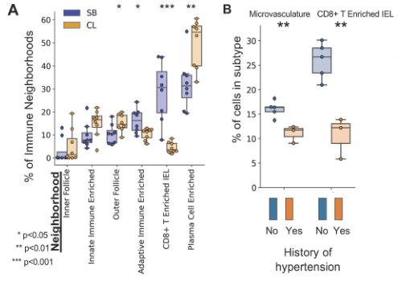
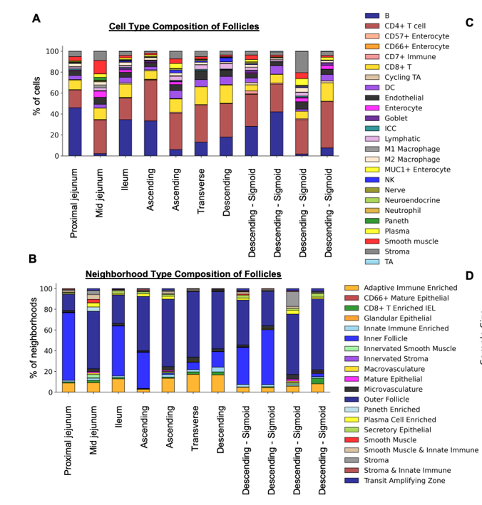
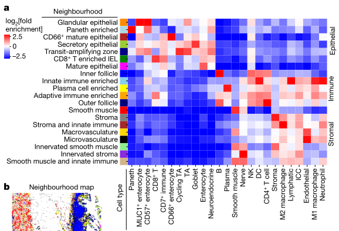
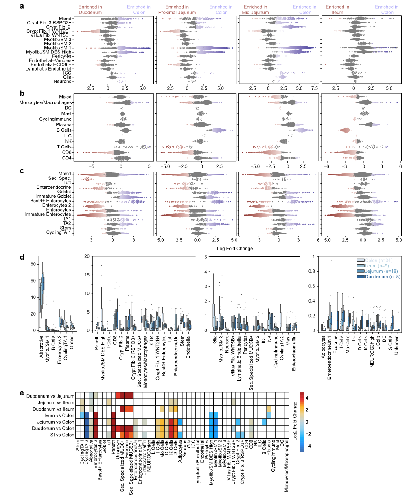
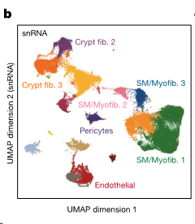

# Organization of the human intestine at single-cell resolution

文本讨论了肠道的结构、功能和细胞组成的复杂性，以及肠道如何通过其细胞类型的定位、发展轨迹和详细的转录程序来驱动这些功能上的差异。肠道不仅是一个复杂的器官，它促进消化，提取营养，参与免疫监视，维持与微生物的关键共生关系，并影响整体健康。具体来说，肠道长度超过九米，沿其长度结构和功能存在差异。

为了更好地理解这些差异，研究人员使用多重成像技术以及单核RNA和开放染色质测序方法，对来自九个捐赠者的八个不同肠道部位的单个细胞的组织结构进行了评估。通过系统分析，研究发现肠道各区域的细胞组成差异显著，展示了上皮亚型的复杂性，并发现相同的细胞类型在不同的邻域和社区中有不同的组织形式，突出显示了肠道中存在的独特免疫生态位。此外，研究还绘制了这些细胞中的基因调控差异，这些差异暗示了一种调节分化的级联反应，并将肠道疾病的遗传易感性与特定细胞类型相关联。

这些结果描述了这一器官的细胞组成、调控和组织的复杂性，并为理解人类生物学和疾病提供了一个重要的参考图谱。

*****

比喻讲解：

想象肠道就像一个复杂的工厂，它的主要任务是处理原材料（食物），提取有用的资源（营养物质），并且管理废料。这个工厂沿着一条超过九米的长带（肠道）分布，每一个部分都有其独特的生产线（细胞类型和功能）和质量控制系统（免疫监视）。

1. **工厂布局与工人分布**：
   - 工厂的每个部分都设计有特定的生产区（不同的肠道部位），这些区域根据所需处理的原材料和生产的产品（吸收营养和消化）有所不同。工人（细胞）在这些区域根据需要被分配和组织起来，以最高效地完成任务。

2. **专业团队与工作流程**：
   - 在这个工厂中，不同的工作小组（细胞类型如上皮细胞亚型）根据其特定技能和功能分组工作。例如，有些团队专门负责处理进入工厂的原材料（食物），而其他团队则负责检查和保证产品质量（免疫监视和微生物共生关系）。

3. **质量控制与环境适应**：
   - 工厂内设有高级的质量控制系统（免疫生态位和基因调控差异），这些系统可以根据外部市场的需求（身体的健康状况和疾病状态）调整生产线。通过这种方式，工厂不断优化其工作流程和产品，确保能够有效地应对变化的环境。

4. **研发和创新**：
   - 工厂还拥有一个研发部门，负责开发新技术和改进现有工艺（基因调控的研究和细胞分化级联）。这些创新有助于提高生产效率，减少废料，并开发新产品，以适应市场的变化。

5. **地理和社区影响**：
   - 工厂对周边社区（人体）有重大影响，通过优化其内部结构和流程，可以提高整个社区的生活质量（整体健康）。这需要工厂与本地资源（微生物群）保持良好的共生关系，共同促进社区的繁荣。

这个工厂的每一个改进和优化都是基于对其各个部门和小组细节的深入了解（单细胞分析和多重成像技术），这为确保整个工厂高效运转提供了关键信息。

***** 

问题：
**如何描述单细胞技术在研究肠道中不同细胞类型之间交互作用和功能差异的作用？**

答案和讲解：
单细胞技术，包括单核RNA测序和开放染色质测序，使研究者能够在非常细致的水平上评估肠道中不同细胞类型的组织结构和功能。通过这些技术，科学家可以在多个肠道部位从多个捐赠者中收集和分析单个细胞的数据。这种系统性分析揭示了肠道不同区域之间在细胞组成、免疫微环境以及基因调控上的显著差异。此外，这些技术还帮助研究人员揭示了肠道疾病的遗传易感性可能与特定细胞类型相关，从而为理解人类生物学和疾病提供了重要的参考图谱。

比喻讲解：
如果把肠道比作一个大型的信息中心，单细胞技术就好比是高级监控系统，能够精确追踪每一个工作人员（细胞）的工作性能和行为模式。在这个信息中心，不同的部门（肠道不同部位）承担不同的任务，而监控系统可以详细记录每个部门的工作流程和交互方式。通过这种方式，管理者（科学家）可以了解哪些部门运作良好，哪些部门可能存在问题，甚至还能发现某些特定的工作人员（细胞类型）如何影响整个中心的效率和安全。这种详细的监控不仅提高了整个信息中心的运作效率，也保证了它能够迅速应对外部的挑战和需求。

*****

文本中描述的是人类成年肠道系统的结构和功能。

1. **肠道系统的结构**: 人类成年的肠道系统包括大约7米长的小肠和2米长的大肠。这个系统是人体消化系统的重要组成部分，主要完成消化过程中的后段工作。

2. **消化过程**: 消化过程始于口腔，经过胃部，然后进入肠道系统。在小肠中，主要完成水分和小分子营养物质（如糖类、单价离子和氨基酸）的吸收。这是通过小肠壁的高效吸收机制来实现的，小肠壁具有大量的绒毛，可以增加吸收面积，促进营养物质的吸收。

3. **大肠的功能**: 随后，更大的分子，如纤维素等，在大肠中积聚。大肠充当一个厌氧发酵室，使得这些大分子能够被分解和吸收。在这个过程中，肠道微生物发挥了重要作用，它们通过发酵过程分解食物残渣，产生的副产品（如短链脂肪酸）及其他营养素（如维生素）也被肠道吸收。

4. **肠道微生物与营养合成**: 肠道微生物不仅帮助分解不能由人体自身酶分解的复杂物质，还参与合成某些营养物质，如维生素B群和维生素K等，这些营养物质对于人体健康至关重要。

总体来看，人类肠道系统不仅仅是消化食物的器官，它还是一个复杂的生态系统，肠道微生物在其中扮演着关键角色，帮助人体从食物中获取必需的营养成分，并且还参与合成一些人体必需的营养素。

*****

比喻讲解：

人类的成年肠道系统可以被比喻为一个高效且复杂的工厂，它专注于处理和转化原材料（食物），最终生产出我们身体所需的精细产品（营养物质）。

1. **小肠——精细加工车间**：
   - 小肠就像是工厂中的精细加工车间，它负责从半成品（部分消化的食物）中提取小分子物质，如糖类、氨基酸和单价离子。这个过程可以想象成一个高科技的筛选系统，能够快速且精确地挑选出有用的原料，将它们转化为工厂即将使用的材料。

2. **大肠——回收处理区**：
   - 大肠则可以看作是工厂的回收处理区。在这里，那些未被小肠处理的、更复杂的原材料（如纤维）被收集并进行厌氧发酵处理。这个区域充满了工作人员（肠道微生物），他们专门处理那些难以分解的材料，通过发酵等过程将其转化为可用的副产品，如短链脂肪酸等。同时，这些工作人员还能合成工厂所需但自身无法生产的特殊材料（如维生素B和K）。

3. **肠道微生物——专业工人团队**：
   - 肠道微生物可以被视为工厂里的专业工人团队。他们不仅负责处理那些特殊或难以处理的材料，还能创造出对整个工厂（人体）有益的新产品。他们的工作确保了工厂的高效运转，同时也保持了产品（身体健康）的高质量标准。

通过这样的比喻，我们可以更生动地理解人类肠道系统的功能和重要性，这不仅是一个简单的消化管道，而是一个高度组织化、精密运作的生物工厂，专门从事原材料的高效转化和优质产品的生产。

*****

问题：
如何描述人类成年肠道系统在消化过程中的主要功能和它与肠道微生物的关系？

答案和讲解：
人类成年肠道系统包括大约7米的小肠和2米的大肠，主要完成从口腔和胃开始的消化过程。小肠主要负责吸收水分和小分子营养物，如糖、单价离子和氨基酸。大肠则主要处理较大的分子如纤维，并充当厌氧发酵室，通过肠道微生物的帮助，分解并吸收副产品以及合成和吸收其他营养素如维生素。这一过程显示了肠道微生物在维持营养平衡和促进健康中的重要作用。

比喻讲解：
可以将人类的肠道系统比作一个高效的生物工厂，其中小肠是初级加工车间，专门处理和提取小分子原料；大肠则像是这家工厂的回收利用区，处理难以消化的大分子原料，并转化为有用的副产品。肠道微生物则是工厂中的专业工人，他们不仅帮助处理废料，还能合成必需但自身无法生产的物质，如特定的维生素，从而确保整个工厂（即人体）的顺利运转和产品质量。

*****

文本内容主要描述了人体小肠和大肠的结构与功能特点，以及它们内部的细胞多样性和特定细胞类型的空间组织。

1. **小肠的异质性**：
   - 小肠在形态上可以分为三个不同的区域：十二指肠、空肠和回肠。这些区域各自拥有各种表型上和形态上不同的细胞类型。小肠不仅仅在解剖结构上有区别，其内部的细胞种类也具有高度多样性。

2. **大肠的分区**：
   - 大肠可以被划分为升结肠、横结肠、降结肠和乙状结肠。与小肠一样，大肠的每个解剖区域都含有表型和形态上多样的细胞。

3. **细胞类型的多样性与特定细胞的定位**：
   - 在整个肠道中，上皮细胞、基质细胞和免疫细胞是主要的细胞类型，且每种类型中还包含多种细胞亚型。免疫细胞尤其引人关注，因为它们与肠道中的微生物群和外来物质发生互动。
   - 特定类型的细胞在肠道的不同位置表现出特定的分布偏好。例如，潘氏细胞主要分布在小肠中，而肠内分泌的L细胞主要在回肠和大肠中发现。

4. **细胞的空间组织与‘邻里’结构**：
   - 这些细胞类型在肠道各个区域中按照不同的“邻里”结构空间组织。这些“邻里”的组成以及构成这些“邻里”的细胞的分子表型在肠道的不同解剖区域中有着相对未知的变化方式。
   - 这种在功能性邻里的组成和细胞状态的分子身份上的差异，定义了人类肠道的组成和功能。

总的来说，这段文本强调了人体肠道的复杂性和其内部细胞类型的多样性及其空间和功能的异质性。这些信息对于理解肠道的生理功能及其在健康和疾病中的作用至关重要。

*****

比喻讲解：

想象人体的肠道就像一个精心设计的大型公园，这个公园不仅风景各异，还根据地形和功能划分为不同的区域。每个区域都有其独特的景观和植被，而肠道中的各种细胞类型则可以比作这个公园中的不同植物种类。

1. **小肠的三个区域**：小肠可以比作公园中的三个主要园区，每个园区都有其特色。**十二指肠**就像是公园的入口区，迎接各种营养物质的首站；**空肠**则像是一条蜿蜒的小径，吸收营养的过程在这里得以延续；**回肠**则是通向出口的路径，吸收剩余营养，并准备将废物传输至大肠。

2. **大肠的分区**：大肠可以被视为公园的不同景观区。**升结肠**是公园的上升部分，逐步处理从小肠来的物质；**横结肠**则如同公园的中央带，连接起始与终点；**降结肠**和**乙状结肠**则处理并准备排出公园的废弃物。

3. **公园中的植物——细胞类型**：
   - **上皮细胞**、**基质细胞**和**免疫细胞**就像是公园中的花草树木，每种植物承担不同的角色。其中，**免疫细胞**如同公园的守护者，与入侵的害虫（微生物和外来物质）战斗，保护公园的安全。
   - 特定的细胞类型如**潘氏细胞**和**L细胞**则可以比喻为公园中只在特定区域生长的珍稀植物，如潘氏细胞主要在“小肠园区”内，而L细胞在“回肠和大肠区”内更为常见。

4. **细胞的邻里组织**：公园内的植物根据不同的生态需求和功能被安排在不同的‘邻里’中。这些邻里的组合和植物的种类随着公园的不同部分而变化，反映出该区域的特定功能和气候条件。

总之，人体肠道如同一个复杂的生态公园，其中的每一种细胞和每一个区域都是精心设计，以满足整个系统的需要，保持健康和平衡。这种精妙的组织和功能分化是人体能有效消化和吸收营养，同时抵御疾病的关键。

*****

问题：
**在描述人体肠道的不同区域和其中的细胞类型时，为什么要强调它们的特定空间分布和功能区分呢？**

答案和讲解：
肠道的不同区域（如小肠的十二指肠、空肠和回肠以及大肠的升结肠、横结肠等）具有不同的生理功能和特化的细胞类型，这是因为每个区域必须处理不同类型的生物化学过程和物质。例如，十二指肠主要负责初步消化吸收，而回肠更多涉及吸收营养物质和水分。特定细胞类型如Paneth细胞和L细胞在某些区域的聚集，说明它们在那些区域的生物化学过程中扮演着关键角色。例如，Paneth细胞通过分泌抗菌物质保护肠道，而L细胞则参与调节能量平衡和胰岛素分泌等。这种精确的空间和功能安排使得肠道可以高效且有序地处理食物，并参与整体的代谢调控。

比喻讲解：
可以将人体肠道比作一家大型工厂，这家工厂的不同车间（肠道的不同区域）负责不同的生产线（消化、吸收等过程）。每个车间都配备了专门的机器和工人（特定的细胞类型），这些机器和工人根据其所在车间的特定任务进行优化配置。例如，原料处理车间（十二指肠）配备了能迅速处理原材料的重型机械（Paneth细胞等），而包装部门（回肠和大肠）则有精密的包装和检验设备（L细胞等），以确保最终产品的质量控制和资源有效利用。这样的组织结构确保了整个工厂运行效率高、误差低，能够顺利完成从原材料到成品的所有步骤。

*****

文本中描述了一个关于肠道不同部分的详细研究，这项研究使用了单核RNA、开放染色质和空间蛋白质组成像技术，在单细胞分辨率水平上进行映射。之前的研究已经利用单细胞RNA测序（scRNA-seq）技术对细胞类型进行了映射，并且已经编制了整个肠道的细胞类型目录。在此基础上，该研究通过使用索引共检测（CODEX）技术，进一步扩展了这项研究，不仅映射了细胞，还映射了蛋白质，增加了空间定位的维度。

这段文本重点介绍了以下几个关键点：

1. **单核RNA、开放染色质和空间蛋白质组成像技术的应用**：这些技术使研究人员能够在单细胞水平上查看肠道的不同部分，深入了解细胞的基因表达、染色质的状态以及蛋白质的分布和功能。

2. **先前研究的扩展**：文中提到的研究在现有的基础上进行了扩展，之前的工作主要集中在使用单细胞RNA测序技术对细胞类型进行识别和分类，而本研究加入了空间成像技术，提供了更多空间和结构上的信息。

3. **索引共检测（CODEX）技术的使用**：CODEX是一种先进的成像技术，可以同时检测多种细胞标记物，使得研究人员能够在组织的微观层面上进行详细的细胞和蛋白质定位。这种技术的应用对于理解复杂生物系统中的细胞组成和细胞间交互具有重要意义。

总的来说，这段文本描述了一个利用尖端生物信息学和成像技术的研究项目，该项目旨在深入理解肠道中的细胞和蛋白质如何在空间上进行组织和交互，从而推动我们对健康和疾病状态下肠道生物学的理解。

*****

比喻讲解：

想象一下你正在组装一张非常复杂的多层拼图。每一块拼图都代表肠道中的一个细胞，而拼图的完成图案则揭示了整个肠道的详细结构和功能。在这个比喻中，单核RNA、开放染色质和空间蛋白质组成像技术就像是放大镜，帮助你看清每一块拼图上的细节，比如细胞的基因表达情况、染色质的开放状态和蛋白质的精确位置。

先前的研究已经帮助我们拼好了这张拼图的大部分，通过单细胞RNA测序技术，我们能够识别和分类肠道中的不同细胞类型，就像是能够辨认出每一块拼图并知道它们各自的图案。但是，要完成整张拼图，我们还需要知道每一块拼图的确切位置以及它们是如何相互连接的。

索引共检测（CODEX）技术的引入就像是在我们的放大镜上加了一个高级的定位系统，不仅能看到每一块拼图的详细信息，还能精确地知道它们在整张拼图中的位置。通过这种技术，我们可以在肠道的具体空间位置上映射细胞和蛋白质，了解它们是如何在不同层次上协同工作的，从而帮助我们更好地理解健康和疾病状态下肠道的复杂生物机制。

因此，这项研究不仅仅是在拼凑一张更全面的肠道拼图，它还在努力揭示这张拼图是如何一块块精准拼接在一起的，每一块都在其特定的位置上发挥着重要的作用。这种详尽的映射和深入的理解是开发新的治疗方法和预防策略的关键，就像是在完成这张复杂拼图的同时，也能够发现新的创造和修复的可能性。

*****

问题：
什么是CODEX技术，它在肠道单细胞研究中扮演了什么角色？

答案和讲解：
CODEX（Co-Detection by indEXing）是一种先进的成像技术，它允许同时在单个细胞层面上检测多种蛋白质和其他生物标记物。这项技术通过使用特定的抗体标记和一种独特的索引系统，使研究人员能够在细胞和组织样本中精确地映射出哪些蛋白质被表达以及它们的确切位置。在肠道的单细胞研究中，CODEX技术使科学家能够不仅仅看到肠道中的不同细胞类型，还能观察到这些细胞如何在空间上相互作用和分布，从而提供了细胞之间交互作用和肠道疾病机制更深层次的洞见。

比喻讲解：
可以将CODEX技术比作一台高级的相机，不仅能拍摄肠道这个“大城市”的空中照片（显示所有建筑即细胞的位置），还能详细记录每座建筑的结构和内部功能（即细胞中的蛋白质表达和位置）。就像一位城市规划师利用这些照片和数据来理解城市的布局和功能区域如何协同工作以及可能的问题所在，科学家们使用CODEX技术来理解肠道中不同细胞如何互动，并揭示健康和疾病状态下肠道生物学的复杂性。

*****

该文本描述了一个关于人类肠道细胞组成、调控信息及单细胞空间分布的研究。通过使用单核RNA测序（snRNA-seq）、单细胞ATAC测序（snATAC-seq）和CODEX技术，研究团队对多个捐献者的肠道进行了详细的细胞图谱绘制。

1. **单核RNA测序（snRNA-seq）**：这项技术用于测量单个细胞核中的RNA转录本，可以帮助研究者了解不同细胞类型在基因表达层面的特征。

2. **单细胞ATAC测序（snATAC-seq）**：这种技术用于测量单个细胞中的开放染色质区域，可以揭示调控基因表达的潜在因素，即哪些基因区域是活跃的，有助于转录因子等调控蛋白的结合。

3. **CODEX技术**：通过使用多达54种抗体探针标记同一组织切片上的不同靶标（通常是蛋白质），该技术能够在蛋白质水平上对组织进行详细的染色和分析。

在此研究中，共分析了来自九名个体的八个组织切片，这些个体包括七名欧洲血统人士（五男二女）和两名非洲裔美国人（一男一女），年龄范围从24岁到78岁。这八个区域沿着胃到肠道的轨迹排序，包括：小肠的十二指肠、近端空肠、中空肠和回肠，以及大肠的升结肠、横结肠、降结肠和乙状结肠。

总之，这项研究通过高级的单细胞测序技术和蛋白质组学技术，对人类肠道进行了深入的细胞和分子层面的映射，有助于科学家们更好地理解肠道健康和疾病状态下的细胞组成和功能变化。

*****

比喻讲解：

想象一下，我们的肠道就像一个庞大而复杂的城市，每一个细胞、每一段DNA、每一种蛋白质都是城市中的居民、建筑或道路。在这个比喻中，研究人员的目标是要绘制出这座“城市”的详细地图。

1. **单核RNA测序（snRNA-seq）**：使用这项技术可以比作是访问每一个家庭（细胞核），并记录他们的日常对话（RNA转录本）。这就像是理解城市中每个居民的日常活动和职责，帮助我们明白这个城市（肠道）的运作和居民（细胞）的生活方式。

2. **单细胞ATAC测序（snATAC-seq）**：这项技术的使用好比是检查每栋建筑（细胞）的门窗是否开放，哪些区域可以让人自由进出（开放染色质）。这有助于我们了解城市中的哪些区域是商业区、居住区或是工业区，即细胞中哪些基因是活跃的，可能参与调控城市的基本功能。

3. **CODEX技术**：通过这项技术标记不同的蛋白质目标，就如同用不同颜色的灯光照亮城市的特定建筑（蛋白质），使我们能够从高空（组织层面）观察城市的整体布局和特色建筑的功能。

在这个研究项目中，科学家们就像是城市规划者和地图制作者，他们通过详细地记录和分析来自不同街区（肠道各部分）的数据，从而制作出一张详尽的城市地图。这张地图覆盖了从小肠的起始区域（十二指肠）到大肠的末端区域（乙状结肠），并且包含了来自不同背景居民的信息。这样的地图有助于我们理解肠道这座“城市”如何正常运作，以及在疾病状态下可能发生了哪些变化。

*****

本文描述了一项使用CODEX多重成像技术对人类肠道进行空间映射的研究。研究覆盖了肠道的八个区域，旨在深入了解细胞间的相互作用、多细胞组织单元的组成以及这些与肠道整体功能的空间关系。

首先，研究团队在一个参与者（标记为B001）的新鲜冷冻样本上对CODEX染色、成像和图像处理进行了验证和优化。这些样本的截面面积为16平方毫米。通过这一过程，研究人员确保了成像技术的有效性和适用性，相关的结果和优化详情记录在补充材料的图1-3中。

在随后的研究中，为了更全面地映射肠道，团队扩展了CODEX抗体面板，增加了17种针对肠道特有的标记物。这些新的标记物经过严格验证，结果和相关信息记录在补充信息1和补充图4中。扩展后的抗体面板总共包括54种抗体，这使得研究者能够在空间上识别出25种细胞类型。详细的细胞类型识别数据记录在扩展数据图1c以及补充图5和6中。

图例:

Supplementary Figs. 1–3

补充图 1：供体 B001 小肠和结肠样本的 CODEX 多重标记成像

A) 用于成像的 44 个标记抗体基础面板

这部分描述了用于 CODEX 成像的初始抗体组。这些抗体可能针对小肠和结肠组织中的各种分子。

B) B001 结肠 8 个不同取材部位之一的 CODEX 成像，显示 5/44 个标记物（比例尺 = 500 微米）

本部分展示了来自供体 B001 结肠的 8 个取材部位之一的 CODEX 图像。图像显示了 5 个选定的标记物，并带有比例尺。

为了更详细观察，图像中放大了四个区域（比例尺 = 100 微米），这些区域取自较大的图像（由彩色轮廓线表示），并展示了来自相同区域的苏木素-伊红 (H&E) 染色切片图像。

C) 同一区域的多细胞邻域图，包括细胞类型图和围绕免疫滤泡区域放大的邻域图

本部分描述了与 B 部分相同的区域的细胞类型和邻域信息。

图像显示了供体 B001 样本中 8 个取材部位之一的多细胞邻域图，并对免疫滤泡区域进行了放大展示。

注意

这幅图像是来自供体 B001 的 8 个样本中之一的代表性图像。

补充图 2: 所有成像区域的细胞类型图。供体 1 (B001) 的小肠和结肠 (比例尺 = 1 毫米)

这句话描述了供体 1 (B001) 小肠和大肠的附加图 2。

该图展示了所有 8 个成像区域的细胞类型分布情况。
每个区域将以某种方式可视化，例如使用不同的颜色代表不同的细胞类型。
图中包含比例尺，长度为 1 毫米，帮助读者理解图像的放大倍率。

供体 1 的所有 8 个区域中 CODEX 多重标记成像的多细胞邻域分析

A) 热图显示每个邻域内的细胞类型富集得分

这句话描述了使用热图来可视化供体 1 的 8 个区域中每个多细胞邻域的细胞类型组成情况。
热图中不同颜色代表了不同程度的细胞类型富集，例如红色可能代表高富集，蓝色可能代表低富集。

B) 将细胞类型信息映射回每个成像样本（比例尺 = 1 毫米）

这句话描述了将 A 部分中分析得到的细胞类型信息可视化回供体 1 的 8 个单独成像样本上。
图像可能使用不同的颜色代表不同的细胞类型，并带有比例尺（1 毫米）帮助理解图像的放大倍率。

Supplementary Fig. 4 & 5 & 6

补充图 4: 扩展的 54 抗体 CODEX 多重标记成像

A) B004 供体的一个区域（共 8 个），显示 6 个标记物（波形蛋白，CD3，aSMA，CD45，细胞角蛋白和 CD31）（比例尺 = 500 微米）

这部分展示了来自 B004 供体的一个取材区域的 CODEX 图像。图像显示了 6 种选定的标记物，并带有比例尺。

B) 放大区域，分别显示 A 图中突出显示的区域（黄色框）的 6 个标记物，并添加了额外的标记物（比例尺 = 100 微米）

这部分展示了 A 图中标注区域的放大图像，并显示了额外的标记物。每个放大区域可能包含相同的 6 个标记物，并添加了额外的标记物进行更详细的观察。

C) 按行和列归一化的细胞类型标记物热图，用于展示 B004、B005 和 B006 样本的 CODEX 多重标记成像中定义细胞类型的标记物

这部分描述了按行和列进行归一化的热图。该热图展示了来自 B004、B005 和 B006 供体的样品中，CODEX 多重标记成像数据中用于定义细胞类型的标记物。

行和列的归一化可能有助于可视化哪些标记物在定义不同细胞类型方面更突出。

补充图 5: 小肠和大肠所有成像区域的细胞类型图。供体 A) B004、B) B005 和 C) B006 (比例尺 = 1 毫米)

这句话描述了附加图 5 的内容，该图展示了来自三个供体 (B004、B005 和 B006) 小肠和大肠的细胞类型分布情况。

图像可能使用不同的颜色代表不同的细胞类型。
图中包含比例尺 (1 毫米)，帮助读者理解图像的放大倍率。
对于每个供体，该图可能展示其小肠和大肠所有 8 个成像区域的细胞类型分布。

补充图 6: 所有供体 (n=8，误差线表示标准差) 的细胞类型百分比量化

A) 按供体分离的细胞类型百分比

这部分描述了按供体 (共 8 个) 进行分类的细胞类型百分比数据。图像或表格可能显示每个供体中不同细胞类型的平均百分比及其标准差 (由误差线表示)。

B) 按肠道位置分组的细胞类型百分比

这部分描述了按肠道不同位置分组的细胞类型百分比数据。图像或表格可能显示小肠上段、中段和小肠下段等不同肠道区域中各种细胞类型的平均百分比及其标准差。

C) 肠道内所有细胞类型汇总的细胞类型百分比图

这部分描述了肠道内所有细胞类型的汇总百分比图。该图可能显示肠道不同位置的总细胞类型组成，并按百分比进行可视化。

这段文字描述了 CODEX 技术在小肠 (SB) 某个区域的应用示例。

以下是该段落的翻译：

示例图像：使用 CODEX 技术获得的小肠 (SB) 某个区域的荧光图像（来自一位供体的 64 个组织切片之一），图像显示了 6/54 个标记物 (scale bar = 1 毫米，放大插图 = 100 微米）。C) 则为经过细胞分割和非监督聚类后得到的细胞类型图。

术语解释：

CODEX：一种用于组织成像的多重标记免疫荧光技术。
小肠 (SB)：消化系统的一部分，负责吸收营养物质。
标记物：用于特异性识别细胞中特定分子的分子探针。
细胞分割：将图像中的细胞彼此分开的过程。
非监督聚类：一种将数据点分组到具有相似特征的簇中的算法。

*****

比喻讲解：

想象一下，如果我们的肠道是一个庞大复杂的主题公园，每个细胞、每种组织单元就像是公园里的不同景点和设施。为了能够详细地了解这个主题公园的布局和各个景点之间的相互作用，我们需要一张详尽的地图。这正是CODEX多重成像技术所做的工作。

首先，想象我们有一张粗略的公园草图，但为了让游客（科学家和医生）更好地导航和理解公园，我们需要对这张地图进行验证和优化。这就好比我们首先在一个小区域（一个志愿者B001的样本）测试我们的地图绘制方法，确保这些方法能准确反映出这个区域的真实情况，就像在一个特定的公园区域测试最新的导航设备。这个过程的细节和优化结果记录在了补充图1-3中。

完成初步测试后，为了更全面地覆盖整个主题公园，我们决定扩大我们的工具箱，引入更多专门针对公园中特定景点（肠道标记物）的导航工具。我们添加了17种新的标记物，使得我们的导航工具包括了总共54种抗体。这相当于在地图上添加了新的图标和符号，帮助游客识别和访问公园中的25种不同的景点。这个扩展过程的详细信息记录在补充信息1和补充图4中，而各个景点的具体位置和信息则记录在扩展数据图1c以及补充图5和6中。

通过这种方式，CODEX多重成像技术帮助我们不仅制作了一个包含所有主要景点的详细且功能齐全的主题公园地图，还使得游客能够更好地理解这些景点之间如何协作，共同营造一个有趣且互动的环境。

*****

问题：
如何通过CODEX多重成像技术对人类肠道进行详细映射，并为什么需要对此技术进行优化？

答案和讲解：
CODEX多重成像技术通过使用一系列特定的抗体探针来标记和视觉化肠道组织中的不同细胞类型和蛋白质。这项技术使研究人员能够在单个组织切片上同时检测多达54种不同的标靶，从而深入理解细胞间的相互作用、组成及其在肠道功能中的空间关系。首先，在一个参与者（B001）的样本上进行了CODEX染色、成像和图像处理的验证和优化，确保技术的有效性和适用性。随后，通过添加和验证针对肠道特有的17种新标记物，扩展了抗体面板，从而增强了对肠道细胞类型的空间识别能力。优化这项技术是必要的，因为它确保了成像和数据分析的准确性，提高了研究的可靠性和深度。

比喻讲解：
想象肠道像一个复杂的迷宫，每个细胞和蛋白质都是迷宫中的一个房间或物品。CODEX多重成像技术就像是一把含有54种不同钥匙的钥匙串，每把钥匙可以打开迷宫中特定的房间（细胞类型或蛋白）。开始时，我们只在一个小区域（B001样本）测试这些钥匙以确认每把钥匙都能正确工作并打开正确的门。确认这点后，我们增加了更多的钥匙（特定标记物），以便探索迷宫中更多的房间。通过这种方式，我们不仅能够看到每个房间的样子，还能理解它们之间是如何相互连接和互动的，从而完整地了解整个迷宫的结构和功能。

*****

在本研究中，我们使用了包含270万个细胞的数据集来比较不同组织区域的细胞组成和结构，同时对总体细胞群组进行了标准化（图1a-c）。在结缔组织区域，从小肠到结肠，我们观察到内皮细胞数量减少，而平滑肌细胞数量增加（图1a和扩展数据图1d）。为了验证这一现象是否为由于在结肠样本中相对于小肠捕获更多的外肌层导致的假象，我们计算了肠道四个不同病理部分（黏膜层、肌层、黏膜下层和外肌层）中所有细胞类型的百分比。事实上，即使是在比较所有存在于外肌层的细胞类型时，内皮细胞的显著减少和平滑肌细胞的增加仍然存在（扩展数据图1e）。因此，结肠中的血管系统不仅整体较少，而且在外肌层中的血管较少，平滑肌细胞密度更高。

图例:

Fig. 1a–c

这段文字描述了利用 CODEX 多重标记成像技术来创建健康人体小肠和大肠的单细胞图谱。

研究人员利用 CODEX 技术对小肠和大肠的八个区域进行了成像，旨在绘制出这些区域内单个细胞的详细分布图。
图表 (a-c) 展示了基于 CODEX 数据计算出的八位供体的平均细胞类型百分比。
这些百分比进一步分为三个区室：
间质区 (a): 提供支持和结构的结缔组织细胞。
免疫区 (b): 参与免疫系统功能的细胞。
上皮区 (c): 衬于肠道表面的细胞。
研究人员进行了统计分析，比较了小肠 (SB) 和结肠 (CL) 之间的细胞类型百分比差异。
使用了双侧 t 检验进行比较。
星号 (*) 表示具有统计学意义的差异 (p 值小于 0.05)。

缩写解释

ICC：Cajal 间质细胞 (肠壁中的特殊细胞)
NK：自然杀伤细胞 (免疫系统的一部分)
TA：转运扩增细胞 (快速分裂的未成熟细胞)

Extended Data Fig. 1d& e
 

D) 相对于所有肠道间质细胞 (D)：

这部分询问的是某种特定肠道间质细胞类型的百分比，该百分比占所有肠道间质细胞的比例。

E) 局限于肌层组织单位的所有细胞 (E)：

这部分询问的是某种特定肠道间质细胞类型的百分比，该百分比仅占肌层组织单位所有细胞的比例。换句话说，该比例仅限于肌层这一肠道结构层。

*****

比喻讲解：

想象我们的肠道是一座由不同种类的建筑组成的城市，这些建筑代表了不同类型的细胞，而每个建筑的风格和功能则反映了它们在肠道中的具体角色。在这个研究中，我们使用一个大型的细胞数据库，就像是使用卫星图像来观察和比较整个城市的结构和组成变化。

1. **从小肠到结肠的变化**：可以想象在从小肠到结肠的这段路程上，城市中的水管系统（代表内皮细胞）逐渐变少，而钢铁工厂（代表平滑肌细胞）则变得更加密集。这种变化反映了每个区域在肠道中的不同功能和结构需求。

2. **验证过程**：为了确保这种变化不仅仅是因为某个区域（如结肠）相比另一个区域（如小肠）被我们观察得更多，我们进一步深入分析，检查了城市的不同部分——从住宅区（黏膜层）到工业区（外肌层）。即使在重点比较工业区内部的情况时，水管系统的减少和钢铁工厂的增加仍然非常明显。

3. **结论**：这表明结肠区不仅整体上工厂更密集，而且即使在工业区内部，其水管系统也更少，钢铁工厂更密集。这种观察帮助我们理解肠道不同部分在维持健康和处理食物过程中的不同角色和需求。

通过这样的比喻，我们可以更生动地理解肠道中细胞类型变化的重要性，以及它们在健康和疾病中的作用。

*****

问题：
为什么在从小肠到结肠的过程中会观察到内皮细胞数量的减少和平滑肌细胞数量的增加？这种现象在研究中是如何验证的？

答案和讲解：
在研究中，使用了单核RNA测序技术和单细胞ATAC测序来详细分析了从小肠到结肠不同区域的细胞组成。观察到内皮细胞数量的减少可能反映了结肠相对较少的血管需求，而平滑肌细胞的增加则与结肠在物理消化和推动内容物方面的功能增强有关。为了验证这一现象不是由于样本捕获偏差造成的（例如，结肠样本中捕获了更多的外肌层），研究人员计算了肠道四个不同解剖部分中所有细胞类型的百分比。结果确认，即使在单独比较外肌层中的细胞类型，内皮细胞数量仍显著减少，平滑肌细胞数量增加，这表明观察到的现象是实际的生物学变化，而非采样误差。

比喻讲解：
想象肠道就像一条从城市（小肠）通向乡村（结肠）的高速公路。在城市部分，道路两旁有许多服务站和维修店（类似于内皮细胞），因为在人口密集的地区，交通事故和车辆问题较为频繁，需要更多的服务设施。而到了乡村，道路变得更宽广，车速更快，此时路边的服务站较少，但是有更多的仓库和加工厂（类似于平滑肌细胞），因为这里主要是处理和储存从城市传来的货物。通过检查整条路线上的各种设施，可以确认城市和乡村之间的功能差异是真实且具有实际意义的，而不仅仅是因为某一地区被观察得更多。

*****

在免疫系统的部分，我们观察到从小肠到结肠，CD8+ T细胞的数量呈现下降趋势（如图 Fig. 1b, Extended Data Fig. 1f 和 Supplementary Fig. 7a–c 所示），这与之前的研究结果一致。相反，我们观察到与小肠相比，在结肠中树突状细胞的比例有所增加，这一现象也可以从粘膜内的总细胞百分比中观察到（如图 Fig. 1b 和 Extended Data Fig. 1f 所示）。

图例：Fig. 1b, Extended Data Fig. 1f, Supplementary Fig. 7a–c

细胞类型被归一化到三个区室：间质区 (a)、免疫区 (b) 和上皮区 (c)。

这句话的意思是，研究人员测量了 32 个组织切片中不同平滑肌多细胞邻域内的平滑肌细胞密度，并将其数据绘制在图表上 (x 轴代表不同的平滑肌多细胞邻域)。

这段文字描述了利用 CODEX 多重标记成像技术量化肠道中不同细胞类型的含量。

A) 免疫细胞类型百分比（占所有免疫细胞的比例）：

这部分分析了肠道组织中不同免疫细胞类型的含量，并将其含量表示为占所有免疫细胞的百分比。

B) 跨不同区域样本（小肠到结肠）的 CD8+ T 细胞占所有细胞类型的百分比：

这部分分析了从小肠到结肠不同区域样本中，CD8+ T 细胞占所有细胞类型的百分比。换句话说，它查看了肠道不同部位 CD8+ T 细胞的相对丰度。

C) 单向方差分析 (ANOVA) 发现不同肠道区域 CD8+ T 细胞百分比存在显著差异后，使用 Tukey 后续检验得到的 p 值热图：

研究人员首先使用单向方差分析 (ANOVA) 检验了小肠和结肠不同区域的 CD8+ T 细胞含量是否存在统计学上的差异。

如果 ANOVA 发现存在显著差异，则会进一步使用 Tukey 后续检验来分析各个区域之间的具体差异。
这部分描述的是使用 Tukey 后续检验得到的 p 值热图。p 值用于评估差异的显著性，热图则可以直观地展示不同区域之间差异的强弱。

*****

比喻讲解：

想象一下，人体的免疫系统就像一个庞大的安全系统，而各种免疫细胞则是其中的安全人员。在这个比喻中，CD8+ T细胞可以被看作是特种部队，它们在小肠这一区域的存在密度正在减少，就像特种部队从城市的一个区域撤离到另一个区域。这种变化在图 Fig.1b, Extended Data Fig. 1f 和 Supplementary Fig. 7a–c 中有所记录，与先前的观测结果相符，显示这是一个一致的趋势。

与此同时，树突状细胞——这些可以看作是巡逻警察——在结肠区域的比例却在增加。这种增加同样在图 Fig. 1b 和 Extended Data Fig. 1f 中得到了记录，并且从粘膜内的总细胞百分比来看，这一现象在整个结构中也有所体现。这就像在城市的某个区域加强了巡逻力度，以提高该区域的安全水平。

通过这些细胞的变化，我们可以看出免疫系统在不同肠道区域如何调整其资源分配，以最有效地应对可能的健康威胁。

*****

问题：
为什么在从小肠到结肠的过程中，CD8+ T细胞的数量会减少，而树突状细胞的比例却会增加？

答案和讲解：
从小肠到结肠，CD8+ T细胞数量的减少可能与肠道免疫环境的变化有关。CD8+ T细胞是免疫系统中的重要细胞，主要负责识别并杀死受病毒感染的细胞或癌变细胞。小肠的微环境可能更适合CD8+ T细胞的活性和生存，而结肠环境可能不利于这些细胞的维持。与此同时，树突状细胞在结肠中的比例增加，可能是因为结肠需要更多的抗原呈递和局部免疫调节，树突状细胞作为主要的抗原呈递细胞，在这一过程中扮演着关键角色。

比喻讲解：
想象一个军队在不同地形地貌中的战略部署。CD8+ T细胞如同特种部队，在小肠这个“前线基地”中较为集中，因为那里可能面临更多的外来侵害（如病毒感染）。当环境转移到结肠这样一个“内陆基地”时，这些特种部队的数量减少，可能是因为该地区的战略需求不同，需要更多的“警察力量”（树突状细胞）来维持当地的秩序和安全，进行日常的巡逻和监督，以及与“民众”（其他细胞类型）的互动和信息收集。这种战略调整帮助保证了整个“国家”（人体）的平衡和安全。

*****

在这段文本中，描述了在肠道上皮细胞区域观察到的几种细胞类型的变化。具体来说，从小肠移动到结肠时，观察到肠细胞数量减少，分泌性肠细胞（杯状细胞）和CD66+肠细胞数量增加，并且缺少潘氏细胞。此外，研究还发现在十二指肠相比于其他肠道区域富集了一种罕见的CD57+肠细胞群体。这些类似胃的细胞在十二指肠的粘膜下腺体区域富集。

这些观察揭示了在肠道不同部位上皮细胞群体的组成变化，特别是在小肠和结肠之间的转变。杯状细胞的增多可能与结肠中更多的粘液分泌和保护功能有关，而潘氏细胞的缺失可能影响肠道的微生物环境和宿主防御。CD66+肠细胞的增加和CD57+肠细胞的区域特异性富集可能指示这些细胞在局部免疫反应和肠道健康中的特定角色。

图例: Fig. 1c, Extended Data Fig. 1g, Supplementary Fig. 7d, Extended Data Fig. 1h, Supplementary Fig. 7e, Extended Data Fig. 1i, Supplementary Fig. 7f

这段文字描述了利用 CODEX 技术分析人类健康小肠细胞类型百分比的流程和结果。

数据来源和处理

研究人员利用 CODEX 多重标记成像技术分析了八位供体的小肠组织。

CODEX 技术可以同时检测多种细胞标志物，从而区分不同类型的细胞。

分析过程中，将得到的细胞类型数据归一化到三个区室：

间质区 (a)： 提供支持和结构的结缔组织细胞。
免疫区 (b)： 参与免疫系统功能的细胞。
上皮区 (c)： 衬于小肠表面的细胞。
归一化后，每个区室中不同细胞类型的含量都将表示为占该区室细胞总体的百分比。

统计分析

研究人员使用双侧 t 检验比较了小肠 (SB) 和结肠 (CL) 之间不同细胞类型百分比的差异。

双侧 t 检验是一种用于比较两组数据均值差异的统计学方法。

文中提到了星号 (*)，表示 p 值小于 0.05， 这意味着小肠和结肠中某些细胞类型的含量存在着统计学上的显著差异。

细胞类型缩写

文中列出了部分提到的细胞类型缩写及其含义：
ICC：Cajal 间质细胞 (肠壁中的特殊细胞)
NK：自然杀伤细胞 (免疫系统的一部分)
TA：转运扩增细胞 (快速分裂的未成熟细胞)

H) 跨不同区域样本（小肠到结肠）的 CD57+ 肠上皮细胞占所有细胞类型的百分比。（适用于 D-H 部分：* p 值 < 0.05，** p 值 < 0.01，*** p 值 < 0.001，双侧 T 检验，n = 8 位供体）。（所有图中的箱形图均以最小值、25% 百分位数、中位数、75% 百分位数、最大值和超出 1.5 倍四分位数范围的异常值绘制）。

I) 代表性切片（来自 8 位供体之一）的十二指肠细胞图，显示黏膜下腺体中存在 CD57+ 肠上皮细胞，其中肠上皮细胞和转运扩增细胞 (TA) 显示为深灰色，平滑肌细胞显示为浅灰色（未显示其他细胞类型）（比例尺 = 500 微米）。

解释：

这段文字描述了两个部分的内容：

H 部分：延续了之前关于细胞类型百分比的分析，这次着重于 CD57+ 肠上皮细胞在小肠到结肠不同区域的含量。

双侧 T 检验再次被用于比较不同区域的含量差异，并给出了相应的 p 值。
箱形图将以可视化方式呈现这些数据，显示不同区域的分布情况。

I 部分：展示了来自一位供体的十二指肠切片图像，并特别标注了 CD57+ 肠上皮细胞的位置。

该图像区分了肠上皮细胞、转运扩增细胞和平滑肌细胞，并用不同色块表示。

图像比例尺为 500 微米，可帮助读者理解细胞的相对大小。

D) 上皮细胞类型百分比（相对于所有上皮细胞的比例）

这部分描述了上皮细胞亚型的含量，以其在所有上皮细胞中所占的比例表示。

E) 单向方差分析 (ANOVA) 检测不同肠道区域 CD8+ T 细胞百分比的显著差异后，使用 Tukey honestly significant difference (HSD) 检验得到的 p 值热图。

这部分描述了分析小肠和结肠中 CD8+ T 细胞含量差异的过程。

研究人员首先使用单向方差分析 (ANOVA) 检验不同肠道区域的 CD8+ T 细胞含量是否存在统计学上的显著差异。

如果 ANOVA 发现存在显著差异，则会使用 Tukey HSD 检验来进一步分析各个区域之间的具体差异。

本段落描述的是使用 Tukey HSD 检验得到的 p 值热图。p 值用于评估差异的显著性，热图可以直观地展示不同区域之间差异的强度。

F) 效力分析，评估小肠到结肠显著不同的细胞类型（功效为 0.8，显著水平为 0.05）。（*p 值 < 0.05，**p 值 < 0.01，***p 值 < 0.001，双侧 T 检验，n = 8 位供体）。图中的所有箱形图都以最小值、25% 百分位数、中位数、75% 百分位数、最大值和异常值（超出 1.5 倍四分位数范围的点）绘制。

这部分描述了功效分析，用于评估从十二指肠到结肠含量显著不同的细胞类型。

研究人员分析了哪些细胞类型的含量在小肠和大肠之间存在显著差异。

功效 (power) 指检测到真正差异的概率，这里设置为 0.8，表示有 80% 的概率检测到真正存在从小肠到结肠显著差异的细胞类型。

显著水平 (alpha) 指发生 Type I 错误 (伪阳性) 的概率，这里设置为 0.05。

样本数量为 8 位供体，使用双侧 T 检验进行统计分析。

文中提到的星号 (*) 表示 p 值，它用于评估差异的显著性。p 值越小，差异就越显著。

箱形图将以可视化方式呈现这些数据，显示不同区域的分布情况，并标注最小值、25% 百分位数、中位数、75% 百分位数、最大值和异常值。

*****

比喻讲解：

想象一下，肠道就像一条繁忙的高速公路，上面的车辆代表不同类型的细胞。在这条从小肠到结肠的公路上，我们可以看到不同的车辆（细胞类型）在变化：

1. **肠细胞（普通乘用车）**：在从小肠驶向结肠的路程中，我们观察到普通乘用车（肠细胞）的数量正在减少。这如同在某些路段上，普通车辆减少，因为这一区段需要更多特殊功能的车辆。

2. **分泌性肠细胞（杯状细胞，如加油车）**：随着进入结肠，加油车（分泌性肠细胞，尤其是杯状细胞）的数量增加。这些车辆负责给高速公路上的其他车辆提供必要的燃料（粘液），保护它们不受环境的伤害。

3. **CD66+肠细胞（特殊功能的警车）**：这些车辆在高速公路上也变得更常见，它们带有特殊标志（CD66），可能在防御或应对特定情况方面发挥作用。

4. **潘氏细胞的缺失（急救站关闭）**：通常情况下，急救站（潘氏细胞）为高速公路上的车辆提供紧急服务，但在这条通向结肠的路段上，这些站点不见了，可能影响车辆（细胞）在紧急情况下的维修（微生物防御和免疫支持）。

5. **CD57+肠细胞（稀有的高级轿车）**：在十二指肠这个区域，我们发现了一些罕见的高级轿车（CD57+肠细胞），这些车辆在这一特定区域内较为集中，可能表明它们在这个特殊的环境中具有重要的功能或地位。

6. **类似胃的细胞在十二指肠粘膜下腺体（私人车库）**：这些类似胃的车辆（细胞）偏好停在十二指肠的私人车库（粘膜下腺体），表明它们在这些特定的停车区有特殊的任务或功能。

通过这样的比喻，我们可以形象地理解肠道细胞如何随着位置的改变而变化，每种细胞类型都有其独特的角色和功能，共同维持肠道这条“高速公路”的正常运行和健康状态。

*****

问题：
为什么在从小肠到结肠的过程中会观察到肠细胞的数量减少，分泌性肠细胞（杯状细胞）增加，以及潘氏细胞缺失？

答案和讲解：
从小肠到结肠，肠道环境发生显著变化，这反映在细胞组成的变化上。肠细胞数量的减少可能是由于结肠较小肠更强的细胞更新需求和不同的功能需求。分泌性肠细胞（杯状细胞）的增加是因为结肠需要更多的粘液来保护肠道表面，帮助固体废物的运动，并防止病原体感染。同时，潘氏细胞在结肠中缺失，这可能是由于其主要功能——分泌抗菌肽和参与局部免疫——在结肠的免疫环境中不是必需的，或者由其他细胞类型在结肠中承担相似功能。

比喻讲解：
想象肠道是一条从乡村到城市的道路。在乡村小肠区，道路上的车辆（肠细胞）较多，但到了城市结肠区，车辆减少了，因为城市道路设计需要适应不同的交通需求。城市结肠中的加油站（杯状细胞）变得更多，因为城市交通更依赖加油站提供的燃料（粘液）来维护交通的流畅和安全。同时，乡村的急救站（潘氏细胞）在城市中不再可见，可能是因为城市有更复杂的医疗系统来替代急救站的功能。

*****

讲解：

本研究评估了与捐献者元数据相关的细胞类型变化。文中特别提到了M1型巨噬细胞水平与体质指数（BMI）之间有着最高的相关性（见图 Fig. 1d），并指出这些细胞局限于黏膜区域（见图 Fig. 1e）。M1型巨噬细胞是促炎型的，已在慢性炎症疾病、自身免疫问题以及肠道的伤口愈合问题中被提及。同样，肥胖增加了胃肠道疾病的风险。尽管捐献者没有胃肠疾病的历史，研究发现BMI属于超重（25-29.9）的个体M1型巨噬细胞数量有五倍的增加，而肥胖个体（BMI > 30）的增加了八倍，与正常体重的个体（18.5-25）相比。此外，研究也观察到有高血压病史的捐献者中内皮细胞（从25%降至20%）和CD8+ T细胞（从42%降至25%）的减少（见图 Fig. 1f）。由于总血管比例较低预期会有高压，但CD8+ T细胞的大幅度减少仍然令人意外（见补充图 Fig. 7a）。

图例:

Fig. 1d: 

这段文字描述了小肠和大肠中 M1 巨噬细胞的比例与供体 BMI 指数之间的相关性。

Fig. 1e: 

这段文字描述了来自具有高 BMI 或低 BMI 的代表性个体 (n = 8 位供体) 的空肠中部细胞类型分布图。

研究人员分析了来自 8 位供体的空肠中部组织，并绘制了细胞类型分布图。

图中将不同类型的细胞以不同的颜色进行区分：
黑色：M1 巨噬细胞 (重点突出)

浅灰色：间质细胞

灰色：上皮细胞

图像比例尺为 250 微米，可以帮助读者理解细胞的大小。

文中强调了 M1 巨噬细胞，这可能是因为研究人员对该细胞类型在不同 BMI 个体中的分布特别感兴趣

图 Fig. 1f: 

这段文字描述了内皮细胞和 CD8+ T 细胞的细胞类型百分比在有无高血压史的供体之间进行的比较。

研究人员测量了来自患有高血压和没有高血压的供体组织中的两种细胞类型：内皮细胞和 CD8+ T 细胞。

他们计算了每种细胞类型占总细胞的百分比。

使用双侧 t 检验对两组数据 (有高血压史 vs. 没有高血压史) 之间的差异进行统计分析。

文中提到了星号 (*) 和 p 值：

一个星号 (*) 表示 p 值小于 0.05，这表明内皮细胞的百分比在两组之间可能存在统计学上的显著差异。

三个星号 (***) 表示 p 值小于 0.00013，这表明 CD8+ T 细胞的百分比在两组之间存在非常显著的统计学差异。

供体数量在 3-5 人之间 (样品容量可能因分析细胞类型而异)。

Supplemental Fig. 7a

这段文字描述了免疫细胞类型在所有免疫细胞中所占的比例。

*****

比喻讲解：

想象一下，我们的身体是一个精密的工厂，不同的细胞和组织就像工厂中的各种机器和员工，它们有不同的职责和工作环境。在这个比喻中，M1型巨噬细胞可以被视为专门处理工厂废料和污染的部门，而体质指数（BMI）则相当于是衡量工厂整体运营状况的一个指标。

1. **M1型巨噬细胞与BMI的关系**：
- 当工厂（我们的身体）的运营状况（BMI）表明有过多的废料（体重增加），这个专门的部门（M1型巨噬细胞）需要扩大其规模来应对增加的需求。这就像是工厂里处理废物的部分需要增加员工和资源来应对更多的废物处理。研究表明，当工厂的状态从“正常运营”变为“超负荷运营”（即BMI从正常到超重或肥胖）时，这个部门的规模会显著增加，具体体现为M1型巨噬细胞的数量增多。

2. **M1型巨噬细胞局限于黏膜区域**：

- 就好比这个处理废物的部门只设置在工厂的某个特定区域，确保废物处理工作不会影响到工厂的其他运营区域。这种局限性有助于集中处理问题，但同时也表明，如果这个区域出现问题，整个工厂的效率都可能受到影响。

3. **高血压病史与内皮细胞及CD8+ T细胞的变化**：

- 设想这个工厂的供水系统（血管）压力过高，导致水管（血管）中的水流（血流）不稳定。这种情况下，工厂的一些关键区域（比如供电系统和安保部门，即内皮细胞和CD8+ T细胞）可能会因为不稳定的供水而减少工作效率或减少员工数量。虽然预计压力会导致一些问题，但安保部门员工数量的大幅减少（CD8+ T细胞的减少）仍然是出乎意料的，这可能影响到工厂的整体安全和效率。

通过这种比喻，我们可以更形象地理解M1型巨噬细胞在不同BMI水平下的变化以及高血压对身体其他细胞类型的潜在影响。这有助于我们认识到身体各系统之间复杂的相互作用和平衡。

*****

问题：
**如何解释M1型巨噬细胞水平与BMI的关系，并且这种关系对身体健康有什么潜在影响？**

答案和讲解：
M1型巨噬细胞是一类促炎型巨噬细胞，它们在身体的免疫反应中起到关键作用，尤其是在慢性炎症和自身免疫疾病中。研究发现，M1型巨噬细胞的水平与个体的体质指数（BMI）呈正相关，特别是在超重和肥胖个体中。超重或肥胖的人M1型巨噬细胞数量显著增多，这可能加剧身体的炎症状态，从而增加患慢性炎症疾病、自身免疫问题和肠道伤口愈合问题的风险。此外，这种炎症状态还可能与肥胖相关的其他胃肠道疾病风险增加有关。

比喻讲解：
想象你的身体是一个忙碌的机场，M1型巨噬细胞就像是机场的安全人员，负责检查并处理潜在的威胁。在正常情况下，这些安全人员的数量是足够的。然而，随着机场（身体）接待的旅客（营养物质）越来越多，尤其是在高峰期（超重和肥胖），需要更多的安全人员来维持秩序和安全。但是，过多的安全检查（炎症反应）可能导致效率低下和其他问题，比如误航班（身体组织的损害）和旅客不满（健康问题）。因此，保持机场运作的平衡，既不至于人手不足也不至于过度拥挤，对于确保整体运行顺畅和旅客（身体）的福祉至关重要。

*****

讲解：

文本描述了一项研究，该研究探讨了免疫细胞在肠道不同部位的空间限制和细胞密度。研究通过量化所有细胞类型的局部细胞密度，并进行视觉检查，来分析特定免疫细胞在肠道的分布情况。

- **细胞密度的意义**：细胞密度可以揭示一个细胞是否在较大区域内具有广泛功能，是否因专门功能而在空间上受到限制，或是否需要特定的细胞间互动。例如，研究中指出，具有最高同型细胞密度的浆细胞（约0.2），被限制在特定的粘膜区域，这表明它们在这些区域内可能执行特定的免疫功能。

- **细胞分布**：文中提到，CD8+ T细胞的密度大约为0.37，M2型巨噬细胞的密度约为0.5，而M1型巨噬细胞的密度约为0.39，这些巨噬细胞分布在肠道的所有区域。M2型巨噬细胞分布广泛，而M1型巨噬细胞密度则相对较低。

- **宏观巨噬细胞的空间限制**：研究还特别量化了每种巨噬细胞亚群在不同肠道组织单元中的分布，发现巨噬细胞亚群在空间上存在限制，这表明它们在这些区域可能有重要的功能角色。此外，文中还暗示存在其他可能在空间上受限的M2型巨噬细胞亚型。

总之，这些结果强调了沿肠道长度免疫细胞亚型的空间限制在维持肠道健康和功能中的重要性。

图例:

g) 这段文字描述了一种量化组织中相同细胞密度的的方法。

研究人员计算了每个细胞到其周围五个最近的相同类型细胞的平均距离。
然后，他们将这个平均距离除以组织内可能的最大相同细胞距离。
这个比率可以用来衡量细胞的聚集程度。较小的比率表示细胞彼此更靠近，聚集更密集。
分析使用了来自 64 个组织切片的样品数据。

h) 这段文字描述了肠道主要区域巨噬细胞亚群的百分比。

十二指肠代表性切片（来自 8 名供体之一）的细胞图，显示黏膜下腺体中存在 CD57+ 肠上皮细胞，其中肠上皮细胞和移行上皮细胞 (TA) 显示为深灰色，平滑肌细胞显示为浅灰色（未显示其他细胞类型）（比例尺 = 500 µm）。

J-K) 用组织内最大同类型细胞间距归一化 (n=64 个组织切片)，量化以其 5 个最近同类型细胞平均距离测量的同类型细胞密度 (J) 间质和 (K) 上皮细胞类型。

代表性细胞类型图（来自 8 名供体的 64 个组织切片之一），仅显示浆细胞、CD8+ T 细胞和 M2 巨噬细胞（比例尺 = 500 微米）。

*****

比喻讲解：

想象一下，肠道就像一座大城市，这座城市中的每一个区域都有不同的功能和特色，而免疫细胞则像是这座城市中的居民，根据他们的职能和任务分布在不同的位置。

- **城市规划与细胞密度**：城市中的某些区域，比如商业区或居民区，因为功能需要，会有更高或更低的人口密度。同样，在肠道中，细胞密度反映了免疫细胞是否在较大区域内执行广泛功能，或者是否因专门的功能而在空间上受到限制。例如，浆细胞（免疫系统的重要组成部分）就像是被指定只在某些高级商业区活动的精英团队，它们在特定的粘膜区域中密集分布，执行着关键的防御任务。

- **城市巡警与CD8+ T细胞**：CD8+ T细胞可以比作城市中的巡警，他们在城市的各个角落巡逻，密度虽然不及商业区的保安（浆细胞），但仍然覆盖广泛，保持城市的安全。

- **不同的城区与巨噬细胞**：M2型巨噬细胞就像是遍布城市的公共设施工作人员，他们在整个城市中广泛分布，维持城市的基本运作和清洁；而M1型巨噬细胞则可能更像是专门负责某些特定区域的技术支持团队，密度稍低，但也不可或缺。

- **宏观规划与空间限制**：研究中还特别关注了宏观巨噬细胞在肠道这座“城市”的不同“建筑群”（肠道组织单元）中的分布，这就像城市规划者根据每个区域的功能需求，精心安排不同功能部门的办公地点。这表明他们在这些区域可能有着重要的功能角色，就像特定区域的政府机构对该地区的发展至关重要一样。

这样的研究帮助我们理解肠道这座“城市”如何通过其“居民”——免疫细胞的合理配置和专业化分工，有效地运作和维护健康状态。

*****

问题：
为什么在研究中需要对肠道中不同免疫细胞的空间分布和密度进行详细量化？

答案和讲解：
在生物医学研究中，了解不同免疫细胞在肠道中的空间分布和密度对于揭示它们在健康和疾病状态下的功能至关重要。细胞密度和分布可以揭示免疫细胞是否在整个肠道中广泛活动，或者是否在特定区域集中以执行专门的功能，如局部免疫应答或细胞间互作。例如，高密度的浆细胞在特定的粘膜区域集中可能表明这些区域需要高度专门化的免疫保护。而CD8+ T细胞和M2型巨噬细胞在肠道更广泛地分布则反映了它们在维持整体免疫防御中的作用。通过这种量化，研究人员可以更好地理解不同免疫细胞如何相互作用以及它们在肠道免疫系统中如何协同工作。

比喻讲解：
想象肠道是一座大城市，而免疫细胞就像是城市中的不同职能部门的工作人员。某些部门的员工（如浆细胞）可能主要集中在城市的特定区域（如商业区或工业区），在那里他们可以执行特定的任务，比如防御外来的病原体。其他如CD8+ T细胞和M2型巨噬细胞则像是遍布整个城市的警察和市政工作人员，他们需要在更广泛的区域内进行巡逻和维护，以确保整个城市的秩序和健康。通过研究这些“员工”的分布和密度，城市规划者（科学家）可以更好地设计和优化资源配置，确保城市（肠道）运行效率和安全。

*****

该文本描述了对肠道中的基质多细胞邻域（stromal multicellular neighbourhoods）进行的全局视角分析，旨在揭示细胞间互动、细胞密度和多细胞结构。通过执行细胞邻域分析，研究人员揭示了18种重要的多细胞结构，这些结构主要涉及上皮细胞、基质和基于免疫的邻域。

研究中特别指出了八个被分类为基质邻域的结构，这些结构在肠道中识别出主要的组织结构，包括微血管和宏观血管结构、具有神经支配的基质、平滑肌，以及基质和平滑肌区域中的先天免疫中心。研究发现，从小肠到结肠，平滑肌邻域有所增加，而具有神经支配和先天免疫的平滑肌邻域则没有显著变化。

这些发现进一步表明，结肠中的这些密集的平滑肌细胞区域有所增加。这种详细的细胞和结构分析帮助科学家们更好地理解肠道的细胞组成和功能，特别是在不同肠段之间的结构和功能差异。

图例: Fig. 2a, Extended Data Fig. 2b-d, Extended Data Fig. 2e, Supplementary Fig. 8a, Extended Data Fig. 2f

a、通过富集的细胞类型定义了二十个独特的肠道多细胞邻域，这些细胞类型与样品中细胞类型的整体百分比相比有所增加。b、一个示例，其中映射回组织的邻域显示整体组织结构。比例尺，0.5毫米。

B-D) 来自 CODEX 数据的邻域百分比，分别按 B) 间质、C) 免疫和 D) 上皮区室进行归一化平均。星号表示小肠 (SB) 和结肠 (CL) 之间细胞类型百分比的 p 值小于 0.05（通过双侧 T 检验）。

E) 限制在肌外膜组织单位的所有邻域百分比的基质多细胞邻域百分比（* p 值 < 0.05，*** p 值 < 0.001，n = 8 个供体，通过双侧 T 检验）。 F) 仅针对不同平滑肌多细胞邻域（x 轴）内的平滑肌细胞的相同细胞密度量化（n = 32 个组织切片）。

基质多细胞邻域百分比占所有基质邻域的百分比

*****

比喻讲解：

想象一下，我们的肠道就像一个繁忙的城市，每个细胞、每个组织结构就像城市中的不同建筑和社区，有些是住宅区，有些则是商业区或工业区。在这个城市中，基质多细胞邻域可以被看作是特定的社区或建筑群，它们不仅为城市提供结构支持，还负责各种基础设施和服务，如交通系统（血管网络）、通信系统（神经支配的结构）和安全系统（免疫中心）。

在这项研究中，科学家们进行了一项类似于对城市进行详尽规划和人口普查的活动。他们通过细胞邻域分析来查看哪些“建筑”（细胞结构）聚集在一起，形成了“社区”（多细胞结构），并特别关注那些支撑和维护整个“城市”运行的基质“社区”。

研究结果揭示了18种重要的多细胞结构，就像城市中的18个主要社区，每个社区都有其特定的功能和特色。这些社区中的八个被确定为基质社区，包括微血管和宏观血管网络（类似城市的主要道路和高速公路）、具有神经支配的结构（城市的通信和控制系统）、以及平滑肌和免疫中心（保证城市安全和顺畅运行的关键设施）。

特别值得注意的是，从小肠到结肠，平滑肌社区有所增加，这就像是在城市的某个区域看到更多的建筑开发，表明该区域正在增强其基础设施，以应对更大的功能需求或人口增长。而具有神经支配和免疫功能的平滑肌社区并没有显著变化，说明这些基础设施在不同地区的分布和重要性可能相对稳定。

这种对肠道“城市”结构和功能的深入了解，帮助科学家们更好地理解肠道如何响应各种生理和病理条件，以及如何在疾病状态下可能出现的结构和功能变化。

*****

问题：
如何解释在从小肠到结肠的过程中平滑肌邻域增加的意义？

答案和讲解：
平滑肌邻域在从小肠到结肠的增加意味着在结肠部分，平滑肌细胞的密集区域有所增多。这种变化可能与结肠在生理功能上的需求有关，比如结肠在消化过程中需要进行更强的蠕动以推动废物向肛门方向移动，因此需要更多的平滑肌细胞来支持这一功能。此外，平滑肌的增加也可能与结肠对机械压力的承受能力有关，因为结肠是储存和处理固体废物的主要部位。

比喻讲解：
想象一下，如果把肠道比作一条运输带，那么平滑肌就像是控制运输带速度的齿轮。在结肠这一段，运输带需要更慢和有力的运动来处理更加坚固和紧密的物质（即消化后的废物）。因此，这里的齿轮（平滑肌）变得更多、更粗壮，以保证运输带可以有效地将物质推向出口。这样的改变确保了结肠能够有效地完成其在消化过程中的关键角色。

*****

文本中描述了关于免疫多细胞邻域的研究观察，特别强调了血浆细胞在某个特定微环境中的聚集现象。研究发现血浆细胞密度异常高，形成了一个以血浆细胞为主的细胞富集邻域。这种邻域不仅血浆细胞密度增加，还观察到CD4+ T细胞和抗原呈递细胞如树突细胞和巨噬细胞的共富集现象。

这一免疫微环境位于粘膜固有层内，显示出典型的细胞组成和功能特性。这些观察结果与其他研究一致，这些研究表明血浆细胞可以通过与骨髓内的抗原呈递细胞的分泌作用或配体结合来维持长期生存。这种相互作用在形成特定于血浆细胞的微环境中起到了关键作用，有助于维持免疫系统的稳定和持续的免疫监视。

图例:

Fig. 2a

通过富集的细胞类型定义了二十个独特的肠道多细胞邻域，这些细胞类型与样品中细胞类型的整体百分比相比有所增加。

Extended Data Fig. 2g–i

G-H) 小肠区域的细胞类型图（来自 8 名供体成像的 64 个组织切片之一）：

G) 所有细胞类型绘制在整个组织上（比例尺 = 500 微米）
H) 浆细胞邻域内的细胞（比例尺 = 500 微米），以及矩形框表示的放大区域，显示细胞类型的子集（比例尺 = 50 微米）。

I) 与 G 相同组织的 CODEX熒光成像，叠加部分熒光标记（Hoechst = 蓝色，CD4 = 绿色，CD68 = 紫红色，CD38 = 黄色，CD206 = 青色，CD138 = 灰色），（比例尺 = 500 微米，放大插图比例尺 = 100 微米）。

*****

比喻讲解：

想象一下，我们的免疫系统就像一个高度组织化的军事基地，而血浆细胞、CD4+ T细胞以及抗原呈递细胞（如树突细胞和巨噬细胞）就是这个基地中的特种部队。在这种比喻中，血浆细胞富集的邻域就像是这些特种部队的训练场和作战指挥中心。

1. **高密度的血浆细胞（Fig. 1g）**：可以想象为一个特别的兵营，里面住着精英士兵（血浆细胞）。这些士兵专门负责制造和运送抗体，就像是军队的远程炮兵，能够在距离远的地方精确打击敌人。

2. **血浆细胞富集的邻域（Fig. 2a）**：这个区域不仅有大量的炮兵部队，还有与之协作的特种部队（CD4+ T细胞）和情报部门（抗原呈递细胞），他们一起形成了一个强大的战斗群。这个战斗群位于军事基地的核心区域——粘膜固有层（Extended Data Fig. 2g-i），负责监视和保护这一关键区域不受入侵。

3. **长期生存的策略**：文献中提到的血浆细胞与抗原呈递细胞的相互作用，可以比作是士兵们在基地中与支援部队（抗原呈递细胞）进行战术配合和后勤保障，确保这些精英部队能长期驻扎在战略位置，随时准备应对威胁。

通过这样的比喻，我们可以更直观地理解血浆细胞富集邻域在免疫防御中的重要性，以及免疫系统内各种细胞类型如何协同作战，共同维护身体健康的安全。

*****

问题：
为什么研究中提到的血浆细胞富集邻域在免疫系统中非常重要？

答案和讲解：
血浆细胞富集邻域在免疫系统中的重要性在于，这些区域表现出高密度的血浆细胞聚集，同时伴有CD4+ T细胞和抗原呈递细胞（如树突细胞和巨噬细胞）的共富集。血浆细胞是主要的抗体生产细胞，对于体液免疫反应至关重要，能够针对入侵的病原体产生特异性抗体。CD4+ T细胞和抗原呈递细胞的共存，提供了必要的信号和支持，促进血浆细胞的成熟和功能维持。这种细胞间的相互作用和协同效应强化了免疫反应的效率和持续性，特别是在粘膜固有层这种与外界接触频繁的关键位置。

比喻讲解：
想象一下，如果免疫系统是一个国防系统，那么血浆细胞就像是负责生产高精度武器（抗体）的军工厂。这些军工厂（血浆细胞）集中在一个特定的工业园区（血浆细胞富集邻域）内，周围还有提供原材料和战术支持的设施（CD4+ T细胞和抗原呈递细胞）。这种布局不仅提高了武器（抗体）生产的效率和速度，而且确保了在遭遇外部威胁时，能迅速和精准地进行防御反应，保护国家（人体）的安全。

*****

讲解：

文本中描述了一项关于CD8+ T细胞在肠道中的空间分布的研究。尽管CD8+ T细胞在肠道中的密度相对较低，但在两个主要的区域中却显示出明显的富集。这两个区域中的一个被称为富含CD8+ T细胞的肠上皮内淋巴细胞（CD8+ T Cell-Enriched IEL）区域，该区域不仅有肠上皮细胞类型的富集，还有CD8+ T细胞的富集。因此，邻域分析成功地区分出了位于肠上皮内的淋巴细胞，这些细胞对于快速的免疫反应以及维持上皮完整性至关重要。

该研究还发现，从小肠（约30%）到结肠（约3%），富含CD8+ T细胞的肠上皮内淋巴细胞区域的普遍性发生了变化。从全局上观察到CD8+ T细胞百分比的减少（图1b），并且这种减少在有高血压病史的个体中更为显著。研究建议，高血压可能会负面影响CD8+ T细胞在肠上皮内空间中的生存或定位能力。

图例: 

fig 1b

Extened data fig 2c

基于 CODEX 数据计算的邻域百分比，并分别按 B) 基质、C) 免疫和 D) 上皮区室进行归一化平均。

Extened data fig 3a & b 

A) 免疫邻域百分比占所有免疫邻域的百分比。  B) 微血管和 CD8+ T 细胞 IEL 邻域的邻域百分比，比较有或没有高血压史的供体（微血管 p 值 = 0.0065 <，CD8+ T 富集 IEL p 值 = 0.0017，双侧 T 检验，n = 3-5 个供体）。

Supplemental fig. 8a

基质多细胞邻域百分比占所有基质邻域的百分比.

*****

比喻讲解：

想象一下，肠道就像一个繁忙的城市，而CD8+ T细胞则如同城市中的警察，他们在特定的街区（这里指肠道的特定区域）进行巡逻，以保护城市（肠道）的安全。尽管这些“警察”（CD8+ T细胞）在整个城市（肠道）中的数量并不多，但他们在两个重要的街区中异常集中。

一个特别的街区被称为CD8+ T细胞富集的肠上皮内淋巴细胞（IEL）区域，就像一个警察局那样，不仅有警察（CD8+ T细胞）的集中，同时也是城市管理人员（肠上皮细胞）的聚集地。这个区域就像是城市的保护屏障，这里的警察负责迅速响应任何入侵（感染），保持城市（肠道上皮）的结构和秩序。

然而，这些警察的分布并不是固定不变的。从小肠到结肠，这个特别警察局的影响力和存在感从约30%降到了约3%，显示出他们在城市不同区域的活动强度有所不同。在全球范围内，我们观察到这些警察的整体数量（CD8+ T细胞的百分比）有所减少，特别是在有高血压历史的居民中，这种情况更为明显。这表明，高血压可能像是城市的环境污染，干扰了警察（CD8+ T细胞）在特定区域的有效部署和操作。

通过这样的比喻，我们可以更直观地理解科学研究中复杂的生物学概念，如CD8+ T细胞在肠道中的分布和功能，以及它们如何受到诸如高血压这样的健康状况的影响。

*****

问题：
如何解释CD8+ T细胞在肠道中的分布变化及其与高血压之间的关系？

答案和讲解：
在研究中，观察到CD8+ T细胞在肠道的分布具有区域性特点，特别是在两个主要的肠上皮内淋巴细胞（IEL）区域中显著富集。这些细胞在小肠的富集比例约为30%，而在结肠则降至约3%。此外，研究发现在有高血压病史的个体中，CD8+ T细胞的比例进一步显著减少。这可能表明高血压对肠道中CD8+ T细胞的生存或定位能力产生了负面影响，可能是通过影响血管健康或免疫系统的调节机制实现的。

比喻讲解：
可以将CD8+ T细胞比作肠道城市中的消防队，它们主要集中在几个关键的“消防站”（肠上皮内淋巴细胞区域）中。在正常情况下，这些消防队在小肠的“消防站”较多，能迅速应对各种炎症或感染。然而，当向结肠移动时，消防队的数量和活跃度显著减少。如果城市（人体）遭受到“环境污染”（如高血压）的影响，这些消防队的部署和响应能力可能会进一步受损，影响整个城市的安全和效率。

*****

本文描述了在结肠中，富含CD8+ T细胞的肠上皮淋巴细胞(IEL)环境的减少伴随着富含浆细胞的环境的增加（扩展数据图2c和3a）。具体而言，相较于结肠，回肠中富含浆细胞的环境显著减少（补充图7c-d）。相比之下，回肠中富含适应性免疫的环境相比结肠有所增加（补充图7e-f）。值得注意的是，虽然回肠接近结肠，但它与结肠的免疫微环境有着最明显的区别。

图例示例: Extended Data Figs. 2c and 3a, Supplementary Fig. 7c–d, Supplementary Fig. 7e–f

基于 CODEX 数据计算的邻域百分比，并分别按 B) 基质、C) 免疫和 D) 上皮区室进行归一化平均。

A) 免疫邻域百分比占所有免疫邻域的百分比。

C) 小肠和大肠不同区域 CD8+ T 细胞百分比的单向方差分析 (ANOVA) 发现显著差异后，Tukey 后续检验的 p 值热图。

D) 上皮细胞类型百分比占所有上皮细胞的百分比。

E) 重复：小肠和大肠不同区域 CD8+ T 细胞百分比的单向方差分析 (ANOVA) 发现显著差异后，Tukey 后续检验的 p 值热图。(与 C 段重复描述)

F) 功率为 0.8，显著水平为 0.05 的小肠和大肠之间细胞类型差异的功效分析。 (* p 值 < 0.05, ** p 值 < 0.01, *** p 值 < 0.001，n = 8 个供体，双侧 T 检验)。

所有图中的箱形图均以最小值、25% 百分位数、中位数、75% 百分位数、最大值以及 1.5 倍四分位数间距之外的点作为异常值进行绘制。

*****

比喻讲解：

想象我们的肠道是一个庞大的生态系统，里面居住着各种不同的“居民”（细胞），并且这些居民分布在不同的“社区”（细胞邻域）中。每个社区因其居民的功能和类型而有着独特的特征。

在这个生态系统中，结肠的一个社区原先由许多富含CD8+ T细胞的肠上皮淋巴细胞（IEL）组成，这些是体内的“警察”——他们监控并保护我们的身体不受感染。然而，最近这个社区的“警察”数量正在减少，而相反的是，另一种类型的居民——浆细胞，即我们的“工厂工人”，他们负责生产抗体，这种居民的数量在增加。

特别地，在回肠这一区域，与结肠相比，浆细胞的“工厂工人”数量显著减少。这可能意味着在这部分的肠道，生产抗体的能力减弱。而与此同时，回肠中的适应性免疫环境增强，意味着这个区域的“防御系统”正在变得更加复杂和高效。

尽管回肠与结肠相邻，但它们的免疫环境却截然不同，就好像两个紧挨着的城市，一个是高科技高效的未来城市，而另一个则可能正在经历工业调整期。这种差异反映了即使在相近的地理位置，肠道内部的微环境也可以极为多样化，每个区域都有其独特的免疫策略和需求。

*****

问题：
如何解释在结肠和回肠中观察到的CD8+ T细胞和浆细胞分布变化的意义？

答案和讲解：
在结肠中，富含CD8+ T细胞的肠上皮淋巴细胞（IEL）的减少与富含浆细胞的邻域的增加之间存在显著的关联。这种变化反映了免疫环境的重要调整，其中CD8+ T细胞通常参与直接的细胞毒性反应以对抗侵入的病原体，而浆细胞则主要负责生产抗体，对抗长期感染。此外，与结肠相比，回肠中的适应性免疫环境表现出增强，这可能指回肠在免疫调节和应对病原体方面的专化功能更为显著。这些区别可能与两个区域在处理消化道内容物方面的不同需求有关，回肠尤其涉及吸收和更复杂的免疫监视。

比喻讲解：
想象肠道是一个国家，结肠和回肠是国家中的两个城市，每个城市都有自己的防御系统和工业区。在结肠这个城市中，原先由许多“警察”（CD8+ T细胞）守护的社区现在开始增加更多的“工厂”（浆细胞），这些工厂专注于生产保护国家免受疾病入侵的“产品”（抗体）。相对而言，回肠这个城市则在增强其“特种部队”（适应性免疫细胞），准备对抗更复杂的外部威胁。这种结构上的变化，体现了每个城市针对其地理位置和面临的特定威胁进行的战略调整。

*****

文本内容涉及了CD4+ T细胞在不同免疫反应中的角色以及它们在多细胞邻里结构中的分布情况。以下是对文本的详细解释：

1. **CD4+ T细胞在五种多细胞邻里环境中的作用**：

文本提到CD4+ T细胞参与了五种不同的多细胞邻里结构。这一点非常合理，因为CD4+ T细胞在协调先天免疫和适应性免疫响应中扮演着核心角色。CD4+ T细胞的这种广泛邻里成员资格说明它们在不同生物学过程和免疫反应中的多功能性。

2. **淋巴滤泡中的CD4+ T细胞、B细胞和树突状细胞**：

文本中指出，CD4+ T细胞、B细胞和树突状细胞共同定义了两种基于滤泡的结构。这些细胞在淋巴滤泡中的分布和功能反映了它们在免疫系统中的相互作用和协同作用。
   
3. **滤泡的外部与内部结构**：

第一种结构存在于滤泡的外围区域，这里CD4+ T细胞较为丰富，而滤泡的内部区域则主要富含B细胞。这种结构上的差异可能与这些区域在免疫反应中的不同功能有关。通常，滤泡的外围区域涉及较多的T细胞介导的活动，而中心区域（即生发中心）则更多地涉及B细胞的成熟和抗体产生。

4. **生发中心的形成依赖于成熟的淋巴滤泡**：

文本还提到，生发中心的存在依赖于图像中具有充分成熟的淋巴滤泡结构，如佩氏斑(Peyer's patch)。生发中心是B细胞高度活跃的区域，是抗体生成和B细胞发育的关键场所。

通过这段文本，我们可以了解到CD4+ T细胞在免疫系统中的复杂交互和重要功能，以及它们如何与B细胞和树突状细胞在淋巴结构中共同作用，协调免疫反应。这种细胞间的空间分布和功能分工是免疫系统高效运作的基础。

a) 通过富集的细胞类型定义了二十个独特的肠道多细胞邻域，这些细胞类型与样品中细胞类型的整体百分比相比有所增加。

b) 一个将邻域映射回组织的示例，展示了整体组织结构。比例尺：0.5 毫米。

*****

比喻讲解：

想象一下，你在一个大型的商场里（这个商场就像人体的免疫系统），商场内部有很多不同的商铺（这些商铺代表不同的细胞类型），其中有一个特别的区域，我们称之为“中心广场”（代表淋巴滤泡）。在这个广场上，有各种各样的商铺，包括CD4+ T细胞的专卖店、B细胞的精品店和树突状细胞的信息咨询站。

- **CD4+ T细胞的专卖店**：这些店铺遍布广场的多个角落，因为CD4+ T细胞需要与许多其他类型的细胞互动，协调整个商场的安全与活动（这对应文中提到的CD4+ T细胞参与五种多细胞邻里环境）。它们就像广场上的管理者，确保所有事情井井有条。

- **B细胞的精品店**：这些店铺主要集中在“中心广场”的内部区域，这个区域专注于生产和销售高质量的商品（抗体），为商场提供必要的保护措施。这些店铺比较特殊，需要从广场的其他部分获得充足的支持才能运行得很好。

- **树突状细胞的信息咨询站**：这些站点位于广场的关键位置，为来往的客人（细胞）提供信息和引导。它们帮助确保每个客人都能找到他们需要的东西，同时也监控那些可能对商场造成威胁的可疑活动。

最重要的一点是，“中心广场”外围区域的CD4+ T细胞专卖店特别多，这有助于快速响应任何外来的威胁，并与B细胞精品店内部紧密协作，共同保证商场的安全。随着时间的推移，广场会逐渐成熟发展，形成一个类似佩氏斑的复杂结构，使得广场更能有效地管理和应对各种情况。

*****

问题：
为什么CD4+ T细胞在免疫反应中的作用与商场的管理者相似？

答案和讲解：
CD4+ T细胞在免疫系统中的作用非常关键，因为它们不仅参与直接的免疫反应，还协调其他免疫细胞的活动，如B细胞和树突状细胞。这些细胞通过识别抗原并激活、引导其他免疫细胞对抗感染或病变，确保免疫系统高效运作。在淋巴滤泡中，CD4+ T细胞的多样位置和作用反映了它们在调整和优化免疫反应中的多功能性。

比喻讲解：
CD4+ T细胞的作用类似于一个大型商场中的管理者。这些管理者不仅负责商场的日常运作，还需要协调和监督各个店铺，确保整个商场的安全和效率。在免疫系统中，CD4+ T细胞确保各种免疫细胞如B细胞和树突状细胞能正确、有效地响应外部威胁。例如，在淋巴滤泡（商场的中心区域）中，CD4+ T细胞帮助B细胞成熟并产生抗体，类似于管理者确保精品店可以生产并提供高质量的商品给消费者。

*****

文本内容涉及对肠道内毛囊邻近区域的研究，尤其关注内外毛囊邻近区的细胞类型和组成差异，以及这些区域在不同毛囊成熟阶段的变化。以下是对文本的详细解释：

1. **研究背景与目的**：研究团队对肠道内的毛囊邻近区域进行了成像分析，无论肠道中是否存在成熟的毛囊，都能发现外毛囊邻近区域。这项研究旨在比较不同成熟阶段的毛囊及其邻近区域的细胞类型和组成。

2. **实验方法**：在64个组织样本中，研究者选择了11个含有成熟毛囊的样本进行分段和比较（见补充图9a-b）。这种分段旨在分析不同毛囊及其邻近区域的细胞组成差异。

3. **主要发现**：

- **细胞类型和组成差异**：每个毛囊的细胞类型和邻近区组成各不相同，这种差异主要由内毛囊邻近区域中密集B细胞的百分比驱动（见补充图9a）。

- **内外毛囊邻近区的比例变化**：肠道中内毛囊邻近区与外毛囊邻近区的比例存在变化，这表明肠道内存在一个淋巴组织的连续体。

4. **研究意义**：

- 这一发现揭示了肠道内淋巴组织在空间分布和功能活性方面的复杂性和多样性。

- 研究结果对理解肠道免疫反应机制、淋巴组织的结构和功能配置提供了重要信息，可能对疾病治疗和健康维护有着重要意义。

综上所述，这项研究通过详细分析肠道内毛囊及其邻近区域的细胞组成，增进了我们对肠道淋巴组织结构和功能多样性的理解。这对于未来的生物医学研究和临床应用具有潜在的重要价值。

从小肠 (SB) 到结肠 (CL) 邻域组成的变化。

A) 每个滤泡区域的细胞类型百分比，这些区域通过 CODEX 多重成像技术从单个切片 (11 个 מתוך 64 个) 中分割出来。

B) 每个滤泡区域的多细胞邻域百分比，这些区域通过 CODEX 多重成像技术从单个切片 (11 个 מתוך 64 个) 中分割出来。

*****

比喻讲解：

想象一下一个大型购物中心，其中包含了各种不同类型的商店和设施。这个购物中心就像我们的肠道，而商店和设施则是肠道中的各种毛囊和邻近区域。在这个比喻中，毛囊可以被视为购物中心中的特色商店，而它们周围的空间——内外毛囊邻近区——则像是商店周围的走廊和公共区域。

1. **商店的多样性**：在购物中心中，即使是在相同类型的商店（比如服装店），每家店铺的布局、装饰和销售的商品种类也都可能不同。同样地，在我们的肠道中，即便是功能相似的毛囊，它们的细胞组成和周围的微环境也各不相同。这就像每个商店根据自己的特色和顾客需求进行个性化布局。

2. **内外走廊的比例变化**：在购物中心中，不同的商店周围的走廊和公共区域大小不一，这影响了人们在商店和公共区域之间的流动性。肠道中的内外毛囊邻近区也有类似的情况，它们的比例变化反映了淋巴组织在肠道中的分布和功能连续性。这类似于购物中心中走廊的宽窄变化，影响着顾客的流动和整个购物环境的动态。

3. **密集区域的特殊功能**：想象购物中心中某些特别繁忙的区域，可能因为有热门的新店铺或者有特别活动，吸引了大量顾客。在肠道中，密集的B细胞区域在免疫应答中扮演类似的角色，它们在防御病原体入侵中尤为活跃，类似于购物中心中的热点区域，是吸引顾客（免疫反应）的核心地带。

通过这样的比喻，我们可以更直观地理解肠道内毛囊及其邻近区域的细胞组成和功能多样性，就像探索一个大型且复杂的购物中心，每个角落都有其独特的功能和活动。

*****

问题：
**在研究肠道毛囊邻近区域的中性粒细胞转录因子分布时，研究者发现哪些关键的变化，以及这些变化如何揭示毛囊发展的连续性？**

答案和讲解：
研究中发现，无论肠道中是否存在成熟的毛囊，外毛囊邻近区域均存在。研究对64个组织样本中的11个含有成熟毛囊的样本进行了成像和分析。分析结果显示，不同毛囊及其邻近区的细胞类型和组成各不相同，这种差异主要受到内毛囊邻近区域中密集B细胞比例的影响。此外，肠道中内外毛囊邻近区的比例变化，表明肠道内存在淋巴组织的连续性。这些发现强调了肠道中淋巴组织在结构和功能上的复杂性及其适应免疫反应的能力。

比喻讲解：
将肠道比作一个大城市，而毛囊及其邻近区域可以视为城市中的不同区域。城市中的商业区、住宅区和工业区各有不同，有的区域可能新近发展，有的则是成熟的区域。在这个城市模型中，毛囊邻近区域的细胞类型和组成的多样性类似于城市中各个区域的建筑风格和居民结构的差异。正如城市的各个区域无论发展程度如何都是连续存在的，肠道中的毛囊邻近区也显示出淋巴组织的连续性，突出了这个“生物城市”在适应和响应环境变化中的复杂性和连贯性。这种视角帮助我们理解肠道如何通过不同阶段的毛囊及其邻近区来维持免疫功能和结构的稳定。

*****

讲解：
文本探讨了多细胞组成在不同解剖位置的变化可能表明了核心功能性以及组成的灵活性需求。研究比较了小肠与结肠所有细胞邻域（cellular neighbourhoods）的细胞类型组成，并发现内部和外部的滤泡结构较少保守，而间质邻域则更为保守。在泛细胞富集区（Paneth-Cell-Enriched，结肠中显著较少）和过渡扩增区（Transit-Amplifying-Zone，在丰度上没有差异）的邻域组成上观察到了差异，这两个区域都富含早期上皮祖细胞，这可能表明肠道不同隐窝微环境之间的差异。

图例:
- Extended Data Fig. 3c
- Extended Data Fig. 2d
- Supplementary Fig. 9c,d

根据 CODEX 数据计算的邻域百分比，并根据以下组织区室归一化后取平均值：

B) 结缔组织 （stroma）
C) 免疫 （immune）
D) 上皮 epithelial）

这段落描述了一种分析方法，用于比较结肠和小肠邻域中细胞类型组成的差异。通过计算每个细胞类型在邻域中的富集程度 (log2 fold enrichment) 与小肠组织平均百分比之间的差异，并对邻域和细胞类型进行排序 (根据保守性排序)，可以更好地理解结肠和小肠邻域细胞类型差异的模式。

C) 上皮邻域百分比占所有上皮邻域的百分比。

D) 对于小肠和大肠之间差异显著的多细胞邻域进行功效分析，功效为 0.8，显著性水平为 0.05。（* 双侧 T 检验，p 值 < 0.05，** p 值 < 0.01，*** p 值 < 0.001，n = 8 个供体）

*****

比喻讲解：

想象一个大型购物中心和一个小型社区商店，尽管它们都是购物场所，但根据它们所在的地理位置和顾客需求，它们的内部结构和提供的服务类型是不同的。同样，在人体中，不同的身体部位（如小肠和结肠）虽然都属于消化系统，但它们的“商店”（即细胞类型）和“顾客”（即细胞功能）的组合各不相同。

在这个比喻中，小肠和结肠就像是拥有不同顾客群体和销售策略的商店。研究表明，小肠的某些区域（如Paneth细胞富集区）就像是专门销售稀有商品的高端专区，这在结肠中较为罕见；而过渡扩增区则类似于两个地点都有的标准商品区，虽然商品种类相同，但每个地方的陈列和促销方式可能有所不同。

同时，像商店内部的布局（细胞邻域）会根据顾客流量和购物习惯进行调整一样，身体的不同部位根据其功能和位置需求调整其细胞的组合。例如，研究指出间质邻域在小肠和结肠中较为保守，就像是在购物中心中每个商店都必备的基础设施，保证了基本的运营和顾客满意度。

通过这种方式，我们可以更形象地理解人体中不同部位的细胞类型和功能如何根据其环境和需求进行优化和调整，以及这种多样性如何影响整个“购物中心”（即人体）的效率和健康状态。

*****

问题：
为什么研究者要比较小肠和结肠中的细胞邻域组成，这种比较有什么科学意义？

答案和讲解：
研究者比较小肠和结肠中的细胞邻域组成，是为了了解这些身体部位在细胞层面上的差异，特别是如何通过不同的细胞组合来适应各自的生理功能和环境。小肠和结肠虽然功能相似，都属于消化系统，但它们在吸收营养和处理废物的具体任务上有所不同，这可能导致它们在细胞类型和组织结构上有显著差异。通过比较这些区域的细胞邻域，科学家可以更好地理解肠道的健康和疾病状态，包括炎症反应和癌症的发展。

比喻讲解：
想象一个专门售卖水果的店铺（小肠）和一个专门售卖蔬菜的店铺（结肠）。虽然两者都销售健康食品，但各自的货架组织（细胞组成）和销售策略（细胞功能）根据其专门销售的产品类型有所不同。小肠店铺可能需要更多的水果保鲜设备（Paneth细胞等专化细胞类型），而结肠店铺则可能更注重蔬菜的存储和处理设施（相对保守的间质邻域）。通过了解这些不同的“商店布局”，我们可以更好地理解每个店铺如何优化其空间以满足特定顾客的需求，同时也揭示了它们如何应对常见问题，如商品过期或库存管理。

*****

讲解：

文本描述了关于肠道隐窝（intestinal crypt）周边区域的一项细胞类型保守性差异的研究。作者对肠道的每个单独区域进行了邻域分析，然后将结果合并。通过这种方法，所有的聚合邻域都被识别出来。研究中特别识别了两种独特的邻域类型：神经内分泌富集区和嗜中性粒细胞富集区。神经内分泌富集区仅在结肠中发现，包含了一种富集的上皮和免疫细胞类型混合。而嗜中性粒细胞富集区在整个肠道中均有发现，但在结肠中更为丰富，该区域以高密度的嗜中性粒细胞为特征，这些细胞通常与血管和先天免疫细胞关联，并常见于间质和平滑肌区域。

图例:

- **图 2a**: 展示了所有聚合的邻域。
- **图 2c** 与 **扩展数据图 3e, f**: 展示了嗜中性粒细胞富集区。
- **扩展数据图 3d**: 描述了聚合邻域的特征，并特别指出了神经内分泌富集邻域和嗜中性粒细胞富集邻域的位置和特征。

通过富集的细胞类型定义了二十个独特的肠道多细胞邻域，这些细胞类型与样品中细胞类型的整体百分比相比有所增加。

通过逐区域分析细胞邻域来确定所有邻域中神经内分泌富集区的百分比 。供体数量为 8 个 (n=8 donors)。箱形图显示了数据的分布情况，包括中位数 (centre line)、25% 和 75% 百分位数 (box limits)、最小值和最大值 (whiskers) 以及 1.5 倍四分位数间距之外的异常值 (points outside 1.5× the interquartile range)。

通过富集的细胞类型 (x 轴) 定义了 22 个独特的肠道多细胞邻域 (y 轴)，这些邻域与样品中细胞类型的整体百分比有所区别。

需要注意的是，使用总体邻域分析方法未能识别的独特邻域有 2 个。

E) 上皮邻域百分比占单独对肠道每个独立区域进行多细胞分析后得出的上皮邻域的百分比。(p 值 < 0.05，** p 值 < 0.01，*** p 值 < 0.001，双侧 T 检验，n = 8 个供体)

F) 免疫邻域百分比占单独对肠道每个独立区域进行多细胞分析后得出的免疫邻域的百分比。(p 值 < 0.05，** p 值 < 0.01，*** p 值 < 0.001，双侧 T 检验，n = 8 个供体)

*****

比喻讲解：

想象一下，肠道就像一个繁忙的城市，其中的隐窝区域（intestinal crypts）可以被比作城市中的特定社区或街区。在这个“城市”中，每个区域都有其独特的居民组成，就像现实生活中的社区一样，有些区域可能富含商业设施，而另一些区域则可能是住宅区或工业区。

在这项研究中，科学家们对肠道的“各个街区”进行了一次详细的人口普查，旨在了解不同类型的“居民”（即细胞类型）如何在这些街区中分布。他们特别关注了两种不同的“社区特色”：

1. **神经内分泌富集区**：这可以比作一个以高端科技公司和研究设施为主的科技园区。在这个区域中，特定类型的高科技“居民”（即神经内分泌细胞）聚集在一起，形成了一个富有创新和高度专业化的环境。这个区域在城市（结肠）的某个特定部分非常突出。

2. **嗜中性粒细胞富集区**：想象一下一个充满活力的商业区，这里不仅商业活动频繁，还聚集了很多安保人员（即嗜中性粒细胞）来确保区域的安全。这些“安保人员”在城市的各个角落都有出现，但在某些区域（特别是结肠）他们特别多，以确保这些地方免受外来威胁，如病原体入侵等。

通过这种分析，科学家们不仅能够了解每个“社区”中居民的组成，还能观察到哪些社区在城市中是独一无二的，哪些则是遍布整个城市的。这有助于他们更好地理解肠道如何根据不同区域的需求调整其细胞组成，以及如何应对各种生理和病理条件。

*****

问题：
如何描述研究中使用的邻域分析法在肠道各区域细胞类型保守性差异研究中的应用？

答案和讲解：
邻域分析法被用于单独对肠道的每个区域进行研究，以便观察和比较各区域之间在细胞类型组成上的保守性差异。通过这种方法，研究者能够识别出肠道不同部位特有的细胞邻域，如仅在结肠发现的神经内分泌富集区和在整个肠道但以结肠为主的嗜中性粒细胞富集区。这种分析帮助研究者了解特定区域细胞邻域的独特性和功能，从而提供了有关肠道生理和病理状态下的细胞微环境的洞见。

比喻讲解：
如果将肠道比作一个大型的购物中心，那么每个商店就像肠道的一个小区域，而商店里的商品种类和布局则类似于不同的细胞类型和它们在肠道中的分布。邻域分析法就好比是一种评估工具，用于检查每个商店的商品组合是否与购物中心的其他部分大致相同，或者是否有独特的商品只在某些特定的商店出售。通过这种方式，管理者（研究者）可以更好地理解哪些商品（细胞类型）对顾客（肠道功能）最重要，以及如何优化购物中心的布局来满足顾客的需求。这有助于他们决定未来可能需要在哪些区域增加更多的商品或服务（细胞功能研究和治疗干预）。

*****

讲解：
文本描述了在小肠和结肠中神经内分泌细胞的空间分布和组织结构的差异。具体地，研究指出，与小肠相比，结肠中的神经内分泌细胞密度更大。更详细地，神经内分泌细胞在所谓的“神经内分泌富集区”内的密度是最高的，相较于其他上皮邻域中的神经内分泌细胞。而且，这些细胞的密度随着定义这些上皮邻域的上皮细胞类型的成熟度的增加而减少。这表明神经内分泌富集区可能代表了结肠隐窝邻域，这一点通过其在肌层粘膜附近的定位得到了确认。

图例：
- Fig. 2d: 显示了结肠相比小肠中神经内分泌细胞的更高密度。
- Fig. 2e: 展示了在神经内分泌富集区与其他上皮邻域中神经内分泌细胞的密度比较，以及这些密度如何随上皮细胞成熟度的增加而减少。
- Fig. 2f: 确认了神经内分泌富集区在结肠隐窝邻域中的定位，尤其是其在肌层粘膜附近的位置。

d, e) 这两部分描述了神经内分泌细胞 (neuroendocrine cells) 和上皮邻域 (epithelial neighborhoods) 在小肠和大肠中的数量比较。

d) 小肠和大肠中相同细胞密度的定量比较，比较的神经内分泌细胞 (n = 32 个组织切片)。

e) 通过逐区域分析细胞邻域来确定上皮邻域的组成，并比较小肠和大肠中上皮邻域的组成 (n = 64 个组织切片)。

一部分上皮邻域被映射回横结肠切片黏膜的一个代表性放大区域（n=8名捐献者）。比例尺，250微米。

*****

比喻讲解：

想象一下，如果我们把人体的消化道比作一个繁忙的城市，那么小肠和结肠就好比城市中的两个不同的社区。在这个比喻中，神经内分泌细胞可以看作是社区中的居民。在结肠这一区域，这些居民（神经内分泌细胞）的住房（细胞）相比于小肠社区更为密集。这就像是结肠社区的住房更加拥挤，居民们更靠近彼此居住。

特别地，有一个叫做“神经内分泌富集区”的特殊区域，这里的居民密度是最高的，远远超过了其他区域。可以将其想象为一个高层公寓楼区，其中的每栋楼都住满了人。相比之下，其他的上皮邻域就像是城市中的低密度住宅区，房屋之间有更多的空地。

随着这些居民（细胞）的“成熟”，即随着他们从初出茅庐的年轻状态过渡到更成熟的状态，居民的密度开始减少。这就好比人们随着年龄的增长，可能会选择搬到郊区，住进更宽敞的房子，远离市中心的拥挤。

这个神经内分泌富集区正好位于肌层粘膜附近，这在我们的比喻中，可以看作是这个城市的某个关键地理位置，比如靠近城市的主要交通枢纽。这个位置的选择反映了这些细胞在生理功能和疾病中的重要性，正如城市交通枢纽对于人们日常出行的重要性一样。

*****

问题：
为什么在结肠的“神经内分泌富集区”中，神经内分泌细胞的密度会比其他上皮邻域更高？

答案和讲解：
在结肠中的“神经内分泌富集区”，神经内分泌细胞的密度之所以更高，是因为这些区域的细胞组织特别适合于神经内分泌细胞的生存和功能。神经内分泌细胞在结肠中发挥着关键的生物学作用，包括调节肠道活动和参与局部免疫反应。这一区域的密集分布可能有助于这些细胞更有效地沟通和协调它们的功能，对于维护结肠的健康和稳定至关重要。此外，这种密集分布也可能反映出结肠在进化上对这些功能的高度依赖。

比喻讲解：
想象一个大型购物中心内部的食品广场，各种餐厅和小吃店紧密地排列在一起。这种布局不仅便于顾客在各个摊位之间快速移动，选择不同的食物，同时也方便商家之间的相互配合和整体的顾客服务。在结肠的“神经内分泌富集区”，神经内分泌细胞的密集布局也类似于食品广场中的餐饮摊位，它们紧密的排列有助于快速有效的细胞信号传递和生理反应，从而维持结肠的正常功能和反应外部变化。

*****

讲解：

本文段主要描述了关于结肠和小肠中特定细胞环境的研究发现。研究人员发现，与小肠不同，结肠独有的密集环境与之前在第一次邻域分析中发现的早期上皮环境的变异是一致的（见扩展数据图 3c）。此外，研究中提到，富含Paneth细胞的邻域只在小肠中观察到（见扩展数据图 3e）。Paneth细胞已知仅限于小肠，并且在肠隐窝中富集。为了理解神经内分泌富集邻域是否与小肠的隐窝环境相似，研究者检查了Paneth细胞周围的邻近细胞，并逐步增加观察窗口的大小（见图 2g）。这一分析揭示了神经内分泌细胞的高度富集，同时也强调了Cajal间质细胞、CD4+ T细胞和CD8+ T细胞在局部微环境中的富集（见图 2h-j）。这一发现与在神经内分泌富集邻域内发现的CD4+ T细胞和Cajal间质细胞的富集相符合（见扩展数据图 3d）。

图例:

- Extended Data Fig. 3c
- Extended Data Fig. 3e
- Fig. 2g
- Fig. 2h–j
- Extended Data Fig. 3d

这段描述提供了对肠道不同区域细胞组成和细胞互动特性的深入理解，对于进一步研究肠道相关疾病的生物机制和可能的治疗方法提供了重要信息。

a-d 段描述了用于比较小肠和大肠的组织层次结构：

细胞类型 (a)：这是最基本的层次，描述单个细胞的类型。

多细胞邻域 (b)：该层次将细胞分组，描述彼此靠近的细胞群。

群体 (c)：通过对细胞邻域的窗口聚类 形成的更大尺度的组织结构。窗口聚类指的是将一段时间内采集到的数据进行聚类分析。

组织单位 (d)：通过对群体进行聚类分析形成的最高层次的组织结构。

比较基于来自 8 个供体的总共 64 个切片中两个具有代表性的组织切片 的小肠和大肠。

该图描述了组织的多层次结构，由不同的结构组成。形状代表结构层次 (细胞类型、邻域、群落、组织单位)，颜色根据 a-d 部分进行分类，形状大小表示组织所占百分比，连接线大小表示向下移动到结构层次图中更低层次时的整体贡献。黑色矩形突出显示了文章中重点关注的单个轨迹。红色括号指示了将结缔组织单位从黏膜组织单位中分离出来。

g, h 这两部分描述了计算以潘妮特细胞为中心的同心扩大邻域的方法，用于生成不同半径下潘妮特细胞的细胞邻域 (h)。
g) 计算以潘妮特细胞为中心的同心扩大邻域的方法 (g) 
h) 生成不同半径下潘妮特细胞的细胞邻域 (h) 

i, j 这两部分描述了近端空肠组织中潘妮特细胞、CD8+ T 细胞和 CD4+ T 细胞的共定位 (gòng定位，指两个或多个分子定位于同一细胞内) 情况。

i) 示意图 (示意图描述事物的基本原理、结构或功能) (i) 

j) 代表性放大区域的 CODEX 荧光数据 (j) 

*****

比喻讲解：

想象一下，我们的肠道就像一个庞大的城市，其中结肠和小肠是城市中的两个不同的社区。在这个比喻中，结肠和小肠的环境差异就好比是住宅区与商业区的差异。结肠（类似于住宅区）拥有一种独特的“密集环境”，这里的居民（细胞和细胞群）与小肠（商业区）的居民有所不同。

在我们的“城市”中，Paneth细胞可以被视为小肠社区的特有居民，他们只在这个区域中出没，并在这里的“隐窝”中富集，就像某些专业商店或设施仅在商业区中找到一样。这些细胞在小肠中的角色至关重要，就如同商业区的商店对于城市经济的重要性一样。

进一步地，为了理解小肠中的神经内分泌富集邻域是否与这个社区的“隐窝”环境相似，研究人员扩大了观察范围，类似于通过增加调查区域来更好地理解一个社区的特性。他们发现，就像一个社区中可能突然出现一群特定的人群聚集一样，神经内分泌细胞在这里高度富集。

此外，就如同不同社区中的人群动态可以反映出社区的功能和性质，Cajal间质细胞、CD4+ T细胞和CD8+ T细胞在这些特定区域的富集揭示了小肠“商业区”中的活跃互动和复杂关系。这种观察帮助科学家们理解了这些细胞如何协同工作，维持肠道健康，就如同不同的商业机构和服务机构共同维持城市的繁荣和功能一样。

通过这种比喻，我们可以更形象地理解结肠和小肠中的细胞环境及其相互作用，以及这些细胞如何影响整个肠道系统的健康和功能。

*****

问题：
为什么在结肠中识别到一种独特的密集环境，而在小肠中没有观察到？

答案和讲解：
在结肠中发现的特定密集环境并未在小肠中观察到，这是因为结肠和小肠在细胞组成和微环境方面存在本质的差异。结肠中的特定密集环境与早期上皮环境的变异一致，这是通过初步的邻域分析发现的。相比之下，小肠特有的Paneth细胞在其隐窝中富集，表明小肠具有不同的细胞环境和功能，专门负责分泌抗菌肽以维护肠道微生物的平衡和防御。这种组织特异性的差异反映了两种肠道部位在生理功能和免疫反应上的不同需求。

比喻讲解：
可以将结肠和小肠的区别比作两种不同的生态系统，例如热带雨林和沙漠。热带雨林（结肠）具有丰富的生物多样性和复杂的生态结构，适合密集环境的生存，就如同结肠中复杂的细胞相互作用和多样的细胞类型。沙漠（小肠）虽然环境较为极端，但有特定的生物（如Paneth细胞）适应那里的环境，执行特定的功能，如分泌必要的物质来保护自身免受过度的压力或入侵，相似于小肠中Paneth细胞的角色。这种比喻有助于理解两个肠道部位如何根据其功能需求和环境条件发展出不同的细胞组成和特性。

*****

### 等级制组织结构

文本中提到了多细胞邻域分析揭示了肠道在结构组成上的关键差异，以及这些邻域的组成，特别是与适应性免疫系统和肠隐窝的关系。然而，这些多细胞邻域如何相互作用，以及它们在组织中的空间结构如何，目前尚不清楚。理解多细胞群体之间的关系对于定义组织层次结构以及定义关键的功能性组织界面都至关重要。

图例:
无

*****

比喻讲解：

想象一下，我们的身体就像一个繁忙的城市，而肠道则可以看作是这座城市中的一个复杂的社区。每个社区由不同的建筑（细胞）和街区（细胞邻域）组成。在这个比喻中，多细胞邻域分析就像是城市规划师使用先进的地图和工具来观察和分析不同社区的结构组成，以及这些社区如何布局和相互连接。

在这项分析中，特别关注的是社区中的公共设施（适应性免疫系统）和特定的地标（肠隐窝），这些都是维持社区正常运作的关键组成部分。规划师发现，虽然可以看到每个社区的建筑类型和街区的布局，但如何准确地理解这些社区如何一起协调工作，以及它们在整个城市布局中的确切位置，还有待进一步探索。

这种理解对于确立城市（组织）的整体架构至关重要，不仅可以帮助我们认识到哪些区域需要重点发展或保护，还可以指导我们如何优化资源分配和增强城市功能性。类似地，在生物学上，明确多细胞群体如何在空间上排列和相互作用，对于定义组织的结构层次和功能性接口具有重要的科学和临床意义。

*****

问题：
多细胞邻域分析在研究肠道结构中揭示了哪些关键差异，这些分析对于理解肠道功能有何重要性？

答案和讲解：
多细胞邻域分析显示了肠道在其结构组成以及与适应性免疫系统和肠隐窝的关系方面的显著差异。这种分析关键在于揭示了不同细胞如何在空间上组织和互动，以及它们如何集体执行生物功能。了解这些多细胞群体如何相互关联对于定义组织的层次结构极为重要，因为这可以帮助科学家识别和理解组织中发生的病理变化和功能性交互，从而为疾病治疗和组织修复提供洞见。

比喻讲解：
如果将肠道比作一个大学校园，多细胞邻域分析就像是对不同学院（例如医学院、生物学院）和它们的相互作用进行的研究。每个学院虽然有其独特的功能和专业领域，但它们必须协调一致地工作，以维持整个校园的运行效率和发展目标。通过详细了解每个学院的结构和功能，我们不仅能更好地理解它们各自的重要性，还能把握它们如何共同支撑整个教育机构的健康和成长。同样地，在肠道中，不同细胞和细胞群体的精确协调对于维护整个肠道的健康和功能至关重要。

*****

文本描述了使用多种方法来研究更高阶的结构组织。首先，作者通过类似于之前对细胞类型窗口进行聚类的方法，对邻域组成的窗口进行了聚类（Fig. 3a），以定义邻域（Fig. 3b）。这种方法生成了邻域社区（Fig. 3c 和 Extended Data Fig. 4a–c），随后利用这些社区来识别主要的组织单元，如肌黏膜（Fig. 3d 和 Supplementary Fig. 10）。文中提到，富含Paneth细胞的邻域在富含适应性免疫的社区中也有较高的富集（Extended Data Fig. 4a）。实际上，围绕富含Paneth细胞的邻域的同心邻域环境也显示出与外囊和富含适应性免疫的邻域的共定位（Extended Data Fig. 4d）。这些结果支持了适应性免疫系统与肠腔隐窝形成一个保守的生态位的观点。

图例:

a-d，多层次层级描述的表示：
细胞类型（a），多细胞邻域（b），社区（基于细胞邻域窗口的聚类）（c）以及组织单元（基于社区的聚类）（d），比较了来自8名捐献者总共64个切片中的两个代表性组织切片的小肠和结肠。
刻度尺，1毫米。
- Fig. 3a

- Fig. 3b
  

- Fig. 3c & d

- Extended Data Fig. 4a–d

a-d 多邻域社区分析研究肠道。

A) 通过在邻域图上取一个窗口，并将每个窗口中每种邻域类型的数量向量化，聚类窗口，并将聚类结果定义为肠道的多邻域社区。与样本中的邻域类型总百分比相比，通过富集的邻域类型（热图的x轴）定义了10个独特的肠道多邻域社区（热图的y轴）。B) 对肠道各个部分的邻域类型进行量化（在面板A中的颜色图例）。C) 小肠和结肠所有社区中社区的百分比（* p值<0.05，** p值<0.01，*** p值<0.001，n=8名捐赠者）。D) 仅围绕被标记为Paneth细胞富集的邻域进行的同心多邻域分析，热图中给定行的最近邻居数。

- Supplementary Fig. 10

整个组织单位在所有 8 个切片上都有代表。来自供体 B008-B012（刻度尺 = 100 µm）。

*****

比喻讲解：
考虑到上述研究的内容，我们可以将其比喻为建筑一个城市的过程。首先，研究人员通过类似于“邻居关系地图”的方式，将组织中的各个部分进行区分和聚类，就像是为城市规划不同的街区（Fig. 3a 和 Fig. 3b）。这些街区（邻域）被进一步组织成各自的社区（Fig. 3c 和 Extended Data Fig. 4a–c），每个社区都有其特定的功能和特征，如商业区或住宅区。

接着，他们通过这些社区来确定像肌黏膜这样的主要组织单元（Fig. 3d 和 Supplementary Fig. 10），这就好比确定城市中的关键基础设施或地标建筑。在这个过程中，特别注意到富含Paneth细胞的邻域（类似于高科技产业区）在适应性免疫富集的社区中有很高的富集（Extended Data Fig. 4a），显示出这一区域在生物防御系统中的重要性。

最后，这项研究揭示了富含Paneth细胞的邻域及其周围的环境（如外囊和富含适应性免疫的邻域，Extended Data Fig. 4d）也表现出一定的共定位，这类似于城市中高科技区与大学、研究所及医院等知识密集型机构紧密相连，共同形成一个创新和科研的聚集区。这种配置有助于快速响应外部挑战，保护整个城市的安全和繁荣，正如适应性免疫系统在肠道中形成保护性的生态位一样。

*****

问题：
如何通过类比“城市规划”来解释中性粒细胞在不同发展阶段中的结构组织研究？

答案和讲解：
研究者们通过类似城市规划中对不同区域进行划分和管理的方法，来研究中性粒细胞在其发展的不同阶段中的结构组织。首先，他们通过聚类分析定义了不同的“邻域”，这相当于在城市中规划出不同的街区。接着，将这些邻域组织成不同的“社区”，每个社区由具有相似功能或特征的邻域组成。通过这样的组织，他们能够识别出如肌黏膜这样的主要组织单元，并进一步研究这些单元在整个组织中的作用和相互作用。

比喻讲解：
将中性粒细胞的结构组织研究比作城市规划，可以帮助我们理解这一复杂过程。在城市规划中，城市被划分为不同的区域（街区），每个区域有其独特的功能和特点，如商业区或住宅区。同样，在中性粒细胞的结构组织研究中，研究者通过定义不同的“邻域”来探索细胞如何在不同发展阶段中组织自身，以及这些“邻域”如何组合成功能相似的“社区”，从而发挥特定的生物学功能。这种方法不仅有助于识别关键的细胞类型和它们的功能，也有助于理解它们在整个生物体中的作用。

*****

该文本描述了一个用于研究空间组织层次的网络图结构。作者创建了一个分层结构的网络图（hierarchical structure network graph），用以连接不同层级的主要贡献者。通过这种直观的形式，可以观察到肠道细胞及其组织结构的多个层次。例如，在文中提到，可以观察到间质细胞与平滑肌细胞类型和结构之间的相互作用，这些结构又与上皮和免疫组分隔离，而上皮和免疫组分则彼此更为紧密相连。这种描述帮助我们理解细胞和组织在空间上是如何组织和相互作用的。

图例:

- 图 3e 
  

组织多级网络的组织层次图由不同的结构组成。形状对应于结构水平
（细胞类型、邻里、社区、组织单位）；颜色代表a-d 中所示的各个类别；形状的大小代表组织百分比；连接线的大小代表整体向下移动图表时对结构的下一层的贡献增加组织结构层次。黑色矩形突出显示单个
本文强调的轨迹。红色括号表示分离来自粘膜组织单位的基质组织单位。

补充图 11

按不同结构细分的组织多级结构图。形状对应于结构级别，颜色代表各个类别，形状的大小代表对组织的贡献百分比，连接线的大小代表随着在组织结构层次结构中沿着图形向下移动，对下一个结构级别的总体贡献。它们被小肠 (SB) 或结肠 (CL) 分开。

*****

比喻讲解：
想象我们正在构建一个多层的大楼，每一层楼代表了肠道中不同类型的细胞和组织结构的一个层面。这个大楼的设计非常独特，每一层都由一些关键的“建筑师”（主要贡献者）负责连接上下层。通过这样的设计，我们能够透视这座大楼的各个层次，看到它们是如何相互支撑和互动的。

例如，在我们的大楼中，有一层是由间质细胞和平滑肌细胞构成的，它们就像大楼中的结构性支柱，支持着大楼的稳定和功能。这些结构性支柱与大楼的其他部分——上皮细胞和免疫细胞层——有所隔离。这种设计类似于某些楼层专门用于工作和技术支持，而另一些楼层则用于生活和社交活动，确保不同功能区的有效隔离，同时也保证了整个大楼功能的互补和高效运作。

这座大楼中的红色括号区域，可以看作是一个特殊的观察甲板，从这里可以特别看到上皮和免疫层之间的紧密联系，就像观察甲板可以提供城市中某些特定社区的独特视角一样。这帮助我们理解大楼中不同部分是如何通过精心的设计和布局来实现其独特的功能和效果的。

*****

问题：
在研究中使用的分层结构网络图是如何帮助我们理解肠道中不同细胞和组织的相互关系的？

答案和讲解：
分层结构网络图通过将不同层级的主要贡献者连接起来，展示了肠道细胞和组织结构的多个层次。这种结构使研究者能够直观地观察到肠道中从细胞到组织的各种组织结构的相互作用和组织。例如，该网络图揭示了间质细胞和平滑肌细胞之间的交流，以及它们与上皮和免疫组分的相对隔离关系。这种可视化表示不仅强调了不同细胞类型之间的相互作用，还突出了它们在空间组织中的相对位置和功能关系。

比喻讲解：
可以将分层结构网络图想象为一个城市的地铁系统图。每一条地铁线路代表一个细胞或组织类型，而地铁站则代表特定的细胞功能或特征。线路之间的连接点（主要贡献者）就像是重要的换乘站，它们将不同的线路联系在一起，使得信息（或者在生物学中的信号）可以在这些线路之间高效流动。这样的设计不仅帮助我们理解每个单独线路（细胞类型）的路径，还揭示了它们如何通过特定的连接点协同工作，共同支持整个系统（肠道）的功能。

*****

讲解：
使用此图结构，我们可以观察到结构之间的多层级关系。例如，潘氏细胞（图 3e 中的绿色圆圈）是一种罕见的细胞亚群（体积大小），并且主要富集在富含潘氏细胞的邻域（图 3e 中的浅蓝色方块），该邻域又富集在富含适应性免疫的社群中（图 3e 中的橙色三角形），而这个社群又富集在肌肉粘膜组织单元内（图 3e 中的红色菱形）。这种关系可以在组织中看到，我们看到富含适应性免疫的社群位于结肠隐窝的底部（图 3f）。

图例:
- Fig. 3e

组织多级网络的组织层次图由不同的结构组成。形状对应于结构水平
（细胞类型、邻里、社区、组织单位）；颜色代表a-d 中所示的各个类别；形状的大小代表组织百分比；连接线的大小代表整体向下移动图表时对结构的下一层的贡献增加组织结构层次。黑色矩形突出显示单个
本文强调的轨迹。红色括号表示分离来自粘膜组织单位的基质组织单位。

- Fig. 3f

放大的粘膜区域c 中所示的结肠群落图。比例尺，100 μm。

*****

比喻讲解：

想象一下你在探索一座由不同区域组成的庞大古城。这座古城中的每一个区域都有它的特色建筑，而这些建筑又彼此联系，形成了城市的复杂结构。在这个比喻中，我们可以将潘氏细胞视为古城中的一座稀有而独特的塔楼（图 3e 中的绿色圆圈）。这座塔楼并不是随机出现在任何位置，而是位于专门为它设计的一个特定区域内（图 3e 中的浅蓝色方块），我们可以将其想象为维护和保护这座塔楼的城堡。

这座城堡又位于一个更大的社区之中（图 3e 中的橙色三角形），这个社区充满了适应和应对外来威胁的能力，如同一个训练有素的守卫团体，专门负责保护城市免受侵害。而整个社区则嵌套在城市的一个重要结构中——肌肉粘膜组织单元（图 3e 中的红色菱形），就像是城市的防御墙，为城市内的建筑提供额外的安全保障。

最后，这个保护性的社区在整个古城结构中的位置非常独特，它位于城市地下深处，即结肠隐窝的底部（图 3f），为城市提供了一个隐秘而关键的防线。这样的配置确保了城市的每个部分都得到恰当的保护和支持，从而使整个城市能够有效地运作和抵御外部的各种威胁。

*****

问题：
如何在肌肉粘膜组织单元中描述潘氏细胞与适应性免疫社群之间的空间和功能关系？

答案和讲解：
潘氏细胞首先位于富含潘氏细胞的特定邻域内，这些邻域又被富含适应性免疫的社群包围。最后，这个富含适应性免疫的社群被整合到肌肉粘膜组织单元中。这种从小到大的层级结构表明，潘氏细胞通过其所在的邻域与更广泛的免疫反应网络相互作用，而这种互动发生在整个肌肉粘膜组织的具体位置中。

比喻讲解：
将这一复杂的生物学关系想象成一所大学的布局。在这所大学中，潘氏细胞就像是一个专门的研究实验室，位于一个专业的科学系楼内（富含潘氏细胞的邻域）。这个科学系楼又位于一个更大的学术园区内，即富含适应性免疫的社区，专门研究和应对各种科学挑战。整个学术园区隶属于大学的主校区，即肌肉粘膜组织单元，这个校区不仅包含多个不同学术园区，还负责维护整个大学的运作和安全。这样的结构安排不仅便于资源的集中和优化使用，还促进了不同学科间的交流和合作，共同应对外部的学术和研究挑战。

*****

文本描述了通过可视化研究发现肠道社区的空间分层结构。这种分层从平滑肌层、基质层延伸至上皮层特别显著（图示为 Fig. 3f）。为了系统化这些关于社区间空间互动的观察，研究者创建了一个空间上下文地图（第27个方法描述），揭示了结肠内部各社区之间的主要结构关系（图示为 Fig. 3g）。例如，在空间上下文地图中从左至右移动，与肠道横截面的组织结构从肌层外侧到粘膜顶部的变化相对应（图示为 Fig. 3f, g）。简而言之，平滑肌社区（红色三角形标识）通常是独立存在的（圆圈的大小表示），这表明它与其他社区是分隔开的（图示为 Fig. 3g）。

图例:
- Fig. 3f

放大的粘膜区域c 中所示的结肠群落图。比例尺，100 μm。

- Fig. 3g

空间-结肠的背景图突出了不同社区之间的关系整个样本。该结构由唯一的数量定义社区要求在给定窗口内至少占 85%。圆圈表示给定结构所表示的细胞数量。绿色的矩形突出显示了本文中讨论的结构并映射了该结构结构回到g。颜色如 c 中所示。

*****

比喻讲解：
将肠道中的各个组织层次比作一座精心设计的多层建筑。在这座建筑中，每一层都有其特定的功能和结构，彼此之间通过精密的设计相互支持和连接。

首先，想象肠道的平滑肌层像建筑的基础，提供支持和结构的稳定性。这一层犹如地下室，虽然不经常被访问，但它是整个建筑稳固的关键。

上移到建筑的中层，相当于基质层，这里像是建筑中的公共空间或者服务层，连接不同的部分，支持着上层的结构和功能。

最后，顶层则对应上皮层，这一层如同建筑的顶层豪华公寓，直接面向外界，接受外部的信息和刺激，并根据这些信息调整内部环境。

在这座建筑中，每一层都是独立的，但同时又是相互联系的。通过“空间上下文地图”这一工具，就像是我们手中的建筑蓝图，让我们能够详细了解每一层如何与其他层次相互作用，尤其是如何通过特定的通道和结构进行信息和资源的传递。例如，从建筑的一端到另一端的移动，可以观察到从地下室到顶层的逐层过渡，每一层都有其独特的风景和功能。

简而言之，就像平滑肌社区在这座建筑中通常独自存在一样，它有自己的专属区域，不与其他社区混合，确保了其独立和专注的功能执行。

*****

问题：
如何通过空间上下文地图揭示肠道不同组织层次间的结构关系？

答案和讲解：
空间上下文地图是一种用来可视化和理解结构关系的工具，它在本研究中用于展示肠道不同组织层次（如平滑肌、基质层和上皮层）之间的主要结构关系。例如，这个地图可以显示从结肠的肌层外侧到粘膜顶部的组织组织在肠道横截面上的排列。通过这种方式，研究者能够具体观察到各个社区（如平滑肌社区）在肠道中的相对位置和分布，以及它们是如何彼此隔离或连接的。

比喻讲解：
可以将肠道中的空间上下文地图比作一个详细的购物中心平面图。在这张地图上，每个店铺（类似于肠道中的不同细胞社区）都有其特定的位置。平滑肌社区就像是地图上一个独立的大型店铺，位于中心位置，周围没有与其他店铺相连接的通道，显示其与其他社区的隔离状态。通过这张地图，顾客（研究者）可以清楚地看到从一端（肌层外侧）到另一端（粘膜顶部）的结构布局，以及每个店铺（社区）之间的相对位置和联系方式。这有助于顾客（研究者）理解整个购物中心（肠道）的运作和布局逻辑。

*****

文本描述了在生物组织的细胞社区中的空间组织和相互关系。特别地，描述了一种在图中以不同颜色三角形表示的多个细胞社区之间的界面和交互。首先提到了位于灰色三角形旁的Stromal（基质）社区，它与形成一个由灰色和红色三角形组合表示的界面(Fig. 3g (yellow highlighted edge))。接着，这个界面与橙色三角形表示的Adaptive-Immune-Enriched（适应性免疫富集）社区形成了一个三方交互界面。文中还提到了另一个三方交互，涉及Smooth Muscle（平滑肌）、Adaptive-Immune-Enriched和Secretory Epithelial（分泌性上皮）社区 (Fig. 3g (green box))。这种模式在Plasma-Cell-Enriched（浆细胞富集）社区和Mature and CD66+ Epithelial（成熟及CD66+上皮）社区中继续出现(Fig. 3g)。

图例:

- Fig. 3g
  

颜色如 c 中所示。 h, 细胞类型百分比显示每个群落的免疫细胞数量，按一般群落的相对顺序排序在社区空间背景的基础上增加与管腔的接近度分析。

*****

比喻讲解：

想象一下，我们的身体内部有一个繁忙的城市，每个细胞社区都像城市中的不同区域，拥有其特定的功能和特色。在这个城市中，基质社区像是一个交通枢纽区，连接着各个不同的区域，并与其他社区形成了交界面。这些交界面可以比作城市中的桥梁或地铁站，允许不同区域的居民（即细胞）互相访问和交流。

例如，基质社区（灰色三角形）与适应性免疫富集社区（橙色三角形）之间的界面，可以想象成一条连接住宅区与商业区的繁忙大道。这条大道上的交通（即细胞间的信号传递）非常频繁，帮助维持了社区间的有序互动。

随后，我们看到平滑肌（Smooth Muscle）、适应性免疫富集和分泌性上皮社区也形成了一个三方交互界面，就像一个大型的交通圆环，允许来自三个不同方向的交通流在此交汇，促进了资源的高效分配和利用。

再往下，我们遇到了浆细胞富集社区和成熟及CD66+上皮社区，它们的交互如同城市郊区的邻里中心，为居民提供了一个共享资源和信息的场所，增强了社区的凝聚力和功能多样性。

这种细胞社区的互动和界面形成，确保了我们身体这座“城市”能够高效运转，应对外部的挑战和内部的需求变化。

*****

问题：
在研究中描述的多个细胞社区之间的界面和交互在生物学中有何重要性？

答案和讲解：
在生物学中，细胞社区之间的界面和交互对于理解细胞如何在组织中协同工作以响应生理和病理状态至关重要。这些交互界面不仅促进了细胞间的信号传递，还影响了细胞行为、细胞命运决定以及疾病的进展。例如，文中描述的Stromal和Adaptive-Immune-Enriched社区间的界面，可能涉及到免疫调节和肿瘤微环境的互动，这对于免疫应答和肿瘤治疗策略的设计非常重要。

比喻讲解：
可以将这些细胞社区之间的界面比作是社区中的公园或者广场，这些公共场所不仅提供了一个让社区成员（细胞）聚集和互动的空间，还能增强整个社区（组织）的整体功能和协调性。就如同在一个城市中，广场上的活动可以加强不同社区居民之间的联系，促进信息、资源的共享和传递，从而增强整个城市的活力和适应外部环境变化的能力。在生物体中，这些细胞社区的互动同样关键，它们通过界面交流确保了生物体能够有效应对各种生理和病理挑战。

*****

本文段落来自一项研究，该研究使用一种已建立的方法来识别两种组合社区模式（community motifs），这一方法在文章中被编号为27（Methods）。通过这种方法，研究确认了肠道中与适应性免疫富集社区（Adaptive-Immune-Enriched community）有显著关联的社区之间的相互作用。这些社区包括：浆细胞富集社区（Plasma-Cell-Enriched）、平滑肌、分泌性上皮、基质以及滤泡社区，但并不包括成熟上皮社区（Mature Epithelial community）。这一发现与之前的分析结果一致（见图3f, g）。

此外，对其他共享的显著模式的分析显示，浆细胞富集社区不仅与分泌性上皮社区有交集，还与成熟上皮社区有交集。研究还为仅在黏膜中发现的细胞创建了一个空间环境图，再次观察到浆细胞富集社区、分泌性上皮和过渡扩增区邻域之间有高频的交集，特别是在图中的红框区域（Extended Data Fig. 5f）。这些交集表明浆细胞富集社区在整个肠道组织结构中扮演了重要角色。

图例:

- 图 3f, g

放大的粘膜区域c 中所示的结肠群落图。比例尺，100 μm。

颜色如 c 中所示。 h, 细胞类型百分比显示每个群落的免疫细胞数量，按一般群落的相对顺序排序在社区空间背景的基础上增加与管腔的接近度分析。

- Extended Data Fig. 5b & c

B-C）社区-社区主题在以下两个方面都显着丰富：小肠和结肠与主题实例的零分布相比由组织图标签的随机排列创建，其中 B) 仅显示那些与适应性免疫丰富社区相互作用的主题C) 显示 SB 和 CL 之间的所有其他共享基序。图案由形状和颜色表示那些与那些具有显着p值的图案
图中用 x 表示； p 值由 Bonferroni 校正乘以每个对照组进行的测试次数的两倍。颜色图例也与面板 B 相同。

  
- Extended Data Fig. 5d-f

D) 代表性邻域地图（来自 8 位捐赠者的 64 个组织切片之一）（比例尺 = 500 µm）

E) 放大的区域，如结肠粘膜区域主图所示社区地图，但这次多细胞社区是彩色的（参见面板 D 的图例）（比例尺 = 100 µm）。

F) CL 的空间上下文图强调多细胞邻域之间的关系在组织单位粘膜内发现的邻域。这个结构体定义了要求独特社区的数量至少占 85%给定的窗口。圆圈代表给定的单元格数量结构。红色矩形突出显示了手稿中讨论的结构并将该结构映射回面板 K。颜色图例也与面板D相同 .

- Supplementary Fig. 12

多群落相互作用主题突出了肠道内群落的组织。 A-B) 与通过组织图标签随机排列创建的基序实例的零分布相比，社区-社区基序显着丰富，其中 A) 显示在结肠中显着的基序，B) 显示在小肠中显着的基序肠（p 值通过乘以每个比较组中进行的测试次数的两倍进行 Bonferroni 校正）。

*****

比喻讲解：

想象一个大型的购物中心，这个购物中心由许多不同的商店组成，每个商店都代表肠道中的一个特定的细胞社区。在这个购物中心里，有一个特别的区域叫做“适应性免疫富集区”，这里聚集了很多专门从事免疫保护的商店。这些商店吸引了周围其他特殊功能区域的商店与其建立联系，比如“浆细胞富集店”、"平滑肌健身中心"、"分泌性上皮美容院"、"基质装修店"和"滤泡花园"等，它们一起协作，共同维护购物中心的安全和功能。

然而，在这个购物中心中，有一个区域叫做“成熟上皮区”，它并没有与“适应性免疫富集区”建立太多的联系。这表明，虽然“成熟上皮区”也是购物中心的一部分，但它在免疫互动方面可能相对独立。

研究人员还特别关注了“浆细胞富集店”，发现它不仅与“分泌性上皮美容院”建立了密切的合作关系，还与“成熟上皮区”的商店有所联系。为了更好地了解这些关系，研究人员绘制了一个详细的购物中心地图，标出了哪些商店位于黏膜区，这是购物中心的一个特殊区域，主要涉及到免疫防御和健康维护的活动。

通过这张地图，研究人员发现，“浆细胞富集店”不仅在购物中心中占有重要的地位，而且与周围的“分泌性上皮美容院”和“过渡扩增区健身房”有频繁的互动。这些频繁的互动形成了一条繁忙的“街道”，商店之间的联系密切，共同促进了购物中心整体的健康和活力。

通过这种比喻，我们可以更直观地理解肠道中不同细胞社区如何协同工作，以及它们如何通过建立不同的“商业合作关系”来维护整个“购物中心”的正常运作和健康状态。

*****

问题：
在研究中，适应性免疫富集社区与哪些其他社区显示了显著的互动？并且在这些互动中，哪个社区未与适应性免疫富集社区显示显著关联？

答案和讲解：
适应性免疫富集社区在肠道中显示与多个其他社区有显著的互动，包括浆细胞富集社区、平滑肌、分泌性上皮、基质和滤泡社区。然而，与成熟上皮社区没有显示出显著的互动。这些互动反映了适应性免疫富集社区在肠道免疫反应和组织维护中的中心作用，同时指出成熟上皮社区可能在免疫监视和反应中具有相对独立的角色。

比喻讲解：
想象一个大型的会议中心，不同的展厅代表肠道中的不同细胞社区。在这个会议中心中，“适应性免疫富集展厅”与“浆细胞富集展厅”、“平滑肌健身房”、“分泌性上皮美容中心”、“基质设计工作室”和“滤泡花园”等展厅频繁举行合作交流活动。这些活动显示了这些展厅间的紧密合作和协同工作，共同促进了会议中心的整体运作和效率。然而，“成熟上皮展厅”虽然也在会议中心内，却很少参与到这些合作交流中，表明它可能在会议中心的日常活动中扮演着一种更为独立的角色。

*****

本文总结的研究结果表明，在肠道组织结构中，富含免疫细胞的邻近区域扮演了重要角色。研究发现，从平滑肌群体到肠腔的细胞类型有所增加，表明在隐窝基部适应性免疫细胞增多 (Fig. 3h and Extended Data Fig. 5g,h)，等离子细胞的限制区域，以及肠道顶部先天免疫细胞和CD8+ T IELs的增加(Fig. 3h)。此外，我们的层次化映射数据进一步确认了小肠和结肠之间多细胞结构的组成差异，同时也突出了保守的多细胞结构相互作用以及在肠道亚区域中不同细胞类型的重要分布。

图例：

- Fig. 3h

细胞类型百分比显示每个群落的免疫细胞数量，按一般群落的相对顺序排序在社区空间背景的基础上增加与管腔的接近度分析。

- Extended Data Fig. 5g,h

G-H) G) 上皮细胞和 H) 基质细胞的细胞类型百分比社区按照一般逐渐接近的相对顺序排列基于社区空间情境分析的流明。

*****

比喻讲解：
可以将肠道组织的免疫细胞富集区域比作一座城市的警察局。正如城市中警察局的存在对于维持社会秩序和居民安全至关重要一样，肠道中这些富含免疫细胞的区域在维护肠道组织的结构和功能中起着关键作用。从平滑肌到肠腔的细胞类型的移动，就像警察巡逻时从警局向城市各个角落移动，保护城市免受外来侵扰。

在这个“城市”中，适应性免疫细胞增加显示在隐窝的基部，就像是特种警察部队在某些关键区域进行特殊任务，而等离子细胞的限制区域则好比是特定的警察办公室，专门处理特定类型的案件。肠道顶部的先天免疫细胞和CD8+ T IELs的增加，则可以看作是增援部队在城市的高地进行守卫，以防止任何可能的入侵。

此外，通过层次化映射数据揭示的小肠与结肠之间的多细胞结构组成差异，就像是比较不同城市之间的警力部署和结构差异。尽管每个城市的基本职能可能相似，但各自的特色和防卫重点各不相同。这种比较不仅突出了两个地区之间的差异，同时也强调了它们在维持整体秩序中保持的一些共通的策略和结构。

*****

问题：
如何解释肠道中的免疫细胞富集区域在维持肠道组织结构中的作用？

答案和讲解：
在肠道组织中，免疫细胞富集的区域起着关键作用，它们类似于肠道的“警卫”，保护肠道免受有害微生物的侵袭并维持其结构完整性。这些区域富含适应性和先天性免疫细胞，如CD8+ T细胞和等离子细胞，它们在肠道不同位置有特定的分布和功能。例如，在肠道隐窝的基部，适应性免疫细胞增多，参与局部的免疫反应；而肠道顶部则见到先天免疫细胞和CD8+ T细胞的增加，这有助于防御肠道表面的外来侵害。研究通过层次化映射数据揭示了这些细胞在小肠和结肠中的分布差异，强调了它们在维护肠道健康和功能中的重要性。

比喻讲解：
可以将肠道中的免疫细胞富集区域比喻为一个城市的保安系统。这些免疫细胞如同不同类型的安保人员分布在城市的关键地点，如商场、学校和住宅区，保护这些地区免受外部威胁。在肠道的不同部位，如隐窝基部或顶部，免疫细胞的种类和数量的差异，类似于城市中不同区域可能需要不同类型的安保措施。例如，肠道顶部可能需要更多的巡逻兵力来对抗常见的入侵，而隐窝基部则可能需要专家团队来应对更复杂的内部问题。这样的部署确保了整个城市，即整个肠道的平安与健康。

*****

### 单核 RNA 和染色质图谱

本文摘自描述CODEX实验的结果，该实验揭示了不同肠道区域之间的独特细胞排列。然而，实验中仅使用了54种探针，这可能限制了识别的细胞类型的数量和复杂性。为了克服这些限制，研究团队对来自六位供体的肠道区域进行了10x多组学测序分析，并对另外三位供体的肠道区域进行了单核RNA测序（snRNA-seq）和单核ATAC测序（snATAC-seq）分析（见图 4a, 方法和扩展数据图 6a, b）。这种多组学方法允许同时获取基因表达和染色质可及性的信息，从而更全面地理解细胞类型及其在不同肠道区域中的分布和功能。

图例:

- Fig.4a

通过单独分析的肠道切片snRNA-seq 和 snATAC-seq 实验或多组实验。

- Extended data 6 a&b

(a,b) 不同条件下 TSS 富集 (a) 和 RNA 计数/细胞 (b) 的小提琴图
研究中包含的样本。样本根据来源位置着色他们被获得了。

*****

比喻讲解：
想象一下，我们正在尝试理解一个复杂的花园（肠道）的布局，而这个花园里种满了各种各样的植物（细胞类型）。最初，我们使用了一种基础的地图（CODEX实验），这种地图只标记了54种常见的植物类型。虽然这帮助我们初步了解了花园的一部分，但许多稀有或不寻常的植物类型由于地图的限制而未被记录。

为了更全面地探索和记录这个花园的多样性，我们决定使用一种更高级的测绘技术（10x多组学测序分析），这种技术可以同时记录植物的类型（基因表达）和它们优先生长的土壤条件（染色质可及性）。通过这种方法，我们不仅重新审视了原有的地区，还扩展到了花园的其他区域，采用更细致的工具（单核RNA测序和单核ATAC测序）来探索更多未知的细节。

这样，我们不仅能够识别出更多种类的植物，还能理解它们如何与环境互动，以及它们在花园中的分布如何影响整个生态系统的健康和功能。通过这种全面的测绘策略，我们的花园地图变得更加详细和有用，为将来的园艺工作和生态保护提供了强有力的信息支持。

*****

问题：
为什么在研究中从使用CODEX实验的54种探针转向使用10x多组学测序分析来研究肠道区域的细胞类型？

答案和讲解：
CODEX实验虽然提供了一定的细胞排列信息，但由于只使用了54种探针，这限制了能够识别的细胞类型的数量和复杂性。为了克服这些限制并获得更全面的细胞类型及其相互作用的信息，研究团队转向使用10x多组学测序分析。这种技术能够在单细胞水平上同时提供基因表达和染色质可及性的数据，从而更加详细和全面地描绘肠道区域的细胞类型和它们的功能状态。

比喻讲解：
假设你是一个考古学家，最初你只有一张简化的地图和54个不同地点的信息来探索一个庞大的古代城市。虽然这些信息有助于你初步了解城市结构，但限制了你对城市更多区域和更复杂结构的了解。为了更深入地挖掘和理解这座古城，你决定使用一种先进的雷达扫描技术，这种技术可以揭示城市的每一个角落，包括之前未知的区域。通过这种技术，你不仅可以看到每条街道和每座建筑，还能了解它们之间的联系以及城市的历史演变。这正是10x多组学测序分析在生物研究中的作用，它提供了一种更全面和精确的方法来研究复杂的生物系统。

*****

在该研究中，研究人员首先对来自单核糖核酸测序（snRNA）和多组学实验的所有单核RNA细胞进行了注释，通过将细胞分为免疫、基质和上皮三个部分，揭示了共有10种免疫细胞类型，16种基质细胞类型和16种上皮细胞类型。此外，他们还分别对三位捐赠者的剩余单细胞染色质可及性测序（scATAC）细胞进行了注释。细胞类型的注释是通过检查已知标记基因的基因表达水平和基因活性评分来进行的，同时还利用先前发布的单细胞RNA测序（scRNA-seq）数据为数据集贴标签。

图例:
Figure 4b–d

b、c、UMAP按细胞颜色表示所有 snRNA 基质 (b) 和免疫 (c) 细胞
类型。 DC，树突状细胞； fib.，成纤维细胞； ILC，先天淋巴细胞；肌纤维，肌成纤维细胞； SM，平滑肌细胞。 

d，snRNA的UMAP表示肠道四个主要区域的上皮细胞。空肠包括近端和中部空肠样本。冒号包括来自以下的样本升结肠、横结肠、降结肠和乙状结肠。

*****

比喻讲解：
想象一个庞大的图书馆，这里的每一本书代表一个细胞。这些书籍分为三个不同的区域：免疫、基质和上皮，每个区域都有各自独特的书籍类别，相当于不同类型的细胞。在这个图书馆中，免疫区域有10种不同的书籍（细胞类型），基质区域有16种，上皮区域也有16种。

图书管理员（研究人员）负责对这些书籍进行整理和分类。他们使用一种特殊的目录系统（基因表达水平和基因活动评分），这些系统帮助他们确定每本书的内容是否符合其所在区域的主题。此外，他们还参考了之前编纂的一部大型百科全书（已发布的单细胞RNA测序数据），以确保每本书都被正确归类。

在整理过程中，管理员发现有一些新书（来自三位捐赠者的scATAC细胞）尚未分类。因此，他们单独对这些书进行了分类，确保每本新书也能找到属于自己的正确位置。

这个庞大的图书馆和它的管理过程，类似于研究人员在实验中对细胞进行分类和注释的过程，帮助他们更好地理解细胞如何在人体中相互作用和功能。

*****

问题：
在进行单核糖核酸（snRNA）和多组学实验时，研究人员如何注释细胞，并将其分成不同的类型？

答案和讲解：
研究人员首先将所有来自单核糖核酸测序（snRNA）和多组学实验的细胞按免疫、基质和上皮三个不同的部分进行分类。他们利用已知标记基因的基因表达水平和基因活性评分对细胞进行注释。此外，研究人员还使用之前发布的单细胞RNA测序数据作为参考，以确保每种细胞类型的标记和分类准确无误。在注释过程中，他们揭示了10种免疫细胞类型、16种基质细胞类型和16种上皮细胞类型，并单独对三位捐赠者的剩余单细胞染色质可及性测序（scATAC）细胞进行了注释。

比喻讲解：
想象你是一个考古学家，在一片未知的土地上发现了多种不同的化石。你的任务是根据这些化石的特征将它们归类为恐龙、哺乳动物或鸟类。为了完成这一任务，你需要依据每个化石的形状、大小和已知的生物标志（相当于基因表达和基因活性评分）来确定它们的种类。此外，你还参考了之前的考古发现（已发布的scRNA-seq数据），确保每个化石被正确地分类到相应的生物组。在这个过程中，你成功地识别了多种不同类别的生物，并对一些特殊的化石进行了单独详细的研究。这就像研究人员在实验中对细胞进行分类和注释的过程，帮助他们理解这些细胞在生物体中的角色和功能。

*****

讲解：

文本中描述了通过单核和CODEX数据鉴定出多种免疫细胞类型，相关数据见补充表2。为了确定哪些细胞类型在不同位置显著地富集，研究者运用了两种方法来控制单细胞数据的组成性质，引用的是第29和30号文献。研究发现，在小肠中CD8+ T细胞的丰富度较高，而在结肠中B细胞更为丰富，这一结果与CODEX数据的结果一致，相关的图示见图4f和扩展数据图7。

图例：

- Fig. 4f

蜂群图显示了小蜂群之间的对数变换倍数变化来自不同细胞的最近邻细胞组的肠和结肠类型簇。显着变化用红色和蓝色表示。淋巴。内切，
淋巴管内皮细胞

- Extended Data Fig. 7

差异细胞类型丰度。 a–c) 蜂群显示小区域三个主要区域之间的对数倍数变化的图来自不同细胞的最近邻细胞组的肠和结肠基质 (a)、免疫 (b) 和上皮 (c) 区室中的类型簇用 Milo 计算。显着的变化用颜色表示。 d) 箱线图比较每个样本中由每种细胞类型组成的所有细胞的比例
适用于来自结肠、回肠、空肠和十二指肠的样本。 e) Log2FC 输入
y 轴上列出的区域之间每种细胞类型的丰度用 scCODA 估计。仅显示 FDR 为 0.05 时的显着结果，所有不显着的差异都绘制为白色。

- Fig. 1b

a–c，来自 CODEX 数据的细胞类型百分比，在八个数据中平​​均
捐助者。细胞类型标准化为基质 (a)、免疫 (b) 和上皮细胞
(c) 隔间。使用双边 t 检验进行统计分析比较小肠 (SB) 之间细胞类型百分比的差异和冒号 (CL)； *P < 0.05。 ICC，Cajal 间质细胞； NK-- 自然杀手细胞; TA，转运放大细胞。

*****

比喻讲解：

想象一下你在参加一场由各种不同角色组成的大型晚会。在这个晚会中，每种角色（免疫细胞类型）都有他们偏好的活动区域。为了理解哪些角色在哪些区域更为常见，主办方（研究人员）使用了两种特殊的计数方法（控制单细胞数据的组成性方法），类似于使用两种不同的入场门票检查方式，确保每个区域的人数统计是准确的。

在这场晚会上，有一种角色是穿着黑色西装的特工（CD8+ T细胞），他们在小肠区的舞池里特别多，可能是因为那里的音乐节奏更适合他们的行动风格。而穿着蓝色礼服的图书管理员（B细胞）则更喜欢在结肠区的安静角落聚集，那里的环境更适合他们交流和收集信息。

这样的发现不仅通过晚会的入场记录（单核数据）得到了验证，还通过现场的视频监控（CODEX数据）得到了证实。这些数据帮助主办方更好地理解晚会上不同角色的分布和行为模式，确保未来能更好地满足每种角色的需求。

*****

问题：
在分析单核和CODEX数据时，研究人员是如何区分不同免疫细胞类型在小肠和结肠中的丰富程度差异的？

答案和讲解：
研究人员通过应用两种控制单细胞数据的组成性质的方法来分析数据。这些方法帮助他们在数学上准确地评估和比较了不同位置（如小肠和结肠）中特定免疫细胞（如CD8+ T细胞和B细胞）的丰富程度。分析结果显示，CD8+ T细胞在小肠中更为丰富，而B细胞则在结肠中更为丰富，这一发现与CODEX数据得到的结果一致。

比喻讲解：
想象你正在管理一家有多个分店的大型连锁超市，并想要了解哪些产品在哪些分店销售得最好。你使用了两种高级的库存分析工具（相当于控制单细胞数据的组成性质的方法），这些工具可以帮你准确计算出每个分店的具体销售数据。通过这种方式，你发现某种特定的饮料（相当于CD8+ T细胞）在市中心的分店（相当于小肠）销售得比在郊区分店（相当于结肠）更好，而某种健康食品（相当于B细胞）则在郊区分店更受欢迎。这样的洞察帮助你更好地理解和规划库存和营销策略，以满足不同分店顾客的需求。

*****

讲解：

在该文本中，描述了位于间质部门中的细胞类型及其亚型。共标注了八种成纤维细胞亚型，具体包括：
- **肠道间质细胞**（interstitial cells of Cajal），标记基因为KIT和ANO。
- **神经胶质细胞**（glial cells），标记基因为SOX10, CDH19和PLP1。
- **神经元**，标记基因为SYP, SYT1和RBFOX1。
- **周细胞**（pericytes），标记基因为NOTCH3, MCAM1和RGS5。
- **脂肪细胞**（adipocytes），标记基因为PLIN1和LPL。
- **三个内皮细胞群**。

此外，高表达MYH11和ACTA2的细胞被归类为平滑肌/肌成纤维细胞。其中一个细胞群高表达DES，被标记为DES high，可能代表平滑肌细胞。

图例:

- Fig. 4b

b、c、UMAP按细胞颜色表示所有 snRNA 基质 (b) 和免疫 (c) 细胞
类型。 DC，树突状细胞； fib.，成纤维细胞； ILC，先天淋巴细胞；肌纤维，肌成纤维细胞； SM，平滑肌细胞。

- Extended Data Fig. 6f

基质细胞表达基质标记基因的点图表示类型。

*****

比喻讲解：

想象一下你正在游览一个庞大而复杂的城市，这个城市不仅仅由不同的社区（细胞类型）组成，而且每个社区都有其独特的建筑风格和居民（细胞亚型）。在我们的例子中，间质部门就像这座城市的基础设施网络，其中包含各种专门的细胞群体，它们各司其职，确保城市的正常运作。

1. **肠道间质细胞**可以被比喻为城市中的交通指挥中心，它们如同控制着城市交通信号的专家，确保物资和信息流动顺畅。
2. **神经胶质细胞**则是城市的电力和通讯工程师，负责维持城市的通信网络和电力供应。
3. **神经元**如同城市中的信息中心，处理和传递信息，确保城市内的消息能迅速而准确地传递。
4. **周细胞**可以视为城市的安全官员，监管和调整城市的防御系统，确保城市的安全。
5. **脂肪细胞**就像是城市的仓库，储存能量和资源，以备不时之需。
6. **内皮细胞**则是城市的水管工和桥梁工程师，负责维护血管和其他流体通道，确保资源能够流通无阻。
7. 高表达MYH11和ACTA2的细胞，即**平滑肌/肌成纤维细胞**，是城市中的建筑工人，负责城市建设和维护工作，特别是那些需要重建和加固的老旧部分。

在这个城市中，每个社区都有其独特的功能和角色，它们共同协作，使得这座城市能够有效运转，应对各种内外部挑战。

*****

文本描述了在研究中发现的几种不同类型的成纤维细胞，这些细胞在肠道的不同位置表达不同的分子标记和信号通路成分。首先提到了表达高水平WNT激动剂（如RSPO3）和BMP拮抗剂GREM1的成纤维细胞，这些成纤维细胞可能位于隐窝（crypts）部位(Extended Data Fig. 6f)。此外，表达WNT5B和BMP转录物的成纤维细胞被认为存在于绒毛（villi）。

在其他地方，高表达ADAMDEC1的成纤维细胞群体被称为S1成纤维细胞，表达WNT5B和BMP信号的成纤维细胞被称为S2成纤维细胞，而高表达KCNN3的群体被称为S3成纤维细胞。这些分类与免疫细胞类似，研究中还观察到了沿着肠道不同部分细胞类型丰度的变化 (Fig. 4f and Extended Data Fig. 7)。

例如，两个平滑肌/肌成纤维细胞群在小肠的丰度低于结肠。相反，绒毛成纤维细胞和内皮细胞在十二指肠和空肠中最为丰富，但在回肠中较少，结肠中最少。

图例:

- Extended Data Fig. 6f

基质细胞表达基质标记基因的点图表示类型。

- Fig. 4f

蜂群图显示了小蜂群之间的对数变换倍数变化来自不同细胞的最近邻细胞组的肠和结肠类型簇。显着变化用红色和蓝色表示。淋巴。内切，
淋巴管内皮细胞

- Extended Data Fig. 7

差异细胞类型丰度。 a–c) 蜂群显示小区域三个主要区域之间的对数倍数变化的图来自不同细胞的最近邻细胞组的肠和结肠基质 (a)、免疫 (b) 和上皮 (c) 区室中的类型簇用 Milo 计算。显着的变化用颜色表示。 d) 箱线图比较每个样本中由每种细胞类型组成的所有细胞的比例
适用于来自结肠、回肠、空肠和十二指肠的样本。 e) Log2FC 输入
y 轴上列出的区域之间每种细胞类型的丰度用 scCODA 估计。仅显示 FDR 为 0.05 时的显着结果，所有不显着的差异都绘制为白色。

*****

比喻讲解：

想象肠道是一个繁忙的城市，城市中的每个区域（如隐窝和绒毛）都有不同的建筑物和居民。成纤维细胞在这个城市中就像是专业的工程师和建筑师，他们负责维护和改造城市的基础设施，确保城市运作顺畅。这些成纤维细胞通过分泌特定的分子（如RSPO3和GREM1），可以被视为在城市的特定区域使用特定的建筑材料。

- **隐窝区的工程师们（S1成纤维细胞）**使用一种特殊的混凝土（WNT激动剂如RSPO3和BMP拮抗剂GREM1），这种混凝土可以加强建筑结构，使得这一区域的建筑更加稳固和长久。
  
- **在城市的绒毛区域（S2成纤维细胞）**，另一群工程师使用不同的材料（WNT5B和BMP），这些材料更适合修建高层建筑，以适应这一区域人口密集的需求。

- **城市中的另一个角落（S3成纤维细胞）**则是由擅长使用高科技材料（KCNN3）的工程师群体主导，他们的工作使得该区域在技术上更为先进。

随着我们从城市的一端（十二指肠和空肠）旅行到另一端（结肠），我们会注意到不同类型的建筑减少，特别是那些高科技和高层建筑（平滑肌/肌成纤维细胞群），而更多的是那些适合较低密度居住的建筑（绒毛成纤维细胞和内皮细胞）。这种变化反映了城市（肠道）不同部分对资源和空间的不同需求和适应方式。

*****

问题：
如何理解在肠道不同部位中成纤维细胞表达不同分子信号的生物学意义？

答案和讲解：
在肠道中，成纤维细胞根据所处的位置（如隐窝或绒毛）表达不同的分子信号，这种表达差异反映了它们在维持肠道结构和功能中的专门化角色。例如，表达RSPO3和GREM1的成纤维细胞通常位于隐窝，这些分子主要参与调控WNT信号通路，有助于细胞增殖和分化，维持肠道干细胞的更新。而表达WNT5B和BMP的成纤维细胞则认为存在于绒毛，这些信号有助于促进肠道细胞的成熟和功能执行，如吸收和屏障维护。不同的信号表达确保了肠道不同区域能够应对各自的生理需求和环境挑战。

比喻讲解：
想象肠道是一座拥有多个专门功能区的大型公园。在公园的入口处（隐窝），工作人员（成纤维细胞）使用特殊的工具（如RSPO3和GREM1）来维护入口区的植物（干细胞），确保它们健康成长，不断更新。深入公园内部（绒毛），另一组工作人员则使用不同的工具（如WNT5B和BMP），这些工具更适合维护成熟的植物和景观，保持公园的美观和功能，如让游客（营养物质）能更好地享受和利用这些设施。每个区域的工作人员都根据自己负责的区域特点，选择最合适的工具和策略，以保持整个公园的活力和功能。

*****

文本中描述了对肠道上皮细胞的研究，特别是如何对不同初级位置（十二指肠、空肠、回肠和结肠）的上皮细胞进行子聚类和注释。研究发现，在每个肠道区域，上皮细胞都表现出从干细胞到成熟吸收细胞（肠细胞）的分化轨迹。研究者将这一分化轨迹划分为五种细胞类型（干细胞 > TA2 > TA1 > 未成熟肠细胞 > 肠细胞），这种分类与其他研究使用的注释类似。然而，这些细胞类型沿着一个连续体存在，细胞类型的确切数量和分类之间的划分因此是任意的，改变聚类过程中的分辨率会导致沿着这一轨迹出现更多或更少的簇。除了吸收细胞外，研究者还在所有肠道区域观察到了杯状细胞、树突细胞和肠内分泌细胞，而潘氏细胞则仅存在于小肠的区域。与近期关于小肠和大肠中BEST4+肠细胞的报道一致，研究者在所有八个被检测的肠道区域观察到了BEST4+肠细胞的群体。

图例:

所有 snRNA 细胞的 UMAP 投影（按位置着色）。

*****

比喻讲解：

想象一下，你在一座由多个不同的区域组成的大城市（肠道）中探险，这些区域包括市中心（十二指肠）、商业区（空肠）、住宅区（回肠）和郊区（结肠）。每个区域虽然属于同一个大城市，但具有其独特的风貌和功能。你的任务是了解这个城市的居民（上皮细胞）是如何从初来乍到的新居民（干细胞）逐渐变成各自领域的专家（成熟的吸收细胞，即肠细胞）的。

在你的探险中，你首先需要对每个区域的居民进行分类。你发现居民从新移民（干细胞）开始，逐步过渡到市中心的经验丰富的老居民（肠细胞）。这个过程就像人们从学徒（TA2）开始，到技工（TA1），再成为资深的工程师（未成熟肠细胞），最后达到行业领袖的水平（肠细胞）。这种分类帮助你理解每个区域居民的成长轨迹和专业化程度。

然而，这座城市的结构并不是固定的，你改变观察的角度和方法（聚类的分辨率），城市的区域划分和居民分类就会有所不同。这说明，尽管我们可以按一定的标准将居民分组，但他们实际上是连续分布的，而非严格分开的。

除了主要的居民群体（吸收细胞），你还注意到了一些特殊的小区域，其中住着独具特色的少数居民，如负责城市清洁的环卫工人（杯状细胞）、城市规划师（树突细胞）和卫生官员（肠内分泌细胞）。特别的是，只有在老城区（小肠）你才能找到拥有古老手艺的铁匠（潘氏细胞）。

此外，你在城市的每一个角落都能找到装备了最先进技术的未来派居民（BEST4+肠细胞），这些居民代表了城市中最先进的生活和工作方式，体现了这个城市从传统到现代的转变。

通过这次探险，你不仅深入了解了这座大城市的结构和居民，还体会到了城市随时间不断演变和适应的动态过程。

*****

问题：
为什么在研究中对不同初级位置的肠道上皮细胞进行了子聚类和注释，这样的分类对理解肠道上皮细胞的分化轨迹有何重要意义？

答案和讲解：
在该研究中，科学家们对来自不同初级位置（如十二指肠、空肠、回肠和结肠）的肠道上皮细胞进行了子聚类和注释，是为了更准确地理解这些细胞在不同部位的独特生物学功能和分化路径。每个肠道区域的细胞环境都不相同，这可能影响细胞的行为和功能。通过分析这些区域的特定细胞类型，研究人员能够揭示从干细胞到成熟吸收细胞（肠细胞）的分化轨迹，从而为开发针对特定肠道疾病的治疗策略提供重要的生物学见解。

比喻讲解：
想象肠道就像一所大学，不同的肠道区域（十二指肠、空肠、回肠和结肠）就像不同的学院。每个学院虽然都隶属于同一所大学，但拥有自己的专业特色和教学计划。在这个大学中，上皮细胞就像学生，他们在不同的学院接受教育，随着时间的推移，他们从新生（干细胞）逐渐成长为各自领域的专家（成熟的肠细胞）。通过了解这些学生在不同学院的学习和成长过程，校长（研究人员）可以更好地理解每个学院如何培养学生，以及如何改进教学方法来提高教育质量。这就是为什么要对不同初级位置的肠道上皮细胞进行子聚类和注释的重要性。

*****

讲解：

为了进一步探索沿肠道分布的肠内分泌细胞的多样性，我们对来自所有肠道区域的肠内分泌细胞进行了子聚类，并根据肠内分泌标志基因的表达进行了聚类注释（扩展数据图 6g,h）。我们鉴定出许多已知的肠内分泌细胞亚型，包括D细胞（SST高表达）、I细胞（CCK高表达）、K细胞（GIP高表达）、Mo细胞（MLN高表达）、S细胞（SCT高表达）、L细胞（GCG和PYY高表达）以及肠嗜铬细胞（TPH1高表达）。在子聚类数据集中，有两类肠内分泌细胞未表达这些特定标志物，被标记为肠内分泌Un1和肠内分泌Un2。L细胞可以进一步基于INSL5的表达进行区分，INSL5主要在结肠的L细胞中表达。

图例:

扩展数据图 6g,h

g) 来自肠道所有区域的肠内分泌细胞的亚聚类。

h) 亚型特异性肠内分泌表达的点图表示不同肠内分泌细胞类型中的肠嗜铬标记基因我们的数据集

*****

比喻讲解：

想象肠道是一个繁忙的城市，而肠内分泌细胞则是这个城市中负责传递重要信息的邮递员。这些邮递员有不同的职责，根据他们所携带的邮件类型（即肠内分泌标志基因的表达）来定义他们的角色。例如，D细胞就像是专门送往特定地区（高SST表达）的快递员，而I细胞则是负责另一条特定邮件线路的快递员（高CCK表达）。

在这个比喻中，对所有肠道区域的肠内分泌细胞进行子聚类就像是对邮递员进行进一步的培训和分类，确保他们能够更有效地完成自己的任务。通过细致地观察他们携带的“邮件”（即基因表达），研究人员可以绘制出详细的邮递路线图（Extended Data Fig. 6g,h），并确定哪些邮递员属于常见的邮递路线，如K细胞（GIP高表达）和S细胞（SCT高表达），以及那些较为罕见或未分类的邮递员（肠内分泌Un1和Un2）。

特别地，L细胞的情况类似于一些专门在城市特定区域（结肠）工作的资深邮递员，他们不仅负责常规邮件的投递（GCG和PYY高表达），还有一些特殊包裹（INSL5），这种包裹只在他们的邮递区域内分发。通过这种方式，这个城市（肠道）确保所有重要信息和物资能够准确无误地送达到需要它们的地方，帮助城市维持正常运转。

*****

问题：
如何利用特定标志基因来区分和分类肠内分泌细胞的不同亚型，并请解释为什么这种分类对于理解肠道生理功能是重要的？

答案和讲解：
在肠内分泌细胞的研究中，利用特定的标志基因（如SST, CCK, GIP等）来区分和分类不同的细胞亚型是一种常用方法。研究人员通过分析这些基因的表达水平，能够确定细胞的具体功能和身份。例如，高SST表达的D细胞主要与抑制胃酸分泌相关，而高CCK表达的I细胞则与刺激胰腺分泌消化酶和胆汁有关。通过这样的分类，科学家可以更深入地理解肠道如何响应不同的生理需求，调节消化和吸收过程，这对于研究肠道疾病和开发新的治疗方法具有重要意义。

比喻讲解：
想象肠道是一家大型超市，而肠内分泌细胞就像是超市里的不同部门经理。每个经理负责一个特定的部门，如熟食部、烘焙部或水果蔬菜部。他们根据顾客的需求和超市的运营情况，调整货物供应和服务。类似地，肠内分泌细胞根据体内的生理需求调节各种消化液的分泌。通过了解这些“经理”（即肠内分泌细胞亚型）的具体职责，我们可以更好地管理和优化“超市”（即肠道）的整体运作，确保消化系统的健康和效率。

*****

讲解：
本文研究了INSL5+ L细胞可能在肠道中与哪些细胞类型进行信号传递。研究团队检查了INSL5的共生受体RXFP4的表达情况。研究发现，RXFP4主要在结肠的肠嗜铬细胞中表达，并且在I细胞中也有少量表达，这表明这些细胞类型最有可能是INSL5+ L细胞的信号传递目标（见图4e）。此外，研究还发现在十二指肠和空肠中的肠内分泌细胞和肠嗜铬细胞比在结肠中更为丰富，并观察到沿着肠道不同部分肠内分泌细胞的亚型分布也有所变化（见扩展数据图7）。例如，在十二指肠中D细胞最为丰富。这些结果详细描述了肠内分泌细胞和肠嗜铬细胞沿肠道长度的变化情况。

图例:
- Fig. 4e

INSL5的表达以及 INSL5 受体 RXFP4，存在于不同区域的不同细胞类型中肠。 RXFP4 在不到 2.5% 的所有上皮细胞类型中表达没有包含在点图中。 C、冒号； D、十二指肠； I，回肠； J，空肠；肠嗜铬细胞；肠内分泌细胞。

- Extended Data Fig. 7

差异细胞类型丰度。 a–c) 蜂群显示小区域三个主要区域之间的对数倍数变化的图来自不同细胞的最近邻细胞组的肠和结肠基质 (a)、免疫 (b) 和上皮 (c) 区室中的类型簇用 Milo 计算。显着的变化用颜色表示。 d) 箱线图比较每个样本中由每种细胞类型组成的所有细胞的比例
适用于来自结肠、回肠、空肠和十二指肠的样本。 e) Log2FC 输入
y 轴上列出的区域之间每种细胞类型的丰度用 scCODA 估计。仅显示 FDR 为 0.05 时的显着结果，所有不显着的差异都绘制为白色。

*****

比喻讲解：
想象一下肠道就像一个复杂的通信网络，INSL5+ L细胞则像是具有特定任务的信使。这些信使携带着名为INSL5的重要信息，专门寻找可以理解这种信息的接收者。RXFP4就是这样一个接收器，就好比是专门设计来接收INSL5信息的手机。

在这个通信网络中，肠嗜铬细胞和I细胞是主要的接收者。肠嗜铬细胞在结肠中特别多，就像是一个拥有接收更多信息能力的大型通信基站，而I细胞虽然也能接收信息，但数量较少，就像是分布较少的小型接收点。

随着这个网络沿着肠道延伸，从十二指肠到空肠再到结肠，我们可以看到不同类型的信使和接收器的分布和数量也在变化。例如，十二指肠中的D细胞特别多，就好比这个区域有很多特定的信息处理中心。

通过了解哪些细胞类型在哪个部位可以接收INSL5信息，科学家可以更好地理解肠道如何调节其功能和反应，确保这个庞大的通信网络运行效率和效果，从而维持身体健康。这种研究帮助我们揭示了肠道中复杂的细胞对话和信号传递的机制。

*****

问题：
为什么研究INSL5+ L细胞与RXFP4的相互作用对于理解肠道功能特别重要？

答案和讲解：
INSL5+ L细胞通过其分泌的激素INSL5与RXFP4受体相互作用，这种相互作用主要发生在肠道的特定细胞上，主要是结肠的肠嗜铬细胞以及一定程度上的I细胞。通过研究这些相互作用，科学家可以更深入地了解肠道中的信号传导路径，这对于调节肠道的消化和吸收功能至关重要。此外，了解这些细胞如何响应INSL5还可以帮助揭示肠道如何应对炎症或病原体侵袭，以及如何在不同肠段之间协调这些反应，从而维持整体的肠道健康和功能。

比喻讲解：
想象肠道是一个繁忙的市场，INSL5+ L细胞就像是手持特定通行证的送货员，而RXFP4就像是需要特殊通行证才能打开的商店的大门。这些送货员负责将重要的货物（INSL5）运送到特定的商店（肠嗜铬细胞和I细胞），这些货物对于市场（肠道）的正常运作至关重要。了解哪些送货员去了哪些商店，以及他们携带的货物如何影响商店的运作，对于确保整个市场有效和健康运行非常重要。这种了解帮助市场管理者（科学家和医生）更好地调度资源和应对可能出现的问题。

*****

文本描述了十二指肠中发现的一个额外的细胞群集，这些细胞表达了分泌标记，但并没有与杯状细胞、tuft细胞、肠内分泌细胞或潘氏细胞聚类。研究人员对这些细胞进行了进一步的子聚类分析（见图 4g），并识别出几个不同的细胞群集：一个高表达MUC5B的群集，一个高表达MUC6和TFF2的群集，以及一个高表达外分泌标记CELA3B和CPB1的群集（见图 4h）。MUC5B+和MUC6+细胞可能是不同类型的粘蛋白产生细胞，其中MUC6+细胞可能代表布氏腺的细胞。值得注意的是，MUC5B+细胞和外分泌细胞主要存在于数据集中的一个样本中，这可能表明它们是来自不同组织的污染细胞，或者是十二指肠中一个罕见的细胞类型（扩展数据图 6i）。MUC6+细胞在大多数样本中都存在，因此研究人员通过使用MUC6标记的CODEX实验进一步验证了它们的存在（见图 4i, j）。

图例:

- 图 4g & h

g，特殊分泌细胞的亚群d 按细胞类型着色。 h，专门的分泌基因的表达
g中定义的分泌细胞

- 图 4i, j

i, MUC6 + 肠上皮细胞占所有肠上皮细胞的百分比使用 MUC6 抗体成像的四名捐赠者的细胞类型。 j，代表十二指肠的 CODEX 荧光图像（重叠 57 个标记中的 6 个）（左边）。 Hoechst（细胞核）、MUC6、MUC1（也存在于腺体区域）、细胞角蛋白显示了（泛上皮）、α-SMA（肌肉）和波形蛋白（基质）染色。右图，放大区域突出显示了粘膜下方的腺体粘膜下层。该实验独立重复四次。比例尺，500 μm（左）和 50 μm（右）。

- 扩展数据图 6i

按样本着色的特殊分泌细胞的子簇。

*****

比喻讲解：

想象一下一个复杂的社区，每个家庭都有不同的功能和责任。在这个社区里，十二指肠就像一个包含多种家庭的小镇。在这个小镇中，有一些新发现的家庭（细胞群集）表达了一些特殊的标记，这些标记类似于家庭成员的职业。虽然这些新家庭拥有某些通常属于该小镇的职业（如分泌标记），但他们并不属于已知的主要家族（如杯状细胞、tuft细胞等）。

科学家们对这些新家庭进行了进一步的调查，好比社区管理员进行了详细的户籍调查（子聚类分析）。他们发现了三种不同类型的家庭：
1. 一种家庭非常擅长制作特定的产品，如MUC5B，可以比作是专门生产高级瓷器的家庭。
2. 另一种家庭同时精通两种产品，MUC6和TFF2，类似于同时制作精美香料和高级布料的家族。
3. 最后，一种家庭专门生产其他类型的商品，如CELA3B和CPB1，可以想象为制造厨房用具和烘焙设备的家庭。

有趣的是，这些新发现的家庭中的某些成员（MUC5B+和外分泌细胞）似乎只在这个小镇的一个角落出现，就像是偶尔来访的亲戚或者迷路的旅人，可能实际上属于其他小镇。而制作香料和布料的家庭（MUC6+细胞）则在整个小镇广泛分布，是一个老牌而普遍的家族，这促使社区管理员（研究人员）通过特殊的社区活动（CODEX实验）来确认他们的确属于这里。

这个比喻帮助我们理解十二指肠中发现的新细胞群集的多样性和特殊性，以及科学家如何通过细致的研究来揭示这些细胞的真实身份和功能。

*****

问题：
在研究十二指肠细胞时，科学家如何识别并分类了不同的细胞群集？他们发现的特定细胞群集有何独特之处？

答案和讲解：
科学家们在十二指肠样本中识别出了表达不同分泌标记的额外细胞群集，这些细胞并没有与已知的杯状细胞、tuft细胞、肠内分泌细胞或潘氏细胞聚集在一起。通过进一步的子聚类分析，他们确定了三个不同的细胞群集：一个高表达MUC5B，一个高表达MUC6和TFF2，以及一个高表达外分泌标记CELA3B和CPB1的群集。其中，MUC5B和MUC6表达的细胞群集代表了不同类型的粘蛋白产生细胞，而CELA3B和CPB1表达的群集则涉及外分泌功能。这些发现有助于深入理解十二指肠在分泌和外分泌功能方面的复杂性以及细胞类型的多样性。

比喻讲解：
想象一个繁忙的市场，不同的摊位代表不同的细胞群集。大多数摊位按照卖相似商品的类型聚集在一起，如水果摊、蔬菜摊和肉类摊。然而，市场管理者（科学家）发现了几个特别的摊位，它们虽然也出售食品，但并不与任何已知的食品类别摊位聚集。通过进一步调查，管理者发现这些摊位中有的专门卖地道的异国调料（MUC5B和MUC6），有的则提供特殊的烘焙原料（CELA3B和CPB1）。这样的发现不仅丰富了市场的商品多样性，还揭示了某些稀有商品可能只在特定情况下出现，为市场的多样性和复杂性提供了更深入的理解。

*****

在CODEX数据中，我们区分了CD66+肠上皮细胞和CD57+肠上皮细胞。当我们在单核RNA（snRNA）数据中检查这些标记物的表达时，我们发现CD66+肠上皮细胞通常代表结肠中的成熟细胞类型（扩展数据图8a,b）。CD57+细胞数量较少，CD57表达主要在MUC6+细胞群中的低水平观察到，这与CODEX数据中十二指肠腺体中CD57+细胞的存在一致（扩展数据图8a,b）。

图例:

扩展数据图8a,b

a) B3GAT1和四个CEACAM的表达转录本绘制在十二指肠上皮细胞的 UMAP 流形上，空肠、回肠和结肠。 b) B3GAT1 表达的点图表示
以及不同区域不同上皮细胞类型的四种 CEACAM 转录本
肠道的。

*****

比喻讲解：
在研究生物样本时，尤其是在研究复杂的肠道细胞时，科学家们常常像警探一样侦查不同的线索来区分各种角色。在这个例子中，我们可以把CD66+肠上皮细胞和CD57+肠上皮细胞比作两类居住在“肠道城市”中的居民。CD66+肠上皮细胞就像是那些在城市中心，即结肠区域，稳定生活的成年居民。他们在这个区域内扮演着成熟且常见的角色，类似于城市中的常客或本地居民。

而CD57+肠上皮细胞则更像是城市中较为稀有的游客，他们在城市中的出现不多，且通常只在特定的小区域，如十二指肠的某些特定腺体中被发现。这些游客的出现虽不常见，但他们的存在对于理解城市的多样性与特色同样重要。

通过使用先进的生物信息技术——相当于科学家手中的侦探工具——我们能够详细地描绘出这些居民和游客在肠道城市中的分布和行为模式，从而更好地理解他们的生活方式和他们对肠道健康的贡献。

*****

问题：
在CODEX数据分析中，CD66+肠上皮细胞和CD57+肠上皮细胞在结肠中的分布和功能有什么区别？

答案和讲解：
CD66+肠上皮细胞在结肠中通常代表成熟的细胞类型，这意味着它们是主要的细胞成分之一，承担着结肠正常功能的关键角色。相反，CD57+肠上皮细胞在结肠中则较为稀少，且其表达主要观察到在MUC6+细胞群中的低水平。这表明CD57+细胞在结构和功能上可能具有更为特化的角色，特别是在十二指肠中的特定腺体，与CODEX数据中观察到的一致。

比喻讲解：
想象结肠是一个繁忙的工厂，CD66+肠上皮细胞就像是这个工厂中的经验丰富的工人，他们日复一日地稳定运作，确保整个工厂的流程顺畅和高效。而CD57+肠上皮细胞则像是一些专门的技术顾问，虽然不常在工厂出现，但在特定的项目，如某些需要特别关注的细节处理或特殊任务中，他们的专业知识和技能是不可或缺的。这些顾问主要在工厂的特定部门（即十二指肠的腺体）提供他们的服务，帮助工厂解决复杂或不常见的问题。

*****
### 附近细胞中的分子相互作用

该文本描述了如何结合CODEX数据和单核RNA测序（snRNA-seq）数据来研究细胞之间的相互作用。CODEX数据可以用来确定相邻细胞类型的空间位置，而snRNA-seq数据提供了相应细胞类型中的RNA表达水平。通过结合这两种数据类型，研究人员可以推荐可能促进细胞间互动的配体-受体对。文章指出，在小肠和结肠之间显著不同的细胞类型对被识别出来，特别关注了这些差异。文中提到，在降结肠到乙状结肠组织切片中，包含浆细胞的细胞类型对比其他部分的更多聚集。

图例:
- Extended Data Fig. 8c

大结肠 (CL) 和小肠 (SB) 显示细胞差异细胞共定位模式；带注释的细胞对更共定位于结肠与小肠的比较（学生 T 检验，两侧，校正使用 Benjamini Hochberg 程序进行多重假设检验）。

- Extended Data Fig. 8e

成对细胞类型共定位的差异跨组织位置的模式（每个位置 n = 3 个样本）。

*****

比喻讲解：

想象一下，你正在组织一场大型的晚会，每个参加的人都来自不同的背景和专业领域。在这个场合中，你需要确定谁与谁坐在一起，以便让彼此之间能够有最有意义和有益的交流。CODEX数据就像是一张宾客名单，告诉你每个人在晚会中的位置。单核RNA测序（snRNA-seq）数据则提供了每个宾客的兴趣和话题偏好，帮助你了解他们可能想要讨论什么。

当你尝试将这些宾客（细胞）配对时，你会发现某些人（细胞类型）更倾向于聚在一起，尤其是在某些区域（比如降结肠到乙状结肠组织切片）。比如，有些科学家（浆细胞）可能更喜欢在较静的角落（特定的结肠部位）讨论他们的最新研究。通过观察这些宾客如何选择坐在一起，你可以推测出他们之间可能的对话内容（细胞间的配体-受体相互作用），从而了解这场晚会（人体组织）的社交动态。

通过整合这两种数据（CODEX和snRNA-seq），你不仅可以确定谁与谁坐在一起，还能推测他们可能的交流内容，进一步促进晚会的成功，即维持人体健康的复杂和精细调控。

*****

问题：
如何使用CODEX数据和单核RNA测序（snRNA-seq）数据来研究细胞间的相互作用，并识别出哪些细胞类型对在特定组织中更为聚集？

答案和讲解：
CODEX数据和snRNA-seq数据可以联合使用来研究和识别细胞间的相互作用。CODEX数据提供了关于细胞在组织中的空间位置信息，帮助我们了解不同细胞类型在组织中的分布和相互靠近的程度。而snRNA-seq数据则提供了细胞类型特定的RNA表达信息，这有助于我们了解细胞的功能状态和潜在的交互能力。通过整合这两种数据，研究人员可以识别出可能通过特定的配体-受体对（ligand-receptor pairs）发生交互的细胞对。此外，研究还特别关注了在不同组织部位（如小肠和结肠）中细胞聚集模式的差异，以及特定细胞类型（如浆细胞）在某些组织区段（如降结肠到乙状结肠）的聚集情况。

比喻讲解：
想象CODEX数据和snRNA-seq数据是一对侦探工具，CODEX数据是一张详尽的地图，显示了一座城市（人体组织）中每个居民（细胞）的住所位置。snRNA-seq数据则像是一本详细的居民档案，记录了每个居民的职业、兴趣和日常活动。通过这两种工具，侦探（研究人员）可以不仅知道哪些居民住得靠近，还能推测他们可能共同参与的活动（细胞间的交互），特别是注意到哪些居民在社区的特定区域（如降结肠）更倾向于聚集。这样的信息对于城市规划（治疗策略和疾病管理）至关重要。

*****

文本使用了单核RNA测序（snRNA-seq）数据，来自六种细胞类型，研究团队执行了配体和受体的差异表达分析（详见方法部分），并在结肠和小肠组织的比较中鉴定出48对配体和受体（涉及41对细胞-细胞的相互作用）。例如，在结肠组织中，研究人员发现配体SEMA4D和受体MET在浆细胞和TA2细胞上调表达（见扩展数据图8d），而在小肠中未观察到这一现象（见补充表3）。SEMA4D信号通路与B细胞的聚集和长期存活相关。与小肠中的TA2细胞相比，结肠中TA2细胞上的MET受体的涉及进一步通过RAS和MAPK信号通路得到证实（见扩展数据图9b和补充表4），并伴有plexins的上调表达（见扩展数据图9b），这与CODEX成像数据一致（见图3f、g以及扩展数据图5a-f和9c）。

图例:
- Extended Data Fig. 8d

浆细胞中SEMA4D配体表达和MET受体基因表达在 TA2 细胞中，在结肠中的表达高于小肠（一侧Wilcoxon 秩和检验）。

- Extended Data Fig. 9b

PLXNA2、RASA1、大结肠 (CL) 和小肠 (SB) TA2 细胞中 MAP2K5 和 MAP2K5 的表达（单侧 Wilcoxon 秩和检验）。

- Fig. 3f

放大的粘膜区域c 中所示的结肠群落图。比例尺，100 μm。

- Fig. 3g

空间-结肠的背景图突出了不同社区之间的关系整个样本。该结构由唯一的数量定义社区要求在给定窗口内至少占 85%。圆圈表示给定结构所表示的细胞数量。绿色的矩形突出显示了本文中讨论的结构并映射了该结构结构回到g。颜色如 c 中所示。

- Extended Data Figs. 5a–f, 9c

A）代表性社区示意图图和相应的组织群落网络图（64 个组织之一）。

B-C）社区-社区主题在以下两个方面都显着丰富：小肠和结肠与主题实例的零分布相比由组织图标签的随机排列创建，其中 B) 仅显示
那些与适应性免疫丰富社区相互作用的主题C) 显示 SB 和 CL 之间的所有其他共享基序。图案由形状和颜色表示那些与那些具有显着p值的图案图中用 x 表示； p 值由 Bonferroni 校正乘以每个对照组进行的测试次数的两倍。颜色图例也与面板 B 相同。

D) 代表性邻域地图（来自 8 位捐赠者的 64 个组织切片之一）（比例尺 = 500 µm）

E) 放大的区域，如结肠粘膜区域主图所示社区地图，但这次多细胞社区是彩色的（参见面板 D 的图例）（比例尺 = 100 µm）。 

F) CL 的空间上下文图强调多细胞邻域之间的关系在组织单位粘膜内发现的邻域。这个结构体定义了要求独特社区的数量至少占 85%给定的窗口。圆圈代表给定的单元格数量结构。红色矩形突出显示了手稿中讨论的结构并将该结构映射回面板 K。颜色图例也与面板D相同.

c) 捐献者的代表性形象横结肠与浆细胞（红色）、TA 细胞（蓝色）和其他细胞类型（灰色）突出显示，并用矩形表示放大区域。（左侧比例尺 = 500 µm；右侧比例尺 = 100 µm）

*****

比喻讲解：
想象我们的身体是一个庞大的城市网络，每个城市（结肠和小肠）里都有各自的交通系统（细胞间的信号通路）。在这个网络中，有各种各样的车辆（配体）和车站（受体）。在结肠这座城市中，特别的一辆车SEMA4D和一个车站MET相互配合，运行得非常活跃。SEMA4D就像一辆专门的巴士，专门负责将B细胞（城市中的一群居民）聚集在一起，确保它们能长时间在城市中生活和工作。而MET车站在结肠的TA2细胞中非常特别，它不仅接收SEMA4D巴士，还通过启动RAS和MAPK这两条主干道（主要的信号通路），影响城市的基础设施建设（细胞行为）。此外，还有其他车站plexins的建设也在扩展，这都得益于SEMA4D巴士的活跃运行和MET车站的有效管理。

与此同时，结肠中的交通系统通过高级监控（CODEX成像技术）得到了详尽的记录和分析，显示了交通系统的有效运行和车站的建设情况。这些都是在小肠的城市中没有观察到的，那里的交通系统运行模式和结构与结肠大为不同。

通过这种方式，我们可以更生动地理解结肠和小肠在细胞交流和功能上的差异，以及这些差异如何影响整个身体的健康和疾病状态。

*****

问题：
如何解释SEMA4D和MET在结肠中上调表达的生物学意义，以及它们与小肠的差异？

答案和讲解：
在结肠组织中，SEMA4D和MET的上调表达说明这对配体和受体在这一部位有着特定的功能重要性。SEMA4D是一种已知能促进B细胞聚集和长期存活的分子，而MET受体则参与重要的信号通路，如RAS和MAPK，这些通路在细胞增殖、分化及存活中扮演核心角色。在结肠中，这种上调可能反映出一个针对局部免疫环境和病理状态的适应性响应，增强了免疫细胞的功能以应对可能的病原体侵袭或炎症反应。相比之下，小肠中未观察到这种表达模式，可能因为两者的微环境和免疫需求不同。

比喻讲解：
假设结肠和小肠是两座城市的公共交通系统。在结肠城市中，有一辆名为SEMA4D的巴士和一个名为MET的车站，它们协同工作，特别繁忙并承担着重要的运输任务——确保B细胞（即城市中的一群居民）能够有效集结并长期驻留在城市中。这种运输服务在结肠城市中非常关键，因为它涉及到城市的安全和居民的长期福祉。而在小肠城市，由于城市的需求和环境不同，这种特殊的巴士和车站并不突出，城市运营着不同的交通系统来满足其它类型的需求。

*****

文本描述了利用基于分子地图学（Molecular Cartography）的空间转录组学分析（引用文献38-40，方法部分），验证了结肠中阳性表达MET的TA细胞和阳性表达SEMA4D的浆细胞有更高的共定位现象。共定位系数（Colocalization Quotient, CLQ）为1.57。此外，还验证了涉及浆细胞在结肠中共定位的其他九种受体-配体相互作用（补充表5）。因此，这表明了一个潜在的差异性存活信号，维持了结肠中富含浆细胞的微环境。

图例:

无

*****

比喻讲解：

想象一下，结肠是一个繁忙的市场，而细胞则是市场中的各种商户和顾客。在这个市场里，有一种特殊的摊位，我们称之为“浆细胞摊位”，而“浆细胞摊位”的商人（浆细胞）擅长销售一种非常特殊的商品，叫做SEMA4D。而在这个市场的另一角，有一群叫做TA细胞的商人，他们则专门销售另一种商品，叫做MET。

通过一种叫做“分子地图学”的高科技方法，科学家们可以观察并分析这个市场中的商业活动，特别是哪些摊位更倾向于靠近彼此。通过研究，他们发现，销售SEMA4D的浆细胞摊位往往与销售MET的TA细胞摊位位置更接近，共定位系数达到1.57，意味着它们不仅在物理上靠得更近，还可能在商业上有更多的互动和交流。

此外，科学家们还观察到，除了MET和SEMA4D之外，还有其他几种商品（即受体和配体），在结肠市场中也表现出类似的集中摊位现象。这种现象表明，这种紧密的商业配置可能是维持这个市场（即结肠中特定微环境）活力和繁荣的关键因素。

因此，这不仅是一个关于细胞和分子的故事，也是一个关于如何通过合理配置资源和优化互动来维持一个健康生态系统的经济学故事。

*****

问题：
在使用分子地图学进行的空间转录组学分析中，如何解释结肠中阳性表达MET的TA细胞与阳性表达SEMA4D的浆细胞高度共定位的现象？

答案和讲解：
分子地图学的空间转录组学分析揭示了结肠中阳性表达MET的TA细胞和阳性表达SEMA4D的浆细胞高度共定位的现象，意味着这两种类型的细胞在空间上非常接近。这种高度共定位的现象（共定位系数为1.57）表明这两种细胞可能通过特定的受体-配体相互作用（如MET与SEMA4D）进行通信，这种通信可能是关键的生物学机制，用于维持结肠特定区域的免疫微环境和细胞功能。这种相互作用可能影响了细胞的存活信号，从而支持了富含浆细胞的微环境的维持，这对于结肠的健康和疾病状态可能具有重要意义。

比喻讲解：
将结肠比作一个充满活动的社区，其中阳性表达MET的TA细胞和阳性表达SEMA4D的浆细胞可以被视为社区中的两个邻居，经常在同一个社区活动或聚会中相遇并进行交流。这种经常的相遇和交流使得这两个邻居能够相互影响对方，例如，通过分享资源或信息（在生物学上即通过受体和配体相互作用交换信号），共同维护和促进社区的和谐与功能。在这个比喻中，社区的和谐状态象征着结肠的健康状态，而两个邻居的良好关系和频繁互动帮助维护这种状态。

*****

该文本摘自一项研究，其通过空间转录组数据集探索了结肠和小肠中目标细胞是否更多表达某些受体-配体对。研究验证了其预测中的15.3%（9/58个案例；P < 0.002），这些预测在单核RNA测序（snRNA-seq）中找到了相匹配的细胞类型。此外，文章还探讨了一个具体例子，即肌成纤维细胞中的配体纤维连接蛋白（FN1）和肠上皮细胞中的尿激酶受体（PLAUR）的表达情况。总体而言，这些结果指出了可能介导特定细胞类型间相互作用的潜在配体-受体互动，这些互动在肠道的不同区域发生。

图例:

受体的例子配体在结肠中的表达水平高于小肠 (SI)肌成纤维细胞的 FN1 和肠上皮细胞的 PLAUR。

*****

比喻讲解：
想象一下，肠道是一个繁忙的市场，其中结肠和小肠是市场的两个不同区域。每个区域里，各种摊位（细胞类型）出售着各种商品（配体和受体）。这项研究就像是一组市场分析师，他们不仅关注哪些商品在哪个区域更受欢迎，还使用先进的统计工具和数据分析方法（空间转录组和单核RNA测序）来验证他们的发现。

在这个市场中，肌成纤维细胞摊位在出售纤维连接蛋白（FN1），而肠上皮细胞摊位则专门提供一种称为尿激酶受体（PLAUR）的购物服务。这种商品与服务的配对非常关键，因为它们帮助市场（肠道）中的交易（细胞间的相互作用）更加顺畅，确保每个区域的需求得到满足，从而维持整个市场的健康和活力。

通过这样的研究，分析师们能够识别出哪些商品和服务配对是最有效的，哪些可能需要改进，从而优化市场的整体运作。这种洞察力是非常宝贵的，因为它帮助我们更好地理解和管理这个复杂的“市场”，即我们的肠道。

*****

问题：
在研究结肠和小肠中特定细胞类型的受体-配体相互作用时，研究人员是如何验证他们的预测的？

答案和讲解：
研究人员通过对空间转录组数据集进行分析，比较结肠和小肠中目标细胞表达的受体-配体对的差异。他们使用单核RNA测序（snRNA-seq）数据来验证这些配体和受体是否真实存在于相应的细胞类型中。在本研究中，他们成功验证了15.3%的预测（9个中的58个；P < 0.002），这表明这些预测与实际的细胞类型数据相匹配。

比喻讲解：
想象你是一个侦探，正在调查两个城市（结肠和小肠）中不同商店（细胞类型）之间的交易（受体-配体相互作用）。你有一个名单，上面记录了哪些商品（配体）通常由哪些商店出售，以及这些商店通常向哪些客户（受体）提供服务。为了证实这些信息的准确性，你会检查城市的商业记录（单核RNA测序数据），看看这些交易是否真的发生过。通过这种方式，你能确认哪些信息是正确的，哪些可能需要进一步调查。这个过程帮助你更好地理解城市中商业活动的布局，即肠道中细胞间的复杂相互作用。

*****

### 整合 CODEX 和 snRNA 数据

该文本描述了使用多重成像分析技术来研究细胞间的空间关系及其潜在的相互作用，这种技术可以观察不同组织位置中每个邻近区域或社区内富集的细胞对。文中提到使用了相同的方法来计算滤泡社区中的细胞-细胞共定位，结果发现了57对共定位的细胞对，例如CD8+ T细胞与CD4+ T细胞的对，每对细胞中包含了一长列潜在的受体-配体相互作用。为了更全面地描述邻近区域内的潜在相互作用和表达，作者们在单细胞水平上整合了CODEX和单核RNA测序（snRNA-seq），使用了特别为这些复杂整合任务设计的MaxFuse 41方法，该方法结合了线性分配、图形平滑和元细胞构建技术。

图例:
Extended Data Fig. 9e

共定位商(CLQ) 适用于卵泡群落内发现的所有细胞类型。

*****

比喻讲解：
想象一下，你正在组织一个大型晚会，需要确保每个来宾都能找到合适的交谈伙伴。在这个情景中，晚会就像是我们的身体，来宾则是不同的细胞。你的任务是通过观察来宾们（细胞）之间的交流和位置（细胞间的空间关系），来确定哪些人（细胞对）更有可能成为好朋友（有功能上的相互作用）。

为了更好地安排这场晚会，你决定使用一个特别设计的软件（MaxFuse 41），它能帮你通过一种方法（线性分配结合图形平滑和元细胞构建）来优化来宾（细胞）之间的匹配。这种方法就像是一个智能的社交活动规划师，它不仅考虑了来宾的当前位置和与其他人的距离（共定位的细胞对），还能预测他们基于共同兴趣（受体-配体相互作用）可能发展出的关系。

就像你通过观察来宾在不同房间（组织位置）中的互动来判断哪些人可能会成为朋友一样，这种多重成像分析技术帮助科学家们理解在不同生物组织环境中，哪些细胞更有可能相互作用，从而在生物医学研究中推动新发现和治疗策略的开发。

*****

问题：
在多重成像分析中，如何使用MaxFuse 41方法来解析细胞之间在组织中的相互作用，并给出这种方法包含哪些关键步骤？

答案和讲解：
MaxFuse 41是一种专为细胞数据集成设计的方法，用于在单细胞水平上整合来自CODEX和单核RNA测序（snRNA-seq）的数据。这种方法通过线性分配、图形平滑和元细胞构建等步骤来增强细胞间相互作用的解析。具体来说，**线性分配**帮助在复杂的细胞网络中匹配相对应的细胞类型或状态；**图形平滑**用于优化细胞间的交互路径，减少噪音并提高数据的可靠性；**元细胞构建**则是将具有相似表型和功能的细胞聚集在一起，以便更精确地描述和分析它们的共同特征和相互作用。

比喻讲解：
使用MaxFuse 41整合细胞数据的过程可以比作组织一场复杂的音乐会。在这场音乐会中，每个乐器（单个细胞）都有其独特的声音（细胞信号），而指挥（MaxFuse 41）的任务是确保所有乐器都能和谐地合作，创造出美妙的交响乐（细胞间的有效互动）。**线性分配**就像是指挥在乐谱中为每个乐器标注正确的演奏时机，**图形平滑**则是调整乐器之间的音量和节奏，使整个演出流畅而无误差，而**元细胞构建**则是将同一声部的乐器组织在一起，以强化它们的音乐效果，从而使整场音乐会更加动听和富有表现力。

*****

