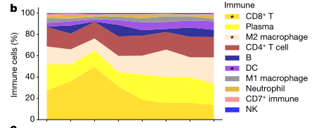

# Organization of the human intestine at single-cell resolution

文本讨论了肠道的结构、功能和细胞组成的复杂性，以及肠道如何通过其细胞类型的定位、发展轨迹和详细的转录程序来驱动这些功能上的差异。肠道不仅是一个复杂的器官，它促进消化，提取营养，参与免疫监视，维持与微生物的关键共生关系，并影响整体健康。具体来说，肠道长度超过九米，沿其长度结构和功能存在差异。

为了更好地理解这些差异，研究人员使用多重成像技术以及单核RNA和开放染色质测序方法，对来自九个捐赠者的八个不同肠道部位的单个细胞的组织结构进行了评估。通过系统分析，研究发现肠道各区域的细胞组成差异显著，展示了上皮亚型的复杂性，并发现相同的细胞类型在不同的邻域和社区中有不同的组织形式，突出显示了肠道中存在的独特免疫生态位。此外，研究还绘制了这些细胞中的基因调控差异，这些差异暗示了一种调节分化的级联反应，并将肠道疾病的遗传易感性与特定细胞类型相关联。

这些结果描述了这一器官的细胞组成、调控和组织的复杂性，并为理解人类生物学和疾病提供了一个重要的参考图谱。

*****

比喻讲解：

想象肠道就像一个复杂的工厂，它的主要任务是处理原材料（食物），提取有用的资源（营养物质），并且管理废料。这个工厂沿着一条超过九米的长带（肠道）分布，每一个部分都有其独特的生产线（细胞类型和功能）和质量控制系统（免疫监视）。

1. **工厂布局与工人分布**：
   - 工厂的每个部分都设计有特定的生产区（不同的肠道部位），这些区域根据所需处理的原材料和生产的产品（吸收营养和消化）有所不同。工人（细胞）在这些区域根据需要被分配和组织起来，以最高效地完成任务。

2. **专业团队与工作流程**：
   - 在这个工厂中，不同的工作小组（细胞类型如上皮细胞亚型）根据其特定技能和功能分组工作。例如，有些团队专门负责处理进入工厂的原材料（食物），而其他团队则负责检查和保证产品质量（免疫监视和微生物共生关系）。

3. **质量控制与环境适应**：
   - 工厂内设有高级的质量控制系统（免疫生态位和基因调控差异），这些系统可以根据外部市场的需求（身体的健康状况和疾病状态）调整生产线。通过这种方式，工厂不断优化其工作流程和产品，确保能够有效地应对变化的环境。

4. **研发和创新**：
   - 工厂还拥有一个研发部门，负责开发新技术和改进现有工艺（基因调控的研究和细胞分化级联）。这些创新有助于提高生产效率，减少废料，并开发新产品，以适应市场的变化。

5. **地理和社区影响**：
   - 工厂对周边社区（人体）有重大影响，通过优化其内部结构和流程，可以提高整个社区的生活质量（整体健康）。这需要工厂与本地资源（微生物群）保持良好的共生关系，共同促进社区的繁荣。

这个工厂的每一个改进和优化都是基于对其各个部门和小组细节的深入了解（单细胞分析和多重成像技术），这为确保整个工厂高效运转提供了关键信息。

***** 

问题：
**如何描述单细胞技术在研究肠道中不同细胞类型之间交互作用和功能差异的作用？**

答案和讲解：
单细胞技术，包括单核RNA测序和开放染色质测序，使研究者能够在非常细致的水平上评估肠道中不同细胞类型的组织结构和功能。通过这些技术，科学家可以在多个肠道部位从多个捐赠者中收集和分析单个细胞的数据。这种系统性分析揭示了肠道不同区域之间在细胞组成、免疫微环境以及基因调控上的显著差异。此外，这些技术还帮助研究人员揭示了肠道疾病的遗传易感性可能与特定细胞类型相关，从而为理解人类生物学和疾病提供了重要的参考图谱。

比喻讲解：
如果把肠道比作一个大型的信息中心，单细胞技术就好比是高级监控系统，能够精确追踪每一个工作人员（细胞）的工作性能和行为模式。在这个信息中心，不同的部门（肠道不同部位）承担不同的任务，而监控系统可以详细记录每个部门的工作流程和交互方式。通过这种方式，管理者（科学家）可以了解哪些部门运作良好，哪些部门可能存在问题，甚至还能发现某些特定的工作人员（细胞类型）如何影响整个中心的效率和安全。这种详细的监控不仅提高了整个信息中心的运作效率，也保证了它能够迅速应对外部的挑战和需求。

*****

文本中描述的是人类成年肠道系统的结构和功能。

1. **肠道系统的结构**: 人类成年的肠道系统包括大约7米长的小肠和2米长的大肠。这个系统是人体消化系统的重要组成部分，主要完成消化过程中的后段工作。

2. **消化过程**: 消化过程始于口腔，经过胃部，然后进入肠道系统。在小肠中，主要完成水分和小分子营养物质（如糖类、单价离子和氨基酸）的吸收。这是通过小肠壁的高效吸收机制来实现的，小肠壁具有大量的绒毛，可以增加吸收面积，促进营养物质的吸收。

3. **大肠的功能**: 随后，更大的分子，如纤维素等，在大肠中积聚。大肠充当一个厌氧发酵室，使得这些大分子能够被分解和吸收。在这个过程中，肠道微生物发挥了重要作用，它们通过发酵过程分解食物残渣，产生的副产品（如短链脂肪酸）及其他营养素（如维生素）也被肠道吸收。

4. **肠道微生物与营养合成**: 肠道微生物不仅帮助分解不能由人体自身酶分解的复杂物质，还参与合成某些营养物质，如维生素B群和维生素K等，这些营养物质对于人体健康至关重要。

总体来看，人类肠道系统不仅仅是消化食物的器官，它还是一个复杂的生态系统，肠道微生物在其中扮演着关键角色，帮助人体从食物中获取必需的营养成分，并且还参与合成一些人体必需的营养素。

*****

比喻讲解：

人类的成年肠道系统可以被比喻为一个高效且复杂的工厂，它专注于处理和转化原材料（食物），最终生产出我们身体所需的精细产品（营养物质）。

1. **小肠——精细加工车间**：
   - 小肠就像是工厂中的精细加工车间，它负责从半成品（部分消化的食物）中提取小分子物质，如糖类、氨基酸和单价离子。这个过程可以想象成一个高科技的筛选系统，能够快速且精确地挑选出有用的原料，将它们转化为工厂即将使用的材料。

2. **大肠——回收处理区**：
   - 大肠则可以看作是工厂的回收处理区。在这里，那些未被小肠处理的、更复杂的原材料（如纤维）被收集并进行厌氧发酵处理。这个区域充满了工作人员（肠道微生物），他们专门处理那些难以分解的材料，通过发酵等过程将其转化为可用的副产品，如短链脂肪酸等。同时，这些工作人员还能合成工厂所需但自身无法生产的特殊材料（如维生素B和K）。

3. **肠道微生物——专业工人团队**：
   - 肠道微生物可以被视为工厂里的专业工人团队。他们不仅负责处理那些特殊或难以处理的材料，还能创造出对整个工厂（人体）有益的新产品。他们的工作确保了工厂的高效运转，同时也保持了产品（身体健康）的高质量标准。

通过这样的比喻，我们可以更生动地理解人类肠道系统的功能和重要性，这不仅是一个简单的消化管道，而是一个高度组织化、精密运作的生物工厂，专门从事原材料的高效转化和优质产品的生产。

*****

问题：
如何描述人类成年肠道系统在消化过程中的主要功能和它与肠道微生物的关系？

答案和讲解：
人类成年肠道系统包括大约7米的小肠和2米的大肠，主要完成从口腔和胃开始的消化过程。小肠主要负责吸收水分和小分子营养物，如糖、单价离子和氨基酸。大肠则主要处理较大的分子如纤维，并充当厌氧发酵室，通过肠道微生物的帮助，分解并吸收副产品以及合成和吸收其他营养素如维生素。这一过程显示了肠道微生物在维持营养平衡和促进健康中的重要作用。

比喻讲解：
可以将人类的肠道系统比作一个高效的生物工厂，其中小肠是初级加工车间，专门处理和提取小分子原料；大肠则像是这家工厂的回收利用区，处理难以消化的大分子原料，并转化为有用的副产品。肠道微生物则是工厂中的专业工人，他们不仅帮助处理废料，还能合成必需但自身无法生产的物质，如特定的维生素，从而确保整个工厂（即人体）的顺利运转和产品质量。

*****

文本内容主要描述了人体小肠和大肠的结构与功能特点，以及它们内部的细胞多样性和特定细胞类型的空间组织。

1. **小肠的异质性**：
   - 小肠在形态上可以分为三个不同的区域：十二指肠、空肠和回肠。这些区域各自拥有各种表型上和形态上不同的细胞类型。小肠不仅仅在解剖结构上有区别，其内部的细胞种类也具有高度多样性。

2. **大肠的分区**：
   - 大肠可以被划分为升结肠、横结肠、降结肠和乙状结肠。与小肠一样，大肠的每个解剖区域都含有表型和形态上多样的细胞。

3. **细胞类型的多样性与特定细胞的定位**：
   - 在整个肠道中，上皮细胞、基质细胞和免疫细胞是主要的细胞类型，且每种类型中还包含多种细胞亚型。免疫细胞尤其引人关注，因为它们与肠道中的微生物群和外来物质发生互动。
   - 特定类型的细胞在肠道的不同位置表现出特定的分布偏好。例如，潘氏细胞主要分布在小肠中，而肠内分泌的L细胞主要在回肠和大肠中发现。

4. **细胞的空间组织与‘邻里’结构**：
   - 这些细胞类型在肠道各个区域中按照不同的“邻里”结构空间组织。这些“邻里”的组成以及构成这些“邻里”的细胞的分子表型在肠道的不同解剖区域中有着相对未知的变化方式。
   - 这种在功能性邻里的组成和细胞状态的分子身份上的差异，定义了人类肠道的组成和功能。

总的来说，这段文本强调了人体肠道的复杂性和其内部细胞类型的多样性及其空间和功能的异质性。这些信息对于理解肠道的生理功能及其在健康和疾病中的作用至关重要。

*****

比喻讲解：

想象人体的肠道就像一个精心设计的大型公园，这个公园不仅风景各异，还根据地形和功能划分为不同的区域。每个区域都有其独特的景观和植被，而肠道中的各种细胞类型则可以比作这个公园中的不同植物种类。

1. **小肠的三个区域**：小肠可以比作公园中的三个主要园区，每个园区都有其特色。**十二指肠**就像是公园的入口区，迎接各种营养物质的首站；**空肠**则像是一条蜿蜒的小径，吸收营养的过程在这里得以延续；**回肠**则是通向出口的路径，吸收剩余营养，并准备将废物传输至大肠。

2. **大肠的分区**：大肠可以被视为公园的不同景观区。**升结肠**是公园的上升部分，逐步处理从小肠来的物质；**横结肠**则如同公园的中央带，连接起始与终点；**降结肠**和**乙状结肠**则处理并准备排出公园的废弃物。

3. **公园中的植物——细胞类型**：
   - **上皮细胞**、**基质细胞**和**免疫细胞**就像是公园中的花草树木，每种植物承担不同的角色。其中，**免疫细胞**如同公园的守护者，与入侵的害虫（微生物和外来物质）战斗，保护公园的安全。
   - 特定的细胞类型如**潘氏细胞**和**L细胞**则可以比喻为公园中只在特定区域生长的珍稀植物，如潘氏细胞主要在“小肠园区”内，而L细胞在“回肠和大肠区”内更为常见。

4. **细胞的邻里组织**：公园内的植物根据不同的生态需求和功能被安排在不同的‘邻里’中。这些邻里的组合和植物的种类随着公园的不同部分而变化，反映出该区域的特定功能和气候条件。

总之，人体肠道如同一个复杂的生态公园，其中的每一种细胞和每一个区域都是精心设计，以满足整个系统的需要，保持健康和平衡。这种精妙的组织和功能分化是人体能有效消化和吸收营养，同时抵御疾病的关键。

*****

问题：
**在描述人体肠道的不同区域和其中的细胞类型时，为什么要强调它们的特定空间分布和功能区分呢？**

答案和讲解：
肠道的不同区域（如小肠的十二指肠、空肠和回肠以及大肠的升结肠、横结肠等）具有不同的生理功能和特化的细胞类型，这是因为每个区域必须处理不同类型的生物化学过程和物质。例如，十二指肠主要负责初步消化吸收，而回肠更多涉及吸收营养物质和水分。特定细胞类型如Paneth细胞和L细胞在某些区域的聚集，说明它们在那些区域的生物化学过程中扮演着关键角色。例如，Paneth细胞通过分泌抗菌物质保护肠道，而L细胞则参与调节能量平衡和胰岛素分泌等。这种精确的空间和功能安排使得肠道可以高效且有序地处理食物，并参与整体的代谢调控。

比喻讲解：
可以将人体肠道比作一家大型工厂，这家工厂的不同车间（肠道的不同区域）负责不同的生产线（消化、吸收等过程）。每个车间都配备了专门的机器和工人（特定的细胞类型），这些机器和工人根据其所在车间的特定任务进行优化配置。例如，原料处理车间（十二指肠）配备了能迅速处理原材料的重型机械（Paneth细胞等），而包装部门（回肠和大肠）则有精密的包装和检验设备（L细胞等），以确保最终产品的质量控制和资源有效利用。这样的组织结构确保了整个工厂运行效率高、误差低，能够顺利完成从原材料到成品的所有步骤。

*****

文本中描述了一个关于肠道不同部分的详细研究，这项研究使用了单核RNA、开放染色质和空间蛋白质组成像技术，在单细胞分辨率水平上进行映射。之前的研究已经利用单细胞RNA测序（scRNA-seq）技术对细胞类型进行了映射，并且已经编制了整个肠道的细胞类型目录。在此基础上，该研究通过使用索引共检测（CODEX）技术，进一步扩展了这项研究，不仅映射了细胞，还映射了蛋白质，增加了空间定位的维度。

这段文本重点介绍了以下几个关键点：

1. **单核RNA、开放染色质和空间蛋白质组成像技术的应用**：这些技术使研究人员能够在单细胞水平上查看肠道的不同部分，深入了解细胞的基因表达、染色质的状态以及蛋白质的分布和功能。

2. **先前研究的扩展**：文中提到的研究在现有的基础上进行了扩展，之前的工作主要集中在使用单细胞RNA测序技术对细胞类型进行识别和分类，而本研究加入了空间成像技术，提供了更多空间和结构上的信息。

3. **索引共检测（CODEX）技术的使用**：CODEX是一种先进的成像技术，可以同时检测多种细胞标记物，使得研究人员能够在组织的微观层面上进行详细的细胞和蛋白质定位。这种技术的应用对于理解复杂生物系统中的细胞组成和细胞间交互具有重要意义。

总的来说，这段文本描述了一个利用尖端生物信息学和成像技术的研究项目，该项目旨在深入理解肠道中的细胞和蛋白质如何在空间上进行组织和交互，从而推动我们对健康和疾病状态下肠道生物学的理解。

*****

比喻讲解：

想象一下你正在组装一张非常复杂的多层拼图。每一块拼图都代表肠道中的一个细胞，而拼图的完成图案则揭示了整个肠道的详细结构和功能。在这个比喻中，单核RNA、开放染色质和空间蛋白质组成像技术就像是放大镜，帮助你看清每一块拼图上的细节，比如细胞的基因表达情况、染色质的开放状态和蛋白质的精确位置。

先前的研究已经帮助我们拼好了这张拼图的大部分，通过单细胞RNA测序技术，我们能够识别和分类肠道中的不同细胞类型，就像是能够辨认出每一块拼图并知道它们各自的图案。但是，要完成整张拼图，我们还需要知道每一块拼图的确切位置以及它们是如何相互连接的。

索引共检测（CODEX）技术的引入就像是在我们的放大镜上加了一个高级的定位系统，不仅能看到每一块拼图的详细信息，还能精确地知道它们在整张拼图中的位置。通过这种技术，我们可以在肠道的具体空间位置上映射细胞和蛋白质，了解它们是如何在不同层次上协同工作的，从而帮助我们更好地理解健康和疾病状态下肠道的复杂生物机制。

因此，这项研究不仅仅是在拼凑一张更全面的肠道拼图，它还在努力揭示这张拼图是如何一块块精准拼接在一起的，每一块都在其特定的位置上发挥着重要的作用。这种详尽的映射和深入的理解是开发新的治疗方法和预防策略的关键，就像是在完成这张复杂拼图的同时，也能够发现新的创造和修复的可能性。

*****

问题：
什么是CODEX技术，它在肠道单细胞研究中扮演了什么角色？

答案和讲解：
CODEX（Co-Detection by indEXing）是一种先进的成像技术，它允许同时在单个细胞层面上检测多种蛋白质和其他生物标记物。这项技术通过使用特定的抗体标记和一种独特的索引系统，使研究人员能够在细胞和组织样本中精确地映射出哪些蛋白质被表达以及它们的确切位置。在肠道的单细胞研究中，CODEX技术使科学家能够不仅仅看到肠道中的不同细胞类型，还能观察到这些细胞如何在空间上相互作用和分布，从而提供了细胞之间交互作用和肠道疾病机制更深层次的洞见。

比喻讲解：
可以将CODEX技术比作一台高级的相机，不仅能拍摄肠道这个“大城市”的空中照片（显示所有建筑即细胞的位置），还能详细记录每座建筑的结构和内部功能（即细胞中的蛋白质表达和位置）。就像一位城市规划师利用这些照片和数据来理解城市的布局和功能区域如何协同工作以及可能的问题所在，科学家们使用CODEX技术来理解肠道中不同细胞如何互动，并揭示健康和疾病状态下肠道生物学的复杂性。

*****

该文本描述了一个关于人类肠道细胞组成、调控信息及单细胞空间分布的研究。通过使用单核RNA测序（snRNA-seq）、单细胞ATAC测序（snATAC-seq）和CODEX技术，研究团队对多个捐献者的肠道进行了详细的细胞图谱绘制。

1. **单核RNA测序（snRNA-seq）**：这项技术用于测量单个细胞核中的RNA转录本，可以帮助研究者了解不同细胞类型在基因表达层面的特征。

2. **单细胞ATAC测序（snATAC-seq）**：这种技术用于测量单个细胞中的开放染色质区域，可以揭示调控基因表达的潜在因素，即哪些基因区域是活跃的，有助于转录因子等调控蛋白的结合。

3. **CODEX技术**：通过使用多达54种抗体探针标记同一组织切片上的不同靶标（通常是蛋白质），该技术能够在蛋白质水平上对组织进行详细的染色和分析。

在此研究中，共分析了来自九名个体的八个组织切片，这些个体包括七名欧洲血统人士（五男二女）和两名非洲裔美国人（一男一女），年龄范围从24岁到78岁。这八个区域沿着胃到肠道的轨迹排序，包括：小肠的十二指肠、近端空肠、中空肠和回肠，以及大肠的升结肠、横结肠、降结肠和乙状结肠。

总之，这项研究通过高级的单细胞测序技术和蛋白质组学技术，对人类肠道进行了深入的细胞和分子层面的映射，有助于科学家们更好地理解肠道健康和疾病状态下的细胞组成和功能变化。

*****

比喻讲解：

想象一下，我们的肠道就像一个庞大而复杂的城市，每一个细胞、每一段DNA、每一种蛋白质都是城市中的居民、建筑或道路。在这个比喻中，研究人员的目标是要绘制出这座“城市”的详细地图。

1. **单核RNA测序（snRNA-seq）**：使用这项技术可以比作是访问每一个家庭（细胞核），并记录他们的日常对话（RNA转录本）。这就像是理解城市中每个居民的日常活动和职责，帮助我们明白这个城市（肠道）的运作和居民（细胞）的生活方式。

2. **单细胞ATAC测序（snATAC-seq）**：这项技术的使用好比是检查每栋建筑（细胞）的门窗是否开放，哪些区域可以让人自由进出（开放染色质）。这有助于我们了解城市中的哪些区域是商业区、居住区或是工业区，即细胞中哪些基因是活跃的，可能参与调控城市的基本功能。

3. **CODEX技术**：通过这项技术标记不同的蛋白质目标，就如同用不同颜色的灯光照亮城市的特定建筑（蛋白质），使我们能够从高空（组织层面）观察城市的整体布局和特色建筑的功能。

在这个研究项目中，科学家们就像是城市规划者和地图制作者，他们通过详细地记录和分析来自不同街区（肠道各部分）的数据，从而制作出一张详尽的城市地图。这张地图覆盖了从小肠的起始区域（十二指肠）到大肠的末端区域（乙状结肠），并且包含了来自不同背景居民的信息。这样的地图有助于我们理解肠道这座“城市”如何正常运作，以及在疾病状态下可能发生了哪些变化。

*****

本文描述了一项使用CODEX多重成像技术对人类肠道进行空间映射的研究。研究覆盖了肠道的八个区域，旨在深入了解细胞间的相互作用、多细胞组织单元的组成以及这些与肠道整体功能的空间关系。

首先，研究团队在一个参与者（标记为B001）的新鲜冷冻样本上对CODEX染色、成像和图像处理进行了验证和优化。这些样本的截面面积为16平方毫米。通过这一过程，研究人员确保了成像技术的有效性和适用性，相关的结果和优化详情记录在补充材料的图1-3中。

在随后的研究中，为了更全面地映射肠道，团队扩展了CODEX抗体面板，增加了17种针对肠道特有的标记物。这些新的标记物经过严格验证，结果和相关信息记录在补充信息1和补充图4中。扩展后的抗体面板总共包括54种抗体，这使得研究者能够在空间上识别出25种细胞类型。详细的细胞类型识别数据记录在扩展数据图1c以及补充图5和6中。

图例:

    Supplementary Figs. 1–3

补充图 1：供体 B001 小肠和结肠样本的 CODEX 多重标记成像

A) 用于成像的 44 个标记抗体基础面板

这部分描述了用于 CODEX 成像的初始抗体组。这些抗体可能针对小肠和结肠组织中的各种分子。

B) B001 结肠 8 个不同取材部位之一的 CODEX 成像，显示 5/44 个标记物（比例尺 = 500 微米）

本部分展示了来自供体 B001 结肠的 8 个取材部位之一的 CODEX 图像。图像显示了 5 个选定的标记物，并带有比例尺。

    为了更详细观察，图像中放大了四个区域（比例尺 = 100 微米），这些区域取自较大的图像（由彩色轮廓线表示），并展示了来自相同区域的苏木素-伊红 (H&E) 染色切片图像。

C) 同一区域的多细胞邻域图，包括细胞类型图和围绕免疫滤泡区域放大的邻域图

本部分描述了与 B 部分相同的区域的细胞类型和邻域信息。

    图像显示了供体 B001 样本中 8 个取材部位之一的多细胞邻域图，并对免疫滤泡区域进行了放大展示。

注意

    这幅图像是来自供体 B001 的 8 个样本中之一的代表性图像。

补充图 2: 所有成像区域的细胞类型图。供体 1 (B001) 的小肠和结肠 (比例尺 = 1 毫米)

这句话描述了供体 1 (B001) 小肠和大肠的附加图 2。

该图展示了所有 8 个成像区域的细胞类型分布情况。
每个区域将以某种方式可视化，例如使用不同的颜色代表不同的细胞类型。
图中包含比例尺，长度为 1 毫米，帮助读者理解图像的放大倍率。

供体 1 的所有 8 个区域中 CODEX 多重标记成像的多细胞邻域分析

A) 热图显示每个邻域内的细胞类型富集得分

    这句话描述了使用热图来可视化供体 1 的 8 个区域中每个多细胞邻域的细胞类型组成情况。
    热图中不同颜色代表了不同程度的细胞类型富集，例如红色可能代表高富集，蓝色可能代表低富集。

B) 将细胞类型信息映射回每个成像样本（比例尺 = 1 毫米）

    这句话描述了将 A 部分中分析得到的细胞类型信息可视化回供体 1 的 8 个单独成像样本上。
    图像可能使用不同的颜色代表不同的细胞类型，并带有比例尺（1 毫米）帮助理解图像的放大倍率。

Supplementary Fig. 4 & 5 & 6

补充图 4: 扩展的 54 抗体 CODEX 多重标记成像

A) B004 供体的一个区域（共 8 个），显示 6 个标记物（波形蛋白，CD3，aSMA，CD45，细胞角蛋白和 CD31）（比例尺 = 500 微米）

    这部分展示了来自 B004 供体的一个取材区域的 CODEX 图像。图像显示了 6 种选定的标记物，并带有比例尺。

B) 放大区域，分别显示 A 图中突出显示的区域（黄色框）的 6 个标记物，并添加了额外的标记物（比例尺 = 100 微米）

这部分展示了 A 图中标注区域的放大图像，并显示了额外的标记物。每个放大区域可能包含相同的 6 个标记物，并添加了额外的标记物进行更详细的观察。

C) 按行和列归一化的细胞类型标记物热图，用于展示 B004、B005 和 B006 样本的 CODEX 多重标记成像中定义细胞类型的标记物

这部分描述了按行和列进行归一化的热图。该热图展示了来自 B004、B005 和 B006 供体的样品中，CODEX 多重标记成像数据中用于定义细胞类型的标记物。

行和列的归一化可能有助于可视化哪些标记物在定义不同细胞类型方面更突出。

补充图 5: 小肠和大肠所有成像区域的细胞类型图。供体 A) B004、B) B005 和 C) B006 (比例尺 = 1 毫米)

这句话描述了附加图 5 的内容，该图展示了来自三个供体 (B004、B005 和 B006) 小肠和大肠的细胞类型分布情况。

图像可能使用不同的颜色代表不同的细胞类型。
图中包含比例尺 (1 毫米)，帮助读者理解图像的放大倍率。
对于每个供体，该图可能展示其小肠和大肠所有 8 个成像区域的细胞类型分布。

补充图 6: 所有供体 (n=8，误差线表示标准差) 的细胞类型百分比量化

A) 按供体分离的细胞类型百分比

这部分描述了按供体 (共 8 个) 进行分类的细胞类型百分比数据。图像或表格可能显示每个供体中不同细胞类型的平均百分比及其标准差 (由误差线表示)。

B) 按肠道位置分组的细胞类型百分比

这部分描述了按肠道不同位置分组的细胞类型百分比数据。图像或表格可能显示小肠上段、中段和小肠下段等不同肠道区域中各种细胞类型的平均百分比及其标准差。

C) 肠道内所有细胞类型汇总的细胞类型百分比图

这部分描述了肠道内所有细胞类型的汇总百分比图。该图可能显示肠道不同位置的总细胞类型组成，并按百分比进行可视化。

这段文字描述了 CODEX 技术在小肠 (SB) 某个区域的应用示例。

以下是该段落的翻译：

示例图像：使用 CODEX 技术获得的小肠 (SB) 某个区域的荧光图像（来自一位供体的 64 个组织切片之一），图像显示了 6/54 个标记物 (scale bar = 1 毫米，放大插图 = 100 微米）。C) 则为经过细胞分割和非监督聚类后得到的细胞类型图。

术语解释：

CODEX：一种用于组织成像的多重标记免疫荧光技术。
小肠 (SB)：消化系统的一部分，负责吸收营养物质。
标记物：用于特异性识别细胞中特定分子的分子探针。
细胞分割：将图像中的细胞彼此分开的过程。
非监督聚类：一种将数据点分组到具有相似特征的簇中的算法。

*****

比喻讲解：

想象一下，如果我们的肠道是一个庞大复杂的主题公园，每个细胞、每种组织单元就像是公园里的不同景点和设施。为了能够详细地了解这个主题公园的布局和各个景点之间的相互作用，我们需要一张详尽的地图。这正是CODEX多重成像技术所做的工作。

首先，想象我们有一张粗略的公园草图，但为了让游客（科学家和医生）更好地导航和理解公园，我们需要对这张地图进行验证和优化。这就好比我们首先在一个小区域（一个志愿者B001的样本）测试我们的地图绘制方法，确保这些方法能准确反映出这个区域的真实情况，就像在一个特定的公园区域测试最新的导航设备。这个过程的细节和优化结果记录在了补充图1-3中。

完成初步测试后，为了更全面地覆盖整个主题公园，我们决定扩大我们的工具箱，引入更多专门针对公园中特定景点（肠道标记物）的导航工具。我们添加了17种新的标记物，使得我们的导航工具包括了总共54种抗体。这相当于在地图上添加了新的图标和符号，帮助游客识别和访问公园中的25种不同的景点。这个扩展过程的详细信息记录在补充信息1和补充图4中，而各个景点的具体位置和信息则记录在扩展数据图1c以及补充图5和6中。

通过这种方式，CODEX多重成像技术帮助我们不仅制作了一个包含所有主要景点的详细且功能齐全的主题公园地图，还使得游客能够更好地理解这些景点之间如何协作，共同营造一个有趣且互动的环境。

*****

问题：
如何通过CODEX多重成像技术对人类肠道进行详细映射，并为什么需要对此技术进行优化？

答案和讲解：
CODEX多重成像技术通过使用一系列特定的抗体探针来标记和视觉化肠道组织中的不同细胞类型和蛋白质。这项技术使研究人员能够在单个组织切片上同时检测多达54种不同的标靶，从而深入理解细胞间的相互作用、组成及其在肠道功能中的空间关系。首先，在一个参与者（B001）的样本上进行了CODEX染色、成像和图像处理的验证和优化，确保技术的有效性和适用性。随后，通过添加和验证针对肠道特有的17种新标记物，扩展了抗体面板，从而增强了对肠道细胞类型的空间识别能力。优化这项技术是必要的，因为它确保了成像和数据分析的准确性，提高了研究的可靠性和深度。

比喻讲解：
想象肠道像一个复杂的迷宫，每个细胞和蛋白质都是迷宫中的一个房间或物品。CODEX多重成像技术就像是一把含有54种不同钥匙的钥匙串，每把钥匙可以打开迷宫中特定的房间（细胞类型或蛋白）。开始时，我们只在一个小区域（B001样本）测试这些钥匙以确认每把钥匙都能正确工作并打开正确的门。确认这点后，我们增加了更多的钥匙（特定标记物），以便探索迷宫中更多的房间。通过这种方式，我们不仅能够看到每个房间的样子，还能理解它们之间是如何相互连接和互动的，从而完整地了解整个迷宫的结构和功能。

*****

在本研究中，我们使用了包含270万个细胞的数据集来比较不同组织区域的细胞组成和结构，同时对总体细胞群组进行了标准化（图1a-c）。在结缔组织区域，从小肠到结肠，我们观察到内皮细胞数量减少，而平滑肌细胞数量增加（图1a和扩展数据图1d）。为了验证这一现象是否为由于在结肠样本中相对于小肠捕获更多的外肌层导致的假象，我们计算了肠道四个不同病理部分（黏膜层、肌层、黏膜下层和外肌层）中所有细胞类型的百分比。事实上，即使是在比较所有存在于外肌层的细胞类型时，内皮细胞的显著减少和平滑肌细胞的增加仍然存在（扩展数据图1e）。因此，结肠中的血管系统不仅整体较少，而且在外肌层中的血管较少，平滑肌细胞密度更高。

图例:

Fig. 1a–c

这段文字描述了利用 CODEX 多重标记成像技术来创建健康人体小肠和大肠的单细胞图谱。

    研究人员利用 CODEX 技术对小肠和大肠的八个区域进行了成像，旨在绘制出这些区域内单个细胞的详细分布图。
    图表 (a-c) 展示了基于 CODEX 数据计算出的八位供体的平均细胞类型百分比。
    这些百分比进一步分为三个区室：
        间质区 (a): 提供支持和结构的结缔组织细胞。
        免疫区 (b): 参与免疫系统功能的细胞。
        上皮区 (c): 衬于肠道表面的细胞。
    研究人员进行了统计分析，比较了小肠 (SB) 和结肠 (CL) 之间的细胞类型百分比差异。
    使用了双侧 t 检验进行比较。
    星号 (*) 表示具有统计学意义的差异 (p 值小于 0.05)。

缩写解释

ICC：Cajal 间质细胞 (肠壁中的特殊细胞)
NK：自然杀伤细胞 (免疫系统的一部分)
TA：转运扩增细胞 (快速分裂的未成熟细胞)

Extended Data Fig. 1d& e
 

D) 相对于所有肠道间质细胞 (D)：

这部分询问的是某种特定肠道间质细胞类型的百分比，该百分比占所有肠道间质细胞的比例。

E) 局限于肌层组织单位的所有细胞 (E)：

这部分询问的是某种特定肠道间质细胞类型的百分比，该百分比仅占肌层组织单位所有细胞的比例。换句话说，该比例仅限于肌层这一肠道结构层。

*****

比喻讲解：

想象我们的肠道是一座由不同种类的建筑组成的城市，这些建筑代表了不同类型的细胞，而每个建筑的风格和功能则反映了它们在肠道中的具体角色。在这个研究中，我们使用一个大型的细胞数据库，就像是使用卫星图像来观察和比较整个城市的结构和组成变化。

1. **从小肠到结肠的变化**：可以想象在从小肠到结肠的这段路程上，城市中的水管系统（代表内皮细胞）逐渐变少，而钢铁工厂（代表平滑肌细胞）则变得更加密集。这种变化反映了每个区域在肠道中的不同功能和结构需求。

2. **验证过程**：为了确保这种变化不仅仅是因为某个区域（如结肠）相比另一个区域（如小肠）被我们观察得更多，我们进一步深入分析，检查了城市的不同部分——从住宅区（黏膜层）到工业区（外肌层）。即使在重点比较工业区内部的情况时，水管系统的减少和钢铁工厂的增加仍然非常明显。

3. **结论**：这表明结肠区不仅整体上工厂更密集，而且即使在工业区内部，其水管系统也更少，钢铁工厂更密集。这种观察帮助我们理解肠道不同部分在维持健康和处理食物过程中的不同角色和需求。

通过这样的比喻，我们可以更生动地理解肠道中细胞类型变化的重要性，以及它们在健康和疾病中的作用。

*****

问题：
为什么在从小肠到结肠的过程中会观察到内皮细胞数量的减少和平滑肌细胞数量的增加？这种现象在研究中是如何验证的？

答案和讲解：
在研究中，使用了单核RNA测序技术和单细胞ATAC测序来详细分析了从小肠到结肠不同区域的细胞组成。观察到内皮细胞数量的减少可能反映了结肠相对较少的血管需求，而平滑肌细胞的增加则与结肠在物理消化和推动内容物方面的功能增强有关。为了验证这一现象不是由于样本捕获偏差造成的（例如，结肠样本中捕获了更多的外肌层），研究人员计算了肠道四个不同解剖部分中所有细胞类型的百分比。结果确认，即使在单独比较外肌层中的细胞类型，内皮细胞数量仍显著减少，平滑肌细胞数量增加，这表明观察到的现象是实际的生物学变化，而非采样误差。

比喻讲解：
想象肠道就像一条从城市（小肠）通向乡村（结肠）的高速公路。在城市部分，道路两旁有许多服务站和维修店（类似于内皮细胞），因为在人口密集的地区，交通事故和车辆问题较为频繁，需要更多的服务设施。而到了乡村，道路变得更宽广，车速更快，此时路边的服务站较少，但是有更多的仓库和加工厂（类似于平滑肌细胞），因为这里主要是处理和储存从城市传来的货物。通过检查整条路线上的各种设施，可以确认城市和乡村之间的功能差异是真实且具有实际意义的，而不仅仅是因为某一地区被观察得更多。

*****

在免疫系统的部分，我们观察到从小肠到结肠，CD8+ T细胞的数量呈现下降趋势（如图 Fig. 1b, Extended Data Fig. 1f 和 Supplementary Fig. 7a–c 所示），这与之前的研究结果一致。相反，我们观察到与小肠相比，在结肠中树突状细胞的比例有所增加，这一现象也可以从粘膜内的总细胞百分比中观察到（如图 Fig. 1b 和 Extended Data Fig. 1f 所示）。

图例：Fig. 1b, Extended Data Fig. 1f, Supplementary Fig. 7a–c

细胞类型被归一化到三个区室：间质区 (a)、免疫区 (b) 和上皮区 (c)。

这句话的意思是，研究人员测量了 32 个组织切片中不同平滑肌多细胞邻域内的平滑肌细胞密度，并将其数据绘制在图表上 (x 轴代表不同的平滑肌多细胞邻域)。

这段文字描述了利用 CODEX 多重标记成像技术量化肠道中不同细胞类型的含量。

    A) 免疫细胞类型百分比（占所有免疫细胞的比例）：
        这部分分析了肠道组织中不同免疫细胞类型的含量，并将其含量表示为占所有免疫细胞的百分比。

    B) 跨不同区域样本（小肠到结肠）的 CD8+ T 细胞占所有细胞类型的百分比：
        这部分分析了从小肠到结肠不同区域样本中，CD8+ T 细胞占所有细胞类型的百分比。换句话说，它查看了肠道不同部位 CD8+ T 细胞的相对丰度。

    C) 单向方差分析 (ANOVA) 发现不同肠道区域 CD8+ T 细胞百分比存在显著差异后，使用 Tukey 后续检验得到的 p 值热图：
        研究人员首先使用单向方差分析 (ANOVA) 检验了小肠和结肠不同区域的 CD8+ T 细胞含量是否存在统计学上的差异。
        如果 ANOVA 发现存在显著差异，则会进一步使用 Tukey 后续检验来分析各个区域之间的具体差异。
        这部分描述的是使用 Tukey 后续检验得到的 p 值热图。p 值用于评估差异的显著性，热图则可以直观地展示不同区域之间差异的强弱。

*****

比喻讲解：

想象一下，人体的免疫系统就像一个庞大的安全系统，而各种免疫细胞则是其中的安全人员。在这个比喻中，CD8+ T细胞可以被看作是特种部队，它们在小肠这一区域的存在密度正在减少，就像特种部队从城市的一个区域撤离到另一个区域。这种变化在图 Fig.1b, Extended Data Fig. 1f 和 Supplementary Fig. 7a–c 中有所记录，与先前的观测结果相符，显示这是一个一致的趋势。

与此同时，树突状细胞——这些可以看作是巡逻警察——在结肠区域的比例却在增加。这种增加同样在图 Fig. 1b 和 Extended Data Fig. 1f 中得到了记录，并且从粘膜内的总细胞百分比来看，这一现象在整个结构中也有所体现。这就像在城市的某个区域加强了巡逻力度，以提高该区域的安全水平。

通过这些细胞的变化，我们可以看出免疫系统在不同肠道区域如何调整其资源分配，以最有效地应对可能的健康威胁。

*****

问题：
为什么在从小肠到结肠的过程中，CD8+ T细胞的数量会减少，而树突状细胞的比例却会增加？

答案和讲解：
从小肠到结肠，CD8+ T细胞数量的减少可能与肠道免疫环境的变化有关。CD8+ T细胞是免疫系统中的重要细胞，主要负责识别并杀死受病毒感染的细胞或癌变细胞。小肠的微环境可能更适合CD8+ T细胞的活性和生存，而结肠环境可能不利于这些细胞的维持。与此同时，树突状细胞在结肠中的比例增加，可能是因为结肠需要更多的抗原呈递和局部免疫调节，树突状细胞作为主要的抗原呈递细胞，在这一过程中扮演着关键角色。

比喻讲解：
想象一个军队在不同地形地貌中的战略部署。CD8+ T细胞如同特种部队，在小肠这个“前线基地”中较为集中，因为那里可能面临更多的外来侵害（如病毒感染）。当环境转移到结肠这样一个“内陆基地”时，这些特种部队的数量减少，可能是因为该地区的战略需求不同，需要更多的“警察力量”（树突状细胞）来维持当地的秩序和安全，进行日常的巡逻和监督，以及与“民众”（其他细胞类型）的互动和信息收集。这种战略调整帮助保证了整个“国家”（人体）的平衡和安全。

*****

在这段文本中，描述了在肠道上皮细胞区域观察到的几种细胞类型的变化。具体来说，从小肠移动到结肠时，观察到肠细胞数量减少，分泌性肠细胞（杯状细胞）和CD66+肠细胞数量增加，并且缺少潘氏细胞。此外，研究还发现在十二指肠相比于其他肠道区域富集了一种罕见的CD57+肠细胞群体。这些类似胃的细胞在十二指肠的粘膜下腺体区域富集。

这些观察揭示了在肠道不同部位上皮细胞群体的组成变化，特别是在小肠和结肠之间的转变。杯状细胞的增多可能与结肠中更多的粘液分泌和保护功能有关，而潘氏细胞的缺失可能影响肠道的微生物环境和宿主防御。CD66+肠细胞的增加和CD57+肠细胞的区域特异性富集可能指示这些细胞在局部免疫反应和肠道健康中的特定角色。

图例: Fig. 1c, Extended Data Fig. 1g, Supplementary Fig. 7d, Extended Data Fig. 1h, Supplementary Fig. 7e, Extended Data Fig. 1i, Supplementary Fig. 7f

