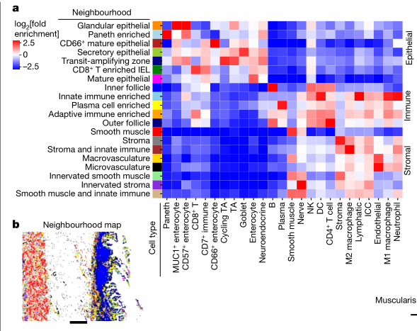
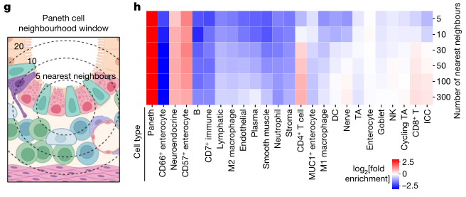

# Organization of the human intestine at single-cell resolution

文本讨论了肠道的结构、功能和细胞组成的复杂性，以及肠道如何通过其细胞类型的定位、发展轨迹和详细的转录程序来驱动这些功能上的差异。肠道不仅是一个复杂的器官，它促进消化，提取营养，参与免疫监视，维持与微生物的关键共生关系，并影响整体健康。具体来说，肠道长度超过九米，沿其长度结构和功能存在差异。

为了更好地理解这些差异，研究人员使用多重成像技术以及单核RNA和开放染色质测序方法，对来自九个捐赠者的八个不同肠道部位的单个细胞的组织结构进行了评估。通过系统分析，研究发现肠道各区域的细胞组成差异显著，展示了上皮亚型的复杂性，并发现相同的细胞类型在不同的邻域和社区中有不同的组织形式，突出显示了肠道中存在的独特免疫生态位。此外，研究还绘制了这些细胞中的基因调控差异，这些差异暗示了一种调节分化的级联反应，并将肠道疾病的遗传易感性与特定细胞类型相关联。

这些结果描述了这一器官的细胞组成、调控和组织的复杂性，并为理解人类生物学和疾病提供了一个重要的参考图谱。

*****

比喻讲解：

想象肠道就像一个复杂的工厂，它的主要任务是处理原材料（食物），提取有用的资源（营养物质），并且管理废料。这个工厂沿着一条超过九米的长带（肠道）分布，每一个部分都有其独特的生产线（细胞类型和功能）和质量控制系统（免疫监视）。

1. **工厂布局与工人分布**：
   - 工厂的每个部分都设计有特定的生产区（不同的肠道部位），这些区域根据所需处理的原材料和生产的产品（吸收营养和消化）有所不同。工人（细胞）在这些区域根据需要被分配和组织起来，以最高效地完成任务。

2. **专业团队与工作流程**：
   - 在这个工厂中，不同的工作小组（细胞类型如上皮细胞亚型）根据其特定技能和功能分组工作。例如，有些团队专门负责处理进入工厂的原材料（食物），而其他团队则负责检查和保证产品质量（免疫监视和微生物共生关系）。

3. **质量控制与环境适应**：
   - 工厂内设有高级的质量控制系统（免疫生态位和基因调控差异），这些系统可以根据外部市场的需求（身体的健康状况和疾病状态）调整生产线。通过这种方式，工厂不断优化其工作流程和产品，确保能够有效地应对变化的环境。

4. **研发和创新**：
   - 工厂还拥有一个研发部门，负责开发新技术和改进现有工艺（基因调控的研究和细胞分化级联）。这些创新有助于提高生产效率，减少废料，并开发新产品，以适应市场的变化。

5. **地理和社区影响**：
   - 工厂对周边社区（人体）有重大影响，通过优化其内部结构和流程，可以提高整个社区的生活质量（整体健康）。这需要工厂与本地资源（微生物群）保持良好的共生关系，共同促进社区的繁荣。

这个工厂的每一个改进和优化都是基于对其各个部门和小组细节的深入了解（单细胞分析和多重成像技术），这为确保整个工厂高效运转提供了关键信息。

***** 

问题：
**如何描述单细胞技术在研究肠道中不同细胞类型之间交互作用和功能差异的作用？**

答案和讲解：
单细胞技术，包括单核RNA测序和开放染色质测序，使研究者能够在非常细致的水平上评估肠道中不同细胞类型的组织结构和功能。通过这些技术，科学家可以在多个肠道部位从多个捐赠者中收集和分析单个细胞的数据。这种系统性分析揭示了肠道不同区域之间在细胞组成、免疫微环境以及基因调控上的显著差异。此外，这些技术还帮助研究人员揭示了肠道疾病的遗传易感性可能与特定细胞类型相关，从而为理解人类生物学和疾病提供了重要的参考图谱。

比喻讲解：
如果把肠道比作一个大型的信息中心，单细胞技术就好比是高级监控系统，能够精确追踪每一个工作人员（细胞）的工作性能和行为模式。在这个信息中心，不同的部门（肠道不同部位）承担不同的任务，而监控系统可以详细记录每个部门的工作流程和交互方式。通过这种方式，管理者（科学家）可以了解哪些部门运作良好，哪些部门可能存在问题，甚至还能发现某些特定的工作人员（细胞类型）如何影响整个中心的效率和安全。这种详细的监控不仅提高了整个信息中心的运作效率，也保证了它能够迅速应对外部的挑战和需求。

*****

文本中描述的是人类成年肠道系统的结构和功能。

1. **肠道系统的结构**: 人类成年的肠道系统包括大约7米长的小肠和2米长的大肠。这个系统是人体消化系统的重要组成部分，主要完成消化过程中的后段工作。

2. **消化过程**: 消化过程始于口腔，经过胃部，然后进入肠道系统。在小肠中，主要完成水分和小分子营养物质（如糖类、单价离子和氨基酸）的吸收。这是通过小肠壁的高效吸收机制来实现的，小肠壁具有大量的绒毛，可以增加吸收面积，促进营养物质的吸收。

3. **大肠的功能**: 随后，更大的分子，如纤维素等，在大肠中积聚。大肠充当一个厌氧发酵室，使得这些大分子能够被分解和吸收。在这个过程中，肠道微生物发挥了重要作用，它们通过发酵过程分解食物残渣，产生的副产品（如短链脂肪酸）及其他营养素（如维生素）也被肠道吸收。

4. **肠道微生物与营养合成**: 肠道微生物不仅帮助分解不能由人体自身酶分解的复杂物质，还参与合成某些营养物质，如维生素B群和维生素K等，这些营养物质对于人体健康至关重要。

总体来看，人类肠道系统不仅仅是消化食物的器官，它还是一个复杂的生态系统，肠道微生物在其中扮演着关键角色，帮助人体从食物中获取必需的营养成分，并且还参与合成一些人体必需的营养素。

*****

比喻讲解：

人类的成年肠道系统可以被比喻为一个高效且复杂的工厂，它专注于处理和转化原材料（食物），最终生产出我们身体所需的精细产品（营养物质）。

1. **小肠——精细加工车间**：
   - 小肠就像是工厂中的精细加工车间，它负责从半成品（部分消化的食物）中提取小分子物质，如糖类、氨基酸和单价离子。这个过程可以想象成一个高科技的筛选系统，能够快速且精确地挑选出有用的原料，将它们转化为工厂即将使用的材料。

2. **大肠——回收处理区**：
   - 大肠则可以看作是工厂的回收处理区。在这里，那些未被小肠处理的、更复杂的原材料（如纤维）被收集并进行厌氧发酵处理。这个区域充满了工作人员（肠道微生物），他们专门处理那些难以分解的材料，通过发酵等过程将其转化为可用的副产品，如短链脂肪酸等。同时，这些工作人员还能合成工厂所需但自身无法生产的特殊材料（如维生素B和K）。

3. **肠道微生物——专业工人团队**：
   - 肠道微生物可以被视为工厂里的专业工人团队。他们不仅负责处理那些特殊或难以处理的材料，还能创造出对整个工厂（人体）有益的新产品。他们的工作确保了工厂的高效运转，同时也保持了产品（身体健康）的高质量标准。

通过这样的比喻，我们可以更生动地理解人类肠道系统的功能和重要性，这不仅是一个简单的消化管道，而是一个高度组织化、精密运作的生物工厂，专门从事原材料的高效转化和优质产品的生产。

*****

问题：
如何描述人类成年肠道系统在消化过程中的主要功能和它与肠道微生物的关系？

答案和讲解：
人类成年肠道系统包括大约7米的小肠和2米的大肠，主要完成从口腔和胃开始的消化过程。小肠主要负责吸收水分和小分子营养物，如糖、单价离子和氨基酸。大肠则主要处理较大的分子如纤维，并充当厌氧发酵室，通过肠道微生物的帮助，分解并吸收副产品以及合成和吸收其他营养素如维生素。这一过程显示了肠道微生物在维持营养平衡和促进健康中的重要作用。

比喻讲解：
可以将人类的肠道系统比作一个高效的生物工厂，其中小肠是初级加工车间，专门处理和提取小分子原料；大肠则像是这家工厂的回收利用区，处理难以消化的大分子原料，并转化为有用的副产品。肠道微生物则是工厂中的专业工人，他们不仅帮助处理废料，还能合成必需但自身无法生产的物质，如特定的维生素，从而确保整个工厂（即人体）的顺利运转和产品质量。

*****

文本内容主要描述了人体小肠和大肠的结构与功能特点，以及它们内部的细胞多样性和特定细胞类型的空间组织。

1. **小肠的异质性**：
   - 小肠在形态上可以分为三个不同的区域：十二指肠、空肠和回肠。这些区域各自拥有各种表型上和形态上不同的细胞类型。小肠不仅仅在解剖结构上有区别，其内部的细胞种类也具有高度多样性。

2. **大肠的分区**：
   - 大肠可以被划分为升结肠、横结肠、降结肠和乙状结肠。与小肠一样，大肠的每个解剖区域都含有表型和形态上多样的细胞。

3. **细胞类型的多样性与特定细胞的定位**：
   - 在整个肠道中，上皮细胞、基质细胞和免疫细胞是主要的细胞类型，且每种类型中还包含多种细胞亚型。免疫细胞尤其引人关注，因为它们与肠道中的微生物群和外来物质发生互动。
   - 特定类型的细胞在肠道的不同位置表现出特定的分布偏好。例如，潘氏细胞主要分布在小肠中，而肠内分泌的L细胞主要在回肠和大肠中发现。

4. **细胞的空间组织与‘邻里’结构**：
   - 这些细胞类型在肠道各个区域中按照不同的“邻里”结构空间组织。这些“邻里”的组成以及构成这些“邻里”的细胞的分子表型在肠道的不同解剖区域中有着相对未知的变化方式。
   - 这种在功能性邻里的组成和细胞状态的分子身份上的差异，定义了人类肠道的组成和功能。

总的来说，这段文本强调了人体肠道的复杂性和其内部细胞类型的多样性及其空间和功能的异质性。这些信息对于理解肠道的生理功能及其在健康和疾病中的作用至关重要。

*****

比喻讲解：

想象人体的肠道就像一个精心设计的大型公园，这个公园不仅风景各异，还根据地形和功能划分为不同的区域。每个区域都有其独特的景观和植被，而肠道中的各种细胞类型则可以比作这个公园中的不同植物种类。

1. **小肠的三个区域**：小肠可以比作公园中的三个主要园区，每个园区都有其特色。**十二指肠**就像是公园的入口区，迎接各种营养物质的首站；**空肠**则像是一条蜿蜒的小径，吸收营养的过程在这里得以延续；**回肠**则是通向出口的路径，吸收剩余营养，并准备将废物传输至大肠。

2. **大肠的分区**：大肠可以被视为公园的不同景观区。**升结肠**是公园的上升部分，逐步处理从小肠来的物质；**横结肠**则如同公园的中央带，连接起始与终点；**降结肠**和**乙状结肠**则处理并准备排出公园的废弃物。

3. **公园中的植物——细胞类型**：
   - **上皮细胞**、**基质细胞**和**免疫细胞**就像是公园中的花草树木，每种植物承担不同的角色。其中，**免疫细胞**如同公园的守护者，与入侵的害虫（微生物和外来物质）战斗，保护公园的安全。
   - 特定的细胞类型如**潘氏细胞**和**L细胞**则可以比喻为公园中只在特定区域生长的珍稀植物，如潘氏细胞主要在“小肠园区”内，而L细胞在“回肠和大肠区”内更为常见。

4. **细胞的邻里组织**：公园内的植物根据不同的生态需求和功能被安排在不同的‘邻里’中。这些邻里的组合和植物的种类随着公园的不同部分而变化，反映出该区域的特定功能和气候条件。

总之，人体肠道如同一个复杂的生态公园，其中的每一种细胞和每一个区域都是精心设计，以满足整个系统的需要，保持健康和平衡。这种精妙的组织和功能分化是人体能有效消化和吸收营养，同时抵御疾病的关键。

*****

问题：
**在描述人体肠道的不同区域和其中的细胞类型时，为什么要强调它们的特定空间分布和功能区分呢？**

答案和讲解：
肠道的不同区域（如小肠的十二指肠、空肠和回肠以及大肠的升结肠、横结肠等）具有不同的生理功能和特化的细胞类型，这是因为每个区域必须处理不同类型的生物化学过程和物质。例如，十二指肠主要负责初步消化吸收，而回肠更多涉及吸收营养物质和水分。特定细胞类型如Paneth细胞和L细胞在某些区域的聚集，说明它们在那些区域的生物化学过程中扮演着关键角色。例如，Paneth细胞通过分泌抗菌物质保护肠道，而L细胞则参与调节能量平衡和胰岛素分泌等。这种精确的空间和功能安排使得肠道可以高效且有序地处理食物，并参与整体的代谢调控。

比喻讲解：
可以将人体肠道比作一家大型工厂，这家工厂的不同车间（肠道的不同区域）负责不同的生产线（消化、吸收等过程）。每个车间都配备了专门的机器和工人（特定的细胞类型），这些机器和工人根据其所在车间的特定任务进行优化配置。例如，原料处理车间（十二指肠）配备了能迅速处理原材料的重型机械（Paneth细胞等），而包装部门（回肠和大肠）则有精密的包装和检验设备（L细胞等），以确保最终产品的质量控制和资源有效利用。这样的组织结构确保了整个工厂运行效率高、误差低，能够顺利完成从原材料到成品的所有步骤。

*****

文本中描述了一个关于肠道不同部分的详细研究，这项研究使用了单核RNA、开放染色质和空间蛋白质组成像技术，在单细胞分辨率水平上进行映射。之前的研究已经利用单细胞RNA测序（scRNA-seq）技术对细胞类型进行了映射，并且已经编制了整个肠道的细胞类型目录。在此基础上，该研究通过使用索引共检测（CODEX）技术，进一步扩展了这项研究，不仅映射了细胞，还映射了蛋白质，增加了空间定位的维度。

这段文本重点介绍了以下几个关键点：

1. **单核RNA、开放染色质和空间蛋白质组成像技术的应用**：这些技术使研究人员能够在单细胞水平上查看肠道的不同部分，深入了解细胞的基因表达、染色质的状态以及蛋白质的分布和功能。

2. **先前研究的扩展**：文中提到的研究在现有的基础上进行了扩展，之前的工作主要集中在使用单细胞RNA测序技术对细胞类型进行识别和分类，而本研究加入了空间成像技术，提供了更多空间和结构上的信息。

3. **索引共检测（CODEX）技术的使用**：CODEX是一种先进的成像技术，可以同时检测多种细胞标记物，使得研究人员能够在组织的微观层面上进行详细的细胞和蛋白质定位。这种技术的应用对于理解复杂生物系统中的细胞组成和细胞间交互具有重要意义。

总的来说，这段文本描述了一个利用尖端生物信息学和成像技术的研究项目，该项目旨在深入理解肠道中的细胞和蛋白质如何在空间上进行组织和交互，从而推动我们对健康和疾病状态下肠道生物学的理解。

*****

比喻讲解：

想象一下你正在组装一张非常复杂的多层拼图。每一块拼图都代表肠道中的一个细胞，而拼图的完成图案则揭示了整个肠道的详细结构和功能。在这个比喻中，单核RNA、开放染色质和空间蛋白质组成像技术就像是放大镜，帮助你看清每一块拼图上的细节，比如细胞的基因表达情况、染色质的开放状态和蛋白质的精确位置。

先前的研究已经帮助我们拼好了这张拼图的大部分，通过单细胞RNA测序技术，我们能够识别和分类肠道中的不同细胞类型，就像是能够辨认出每一块拼图并知道它们各自的图案。但是，要完成整张拼图，我们还需要知道每一块拼图的确切位置以及它们是如何相互连接的。

索引共检测（CODEX）技术的引入就像是在我们的放大镜上加了一个高级的定位系统，不仅能看到每一块拼图的详细信息，还能精确地知道它们在整张拼图中的位置。通过这种技术，我们可以在肠道的具体空间位置上映射细胞和蛋白质，了解它们是如何在不同层次上协同工作的，从而帮助我们更好地理解健康和疾病状态下肠道的复杂生物机制。

因此，这项研究不仅仅是在拼凑一张更全面的肠道拼图，它还在努力揭示这张拼图是如何一块块精准拼接在一起的，每一块都在其特定的位置上发挥着重要的作用。这种详尽的映射和深入的理解是开发新的治疗方法和预防策略的关键，就像是在完成这张复杂拼图的同时，也能够发现新的创造和修复的可能性。

*****

问题：
什么是CODEX技术，它在肠道单细胞研究中扮演了什么角色？

答案和讲解：
CODEX（Co-Detection by indEXing）是一种先进的成像技术，它允许同时在单个细胞层面上检测多种蛋白质和其他生物标记物。这项技术通过使用特定的抗体标记和一种独特的索引系统，使研究人员能够在细胞和组织样本中精确地映射出哪些蛋白质被表达以及它们的确切位置。在肠道的单细胞研究中，CODEX技术使科学家能够不仅仅看到肠道中的不同细胞类型，还能观察到这些细胞如何在空间上相互作用和分布，从而提供了细胞之间交互作用和肠道疾病机制更深层次的洞见。

比喻讲解：
可以将CODEX技术比作一台高级的相机，不仅能拍摄肠道这个“大城市”的空中照片（显示所有建筑即细胞的位置），还能详细记录每座建筑的结构和内部功能（即细胞中的蛋白质表达和位置）。就像一位城市规划师利用这些照片和数据来理解城市的布局和功能区域如何协同工作以及可能的问题所在，科学家们使用CODEX技术来理解肠道中不同细胞如何互动，并揭示健康和疾病状态下肠道生物学的复杂性。

*****

该文本描述了一个关于人类肠道细胞组成、调控信息及单细胞空间分布的研究。通过使用单核RNA测序（snRNA-seq）、单细胞ATAC测序（snATAC-seq）和CODEX技术，研究团队对多个捐献者的肠道进行了详细的细胞图谱绘制。

1. **单核RNA测序（snRNA-seq）**：这项技术用于测量单个细胞核中的RNA转录本，可以帮助研究者了解不同细胞类型在基因表达层面的特征。

2. **单细胞ATAC测序（snATAC-seq）**：这种技术用于测量单个细胞中的开放染色质区域，可以揭示调控基因表达的潜在因素，即哪些基因区域是活跃的，有助于转录因子等调控蛋白的结合。

3. **CODEX技术**：通过使用多达54种抗体探针标记同一组织切片上的不同靶标（通常是蛋白质），该技术能够在蛋白质水平上对组织进行详细的染色和分析。

在此研究中，共分析了来自九名个体的八个组织切片，这些个体包括七名欧洲血统人士（五男二女）和两名非洲裔美国人（一男一女），年龄范围从24岁到78岁。这八个区域沿着胃到肠道的轨迹排序，包括：小肠的十二指肠、近端空肠、中空肠和回肠，以及大肠的升结肠、横结肠、降结肠和乙状结肠。

总之，这项研究通过高级的单细胞测序技术和蛋白质组学技术，对人类肠道进行了深入的细胞和分子层面的映射，有助于科学家们更好地理解肠道健康和疾病状态下的细胞组成和功能变化。

*****

比喻讲解：

想象一下，我们的肠道就像一个庞大而复杂的城市，每一个细胞、每一段DNA、每一种蛋白质都是城市中的居民、建筑或道路。在这个比喻中，研究人员的目标是要绘制出这座“城市”的详细地图。

1. **单核RNA测序（snRNA-seq）**：使用这项技术可以比作是访问每一个家庭（细胞核），并记录他们的日常对话（RNA转录本）。这就像是理解城市中每个居民的日常活动和职责，帮助我们明白这个城市（肠道）的运作和居民（细胞）的生活方式。

2. **单细胞ATAC测序（snATAC-seq）**：这项技术的使用好比是检查每栋建筑（细胞）的门窗是否开放，哪些区域可以让人自由进出（开放染色质）。这有助于我们了解城市中的哪些区域是商业区、居住区或是工业区，即细胞中哪些基因是活跃的，可能参与调控城市的基本功能。

3. **CODEX技术**：通过这项技术标记不同的蛋白质目标，就如同用不同颜色的灯光照亮城市的特定建筑（蛋白质），使我们能够从高空（组织层面）观察城市的整体布局和特色建筑的功能。

在这个研究项目中，科学家们就像是城市规划者和地图制作者，他们通过详细地记录和分析来自不同街区（肠道各部分）的数据，从而制作出一张详尽的城市地图。这张地图覆盖了从小肠的起始区域（十二指肠）到大肠的末端区域（乙状结肠），并且包含了来自不同背景居民的信息。这样的地图有助于我们理解肠道这座“城市”如何正常运作，以及在疾病状态下可能发生了哪些变化。

*****

本文描述了一项使用CODEX多重成像技术对人类肠道进行空间映射的研究。研究覆盖了肠道的八个区域，旨在深入了解细胞间的相互作用、多细胞组织单元的组成以及这些与肠道整体功能的空间关系。

首先，研究团队在一个参与者（标记为B001）的新鲜冷冻样本上对CODEX染色、成像和图像处理进行了验证和优化。这些样本的截面面积为16平方毫米。通过这一过程，研究人员确保了成像技术的有效性和适用性，相关的结果和优化详情记录在补充材料的图1-3中。

在随后的研究中，为了更全面地映射肠道，团队扩展了CODEX抗体面板，增加了17种针对肠道特有的标记物。这些新的标记物经过严格验证，结果和相关信息记录在补充信息1和补充图4中。扩展后的抗体面板总共包括54种抗体，这使得研究者能够在空间上识别出25种细胞类型。详细的细胞类型识别数据记录在扩展数据图1c以及补充图5和6中。

图例:

Supplementary Figs. 1–3

补充图 1：供体 B001 小肠和结肠样本的 CODEX 多重标记成像

A) 用于成像的 44 个标记抗体基础面板

这部分描述了用于 CODEX 成像的初始抗体组。这些抗体可能针对小肠和结肠组织中的各种分子。

B) B001 结肠 8 个不同取材部位之一的 CODEX 成像，显示 5/44 个标记物（比例尺 = 500 微米）

本部分展示了来自供体 B001 结肠的 8 个取材部位之一的 CODEX 图像。图像显示了 5 个选定的标记物，并带有比例尺。

为了更详细观察，图像中放大了四个区域（比例尺 = 100 微米），这些区域取自较大的图像（由彩色轮廓线表示），并展示了来自相同区域的苏木素-伊红 (H&E) 染色切片图像。

C) 同一区域的多细胞邻域图，包括细胞类型图和围绕免疫滤泡区域放大的邻域图

本部分描述了与 B 部分相同的区域的细胞类型和邻域信息。

图像显示了供体 B001 样本中 8 个取材部位之一的多细胞邻域图，并对免疫滤泡区域进行了放大展示。

注意

这幅图像是来自供体 B001 的 8 个样本中之一的代表性图像。

补充图 2: 所有成像区域的细胞类型图。供体 1 (B001) 的小肠和结肠 (比例尺 = 1 毫米)

这句话描述了供体 1 (B001) 小肠和大肠的附加图 2。

该图展示了所有 8 个成像区域的细胞类型分布情况。
每个区域将以某种方式可视化，例如使用不同的颜色代表不同的细胞类型。
图中包含比例尺，长度为 1 毫米，帮助读者理解图像的放大倍率。

供体 1 的所有 8 个区域中 CODEX 多重标记成像的多细胞邻域分析

A) 热图显示每个邻域内的细胞类型富集得分

这句话描述了使用热图来可视化供体 1 的 8 个区域中每个多细胞邻域的细胞类型组成情况。
热图中不同颜色代表了不同程度的细胞类型富集，例如红色可能代表高富集，蓝色可能代表低富集。

B) 将细胞类型信息映射回每个成像样本（比例尺 = 1 毫米）

这句话描述了将 A 部分中分析得到的细胞类型信息可视化回供体 1 的 8 个单独成像样本上。
图像可能使用不同的颜色代表不同的细胞类型，并带有比例尺（1 毫米）帮助理解图像的放大倍率。

Supplementary Fig. 4 & 5 & 6

补充图 4: 扩展的 54 抗体 CODEX 多重标记成像

A) B004 供体的一个区域（共 8 个），显示 6 个标记物（波形蛋白，CD3，aSMA，CD45，细胞角蛋白和 CD31）（比例尺 = 500 微米）

这部分展示了来自 B004 供体的一个取材区域的 CODEX 图像。图像显示了 6 种选定的标记物，并带有比例尺。

B) 放大区域，分别显示 A 图中突出显示的区域（黄色框）的 6 个标记物，并添加了额外的标记物（比例尺 = 100 微米）

这部分展示了 A 图中标注区域的放大图像，并显示了额外的标记物。每个放大区域可能包含相同的 6 个标记物，并添加了额外的标记物进行更详细的观察。

C) 按行和列归一化的细胞类型标记物热图，用于展示 B004、B005 和 B006 样本的 CODEX 多重标记成像中定义细胞类型的标记物

这部分描述了按行和列进行归一化的热图。该热图展示了来自 B004、B005 和 B006 供体的样品中，CODEX 多重标记成像数据中用于定义细胞类型的标记物。

行和列的归一化可能有助于可视化哪些标记物在定义不同细胞类型方面更突出。

补充图 5: 小肠和大肠所有成像区域的细胞类型图。供体 A) B004、B) B005 和 C) B006 (比例尺 = 1 毫米)

这句话描述了附加图 5 的内容，该图展示了来自三个供体 (B004、B005 和 B006) 小肠和大肠的细胞类型分布情况。

图像可能使用不同的颜色代表不同的细胞类型。
图中包含比例尺 (1 毫米)，帮助读者理解图像的放大倍率。
对于每个供体，该图可能展示其小肠和大肠所有 8 个成像区域的细胞类型分布。

补充图 6: 所有供体 (n=8，误差线表示标准差) 的细胞类型百分比量化

A) 按供体分离的细胞类型百分比

这部分描述了按供体 (共 8 个) 进行分类的细胞类型百分比数据。图像或表格可能显示每个供体中不同细胞类型的平均百分比及其标准差 (由误差线表示)。

B) 按肠道位置分组的细胞类型百分比

这部分描述了按肠道不同位置分组的细胞类型百分比数据。图像或表格可能显示小肠上段、中段和小肠下段等不同肠道区域中各种细胞类型的平均百分比及其标准差。

C) 肠道内所有细胞类型汇总的细胞类型百分比图

这部分描述了肠道内所有细胞类型的汇总百分比图。该图可能显示肠道不同位置的总细胞类型组成，并按百分比进行可视化。

这段文字描述了 CODEX 技术在小肠 (SB) 某个区域的应用示例。

以下是该段落的翻译：

示例图像：使用 CODEX 技术获得的小肠 (SB) 某个区域的荧光图像（来自一位供体的 64 个组织切片之一），图像显示了 6/54 个标记物 (scale bar = 1 毫米，放大插图 = 100 微米）。C) 则为经过细胞分割和非监督聚类后得到的细胞类型图。

术语解释：

CODEX：一种用于组织成像的多重标记免疫荧光技术。
小肠 (SB)：消化系统的一部分，负责吸收营养物质。
标记物：用于特异性识别细胞中特定分子的分子探针。
细胞分割：将图像中的细胞彼此分开的过程。
非监督聚类：一种将数据点分组到具有相似特征的簇中的算法。

*****

比喻讲解：

想象一下，如果我们的肠道是一个庞大复杂的主题公园，每个细胞、每种组织单元就像是公园里的不同景点和设施。为了能够详细地了解这个主题公园的布局和各个景点之间的相互作用，我们需要一张详尽的地图。这正是CODEX多重成像技术所做的工作。

首先，想象我们有一张粗略的公园草图，但为了让游客（科学家和医生）更好地导航和理解公园，我们需要对这张地图进行验证和优化。这就好比我们首先在一个小区域（一个志愿者B001的样本）测试我们的地图绘制方法，确保这些方法能准确反映出这个区域的真实情况，就像在一个特定的公园区域测试最新的导航设备。这个过程的细节和优化结果记录在了补充图1-3中。

完成初步测试后，为了更全面地覆盖整个主题公园，我们决定扩大我们的工具箱，引入更多专门针对公园中特定景点（肠道标记物）的导航工具。我们添加了17种新的标记物，使得我们的导航工具包括了总共54种抗体。这相当于在地图上添加了新的图标和符号，帮助游客识别和访问公园中的25种不同的景点。这个扩展过程的详细信息记录在补充信息1和补充图4中，而各个景点的具体位置和信息则记录在扩展数据图1c以及补充图5和6中。

通过这种方式，CODEX多重成像技术帮助我们不仅制作了一个包含所有主要景点的详细且功能齐全的主题公园地图，还使得游客能够更好地理解这些景点之间如何协作，共同营造一个有趣且互动的环境。

*****

问题：
如何通过CODEX多重成像技术对人类肠道进行详细映射，并为什么需要对此技术进行优化？

答案和讲解：
CODEX多重成像技术通过使用一系列特定的抗体探针来标记和视觉化肠道组织中的不同细胞类型和蛋白质。这项技术使研究人员能够在单个组织切片上同时检测多达54种不同的标靶，从而深入理解细胞间的相互作用、组成及其在肠道功能中的空间关系。首先，在一个参与者（B001）的样本上进行了CODEX染色、成像和图像处理的验证和优化，确保技术的有效性和适用性。随后，通过添加和验证针对肠道特有的17种新标记物，扩展了抗体面板，从而增强了对肠道细胞类型的空间识别能力。优化这项技术是必要的，因为它确保了成像和数据分析的准确性，提高了研究的可靠性和深度。

比喻讲解：
想象肠道像一个复杂的迷宫，每个细胞和蛋白质都是迷宫中的一个房间或物品。CODEX多重成像技术就像是一把含有54种不同钥匙的钥匙串，每把钥匙可以打开迷宫中特定的房间（细胞类型或蛋白）。开始时，我们只在一个小区域（B001样本）测试这些钥匙以确认每把钥匙都能正确工作并打开正确的门。确认这点后，我们增加了更多的钥匙（特定标记物），以便探索迷宫中更多的房间。通过这种方式，我们不仅能够看到每个房间的样子，还能理解它们之间是如何相互连接和互动的，从而完整地了解整个迷宫的结构和功能。

*****

在本研究中，我们使用了包含270万个细胞的数据集来比较不同组织区域的细胞组成和结构，同时对总体细胞群组进行了标准化（图1a-c）。在结缔组织区域，从小肠到结肠，我们观察到内皮细胞数量减少，而平滑肌细胞数量增加（图1a和扩展数据图1d）。为了验证这一现象是否为由于在结肠样本中相对于小肠捕获更多的外肌层导致的假象，我们计算了肠道四个不同病理部分（黏膜层、肌层、黏膜下层和外肌层）中所有细胞类型的百分比。事实上，即使是在比较所有存在于外肌层的细胞类型时，内皮细胞的显著减少和平滑肌细胞的增加仍然存在（扩展数据图1e）。因此，结肠中的血管系统不仅整体较少，而且在外肌层中的血管较少，平滑肌细胞密度更高。

图例:

Fig. 1a–c

这段文字描述了利用 CODEX 多重标记成像技术来创建健康人体小肠和大肠的单细胞图谱。

研究人员利用 CODEX 技术对小肠和大肠的八个区域进行了成像，旨在绘制出这些区域内单个细胞的详细分布图。
图表 (a-c) 展示了基于 CODEX 数据计算出的八位供体的平均细胞类型百分比。
这些百分比进一步分为三个区室：
间质区 (a): 提供支持和结构的结缔组织细胞。
免疫区 (b): 参与免疫系统功能的细胞。
上皮区 (c): 衬于肠道表面的细胞。
研究人员进行了统计分析，比较了小肠 (SB) 和结肠 (CL) 之间的细胞类型百分比差异。
使用了双侧 t 检验进行比较。
星号 (*) 表示具有统计学意义的差异 (p 值小于 0.05)。

缩写解释

ICC：Cajal 间质细胞 (肠壁中的特殊细胞)
NK：自然杀伤细胞 (免疫系统的一部分)
TA：转运扩增细胞 (快速分裂的未成熟细胞)

Extended Data Fig. 1d& e
 

D) 相对于所有肠道间质细胞 (D)：

这部分询问的是某种特定肠道间质细胞类型的百分比，该百分比占所有肠道间质细胞的比例。

E) 局限于肌层组织单位的所有细胞 (E)：

这部分询问的是某种特定肠道间质细胞类型的百分比，该百分比仅占肌层组织单位所有细胞的比例。换句话说，该比例仅限于肌层这一肠道结构层。

*****

比喻讲解：

想象我们的肠道是一座由不同种类的建筑组成的城市，这些建筑代表了不同类型的细胞，而每个建筑的风格和功能则反映了它们在肠道中的具体角色。在这个研究中，我们使用一个大型的细胞数据库，就像是使用卫星图像来观察和比较整个城市的结构和组成变化。

1. **从小肠到结肠的变化**：可以想象在从小肠到结肠的这段路程上，城市中的水管系统（代表内皮细胞）逐渐变少，而钢铁工厂（代表平滑肌细胞）则变得更加密集。这种变化反映了每个区域在肠道中的不同功能和结构需求。

2. **验证过程**：为了确保这种变化不仅仅是因为某个区域（如结肠）相比另一个区域（如小肠）被我们观察得更多，我们进一步深入分析，检查了城市的不同部分——从住宅区（黏膜层）到工业区（外肌层）。即使在重点比较工业区内部的情况时，水管系统的减少和钢铁工厂的增加仍然非常明显。

3. **结论**：这表明结肠区不仅整体上工厂更密集，而且即使在工业区内部，其水管系统也更少，钢铁工厂更密集。这种观察帮助我们理解肠道不同部分在维持健康和处理食物过程中的不同角色和需求。

通过这样的比喻，我们可以更生动地理解肠道中细胞类型变化的重要性，以及它们在健康和疾病中的作用。

*****

问题：
为什么在从小肠到结肠的过程中会观察到内皮细胞数量的减少和平滑肌细胞数量的增加？这种现象在研究中是如何验证的？

答案和讲解：
在研究中，使用了单核RNA测序技术和单细胞ATAC测序来详细分析了从小肠到结肠不同区域的细胞组成。观察到内皮细胞数量的减少可能反映了结肠相对较少的血管需求，而平滑肌细胞的增加则与结肠在物理消化和推动内容物方面的功能增强有关。为了验证这一现象不是由于样本捕获偏差造成的（例如，结肠样本中捕获了更多的外肌层），研究人员计算了肠道四个不同解剖部分中所有细胞类型的百分比。结果确认，即使在单独比较外肌层中的细胞类型，内皮细胞数量仍显著减少，平滑肌细胞数量增加，这表明观察到的现象是实际的生物学变化，而非采样误差。

比喻讲解：
想象肠道就像一条从城市（小肠）通向乡村（结肠）的高速公路。在城市部分，道路两旁有许多服务站和维修店（类似于内皮细胞），因为在人口密集的地区，交通事故和车辆问题较为频繁，需要更多的服务设施。而到了乡村，道路变得更宽广，车速更快，此时路边的服务站较少，但是有更多的仓库和加工厂（类似于平滑肌细胞），因为这里主要是处理和储存从城市传来的货物。通过检查整条路线上的各种设施，可以确认城市和乡村之间的功能差异是真实且具有实际意义的，而不仅仅是因为某一地区被观察得更多。

*****

在免疫系统的部分，我们观察到从小肠到结肠，CD8+ T细胞的数量呈现下降趋势（如图 Fig. 1b, Extended Data Fig. 1f 和 Supplementary Fig. 7a–c 所示），这与之前的研究结果一致。相反，我们观察到与小肠相比，在结肠中树突状细胞的比例有所增加，这一现象也可以从粘膜内的总细胞百分比中观察到（如图 Fig. 1b 和 Extended Data Fig. 1f 所示）。

图例：Fig. 1b, Extended Data Fig. 1f, Supplementary Fig. 7a–c

细胞类型被归一化到三个区室：间质区 (a)、免疫区 (b) 和上皮区 (c)。

这句话的意思是，研究人员测量了 32 个组织切片中不同平滑肌多细胞邻域内的平滑肌细胞密度，并将其数据绘制在图表上 (x 轴代表不同的平滑肌多细胞邻域)。

这段文字描述了利用 CODEX 多重标记成像技术量化肠道中不同细胞类型的含量。

A) 免疫细胞类型百分比（占所有免疫细胞的比例）：

这部分分析了肠道组织中不同免疫细胞类型的含量，并将其含量表示为占所有免疫细胞的百分比。

B) 跨不同区域样本（小肠到结肠）的 CD8+ T 细胞占所有细胞类型的百分比：

这部分分析了从小肠到结肠不同区域样本中，CD8+ T 细胞占所有细胞类型的百分比。换句话说，它查看了肠道不同部位 CD8+ T 细胞的相对丰度。

C) 单向方差分析 (ANOVA) 发现不同肠道区域 CD8+ T 细胞百分比存在显著差异后，使用 Tukey 后续检验得到的 p 值热图：

研究人员首先使用单向方差分析 (ANOVA) 检验了小肠和结肠不同区域的 CD8+ T 细胞含量是否存在统计学上的差异。

如果 ANOVA 发现存在显著差异，则会进一步使用 Tukey 后续检验来分析各个区域之间的具体差异。
这部分描述的是使用 Tukey 后续检验得到的 p 值热图。p 值用于评估差异的显著性，热图则可以直观地展示不同区域之间差异的强弱。

*****

比喻讲解：

想象一下，人体的免疫系统就像一个庞大的安全系统，而各种免疫细胞则是其中的安全人员。在这个比喻中，CD8+ T细胞可以被看作是特种部队，它们在小肠这一区域的存在密度正在减少，就像特种部队从城市的一个区域撤离到另一个区域。这种变化在图 Fig.1b, Extended Data Fig. 1f 和 Supplementary Fig. 7a–c 中有所记录，与先前的观测结果相符，显示这是一个一致的趋势。

与此同时，树突状细胞——这些可以看作是巡逻警察——在结肠区域的比例却在增加。这种增加同样在图 Fig. 1b 和 Extended Data Fig. 1f 中得到了记录，并且从粘膜内的总细胞百分比来看，这一现象在整个结构中也有所体现。这就像在城市的某个区域加强了巡逻力度，以提高该区域的安全水平。

通过这些细胞的变化，我们可以看出免疫系统在不同肠道区域如何调整其资源分配，以最有效地应对可能的健康威胁。

*****

问题：
为什么在从小肠到结肠的过程中，CD8+ T细胞的数量会减少，而树突状细胞的比例却会增加？

答案和讲解：
从小肠到结肠，CD8+ T细胞数量的减少可能与肠道免疫环境的变化有关。CD8+ T细胞是免疫系统中的重要细胞，主要负责识别并杀死受病毒感染的细胞或癌变细胞。小肠的微环境可能更适合CD8+ T细胞的活性和生存，而结肠环境可能不利于这些细胞的维持。与此同时，树突状细胞在结肠中的比例增加，可能是因为结肠需要更多的抗原呈递和局部免疫调节，树突状细胞作为主要的抗原呈递细胞，在这一过程中扮演着关键角色。

比喻讲解：
想象一个军队在不同地形地貌中的战略部署。CD8+ T细胞如同特种部队，在小肠这个“前线基地”中较为集中，因为那里可能面临更多的外来侵害（如病毒感染）。当环境转移到结肠这样一个“内陆基地”时，这些特种部队的数量减少，可能是因为该地区的战略需求不同，需要更多的“警察力量”（树突状细胞）来维持当地的秩序和安全，进行日常的巡逻和监督，以及与“民众”（其他细胞类型）的互动和信息收集。这种战略调整帮助保证了整个“国家”（人体）的平衡和安全。

*****

在这段文本中，描述了在肠道上皮细胞区域观察到的几种细胞类型的变化。具体来说，从小肠移动到结肠时，观察到肠细胞数量减少，分泌性肠细胞（杯状细胞）和CD66+肠细胞数量增加，并且缺少潘氏细胞。此外，研究还发现在十二指肠相比于其他肠道区域富集了一种罕见的CD57+肠细胞群体。这些类似胃的细胞在十二指肠的粘膜下腺体区域富集。

这些观察揭示了在肠道不同部位上皮细胞群体的组成变化，特别是在小肠和结肠之间的转变。杯状细胞的增多可能与结肠中更多的粘液分泌和保护功能有关，而潘氏细胞的缺失可能影响肠道的微生物环境和宿主防御。CD66+肠细胞的增加和CD57+肠细胞的区域特异性富集可能指示这些细胞在局部免疫反应和肠道健康中的特定角色。

图例: Fig. 1c, Extended Data Fig. 1g, Supplementary Fig. 7d, Extended Data Fig. 1h, Supplementary Fig. 7e, Extended Data Fig. 1i, Supplementary Fig. 7f

这段文字描述了利用 CODEX 技术分析人类健康小肠细胞类型百分比的流程和结果。

数据来源和处理

研究人员利用 CODEX 多重标记成像技术分析了八位供体的小肠组织。

CODEX 技术可以同时检测多种细胞标志物，从而区分不同类型的细胞。

分析过程中，将得到的细胞类型数据归一化到三个区室：

间质区 (a)： 提供支持和结构的结缔组织细胞。
免疫区 (b)： 参与免疫系统功能的细胞。
上皮区 (c)： 衬于小肠表面的细胞。
归一化后，每个区室中不同细胞类型的含量都将表示为占该区室细胞总体的百分比。

统计分析

研究人员使用双侧 t 检验比较了小肠 (SB) 和结肠 (CL) 之间不同细胞类型百分比的差异。

双侧 t 检验是一种用于比较两组数据均值差异的统计学方法。

文中提到了星号 (*)，表示 p 值小于 0.05， 这意味着小肠和结肠中某些细胞类型的含量存在着统计学上的显著差异。

细胞类型缩写

文中列出了部分提到的细胞类型缩写及其含义：
ICC：Cajal 间质细胞 (肠壁中的特殊细胞)
NK：自然杀伤细胞 (免疫系统的一部分)
TA：转运扩增细胞 (快速分裂的未成熟细胞)

H) 跨不同区域样本（小肠到结肠）的 CD57+ 肠上皮细胞占所有细胞类型的百分比。（适用于 D-H 部分：* p 值 < 0.05，** p 值 < 0.01，*** p 值 < 0.001，双侧 T 检验，n = 8 位供体）。（所有图中的箱形图均以最小值、25% 百分位数、中位数、75% 百分位数、最大值和超出 1.5 倍四分位数范围的异常值绘制）。

I) 代表性切片（来自 8 位供体之一）的十二指肠细胞图，显示黏膜下腺体中存在 CD57+ 肠上皮细胞，其中肠上皮细胞和转运扩增细胞 (TA) 显示为深灰色，平滑肌细胞显示为浅灰色（未显示其他细胞类型）（比例尺 = 500 微米）。

解释：

这段文字描述了两个部分的内容：

H 部分：延续了之前关于细胞类型百分比的分析，这次着重于 CD57+ 肠上皮细胞在小肠到结肠不同区域的含量。

双侧 T 检验再次被用于比较不同区域的含量差异，并给出了相应的 p 值。
箱形图将以可视化方式呈现这些数据，显示不同区域的分布情况。

I 部分：展示了来自一位供体的十二指肠切片图像，并特别标注了 CD57+ 肠上皮细胞的位置。

该图像区分了肠上皮细胞、转运扩增细胞和平滑肌细胞，并用不同色块表示。

图像比例尺为 500 微米，可帮助读者理解细胞的相对大小。

D) 上皮细胞类型百分比（相对于所有上皮细胞的比例）

这部分描述了上皮细胞亚型的含量，以其在所有上皮细胞中所占的比例表示。

E) 单向方差分析 (ANOVA) 检测不同肠道区域 CD8+ T 细胞百分比的显著差异后，使用 Tukey honestly significant difference (HSD) 检验得到的 p 值热图。

这部分描述了分析小肠和结肠中 CD8+ T 细胞含量差异的过程。

研究人员首先使用单向方差分析 (ANOVA) 检验不同肠道区域的 CD8+ T 细胞含量是否存在统计学上的显著差异。

如果 ANOVA 发现存在显著差异，则会使用 Tukey HSD 检验来进一步分析各个区域之间的具体差异。

本段落描述的是使用 Tukey HSD 检验得到的 p 值热图。p 值用于评估差异的显著性，热图可以直观地展示不同区域之间差异的强度。

F) 效力分析，评估小肠到结肠显著不同的细胞类型（功效为 0.8，显著水平为 0.05）。（*p 值 < 0.05，**p 值 < 0.01，***p 值 < 0.001，双侧 T 检验，n = 8 位供体）。图中的所有箱形图都以最小值、25% 百分位数、中位数、75% 百分位数、最大值和异常值（超出 1.5 倍四分位数范围的点）绘制。

这部分描述了功效分析，用于评估从十二指肠到结肠含量显著不同的细胞类型。

研究人员分析了哪些细胞类型的含量在小肠和大肠之间存在显著差异。

功效 (power) 指检测到真正差异的概率，这里设置为 0.8，表示有 80% 的概率检测到真正存在从小肠到结肠显著差异的细胞类型。

显著水平 (alpha) 指发生 Type I 错误 (伪阳性) 的概率，这里设置为 0.05。

样本数量为 8 位供体，使用双侧 T 检验进行统计分析。

文中提到的星号 (*) 表示 p 值，它用于评估差异的显著性。p 值越小，差异就越显著。

箱形图将以可视化方式呈现这些数据，显示不同区域的分布情况，并标注最小值、25% 百分位数、中位数、75% 百分位数、最大值和异常值。

*****

比喻讲解：

想象一下，肠道就像一条繁忙的高速公路，上面的车辆代表不同类型的细胞。在这条从小肠到结肠的公路上，我们可以看到不同的车辆（细胞类型）在变化：

1. **肠细胞（普通乘用车）**：在从小肠驶向结肠的路程中，我们观察到普通乘用车（肠细胞）的数量正在减少。这如同在某些路段上，普通车辆减少，因为这一区段需要更多特殊功能的车辆。

2. **分泌性肠细胞（杯状细胞，如加油车）**：随着进入结肠，加油车（分泌性肠细胞，尤其是杯状细胞）的数量增加。这些车辆负责给高速公路上的其他车辆提供必要的燃料（粘液），保护它们不受环境的伤害。

3. **CD66+肠细胞（特殊功能的警车）**：这些车辆在高速公路上也变得更常见，它们带有特殊标志（CD66），可能在防御或应对特定情况方面发挥作用。

4. **潘氏细胞的缺失（急救站关闭）**：通常情况下，急救站（潘氏细胞）为高速公路上的车辆提供紧急服务，但在这条通向结肠的路段上，这些站点不见了，可能影响车辆（细胞）在紧急情况下的维修（微生物防御和免疫支持）。

5. **CD57+肠细胞（稀有的高级轿车）**：在十二指肠这个区域，我们发现了一些罕见的高级轿车（CD57+肠细胞），这些车辆在这一特定区域内较为集中，可能表明它们在这个特殊的环境中具有重要的功能或地位。

6. **类似胃的细胞在十二指肠粘膜下腺体（私人车库）**：这些类似胃的车辆（细胞）偏好停在十二指肠的私人车库（粘膜下腺体），表明它们在这些特定的停车区有特殊的任务或功能。

通过这样的比喻，我们可以形象地理解肠道细胞如何随着位置的改变而变化，每种细胞类型都有其独特的角色和功能，共同维持肠道这条“高速公路”的正常运行和健康状态。

*****

问题：
为什么在从小肠到结肠的过程中会观察到肠细胞的数量减少，分泌性肠细胞（杯状细胞）增加，以及潘氏细胞缺失？

答案和讲解：
从小肠到结肠，肠道环境发生显著变化，这反映在细胞组成的变化上。肠细胞数量的减少可能是由于结肠较小肠更强的细胞更新需求和不同的功能需求。分泌性肠细胞（杯状细胞）的增加是因为结肠需要更多的粘液来保护肠道表面，帮助固体废物的运动，并防止病原体感染。同时，潘氏细胞在结肠中缺失，这可能是由于其主要功能——分泌抗菌肽和参与局部免疫——在结肠的免疫环境中不是必需的，或者由其他细胞类型在结肠中承担相似功能。

比喻讲解：
想象肠道是一条从乡村到城市的道路。在乡村小肠区，道路上的车辆（肠细胞）较多，但到了城市结肠区，车辆减少了，因为城市道路设计需要适应不同的交通需求。城市结肠中的加油站（杯状细胞）变得更多，因为城市交通更依赖加油站提供的燃料（粘液）来维护交通的流畅和安全。同时，乡村的急救站（潘氏细胞）在城市中不再可见，可能是因为城市有更复杂的医疗系统来替代急救站的功能。

*****

讲解：

本研究评估了与捐献者元数据相关的细胞类型变化。文中特别提到了M1型巨噬细胞水平与体质指数（BMI）之间有着最高的相关性（见图 Fig. 1d），并指出这些细胞局限于黏膜区域（见图 Fig. 1e）。M1型巨噬细胞是促炎型的，已在慢性炎症疾病、自身免疫问题以及肠道的伤口愈合问题中被提及。同样，肥胖增加了胃肠道疾病的风险。尽管捐献者没有胃肠疾病的历史，研究发现BMI属于超重（25-29.9）的个体M1型巨噬细胞数量有五倍的增加，而肥胖个体（BMI > 30）的增加了八倍，与正常体重的个体（18.5-25）相比。此外，研究也观察到有高血压病史的捐献者中内皮细胞（从25%降至20%）和CD8+ T细胞（从42%降至25%）的减少（见图 Fig. 1f）。由于总血管比例较低预期会有高压，但CD8+ T细胞的大幅度减少仍然令人意外（见补充图 Fig. 7a）。

图例:

Fig. 1d: 

这段文字描述了小肠和大肠中 M1 巨噬细胞的比例与供体 BMI 指数之间的相关性。

Fig. 1e: 

这段文字描述了来自具有高 BMI 或低 BMI 的代表性个体 (n = 8 位供体) 的空肠中部细胞类型分布图。

研究人员分析了来自 8 位供体的空肠中部组织，并绘制了细胞类型分布图。

图中将不同类型的细胞以不同的颜色进行区分：
黑色：M1 巨噬细胞 (重点突出)

浅灰色：间质细胞

灰色：上皮细胞

图像比例尺为 250 微米，可以帮助读者理解细胞的大小。

文中强调了 M1 巨噬细胞，这可能是因为研究人员对该细胞类型在不同 BMI 个体中的分布特别感兴趣

图 Fig. 1f: 

这段文字描述了内皮细胞和 CD8+ T 细胞的细胞类型百分比在有无高血压史的供体之间进行的比较。

研究人员测量了来自患有高血压和没有高血压的供体组织中的两种细胞类型：内皮细胞和 CD8+ T 细胞。

他们计算了每种细胞类型占总细胞的百分比。

使用双侧 t 检验对两组数据 (有高血压史 vs. 没有高血压史) 之间的差异进行统计分析。

文中提到了星号 (*) 和 p 值：

一个星号 (*) 表示 p 值小于 0.05，这表明内皮细胞的百分比在两组之间可能存在统计学上的显著差异。

三个星号 (***) 表示 p 值小于 0.00013，这表明 CD8+ T 细胞的百分比在两组之间存在非常显著的统计学差异。

供体数量在 3-5 人之间 (样品容量可能因分析细胞类型而异)。

Supplemental Fig. 7a

这段文字描述了免疫细胞类型在所有免疫细胞中所占的比例。

*****

比喻讲解：

想象一下，我们的身体是一个精密的工厂，不同的细胞和组织就像工厂中的各种机器和员工，它们有不同的职责和工作环境。在这个比喻中，M1型巨噬细胞可以被视为专门处理工厂废料和污染的部门，而体质指数（BMI）则相当于是衡量工厂整体运营状况的一个指标。

1. **M1型巨噬细胞与BMI的关系**：
- 当工厂（我们的身体）的运营状况（BMI）表明有过多的废料（体重增加），这个专门的部门（M1型巨噬细胞）需要扩大其规模来应对增加的需求。这就像是工厂里处理废物的部分需要增加员工和资源来应对更多的废物处理。研究表明，当工厂的状态从“正常运营”变为“超负荷运营”（即BMI从正常到超重或肥胖）时，这个部门的规模会显著增加，具体体现为M1型巨噬细胞的数量增多。

2. **M1型巨噬细胞局限于黏膜区域**：

- 就好比这个处理废物的部门只设置在工厂的某个特定区域，确保废物处理工作不会影响到工厂的其他运营区域。这种局限性有助于集中处理问题，但同时也表明，如果这个区域出现问题，整个工厂的效率都可能受到影响。

3. **高血压病史与内皮细胞及CD8+ T细胞的变化**：

- 设想这个工厂的供水系统（血管）压力过高，导致水管（血管）中的水流（血流）不稳定。这种情况下，工厂的一些关键区域（比如供电系统和安保部门，即内皮细胞和CD8+ T细胞）可能会因为不稳定的供水而减少工作效率或减少员工数量。虽然预计压力会导致一些问题，但安保部门员工数量的大幅减少（CD8+ T细胞的减少）仍然是出乎意料的，这可能影响到工厂的整体安全和效率。

通过这种比喻，我们可以更形象地理解M1型巨噬细胞在不同BMI水平下的变化以及高血压对身体其他细胞类型的潜在影响。这有助于我们认识到身体各系统之间复杂的相互作用和平衡。

*****

问题：
**如何解释M1型巨噬细胞水平与BMI的关系，并且这种关系对身体健康有什么潜在影响？**

答案和讲解：
M1型巨噬细胞是一类促炎型巨噬细胞，它们在身体的免疫反应中起到关键作用，尤其是在慢性炎症和自身免疫疾病中。研究发现，M1型巨噬细胞的水平与个体的体质指数（BMI）呈正相关，特别是在超重和肥胖个体中。超重或肥胖的人M1型巨噬细胞数量显著增多，这可能加剧身体的炎症状态，从而增加患慢性炎症疾病、自身免疫问题和肠道伤口愈合问题的风险。此外，这种炎症状态还可能与肥胖相关的其他胃肠道疾病风险增加有关。

比喻讲解：
想象你的身体是一个忙碌的机场，M1型巨噬细胞就像是机场的安全人员，负责检查并处理潜在的威胁。在正常情况下，这些安全人员的数量是足够的。然而，随着机场（身体）接待的旅客（营养物质）越来越多，尤其是在高峰期（超重和肥胖），需要更多的安全人员来维持秩序和安全。但是，过多的安全检查（炎症反应）可能导致效率低下和其他问题，比如误航班（身体组织的损害）和旅客不满（健康问题）。因此，保持机场运作的平衡，既不至于人手不足也不至于过度拥挤，对于确保整体运行顺畅和旅客（身体）的福祉至关重要。

*****

讲解：

文本描述了一项研究，该研究探讨了免疫细胞在肠道不同部位的空间限制和细胞密度。研究通过量化所有细胞类型的局部细胞密度，并进行视觉检查，来分析特定免疫细胞在肠道的分布情况。

- **细胞密度的意义**：细胞密度可以揭示一个细胞是否在较大区域内具有广泛功能，是否因专门功能而在空间上受到限制，或是否需要特定的细胞间互动。例如，研究中指出，具有最高同型细胞密度的浆细胞（约0.2），被限制在特定的粘膜区域，这表明它们在这些区域内可能执行特定的免疫功能。

- **细胞分布**：文中提到，CD8+ T细胞的密度大约为0.37，M2型巨噬细胞的密度约为0.5，而M1型巨噬细胞的密度约为0.39，这些巨噬细胞分布在肠道的所有区域。M2型巨噬细胞分布广泛，而M1型巨噬细胞密度则相对较低。

- **宏观巨噬细胞的空间限制**：研究还特别量化了每种巨噬细胞亚群在不同肠道组织单元中的分布，发现巨噬细胞亚群在空间上存在限制，这表明它们在这些区域可能有重要的功能角色。此外，文中还暗示存在其他可能在空间上受限的M2型巨噬细胞亚型。

总之，这些结果强调了沿肠道长度免疫细胞亚型的空间限制在维持肠道健康和功能中的重要性。

图例:

g) 这段文字描述了一种量化组织中相同细胞密度的的方法。

研究人员计算了每个细胞到其周围五个最近的相同类型细胞的平均距离。
然后，他们将这个平均距离除以组织内可能的最大相同细胞距离。
这个比率可以用来衡量细胞的聚集程度。较小的比率表示细胞彼此更靠近，聚集更密集。
分析使用了来自 64 个组织切片的样品数据。

h) 这段文字描述了肠道主要区域巨噬细胞亚群的百分比。

十二指肠代表性切片（来自 8 名供体之一）的细胞图，显示黏膜下腺体中存在 CD57+ 肠上皮细胞，其中肠上皮细胞和移行上皮细胞 (TA) 显示为深灰色，平滑肌细胞显示为浅灰色（未显示其他细胞类型）（比例尺 = 500 µm）。

J-K) 用组织内最大同类型细胞间距归一化 (n=64 个组织切片)，量化以其 5 个最近同类型细胞平均距离测量的同类型细胞密度 (J) 间质和 (K) 上皮细胞类型。

代表性细胞类型图（来自 8 名供体的 64 个组织切片之一），仅显示浆细胞、CD8+ T 细胞和 M2 巨噬细胞（比例尺 = 500 微米）。

*****

比喻讲解：

想象一下，肠道就像一座大城市，这座城市中的每一个区域都有不同的功能和特色，而免疫细胞则像是这座城市中的居民，根据他们的职能和任务分布在不同的位置。

- **城市规划与细胞密度**：城市中的某些区域，比如商业区或居民区，因为功能需要，会有更高或更低的人口密度。同样，在肠道中，细胞密度反映了免疫细胞是否在较大区域内执行广泛功能，或者是否因专门的功能而在空间上受到限制。例如，浆细胞（免疫系统的重要组成部分）就像是被指定只在某些高级商业区活动的精英团队，它们在特定的粘膜区域中密集分布，执行着关键的防御任务。

- **城市巡警与CD8+ T细胞**：CD8+ T细胞可以比作城市中的巡警，他们在城市的各个角落巡逻，密度虽然不及商业区的保安（浆细胞），但仍然覆盖广泛，保持城市的安全。

- **不同的城区与巨噬细胞**：M2型巨噬细胞就像是遍布城市的公共设施工作人员，他们在整个城市中广泛分布，维持城市的基本运作和清洁；而M1型巨噬细胞则可能更像是专门负责某些特定区域的技术支持团队，密度稍低，但也不可或缺。

- **宏观规划与空间限制**：研究中还特别关注了宏观巨噬细胞在肠道这座“城市”的不同“建筑群”（肠道组织单元）中的分布，这就像城市规划者根据每个区域的功能需求，精心安排不同功能部门的办公地点。这表明他们在这些区域可能有着重要的功能角色，就像特定区域的政府机构对该地区的发展至关重要一样。

这样的研究帮助我们理解肠道这座“城市”如何通过其“居民”——免疫细胞的合理配置和专业化分工，有效地运作和维护健康状态。

*****

问题：
为什么在研究中需要对肠道中不同免疫细胞的空间分布和密度进行详细量化？

答案和讲解：
在生物医学研究中，了解不同免疫细胞在肠道中的空间分布和密度对于揭示它们在健康和疾病状态下的功能至关重要。细胞密度和分布可以揭示免疫细胞是否在整个肠道中广泛活动，或者是否在特定区域集中以执行专门的功能，如局部免疫应答或细胞间互作。例如，高密度的浆细胞在特定的粘膜区域集中可能表明这些区域需要高度专门化的免疫保护。而CD8+ T细胞和M2型巨噬细胞在肠道更广泛地分布则反映了它们在维持整体免疫防御中的作用。通过这种量化，研究人员可以更好地理解不同免疫细胞如何相互作用以及它们在肠道免疫系统中如何协同工作。

比喻讲解：
想象肠道是一座大城市，而免疫细胞就像是城市中的不同职能部门的工作人员。某些部门的员工（如浆细胞）可能主要集中在城市的特定区域（如商业区或工业区），在那里他们可以执行特定的任务，比如防御外来的病原体。其他如CD8+ T细胞和M2型巨噬细胞则像是遍布整个城市的警察和市政工作人员，他们需要在更广泛的区域内进行巡逻和维护，以确保整个城市的秩序和健康。通过研究这些“员工”的分布和密度，城市规划者（科学家）可以更好地设计和优化资源配置，确保城市（肠道）运行效率和安全。

*****

该文本描述了对肠道中的基质多细胞邻域（stromal multicellular neighbourhoods）进行的全局视角分析，旨在揭示细胞间互动、细胞密度和多细胞结构。通过执行细胞邻域分析，研究人员揭示了18种重要的多细胞结构，这些结构主要涉及上皮细胞、基质和基于免疫的邻域。

研究中特别指出了八个被分类为基质邻域的结构，这些结构在肠道中识别出主要的组织结构，包括微血管和宏观血管结构、具有神经支配的基质、平滑肌，以及基质和平滑肌区域中的先天免疫中心。研究发现，从小肠到结肠，平滑肌邻域有所增加，而具有神经支配和先天免疫的平滑肌邻域则没有显著变化。

这些发现进一步表明，结肠中的这些密集的平滑肌细胞区域有所增加。这种详细的细胞和结构分析帮助科学家们更好地理解肠道的细胞组成和功能，特别是在不同肠段之间的结构和功能差异。

图例: Fig. 2a, Extended Data Fig. 2b-d, Extended Data Fig. 2e, Supplementary Fig. 8a, Extended Data Fig. 2f

a、通过富集的细胞类型定义了二十个独特的肠道多细胞邻域，这些细胞类型与样品中细胞类型的整体百分比相比有所增加。b、一个示例，其中映射回组织的邻域显示整体组织结构。比例尺，0.5毫米。

B-D) 来自 CODEX 数据的邻域百分比，分别按 B) 间质、C) 免疫和 D) 上皮区室进行归一化平均。星号表示小肠 (SB) 和结肠 (CL) 之间细胞类型百分比的 p 值小于 0.05（通过双侧 T 检验）。

E) 限制在肌外膜组织单位的所有邻域百分比的基质多细胞邻域百分比（* p 值 < 0.05，*** p 值 < 0.001，n = 8 个供体，通过双侧 T 检验）。 F) 仅针对不同平滑肌多细胞邻域（x 轴）内的平滑肌细胞的相同细胞密度量化（n = 32 个组织切片）。

基质多细胞邻域百分比占所有基质邻域的百分比

*****

比喻讲解：

想象一下，我们的肠道就像一个繁忙的城市，每个细胞、每个组织结构就像城市中的不同建筑和社区，有些是住宅区，有些则是商业区或工业区。在这个城市中，基质多细胞邻域可以被看作是特定的社区或建筑群，它们不仅为城市提供结构支持，还负责各种基础设施和服务，如交通系统（血管网络）、通信系统（神经支配的结构）和安全系统（免疫中心）。

在这项研究中，科学家们进行了一项类似于对城市进行详尽规划和人口普查的活动。他们通过细胞邻域分析来查看哪些“建筑”（细胞结构）聚集在一起，形成了“社区”（多细胞结构），并特别关注那些支撑和维护整个“城市”运行的基质“社区”。

研究结果揭示了18种重要的多细胞结构，就像城市中的18个主要社区，每个社区都有其特定的功能和特色。这些社区中的八个被确定为基质社区，包括微血管和宏观血管网络（类似城市的主要道路和高速公路）、具有神经支配的结构（城市的通信和控制系统）、以及平滑肌和免疫中心（保证城市安全和顺畅运行的关键设施）。

特别值得注意的是，从小肠到结肠，平滑肌社区有所增加，这就像是在城市的某个区域看到更多的建筑开发，表明该区域正在增强其基础设施，以应对更大的功能需求或人口增长。而具有神经支配和免疫功能的平滑肌社区并没有显著变化，说明这些基础设施在不同地区的分布和重要性可能相对稳定。

这种对肠道“城市”结构和功能的深入了解，帮助科学家们更好地理解肠道如何响应各种生理和病理条件，以及如何在疾病状态下可能出现的结构和功能变化。

*****

问题：
如何解释在从小肠到结肠的过程中平滑肌邻域增加的意义？

答案和讲解：
平滑肌邻域在从小肠到结肠的增加意味着在结肠部分，平滑肌细胞的密集区域有所增多。这种变化可能与结肠在生理功能上的需求有关，比如结肠在消化过程中需要进行更强的蠕动以推动废物向肛门方向移动，因此需要更多的平滑肌细胞来支持这一功能。此外，平滑肌的增加也可能与结肠对机械压力的承受能力有关，因为结肠是储存和处理固体废物的主要部位。

比喻讲解：
想象一下，如果把肠道比作一条运输带，那么平滑肌就像是控制运输带速度的齿轮。在结肠这一段，运输带需要更慢和有力的运动来处理更加坚固和紧密的物质（即消化后的废物）。因此，这里的齿轮（平滑肌）变得更多、更粗壮，以保证运输带可以有效地将物质推向出口。这样的改变确保了结肠能够有效地完成其在消化过程中的关键角色。

*****

文本中描述了关于免疫多细胞邻域的研究观察，特别强调了血浆细胞在某个特定微环境中的聚集现象。研究发现血浆细胞密度异常高，形成了一个以血浆细胞为主的细胞富集邻域。这种邻域不仅血浆细胞密度增加，还观察到CD4+ T细胞和抗原呈递细胞如树突细胞和巨噬细胞的共富集现象。

这一免疫微环境位于粘膜固有层内，显示出典型的细胞组成和功能特性。这些观察结果与其他研究一致，这些研究表明血浆细胞可以通过与骨髓内的抗原呈递细胞的分泌作用或配体结合来维持长期生存。这种相互作用在形成特定于血浆细胞的微环境中起到了关键作用，有助于维持免疫系统的稳定和持续的免疫监视。

图例:

Fig. 2a

通过富集的细胞类型定义了二十个独特的肠道多细胞邻域，这些细胞类型与样品中细胞类型的整体百分比相比有所增加。

Extended Data Fig. 2g–i

G-H) 小肠区域的细胞类型图（来自 8 名供体成像的 64 个组织切片之一）：

G) 所有细胞类型绘制在整个组织上（比例尺 = 500 微米）
H) 浆细胞邻域内的细胞（比例尺 = 500 微米），以及矩形框表示的放大区域，显示细胞类型的子集（比例尺 = 50 微米）。

I) 与 G 相同组织的 CODEX熒光成像，叠加部分熒光标记（Hoechst = 蓝色，CD4 = 绿色，CD68 = 紫红色，CD38 = 黄色，CD206 = 青色，CD138 = 灰色），（比例尺 = 500 微米，放大插图比例尺 = 100 微米）。

*****

比喻讲解：

想象一下，我们的免疫系统就像一个高度组织化的军事基地，而血浆细胞、CD4+ T细胞以及抗原呈递细胞（如树突细胞和巨噬细胞）就是这个基地中的特种部队。在这种比喻中，血浆细胞富集的邻域就像是这些特种部队的训练场和作战指挥中心。

1. **高密度的血浆细胞（Fig. 1g）**：可以想象为一个特别的兵营，里面住着精英士兵（血浆细胞）。这些士兵专门负责制造和运送抗体，就像是军队的远程炮兵，能够在距离远的地方精确打击敌人。

2. **血浆细胞富集的邻域（Fig. 2a）**：这个区域不仅有大量的炮兵部队，还有与之协作的特种部队（CD4+ T细胞）和情报部门（抗原呈递细胞），他们一起形成了一个强大的战斗群。这个战斗群位于军事基地的核心区域——粘膜固有层（Extended Data Fig. 2g-i），负责监视和保护这一关键区域不受入侵。

3. **长期生存的策略**：文献中提到的血浆细胞与抗原呈递细胞的相互作用，可以比作是士兵们在基地中与支援部队（抗原呈递细胞）进行战术配合和后勤保障，确保这些精英部队能长期驻扎在战略位置，随时准备应对威胁。

通过这样的比喻，我们可以更直观地理解血浆细胞富集邻域在免疫防御中的重要性，以及免疫系统内各种细胞类型如何协同作战，共同维护身体健康的安全。

*****

问题：
为什么研究中提到的血浆细胞富集邻域在免疫系统中非常重要？

答案和讲解：
血浆细胞富集邻域在免疫系统中的重要性在于，这些区域表现出高密度的血浆细胞聚集，同时伴有CD4+ T细胞和抗原呈递细胞（如树突细胞和巨噬细胞）的共富集。血浆细胞是主要的抗体生产细胞，对于体液免疫反应至关重要，能够针对入侵的病原体产生特异性抗体。CD4+ T细胞和抗原呈递细胞的共存，提供了必要的信号和支持，促进血浆细胞的成熟和功能维持。这种细胞间的相互作用和协同效应强化了免疫反应的效率和持续性，特别是在粘膜固有层这种与外界接触频繁的关键位置。

比喻讲解：
想象一下，如果免疫系统是一个国防系统，那么血浆细胞就像是负责生产高精度武器（抗体）的军工厂。这些军工厂（血浆细胞）集中在一个特定的工业园区（血浆细胞富集邻域）内，周围还有提供原材料和战术支持的设施（CD4+ T细胞和抗原呈递细胞）。这种布局不仅提高了武器（抗体）生产的效率和速度，而且确保了在遭遇外部威胁时，能迅速和精准地进行防御反应，保护国家（人体）的安全。

*****

讲解：

文本中描述了一项关于CD8+ T细胞在肠道中的空间分布的研究。尽管CD8+ T细胞在肠道中的密度相对较低，但在两个主要的区域中却显示出明显的富集。这两个区域中的一个被称为富含CD8+ T细胞的肠上皮内淋巴细胞（CD8+ T Cell-Enriched IEL）区域，该区域不仅有肠上皮细胞类型的富集，还有CD8+ T细胞的富集。因此，邻域分析成功地区分出了位于肠上皮内的淋巴细胞，这些细胞对于快速的免疫反应以及维持上皮完整性至关重要。

该研究还发现，从小肠（约30%）到结肠（约3%），富含CD8+ T细胞的肠上皮内淋巴细胞区域的普遍性发生了变化。从全局上观察到CD8+ T细胞百分比的减少（图1b），并且这种减少在有高血压病史的个体中更为显著。研究建议，高血压可能会负面影响CD8+ T细胞在肠上皮内空间中的生存或定位能力。

图例: 

fig 1b

Extened data fig 2c

基于 CODEX 数据计算的邻域百分比，并分别按 B) 基质、C) 免疫和 D) 上皮区室进行归一化平均。

Extened data fig 3a & b 

A) 免疫邻域百分比占所有免疫邻域的百分比。  B) 微血管和 CD8+ T 细胞 IEL 邻域的邻域百分比，比较有或没有高血压史的供体（微血管 p 值 = 0.0065 <，CD8+ T 富集 IEL p 值 = 0.0017，双侧 T 检验，n = 3-5 个供体）。

Supplemental fig. 8a

基质多细胞邻域百分比占所有基质邻域的百分比.

*****

比喻讲解：

想象一下，肠道就像一个繁忙的城市，而CD8+ T细胞则如同城市中的警察，他们在特定的街区（这里指肠道的特定区域）进行巡逻，以保护城市（肠道）的安全。尽管这些“警察”（CD8+ T细胞）在整个城市（肠道）中的数量并不多，但他们在两个重要的街区中异常集中。

一个特别的街区被称为CD8+ T细胞富集的肠上皮内淋巴细胞（IEL）区域，就像一个警察局那样，不仅有警察（CD8+ T细胞）的集中，同时也是城市管理人员（肠上皮细胞）的聚集地。这个区域就像是城市的保护屏障，这里的警察负责迅速响应任何入侵（感染），保持城市（肠道上皮）的结构和秩序。

然而，这些警察的分布并不是固定不变的。从小肠到结肠，这个特别警察局的影响力和存在感从约30%降到了约3%，显示出他们在城市不同区域的活动强度有所不同。在全球范围内，我们观察到这些警察的整体数量（CD8+ T细胞的百分比）有所减少，特别是在有高血压历史的居民中，这种情况更为明显。这表明，高血压可能像是城市的环境污染，干扰了警察（CD8+ T细胞）在特定区域的有效部署和操作。

通过这样的比喻，我们可以更直观地理解科学研究中复杂的生物学概念，如CD8+ T细胞在肠道中的分布和功能，以及它们如何受到诸如高血压这样的健康状况的影响。

*****

问题：
如何解释CD8+ T细胞在肠道中的分布变化及其与高血压之间的关系？

答案和讲解：
在研究中，观察到CD8+ T细胞在肠道的分布具有区域性特点，特别是在两个主要的肠上皮内淋巴细胞（IEL）区域中显著富集。这些细胞在小肠的富集比例约为30%，而在结肠则降至约3%。此外，研究发现在有高血压病史的个体中，CD8+ T细胞的比例进一步显著减少。这可能表明高血压对肠道中CD8+ T细胞的生存或定位能力产生了负面影响，可能是通过影响血管健康或免疫系统的调节机制实现的。

比喻讲解：
可以将CD8+ T细胞比作肠道城市中的消防队，它们主要集中在几个关键的“消防站”（肠上皮内淋巴细胞区域）中。在正常情况下，这些消防队在小肠的“消防站”较多，能迅速应对各种炎症或感染。然而，当向结肠移动时，消防队的数量和活跃度显著减少。如果城市（人体）遭受到“环境污染”（如高血压）的影响，这些消防队的部署和响应能力可能会进一步受损，影响整个城市的安全和效率。

*****

本文描述了在结肠中，富含CD8+ T细胞的肠上皮淋巴细胞(IEL)环境的减少伴随着富含浆细胞的环境的增加（扩展数据图2c和3a）。具体而言，相较于结肠，回肠中富含浆细胞的环境显著减少（补充图7c-d）。相比之下，回肠中富含适应性免疫的环境相比结肠有所增加（补充图7e-f）。值得注意的是，虽然回肠接近结肠，但它与结肠的免疫微环境有着最明显的区别。

图例示例: Extended Data Figs. 2c and 3a, Supplementary Fig. 7c–d, Supplementary Fig. 7e–f

基于 CODEX 数据计算的邻域百分比，并分别按 B) 基质、C) 免疫和 D) 上皮区室进行归一化平均。

A) 免疫邻域百分比占所有免疫邻域的百分比。

C) 小肠和大肠不同区域 CD8+ T 细胞百分比的单向方差分析 (ANOVA) 发现显著差异后，Tukey 后续检验的 p 值热图。

D) 上皮细胞类型百分比占所有上皮细胞的百分比。

E) 重复：小肠和大肠不同区域 CD8+ T 细胞百分比的单向方差分析 (ANOVA) 发现显著差异后，Tukey 后续检验的 p 值热图。(与 C 段重复描述)

F) 功率为 0.8，显著水平为 0.05 的小肠和大肠之间细胞类型差异的功效分析。 (* p 值 < 0.05, ** p 值 < 0.01, *** p 值 < 0.001，n = 8 个供体，双侧 T 检验)。

所有图中的箱形图均以最小值、25% 百分位数、中位数、75% 百分位数、最大值以及 1.5 倍四分位数间距之外的点作为异常值进行绘制。

*****

比喻讲解：

想象我们的肠道是一个庞大的生态系统，里面居住着各种不同的“居民”（细胞），并且这些居民分布在不同的“社区”（细胞邻域）中。每个社区因其居民的功能和类型而有着独特的特征。

在这个生态系统中，结肠的一个社区原先由许多富含CD8+ T细胞的肠上皮淋巴细胞（IEL）组成，这些是体内的“警察”——他们监控并保护我们的身体不受感染。然而，最近这个社区的“警察”数量正在减少，而相反的是，另一种类型的居民——浆细胞，即我们的“工厂工人”，他们负责生产抗体，这种居民的数量在增加。

特别地，在回肠这一区域，与结肠相比，浆细胞的“工厂工人”数量显著减少。这可能意味着在这部分的肠道，生产抗体的能力减弱。而与此同时，回肠中的适应性免疫环境增强，意味着这个区域的“防御系统”正在变得更加复杂和高效。

尽管回肠与结肠相邻，但它们的免疫环境却截然不同，就好像两个紧挨着的城市，一个是高科技高效的未来城市，而另一个则可能正在经历工业调整期。这种差异反映了即使在相近的地理位置，肠道内部的微环境也可以极为多样化，每个区域都有其独特的免疫策略和需求。

*****

问题：
如何解释在结肠和回肠中观察到的CD8+ T细胞和浆细胞分布变化的意义？

答案和讲解：
在结肠中，富含CD8+ T细胞的肠上皮淋巴细胞（IEL）的减少与富含浆细胞的邻域的增加之间存在显著的关联。这种变化反映了免疫环境的重要调整，其中CD8+ T细胞通常参与直接的细胞毒性反应以对抗侵入的病原体，而浆细胞则主要负责生产抗体，对抗长期感染。此外，与结肠相比，回肠中的适应性免疫环境表现出增强，这可能指回肠在免疫调节和应对病原体方面的专化功能更为显著。这些区别可能与两个区域在处理消化道内容物方面的不同需求有关，回肠尤其涉及吸收和更复杂的免疫监视。

比喻讲解：
想象肠道是一个国家，结肠和回肠是国家中的两个城市，每个城市都有自己的防御系统和工业区。在结肠这个城市中，原先由许多“警察”（CD8+ T细胞）守护的社区现在开始增加更多的“工厂”（浆细胞），这些工厂专注于生产保护国家免受疾病入侵的“产品”（抗体）。相对而言，回肠这个城市则在增强其“特种部队”（适应性免疫细胞），准备对抗更复杂的外部威胁。这种结构上的变化，体现了每个城市针对其地理位置和面临的特定威胁进行的战略调整。

*****

文本内容涉及了CD4+ T细胞在不同免疫反应中的角色以及它们在多细胞邻里结构中的分布情况。以下是对文本的详细解释：

1. **CD4+ T细胞在五种多细胞邻里环境中的作用**：

文本提到CD4+ T细胞参与了五种不同的多细胞邻里结构。这一点非常合理，因为CD4+ T细胞在协调先天免疫和适应性免疫响应中扮演着核心角色。CD4+ T细胞的这种广泛邻里成员资格说明它们在不同生物学过程和免疫反应中的多功能性。

2. **淋巴滤泡中的CD4+ T细胞、B细胞和树突状细胞**：

文本中指出，CD4+ T细胞、B细胞和树突状细胞共同定义了两种基于滤泡的结构。这些细胞在淋巴滤泡中的分布和功能反映了它们在免疫系统中的相互作用和协同作用。
   
3. **滤泡的外部与内部结构**：

第一种结构存在于滤泡的外围区域，这里CD4+ T细胞较为丰富，而滤泡的内部区域则主要富含B细胞。这种结构上的差异可能与这些区域在免疫反应中的不同功能有关。通常，滤泡的外围区域涉及较多的T细胞介导的活动，而中心区域（即生发中心）则更多地涉及B细胞的成熟和抗体产生。

4. **生发中心的形成依赖于成熟的淋巴滤泡**：

文本还提到，生发中心的存在依赖于图像中具有充分成熟的淋巴滤泡结构，如佩氏斑(Peyer's patch)。生发中心是B细胞高度活跃的区域，是抗体生成和B细胞发育的关键场所。

通过这段文本，我们可以了解到CD4+ T细胞在免疫系统中的复杂交互和重要功能，以及它们如何与B细胞和树突状细胞在淋巴结构中共同作用，协调免疫反应。这种细胞间的空间分布和功能分工是免疫系统高效运作的基础。

a) 通过富集的细胞类型定义了二十个独特的肠道多细胞邻域，这些细胞类型与样品中细胞类型的整体百分比相比有所增加。

b) 一个将邻域映射回组织的示例，展示了整体组织结构。比例尺：0.5 毫米。

*****

比喻讲解：

想象一下，你在一个大型的商场里（这个商场就像人体的免疫系统），商场内部有很多不同的商铺（这些商铺代表不同的细胞类型），其中有一个特别的区域，我们称之为“中心广场”（代表淋巴滤泡）。在这个广场上，有各种各样的商铺，包括CD4+ T细胞的专卖店、B细胞的精品店和树突状细胞的信息咨询站。

- **CD4+ T细胞的专卖店**：这些店铺遍布广场的多个角落，因为CD4+ T细胞需要与许多其他类型的细胞互动，协调整个商场的安全与活动（这对应文中提到的CD4+ T细胞参与五种多细胞邻里环境）。它们就像广场上的管理者，确保所有事情井井有条。

- **B细胞的精品店**：这些店铺主要集中在“中心广场”的内部区域，这个区域专注于生产和销售高质量的商品（抗体），为商场提供必要的保护措施。这些店铺比较特殊，需要从广场的其他部分获得充足的支持才能运行得很好。

- **树突状细胞的信息咨询站**：这些站点位于广场的关键位置，为来往的客人（细胞）提供信息和引导。它们帮助确保每个客人都能找到他们需要的东西，同时也监控那些可能对商场造成威胁的可疑活动。

最重要的一点是，“中心广场”外围区域的CD4+ T细胞专卖店特别多，这有助于快速响应任何外来的威胁，并与B细胞精品店内部紧密协作，共同保证商场的安全。随着时间的推移，广场会逐渐成熟发展，形成一个类似佩氏斑的复杂结构，使得广场更能有效地管理和应对各种情况。

*****

问题：
为什么CD4+ T细胞在免疫反应中的作用与商场的管理者相似？

答案和讲解：
CD4+ T细胞在免疫系统中的作用非常关键，因为它们不仅参与直接的免疫反应，还协调其他免疫细胞的活动，如B细胞和树突状细胞。这些细胞通过识别抗原并激活、引导其他免疫细胞对抗感染或病变，确保免疫系统高效运作。在淋巴滤泡中，CD4+ T细胞的多样位置和作用反映了它们在调整和优化免疫反应中的多功能性。

比喻讲解：
CD4+ T细胞的作用类似于一个大型商场中的管理者。这些管理者不仅负责商场的日常运作，还需要协调和监督各个店铺，确保整个商场的安全和效率。在免疫系统中，CD4+ T细胞确保各种免疫细胞如B细胞和树突状细胞能正确、有效地响应外部威胁。例如，在淋巴滤泡（商场的中心区域）中，CD4+ T细胞帮助B细胞成熟并产生抗体，类似于管理者确保精品店可以生产并提供高质量的商品给消费者。

*****

文本内容涉及对肠道内毛囊邻近区域的研究，尤其关注内外毛囊邻近区的细胞类型和组成差异，以及这些区域在不同毛囊成熟阶段的变化。以下是对文本的详细解释：

1. **研究背景与目的**：研究团队对肠道内的毛囊邻近区域进行了成像分析，无论肠道中是否存在成熟的毛囊，都能发现外毛囊邻近区域。这项研究旨在比较不同成熟阶段的毛囊及其邻近区域的细胞类型和组成。

2. **实验方法**：在64个组织样本中，研究者选择了11个含有成熟毛囊的样本进行分段和比较（见补充图9a-b）。这种分段旨在分析不同毛囊及其邻近区域的细胞组成差异。

3. **主要发现**：

- **细胞类型和组成差异**：每个毛囊的细胞类型和邻近区组成各不相同，这种差异主要由内毛囊邻近区域中密集B细胞的百分比驱动（见补充图9a）。

- **内外毛囊邻近区的比例变化**：肠道中内毛囊邻近区与外毛囊邻近区的比例存在变化，这表明肠道内存在一个淋巴组织的连续体。

4. **研究意义**：

- 这一发现揭示了肠道内淋巴组织在空间分布和功能活性方面的复杂性和多样性。

- 研究结果对理解肠道免疫反应机制、淋巴组织的结构和功能配置提供了重要信息，可能对疾病治疗和健康维护有着重要意义。

综上所述，这项研究通过详细分析肠道内毛囊及其邻近区域的细胞组成，增进了我们对肠道淋巴组织结构和功能多样性的理解。这对于未来的生物医学研究和临床应用具有潜在的重要价值。

从小肠 (SB) 到结肠 (CL) 邻域组成的变化。

A) 每个滤泡区域的细胞类型百分比，这些区域通过 CODEX 多重成像技术从单个切片 (11 个 מתוך 64 个) 中分割出来。

B) 每个滤泡区域的多细胞邻域百分比，这些区域通过 CODEX 多重成像技术从单个切片 (11 个 מתוך 64 个) 中分割出来。

*****

比喻讲解：

想象一下一个大型购物中心，其中包含了各种不同类型的商店和设施。这个购物中心就像我们的肠道，而商店和设施则是肠道中的各种毛囊和邻近区域。在这个比喻中，毛囊可以被视为购物中心中的特色商店，而它们周围的空间——内外毛囊邻近区——则像是商店周围的走廊和公共区域。

1. **商店的多样性**：在购物中心中，即使是在相同类型的商店（比如服装店），每家店铺的布局、装饰和销售的商品种类也都可能不同。同样地，在我们的肠道中，即便是功能相似的毛囊，它们的细胞组成和周围的微环境也各不相同。这就像每个商店根据自己的特色和顾客需求进行个性化布局。

2. **内外走廊的比例变化**：在购物中心中，不同的商店周围的走廊和公共区域大小不一，这影响了人们在商店和公共区域之间的流动性。肠道中的内外毛囊邻近区也有类似的情况，它们的比例变化反映了淋巴组织在肠道中的分布和功能连续性。这类似于购物中心中走廊的宽窄变化，影响着顾客的流动和整个购物环境的动态。

3. **密集区域的特殊功能**：想象购物中心中某些特别繁忙的区域，可能因为有热门的新店铺或者有特别活动，吸引了大量顾客。在肠道中，密集的B细胞区域在免疫应答中扮演类似的角色，它们在防御病原体入侵中尤为活跃，类似于购物中心中的热点区域，是吸引顾客（免疫反应）的核心地带。

通过这样的比喻，我们可以更直观地理解肠道内毛囊及其邻近区域的细胞组成和功能多样性，就像探索一个大型且复杂的购物中心，每个角落都有其独特的功能和活动。

*****

问题：
**在研究肠道毛囊邻近区域的中性粒细胞转录因子分布时，研究者发现哪些关键的变化，以及这些变化如何揭示毛囊发展的连续性？**

答案和讲解：
研究中发现，无论肠道中是否存在成熟的毛囊，外毛囊邻近区域均存在。研究对64个组织样本中的11个含有成熟毛囊的样本进行了成像和分析。分析结果显示，不同毛囊及其邻近区的细胞类型和组成各不相同，这种差异主要受到内毛囊邻近区域中密集B细胞比例的影响。此外，肠道中内外毛囊邻近区的比例变化，表明肠道内存在淋巴组织的连续性。这些发现强调了肠道中淋巴组织在结构和功能上的复杂性及其适应免疫反应的能力。

比喻讲解：
将肠道比作一个大城市，而毛囊及其邻近区域可以视为城市中的不同区域。城市中的商业区、住宅区和工业区各有不同，有的区域可能新近发展，有的则是成熟的区域。在这个城市模型中，毛囊邻近区域的细胞类型和组成的多样性类似于城市中各个区域的建筑风格和居民结构的差异。正如城市的各个区域无论发展程度如何都是连续存在的，肠道中的毛囊邻近区也显示出淋巴组织的连续性，突出了这个“生物城市”在适应和响应环境变化中的复杂性和连贯性。这种视角帮助我们理解肠道如何通过不同阶段的毛囊及其邻近区来维持免疫功能和结构的稳定。

*****

讲解：
文本探讨了多细胞组成在不同解剖位置的变化可能表明了核心功能性以及组成的灵活性需求。研究比较了小肠与结肠所有细胞邻域（cellular neighbourhoods）的细胞类型组成，并发现内部和外部的滤泡结构较少保守，而间质邻域则更为保守。在泛细胞富集区（Paneth-Cell-Enriched，结肠中显著较少）和过渡扩增区（Transit-Amplifying-Zone，在丰度上没有差异）的邻域组成上观察到了差异，这两个区域都富含早期上皮祖细胞，这可能表明肠道不同隐窝微环境之间的差异。

图例:
- Extended Data Fig. 3c
- Extended Data Fig. 2d
- Supplementary Fig. 9c,d

根据 CODEX 数据计算的邻域百分比，并根据以下组织区室归一化后取平均值：

B) 结缔组织 （stroma）
C) 免疫 （immune）
D) 上皮 epithelial）

这段落描述了一种分析方法，用于比较结肠和小肠邻域中细胞类型组成的差异。通过计算每个细胞类型在邻域中的富集程度 (log2 fold enrichment) 与小肠组织平均百分比之间的差异，并对邻域和细胞类型进行排序 (根据保守性排序)，可以更好地理解结肠和小肠邻域细胞类型差异的模式。

C) 上皮邻域百分比占所有上皮邻域的百分比。

D) 对于小肠和大肠之间差异显著的多细胞邻域进行功效分析，功效为 0.8，显著性水平为 0.05。（* 双侧 T 检验，p 值 < 0.05，** p 值 < 0.01，*** p 值 < 0.001，n = 8 个供体）

*****

比喻讲解：

想象一个大型购物中心和一个小型社区商店，尽管它们都是购物场所，但根据它们所在的地理位置和顾客需求，它们的内部结构和提供的服务类型是不同的。同样，在人体中，不同的身体部位（如小肠和结肠）虽然都属于消化系统，但它们的“商店”（即细胞类型）和“顾客”（即细胞功能）的组合各不相同。

在这个比喻中，小肠和结肠就像是拥有不同顾客群体和销售策略的商店。研究表明，小肠的某些区域（如Paneth细胞富集区）就像是专门销售稀有商品的高端专区，这在结肠中较为罕见；而过渡扩增区则类似于两个地点都有的标准商品区，虽然商品种类相同，但每个地方的陈列和促销方式可能有所不同。

同时，像商店内部的布局（细胞邻域）会根据顾客流量和购物习惯进行调整一样，身体的不同部位根据其功能和位置需求调整其细胞的组合。例如，研究指出间质邻域在小肠和结肠中较为保守，就像是在购物中心中每个商店都必备的基础设施，保证了基本的运营和顾客满意度。

通过这种方式，我们可以更形象地理解人体中不同部位的细胞类型和功能如何根据其环境和需求进行优化和调整，以及这种多样性如何影响整个“购物中心”（即人体）的效率和健康状态。

*****

问题：
为什么研究者要比较小肠和结肠中的细胞邻域组成，这种比较有什么科学意义？

答案和讲解：
研究者比较小肠和结肠中的细胞邻域组成，是为了了解这些身体部位在细胞层面上的差异，特别是如何通过不同的细胞组合来适应各自的生理功能和环境。小肠和结肠虽然功能相似，都属于消化系统，但它们在吸收营养和处理废物的具体任务上有所不同，这可能导致它们在细胞类型和组织结构上有显著差异。通过比较这些区域的细胞邻域，科学家可以更好地理解肠道的健康和疾病状态，包括炎症反应和癌症的发展。

比喻讲解：
想象一个专门售卖水果的店铺（小肠）和一个专门售卖蔬菜的店铺（结肠）。虽然两者都销售健康食品，但各自的货架组织（细胞组成）和销售策略（细胞功能）根据其专门销售的产品类型有所不同。小肠店铺可能需要更多的水果保鲜设备（Paneth细胞等专化细胞类型），而结肠店铺则可能更注重蔬菜的存储和处理设施（相对保守的间质邻域）。通过了解这些不同的“商店布局”，我们可以更好地理解每个店铺如何优化其空间以满足特定顾客的需求，同时也揭示了它们如何应对常见问题，如商品过期或库存管理。

*****

讲解：

文本描述了关于肠道隐窝（intestinal crypt）周边区域的一项细胞类型保守性差异的研究。作者对肠道的每个单独区域进行了邻域分析，然后将结果合并。通过这种方法，所有的聚合邻域都被识别出来。研究中特别识别了两种独特的邻域类型：神经内分泌富集区和嗜中性粒细胞富集区。神经内分泌富集区仅在结肠中发现，包含了一种富集的上皮和免疫细胞类型混合。而嗜中性粒细胞富集区在整个肠道中均有发现，但在结肠中更为丰富，该区域以高密度的嗜中性粒细胞为特征，这些细胞通常与血管和先天免疫细胞关联，并常见于间质和平滑肌区域。

图例:

- **图 2a**: 展示了所有聚合的邻域。
- **图 2c** 与 **扩展数据图 3e, f**: 展示了嗜中性粒细胞富集区。
- **扩展数据图 3d**: 描述了聚合邻域的特征，并特别指出了神经内分泌富集邻域和嗜中性粒细胞富集邻域的位置和特征。

通过富集的细胞类型定义了二十个独特的肠道多细胞邻域，这些细胞类型与样品中细胞类型的整体百分比相比有所增加。

通过逐区域分析细胞邻域来确定所有邻域中神经内分泌富集区的百分比 。供体数量为 8 个 (n=8 donors)。箱形图显示了数据的分布情况，包括中位数 (centre line)、25% 和 75% 百分位数 (box limits)、最小值和最大值 (whiskers) 以及 1.5 倍四分位数间距之外的异常值 (points outside 1.5× the interquartile range)。

通过富集的细胞类型 (x 轴) 定义了 22 个独特的肠道多细胞邻域 (y 轴)，这些邻域与样品中细胞类型的整体百分比有所区别。

需要注意的是，使用总体邻域分析方法未能识别的独特邻域有 2 个。

E) 上皮邻域百分比占单独对肠道每个独立区域进行多细胞分析后得出的上皮邻域的百分比。(p 值 < 0.05，** p 值 < 0.01，*** p 值 < 0.001，双侧 T 检验，n = 8 个供体)

F) 免疫邻域百分比占单独对肠道每个独立区域进行多细胞分析后得出的免疫邻域的百分比。(p 值 < 0.05，** p 值 < 0.01，*** p 值 < 0.001，双侧 T 检验，n = 8 个供体)

*****

比喻讲解：

想象一下，肠道就像一个繁忙的城市，其中的隐窝区域（intestinal crypts）可以被比作城市中的特定社区或街区。在这个“城市”中，每个区域都有其独特的居民组成，就像现实生活中的社区一样，有些区域可能富含商业设施，而另一些区域则可能是住宅区或工业区。

在这项研究中，科学家们对肠道的“各个街区”进行了一次详细的人口普查，旨在了解不同类型的“居民”（即细胞类型）如何在这些街区中分布。他们特别关注了两种不同的“社区特色”：

1. **神经内分泌富集区**：这可以比作一个以高端科技公司和研究设施为主的科技园区。在这个区域中，特定类型的高科技“居民”（即神经内分泌细胞）聚集在一起，形成了一个富有创新和高度专业化的环境。这个区域在城市（结肠）的某个特定部分非常突出。

2. **嗜中性粒细胞富集区**：想象一下一个充满活力的商业区，这里不仅商业活动频繁，还聚集了很多安保人员（即嗜中性粒细胞）来确保区域的安全。这些“安保人员”在城市的各个角落都有出现，但在某些区域（特别是结肠）他们特别多，以确保这些地方免受外来威胁，如病原体入侵等。

通过这种分析，科学家们不仅能够了解每个“社区”中居民的组成，还能观察到哪些社区在城市中是独一无二的，哪些则是遍布整个城市的。这有助于他们更好地理解肠道如何根据不同区域的需求调整其细胞组成，以及如何应对各种生理和病理条件。

*****

问题：
如何描述研究中使用的邻域分析法在肠道各区域细胞类型保守性差异研究中的应用？

答案和讲解：
邻域分析法被用于单独对肠道的每个区域进行研究，以便观察和比较各区域之间在细胞类型组成上的保守性差异。通过这种方法，研究者能够识别出肠道不同部位特有的细胞邻域，如仅在结肠发现的神经内分泌富集区和在整个肠道但以结肠为主的嗜中性粒细胞富集区。这种分析帮助研究者了解特定区域细胞邻域的独特性和功能，从而提供了有关肠道生理和病理状态下的细胞微环境的洞见。

比喻讲解：
如果将肠道比作一个大型的购物中心，那么每个商店就像肠道的一个小区域，而商店里的商品种类和布局则类似于不同的细胞类型和它们在肠道中的分布。邻域分析法就好比是一种评估工具，用于检查每个商店的商品组合是否与购物中心的其他部分大致相同，或者是否有独特的商品只在某些特定的商店出售。通过这种方式，管理者（研究者）可以更好地理解哪些商品（细胞类型）对顾客（肠道功能）最重要，以及如何优化购物中心的布局来满足顾客的需求。这有助于他们决定未来可能需要在哪些区域增加更多的商品或服务（细胞功能研究和治疗干预）。

*****

讲解：
文本描述了在小肠和结肠中神经内分泌细胞的空间分布和组织结构的差异。具体地，研究指出，与小肠相比，结肠中的神经内分泌细胞密度更大。更详细地，神经内分泌细胞在所谓的“神经内分泌富集区”内的密度是最高的，相较于其他上皮邻域中的神经内分泌细胞。而且，这些细胞的密度随着定义这些上皮邻域的上皮细胞类型的成熟度的增加而减少。这表明神经内分泌富集区可能代表了结肠隐窝邻域，这一点通过其在肌层粘膜附近的定位得到了确认。

图例：
- Fig. 2d: 显示了结肠相比小肠中神经内分泌细胞的更高密度。
- Fig. 2e: 展示了在神经内分泌富集区与其他上皮邻域中神经内分泌细胞的密度比较，以及这些密度如何随上皮细胞成熟度的增加而减少。
- Fig. 2f: 确认了神经内分泌富集区在结肠隐窝邻域中的定位，尤其是其在肌层粘膜附近的位置。

d, e) 这两部分描述了神经内分泌细胞 (neuroendocrine cells) 和上皮邻域 (epithelial neighborhoods) 在小肠和大肠中的数量比较。

d) 小肠和大肠中相同细胞密度的定量比较，比较的神经内分泌细胞 (n = 32 个组织切片)。

e) 通过逐区域分析细胞邻域来确定上皮邻域的组成，并比较小肠和大肠中上皮邻域的组成 (n = 64 个组织切片)。

一部分上皮邻域被映射回横结肠切片黏膜的一个代表性放大区域（n=8名捐献者）。比例尺，250微米。

*****

比喻讲解：

想象一下，如果我们把人体的消化道比作一个繁忙的城市，那么小肠和结肠就好比城市中的两个不同的社区。在这个比喻中，神经内分泌细胞可以看作是社区中的居民。在结肠这一区域，这些居民（神经内分泌细胞）的住房（细胞）相比于小肠社区更为密集。这就像是结肠社区的住房更加拥挤，居民们更靠近彼此居住。

特别地，有一个叫做“神经内分泌富集区”的特殊区域，这里的居民密度是最高的，远远超过了其他区域。可以将其想象为一个高层公寓楼区，其中的每栋楼都住满了人。相比之下，其他的上皮邻域就像是城市中的低密度住宅区，房屋之间有更多的空地。

随着这些居民（细胞）的“成熟”，即随着他们从初出茅庐的年轻状态过渡到更成熟的状态，居民的密度开始减少。这就好比人们随着年龄的增长，可能会选择搬到郊区，住进更宽敞的房子，远离市中心的拥挤。

这个神经内分泌富集区正好位于肌层粘膜附近，这在我们的比喻中，可以看作是这个城市的某个关键地理位置，比如靠近城市的主要交通枢纽。这个位置的选择反映了这些细胞在生理功能和疾病中的重要性，正如城市交通枢纽对于人们日常出行的重要性一样。

*****

问题：
为什么在结肠的“神经内分泌富集区”中，神经内分泌细胞的密度会比其他上皮邻域更高？

答案和讲解：
在结肠中的“神经内分泌富集区”，神经内分泌细胞的密度之所以更高，是因为这些区域的细胞组织特别适合于神经内分泌细胞的生存和功能。神经内分泌细胞在结肠中发挥着关键的生物学作用，包括调节肠道活动和参与局部免疫反应。这一区域的密集分布可能有助于这些细胞更有效地沟通和协调它们的功能，对于维护结肠的健康和稳定至关重要。此外，这种密集分布也可能反映出结肠在进化上对这些功能的高度依赖。

比喻讲解：
想象一个大型购物中心内部的食品广场，各种餐厅和小吃店紧密地排列在一起。这种布局不仅便于顾客在各个摊位之间快速移动，选择不同的食物，同时也方便商家之间的相互配合和整体的顾客服务。在结肠的“神经内分泌富集区”，神经内分泌细胞的密集布局也类似于食品广场中的餐饮摊位，它们紧密的排列有助于快速有效的细胞信号传递和生理反应，从而维持结肠的正常功能和反应外部变化。

*****

讲解：

本文段主要描述了关于结肠和小肠中特定细胞环境的研究发现。研究人员发现，与小肠不同，结肠独有的密集环境与之前在第一次邻域分析中发现的早期上皮环境的变异是一致的（见扩展数据图 3c）。此外，研究中提到，富含Paneth细胞的邻域只在小肠中观察到（见扩展数据图 3e）。Paneth细胞已知仅限于小肠，并且在肠隐窝中富集。为了理解神经内分泌富集邻域是否与小肠的隐窝环境相似，研究者检查了Paneth细胞周围的邻近细胞，并逐步增加观察窗口的大小（见图 2g）。这一分析揭示了神经内分泌细胞的高度富集，同时也强调了Cajal间质细胞、CD4+ T细胞和CD8+ T细胞在局部微环境中的富集（见图 2h-j）。这一发现与在神经内分泌富集邻域内发现的CD4+ T细胞和Cajal间质细胞的富集相符合（见扩展数据图 3d）。

图例:

- Extended Data Fig. 3c
- Extended Data Fig. 3e
- Fig. 2g
- Fig. 2h–j
- Extended Data Fig. 3d

这段描述提供了对肠道不同区域细胞组成和细胞互动特性的深入理解，对于进一步研究肠道相关疾病的生物机制和可能的治疗方法提供了重要信息。

a-d 段描述了用于比较小肠和大肠的组织层次结构：

细胞类型 (a)：这是最基本的层次，描述单个细胞的类型。

多细胞邻域 (b)：该层次将细胞分组，描述彼此靠近的细胞群。

群体 (c)：通过对细胞邻域的窗口聚类 (chuāng kǒu jù léi) 形成的更大尺度的组织结构。窗口聚类指的是将一段时间内采集到的数据进行聚类分析。

组织单位 (d)：通过对群体进行聚类分析形成的最高层次的组织结构。

比较基于来自 8 个供体的总共 64 个切片中两个具有代表性的组织切片 (liǎng ge yōng yǒu dài biǎo xìng de zǔ zhī qiē pian) 的小肠和大肠。

该图描述了组织的多层次结构，由不同的结构组成。形状代表结构层次 (细胞类型、邻域、群落、组织单位)，颜色根据 a-d 部分进行分类，形状大小表示组织所占百分比，连接线大小表示向下移动到结构层次图中更低层次时的整体贡献。黑色矩形突出显示了文章中重点关注的单个轨迹。红色括号指示了将结缔组织单位从黏膜组织单位中分离出来。

g, h 这两部分描述了计算以潘妮特细胞 (pān nǐ tè xì bāo) 为中心的同心扩大邻域的方法，用于生成不同半径下潘妮特细胞的细胞邻域 (h)。
g) 计算以潘妮特细胞为中心的同心扩大邻域的方法 (g) 
h) 生成不同半径下潘妮特细胞的细胞邻域 (h) 

i, j 这两部分描述了近端空肠组织中潘妮特细胞、CD8+ T 细胞和 CD4+ T 细胞的共定位 (gòng定位，指两个或多个分子定位于同一细胞内) 情况。

i) 示意图 (示意图描述事物的基本原理、结构或功能) (i) 

j) 代表性放大区域的 CODEX 荧光数据 (j) 

*****

比喻讲解：

想象一下，我们的肠道就像一个庞大的城市，其中结肠和小肠是城市中的两个不同的社区。在这个比喻中，结肠和小肠的环境差异就好比是住宅区与商业区的差异。结肠（类似于住宅区）拥有一种独特的“密集环境”，这里的居民（细胞和细胞群）与小肠（商业区）的居民有所不同。

在我们的“城市”中，Paneth细胞可以被视为小肠社区的特有居民，他们只在这个区域中出没，并在这里的“隐窝”中富集，就像某些专业商店或设施仅在商业区中找到一样。这些细胞在小肠中的角色至关重要，就如同商业区的商店对于城市经济的重要性一样。

进一步地，为了理解小肠中的神经内分泌富集邻域是否与这个社区的“隐窝”环境相似，研究人员扩大了观察范围，类似于通过增加调查区域来更好地理解一个社区的特性。他们发现，就像一个社区中可能突然出现一群特定的人群聚集一样，神经内分泌细胞在这里高度富集。

此外，就如同不同社区中的人群动态可以反映出社区的功能和性质，Cajal间质细胞、CD4+ T细胞和CD8+ T细胞在这些特定区域的富集揭示了小肠“商业区”中的活跃互动和复杂关系。这种观察帮助科学家们理解了这些细胞如何协同工作，维持肠道健康，就如同不同的商业机构和服务机构共同维持城市的繁荣和功能一样。

通过这种比喻，我们可以更形象地理解结肠和小肠中的细胞环境及其相互作用，以及这些细胞如何影响整个肠道系统的健康和功能。

*****

问题：
为什么在结肠中识别到一种独特的密集环境，而在小肠中没有观察到？

答案和讲解：
在结肠中发现的特定密集环境并未在小肠中观察到，这是因为结肠和小肠在细胞组成和微环境方面存在本质的差异。结肠中的特定密集环境与早期上皮环境的变异一致，这是通过初步的邻域分析发现的。相比之下，小肠特有的Paneth细胞在其隐窝中富集，表明小肠具有不同的细胞环境和功能，专门负责分泌抗菌肽以维护肠道微生物的平衡和防御。这种组织特异性的差异反映了两种肠道部位在生理功能和免疫反应上的不同需求。

比喻讲解：
可以将结肠和小肠的区别比作两种不同的生态系统，例如热带雨林和沙漠。热带雨林（结肠）具有丰富的生物多样性和复杂的生态结构，适合密集环境的生存，就如同结肠中复杂的细胞相互作用和多样的细胞类型。沙漠（小肠）虽然环境较为极端，但有特定的生物（如Paneth细胞）适应那里的环境，执行特定的功能，如分泌必要的物质来保护自身免受过度的压力或入侵，相似于小肠中Paneth细胞的角色。这种比喻有助于理解两个肠道部位如何根据其功能需求和环境条件发展出不同的细胞组成和特性。

*****

